# ML foundations

Classical machine learning and deep learning fundamentals that underpin everything built on top of LLMs. Jiuwen sits above this layer and delegates all of it to hosted models, the PyTorch ecosystem, or veRL.

## 1. What is the difference between AI, Machine Learning, and Deep Learning?

**General:** Nested definitions. Artificial Intelligence is the broadest umbrella: any technique that makes a machine exhibit behaviour associated with human intelligence — search, planning, rule systems, ML. Machine Learning is the subset where the machine learns patterns from data rather than following hand-coded rules. Deep Learning is the sub-subset of ML that uses neural networks with many layers, enabling end-to-end representation learning from raw inputs like images, text, or audio without manual feature engineering. Concretely: a rule-based spam filter is AI but not ML. A logistic regression spam classifier is AI and ML but not DL. A transformer-based classifier is all three.

**Jiuwen:** The framework sits at the DL layer and above. It calls LLMs (the output of deep learning research), builds agentic loops on top of them, and provides retrieval and evaluation tooling. There is no hand-coded rule system, no classical ML (logistic regression, decision trees), and no custom DL training in the inference framework.

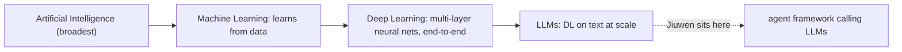

<details>
<summary>Anchors</summary>

<sub><strong>Anchors:</strong><br>&bull; <code>agent-core/openjiuwen/core/foundation/llm/model_clients/</code> — API clients calling hosted LLMs (DL output)<br>&bull; <code>agent-core/openjiuwen/agent_evolving/agent_rl/</code> — SFT/PPO/GRPO training subsystem; the only place the framework touches DL training</sub>

</details>

<sub>_Canonical source: `source/ai-engineer-levelled-interview-questions_for_engineers.md`._</sub>

---

## 2. What is supervised vs unsupervised vs reinforcement learning?

**General:** Supervised: labelled `(x, y)` pairs; the model learns `f(x)→y` by minimising prediction loss. Examples: classification, regression, NER. Unsupervised: no labels; the model discovers structure in the data — clusters, embeddings, density. Examples: k-means, PCA, autoencoders, contrastive embedding training. Reinforcement learning: an agent takes actions in an environment, receives scalar reward signals, and learns a policy that maximises cumulative reward — no labelled correct action. Examples: game-playing agents, RLHF for LLM alignment. LLM training combines all three: self-supervised pre-training (structurally supervised but labels come from the data itself), SFT (supervised), RLHF (RL).

**Jiuwen:** All three appear in the framework. The model clients call LLMs pre-trained with self-supervised next-token prediction. `agent_rl/` runs SFT (supervised) and PPO/GRPO (RL). Embedding models in the retrieval layer use contrastive loss (unsupervised/self-supervised). The evaluation harness tracks supervised validation metrics.

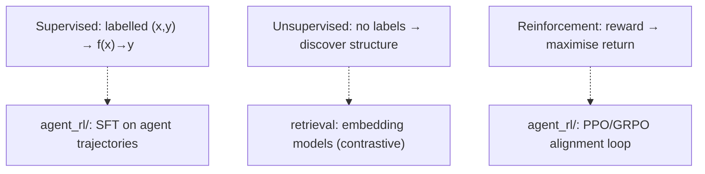

<details>
<summary>Anchors</summary>

<sub><strong>Anchors:</strong><br>&bull; <code>agent-core/openjiuwen/agent_evolving/agent_rl/</code> — SFT + PPO/GRPO training<br>&bull; <code>agent-core/openjiuwen/core/retrieval/retriever/vector_retriever.py</code> — embedding-based retrieval (unsupervised representation)</sub>

</details>

<sub>_Canonical source: `source/ai-engineer-levelled-interview-questions_for_engineers.md`._</sub>

---

## 3. What is the bias-variance tradeoff?

**General:** Every model's generalisation error decomposes into: bias (error from wrong assumptions — underfitting, model too simple), variance (error from sensitivity to training set fluctuations — overfitting, model too complex), and irreducible noise. High bias: model misses patterns. High variance: model fits noise. Reducing bias by adding complexity tends to increase variance and vice versa. The goal is to minimise total expected error. In modern large models, "double descent" complicates the classic picture: very high-capacity models can re-enter a low-variance regime with enough data and regularisation — which is why LLMs generalise despite billions of parameters.

**Jiuwen:** Not directly implemented in the inference framework. In `agent_rl/`, the tradeoff manifests as a hyperparameter concern: learning rate, regularisation strength (weight decay), and SFT epoch count all control where on the bias-variance curve the fine-tuned model lands. `agent_evolving/eval/` tracks the signal (train vs validation metric divergence).

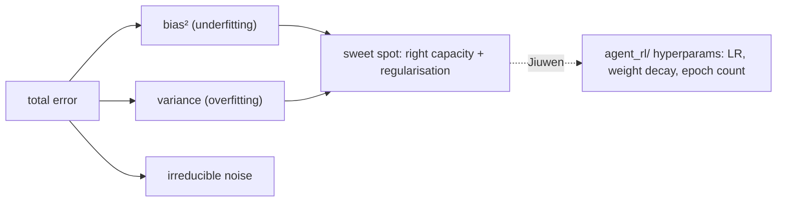

<details>
<summary>Anchors</summary>

<sub><strong>Anchors:</strong><br>&bull; <code>agent-core/openjiuwen/agent_evolving/agent_rl/</code> — training hyperparams controlling the bias-variance balance<br>&bull; <code>agent-core/openjiuwen/agent_evolving/eval/</code> — validation metrics to detect divergence</sub>

</details>

**Gap.** Not present in the inference framework. A hyperparameter-level concern in the training subsystem.

<sub>_Canonical source: `source/ai-engineer-levelled-interview-questions_for_engineers.md`._</sub>

---

## 4. What is the difference between a parameter and a hyperparameter?

**General:** Parameters are the learned weights of the model — the numbers changed during training via gradient descent (`W`, `b` in a linear layer; attention projection matrices in a transformer). Training data determines their values. Hyperparameters are the configuration choices made before or during training that the training process does not change: learning rate, batch size, number of layers, dropout rate, regularisation coefficient, training epochs, LoRA rank. A common source of confusion: context window size, temperature, and top-p are inference-time hyperparameters — they do not affect weights, only how the model generates at prediction time.

**Jiuwen:** Model weights are managed by PyTorch/veRL in `agent_rl/`. Inference-time hyperparameters (temperature, top-p, max tokens) are `ModelRequestConfig` fields. Training hyperparameters are `agent_rl/` config. Both are plain config fields — the framework makes no type distinction between them in its schema.

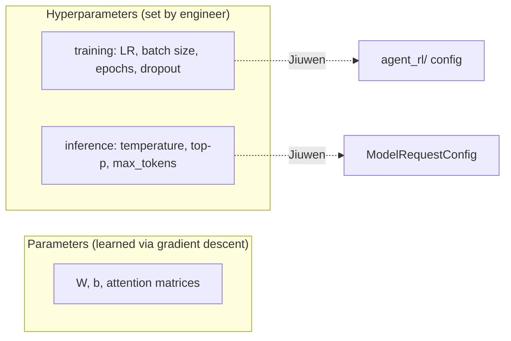

<details>
<summary>Anchors</summary>

<sub><strong>Anchors:</strong><br>&bull; <code>agent-core/openjiuwen/core/foundation/llm/schema/config.py</code> — <code>ModelRequestConfig</code>: temperature, top-p, max_tokens (inference hyperparams)<br>&bull; <code>agent-core/openjiuwen/agent_evolving/agent_rl/</code> — training hyperparams (LR, epochs, etc.)</sub>

</details>

<sub>_Canonical source: `source/ai-engineer-levelled-interview-questions_for_engineers.md`._</sub>

---

## 5. What is gradient descent, and how does it work?

**General:** An iterative optimisation algorithm that minimises a loss function by moving parameters in the direction of steepest descent. Each step: compute the loss, compute the gradient `∂L/∂w` for each parameter, subtract `learning_rate × gradient` from each parameter. Stochastic gradient descent (SGD) does this on a mini-batch rather than the full dataset — the gradient estimate is noisy but each step is cheap and often generalises better. Key variants: SGD with momentum (accumulates gradient history to reduce oscillation), Adam (adaptive per-parameter learning rates based on gradient moments).

```python
# Minimal implementation
def gradient_descent(loss_fn, grad_fn, params, lr=0.01, steps=100):
    for _ in range(steps):
        grads = grad_fn(params)
        params = [p - lr * g for p, g in zip(params, grads)]
    return params
```

**Jiuwen:** Gradient descent lives in the training stack: `agent_rl/` runs SFT and PPO/GRPO through veRL, which manages the optimisation loop with PyTorch `Optimizer.step()`. The agent framework delegates optimisation to veRL/PyTorch.

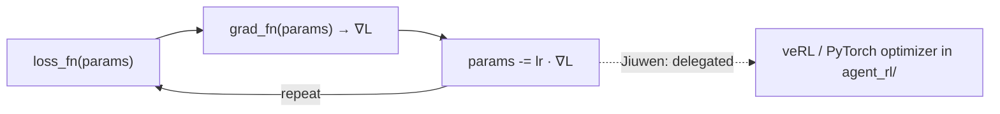

<details>
<summary>Anchors</summary>

<sub><strong>Anchors:</strong><br>&bull; <code>agent-core/openjiuwen/agent_evolving/agent_rl/</code> — SFT + PPO/GRPO; optimiser loop managed by veRL<br>&bull; <code>agent-core/openjiuwen/core/foundation/llm/model_clients/</code> — inference path; no gradient code</sub>

</details>

**Gap.** Absent from the inference layer. Present as a delegated call to veRL/PyTorch in the training subsystem.

<sub>_Canonical source: `source/real-interview-ai-engineer-4rounds_for_engineers.md`; also covered in: levelled._</sub>

---

## 6. Compute cosine similarity between two vectors without using a library

**General:** Cosine similarity = `dot(A, B) / (|A| × |B|)`. The dot product measures shared direction; dividing by the product of magnitudes normalises to `[-1, 1]`, making the result length-independent. In retrieval, pre-normalising all vectors to unit length reduces cosine similarity to a plain dot product, which is cheaper to compute at scale.

```python
import math

def cosine_similarity(a: list[float], b: list[float]) -> float:
    dot   = sum(x * y for x, y in zip(a, b))
    mag_a = math.sqrt(sum(x ** 2 for x in a))
    mag_b = math.sqrt(sum(x ** 2 for x in b))
    if mag_a == 0 or mag_b == 0:
        return 0.0
    return dot / (mag_a * mag_b)
```

Edge cases: zero vectors, dimension mismatch, floating-point underflow on very small magnitudes.

**Jiuwen:** Not hand-coded. Vector similarity queries go through the vector store (Milvus, Chroma, or similar), which computes cosine/IP/L2 internally. `IndexConfig` accepts a `metric_type` parameter. No custom dot-product or magnitude code exists in the framework.

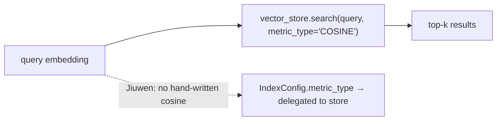

<details>
<summary>Anchors</summary>

<sub><strong>Anchors:</strong><br>&bull; <code>agent-core/openjiuwen/core/retrieval/common/config.py:56</code> — <code>IndexConfig</code> with <code>metric_type</code><br>&bull; <code>agent-core/openjiuwen/core/retrieval/vector_store/</code> — search delegated to backing store</sub>

</details>

**Gap.** No hand-written similarity code. Metric is a configuration parameter forwarded to the vector store.

<sub>_Canonical source: `source/real-interview-ai-engineer-4rounds_for_engineers.md`._</sub>

---

## 7. Given a confusion matrix, calculate precision, recall, and F1 manually

**General:** For a binary classifier `[[TN, FP], [FN, TP]]`:
- Precision = TP / (TP + FP) — of predicted positives, how many were actually positive
- Recall = TP / (TP + FN) — of all actual positives, how many were caught
- F1 = 2 × (Precision × Recall) / (Precision + Recall) — harmonic mean, penalises imbalance

```python
def prf1(tp, fp, fn):
    precision = tp / (tp + fp) if (tp + fp) else 0.0
    recall    = tp / (tp + fn) if (tp + fn) else 0.0
    f1 = (2 * precision * recall / (precision + recall)
          if (precision + recall) else 0.0)
    return precision, recall, f1
```

For multi-class: compute per-class TP/FP/FN from the confusion matrix rows/columns, then macro-average (equal weight per class) or weight by support.

**Jiuwen:** `agent_evolving/eval/` computes precision, recall, and F1 for retrieval evaluation. The framework does not hand-implement the confusion-matrix arithmetic; it uses standard library helpers. The one true classifier in the framework is `AutoModelForSequenceClassification` in the guardrail layer, evaluated externally.

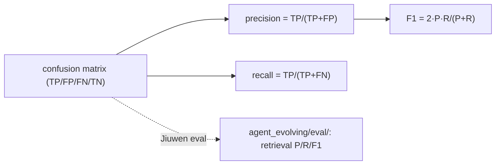

<details>
<summary>Anchors</summary>

<sub><strong>Anchors:</strong><br>&bull; <code>agent-core/openjiuwen/agent_evolving/eval/</code> — evaluation framework; retrieval-level P/R/F1<br>&bull; <code>agent-core/openjiuwen/core/security/guardrail/backends.py</code> — <code>AutoModelForSequenceClassification</code>: the one true classifier</sub>

</details>

<sub>_Canonical source: `source/real-interview-ai-engineer-4rounds_for_engineers.md`._</sub>

---

## 8. Implement k-nearest neighbors from scratch

**General:** KNN at inference: store all training points, then for a new query: (1) compute distance from the query to every training point, (2) sort by distance, (3) take the k smallest, (4) return majority class (classification) or mean (regression). KNN is lazy — no training cost, all cost at inference, O(n·d) per query without indexing. Sensitive to feature scale (normalise first) and irrelevant dimensions. ANN indexes (HNSW, IVF) replicate the nearest-neighbour idea at scale.

```python
from collections import Counter

def knn_predict(train_X, train_y, query, k=3):
    distances = [
        (sum((a - b) ** 2 for a, b in zip(query, x)) ** 0.5, y)
        for x, y in zip(train_X, train_y)
    ]
    distances.sort(key=lambda d: d[0])
    neighbors = [y for _, y in distances[:k]]
    return Counter(neighbors).most_common(1)[0][0]
```

**Jiuwen:** k-NN shows up as vector retrieval rather than a classifier: `VectorRetriever` performs top-k approximate nearest-neighbour search over embedding space via the vector store's index. The embedding retrieval pipeline is the direct instantiation of the concept.

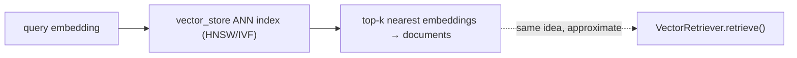

<details>
<summary>Anchors</summary>

<sub><strong>Anchors:</strong><br>&bull; <code>agent-core/openjiuwen/core/retrieval/retriever/vector_retriever.py</code> — <code>VectorRetriever</code>; top-k ANN search<br>&bull; <code>agent-core/openjiuwen/core/retrieval/vector_store/</code> — backing ANN index</sub>

</details>

**Gap.** No KNN classifier. The retrieval layer is the conceptual equivalent (approximate top-k over embedding space).

<sub>_Canonical source: `source/real-interview-ai-engineer-4rounds_for_engineers.md`._</sub>

---

## 9. Explain forward pass and backpropagation in a neural network

**General:** The forward pass flows inputs through layers, applying learned weights and non-linearities, to produce a prediction and a scalar loss. Backpropagation then applies the chain rule backwards through every layer: `∂L/∂w = ∂L/∂output × ∂output/∂w` for each weight. PyTorch's autograd engine records the computation graph during the forward pass and traverses it in reverse during `.backward()`, accumulating `w.grad`. The optimiser then applies `w -= lr × w.grad`.

**Jiuwen:** Backpropagation is handled by the training stack: `agent_rl/` runs veRL's SFT and PPO/GRPO loops, which use PyTorch's standard autograd. The framework delegates the backward pass to PyTorch.

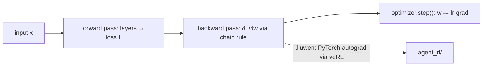

<details>
<summary>Anchors</summary>

<sub><strong>Anchors:</strong><br>&bull; <code>agent-core/openjiuwen/agent_evolving/agent_rl/rl_trainer/ppo_step.py:146</code> — <code>update_actor</code>; autograd delegated to veRL/PyTorch<br>&bull; <code>agent-core/openjiuwen/agent_evolving/agent_rl/online/backends/sft/trainer.py</code> — SFT training; backprop via PyTorch</sub>

</details>

**Gap.** Absent from inference layer. Present as a delegated PyTorch call in training.

<sub>_Canonical source: `source/real-interview-ai-engineer-4rounds_for_engineers.md`; also covered in: levelled._</sub>

---

## 10. What is vanishing/exploding gradient, and how do you fix it?

**General:** In deep networks, gradients are products of many Jacobians chained together. Eigenvalues consistently below 1 → gradients shrink exponentially toward early layers (vanishing) — early weights stop learning. Eigenvalues consistently above 1 → gradients grow exponentially (exploding) — NaN weights.

Fixes:
- **Vanishing:** ReLU activations (no saturation in the positive range), residual connections (add an identity gradient path), layer norm, careful initialisation (He/Xavier)
- **Exploding:** Gradient clipping (`torch.nn.utils.clip_grad_norm_`), lower learning rate, same normalisation layers

Transformers largely avoid both through residual connections and layer norm at every block.

**Jiuwen:** Gradient clipping is a training-side hyperparameter in `agent_rl/` (veRL/PyTorch). At inference, hosted models handle it internally.

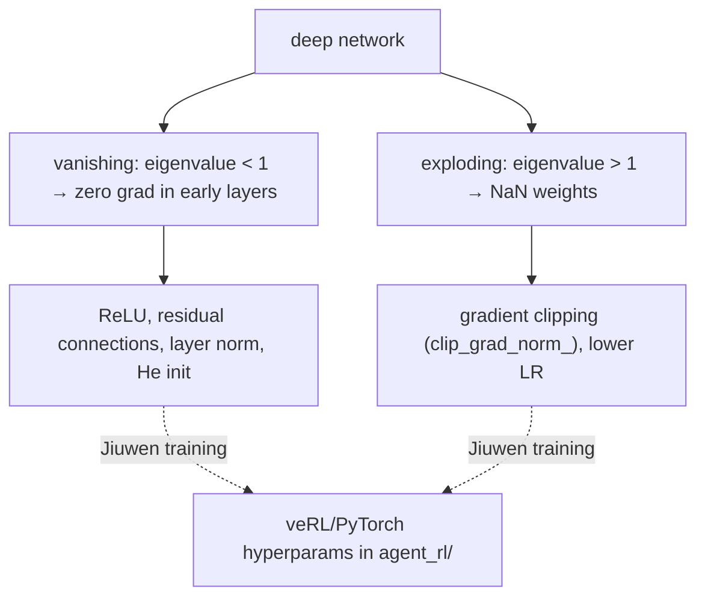

<details>
<summary>Anchors</summary>

<sub><strong>Anchors:</strong><br>&bull; <code>agent-core/openjiuwen/agent_evolving/agent_rl/</code> — training hyperparams including gradient clip settings, delegated to veRL</sub>

</details>

**Gap.** Absent from inference layer. A configuration concern in the training subsystem.

<sub>_Canonical source: `source/real-interview-ai-engineer-4rounds_for_engineers.md`; also covered in: levelled._</sub>

---

## 11. What is the difference between batch normalization and layer normalization?

**General:** Batch normalisation normalises across the batch dimension — mean and variance computed over all examples in the batch, per feature. Requires a reasonable batch size for stable statistics. Effective in CNNs and feedforward networks; struggles with small batches, variable-length sequences, and batch size 1 at inference.

Layer normalisation normalises across the feature dimension — mean and variance computed over all features for a single example. Independent of batch size and sequence length. The standard in Transformer architectures. Every Transformer block uses layer norm before or after the attention and FFN sub-layers.

Rule of thumb: CNNs → batch norm. Transformers, RNNs, LLMs → layer norm. Small batch or variable-length sequence? Always layer norm.

**Jiuwen:** Batch/layer normalization is part of the served model: hosted models apply it internally, and local `AutoModelForCausalLM` uses whatever norm the architecture specifies. It is a model-layer concern, not a framework one.

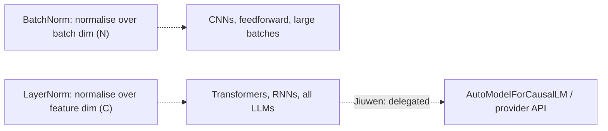

<details>
<summary>Anchors</summary>

<sub><strong>Anchors:</strong><br>&bull; <code>agent-core/openjiuwen/symphony/retrieval/llm/transformers_prefix_cached_generation/client.py:175</code> — <code>AutoModelForCausalLM.from_pretrained</code>; norm choice delegated to model architecture</sub>

</details>

**Gap.** Absent. Delegated entirely to model internals.

<sub>_Canonical source: `source/real-interview-ai-engineer-4rounds_for_engineers.md`; also covered in: levelled._</sub>

---

## 12. What is dropout, and why does it help generalisation?

**General:** Dropout randomly zeroes each neuron's activation with probability `p` (typically 0.1–0.5) on each forward pass during training. At inference, dropout is disabled and activations are scaled by `1/(1-p)` (inverted dropout). Why it works: by randomly removing neurons, the network cannot co-adapt (learn to rely on specific neurons to compensate for each other's mistakes in a memorisation-specific way) and is forced to learn redundant, distributed representations. The effect is similar to training an ensemble of `2^n` thinned networks and averaging them at inference. In transformers, dropout is applied to attention weights, FFN layers, and embeddings. In LoRA fine-tuning, dropout on the low-rank matrices is a key regularisation knob.

**Jiuwen:** Dropout is a training-side hyperparameter: in `agent_rl/` it is forwarded to veRL/PyTorch, and for LoRA fine-tuning it is a PEFT adapter config parameter. At inference, the served model applies whatever dropout it was trained with.

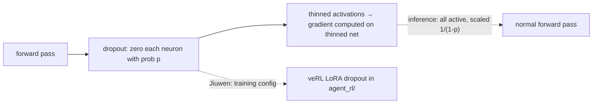

<details>
<summary>Anchors</summary>

<sub><strong>Anchors:</strong><br>&bull; <code>agent-core/openjiuwen/agent_evolving/agent_rl/</code> — dropout rate as a training hyperparameter forwarded to veRL</sub>

</details>

**Gap.** Absent from inference layer. A training hyperparameter in `agent_rl/`.

<sub>_Canonical source: `source/ai-engineer-levelled-interview-questions_for_engineers.md`._</sub>

---

## 13. What is the difference between CNNs and RNNs, and when would you use each?

**General:** Convolutional Neural Networks (CNNs) apply learned filters spatially using shared weights — translation-invariant and efficient for structured grid data (images, audio spectrograms, 1D signals). Not designed for variable-length sequential dependencies. Recurrent Neural Networks (RNNs, LSTMs, GRUs) process sequences step by step, maintaining a hidden state. Designed for sequential data where order matters and length varies: time series, text (pre-transformer), audio frames. Weakness: the hidden state is a bottleneck for long sequences; vanishing gradients make long-range dependencies hard. Transformers have largely replaced RNNs for text because attention can directly attend to any position. CNNs remain dominant for image tasks.

**Jiuwen:** These architectures live in the served models: text is handled by transformer LLMs via provider APIs, and image inputs by a vision encoder (typically a ViT) in multimodal models. The agent framework itself does not implement CNN or RNN layers.

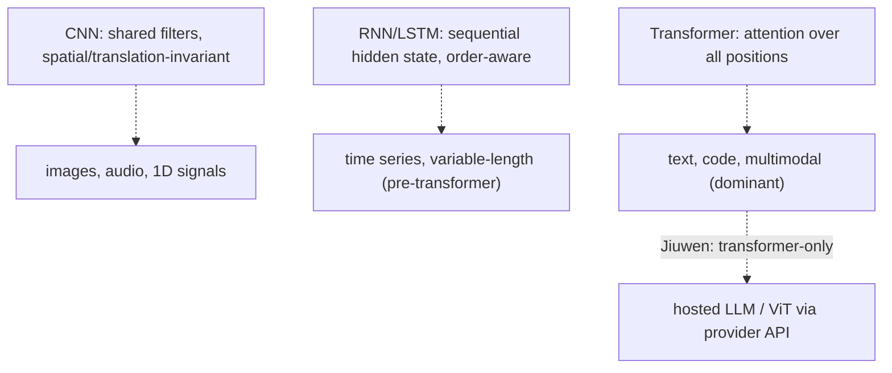

<details>
<summary>Anchors</summary>

<sub><strong>Anchors:</strong><br>&bull; <code>agent-core/openjiuwen/core/foundation/llm/model_clients/</code> — calls transformer-based LLMs; no CNN/RNN code</sub>

</details>

**Gap.** Neither CNNs nor RNNs are present. The framework is transformer-only at the model layer.

<sub>_Canonical source: `source/ai-engineer-levelled-interview-questions_for_engineers.md`._</sub>

---

## 14. What is transfer learning, and when is it useful?

**General:** Transfer learning uses a model trained on one task or dataset as the starting point for a different but related task, rather than training from scratch. Two forms: (1) feature extraction — freeze pre-trained weights, train a new task-specific head; (2) fine-tuning — continue training all or some pre-trained weights on the new task's data. Useful almost always when labelled data for the target task is limited, when compute budget is constrained, or when source and target domains are related. In the LLM context, every use of a foundation model (GPT-4, LLaMA, Claude) is transfer learning. SFT and LoRA/PEFT are explicit transfer learning from a base model to a narrower task.

**Jiuwen:** The framework is built entirely on transfer learning. Model clients call pre-trained LLMs for all reasoning (feature extraction). `agent_rl/` performs fine-tuning (SFT + PPO/GRPO via veRL) — transfer learning from the base LLM to an agent-specific policy. LoRA adapters in `agent_rl/` are the parameter-efficient fine-tuning variant.

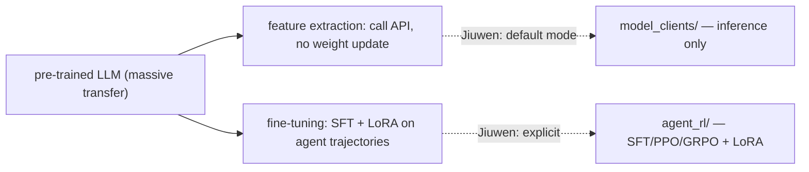

<details>
<summary>Anchors</summary>

<sub><strong>Anchors:</strong><br>&bull; <code>agent-core/openjiuwen/core/foundation/llm/model_clients/</code> — feature extraction (calling pre-trained LLMs)<br>&bull; <code>agent-core/openjiuwen/agent_evolving/agent_rl/</code> — SFT + PPO/GRPO; explicit fine-tuning / transfer learning</sub>

</details>

<sub>_Canonical source: `source/ai-engineer-levelled-interview-questions_for_engineers.md`._</sub>

---

## 15. How do you evaluate a classification model beyond accuracy?

**General:** Accuracy is misleading on imbalanced datasets — a classifier that always predicts the majority class achieves 95% accuracy on a 95/5 split. Richer metrics:
- **Precision / Recall / F1** — precision = TP/(TP+FP); recall = TP/(TP+FN); F1 = harmonic mean. Precision matters when false positives are costly (spam filters); recall when false negatives are costly (cancer screening).
- **Confusion matrix** — reveals per-class error patterns and which classes are being confused.
- **ROC-AUC** — area under the ROC curve; measures ranking quality across all thresholds. Threshold-independent.
- **PR-AUC** — area under the Precision-Recall curve; better than ROC-AUC for severely imbalanced data.
- **Log loss / cross-entropy** — penalises confident wrong predictions; measures calibration.
- **Calibration curve** — do predicted probabilities reflect actual event rates?

For multi-class: macro-averaged (equal weight per class) vs micro-averaged (proportional to frequency) vs weighted-average metrics each tell different stories.

**Jiuwen:** `agent_evolving/eval/` computes retrieval-level P/R/F1. Generation evaluation uses LLM-judge and NLI-model scores, not classification metrics. The one classifier in the framework is the guardrail (`AutoModelForSequenceClassification`), evaluated externally.

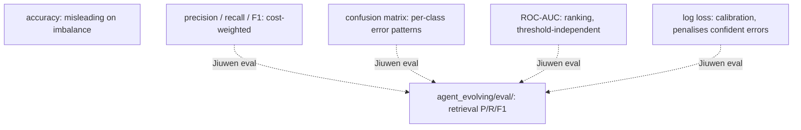

<details>
<summary>Anchors</summary>

<sub><strong>Anchors:</strong><br>&bull; <code>agent-core/openjiuwen/agent_evolving/eval/</code> — P/R/F1 at retrieval level<br>&bull; <code>agent-core/openjiuwen/core/security/guardrail/backends.py</code> — <code>AutoModelForSequenceClassification</code></sub>

</details>

<sub>_Canonical source: `source/ai-engineer-levelled-interview-questions_for_engineers.md`._</sub>

---

## 16. What is cross-validation, and why does it matter?

**General:** Cross-validation estimates how well a model generalises when you have limited data. In k-fold CV: split data into k equal folds; train on k-1 folds and evaluate on the held-out fold; repeat k times rotating the held-out fold; average the k evaluation scores. The result is a low-variance generalisation estimate that uses every sample for both training and evaluation. Why it matters: a single train/test split gives a noisy estimate dependent on which examples landed in the test set. CV reduces that variance. Essential for honest hyperparameter tuning — tuning on a fixed held-out set leaks information and overfits the hyperparameters to that specific split. In the LLM context: rarely used on the full model (too expensive) but used when fine-tuning on small datasets via `agent_rl/`.

**Jiuwen:** Not present in the inference framework. The evaluation harness (`agent_evolving/eval/`) does not implement k-fold CV. Evaluation runs on a fixed held-out eval set. Cross-validation would be a concern for users fine-tuning on small datasets via `agent_rl/`.

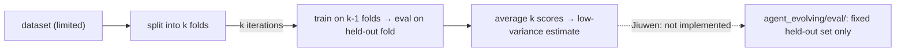

<details>
<summary>Anchors</summary>

<sub><strong>Anchors:</strong><br>&bull; <code>agent-core/openjiuwen/agent_evolving/eval/</code> — evaluation harness; fixed split, no CV</sub>

</details>

**Gap.** Not implemented. A concern for users fine-tuning on small datasets via `agent_rl/`.

<sub>_Canonical source: `source/ai-engineer-levelled-interview-questions_for_engineers.md`._</sub>

---

## 17. What is overfitting, and how do you prevent it?

**General:** Overfitting occurs when a model learns the training data too well — including noise and idiosyncrasies — and fails to generalise to unseen examples. Training loss decreases but validation loss increases (the classic divergence signal). Prevention:
- **More data / augmentation** — the most reliable fix
- **Regularisation** — L2 (weight decay) penalises large weights; L1 encourages sparsity; dropout randomly zeroes activations
- **Early stopping** — stop when validation loss stops improving
- **Reduce model capacity** — smaller architecture or fewer fine-tuned parameters (LoRA)
- **Cross-validation** — ensures evaluation is not from a lucky split

In LLM fine-tuning: use LoRA/PEFT to reduce trainable parameters; keep fine-tuning steps conservative; monitor validation perplexity.

**Jiuwen:** Not a concern in the inference framework. In `agent_rl/`, training hyperparameters (weight decay, dropout, early stopping via epoch limits) are configuration parameters forwarded to veRL. The offline RL trainer has real train/val validation pipeline; the SFT path notably has no held-out validation.

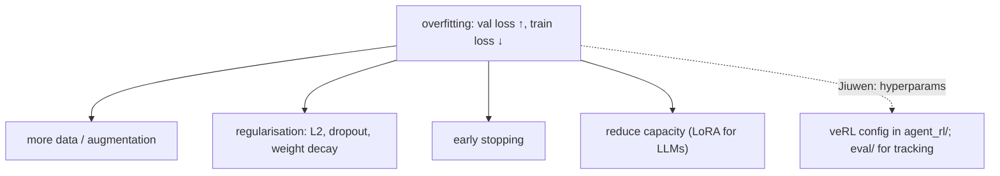

<details>
<summary>Anchors</summary>

<sub><strong>Anchors:</strong><br>&bull; <code>agent-core/openjiuwen/agent_evolving/agent_rl/</code> — training hyperparams including weight decay, dropout, epoch limits<br>&bull; <code>agent-core/openjiuwen/agent_evolving/eval/</code> — validation metric tracking</sub>

</details>

**Gap.** Not a concern in the inference framework. Configuration-level in the training subsystem. SFT path has no held-out validation.

<sub>_Canonical source: `source/real-interview-ai-engineer-4rounds_for_engineers.md`; also covered in: levelled._</sub>

---

## 18. Why does the Transformer use multi-head attention instead of a single head?

**General:** A single attention head learns one type of relationship simultaneously — for example, syntactic dependency or positional proximity. Multiple heads run in parallel on lower-dimensional projections, each free to specialise on different relationship types: one head may track subject-verb agreement, another coreference, another relative position. Concatenating and projecting the outputs lets the model integrate all those signals. The compute cost is equivalent to one full-dimensional head (because `d_model` splits into `h × d_k` heads), but the representational expressivity is higher. Evidence: ablating individual heads degrades performance on different tasks depending on which head was removed.

**Jiuwen:** Multi-head attention is entirely the served model's job — provider APIs or HuggingFace weights loaded by name. The framework exposes no number-of-heads configuration; this entry covers the architectural motivation rather than the mechanics.

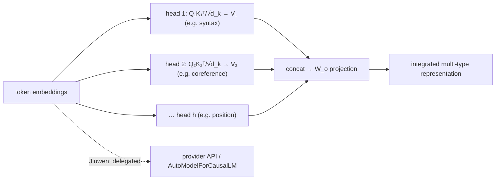

<details>
<summary>Anchors</summary>

<sub><strong>Anchors:</strong><br>&bull; <code>agent-core/openjiuwen/core/foundation/llm/schema/config.py:13</code> — <code>ProviderType</code>; no head-count configuration<br>&bull; <code>agent-core/openjiuwen/symphony/retrieval/llm/transformers_prefix_cached_generation/client.py:175</code> — <code>AutoModelForCausalLM.from_pretrained</code>; architecture delegated</sub>

</details>

**Gap.** Absent. No number-of-heads configuration; attention architecture fully delegated.

<sub>_Canonical source: `source/real-interview-ai-engineer-4rounds_for_engineers.md`; also covered in: levelled._</sub>

---
