# LLM foundations

15 unique questions, deduplicated from the archived docs. Each `##` is one question; identical questions from other docs were merged. Full source files are in `source/`.

## 1. What's the difference between a token and a word?

**General:** A token is the model's atomic unit — typically a sub-word produced by a BPE/unigram vocabulary — so one word may be one or several tokens, and rare/long words and code fragment heavily. This is also why models miscount letters and struggle with character-level tasks.

**Jiuwen:** The framework counts **tokens**, never words, via a pluggable `TokenCounter`: `TiktokenCounter` maps known model names to tiktoken encodings (falling back to `cl100k_base` for unknown models), and `TiktokenModelCounter` loads a model-native BPE vocabulary. `TokenizerManager` downloads HuggingFace/tiktoken artifacts per model/family.

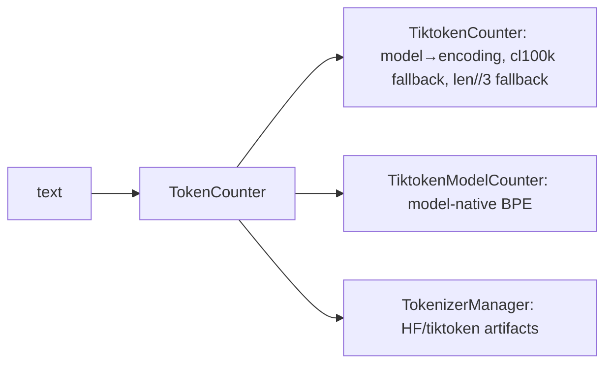

<details>
<summary>Anchors</summary>

<sub><strong>Anchors:</strong><br>&bull; <code>agent-core/openjiuwen/core/context_engine/token/tiktoken_counter.py:212</code> — <code>TiktokenCounter</code>; <code>:225</code> model→encoding map; <code>:287</code> <code>count()</code> with <code>len(text)//3</code> fallback<br>&bull; <code>agent-core/openjiuwen/core/context_engine/token/tiktoken_model_counter.py:86</code> — model-native tiktoken BPE<br>&bull; <code>agent-core/openjiuwen/core/context_engine/token/tokenizer_spec.py:34</code> — <code>TokenizerSpec</code>; <code>:50</code> fallback policy chain<br>&bull; <code>agent-core/openjiuwen/core/context_engine/token/tokenizer_manager.py:60</code> — resolves/downloads tokenizer artifacts</sub>

</details>

<sub>_Canonical source: `source/llm-fundamentals-interview-questions_for_engineers.md`; also covered in: engineering, genai, llm-fund._</sub>

---

## 2. Why does tokenization affect cost and context limits

**General:** Cost and context limits are measured in tokens, not words, so a language or domain that fragments more costs more per word and fills the window faster. The same token count drives when history must be compacted or tool output offloaded.

**Jiuwen:** Token counts drive per-model context limits (`MODEL_DEFAULT_CONTEXT_WINDOW_TOKENS`, default 200,000), compression/offload thresholds, and cost via provider-reported `usage_metadata` (`input_tokens`/`output_tokens`/cache/reasoning tokens). Retrieval chunking is also token-based.

<details>
<summary>Anchors</summary>

<sub><strong>Anchors:</strong><br>&bull; <code>agent-core/openjiuwen/core/context_engine/context/context_utils.py:20</code> — <code>DEFAULT_CONTEXT_MAX_TOKENS = 200000</code><br>&bull; <code>agent-core/openjiuwen/core/context_engine/processor/offloader/tool_result_budget_processor.py:34</code> — per-round token budget<br>&bull; <code>agent-core/openjiuwen/core/context_engine/token/tiktoken_counter.py:287</code> — <code>count()</code> drives limits/cost<br>&bull; <code>agent-core/openjiuwen/core/foundation/llm/schema/message.py:28</code> — <code>total_tokens</code> usage metadata</sub>

</details>

<sub>_Canonical source: `source/llm-fundamentals-interview-questions_for_engineers.md`; also covered in: engineering, genai, llm-fund._</sub>

---

## 3. What is the difference between tokens and embeddings?

**General:** A token is a unit of text (a sub-word piece) — the input/output alphabet of the model. An embedding is a vector representation of text that encodes meaning, used for similarity search. Tokens are discrete and count against cost/context; embeddings are continuous and live in a vector space. You embed chunks/tokens, but they are different abstractions.

**Jiuwen:** Tokens are counted by a pluggable `TokenCounter` (an ABC; the tiktoken-backed `TiktokenCounter` drives limits/cost); embeddings are produced by the `Embedding` ABC and compared in a vector store. The two are independent: the tokenizer sets chunk sizes, the embedder sets vector dimension.

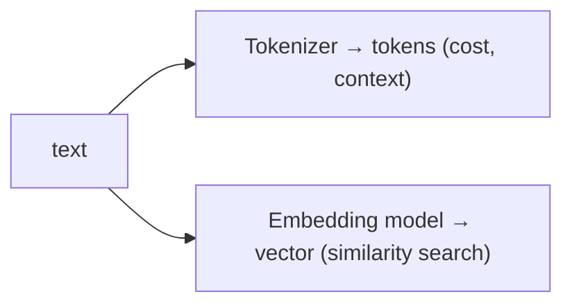

<details>
<summary>Anchors</summary>

<sub><strong>Anchors:</strong><br>&bull; <code>agent-core/openjiuwen/core/context_engine/token/tiktoken_counter.py:212</code> — <code>TiktokenCounter</code>; <code>:287</code> fallback<br>&bull; <code>agent-core/openjiuwen/core/foundation/store/base_embedding.py:24</code> — <code>Embedding</code> ABC; <code>:29</code> <code>embed_query</code><br>&bull; <code>agent-core/openjiuwen/core/retrieval/indexing/indexer/embed_chunks.py:46</code> — <code>embed_documents</code></sub>

</details>

<sub>_Canonical source: `source/llm-applied-interview-questions_for_engineers.md`; also covered in: llm-applied._</sub>

---

## 4. Explain how self-attention works in a transformer

**General:** Each token is projected into three vectors — query, key, value. The query of a token is dot-producted with the keys of all tokens (scaled by `1/√d_k`), softmaxed into attention weights, and used to take a weighted sum of the values. Doing this with multiple heads in parallel and stacking layers lets each token aggregate information from every other token, with the weights computed from content rather than position. The result is a context-dependent representation per token.

**Jiuwen:** Not implemented — attention is delegated entirely to provider APIs or to HuggingFace models loaded by name. There is no Q/K/V projection, scaled dot-product, or multi-head code anywhere; the only `torch.softmax` in the framework is used for token sampling, not attention. The framework's boundary is the model-client/config layer, which serializes request params and sends them to a provider; the local `transformers` client calls `AutoModelForCausalLM` and consumes logits.

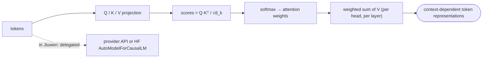

<details>
<summary>Anchors</summary>

<sub><strong>Anchors:</strong><br>&bull; <code>agent-core/openjiuwen/core/foundation/llm/schema/config.py:13</code> — <code>ProviderType</code> enum: the model-client provider boundary, no architecture logic<br>&bull; <code>agent-core/openjiuwen/core/foundation/llm/model_clients/openai_model_client.py:865</code> — builds hosted request params, delegates computation<br>&bull; <code>agent-core/openjiuwen/symphony/retrieval/llm/transformers_logit_selection/client.py:227</code> — <code>torch.no_grad()</code> forward; logit extraction only, no attention code<br>&bull; <code>agent-core/openjiuwen/symphony/retrieval/llm/transformers_prefix_cached_generation/client.py:175</code> — <code>AutoModelForCausalLM.from_pretrained(...)</code>; attention delegated<br>&bull; <code>agent-core/openjiuwen/symphony/retrieval/llm/transformers_prefix_cached_generation/generation.py:527</code> — <code>torch.softmax(...)</code> is sampling, not attention</sub>

</details>

**Gap.** Absent. The closest abstractions are `ModelClientConfig`/`ModelRequestConfig` (provider boundary) and the HF `AutoModelForCausalLM` load.

<sub>_Canonical source: `source/llm-fundamentals-interview-questions_for_engineers.md`; also covered in: engineering, genai, llm-fund._</sub>

---

## 5. What is positional encoding, and why do transformers need it if attention has no inherent sense of order

**General:** Self-attention is permutation-equivariant — without positional information it cannot distinguish token order, so "dog bites man" and "man bites dog" yield the same multiset of token representations, only reordered (not one identical output). Positional encoding injects order information — by adding a position-dependent signal to the token representations (sinusoidal/learned), or by rotating the query and key vectors inside attention (RoPE) — so the attention scores can depend on relative or absolute position. Without it the model cannot know sequence order.

**Jiuwen:** No positional-encoding implementation exists — no sinusoidal, learned, or RoPE code. The only positional-adjacent items are passthrough configuration: `attn_implementation` forwarded to HuggingFace and `rope_scaling_type`/`rope_scaling_factor` forwarded as vLLM engine args. In the RL data pipeline, `position_ids` are computed for padded training batches, which is batching metadata rather than an encoding scheme.

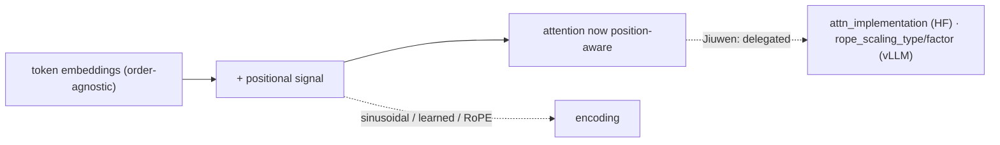

<details>
<summary>Anchors</summary>

<sub><strong>Anchors:</strong><br>&bull; <code>agent-core/openjiuwen/symphony/retrieval/llm/config.py:88</code> — <code>attn_implementation: str = ""</code> (HF passthrough)<br>&bull; <code>agent-core/openjiuwen/symphony/retrieval/llm/transformers_prefix_cached_generation/client.py:171</code> — <code>model_kwargs["attn_implementation"]</code><br>&bull; <code>agent-core/openjiuwen/symphony/retrieval/search/service/serving.py:42</code> — <code>rope_scaling_type</code> / <code>rope_scaling_factor</code> vLLM defaults<br>&bull; <code>agent-core/openjiuwen/symphony/retrieval/llm/vllm/client.py:584</code> — rope scaling passed through<br>&bull; <code>agent-core/openjiuwen/agent_evolving/agent_rl/offline/coordinator/batch_builder.py:175</code> — <code>position_ids</code> from <code>cumsum(attention_mask)</code> (padding metadata)</sub>

</details>

**Gap.** Absent. Closest = passthrough config (`attn_implementation`, `rope_scaling_*`).

<sub>_Canonical source: `source/llm-fundamentals-interview-questions_for_engineers.md`; also covered in: llm-fund._</sub>

---

## 6. What's the difference between an encoder-only, decoder-only, and encoder-decoder model, and where does GPT fit

**General:** Encoder-only models (BERT) read bidirectional context and produce representations — good for classification, embedding, extraction. Decoder-only models (GPT) are autoregressive: they predict the next token attending only leftward, which makes them generators. Encoder-decoder models (T5, original Transformer) encode an input and generate an output, suited to translation/summarization. GPT is decoder-only.

**Jiuwen:** There is no architecture-type configuration, no `is_encoder_decoder`/`is_decoder` flag, and no encoder/decoder classification. Behavior is selected by **provider type** and **model-name string** (model-family patterns also drive reasoning/thinking wire protocols and tokenizer selection). The two HuggingFace classes named in the repo imply the intent: causal generation uses `AutoModelForCausalLM` (decoder-only), and guardrail classification uses `AutoModelForSequenceClassification` (typically an encoder-style classifier). GPT is handled purely as a provider/model name.

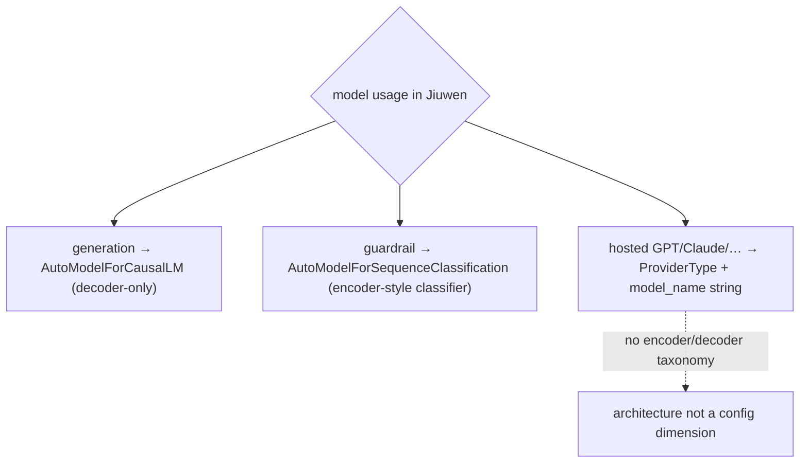

<details>
<summary>Anchors</summary>

<sub><strong>Anchors:</strong><br>&bull; <code>agent-core/openjiuwen/core/foundation/llm/schema/config.py:13</code> — <code>ProviderType</code>; architecture is not a config dimension<br>&bull; <code>agent-core/openjiuwen/core/foundation/llm/reasoning_profiles.py:100</code> — model-family patterns used for reasoning-protocol selection (not architecture)<br>&bull; <code>agent-core/openjiuwen/core/security/guardrail/backends.py:445</code> — <code>AutoModelForSequenceClassification</code><br>&bull; <code>agent-core/openjiuwen/core/security/guardrail/builtin.py:174</code> — <code>model_type</code> limited to <code>None | "bert" | "qwen"</code><br>&bull; <code>agent-core/openjiuwen/symphony/retrieval/llm/transformers_prefix_cached_generation/client.py:175</code> — <code>AutoModelForCausalLM</code> (decoder-only)<br>&bull; <code>agent-core/openjiuwen/symphony/retrieval/search/service/serving.py:35</code> — vLLM <code>architectures</code> string</sub>

</details>

<sub>_Canonical source: `source/llm-fundamentals-interview-questions_for_engineers.md`; also covered in: engineering, genai, llm-fund._</sub>

---

## 7. What's the difference between a model's context window and its training data cutoff

**General:** The context window is how many tokens the model can attend to at once (a capacity limit). The training data cutoff is the date after which the model has no knowledge (a temporal limit). A model can have a large window but an old cutoff — it can read a long document you paste but still not know events after its training date. Confusing the two leads to expecting up-to-date answers from a frozen model.

**Jiuwen:** Model metadata here is operational only: model name, provider, context-window token counts, output `max_tokens`, auth/endpoint. The context engine resolves a window size per model but never stores, prompts, or exposes a training-data cutoff or knowledge date. Nothing distinguishes "the model does not know X" from "the window does not fit X".

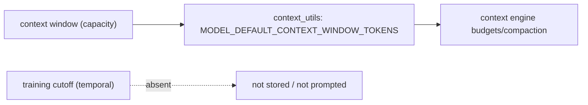

<details>
<summary>Anchors</summary>

<sub><strong>Anchors:</strong><br>&bull; <code>agent-core/openjiuwen/core/context_engine/context/context_utils.py:29</code> — builtin window table; <code>:275</code> <code>fetch_openrouter_model_context_window_tokens()</code> (window only)<br>&bull; <code>agent-core/openjiuwen/core/context_engine/schema/config.py:137</code> — <code>model_name</code>; <code>:139</code> <code>model_context_window_tokens</code><br>&bull; <code>agent-core/openjiuwen/core/foundation/llm/schema/config.py:209</code> — <code>model_name</code>; <code>:214</code> <code>max_tokens</code> (output cap)<br>&bull; <code>agent-core/openjiuwen/core/foundation/llm/schema/generation_response.py:20</code> — <code>created</code> timestamp (response, not cutoff)</sub>

</details>

**Gap.** Absent. No knowledge/training cutoff, knowledge date, or model-card release metadata anywhere; the closest is the model→window table and `ModelClientConfig`/`ModelRequestConfig`.

<sub>_Canonical source: `source/llm-fundamentals-interview-questions_for_engineers.md`; also covered in: llm-fund._</sub>

---

## 8. What happens when a conversation exceeds the model's context window

**General:** Either the provider rejects the request, or the framework must shrink the prompt before sending. Robust systems pre-empt it: count tokens, then drop/truncate oldest history, offload large tool outputs, and/or summarize old turns into a compact memory block, always preserving recent turns. The goal is to keep the prompt within budget without losing the information needed for the next step.

**Jiuwen:** On every `add_messages`/`get_context_window`, the context engine counts tokens with a model-aware tokenizer and runs passive processors: offloaders persist oversized tool results to `{workspace}/context/{session_id}_context/offload/` and replace them with `<persisted-output>` previews, while compressors trigger at ratio/token thresholds (`RoundLevelCompressor` at 0.9×budget, `FullCompactProcessor` at 180k) and rewrite history into summary/memory blocks. If the model still rejects the request, `ContextEngine.recover_from_model_exception` matches overflow phrases, force-runs compaction, and retries only if context actually changed. A hard `max_context_message_num` provides a last-resort FIFO drop. `effective_context_budget` is the strictest positive bound across configured window, per-call budget, and resolved model window.

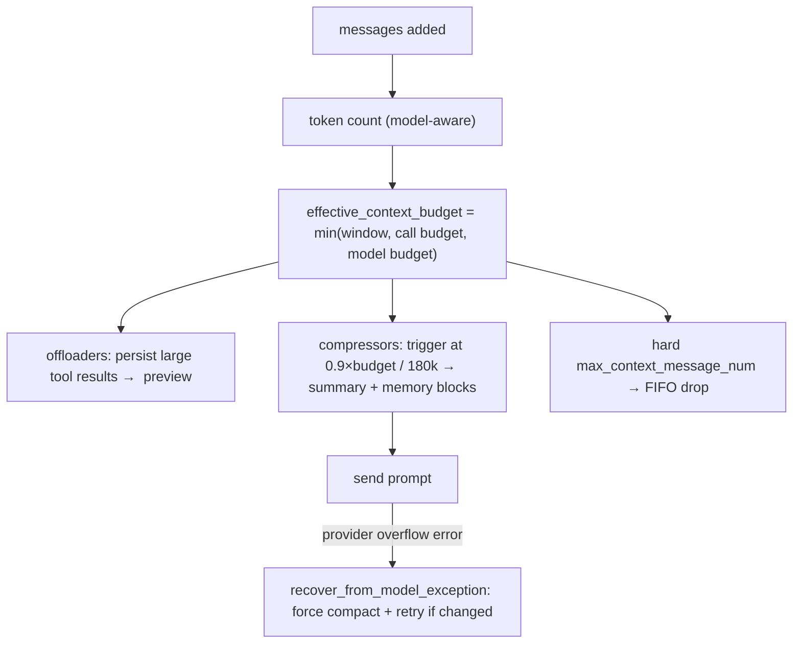

<details>
<summary>Anchors</summary>

<sub><strong>Anchors:</strong><br>&bull; <code>agent-core/openjiuwen/core/context_engine/context/context_utils.py:20</code> — <code>DEFAULT_CONTEXT_MAX_TOKENS = 200000</code>; <code>:404</code> <code>resolve_context_max()</code>; <code>:29</code> per-model window table<br>&bull; <code>agent-core/openjiuwen/core/context_engine/processor/budget_guard.py:37</code> — <code>effective_context_budget()</code> = min of budgets<br>&bull; <code>agent-core/openjiuwen/core/context_engine/context/message_buffer.py:71</code> — <code>_if_need_resize()</code> drops oldest beyond 2×<br>&bull; <code>agent-core/openjiuwen/core/context_engine/processor/compressor/round_level_compressor.py:104</code> — <code>trigger_context_ratio=0.9</code>; <code>:1159</code> <code>_trigger_token_threshold()</code><br>&bull; <code>agent-core/openjiuwen/core/context_engine/processor/compressor/full_compact_processor.py:184</code> — <code>trigger_total_tokens=180000</code>; <code>:194</code> <code>messages_to_keep=10</code><br>&bull; <code>agent-core/openjiuwen/core/context_engine/context_engine.py:372</code> — <code>recover_from_model_exception()</code><br>&bull; <code>agent-core/openjiuwen/core/context_engine/processor/offloader/tool_result_budget_processor.py:34</code> — per-round <code>tokens_threshold=50000</code>; <code>agent-core/openjiuwen/core/context_engine/processor/offloader/message_offloader.py:45</code> <code>tokens_threshold=20000</code></sub>

</details>

**Gap.** No pre-call hard rejection/backpressure before the provider call — overflow is discovered by proactive thresholds or the provider error path. Windowing (`default_window_message_num`/`round_num`) is opt-in and separate from compaction.

<sub>_Canonical source: `source/llm-fundamentals-interview-questions_for_engineers.md`; also covered in: llm-applied, llm-fund._</sub>

---

## 9. Why does model performance sometimes degrade with very long context, even when the context fits

**General:** Attention spreads over more tokens, diluting the signal for any one of them, and models are empirically better at using information at the beginning and end of the context than in the middle ("lost in the middle"). Irrelevant long context also introduces distractors and can override instructions. Fitting the window is necessary but not sufficient; relevance and ordering matter too.

**Jiuwen:** There is no explicit "lost-in-the-middle" mitigation; the system instead mechanically keeps the window small and biases toward recency. Compressors protect a newest-message tail (`keep_recent_messages`, `messages_to_keep`, `keep_last_round`), offloaders keep only the newest K results, and truncation helpers preserve head + tail (one also keeps a middle slice) rather than only a prefix. When enabled, `CompressionRecallConfig` archives replaced messages in overlapping token chunks and a two-stage BM25 retriever can re-surface relevant archived chunks by query — the closest thing to relevance-based long-context handling.

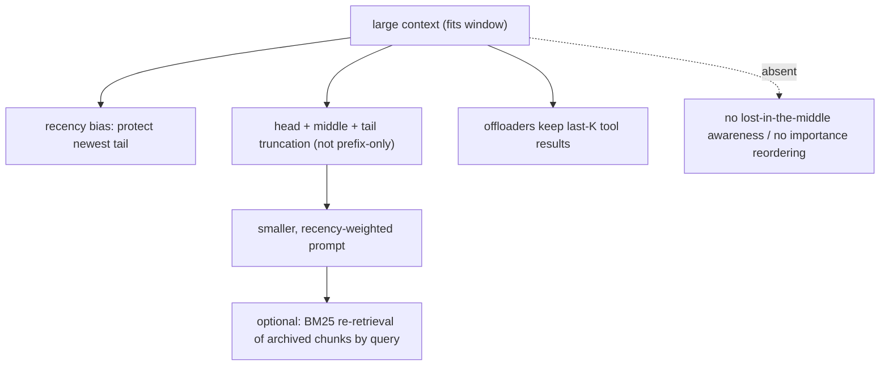

<details>
<summary>Anchors</summary>

<sub><strong>Anchors:</strong><br>&bull; <code>agent-core/openjiuwen/core/context_engine/processor/compressor/round_level_compressor.py:119</code> — <code>keep_recent_messages</code>; <code>:1088</code> <code>_build_head_tail_truncated_text()</code>; <code>:112</code> <code>target_total_tokens=160000</code><br>&bull; <code>agent-core/openjiuwen/core/context_engine/processor/compressor/full_compact_processor.py:194</code> — <code>messages_to_keep=10</code><br>&bull; <code>agent-core/openjiuwen/core/context_engine/processor/offloader/message_offloader.py:63</code> — <code>keep_last_round=True</code><br>&bull; <code>agent-core/openjiuwen/core/context_engine/processor/offloader/message_summary_offloader.py:697</code> — <code>_smart_truncate_content()</code> head/middle/tail<br>&bull; <code>agent-core/openjiuwen/core/context_engine/processor/budget_guard.py:114</code> — <code>_build_head_tail()</code><br>&bull; <code>agent-core/openjiuwen/core/context_engine/processor/forked/compressor/recall/archive.py:48</code> — archive in 3000-token chunks / 300 overlap; <code>agent-core/openjiuwen/core/context_engine/processor/forked/compressor/recall/retriever.py:27</code> BM25 <code>recall_compressed_context()</code></sub>

</details>

<sub>_Canonical source: `source/llm-fundamentals-interview-questions_for_engineers.md`; also covered in: llm-applied, llm-fund._</sub>

---

## 10. What does temperature actually control, mathematically, in the output distribution

**General:** The model produces logits `z_i` for the next token. Temperature `T` rescales them: `softmax(z_i / T)`. As `T → 0` the distribution collapses toward the argmax (greedy/deterministic); as `T` rises the distribution flattens, increasing diversity and the chance of lower-probability tokens. `T = 1` leaves the model's raw distribution unchanged. It does not change which tokens are possible, only their relative probabilities.

**Jiuwen:** Temperature is a **passthrough request parameter** — hosted APIs apply the math — with a local implementation on the HF/vLLM path. At the core client layer `temperature`/`top_p` default to `None` and are added only when set; request-level args override `ModelRequestConfig`. OpenAI-compatible calls targeting `openai.com` keep only one of temperature/top_p (temperature wins, top_p dropped); Anthropic routes sampling through `extra_body` and drops `top_p` when temperature is explicitly set. The local sampler divides logits by temperature and softmaxes, with `T <= 0` falling back to argmax. The local `GenerationConfig` default is `temperature=0.0`.

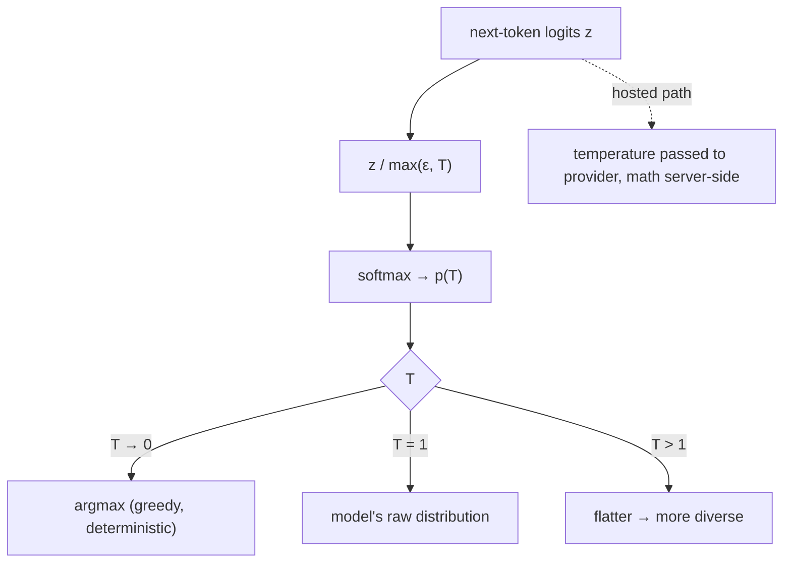

<details>
<summary>Anchors</summary>

<sub><strong>Anchors:</strong><br>&bull; <code>agent-core/openjiuwen/core/foundation/llm/schema/config.py:210</code> — <code>temperature: Optional[float] = None</code><br>&bull; <code>agent-core/openjiuwen/core/foundation/llm/model_clients/base_model_client.py:556</code> — <code>final_temperature = ...</code>; added only when not <code>None</code><br>&bull; <code>agent-core/openjiuwen/core/foundation/llm/model_clients/openai_model_client.py:944</code> — drops <code>top_p</code> when temperature present (openai.com)<br>&bull; <code>agent-core/openjiuwen/core/foundation/llm/model_clients/anthropic_model_client.py:929</code> — temperature via <code>extra_body</code>; drops <code>top_p</code> if both set<br>&bull; <code>agent-core/openjiuwen/symphony/retrieval/llm/transformers_prefix_cached_generation/generation.py:516</code> — <code>scores = next_token_logits / max(1e-6, temperature)</code><br>&bull; <code>agent-core/openjiuwen/symphony/retrieval/llm/base/types.py:60</code> — <code>GenerationConfig.temperature: float = 0.0</code></sub>

</details>

<sub>_Canonical source: `source/llm-fundamentals-interview-questions_for_engineers.md`; also covered in: engineering, genai, llm-applied, llm-fund._</sub>

---

## 11. What's the difference between top-k sampling and top-p (nucleus) sampling

**General:** Both truncate the next-token distribution before sampling. Top-k keeps the `k` most probable tokens and renormalizes — a fixed candidate count regardless of how peaked the distribution is. Top-p keeps the smallest set of tokens whose cumulative probability reaches `p` — an adaptive count: few tokens when the model is confident, many when it is flat. Top-p usually adapts better; they are often combined.

**Jiuwen:** Top-p (nucleus) is implemented locally; top-k sampling is not. `GenerationConfig` exposes `top_p` (default `1.0`) but has no top-k sampling field. The local sampler sorts scores, masks tokens beyond the cumulative `top_p`, re-softmaxes, and multinomial-samples; `top_p == 1.0` samples the full distribution. Hosted providers receive `top_p` in the normal body; Anthropic additionally forwards `top_k` via `extra_body` if present. Note three unrelated `top_k` meanings in the codebase that are **not** LLM sampling: retrieval result count, trie-constraint allowed outputs, and logit-selection candidate scoring.

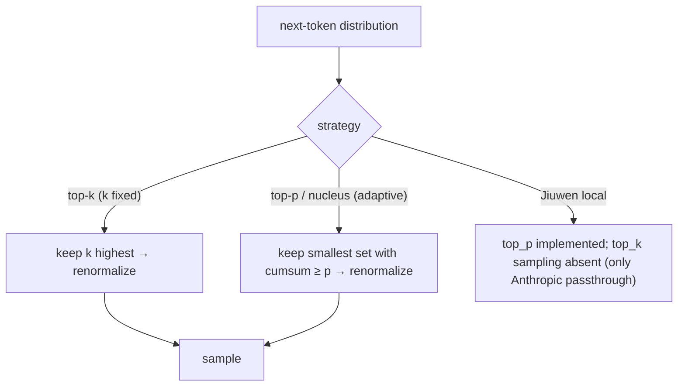

<details>
<summary>Anchors</summary>

<sub><strong>Anchors:</strong><br>&bull; <code>agent-core/openjiuwen/symphony/retrieval/llm/base/types.py:61</code> — <code>GenerationConfig.top_p: float = 1.0</code>; no top_k sampling field<br>&bull; <code>agent-core/openjiuwen/symphony/retrieval/llm/transformers_prefix_cached_generation/generation.py:517</code> — nucleus <code>top_p</code> truncation; <code>:534</code> full-distribution softmax when <code>top_p</code> ∉ (0,1)<br>&bull; <code>agent-core/openjiuwen/core/foundation/llm/model_clients/base_model_client.py:561</code> — <code>top_p</code> resolved/passed<br>&bull; <code>agent-core/openjiuwen/core/foundation/llm/model_clients/anthropic_model_client.py:936</code> — <code>top_p</code> via <code>extra_body</code>; <code>:940</code> <code>top_k</code> forwarded if present<br>&bull; <code>agent-core/openjiuwen/core/foundation/llm/schema/config.py:213</code> — <code>top_p: Optional[float] = None</code> (no <code>top_k</code>)<br>&bull; <code>agent-core/openjiuwen/symphony/retrieval/llm/base/types.py:40</code> — <code>TrieConstraint.top_k</code> (allowed outputs, not sampling)</sub>

</details>

<sub>_Canonical source: `source/llm-fundamentals-interview-questions_for_engineers.md`; also covered in: llm-fund._</sub>

---

## 12. Why does greedy decoding sometimes produce worse output than sampling-based decoding

**General:** Greedy picks the single highest-probability token each step. That is locally optimal but not globally: it can lock into repetitive, degenerate, or bland sequences, and it cannot recover from one early bad choice. Sampling explores alternatives, which often yields more natural and diverse text; a moderate temperature with top-p is a common default. For tasks with a single correct answer (extraction, classification), greedy/`T=0` is usually preferred.

**Jiuwen:** Greedy is implemented but not argued. The local sampler returns `argmax` when `temperature <= 0.0`, and the generate path sets `do_sample=False` in that branch; since `GenerationConfig` defaults to `temperature=0.0`, the local default is greedy. Many framework call sites deliberately pass `temperature=0.0` for deterministic extraction/classification, while sampling is enabled (`do_sample=True`, temperature/top_p/seed) when temperature > 0. There is **no** comment, doc, or code discussion explaining why greedy can be worse than sampling — the choice is treated purely as a determinism knob.

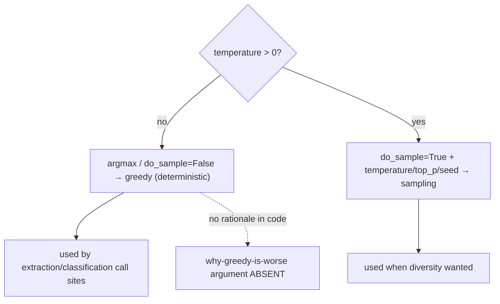

<details>
<summary>Anchors</summary>

<sub><strong>Anchors:</strong><br>&bull; <code>agent-core/openjiuwen/symphony/retrieval/llm/transformers_prefix_cached_generation/generation.py:514</code> — <code>if temperature &lt;= 0.0: return int(torch.argmax(...))</code><br>&bull; <code>agent-core/openjiuwen/symphony/retrieval/llm/transformers_prefix_cached_generation/generation.py:335</code> — <code>do_sample=True</code> when <code>temperature &gt; 0</code>; <code>:344</code> <code>do_sample=False</code><br>&bull; <code>agent-core/openjiuwen/symphony/retrieval/llm/base/types.py:60</code> — default <code>temperature = 0.0</code> ⇒ local default greedy<br>&bull; <code>agent-core/openjiuwen/agent_evolving/agent_rl/rl_trainer/verl_executor.py:185</code> — <code>remax_input.meta_info["do_sample"] = False</code> (REMAX baseline, not an exploit path)<br>&bull; <code>agent-core/openjiuwen/core/retrieval/indexing/processor/extractor/triple_extractor.py:31</code> — constructor default <code>temperature=0.0</code></sub>

</details>


<sub>_Canonical source: `source/llm-fundamentals-interview-questions_for_engineers.md`; also covered in: llm-fund._</sub>

---

## 13. Why do LLMs struggle with tasks like counting or basic arithmetic

**General:** The model operates on tokens, not characters or digits-as-numbers; counting letters requires character-level reasoning that BPE hides, and multi-digit arithmetic requires carrying/positional algorithms that are error-prone to learn implicitly. Models also have no scratchpad guarantee unless asked to show work. The reliable fix is tool use — call a calculator or run code — rather than expecting the forward pass to do exact math.

**Jiuwen:** The repo frames arithmetic/counting as a tool-augmentation problem. A canonical example trains a DeepAgent to call a `calculator` tool that evaluates arithmetic via `simpleeval` and solves/simplifies algebra/equations via `sympy`; the system prompt explicitly instructs tool use step by step. More generally, an `execute_code` sandbox operation (JiuwenBox/YuanRong/AIO providers plus a local provider) lets agents run code for math/logic. The RSI evidence analyzer encodes the principle "textual arithmetic is never accepted as execution" — verification must come from actual code execution.

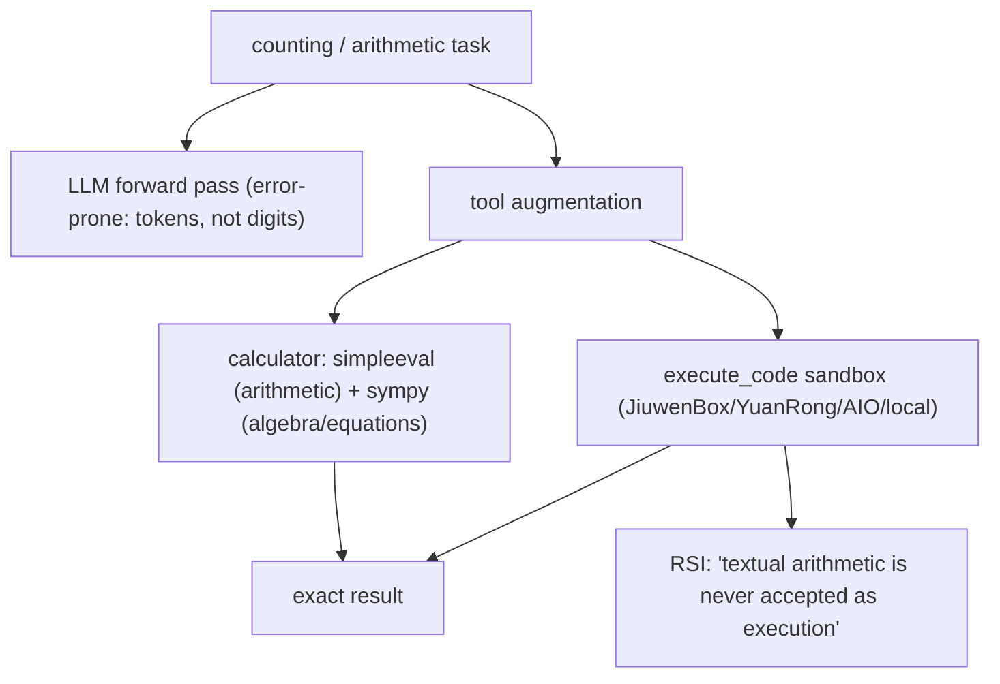

<details>
<summary>Anchors</summary>

<sub><strong>Anchors:</strong><br>&bull; <code>agent-core/examples/rl_calculator/tools.py:11-14</code> — <code>@tool(name="calculator")</code>; <code>:15-85</code> <code>simple_eval</code> + <code>sympy</code><br>&bull; <code>agent-core/examples/rl_calculator/prompts.py:7-16</code> — "Use the calculator tool … step by step"<br>&bull; <code>agent-core/openjiuwen/core/sys_operation/code.py:16-49</code> — <code>execute_code</code> sys-operation<br>&bull; <code>agent-core/openjiuwen/extensions/sys_operation/sandbox/providers/jiuwenbox.py:2927</code> — sandbox <code>execute_code</code><br>&bull; <code>agent-core/openjiuwen/rsi/harness_rsi/evaluation_result_analyzer/evidence_investigation.py:200</code> — "textual arithmetic is never accepted as execution"</sub>

</details>

**Gap.** No first-class arithmetic/counting tool in the core registry; math capability is delegated to user tools or the sandbox. No discussion of tokenization/subitizing causes — purely engineering mitigation.

<sub>_Canonical source: `source/llm-fundamentals-interview-questions_for_engineers.md`; also covered in: llm-fund._</sub>

---

## 14. What is hallucination, and why does it happen even in a well-trained model

**General:** Hallucination is fluent output that is not grounded in fact or in the provided context. It arises because the objective is next-token likelihood, not truth: the model optimizes plausibility, has no built-in fact database, generalizes patterns that sometimes fabricate specifics, and cannot reliably know the boundary of its own knowledge. Mitigations are grounding (retrieval/citations), verification, constrained formats, and abstention — not a property of the weights you can simply "fix".

**Jiuwen:** The repo does not model or detect low-level hallucination; it implements downstream mitigations: (1) retrieval-augmentation infrastructure to supply evidence; (2) a dedicated **verification agent** restricted to read-only/command tools that must show verbatim command output with a PASS/FAIL/PARTIAL verdict; (3) an LLM quality reviewer scoring CORRECTNESS/COMPLETENESS; (4) model-anomaly rails that catch degenerate repetition/loops (not false claims); and (5) security guardrails/sanitization for injection and secret leakage. There is no claim-to-source attribution checker.

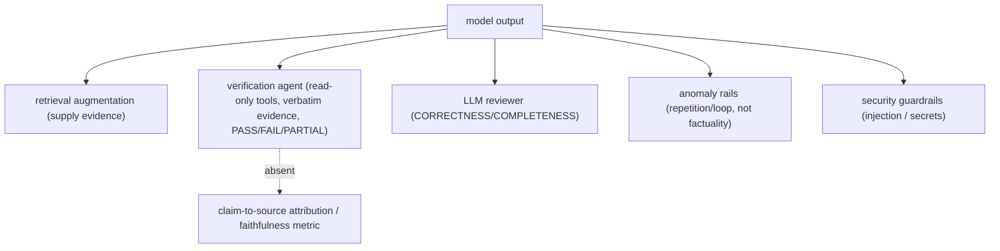

<details>
<summary>Anchors</summary>

<sub><strong>Anchors:</strong><br>&bull; <code>agent-core/openjiuwen/harness/rails/model_anomaly_detection_rail.py:110-117</code> — repeated stream output / timeouts / tool-call loops (degeneracy, not factual errors)<br>&bull; <code>agent-core/openjiuwen/harness/rails/subagent/verification_rail.py:92-108</code> — <code>VerificationRail</code> tool allowlist; <code>:165-196</code> blocks disallowed tools, requires evidence<br>&bull; <code>agent-core/openjiuwen/agent_teams/verification/reviewer.py:26-58</code> — LLM reviewer dimension "CORRECTNESS"<br>&bull; <code>agent-core/openjiuwen/core/security/guardrail/backends.py:39-80</code> — guardrail detection backends; <code>agent-core/openjiuwen/core/security/guardrail/context.py:115-202</code> confidence thresholds → risk levels<br>&bull; <code>agent-core/openjiuwen/harness/tools/web/paid_search.py:221-222</code> — extracts citation URLs (no claim linkage)<br>&bull; <code>agent-core/openjiuwen/agent_evolving/tools/skill.py:284</code> — "then cite only the refs you actually read"</sub>

</details>

**Gap.** No hallucination detector and no claim-to-source attribution or faithfulness metric — the verification agent checks command output, not whether a claim is supported by retrieved sources. Retrieval is optional plumbing.

<sub>_Canonical source: `source/llm-fundamentals-interview-questions_for_engineers.md`; also covered in: llm-fund._</sub>

---

## 15. What's the difference between the model being "wrong" and the model being "uncertain," and can you tell the difference from the output alone

**General:** Wrong means the answer is factually incorrect; uncertain means the model's distribution is not confident, which may still yield a correct or incorrect answer. They are independent: a model can be confidently wrong, or rightly unsure. From the surface text alone you generally cannot tell — fluent text carries no calibrated confidence. Token log-probabilities, entropy, or self-consistency/vote checking can approximate uncertainty, but they are imperfect and need calibration; abstention only helps if it correlates with being wrong.

**Jiuwen:** The repo collects token **logprobs** but does not expose an uncertainty/abstention signal on ordinary agent answers. `ReactAgent` can request `logprobs`/`top_logprobs`, captured into canonical RL trajectory spans and validated (must be ≤ 0) for RL training. `ChatReranker` uses them for one specific binary decision: it exponentiates the top-logprobs of "yes"/"no" and normalizes to a relevance probability. The retrieval subsystem has an explicit abstain token ("0"), but that is retrieval-selection abstention, not output uncertainty. There is no confidence threshold at which an agent says "I don't know," and no calibration.

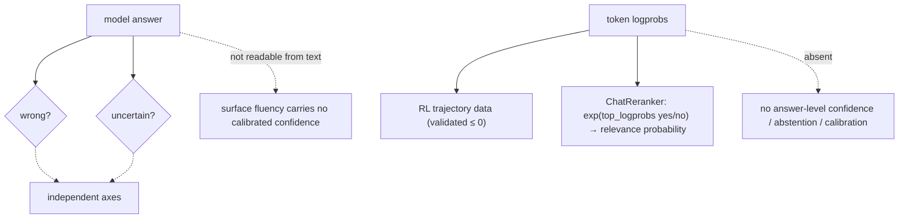

<details>
<summary>Anchors</summary>

<sub><strong>Anchors:</strong><br>&bull; <code>agent-core/openjiuwen/core/retrieval/reranker/chat_reranker.py:83-107</code> — <code>exp(logprob)</code> yes/no → normalized confidence; <code>:134-141</code> <code>logprobs=True</code>, <code>top_logprobs=5</code>, yes/no logit bias<br>&bull; <code>agent-core/openjiuwen/core/single_agent/agents/react_agent.py:294-303</code> — <code>llm_logprobs</code>/<code>llm_top_logprobs</code>; <code>:1622-1624</code> passes to model call<br>&bull; <code>agent-core/openjiuwen/agent_evolving/agent_rl/online/capture_pipeline.py:404-427</code> — parses per-token logprobs, rejects <code>&gt; 0</code><br>&bull; <code>agent-core/openjiuwen/agent_evolving/trajectory/schema.py:36-47</code> — <code>RL_LOGPROBS</code>; <code>agent-core/openjiuwen/agent_evolving/trajectory/spans.py:849-873</code> — <code>read_rl_fields</code><br>&bull; <code>agent-core/openjiuwen/symphony/retrieval/search/runtime/selector.py:305-315</code> — <code>is_abstain</code> from output token "0" (retrieval only)</sub>

</details>

**Gap.** No answer-level confidence scoring, no uncertainty-based abstention, no calibration. Logprobs exist only as RL reward/trajectory data and for the reranker's binary judgment, so you cannot tell wrong from uncertain from the output alone here.


<sub>_Canonical source: `source/llm-fundamentals-interview-questions_for_engineers.md`; also covered in: llm-fund._</sub>

---

## 16. "How does the model know X" is really testing context window understanding

**General:** why the model forgot something earlier, why it mixed up two similar entities, why longer context degrades output — all trace back to what is actually inside the context window at generation time and how attention weights it. Reason about context *contents*, not model capability: name what is in the window (system prompt, retained turns, retrieved chunks, tool results) and what got dropped/compacted/offloaded; explain positional/attention dilution (lost in the middle); and for entity mix-ups, point at missing entity disambiguation or too-similar surface forms.

**Jiuwen:** The context engine decides what is in the window and how it is trimmed: a strictest-bound budget, offload of large tool results, multi-stage compaction, and a FIFO drop beyond `max_context_message_num`, all biased toward the newest turns. There is no lost-in-the-middle awareness and no entity disambiguation/aliasing.

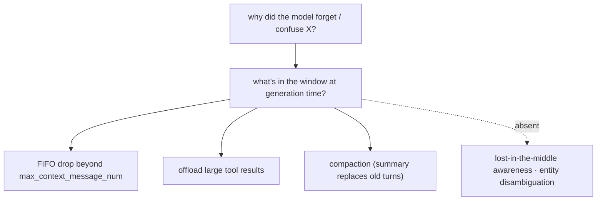

<details>
<summary>Anchors</summary>

<sub><strong>Anchors:</strong><br>&bull; <code>agent-core/openjiuwen/core/context_engine/context/context_utils.py:20/404</code> — window resolution<br>&bull; <code>agent-core/openjiuwen/core/context_engine/processor/budget_guard.py:37</code> — <code>effective_context_budget</code> (strictest)<br>&bull; <code>agent-core/openjiuwen/core/context_engine/context/message_buffer.py:71</code> — FIFO drop<br>&bull; <code>agent-core/openjiuwen/core/context_engine/processor/offloader/tool_result_budget_processor.py:34</code> — offload threshold<br>&bull; <code>agent-core/openjiuwen/core/context_engine/processor/compressor/full_compact_processor.py:184</code> — compaction</sub>

</details>


---

## 17. What was BERT's key contribution, and why did the pretrain-then-finetune paradigm change everything?

**General:** BERT (Devlin et al. 2018) made two contributions. First, the **masked language model (MLM)** pretraining objective: randomly mask 15% of input tokens and train the model to predict them. Unlike GPT's left-to-right objective, MLM forces the model to attend to both left and right context simultaneously — producing richer bidirectional representations. Second, and more broadly important, it demonstrated the **pretrain-then-finetune paradigm** at scale: pretrain one large encoder on unlabeled text, then add a thin task-specific head and finetune on a small labeled dataset. This template — one general pretrained model, many downstream tasks — replaced the prior approach of training a separate model per task and became the foundation of modern transfer learning for NLP and beyond.

**Jiuwen:** BERT-family models appear in two roles. As encoder-only **classifiers**: `guardrail_rail.py` loads `AutoModelForSequenceClassification` (a finetuned BERT-style model) for harmful-content classification. As **embedding models**: sentence transformers (also BERT-derived) are used frozen for document embedding — pretrained, not finetuned within this codebase. The SFT path in `agent_rl/` is the finetune stage but applies to decoder-only generation models, not BERT encoders.

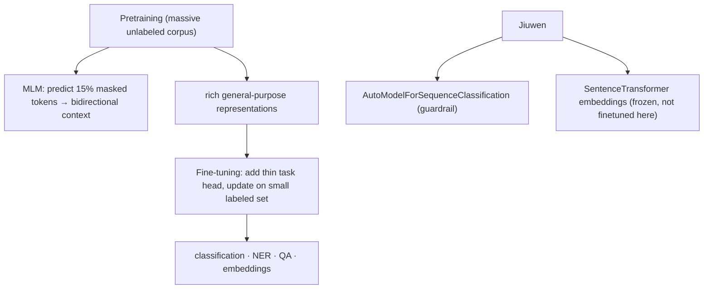

<details>
<summary>Anchors</summary>

<sub><strong>Anchors:</strong><br>&bull; <code>agent-core/openjiuwen/core/security/guardrail/backends.py:445</code> — <code>AutoModelForSequenceClassification</code> (finetuned BERT-family)<br>&bull; <code>agent-core/openjiuwen/core/security/guardrail/builtin.py:174</code> — <code>model_type</code> accepts <code>"bert"</code><br>&bull; <code>agent-core/openjiuwen/core/retrieval/embedding/sentence_transformer_embedding.py:1</code> — frozen pretrained encoder for embeddings<br>&bull; <code>agent-core/openjiuwen/agent_evolving/agent_rl/online/backends/sft/trainer.py:1</code> — finetune stage (decoder-only models)</sub>

</details>

<sub>_Canonical source: `source/15-foundational-papers_for_engineers.md`; also covered in: foundational-papers._</sub>

---

## 18. What is in-context learning, and why was GPT-3 the paper that established it?

**General:** In-context learning (ICL) is the ability of a large language model to perform a new task from examples placed directly in the prompt — **without any weight update**. GPT-3 (Brown et al. 2020, 175B parameters) demonstrated that this capability emerges at scale: smaller GPT versions showed weak few-shot performance, but at 175B, few-shot accuracy on many benchmarks approached fine-tuned baselines. The mechanism: pretraining on diverse text implicitly teaches the model to recognize task patterns from prefix sequences; a few in-context examples "activate" the relevant completion behavior at inference time. The practical implication: prompting became the primary interface for steering LLMs, not per-task fine-tuning — changing how practitioners think about deploying models.

**Jiuwen:** At inference time, `PromptTemplate` and `PromptSection` are the ICL interface: few-shot examples and system instructions are injected as prompt sections at runtime by `RuntimePromptRail`. The SFT path in `agent_rl/` does bake improvements into weights (reducing reliance on ICL), but day-to-day agent behavior is primarily shaped by prompt construction. There is no demonstration retrieval (no system that selects the most relevant few-shot examples by similarity to the current query — so-called "retrieval-augmented ICL").

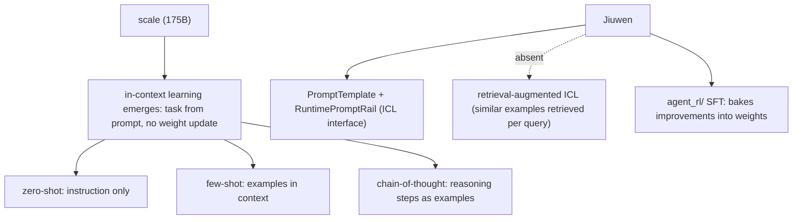

<details>
<summary>Anchors</summary>

<sub><strong>Anchors:</strong><br>&bull; <code>agent-core/openjiuwen/harness/prompts/template.py:1</code> — <code>PromptTemplate</code> / <code>PromptSection</code><br>&bull; <code>agent-core/openjiuwen/harness/rails/runtime_prompt_rail.py:1</code> — <code>RuntimePromptRail</code> (dynamic injection)<br>&bull; <code>agent-core/openjiuwen/agent_evolving/agent_rl/online/backends/sft/trainer.py:1</code> — SFT (weight update path)</sub>

</details>

<sub>_Canonical source: `source/15-foundational-papers_for_engineers.md`; also covered in: foundational-papers._</sub>

---

## 19. What did the Chinchilla paper change about how we train large models?

**General:** Hoffmann et al. 2022 (DeepMind) systematically varied parameter count and training token budget across hundreds of runs to find the **compute-optimal** configuration: for a given FLOPs budget, roughly **20 training tokens per parameter** is optimal. Prior large models (GPT-3 175B trained on ~300B tokens, Gopher 280B on 300B tokens) were **undertrained** — they had too many parameters for the data they saw. Chinchilla (70B parameters, trained on 1.4T tokens) outperformed Gopher (280B) despite being 4× smaller, because the data budget matched the parameter count. Practically: for a fixed compute budget, you should prefer a smaller model trained on more data over a larger model trained on less. This reframed the scaling law debate — data matters as much as parameters.

**Jiuwen:** Pretraining is outside the framework's scope. The SFT and RL fine-tuning paths in `agent_rl/` use a fixed pre-trained base model. Chinchilla-aware decisions — which base model to select, how much SFT data to collect relative to model size — are human/operator-level choices, not framework policy. There is no compute-optimal token budget calculator or data-to-parameter ratio check.

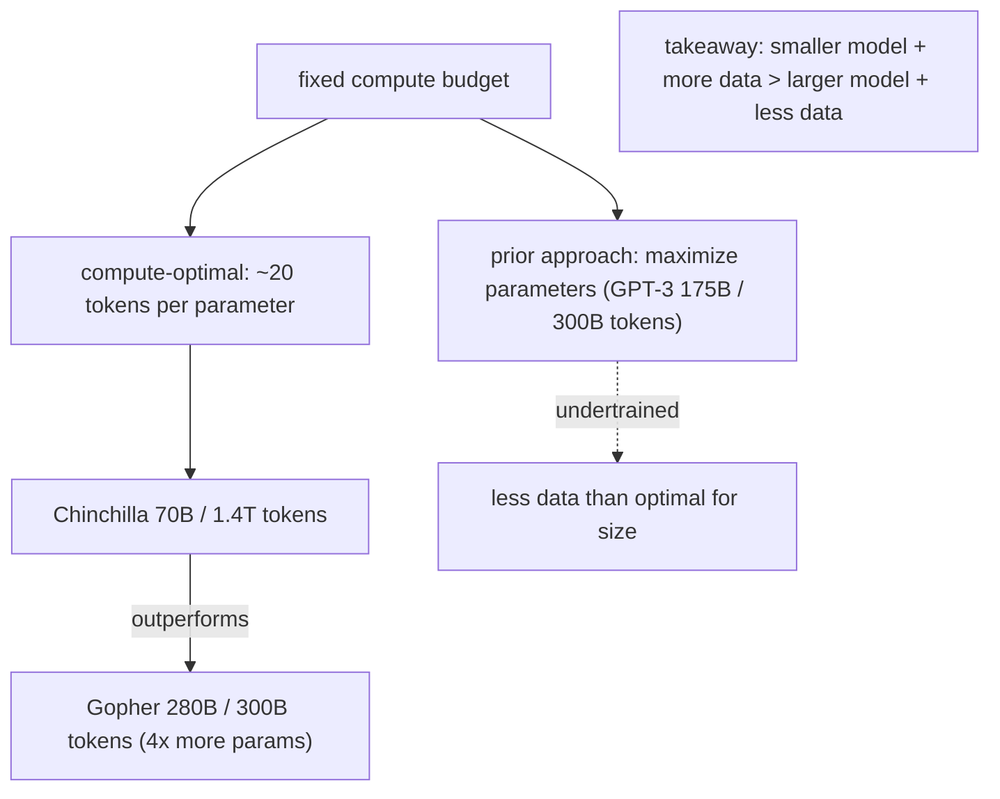

<details>
<summary>Anchors</summary>

<sub><strong>Anchors:</strong><br>&bull; <code>agent-core/openjiuwen/agent_evolving/agent_rl/online/backends/sft/trainer.py:1</code> — SFT uses fixed base model (no pretraining)<br>&bull; <code>agent-core/openjiuwen/agent_evolving/agent_rl/config/offline_config.py:1</code> — offline RL config (no data-to-parameter ratio policy)<br>&bull; Chinchilla scaling law: compute-optimal at ≈20 tokens/parameter (no framework equivalent)</sub>

</details>

**Gap.** The framework has no tooling for compute-optimal base model selection or data budget guidance; Chinchilla-aware choices are made entirely outside the codebase.

<sub>_Canonical source: `source/15-foundational-papers_for_engineers.md`; also covered in: foundational-papers._</sub>

---

## 20. What is FlashAttention and why does it matter for building long-context systems?

**General:** Standard self-attention materializes an N×N attention matrix in GPU high-bandwidth memory (HBM), giving O(N²) memory complexity in sequence length N. FlashAttention (Dao et al. 2022) is **IO-aware**: it tiles the computation into blocks that fit in the faster on-chip SRAM, computing attention without ever writing the full NxN matrix to HBM. Result: **O(N) memory** (the matrix is never materialized), 2–4× faster wall-clock time for typical sequence lengths, and practical training/inference at 32k–1M tokens. Without FlashAttention (or equivalent — xFormers, Flex Attention), training on sequences longer than ~8k tokens was memory-prohibitive. Most modern LLMs and inference servers (vLLM, TRT-LLM) use it by default. For practitioners: FlashAttention is why long-context models exist, and why "does this serving framework support FlashAttention?" is a production question.

**Jiuwen:** FlashAttention is handled at the infrastructure layer below the framework — by the base model weights and the serving backend (vLLM in `symphony/retrieval/llm/`). Jiuwen manages long context at the **application** level: tool-result offloading (>50k tokens), `keep_last_k` windowing, and LLM-based compaction at 180k tokens. These application-level guards are necessary even with FlashAttention because attention still degrades at very long contexts (lost-in-the-middle, cost per call) regardless of the memory technique.

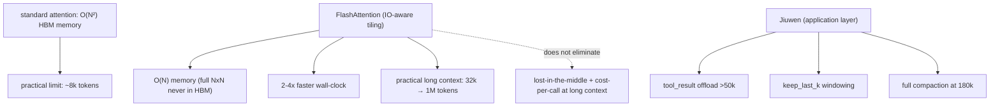

<details>
<summary>Anchors</summary>

<sub><strong>Anchors:</strong><br>&bull; <code>agent-core/openjiuwen/symphony/retrieval/llm/transformers_prefix_cached_generation/client.py:175</code> — vLLM-backed serving (FlashAttention enabled by vLLM, not by framework)<br>&bull; <code>agent-core/openjiuwen/core/context_engine/processor/offloader/tool_result_budget_processor.py:34</code> — 50k offload<br>&bull; <code>agent-core/openjiuwen/core/context_engine/processor/compressor/full_compact_processor.py:184</code> — 180k compaction</sub>

</details>

<sub>_Canonical source: `source/15-foundational-papers_for_engineers.md`; also covered in: foundational-papers._</sub>

---

## 21. What is Mixture of Experts (MoE), and how does Switch Transformers show it scales capacity without proportional compute?

**General:** In a standard dense Transformer, every token passes through every parameter in every layer. **Mixture of Experts** replaces each feed-forward sublayer with N expert networks plus a learned **router** that activates only k of them (typically k=1 or 2) per token. Total parameter count is N×(expert size), but FLOPs per token stay ~constant because only k experts are active. Switch Transformers (Fedus et al. 2021) simplified routing to k=1 and showed a 1.6T-parameter model can be trained at roughly the same FLOPs as a dense 7B model at the same training step — a 4× speed improvement over T5-XXL. Modern MoE deployments: Mixtral 8×7B (active params ~13B out of 47B total), Gemini 1.0 Ultra, Grok-1. Practitioner implication: a model's **total parameter count overstates its compute cost** for MoE architectures — a 47B MoE is not a 47B dense model in terms of inference FLOPs.

**Jiuwen:** The framework selects models by provider/model-name string and does not expose MoE-aware metadata. `ModelPoolEntry` and the allocators are endpoint distribution mechanisms, not expert routers. Whether the underlying model is dense or MoE is opaque to the framework — the only operational implication is that MoE models may have higher memory requirements (all experts must be loaded) despite lower FLOPs.

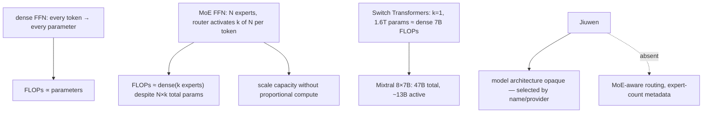

<details>
<summary>Anchors</summary>

<sub><strong>Anchors:</strong><br>&bull; <code>agent-core/openjiuwen/core/foundation/llm/schema/config.py:13</code> — <code>ProviderType</code> (architecture not a config dimension)<br>&bull; <code>agent-core/openjiuwen/agent_teams/models/pool.py:38</code> — <code>ModelPoolEntry</code> (endpoint distribution, not expert routing)<br>&bull; <code>agent-core/openjiuwen/symphony/retrieval/search/service/serving.py:35</code> — vLLM <code>architectures</code> string (closest to architecture awareness)</sub>

</details>

<sub>_Canonical source: `source/15-foundational-papers_for_engineers.md`; also covered in: foundational-papers._</sub>

---

## 22. What is CLIP, and how does it enable multimodal retrieval?

**General:** CLIP (Contrastive Language-Image Pretraining, Radford et al. 2021) trains an image encoder and a text encoder **jointly** via contrastive learning on 400M internet (image, text) pairs. The training objective: push the embedding of a matching (image, text) pair close together in a shared vector space, push mismatched pairs apart. The result is a **shared embedding space** where cosine similarity between a text embedding and an image embedding is semantically meaningful — enabling zero-shot image classification, text-to-image retrieval, and image-to-text retrieval without task-specific labeling. CLIP underpins DALL-E 2's text-to-image alignment, Stable Diffusion's text conditioning, and multimodal RAG systems that index images alongside text. For practitioners: CLIP-based retrieval lets you run a text query against an image index (or vice versa) using the same vector search infrastructure as text-only RAG.

**Jiuwen:** The embedding pipeline (`APIEmbedding`, `SentenceTransformerEmbedding`) handles text only — no image encoder, no multimodal embedding path. `DocumentChunk` has no image-content field. CLIP-based retrieval is absent; image-text cross-modal search is not supported. Multimodal input exists in a different dimension: `MultimodalImageRail` handles image inputs from users, but passes them to the generation model directly, not to a shared embedding index.

```mermaid
flowchart TD
    TRAIN["contrastive pretraining (400M image-text pairs)"] --> SPACE["shared embedding space"]
    SPACE --> TEXT_Q["text query → cosine similarity → retrieve images"]
    SPACE --> IMG_Q["image query → cosine similarity → retrieve text"]
    SPACE --> ZERO["zero-shot image classification (no task labels)"]
    SPACE --> COND["DALL-E 2 / Stable Diffusion text conditioning"]
    JIW["Jiuwen"] --> TEXT_ONLY["embedding pipeline: text only (no image encoder)"]
    JIW --> MODAL["MultimodalImageRail: image → generation model (not embedding index)"]
    JIW -.->|"absent"| CLIP_R["CLIP-based cross-modal retrieval"]
```

<details>
<summary>Anchors</summary>

<sub><strong>Anchors:</strong><br>&bull; <code>agent-core/openjiuwen/core/retrieval/embedding/sentence_transformer_embedding.py:1</code> — text-only encoder<br>&bull; <code>agent-core/openjiuwen/core/retrieval/embedding/api_embedding.py:1</code> — text-only API embedding<br>&bull; <code>agent-core/openjiuwen/harness/rails/multimodal_image_rail.py:1</code> — image input → generation (not retrieval)<br>&bull; <code>agent-core/openjiuwen/core/retrieval/indexing/processor/chunker/text_splitter.py:1</code> — no image chunk type</sub>

</details>

**Gap.** No multimodal embedding or cross-modal retrieval path exists; image inputs are routed directly to generation, not indexed or retrieved.

<sub>_Canonical source: `source/15-foundational-papers_for_engineers.md`; also covered in: foundational-papers._</sub>

---

## 23. What is the denoising diffusion mechanism behind Stable Diffusion and DALL-E?

**General:** Denoising Diffusion Probabilistic Models (DDPM, Ho et al. 2020) define two processes. **Forward**: add Gaussian noise to an image over T steps until the image is pure noise (a known distribution). **Reverse**: train a neural network (U-Net) to denoise one step at a time — predict the noise added at each step and subtract it. At inference: sample pure noise, run the reverse process T times, get a generated image. The insight is that denoising is a stable, well-defined supervised objective. **Latent Diffusion Models** (Stable Diffusion) extend this by running the forward/reverse process in a compressed **latent space** (encoded by a VAE) rather than pixel space — reducing compute by ~8×. DALL-E 2 uses diffusion in the CLIP embedding space. For practitioners: generation quality levers (number of denoising steps, guidance scale, scheduler type) directly map to the reverse diffusion process.

**Jiuwen:** Jiuwen is a language agent framework with no image generation capability or diffusion model integration. Image generation tools (DALL-E, Stable Diffusion API) would be invoked as external tool calls via `ToolCard` definitions. The SVG avatar system in `jiuwenswarm-bee` uses procedural animation, not diffusion-based generation.

```mermaid
flowchart TD
    FORWARD["forward process: image + Gaussian noise × T steps → pure noise"]
    REVERSE["reverse process (learned): denoise T steps → image"]
    NET["U-Net: predicts noise at each step"] --> REVERSE
    FORWARD --> TRAIN["training: predict the noise (stable supervised objective)"]
    INFER["inference: start from noise, run reverse T steps"] --> GEN["generated image"]
    LDM["Latent Diffusion (Stable Diffusion)"] --> VAE["VAE: compress to latent space"]
    VAE --> REVERSE
    LDM --> LEVERS["quality levers: steps · guidance scale · scheduler"]
```

<details>
<summary>Anchors</summary>

<sub><strong>Anchors:</strong><br>&bull; Framework: no diffusion model integration; image generation via external <code>ToolCard</code> call<br>&bull; <code>jiuwenswarm-bee/src/avatar/</code> — procedural SVG animation (not diffusion)</sub>

</details>

<sub>_Canonical source: `source/15-foundational-papers_for_engineers.md`; also covered in: foundational-papers._</sub>

---

## 24. What is the KV cache and how does it affect inference cost and speed?

**General:** During autoregressive decoding, the transformer computes key (K) and value (V) vectors for every token in every layer. For the input prefix these computations don't change as new tokens are generated — so they can be cached. The **KV cache** stores K and V tensors for all processed tokens so far: on each decode step only the new token's K/V is computed, and the cached values are reused. Without KV cache, generating N tokens from a prompt of P tokens costs O((P+N)²) compute; with it, the decode phase amortizes to O(P+N). **Prompt caching** (Anthropic, OpenAI, Google) extends this across API calls: if your request begins with a cached prefix, you pay ~10% of the normal input token cost for those cached tokens. Practical implication: put your stable system prompt and long context at the *beginning* of the message, and put the variable user query at the *end* — this maximizes cache hits across repeated calls.

**Jiuwen:** The context engine is cache-aware: `ProviderUsage` (agent-core/openjiuwen/core/context_engine/usage/provider_usage.py:14) normalizes `cached_input_tokens` from provider usage metadata, and `session_aggregator.py:45` tracks cache hit rates in tokens. The framework can only observe whether the provider reported a cache hit; it does not control the provider-side KV cache. Indirectly, the context engine's full-compaction and offloading strategy keeps long stable prefixes (system prompt, background context) at the top of the prompt, which improves cache-hit rate on re-queries.

```mermaid
flowchart TD
    INPUT["input tokens (prompt + history)"] --> PREFILL["prefill phase: all input tokens processed in parallel"]
    PREFILL --> KVC["KV cache: K/V tensors stored for all prefix tokens"]
    KVC --> DECODE["decode phase: one new token per step, reuse cached K/V"]
    DECODE -->|"loop"| DECODE
    DECODE --> OUT["output tokens"]
    CACHE_HIT["prompt cache hit (provider-side)"] --> COST["~10% of normal input token cost for cached prefix"]
    STRAT["strategy"] --> ORDER["stable prefix first (system prompt), variable query last"]
    JIW["Jiuwen"] --> OBS["ProviderUsage: cached_input_tokens + session_aggregator hit-rate"]
    JIW -.->|"does not control"| PROV["provider-side KV cache policy"]
```

<details>
<summary>Anchors</summary>

<sub><strong>Anchors:</strong><br>&bull; <code>agent-core/openjiuwen/core/context_engine/usage/provider_usage.py:14</code> — normalizes <code>cached_input_tokens</code> from usage metadata<br>&bull; <code>agent-core/openjiuwen/core/context_engine/usage/session_aggregator.py:45</code> — cache hit-rate aggregation (tokens, not dollars)<br>&bull; <code>agent-core/openjiuwen/core/context_engine/processor/compressor/full_compact_processor.py:184</code> — prefix-preserving compaction (indirectly improves cache locality)</sub>

</details>

<sub>_Canonical source: `source/ai-system-full-stack_for_engineers.md`; also covered in: ai-system-full-stack._</sub>

---

## 25. What is the difference between a base model and an instruct model?

**General:** A **base model** is pretrained on next-token prediction over a massive text corpus — it learns language, world knowledge, and code, but has no "assistant" persona. It will complete text in any style it has seen, including harmful ones. An **instruct model** (chat model) is a base model that has passed through one or more alignment stages: (1) **SFT** — supervised fine-tuning on demonstration data of helpful responses; (2) **Reward modeling** — a model trained to score responses by human preference rankings; (3) **RLHF or DPO** — policy optimization toward the reward model. The result is a model that follows instructions, declines harmful requests, and maintains a consistent persona. Base models (Llama-3-8B, Mistral-7B-base) are released for researchers to apply custom alignment; production systems virtually always use the instruct/chat variant.

**Jiuwen:** The framework consumes models by `ProviderType` + `model_name` string — there is no base/instruct distinction in the config schema. The SFT path in `agent_rl/online/backends/sft/trainer.py` is the stage that transforms a base model into an instruct model, but it applies to the model being fine-tuned, not to the model being served. `GuardrailRail` and `SecurityRail` apply safety classification at inference time as a supplement to alignment — they do not substitute for RLHF/DPO training.

```mermaid
flowchart TD
    BASE["base model (pretraining: next-token prediction)"] --> SFT_S["Stage 1: SFT on helpful demonstrations"]
    SFT_S --> RM["Stage 2: reward model (human preference rankings)"]
    RM --> RLHF_S["Stage 3: RLHF / DPO — optimize policy toward reward model"]
    RLHF_S --> INST["instruct / chat model"]
    INST --> PROD["follows instructions, declines harmful requests, consistent persona"]
    JIW["Jiuwen"] --> SFT_J["agent_rl/sft/trainer.py (stage 1 pipeline)"]
    JIW --> GR_J["GuardrailRail + SecurityRail (inference-time supplement, not substitute)"]
    JIW -.->|"absent"| DIST["base vs instruct distinction in model config"]
```

<details>
<summary>Anchors</summary>

<sub><strong>Anchors:</strong><br>&bull; <code>agent-core/openjiuwen/core/foundation/llm/schema/config.py:13</code> — <code>ProviderType</code> (no instruct/base flag)<br>&bull; <code>agent-core/openjiuwen/agent_evolving/agent_rl/online/backends/sft/trainer.py:1</code> — SFT stage (produces instruct-like model from base)<br>&bull; <code>agent-core/openjiuwen/harness/rails/guardrail_rail.py:1</code> — inference-time safety supplement</sub>

</details>

<sub>_Canonical source: `source/ai-system-full-stack_for_engineers.md`; also covered in: ai-system-full-stack._</sub>

---

## 26. Walk me through what happens in the ~400ms when you call an LLM API

**General:** (1) **API Gateway** — TLS termination, API key validation, rate limiting (429 if exceeded), billing meter starts. (2) **Load Balancer** — routes to a GPU cluster; identical requests have different latency because different clusters are selected. (3) **Tokenization** — your text is converted to token IDs ("Hello world" → [15339, 1917]); this is where your cost is locked in for input. (4) **Model Router** (provider-internal) — large requests route to a multi-GPU cluster; small requests to an optimized single GPU. (5) **Inference Engine** — *Prefill phase*: all input tokens processed in parallel (fast). *Decode phase*: one output token generated per step (this loop is why streaming exists). KV cache avoids recomputing past token representations; FlashAttention reduces memory pressure. (6) **Post-Processing** — tokens decoded to text; safety classifier runs (every major provider has this). (7) **Response and Billing** — JSON response returned via load balancer and TLS; output tokens cost 3–5× more than input tokens per provider pricing. (8) **Logging** — every call logged: latency, token count, model, safety flags; feeds abuse detection and capacity planning. **Inference (step 5) accounts for ~95% of total latency.**

**Jiuwen:** The framework operates from step 4 onward. Model clients (`openai_model_client.py`, `anthropic_model_client.py`) send the request and receive the streamed response; they do not control tokenization, routing, or prefill/decode internally. `ProviderUsage` captures `input_tokens`, `output_tokens`, and `cached_input_tokens` from step 7's usage metadata. `ObservabilityHandler` logs model call events for step 8 equivalents. Steps 1–3 (gateway, load balancer, tokenization) are the provider's infrastructure.

```mermaid
sequenceDiagram
    participant C as Client
    participant GW as API Gateway (1)
    participant LB as Load Balancer (2)
    participant TOK as Tokenizer (3)
    participant IE as Inference Engine (5)
    participant PP as Post-Processing (6)
    C->>GW: HTTPS request + API key
    GW->>LB: authenticated + rate-checked
    LB->>TOK: routed to GPU cluster (4: model router)
    TOK->>IE: token IDs
    IE->>IE: prefill (parallel) → decode loop (one token/step, KV cache)
    IE->>PP: raw token stream
    PP->>C: text + usage metadata + billing (7) + log (8)
```

<details>
<summary>Anchors</summary>

<sub><strong>Anchors:</strong><br>&bull; <code>agent-core/openjiuwen/core/foundation/llm/model_clients/openai_model_client.py:865</code> — builds and sends request (step 4+)<br>&bull; <code>agent-core/openjiuwen/core/context_engine/usage/provider_usage.py:14</code> — captures usage metadata from step 7<br>&bull; <code>jiuwenswarm/jiuwenswarm/server/runtime/usage_cost.py:101</code> — billing meter equivalent (step 7)<br>&bull; <code>agent-core/openjiuwen/harness/observability/event.py:1</code> — observability events (step 8 equivalent)</sub>

</details>

**Gap.** Steps 1–3 (gateway, load balancer, tokenization) are the provider's infrastructure — the framework has no visibility into routing decisions, cache tier assignment, or tokenization pipeline specifics.

<sub>_Canonical source: `source/ai-system-full-stack_for_engineers.md`; also covered in: ai-system-full-stack._</sub>