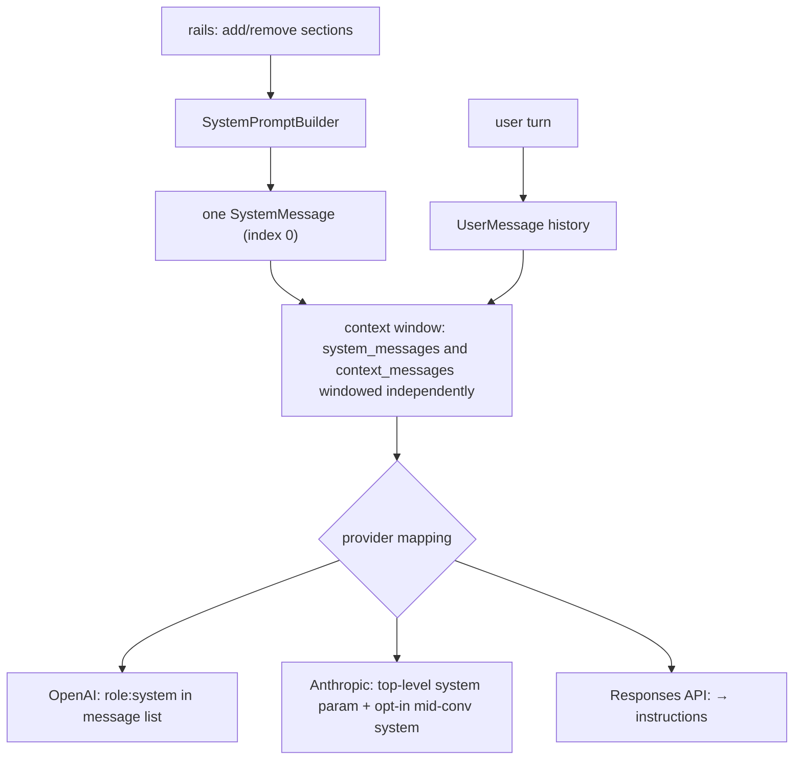
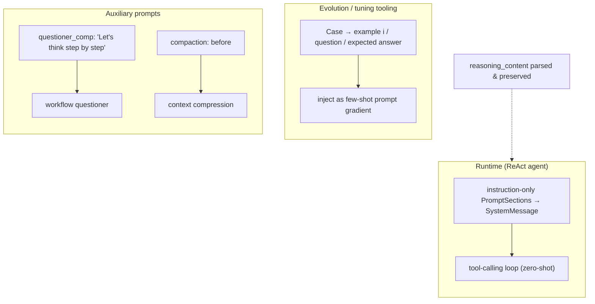
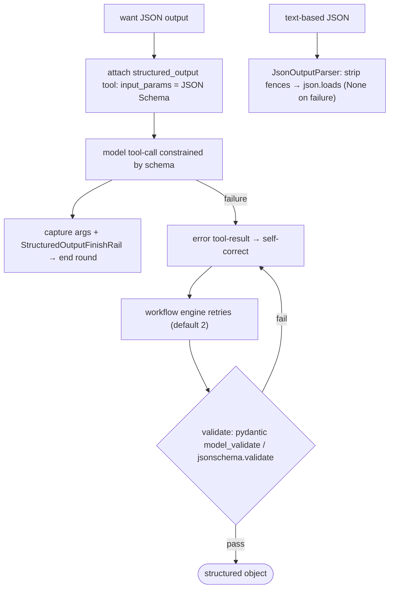
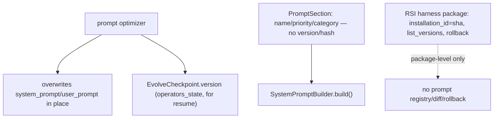
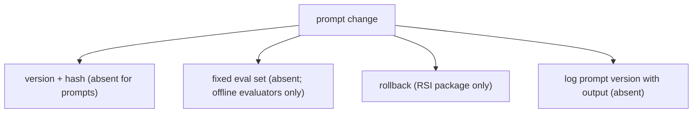

# Prompting and output control

5 unique questions, deduplicated from the archived docs. Each `##` is one question; identical questions from other docs were merged. Full source files are in `source/`.

## 1. What's the difference between a system prompt and a user prompt

**General:** The system prompt sets persistent role, rules, persona, and constraints for the whole conversation; the user prompt is the per-turn request. Providers give the system message higher priority and apply it consistently, while user turns are the changing input. Some APIs (Anthropic) pass system content as a separate top-level field rather than a role in the message list.

**Jiuwen:** The system prompt is a single assembled string from priority-ordered, host-injectable sections; rails mutate the `SystemPromptBuilder` (add/remove sections) before the model call, and `ReActAgent` renders it once as a `SystemMessage` passed as `system_messages`. User turns are admitted separately as `UserMessage` history; the context engine windows `system_messages` and `context_messages` independently. Provider mapping differs: OpenAI chat keeps `role:"system"` in the list, Anthropic lifts system content to the top-level `system` parameter (with an opt-in mid-conversation system path), and the Responses API folds system/developer into `instructions`.



<details>
<summary>Anchors</summary>

<sub><strong>Anchors:</strong><br>&bull; <code>agent-core/openjiuwen/core/single_agent/agents/react_agent.py:1504</code> — builds one <code>SystemMessage</code>; <code>:883</code> <code>_admit_user_message()</code> writes a <code>UserMessage</code><br>&bull; <code>agent-core/openjiuwen/core/context_engine/context/context.py:574</code> — <code>get_context_window(system_messages, ...)</code>; <code>:718</code> <code>_get_window_messages()</code> windows independently<br>&bull; <code>agent-core/openjiuwen/harness/rails/task_planning_rail.py:163</code> — rail adds/removes a system-prompt section<br>&bull; <code>agent-core/openjiuwen/harness/rails/security/prompt_security_rail.py:16</code> — security section injection<br>&bull; <code>agent-core/openjiuwen/harness/prompts/prompt_attachment_manager.py:592</code> — user→system re-role per provider<br>&bull; <code>agent-core/openjiuwen/core/foundation/llm/model_clients/anthropic_model_client.py:379</code> — lifts system into top-level blocks; <code>:858</code> <code>params["system"]</code><br>&bull; <code>agent-core/openjiuwen/core/foundation/llm/utils/responses_utils.py:142</code> — system/developer → <code>instructions</code></sub>

</details>

<sub>_Canonical source: `source/llm-fundamentals-interview-questions_for_engineers.md`; also covered in: genai, llm-fund._</sub>

---

## 2. Zero-shot vs. few-shot vs. chain-of-thought, when does each actually improve output

**General:** Zero-shot (instruction only) works for tasks the model saw in instruction tuning. Few-shot (worked examples) helps when the task has a specific format, label set, or edge-case convention the instruction can't fully specify. Chain-of-thought (ask for intermediate reasoning) helps multi-step reasoning/arithmetic, and its benefit generally grows with model scale (on small models it is unreliable and can even hurt); it is largely subsumed by native reasoning models. All three cost prompt tokens; examples and CoT are not free wins on simple tasks.

**Jiuwen:** The runtime agent is fundamentally zero-shot: the system prompt is assembled from instruction-only `PromptSection`s (identity, safety, skills, tools, task guidance) and the model is steered through the ReAct tool-calling loop, not worked examples. Few-shot machinery exists only in the evolution/tuning tooling (`agent_evolving`, `dev_tools/tune`), which formats cases into example blocks and injects them as prompt gradients. Chain-of-thought appears in auxiliary prompts (workflow `questioner_comp` has an explicit "Let's think step by step") and implicitly in the compaction prompt's `<analysis>`-then-`<summary>` structure. Reasoning-model output is preserved: clients parse `reasoning_content`, and DeepSeek profiles inject an empty `reasoning_content` into assistant history.



<details>
<summary>Anchors</summary>

<sub><strong>Anchors:</strong><br>&bull; <code>agent-core/openjiuwen/core/single_agent/agents/react_agent.py:842</code> — renders <code>role=="system"</code> template messages; <code>:1504</code> <code>SystemMessage(content=prompt_builder.build())</code><br>&bull; <code>agent-core/openjiuwen/core/single_agent/prompts/builder.py:219</code> — <code>build()</code> joins priority-ordered sections<br>&bull; <code>agent-core/openjiuwen/harness/prompts/sections/identity.py:11</code> — default identity prompt (zero-shot)<br>&bull; <code>agent-core/openjiuwen/agent_evolving/utils.py:238</code> — <code>convert_cases_to_examples()</code><br>&bull; <code>agent-core/openjiuwen/dev_tools/tune/optimizer/example_optimizer.py:109</code> — <code>init_examples()</code> few-shot injection<br>&bull; <code>agent-core/openjiuwen/core/foundation/llm/model_clients/openai_model_client.py:347</code> — parses <code>reasoning_content</code>; <code>agent-core/openjiuwen/core/foundation/llm/utils/endpoint_profiles.py:37</code> — DeepSeek empty <code>reasoning_content</code><br>&bull; <code>agent-core/openjiuwen/core/workflow/components/llm/questioner_comp.py:68</code> — explicit CoT instruction</sub>

</details>

**Gap.** No task-level few-shot examples are injected by `harness/` or `core/single_agent`; tool descriptions have occasional usage lines but no worked input/output demos. No global CoT instruction in the DeepAgent system prompt — reasoning is delegated to the model's native channel.

<sub>_Canonical source: `source/llm-fundamentals-interview-questions_for_engineers.md`; also covered in: genai, llm-fund, llm-applied._</sub>

---

## 3. How do you get consistent, parseable output like JSON from an LLM

**General:** Layer the guarantees: prefer a provider JSON/schema mode or tool/function calling with a JSON Schema so the model is constrained at generation time; validate against the schema; on failure, return the validation error to the model for a retry; only then parse. Fenced or free-text JSON should be a last resort with tolerant extraction and repair.

**Jiuwen:** Provider-level constrained decoding (`response_format`/`json_schema`) is not used; structured output is enforced by giving the model a single-use `structured_output` tool whose `ToolCard.input_params` is the caller's JSON Schema, so the provider's tool-use layer constrains arguments. On success the arguments are captured on the tool instance and a finish rail ends the round; on failure the error tool-result is returned for self-correction, and the workflow engine retries then validates the captured object with pydantic `model_validate` or `jsonschema.validate`. For text-based JSON (compression summaries), `JsonOutputParser` strips a ```` ```json ```` fence when present and `json.loads` the payload, returning `None` on decode failure rather than raising.



<details>
<summary>Anchors</summary>

<sub><strong>Anchors:</strong><br>&bull; <code>agent-core/openjiuwen/agent_teams/tools/structured_output_tool.py:46</code> — <code>StructuredOutputTool</code>; <code>:82</code> <code>input_params = schema_json</code>; <code>:117</code> <code>StructuredOutputFinishRail.after_tool_call</code><br>&bull; <code>agent-core/openjiuwen/agent_teams/workflow/backends/team_worker_backend.py:230</code> — attaches one <code>StructuredOutputTool</code> per schema; <code>:484</code> finish rail; <code>:498</code> reminder<br>&bull; <code>agent-core/openjiuwen/agent_teams/workflow/engine/schema.py:55</code> — <code>resolve_schema()</code>; <code>:74</code> <code>coerce()</code> (pydantic/jsonschema)<br>&bull; <code>agent-core/openjiuwen/agent_teams/workflow/engine/primitives.py:693</code> — retries; <code>:763</code> <code>coerce(res.structured, ...)</code>; <code>agent-core/openjiuwen/agent_teams/workflow/engine/runtime.py:62</code> <code>retries: int = 2</code><br>&bull; <code>agent-core/openjiuwen/core/foundation/llm/output_parsers/json_output_parser.py:15</code> — fence/bare extraction + <code>json.loads</code>; <code>:92</code> <code>stream_parse()</code><br>&bull; <code>agent-core/openjiuwen/core/context_engine/processor/compressor/round_level_compressor.py:713</code> — <code>JsonOutputParser()</code>; <code>:1266</code> validates <code>{"blocks":[...]}</code></sub>

</details>

**Gap.** Provider-level `response_format`/`json_schema`/grammar-constrained decoding is not used (the workflow LLM component does expose a text|markdown|json `response_format`). No automatic JSON repair — invalid output is dropped/retried, not fixed. `StructuredOutputTool` lives in `agent_teams`, not a general core primitive.


<sub>_Canonical source: `source/llm-fundamentals-interview-questions_for_engineers.md`; also covered in: genai, llm-fund._</sub>

---

## 4. How do you version prompts the same way you'd version code

**General:** Treat prompts as versioned artifacts: store them in source control (or a prompt store), give each version an immutable ID/content hash, track diffs and metadata, allow activate/rollback without redeploying, and tie a version to the model/parameters it was tested with. Ideally prompts are assembled from composable, individually versioned pieces.

**Jiuwen:** Prompts are assembled from named `PromptSection`s ordered by priority (`SystemPromptBuilder.add_section`/`build`), extended by `harness.prompts.builder` with a `PromptMode` filter, and JiuwenSwarm supplies a static priority registry. Sections carry name/priority/category/carrier/content — no version, hash, or ID. Diagnostics exist (`PromptReport`) but are not versioning. Prompt optimization overwrites the operator's `system_prompt`/`user_prompt` in place; the only persistence is `EvolveCheckpoint.version` storing `operators_state` for resume. Real versioning/rollback exists only at the RSI harness-package level (content-addressed `installation_id`, `list_versions`, `rollback` with hash re-validation) and config migration.



<details>
<summary>Anchors</summary>

<sub><strong>Anchors:</strong><br>&bull; <code>agent-core/openjiuwen/core/single_agent/prompts/builder.py:24</code> — <code>PromptSection</code> (no version); <code>:97</code> <code>add_section</code>; <code>:219</code> <code>build</code><br>&bull; <code>agent-core/openjiuwen/harness/prompts/builder.py:21</code> — <code>PromptMode</code> filtering; <code>agent-core/openjiuwen/harness/prompts/sections/__init__.py:6</code> — <code>SectionName</code> constants<br>&bull; <code>agent-core/openjiuwen/harness/prompts/report.py:58</code> — <code>PromptReport</code> diagnostics (no hash/version)<br>&bull; <code>agent-core/openjiuwen/harness/manifest/models.py:43</code> — <code>HarnessElementDescriptor</code> (no version field)<br>&bull; <code>jiuwenswarm/jiuwenswarm/agents/harness/common/prompt/priority_registry.py:19</code> — static priority registry<br>&bull; <code>agent-core/openjiuwen/core/operator/llm_call/base.py:107</code> — <code>get_state</code>/<code>load_state</code> snapshot prompt content<br>&bull; <code>agent-core/openjiuwen/agent_evolving/checkpointing/state.py:15</code> — <code>EvolveCheckpoint.version</code> for resume<br>&bull; <code>jiuwenswarm/jiuwenswarm/agents/harness/common/rsi/harness_activation.py:617</code> — <code>rollback</code>; <code>:587</code> <code>list_versions</code>; <code>jiuwenswarm/jiuwenswarm/server/rsi/rsi_handlers.py:218</code> — RPC list/rollback<br>&bull; <code>jiuwenswarm/jiuwenswarm/common/utils.py:882</code> — <code>config_version</code> migration</sub>

</details>

**Gap.** No prompt-as-code versioning: no prompt registry, per-section version/hash, diff, or activate/rollback for prompts. Optimization mutates in place; RSI versioning applies only to whole harness packages.


<sub>_Canonical source: `source/genai-interview-questions_for_engineers.md`; also covered in: genai, llm-applied._</sub>

---

## 5. Any prompt behavior question is secretly a versioning and testing question

**General:** This claim holds in practice: prompt behaviour changes should be versioned and regression-tested, so "what prompt should I use" resolves into "how do I version and test prompts". Treat prompts like code, not one-off strings. Version prompts in source control or a prompt store with an immutable ID/hash, run a fixed eval on every change, gate the deploy, log the prompt version with the output, and keep a one-step rollback for changes that degrade output.

**Jiuwen:** Prompts are assembled from named `PromptSection`s that carry only name/priority/category/carrier (no version/hash); optimization overwrites them in place; `PromptReport` is diagnostics, not versioning. Rollback exists only at the RSI **harness-package** level, and the CI gate has no eval threshold. Logs carry spans but not a prompt-version identifier.



<details>
<summary>Anchors</summary>

<sub><strong>Anchors:</strong><br>&bull; <code>agent-core/openjiuwen/core/single_agent/prompts/builder.py:24</code> — <code>PromptSection</code> (no version); <code>:219</code> <code>build</code><br>&bull; <code>agent-core/openjiuwen/harness/prompts/report.py:58</code> — <code>PromptReport</code> diagnostics<br>&bull; <code>agent-core/openjiuwen/agent_evolving/checkpointing/manager.py:43</code> — checkpoint version (operator state)<br>&bull; <code>jiuwenswarm/jiuwenswarm/agents/harness/common/rsi/harness_activation.py:617</code> — package-level rollback<br>&bull; <code>agent-core/openjiuwen/auto_harness/resources/ci_gate.yaml:21</code> — no eval gate</sub>

</details>
