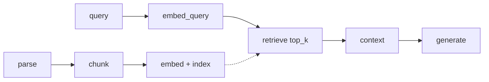
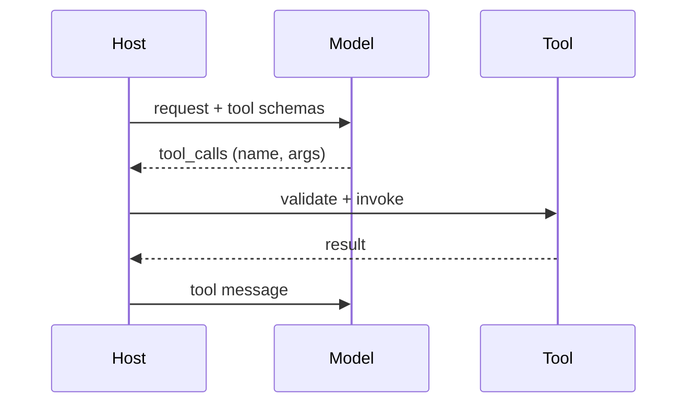
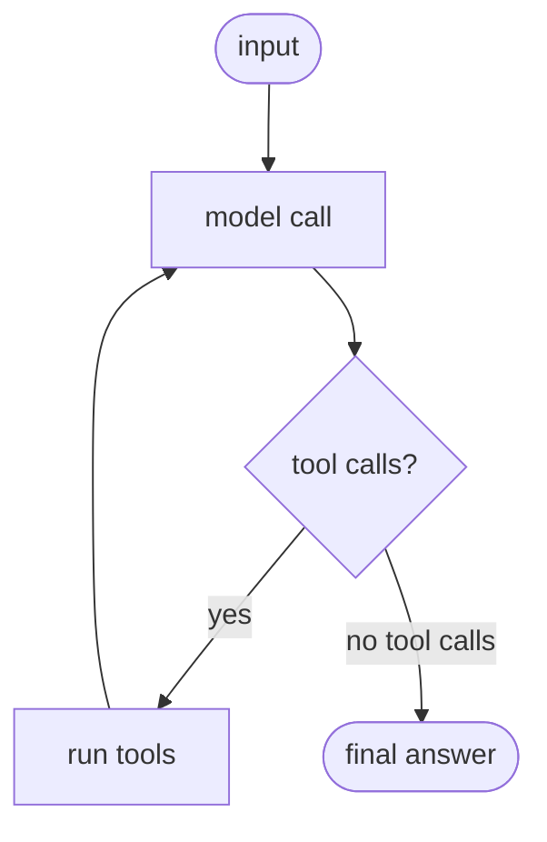
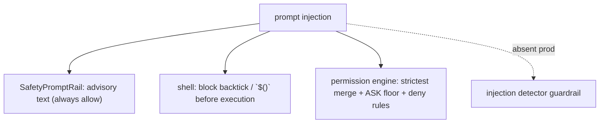

# LLM terms glossary

A glossary of twenty core LLM terms. Each entry has the definition, **where it bites** (the failure or decision it explains), and the concrete mechanism in this codebase.

The definition is the starting point; the value is knowing which term applies to a failure you are describing. See [README](README.md) for the shared conventions (anchor format, repo layers).

---

# Core model concepts

## Token

**Definition:** the smallest unit of text a model processes — usually a sub-word piece, not a full word.

**Where it bites:** cost and context limits are counted in tokens, not words, so JSON, code, and non-English text fragment heavily and cost more per word. Off-by-token bugs show up as over-limit requests and surprise bills.

**Jiuwen:** Counts tokens, never words, via a `TokenCounter`. `TiktokenCounter` maps model names to encodings with `cl100k_base` and `len(text)//3` fallbacks; `TokenizerManager` downloads the model's own artifacts. Counts drive context limits and cost.

Anchors

<strong>Anchors:</strong> &bull; <code>agent-core/openjiuwen/core/context_engine/token/tiktoken_counter.py:212</code> — <code>TiktokenCounter</code>; <code>:299</code> <code>len//3</code> fallback &bull; <code>agent-core/openjiuwen/core/context_engine/token/tokenizer_manager.py:60</code> — resolves/downloads tokenizer artifacts &bull; <code>agent-core/openjiuwen/core/context_engine/context/context_utils.py:20</code> — <code>DEFAULT_CONTEXT_MAX_TOKENS = 200000</code>

## Embedding

**Definition:** a numerical vector that represents the meaning of text, used for similarity search.

**Where it bites:** an embedding is only meaningful relative to the model that produced it, so swapping models invalidates a corpus; and cosine closeness is topical, not answer relevance.

**Jiuwen:** An `Embedding` ABC defines `embed_query`/`embed_documents`/`dimension`; providers include OpenAI/DashScope/vLLM. Indexers compute embeddings via `compute_chunk_embeddings`, and the model identity is **not** stored with the index.

Anchors

<strong>Anchors:</strong> &bull; <code>agent-core/openjiuwen/core/foundation/store/base_embedding.py:24</code> — <code>Embedding</code> ABC; <code>:29</code> <code>embed_query</code> &bull; <code>agent-core/openjiuwen/core/retrieval/indexing/indexer/embed_chunks.py:46</code> — <code>embed_documents</code> sets vectors &bull; <code>agent-core/openjiuwen/core/retrieval/embedding/utils.py:15</code> — base64 decode only (no normalization/instruction)

## Context window

**Definition:** the maximum amount of text a model can process in a single request.

**Where it bites:** exceeding it either errors or forces truncation; fitting it is not enough because long context dilutes attention. The management of the window (drop, offload, compact) is where RAG and agents actually operate.

**Jiuwen:** The context engine budgets the window (`effective_context_budget` = strictest of window/call/model), offloads large tool results, compacts at thresholds, and falls back to a FIFO drop beyond `max_context_message_num`.

Anchors

<strong>Anchors:</strong> &bull; <code>agent-core/openjiuwen/core/context_engine/context/context_utils.py:20/404</code> — window resolution &bull; <code>agent-core/openjiuwen/core/context_engine/processor/budget_guard.py:37</code> — <code>effective_context_budget</code> &bull; <code>agent-core/openjiuwen/core/context_engine/context/message_buffer.py:71</code> — FIFO drop beyond 2×

## Temperature

**Definition:** controls output randomness at sampling; lower values produce more deterministic output.

**Where it bites:** `T=0` is greedy (reproducible, good for extraction/classification); higher `T` is more diverse but more error-prone. Set per task, and watch that providers apply it server-side.

**Jiuwen:** A passthrough request param; the local HF/vLLM path implements `softmax(logits/T)` with `T<=0` → argmax. Some calls default to `None` (provider default), while the local `GenerationConfig` default is `0.0`.

Anchors

<strong>Anchors:</strong> &bull; <code>agent-core/openjiuwen/core/foundation/llm/schema/config.py:210</code> — <code>temperature: Optional[float] = None</code> &bull; <code>agent-core/openjiuwen/core/foundation/llm/model_clients/base_model_client.py:556</code> — resolved/passed &bull; <code>agent-core/openjiuwen/symphony/retrieval/llm/transformers_prefix_cached_generation/generation.py:516</code> — <code>logits / max(1e-6, temperature)</code>; <code>:514</code> argmax

## Top-p (nucleus sampling)

**Definition:** limits token selection to the smallest set of tokens whose combined probability exceeds `p`.

**Where it bites:** it adapts the candidate count to the model's confidence (fewer tokens when peaked, more when flat) — usually a better default than a fixed top-k.

**Jiuwen:** Top-p is implemented locally (`top_p` default `1.0`); **top-k sampling is absent** from the local sampler (Anthropic `top_k` is only a passthrough). Beware: `top_k` elsewhere in the codebase means retrieval result count, not sampling.

Anchors

<strong>Anchors:</strong> &bull; <code>agent-core/openjiuwen/symphony/retrieval/llm/base/types.py:61</code> — <code>GenerationConfig.top_p = 1.0</code> (no top-k field) &bull; <code>agent-core/openjiuwen/symphony/retrieval/llm/transformers_prefix_cached_generation/generation.py:517</code> — nucleus truncation; <code>:534</code> full-distribution softmax when <code>top_p ∉ (0,1)</code> &bull; <code>agent-core/openjiuwen/core/foundation/llm/model_clients/anthropic_model_client.py:940</code> — <code>top_k</code> passthrough

---

# RAG and retrieval

## RAG

**Definition:** giving a model access to external data by retrieving relevant passages and putting them in the prompt before generation.

**Where it bites:** it fixes knowledge (fresh, private, citable) but adds a retrieval failure surface — wrong chunk, no chunk, or relevant chunk that the model ignores.

**Jiuwen:** Ingestion (`parse_files` → `chunk_documents` → `build_index`) plus query-time retrieval (`retrieve` → `vector_store.search`) wired through `KnowledgeRetrievalComponent` and `LLMComponent`.

Anchors

<strong>Anchors:</strong> &bull; <code>agent-core/openjiuwen/core/retrieval/simple_knowledge_base.py:96/110/182</code> — ingest + retrieve &bull; <code>agent-core/openjiuwen/core/workflow/components/resource/knowledge_retrieval_comp.py:109</code> — <code>retrieve_multi_kb_with_source</code> &bull; <code>agent-core/openjiuwen/core/workflow/components/llm/llm_comp.py:654</code> — context/query template

## Chunking

**Definition:** splitting documents into smaller pieces before embedding so retrieval returns relevant sections.

**Where it bites:** chunk size is the single most common retrieval failure: too small loses context and splits answers; too large dilutes the embedding. Boundary handling (overlap, sentence-awareness) determines whether the answer is retrievable.

**Jiuwen:** Char/token/hybrid chunkers with validation (`chunk_size>0`, `overlap<size`), tokenizer-length clamping, and sentence-boundary packing on the token path; table rows/columns kept whole by `HybridChunker`. No header/code-aware chunker.

Anchors

<strong>Anchors:</strong> &bull; <code>agent-core/openjiuwen/core/retrieval/indexing/processor/chunker/base.py:36/59</code> — defaults + validation &bull; <code>agent-core/openjiuwen/core/retrieval/indexing/processor/chunker/chunking.py:82</code> — tokenizer-limit auto-adjust &bull; <code>agent-core/openjiuwen/core/retrieval/indexing/processor/chunker/hybrid_chunker.py:19</code> — keep row/column units whole

## Vector database

**Definition:** a database built for similarity search over embeddings rather than exact-match queries.

**Where it bites:** choice and tuning drive scale/latency (ANN index, quantization, sharding); metadata filtering and hybrid search are what make it production-usable, and a dropped filter can silently leak data.

**Jiuwen:** Chroma (local, vector-only), Milvus (server, BM25 + hybrid + quantized indexes), PGVector (relational) behind one factory; metadata filters supported at store level but dropped at the retriever.

Anchors

<strong>Anchors:</strong> &bull; <code>agent-core/openjiuwen/core/retrieval/vector_store/store.py:16</code> — <code>create_vector_store</code>; <code>agent-core/openjiuwen/core/retrieval/common/config.py:67</code> — <code>StoreType</code> &bull; <code>agent-core/openjiuwen/core/retrieval/vector_store/milvus_store.py:108</code>; <code>agent-core/openjiuwen/core/retrieval/vector_store/chroma_store.py:120</code>; <code>agent-core/openjiuwen/core/retrieval/vector_store/pg_store.py:108</code> &bull; <code>agent-core/openjiuwen/core/retrieval/retriever/vector_retriever.py:88</code> — <code>filters=None</code> (dropped)

## Reranking

**Definition:** reordering retrieved documents by actual relevance (via a cross-encoder) after an initial broad retrieval.

**Where it bites:** it improves precision@k and lets you retrieve more then pass fewer, but it cannot recover documents retrieval never returned and it adds latency.

**Jiuwen:** A `Reranker` ABC with cross-encoder/LLM variants exists, but it is wired only into the graph store — the default KB path never reranks, so "retrieve 20, rerank to 5" is not available out of the box.

Anchors

<strong>Anchors:</strong> &bull; <code>agent-core/openjiuwen/core/foundation/store/base_reranker.py:37/41</code> — <code>Reranker</code> ABC &bull; <code>agent-core/openjiuwen/core/retrieval/reranker/standard_reranker.py:23</code> — <code>StandardReranker</code> (<code>/rerank</code>) &bull; <code>agent-core/openjiuwen/core/foundation/store/graph/milvus/milvus_support.py:458</code> — applied only in graph store &bull; <code>agent-core/openjiuwen/core/retrieval/simple_knowledge_base.py:182</code> — KB path calls no reranker

## Hallucination

**Definition:** confident but factually incorrect or unsupported output.

**Where it bites:** it is a property of next-token objective, not a bug you patch; it is mitigated by grounding (retrieval/citations), verification, and abstention — none of which are free.

**Jiuwen:** No hallucination/attribution detector. Mitigations exist separately: a verification agent (read-only evidence, PASS/FAIL/PARTIAL), a reviewer `Correctness` dimension, and the RSI evidence-citation rubric — none receives the retrieved context as a faithfulness check.

Anchors

<strong>Anchors:</strong> &bull; <code>agent-core/openjiuwen/harness/rails/subagent/verification_rail.py:92</code> — <code>VerificationRail</code> tool allowlist &bull; <code>agent-core/openjiuwen/agent_teams/verification/reviewer.py:43</code> — <code>Correctness</code> dimension &bull; <code>agent-core/openjiuwen/symphony/evaluation/evaluators.py:438</code> — <code>AccuracyEvaluator</code> &bull; <code>agent-core/openjiuwen/agent_evolving/evaluator/metrics/llm_as_judge.py:40</code> — no context input

---

# Customization

## Fine-tuning

**Definition:** further training a model on a specific dataset to adjust its behavior or style.

**Where it bites:** good for behavior/format/tone, bad for volatile facts (expensive to update, no citations). LoRA/PEFT makes it cheaper; full FT is rarely needed.

**Jiuwen:** Real SFT + PPO via veRL, exporting versioned **LoRA/PEFT** adapters (no full fine-tuning, no pretraining). Prompt optimization is the default alternative.

Anchors

<strong>Anchors:</strong> &bull; <code>agent-core/openjiuwen/agent_evolving/agent_rl/online/backends/sft/trainer.py:44</code> — <code>SFTTrainingExecutor</code>; <code>:455</code> <code>_export_sft_lora_adapter</code> &bull; <code>agent-core/openjiuwen/agent_evolving/agent_rl/optimizer/task_runner.py:438</code> — <code>export_lora</code> &bull; <code>agent-core/openjiuwen/agent_evolving/agent_rl/storage/lora_repo.py:56</code> — versioned adapter store

## Prompt engineering

**Definition:** structuring input to get a reliable, specific output without changing the model.

**Where it bites:** it ships in seconds and is the first lever for behavior/format; its weakness is brittleness and token cost as prompts grow.

**Jiuwen:** System prompts are assembled from priority-ordered `PromptSection`s that rails can add/remove per call; no native JSON mode (structured output is schema-as-tool).

Anchors

<strong>Anchors:</strong> &bull; <code>agent-core/openjiuwen/core/single_agent/prompts/builder.py:24/97/219</code> — <code>PromptSection</code> + <code>build()</code> &bull; <code>agent-core/openjiuwen/harness/rails/task_planning_rail.py:154</code> — rail mutates system prompt &bull; <code>agent-core/openjiuwen/core/single_agent/agents/react_agent.py:1504</code> — rendered <code>SystemMessage</code>

## Few-shot prompting

**Definition:** providing a small number of examples in the prompt to guide output format/behavior.

**Where it bites:** helps when the format or edge-case convention is hard to specify in words; costs tokens and can bias toward the examples.

**Jiuwen:** The runtime agent is zero-shot; few-shot example injection exists only in the tuning tooling (`convert_cases_to_examples`, `init_examples`), not in `harness`/`core/single_agent`.

Anchors

<strong>Anchors:</strong> &bull; <code>agent-core/openjiuwen/agent_evolving/utils.py:238</code> — <code>convert_cases_to_examples()</code> &bull; <code>agent-core/openjiuwen/dev_tools/tune/optimizer/example_optimizer.py:109</code> — <code>init_examples()</code> &bull; <code>agent-core/openjiuwen/harness/prompts/sections/identity.py:11</code> — default zero-shot identity prompt

## Chain-of-thought prompting

**Definition:** asking the model to reason step by step before giving a final answer.

**Where it bites:** helps multi-step reasoning/arithmetic (its benefit grows with model scale; unreliable on small models); largely subsumed by native reasoning models, and it adds tokens.

**Jiuwen:** No global CoT instruction in the DeepAgent prompt; explicit CoT appears in auxiliary prompts (workflow `questioner_comp`) and implicitly in compaction. Reasoning-model output (`reasoning_content`) is parsed and preserved.

Anchors

<strong>Anchors:</strong> &bull; <code>agent-core/openjiuwen/core/workflow/components/llm/questioner_comp.py:68</code> — "Let's think step by step" &bull; <code>agent-core/openjiuwen/core/foundation/llm/model_clients/openai_model_client.py:347</code> — parses <code>reasoning_content</code> &bull; <code>agent-core/openjiuwen/core/foundation/llm/utils/endpoint_profiles.py:33</code> — DeepSeek empty <code>reasoning_content</code>

---

# Agents and tools

## Function calling

**Definition:** a model's ability to emit a structured request to invoke an external tool/API.

**Where it bites:** the host must validate arguments against the schema, dispatch, and feed the result back; malformed arguments and wrong tool choice are the failure modes.

**Jiuwen:** Cards become JSON Schema via the callable schema extractor, the ability manager builds the model-facing tool list, and tool calls are parsed per provider, validated in `LocalFunction.invoke`, and dispatched.

Anchors

<strong>Anchors:</strong> &bull; <code>agent-core/openjiuwen/core/foundation/tool/utils/callable_schema_extractor.py:20</code> — card → JSON Schema &bull; <code>agent-core/openjiuwen/core/single_agent/ability_manager.py:984/1078</code> — tool list + dispatch &bull; <code>agent-core/openjiuwen/core/foundation/tool/function/function.py:82</code> — argument schema validation

## Agent

**Definition:** a system where the model plans, calls tools, and decides its own next step in a loop.

**Where it bites:** the loop needs a termination rule (no tool calls) and hard caps (iterations, tokens, time) or it runs away; reliability comes from the caps, not the model.

**Jiuwen:** The ReAct loop calls the model, executes tools on `tool_calls`, and returns when none are present, bounded by `max_iterations`; `DeepAgent` adds an outer task loop with stop evaluators.

Anchors

<strong>Anchors:</strong> &bull; <code>agent-core/openjiuwen/core/single_agent/agents/react_agent.py:2740</code> — loop; <code>:2793</code> no tool calls → answer; <code>:2813</code> execute tools &bull; <code>agent-core/openjiuwen/core/single_agent/agents/react_agent.py:288</code> — <code>max_iterations</code> &bull; <code>agent-core/openjiuwen/harness/deep_agent.py:2694</code> — outer task loop

## Memory

**Definition:** context an agent retains across turns (short-term) or sessions (long-term).

**Where it bites:** short-term memory is bounded context management; long-term memory needs extraction, dedup/conflict resolution, and retrieval — otherwise it grows unbounded or becomes stale.

**Jiuwen:** Short-term is `SessionModelContext` with a bounded `ContextMessageBuffer`; long-term is `LongTermMemory` with a typed taxonomy. The product adds a SQLite/FTS5 hybrid index over markdown memory files.

Anchors

<strong>Anchors:</strong> &bull; <code>agent-core/openjiuwen/core/context_engine/context/context.py:44</code> — <code>SessionModelContext</code>; <code>agent-core/openjiuwen/core/context_engine/context/message_buffer.py:11</code> — <code>ContextMessageBuffer</code> &bull; <code>agent-core/openjiuwen/core/memory/long_term_memory.py:69</code> — <code>LongTermMemory</code> &bull; <code>jiuwenswarm/jiuwenswarm/agents/harness/common/memory/manager.py:183/805</code> — product hybrid memory index

---

# Production concerns

## Latency

**Definition:** the time between sending a request and receiving a complete response.

**Where it bites:** in multi-step pipelines it compounds across retrieval, rerank, and generation; users perceive **TTFT**, so streaming changes the experience without changing total time.

**Jiuwen:** Streaming with per-call `ttft_ms`, parallel tool execution, KV/prefix cache affinity, and model failover; no latency-based routing or result cache.

Anchors

<strong>Anchors:</strong> &bull; <code>agent-core/openjiuwen/core/single_agent/agents/react_agent.py:2938</code> — <code>stream</code>; <code>:1758</code> <code>ttft_ms</code> &bull; <code>agent-core/openjiuwen/core/single_agent/ability_manager.py:431</code> — parallel tool execution &bull; <code>agent-core/openjiuwen/core/common/clients/connector_pool.py:21</code> — bounded connection pool

## Quantization

**Definition:** reducing a model's numerical precision to shrink size and speed up inference.

**Where it bites:** it trades a little accuracy for large memory/latency wins; for RAG it also applies to the **vector index** (compressing embeddings), not just model weights.

**Jiuwen:** Model-weight quantization is a passthrough engine parameter for local vLLM. Vector-index quantization is first-class for Milvus: SQ8 (~75% memory cut), PQ, PRQ, RABITQ, and SCANN (IVF + product quantization).

Anchors

<strong>Anchors:</strong> &bull; <code>agent-core/openjiuwen/core/foundation/store/vector_fields/milvus_fields.py:209</code> — quantization variants; <code>:211</code> SQ8; <code>:212</code> PQ; <code>:213</code> RABITQ &bull; <code>agent-core/openjiuwen/core/foundation/store/vector_fields/milvus_fields.py:167</code> — SCANN (IVF + product quantization) &bull; <code>agent-core/openjiuwen/symphony/retrieval/llm/vllm/client.py:613</code> — <code>"quantization": None</code> (engine passthrough)

## Prompt injection

**Definition:** malicious or unintended instructions embedded in input or retrieved content that hijack the model.

**Where it bites:** it arrives through retrieved documents and tool results, not just user text, so treating that content as data (and enforcing controls outside the model) matters more than a system-prompt warning.

**Jiuwen:** Enforcement lives in the shell/permission layer (substitution blocking, AST ASK floor, builtin deny rules); safety text is advisory and injection detectors are largely unregistered. The untrusted-tool-result seam is missing.

Anchors

<strong>Anchors:</strong> &bull; <code>agent-core/openjiuwen/harness/rails/security/prompt_security_rail.py:16</code> — <code>SafetyPromptRail</code>; <code>:38</code> injects safety section &bull; <code>agent-core/openjiuwen/harness/tools/shell/bash/_security.py:40</code> — <code>check_injection</code> blocks &bull; <code>agent-core/openjiuwen/harness/security/permission_engine/toolguard/tool_policy.py:409</code> — shell AST ASK floor; <code>agent-core/openjiuwen/harness/security/permission_engine/core.py:272</code> — strictest merge &bull; <code>agent-core/openjiuwen/core/security/guardrail/builtin.py:60</code> — <code>PromptInjectionGuardrail</code> (unregistered in production)

---

## Why this matters

Each entry above pairs the definition with the failure it explains and the mechanism that handles it.

| Term | Where it most often bites |
|---|---|
| Token | cost/context off-by-token |
| Embedding | model swap invalidates the corpus; topical ≠ relevant |
| Context window | truncation; long-context dilution |
| Temperature | determinism vs diversity per task |
| Top-p | adaptive vs fixed candidate count (top-k sampling absent here) |
| RAG | retrieval failure surface |
| Chunking | #1 retrieval failure source |
| Vector database | scale/latency, filtering, hybrid |
| Reranking | precision@k vs latency; unwired in KB path |
| Hallucination | grounding/verification/abstention |
| Fine-tuning | behavior not volatile facts |
| Prompt engineering | first lever; brittleness |
| Few-shot | format control; token cost |
| Chain-of-thought | multi-step reasoning; native reasoning models |
| Function calling | schema validation + dispatch |
| Agent | termination rule + hard caps |
| Memory | bounded context; extraction/conflict |
| Latency | TTFT + compounding stages |
| Quantization | model weights (delegated) + vector index |
| Prompt injection | untrusted retrieved/tool content |
