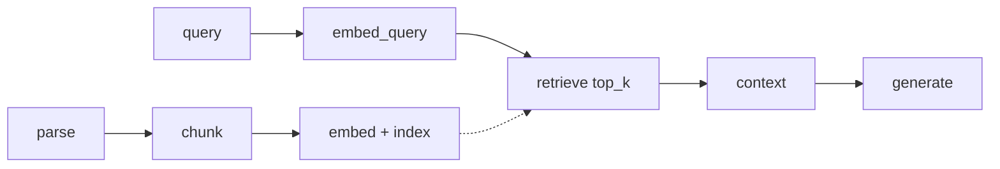
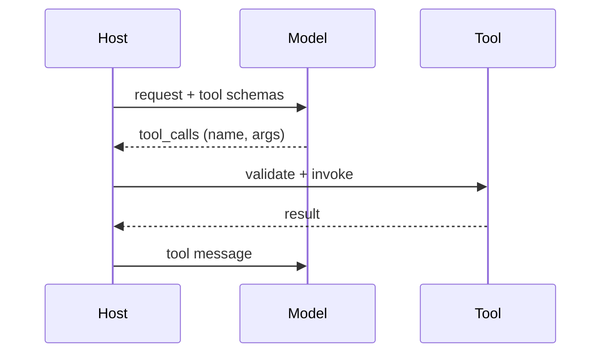

# LLM terms glossary

A glossary of twenty core LLM terms. Each entry pairs the definition with **where it bites** (the failure or decision it explains).

The definition is the starting point; the value is knowing which term applies to a failure you are describing. See [README](README.md) for the shared conventions (anchor format, repo layers).

---

# Core model concepts

## Token

**Definition:** the smallest unit of text a model processes — usually a sub-word piece, not a full word.

**Where it bites:** cost and context limits are counted in tokens, not words, so JSON, code, and non-English text fragment heavily and cost more per word. Off-by-token bugs show up as over-limit requests and surprise bills.

## Embedding

**Definition:** a numerical vector that represents the meaning of text, used for similarity search.

**Where it bites:** an embedding is only meaningful relative to the model that produced it, so swapping models invalidates a corpus; and cosine closeness is topical, not answer relevance.

## Context window

**Definition:** the maximum amount of text a model can process in a single request.

**Where it bites:** exceeding it either errors or forces truncation; fitting it is not enough because long context dilutes attention. The management of the window (drop, offload, compact) is where RAG and agents actually operate.

## Temperature

**Definition:** controls output randomness at sampling; lower values produce more deterministic output.

**Where it bites:** `T=0` is greedy (reproducible, good for extraction/classification); higher `T` is more diverse but more error-prone. Set per task, and watch that providers apply it server-side.

## Top-p (nucleus sampling)

**Definition:** limits token selection to the smallest set of tokens whose combined probability exceeds `p`.

**Where it bites:** it adapts the candidate count to the model's confidence (fewer tokens when peaked, more when flat) — usually a better default than a fixed top-k.

---

# RAG and retrieval

## RAG

**Definition:** giving a model access to external data by retrieving relevant passages and putting them in the prompt before generation.

**Where it bites:** it fixes knowledge (fresh, private, citable) but adds a retrieval failure surface — wrong chunk, no chunk, or relevant chunk that the model ignores.

## Chunking

**Definition:** splitting documents into smaller pieces before embedding so retrieval returns relevant sections.

**Where it bites:** chunk size is the single most common retrieval failure: too small loses context and splits answers; too large dilutes the embedding. Boundary handling (overlap, sentence-awareness) determines whether the answer is retrievable.

## Vector database

**Definition:** a database built for similarity search over embeddings rather than exact-match queries.

**Where it bites:** choice and tuning drive scale/latency (ANN index, quantization, sharding); metadata filtering and hybrid search are what make it production-usable, and a dropped filter can silently leak data.

## Reranking

**Definition:** reordering retrieved documents by actual relevance (via a cross-encoder) after an initial broad retrieval.

**Where it bites:** it improves precision@k and lets you retrieve more then pass fewer, but it cannot recover documents retrieval never returned and it adds latency.

## Hallucination

**Definition:** confident but factually incorrect or unsupported output.

**Where it bites:** it is a property of next-token objective, not a bug you patch; it is mitigated by grounding (retrieval/citations), verification, and abstention — none of which are free.

---

# Customization

## Fine-tuning

**Definition:** further training a model on a specific dataset to adjust its behavior or style.

**Where it bites:** good for behavior/format/tone, bad for volatile facts (expensive to update, no citations). LoRA/PEFT makes it cheaper; full FT is rarely needed.

## Prompt engineering

**Definition:** structuring input to get a reliable, specific output without changing the model.

**Where it bites:** it ships in seconds and is the first lever for behavior/format; its weakness is brittleness and token cost as prompts grow.

## Few-shot prompting

**Definition:** providing a small number of examples in the prompt to guide output format/behavior (a specific form of prompt engineering).

**Where it bites:** helps when the format or edge-case convention is hard to specify in words; costs tokens and can bias toward the examples.

## Chain-of-thought prompting

**Definition:** asking the model to reason step by step before giving a final answer (a reasoning-oriented prompt-engineering technique).

**Where it bites:** helps multi-step reasoning/arithmetic (its benefit grows with model scale; unreliable on small models); largely subsumed by native reasoning models, and it adds tokens.

---

# Agents and tools

## Function calling

**Definition:** a model's ability to emit a structured request to invoke an external tool/API.

**Where it bites:** the host must validate arguments against the schema, dispatch, and feed the result back; malformed arguments and wrong tool choice are the failure modes.

## Agent

**Definition:** a system where the model plans, calls tools, and decides its own next step in a loop.

**Where it bites:** the loop needs a termination rule (no tool calls) and hard caps (iterations, tokens, time) or it runs away; reliability comes from the caps, not the model.

## Memory

**Definition:** context an agent retains across turns (short-term) or sessions (long-term).

**Where it bites:** short-term memory is bounded context management; long-term memory needs extraction, dedup/conflict resolution, and retrieval — otherwise it grows unbounded or becomes stale.

---

# Production concerns

## Latency

**Definition:** the time between sending a request and receiving a complete response.

**Where it bites:** in multi-step pipelines it compounds across retrieval, rerank, and generation; users perceive **TTFT**, so streaming changes the experience without changing total time.

## Quantization

**Definition:** reducing a model's numerical precision to shrink size and speed up inference.

**Where it bites:** it trades a little accuracy for large memory/latency wins; for RAG it also applies to the **vector index** (compressing embeddings), not just model weights.

## Prompt injection

**Definition:** malicious or unintended instructions embedded in input or retrieved content that hijack the model.

**Where it bites:** it arrives through retrieved documents and tool results, not just user text, so treating that content as data (and enforcing controls outside the model) matters more than a system-prompt warning.

---

## Why this matters

Each entry above pairs the definition with the failure it explains and the mechanism that handles it.

| Term | Where it most often bites |
|---|---|
| Token | cost/context off-by-token |
| Embedding | model swap invalidates the corpus; topical ≠ relevant |
| Context window | truncation; long-context dilution |
| Temperature | determinism vs diversity per task |
| Top-p | adaptive vs fixed candidate count |
| RAG | retrieval failure surface |
| Chunking | #1 retrieval failure source |
| Vector database | scale/latency, filtering, hybrid |
| Reranking | precision@k vs latency |
| Hallucination | grounding/verification/abstention |
| Fine-tuning | behavior not volatile facts |
| Prompt engineering | first lever; brittleness |
| Few-shot | format control; token cost |
| Chain-of-thought | multi-step reasoning; native reasoning models |
| Function calling | schema validation + dispatch |
| Agent | termination rule + hard caps |
| Memory | bounded context; extraction/conflict |
| Latency | TTFT + compounding stages |
| Quantization | model weights + vector index |
| Prompt injection | untrusted retrieved/tool content |
