# RAG and retrieval

41 unique questions, deduplicated from the archived docs. Each `##` is one question; identical questions from other docs were merged. Full source files are in `source/`.
## 1. Walking through a RAG pipeline end to end, query to final answer

**General:** Ingest: parse → chunk → embed → index. Query: embed the query → retrieve top-k (dense and/or sparse) → rerank → assemble the retrieved context into the prompt → generate → optionally cite. Each stage is separable; failures and quality drops can occur at any of them.

**Jiuwen:** Ingestion: `KnowledgeBase.parse_files` (parser), then `SimpleKnowledgeBase.add_documents` calls `chunker.chunk_documents`, builds an `IndexConfig`, and `Indexer.build_index` computes embeddings via `compute_chunk_embeddings` and writes them to the vector store. Query: `SimpleKnowledgeBase.retrieve` lazily instantiates `VectorRetriever`/`SparseRetriever`/`HybridRetriever` by `index_type`, embeds the query, and calls `vector_store.search`. The production end-to-end wiring is the workflow `KnowledgeRetrievalComponent`, which returns `results`/`context` (texts joined by `\n\n`); a downstream `LLMComponent` formats them (e.g. `Context:\n{{context}}\n\nQuestion: {{query}}`).

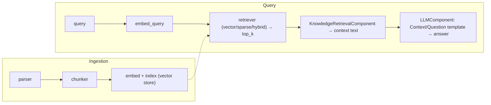

<details>
<summary>Anchors</summary>

<sub><strong>Anchors:</strong><br>&bull; <code>agent-core/openjiuwen/core/retrieval/simple_knowledge_base.py:96</code> — <code>chunk_documents</code>; <code>:110</code> <code>build_index(chunks=..., embed_model=...)</code>; <code>:182</code> delegate to retriever<br>&bull; <code>agent-core/openjiuwen/core/retrieval/indexing/indexer/embed_chunks.py:46/73</code> — <code>embed_documents</code> / <code>embed_multimodal</code> set <code>chunk.embedding</code><br>&bull; <code>agent-core/openjiuwen/core/retrieval/retriever/vector_retriever.py:78</code> — <code>embed_query</code> → <code>vector_store.search</code><br>&bull; <code>agent-core/openjiuwen/core/workflow/components/resource/knowledge_retrieval_comp.py:109</code> — <code>retrieve_multi_kb_with_source(...)</code>; <code>:243</code> joins texts into <code>context</code><br>&bull; <code>agent-core/openjiuwen/core/workflow/components/llm/llm_comp.py:654</code> — template format feeding <code>{{context}}</code>/<code>{{query}}</code></sub>

</details>

**Gap.** No packaged end-to-end RAG agent or retrieval tool in `harness`/`agent_teams`; `KnowledgeRetrievalComponent` only emits a string. Retrieved context is concatenated with no token-budget trimming and no citation synthesis.

<sub>_Canonical source: `source/ai-engineer-technical-questions_for_engineers.md`; also covered in: engineering, genai, llm-applied, rag-1._</sub>

## 2. The pipeline: query embedding, vector search, context assembly, prompt construction, generation

**General:** Ingest: parse → chunk → embed → index. Query: embed the query → retrieve top-k (dense and/or sparse) → rerank → assemble the retrieved context into the prompt → generate → optionally cite. Each stage is separable; failures and quality drops can occur at any of them.

**Jiuwen:** Ingestion: `KnowledgeBase.parse_files` (parser), then `SimpleKnowledgeBase.add_documents` calls `chunker.chunk_documents`, builds an `IndexConfig`, and `Indexer.build_index` computes embeddings via `compute_chunk_embeddings` and writes them to the vector store. Query: `SimpleKnowledgeBase.retrieve` lazily instantiates `VectorRetriever`/`SparseRetriever`/`HybridRetriever` by `index_type`, embeds the query, and calls `vector_store.search`. The production end-to-end wiring is the workflow `KnowledgeRetrievalComponent`, which returns `results`/`context`; a downstream `LLMComponent` formats them into the prompt.


<details>
<summary>Anchors</summary>

<sub><strong>Anchors:</strong><br>&bull; <code>agent-core/openjiuwen/core/retrieval/simple_knowledge_base.py:96</code> — <code>chunk_documents</code>; <code>:110</code> <code>build_index(...)</code>; <code>:182</code> delegate to retriever<br>&bull; <code>agent-core/openjiuwen/core/retrieval/indexing/indexer/embed_chunks.py:46/73</code> — <code>embed_documents</code> / <code>embed_multimodal</code><br>&bull; <code>agent-core/openjiuwen/core/retrieval/retriever/vector_retriever.py:78</code> — <code>embed_query</code> → <code>vector_store.search</code><br>&bull; <code>agent-core/openjiuwen/core/workflow/components/resource/knowledge_retrieval_comp.py:109</code> — <code>retrieve_multi_kb_with_source(...)</code>; <code>:243</code> joins texts into <code>context</code><br>&bull; <code>agent-core/openjiuwen/core/workflow/components/llm/llm_comp.py:654</code> — template format feeding <code>{{context}}</code>/<code>{{query}}</code></sub>

</details>

**Gap.** No packaged end-to-end RAG agent or retrieval tool in `harness`/`agent_teams`.

<sub>_Canonical source: `source/rag-practical-interview-questions_for_engineers.md`; also covered in: rag-practical._</sub>

## 3. How do you measure whether your retrieval step is actually working

**General:** Use retrieval metrics against a labeled set of (query, relevant docs): Recall@k (did the relevant docs appear in top-k?), Precision@k (of the top-k, how many are relevant?), MRR (mean of 1/rank of the first relevant hit, averaged over queries), and NDCG (position-weighted with graded relevance). Track zero-result rate and score distributions in production, and check that a reranker actually improves NDCG rather than just reordering.

**Jiuwen:** None of these metrics exist. There is no `recall_at_k`/`precision_at_k`/MRR/NDCG, no ranked-list metric interface (`Metric.compute(prediction, label)` is pairwise), and no gold-relevance set. The only recall/precision present is *classification* metrics in the PerStream example and sklearn gate tests. The reranker's only before/after evidence is a demo score-delta script with no labels.

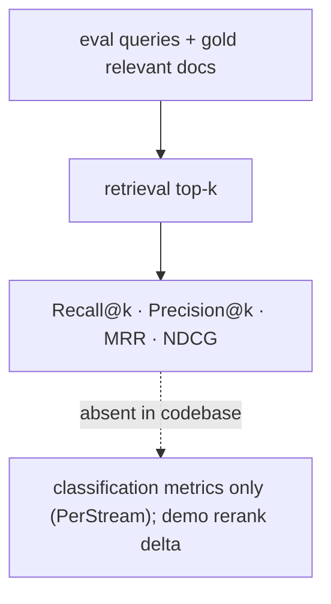

<details>
<summary>Anchors</summary>

<sub><strong>Anchors:</strong><br>&bull; <code>agent-core/openjiuwen/agent_evolving/evaluator/metrics/base.py:42</code> — <code>compute(prediction, label)</code>, no ranked list<br>&bull; <code>agent-core/openjiuwen/agent_evolving/evaluator/metrics/__init__.py:11</code> — only three metrics exported<br>&bull; <code>agent-core/examples/PerStream/src/eval/score_proactive_judge.py:355/362</code> — classification recall/precision<br>&bull; <code>agent-core/examples/store/showcase_milvus_graph_store.py:51</code> — reranker score-delta (no labels)</sub>

</details>

<sub>_Canonical source: `source/rag-part1-interview-questions_for_engineers.md`; also covered in: rag-1._</sub>

## 4. What is Modular RAG, and how is it different from a simple RAG pipeline

**General:** A simple RAG pipeline is a fixed linear chain (retrieve → stuff → generate). Modular RAG decomposes it into interchangeable modules — indexing, retrieval, fusion, reranking, query rewriting, generation, orchestration — with routing and scheduling, so you can swap or add modules (rewrite, rerank, iterative/multi-hop retrieval) and branch conditionally per query. It is "RAG as a configurable graph of components" rather than one hardcoded path. The cost is more moving parts and the need for a router/orchestrator.

**Jiuwen:** The building blocks are modular and pluggable: parsers self-register by extension, chunkers are selected from a registry, retrievers are chosen by `index_type`, the vector store comes from a factory, rerankers and query rewriters are swappable classes, and `RetrievalConfig.agentic` toggles the LLM-driven iterative retriever. But the modules are composed **manually** via config/KB construction — there is no per-query router/scheduler that assembles a module graph, and `AgenticRetriever` derives its mode from `index_type` rather than planning.

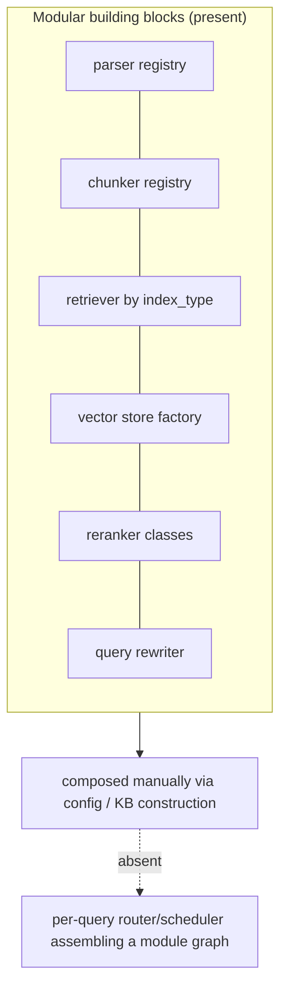

<details>
<summary>Anchors</summary>

<sub><strong>Anchors:</strong><br>&bull; <code>agent-core/openjiuwen/core/retrieval/indexing/processor/parser/auto_file_parser.py:21</code> — parser registry by extension<br>&bull; <code>agent-core/openjiuwen/core/retrieval/indexing/processor/chunker/__init__.py:117</code> — chunker registry<br>&bull; <code>agent-core/openjiuwen/core/retrieval/simple_knowledge_base.py:141</code> — retriever selection by <code>index_type</code>; <code>:172</code> agentic wrap toggle<br>&bull; <code>agent-core/openjiuwen/core/retrieval/vector_store/store.py:16</code> — vector store factory; <code>agent-core/openjiuwen/core/retrieval/common/config.py:67</code> — <code>StoreType</code><br>&bull; <code>agent-core/openjiuwen/core/retrieval/reranker/standard_reranker.py:23</code> — swappable reranker<br>&bull; <code>agent-core/openjiuwen/core/retrieval/query_rewriter/query_rewriter.py:412</code> — query rewriter module<br>&bull; <code>agent-core/openjiuwen/core/retrieval/common/config.py:51</code> — <code>agentic</code> toggle</sub>

</details>

<sub>_Canonical source: `source/rag-part1-interview-questions_for_engineers.md`; also covered in: rag-1._</sub>

## 5. Deciding chunk size, and what breaks at each extreme

**General:** Chunk size trades context against precision. Too small and each chunk lacks the context to answer (and the answer may be split across chunks); too large and a chunk covers many topics, diluting the embedding and wasting the prompt budget. Practical defaults are a few hundred tokens with modest overlap, then tune against a retrieval eval. Size is usually measured in tokens (what the model sees), not characters.

**Jiuwen:** `Chunker.__init__` defaults `chunk_size=512`, `chunk_overlap=50`, `length_function=len`. Size is measured in characters (`CharChunker` → `CharSplitter`, `len()`) or tokens (`TokenizerChunker` → `IndexSentenceSplitter` → `SentenceSplitter`, tokenizer length). Hard validation rejects `chunk_size<=0`, `chunk_overlap<0`, and `chunk_overlap>=chunk_size`. Token-based chunk size is silently clamped to the embedding tokenizer's `model_max_length` (`_resolve_chunk_size`), and DB caps fail at write time (Milvus text field `max_length=65535`, pgvector dims ≤2000).

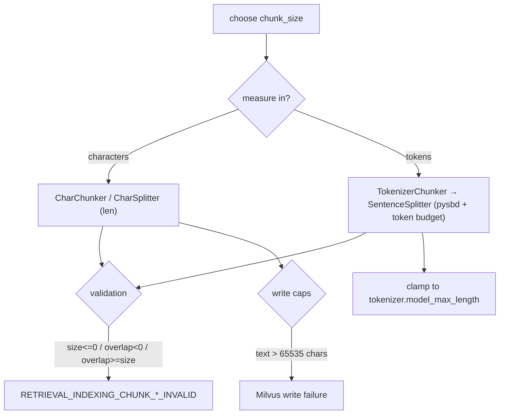

<details>
<summary>Anchors</summary>

<sub><strong>Anchors:</strong><br>&bull; <code>agent-core/openjiuwen/core/retrieval/indexing/processor/chunker/base.py:36</code> — defaults <code>chunk_size=512</code>, <code>chunk_overlap=50</code>; <code>:59/64/69</code> validation raises<br>&bull; <code>agent-core/openjiuwen/core/retrieval/common/config.py:34</code> — <code>KnowledgeBaseConfig.chunk_size/chunk_overlap</code><br>&bull; <code>agent-core/openjiuwen/core/retrieval/indexing/processor/chunker/text_splitter.py:15</code> — <code>DEFAULT_CHUNK_SIZE=200</code>; <code>:198</code> <code>_resolve_chunk_size</code> clamps to <code>tokenizer.model_max_length</code><br>&bull; <code>agent-core/openjiuwen/core/retrieval/indexing/processor/chunker/chunking.py:82</code> — <code>get_chunker</code> auto-lowers size to tokenizer max<br>&bull; <code>agent-core/openjiuwen/core/retrieval/indexing/indexer/milvus_indexer.py:375</code> — text field <code>max_length=65535</code><br>&bull; <code>agent-core/openjiuwen/core/retrieval/vector_store/pg_store.py:176</code> — pgvector rejects dim &gt; 2000</sub>

</details>

**Gap.** `KnowledgeBaseConfig.chunk_size/chunk_overlap` are never read by `SimpleKnowledgeBase.add_documents` (it uses the injected chunker), so those config fields are advisory. No document/file-length limit exists.

<sub>_Canonical source: `source/rag-retrieval-interview-questions_for_engineers.md`; also covered in: engineering, rag-retrieval, llm-applied, rag-1, rag-practical._</sub>

## 6. What happens if your chunks are too small or too large

**General:** Too small: each chunk lacks the context to answer, the answer gets split across chunks, and recall of the *answer-bearing* chunk drops while index size/overhead grows. Too large: the embedding averages multiple topics so relevance dilutes, retrieval precision drops, and each hit wastes prompt tokens; it can also exceed the embedding model's max sequence length and get truncated. Both extremes lower end-to-end quality, for opposite reasons.

**Jiuwen:** The code guards the mechanics but not the quality: construction rejects `chunk_size <= 0` / `chunk_overlap >= chunk_size`, token chunkers clamp size to the tokenizer max (so oversized chunks are silently truncated to the model limit), and Milvus fails the write above 65535 chars. There is no retrieval-quality feedback loop to tell you a size choice was bad.

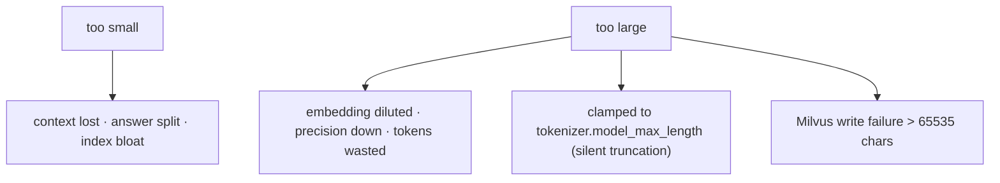

<details>
<summary>Anchors</summary>

<sub><strong>Anchors:</strong><br>&bull; <code>agent-core/openjiuwen/core/retrieval/indexing/processor/chunker/base.py:59/64/69</code> — validation raises<br>&bull; <code>agent-core/openjiuwen/core/retrieval/indexing/processor/chunker/text_splitter.py:198</code> — <code>_resolve_chunk_size</code> clamps to <code>model_max_length</code><br>&bull; <code>agent-core/openjiuwen/core/retrieval/indexing/processor/chunker/chunking.py:82</code> — tokenizer-limit auto-adjust<br>&bull; <code>agent-core/openjiuwen/core/retrieval/indexing/indexer/milvus_indexer.py:378</code> — text <code>max_length=65535</code></sub>

</details>

<sub>_Canonical source: `source/rag-part1-interview-questions_for_engineers.md`; also covered in: rag-1._</sub>

## 7. Fixed-size vs. semantic chunking, the actual retrieval tradeoff

**General:** Fixed-size chunking is deterministic and cheap but cuts mid-sentence or mid-table, producing fragments that embed poorly. Semantic / structure-aware chunking splits on natural boundaries (sentences, paragraphs, headings, records) so each chunk is coherent, at the cost of variable size and extra processing. Sentence-window and recursive-delimiter strategies sit between the two.

**Jiuwen:** True fixed-size is `CharChunker` (raw character windows via `CharSplitter`). Token-based `TokenizerChunker` is actually sentence-boundary-aware: `SentenceSplitter` uses `pysbd` to segment and packs whole sentences up to a token budget, sub-splitting overly long sentences. `HybridChunker` is a structural guard, not a semantic splitter — it keeps `source_type in ("row","column")` units whole and delegates the rest. There is no embedding-similarity breakpoint chunker and no recursive delimiter hierarchy; `splitter_config` is normalized but never forwarded to `SentenceSplitter` (an inert stub).

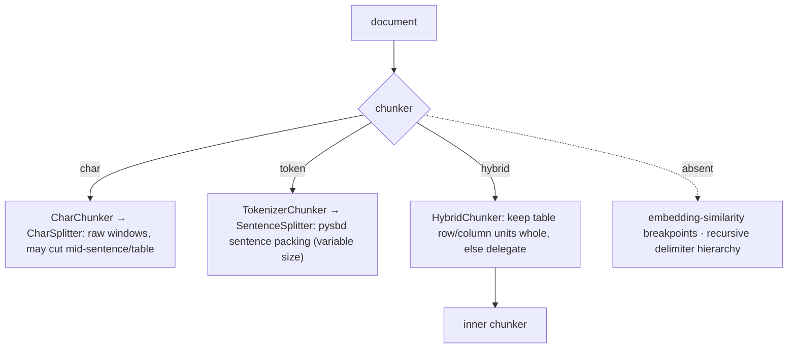

<details>
<summary>Anchors</summary>

<sub><strong>Anchors:</strong><br>&bull; <code>agent-core/openjiuwen/core/retrieval/indexing/processor/chunker/char_chunker.py:12</code> — <code>CharChunker</code> "fixed size based on character length"; <code>:47</code> builds <code>CharSplitter</code><br>&bull; <code>agent-core/openjiuwen/core/retrieval/indexing/processor/chunker/text_splitter.py:47</code> — <code>CharSplitter.split</code> slices <code>text[start:end]</code><br>&bull; <code>agent-core/openjiuwen/core/retrieval/indexing/processor/chunker/tokenizer_chunker.py:17</code> — <code>TokenizerChunker</code> builds <code>IndexSentenceSplitter</code><br>&bull; <code>agent-core/openjiuwen/core/retrieval/indexing/processor/splitter/splitter.py:92</code> — <code>SentenceSplitter.__call__</code> (pysbd); <code>:142</code> <code>_sentences_with_spans</code>; <code>:173</code> long-sentence sub-split<br>&bull; <code>agent-core/openjiuwen/core/retrieval/indexing/processor/chunker/hybrid_chunker.py:19</code> — <code>HybridChunker</code> no-split predicate; <code>:66</code> delegation<br>&bull; <code>agent-core/openjiuwen/core/retrieval/indexing/processor/chunker/__init__.py:117</code> — only <code>"char"</code>/<code>"hybrid"</code> registered<br>&bull; <code>agent-core/openjiuwen/core/retrieval/indexing/processor/chunker/text_splitter.py:98</code> — <code>splitter_config</code> normalized but not forwarded</sub>

</details>

<sub>_Canonical source: `source/rag-retrieval-interview-questions_for_engineers.md`; also covered in: rag-practical, rag-retrieval._</sub>

## 8. Overlapping vs. non-overlapping chunks

**General:** A small overlap preserves context that straddles a boundary, improving recall for answers that span a cut; too much overlap duplicates content, inflates the index, and can return near-identical hits that crowd out diverse results. Non-overlapping is cheaper and deduplicated but risks losing boundary context.

**Jiuwen:** Overlap is a first-class `chunk_overlap` integer (default 50) enforced on both paths. `CharSplitter` does a strided sliding window (`step = chunk_size - chunk_overlap`). `SentenceSplitter` re-injects a suffix of whole sentences from the previous buffer up to the overlap token budget, so token chunks overlap on sentence boundaries. Overlap content is duplicated text across chunks, and chunk IDs are fresh UUIDs each run, so downstream indexing cannot distinguish overlap content.

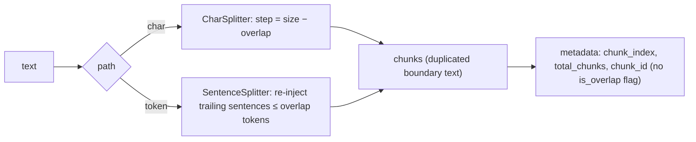

<details>
<summary>Anchors</summary>

<sub><strong>Anchors:</strong><br>&bull; <code>agent-core/openjiuwen/core/retrieval/indexing/processor/chunker/base.py:39</code> — <code>chunk_overlap: int = 50</code>; <code>:69</code> <code>overlap &gt;= chunk_size</code> raises; <code>:106</code> overlap not carried into metadata<br>&bull; <code>agent-core/openjiuwen/core/retrieval/indexing/processor/chunker/text_splitter.py:41</code> — overlap clamped to <code>[0, size-1]</code>; <code>:54</code> <code>step = chunk_size - chunk_overlap</code>; <code>:56</code> slicing loop; <code>:110</code> token path default <code>chunk_size // 5</code><br>&bull; <code>agent-core/openjiuwen/core/retrieval/indexing/processor/splitter/splitter.py:215</code> — <code>_flush</code> re-injects trailing sentences ≤ overlap; <code>:186</code> long-segment window step</sub>

</details>

<sub>_Canonical source: `source/rag-retrieval-interview-questions_for_engineers.md`; also covered in: rag-1, rag-retrieval._</sub>

## 9. Chunking structured content like tables, code, or nested headings without losing structure

**General:** Structure should be captured at parse time and carried as metadata, not thrown away before chunking. Tables should stay intact or be serialized (row/column/record), code should be split on function/class boundaries with fences preserved, and nested headings should be used as split boundaries with the heading path attached to each chunk. A generic text chunker over flattened content loses all of this.

**Jiuwen:** Structure is preserved at parse time, not chunk time. Excel emits one `Document` per data row and per column tagged `source_type` (`row`/`column`), and `HybridChunker` keeps those as atomic chunks. Word emits heading-marked Markdown (`#`, `##`, …) and Markdown tables. PDF/HTML flatten to newline-joined text; JSON is pretty-printed. Metadata (`source_type`, `sheet_name`, `row_index`, `column_name`, `image_path`, `title`) is propagated from `Document` to `TextChunk` by the chunker base. There is no Markdown-header-aware chunker, so `##` sections can still be split mid-section, and HTML heading tags are discarded before chunking.

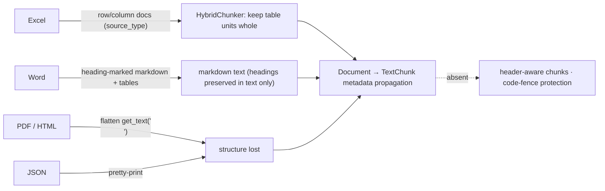

<details>
<summary>Anchors</summary>

<sub><strong>Anchors:</strong><br>&bull; <code>agent-core/openjiuwen/core/retrieval/indexing/processor/parser/excel_parser.py:32</code> — <code>_rows_to_documents</code>; <code>:69</code> <code>source_type: "row"</code>; <code>:96</code> <code>source_type: "column"</code><br>&bull; <code>agent-core/openjiuwen/core/retrieval/indexing/processor/parser/word_parser.py:23</code> — <code>_table_to_markdown</code>; <code>:37</code> <code>_paragraph_to_markdown</code> (Heading N → N+1 hashes)<br>&bull; <code>agent-core/openjiuwen/core/retrieval/indexing/processor/chunker/hybrid_chunker.py:19</code> — keeps <code>row</code>/<code>column</code> units as one chunk<br>&bull; <code>agent-core/openjiuwen/core/retrieval/indexing/processor/parser/html_file_parser.py:78</code> — <code>_get_text_from_soup</code> flattens<br>&bull; <code>agent-core/openjiuwen/core/retrieval/indexing/processor/parser/txt_md_parser.py:40</code> — Markdown read verbatim<br>&bull; <code>agent-core/openjiuwen/core/retrieval/indexing/processor/chunker/base.py:106</code> — metadata copied onto every <code>TextChunk</code></sub>

</details>


<sub>_Canonical source: `source/rag-retrieval-interview-questions_for_engineers.md`; also covered in: rag-retrieval._</sub>

## 10. Context relevant but answer vague: chunk boundaries likely cut the answer mid context

**General:** If the answer spans a chunk boundary, the chunk that ranks may contain only half of it, so the model sees an incomplete fact. Remedies: overlap chunks, split on sentence/structure boundaries rather than fixed characters, and at serve time expand a hit with its neighbors. Sentence-aware chunking with overlap is the common fix; fixed-character splitting is the usual culprit.

**Jiuwen:** Protection is inconsistent by chunker. `SentenceSplitter` builds chunks from whole `pysbd` sentences, carries trailing sentences into the next chunk for overlap, and sub-splits over-long sentences losslessly; `HybridChunker` keeps table rows/columns whole. But `CharChunker`/`CharSplitter` (whose `chunk_unit="char"` default sets the unit) hard-cut at fixed offsets, `WhitespaceNormalizer` collapses newlines and destroys paragraph structure before splitting, and downstream `budget_guard`/`round_level_compressor` truncate head/tail (dropping the middle) rather than extracting the answer span.

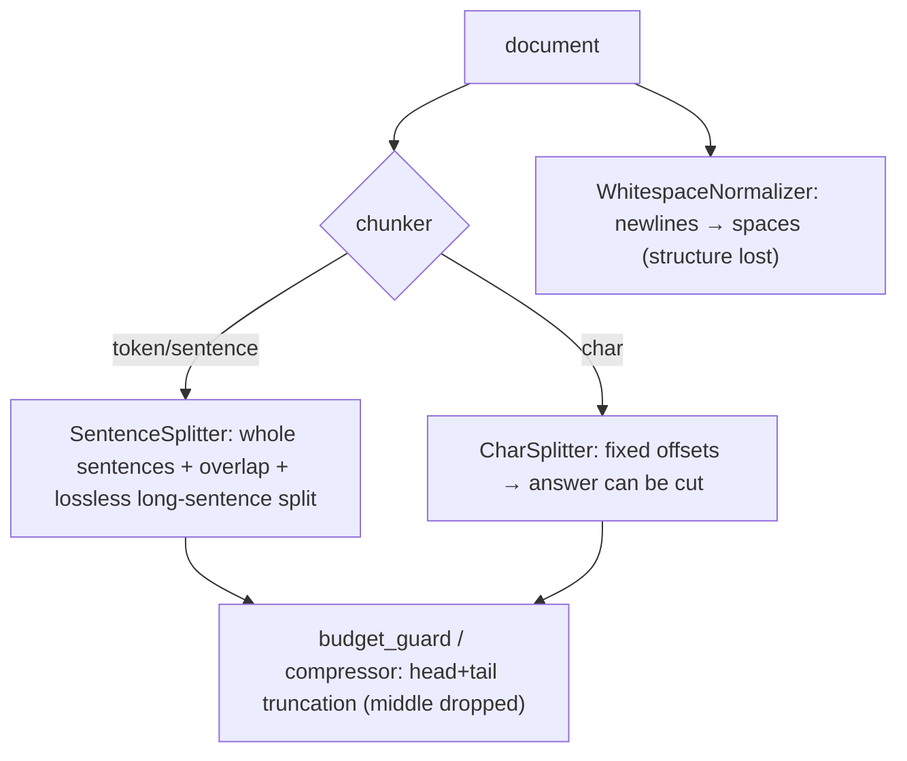

<details>
<summary>Anchors</summary>

<sub><strong>Anchors:</strong><br>&bull; <code>agent-core/openjiuwen/core/retrieval/indexing/processor/splitter/splitter.py:119</code> — long-sentence sub-split; <code>:142</code> <code>_sentences_with_spans</code>; <code>:210</code> <code>_flush</code> overlap<br>&bull; <code>agent-core/openjiuwen/core/retrieval/indexing/processor/chunker/hybrid_chunker.py:19</code> — keep row/column units whole<br>&bull; <code>agent-core/openjiuwen/core/retrieval/indexing/processor/chunker/text_splitter.py:56</code> — <code>CharSplitter</code> fixed offsets<br>&bull; <code>agent-core/openjiuwen/core/retrieval/indexing/processor/chunker/text_preprocessor.py:53</code> — <code>WhitespaceNormalizer</code><br>&bull; <code>agent-core/openjiuwen/core/context_engine/processor/budget_guard.py:118</code> — head/tail truncation; <code>agent-core/openjiuwen/core/context_engine/processor/compressor/round_level_compressor.py:1088</code> — <code>_build_head_tail_truncated_text</code></sub>

</details>


<sub>_Canonical source: `source/rag-practical-interview-questions_for_engineers.md`; also covered in: rag-practical._</sub>

## 11. Picking an embedding model, and whether bigger always means better retrieval

**General:** Bigger is not automatically better: retrieval quality depends on domain fit, the language, whether the model is asymmetric (query vs passage prefixes), the dimension you can afford, and latency/cost. A smaller in-domain model often beats a large general one, and dimensionality reduction (Matryoshka) can trade a little recall for large storage savings. The right way to pick is to measure recall on your own data, not to read a leaderboard.

**Jiuwen:** An `Embedding` ABC defines `embed_query`, `embed_documents`, and a `dimension` property; `EmbeddingConfig` carries only `model_name`/`base_url`/`api_key`. Providers are `APIEmbedding` (generic HTTP), `OpenAIEmbedding` (OpenAI-compatible), `VLLMEmbedding` (extends OpenAI, adds multimodal `instruction`), and `DashscopeEmbedding`. Dimension is discovered lazily from the first response or set explicitly for Matryoshka models. Batching is provider-level (`max_batch_size=8`, `max_concurrent=50`). Model choice is entirely caller-driven — there is no model registry, benchmark, or size heuristic.

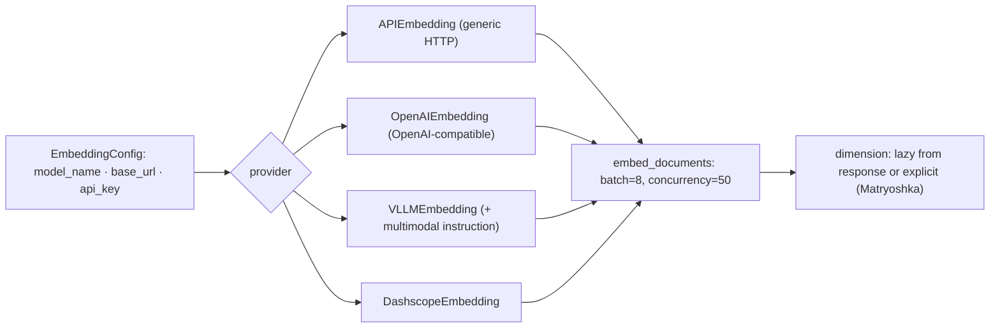

<details>
<summary>Anchors</summary>

<sub><strong>Anchors:</strong><br>&bull; <code>agent-core/openjiuwen/core/foundation/store/base_embedding.py:16</code> — <code>EmbeddingConfig</code>; <code>:24</code> <code>Embedding</code> ABC; <code>:29</code> <code>embed_query</code><br>&bull; <code>agent-core/openjiuwen/core/retrieval/embedding/openai_embedding.py:67</code> — Matryoshka <code>dimension</code><br>&bull; <code>agent-core/openjiuwen/core/retrieval/embedding/dashscope_embedding.py:105</code> — Dashscope <code>dimension</code><br>&bull; <code>agent-core/openjiuwen/core/retrieval/embedding/api_embedding.py:45</code> — <code>max_batch_size=8</code>; <code>:46</code> <code>max_concurrent=50</code>; <code>:175</code> batch splitting/concurrency<br>&bull; <code>agent-core/openjiuwen/core/retrieval/embedding/vllm_embedding.py:17</code> — <code>VLLMEmbedding</code></sub>

</details>

**Gap.** No `create_embedding` factory or model-selection helper in `core/retrieval` (only `create_vector_store` exists there; embedding factories live elsewhere, e.g. `create_embedding_provider` in the memory subsystem), and no evaluation/benchmark to justify model size.

<sub>_Canonical source: `source/rag-retrieval-interview-questions_for_engineers.md`; also covered in: rag-1, rag-practical, rag-retrieval._</sub>

## 12. Should queries and documents use the same embedding model

**General:** Yes — queries and documents must be embedded by the same model, and for asymmetric models you must also apply the correct role prefix (e.g. `query:` vs `passage:`) to each side. Mixing models produces incomparable vectors; dropping the role prefix on an instruction-tuned model measurably degrades retrieval.

**Jiuwen:** In the KB pipeline they do: one `embed_model` instance is held on the KB, passed to `build_index` for documents and to the constructed `VectorRetriever`/`HybridRetriever` for queries. Query embedding uses `embed_query`; document embedding uses `embed_documents`. For Dashscope, `embed_query` literally calls `embed_documents([text])` (the OpenAI-compatible client calls the same shared embedding method directly), so there is no query-vs-passage prefix distinction. Only `VLLMEmbedding.embed_multimodal` supports an `instruction`. Nothing validates that the retriever's model matches the indexer's (only dimension is indirectly constrained by the collection schema).

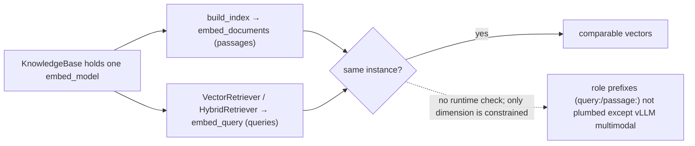

<details>
<summary>Anchors</summary>

<sub><strong>Anchors:</strong><br>&bull; <code>agent-core/openjiuwen/core/retrieval/retriever/vector_retriever.py:78</code> — query <code>embed_query</code><br>&bull; <code>agent-core/openjiuwen/core/retrieval/indexing/indexer/embed_chunks.py:46</code> — docs <code>embed_documents</code><br>&bull; <code>agent-core/openjiuwen/core/retrieval/simple_knowledge_base.py:110</code> — index build uses <code>self.embed_model</code>; <code>:144</code> <code>VectorRetriever(embed_model=...)</code>; <code>:157</code> <code>HybridRetriever(embed_model=...)</code><br>&bull; <code>agent-core/openjiuwen/core/retrieval/knowledge_base.py:34</code> — single <code>embed_model</code> field<br>&bull; <code>agent-core/openjiuwen/core/retrieval/embedding/dashscope_embedding.py:124</code> — <code>embed_query</code> delegates to <code>embed_documents</code><br>&bull; <code>agent-core/openjiuwen/core/retrieval/embedding/vllm_embedding.py:25</code> — instruction only for multimodal</sub>

</details>


<sub>_Canonical source: `source/rag-retrieval-interview-questions_for_engineers.md`; also covered in: rag-retrieval._</sub>

## 13. Why swapping embedding models forces a full re-embedding of the corpus

**General:** Stored vectors are the output of one specific model. A different model — even at the same dimension — projects into a different space, so old and new vectors are not comparable; distance computations become meaningless. You must re-embed every chunk (and often rebuild the index, since the vector width may change too). Good systems persist a model fingerprint/version with the index so a mismatch is detected rather than silently corrupted.

**Jiuwen:** At index time `compute_chunk_embeddings` calls `embed_model.embed_documents` and mutates `chunk.embedding` in place; indexers trigger it only for `vector`/`hybrid` index types. Milvus derives the collection vector `dim` from `embed_model.dimension` at schema creation and stores only the width — the model identity/name is **not persisted**. `update_index` deletes a doc's rows and rebuilds (re-embeds). Dimension is a hard constraint: Milvus/Chroma collections and pgvector tables are fixed-width (pgvector rejects >2000). So a model swap means a manual full re-index; there is only a low-level dimension-update migration operation with an optional re-embed callback.

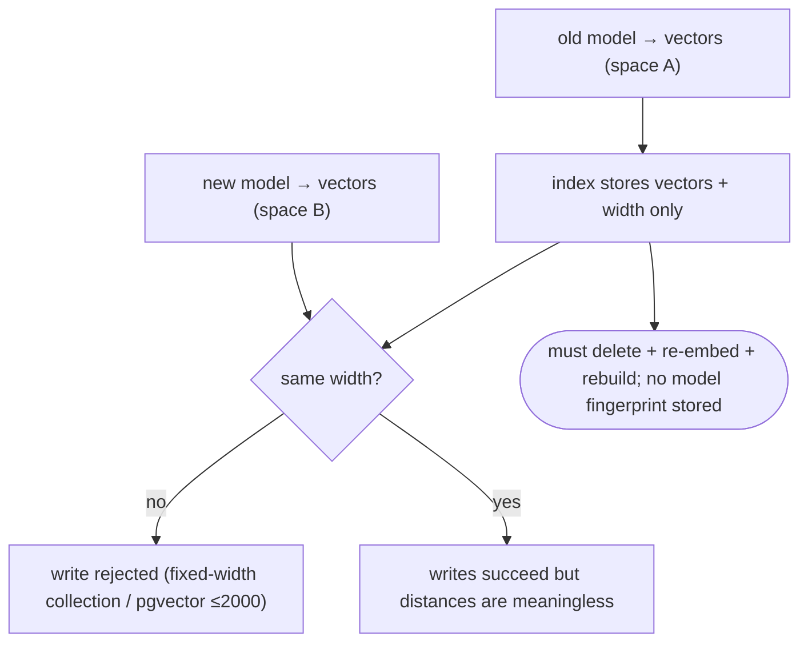

<details>
<summary>Anchors</summary>

<sub><strong>Anchors:</strong><br>&bull; <code>agent-core/openjiuwen/core/retrieval/indexing/indexer/embed_chunks.py:21</code> — <code>compute_chunk_embeddings</code>; <code>:46</code> <code>embed_documents</code> sets vectors<br>&bull; <code>agent-core/openjiuwen/core/retrieval/indexing/indexer/milvus_indexer.py:156</code> — embedding only for vector/hybrid; <code>:409</code> <code>dimension = embed_model.dimension</code>; <code>:427</code> schema stores <code>dim</code> but no model name; <code>:209</code> <code>update_index</code> = delete + rebuild<br>&bull; <code>agent-core/openjiuwen/core/retrieval/graph_knowledge_base.py:294</code> — <code>update_documents</code> delete + re-add<br>&bull; <code>agent-core/openjiuwen/core/retrieval/vector_store/pg_store.py:129</code> — fixed pgvector table definition<br>&bull; <code>agent-core/openjiuwen/core/foundation/store/vector/utils.py:264</code> — <code>UpdateEmbeddingDimensionOperation</code></sub>

</details>

<sub>_Canonical source: `source/rag-retrieval-interview-questions_for_engineers.md`; also covered in: rag-practical, rag-retrieval._</sub>

## 14. Multilingual documents: multilingual embedding models, translate at query or index time

**General:** Use a multilingual/alignment embedding model so queries and documents land in one space; if no good multilingual model exists for a language, translate either at index time (normalize the corpus) or query time (translate the query), and store language metadata so you can route and evaluate per language. Cross-lingual rerankers help at the top.

**Jiuwen:** Effectively bilingual zh/en at the processing layer, with no translation. `SentenceSplitter` resolves `lan` via a Chinese-character-ratio heuristic (→ zh or en) for `pysbd`; explicit codes are passed through (documented in the splitter docstrings). The query rewriter's `prompt_lang` only picks a `_zh.md`/`_en.md` template and never translates. Embedding clients expose no language parameter — multilingual support exists only if the operator picks a multilingual embedding model. No language metadata is persisted and there is no language routing.

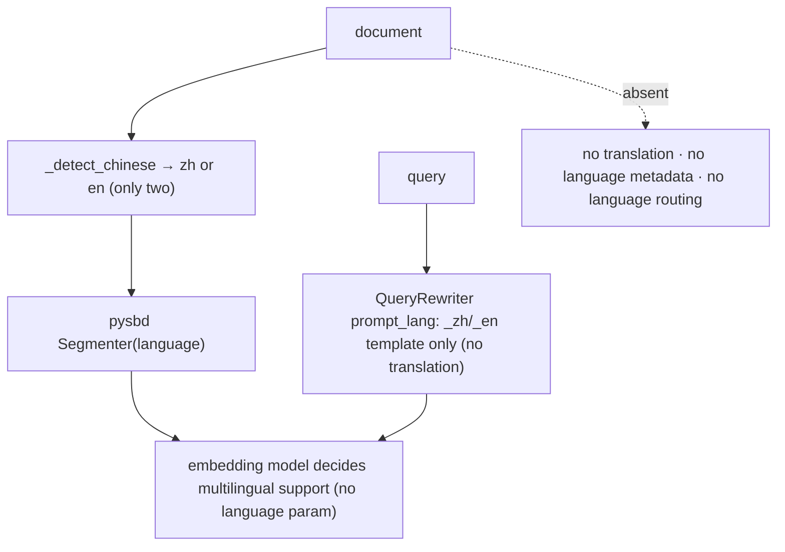

<details>
<summary>Anchors</summary>

<sub><strong>Anchors:</strong><br>&bull; <code>agent-core/openjiuwen/core/retrieval/indexing/processor/splitter/splitter.py:17</code> — <code>lan: str = "auto"</code>; <code>:46</code> <code>_detect_chinese(threshold=0.1)</code>; <code>:105</code> builds <code>Segmenter(language=...)</code><br>&bull; <code>agent-core/openjiuwen/core/retrieval/indexing/processor/chunker/text_splitter.py:81</code> — <code>IndexSentenceSplitter(language="auto")</code><br>&bull; <code>agent-core/openjiuwen/core/retrieval/indexing/processor/chunker/tokenizer_chunker.py:25</code> — <code>language="auto"</code><br>&bull; <code>agent-core/openjiuwen/core/retrieval/query_rewriter/query_rewriter.py:228</code> — <code>prompt_lang: str = "zh"</code>; <code>:309</code> template selection<br>&bull; <code>agent-core/openjiuwen/core/retrieval/embedding/openai_embedding.py:140</code> — no language field; <code>agent-core/openjiuwen/core/retrieval/embedding/dashscope_embedding.py:37</code> — multimodal, not multilingual</sub>

</details>

<sub>_Canonical source: `source/rag-practical-interview-questions_for_engineers.md`; also covered in: rag-practical._</sub>

## 15. Dense vs. sparse retrieval, and fusing both with reciprocal rank fusion

**General:** Dense retrieval embeds queries/documents and searches a vector index; it matches meaning but can miss rare exact terms. Sparse retrieval (BM25/TF-IDF) matches literal terms with term-frequency weighting; strong on exact tokens but fails on paraphrase. Fuse both — RRF (`Σ 1/(k+rank)`) is the robust default because it needs no score calibration.

**Jiuwen:** Dense is `VectorRetriever`; sparse is `SparseRetriever`, which on Milvus is real BM25 (`metric_type="BM25"` against a `SPARSE_FLOAT_VECTOR` field with `SPARSE_INVERTED_INDEX`). Chroma falls back to a TF-IDF text query; PG uses full-text search. `HybridRetriever` takes an `alpha` but every backend actually uses RRF: Milvus `RRFRanker(k=60)`, Chroma/PG `rrf_fusion(..., k=60)` scoring deduped text by `Σ 1/(k+rank)`. The only true weighted fusion is in the graph store (`WeightedRankConfig`).

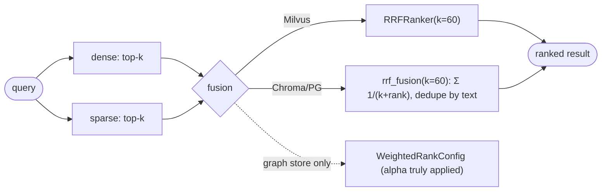

<details>
<summary>Anchors</summary>

<sub><strong>Anchors:</strong><br>&bull; <code>agent-core/openjiuwen/core/retrieval/retriever/sparse_retriever.py:19</code> — <code>SparseRetriever</code> (BM25); <code>:62</code> delegates to <code>sparse_search</code><br>&bull; <code>agent-core/openjiuwen/core/retrieval/vector_store/milvus_store.py:277</code> — <code>metric_type: "BM25"</code>; <code>:348</code> native <code>RRFRanker(k=60)</code><br>&bull; <code>agent-core/openjiuwen/core/retrieval/indexing/indexer/milvus_indexer.py:390</code> — Milvus <code>Function(BM25)</code>; <code>:399</code> <code>SPARSE_INVERTED_INDEX</code><br>&bull; <code>agent-core/openjiuwen/core/retrieval/retriever/hybrid_retriever.py:26</code> — <code>alpha</code> (ignored by stores)<br>&bull; <code>agent-core/openjiuwen/core/retrieval/utils/fusion.py:15/39</code> — <code>rrf_fusion</code> + <code>1/(k+rank)</code><br>&bull; <code>agent-core/openjiuwen/core/retrieval/vector_store/chroma_store.py:300</code> — no BM25 (TF-IDF); <code>agent-core/openjiuwen/core/retrieval/vector_store/pg_store.py:375</code> — FTS</sub>

</details>


<sub>_Canonical source: `source/rag-practical-interview-questions_for_engineers.md`; also covered in: rag-2, rag-practical, rag-retrieval._</sub>

## 16. When keyword search outperforms semantic search

**General:** Keyword search wins when the query contains exact identifiers, codes, rare names, or domain jargon that the embedding model never learned to map, and when the corpus is small or the terms are highly distinctive. Dense search wins on paraphrase and intent. The strongest approach is a router that picks by query type (or always runs hybrid and fuses).

**Jiuwen:** Routing is static and config-driven, not query-content-driven: `SimpleKnowledgeBase.retrieve` picks the retriever and mode from `config.index_type` (`vector` → `VectorRetriever`, `bm25` → `SparseRetriever`, else hybrid). `AgenticRetriever` derives its default mode from the underlying retriever's `index_type`, and `GraphRetriever` validates against `_allowed_modes`. The only dynamic keyword behavior is a degenerate fallback: if dense returns zero results, `VectorRetriever`/`HybridRetriever` re-run `sparse_search`. `QueryRewriter` produces an `intention` field but never uses it to switch modes.

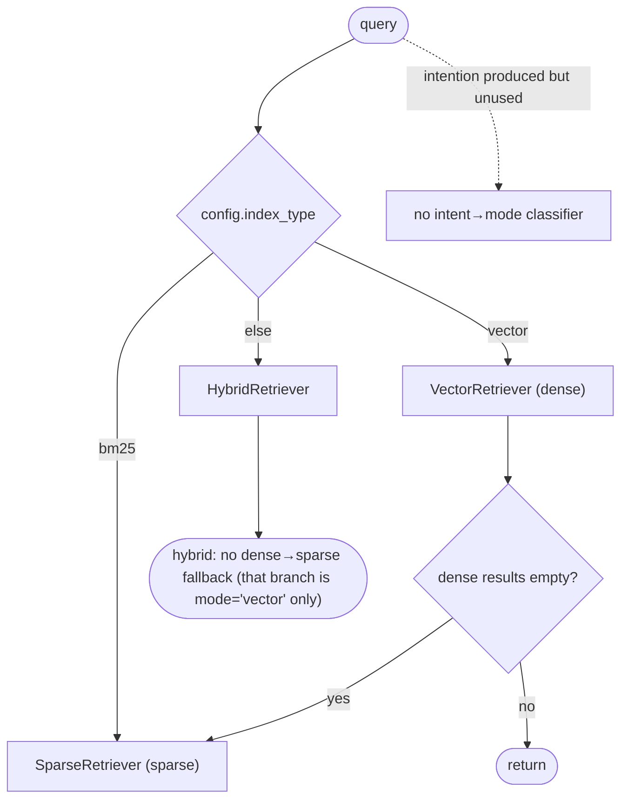

<details>
<summary>Anchors</summary>

<sub><strong>Anchors:</strong><br>&bull; <code>agent-core/openjiuwen/core/retrieval/simple_knowledge_base.py:141</code> — retriever selection by <code>index_type</code>; <code>:166</code> mode selection<br>&bull; <code>agent-core/openjiuwen/core/retrieval/retriever/vector_retriever.py:83</code> — dense-empty → BM25 fallback<br>&bull; <code>agent-core/openjiuwen/core/retrieval/retriever/hybrid_retriever.py:97</code> — same fallback<br>&bull; <code>agent-core/openjiuwen/core/retrieval/retriever/agentic_retriever.py:155</code> — <code>default_mode</code> from <code>index_type</code><br>&bull; <code>agent-core/openjiuwen/core/retrieval/retriever/graph_retriever.py:262</code> — <code>_allowed_modes</code><br>&bull; <code>agent-core/openjiuwen/core/retrieval/query_rewriter/query_rewriter.py:277</code> — rewrite schema includes <code>intention</code></sub>

</details>

<sub>_Canonical source: `source/rag-retrieval-interview-questions_for_engineers.md`; also covered in: rag-2, rag-practical, rag-retrieval._</sub>

## 17. Why a purely semantic system can fail on queries with exact codes, IDs, or names

**General:** Embedding models are trained on natural-language co-occurrence; short opaque tokens (error codes, SKUs, UUIDs, version strings, rare proper nouns) carry little semantic signal and get mapped to near-random neighbors. A semantically "close" but wrong chunk can outrank the exact hit, and because dense results are rarely empty, no lexical fallback fires. The fix is metadata/exact filtering, a sparse leg, or an explicit exact-match boost.

**Jiuwen:** The stores *can* filter: Milvus builds `key == value` expressions (string-sanitized) and supports `QueryExpr`; PG does JSONB containment; Chroma builds a `where` dict; Milvus even creates `INVERTED` scalar indexes on `document_id`/`chunk_id`. But the retriever layer hardcodes `filters=None` and drops the `filters` kwarg the KB passes, so metadata filtering is unreachable through `KnowledgeBase.retrieve`. There is no exact-term boost, no `IN`/`LIKE` substring matching, and the lexical fallback fires only when dense output is *empty*, not when it is semantically wrong.

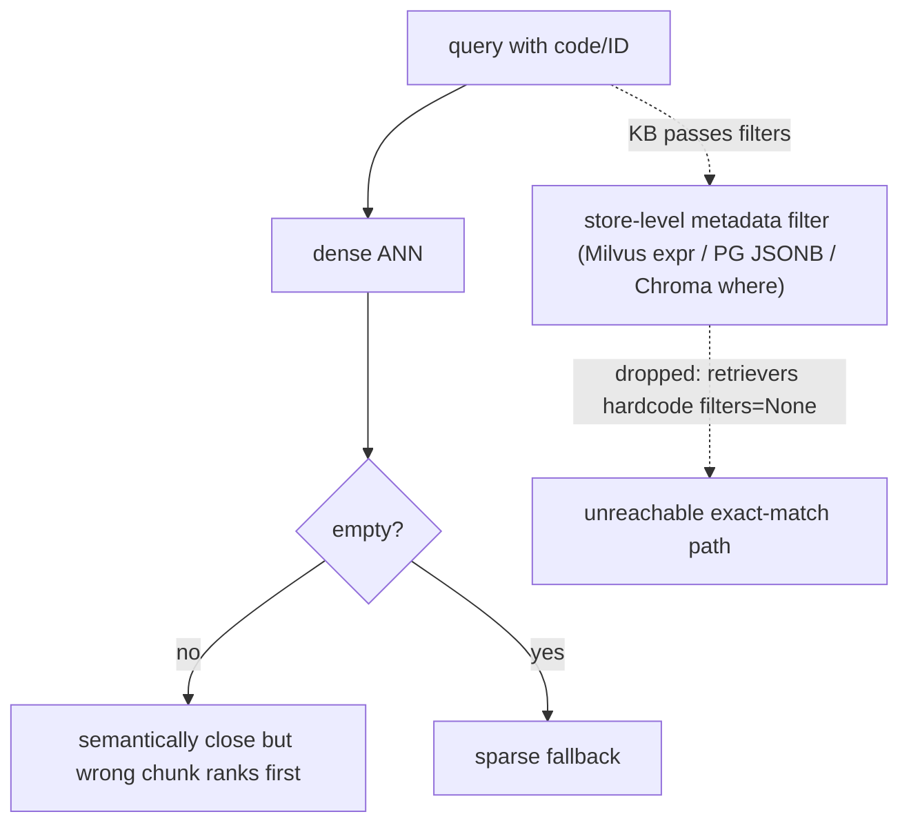

<details>
<summary>Anchors</summary>

<sub><strong>Anchors:</strong><br>&bull; <code>agent-core/openjiuwen/core/retrieval/retriever/vector_retriever.py:88</code> — hardcoded <code>filters=None</code>; <code>:84</code> sparse fallback only when dense empty<br>&bull; <code>agent-core/openjiuwen/core/retrieval/retriever/hybrid_retriever.py:81</code> — hardcoded <code>filters=None</code><br>&bull; <code>agent-core/openjiuwen/core/retrieval/simple_knowledge_base.py:186</code> — KB passes <code>filters</code>, retriever swallows it<br>&bull; <code>agent-core/openjiuwen/core/retrieval/vector_store/milvus_store.py:215</code> — <code>key == value</code> filter expr; <code>:219</code> <code>QueryExpr.sanitize_str</code><br>&bull; <code>agent-core/openjiuwen/core/retrieval/vector_store/pg_store.py:474</code> — <code>build_filters</code> JSONB containment<br>&bull; <code>agent-core/openjiuwen/core/retrieval/vector_store/chroma_store.py:265</code> — <code>where</code> dict filter<br>&bull; <code>agent-core/openjiuwen/core/retrieval/indexing/indexer/milvus_indexer.py:346</code> — <code>INVERTED</code> scalar index on doc id</sub>

</details>


<sub>_Canonical source: `source/rag-retrieval-interview-questions_for_engineers.md`; also covered in: engineering, rag-practical, rag-retrieval, genai, llm-applied, rag-1._</sub>

## 18. How do you decide between retrieving 5 documents versus 20

**General:** It is a recall-vs-precision/token/latency tradeoff. Retrieve more when the question is multi-part, aggregative, or high-stakes and recall matters; fewer when answers are localized and you want precision and low token cost. The robust pattern is retrieve a larger candidate set (e.g. 20–50), rerank to a small k (3–5), and pass only the reranked top-k to the generator — so you keep recall without paying context cost. Tune k on an eval set; do not hardcode a gut number.

**Jiuwen:** `top_k` is a static config (default 5) with no adaptive or cost-aware policy, and `score_threshold` defaults to `None`. There is no rerank-to-K lever in the KB path (rerankers are wired only in the graph store), and the assembled context is not token-budgeted. So "retrieve 20, rerank to 5" is not available out of the box; you would set `top_k` directly and accept the untrimmed context.

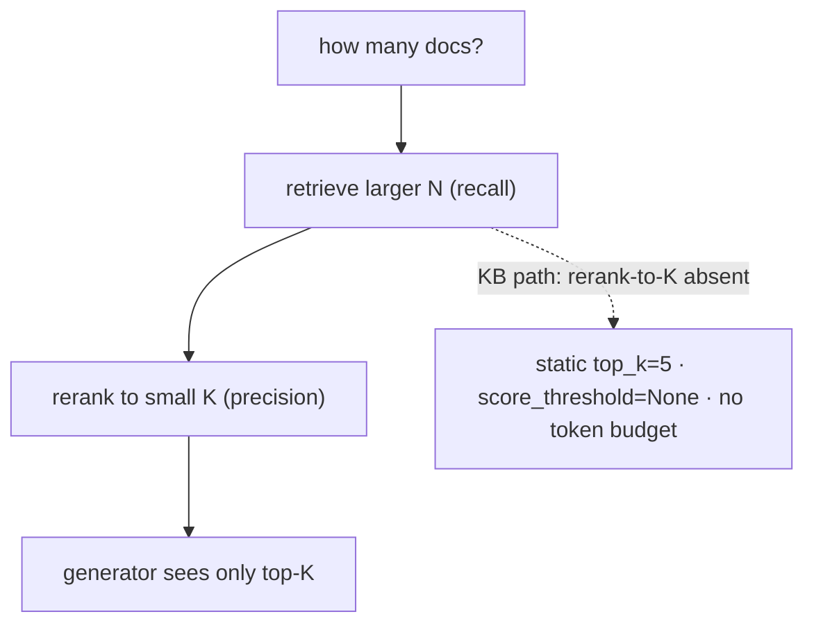

<details>
<summary>Anchors</summary>

<sub><strong>Anchors:</strong><br>&bull; <code>agent-core/openjiuwen/core/retrieval/common/config.py:46</code> — <code>top_k: int = 5</code>; <code>:47</code> <code>score_threshold</code> default <code>None</code><br>&bull; <code>agent-core/openjiuwen/core/retrieval/retriever/hybrid_retriever.py:64</code> — threshold honored only in <code>mode="vector"</code><br>&bull; <code>agent-core/openjiuwen/core/retrieval/simple_knowledge_base.py:182</code> — KB path calls no reranker<br>&bull; <code>agent-core/openjiuwen/core/workflow/components/resource/knowledge_retrieval_comp.py:241</code> — context concatenated unbounded</sub>

</details>


<sub>_Canonical source: `source/rag-part1-interview-questions_for_engineers.md`; also covered in: rag-1._</sub>

## 19. How would you design retrieval to work across structured data (SQL tables) and unstructured data (documents) in the same system

**General:** Keep the two paths explicit: route structured questions to a text-to-SQL/table-query tool (schema-aware, validable) and unstructured questions to document retrieval, then merge/ground the results. Do not flatten tables into text and hope; and do not let a free-form shell tool be the only SQL path, because it is unverified. An orchestrator or router picks the source(s), and the answer cites which.

**Jiuwen:** The system is document-RAG only. The retrieval package indexes documents (PDF/Office/images/…) into vector/graph stores; `KnowledgeRetrievalComponent` fans a query to one or more KBs. `core/sys_operation` exposes only `fs()`, `shell()`, and `code()` — no database operation — and there is no text-to-SQL, schema introspection, table retrieval, or DB query tool. SQLite appears only as internal persistence/coordination (locks, session/observability stores), and even spreadsheets are flattened into text row/column documents.

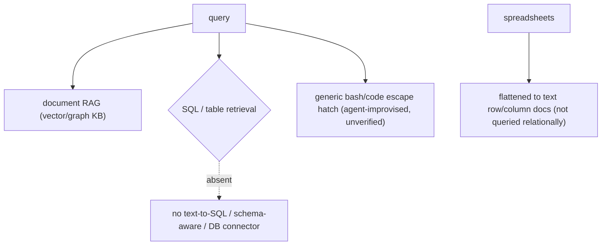

<details>
<summary>Anchors</summary>

<sub><strong>Anchors:</strong><br>&bull; <code>agent-core/openjiuwen/core/sys_operation/sys_operation.py:204</code> — <code>SysOperation</code> exposes only <code>fs</code>/<code>code</code>/<code>shell</code>; <code>:139</code> card proxies limited to fs/shell/code<br>&bull; <code>agent-core/openjiuwen/harness/tools/__init__.py:42</code> — only Bash/PowerShell shell escape hatch; no DB tool<br>&bull; <code>agent-core/openjiuwen/harness/tools/code.py:43</code> — <code>CodeTool.invoke</code> (generic code, not SQL-aware)<br>&bull; <code>agent-core/openjiuwen/core/retrieval/indexing/processor/parser/excel_parser.py:131</code> — spreadsheets flattened to text documents<br>&bull; <code>agent-core/openjiuwen/core/sys_operation/local/_rw_lock_manager.py:23</code> — SQLite used only as a lock DB</sub>

</details>

<sub>_Canonical source: `source/rag-part2-interview-questions_for_engineers.md`; also covered in: rag-2._</sub>

## 20. What reranking adds that initial retrieval doesn't already do

**General:** First-stage retrieval optimizes recall with cheap approximate similarity over the whole corpus. A reranker scores each candidate *jointly with the query* using an expensive cross-encoder, reordering the top-k for precision. It cannot recover documents retrieval never returned.

**Jiuwen:** `Reranker` is an abstract cross-encoder client (`rerank`/`rerank_sync` returning `{doc: score}`), implemented by `StandardReranker`, `DashscopeReranker`, and experimental `ChatReranker`. It is integrated only in the graph store: `milvus_support.py` accepts an optional `reranker` and calls it in `_rank_results`/`_combined_rerank`, and even there it is a no-op unless the caller passes `reranker=...`. Neither `SimpleKnowledgeBase.retrieve` nor `GraphKnowledgeBase.retrieve` constructs or forwards one, so RAG retrieval is first-stage-only.

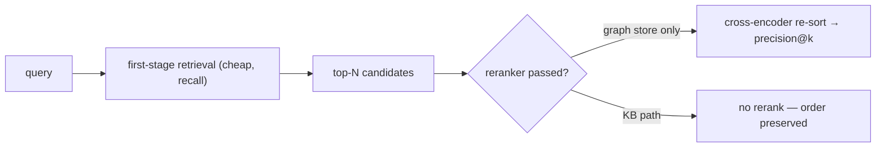

<details>
<summary>Anchors</summary>

<sub><strong>Anchors:</strong><br>&bull; <code>agent-core/openjiuwen/core/foundation/store/base_reranker.py:16</code> — <code>RerankerConfig</code>; <code>:37/41</code> <code>Reranker</code> + abstract <code>rerank</code><br>&bull; <code>agent-core/openjiuwen/core/retrieval/reranker/standard_reranker.py:23</code> — <code>StandardReranker</code> (<code>/rerank</code>); <code>agent-core/openjiuwen/core/retrieval/reranker/chat_reranker.py:22</code> — <code>ChatReranker</code> (experimental)<br>&bull; <code>agent-core/openjiuwen/core/foundation/store/graph/milvus/milvus_support.py:458</code> — reranker applied only when truthy; <code>:87</code> <code>async def rerank</code><br>&bull; <code>agent-core/openjiuwen/core/retrieval/simple_knowledge_base.py:125</code> — no reranker in <code>retrieve</code>; <code>agent-core/openjiuwen/core/retrieval/graph_knowledge_base.py:251</code> — passes <code>**kwargs</code> only<br>&bull; <code>agent-core/openjiuwen/core/retrieval/common/result_ranking.py:11</code> — fusion rankers, distinct from cross-encoder</sub>

</details>

**Gap.** Reranking is effectively dead for RAG: no KB/component/retriever instantiates a reranker, and `KnowledgeRetrievalCompConfig` has no reranker field.


<sub>_Canonical source: `source/ai-engineer-technical-questions_for_engineers.md`; also covered in: engineering, rag-retrieval, rag-1._</sub>

## 21. How do you know if your reranker is actually improving results, or just reordering noise, without an A/B test

**General:** You cannot tell from the order alone. Offline, hold out a labeled set of (query, relevant docs) and compare ranking metrics (NDCG@k, MRR, precision@k) with and without the reranker on the same candidate set. If NDCG does not improve, the reranker is reordering noise. Watch for it merely promoting longer/more generic chunks. A/B is better but needs traffic; offline label-based comparison is the first check.

**Jiuwen:** There is a real reranker stack (`StandardReranker`, `ChatReranker`, DashScope) and a cross-encoder re-rank hook in the graph store, but the only before/after evidence is a **manual demo comparison**: `showcase_milvus_graph_store.py` searches twice (`reranker=RERANKER` then `reranker=None`) and `_log_score_comparison` prints per-rank scores, a diff, and min/max ranges. No ground-truth labels, no held-out query set, no metric delta, no significance test.

```mermaid
flowchart TD
    CAND["same candidate set"] --> A["search(reranker=RERANKER)"]
    CAND --> B["search(reranker=None)"]
    A --> CMP["_log_score_comparison: per-rank scores, diff, min/max"]
    B --> CMP
    CMP --> R(["eyeball delta — no labels, no NDCG/MRR"])
```

<details>
<summary>Anchors</summary>

<sub><strong>Anchors:</strong><br>&bull; <code>agent-core/examples/store/showcase_milvus_graph_store.py:51</code> — <code>_log_score_comparison</code>; <code>:217</code> reranker on; <code>:240</code> reranker off<br>&bull; <code>agent-core/openjiuwen/core/retrieval/reranker/standard_reranker.py:58</code> — <code>rerank()</code> returns <code>relevance_score</code> per doc<br>&bull; <code>agent-core/openjiuwen/core/foundation/store/graph/milvus/milvus_support.py:87</code> — <code>_combined_rerank</code>/<code>rerank</code> sorts in place<br>&bull; <code>agent-core/examples/retrieval/showcase_reranker.py:23</code> — standalone reranker demo (no baseline)</sub>

</details>


<sub>_Canonical source: `source/rag-evaluation-interview-questions_for_engineers.md`; also covered in: rag-eval, rag-retrieval._</sub>

## 22. Would you rerank every query, or only some, and how do you decide

**General:** Rerank only when it improves the top-k enough to justify its latency: for high-stakes or ambiguous queries where first-stage precision is low, and when the candidate count is bounded. Skip it for exact-match lookups, high-volume cheap queries, or when latency dominates. Measure NDCG/precision with and without rerank on a labeled set to decide, and cache.

**Jiuwen:** Reranking is **optional and not part of the default KB path** — the `Reranker` classes exist (`StandardReranker`, `ChatReranker`, `DashscopeReranker`) but only the graph store / graph memory call `rerank`, gated by `config_e.rerank`. So the codebase effectively never reranks default RAG queries; there is no per-query rerank policy and no metric-driven decision (only the demo score-delta script).

```mermaid
flowchart TD
    Q["query"] --> D{"rerank?"}
    D -->|"default KB path"| NO["no rerank (classes unwired)"]
    D -->|"graph store / memory"| YES["rerank if config_e.rerank"]
    D -.->|"absent"| X["per-query rerank policy · NDCG-driven decision"]
```

<details>
<summary>Anchors</summary>

<sub><strong>Anchors:</strong><br>&bull; <code>agent-core/openjiuwen/core/retrieval/simple_knowledge_base.py:182</code> — KB retrieve has no reranker<br>&bull; <code>agent-core/openjiuwen/core/foundation/store/graph/milvus/milvus_support.py:87</code> — <code>rerank</code> in graph store<br>&bull; <code>agent-core/openjiuwen/core/memory/graph/graph_memory/base.py:645</code> — <code>config_e.rerank</code> gate<br>&bull; <code>agent-core/openjiuwen/core/retrieval/reranker/standard_reranker.py:23</code> — <code>StandardReranker</code> (<code>/rerank</code>)<br>&bull; <code>agent-core/examples/store/showcase_milvus_graph_store.py:51</code> — before/after rerank demo (no labels)</sub>

</details>

<sub>_Canonical source: `source/rag-system-design-interview-questions_for_engineers.md`; also covered in: rag-system._</sub>

## 23. How much latency reranking adds, and deciding if it's worth it

**General:** Reranking latency scales with the number of candidates and whether the model scores them in one batch or one-by-one. A cross-encoder over ~50–100 candidates typically adds tens to low-hundreds of milliseconds; an LLM-judge reranker is one call per document and can add seconds. Worth it when precision@k matters more than latency, when the candidate count is bounded, and when you can cache.

**Jiuwen:** `RerankerConfig.timeout` defaults to 10 s, and `StandardReranker` sends **all** candidates in one request with `top_n=len(documents)` (no batching/concurrency), `max_retries=3` with backoff. `ChatReranker` enforces a list of size 1, so it costs one LLM call per candidate (O(N) latency) and is flagged experimental. Reranking is optional (`reranker=None` default), and the product `jiuwenswarm` pins `rerank_enabled: False` in the external memory builder. The only guard is the per-request timeout plus `min_score`; no candidate cap, rerank batch size, or cost accounting.

```mermaid
flowchart TD
    CAND["N candidates"] --> S{"reranker"}
    S -->|StandardReranker| ONE["one request, top_n=len(documents), timeout=10s, retries=3"]
    S -->|ChatReranker| PER["one LLM call per document → O(N) latency"]
    S -->|"none (default; product pins off)"| SKIP["no rerank"]
    ONE --> OK["bounded by request timeout (no per-doc timing)"]
    PER --> EXP["experimental, slow"]
```

<details>
<summary>Anchors</summary>

<sub><strong>Anchors:</strong><br>&bull; <code>agent-core/openjiuwen/core/foundation/store/base_reranker.py:22</code> — <code>timeout</code> default 10 s<br>&bull; <code>agent-core/openjiuwen/core/retrieval/reranker/standard_reranker.py:120</code> — <code>top_n=len(documents)</code> single request; <code>:35</code> <code>max_retries=3</code><br>&bull; <code>agent-core/openjiuwen/core/retrieval/reranker/chat_reranker.py:113</code> — list-size-1 constraint (per-doc LLM call)<br>&bull; <code>agent-core/openjiuwen/core/retrieval/utils/api_requests.py:55</code> — retry/backoff loop<br>&bull; <code>agent-core/openjiuwen/core/foundation/store/graph/milvus/milvus_support.py:160</code> — <code>reranker=None</code> optional<br>&bull; <code>jiuwenswarm/jiuwenswarm/agents/harness/common/memory/external_memory_builder.py:340</code> — product pins <code>rerank_enabled: False</code></sub>

</details>


<sub>_Canonical source: `source/rag-retrieval-interview-questions_for_engineers.md`; also covered in: rag-retrieval._</sub>

## 24. Bi-encoder for retrieval vs. cross-encoder for reranking

**General:** A bi-encoder embeds query and document independently (fast, precomputable, indexable) but cannot model their interaction. A cross-encoder feeds query+document together through the model and scores the pair, capturing fine-grained relevance at the cost of one forward pass per candidate — hence two-stage retrieval.

**Jiuwen:** Retrieval is bi-encoder (query and docs embedded independently, compared by vector similarity). Reranking is cross-encoder / LLM-as-reranker: `StandardReranker` POSTs `instruct+query` and all documents to a `/rerank` endpoint and reads `relevance_score`; `ChatReranker` (experimental) asks a chat LLM a yes/no judge question and returns `P(yes)/(P(yes)+P(no))` from `top_logprobs`; `DashscopeReranker` extends `StandardReranker` for DashScope's `text-rerank` endpoint. Scoring is query-conditioned at rerank time, unlike the bi-encoder's independent embeddings.

```mermaid
flowchart TD
    subgraph BI["Retrieval — bi-encoder"]
    QE["embed_query"] --> DIST["vector distance vs precomputed doc vectors"]
    DE["embed_documents (offline)"] --> DIST
    end
    subgraph CE["Reranking — cross-encoder / LLM-judge"]
    CAND["candidate docs"] --> SC["score (query + doc) jointly"]
    SC --> SR["StandardReranker: POST /rerank → relevance_score"]
    SC --> CR["ChatReranker: yes/no logprobs → P(yes)/(P(yes)+P(no))"]
    SC --> DR["DashscopeReranker: text-rerank endpoint"]
    end
    DIST --> CAND
```

<details>
<summary>Anchors</summary>

<sub><strong>Anchors:</strong><br>&bull; <code>agent-core/openjiuwen/core/retrieval/retriever/vector_retriever.py:78</code> — independent query bi-encoder<br>&bull; <code>agent-core/openjiuwen/core/retrieval/reranker/standard_reranker.py:28</code> — <code>/rerank</code> endpoint; <code>:29</code> instruct+query template; <code>:81</code> parses <code>relevance_score</code><br>&bull; <code>agent-core/openjiuwen/core/retrieval/reranker/chat_reranker.py:83</code> — logprob yes/no scoring; <code>:125</code> chat prompt assembly<br>&bull; <code>agent-core/openjiuwen/core/retrieval/reranker/dashscope_reranker.py:16</code> — DashScope reranker</sub>

</details>

**Gap.** `ChatReranker` is one document per request. The `language` kwarg from the graph store is silently dropped by `StandardReranker._assemble_params`.

<sub>_Canonical source: `source/rag-retrieval-interview-questions_for_engineers.md`; also covered in: rag-practical, rag-retrieval._</sub>

## 25. What is query rewriting or query expansion, and when does it meaningfully improve retrieval quality

**General:** Query rewriting makes a query self-contained (resolves coreference/ellipsis, fixes typos, removes reliance on prior turns) — it improves multi-turn and malformed queries. Query expansion adds terms/synonyms or generates a hypothetical answer (HyDE) to bridge vocabulary mismatch. Rewriting helps conversational and noisy queries; expansion helps when the corpus uses different wording than the user.

**Jiuwen:** `QueryRewriter` performs context-aware rewriting, not expansion: it produces a self-contained `standalone_query`, corrects typos, detects gibberish, summarizes intent, and lists gaps. When history reaches `compress_range` it first LLM-compresses history into a `{theme, summary}` system message, then rewrites from the recent turns — history compression, not query expansion. There is no synonym expansion and no HyDE.

```mermaid
flowchart TD
    H["conversation history"] --> C{"history >= compress_range?"}
    C -->|yes| COMP["LLM-compress history → {theme, summary}"]
    C -->|no| RW
    COMP --> RW["rewrite → standalone_query + intention + typo + references + missing"]
    RW --> R(["retrieval query"])
    RW -.->|"absent"| X["synonym expansion · HyDE / hypothetical document"]
```

<details>
<summary>Anchors</summary>

<sub><strong>Anchors:</strong><br>&bull; <code>agent-core/openjiuwen/core/retrieval/query_rewriter/query_rewriter.py:412</code> — <code>rewrite()</code>; <code>:349</code> <code>compress()</code>; <code>:449</code> history ≥ <code>compress_range</code>; <code>:227</code> <code>compress_range</code> default 20<br>&bull; <code>agent-core/openjiuwen/core/retrieval/query_rewriter/prompts/intention_completion_en.md:32</code> — coreference resolution; <code>:47</code> typo correction<br>&bull; <code>agent-core/openjiuwen/core/retrieval/retriever/agentic_retriever.py:326</code> — follow-up question generation</sub>

</details>

<sub>_Canonical source: `source/rag-part2-interview-questions_for_engineers.md`; also covered in: rag-2._</sub>

## 26. How would you handle a vague or ambiguous user query before it even reaches retrieval

**General:** Detect ambiguity and either ask a clarifying question or rewrite to the most likely intent. The cheap path is a rewrite that resolves coreference/ellipsis; the interactive path is a clarification turn when the ambiguity would change the retrieval target. Most production systems rewrite by default and clarify only when confidence is low.

**Jiuwen:** Ambiguity is not resolved by asking the user pre-retrieval. `QueryRewriter.rewrite` returns `intention`, `standalone_query`, `references`, and a `missing` list; when a gap cannot be filled from history it marks the gap with `(…)` in the standalone query and records it in `missing` but still proceeds with a best-effort query. Asking the user is a separate, opt-in mechanism: `AskUserRail`/`AskUserTool` interrupt the tool loop and return the answer as a tool result. None of these is wired automatically into the RAG flow as an ambiguity gate.

```mermaid
flowchart TD
    Q["vague / ambiguous query"] --> RW["QueryRewriter: standalone_query + intention + missing (records gaps, proceeds)"]
    Q --> AU["ask_user tool (opt-in): interrupt → user answer as tool result"]
    Q -.->|"absent"| X["automatic ambiguity gate: if ambiguous → ask before retrieving"]
```

<details>
<summary>Anchors</summary>

<sub><strong>Anchors:</strong><br>&bull; <code>agent-core/openjiuwen/core/retrieval/query_rewriter/query_rewriter.py:412</code> — <code>rewrite()</code>; <code>:277</code> output schema (<code>intention</code>/<code>references</code>/<code>missing</code>/<code>typo</code>)<br>&bull; <code>agent-core/openjiuwen/core/retrieval/query_rewriter/prompts/intention_completion_en.md:41</code> — missing-info completion (marks gaps, does not ask)<br>&bull; <code>agent-core/openjiuwen/harness/tools/ask_user.py:11</code> — <code>AskUserTool</code>; <code>agent-core/openjiuwen/harness/rails/interrupt/ask_user_rail.py:63</code> — <code>resolve_interrupt</code><br>&bull; <code>agent-core/openjiuwen/core/controller/schema/intent.py:59</code> — <code>UNKNOWN_TASK</code> clarification prompt; <code>agent-core/openjiuwen/core/controller/modules/intent_recognizer.py:436</code></sub>

</details>

<sub>_Canonical source: `source/rag-part2-interview-questions_for_engineers.md`; also covered in: rag-2._</sub>

## 27. How would you decompose a complex, multi-part question into smaller retrievable sub-questions

**General:** Split "compare A and B on X and Y" into independently answerable sub-questions, retrieve for each (often in parallel), then synthesize. A dedicated LLM decomposition call or an agentic loop generates the sub-questions; a planner can produce a DAG when there are dependencies.

**Jiuwen:** Decomposition is prompt-level and **sequential** inside `AgenticRetriever`. `_REWRITE_PROMPT` instructs the LLM to "break it down into smaller questions if needed", and when triples are insufficient it generates exactly one `next_question`, appended to `queries` and used as the next retrieval query; rounds are fused with RRF. It is not a parallel sub-query planner: sub-questions are produced one at a time, conditioned on the prior round, capped at `max_iter` (default 2). `batch_retrieve` runs independent caller-supplied queries concurrently, not a decomposition.

```mermaid
flowchart TD
    CQ["complex multi-part question"] --> RW["_rewrite (sufficiency check)"]
    RW -->|"insufficient"| NQ["ONE next_question (prompt: break it down) → append"] --> RET["re-retrieve"] --> RW
    RW -->|"sufficient"| F["RRF fuse rounds"]
    CQ -.->|"absent"| X["parallel sub-query planner · sub-question DAG · per-sub synthesis"]
```

<details>
<summary>Anchors</summary>

<sub><strong>Anchors:</strong><br>&bull; <code>agent-core/openjiuwen/core/retrieval/retriever/agentic_retriever.py:70</code> — "Break it down into smaller questions if needed."; <code>:326</code> <code>_rewrite</code> one next question; <code>:213/272</code> loops; <code>:290</code> append; <code>:295</code> <code>rrf_fusion(history_results)</code>; <code>:133</code> <code>max_iter=2</code>; <code>:530</code> <code>batch_retrieve</code><br>&bull; <code>agent-core/openjiuwen/core/controller/legacy/reasoner/planner.py:12</code> — general task Planner (not retrieval)</sub>

</details>


<sub>_Canonical source: `source/rag-part2-interview-questions_for_engineers.md`; also covered in: rag-2, rag-retrieval._</sub>

## 28. What is multi-hop retrieval, and when does single-pass retrieval fail to answer a question

**General:** Multi-hop retrieval runs more than one retrieval step, using what the first hop found to form the next query, because the answer needs a bridging entity that is not in the original query (e.g. "who employed the founder of X" needs X → founder → employer). Single-pass fails when the supporting evidence is only reachable through that intermediate entity, so the top-k for the original query never contains it. Graph/triple stores make hops explicit; query-decomposition approaches generate sub-queries.

**Jiuwen:** Two mechanisms. `AgenticRetriever` keeps a `queries` list and loops up to `max_iter`, extracting triples each round into a `TripleMemory` and asking the LLM for a `next_question` when triples are insufficient. `GraphRetriever` delegates to `TripleBeamSearch`, which expands a beam of triples for `max_length` hops, re-querying from the two endpoint entities of the last triple and keeping only candidates that share an entity. Single-pass `VectorRetriever.retrieve` embeds once and returns `top_k` with no state.

```mermaid
flowchart TD
    Q0["query"] --> R0["retrieve round 1"]
    R0 --> T0["extract triples → TripleMemory"]
    T0 --> S{"sufficient?"}
    S -->|no| NQ["LLM next_question → append"] --> R0
    S -->|yes| OUT(["fused result"])
    subgraph GRAPH["Graph path"]
    direction TB
    B["TripleBeamSearch: max_length hops (graph_hops=2)"] --> ENT["endpoint entities → candidates sharing an entity"]
    end
    R0 --- GRAPH
```

<details>
<summary>Anchors</summary>

<sub><strong>Anchors:</strong><br>&bull; <code>agent-core/openjiuwen/core/retrieval/retriever/agentic_retriever.py:213</code> — <code>for turn in range(1, max_iter+1)</code>; <code>:237</code> <code>_read</code> triples + <code>batch_extend_memory</code>; <code>:244</code> <code>_rewrite</code> → append<br>&bull; <code>agent-core/openjiuwen/core/retrieval/retriever/graph_retriever.py:100</code> — beam expansion <code>range(max_length-1)</code>; <code>:190</code> endpoint entities <code>{triple[0], triple[-1]}</code>; <code>:402</code> <code>graph_hops = kwargs.get("graph_hops", 2)</code><br>&bull; <code>agent-core/openjiuwen/core/retrieval/common/triple_beam.py:12</code> — <code>TripleBeam</code>; <code>agent-core/openjiuwen/core/retrieval/common/triple_memory.py:31</code> — <code>extend_memory</code> dedup<br>&bull; <code>agent-core/openjiuwen/core/memory/config/graph.py:86</code> — <code>bfs_k</code>/<code>bfs_depth</code><br>&bull; <code>agent-core/openjiuwen/core/retrieval/retriever/vector_retriever.py:38</code> — fixed single-pass retrieve</sub>

</details>

<sub>_Canonical source: `source/rag-part2-interview-questions_for_engineers.md`; also covered in: rag-2, rag-retrieval._</sub>

## 29. Handling a question requiring information from multiple documents

**General:** Retrieve a candidate set per sub-query or per entity, then merge and deduplicate, and let the generator synthesize across them (or do an aggregation/summarization step). The hard parts are merging ranked lists from different queries, keeping per-document provenance for citation, and ensuring no single document dominates. Recall must be high because every needed document must be present.

**Jiuwen:** This is the strongest area. `AgenticRetriever` runs up to `max_iter` rounds against a base retriever, accumulating `TripleMemory`, then fuses all per-round result lists with RRF (`rrf_fusion(ret + history_results)` in graph mode, `rrf_fusion(history_results)` in generic mode). `GraphRetriever.graph_expansion` fetches triple-linked chunks and fuses new+original chunks via RRF. Multi-KB retrieval merges/dedupes by text keeping the max score. Core memory search aggregates across typed managers, and graph memory searches entity/relation/episode collections concurrently.

```mermaid
flowchart TD
    Q(["multi-document question"]) --> R1["round 1 retrieval"]
    R1 --> T["extract triples → TripleMemory"]
    T --> R2["round 2+ (agentic loop)"]
    R2 --> F["rrf_fusion over per-round lists"]
    R1 --> F
    F --> MK["multi-KB: dedupe by text, keep max score"]
    MK --> R(["merged candidate set (provenance preserved)"])
```

<details>
<summary>Anchors</summary>

<sub><strong>Anchors:</strong><br>&bull; <code>agent-core/openjiuwen/core/retrieval/retriever/agentic_retriever.py:250</code> — <code>rrf_fusion(ret + history_results)[:top_k]</code> (graph mode); <code>:295</code> <code>rrf_fusion(history_results)[:top_k]</code> (generic)<br>&bull; <code>agent-core/openjiuwen/core/retrieval/retriever/graph_retriever.py:520</code> — <code>rrf_fusion([new_chunks, chunks], k=60)</code><br>&bull; <code>agent-core/openjiuwen/core/retrieval/simple_knowledge_base.py:285</code> — <code>retrieve_multi_kb</code> dedupe-by-text + max-score merge; <code>:318</code> <code>retrieve_multi_kb_with_source</code><br>&bull; <code>agent-core/openjiuwen/core/memory/manage/search/search_manager.py:86</code> — aggregate + sort + truncate<br>&bull; <code>agent-core/openjiuwen/core/memory/graph/graph_memory/base.py:422</code> — concurrent entity/relation/episode search<br>&bull; <code>agent-core/openjiuwen/core/retrieval/graph_knowledge_base.py:353</code> — <code>retrieve_multi_graph_kb</code></sub>

</details>

**Gap.** No explicit cross-document synthesis or evidence-linking step; merging is score/rank fusion, not reasoning over combined docs.

<sub>_Canonical source: `source/rag-retrieval-interview-questions_for_engineers.md`; also covered in: rag-2, rag-retrieval._</sub>

## 30. When to skip RAG and rely on parametric knowledge instead

**General:** Skip retrieval when the question is general knowledge the model already holds (definitions, common facts, reasoning, code), when latency/cost matter and the corpus is unlikely to add signal, or when the query is conversational and context is already in the window. Retrieve when the answer depends on private, recent, or verifiable facts. The decision is often made by the model choosing whether to call a retrieval tool; a cheap classifier is the alternative.

**Jiuwen:** There is no skip-retrieval classifier. `RetrievalConfig.agentic` is opt-in (default `False`); when enabled, `AgenticRetriever` still executes at least one retrieval unconditionally and uses an LLM "sufficiency" judgment only to decide whether to issue *another* rewritten query — it stops extra rounds, never the first. Otherwise the retrieval-vs-parametric decision is delegated to the model's tool choice: `memory_search` is a normal tool card the agent may elect to call, and skill retrieval is invoked through tool calls. Nothing inspects the query to decide "the model already knows this".

```mermaid
flowchart TD
    Q["query"] --> C{"skip-retrieval classifier?"}
    C -.->|"absent"| X["no path decides 'model already knows this'"]
    Q --> A["AgenticRetriever: always retrieves once"]
    A --> S{"sufficient?"}
    S -->|no| NQ["another query"] --> A
    S -->|yes| ANS["stop extra rounds"]
    Q --> T["model tool choice: memory_search / skill retrieval optional"]
```

<details>
<summary>Anchors</summary>

<sub><strong>Anchors:</strong><br>&bull; <code>agent-core/openjiuwen/core/retrieval/retriever/agentic_retriever.py:173</code> — <code>retrieve</code> always performs one round; <code>:326</code> <code>_rewrite</code> returns <code>None</code> when sufficient; <code>:241</code> loop breaks after <code>max_iter</code><br>&bull; <code>agent-core/openjiuwen/core/retrieval/common/config.py:51</code> — <code>RetrievalConfig.agentic: bool = False</code> (opt-in, not a router)<br>&bull; <code>agent-core/openjiuwen/harness/tools/memory.py:25</code> — <code>memory_search</code> tool (model decides whether to call)</sub>

</details>

**Gap.** No retrieval-necessity classifier or confidence threshold; every skip decision is implicit in the model's tool call.


<sub>_Canonical source: `source/rag-practical-interview-questions_for_engineers.md`; also covered in: rag-2, rag-practical._</sub>

## 31. Retrieval looks correct, answer is wrong: check if the chunk actually contains the answer

**General:** "Looked relevant" is not "contains the answer". The first diagnostic is to read the retrieved chunks and confirm the answer span is actually present — if it is not, retrieval failed (bad chunking, wrong index, query mismatch); if it is present but the answer is wrong, the problem is generation or grounding. This is why faithfulness evaluation needs the retrieved context, not just answer-vs-reference.

**Jiuwen:** There is no tooling for "does the retrieved chunk contain the answer". The closest signals: `score_threshold` defaults to `None` (so weak chunks pass), relevance checks are lexical (`free_search`), and the judges (`AccuracyEvaluator`, `LLMAsJudgeMetric`) do not receive the retrieved context, so they cannot distinguish "context lacks the answer" from "model ignored it". The `VerificationReviewer`'s `Correctness` dimension checks the output, not the grounding.

```mermaid
flowchart TD
    A["retrieval looks correct, answer wrong"] --> Q{"answer present in chunk?"}
    Q -->|no| R["retrieval failure: chunking · index · query mismatch"]
    Q -->|yes| G["generation/grounding failure"]
    R --> X["no tool checks this; score_threshold defaults None"]
    G --> Y["pairwise judge sees answer only (LLMAsJudgeMetric); trace-level evaluators do see tool results"]
```

<details>
<summary>Anchors</summary>

<sub><strong>Anchors:</strong><br>&bull; <code>agent-core/openjiuwen/core/retrieval/common/config.py:47</code> — <code>score_threshold</code> defaults <code>None</code><br>&bull; <code>agent-core/openjiuwen/harness/tools/web/free_search.py:299</code> — lexical relevance only<br>&bull; <code>agent-core/openjiuwen/symphony/evaluation/evaluators.py:438</code> — <code>AccuracyEvaluator</code> (no context input)<br>&bull; <code>agent-core/openjiuwen/agent_evolving/evaluator/metrics/llm_as_judge.py:58</code> — parses <code>result: true/false</code>, no context/attribution<br>&bull; <code>agent-core/openjiuwen/agent_teams/verification/reviewer.py:43</code> — <code>Correctness</code> dimension on the output</sub>

</details>

<sub>_Canonical source: `source/rag-practical-interview-questions_for_engineers.md`; also covered in: rag-1, rag-practical._</sub>

## 32. How do you handle hallucinations when retrieved context doesn't actually answer the question

**General:** First detect that the context is insufficient, then answer only from what is supported: gate on retrieval score/answerability, allow an explicit "I don't know" abstention, and verify claims against the context (citations/groundedness). Without an answerability gate, a model will still produce a fluent answer from irrelevant context. The failure mode is under-specified retrieval, not just a bad generator.

**Jiuwen:** There is a retrieval score filter (`score_threshold`) but its default is `None`, so out-of-scope chunks are normally returned. The closest "answerable?" logic is in `AgenticRetriever`, which asks an LLM whether current facts are `sufficient` — but `sufficient=False` only generates a follow-up query, never a user-facing abstention. A true abstention path exists only inside `symphony/retrieval` internal selection (`is_abstain` → empty candidates). Grounding is provided by separate higher layers: the `VerificationReviewer` scores a `Correctness` dimension and downgrades status, the RSI judge forbids treating claims as proof, and the harness verification agent requires command evidence with a PASS/FAIL/PARTIAL verdict — none of which is a RAG answerability gate.

```mermaid
flowchart TD
    Q["query"] --> R["retrieve (score_threshold default None → no filtering)"]
    R --> S{"facts sufficient? (AgenticRetriever)"}
    S -->|no| NQ["next question → re-retrieve (no abstention)"]
    S -->|yes| GEN["generate"]
    GEN --> G{"answer grounded?"}
    G -->|"post-hoc review: reviewer / verification agent / RSI judge (does not gate generation)"| RV["review of the produced answer"]
    G -.->|"absent"| X["answerable-from-context gate · 'I don't know' user path"]
```

<details>
<summary>Anchors</summary>

<sub><strong>Anchors:</strong><br>&bull; <code>agent-core/openjiuwen/core/retrieval/common/config.py:47</code> — <code>score_threshold</code> defaults <code>None</code>; <code>agent-core/openjiuwen/core/retrieval/retriever/vector_retriever.py:94</code> / <code>agent-core/openjiuwen/core/retrieval/retriever/hybrid_retriever.py:117</code> — applied only when supplied<br>&bull; <code>agent-core/openjiuwen/core/retrieval/retriever/agentic_retriever.py:326</code> — <code>_rewrite</code> sufficiency check (rewrite, not abstain)<br>&bull; <code>agent-core/openjiuwen/symphony/retrieval/search/runtime/engine.py:94</code> — <code>is_abstain</code> → empty candidates; <code>agent-core/openjiuwen/symphony/retrieval/search/runtime/selector.py:305</code> — <code>is_abstain</code><br>&bull; <code>agent-core/openjiuwen/agent_teams/verification/reviewer.py:43</code> — <code>Correctness</code> dimension; <code>:279</code> threshold re-normalization<br>&bull; <code>agent-core/openjiuwen/harness/subagents/verification_agent.py:51</code> — PASS/FAIL/PARTIAL verdict</sub>

</details>

**Gap.** No RAG-side answerable-from-context gate and no "I don't know" path; `score_threshold` has no default and verification is a separate, non-blocking review layer.

<sub>_Canonical source: `source/genai-interview-questions_for_engineers.md`; also covered in: genai, llm-applied, rag-1._</sub>

## 33. How do you handle retrieval when documents contain conflicting or outdated information on the same topic

**General:** Prefer precedence rules before generation: recency (timestamp), source authority, or an explicit priority field; dedupe/reconcile; and either surface the conflict to the model with the metadata or abstain. Outdated facts are usually handled by recency-weighted ranking or by versioning/tombstoning superseded documents. Unchecked, the model picks the first or most fluent version.

**Jiuwen:** The retrieval layer has no notion of document time at all: `RetrievalResult`/`TextChunk` carry only `text`/`score`/metadata, parsers populate no timestamp, and ranking is score/rank only (RRF by rank, max-score merge) — no recency boost or "outdated" filter. Conflict handling exists only at the **memory** layer: `MemUpdateChecker` classifies a new memory as redundant/conflicting/none and deletes superseded old memories (newest wins). A freshness notion exists in the experience subsystem (`calc_freshness`, time decay) but scores experience records, not retrieved documents.

```mermaid
flowchart TD
    subgraph RET["Retrieval (RAG)"]
    direction TB
    R["chunks (no timestamp field)"] --> M["RRF/max-score only"]
    M --> GEN["both conflicting facts passed to model"]
    end
    subgraph MEM["Memory writes"]
    direction TB
    N["new memory"] --> CHK["MemUpdateChecker: redundant/conflicting/none"] --> DEL["delete old (newest wins)"]
    end
    RET -.->|"absent"| X["no recency boost · no outdated filter · no source authority"]
```

<details>
<summary>Anchors</summary>

<sub><strong>Anchors:</strong><br>&bull; <code>agent-core/openjiuwen/core/retrieval/common/retrieval_result.py:23</code> — <code>RetrievalResult</code> (no timestamp/recency)<br>&bull; <code>agent-core/openjiuwen/core/retrieval/common/document.py:30</code> — <code>TextChunk</code> (text/doc_id/metadata only)<br>&bull; <code>agent-core/openjiuwen/core/retrieval/utils/fusion.py:39</code> — RRF by text/rank; <code>agent-core/openjiuwen/core/retrieval/simple_knowledge_base.py:313</code> — max-score merge, no recency tiebreak<br>&bull; <code>agent-core/openjiuwen/core/memory/manage/update/mem_update_checker.py:22</code> — <code>CheckResult</code>; <code>:252</code> conflicting → add new/delete old; <code>agent-core/openjiuwen/core/memory/manage/index/fragment_memory_manager.py:163</code><br>&bull; <code>agent-core/openjiuwen/agent_evolving/experience/scorer.py:219</code> — <code>calc_freshness</code> (experiences only)<br>&bull; <code>agent-core/openjiuwen/core/memory/long_term_memory.py:1004</code> — search sorts by score, ignores timestamp</sub>

</details>

<sub>_Canonical source: `source/rag-part2-interview-questions_for_engineers.md`; also covered in: rag-2, rag-practical._</sub>

## 34. No relevant documents exist: expected behavior is a confidence-gated "not enough information"

**General:** When retrieval returns nothing relevant, the system should abstain rather than answer from noise: gate on a retrieval-score threshold or an explicit answerability check, and return "not enough information" (or ask a clarifying question). Without this, the model will still produce a fluent answer from irrelevant context.

**Jiuwen:** There is a retrieval score filter but its default is `None`, so out-of-scope chunks are normally returned. `AgenticRetriever` asks an LLM whether facts are `sufficient`, but `sufficient=False` only generates a follow-up query — never a user-facing abstention. A true abstention path exists only in `symphony/retrieval` internal selection (`is_abstain` → empty candidates). Grounding is a separate, non-blocking review layer.

```mermaid
flowchart TD
    Q["query"] --> R["retrieve (score_threshold default None → no filtering)"]
    R --> S{"facts sufficient?"}
    S -->|no| NQ["next question → re-retrieve (no abstention)"]
    S -->|yes| GEN["generate"]
    R -.->|"absent"| X["confidence-gated 'not enough information' / 'I don't know'"]
```

<details>
<summary>Anchors</summary>

<sub><strong>Anchors:</strong><br>&bull; <code>agent-core/openjiuwen/core/retrieval/common/config.py:47</code> — <code>score_threshold</code> defaults <code>None</code>; <code>agent-core/openjiuwen/core/retrieval/retriever/vector_retriever.py:94</code> — applied only when supplied<br>&bull; <code>agent-core/openjiuwen/core/retrieval/retriever/agentic_retriever.py:326</code> — <code>_rewrite</code> sufficiency (rewrite, not abstain)<br>&bull; <code>agent-core/openjiuwen/symphony/retrieval/search/runtime/engine.py:94</code> — <code>is_abstain</code> → empty candidates; <code>agent-core/openjiuwen/symphony/retrieval/search/runtime/selector.py:305</code> — <code>is_abstain</code><br>&bull; <code>agent-core/openjiuwen/harness/subagents/verification_agent.py:51</code> — PASS/FAIL/PARTIAL verdict</sub>

</details>

<sub>_Canonical source: `source/rag-practical-interview-questions_for_engineers.md`; also covered in: rag-1, rag-practical._</sub>

## 35. Same question, different answers on different days: non-deterministic reranking or embedding drift

**General:** Run-to-run variation comes from sampling (temperature/seed), non-deterministic remote rerankers, and embedding drift (the provider updates the embedding model behind the same name, or you change models). Remedies: pin temperature/seed, store a model/version fingerprint with the index, and re-index when the fingerprint changes. Identical inputs should otherwise be reproducible.

**Jiuwen:** Determinism is partial. `ChatReranker` hard-codes `temperature=0` and `AgenticRetriever` calls its rewrite LLM at `temperature=0.0`, but `StandardReranker`/`DashscopeReranker` send no temperature or seed (the remote `/rerank` model decides), and `QueryRewriter` uses the configured temperature, which defaults to `None` (provider default). There is no seed plumbing and no embedding fingerprint in core retrieval — `OpenAIEmbedding`/`DashscopeEmbedding` store only a cached dimension. The memory/lite subsystem does store an `EmbeddingProvider.config_fingerprint` and re-indexes when it changes.

```mermaid
flowchart TD
    VAR["run-to-run variation"] --> S["sampling: QueryRewriter temperature (None default) · remote rerank unpinned"]
    VAR --> E["embedding drift: no fingerprint in core retrieval"]
    FIX["remedy"] --> P["pin temperature=0 (ChatReranker / AgenticRetriever)"]
    FIX --> FP["config_fingerprint + full re-index (memory/lite only)"]
    E -.->|"absent in core"| X["no seed / no model fingerprint at retrieval level"]
```

<details>
<summary>Anchors</summary>

<sub><strong>Anchors:</strong><br>&bull; <code>agent-core/openjiuwen/core/retrieval/reranker/chat_reranker.py:137</code> — hard-codes <code>"temperature": 0</code><br>&bull; <code>agent-core/openjiuwen/core/retrieval/reranker/standard_reranker.py:101</code> — rerank params (no temperature/seed)<br>&bull; <code>agent-core/openjiuwen/core/retrieval/retriever/agentic_retriever.py:311</code> — rewrite LLM <code>temperature=0.0</code><br>&bull; <code>agent-core/openjiuwen/core/retrieval/query_rewriter/query_rewriter.py:265</code> — temperature from config; <code>agent-core/openjiuwen/core/foundation/llm/schema/config.py:210</code> — default <code>None</code><br>&bull; <code>agent-core/openjiuwen/core/memory/lite/embeddings.py:78</code> — <code>config_fingerprint</code>; <code>agent-core/openjiuwen/core/memory/lite/manager.py:873</code> — <code>_should_full_reindex</code><br>&bull; <code>agent-core/openjiuwen/symphony/retrieval/llm/base/types.py:58</code> — <code>seed=1223</code> (skill-retrieval subsystem only)</sub>

</details>

<sub>_Canonical source: `source/rag-practical-interview-questions_for_engineers.md`; also covered in: rag-practical._</sub>

## 36. Vocabulary mismatch, where the answer exists but uses different wording

**General:** The document says "myocardial infarction", the user says "heart attack". Mitigations: better embeddings (semantic match), query expansion/synonyms, HyDE (generate a hypothetical answer and retrieve with it), and hybrid search so exact terms still match. Pure dense handles paraphrase but not rare terms; pure sparse handles rare terms but not paraphrase.

**Jiuwen:** The `QueryRewriter` is the designated mitigation, but it targets **coreference/ellipsis/semantic gaps**, not synonyms: it produces a `standalone_query` and records `typo` corrections, `missing` items, and `references`. Retrieval-side semantic matching comes from the vector/hybrid retrievers and graph-memory name embeddings. There is **no** HyDE, no synonym/query-expansion dictionary, and no pseudo-document generation.

```mermaid
flowchart TD
    Q["query wording ≠ doc wording"] --> RW["QueryRewriter: standalone_query + typo + references + missing"]
    Q --> EMB["dense embedding semantic match"]
    Q --> SP["sparse exact-term match"]
    RW -.->|"absent"| HYDE["HyDE / synonym expansion / pseudo-docs"]
    EMB --> R(["retrieve"])
    SP --> R
```

<details>
<summary>Anchors</summary>

<sub><strong>Anchors:</strong><br>&bull; <code>agent-core/openjiuwen/core/retrieval/query_rewriter/query_rewriter.py:412</code> — <code>rewrite(query)</code> → <code>standalone_query</code>; <code>:277</code> output schema<br>&bull; <code>agent-core/openjiuwen/core/retrieval/query_rewriter/prompts/intention_completion_en.md:32</code> — coreference resolution; <code>:41</code> missing-information completion; <code>:47</code> typo correction<br>&bull; <code>agent-core/openjiuwen/core/retrieval/retriever/graph_retriever.py:349</code> — vector retriever (dense semantic match)<br>&bull; <code>agent-core/openjiuwen/core/memory/graph/graph_memory/base.py:735</code> — <code>_fetch_relevant_entities</code> semantic entity match</sub>

</details>

<sub>_Canonical source: `source/rag-retrieval-interview-questions_for_engineers.md`; also covered in: rag-practical, rag-retrieval._</sub>

## 37. Structuring error handling for a pipeline where retrieval, reranking, or generation can each fail independently

**General:** Isolate each stage so one failure degrades rather than aborts: retrieval returns an empty/flagged result, reranking falls back to the pre-rerank order, generation surfaces a structured error. Use typed errors per stage, explicit fallbacks, retries only for transient failures, and a top-level handler that converts failure into a model-readable message instead of a crash.

**Jiuwen:** Failures are mostly contained per stage. Retrievers implement stage-local fallbacks: `VectorRetriever` falls back to BM25 when vector search is empty, `HybridRetriever` falls back to sparse when dense search is empty (in `mode="vector"` only), and `GraphRetriever` falls back to sparse only in its `mode="sparse"` branch. Model-call failures are handled by rails: `ModelAnomalyDetectionRail.on_model_exception` retries stream-timeout/repetition with backoff, and `ToolCallResilienceRail` retries transport/timeout tool errors. In `AbilityManager`, any tool/workflow/sub-agent exception is caught and converted to an error `ToolMessage` so the round continues. Workflow HTTP components have per-component retry (`HttpRetryConfig`, 429/5xx) and rate-limit config. Pregel node failure cancels siblings via `FIRST_EXCEPTION`.

```mermaid
flowchart TD
    R["retrieval"] -->|"empty dense"| FB["fallback to sparse BM25"]
    R -->|"raises"| ERR["propagates (no sparse fallback if embed_query fails)"]
    RR["reranking"] -->|"failure"| RRERR["typed RETRIEVAL_RERANKER_* error — aborts, does not degrade to pre-rerank order"]
    GEN["generation"] --> MR["ModelAnomalyDetectionRail: retry+backoff, else raise"]
    TOOL["tool/agent exception"] --> TM["caught → error ToolMessage (round continues)"]
    HTTP["workflow HTTP"] --> HR["HttpRetryConfig (429/5xx) + rate limit"]
```

<details>
<summary>Anchors</summary>

<sub><strong>Anchors:</strong><br>&bull; <code>agent-core/openjiuwen/core/retrieval/retriever/vector_retriever.py:83</code> — dense-empty → BM25 fallback; <code>agent-core/openjiuwen/core/retrieval/retriever/hybrid_retriever.py:97/194</code> — fallback branches; <code>agent-core/openjiuwen/core/retrieval/retriever/graph_retriever.py:462</code> — fallback to sparse<br>&bull; <code>agent-core/openjiuwen/harness/rails/model_anomaly_detection_rail.py:236</code> — <code>on_model_exception</code> retry classification; <code>agent-core/openjiuwen/harness/rails/tool_call_resilience_rail.py:106</code> — tool exception retry decision<br>&bull; <code>agent-core/openjiuwen/core/single_agent/ability_manager.py:1186</code> — exception rendered into a <code>ToolMessage</code><br>&bull; <code>agent-core/openjiuwen/core/workflow/components/tool/http/http_request_component.py:102</code> — <code>HttpRetryConfig</code>; <code>:110</code> <code>HttpRateLimitConfig</code><br>&bull; <code>agent-core/openjiuwen/core/graph/pregel/task.py:47</code> — FIRST_EXCEPTION cancels siblings</sub>

</details>

**Gap.** No retrieval-stage circuit breaker or pipeline-level compensation (a generic runner `CircuitBreakerFilter` exists but is not wired into the retrieval stages). Reranker failure aborts retrieval rather than degrading to the pre-rerank order, and a failed `embed_query` has no sparse fallback. Failures are swallowed into model-visible text, so downstream cannot distinguish "empty" from "broken".

<sub>_Canonical source: `source/ai-engineer-technical-questions_for_engineers.md`; also covered in: engineering._</sub>

## 38. Cutting tokens without losing quality: tighter reranking, summarizing long chunks

**General:** Reduce prompt tokens by retrieving fewer but better chunks (rerank a larger candidate set down to a small k), summarizing long chunks/passages before insertion, and trimming conversation history. Reranking preserves quality while cutting k; summarization trades fidelity for tokens. Both beat blindly lowering k.

**Jiuwen:** The retrieval path exposes only `top_k` (default 5) and `score_threshold`, and threshold filtering is honored only in `mode="vector"`. Crucially, the KB path never invokes a reranker (the `Reranker` classes are wired only into graph-memory search), so "retrieve N, rerank to K" is absent. Token reduction instead happens in the context engine on the *conversation*: tool results over 50k tokens are offloaded, stale tool results beyond `keep_last_k=3` are windowed, micro-compaction clears old tool results, and full compaction LLM-summarizes at 180k. Chunk text is embedded verbatim — no chunk-level summarization.

```mermaid
flowchart TD
    K["cut tokens"] --> R["rerank N → K"]
    R -.->|"absent in KB (reranker only in graph memory)"| X["no recall-candidate rerank lever"]
    K --> S["summarize long chunks"]
    S -.->|"absent in ingest; chunks embedded verbatim"| Y["no chunk summarization"]
    K --> CE["context engine (conversation, not retrieval)"]
    CE --> O1["tool_result_budget: offload >50k"]
    CE --> O2["tool_result_window: keep_last_k=3"]
    CE --> O3["micro/full compact (180k) — extra LLM call"]
```

<details>
<summary>Anchors</summary>

<sub><strong>Anchors:</strong><br>&bull; <code>agent-core/openjiuwen/core/retrieval/common/config.py:46</code> — <code>top_k: int = 5</code>; <code>:47</code> <code>score_threshold</code><br>&bull; <code>agent-core/openjiuwen/core/retrieval/retriever/hybrid_retriever.py:64</code> — threshold rejected unless <code>mode="vector"</code>; <code>:41</code> retrieve path has no reranker<br>&bull; <code>agent-core/openjiuwen/core/memory/graph/graph_memory/base.py:645</code> — reranker only in graph-memory search<br>&bull; <code>agent-core/openjiuwen/core/context_engine/processor/offloader/tool_result_budget_processor.py:34</code> — <code>tokens_threshold=50000</code>; <code>agent-core/openjiuwen/core/context_engine/processor/offloader/tool_result_window_processor.py:44</code> — <code>keep_last_k=3</code><br>&bull; <code>agent-core/openjiuwen/core/context_engine/processor/compressor/micro_compact_processor.py:24</code> — threshold 5; <code>agent-core/openjiuwen/core/context_engine/processor/compressor/full_compact_processor.py:184</code> — 180k<br>&bull; <code>agent-core/openjiuwen/core/retrieval/query_rewriter/query_rewriter.py:227/349</code> — <code>compress_range=20</code> + history compression</sub>

</details>

<sub>_Canonical source: `source/rag-practical-interview-questions_for_engineers.md`; also covered in: rag-practical._</sub>

## 39. Building a retrieval eval set without labeled relevant documents yet

**General:** Common bootstraps: mine queries from real logs or user questions, then label relevance by (a) LLM judging candidate chunks, (b) using a strong model to answer and treating cited chunks as relevant (RAGAS-style), or (c) creating synthetic queries from known documents (the document is the gold answer). Start small (50–200 queries), cover query types including exact-match and multi-hop, and iterate; a tiny labeled set beats none.

**Jiuwen:** There is no synthetic-query generation, no retrieval eval harness, and no LLM judge for retrieval relevance. The only "generate data + judge" code is the PerStream proactive-memory eval (`eval_proactive_dataset.py` runs inference; `score_proactive_judge.py:annotate` uses an LLM to judge memory moments). `tests/unit_tests/core/retrieval/` contains unit fixtures with mocked retrievers/embeddings asserting shapes, not gold relevance labels. So there is no established path to bootstrap a retrieval eval set here.

```mermaid
flowchart TD
    LOGS["real queries / user questions"] --> CAN["candidate chunks"]
    DOCS["known documents"] --> SYN["synthetic queries (doc = gold)"]
    CAN --> J["LLM judge relevance"]
    CAN --> ANS["answer + cite (RAGAS-style)"]
    J --> SET["small labeled eval set (50–200, multiple query types)"]
    SYN --> SET
    ANS --> SET
    SET --> MET["Recall@k · Precision@k · MRR · nDCG"]
    MET -.->|"absent in codebase; closest = PerStream memory LLM judge"| X["no retrieval eval path"]
```

<details>
<summary>Anchors</summary>

<sub><strong>Anchors:</strong><br>&bull; <code>agent-core/examples/PerStream/src/eval/score_proactive_judge.py:35</code> — <code>annotate(...)</code> LLM judge (memory, not retrieval)<br>&bull; <code>agent-core/examples/PerStream/src/eval/eval_proactive_dataset.py:121</code> — <code>run_inference</code>, dataset build for memory task<br>&bull; <code>agent-core/tests/unit_tests/core/retrieval/query_rewriter/test_query_rewriter.py</code> — mock-based unit fixtures<br>&bull; <code>agent-core/tests/unit_tests/core/retrieval/retriever/test_agentic_retriever.py</code> — mock-based agentic test<br>&bull; <code>agent-core/openjiuwen/core/retrieval/query_rewriter/query_rewriter.py:412</code> — <code>rewrite</code> (query generation from user input, not eval-set synthesis)</sub>

</details>


<sub>_Canonical source: `source/rag-retrieval-interview-questions_for_engineers.md`; also covered in: rag-retrieval._</sub>

## 40. Handling multiple document types and formats in the same system

**General:** Normalize everything to one record shape (text + metadata + id) at ingestion, with a parser per format behind a registry keyed by MIME/extension, and preserve format-specific structure as metadata. Chunking and indexing then operate on the uniform record. The risks are silent format gaps (a parser that drops structure) and mixed semantics (tables vs prose) needing different chunk policies.

**Jiuwen:** Format dispatch is an extension-keyed plugin registry loaded lazily by `AutoFileParser._ensure_parsers_loaded`; each parser returns `Document` objects with a common text+metadata shape. Registered extensions cover `.txt/.md/.markdown`, `.pdf`, `.docx`, `.xlsx/.csv/.tsv`, `.htm/.html`, `.json`, and `.png/.jpg/.jpeg/.webp/.gif/.jfif`; `AutoParser` adds URL routing (WeChat vs generic web). `source_type` (`row`/`column`/`web_page`/`wechat_article`) and `image_path` distinguish semantics. Downstream chunking/indexing is format-agnostic. Word/PDF/JSON/TXT parsers set no `source_type` (only `file_ext`), and there is no per-format chunking policy beyond `HybridChunker`'s row/column predicate.

```mermaid
flowchart LR
    F(["file or URL"]) --> AP["AutoParser: URL → link parser, else AutoFileParser"]
    AP --> REG["extension registry → parser (pdf/word/excel/html/json/txt-md/image)"]
    REG --> DOC["Document{id, text, metadata: source_type, file_ext, sheet_name, row_index, image_path, …}"]
    DOC --> CH["format-agnostic chunking (HybridChunker keeps row/column whole)"]
    CH --> IDX["uniform indexing"]
```

<details>
<summary>Anchors</summary>

<sub><strong>Anchors:</strong><br>&bull; <code>agent-core/openjiuwen/core/retrieval/indexing/processor/parser/auto_parser.py:23</code> — <code>AutoParser</code> URL vs file routing; <code>:48</code> <code>parse</code><br>&bull; <code>agent-core/openjiuwen/core/retrieval/indexing/processor/parser/auto_file_parser.py:24</code> — <code>@register_parser(file_extensions)</code> registry; <code>:98</code> extension dispatch; <code>:121</code> enriches <code>doc_id</code>/<code>title</code>/<code>file_path</code>/<code>file_ext</code><br>&bull; <code>agent-core/openjiuwen/core/retrieval/indexing/processor/parser/txt_md_parser.py:14</code> — <code>.txt/.md/.markdown</code>; <code>agent-core/openjiuwen/core/retrieval/indexing/processor/parser/pdf_parser.py:16</code> <code>.pdf</code>; <code>agent-core/openjiuwen/core/retrieval/indexing/processor/parser/word_parser.py:63</code> <code>.docx</code>; <code>agent-core/openjiuwen/core/retrieval/indexing/processor/parser/excel_parser.py:131</code> <code>.xlsx/.csv/.tsv</code>; <code>agent-core/openjiuwen/core/retrieval/indexing/processor/parser/html_file_parser.py:89</code> <code>.htm/.html</code>; <code>agent-core/openjiuwen/core/retrieval/indexing/processor/parser/json_parser.py:15</code> <code>.json</code>; <code>agent-core/openjiuwen/core/retrieval/indexing/processor/parser/image_parser.py:15</code> images<br>&bull; <code>agent-core/openjiuwen/core/foundation/store/base_reranker.py:29</code> — uniform <code>Document{id_, text, metadata}</code><br>&bull; <code>agent-core/openjiuwen/core/retrieval/indexing/processor/chunker/base.py:91</code> — <code>chunk_documents</code> uniform conversion</sub>

</details>

<sub>_Canonical source: `source/rag-retrieval-interview-questions_for_engineers.md`; also covered in: rag-2, rag-retrieval, rag-system._</sub>

## 41. RAG vs. pasting retrieved text into a long-context prompt

**General:** With a large context window you can skip retrieval and paste whole documents. That is simpler and avoids chunking errors, but it is expensive (you pay for every token every call), slow (TTFT grows with context), noisy (irrelevant text dilutes attention), and limited to what fits. RAG pays a one-time indexing cost and per-query retrieval, keeps the prompt small, and scales to corpora far larger than any window. The trade is a retrieval system and its failure modes for token efficiency and scale.

**Jiuwen:** The KB is not budgeted against the model window. `KnowledgeRetrievalExecutable._format_output` simply concatenates result texts with `"\n\n"` into a `context` string — the only bound is `top_k`; there is no token count, truncation, or window check before insertion. The context engine has real budgeting primitives (`context_window_tokens`, `effective_context_budget`, `ContextWindowUsage.occupancy_rate`, `FullCompactProcessor` at 180k), but those apply to the *conversation*, and retrieved text enters as ordinary messages measured only after the fact. There is no comparison or decision guidance for "retrieve top-k" vs. "paste whole document".

```mermaid
flowchart TD
    Q["corpus vs window"] --> RAG["RAG: small prompt, per-query retrieval cost"]
    Q --> PASTE["paste whole doc: simple, but tokens every call + slower TTFT + dilution"]
    RAG --> RB["bounded by top_k only (no token budget)"]
    PASTE --> CTX["context engine budgets the conversation, not the paste"]
    RB -.->|"absent"| X["no token check / truncation before insertion; no decision guidance"]
```

<details>
<summary>Anchors</summary>

<sub><strong>Anchors:</strong><br>&bull; <code>agent-core/openjiuwen/core/workflow/components/resource/knowledge_retrieval_comp.py:241</code> — <code>_format_output</code> joins <code>r.text</code> with <code>"\n\n"</code>, unbounded; <code>:109</code> bounded only by <code>top_k</code><br>&bull; <code>agent-core/openjiuwen/core/context_engine/schema/config.py:136</code> — <code>context_window_tokens</code>; <code>:131</code> <code>max_context_message_num</code>; <code>:139</code> <code>model_context_window_tokens</code><br>&bull; <code>agent-core/openjiuwen/core/context_engine/processor/budget_guard.py:37</code> — <code>effective_context_budget</code> (strictest positive)<br>&bull; <code>agent-core/openjiuwen/core/context_engine/usage/models.py:45</code> — <code>ContextWindowUsage.limit_tokens</code> / <code>occupancy_rate</code><br>&bull; <code>agent-core/openjiuwen/core/context_engine/processor/compressor/full_compact_processor.py:184</code> — 180k compaction threshold</sub>

</details>

**Gap.** No token budgeting on retrieved context; the only safety net is post-hoc conversation compaction (itself an extra LLM call).

<sub>_Canonical source: `source/rag-practical-interview-questions_for_engineers.md`; also covered in: rag-practical._</sub>
