# Agents, tools and memory

45 unique questions, deduplicated from the archived docs. Each `##` is one question; identical questions from other docs were merged. Full source files are in `source/`.
## 1. What's the difference between a chatbot and an agent

**General:** A chatbot maps one input to one model reply. An agent runs a loop: it calls the model, may call tools, feeds results back, and repeats until a stopping condition is met. The defining trait is the tool/reason loop and a termination rule, not the size of the model.

**Jiuwen:** There is no separate `Chatbot` class; the distinction is structural. A single model turn is the workflow LLM component, which calls `llm.invoke` once and has no tool branch. An agent is the loop in `ReActAgent.invoke`: it calls the model, and if the returned message has no tool calls it returns the answer; otherwise it executes the tools and iterates. `DeepAgent` wraps this with an outer task loop.

**Chatbot:**

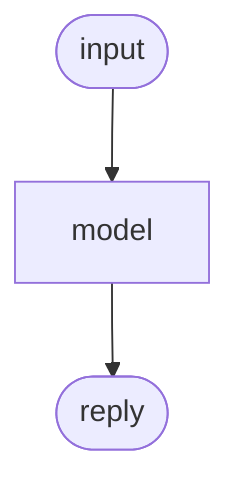
```mermaid
flowchart TD
    I1(["input"]) --> M1["model"] --> O1(["reply"])
```

**Agent:**

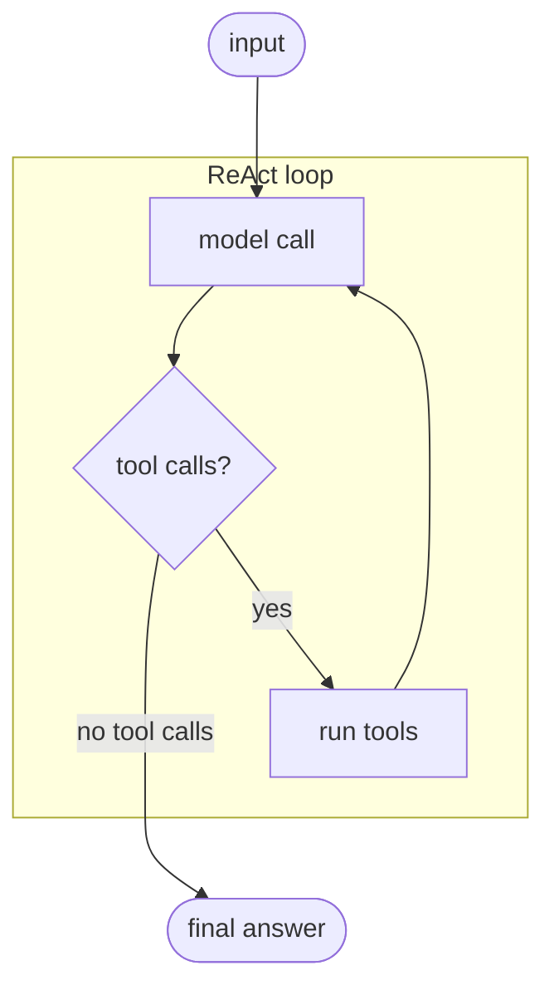
```mermaid
flowchart TD
    I(["input"]) --> M
    subgraph LOOP["ReAct loop"]
    direction TB
        M["model call"] --> D{"tool calls?"}
        D -->|yes| T["run tools"] --> M
    end
    D -->|"no tool calls "| A(["final answer"])
    T ~~~ A
```

Anchors

<strong>Anchors:</strong> &bull; <code>agent-core/openjiuwen/core/workflow/components/llm/llm_comp.py:524</code> — single model call, no tool branch &bull; <code>agent-core/openjiuwen/core/single_agent/agents/react_agent.py:2740</code> — the ReAct loop &bull; <code>agent-core/openjiuwen/core/single_agent/agents/react_agent.py:2793</code> — no tool calls → final answer &bull; <code>agent-core/openjiuwen/core/single_agent/agents/react_agent.py:2813</code> — execute tools and iterate &bull; <code>agent-core/openjiuwen/harness/deep_agent.py:2694</code> — outer task loop

_Canonical source: `source/ai-agent-interview-questions_for_engineers.md`; also covered in: ai-agent, genai._

## 2. What's the difference between a workflow and an agent

**General:** A workflow is a pre-declared graph: you author the steps, edges, and branches, and execution follows that topology. An agent decides its next step at runtime from model output. Workflows are predictable and cheap; agents are flexible and variable. They compose: a workflow can contain an agent node.

**Jiuwen:** The workflow engine is a Pregel-style graph machine. Topology is declared up front via the start component, connections, and conditional connections, and execution terminates when the end component produces output. An agent loop instead branches on live `tool_calls`. A workflow can embed an agent as one node, where a single executable just calls the agent's `invoke`.

**Workflow (fixed topology):**

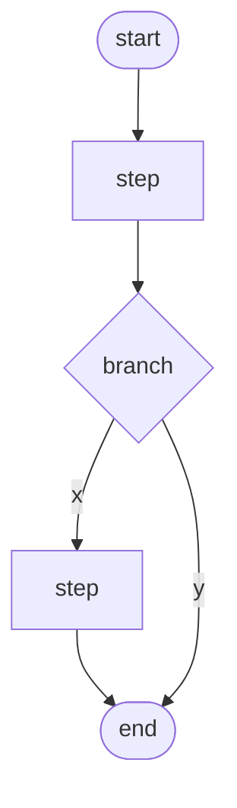
```mermaid
flowchart TD
    A1(["start"]) --> B1["step"] --> C1{"branch"}
    C1 -->|x| D1["step"] --> E1(["end"])
    C1 -->|y| E1
```

**Agent (decided at runtime):**

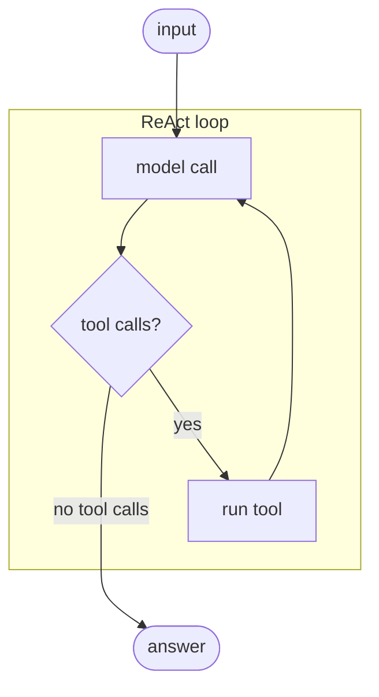
```mermaid
flowchart TD
    A2(["input"]) --> M
    subgraph LOOP["ReAct loop"]
    direction TB
        M["model call"] --> Q{"tool calls?"}
        Q -->|yes| X["run tool"] --> M
    end
    Q -->|"no tool calls"| Z(["answer"])
    X ~~~ Z
```

Anchors

<strong>Anchors:</strong> &bull; <code>agent-core/openjiuwen/core/workflow/workflow.py:98</code> — <code>Workflow</code> class &bull; <code>agent-core/openjiuwen/core/graph/pregel/engine.py:255</code> — graph execution driver &bull; <code>agent-core/openjiuwen/core/workflow/workflow.py:136/279/311</code> — <code>set_start_comp</code> / <code>add_connection</code> / <code>add_conditional_connection</code> &bull; <code>agent-core/openjiuwen/core/workflow/workflow.py:551</code> — terminates when the end component produces output &bull; <code>agent-core/openjiuwen/core/workflow/components/llm/react/react_executable.py:41</code> — workflow node embedding an agent

_Canonical source: `source/ai-agent-interview-questions_for_engineers.md`; also covered in: ai-agent._

## 3. What's the difference between a linear chain and a graph with conditional branches

**General:** A linear chain is a fixed sequence where each step always activates the next. A graph adds branching and merging: a router selects successors based on state at runtime, and a join/barrier decides when a merge node is ready (all predecessors, or any of an exclusive group).

**Jiuwen:** Both are built on the same `PregelGraph`. `add_connection` registers a static edge; at compile time `PregelGraph._compile` turns static edges into `StaticRouter` (1→N) or `BarrierChannel` (N→1, with CNF OR-groups for mutually exclusive predecessors). `add_conditional_connection` registers a branch router compiled to `ConditionalRouter`, whose `dispatch` calls the user selector and emits `TriggerMessage`s only for the chosen targets. A linear chain always activates its single successor; a conditional graph activates only the selector's targets, and `BranchRouter` raises `COMPONENT_BRANCH_EXECUTION_ERROR` if none match.

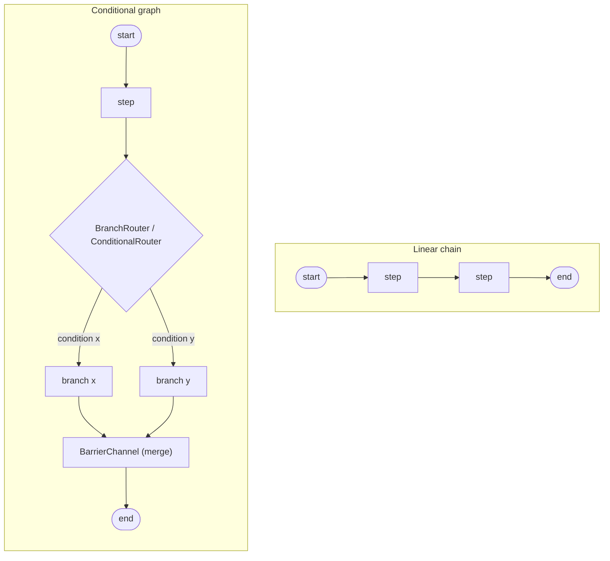
```mermaid
flowchart TD
    subgraph LIN["Linear chain"]
    direction LR
    L1(["start"]) --> L2["step"] --> L3["step"] --> L4(["end"])
    end
    subgraph COND["Conditional graph"]
    direction TB
    S(["start"]) --> P["step"] --> R{"BranchRouter / ConditionalRouter"}
    R -->|"condition x"| X["branch x"] --> M["BarrierChannel (merge)"]
    R -->|"condition y"| Y["branch y"] --> M
    M --> E(["end"])
    end
```

Anchors

<strong>Anchors:</strong> &bull; <code>agent-core/openjiuwen/core/workflow/workflow.py:279</code> — <code>add_connection</code> (static); <code>:311</code> — <code>add_conditional_connection</code> &bull; <code>agent-core/openjiuwen/core/workflow/_workflow.py:221</code> — <code>BaseWorkflow.add_connection</code> → <code>self._graph.add_edge</code>; <code>:255</code> — <code>add_conditional_connection</code> wraps <code>BranchRouter</code> + <code>register_branch_targets</code> &bull; <code>agent-core/openjiuwen/core/graph/graph.py:103</code> — <code>add_edge</code>; <code>:122</code> — <code>add_conditional_edges</code>; <code>:267</code> <code>_compile</code>; <code>:300</code> adds branches to the Pregel builder &bull; <code>agent-core/openjiuwen/core/graph/pregel/builder.py:28</code> — <code>add_edge</code> (N→1 <code>BarrierChannel</code>, 1→N <code>StaticRouter</code>); <code>:67</code> <code>add_branch</code> &bull; <code>agent-core/openjiuwen/core/graph/pregel/router.py:11</code> — <code>StaticRouter.dispatch</code>; <code>:26</code> <code>ConditionalRouter.dispatch</code> &bull; <code>agent-core/openjiuwen/core/graph/pregel/channels.py:104</code> — <code>TriggerChannel</code>; <code>:129</code> <code>BarrierChannel</code>; <code>:166</code> <code>is_ready</code> (CNF OR-groups) &bull; <code>agent-core/openjiuwen/core/workflow/components/flow/branch_router.py:92</code> — <code>BranchRouter.__call__</code>

**Gap.** `branch_targets` (used for CNF OR-group resolution) is only populated for `BranchRouter`; arbitrary callable routers go through a `new_router` wrapper and never register target sets, so exclusive-branch merging degrades to plain AND barriers. There is no static validation that a conditional router's targets are declared nodes, and `ConditionalRouter.dispatch` passes `state=None` to selectors, so selectors cannot read graph state directly.

_Canonical source: `source/ai-agent-framework-interview-questions_for_engineers.md`; also covered in: framework._

## 4. What's the ReAct pattern, and why interleave reasoning with actions instead of planning everything upfront

**General:** ReAct alternates thought → action → observation. Interleaving lets each action's real result inform the next thought, which corrects drift and grounds reasoning in observed state. A fully upfront plan cannot react to what the tools actually return.

**Jiuwen:** The loop is exactly reason/act/observe: model call, branch on `tool_calls`, execute, feed `ToolMessage`s back as the next observation, repeat. The reasoning trace is retained by copying `reasoning_content` into the assistant message, and the iteration number is exposed to rails.

**Why interleave:** a fully upfront plan executes with no feedback; ReAct feeds each observation back into the next reasoning step, so it can adapt when reality differs from the plan.

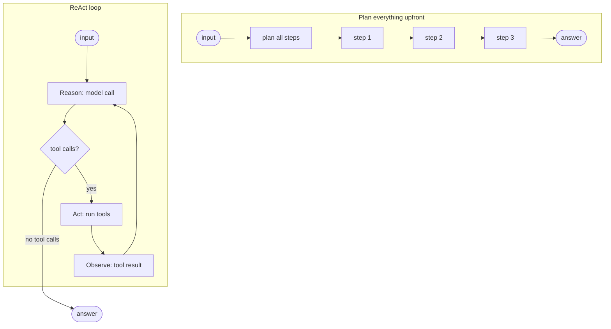
```mermaid
flowchart TD
    subgraph PLAN["Plan everything upfront"]
    I1(["input"]) --> P["plan all steps"] --> S1["step 1"] --> S2["step 2"] --> S3["step 3"] --> O1(["answer"])
    end
    subgraph LOOP["ReAct loop"]
    direction TB
        I2(["input"]) --> R["Reason: model call"]
        R --> D{"tool calls?"}
        D -->|yes| TA["Act: run tools"] --> OB["Observe: tool result"] --> R
    end
    D -->|"no tool calls"| O2(["answer"])
    OB ~~~ O2
```

Anchors

<strong>Anchors:</strong> &bull; <code>agent-core/openjiuwen/core/single_agent/agents/react_agent.py:2766</code> — model call (reason) &bull; <code>agent-core/openjiuwen/core/single_agent/agents/react_agent.py:2793</code> — branch on tool calls &bull; <code>agent-core/openjiuwen/core/single_agent/agents/react_agent.py:2813</code> — execute (act) &bull; <code>agent-core/openjiuwen/core/single_agent/agents/react_agent.py:2787</code> — retain <code>reasoning_content</code> &bull; <code>agent-core/openjiuwen/core/single_agent/agents/react_agent.py:2742</code> — iteration exposed to rails &bull; <code>agent-core/openjiuwen/core/single_agent/agents/react_agent.py:568</code> — <code>ReActAgent</code> documents the pattern

_Canonical source: `source/ai-agent-interview-questions_for_engineers.md`; also covered in: ai-agent._

## 5. How does function calling actually work under the hood

**General:** Tool definitions (name, description, JSON-Schema parameters) are sent to the model in the request. The model returns a structured `tool_calls` list instead of prose; the host parses it, validates arguments against the schema, invokes the function, and appends the result as a tool message for the next model turn. The model never runs code — it only emits a request to.

**Jiuwen:** Cards become JSON Schema through the callable schema extractor, the ability manager builds the model-facing tool list, and the model client converts it to OpenAI/Anthropic tool format. The model's `tool_calls` are parsed (non-streaming, streaming, and Anthropic), validated, and dispatched by the ability manager, with schema validation inside `LocalFunction.invoke`.

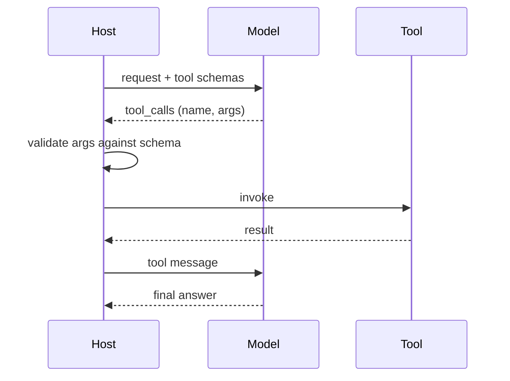
```mermaid
sequenceDiagram
    participant Host
    participant Model
    participant Tool
    Host->>Model: request + tool schemas
    Model-->>Host: tool_calls (name, args)
    Host->>Host: validate args against schema
    Host->>Tool: invoke
    Tool-->>Host: result
    Host->>Model: tool message
    Model-->>Host: final answer
```

Anchors

<strong>Anchors:</strong> &bull; <code>agent-core/openjiuwen/core/foundation/tool/utils/callable_schema_extractor.py:20</code> — card → JSON Schema &bull; <code>agent-core/openjiuwen/core/single_agent/ability_manager.py:984</code> — builds the model-facing tool list &bull; <code>agent-core/openjiuwen/core/foundation/llm/model_clients/base_model_client.py:483</code> — OpenAI tool format &bull; <code>agent-core/openjiuwen/core/foundation/llm/model_clients/anthropic_model_client.py:494</code> — Anthropic tool format &bull; <code>agent-core/openjiuwen/core/foundation/llm/model_clients/openai_model_client.py:2388</code> — parse non-streaming tool calls &bull; <code>agent-core/openjiuwen/core/foundation/llm/model_clients/openai_model_client.py:2612</code> — parse streaming tool-call deltas &bull; <code>agent-core/openjiuwen/core/foundation/llm/model_clients/anthropic_model_client.py:1229</code> — parse Anthropic <code>tool_use</code> &bull; <code>agent-core/openjiuwen/core/single_agent/ability_manager.py:1078</code> — dispatch &bull; <code>agent-core/openjiuwen/core/foundation/tool/function/function.py:82</code> — argument schema validation

_Canonical source: `source/ai-agent-interview-questions_for_engineers.md`; also covered in: ai-agent, genai, llm-applied, engineering._

## 6. How do you set a hard limit on iterations or steps within a framework

**General:** Cap the loop with a max-iteration/max-round counter, plus optional token and wall-clock budgets, and *enforce* them rather than only reporting. Nested loops need a cap at each level, and the caps should be configurable.

**Jiuwen:** The inner ReAct loop is bounded by `ReActAgentConfig.max_iterations` (default 5) and exits with `{"result_type": "error", "output": "Max iterations reached without completion"}`. When `enable_task_loop=True`, DeepAgent raises the inner ReAct ceiling to `sys.maxsize` and moves the real bound to the outer task loop, where `LoopCoordinator.should_continue()` OR-evaluates a chain of `StopConditionEvaluator`s. `TaskCompletionRail.build_evaluators()` contributes `MaxRounds`/`Timeout`/`TokenBudget`/`CompletionPromise`; the `NoProgressAnswer` evaluator is added separately from `task_loop_no_progress_guard` (`deep_agent._build_task_loop_evaluators`). Independently, `_run_task_loop` hard-codes `max_outer_rounds = 50` and force-stops with `stop_reason: "MaxOuterRounds"`. Team members reuse the wiring via `TaskCompletionRail(max_rounds=...)`, and cooperative stops exist via `ctx.request_force_finish()` and `DeepAgent.abort()`.

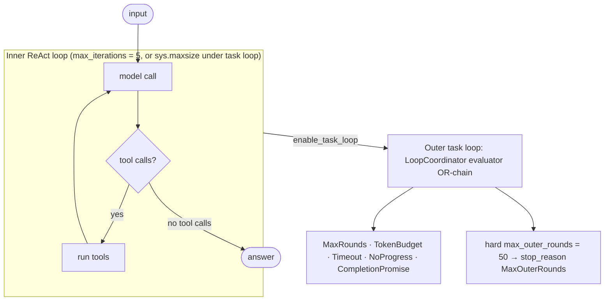
```mermaid
flowchart TD
    I(["input"]) --> M
    subgraph INNER["Inner ReAct loop (max_iterations = 5, or sys.maxsize under task loop)"]
    direction TB
        M["model call"] --> D{"tool calls?"}
        D -->|yes| T["run tools"] --> M
    end
    D -->|"no tool calls"| A(["answer"])
    INNER -->|"enable_task_loop"| OUTER["Outer task loop: LoopCoordinator evaluator OR-chain"]
    OUTER --> EV["MaxRounds · TokenBudget · Timeout · NoProgress · CompletionPromise"]
    OUTER --> HARD["hard max_outer_rounds = 50 → stop_reason MaxOuterRounds"]
```

Anchors

<strong>Anchors:</strong> &bull; <code>agent-core/openjiuwen/core/single_agent/agents/react_agent.py:288</code> — <code>max_iterations: int = Field(default=5)</code>; <code>:2740</code> the bounded loop; <code>:2852</code> exhaustion result &bull; <code>agent-core/openjiuwen/harness/schema/stop_condition.py:134</code> — <code>MaxRoundsEvaluator.should_stop</code>; <code>:143</code> TokenBudget; <code>:162</code> Timeout &bull; <code>agent-core/openjiuwen/harness/task_loop/loop_coordinator.py:139</code> — <code>should_continue()</code> OR-chain; <code>:110</code> <code>increment_iteration</code>; <code>:133</code> <code>request_abort</code> &bull; <code>agent-core/openjiuwen/harness/rails/task_completion_rail.py:168</code> — <code>build_evaluators()</code>; <code>:178-185</code> build MaxRounds/Timeout/TokenBudget &bull; <code>agent-core/openjiuwen/harness/deep_agent.py:2723</code> — <code>max_outer_rounds = 50</code>; <code>:2725</code> <code>while coordinator.should_continue()</code>; <code>:2727-2739</code> force-stop; <code>:1116</code> inner cap swap; <code>:2338</code> <code>_build_task_loop_evaluators</code>; <code>:3380</code> <code>abort()</code> &bull; <code>agent-core/openjiuwen/agent_teams/agent/agent_configurator.py:436</code> — member <code>TaskCompletionRail(max_rounds=agent_spec.max_iterations)</code> &bull; <code>agent-core/openjiuwen/agent_teams/workflow/backends/budget_rail.py:88</code> — token-ceiling <code>ctx.request_force_finish</code>; <code>agent-core/openjiuwen/agent_teams/agent/scheduling/scheduler.py:300</code> — review-round cap

**Gap.** The 50-round ceiling is a literal local, not configurable. `TaskCompletionRail`'s `max_rounds`/`timeout_seconds`/`max_tokens` all default to `None`, so with the default auto-injected rail the LoopCoordinator chain is empty and only the 50-round literal and abort bound the outer loop. `NoProgressAnswerEvaluator` is gated by `TaskLoopNoProgressGuardConfig.enabled`, which defaults to `True`. Agent-teams review-round caps and swarmflow budget caps apply only in `scheduled` mode / when a budget is configured.

_Canonical source: `source/ai-agent-framework-interview-questions_for_engineers.md`; also covered in: framework, ai-agent._

## 7. What decides when an agent stops and returns a final answer instead of calling another tool

**General:** Usually the model itself: when it emits no tool calls, the answer is final. Around that sit hard limits — max iterations, token/time budgets, and explicit stop conditions — so a confused agent does not loop forever.

**Jiuwen:** Two levels. Inner: in `ReActAgent`, no tool calls means a final answer, bounded by `max_iterations` (default 5). Outer (`DeepAgent` task loop): the `LoopCoordinator` OR-evaluates a chain of stop evaluators — max rounds, timeout, token budget, completion promise, and no-progress answer. Completion can also arrive as a `<promise>…</promise>` marker extracted by `TaskCompletionRail`. A hardcoded ceiling of 50 outer rounds backstops everything.

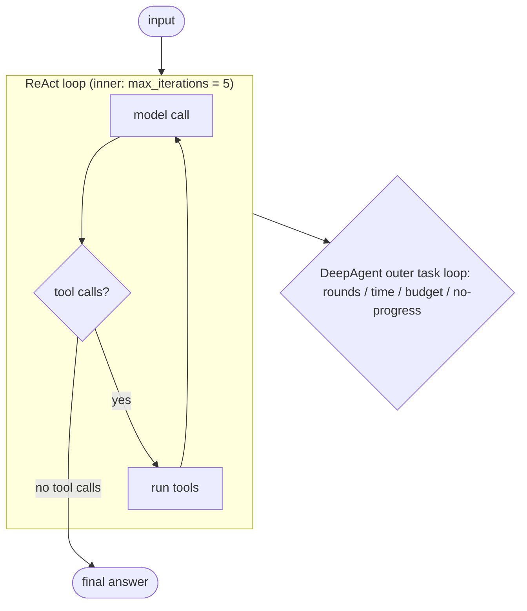
```mermaid
flowchart TD
    I(["input"]) --> LOOP
    subgraph LOOP["ReAct loop (inner: max_iterations = 5)"]
    direction TB
        M["model call"] --> T{"tool calls?"}
        T -->|yes| R["run tools"] --> M
    end
    LOOP --> G{"DeepAgent outer task loop: rounds / time / budget / no-progress"}
    T -->|"no tool calls"| F(["final answer"])
    R ~~~ F
```

Anchors

<strong>Anchors:</strong> &bull; <code>agent-core/openjiuwen/core/single_agent/agents/react_agent.py:2793</code> — no tool calls → final answer &bull; <code>agent-core/openjiuwen/core/single_agent/agents/react_agent.py:288</code> — <code>max_iterations</code> default 5 &bull; <code>agent-core/openjiuwen/core/single_agent/agents/react_agent.py:2740</code> — inner loop &bull; <code>agent-core/openjiuwen/harness/task_loop/loop_coordinator.py:139</code> — outer <code>should_continue</code> &bull; <code>agent-core/openjiuwen/harness/schema/stop_condition.py:124-331</code> — evaluator chain &bull; <code>agent-core/openjiuwen/harness/rails/task_completion_rail.py:403</code> — completion-promise extraction &bull; <code>agent-core/openjiuwen/harness/deep_agent.py:2723</code> — hard 50-round ceiling

_Canonical source: `source/ai-agent-interview-questions_for_engineers.md`; also covered in: ai-agent._

## 8. How do you decide how many retrieval hops are enough, and how do you prevent the system from looping indefinitely

**General:** Use a sufficiency check — decide whether the accumulated evidence answers the question — and stop when it does; cap the hops with a hard limit as a backstop. Add repetition/loop detection and a cost ceiling so a confused retriever cannot burn tokens. Prefer a dynamic stop (sufficiency) with a static cap (max hops).

**Jiuwen:** Three caps. `AgenticRetriever.max_iter` defaults to 2 and is hard-clamped (invalid values fall back to 2); each loop breaks at `turn >= max_iter`. `TripleBeamSearch.max_length` defaults to 2 and rejects `<1`. Sufficiency: `_rewrite` sends `_REWRITE_PROMPT`, which returns `{"sufficient": bool, "next_question": str|null}`; only `sufficient=false` with a non-empty question continues. Beyond retrieval, `ModelAnomalyDetectionRail` detects consecutive identical tool-call rounds and compacts or aborts, `ToolCallDeduplicationRail` short-circuits duplicate calls, and the ReAct loop is bounded by `max_iterations`.

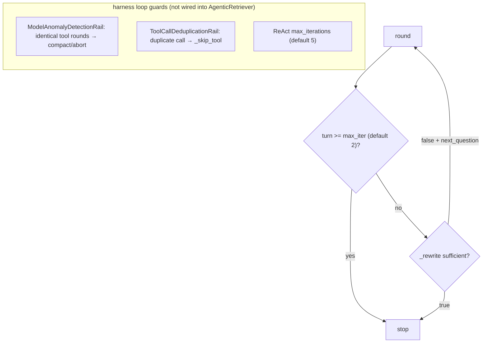
```mermaid
flowchart TD
    R["round"] --> C1{"turn >= max_iter (default 2)?"}
    C1 -->|yes| STOP["stop"]
    C1 -->|no| S{"_rewrite sufficient?"}
    S -->|true| STOP
    S -->|"false + next_question"| R
    subgraph GUARDS["harness loop guards (not wired into AgenticRetriever)"]
    direction TB
    A["ModelAnomalyDetectionRail: identical tool rounds → compact/abort"]
    D["ToolCallDeduplicationRail: duplicate call → _skip_tool"]
    I["ReAct max_iterations (default 5)"]
    end
```

Anchors

<strong>Anchors:</strong> &bull; <code>agent-core/openjiuwen/core/retrieval/retriever/agentic_retriever.py:133</code> — <code>max_iter=2</code>; <code>:148</code> invalid-value fallback; <code>:241/287</code> turn-cap break; <code>:364</code> parses <code>sufficient</code>/<code>next_question</code> &bull; <code>agent-core/openjiuwen/core/retrieval/retriever/graph_retriever.py:37</code> — <code>max_length &lt; 1</code> raises; <code>:402</code> <code>graph_hops</code> default 2 &bull; <code>agent-core/openjiuwen/harness/rails/model_anomaly_detection_rail.py:418</code> — loop bailout <code>AbortError</code>; <code>:466</code> <code>_find_tool_loop_compact_range</code> &bull; <code>jiuwenswarm/jiuwenswarm/agents/harness/common/rails/tool_dedup_rail.py:128</code> — <code>_skip_tool</code> duplicate suppression &bull; <code>agent-core/openjiuwen/core/single_agent/agents/react_agent.py:2740</code> — <code>for iteration in range(..., max_iterations)</code>

**Gap.** `max_iter`/`graph_hops` are static, not chosen by query difficulty; the harness loop guards are **not wired into `AgenticRetriever`**, which has no loop detector beyond the turn cap. If `_rewrite` JSON fails to parse it returns `None` — indistinguishable from "sufficient" (silent early stop).

_Canonical source: `source/rag-part2-interview-questions_for_engineers.md`; also covered in: rag-2._

## 9. Preventing an agent from getting stuck in an infinite tool-calling loop

**General:** Cap iterations, detect repetition (same tool and arguments repeatedly), nudge or abort when no progress is made, and also cap rounds, tokens, and wall time. Detection should compare canonicalized arguments, not raw strings.

**Jiuwen:** Inner cap `max_iterations` (ReAct default 5, harness default 15). Repetition detection: `ModelAnomalyDetectionRail` finds consecutive identical `(tool_name, canonical_args)` rounds and either folds them into a warning or aborts; `ToolCallDeduplicationRail` counts repeated read-only calls and warns. Outer guards: `NoProgressAnswerEvaluator`, `MaxRoundsEvaluator`, and the hard 50-round ceiling. Agent teams add repeat-tool and ping-pong detectors.

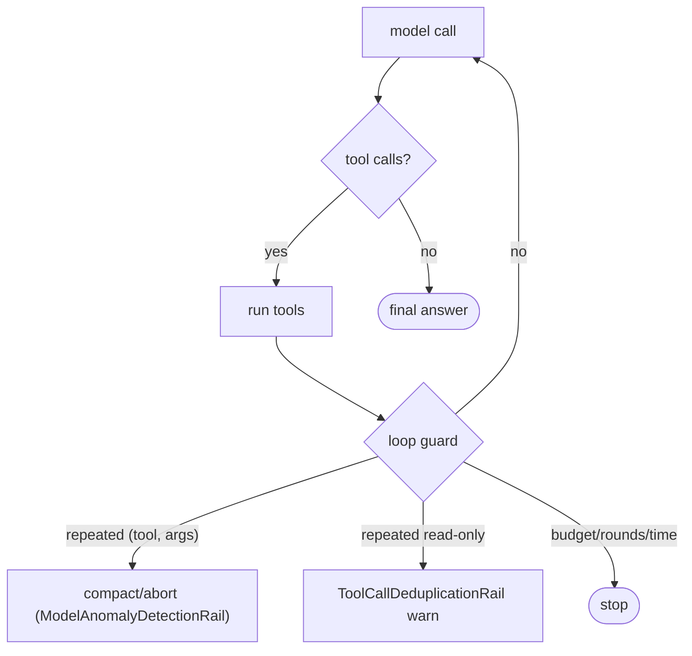
```mermaid
flowchart TD
    M["model call"] --> D{"tool calls?"}
    D -->|yes| T["run tools"]
    T --> G{"loop guard"}
    G -->|"repeated (tool, args)"| W["compact/abort (ModelAnomalyDetectionRail)"]
    G -->|"repeated read-only"| DEDUP["ToolCallDeduplicationRail warn"]
    G -->|no| M
    G -->|"budget/rounds/time"| X(["stop"])
    D -->|no| A(["final answer"])
```

Anchors

<strong>Anchors:</strong> &bull; <code>agent-core/openjiuwen/core/single_agent/agents/react_agent.py:288</code> — <code>max_iterations</code> default 5; <code>agent-core/openjiuwen/harness/schema/config.py:252</code> — harness default 15 &bull; <code>agent-core/openjiuwen/harness/rails/model_anomaly_detection_rail.py:74/90</code> — tool-loop threshold + bailout &bull; <code>jiuwenswarm/jiuwenswarm/agents/harness/common/rails/tool_dedup_rail.py:157</code> — cross-turn repeat counter &bull; <code>agent-core/openjiuwen/harness/schema/stop_condition.py:181</code> — <code>NoProgressAnswerEvaluator</code> &bull; <code>agent-core/openjiuwen/harness/deep_agent.py:2723</code> — hard 50-round ceiling &bull; <code>agent-core/openjiuwen/agent_teams/reliability/detectors/repeat_tool.py:15</code> — repeat-tool; <code>agent-core/openjiuwen/agent_teams/reliability/detectors/pingpong.py:12</code> — ping-pong

_Canonical source: `source/ai-engineer-technical-questions_for_engineers.md`; also covered in: ai-agent, engineering, genai, llm-applied._

## 10. How does an agent decide when to retrieve again versus when it has enough context to answer

**General:** Ask the model a sufficiency question — given the query and the evidence so far, is it enough to answer, and if not what is the next query? Stop when sufficient or when the hop/round cap is hit. Judging sufficiency on the evidence (not just a scratchpad) matters.

**Jiuwen:** This is `AgenticRetriever._rewrite`: `_REWRITE_PROMPT` receives the query, the accumulated `TripleMemory.triples_str`, and the rewrite history, and returns `{"sufficient": bool, "next_question": str|null}`. If sufficient or no next question, `_rewrite` returns `None`, which breaks the loop; otherwise the next question is appended. The hard stop is `turn >= max_iter` before `_rewrite` is called.

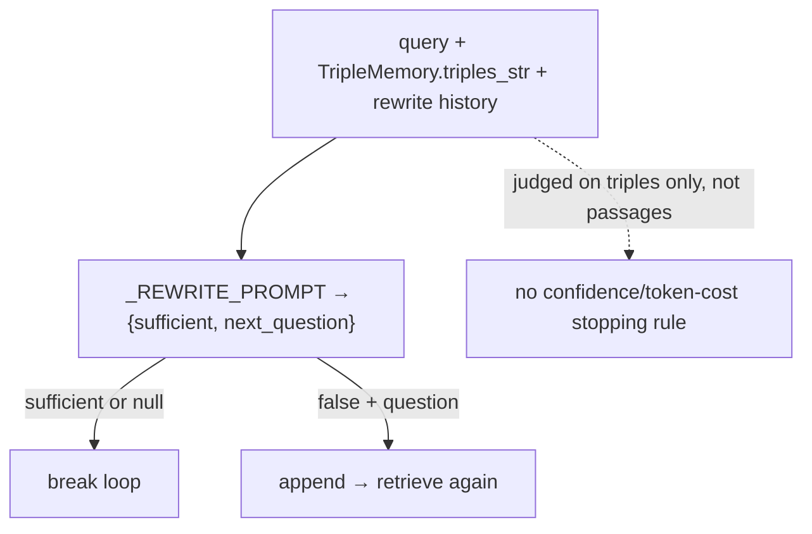
```mermaid
flowchart TD
    Q["query + TripleMemory.triples_str + rewrite history"] --> RW["_REWRITE_PROMPT → {sufficient, next_question}"]
    RW -->|"sufficient or null"| STOP["break loop"]
    RW -->|"false + question"| NEXT["append → retrieve again"]
    Q -.->|"judged on triples only, not passages"| X["no confidence/token-cost stopping rule"]
```

Anchors

<strong>Anchors:</strong> &bull; <code>agent-core/openjiuwen/core/retrieval/retriever/agentic_retriever.py:51</code> — <code>_REWRITE_PROMPT</code> JSON contract; <code>:326</code> <code>_rewrite</code>; <code>:341</code> history formatting; <code>:364</code> <code>sufficient</code>/<code>next_question</code>; <code>:244/290</code> append-and-continue &bull; <code>agent-core/openjiuwen/core/retrieval/common/triple_memory.py:16</code> — <code>triples_str</code> fed to the prompt &bull; <code>agent-core/openjiuwen/core/retrieval/retriever/agentic_retriever.py:67</code> — prompt to differentiate/simplify later questions

**Gap.** Sufficiency is judged on triples only, not the actual passages; no confidence score; a JSON parse failure returns `None` (silent early stop).

_Canonical source: `source/rag-part2-interview-questions_for_engineers.md`; also covered in: rag-2._

## 11. How does a framework register and expose tools to the underlying model

**General:** You register a tool with a name, description, and parameter schema; the framework collects registered tools into the model request in the provider's tool format; the model returns tool calls that the framework dispatches. Auto-deriving the schema from a function signature is the convenience that makes this usable.

**Jiuwen:** Abilities are stored as metadata cards (`ToolCard`/`WorkflowCard`/`AgentCard`/`McpServerConfig`) in `AbilityManager`'s per-type dicts via `add()`; executable instances live separately in `Runner.resource_mgr`, bound by `add_ability()`. On each ReAct iteration, `list_tool_info()` flattens cards into `ToolInfo(name, description, parameters)`, and MCP servers are resolved lazily with an `mcp_<server>_` prefix. The list is placed on `ctx.inputs.tools` (after rails may filter it) and converted by the model client — OpenAI-style `_convert_tools_to_dict` emits `{"type":"function","function":{...}}`, Anthropic `_convert_tool_schemas` renames `parameters` → `input_schema`. Function/`@tool` backends auto-derive the schema via `CallableSchemaExtractor`.

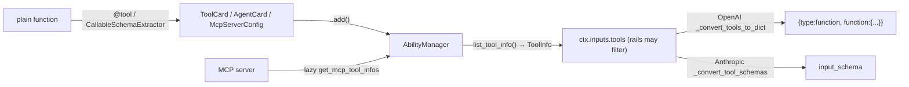
```mermaid
flowchart LR
    CARD["ToolCard / AgentCard / McpServerConfig"] -->|"add()"| AM["AbilityManager"]
    AM -->|"list_tool_info() → ToolInfo"| CTX["ctx.inputs.tools (rails may filter)"]
    CTX -->|"OpenAI _convert_tools_to_dict"| OAI["{type:function, function:{...}}"]
    CTX -->|"Anthropic _convert_tool_schemas"| ANT["input_schema"]
    FN["plain function"] -->|"@tool / CallableSchemaExtractor"| CARD
    MCP["MCP server"] -->|"lazy get_mcp_tool_infos"| AM
```

Anchors

<strong>Anchors:</strong> &bull; <code>agent-core/openjiuwen/core/single_agent/ability_manager.py:616</code> — <code>add()</code> registers any ability card; ToolCard branch stores at <code>:669</code> &bull; <code>agent-core/openjiuwen/core/single_agent/ability_manager.py:772</code> — <code>add_ability()</code> card + concrete <code>Tool</code> &bull; <code>agent-core/openjiuwen/core/single_agent/ability_manager.py:984</code> — <code>list_tool_info()</code> cards → <code>ToolInfo</code> &bull; <code>agent-core/openjiuwen/core/single_agent/ability_manager.py:1047</code> — MCP path (<code>get_mcp_tool_infos</code>, <code>mcp_model_tool_name</code>); <code>:1067</code> lazy <code>ToolCard</code> &bull; <code>agent-core/openjiuwen/core/foundation/tool/base.py:120</code> — <code>ToolCard.tool_info()</code> &bull; <code>agent-core/openjiuwen/core/foundation/tool/utils/callable_schema_extractor.py:20</code> — <code>generate_schema()</code> from a callable signature &bull; <code>agent-core/openjiuwen/core/foundation/llm/model_clients/base_model_client.py:483</code> — <code>_convert_tools_to_dict()</code>; attached at <code>:576</code> &bull; <code>agent-core/openjiuwen/core/foundation/llm/model_clients/anthropic_model_client.py:494</code> — <code>_convert_tool_schemas()</code> → <code>input_schema</code> &bull; <code>agent-core/openjiuwen/core/single_agent/agents/react_agent.py:2683</code> — per-invoke <code>list_tool_info()</code>; set at <code>:1538</code> &bull; <code>agent-core/openjiuwen/harness/factory.py:443</code> — registers tool instances (<code>add_ability</code>); <code>:453</code> pure cards (<code>add</code>)

**Gap.** Exposure policy (`ToolExposure`) is registration-time only; `_apply_tool_exposure_policy` does not rewrite already-registered cards. `list_tool_info()` silently drops MCP `ToolInfo` when a server name collides. `ToolInfo.parameters` may be a `dict` or a `BaseModel`; only OpenAI's converter handles both.

_Canonical source: `source/ai-agent-framework-interview-questions_for_engineers.md`; also covered in: framework._

## 12. How do you handle a tool that a framework doesn't natively support

**General:** The framework should let you wrap an arbitrary function as a tool, define a custom tool class for custom transport/auth, or connect an external tool server through a protocol such as MCP. If none of those is possible, that is a real limitation.

**Jiuwen:** The primary path is the `@tool` decorator, which wraps any plain function into a `LocalFunction` (a `Tool` subclass) with an auto-extracted or explicit `input_params`, then registers it via `ability_manager.add_ability(card, resource)`. The decorator builds a fresh `ToolCard` (`_create_new_tool_card`) or derives one from a prebuilt card (`_handle_prebuilt_card`), so callers can override `name`/`description`/`input_params`/`stateless`. Unsupported tools can also be declared as a `ToolCard` plus a concrete `Tool` subclass, or exposed through MCP: a `McpServerConfig` is added to the ability manager, and the runner materializes each discovered `McpToolCard` into an `MCPTool`. `build_tool_card` is the harness-standard card factory.

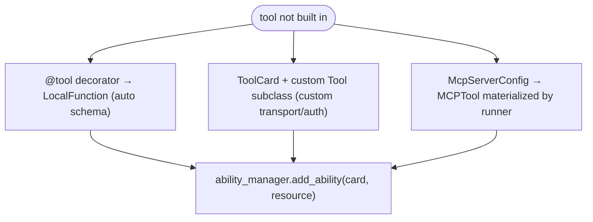
```mermaid
flowchart TD
    U(["tool not built in"]) --> P1["@tool decorator → LocalFunction (auto schema)"]
    U --> P2["ToolCard + custom Tool subclass (custom transport/auth)"]
    U --> P3["McpServerConfig → MCPTool materialized by runner"]
    P1 --> REG["ability_manager.add_ability(card, resource)"]
    P2 --> REG
    P3 --> REG
```

Anchors

<strong>Anchors:</strong> &bull; <code>agent-core/openjiuwen/core/foundation/tool/tool.py:31</code> — <code>tool()</code> universal decorator; <code>:95/115</code> returns decorated <code>LocalFunction</code> &bull; <code>agent-core/openjiuwen/core/foundation/tool/tool.py:120</code> — <code>_handle_prebuilt_card()</code>; <code>:160</code> <code>_create_new_tool_card()</code> &bull; <code>agent-core/openjiuwen/core/foundation/tool/function/function.py:48</code> — <code>LocalFunction.__init__</code>; <code>:76</code> <code>invoke</code> &bull; <code>agent-core/openjiuwen/core/foundation/tool/__init__.py:19</code> — <code>tool</code>; <code>:29</code> <code>LocalFunction</code> &bull; <code>agent-core/openjiuwen/core/foundation/tool/mcp/base.py:137</code> — <code>McpServerConfig</code>; <code>:178</code> <code>MCPTool</code>; <code>:198</code> <code>invoke</code> &bull; <code>agent-core/openjiuwen/core/runner/resources_manager/tool_manager.py:281</code> — discovered MCP cards materialized into <code>MCPTool</code> &bull; <code>agent-core/openjiuwen/extensions/context_evolver/tool/wikipedia_tool.py:86</code> — minimal <code>ToolCard</code> + <code>LocalFunction</code> example &bull; <code>agent-core/openjiuwen/harness/prompts/tools/__init__.py:250</code> — <code>build_tool_card()</code>

**Gap.** `@tool` exposes no `idempotent`/`parallel_safe`/`properties` arguments, so a decorator-created tool cannot directly declare retry/timeout policy — pass a prebuilt `card=` or mutate `card` afterward. `LocalFunction` accepts only a `func` (and optional `render`); tools needing custom transport/auth must subclass `Tool` or use `RestfulApi`/`MCPTool`. `AbilityManager._execute_single_tool_call` treats a bare `McpServerConfig` name as unimplemented, so MCP must be registered/materialized before execution.

_Canonical source: `source/ai-agent-framework-interview-questions_for_engineers.md`; also covered in: framework._

## 13. How do you handle a tool call that fails or returns malformed output

**General:** Treat failures as data, not crashes: catch the exception, classify whether it is retryable, return a structured error the model can read and react to, and repair obviously broken payloads (e.g., unbalanced JSON) when possible.

**Jiuwen:** `ToolCallResilienceRail` is auto-mounted. It classifies retryable vs not, never retries non-idempotent tools, and returns a `[Retry Summary]` when the budget is exhausted. Broken tool arguments are repaired by bracket balancing; if unrepairable, the raw JSON is surfaced to the model. The general-purpose `JsonOutputParser`, by contrast, does not repair — it returns `None` on failure.

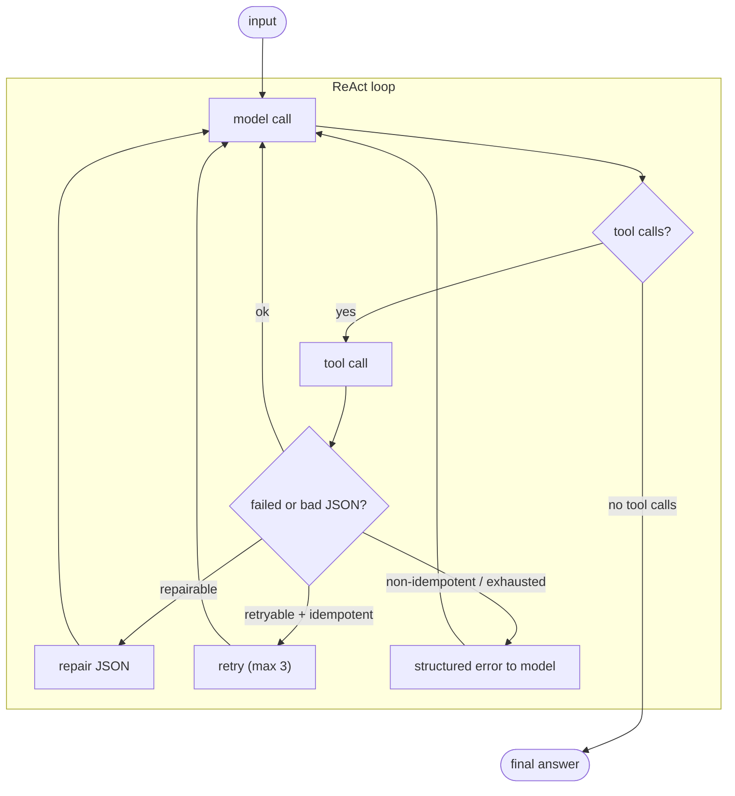
```mermaid
flowchart TD
    I(["input"]) --> M
    subgraph LOOP["ReAct loop"]
    direction TB
        M["model call"] --> D{"tool calls?"}
        D -->|yes| C["tool call"]
        C --> E{"failed or bad JSON?"}
        E -->|repairable| FIX["repair JSON"] --> M
        E -->|"retryable + idempotent"| RETRY["retry (max 3)"] --> M
        E -->|"non-idempotent / exhausted"| ERR["structured error to model"] --> M
        E -->|ok| M
    end
    D -->|"no tool calls"| A(["final answer"])
    ERR ~~~ A
```

Anchors

<strong>Anchors:</strong> &bull; <code>agent-core/openjiuwen/harness/schema/config.py:294</code> — resilience rail enabled by default &bull; <code>agent-core/openjiuwen/harness/factory.py:408</code> — auto-mount &bull; <code>agent-core/openjiuwen/harness/rails/tool_call_resilience_rail.py:198</code> — retryability classification &bull; <code>agent-core/openjiuwen/harness/rails/tool_call_resilience_rail.py:222</code> — never retry non-idempotent tools &bull; <code>agent-core/openjiuwen/harness/rails/tool_call_resilience_rail.py:169</code> — retry-summary on exhaustion &bull; <code>agent-core/openjiuwen/core/single_agent/ability_manager.py:482</code> — JSON bracket-repair &bull; <code>agent-core/openjiuwen/core/single_agent/ability_manager.py:1424</code> — surface raw JSON to the model &bull; <code>agent-core/openjiuwen/core/foundation/llm/output_parsers/json_output_parser.py:56</code> — no repair (returns <code>None</code>)

_Canonical source: `source/ai-agent-interview-questions_for_engineers.md`; also covered in: ai-agent, engineering, llm-applied._

## 14. Designing retry logic that doesn't cause duplicate side effects on a tool call

**General:** Never blindly retry non-idempotent actions (payments, emails, writes). Mark side-effecting tools, use idempotency keys so a repeated call is recognized, and prefer retry only for reads or explicitly idempotent operations. Bound retries with backoff. On ambiguity, surface to a human rather than guess.

**Jiuwen:** `ToolCard.idempotent` defaults to `False` (secure-by-default), and non-idempotent tools are never retried. `ToolCallResilienceRail` decides in layers: reject retry for any card with `idempotent is False`; allow retry only for retryable exception types/markers (timeouts, connection resets, MCP transport); enforce a per-invoke budget (default 3). On a retry it calls `ctx.request_retry()` and the `@rail` decorator re-runs the call. Separately, `ToolCallDeduplicationRail` short-circuits repeated *read-only* calls via an exact `(tool_name, args-hash)` cache, setting `_skip_tool` so the real tool never runs.

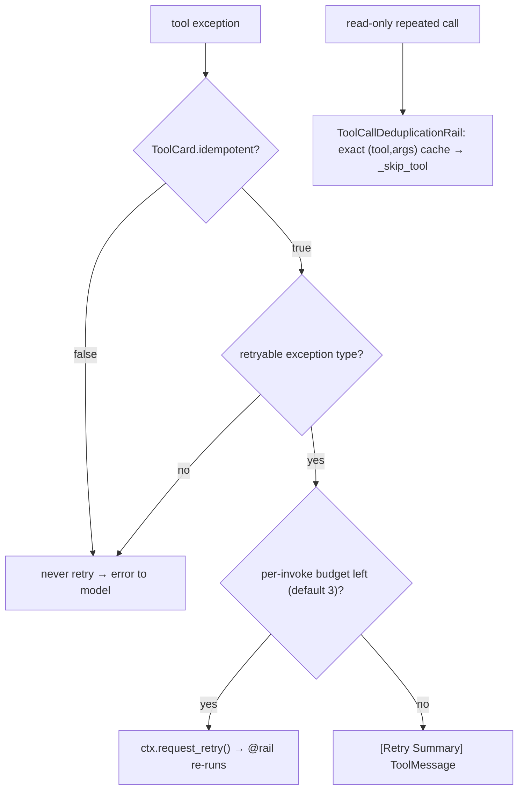
```mermaid
flowchart TD
    EXC["tool exception"] --> L0{"ToolCard.idempotent?"}
    L0 -->|false| NO["never retry → error to model"]
    L0 -->|true| L1{"retryable exception type?"}
    L1 -->|no| NO
    L1 -->|yes| L2{"per-invoke budget left (default 3)?"}
    L2 -->|yes| RE["ctx.request_retry() → @rail re-runs"]
    L2 -->|no| SUM["[Retry Summary] ToolMessage"]
    READ["read-only repeated call"] --> DEDUP["ToolCallDeduplicationRail: exact (tool,args) cache → _skip_tool"]
```

Anchors

<strong>Anchors:</strong> &bull; <code>agent-core/openjiuwen/core/foundation/tool/base.py:109</code> — <code>idempotent</code> default <code>False</code> &bull; <code>agent-core/openjiuwen/harness/rails/tool_call_resilience_rail.py:128</code> — non-idempotent guard; <code>:141</code> retryable-exception filter; <code>:145</code> per-invoke budget; <code>:196</code> <code>ctx.request_retry()</code> &bull; <code>agent-core/openjiuwen/core/single_agent/rail/base.py:612/1024</code> — <code>request_retry</code> + decorator retry loop &bull; <code>jiuwenswarm/jiuwenswarm/agents/harness/common/rails/tool_dedup_rail.py:24/109</code> — read-only whitelist + exact cache interception &bull; <code>agent-core/openjiuwen/core/single_agent/ability_manager.py:1324</code> — <code>_skip_tool_calls</code> honored &bull; <code>agent-core/openjiuwen/harness_providers/native/harness.py:226</code> — native harness rejects protocol checkpoints (no replay)

**Gap.** No durable idempotency keys / exactly-once semantics — a crash after a side effect but before result persistence can re-execute on replay. Per-tool `max_attempts` overrides are documented as future work; the rail is all-or-nothing.

_Canonical source: `source/ai-engineer-technical-questions_for_engineers.md`; also covered in: ai-agent, engineering._

## 15. How would you add a custom retry policy for a specific tool without breaking the framework's default behavior

**General:** Retry policy should be per-tool and overridable: an idempotency flag, max attempts, backoff, and timeout. A single global retry that ignores non-idempotency is dangerous, but so is a per-tool override that silently disables the framework's safety defaults.

**Jiuwen:** Retry decisions are centralized in `ToolCallResilienceRail` (priority 70, auto-mounted unless `enable_tool_resilience_rail=False`). It hooks `before_tool_call` to reset a per-invoke counter and `on_tool_exception`, where it applies layers: non-idempotent tools (`ToolCard.idempotent is False`, the default) are never retried; retryable exception types/markers (timeouts, connection resets, MCP transport) are; otherwise it calls `ctx.request_retry()`, consumed by the `@rail` decorator wrapping the tool execution. The per-invoke timeout is read separately from `ToolCard.properties["resilience"]["timeout_s"]` by `AbilityManager._resolve_call_timeout`. Customization without breaking defaults is done by setting `idempotent=True`/`properties={"resilience": {...}}` on the card, or by supplying your own rail (the auto-mount checks `_already_provided`).

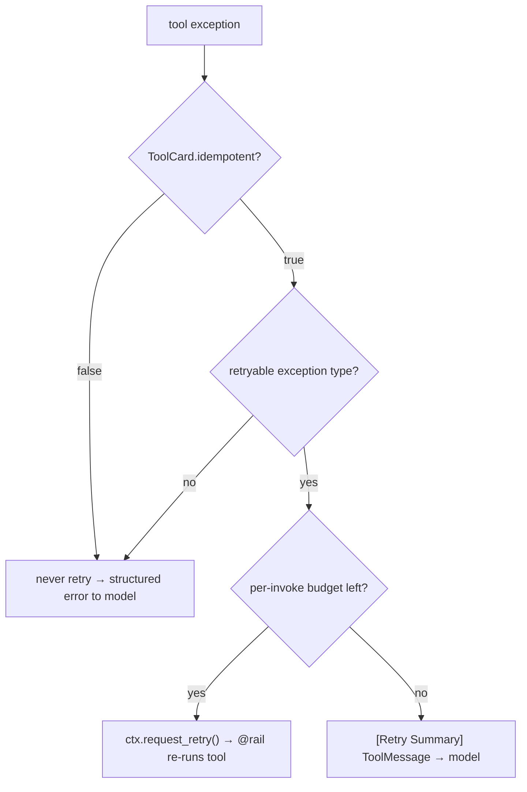
```mermaid
flowchart TD
    EXC["tool exception"] --> ID{"ToolCard.idempotent?"}
    ID -->|false| NO["never retry → structured error to model"]
    ID -->|true| R{"retryable exception type?"}
    R -->|no| NO
    R -->|yes| B{"per-invoke budget left?"}
    B -->|yes| RE["ctx.request_retry() → @rail re-runs tool"]
    B -->|no| SUM["[Retry Summary] ToolMessage → model"]
```

Anchors

<strong>Anchors:</strong> &bull; <code>agent-core/openjiuwen/harness/rails/tool_call_resilience_rail.py:24</code> — <code>ToolCallResilienceRail</code>; <code>:102</code> counter reset; <code>:106</code> <code>on_tool_exception</code>; <code>:145</code> budget check; <code>:196</code> retry request &bull; <code>agent-core/openjiuwen/harness/rails/tool_call_resilience_rail.py:223</code> — <code>_is_non_idempotent()</code>; <code>:244</code> <code>_resolve_max_attempts()</code> &bull; <code>agent-core/openjiuwen/core/foundation/tool/base.py:109</code> — <code>ToolCard.idempotent</code> (default <code>False</code>); <code>:90/92</code> <code>properties</code>/<code>parallel_safe</code> &bull; <code>agent-core/openjiuwen/core/single_agent/ability_manager.py:571</code> — <code>_resolve_call_timeout()</code> reads <code>properties["resilience"]["timeout_s"]</code>; <code>:137</code> hard limit &bull; <code>agent-core/openjiuwen/harness/schema/config.py:294</code> — <code>enable_tool_resilience_rail: bool = True</code>; <code>agent-core/openjiuwen/harness/schema/deep_agent_spec.py:453</code> mirror &bull; <code>agent-core/openjiuwen/harness/factory.py:408</code> — auto-mount; <code>:411</code> <code>_already_provided</code> guard &bull; <code>agent-core/openjiuwen/harness/tools/subagent/subagent_tools.py:45</code> — <code>_attach_call_timeout()</code> sets <code>properties["resilience"]["timeout_s"]</code> &bull; <code>agent-core/openjiuwen/core/single_agent/rail/base.py:612</code> — <code>ctx.request_retry()</code>; <code>agent-core/openjiuwen/harness/prompts/tools/__init__.py:284</code> — <code>build_tool_card</code> honors <code>ToolCardBuildOptions(idempotent=…)</code>

**Gap.** **Per-tool retry budget is not actually implemented**: `_resolve_max_attempts` ignores `properties["resilience"]["max_attempts"]`; only the rail-wide `max_attempts` (default 3) applies. There is no per-tool backoff (`request_retry()` supports `delay_seconds`, but the rail always passes 0). The rail is not exported from `rails/__init__.py`, and "opt out" is only the boolean `idempotent`, so you cannot express "retry twice for tool A, never for B" without replacing the rail globally.

_Canonical source: `source/ai-agent-framework-interview-questions_for_engineers.md`; also covered in: framework._

## 16. Handling concurrent API calls when an agent needs to call multiple tools at once

**General:** When a turn contains several independent tool calls, run them concurrently with async tasks rather than a serial `for` loop, but bound the concurrency (semaphore/pool), respect per-resource ordering (two writes to the same file must not interleave), and mark which tools are safe to parallelize. Failures in one call should not silently cancel the others unless you want fail-fast semantics.

**Jiuwen:** The ReAct loop can emit a `List[ToolCall]` in one turn. `AbilityManager.execute` normalizes them, builds one coroutine plus an isolated `AgentCallbackContext` per call (copying `extra` to avoid racy dict mutation), and if `parallel_tool_calls=True` dispatches to `_execute_parallel_tool_tasks`. That groups consecutive calls whose `ToolCard.parallel_safe` is true into batches; each batch runs through `_execute_resource_ordered_tool_tasks`, which partitions calls into "lanes" keyed by normalized file path (unknown resources get private lanes) and `asyncio.gather`s across lanes while awaiting sequentially *within* a lane. A `parallel_safe=False` tool acts as an exclusive barrier. Team supervisors override `execute` in `P2PAbilityManager` to fan AgentCard calls out under a semaphore (default 10).

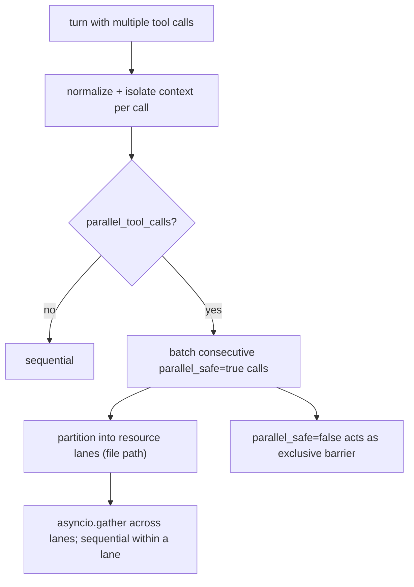
```mermaid
flowchart TD
    T["turn with multiple tool calls"] --> N["normalize + isolate context per call"]
    N --> P{"parallel_tool_calls?"}
    P -->|no| SEQ["sequential"]
    P -->|yes| B["batch consecutive parallel_safe=true calls"]
    B --> LANE["partition into resource lanes (file path)"]
    LANE --> G["asyncio.gather across lanes; sequential within a lane"]
    B --> BAR["parallel_safe=false acts as exclusive barrier"]
```

Anchors

<strong>Anchors:</strong> &bull; <code>agent-core/openjiuwen/core/single_agent/ability_manager.py:1083</code> — <code>parallel_tool_calls</code> parameter; <code>:1148</code> parallel-vs-sequential branch; <code>:431</code> <code>_execute_parallel_tool_tasks</code> (batching + barrier); <code>:393</code> <code>_execute_resource_ordered_tool_tasks</code> (lanes); <code>:421</code> <code>asyncio.gather</code> across lanes &bull; <code>agent-core/openjiuwen/core/foundation/tool/base.py:92</code> — <code>ToolCard.parallel_safe</code> (default True) &bull; <code>agent-core/openjiuwen/core/graph/pregel/task.py:27</code> — <code>submit</code> creates a Task; <code>:47</code> <code>asyncio.wait(..., FIRST_EXCEPTION)</code> cancels siblings &bull; <code>agent-core/openjiuwen/core/multi_agent/teams/hierarchical_msgbus/p2p_ability_manager.py:45</code> — lazy semaphore for sub-agent fan-out

**Gap.** Parallelism is per-turn only, with no token-budget-aware or priority scheduling; MCP calls share the pool with no per-server backpressure.

_Canonical source: `source/ai-engineer-technical-questions_for_engineers.md`; also covered in: engineering._

## 17. How does the framework handle a step that times out or throws an error

**General:** Bound each step with a timeout; classify errors (retryable vs not); convert failures into data (a tool/observation result) so the loop can adapt; propagate fatal errors with cleanup. Distinguish control-flow exceptions (cancellation, interrupt) from real failures.

**Jiuwen:** Tool calls are wrapped in `anyio.fail_after(call_timeout)`, where the timeout resolves from `ToolCard.properties["resilience"]["timeout_s"]` (or a default), and an exempt tool is still bounded by a hard limit. A `TimeoutError` becomes an `AbilityExecutionError` carrying a pre-built `ToolMessage`; `asyncio.CancelledError` and `ToolInterruptException` are re-raised as control flow. `ToolCallResilienceRail.on_tool_exception` decides retryability in layers and calls `ctx.request_retry()`, which the `@rail` decorator consumes to re-run the tool; on budget exhaustion it fabricates a `[Retry Summary]` `ToolMessage` so the model sees the failure as a result. Model-call failures route to `ON_MODEL_EXCEPTION` rails (`ModelAnomalyDetectionRail` retries repeated/stream-timeout errors with backoff; `_call_model` has a one-shot recovery hook). Workflow failures wrap timeout as `WORKFLOW_EXECUTION_TIMEOUT`.

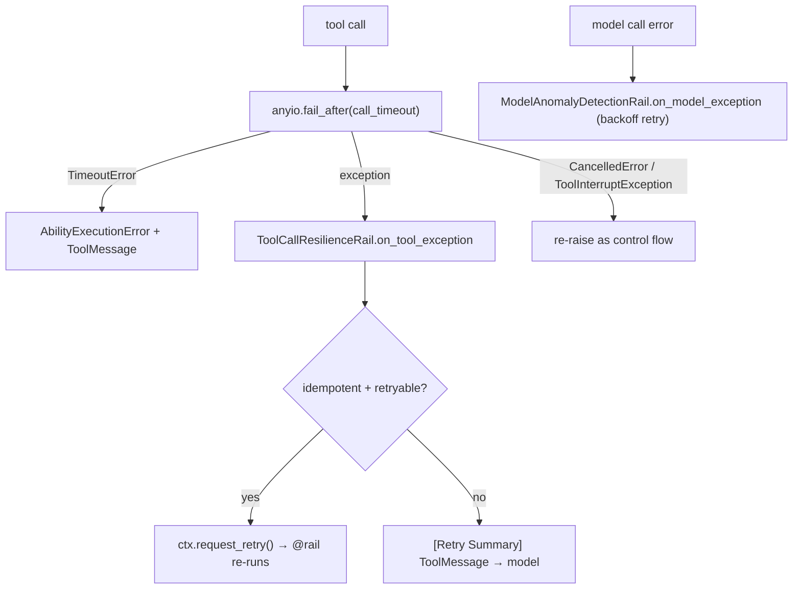
```mermaid
flowchart TD
    C["tool call"] --> TO["anyio.fail_after(call_timeout)"]
    TO -->|"TimeoutError"| EE["AbilityExecutionError + ToolMessage"]
    TO -->|"exception"| RR["ToolCallResilienceRail.on_tool_exception"]
    RR --> ID{"idempotent + retryable?"}
    ID -->|yes| RE["ctx.request_retry() → @rail re-runs"]
    ID -->|no| ERR["[Retry Summary] ToolMessage → model"]
    TO -->|"CancelledError / ToolInterruptException"| CTRL["re-raise as control flow"]
    MC["model call error"] --> MA["ModelAnomalyDetectionRail.on_model_exception (backoff retry)"]
```

Anchors

<strong>Anchors:</strong> &bull; <code>agent-core/openjiuwen/core/single_agent/ability_manager.py:1455</code> — <code>with anyio.fail_after(call_timeout)</code>; <code>:1457-1463</code> <code>TimeoutError</code> → <code>_build_execution_error</code>; <code>:556</code> <code>_build_execution_error</code>; <code>:1186-1238</code> parallel-batch handling; <code>:1492</code> workflow error wrapping &bull; <code>agent-core/openjiuwen/harness/rails/tool_call_resilience_rail.py:106</code> — <code>on_tool_exception</code>; <code>:128-138</code> non-idempotent layer; <code>:145</code> budget; <code>:169-186</code> retry-summary; <code>:196</code> <code>request_retry</code>; <code>:198</code> <code>_is_retryable_exception</code> &bull; <code>agent-core/openjiuwen/core/single_agent/rail/base.py:1016</code> — <code>@rail</code> retry loop; <code>:1036</code> catch; <code>:1049</code> fire <code>on_exception</code>; <code>:1065</code> consume retry; <code>:633</code> <code>request_force_finish</code> &bull; <code>agent-core/openjiuwen/harness/rails/model_anomaly_detection_rail.py:236</code> — <code>on_model_exception</code>; <code>:336</code> <code>ctx.request_retry(delay_seconds=...)</code> &bull; <code>agent-core/openjiuwen/core/single_agent/agents/react_agent.py:1016</code> — model exception + one recovery attempt; <code>:2857/2868</code> persist safe prefix then re-raise &bull; <code>agent-core/openjiuwen/harness/schema/stop_condition.py:162</code> — <code>TimeoutEvaluator</code>; <code>agent-core/openjiuwen/harness/deep_agent.py:2712</code> — <code>completion_timeout</code> (600s) &bull; <code>agent-core/openjiuwen/core/workflow/workflow.py:671</code> — <code>WORKFLOW_EXECUTION_TIMEOUT</code>; <code>agent-core/openjiuwen/harness/rails/interrupt/interrupt_base.py:243</code> — interrupt as <code>AbortError</code>

**Gap.** `_resolve_max_attempts` ignores per-tool overrides and always returns the rail default. `ToolCallResilienceRail` is not exported from `rails/__init__.py` and only acts if registered. `TimeoutEvaluator` exists only when a non-`None` `timeout_seconds` is passed. Workflow `ExceptionConfig` is threaded through constructors but has no in-tree consumer implementing component error recovery. `ModelAnomalyDetectionRail` covers repetition and stream-timeout only.

_Canonical source: `source/ai-agent-framework-interview-questions_for_engineers.md`; also covered in: framework._

## 18. How does an agent break a complex task into smaller subtasks

**General:** Either the model is asked to emit a plan/todo list up front, or the agent decomposes lazily and revises. Often the decomposition is stored as structured tasks the agent can mark in-progress/completed.

**Jiuwen:** Model-driven todo tools, not an algorithmic planner. The model's answer *requests* a `todo_create` tool call (prompted by the rail's guidance to plan when the task warrants it); the ReAct loop then executes it, and the tool validates and persists the list. `TodoCreateTool` takes a JSON array of `{id, content, activeForm, description}` and persists a `todo.json` per session; `TaskPlan` stores the goal plus ordered `TodoItem`s with `depends_on` and resolves the next task. `TaskPlanningRail` registers the todo tools and injects planning guidance, and the `Plan` agent mode adds a `task_tool` to delegate subtasks to subagents.

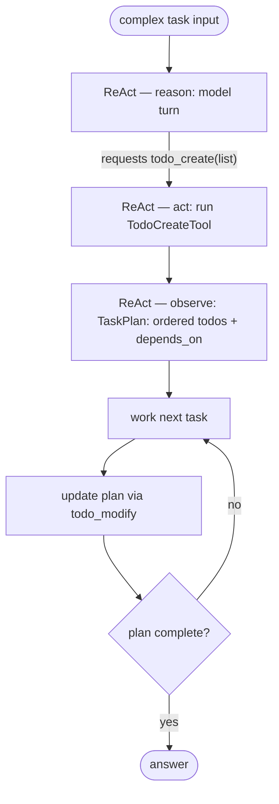
```mermaid
flowchart TD
    I(["complex task input"]) --> M["ReAct — reason: model turn"]
    M -->|"requests todo_create(list)"| TC["ReAct — act: run TodoCreateTool"]
    TC --> P["ReAct — observe: TaskPlan: ordered todos + depends_on"]
    P --> W["work next task"]
    W --> U["update plan via todo_modify"]
    U --> Q{"plan complete?"}
    Q -->|no| W
    Q -->|yes| A(["answer"])
```

Anchors

<strong>Anchors:</strong> &bull; <code>agent-core/openjiuwen/harness/tools/todo.py:193</code> — <code>TodoCreateTool</code> &bull; <code>agent-core/openjiuwen/harness/tools/todo.py:113</code> — per-session <code>todo.json</code> &bull; <code>agent-core/openjiuwen/harness/schema/task.py:97</code> — <code>TaskPlan</code> &bull; <code>agent-core/openjiuwen/harness/rails/task_planning_rail.py:31/108/152</code> — rail, tool registration, guidance &bull; <code>agent-core/openjiuwen/harness/rails/agent_mode_rail.py:645</code> — plan-mode <code>task_tool</code>

_Canonical source: `source/ai-agent-interview-questions_for_engineers.md`; also covered in: ai-agent._

## 19. How do you handle a task where the plan needs to change mid-execution based on a tool's result

**General:** Allow plan mutation during the run: the agent can add, reorder, cancel, or replace tasks, and can be steered by new instructions. Track the authoritative plan separately from the live state so they can be reconciled.

**Jiuwen:** Several mechanisms. `TodoModifyTool` supports update/delete/cancel/append/insert operations with a single-in-progress invariant. `TaskPlanningRail._sync_todos_from_plan` reconciles todos against the authoritative `TaskPlan` each outer round. Steering messages inject new instructions and are drained before each model call. Mode transitions enter/exit plan with an approval gate.

```mermaid
flowchart TD
    I(["input"]) --> M
    subgraph LOOP["ReAct loop"]
    direction TB
        M["model call"] --> D{"tool calls?"}
        D -->|"work tools"| W["run tools"] --> RC["result differs from plan"] --> AD{"how to adapt?"}
        AD -->|"revise tasks"| T["todo_modify: update / delete / cancel / append / insert"] --> M
        AD -->|"new instruction"| S["push_steering"] --> M
        AD -->|"change mode"| P["enter/exit plan + approval"] --> M
    end
    D -->|"no tool calls"| A(["final answer"])
    T ~~~ A
```

Anchors

<strong>Anchors:</strong> &bull; <code>agent-core/openjiuwen/harness/tools/todo.py:473</code> — <code>TodoModifyTool</code> operations &bull; <code>agent-core/openjiuwen/harness/tools/todo.py:621</code> — single-in-progress invariant &bull; <code>agent-core/openjiuwen/harness/rails/task_planning_rail.py:320</code> — reconcile todos from plan &bull; <code>agent-core/openjiuwen/core/single_agent/agents/react_agent.py:2756</code> — drain steering before model call &bull; <code>agent-core/openjiuwen/core/single_agent/rail/base.py:687</code> — <code>ctx.push_steering</code> &bull; <code>agent-core/openjiuwen/harness/rails/agent_mode_rail.py:460</code> — enter/exit plan gate &bull; <code>jiuwenswarm/jiuwenswarm/agents/harness/code/rails/code_plan_approval_rail.py:74</code> — product plan-approval rail

_Canonical source: `source/ai-agent-interview-questions_for_engineers.md`; also covered in: ai-agent._

## 20. What's the difference between a single-step agent and a multi-step planning agent

> **Note on the wording:** the question conflates two independent axes. **Number of steps** (single vs multi) is separate from **whether an explicit plan exists** (reactive vs planning). A multi-step agent does not have to plan — a plain ReAct loop takes many steps reactively, with no plan artifact.

**General:** Two axes, not one. *Single-step vs multi-step* is how many model↔tool cycles run. *Reactive vs planning* is whether the agent keeps an explicit plan (a todo list / task plan) that it creates up front and updates as it goes. Planning normally implies multi-step, but multi-step does not imply planning.

| | No explicit plan (reactive) | Explicit plan (planning) |
|---|---|---|
| Single-step | one model call (+ maybe one tool) | not meaningful — a plan implies multiple steps |
| Multi-step | ReAct loop; next action chosen each turn | plan/todo maintained and progress tracked |

**What "reactive" means here:** a *reactive* agent chooses its next action **only from the last observation** — it looks one step ahead, not N steps ahead, and commits to nothing up front. This is the default ReAct behavior, and it is relevant because most tasks never need an up-front plan: the tool results themselves drive the next move. Planning becomes relevant when the task has many dependent steps, needs global coherence, or the user must see/approve the plan before work starts.

| Reactive fits | Planning fits |
|---|---|
| Short or exploratory tasks | Long, many-step tasks with dependencies |
| The next step depends on live results | The overall shape must be fixed up front |
| No need to show a plan to the user | The user must review/approve the plan |
| Cheap, little coordination | Needs progress tracking and drift resistance |

**Jiuwen:** Jiuwen keeps the two axes as separate layers. `ReActAgent` is multi-step **reactive**: it loops (bounded by `max_iterations`) with no explicit plan. Planning is an *additive* rail: `TaskPlanningRail` registers the todo tools and `TaskPlan` persists an ordered plan. `DeepAgent`'s outer task loop is multi-step **with** planning: each outer round runs a full inner `react_agent.invoke`, while the persistent `TaskPlan`/todos carry state between rounds and `TaskCompletionRail` bounds the loop. So "multi-step" and "planning" are orthogonal.

**Single-step (no loop):**

```mermaid
flowchart TD
    A(["input"]) --> B["model"] --> C(["answer"])
```

**Multi-step, reactive (no explicit plan):** each turn's tool result is the only input to the next decision; no plan is carried across turns.

```mermaid
flowchart TD
    I(["input"]) --> M
    subgraph LOOP["ReAct loop"]
    direction TB
        M["model call"] --> D{"tool calls?"}
        D -->|yes| T["run tools"] --> M
    end
    D -->|"no tool calls"| A(["final answer"])
    T ~~~ A
```

**Multi-step, planning (explicit plan):** the model's answer may *request* a `todo_create` tool call, which the ReAct loop then executes to create a persistent plan; the plan is worked task by task. *How it knows to plan:* `TaskPlanningRail` registers the todo tools and injects a planning prompt before each model call, so the model sees both the tools and the instruction — and its answer requests the tool call.

```mermaid
flowchart TD
    I(["input"]) --> M["ReAct — reason: model turn"]
    M -->|"requests todo_create"| TC["ReAct — act: run TodoCreateTool"]
    TC --> P["ReAct — observe: TaskPlan / todos"]
    P --> W["work next task"]
    W --> U["update plan via todo_modify"]
    U --> Q{"plan complete?"}
    Q -->|no| W
    Q -->|yes| A(["answer"])
```

Anchors

<strong>Anchors:</strong> &bull; <code>agent-core/openjiuwen/core/single_agent/agents/react_agent.py:2740</code> — multi-step reactive loop &bull; <code>agent-core/openjiuwen/core/single_agent/agents/react_agent.py:288</code> — iteration bound &bull; <code>agent-core/openjiuwen/harness/rails/task_planning_rail.py:31</code> — planning layer (additive) &bull; <code>agent-core/openjiuwen/harness/rails/task_planning_rail.py:108/152</code> — registers todo tools, injects planning prompt &bull; <code>agent-core/openjiuwen/harness/tools/todo.py:193</code> — <code>TodoCreateTool</code> writes <code>todo.json</code> &bull; <code>agent-core/openjiuwen/harness/schema/task.py:97</code> — <code>TaskPlan</code> &bull; <code>agent-core/openjiuwen/harness/deep_agent.py:2694</code> — multi-step + planning (outer loop) &bull; <code>agent-core/openjiuwen/harness/task_loop/task_loop_event_executor.py:222</code> — one outer round = one inner invoke &bull; <code>agent-core/openjiuwen/harness/rails/task_completion_rail.py:74</code> — completion rail bounds the loop

_Canonical source: `source/ai-agent-interview-questions_for_engineers.md`; also covered in: ai-agent._

## 21. What's the planner-executor pattern, and when do you need it

**General:** A planner produces the plan/steps; one or more executors carry them out, often with a supervisor re-planning. Useful when planning needs a global view while execution is parallelizable or specialized, and when separating "decide" from "do" improves reliability.

**Jiuwen:** Three patterns exist. (a) Scheduled-dispatch leader: `TeamScheduler` scans the task board and dispatches assigned pending tasks to idle members, then reviews. (b) Supervisor routing: `HierarchicalTeam` sends to a `SupervisorAgent` that calls sub-agents-as-tools via `P2PAbilityManager`. (c) A dedicated plan subagent invoked via `task_tool`.

```mermaid
flowchart TB
    L["leader / supervisor"] --> B["task board / plan"]
    B --> W1["member A"]
    B --> W2["member B"]
    B --> W3["member C"]
    W1 --> R["reviews"]
    W2 --> R
    W3 --> R
    R --> L
```

Anchors

<strong>Anchors:</strong> &bull; <code>agent-core/openjiuwen/agent_teams/agent/scheduling/scheduler.py:92/208/239</code> — <code>TeamScheduler</code> scan/dispatch/review &bull; <code>../../../agent-core/openjiuwen/core/multi_agent/teams/hierarchical_msgbus</code> — supervisor routing &bull; <code>agent-core/openjiuwen/harness/subagents/plan_agent.py:88</code> — dedicated plan subagent

_Canonical source: `source/ai-agent-interview-questions_for_engineers.md`; also covered in: ai-agent._

## 22. How does a framework track state across multiple steps in an agent's execution

**General:** A state object (dict or dataclass) is threaded through the steps or held per session; each node reads and writes it. Conversation history is usually separate from working state. Frameworks persist state via checkpoints so a run can be resumed or audited.

**Jiuwen:** State lives in three layers that are checkpointed independently. The agent layer uses `StateCollection` (a `global_state` + `agent_state`) inside `AgentSession`. The workflow layer uses a different `StateCollection` split into `io_state`, `global_state`, `comp_state`, and `workflow_state`. Conversation history is a separate `ContextMessageBuffer` inside `SessionModelContext`, flushed to session global state by `ContextEngine.save_contexts`. Graph execution adds a third layer — `GraphState` (step, channel snapshot, pending buffer/nodes, node versions) persisted through a `Store`/checkpointer keyed by `(session_id, ns)` and restored in `PregelLoop.init`.

```mermaid
flowchart TD
    W["Workflow run"] --> GS["GraphState: step · channels · pending nodes · versions"]
    GS --> CP["Store / Checkpointer (session_id, ns)"]
    A["Agent run"] --> AS["StateCollection: global_state + agent_state"]
    A --> CTX["SessionModelContext → ContextMessageBuffer"]
    CTX -->|"save_contexts"| GSESS["session global state under 'context'"]
    CP -->|"PregelLoop.init"| GS
```

Anchors

<strong>Anchors:</strong> &bull; <code>agent-core/openjiuwen/core/session/internal/agent.py:36</code> — <code>AgentSession.__init__</code> creates <code>StateCollection</code>; <code>:74</code> <code>create_workflow_session</code> passes global state into <code>InMemoryState</code> &bull; <code>agent-core/openjiuwen/core/session/state/agent_state.py:9</code> — agent <code>StateCollection</code>; <code>:34</code> <code>get_state</code> &bull; <code>agent-core/openjiuwen/core/session/state/workflow_state.py:12</code> — workflow <code>StateCollection</code> (io/global/comp/workflow); <code>:100</code> <code>get_workflow_state</code>; <code>:151</code> <code>get_state</code> &bull; <code>agent-core/openjiuwen/core/context_engine/context/context.py:64</code> — <code>SessionModelContext</code>; <code>:1519</code> <code>save_state()</code>; <code>:1526</code> <code>load_state</code> &bull; <code>agent-core/openjiuwen/core/graph/store/base.py:31</code> — <code>GraphState</code> dataclass; <code>:41</code> <code>Store</code> ABC &bull; <code>agent-core/openjiuwen/core/graph/pregel/engine.py:39</code> — <code>PregelLoop.init</code> reads saved state; <code>:44</code> restore path &bull; <code>agent-core/openjiuwen/core/session/checkpointer/persistence.py:299</code> — <code>_get_state_to_save</code>; <code>:352</code> <code>WorkflowStorage.save</code> &bull; <code>agent-core/openjiuwen/core/context_engine/context_engine.py:589</code> — <code>save_contexts</code>

**Gap.** Two different classes are both named `StateCollection` (agent vs workflow) with different shapes. Context messages are persisted only on explicit `save_contexts`/compression, not every step, so a crash between saves loses in-memory turns. `InMemoryState.set_state` silently ignores empty state, which can mask empty restores.

_Canonical source: `source/ai-agent-framework-interview-questions_for_engineers.md`; also covered in: framework._

## 23. How would you pause an agent mid-execution and resume it later with the same state

**General:** Pause requires either a durable checkpoint at a safe boundary or a first-class interrupt/suspend signal that unwinds the run while preserving state. Resume reloads the checkpoint (or replays the suspended step) and continues. The hard part is non-idempotent side effects: replay must be safe.

**Jiuwen:** Two mechanisms. *Interrupt rails* abort the current tool call by raising `AbortError(cause=ToolInterruptException(...))`; the callback framework re-raises the cause, the ReAct loop catches it, and `ToolInterruptHandler.commit_interrupt` saves conversation context plus a `ToolInterruptionState` into session state, returning an `INTERACTION` result. On resume, `handle_resume` replays the interrupted tool calls with the user's `InteractiveInput`. *Workflow/graph* pause uses checkpointing: `CompiledGraph._invoke` calls `checkpointer.pre_workflow_execute` (recover or require input) and `post_workflow_execute` (save on interrupt, clear on completion); `PregelLoop` snapshots channels/pending nodes on error and restores them in `init`; provider harnesses expose explicit `pause()`/`resume()` gated on `HarnessCapability.PAUSE_RESUME`.

```mermaid
sequenceDiagram
    participant RA as ReAct loop
    participant Rail as Interrupt rail
    participant Store as Session state
    participant User
    RA->>Rail: before_tool_call
    Rail-->>RA: AbortError(cause=ToolInterruptException)
    RA->>Store: commit_interrupt (context + ToolInterruptionState)
    Note over RA: return INTERACTION (paused)
    User->>RA: handle_resume(InteractiveInput)
    RA->>Store: load preserved iteration + tools
    RA->>RA: replay interrupted tool calls, continue
```

Anchors

<strong>Anchors:</strong> &bull; <code>agent-core/openjiuwen/harness/rails/interrupt/interrupt_base.py:237</code> — <code>_raise_interrupt</code>; <code>:243</code> raises <code>AbortError(cause=ToolInterruptException)</code>; re-raised at <code>agent-core/openjiuwen/core/runner/callback/framework.py:1172</code> &bull; <code>agent-core/openjiuwen/core/single_agent/interrupt/handler.py:279</code> — <code>commit_interrupt</code>; <code>:310</code> <code>handle_resume</code>; <code>:326</code> uses preserved <code>state.iteration</code> &bull; <code>agent-core/openjiuwen/core/single_agent/interrupt/state.py:32</code> — <code>ToolInterruptionState</code> &bull; <code>agent-core/openjiuwen/core/session/checkpointer/persistence.py:803</code> — <code>pre_workflow_execute</code>; <code>:824</code> recover on <code>InteractiveInput</code>; <code>:860</code> <code>post_workflow_execute</code>; <code>:876</code> save on <code>TASK_STATUS_INTERRUPT</code> &bull; <code>agent-core/openjiuwen/core/graph/graph.py:315</code> — <code>CompiledGraph._invoke</code>; <code>:326</code> pre; <code>:334</code> <code>pregel.run</code>; <code>:346</code> post &bull; <code>agent-core/openjiuwen/core/graph/pregel/engine.py:45</code> — <code>_is_resume</code>; <code>:174</code> <code>_save_state_on_error</code>; <code>:39</code> restore in <code>init</code> &bull; <code>agent-core/openjiuwen/core/context_engine/context/context.py:1519/1526</code> — <code>save_state</code>/<code>load_state</code> &bull; <code>agent-core/openjiuwen/harness/deep_agent.py:2491/2516</code> — <code>load_state</code>/<code>save_state</code>; <code>agent-core/openjiuwen/harness_providers/io_adapter.py:299/308</code> — <code>pause()</code>/<code>resume()</code>

**Gap.** Graph state is checkpointed only on error/interrupt, not after every successful super-step, so a hard crash mid-step loses that step. `CompiledGraph.interrupt()` is a no-op stub. The DeepAgent outer task loop explicitly does not support pause (`can_pause` returns `False`); only "resume continuation" re-entry exists. No in-flight asyncio task/stack is serialized — resume replays from channel/message snapshots and re-executes nodes, so non-idempotent side effects must be tolerated.

_Canonical source: `source/ai-agent-framework-interview-questions_for_engineers.md`; also covered in: framework._

## 24. How would you add human-in-the-loop approval before a specific step executes

**General:** Route sensitive steps through a permission check that returns allow/ask/deny, pause on ask, surface a confirm payload, resume with the decision, and optionally remember or persist allow rules. Fail closed: unknown should mean "ask", not "allow".

**Jiuwen:** Tool execution passes through `PermissionInterruptRail` (subclass of `ConfirmInterruptRail` ← `BaseInterruptRail`), which overrides `before_tool_call` and intercepts **every** tool. On first entry it calls `PermissionEngine.check_permission`, which merges the tiered tool policy, file guard, and net guard with "strictest wins" and returns `ALLOW`/`ASK`/`DENY`. `ALLOW` approves; `DENY` returns a synthetic `[PERMISSION_DENIED]` tool result; `ASK` either hits a session auto-confirm key, delegates to a hosted confirmation callback, or raises `AbortError(cause=ToolInterruptException(ConfirmPayload.to_schema()))` to pause. Resume parses a `ConfirmPayload` (`approved`, `feedback`, `auto_confirm`, `persist_allow`); the rail can remember session-scoped or persist an allow rule. Plan-mode exit uses a separate `PlanApprovalRail`, and `AskUserRail` reuses the same mechanism for `ask_user`.

```mermaid
flowchart TD
    TC["tool call"] --> P{"permissions.enabled?"}
    P -->|no| RUN["runs (no rail)"]
    P -->|yes| CK["PermissionEngine.check_permission (policy ∪ file ∪ net, strictest)"]
    CK -->|ALLOW| RUN
    CK -->|DENY| D["synthetic [PERMISSION_DENIED] result → model"]
    CK -->|ASK| A{"auto-confirm / hosted callback?"}
    A -->|yes| RUN
    A -->|no| H["AbortError(ToolInterruptException(ConfirmPayload)) → pause"]
    H --> RES["resume(ConfirmPayload: approved · feedback · auto_confirm · persist_allow)"]
    RES --> RUN
```

Anchors

<strong>Anchors:</strong> &bull; <code>agent-core/openjiuwen/harness/rails/security/tool_security_rail.py:57</code> — <code>PermissionInterruptRail</code>; <code>:186</code> <code>before_tool_call</code>; <code>:404</code> <code>resolve_interrupt</code>; <code>:486</code> ALLOW; <code>:494</code> DENY; <code>:510-563</code> hosted confirm + persist; <code>:594-598</code> ASK → interrupt; <code>:729</code> <code>_store_auto_confirm</code> &bull; <code>agent-core/openjiuwen/harness/security/permission_engine/core.py:272</code> — <code>check_permission</code>; <code>:414</code> <code>build_permission_interrupt_rail</code>; <code>:426</code> <code>permissions.enabled</code> gate &bull; <code>agent-core/openjiuwen/harness/security/permission_engine/toolguard/tool_policy.py:588</code> — <code>evaluate_tiered_policy</code>; <code>:502</code> ASK fallback; <code>:385</code> DENY precedence &bull; <code>agent-core/openjiuwen/harness/security/permission_engine/models.py:19</code> — <code>PermissionLevel</code>; <code>:52</code> <code>PermissionConfirmResponse</code> &bull; <code>agent-core/openjiuwen/harness/rails/interrupt/interrupt_base.py:243</code> — <code>_raise_interrupt</code>; <code>:248</code> <code>_skip_tool</code>; <code>:269</code> <code>_get_user_input</code> &bull; <code>agent-core/openjiuwen/harness/rails/interrupt/confirm_rail.py:16</code> — <code>ConfirmPayload</code>; <code>:57</code> <code>resolve_interrupt</code> &bull; <code>agent-core/openjiuwen/core/single_agent/interrupt/handler.py:310</code> — <code>handle_resume</code>; <code>:358</code> re-commit; <code>:384</code> restore auto-confirm &bull; <code>agent-core/openjiuwen/harness/deep_agent.py:767-782</code> — auto-mount when <code>permissions["enabled"]</code>; <code>jiuwenswarm/jiuwenswarm/agents/harness/code/rails/code_plan_approval_rail.py:74</code> — <code>PlanApprovalRail</code>; <code>agent-core/openjiuwen/harness/rails/interrupt/ask_user_rail.py:29</code> — <code>AskUserRail</code>

**Gap.** The whole permission path is opt-in: `build_permission_interrupt_rail` returns `None` unless `permissions.enabled` is truthy, and `check_permission` short-circuits to ALLOW when the engine is disabled. There is no class literally named `ToolSecurityRail` — the file is `tool_security_rail.py` but the class is `PermissionInterruptRail`. Permanent persist falls back to writing YAML only when no host hook is supplied. `PlanApprovalRail` is not an interrupt — it stores pending state and appends a marker; enforcement lives in the product server layer.

_Canonical source: `source/ai-agent-framework-interview-questions_for_engineers.md`; also covered in: framework, ai-agent._

## 25. What's the difference between short-term and long-term memory in an agent

**General:** Short-term is the live working context (recent turns, current task state) needed for the next model call. Long-term is durable knowledge distilled across sessions — facts, preferences, summaries — retrieved on demand.

**Jiuwen:** Short-term is `SessionModelContext` with a bounded message buffer. Long-term is `LongTermMemory`, with a typed taxonomy (`VARIABLE`, `USER_PROFILE`, `SEMANTIC_MEMORY`, `EPISODIC_MEMORY`, `SUMMARY`). The product adds a SQLite/FTS5 hybrid index over markdown memory files.

```mermaid
flowchart TD
    I(["input"]) --> ST
    subgraph LOOP["ReAct loop"]
    direction TB
        PRE["assemble context (short-term + retrieved long-term)"] --> M["model call"]
        M --> D{"tool calls?"}
        D -->|yes| T["run tools"] --> M
    end
    D -->|"no tool calls"| A(["final answer"])
    T ~~~ A
    ST["Short-term: SessionModelContext (bounded buffer)"] --> PRE
    LT["Long-term: LongTermMemory (variables · profile · semantic · episodic · summary)"] -->|retrieve| PRE
    M -.->|"extract durable facts"| LT
    M -.->|"append turn"| ST
```

Anchors

<strong>Anchors:</strong> &bull; <code>agent-core/openjiuwen/core/context_engine/context/context.py:44</code> — <code>SessionModelContext</code> &bull; <code>agent-core/openjiuwen/core/context_engine/context/message_buffer.py:11</code> — <code>ContextMessageBuffer</code> &bull; <code>agent-core/openjiuwen/core/memory/long_term_memory.py:69</code> — <code>LongTermMemory</code> &bull; <code>../../../agent-core/openjiuwen/core/memory/manage/mem_model/memory_unit.py</code> — memory type taxonomy &bull; <code>jiuwenswarm/jiuwenswarm/agents/harness/common/memory/manager.py:56</code> — product hybrid memory index

_Canonical source: `source/ai-agent-interview-questions_for_engineers.md`; also covered in: ai-agent._

## 26. How do you decide what to store in memory versus what to discard

**General:** Keep durable, reused, preference-like, and decision-relevant facts; discard transient chatter, redundant restatements, and stale/contradicted entries. Most systems extract candidates with an LLM, then dedupe and resolve conflicts against existing memory.

**Jiuwen:** An LLM classifier decides whether a turn has key information, and extraction runs only if flagged. Writes dedupe and resolve conflicts: `FragmentMemoryManager.add_memories` searches related old memories, invokes `MemUpdateChecker` (REDUNDANT/CONFLICTING/NONE), deletes redundant/conflicting IDs, and adds survivors. The product's sweeper prompt explicitly treats "output [] as the norm" and forbids generic/static facts.

```mermaid
flowchart TD
    subgraph LOOP["ReAct loop"]
    direction TB
        M["model call"] --> D{"tool calls?"}
        D -->|yes| T["run tools"] --> M
    end
    D -->|"no tool calls"| A(["final answer"])
    T ~~~ A
    M -.->|"turn messages"| CL{"classifier: key info?"}
    CL -->|no| DISC(["discard"])
    CL -->|yes| EX["extract candidates"] --> CO{"vs existing: redundant / conflicting?"}
    CO -->|"redundant / conflicting"| DEL["delete old"] --> KEEP
    CO -->|new| KEEP(["keep in memory"])
```

Anchors

<strong>Anchors:</strong> &bull; <code>agent-core/openjiuwen/core/memory/process/extract/memory_analyzer.py:26</code> — key-information classifier &bull; <code>agent-core/openjiuwen/core/memory/process/extract/generation.py:102</code> — extraction gated on the classifier &bull; <code>agent-core/openjiuwen/core/memory/manage/index/fragment_memory_manager.py:125</code> — dedupe + conflict resolution &bull; <code>agent-core/openjiuwen/core/memory/manage/update/mem_update_checker.py:22</code> — <code>CheckResult</code> &bull; <code>jiuwenswarm/jiuwenswarm/agents/harness/common/memory/dreaming/sweeper.py:617</code> — discard rules

_Canonical source: `source/ai-agent-interview-questions_for_engineers.md`; also covered in: ai-agent._

## 27. How do you prevent memory from growing unbounded across a long session

**General:** Bound it on multiple axes: hard-drop or truncate the oldest context, offload large blobs, compact old tool results, summarize and archive, and cap the number of stored long-term entries.

**Jiuwen:** A bounded FIFO buffer drops the oldest messages beyond twice the limit. Budget guarding truncates oversized content with head/tail previews. Offloaders move large messages and tool results out of context. Compactors run at token thresholds. Long-term promotion is capped per session.

```mermaid
flowchart TD
    subgraph LOOP["ReAct loop"]
    direction TB
        PRE["before model call: bound the context"] --> M["model call"]
        M --> D{"tool calls?"}
        D -->|yes| T["run tools"] --> M
        PRE --> P1["drop oldest (2× buffer)"]
        PRE --> P2["offload big messages / tool results"]
        PRE --> P3["micro-compact old tool results"]
        PRE --> P4["full / round compact at token threshold"]
    end
    D -->|"no tool calls"| A(["final answer"])
    P4 ~~~ A
    P4 -.-> CAP["cap long-term promotions"]
```

Anchors

<strong>Anchors:</strong> &bull; <code>agent-core/openjiuwen/core/context_engine/context/message_buffer.py:71</code> — drop oldest beyond 2× &bull; <code>agent-core/openjiuwen/core/context_engine/processor/budget_guard.py:88</code> — head/tail truncation &bull; <code>agent-core/openjiuwen/core/context_engine/processor/offloader/message_offloader.py:71</code> — offload large messages &bull; <code>agent-core/openjiuwen/core/context_engine/processor/offloader/tool_result_budget_processor.py:81</code> — tool-result budget &bull; <code>agent-core/openjiuwen/core/context_engine/processor/compressor/micro_compact_processor.py:47</code> — micro compaction &bull; <code>agent-core/openjiuwen/core/context_engine/processor/compressor/full_compact_processor.py:183</code> — full compaction &bull; <code>agent-core/openjiuwen/core/context_engine/processor/compressor/round_level_compressor.py:96</code> — round compaction &bull; <code>jiuwenswarm/jiuwenswarm/agents/harness/common/memory/dreaming/sweeper.py:36</code> — per-session promotion caps

_Canonical source: `source/ai-agent-interview-questions_for_engineers.md`; also covered in: ai-agent._

## 28. How would you summarize conversation history without losing important details

**General:** Keep the most recent turns verbatim, summarize older turns into a structured note (goal, decisions, files/state, open tasks, next step) rather than free prose, and re-inject the durable state (plan, task status, key artifacts) separately so it is not lost inside a summary. Boundary markers separate summary from live turns, and the summary should be updated incrementally so each pass only processes new messages.

**Jiuwen:** Compaction replaces the active segment with a structured summary plus a boundary `SystemMessage`, then re-injects high-value state as separate `UserMessage` blocks: plan/task status, recent skill-read rounds, read-file snapshots, and the team collaboration policy (returned as messages so they escape `state_snapshot_max_chars` truncation). `FullCompactProcessor` uses a 9-section summary prompt and boundary markers (`[FULL_COMPACT_BOUNDARY]`, `[FULL_COMPACT_STATE]`, `[SESSION_MEMORY_BOUNDARY]`). The session-memory path runs a background updater triggered at 0.7×context window, summarizes only completed API rounds, writes to a pending file and atomically renames on commit, and records `notes_upto_message_id` so only un-summarized messages are processed next time.

```mermaid
flowchart TD
    HIST["conversation history"] --> SPLIT{"split at last boundary"}
    SPLIT --> KEEP["keep newest N messages verbatim"]
    SPLIT --> SUM["older → structured 9-section summary (boundary marker)"]
    SPLIT --> SMEM["session memory template (15 sections, updated at 0.7×window)"]
    SUM --> REINJ["re-inject state: plan · task status · skills · read-files · team policy"]
    SMEM --> REINJ
    REINJ --> PROMPT(["prompt (summary + live turns + explicit state)"])
```

Anchors

<strong>Anchors:</strong> &bull; <code>agent-core/openjiuwen/core/context_engine/processor/compressor/full_compact_processor.py:69</code> — <code>BASE_COMPACT_PROMPT</code>; <code>:167</code> boundary markers; <code>:342</code> <code>_build_replacement_messages()</code>; <code>:774</code> <code>build_reinjected_state_messages()</code> &bull; <code>agent-core/openjiuwen/core/context_engine/processor/compressor/util.py:242</code> — <code>build_skill_reinjected_content()</code>; <code>:294</code> <code>build_task_status_reinjected_content()</code>; <code>:105</code> <code>build_team_policy_reinjected_messages()</code> &bull; <code>agent-core/openjiuwen/core/context_engine/context/session_memory_manager.py:37</code> — 15-section template; <code>:738</code> <code>should_update()</code>; <code>:824</code> <code>_update_background()</code>; <code>:529</code> <code>invalidate_session_memory_anchor()</code> &bull; <code>agent-core/openjiuwen/core/context_engine/processor/forked/compressor/reinjection/builders.py:29</code> — forked reinjection builders

**Gap.** The non-session-memory fallback re-injects only plan/skills/task status; `build_plan_reinjected_content` in the non-forked `util.py` is a stub returning `""`. No automatic verification that the summary retained all critical facts beyond the prompt's structured sections.

_Canonical source: `source/llm-fundamentals-interview-questions_for_engineers.md`; also covered in: ai-agent, llm-fund._

## 29. What does an agent framework actually give you that raw API calls don't

**General:** A raw API call is request → response. A framework adds the machinery around it: a session/state object that survives across turns, a context manager that trims and compresses history, a tool registry that turns functions into model-facing schemas and dispatches calls, a provider-agnostic model client, a loop with stop conditions, error handling, and observability. You do not re-implement conversation state, schema extraction, provider quirks, and tracing for every app.

**Jiuwen:** The reusable pieces are concrete classes, not a monolith. `Session` owns state, streaming, tracer, and interaction lifecycle; `Model` + `BaseModelClient` wrap providers behind one `invoke`/`stream` surface; `ContextEngine` owns windowing and compression; `AbilityManager` owns tool registration and execution; `AgentRail` is the class-based lifecycle hook bus; `Tracer` plus `extensions/observability` own telemetry; `Workflow`/`Pregel` own deterministic graph execution; and `Runner` is the process-global facade binding sessions, resource registry, checkpointer, and callbacks.

```mermaid
flowchart TD
    APP(["your app"]) --> R["Runner: sessions · resources · checkpointer · callbacks"]
    R --> S["Session: state · stream · tracer · interaction"]
    R --> M["Model + BaseModelClient: one invoke/stream over OpenAI/Anthropic/…"]
    R --> C["ContextEngine: windowing · budget · compaction"]
    R --> A["AbilityManager: tool registry + dispatch"]
    R --> W["Workflow / Pregel: deterministic graph execution"]
    S --> RAILS["AgentRail hook bus"]
    S --> TR["Tracer + observability"]
```

Anchors

<strong>Anchors:</strong> &bull; <code>agent-core/openjiuwen/core/session/agent.py:33</code> — <code>Session</code> (state, stream, tracer, interaction) &bull; <code>agent-core/openjiuwen/core/runner/runner.py:696</code> — <code>Runner</code> facade class; <code>:408</code> <code>run_agent</code> binds session + lifecycle &bull; <code>agent-core/openjiuwen/core/context_engine/context_engine.py:28</code> — <code>ContextEngine</code> (processors, token limits, compression) &bull; <code>agent-core/openjiuwen/core/foundation/llm/model.py:27</code> — <code>Model</code>, unified LLM entry; <code>:94</code> <code>invoke</code> &bull; <code>agent-core/openjiuwen/core/foundation/llm/model_clients/__init__.py:58</code> — <code>create_model_client</code> provider dispatch &bull; <code>agent-core/openjiuwen/core/single_agent/ability_manager.py:142</code> — <code>AbilityManager</code> (tool registry + execution) &bull; <code>agent-core/openjiuwen/core/single_agent/rail/base.py:824</code> — <code>AgentRail</code> base (lifecycle hooks) &bull; <code>agent-core/openjiuwen/core/session/tracer/tracer.py:98</code> — <code>Tracer</code>; <code>agent-core/openjiuwen/extensions/observability/runtime.py:103</code> — <code>ObservabilityRuntime</code>

_Canonical source: `source/ai-agent-framework-interview-questions_for_engineers.md`; also covered in: framework._

## 30. What's the difference between a graph-based framework like LangGraph and a role-based framework like CrewAI

**General:** Graph-based frameworks make control flow an explicit graph of nodes and edges over shared state; routing is deterministic, inspectable, and easy to persist. Role-based frameworks make the unit an agent with a role/persona and let agents collaborate through messages and a task board; control flow is emergent and driven by the model plus a manager. Graph = you author the topology; role = you author the team.

**Jiuwen:** It contains both archetypes as separate subsystems. The graph side is a genuine Pregel engine: `Workflow` compiles components into a `PregelGraph`, edges become channels, and `PregelLoop.run_step()` drives super-steps with static routers, conditional routers, barriers, and CNF OR-groups for exclusive merges. The role side is `TeamAgent`, a single class that switches between `TeamRole.LEADER` and `TEAMMATE`; leadership is expressed through tools (`create_team_tools`), an event-driven `CoordinationKernel`, and an optional `TeamScheduler` that dispatches tasks from a shared board. There is no declarative bridge that compiles a team into a Pregel graph.

```mermaid
flowchart TD
    subgraph GRAPH["Graph-based (Pregel)"]
    direction TB
    A1(["start"]) --> B1["node"] --> C1{"conditional router"}
    C1 -->|x| D1["node"] --> E1(["end"])
    C1 -->|y| E1
    end
    subgraph ROLE["Role-based (agent_teams)"]
    direction TB
    L["leader (TeamAgent)"] --> BOARD["task board + mailbox"]
    BOARD --> W1["teammate"]
    BOARD --> W2["teammate"]
    W1 --> S["TeamScheduler (scheduled mode)"]
    W2 --> S
    S --> L
    end
```

Anchors

<strong>Anchors:</strong> &bull; <code>agent-core/openjiuwen/core/workflow/workflow.py:98</code> — <code>Workflow</code> graph facade &bull; <code>agent-core/openjiuwen/core/graph/pregel/engine.py:209</code> — <code>Pregel</code>; <code>:231</code> <code>run</code>; <code>:255</code> <code>while await loop.run_step()</code> driver &bull; <code>agent-core/openjiuwen/core/graph/pregel/builder.py:13</code> — <code>PregelBuilder</code> (<code>add_node</code>/<code>add_edge</code>/<code>add_branch</code>) &bull; <code>agent-core/openjiuwen/core/graph/pregel/router.py:11/26</code> — <code>StaticRouter</code> / <code>ConditionalRouter</code> &bull; <code>agent-core/openjiuwen/core/workflow/_workflow.py:221</code> — <code>add_connection</code> (src/target edges) &bull; <code>agent-core/openjiuwen/agent_teams/agent/team_agent.py:76</code> — <code>TeamAgent</code> one impl for leader/teammate &bull; <code>agent-core/openjiuwen/agent_teams/schema/team.py:81</code> — <code>TeamRole</code>; <code>agent-core/openjiuwen/agent_teams/agent/scheduling/scheduler.py:92</code> — <code>TeamScheduler</code>; <code>agent-core/openjiuwen/agent_teams/agent/coordination/kernel.py:33</code> — <code>CoordinationKernel</code> &bull; <code>agent-core/openjiuwen/agent_teams/runtime/manager.py:104</code> — <code>TeamRuntimeManager</code> pool/dispatch; <code>agent-core/openjiuwen/agent_teams/tools/tool_factory.py:97</code> — <code>create_team_tools</code>

_Canonical source: `source/ai-agent-framework-interview-questions_for_engineers.md`; also covered in: framework._

## 31. How do you decide between LangGraph, CrewAI, and the Anthropic Agent SDK for a given project

**General:** Pick by the shape of control and the state model you need. Explicit graph/routing with durable state → LangGraph. Role/team collaboration with fast multi-agent setup → CrewAI. A managed coding/agent harness with strong tool and sandbox defaults, and you accept the vendor → the Anthropic Agent SDK (or an equivalent). Weigh state model, persistence, provider lock-in, tool ecosystem, and team familiarity.

**Jiuwen:** There is no in-repo LangGraph or CrewAI code, so this is architectural reading. Jiuwen's design center is *deterministic graph when the flow is known* (`Workflow`/`Pregel`, with persistence via `GraphStore`/checkpointer) and *role-based teams when work assignment is emergent* (`TeamAgent` + `TeamScheduler` + task board). Over both sits a provider-agnostic model client: `ProviderType` enumerates OpenAI/Anthropic/DashScope/DeepSeek/… and `create_model_client` resolves the implementation, with `IntelliRouterModelClient` for routing. For the third archetype ("bring your own agent SDK"), it ships a `harness_protocol` SPI plus `harness_providers` (`native`, `claudecode`, `codex`, `dsh`) and `create_harness(manifest, provider=...)`.

```mermaid
flowchart TD
    Q{"shape of control?"} -->|"known topology, need durable state"| G["Workflow / Pregel (LangGraph archetype)"]
    Q -->|"emergent team assignment / roles"| R["agent_teams TeamAgent + TeamScheduler + board (CrewAI archetype)"]
    Q -->|"drive a third-party agent harness"| H["harness_protocol SPI + harness_providers (bring-your-own-SDK archetype)"]
    G --> MC["provider-agnostic Model: ProviderType → create_model_client"]
    R --> MC
    H --> MC
```

Anchors

<strong>Anchors:</strong> &bull; <code>agent-core/openjiuwen/core/graph/pregel/engine.py:255</code> — graph driver &bull; <code>agent-core/openjiuwen/agent_teams/agent/scheduling/scheduler.py:92</code> — <code>TeamScheduler</code>; <code>agent-core/openjiuwen/agent_teams/runtime/manager.py:104</code> — pool/dispatch &bull; <code>agent-core/openjiuwen/core/foundation/llm/schema/config.py:13</code> — <code>ProviderType</code> enum &bull; <code>agent-core/openjiuwen/core/foundation/llm/model_clients/__init__.py:58</code> — provider→client dispatch + registry fallback &bull; <code>agent-core/openjiuwen/harness_providers/factory.py:160</code> — <code>create_harness(manifest, provider=...)</code> &bull; <code>agent-core/openjiuwen/core/workflow/workflow.py:98</code> — graph and teams coexist in one SDK &bull; <code>agent-core/openjiuwen/harness/manifest/catalog.py:67</code> — declarative element catalog

**Gap.** There are no comparative benchmarks, migration guides, or explicit decision docs versus LangGraph/CrewAI — the mapping is by architectural reading only. Model-client parity across providers is deep for OpenAI/Anthropic, but non-OpenAI providers are largely endpoint/`extra_body` profiles rather than first-class native SDKs.

_Canonical source: `source/ai-agent-framework-interview-questions_for_engineers.md`; also covered in: framework._

## 32. What tradeoffs come with choosing a heavier framework versus writing a lighter custom orchestration layer

**General:** Heavy frameworks give you batteries — tools, memory, permissions, teams, observability — at the cost of startup time, learning curve, config surface, and update churn. Light custom code is transparent and fast but you rebuild context management, retries, tracing, and safety. Choose by how much of the battery you would otherwise write yourself.

**Jiuwen:** The light path is `core`: `BaseAgent`/`ReActAgent` with `AbilityManager`, optional rails, and `Workflow` graphs — no workspace, no permission engine, no task loop, no teams. The heavy path is `harness`: `factory.create_deep_agent` assembles `DeepAgent` with default rails (security, tool resilience, task planning, skills, subagents), a task loop, a workspace, and a tiered permission engine; `agent_teams` adds multi-process teams, DB/messager transport, worktrees, and reliability monitoring. Heaviness is partly config-gated (`enable_task_loop`, `enable_subagent_runtime`, `enable_security_rail`), but the default DeepAgent assembly is substantial.

```mermaid
flowchart LR
    subgraph LIGHT["core (light)"]
    direction TB
    BA["BaseAgent / ReActAgent"] --> AM["AbilityManager + optional rails"]
    BA --> WF["Workflow graphs"]
    end
    subgraph HEAVY["harness / agent_teams (heavy)"]
    direction TB
    DA["DeepAgent"] --> DR["default rails: security · resilience · planning · skills · subagents"]
    DA --> TL["task loop + workspace + permission engine"]
    TL --> TM["agent_teams: multi-process · DB/messager · worktrees · reliability"]
    end
```

Anchors

<strong>Anchors:</strong> &bull; <code>agent-core/openjiuwen/core/single_agent/base.py:85</code> — <code>BaseAgent</code>; <code>agent-core/openjiuwen/core/single_agent/agents/react_agent.py:2492</code> — <code>invoke</code> (light path) &bull; <code>agent-core/openjiuwen/core/application/llm_agent/llm_agent.py:96</code>; <code>agent-core/openjiuwen/core/application/workflow_agent/workflow_agent.py:11</code> — thin application agents &bull; <code>agent-core/openjiuwen/harness/deep_agent.py:298</code> — <code>DeepAgent</code>; <code>agent-core/openjiuwen/harness/factory.py:460</code> <code>create_deep_agent</code>; <code>:394-409</code> default rail set &bull; <code>agent-core/openjiuwen/harness/schema/config.py:248-260</code> — <code>enable_task_loop</code>/<code>enable_subagent_runtime</code>/<code>enable_skill_discovery</code> defaults <code>False</code> &bull; <code>agent-core/openjiuwen/harness/schema/deep_agent_spec.py:448/452</code> — spec defaults <code>enable_task_loop=True</code>, <code>enable_security_rail=True</code> &bull; <code>agent-core/openjiuwen/agent_teams/agent/team_agent.py:76</code> — team heaviness; <code>agent-core/openjiuwen/extensions/context_evolver/</code> + <code>agent-core/openjiuwen/rsi/</code> + <code>agent-core/openjiuwen/auto_harness/</code> — optional layers

**Gap.** The two paths are not cleanly layered: `Workflow` lives in `core` but is fully integrated with runner callbacks/tracing, and `harness` imports many core internals. There is no single "minimal install" flag; optional layers (`agent_evolving`, `symphony`, `dev_tools`) ship in the same distribution.

_Canonical source: `source/ai-agent-framework-interview-questions_for_engineers.md`; also covered in: framework._

## 33. When does a framework add unnecessary abstraction instead of solving a real problem

**General:** When the app is a single model call, when the framework's node/agent/state model forces you to reshape business logic to fit, or when the graph is actually a straight line. Warning signs: you fight the state schema, wrap everything in adapters, or need an escape hatch on the happy path. The abstraction pays for itself only when you actually need the loop, state, tools, and observability.

**Jiuwen:** The base layer is deliberately thin and elective. `ReActAgent.invoke` auto-creates a session when none is passed, so a minimal loop runs without `Runner`; the legacy `BaseAgent` still offers `add_tools` + `invoke`; `Workflow` is just a graph of `Executable`s with optional schema validation. Heavier behavior lives in `harness/` and is opt-in: `factory.create_deep_agent` adds default rails only when their config flag is on, and `DeepAgentConfig` defaults `enable_task_loop`, `enable_skill_discovery`, and `enable_subagent_runtime` to `False`.

```mermaid
flowchart TD
    Q{"what does the app need?"} -->|"one model call"| T["thin: Model.invoke / ReActAgent.invoke (auto session)"]
    Q -->|"tools + loop"| R["core: ReActAgent + AbilityManager, optional rails"]
    Q -->|"graph of steps"| G["core: Workflow + Pregel"]
    Q -->|"coding agent w/ safety + task loop"| H["harness: create_deep_agent (default rails, opt-in flags)"]
    Q -->|"multi-process team"| AT["agent_teams: TeamAgent + board + mailbox"]
```

Anchors

<strong>Anchors:</strong> &bull; <code>agent-core/openjiuwen/core/single_agent/agents/react_agent.py:2492</code> — <code>invoke</code> auto-creates session when <code>session is None</code> (<code>:2523</code>) &bull; <code>agent-core/openjiuwen/core/application/llm_agent/llm_agent.py:96</code> — <code>LLMAgent</code> thin controller-based agent; <code>agent-core/openjiuwen/core/application/workflow_agent/workflow_agent.py:11</code> — <code>WorkflowAgent</code> &bull; <code>agent-core/openjiuwen/core/single_agent/legacy/agent.py:116</code> — legacy <code>BaseAgent</code>; <code>:222</code> <code>add_tools</code> &bull; <code>agent-core/openjiuwen/harness/factory.py:394</code> — <code>default_rails</code>, each guarded by <code>should_add</code> &bull; <code>agent-core/openjiuwen/harness/schema/deep_agent_spec.py:448/452/469</code> — <code>enable_task_loop</code>/<code>enable_security_rail</code>/<code>enable_skill_discovery</code> defaults &bull; <code>agent-core/openjiuwen/harness/deep_agent.py:1873</code> — <code>add_rail</code> optional, queue-based &bull; <code>agent-core/openjiuwen/core/workflow/workflow.py:328</code> — <code>Workflow.invoke</code> requires an explicit session

**Gap.** Config gating is inconsistent: `DeepAgentConfig` (`agent-core/openjiuwen/harness/schema/config.py:248`, `enable_task_loop=False`) and `DeepAgentSpec` (`agent-core/openjiuwen/harness/schema/deep_agent_spec.py:448`, `enable_task_loop=True`) disagree, so "default heaviness" depends on which constructor you use. `Workflow.invoke` is not self-sufficient — it requires a session, which is friction next to `ReActAgent.invoke`.

_Canonical source: `source/ai-agent-framework-interview-questions_for_engineers.md`; also covered in: framework._

## 34. What happens when the framework's abstractions don't match how your actual business logic needs to work

**General:** Prefer escape hatches: implement the base interface directly, call the primitive (model/tool) without the high-level wrapper, override hooks, or replace a component. If the framework has no seam, you fork it or drop it. Good frameworks make the low-level primitive reachable from the high-level API.

**Jiuwen:** The framework exposes multiple escape hatches. At graph level, implement `Executable`/`ComponentExecutable` with full control over I/O and bypass schemas. At LLM level, call `Model.invoke` directly (no agent/runner required). At tool level, wrap any function with `LocalFunction`/`@tool`, including a custom `render`. At behavior level, intercept with `AgentRail` hooks or replace a rail via `strip_rails_by_type`; at assembly level, override config fields or subclass (`ReActAgentEvolve` is a shipped example). `_apply_extension_parts` hot-swaps rails/tools/prompts, and custom clients plug into the registry.

```mermaid
flowchart TD
    MIS{"abstraction mismatch"} --> G["implement Executable / ComponentExecutable (bypass schemas)"]
    MIS --> L["call Model.invoke directly"]
    MIS --> T["wrap any function with @tool / LocalFunction"]
    MIS --> R["AgentRail hooks or strip_rails_by_type / subclass ReActAgent"]
    MIS --> E["_apply_extension_parts hot-swap"]
    MIS --> C["custom model client → ClientRegistry"]
```

Anchors

<strong>Anchors:</strong> &bull; <code>agent-core/openjiuwen/core/graph/executable.py:14</code> — <code>on_invoke</code> override &bull; <code>agent-core/openjiuwen/core/workflow/components/component.py:124/148</code> — <code>invoke</code>/<code>stream</code> overrides with raw <code>Session</code>+<code>ModelContext</code> &bull; <code>agent-core/openjiuwen/core/foundation/llm/model.py:94</code> — direct <code>Model.invoke</code> &bull; <code>agent-core/openjiuwen/core/foundation/tool/function/function.py:48</code> — <code>LocalFunction</code>; <code>agent-core/openjiuwen/core/foundation/tool/tool.py:14</code> — <code>@tool</code> &bull; <code>agent-core/openjiuwen/core/single_agent/rail/base.py:824</code> — <code>AgentRail</code>; <code>agent-core/openjiuwen/harness/deep_agent.py:1936</code> — <code>strip_rails_by_type</code> &bull; <code>agent-core/openjiuwen/core/single_agent/agents/react_agent_evolve.py:16</code> — subclassing <code>ReActAgent</code> &bull; <code>agent-core/openjiuwen/core/foundation/llm/model_clients/base_model_client.py:53</code> + <code>agent-core/openjiuwen/core/common/clients/client_registry.py:50</code> — custom model backend &bull; <code>agent-core/openjiuwen/harness/deep_agent.py:2015</code> — <code>_apply_extension_parts</code> hot-swap

**Gap.** Escape hatches are unevenly documented and some are "advanced / for tests". Rail routing requires the event to be in the correct allow-set or the callback silently does not run. There is no formal "override this method" contract for the ReAct loop beyond subclassing a large class, and no public config-level override hook for the `agent_teams` prompt/dispatch policy beyond editing specs and YAML.

_Canonical source: `source/ai-agent-framework-interview-questions_for_engineers.md`; also covered in: framework._

## 35. How does the framework decide which node or agent runs next

**General:** In a graph framework, a scheduler activates every node whose input channels are ready, runs them (often concurrently), then routes their outputs to successors; the loop repeats until no node is active. In an agent framework, the model decides the next action by emitting tool calls. Frameworks that have both use each at its level.

**Jiuwen:** Workflow next-node selection is Pregel super-step scheduling: each step `ChannelManager.get_ready_nodes()` yields nodes whose trigger/barrier channels are satisfied, they are submitted to a `TaskExecutorPool`, their routers emit messages, messages are flushed into channels, and the loop repeats until the active set and buffer are empty. Agent-level dispatch is separate and LLM-driven: the ReAct loop calls the model, and if the assistant message carries `tool_calls` it hands them to `AbilityManager.execute`; if there are none it terminates with an answer. Team-level, `TeamScheduler` scans the task board and starts each idle member's earliest assigned pending task.

```mermaid
flowchart TD
    subgraph GRAPH["Graph scheduling (Pregel)"]
    direction TB
    RD["get_ready_nodes()"] --> EX["TaskExecutorPool"]
    EX --> RT["routers emit TriggerMessages"] --> FL["flush into channels"]
    FL -->|"buffer non-empty"| RD
    FL -->|"empty"| DONE(["end"])
    end
    subgraph AG["Agent scheduling (ReAct)"]
    direction TB
    MC["model call"] --> TC{"tool_calls?"}
    TC -->|yes| DIS["AbilityManager.execute"] --> MC
    end
    TC -->|no| ANS(["final answer"])
```

Anchors

<strong>Anchors:</strong> &bull; <code>agent-core/openjiuwen/core/graph/pregel/engine.py:122</code> — <code>ready_nodes = manager.get_ready_nodes()</code>; <code>:130</code> end condition; <code>:144-150</code> consume + <code>executor.submit</code>; <code>:255</code> <code>while await loop.run_step()</code> &bull; <code>agent-core/openjiuwen/core/graph/pregel/channels.py:39</code> — <code>flush()</code> marks updated nodes ready; <code>:60</code> <code>get_ready_nodes</code> &bull; <code>agent-core/openjiuwen/core/graph/pregel/task.py:27</code> — <code>submit</code> creates a <code>NodeTask</code>; <code>:47</code> <code>asyncio.wait(..., FIRST_EXCEPTION)</code>; <code>:158</code> node routers produce next targets &bull; <code>agent-core/openjiuwen/core/single_agent/agents/react_agent.py:2740</code> — iteration loop; <code>:2793</code> no <code>tool_calls</code> → answer; <code>:2813</code> <code>_execute_tool_call</code> &bull; <code>agent-core/openjiuwen/core/single_agent/ability_manager.py:1078</code> — <code>execute</code> (invoked from <code>agent-core/openjiuwen/core/single_agent/agents/react_agent.py:2813</code>) &bull; <code>agent-core/openjiuwen/agent_teams/agent/scheduling/scheduler.py:197</code> — <code>_scan</code>; <code>:208</code> <code>_reconcile_starts</code>

**Gap.** The ready set is a Python `set`, so when several nodes are simultaneously ready their execution/iteration order is nondeterministic (only the *set* of concurrent nodes is deterministic). `asyncio.wait(FIRST_EXCEPTION)` cancels sibling nodes on first failure, so "next" is partly failure-driven. `AbilityManager` decides nothing itself — tool choice is entirely model output. `TeamScheduler` is constructed only when `dispatch_mode == "scheduled"`.

_Canonical source: `source/ai-agent-framework-interview-questions_for_engineers.md`; also covered in: framework._

## 36. How do you version and roll back an agent's workflow definition, not just its prompts

**General:** Treat the agent/workflow definition as a versioned artifact: store immutable versions with a content hash, activate one, list history, and roll back atomically. Prompts are only a subset — the topology and config change too. Most frameworks do not do this for you.

**Jiuwen:** In the core framework this is **essentially absent**: `WorkflowCard` has a free-form `version: str = ''` and a `generate_workflow_key(id, version)` helper, but there is no registry, no version history, no graph serializer, and no rollback API — `version` is only part of a composite key. The real, working versioning is at the product layer in the RSI (recursive self-improvement) harness subsystem: `RsiHarnessActivationStore` persists an `activation.json` with `schema_version`, an `active` record, and an immutable `history` of installed versions, each carrying `installation_id`, `sha256`, `runtime_path`, and a monotonic `version_sequence`; `install(task_id)` copies a published engine package into a content-addressed `versions/baseline-<sha16>` directory and `rollback(installation_id)` re-activates any retained version (validating path, sha256, and manifest, hot-reloading, with compensation if the pointer write fails), exposed over the WebSocket protocol as `rsi.harness.rollback`.

```mermaid
flowchart TD
    PUB["publish engine package"] --> INST["install: materialize baseline-<sha16>"]
    INST --> ACT["activation.json: active + history (installation_id · sha256 · version_sequence)"]
    ACT --> LIST["list_versions()"]
    ACT --> RB["rollback(installation_id): validate hash + hot reload + commit pointer"]
    RB -.->|"compensation on pointer-write failure"| ACT
    CORE["core WorkflowCard.version"] -.->|"inert metadata only"| X(["no registry / serializer / rollback"])
```

Anchors

<strong>Anchors:</strong> &bull; <code>agent-core/openjiuwen/core/workflow/base.py:21</code> — <code>WorkflowCard.version: str = ''</code>; <code>:68</code> <code>generate_workflow_key(workflow_id, workflow_version)</code> &bull; <code>jiuwenswarm/jiuwenswarm/agents/harness/common/rsi/harness_activation.py:296</code> — <code>RsiHarnessActivationStore</code>; <code>:350</code> <code>list_versions()</code>; <code>:386</code> <code>snapshot()</code>; <code>:391</code> <code>restore()</code>; <code>:416</code> <code>commit()</code> assigns <code>version_sequence</code>; <code>:466</code> atomic write &bull; <code>jiuwenswarm/jiuwenswarm/agents/harness/common/rsi/harness_activation.py:617</code> — <code>rollback(installation_id)</code>; <code>:623</code> <code>_rollback_unlocked</code>; <code>:682</code> <code>_assert_rollback_allowed</code>; <code>:694</code> <code>_validate_rollback_target</code> &bull; <code>jiuwenswarm/jiuwenswarm/agents/harness/common/rsi/materializer.py:222</code> — content-addressed <code>version_id = baseline-&lt;sha16&gt;</code>; <code>:231-246</code> writes <code>harness_refs.yaml</code> &bull; <code>jiuwenswarm/jiuwenswarm/server/rsi/rsi_handlers.py:224</code> — <code>_do_harness_rollback</code>; <code>:218</code> <code>_do_harness_versions_list</code>; <code>:209</code> install &bull; <code>jiuwenswarm/jiuwenswarm/gateway/channel_manager/web/app_web_handlers.py:7634</code> — <code>rsi.harness.rollback</code> dispatch &bull; <code>agent-core/openjiuwen/auto_harness/infra/runtime_manifest.py:121</code> — <code>schema_version</code>; <code>agent-core/openjiuwen/harness/schema/expert_harness_spec.py:122</code> — <code>schema_version</code> &bull; <code>agent-core/openjiuwen/agent_evolving/checkpointing/manager.py:121</code> — restores operator state/best score (training only)

**Gap.** Core `openjiuwen` has no agent/workflow definition versioning or rollback; `WorkflowCard.version` is inert metadata. Versioning/rollback is real only in the product-layer RSI harness installer and only for engine-published harness packages. `agent_evolving` checkpointing rolls back training operator state, not a workflow definition. The config-migration path only migrates YAML keys forward and retains no old versions. Retained versions can be listed but there is no automatic pruning/retention policy.

_Canonical source: `source/ai-agent-framework-interview-questions_for_engineers.md`; also covered in: framework._

## 37. What's the difference between a supervisor pattern and a peer-to-peer pattern in these frameworks

**General:** A supervisor is one controller that plans and dispatches to workers (often workers-as-tools); control is top-down and data returns synchronously up the call stack. Peer-to-peer has agents share a board/bus and claim/communicate directly; control is distributed, needs arbitration (atomic claims, one-active-task invariants), but scales autonomy.

**Jiuwen:** Supervisor teams are built on `core/multi_agent`'s `HierarchicalTeam`, in two implementations: **Agents-as-Tools** (`hierarchical_tools`) registers each child `AgentCard` into the parent's `ability_manager`, so the LLM invokes a child like any tool; **MessageBus** (`hierarchical_msgbus`) uses `SupervisorAgent` (a `ReActAgent` + `CommunicableAgent`) whose `P2PAbilityManager` intercepts AgentCard tool calls and routes them in parallel. Peer-to-peer is the `agent_teams` leader/teammate design: `TeamAgent` is one class for both roles, all members share a persistent DB task board and mailbox, and work is claimed via a single CAS (`claim_task`) with an optional `TeamScheduler` acting only as a leader-side dispatcher in `scheduled` mode.

```mermaid
flowchart TD
    subgraph SUP["Supervisor (HierarchicalTeam)"]
    direction TB
    SP["supervisor"] -->|"Agents-as-Tools: child card in ability_manager"| C1["child agent"]
    SP -->|"MessageBus: P2PAbilityManager routes card calls"| C2["child agent"]
    C1 -->|"result up the call stack"| SP
    C2 -->|"result up the call stack"| SP
    end
    subgraph PEER["Peer-to-peer (agent_teams)"]
    direction TB
    T1["teammate"] -->|"CAS claim_task"| BOARD["shared DB task board"]
    T2["teammate"] -->|"CAS claim_task"| BOARD
    T1 <-->|"mailbox messages"| T2
    SCH["TeamScheduler (scheduled mode)"] -.->|"dispatch"| BOARD
    end
```

Anchors

<strong>Anchors:</strong> &bull; <code>agent-core/openjiuwen/core/multi_agent/teams/hierarchical_tools/hierarchical_team.py:101</code> — <code>_setup_hierarchy()</code>; <code>:108</code> <code>parent_agent.ability_manager.add(child_card)</code> &bull; <code>agent-core/openjiuwen/core/multi_agent/teams/hierarchical_msgbus/supervisor_agent.py:20</code> — <code>SupervisorAgent</code> &bull; <code>agent-core/openjiuwen/core/multi_agent/teams/hierarchical_msgbus/p2p_ability_manager.py:52</code> — <code>execute()</code> partitions AgentCard calls; <code>:199</code> parallel P2P dispatch &bull; <code>agent-core/openjiuwen/core/multi_agent/teams/hierarchical_msgbus/hierarchical_team.py:87</code> — team <code>invoke()</code> → supervisor &bull; <code>agent-core/openjiuwen/agent_teams/tools/database/task_dao.py:634</code> — <code>claim_task()</code> single-CAS self-claim &bull; <code>agent-core/openjiuwen/agent_teams/tools/task_manager.py:1581</code> — one-active-task invariant &bull; <code>agent-core/openjiuwen/agent_teams/agent/scheduling/scheduler.py:208</code> — <code>_reconcile_starts()</code> leader mailbox dispatch

**Gap.** There is no single API that switches between the two families. Both `hierarchical_*` teams are supervisor-shaped; the only sequential-ish `core/multi_agent` team is `HandoffTeam`, still orchestrator-controlled. `HierarchicalTeam` supervisors have no task board or autonomous claim and do not persist intermediate work; the peer model has no hierarchical parent-child tool relationship. `P2PAbilityManager` only supports `parallel_tool_calls=True` and raises otherwise.

_Canonical source: `source/ai-agent-framework-interview-questions_for_engineers.md`; also covered in: framework._

## 38. How does a framework handle communication between multiple agents

**General:** Either a shared blackboard (task board/state) plus a message bus, or direct message passing. Messages should be persistent and ordered for auditability, with routing (direct, broadcast, mentions). Direct handoffs must carry enough context and be bounded.

**Jiuwen:** The `agent_teams` stack uses a persisted mailbox plus an event bus. `TeamMessageManager.send_message()` writes a `TeamMessage` row through `MessageDao` and then publishes a `MessageEvent`/`BroadcastEvent` on the team's messager topic; recipients are woken by coordination handlers, which poll their unread mailbox (`MessageHandler._process_unread_messages`) and feed rendered `<team-inbound>` text into the harness via `deliver_input`. External input enters through `interaction/router.py` (`parse_interact_str` → `resolve_targets`, strict `@member` routing) and `TeamRuntimeManager._dispatch_payload`. The lower-level `core/multi_agent` stack has a separate `TeamRuntime`/`MessageBus` with `send` (P2P, waits for response) and `publish` (pub/sub). Subagents are a third, synchronous channel: `TaskTool` builds a child session and returns the terminal output directly.

```mermaid
sequenceDiagram
    participant A as agent A
    participant MM as TeamMessageManager
    participant DAO as MessageDao (DB)
    participant BUS as messager topic
    participant H as agent B handler
    A->>MM: send_message(target, content)
    MM->>DAO: create_message (persist row)
    MM->>BUS: publish MessageEvent / BroadcastEvent
    BUS->>H: wake coordination
    H->>DAO: poll unread mailbox
    H->>H: deliver_input(<team-inbound>…)
```

Anchors

<strong>Anchors:</strong> &bull; <code>agent-core/openjiuwen/agent_teams/tools/message_manager.py:27</code> — <code>TeamMessageManager</code>; <code>:60</code> <code>send_message()</code> persist-then-publish &bull; <code>agent-core/openjiuwen/agent_teams/tools/database/message_dao.py:153</code> — <code>MessageDao.create_message()</code> &bull; <code>agent-core/openjiuwen/agent_teams/agent/coordination/handlers/message.py:181</code> — <code>_process_unread_messages()</code> → <code>deliver_input</code> &bull; <code>agent-core/openjiuwen/agent_teams/interaction/router.py:273</code> — <code>resolve_targets()</code> <code>@member</code> routing &bull; <code>agent-core/openjiuwen/agent_teams/runtime/manager.py:573</code> — <code>_dispatch_payload()</code> &bull; <code>agent-core/openjiuwen/core/multi_agent/team_runtime/communicable_agent.py:105</code> — <code>send()</code> (P2P); <code>:131</code> <code>publish()</code> &bull; <code>agent-core/openjiuwen/core/multi_agent/teams/handoff/handoff_tool.py:17</code> — <code>HandoffTool</code> &bull; <code>agent-core/openjiuwen/harness/tools/subagent/task_tool.py:154</code> — <code>TaskTool</code> (synchronous child session, not a mailbox peer)

**Gap.** Two disjoint communication stacks (`core/multi_agent` TeamRuntime/MessageBus and `agent_teams` DB mailbox/messager) share no bridge. Delivery is pull-based (poll/drain + event wakeup), so a busy member's messages are deferred or steered, never pushed mid-token. Broadcast read state is a per-member watermark with multiple special-case paths. Subagent `TaskTool` calls do not touch the mailbox and are invisible to other agents.

_Canonical source: `source/ai-agent-framework-interview-questions_for_engineers.md`; also covered in: framework, ai-agent._

## 39. How does the framework handle one agent's output becoming another agent's input

**General:** Either a call returns the value (subagent/tool), or a handoff transfers control and context, or a shared board/bus carries the artifact. The framework must define how results and context propagate, and whether propagation is automatic or requires the consumer to re-read.

**Jiuwen:** Four paths. **Subagent delegation:** `TaskTool` builds isolated child inputs (`_build_subagent_inputs`), runs the subagent, wraps the terminal `output` into a `ToolOutput` (`_build_task_output`), and `render_for_llm` returns the answer as the tool result the parent reads. **Handoff:** `HandoffTool` emits a `HandoffSignal`; `ContainerAgent` appends `{"agent": ..., "output": result}` to a history, forwards `signal.message or inputs.input_message` as the next input, and seeds the next session from team history. **Mailbox flow (peer):** `send_message` persists a row; the recipient renders `<team-inbound>` and calls `deliver_input`. **Shared task board:** completion/dependency events wake assignees, but the work product is re-read via `view_task` rather than auto-injected. Swarmflow's `pipeline()` passes each stage's return value as the next stage's `prev`.

```mermaid
flowchart TD
    OUT(["agent A output"]) --> P1["subagent: task_tool → ToolOutput.render_for_llm → parent LLM"]
    OUT --> P2["handoff: HandoffSignal → ContainerAgent forwards message + injects context history"]
    OUT --> P3["mailbox: send_message row → recipient <team-inbound> → deliver_input"]
    OUT --> P4["task board: completion event wakes assignee → re-read via view_task"]
    OUT --> P5["swarmflow: pipeline(prev = await stage(prev, item, i))"]
```

Anchors

<strong>Anchors:</strong> &bull; <code>agent-core/openjiuwen/harness/tools/subagent/task_tool.py:657</code> — <code>_build_subagent_inputs()</code>; <code>:726</code> <code>_build_task_output()</code>; <code>:1005</code> <code>render_for_llm()</code> &bull; <code>agent-core/openjiuwen/core/multi_agent/teams/handoff/handoff_signal.py:47</code> — <code>extract_handoff_signal()</code> &bull; <code>agent-core/openjiuwen/core/multi_agent/teams/handoff/container_agent.py:56</code> — <code>_build_agent_input()</code>; <code>:112</code> <code>_inject_context_history()</code>; <code>:249</code> <code>coordinator.complete(result)</code> &bull; <code>agent-core/openjiuwen/agent_teams/agent/scheduling/scheduler.py:208</code> — scheduled handoff as a rendered leader message &bull; <code>agent-core/openjiuwen/agent_teams/tools/database/task_dao.py:634</code> — peer task handoff via CAS claim &bull; <code>agent-core/openjiuwen/agent_teams/workflow/engine/primitives.py:1495</code> — <code>pipeline()</code> passes <code>prev</code> between stages

**Gap.** Peer teammates do not automatically receive a producer's output — completion unblocks and wakes them, but the result text must be re-read from the task/message store. Subagent return values are collapsed to text plus a fixed envelope; structured outputs are not generically propagated between agents. Handoff context transfer relies on private session keys and a crude message-key dedupe. Swarmflow's dataflow is ordinary Python with no durable edge model and is invisible to the team mailbox/task board.

_Canonical source: `source/ai-agent-framework-interview-questions_for_engineers.md`; also covered in: framework._

## 40. How do you prevent multiple agents from producing conflicting or redundant results

**General:** Give each unit of work a single owner, enforce one-active-task-per-worker, arbitrate claims atomically, reassign rather than release (to avoid race windows), dedupe dispatch, and isolate workspaces so edits don't collide.

**Jiuwen:** One-active-task-per-member invariant, atomic compare-and-swap claim, reassign instead of release, spawn idempotency for teammates and subagents, and per-member worktree/workspace isolation. Reliability detectors catch ping-pong and repeated tools.

```mermaid
flowchart TD
    T["member claims a task"] --> CAS{"CAS: assignee NULL and pending?"}
    CAS -->|yes| OWN["owns the task"]
    CAS -->|no| LOSE(["claim fails"])
    OWN --> RE["reassign (not release) on handoff"]
    OWN --> WT["isolated worktree"]
```

Anchors

<strong>Anchors:</strong> &bull; <code>agent-core/openjiuwen/agent_teams/tools/task_manager.py:1581</code> — one-active-task-per-member &bull; <code>agent-core/openjiuwen/agent_teams/tools/database/task_dao.py:634</code> — atomic CAS claim &bull; <code>agent-core/openjiuwen/agent_teams/tools/task_manager.py:1673</code> — reassign instead of release &bull; <code>agent-core/openjiuwen/agent_teams/agent/spawn_manager.py:73</code> — teammate spawn idempotency &bull; <code>agent-core/openjiuwen/harness/subagent_runtime/control.py:169</code> — reject live subagent re-spawn &bull; <code>../../../agent-core/openjiuwen/agent_teams/worktree</code> — per-member worktree isolation &bull; <code>agent-core/openjiuwen/agent_teams/reliability/</code> — conflict detectors

_Canonical source: `source/ai-agent-interview-questions_for_engineers.md`; also covered in: ai-agent._

## 41. How do you debug a failure when it's unclear which agent in the chain caused it

**General:** You need per-agent attribution: a trace/span tree where every agent, model call, and tool call is a span carrying agent identity, plus durable conversation and task history to reconstruct ordering. Root-cause is then manual or LLM-assisted, not automatic.

**Jiuwen:** The framework emits an OpenTelemetry span tree attributing each LLM/tool/agent action to a member: `AgentObservabilityRail` opens `agent.{member}.task_iteration.N` / `agent.{member}.invoke` spans, and `TeamObservabilityRail` stamps `agentteam.agent_id`, `member_name`, `role`, `team_id`, and `gen_ai.conversation.id` via an `AgentSpanDecoration`. `OtelTeamMonitorHandler` adds `task.{id}` and `member.*`/`msg.*` event spans under the team span, so task-state and message-routing timelines are visible. Dispatched subagents get their own span (`harness/observability/subagent.py`), and each span carries an `ExecutionSubject` for trajectory-lane attribution. On the product side, TraceHound replays session history and groups records per agent with token/cost attribution; the task board and per-member message history remain ground truth when spans are absent.

```mermaid
flowchart TB
    TEAM["span: team.{name}"] --> AG1["span: agent.memberA.task_iteration.N"]
    TEAM --> AG2["span: agent.memberB.invoke"]
    TEAM --> MON["OtelTeamMonitorHandler: task.{id}, member/msg events"]
    AG1 --> SUB["subagent span (subagent.py)"]
    AG1 -->|"skill attribution"| ES["ExecutionSubject team-member:session:team:member"]
    AG1 --> TRJ["trajectory store (per-agent lanes)"]
    TRJ --> TH["TraceHound replay (per-agent records + usage)"]
```

Anchors

<strong>Anchors:</strong> &bull; <code>agent-core/openjiuwen/agent_teams/observability/rail.py:56</code> — <code>TeamObservabilityRail</code>; <code>:136</code> <code>_build_decoration()</code> sets agent_id/member_name/role/team/session &bull; <code>agent-core/openjiuwen/harness/observability/rail.py:355</code> — <code>AgentObservabilityRail</code>; <code>:623</code> <code>before_invoke()</code> &bull; <code>agent-core/openjiuwen/harness/observability/subagent.py:60</code> — <code>install_subagent_observability_hook()</code> &bull; <code>agent-core/openjiuwen/agent_teams/observability/monitor_handler.py:370</code> — <code>_open_task_span()</code> &bull; <code>agent-core/openjiuwen/agent_teams/agent/team_agent.py:734</code> — <code>observability_execution_subject()</code> &bull; <code>agent-core/openjiuwen/agent_evolving/trajectory/store.py:23</code> — <code>TrajectoryStore</code> protocol; <code>:135</code> <code>FileTrajectoryStore</code> &bull; <code>jiuwenswarm/jiuwenswarm/server/agent_ws_server.py:12840</code> — <code>_replay_agent_of()</code> &bull; <code>jiuwenswarm/jiuwenswarm/server/runtime/session/session_history.py:863</code> — <code>_is_member_relevant()</code>

**Gap.** There is no automated causal/root-cause analysis — spans provide attribution, and TraceHound's `tracehound.analyze` is an LLM overlay, not deterministic blame. Leader events carry no `member_name`, so leader-vs-single-agent attribution relies on role heuristics. Subagents are excluded from team identity and inherit attribution only by span nesting. Trajectory capture is opt-in, and logs carry no trace/span id by default.

_Canonical source: `source/ai-agent-framework-interview-questions_for_engineers.md`; also covered in: framework._

## 42. When is a multi-agent system overkill compared to a single well-designed agent

**General:** Multi-agent is justified when you need genuinely separated context/ownership: parallel independent workstreams, distinct tool/permission scopes, or specialization that would otherwise fight for one context window. It is overkill when a single agent with good tools, memory, and a clear prompt can do the job — multi-agent adds coordination cost, latency, and new failure modes (ping-pong, conflicting results) without adding "intelligence".

**Jiuwen:** Supported but not the default: `agent_teams` provides a leader/teammate model with a DB task board and mailbox, and subagents provide intra-agent delegation with isolated sessions/workspaces to avoid context pollution. The product's swarm is an assembly layer composing team specs from config. A single well-designed agent is the baseline.

```mermaid
flowchart TD
    N{"need separate context / ownership?"} -->|no| S(["single well-designed agent"])
    N -->|yes| Q{"parallel work or distinct scopes?"}
    Q -->|no| S
    Q -->|yes| M(["multi-agent justified"])
```

Anchors

<strong>Anchors:</strong> &bull; <code>agent-core/openjiuwen/harness/subagent_runtime/control.py:169</code> — reject live subagent re-spawn &bull; <code>agent-core/openjiuwen/harness/tools/subagent/task_tool.py:154-158</code> — <code>TaskTool</code> isolated subagent session &bull; <code>jiuwenswarm/jiuwenswarm/agents/swarm/assembly.py:260</code> — product swarm assembly &bull; <code>agent-core/openjiuwen/agent_teams/agent/team_agent.py:76</code> — one <code>TeamAgent</code> for leader/teammate

_Canonical source: `source/genai-interview-questions_for_engineers.md`; also covered in: ai-agent, engineering, genai, llm-applied, rag-practical._

## 43. What is agentic RAG, and how is it different from a standard fixed RAG pipeline

**General:** A fixed RAG pipeline always retrieves once and feeds the top-k to the generator. Agentic RAG adds a decision loop: the model chooses whether and when to retrieve, may rewrite or decompose the query, retrieves again based on what it found, and stops when it has enough. It trades latency/cost and non-determinism for better answers on complex questions.

**Jiuwen:** `RetrievalConfig.agentic` (default `False`) is the switch. When true, `SimpleKnowledgeBase.retrieve` wraps its base retriever in `AgenticRetriever(retriever=..., llm_client=...)`; otherwise the base `VectorRetriever`/`SparseRetriever`/`HybridRetriever` is called directly. `GraphKnowledgeBase` does the same wrapping a `GraphRetriever`. Agentic = base retrieval + LLM triple extraction + sufficiency/rewrite + multi-round RRF + optional graph expansion; it requires an `llm_client`. In the product harness the model also chooses retrieval via the `memory_search` tool.

```mermaid
flowchart TD
    C{"RetrievalConfig.agentic?"}
    C -->|false| FIX["fixed: one embed + vector_store.search (no LLM)"]
    C -->|true| AG["AgenticRetriever: base retrieve + LLM triple extraction + sufficiency/rewrite + multi-round RRF"]
    AG --> NEED["requires llm_client (component errors if absent)"]
    P["product: memory_search tool the model may call"] --> CHOICE["model chooses whether to retrieve"]
```

Anchors

<strong>Anchors:</strong> &bull; <code>agent-core/openjiuwen/core/retrieval/common/config.py:51</code> — <code>agentic: bool = False</code> &bull; <code>agent-core/openjiuwen/core/retrieval/simple_knowledge_base.py:172/182</code> — agentic wrap vs direct base retriever &bull; <code>agent-core/openjiuwen/core/retrieval/graph_knowledge_base.py:218</code> — agentic wrap of <code>GraphRetriever</code> &bull; <code>agent-core/openjiuwen/core/retrieval/retriever/agentic_retriever.py:113</code> — <code>AgenticRetriever</code> construction; <code>agent-core/openjiuwen/core/retrieval/retriever/vector_retriever.py:38</code> — fixed single-pass (contrast) &bull; <code>agent-core/openjiuwen/core/workflow/components/resource/knowledge_retrieval_comp.py:156</code> — LLM only when agentic &bull; <code>jiuwenswarm/jiuwenswarm/agents/harness/common/tools/memory_tools.py:167</code> — <code>memory_search</code> tool &bull; <code>agent-core/openjiuwen/harness/deep_agent.py:225</code> — <code>memory_search</code> in builtin tools

**Gap.** The agentic flag is per-KB and static (cannot promote mid-run), and there is no planner choosing retriever/mode per query.

_Canonical source: `source/rag-part2-interview-questions_for_engineers.md`; also covered in: rag-2._

## 44. How would you prevent an agentic RAG system from retrieving in an unnecessary loop and burning cost

**General:** Cap the rounds, detect repeated queries/results, require a sufficiency signal to continue, and put a token/cost budget on the retrieval loop itself. Cache retrieval results and dedupe identical queries. Alert on loops.

**Jiuwen:** Caps exist (`AgenticRetriever.max_iter` default 2 clamped, `graph_hops`/`max_length` default 2), and the sufficiency break avoids a needless round. Harness rails catch loops at the tool layer: `ModelAnomalyDetectionRail` compacts consecutive identical tool rounds and aborts after a threshold, and `ToolCallDeduplicationRail` caches/exact-suppresses repeated read calls. The ReAct loop is capped at `max_iterations`. But there is no retrieval-specific token/cost budget, and the harness rails are not applied to the retrieval agent's own LLM calls.

```mermaid
flowchart TD
    L["agentic retrieval"] --> C["max_iter=2 · graph_hops=2 · sufficiency break"]
    L --> SC["search/read: no per-triple cost cap"]
    SC -.->|"absent"| X["no token/cost budget for retrieval"]
    L --> TOOL["harness tool-layer guards (not wired into retrieval LLM calls)"]
    TOOL --> A["ModelAnomalyDetectionRail: compact/abort"]
    TOOL --> D["ToolCallDeduplicationRail: _skip_tool"]
```

Anchors

<strong>Anchors:</strong> &bull; <code>agent-core/openjiuwen/core/retrieval/retriever/agentic_retriever.py:133/241/287</code> — <code>max_iter</code> and turn-cap breaks &bull; <code>agent-core/openjiuwen/harness/rails/model_anomaly_detection_rail.py:74</code> — <code>ToolLoopCompactConfig</code> (default off); <code>:386</code> compact-or-bailout &bull; <code>jiuwenswarm/jiuwenswarm/agents/harness/common/rails/tool_dedup_rail.py:25/109/157</code> — cacheable whitelist + per-turn cache + repeat warning &bull; <code>agent-core/openjiuwen/core/single_agent/agents/react_agent.py:288</code> — <code>max_iterations=5</code> &bull; <code>jiuwenswarm/jiuwenswarm/agents/harness/common/rails/context_headroom_rail.py:97</code> — 60%/80% token-window directives

**Gap.** No retrieval token/cost budget; `_link_triples`/`_link_passages` issue one request per triple (`asyncio.gather` with no concurrency limit), and the tool-loop guards do not cover these calls.

_Canonical source: `source/rag-part2-interview-questions_for_engineers.md`; also covered in: rag-2._

## 45. Controlling cost when an agent can call tools repeatedly

**General:** Bound the loop (max iterations/rounds/time), cap tokens, make cheap models do cheap work, cache, and surface per-run cost so it can be budgeted. Retries and huge tool outputs are common hidden cost sources.

**Jiuwen:** The product tracks provider-reported session cost and enforces a per-session cap: totals accumulate under a lock, `set_session_cost_limit` sets a ceiling only when provider cost metadata is available, and `raise_if_session_cost_limit_exceeded` raises when over. Core limits repetition via ReAct `max_iterations` (default 5, harness 15), team `BudgetLedger` token ceilings, and `ModelAnomalyDetectionRail`'s tool-loop compaction/bailout. `ToolCallDeduplicationRail` counts repeated read-only calls and warns.

```mermaid
flowchart TD
    M["model call"] --> D{"tool calls?"}
    D -->|yes| T["run tools"]
    T --> L{"loop guard: repeated (tool,args)"}
    L -->|"threshold"| CMP["compact / abort"]
    T --> M
    SESS["session cost cap (usage_cost.py)"] -.->|"pre-flight + mid-stream"| M
    BUD["team BudgetLedger token ceiling"] -.-> T
    ITER["max_iterations 5 / 15"] -.-> M
```

Anchors

<strong>Anchors:</strong> &bull; <code>jiuwenswarm/jiuwenswarm/server/runtime/usage_cost.py:171</code> — <code>raise_if_session_cost_limit_exceeded</code>; <code>:196</code> <code>set_session_cost_limit</code> (requires provider cost) &bull; <code>agent-core/openjiuwen/core/single_agent/agents/react_agent.py:288</code> — <code>max_iterations</code>; <code>agent-core/openjiuwen/harness/schema/config.py:252</code> — harness default 15 &bull; <code>agent-core/openjiuwen/agent_teams/workflow/engine/budget.py:27</code> — <code>BudgetLedger</code> &bull; <code>agent-core/openjiuwen/harness/rails/model_anomaly_detection_rail.py:74/90</code> — tool-loop threshold + bailout &bull; <code>jiuwenswarm/jiuwenswarm/agents/harness/common/rails/tool_dedup_rail.py:157</code> — cross-turn repeat counter; <code>agent-core/openjiuwen/harness/goal/evaluation.py:298</code> — <code>max_attempts</code>

**Gap.** Cost enforcement is inert unless the provider reports cost metadata, and totals/limits are per-process (not shared across replicas). No cost-aware model downgrade or per-tool hard token budget in the core single-agent path.

_Canonical source: `source/ai-engineer-technical-questions_for_engineers.md`; also covered in: ai-agent, engineering, llm-applied._
