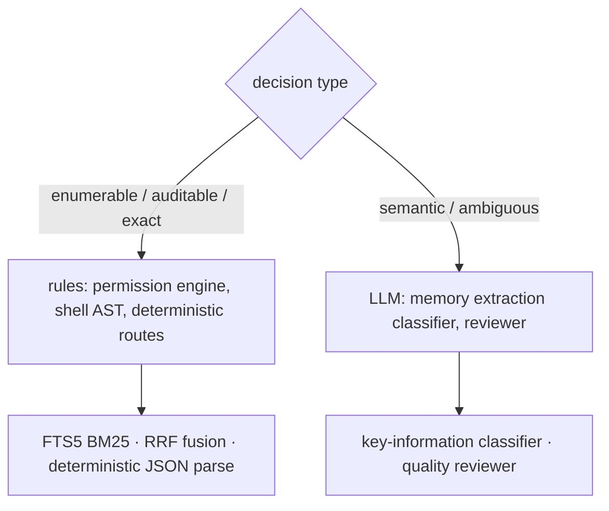
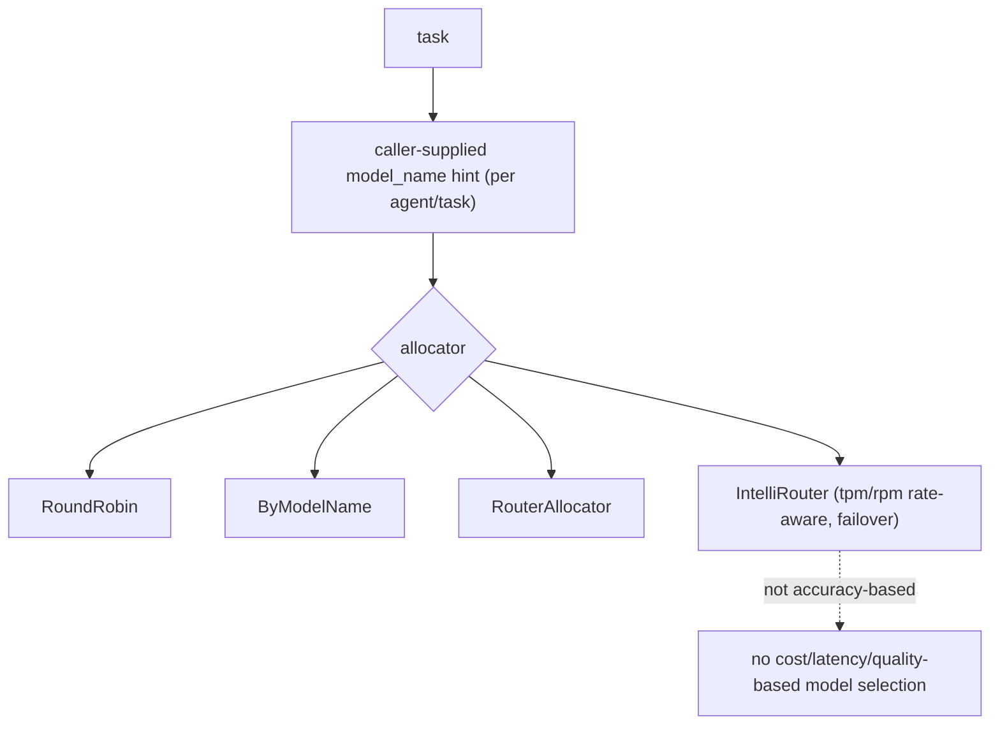
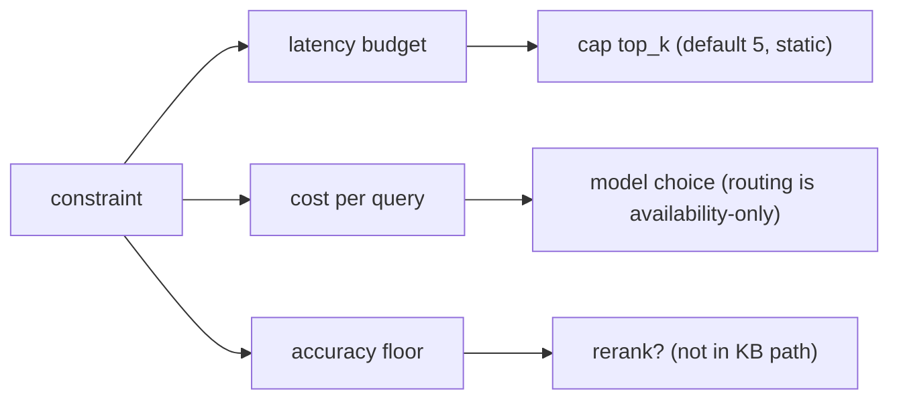

# Choosing models and approaches

## 1. Deciding when a problem actually needs an LLM versus a simpler rule-based system

**General:** Use a rule-based/deterministic system when the logic is enumerable, must be auditable, or needs exact reproducibility (validation, routing by known patterns, permission checks, arithmetic, parsing). Use an LLM when the task is semantic, open-ended, or handles ambiguity that rules cannot enumerate (summarization, intent, extraction from messy text). Rules for control, LLM for meaning; often both.

**Jiuwen:** The codebase deliberately routes many decisions through deterministic code. The permission engine is a pure rule/AST engine — its docstring notes the model is not used on the permission path — evaluating tiered regex rules and a tree-sitter shell AST before falling back to ASK. The product's auto-permission layer has deterministic routes that hard-block/ask by URL scheme, egress fields, and capability side-effects before any reviewer is consulted. Lexical/deterministic retrieval coexists with vector paths (SQLite FTS5 BM25, RRF rank fusion), and structured JSON is extracted with deterministic parsers. Conversely, memory extraction uses an LLM key-information classifier because judging "is this worth remembering" is semantic.

Anchors

<strong>Anchors:</strong> &bull; <code>agent-core/openjiuwen/harness/security/permission_engine/core.py:192</code> — docstring: LLM not used on the permission path &bull; <code>agent-core/openjiuwen/harness/security/permission_engine/toolguard/tool_policy.py:588</code> — rule-based tiered policy; <code>agent-core/openjiuwen/harness/security/permission_engine/toolguard/shell_ast.py:82</code> — deterministic parse &bull; <code>jiuwenswarm/jiuwenswarm/agents/harness/common/rails/permissions/auto_decision.py:73</code> <code>deterministic_guard_route</code>; <code>:116</code> <code>deterministic_domain_route</code> &bull; <code>jiuwenswarm/jiuwenswarm/agents/harness/common/memory/internal.py:165</code> <code>bm25_rank_to_score</code>; <code>jiuwenswarm/jiuwenswarm/agents/harness/common/memory/manager.py:1044</code> FTS BM25 &bull; <code>agent-core/openjiuwen/core/retrieval/utils/fusion.py:15</code> <code>rrf_fusion</code>; <code>agent-core/openjiuwen/core/foundation/store/index/simple_memory_index.py:348</code> sort by score &bull; <code>agent-core/openjiuwen/core/context_engine/context/message_buffer.py:74</code> — deterministic drop beyond 2× &bull; <code>agent-core/openjiuwen/rsi/harness_rsi/auto_harness/infra/parsers.py:147</code> — deterministic JSON extraction &bull; <code>agent-core/openjiuwen/core/memory/process/extract/memory_analyzer.py:26</code> — LLM classifier (semantic)

**Gap.** The boundary is principled but implicit — no single "classifier vs LLM" decision function or policy table exists; each subsystem chooses independently.

_Canonical source: `source/ai-engineer-technical-questions_for_engineers.md`; also covered in: engineering._

---

## 2. Larger model vs. smaller, faster one for a given task

**General:** Match model capability to task difficulty: use a large model for reasoning/ambiguity and a small/fast one for classification, extraction, routing, and formatting. Measure quality per task and weigh latency and cost; route by task, and fall back to the larger model only when needed. A leaderboard score is a prior, not a per-task decision.

**Jiuwen:** Model selection here is about availability and endpoint distribution, not task quality. A team can declare a `model_pool` of endpoints or a `ModelRouterConfig`/`IntelliRouterConfig` convenience shape; allocators (`RoundRobin`, `ByModelName`, `Router`, `IntelliRouter`) pick an entry by rotation or an explicit `model_name` hint supplied per agent/task. IntelliRouter is rate-aware only through `tpm`/`rpm` budgets. The `ModelPoolEntry` metadata comment ("weights, affinity hints") is documented but not implemented.

Anchors

<strong>Anchors:</strong> &bull; <code>agent-core/openjiuwen/agent_teams/models/pool.py:38</code> — <code>ModelPoolEntry</code>; <code>:133</code> <code>ModelRouterConfig</code>; <code>:241</code> <code>IntelliRouterDeployment</code>; <code>:314</code> <code>IntelliRouterConfig</code>; <code>:278</code> tpm/rpm rate-aware; <code>:95</code> "weights/affinity hints" (documented, not implemented) &bull; <code>agent-core/openjiuwen/agent_teams/models/allocator.py:176</code> round-robin; <code>:240</code> by-model-name; <code>:452</code> IntelliRouter; <code>:559</code> <code>build_model_allocator</code>; <code>:28</code> allocation-vs-reliability docstring &bull; <code>agent-core/openjiuwen/harness/schema/config.py:242</code> / <code>agent-core/openjiuwen/harness/schema/deep_agent_spec.py:441</code> — per-agent/task model config

**Gap.** Routing is not accuracy-based and has no cost/latency/quality-based selection. Choosing a smaller cheap model is a caller/human decision expressed as a `model_name` hint.

_Canonical source: `source/ai-engineer-technical-questions_for_engineers.md`; also covered in: engineering._

---

## 3. "Compare two approaches" tests tradeoff reasoning tied to numbers, not a correct pick

**General:** RAG vs. fine-tuning, 7B vs. 70B, top-5 vs. top-20 retrieval. "It depends" without naming the constraint (latency budget, cost per query, accuracy floor) reads as a dodge. The strongest answers put a number on it — e.g. "at a 200ms budget, reranking 20 docs isn't viable, so I'd cap retrieval at 5." A strong answer includes: state the constraint, then the decision it forces, then the number. Tie retrieval size to latency/tokens, model size to accuracy floor vs cost, and reranking to the latency it buys you in precision.

**Jiuwen:** The relevant knobs are static and named: `top_k` defaults to 5 (no adaptive policy), reranking is not in the KB path, and model allocation is availability-based, not cost/accuracy-based — so "smaller model for easy queries" is not automatic. Session cost is tracked and capped when the provider reports cost.

Anchors

<strong>Anchors:</strong> &bull; <code>agent-core/openjiuwen/core/retrieval/common/config.py:46</code> — <code>top_k: int = 5</code> static &bull; <code>agent-core/openjiuwen/core/retrieval/simple_knowledge_base.py:182</code> — no reranker in KB retrieve &bull; <code>agent-core/openjiuwen/agent_teams/models/allocator.py:559</code> — <code>build_model_allocator</code> (availability strategies, not cost/accuracy) &bull; <code>jiuwenswarm/jiuwenswarm/server/runtime/usage_cost.py:171</code> — enforced session cost cap

