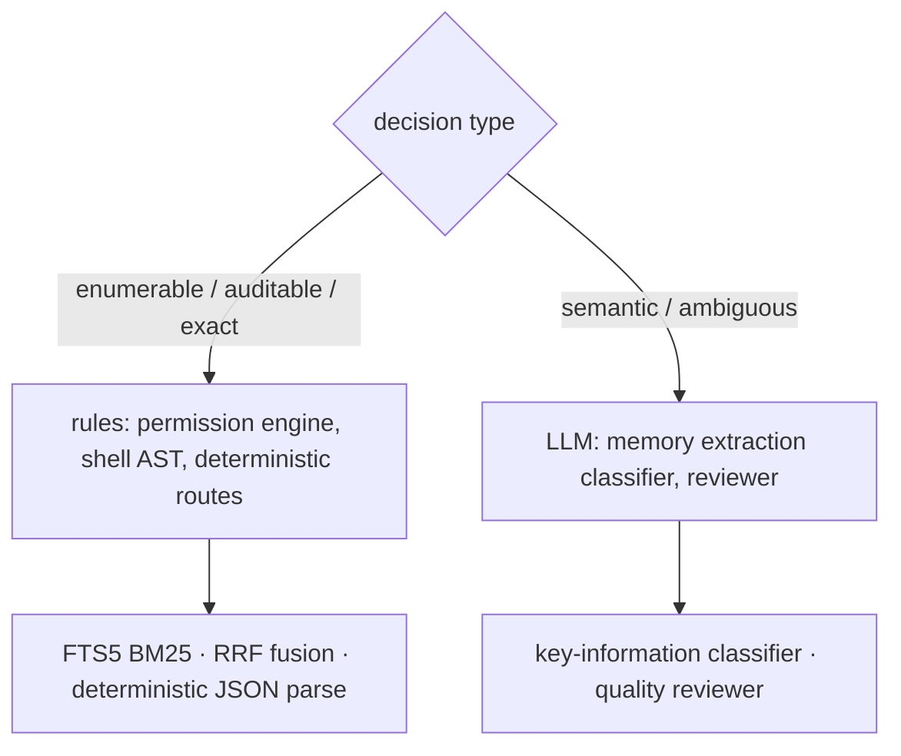
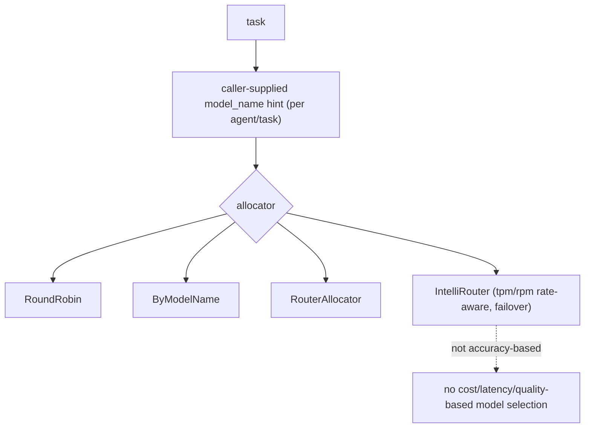
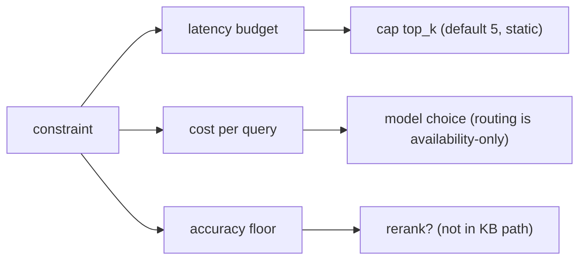
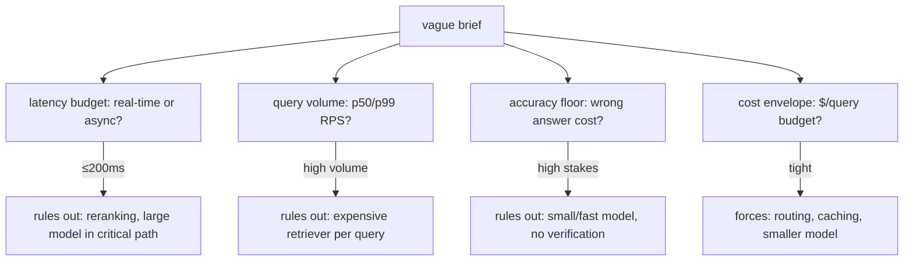
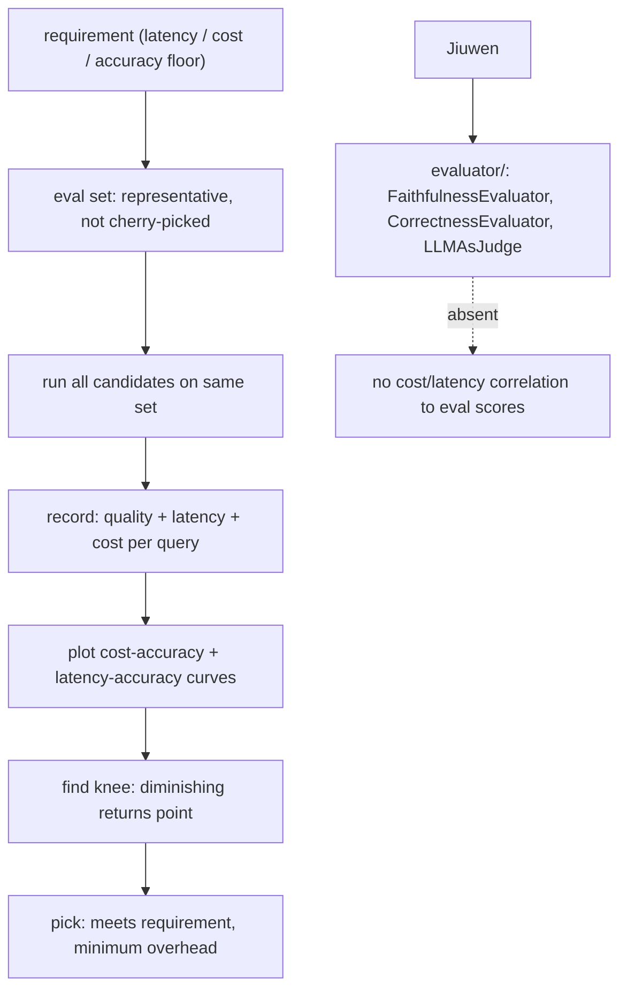
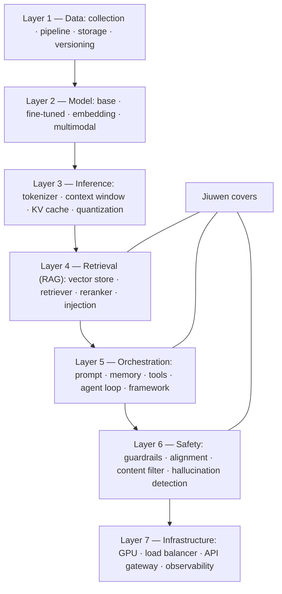

# Choosing models and tradeoffs

## 1. Deciding when a problem actually needs an LLM versus a simpler rule-based system

**General:** Use a rule-based/deterministic system when the logic is enumerable, must be auditable, or needs exact reproducibility (validation, routing by known patterns, permission checks, arithmetic, parsing). Use an LLM when the task is semantic, open-ended, or handles ambiguity that rules cannot enumerate (summarization, intent, extraction from messy text). Rules for control, LLM for meaning; often both.

**Jiuwen:** The codebase deliberately routes many decisions through deterministic code. The permission engine is a pure rule/AST engine — its docstring notes the model is not used on the permission path — evaluating tiered regex rules and a tree-sitter shell AST before falling back to ASK. The product's auto-permission layer has deterministic routes that hard-block/ask by URL scheme, egress fields, and capability side-effects before any reviewer is consulted. Lexical/deterministic retrieval coexists with vector paths (SQLite FTS5 BM25, RRF rank fusion), and structured JSON is extracted with deterministic parsers. Conversely, memory extraction uses an LLM key-information classifier because judging "is this worth remembering" is semantic.

Anchors

<strong>Anchors:</strong> &bull; <code>agent-core/openjiuwen/harness/security/permission_engine/core.py:193</code> — docstring: LLM not used on the permission path &bull; <code>agent-core/openjiuwen/harness/security/permission_engine/toolguard/tool_policy.py:588</code> — rule-based tiered policy; <code>agent-core/openjiuwen/harness/security/permission_engine/toolguard/shell_ast.py:82</code> — deterministic parse &bull; <code>jiuwenswarm/jiuwenswarm/agents/harness/common/rails/permissions/auto_decision.py:73</code> <code>deterministic_guard_route</code>; <code>:116</code> <code>deterministic_domain_route</code> &bull; <code>jiuwenswarm/jiuwenswarm/agents/harness/common/memory/internal.py:165</code> <code>bm25_rank_to_score</code>; <code>jiuwenswarm/jiuwenswarm/agents/harness/common/memory/manager.py:1044</code> FTS BM25 &bull; <code>agent-core/openjiuwen/core/retrieval/utils/fusion.py:15</code> <code>rrf_fusion</code>; <code>agent-core/openjiuwen/core/foundation/store/index/simple_memory_index.py:348</code> sort by score &bull; <code>agent-core/openjiuwen/core/context_engine/context/message_buffer.py:74</code> — deterministic drop beyond 2× &bull; <code>agent-core/openjiuwen/rsi/harness_rsi/auto_harness/infra/parsers.py:147</code> — deterministic JSON extraction &bull; <code>agent-core/openjiuwen/core/memory/process/extract/memory_analyzer.py:26</code> — LLM classifier (semantic)

**Gap.** The boundary is principled but implicit — no single "classifier vs LLM" decision function or policy table exists; each subsystem chooses independently.

_Canonical source: `source/ai-engineer-technical-questions_for_engineers.md`; also covered in: engineering._

---

## 2. Larger model vs. smaller, faster one for a given task

**General:** Match model capability to task difficulty: use a large model for reasoning/ambiguity and a small/fast one for classification, extraction, routing, and formatting. Measure quality per task and weigh latency and cost; route by task, and fall back to the larger model only when needed. A leaderboard score is a prior, not a per-task decision.

**Jiuwen:** Model selection here is about availability and endpoint distribution, not task quality. A team can declare a `model_pool` of endpoints or a `ModelRouterConfig`/`IntelliRouterConfig` convenience shape; allocators (`RoundRobinModelAllocator`, `ByModelNameAllocator`, `Router`, `IntelliRouter`) pick an entry by rotation or an explicit `model_name` hint supplied per agent/task. IntelliRouter is rate-aware only through `tpm`/`rpm` budgets. The `ModelPoolEntry` metadata comment ("weights, affinity hints") is documented but not implemented.

Anchors

<strong>Anchors:</strong> &bull; <code>agent-core/openjiuwen/agent_teams/models/pool.py:38</code> — <code>ModelPoolEntry</code>; <code>:133</code> <code>ModelRouterConfig</code>; <code>:241</code> <code>IntelliRouterDeployment</code>; <code>:314</code> <code>IntelliRouterConfig</code>; <code>:278</code> tpm/rpm rate-aware; <code>:95</code> "weights/affinity hints" (documented, not implemented) &bull; <code>agent-core/openjiuwen/agent_teams/models/allocator.py:176</code> round-robin; <code>:240</code> by-model-name; <code>:452</code> IntelliRouter; <code>:559</code> <code>build_model_allocator</code>; <code>:28</code> allocation-vs-reliability docstring &bull; <code>agent-core/openjiuwen/harness/schema/config.py:242</code> / <code>agent-core/openjiuwen/harness/schema/deep_agent_spec.py:441</code> — per-agent/task model config

**Gap.** Routing is not accuracy-based and has no cost/latency/quality-based selection. Choosing a smaller cheap model is a caller/human decision expressed as a `model_name` hint.

_Canonical source: `source/ai-engineer-technical-questions_for_engineers.md`; also covered in: engineering._

---

## 3. Justifying model size

**Definition:** Match capability to task difficulty. Large models suit reasoning and ambiguity; small, fast models suit classification, extraction, routing, and formatting. A leaderboard score is a prior, not a per-task decision — using a large model everywhere is a cost and latency decision, not a safe default.

---

## 4. When the "best" model is the wrong choice

**Definition:** Define "best" relative to a constraint, not as an absolute quality score. A model that is too slow or too expensive to ship at scale is not the right choice regardless of its accuracy; the justification is the constraint it satisfies or violates.

---

## 5. "Compare two approaches" tests tradeoff reasoning tied to numbers, not a correct pick

**General:** This claim holds: the expected answer is a constraint-driven tradeoff with numbers, not a single correct pick. RAG vs. fine-tuning, 7B vs. 70B, top-5 vs. top-20 retrieval. "It depends" without naming the constraint (latency budget, cost per query, accuracy floor) is not enough; put a number on it — e.g. "at a 200ms budget, reranking 20 docs is not viable, so cap retrieval at 5." State the constraint, then the decision it forces, then the number. Tie retrieval size to latency/tokens, model size to accuracy floor vs cost, and reranking to the latency it buys in precision.

**Jiuwen:** The relevant knobs are static and named: `top_k` defaults to 5 (no adaptive policy), reranking is not in the KB path, and model allocation is availability-based, not cost/accuracy-based — so "smaller model for easy queries" is not automatic. Session cost is tracked and capped when the provider reports cost.

Anchors

<strong>Anchors:</strong> &bull; <code>agent-core/openjiuwen/core/retrieval/common/config.py:46</code> — <code>top_k: int = 5</code> static &bull; <code>agent-core/openjiuwen/core/retrieval/simple_knowledge_base.py:182</code> — no reranker in KB retrieve &bull; <code>agent-core/openjiuwen/agent_teams/models/allocator.py:559</code> — <code>build_model_allocator</code> (availability strategies, not cost/accuracy) &bull; <code>jiuwenswarm/jiuwenswarm/server/runtime/usage_cost.py:171</code> — enforced session cost cap

---

## 6. Retrieval depth versus speed

**Definition:** The choice between retrieving more documents and retrieving faster is tied to the use case, not to a universal rule; 20 documents for accuracy versus 5 for speed has no universally correct answer. A medical assistant leans accuracy (retrieve more, rerank); a chat autocomplete leans speed (small top-k, no reranker). Name the latency number or accuracy floor that forces the decision.

---

## 7. You're given a vague AI system design brief with no stated constraints — what do you ask first?

**General:** Before proposing any architecture, extract the four constraints that determine every significant tradeoff: (1) **latency budget** — is this real-time (≤200ms) or async? (2) **query volume** — requests per second, peak vs average; (3) **accuracy floor** — is a wrong answer a minor inconvenience or a safety/legal risk? (4) **cost envelope** — is this internal tooling or a consumer product at scale? These four drive every meaningful decision: latency budget rules out reranking or large-model calls in the critical path; accuracy floor rules out smaller models; volume rules out expensive retrievers. Propose an architecture only after these constraints are known.

**Jiuwen:** The deployment surface exposes these constraints as distinct configuration layers. Latency: `ModelClientConfig.timeout` per call, agent `max_turns`. Volume/concurrency: `IntelliRouterDeployment` `tpm`/`rpm` caps, `APIEmbedding` `max_concurrent`. Accuracy tradeoff: `score_threshold` (retrieval), `temperature`, `max_tokens`. Cost: the auto-harness `BudgetRail` (per-session dollar cap). The operator sets them per use case.

Anchors

<strong>Anchors:</strong> &bull; <code>agent-core/openjiuwen/core/foundation/llm/schema/config.py:102</code> — <code>ModelClientConfig.timeout</code> (latency) &bull; <code>agent-core/openjiuwen/agent_teams/models/pool.py:278</code> — <code>tpm</code>/<code>rpm</code> (volume) &bull; <code>agent-core/openjiuwen/core/retrieval/common/config.py:47</code> — <code>score_threshold</code> (accuracy lever) &bull; <code>agent-core/openjiuwen/auto_harness/rails/budget_rail.py:24</code> — dollar cap (cost)

_Canonical source: `source/cost-latency-accuracy-tradeoffs_for_engineers.md`; also covered in: tradeoffs._

---

## 8. Gathering constraints before designing

**Definition:** Before proposing an architecture, extract the four constraints that determine every significant tradeoff: **latency budget** — real-time (≤200ms) or async?; **query volume** — requests per second, peak versus average; **accuracy floor** — is a wrong answer a minor inconvenience or a safety/legal risk?; and **cost envelope** — internal tooling or a consumer product at scale? These four drive every meaningful decision: a tight latency budget rules out reranking or large-model calls in the critical path, a high accuracy floor rules out smaller models, and high volume rules out expensive retrievers.

**Jiuwen:** Latency is set via `ModelClientConfig.timeout`; volume via `IntelliRouterDeployment` `tpm`/`rpm`; accuracy via `score_threshold`; cost via the auto-harness `BudgetRail` dollar cap. The operator sets them per use case.

---

## 9. How do you make a defensible model selection decision — what does the evaluation actually look like?

**General:** "There's a tradeoff" is not an answer — it is the beginning of one. A defensible selection looks like: (1) define a representative eval set covering the actual use-case distribution (not cherry-picked examples); (2) run every candidate model (or configuration) on the same eval set; (3) record accuracy/quality score AND latency AND cost per query; (4) plot the cost-accuracy and latency-accuracy curves; (5) identify the **knee of the curve** — the point where additional cost or latency buys diminishing quality gain; (6) choose the option that meets the requirement with the least overhead, not the option with the highest absolute accuracy. Critically: the choice is a decision that follows from the requirement, not from intuition or a leaderboard.

**Jiuwen:** `agent_evolving/evaluator/` provides metrics such as `ExactMatchMetric` and `LLMAsJudgeMetric` for quality measurement. `dev_tools/tune/Trainer` supports `early_stop_score` for automated quality gating. Gaps: cost and latency are not recorded *alongside* quality in the eval pipeline — there is no built-in cost-accuracy curve generation. Session costs are tracked in `usage_cost.py` but not correlated to per-query eval scores.

Anchors

<strong>Anchors:</strong> &bull; <code>agent-core/openjiuwen/agent_evolving/evaluator/metrics/exact_match.py:12</code> — <code>ExactMatchMetric</code> &bull; <code>agent-core/openjiuwen/agent_evolving/evaluator/metrics/llm_as_judge.py:17</code> — <code>LLMAsJudgeMetric</code> &bull; <code>agent-core/openjiuwen/dev_tools/tune/trainer/trainer.py:38</code> — <code>early_stop_score</code> &bull; <code>jiuwenswarm/jiuwenswarm/server/runtime/usage_cost.py:101</code> — session cost (not per-eval-query)

**Gap.** Eval pipeline measures quality only — cost and latency are not correlated with quality scores, so the cost-accuracy curve must be assembled externally by the operator.

_Canonical source: `source/cost-latency-accuracy-tradeoffs_for_engineers.md`; also covered in: tradeoffs._

---

## 10. Measuring the tradeoff empirically

**Definition:** Define a representative eval set, run every candidate on it, and record quality score, latency, and cost per query. Plot the cost–accuracy and latency–accuracy curves, find the knee (the point of diminishing returns), and pick the option that meets the requirement with the minimum overhead — not the highest-accuracy option.

**Jiuwen:** `agent_evolving/evaluator/` provides metrics such as `ExactMatchMetric` and `LLMAsJudgeMetric`; session costs are tracked in `usage_cost.py`. Cost and latency are tracked separately from quality scores, so the cost-accuracy curve is assembled by the operator.

---

## 11. What are the architectural layers of a modern AI product?

**General:** A production AI system has seven functional layers, each independently scalable and debuggable: **(1) Data Layer** — raw collection, cleaning/deduplication/filtering, storage (vector DB, object store, data lake), and versioning (what data trained which model). **(2) Model Layer** — base model (raw language prediction), fine-tuned model (task-specific behavior), embedding model (text→vectors), multimodal model (text+image+audio). **(3) Inference Layer** — tokenizer, context window management, temperature/sampling controls, KV cache (reuse past token computations), quantization (reduce weight precision for speed/memory). **(4) Retrieval Layer** — vector store, retriever, reranker, context injection. **(5) Orchestration Layer** — prompt template, conversation memory, tools/function calling, agent loop (plan → act → observe → repeat), orchestration framework. **(6) Safety Layer** — guardrails, alignment (RLHF/CAI), content filter, hallucination detection. **(7) Infrastructure Layer** — GPU cluster (inference compute), load balancer, API gateway (auth/rate limiting/billing), observability (logs, latency, token counts, traces). Every production AI product runs all 7 layers simultaneously. Most developers interact only with Layer 5. The practical test: if something breaks, can you identify which layer it's in?

**Jiuwen:** The framework maps onto Layers 4–6 directly and delegates the rest. **Layer 4**: full retrieval pipeline (vector, hybrid, graph, agentic retrievers). **Layer 5**: `PromptTemplate`, `ContextEngine`, `ToolCard` system, `ReActAgent` loop, framework rails. **Layer 6**: `SecurityRail`, `PromptInjectionGuardrail`, `VerificationRail`. Layer 7 infrastructure is provided by Milvus (vector store), vLLM (local inference), provider APIs (OpenAI, Anthropic), and the harness observability rail. Layers 1–3 (data pipeline, base model training, inference engine) are handled outside the framework.

Anchors

<strong>Anchors:</strong> &bull; Layer 4: <code>agent-core/openjiuwen/core/retrieval/</code> — full retrieval pipeline &bull; Layer 5: <code>agent-core/openjiuwen/core/foundation/prompt/template.py</code>; <code>agent-core/openjiuwen/core/context_engine/</code>; <code>agent-core/openjiuwen/core/foundation/tool/base.py</code>; <code>agent-core/openjiuwen/core/single_agent/agents/react_agent.py</code> &bull; Layer 6: <code>agent-core/openjiuwen/auto_harness/rails/security_rail.py</code>; <code>agent-core/openjiuwen/core/security/guardrail/builtin.py</code>; <code>agent-core/openjiuwen/harness/rails/subagent/verification_rail.py</code> &bull; Layer 7: <code>agent-core/openjiuwen/harness/observability/rail.py</code>; Milvus + vLLM + provider APIs (external)

_Canonical source: `source/ai-system-full-stack_for_engineers.md`; also covered in: ai-system-full-stack._

## 12. Planning for 10x traffic

**Definition:** Scaling is decided before the demo, not after. The first levers are caching, batching, and confirming that latency holds under load. Identify the bottleneck — generation, retrieval, or orchestration — and the first scaling lever for each.

---

## 13. What to cut first under a budget constraint

**Definition:** Know which components cost the most and which degrade gracefully versus break the system. Embedding is one-time; generation scales with traffic — so cut generation first: route simple queries to a smaller model, lower top-k, add semantic caching. Safety and guardrail layers are the last thing to cut, because they prevent unsafe output.

---
