# Agent fundamentals and the loop

## 1. What's the difference between a chatbot and an agent

**General:** A chatbot maps one input to one model reply. An agent runs a loop: it calls the model, may call tools, feeds results back, and repeats until a stopping condition is met. The defining trait is the tool/reason loop and a termination rule, not the size of the model.

**Jiuwen:** There is no separate `Chatbot` class; the distinction is structural. A single model turn is the workflow LLM component, which calls `llm.invoke` once and has no tool branch. An agent is the loop in `ReActAgent.invoke`: it calls the model, and if the returned message has no tool calls it returns the answer; otherwise it executes the tools and iterates. `DeepAgent` wraps this with an outer task loop.

**Chatbot:**

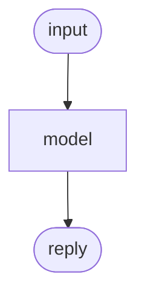

**Agent:**

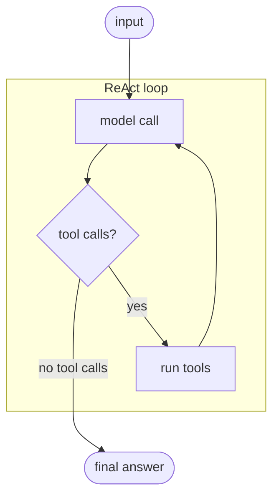

Anchors

<strong>Anchors:</strong> &bull; <code>agent-core/openjiuwen/core/workflow/components/llm/llm_comp.py:524</code> — single model call, no tool branch &bull; <code>agent-core/openjiuwen/core/single_agent/agents/react_agent.py:2740</code> — the ReAct loop &bull; <code>agent-core/openjiuwen/core/single_agent/agents/react_agent.py:2793</code> — no tool calls → final answer &bull; <code>agent-core/openjiuwen/core/single_agent/agents/react_agent.py:2813</code> — execute tools and iterate &bull; <code>agent-core/openjiuwen/harness/deep_agent.py:2694</code> — outer task loop

_Canonical source: `source/ai-agent-interview-questions_for_engineers.md`; also covered in: ai-agent, genai._

---

## 2. What's the difference between a workflow and an agent

**General:** A workflow is a pre-declared graph: you author the steps, edges, and branches, and execution follows that topology. An agent decides its next step at runtime from model output. Workflows are predictable and cheap; agents are flexible and variable. They compose: a workflow can contain an agent node.

**Jiuwen:** The workflow engine is a Pregel-style graph machine. Topology is declared up front via the start component, connections, and conditional connections, and execution terminates when the end component produces output. An agent loop instead branches on live `tool_calls`. A workflow can embed an agent as one node, where a single executable just calls the agent's `invoke`.

**Workflow (fixed topology):**

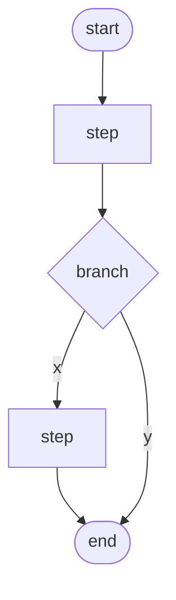

**Agent (decided at runtime):**

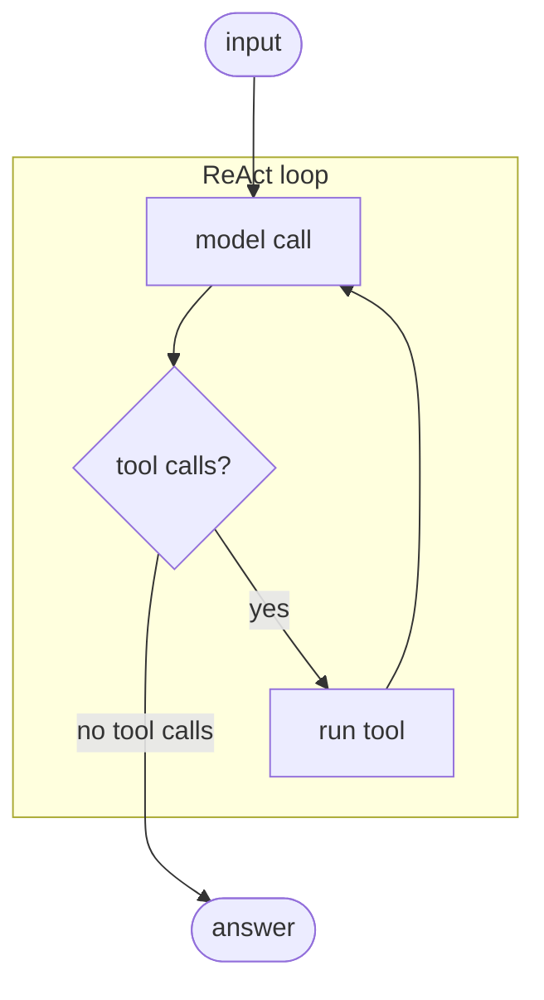

Anchors

<strong>Anchors:</strong> &bull; <code>agent-core/openjiuwen/core/workflow/workflow.py:98</code> — <code>Workflow</code> class &bull; <code>agent-core/openjiuwen/core/graph/pregel/engine.py:255</code> — graph execution driver &bull; <code>agent-core/openjiuwen/core/workflow/workflow.py:136/279/311</code> — <code>set_start_comp</code> / <code>add_connection</code> / <code>add_conditional_connection</code> &bull; <code>agent-core/openjiuwen/core/workflow/workflow.py:551</code> — terminates when the end component produces output &bull; <code>agent-core/openjiuwen/core/workflow/components/llm/react/react_executable.py:41</code> — workflow node embedding an agent

_Canonical source: `source/ai-agent-interview-questions_for_engineers.md`; also covered in: ai-agent._

---

## 3. What's the difference between a linear chain and a graph with conditional branches

**General:** A linear chain is a fixed sequence where each step always activates the next. A graph adds branching and merging: a router selects successors based on state at runtime, and a join/barrier decides when a merge node is ready (all predecessors, or any of an exclusive group).

**Jiuwen:** Both are built on the same `PregelGraph`. `add_connection` registers a static edge; at compile time `PregelGraph._compile` turns static edges into `StaticRouter` (1→N) or `BarrierChannel` (N→1, with CNF OR-groups for mutually exclusive predecessors). `add_conditional_connection` registers a branch router compiled to `ConditionalRouter`, whose `dispatch` calls the user selector and emits `TriggerMessage`s only for the chosen targets. A linear chain always activates its single successor; a conditional graph activates only the selector's targets, and `BranchRouter` raises `COMPONENT_BRANCH_EXECUTION_ERROR` if none match.

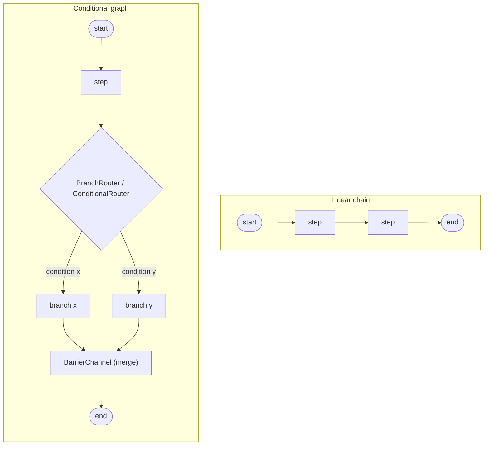

Anchors

<strong>Anchors:</strong> &bull; <code>agent-core/openjiuwen/core/workflow/workflow.py:279</code> — <code>add_connection</code> (static); <code>:311</code> — <code>add_conditional_connection</code> &bull; <code>agent-core/openjiuwen/core/workflow/_workflow.py:221</code> — <code>BaseWorkflow.add_connection</code> → <code>self._graph.add_edge</code>; <code>:255</code> — <code>add_conditional_connection</code> wraps <code>BranchRouter</code> + <code>register_branch_targets</code> &bull; <code>agent-core/openjiuwen/core/graph/graph.py:103</code> — <code>add_edge</code>; <code>:122</code> — <code>add_conditional_edges</code>; <code>:267</code> <code>_compile</code>; <code>:300</code> adds branches to the Pregel builder &bull; <code>agent-core/openjiuwen/core/graph/pregel/builder.py:28</code> — <code>add_edge</code> (N→1 <code>BarrierChannel</code>, 1→N <code>StaticRouter</code>); <code>:67</code> <code>add_branch</code> &bull; <code>agent-core/openjiuwen/core/graph/pregel/router.py:11</code> — <code>StaticRouter.dispatch</code>; <code>:26</code> <code>ConditionalRouter.dispatch</code> &bull; <code>agent-core/openjiuwen/core/graph/pregel/channels.py:104</code> — <code>TriggerChannel</code>; <code>:129</code> <code>BarrierChannel</code>; <code>:166</code> <code>is_ready</code> (CNF OR-groups) &bull; <code>agent-core/openjiuwen/core/workflow/components/flow/branch_router.py:92</code> — <code>BranchRouter.__call__</code>

**Gap.** `branch_targets` (used for CNF OR-group resolution) is only populated for `BranchRouter`; arbitrary callable routers go through a `new_router` wrapper and never register target sets, so exclusive-branch merging degrades to plain AND barriers. There is no static validation that a conditional router's targets are declared nodes, and `ConditionalRouter.dispatch` passes `state=None` to selectors, so selectors cannot read graph state directly.

_Canonical source: `source/ai-agent-framework-interview-questions_for_engineers.md`; also covered in: framework._

---

## 4. What's the ReAct pattern, and why interleave reasoning with actions instead of planning everything upfront

**General:** ReAct alternates thought → action → observation. Interleaving lets each action's real result inform the next thought, which corrects drift and grounds reasoning in observed state. A fully upfront plan cannot react to what the tools actually return.

**Jiuwen:** The loop is exactly reason/act/observe: model call, branch on `tool_calls`, execute, feed `ToolMessage`s back as the next observation, repeat. The reasoning trace is retained by copying `reasoning_content` into the assistant message, and the iteration number is exposed to rails.

**Why interleave:** a fully upfront plan executes with no feedback; ReAct feeds each observation back into the next reasoning step, so it can adapt when reality differs from the plan.

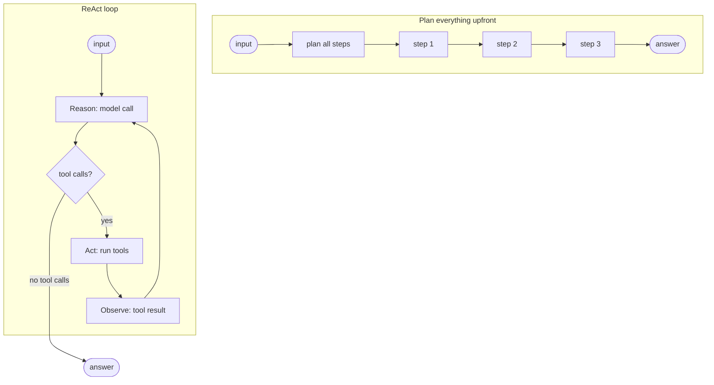

Anchors

<strong>Anchors:</strong> &bull; <code>agent-core/openjiuwen/core/single_agent/agents/react_agent.py:2766</code> — model call (reason) &bull; <code>agent-core/openjiuwen/core/single_agent/agents/react_agent.py:2793</code> — branch on tool calls &bull; <code>agent-core/openjiuwen/core/single_agent/agents/react_agent.py:2813</code> — execute (act) &bull; <code>agent-core/openjiuwen/core/single_agent/agents/react_agent.py:2787</code> — retain <code>reasoning_content</code> &bull; <code>agent-core/openjiuwen/core/single_agent/agents/react_agent.py:2742</code> — iteration exposed to rails &bull; <code>agent-core/openjiuwen/core/single_agent/agents/react_agent.py:568</code> — <code>ReActAgent</code> documents the pattern

_Canonical source: `source/ai-agent-interview-questions_for_engineers.md`; also covered in: ai-agent._

---

## 5. How do you set a hard limit on iterations or steps within a framework

**General:** Cap the loop with a max-iteration/max-round counter, plus optional token and wall-clock budgets, and *enforce* them rather than only reporting. Nested loops need a cap at each level, and the caps should be configurable.

**Jiuwen:** The inner ReAct loop is bounded by `ReActAgentConfig.max_iterations` (default 5) and exits with `{"result_type": "error", "output": "Max iterations reached without completion"}`. When `enable_task_loop=True`, DeepAgent raises the inner ReAct ceiling to `sys.maxsize` and moves the real bound to the outer task loop, where `LoopCoordinator.should_continue()` OR-evaluates a chain of `StopConditionEvaluator`s. `TaskCompletionRail.build_evaluators()` contributes `MaxRounds`/`Timeout`/`TokenBudget`/`CompletionPromise`; the `NoProgressAnswer` evaluator is added separately from `task_loop_no_progress_guard` (`deep_agent._build_task_loop_evaluators`). Independently, `_run_task_loop` hard-codes `max_outer_rounds = 50` and force-stops with `stop_reason: "MaxOuterRounds"`. Team members reuse the wiring via `TaskCompletionRail(max_rounds=...)`, and cooperative stops exist via `ctx.request_force_finish()` and `DeepAgent.abort()`.

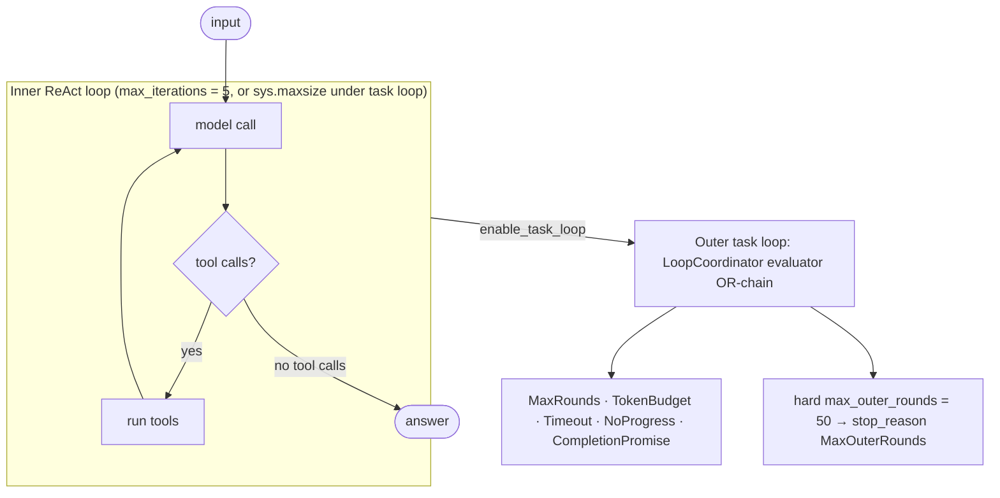

Anchors

<strong>Anchors:</strong> &bull; <code>agent-core/openjiuwen/core/single_agent/agents/react_agent.py:288</code> — <code>max_iterations: int = Field(default=5)</code>; <code>:2740</code> the bounded loop; <code>:2852</code> exhaustion result &bull; <code>agent-core/openjiuwen/harness/schema/stop_condition.py:134</code> — <code>MaxRoundsEvaluator.should_stop</code>; <code>:143</code> TokenBudget; <code>:162</code> Timeout &bull; <code>agent-core/openjiuwen/harness/task_loop/loop_coordinator.py:139</code> — <code>should_continue()</code> OR-chain; <code>:110</code> <code>increment_iteration</code>; <code>:133</code> <code>request_abort</code> &bull; <code>agent-core/openjiuwen/harness/rails/task_completion_rail.py:168</code> — <code>build_evaluators()</code>; <code>:178-185</code> build MaxRounds/Timeout/TokenBudget &bull; <code>agent-core/openjiuwen/harness/deep_agent.py:2723</code> — <code>max_outer_rounds = 50</code>; <code>:2725</code> <code>while coordinator.should_continue()</code>; <code>:2727-2739</code> force-stop; <code>:1116</code> inner cap swap; <code>:2338</code> <code>_build_task_loop_evaluators</code>; <code>:3380</code> <code>abort()</code> &bull; <code>agent-core/openjiuwen/agent_teams/agent/agent_configurator.py:436</code> — member <code>TaskCompletionRail(max_rounds=agent_spec.max_iterations)</code> &bull; <code>agent-core/openjiuwen/agent_teams/workflow/backends/budget_rail.py:88</code> — token-ceiling <code>ctx.request_force_finish</code>; <code>agent-core/openjiuwen/agent_teams/agent/scheduling/scheduler.py:300</code> — review-round cap

**Gap.** The 50-round ceiling is a literal local, not configurable. `TaskCompletionRail`'s `max_rounds`/`timeout_seconds`/`max_tokens` all default to `None`, so with the default auto-injected rail the LoopCoordinator chain is empty and only the 50-round literal and abort bound the outer loop. `NoProgressAnswerEvaluator` is gated by `TaskLoopNoProgressGuardConfig.enabled`, which defaults to `True`. Agent-teams review-round caps and swarmflow budget caps apply only in `scheduled` mode / when a budget is configured.

_Canonical source: `source/ai-agent-framework-interview-questions_for_engineers.md`; also covered in: framework, ai-agent._

---

## 6. What decides when an agent stops and returns a final answer instead of calling another tool

**General:** Usually the model itself: when it emits no tool calls, the answer is final. Around that sit hard limits — max iterations, token/time budgets, and explicit stop conditions — so a confused agent does not loop forever.

**Jiuwen:** Two levels. Inner: in `ReActAgent`, no tool calls means a final answer, bounded by `max_iterations` (default 5). Outer (`DeepAgent` task loop): the `LoopCoordinator` OR-evaluates a chain of stop evaluators — max rounds, timeout, token budget, completion promise, and no-progress answer. Completion can also arrive as a `<promise>…</promise>` marker extracted by `TaskCompletionRail`. A hardcoded ceiling of 50 outer rounds backstops everything.

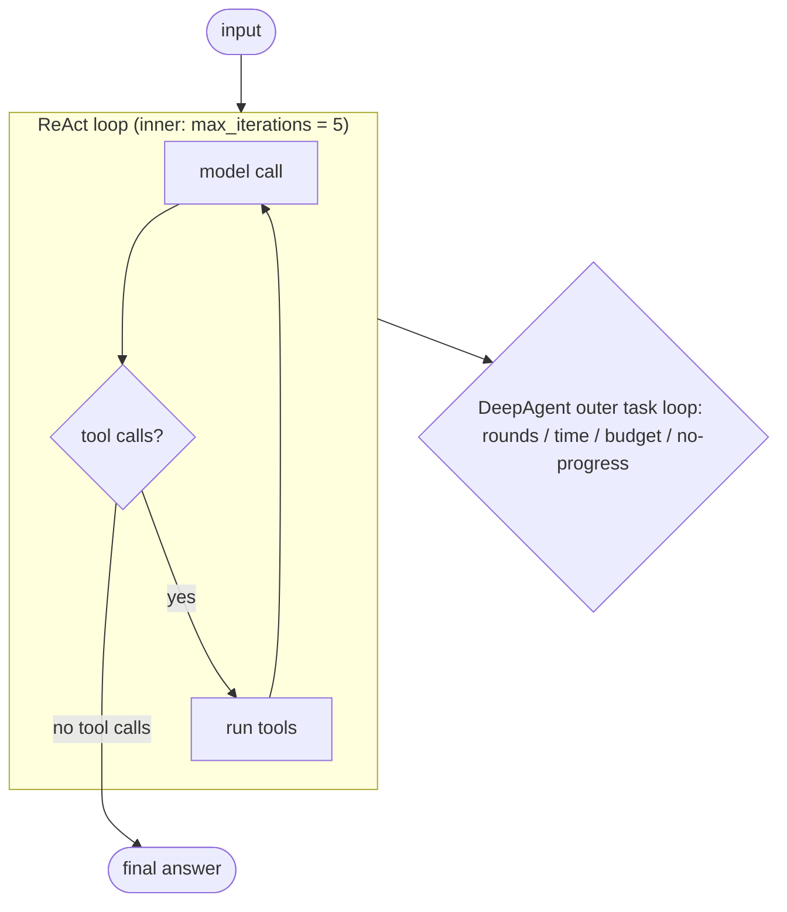

Anchors

<strong>Anchors:</strong> &bull; <code>agent-core/openjiuwen/core/single_agent/agents/react_agent.py:2793</code> — no tool calls → final answer &bull; <code>agent-core/openjiuwen/core/single_agent/agents/react_agent.py:288</code> — <code>max_iterations</code> default 5 &bull; <code>agent-core/openjiuwen/core/single_agent/agents/react_agent.py:2740</code> — inner loop &bull; <code>agent-core/openjiuwen/harness/task_loop/loop_coordinator.py:139</code> — outer <code>should_continue</code> &bull; <code>agent-core/openjiuwen/harness/schema/stop_condition.py:124-331</code> — evaluator chain &bull; <code>agent-core/openjiuwen/harness/rails/task_completion_rail.py:403</code> — completion-promise extraction &bull; <code>agent-core/openjiuwen/harness/deep_agent.py:2723</code> — hard 50-round ceiling

_Canonical source: `source/ai-agent-interview-questions_for_engineers.md`; also covered in: ai-agent._

---

## 7. How do you decide how many retrieval hops are enough?

**General:** Use a sufficiency check: decide whether the accumulated evidence already answers the question, and stop when it does. Back that with a hard hop cap so a confused retriever cannot keep going. Good design pairs a dynamic stop (sufficiency) with a static cap (max hops).

**Jiuwen:** `AgenticRetriever.max_iter` defaults to 2 and is hard-clamped (invalid values fall back to 2); each loop breaks at `turn >= max_iter`. The sufficiency decision comes from `_rewrite`, which sends `_REWRITE_PROMPT` and parses `{"sufficient": bool, "next_question": str|null}`; only `sufficient=false` with a non-empty question continues. Graph retrieval uses `TripleBeamSearch.max_length` / `graph_hops` (default 2, rejects `<1`).

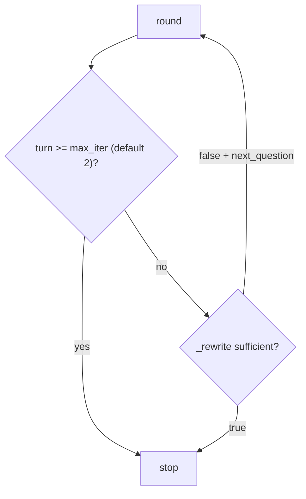

Anchors

<strong>Anchors:</strong> &bull; <code>agent-core/openjiuwen/core/retrieval/retriever/agentic_retriever.py:133</code> — `max_iter=2`; `:148` invalid-value fallback; `:241/287` turn-cap break; `:364` parses `sufficient`/`next_question` &bull; <code>agent-core/openjiuwen/core/retrieval/retriever/graph_retriever.py:37</code> — `max_length < 1` raises; `:402` `graph_hops` default 2

_Canonical source: `source/rag-part2-interview-questions_for_engineers.md`; also covered in: rag-2._

---

## 8. How do you prevent a retrieval loop from running indefinitely and burning cost?

**General:** Add repetition/loop detection, deduplicate identical tool calls, bound the agent's own loop with a max-iteration cap, and put a cost ceiling on the session. The failure mode is quiet: retries on a flaky call that never terminate, or token spend that climbs overnight.

**Jiuwen:** `ModelAnomalyDetectionRail` detects consecutive identical tool-call rounds and compacts or aborts; `ToolCallDeduplicationRail` short-circuits duplicate calls via `_skip_tool`; the ReAct loop is bounded by `max_iterations` (default 5). These harness guards are **not wired into `AgenticRetriever`**, which has no loop detector beyond its turn cap.

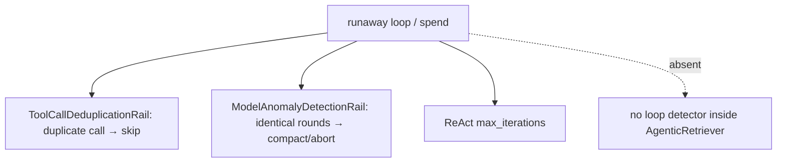

Anchors

<strong>Anchors:</strong> &bull; <code>agent-core/openjiuwen/harness/rails/model_anomaly_detection_rail.py:418</code> — loop bailout `AbortError`; `:466` `_find_tool_loop_compact_range` &bull; <code>jiuwenswarm/jiuwenswarm/agents/harness/common/rails/tool_dedup_rail.py:128</code> — `_skip_tool` duplicate suppression &bull; <code>agent-core/openjiuwen/core/single_agent/agents/react_agent.py:2740</code> — `for iteration in range(..., max_iterations)`

_Canonical source: `source/rag-part2-interview-questions_for_engineers.md`; also covered in: rag-2._

---

## 9. Preventing an agent from getting stuck in an infinite tool-calling loop

**General:** Cap iterations, detect repetition (same tool and arguments repeatedly), nudge or abort when no progress is made, and also cap rounds, tokens, and wall time. Detection should compare canonicalized arguments, not raw strings.

**Jiuwen:** Inner cap `max_iterations` (ReAct default 5, harness default 15). Repetition detection: `ModelAnomalyDetectionRail` finds consecutive identical `(tool_name, canonical_args)` rounds and either folds them into a warning or aborts; `ToolCallDeduplicationRail` counts repeated read-only calls and warns. Outer guards: `NoProgressAnswerEvaluator`, `MaxRoundsEvaluator`, and the hard 50-round ceiling. Agent teams add repeat-tool and ping-pong detectors.

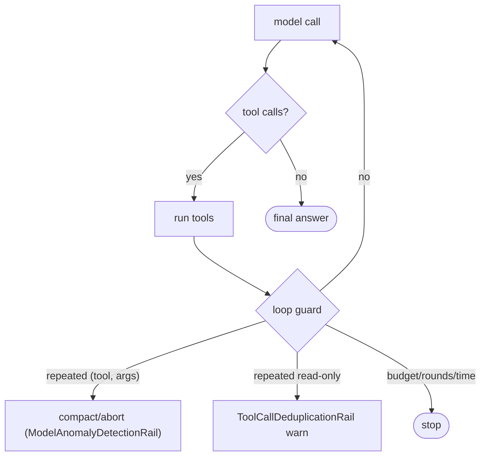

Anchors

<strong>Anchors:</strong> &bull; <code>agent-core/openjiuwen/core/single_agent/agents/react_agent.py:288</code> — <code>max_iterations</code> default 5; <code>agent-core/openjiuwen/harness/schema/config.py:252</code> — harness default 15 &bull; <code>agent-core/openjiuwen/harness/rails/model_anomaly_detection_rail.py:74/90</code> — tool-loop threshold + bailout &bull; <code>jiuwenswarm/jiuwenswarm/agents/harness/common/rails/tool_dedup_rail.py:157</code> — cross-turn repeat counter &bull; <code>agent-core/openjiuwen/harness/schema/stop_condition.py:181</code> — <code>NoProgressAnswerEvaluator</code> &bull; <code>agent-core/openjiuwen/harness/deep_agent.py:2723</code> — hard 50-round ceiling &bull; <code>agent-core/openjiuwen/agent_teams/reliability/detectors/repeat_tool.py:15</code> — repeat-tool; <code>agent-core/openjiuwen/agent_teams/reliability/detectors/pingpong.py:12</code> — ping-pong

_Canonical source: `source/ai-engineer-technical-questions_for_engineers.md`; also covered in: ai-agent, engineering, genai, llm-applied._

---

## 10. How does an agent decide when to retrieve again versus when it has enough context to answer

**General:** Ask the model a sufficiency question — given the query and the evidence so far, is it enough to answer, and if not what is the next query? Stop when sufficient or when the hop/round cap is hit. Judging sufficiency on the evidence (not just a scratchpad) matters.

**Jiuwen:** This is `AgenticRetriever._rewrite`: `_REWRITE_PROMPT` receives the query, the accumulated `TripleMemory.triples_str`, and the rewrite history, and returns `{"sufficient": bool, "next_question": str|null}`. If sufficient or no next question, `_rewrite` returns `None`, which breaks the loop; otherwise the next question is appended. The hard stop is `turn >= max_iter` before `_rewrite` is called.

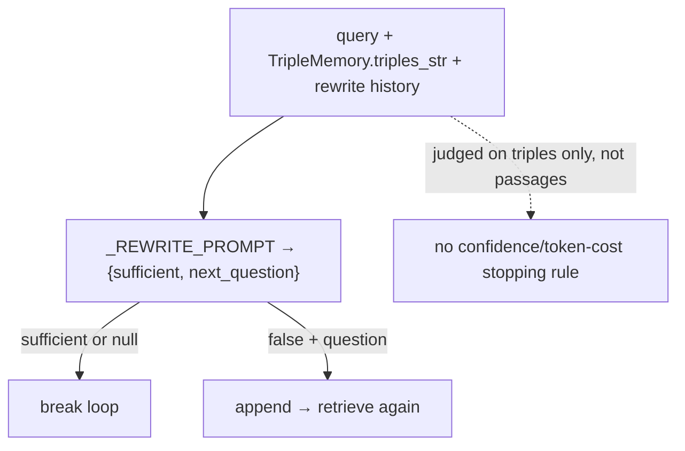

Anchors

<strong>Anchors:</strong> &bull; <code>agent-core/openjiuwen/core/retrieval/retriever/agentic_retriever.py:51</code> — <code>_REWRITE_PROMPT</code> JSON contract; <code>:326</code> <code>_rewrite</code>; <code>:341</code> history formatting; <code>:364</code> <code>sufficient</code>/<code>next_question</code>; <code>:244/290</code> append-and-continue &bull; <code>agent-core/openjiuwen/core/retrieval/common/triple_memory.py:16</code> — <code>triples_str</code> fed to the prompt &bull; <code>agent-core/openjiuwen/core/retrieval/retriever/agentic_retriever.py:67</code> — prompt to differentiate/simplify later questions

**Gap.** Sufficiency is judged on triples only, not the actual passages; no confidence score; a JSON parse failure returns `None` (silent early stop).

_Canonical source: `source/rag-part2-interview-questions_for_engineers.md`; also covered in: rag-2._

---

## 11. "The agent is stuck" tests whether you've shipped one, not studied one

**General:** Infinite tool loops, retries on a flaky API that never terminate, token spend that quietly spikes overnight. Vague answers ("I'd add safeguards") don't land; concrete answers do — `max_iterations=5`, a token budget per session, a circuit breaker after N consecutive tool failures. A strong answer includes: a hard iteration cap, repetition detection on canonicalized `(tool, args)`, per-session token/cost budget, retry with backoff only for idempotent reads, and a circuit breaker on repeated failures.

**Jiuwen:** Concrete caps exist: ReAct `max_iterations` (default 5, harness 15), `AgenticRetriever.max_iter` (default 2, clamped), `ModelAnomalyDetectionRail` (consecutive identical tool rounds → compact/abort) and `ToolCallDeduplicationRail`. A session cost cap is enforced when the provider reports cost, and `ModelBackupRail` fails over. What is **missing** is a circuit breaker after N consecutive failures and a durable token budget on the retrieval loop.

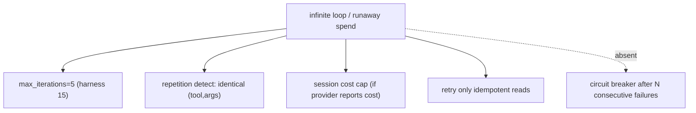

Anchors

<strong>Anchors:</strong> &bull; <code>agent-core/openjiuwen/core/single_agent/agents/react_agent.py:288</code> — <code>max_iterations: int = Field(default=5)</code>; <code>agent-core/openjiuwen/harness/schema/config.py:252</code> — harness default 15 &bull; <code>agent-core/openjiuwen/harness/rails/model_anomaly_detection_rail.py:74</code> — <code>ToolLoopCompactConfig</code> (default off); <code>:90</code> bailout &bull; <code>jiuwenswarm/jiuwenswarm/agents/harness/common/rails/tool_dedup_rail.py:157</code> — repeat counter/warning &bull; <code>jiuwenswarm/jiuwenswarm/server/runtime/usage_cost.py:171/196</code> — enforced session cost cap &bull; <code>agent-core/openjiuwen/core/single_agent/rail/model_backup.py:9</code> — <code>ModelBackupRail</code> failover (no circuit breaker)

---

## 12. "The agent is stuck in a loop" is testing production experience

**General:** max iteration limits per task, token budget caps per step, detecting and killing a failing loop before it burns cost, and retry logic on failed tool calls without infinite recursion. This separates people who have run one from people who have read about one. A strong answer includes: a hard iteration cap, a per-session/step token or cost budget, repetition detection on canonicalized `(tool, args)`, and bounded retries that never retry non-idempotent tools.

**Jiuwen:** Caps are concrete: ReAct `max_iterations` (5; harness 15), `AgenticRetriever.max_iter` (2, clamped), `ModelAnomalyDetectionRail` (identical tool rounds → compact/abort), `ToolCallDeduplicationRail`, and secure-by-default `idempotent=False` (non-idempotent tools never retried). A session cost cap is enforced when the provider reports cost; a per-step token budget in the task loop is wired but off by default.

Anchors

<strong>Anchors:</strong> &bull; <code>agent-core/openjiuwen/core/single_agent/agents/react_agent.py:288</code> — <code>max_iterations=5</code>; <code>agent-core/openjiuwen/harness/schema/config.py:252</code> — harness 15 &bull; <code>agent-core/openjiuwen/core/retrieval/retriever/agentic_retriever.py:133</code> — <code>max_iter=2</code> clamped &bull; <code>agent-core/openjiuwen/harness/rails/model_anomaly_detection_rail.py:74/90</code> — loop compact/abort &bull; <code>agent-core/openjiuwen/core/foundation/tool/base.py:109</code> — <code>idempotent</code> default <code>False</code> &bull; <code>agent-core/openjiuwen/harness/rails/tool_call_resilience_rail.py:128/145</code> — non-idempotent guard + retry budget &bull; <code>jiuwenswarm/jiuwenswarm/server/runtime/usage_cost.py:171</code> — session cost cap

