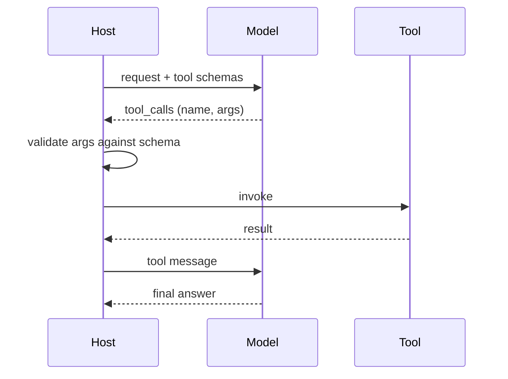
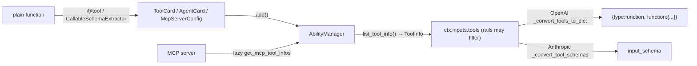
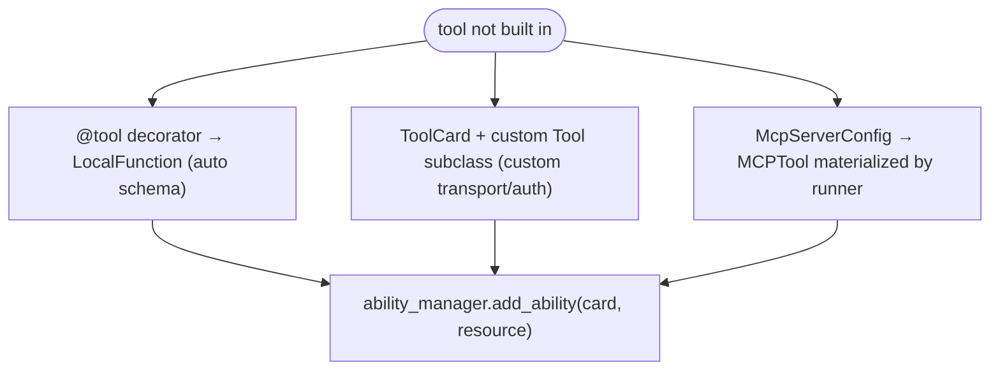
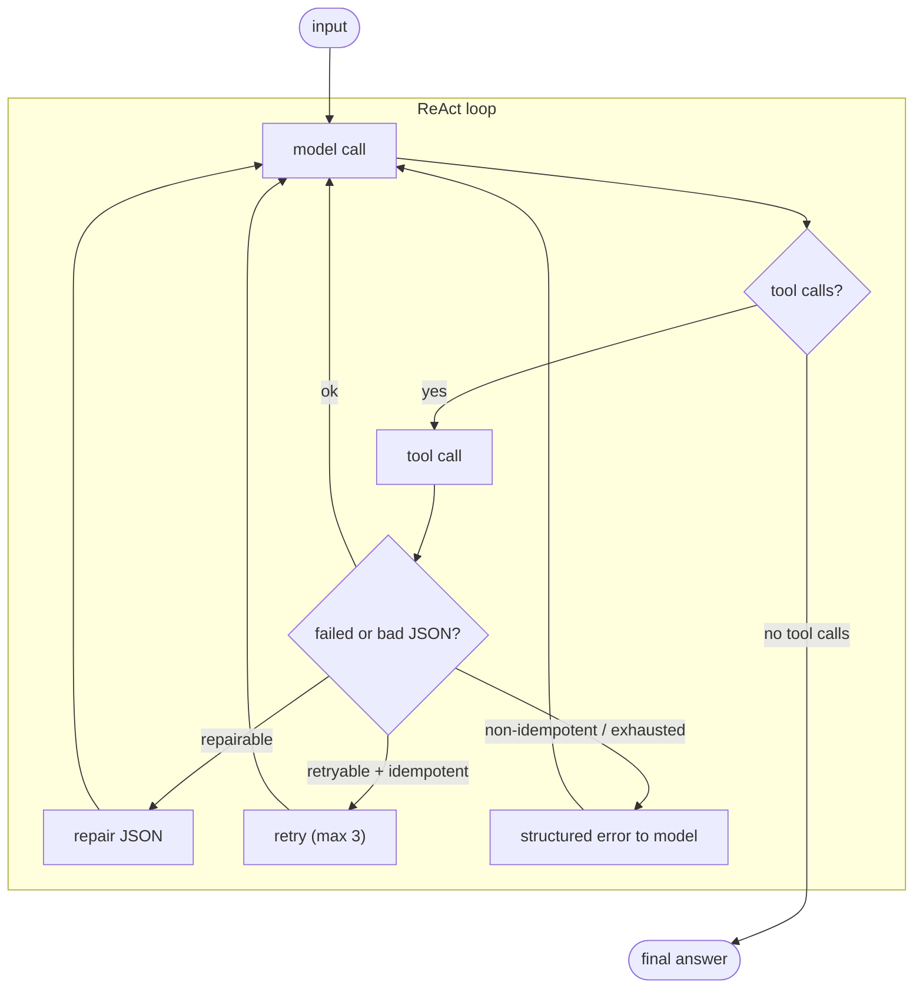
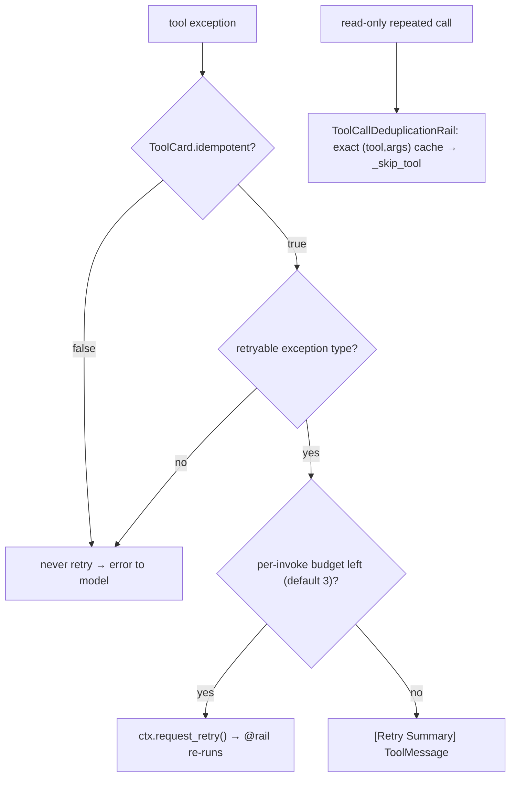
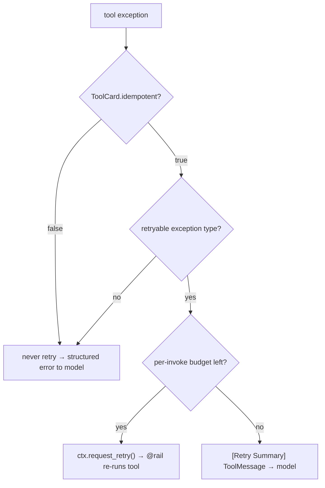
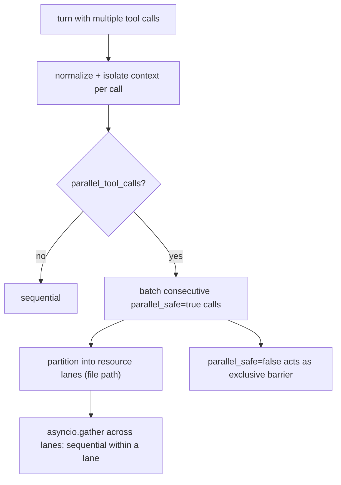
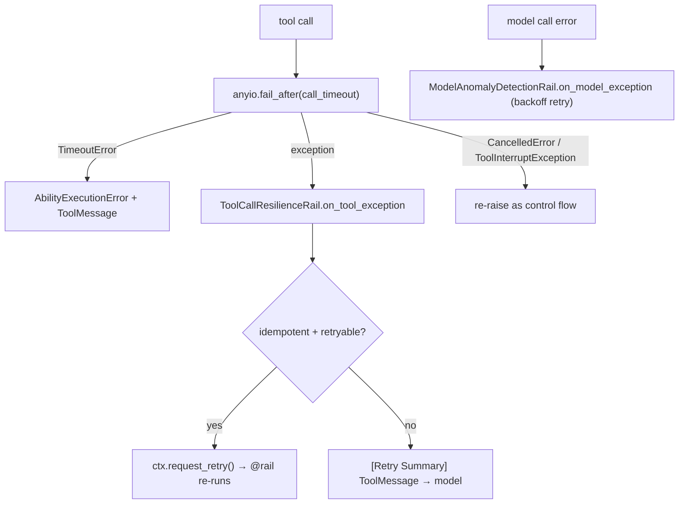
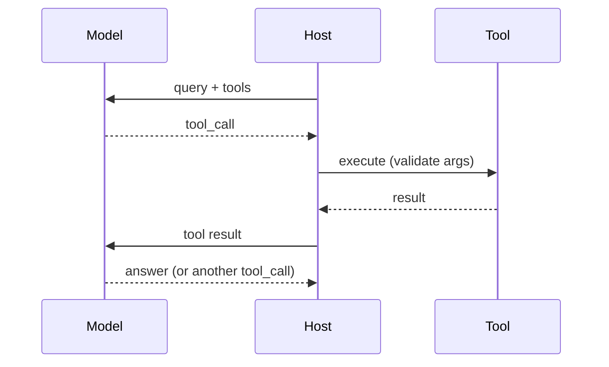
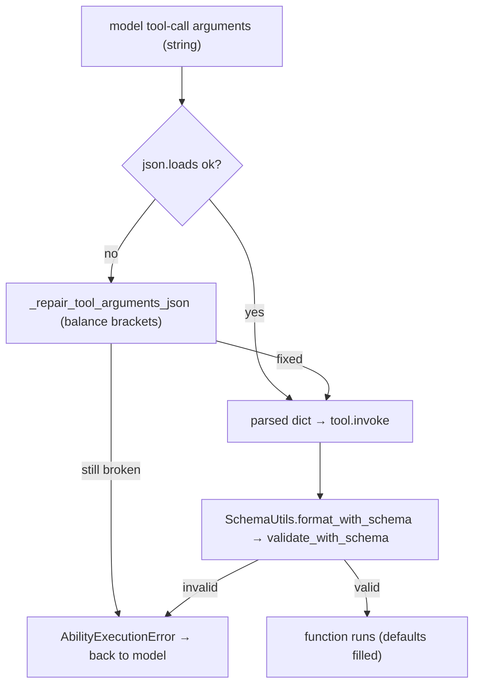

# Tools and function calling

## 1. How does function calling actually work under the hood

**General:** Tool definitions (name, description, JSON-Schema parameters) are sent to the model in the request. The model returns a structured `tool_calls` list instead of prose; the host parses it, validates arguments against the schema, invokes the function, and appends the result as a tool message for the next model turn. The model never runs code — it only emits a request to.

**Jiuwen:** Cards become JSON Schema through the callable schema extractor, the ability manager builds the model-facing tool list, and the model client converts it to OpenAI/Anthropic tool format. The model's `tool_calls` are parsed (non-streaming, streaming, and Anthropic), validated, and dispatched by the ability manager, with schema validation inside `LocalFunction.invoke`.

Anchors

<strong>Anchors:</strong> &bull; <code>agent-core/openjiuwen/core/foundation/tool/utils/callable_schema_extractor.py:20</code> — card → JSON Schema &bull; <code>agent-core/openjiuwen/core/single_agent/ability_manager.py:984</code> — builds the model-facing tool list &bull; <code>agent-core/openjiuwen/core/foundation/llm/model_clients/base_model_client.py:483</code> — OpenAI tool format &bull; <code>agent-core/openjiuwen/core/foundation/llm/model_clients/anthropic_model_client.py:494</code> — Anthropic tool format &bull; <code>agent-core/openjiuwen/core/foundation/llm/model_clients/openai_model_client.py:2388</code> — parse non-streaming tool calls &bull; <code>agent-core/openjiuwen/core/foundation/llm/model_clients/openai_model_client.py:2612</code> — parse streaming tool-call deltas &bull; <code>agent-core/openjiuwen/core/foundation/llm/model_clients/anthropic_model_client.py:1229</code> — parse Anthropic <code>tool_use</code> &bull; <code>agent-core/openjiuwen/core/single_agent/ability_manager.py:1078</code> — dispatch &bull; <code>agent-core/openjiuwen/core/foundation/tool/function/function.py:82</code> — argument schema validation

_Canonical source: `source/ai-agent-interview-questions_for_engineers.md`; also covered in: ai-agent, genai, llm-applied, engineering._

---

## 2. How does a framework register and expose tools to the underlying model

**General:** You register a tool with a name, description, and parameter schema; the framework collects registered tools into the model request in the provider's tool format; the model returns tool calls that the framework dispatches. Auto-deriving the schema from a function signature is the convenience that makes this usable.

**Jiuwen:** Abilities are stored as metadata cards (`ToolCard`/`WorkflowCard`/`AgentCard`/`McpServerConfig`) in `AbilityManager`'s per-type dicts via `add()`; executable instances live separately in `Runner.resource_mgr`, bound by `add_ability()`. On each ReAct iteration, `list_tool_info()` flattens cards into `ToolInfo(name, description, parameters)`, and MCP servers are resolved lazily with an `mcp_<server>_` prefix. The list is placed on `ctx.inputs.tools` (after rails may filter it) and converted by the model client — OpenAI-style `_convert_tools_to_dict` emits `{"type":"function","function":{...}}`, Anthropic `_convert_tool_schemas` renames `parameters` → `input_schema`. Function/`@tool` backends auto-derive the schema via `CallableSchemaExtractor`.

Anchors

<strong>Anchors:</strong> &bull; <code>agent-core/openjiuwen/core/single_agent/ability_manager.py:616</code> — <code>add()</code> registers any ability card; ToolCard branch stores at <code>:669</code> &bull; <code>agent-core/openjiuwen/core/single_agent/ability_manager.py:772</code> — <code>add_ability()</code> card + concrete <code>Tool</code> &bull; <code>agent-core/openjiuwen/core/single_agent/ability_manager.py:984</code> — <code>list_tool_info()</code> cards → <code>ToolInfo</code> &bull; <code>agent-core/openjiuwen/core/single_agent/ability_manager.py:1047</code> — MCP path (<code>get_mcp_tool_infos</code>, <code>mcp_model_tool_name</code>); <code>:1067</code> lazy <code>ToolCard</code> &bull; <code>agent-core/openjiuwen/core/foundation/tool/base.py:120</code> — <code>ToolCard.tool_info()</code> &bull; <code>agent-core/openjiuwen/core/foundation/tool/utils/callable_schema_extractor.py:20</code> — <code>generate_schema()</code> from a callable signature &bull; <code>agent-core/openjiuwen/core/foundation/llm/model_clients/base_model_client.py:483</code> — <code>_convert_tools_to_dict()</code>; attached at <code>:576</code> &bull; <code>agent-core/openjiuwen/core/foundation/llm/model_clients/anthropic_model_client.py:494</code> — <code>_convert_tool_schemas()</code> → <code>input_schema</code> &bull; <code>agent-core/openjiuwen/core/single_agent/agents/react_agent.py:2683</code> — per-invoke <code>list_tool_info()</code>; set at <code>:1538</code> &bull; <code>agent-core/openjiuwen/harness/factory.py:443</code> — registers tool instances (<code>add_ability</code>); <code>:453</code> pure cards (<code>add</code>)

**Gap.** Exposure policy (`ToolExposure`) is registration-time only; `_apply_tool_exposure_policy` does not rewrite already-registered cards. `list_tool_info()` silently drops MCP `ToolInfo` when a server name collides. `ToolInfo.parameters` may be a `dict` or a `BaseModel`; only OpenAI's converter handles both.

_Canonical source: `source/ai-agent-framework-interview-questions_for_engineers.md`; also covered in: framework._

---

## 3. How do you handle a tool that a framework doesn't natively support

**General:** The framework should let you wrap an arbitrary function as a tool, define a custom tool class for custom transport/auth, or connect an external tool server through a protocol such as MCP. If none of those is possible, that is a real limitation.

**Jiuwen:** The primary path is the `@tool` decorator, which wraps any plain function into a `LocalFunction` (a `Tool` subclass) with an auto-extracted or explicit `input_params`, then registers it via `ability_manager.add_ability(card, resource)`. The decorator builds a fresh `ToolCard` (`_create_new_tool_card`) or derives one from a prebuilt card (`_handle_prebuilt_card`), so callers can override `name`/`description`/`input_params`/`stateless`. Unsupported tools can also be declared as a `ToolCard` plus a concrete `Tool` subclass, or exposed through MCP: a `McpServerConfig` is added to the ability manager, and the runner materializes each discovered `McpToolCard` into an `MCPTool`. `build_tool_card` is the harness-standard card factory.

Anchors

<strong>Anchors:</strong> &bull; <code>agent-core/openjiuwen/core/foundation/tool/tool.py:31</code> — <code>tool()</code> universal decorator; <code>:95/115</code> returns decorated <code>LocalFunction</code> &bull; <code>agent-core/openjiuwen/core/foundation/tool/tool.py:120</code> — <code>_handle_prebuilt_card()</code>; <code>:160</code> <code>_create_new_tool_card()</code> &bull; <code>agent-core/openjiuwen/core/foundation/tool/function/function.py:48</code> — <code>LocalFunction.__init__</code>; <code>:76</code> <code>invoke</code> &bull; <code>agent-core/openjiuwen/core/foundation/tool/__init__.py:19</code> — <code>tool</code>; <code>:29</code> <code>LocalFunction</code> &bull; <code>agent-core/openjiuwen/core/foundation/tool/mcp/base.py:137</code> — <code>McpServerConfig</code>; <code>:178</code> <code>MCPTool</code>; <code>:198</code> <code>invoke</code> &bull; <code>agent-core/openjiuwen/core/runner/resources_manager/tool_manager.py:281</code> — discovered MCP cards materialized into <code>MCPTool</code> &bull; <code>agent-core/openjiuwen/extensions/context_evolver/tool/wikipedia_tool.py:86</code> — minimal <code>ToolCard</code> + <code>LocalFunction</code> example &bull; <code>agent-core/openjiuwen/harness/prompts/tools/__init__.py:250</code> — <code>build_tool_card()</code>

**Gap.** `@tool` exposes no `idempotent`/`parallel_safe`/`properties` arguments, so a decorator-created tool cannot directly declare retry/timeout policy — pass a prebuilt `card=` or mutate `card` afterward. `LocalFunction` accepts only a `func` (and optional `render`); tools needing custom transport/auth must subclass `Tool` or use `RestfulApi`/`MCPTool`. `AbilityManager._execute_single_tool_call` treats a bare `McpServerConfig` name as unimplemented, so MCP must be registered/materialized before execution.

_Canonical source: `source/ai-agent-framework-interview-questions_for_engineers.md`; also covered in: framework._

---

## 4. How do you handle a tool call that fails or returns malformed output

**General:** Treat failures as data, not crashes: catch the exception, classify whether it is retryable, return a structured error the model can read and react to, and repair obviously broken payloads (e.g., unbalanced JSON) when possible.

**Jiuwen:** `ToolCallResilienceRail` is auto-mounted. It classifies retryable vs not, never retries non-idempotent tools, and returns a `[Retry Summary]` when the budget is exhausted. Broken tool arguments are repaired by bracket balancing; if unrepairable, the raw JSON is surfaced to the model. The general-purpose `JsonOutputParser`, by contrast, does not repair — it returns `None` on failure.

Anchors

<strong>Anchors:</strong> &bull; <code>agent-core/openjiuwen/harness/schema/config.py:294</code> — resilience rail enabled by default &bull; <code>agent-core/openjiuwen/harness/factory.py:408</code> — auto-mount &bull; <code>agent-core/openjiuwen/harness/rails/tool_call_resilience_rail.py:198</code> — retryability classification &bull; <code>agent-core/openjiuwen/harness/rails/tool_call_resilience_rail.py:222</code> — never retry non-idempotent tools &bull; <code>agent-core/openjiuwen/harness/rails/tool_call_resilience_rail.py:169</code> — retry-summary on exhaustion &bull; <code>agent-core/openjiuwen/core/single_agent/ability_manager.py:482</code> — JSON bracket-repair &bull; <code>agent-core/openjiuwen/core/single_agent/ability_manager.py:1424</code> — surface raw JSON to the model &bull; <code>agent-core/openjiuwen/core/foundation/llm/output_parsers/json_output_parser.py:56</code> — no repair (returns <code>None</code>)

_Canonical source: `source/ai-agent-interview-questions_for_engineers.md`; also covered in: ai-agent, engineering, llm-applied._

---

## 5. Designing retry logic that doesn't cause duplicate side effects on a tool call

**General:** Never blindly retry non-idempotent actions (payments, emails, writes). Mark side-effecting tools, use idempotency keys so a repeated call is recognized, and prefer retry only for reads or explicitly idempotent operations. Bound retries with backoff. On ambiguity, surface to a human rather than guess.

**Jiuwen:** `ToolCard.idempotent` defaults to `False` (secure-by-default), and non-idempotent tools are never retried. `ToolCallResilienceRail` decides in layers: reject retry for any card with `idempotent is False`; allow retry only for retryable exception types/markers (timeouts, connection resets, MCP transport); enforce a per-invoke budget (default 3). On a retry it calls `ctx.request_retry()` and the `@rail` decorator re-runs the call. Separately, `ToolCallDeduplicationRail` short-circuits repeated *read-only* calls via an exact `(tool_name, args-hash)` cache, setting `_skip_tool` so the real tool never runs.

Anchors

<strong>Anchors:</strong> &bull; <code>agent-core/openjiuwen/core/foundation/tool/base.py:109</code> — <code>idempotent</code> default <code>False</code> &bull; <code>agent-core/openjiuwen/harness/rails/tool_call_resilience_rail.py:128</code> — non-idempotent guard; <code>:141</code> retryable-exception filter; <code>:145</code> per-invoke budget; <code>:196</code> <code>ctx.request_retry()</code> &bull; <code>agent-core/openjiuwen/core/single_agent/rail/base.py:612/1024</code> — <code>request_retry</code> + decorator retry loop &bull; <code>jiuwenswarm/jiuwenswarm/agents/harness/common/rails/tool_dedup_rail.py:24/109</code> — read-only whitelist + exact cache interception &bull; <code>agent-core/openjiuwen/core/single_agent/ability_manager.py:1324</code> — <code>_skip_tool_calls</code> honored &bull; <code>agent-core/openjiuwen/harness_providers/native/harness.py:226</code> — native harness rejects protocol checkpoints (no replay)

**Gap.** No durable idempotency keys / exactly-once semantics — a crash after a side effect but before result persistence can re-execute on replay. Per-tool `max_attempts` overrides are documented as future work; the rail is all-or-nothing.

_Canonical source: `source/ai-engineer-technical-questions_for_engineers.md`; also covered in: ai-agent, engineering._

---

## 6. How would you add a custom retry policy for a specific tool without breaking the framework's default behavior

**General:** Retry policy should be per-tool and overridable: an idempotency flag, max attempts, backoff, and timeout. A single global retry that ignores non-idempotency is dangerous, but so is a per-tool override that silently disables the framework's safety defaults.

**Jiuwen:** Retry decisions are centralized in `ToolCallResilienceRail` (priority 70, auto-mounted unless `enable_tool_resilience_rail=False`). It hooks `before_tool_call` to reset a per-invoke counter and `on_tool_exception`, where it applies layers: non-idempotent tools (`ToolCard.idempotent is False`, the default) are never retried; retryable exception types/markers (timeouts, connection resets, MCP transport) are; otherwise it calls `ctx.request_retry()`, consumed by the `@rail` decorator wrapping the tool execution. The per-invoke timeout is read separately from `ToolCard.properties["resilience"]["timeout_s"]` by `AbilityManager._resolve_call_timeout`. Customization without breaking defaults is done by setting `idempotent=True`/`properties={"resilience": {...}}` on the card, or by supplying your own rail (the auto-mount checks `_already_provided`).

Anchors

<strong>Anchors:</strong> &bull; <code>agent-core/openjiuwen/harness/rails/tool_call_resilience_rail.py:24</code> — <code>ToolCallResilienceRail</code>; <code>:102</code> counter reset; <code>:106</code> <code>on_tool_exception</code>; <code>:145</code> budget check; <code>:196</code> retry request &bull; <code>agent-core/openjiuwen/harness/rails/tool_call_resilience_rail.py:223</code> — <code>_is_non_idempotent()</code>; <code>:244</code> <code>_resolve_max_attempts()</code> &bull; <code>agent-core/openjiuwen/core/foundation/tool/base.py:109</code> — <code>ToolCard.idempotent</code> (default <code>False</code>); <code>:90/92</code> <code>properties</code>/<code>parallel_safe</code> &bull; <code>agent-core/openjiuwen/core/single_agent/ability_manager.py:571</code> — <code>_resolve_call_timeout()</code> reads <code>properties["resilience"]["timeout_s"]</code>; <code>:137</code> hard limit &bull; <code>agent-core/openjiuwen/harness/schema/config.py:294</code> — <code>enable_tool_resilience_rail: bool = True</code>; <code>agent-core/openjiuwen/harness/schema/deep_agent_spec.py:453</code> mirror &bull; <code>agent-core/openjiuwen/harness/factory.py:408</code> — auto-mount; <code>:411</code> <code>_already_provided</code> guard &bull; <code>agent-core/openjiuwen/harness/tools/subagent/subagent_tools.py:45</code> — <code>_attach_call_timeout()</code> sets <code>properties["resilience"]["timeout_s"]</code> &bull; <code>agent-core/openjiuwen/core/single_agent/rail/base.py:612</code> — <code>ctx.request_retry()</code>; <code>agent-core/openjiuwen/harness/prompts/tools/__init__.py:284</code> — <code>build_tool_card</code> honors <code>ToolCardBuildOptions(idempotent=…)</code>

**Gap.** **Per-tool retry budget is not actually implemented**: `_resolve_max_attempts` ignores `properties["resilience"]["max_attempts"]`; only the rail-wide `max_attempts` (default 3) applies. There is no per-tool backoff (`request_retry()` supports `delay_seconds`, but the rail always passes 0). The rail is not exported from `rails/__init__.py`, and "opt out" is only the boolean `idempotent`, so you cannot express "retry twice for tool A, never for B" without replacing the rail globally.

_Canonical source: `source/ai-agent-framework-interview-questions_for_engineers.md`; also covered in: framework._

---

## 7. Handling concurrent API calls when an agent needs to call multiple tools at once

**General:** When a turn contains several independent tool calls, run them concurrently with async tasks rather than a serial `for` loop, but bound the concurrency (semaphore/pool), respect per-resource ordering (two writes to the same file must not interleave), and mark which tools are safe to parallelize. Failures in one call should not silently cancel the others unless you want fail-fast semantics.

**Jiuwen:** The ReAct loop can emit a `List[ToolCall]` in one turn. `AbilityManager.execute` normalizes them, builds one coroutine plus an isolated `AgentCallbackContext` per call (copying `extra` to avoid racy dict mutation), and if `parallel_tool_calls=True` dispatches to `_execute_parallel_tool_tasks`. That groups consecutive calls whose `ToolCard.parallel_safe` is true into batches; each batch runs through `_execute_resource_ordered_tool_tasks`, which partitions calls into "lanes" keyed by normalized file path (unknown resources get private lanes) and `asyncio.gather`s across lanes while awaiting sequentially *within* a lane. A `parallel_safe=False` tool acts as an exclusive barrier. Team supervisors override `execute` in `P2PAbilityManager` to fan AgentCard calls out under a semaphore (default 10).

Anchors

<strong>Anchors:</strong> &bull; <code>agent-core/openjiuwen/core/single_agent/ability_manager.py:1083</code> — <code>parallel_tool_calls</code> parameter; <code>:1148</code> parallel-vs-sequential branch; <code>:431</code> <code>_execute_parallel_tool_tasks</code> (batching + barrier); <code>:393</code> <code>_execute_resource_ordered_tool_tasks</code> (lanes); <code>:421</code> <code>asyncio.gather</code> across lanes &bull; <code>agent-core/openjiuwen/core/foundation/tool/base.py:92</code> — <code>ToolCard.parallel_safe</code> (default True) &bull; <code>agent-core/openjiuwen/core/graph/pregel/task.py:27</code> — <code>submit</code> creates a Task; <code>:47</code> <code>asyncio.wait(..., FIRST_EXCEPTION)</code> cancels siblings &bull; <code>agent-core/openjiuwen/core/multi_agent/teams/hierarchical_msgbus/p2p_ability_manager.py:45</code> — lazy semaphore for sub-agent fan-out

**Gap.** Parallelism is per-turn only, with no token-budget-aware or priority scheduling; MCP calls share the pool with no per-server backpressure.

_Canonical source: `source/ai-engineer-technical-questions_for_engineers.md`; also covered in: engineering._

---

## 8. How does the framework handle a step that times out or throws an error

**General:** Bound each step with a timeout; classify errors (retryable vs not); convert failures into data (a tool/observation result) so the loop can adapt; propagate fatal errors with cleanup. Distinguish control-flow exceptions (cancellation, interrupt) from real failures.

**Jiuwen:** Tool calls are wrapped in `anyio.fail_after(call_timeout)`, where the timeout resolves from `ToolCard.properties["resilience"]["timeout_s"]` (or a default), and an exempt tool is still bounded by a hard limit. A `TimeoutError` becomes an `AbilityExecutionError` carrying a pre-built `ToolMessage`; `asyncio.CancelledError` and `ToolInterruptException` are re-raised as control flow. `ToolCallResilienceRail.on_tool_exception` decides retryability in layers and calls `ctx.request_retry()`, which the `@rail` decorator consumes to re-run the tool; on budget exhaustion it fabricates a `[Retry Summary]` `ToolMessage` so the model sees the failure as a result. Model-call failures route to `ON_MODEL_EXCEPTION` rails (`ModelAnomalyDetectionRail` retries repeated/stream-timeout errors with backoff; `_call_model` has a one-shot recovery hook). Workflow failures wrap timeout as `WORKFLOW_EXECUTION_TIMEOUT`.

Anchors

<strong>Anchors:</strong> &bull; <code>agent-core/openjiuwen/core/single_agent/ability_manager.py:1455</code> — <code>with anyio.fail_after(call_timeout)</code>; <code>:1457-1463</code> <code>TimeoutError</code> → <code>_build_execution_error</code>; <code>:556</code> <code>_build_execution_error</code>; <code>:1186-1238</code> parallel-batch handling; <code>:1492</code> workflow error wrapping &bull; <code>agent-core/openjiuwen/harness/rails/tool_call_resilience_rail.py:106</code> — <code>on_tool_exception</code>; <code>:128-138</code> non-idempotent layer; <code>:145</code> budget; <code>:169-186</code> retry-summary; <code>:196</code> <code>request_retry</code>; <code>:198</code> <code>_is_retryable_exception</code> &bull; <code>agent-core/openjiuwen/core/single_agent/rail/base.py:1016</code> — <code>@rail</code> retry loop; <code>:1036</code> catch; <code>:1049</code> fire <code>on_exception</code>; <code>:1065</code> consume retry; <code>:633</code> <code>request_force_finish</code> &bull; <code>agent-core/openjiuwen/harness/rails/model_anomaly_detection_rail.py:236</code> — <code>on_model_exception</code>; <code>:336</code> <code>ctx.request_retry(delay_seconds=...)</code> &bull; <code>agent-core/openjiuwen/core/single_agent/agents/react_agent.py:1016</code> — model exception + one recovery attempt; <code>:2857/2868</code> persist safe prefix then re-raise &bull; <code>agent-core/openjiuwen/harness/schema/stop_condition.py:162</code> — <code>TimeoutEvaluator</code>; <code>agent-core/openjiuwen/harness/deep_agent.py:2712</code> — <code>completion_timeout</code> (600s) &bull; <code>agent-core/openjiuwen/core/workflow/workflow.py:671</code> — <code>WORKFLOW_EXECUTION_TIMEOUT</code>; <code>agent-core/openjiuwen/harness/rails/interrupt/interrupt_base.py:243</code> — interrupt as <code>AbortError</code>

**Gap.** `_resolve_max_attempts` ignores per-tool overrides and always returns the rail default. `ToolCallResilienceRail` is not exported from `rails/__init__.py` and only acts if registered. `TimeoutEvaluator` exists only when a non-`None` `timeout_seconds` is passed. Workflow `ExceptionConfig` is threaded through constructors but has no in-tree consumer implementing component error recovery. `ModelAnomalyDetectionRail` covers repetition and stream-timeout only.

_Canonical source: `source/ai-agent-framework-interview-questions_for_engineers.md`; also covered in: framework._

---

## 9. Agentic tool-calling pattern

**General:** the model decides when to call external functions. It receives the query and a tool list, emits a structured tool call instead of an answer, the tool executes and the result is fed back, and the model either calls another tool or returns a final answer. Used for: data lookups, sending emails, querying a database, checking live information.

**Jiuwen:** This is the ReAct loop plus the ability manager. Cards become JSON Schema via the callable schema extractor, the ability manager builds the model-facing tool list and dispatches parsed `tool_calls`, and `LocalFunction.invoke` validates arguments.

Anchors

<strong>Anchors:</strong> &bull; <code>agent-core/openjiuwen/core/single_agent/agents/react_agent.py:2740/2793/2813</code> — loop / answer / execute &bull; <code>agent-core/openjiuwen/core/single_agent/ability_manager.py:984/1078</code> — tool list + dispatch &bull; <code>agent-core/openjiuwen/core/foundation/tool/utils/callable_schema_extractor.py:20</code> — card → JSON Schema &bull; <code>agent-core/openjiuwen/core/foundation/tool/function/function.py:82</code> — argument validation

---

## 10. How does the framework validate a tool call's structured output before executing it

**General:** Parse the model's arguments against the tool's JSON Schema; repair obviously damaged JSON (unbalanced brackets) when possible; reject with a readable error so the model can retry. Never run a function on unvalidated arguments.

**Jiuwen:** Before executing, `AbilityManager._execute_single_tool_call` parses the model's raw argument string with `_parse_tool_arguments_with_repair`, which first tries `json.loads`, then `_repair_tool_arguments_json` to balance brackets/braces; unrecoverable JSON raises an `AbilityExecutionError` fed back to the model. The parsed dict is passed to `tool.invoke`, where `LocalFunction`/`MCPTool` call `SchemaUtils.format_with_schema`, which runs `validate_with_schema` (jsonschema, falling back to a dynamically created Pydantic model) and then fills defaults. The `structured_output` tool uses the caller's JSON Schema as its own `input_params`, so the same validation path constrains captured results.

Anchors

<strong>Anchors:</strong> &bull; <code>agent-core/openjiuwen/core/single_agent/ability_manager.py:482</code> — <code>_repair_tool_arguments_json()</code>; <code>:537</code> <code>_parse_tool_arguments_with_repair()</code>; <code>:1419</code> execution path rewrites <code>tool_call.arguments</code> &bull; <code>agent-core/openjiuwen/core/foundation/tool/function/function.py:76</code> — <code>LocalFunction.invoke</code>; <code>:82</code> validation via <code>SchemaUtils.format_with_schema</code> &bull; <code>agent-core/openjiuwen/core/common/utils/schema_utils.py:115</code> — <code>validate_with_schema()</code> (jsonschema → Pydantic fallback); <code>:23</code> <code>format_with_schema()</code>; <code>:49</code> calls validate then fills defaults &bull; <code>agent-core/openjiuwen/core/foundation/tool/mcp/base.py:208</code> — <code>MCPTool.invoke</code> validates MCP args via the same path &bull; <code>agent-core/openjiuwen/agent_teams/tools/structured_output_tool.py:82</code> — <code>input_params = schema_json</code>; <code>:86</code> <code>invoke</code> &bull; <code>agent-core/openjiuwen/core/foundation/tool/base.py:90</code> — <code>ToolCard.input_params</code> is the schema source

**Gap.** Validation is skipped only when `input_params` is `None` (the default `{}` still enters validation). The JSON repair only balances brackets/quotes — it does not fix unquoted barewords or trailing commas, which raise and round-trip an error to the model. Schema validation lives inside the tool (`LocalFunction`/`MCPTool`), so a raw `Tool` subclass that does not call `SchemaUtils` gets no automatic argument validation.

_Canonical source: `source/ai-agent-framework-interview-questions_for_engineers.md`; also covered in: framework, ai-agent._
