# Planning, memory and state

## 1. How does an agent break a complex task into smaller subtasks

**General:** Either the model is asked to emit a plan/todo list up front, or the agent decomposes lazily and revises. Often the decomposition is stored as structured tasks the agent can mark in-progress/completed.

**Jiuwen:** Model-driven todo tools, not an algorithmic planner. The model's answer *requests* a `todo_create` tool call (prompted by the rail's guidance to plan when the task warrants it); the ReAct loop then executes it, and the tool validates and persists the list. `TodoCreateTool` takes a JSON array of `{id, content, activeForm, description}` and persists a `todo.json` per session; `TaskPlan` stores the goal plus ordered `TodoItem`s with `depends_on` and resolves the next task. `TaskPlanningRail` registers the todo tools and injects planning guidance, and the `Plan` agent mode adds a `task_tool` to delegate subtasks to subagents.

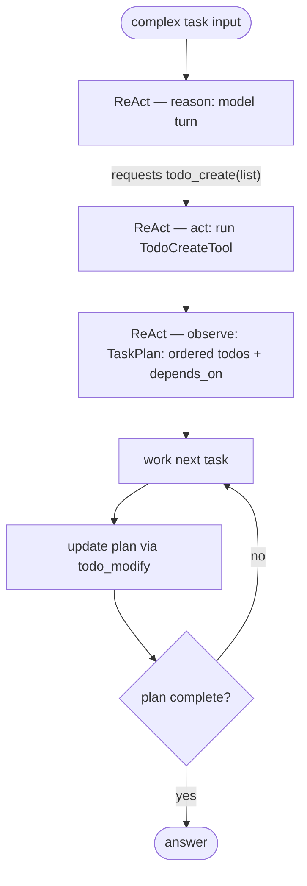

Anchors

<strong>Anchors:</strong> &bull; <code>agent-core/openjiuwen/harness/tools/todo.py:193</code> — <code>TodoCreateTool</code> &bull; <code>agent-core/openjiuwen/harness/tools/todo.py:113</code> — per-session <code>todo.json</code> &bull; <code>agent-core/openjiuwen/harness/schema/task.py:97</code> — <code>TaskPlan</code> &bull; <code>agent-core/openjiuwen/harness/rails/task_planning_rail.py:31/108/152</code> — rail, tool registration, guidance &bull; <code>agent-core/openjiuwen/harness/rails/agent_mode_rail.py:645</code> — plan-mode <code>task_tool</code>

_Canonical source: `source/ai-agent-interview-questions_for_engineers.md`; also covered in: ai-agent._

---

## 2. How do you handle a task where the plan needs to change mid-execution based on a tool's result

**General:** Allow plan mutation during the run: the agent can add, reorder, cancel, or replace tasks, and can be steered by new instructions. Track the authoritative plan separately from the live state so they can be reconciled.

**Jiuwen:** Several mechanisms. `TodoModifyTool` supports update/delete/cancel/append/insert operations with a single-in-progress invariant. `TaskPlanningRail._sync_todos_from_plan` reconciles todos against the authoritative `TaskPlan` each outer round. Steering messages inject new instructions and are drained before each model call. Mode transitions enter/exit plan with an approval gate.

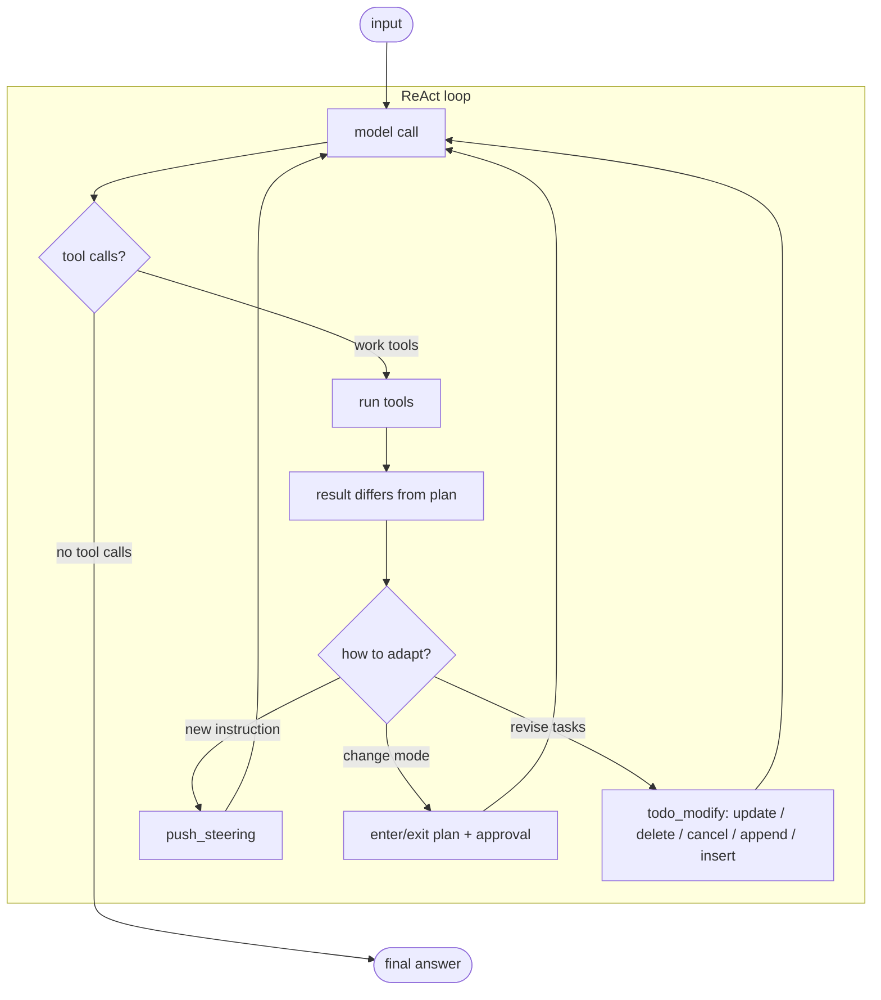

Anchors

<strong>Anchors:</strong> &bull; <code>agent-core/openjiuwen/harness/tools/todo.py:473</code> — <code>TodoModifyTool</code> operations &bull; <code>agent-core/openjiuwen/harness/tools/todo.py:621</code> — single-in-progress invariant &bull; <code>agent-core/openjiuwen/harness/rails/task_planning_rail.py:320</code> — reconcile todos from plan &bull; <code>agent-core/openjiuwen/core/single_agent/agents/react_agent.py:2756</code> — drain steering before model call &bull; <code>agent-core/openjiuwen/core/single_agent/rail/base.py:687</code> — <code>ctx.push_steering</code> &bull; <code>agent-core/openjiuwen/harness/rails/agent_mode_rail.py:460</code> — enter/exit plan gate &bull; <code>jiuwenswarm/jiuwenswarm/agents/harness/code/rails/code_plan_approval_rail.py:74</code> — product plan-approval rail

_Canonical source: `source/ai-agent-interview-questions_for_engineers.md`; also covered in: ai-agent._

---

## 3. What's the difference between a single-step agent and a multi-step planning agent

> **Note on the wording:** the question conflates two independent axes. **Number of steps** (single vs multi) is separate from **whether an explicit plan exists** (reactive vs planning). A multi-step agent does not have to plan — a plain ReAct loop takes many steps reactively, with no plan artifact.

**General:** Two axes, not one. *Single-step vs multi-step* is how many model↔tool cycles run. *Reactive vs planning* is whether the agent keeps an explicit plan (a todo list / task plan) that it creates up front and updates as it goes. Planning normally implies multi-step, but multi-step does not imply planning.

| | No explicit plan (reactive) | Explicit plan (planning) |
|---|---|---|
| Single-step | one model call (+ maybe one tool) | not meaningful — a plan implies multiple steps |
| Multi-step | ReAct loop; next action chosen each turn | plan/todo maintained and progress tracked |

**What "reactive" means here:** a *reactive* agent chooses its next action **only from the last observation** — it looks one step ahead, not N steps ahead, and commits to nothing up front. This is the default ReAct behavior, and it is relevant because most tasks never need an up-front plan: the tool results themselves drive the next move. Planning becomes relevant when the task has many dependent steps, needs global coherence, or the user must see/approve the plan before work starts.

| Reactive fits | Planning fits |
|---|---|
| Short or exploratory tasks | Long, many-step tasks with dependencies |
| The next step depends on live results | The overall shape must be fixed up front |
| No need to show a plan to the user | The user must review/approve the plan |
| Cheap, little coordination | Needs progress tracking and drift resistance |

**Jiuwen:** Jiuwen keeps the two axes as separate layers. `ReActAgent` is multi-step **reactive**: it loops (bounded by `max_iterations`) with no explicit plan. Planning is an *additive* rail: `TaskPlanningRail` registers the todo tools and `TaskPlan` persists an ordered plan. `DeepAgent`'s outer task loop is multi-step **with** planning: each outer round runs a full inner `react_agent.invoke`, while the persistent `TaskPlan`/todos carry state between rounds and `TaskCompletionRail` bounds the loop. So "multi-step" and "planning" are orthogonal.

**Single-step (no loop):**

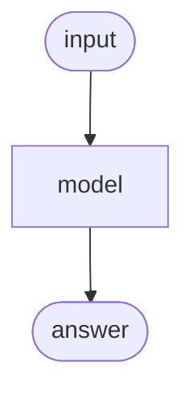

**Multi-step, reactive (no explicit plan):** each turn's tool result is the only input to the next decision; no plan is carried across turns.

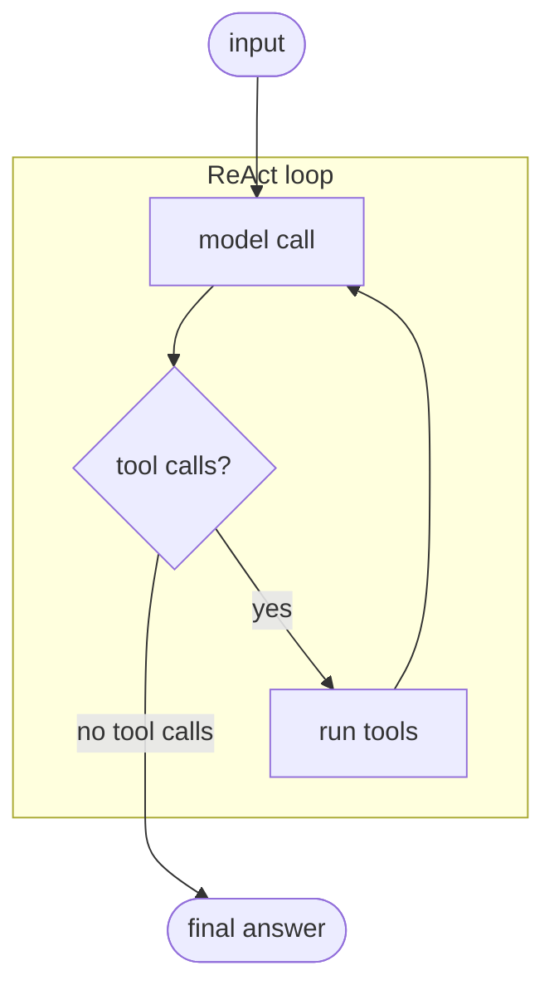

**Multi-step, planning (explicit plan):** the model's answer may *request* a `todo_create` tool call, which the ReAct loop then executes to create a persistent plan; the plan is worked task by task. *How it knows to plan:* `TaskPlanningRail` registers the todo tools and injects a planning prompt before each model call, so the model sees both the tools and the instruction — and its answer requests the tool call.

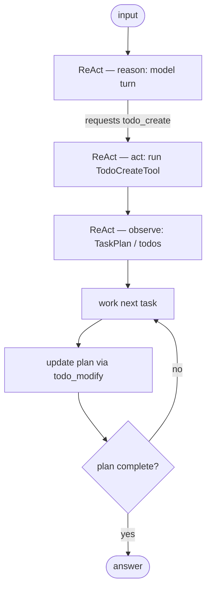

Anchors

<strong>Anchors:</strong> &bull; <code>agent-core/openjiuwen/core/single_agent/agents/react_agent.py:2740</code> — multi-step reactive loop &bull; <code>agent-core/openjiuwen/core/single_agent/agents/react_agent.py:288</code> — iteration bound &bull; <code>agent-core/openjiuwen/harness/rails/task_planning_rail.py:31</code> — planning layer (additive) &bull; <code>agent-core/openjiuwen/harness/rails/task_planning_rail.py:108/152</code> — registers todo tools, injects planning prompt &bull; <code>agent-core/openjiuwen/harness/tools/todo.py:193</code> — <code>TodoCreateTool</code> writes <code>todo.json</code> &bull; <code>agent-core/openjiuwen/harness/schema/task.py:97</code> — <code>TaskPlan</code> &bull; <code>agent-core/openjiuwen/harness/deep_agent.py:2694</code> — multi-step + planning (outer loop) &bull; <code>agent-core/openjiuwen/harness/task_loop/task_loop_event_executor.py:222</code> — one outer round = one inner invoke &bull; <code>agent-core/openjiuwen/harness/rails/task_completion_rail.py:74</code> — completion rail bounds the loop

_Canonical source: `source/ai-agent-interview-questions_for_engineers.md`; also covered in: ai-agent._

---

## 4. What's the planner-executor pattern, and when do you need it

**General:** A planner produces the plan/steps; one or more executors carry them out, often with a supervisor re-planning. Useful when planning needs a global view while execution is parallelizable or specialized, and when separating "decide" from "do" improves reliability.

**Jiuwen:** Three patterns exist. (a) Scheduled-dispatch leader: `TeamScheduler` scans the task board and dispatches assigned pending tasks to idle members, then reviews. (b) Supervisor routing: `HierarchicalTeam` sends to a `SupervisorAgent` that calls sub-agents-as-tools via `P2PAbilityManager`. (c) A dedicated plan subagent invoked via `task_tool`.

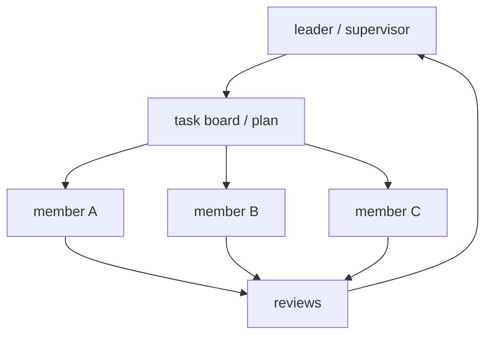

Anchors

<strong>Anchors:</strong> &bull; <code>agent-core/openjiuwen/agent_teams/agent/scheduling/scheduler.py:92/208/239</code> — <code>TeamScheduler</code> scan/dispatch/review &bull; <code>agent-core/openjiuwen/core/multi_agent/teams/hierarchical_msgbus</code> — supervisor routing &bull; <code>agent-core/openjiuwen/harness/subagents/plan_agent.py:88</code> — dedicated plan subagent

_Canonical source: `source/ai-agent-interview-questions_for_engineers.md`; also covered in: ai-agent._

---

## 5. How does a framework track state across multiple steps in an agent's execution

**General:** A state object (dict or dataclass) is threaded through the steps or held per session; each node reads and writes it. Conversation history is usually separate from working state. Frameworks persist state via checkpoints so a run can be resumed or audited.

**Jiuwen:** State lives in three layers that are checkpointed independently. The agent layer uses `StateCollection` (a `global_state` + `agent_state`) inside `AgentSession`. The workflow layer uses a different `StateCollection` split into `io_state`, `global_state`, `comp_state`, and `workflow_state`. Conversation history is a separate `ContextMessageBuffer` inside `SessionModelContext`, flushed to session global state by `ContextEngine.save_contexts`. Graph execution adds a third layer — `GraphState` (step, channel snapshot, pending buffer/nodes, node versions) persisted through a `Store`/checkpointer keyed by `(session_id, ns)` and restored in `PregelLoop.init`.

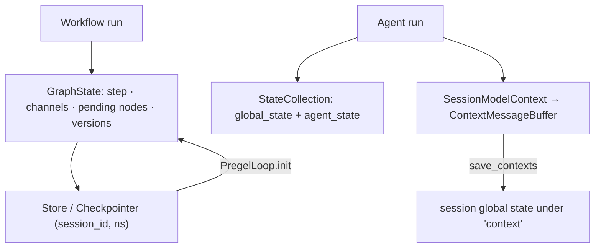

Anchors

<strong>Anchors:</strong> &bull; <code>agent-core/openjiuwen/core/session/internal/agent.py:36</code> — <code>AgentSession.__init__</code> creates <code>StateCollection</code>; <code>:74</code> <code>create_workflow_session</code> passes global state into <code>InMemoryState</code> &bull; <code>agent-core/openjiuwen/core/session/state/agent_state.py:9</code> — agent <code>StateCollection</code>; <code>:34</code> <code>get_state</code> &bull; <code>agent-core/openjiuwen/core/session/state/workflow_state.py:12</code> — workflow <code>StateCollection</code> (io/global/comp/workflow); <code>:100</code> <code>get_workflow_state</code>; <code>:151</code> <code>get_state</code> &bull; <code>agent-core/openjiuwen/core/context_engine/context/context.py:64</code> — <code>SessionModelContext</code>; <code>:1519</code> <code>save_state()</code>; <code>:1526</code> <code>load_state</code> &bull; <code>agent-core/openjiuwen/core/graph/store/base.py:31</code> — <code>GraphState</code> dataclass; <code>:41</code> <code>Store</code> ABC &bull; <code>agent-core/openjiuwen/core/graph/pregel/engine.py:39</code> — <code>PregelLoop.init</code> reads saved state; <code>:44</code> restore path &bull; <code>agent-core/openjiuwen/core/session/checkpointer/persistence.py:299</code> — <code>_get_state_to_save</code>; <code>:352</code> <code>WorkflowStorage.save</code> &bull; <code>agent-core/openjiuwen/core/context_engine/context_engine.py:589</code> — <code>save_contexts</code>

**Gap.** Two different classes are both named `StateCollection` (agent vs workflow) with different shapes. Context messages are persisted only on explicit `save_contexts`/compression, not every step, so a crash between saves loses in-memory turns. `InMemoryState.set_state` silently ignores empty state, which can mask empty restores.

_Canonical source: `source/ai-agent-framework-interview-questions_for_engineers.md`; also covered in: framework._

---

## 6. How would you pause an agent mid-execution and resume it later with the same state

**General:** Pause requires either a durable checkpoint at a safe boundary or a first-class interrupt/suspend signal that unwinds the run while preserving state. Resume reloads the checkpoint (or replays the suspended step) and continues. The hard part is non-idempotent side effects: replay must be safe.

**Jiuwen:** Two mechanisms. *Interrupt rails* abort the current tool call by raising `AbortError(cause=ToolInterruptException(...))`; the callback framework re-raises the cause, the ReAct loop catches it, and `ToolInterruptHandler.commit_interrupt` saves conversation context plus a `ToolInterruptionState` into session state, returning an `INTERACTION` result. On resume, `handle_resume` replays the interrupted tool calls with the user's `InteractiveInput`. *Workflow/graph* pause uses checkpointing: `CompiledGraph._invoke` calls `checkpointer.pre_workflow_execute` (recover or require input) and `post_workflow_execute` (save on interrupt, clear on completion); `PregelLoop` snapshots channels/pending nodes on error and restores them in `init`; provider harnesses expose explicit `pause()`/`resume()` gated on `HarnessCapability.PAUSE_RESUME`.

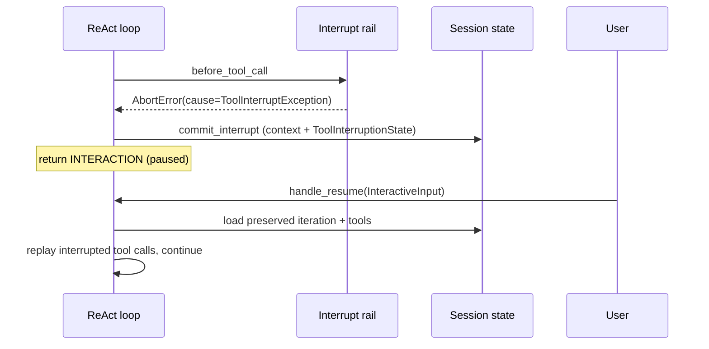

Anchors

<strong>Anchors:</strong> &bull; <code>agent-core/openjiuwen/harness/rails/interrupt/interrupt_base.py:237</code> — <code>_raise_interrupt</code>; <code>:243</code> raises <code>AbortError(cause=ToolInterruptException)</code>; re-raised at <code>agent-core/openjiuwen/core/runner/callback/framework.py:1172</code> &bull; <code>agent-core/openjiuwen/core/single_agent/interrupt/handler.py:279</code> — <code>commit_interrupt</code>; <code>:310</code> <code>handle_resume</code>; <code>:326</code> uses preserved <code>state.iteration</code> &bull; <code>agent-core/openjiuwen/core/single_agent/interrupt/state.py:32</code> — <code>ToolInterruptionState</code> &bull; <code>agent-core/openjiuwen/core/session/checkpointer/persistence.py:803</code> — <code>pre_workflow_execute</code>; <code>:824</code> recover on <code>InteractiveInput</code>; <code>:860</code> <code>post_workflow_execute</code>; <code>:876</code> save on <code>TASK_STATUS_INTERRUPT</code> &bull; <code>agent-core/openjiuwen/core/graph/graph.py:315</code> — <code>CompiledGraph._invoke</code>; <code>:326</code> pre; <code>:334</code> <code>pregel.run</code>; <code>:346</code> post &bull; <code>agent-core/openjiuwen/core/graph/pregel/engine.py:45</code> — <code>_is_resume</code>; <code>:174</code> <code>_save_state_on_error</code>; <code>:39</code> restore in <code>init</code> &bull; <code>agent-core/openjiuwen/core/context_engine/context/context.py:1519/1526</code> — <code>save_state</code>/<code>load_state</code> &bull; <code>agent-core/openjiuwen/harness/deep_agent.py:2491/2516</code> — <code>load_state</code>/<code>save_state</code>; <code>agent-core/openjiuwen/harness_providers/io_adapter.py:299/308</code> — <code>pause()</code>/<code>resume()</code>

**Gap.** Graph state is checkpointed only on error/interrupt, not after every successful super-step, so a hard crash mid-step loses that step. `CompiledGraph.interrupt()` is a no-op stub. The DeepAgent outer task loop explicitly does not support pause (`can_pause` returns `False`); only "resume continuation" re-entry exists. No in-flight asyncio task/stack is serialized — resume replays from channel/message snapshots and re-executes nodes, so non-idempotent side effects must be tolerated.

_Canonical source: `source/ai-agent-framework-interview-questions_for_engineers.md`; also covered in: framework._

---

## 7. How would you add human-in-the-loop approval before a specific step executes

**General:** Route sensitive steps through a permission check that returns allow/ask/deny, pause on ask, surface a confirm payload, resume with the decision, and optionally remember or persist allow rules. Fail closed: unknown should mean "ask", not "allow".

**Jiuwen:** Tool execution passes through `PermissionInterruptRail` (subclass of `ConfirmInterruptRail` ← `BaseInterruptRail`), which overrides `before_tool_call` and intercepts **every** tool. On first entry it calls `PermissionEngine.check_permission`, which merges the tiered tool policy, file guard, and net guard with "strictest wins" and returns `ALLOW`/`ASK`/`DENY`. `ALLOW` approves; `DENY` returns a synthetic `[PERMISSION_DENIED]` tool result; `ASK` either hits a session auto-confirm key, delegates to a hosted confirmation callback, or raises `AbortError(cause=ToolInterruptException(ConfirmPayload.to_schema()))` to pause. Resume parses a `ConfirmPayload` (`approved`, `feedback`, `auto_confirm`, `persist_allow`); the rail can remember session-scoped or persist an allow rule. Plan-mode exit uses a separate `PlanApprovalRail`, and `AskUserRail` reuses the same mechanism for `ask_user`.

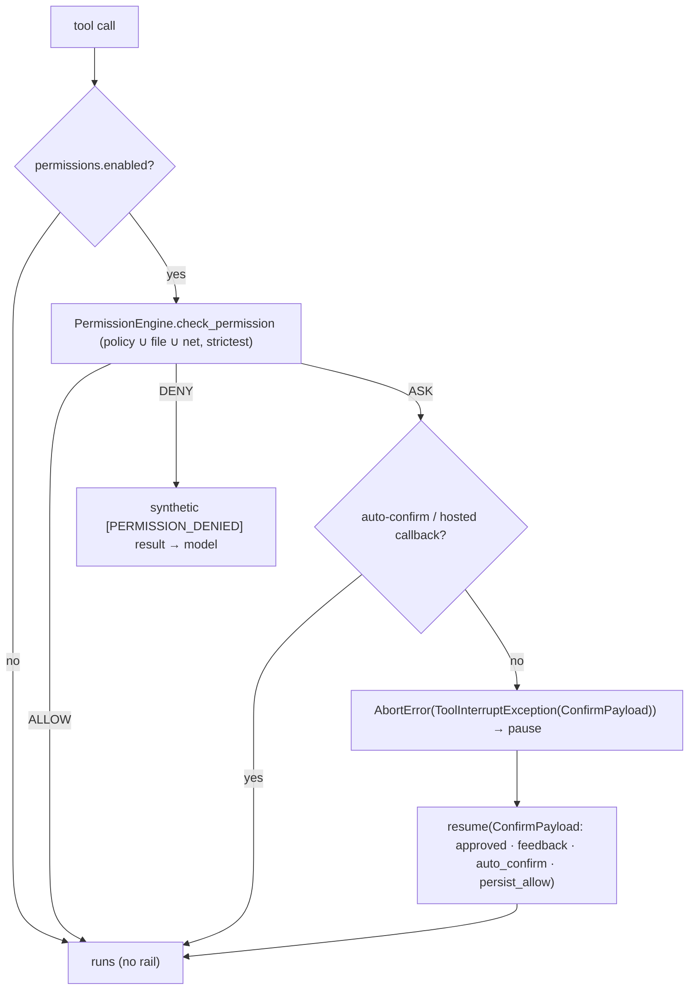

Anchors

<strong>Anchors:</strong> &bull; <code>agent-core/openjiuwen/harness/rails/security/tool_security_rail.py:57</code> — <code>PermissionInterruptRail</code>; <code>:186</code> <code>before_tool_call</code>; <code>:404</code> <code>resolve_interrupt</code>; <code>:486</code> ALLOW; <code>:494</code> DENY; <code>:510-563</code> hosted confirm + persist; <code>:594-598</code> ASK → interrupt; <code>:729</code> <code>_store_auto_confirm</code> &bull; <code>agent-core/openjiuwen/harness/security/permission_engine/core.py:272</code> — <code>check_permission</code>; <code>:414</code> <code>build_permission_interrupt_rail</code>; <code>:426</code> <code>permissions.enabled</code> gate &bull; <code>agent-core/openjiuwen/harness/security/permission_engine/toolguard/tool_policy.py:588</code> — <code>evaluate_tiered_policy</code>; <code>:502</code> ASK fallback; <code>:385</code> DENY precedence &bull; <code>agent-core/openjiuwen/harness/security/permission_engine/models.py:19</code> — <code>PermissionLevel</code>; <code>:52</code> <code>PermissionConfirmResponse</code> &bull; <code>agent-core/openjiuwen/harness/rails/interrupt/interrupt_base.py:243</code> — <code>_raise_interrupt</code>; <code>:248</code> <code>_skip_tool</code>; <code>:269</code> <code>_get_user_input</code> &bull; <code>agent-core/openjiuwen/harness/rails/interrupt/confirm_rail.py:16</code> — <code>ConfirmPayload</code>; <code>:57</code> <code>resolve_interrupt</code> &bull; <code>agent-core/openjiuwen/core/single_agent/interrupt/handler.py:310</code> — <code>handle_resume</code>; <code>:358</code> re-commit; <code>:384</code> restore auto-confirm &bull; <code>agent-core/openjiuwen/harness/deep_agent.py:767-782</code> — auto-mount when <code>permissions["enabled"]</code>; <code>jiuwenswarm/jiuwenswarm/agents/harness/code/rails/code_plan_approval_rail.py:74</code> — <code>PlanApprovalRail</code>; <code>agent-core/openjiuwen/harness/rails/interrupt/ask_user_rail.py:29</code> — <code>AskUserRail</code>

**Gap.** The whole permission path is opt-in: `build_permission_interrupt_rail` returns `None` unless `permissions.enabled` is truthy, and `check_permission` short-circuits to ALLOW when the engine is disabled. There is no class literally named `ToolSecurityRail` — the file is `tool_security_rail.py` but the class is `PermissionInterruptRail`. Permanent persist falls back to writing YAML only when no host hook is supplied. `PlanApprovalRail` is not an interrupt — it stores pending state and appends a marker; enforcement lives in the product server layer.

_Canonical source: `source/ai-agent-framework-interview-questions_for_engineers.md`; also covered in: framework, ai-agent._

---

## 8. What's the difference between short-term and long-term memory in an agent

**General:** Short-term is the live working context (recent turns, current task state) needed for the next model call. Long-term is durable knowledge distilled across sessions — facts, preferences, summaries — retrieved on demand.

**Jiuwen:** Short-term is `SessionModelContext` with a bounded message buffer. Long-term is `LongTermMemory`, with a typed taxonomy (`VARIABLE`, `USER_PROFILE`, `SEMANTIC_MEMORY`, `EPISODIC_MEMORY`, `SUMMARY`). The product adds a SQLite/FTS5 hybrid index over markdown memory files.

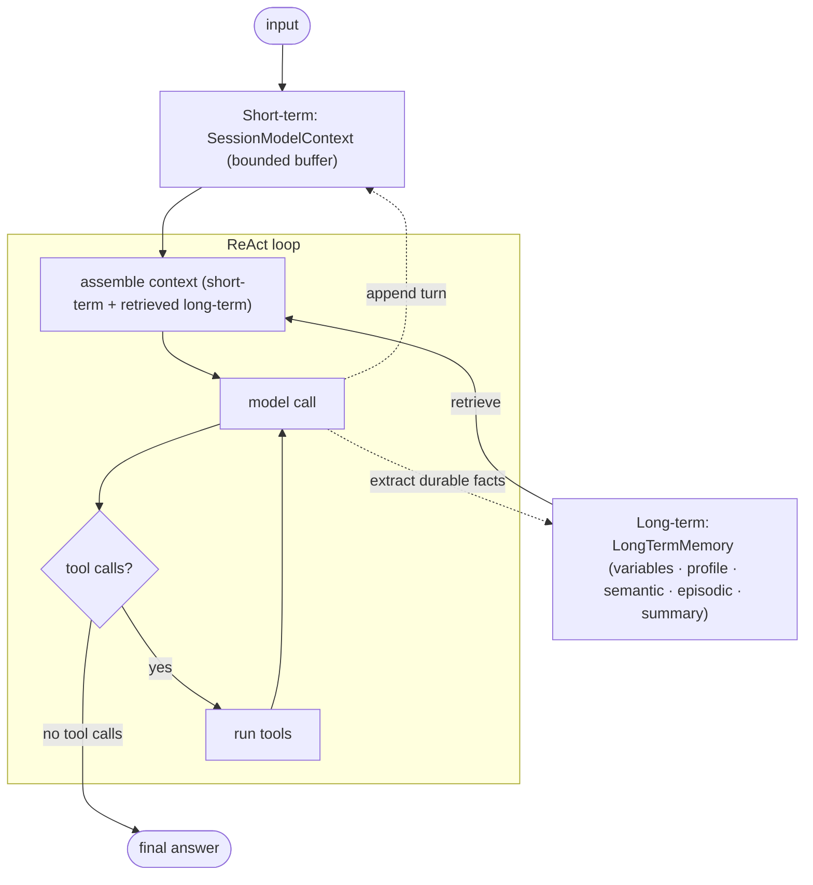

Anchors

<strong>Anchors:</strong> &bull; <code>agent-core/openjiuwen/core/context_engine/context/context.py:44</code> — <code>SessionModelContext</code> &bull; <code>agent-core/openjiuwen/core/context_engine/context/message_buffer.py:11</code> — <code>ContextMessageBuffer</code> &bull; <code>agent-core/openjiuwen/core/memory/long_term_memory.py:69</code> — <code>LongTermMemory</code> &bull; <code>agent-core/openjiuwen/core/memory/manage/mem_model/memory_unit.py</code> — memory type taxonomy &bull; <code>jiuwenswarm/jiuwenswarm/agents/harness/common/memory/manager.py:56</code> — product hybrid memory index

_Canonical source: `source/ai-agent-interview-questions_for_engineers.md`; also covered in: ai-agent._

---

## 9. How do you decide what to store in memory versus what to discard

**General:** Keep durable, reused, preference-like, and decision-relevant facts; discard transient chatter, redundant restatements, and stale/contradicted entries. Most systems extract candidates with an LLM, then dedupe and resolve conflicts against existing memory.

**Jiuwen:** An LLM classifier decides whether a turn has key information, and extraction runs only if flagged. Writes dedupe and resolve conflicts: `FragmentMemoryManager.add_memories` searches related old memories, invokes `MemUpdateChecker` (REDUNDANT/CONFLICTING/NONE), deletes redundant/conflicting IDs, and adds survivors. The product's sweeper prompt explicitly treats "output [] as the norm" and forbids generic/static facts.

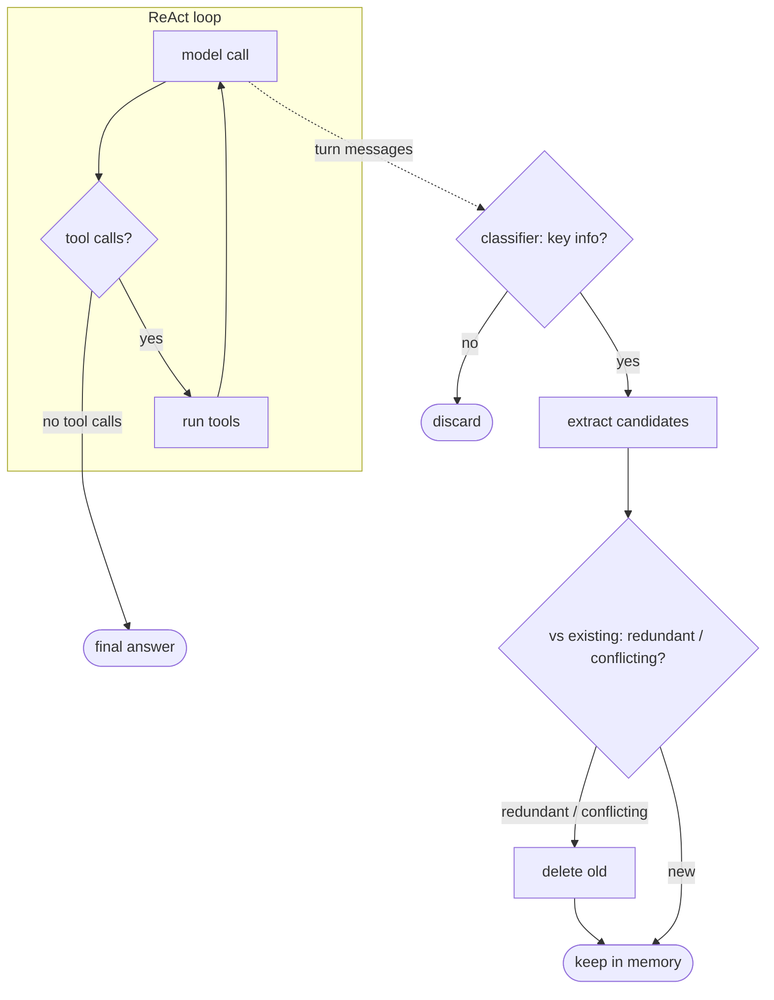

Anchors

<strong>Anchors:</strong> &bull; <code>agent-core/openjiuwen/core/memory/process/extract/memory_analyzer.py:26</code> — key-information classifier &bull; <code>agent-core/openjiuwen/core/memory/process/extract/generation.py:102</code> — extraction gated on the classifier &bull; <code>agent-core/openjiuwen/core/memory/manage/index/fragment_memory_manager.py:125</code> — dedupe + conflict resolution &bull; <code>agent-core/openjiuwen/core/memory/manage/update/mem_update_checker.py:22</code> — <code>CheckResult</code> &bull; <code>jiuwenswarm/jiuwenswarm/agents/harness/common/memory/dreaming/sweeper.py:617</code> — discard rules

_Canonical source: `source/ai-agent-interview-questions_for_engineers.md`; also covered in: ai-agent._

---

## 10. How do you prevent memory from growing unbounded across a long session

**General:** Bound it on multiple axes: hard-drop or truncate the oldest context, offload large blobs, compact old tool results, summarize and archive, and cap the number of stored long-term entries.

**Jiuwen:** A bounded FIFO buffer drops the oldest messages beyond twice the limit. Budget guarding truncates oversized content with head/tail previews. Offloaders move large messages and tool results out of context. Compactors run at token thresholds. Long-term promotion is capped per session.

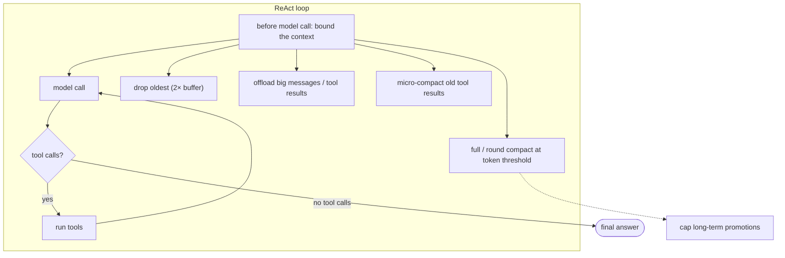

Anchors

<strong>Anchors:</strong> &bull; <code>agent-core/openjiuwen/core/context_engine/context/message_buffer.py:71</code> — drop oldest beyond 2× &bull; <code>agent-core/openjiuwen/core/context_engine/processor/budget_guard.py:88</code> — head/tail truncation &bull; <code>agent-core/openjiuwen/core/context_engine/processor/offloader/message_offloader.py:71</code> — offload large messages &bull; <code>agent-core/openjiuwen/core/context_engine/processor/offloader/tool_result_budget_processor.py:81</code> — tool-result budget &bull; <code>agent-core/openjiuwen/core/context_engine/processor/compressor/micro_compact_processor.py:47</code> — micro compaction &bull; <code>agent-core/openjiuwen/core/context_engine/processor/compressor/full_compact_processor.py:183</code> — full compaction &bull; <code>agent-core/openjiuwen/core/context_engine/processor/compressor/round_level_compressor.py:96</code> — round compaction &bull; <code>jiuwenswarm/jiuwenswarm/agents/harness/common/memory/dreaming/sweeper.py:36</code> — per-session promotion caps

_Canonical source: `source/ai-agent-interview-questions_for_engineers.md`; also covered in: ai-agent._

---

## 11. How would you summarize conversation history without losing important details

**General:** Keep the most recent turns verbatim, summarize older turns into a structured note (goal, decisions, files/state, open tasks, next step) rather than free prose, and re-inject the durable state (plan, task status, key artifacts) separately so it is not lost inside a summary. Boundary markers separate summary from live turns, and the summary should be updated incrementally so each pass only processes new messages.

**Jiuwen:** Compaction replaces the active segment with a structured summary plus a boundary `SystemMessage`, then re-injects high-value state as separate `UserMessage` blocks: plan/task status, recent skill-read rounds, read-file snapshots, and the team collaboration policy (returned as messages so they escape `state_snapshot_max_chars` truncation). `FullCompactProcessor` uses a 9-section summary prompt and boundary markers (`[FULL_COMPACT_BOUNDARY]`, `[FULL_COMPACT_STATE]`, `[SESSION_MEMORY_BOUNDARY]`). The session-memory path runs a background updater triggered at 0.7×context window, summarizes only completed API rounds, writes to a pending file and atomically renames on commit, and records `notes_upto_message_id` so only un-summarized messages are processed next time.

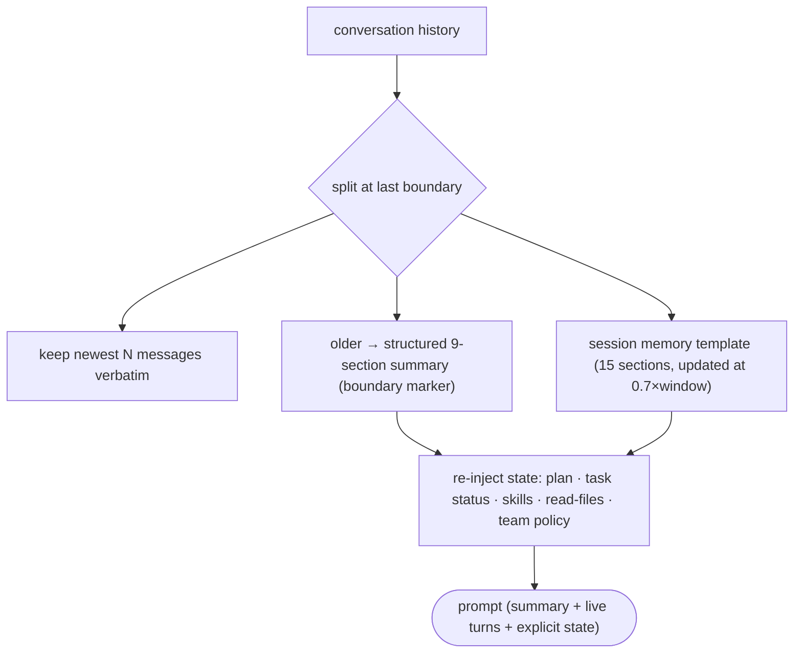

Anchors

<strong>Anchors:</strong> &bull; <code>agent-core/openjiuwen/core/context_engine/processor/compressor/full_compact_processor.py:69</code> — <code>BASE_COMPACT_PROMPT</code>; <code>:167</code> boundary markers; <code>:342</code> <code>_build_replacement_messages()</code>; <code>:774</code> <code>build_reinjected_state_messages()</code> &bull; <code>agent-core/openjiuwen/core/context_engine/processor/compressor/util.py:242</code> — <code>build_skill_reinjected_content()</code>; <code>:294</code> <code>build_task_status_reinjected_content()</code>; <code>:105</code> <code>build_team_policy_reinjected_messages()</code> &bull; <code>agent-core/openjiuwen/core/context_engine/context/session_memory_manager.py:37</code> — 15-section template; <code>:738</code> <code>should_update()</code>; <code>:824</code> <code>_update_background()</code>; <code>:529</code> <code>invalidate_session_memory_anchor()</code> &bull; <code>agent-core/openjiuwen/core/context_engine/processor/forked/compressor/reinjection/builders.py:29</code> — forked reinjection builders

**Gap.** The non-session-memory fallback re-injects only plan/skills/task status; `build_plan_reinjected_content` in the non-forked `util.py` is a stub returning `""`. No automatic verification that the summary retained all critical facts beyond the prompt's structured sections.

_Canonical source: `source/llm-fundamentals-interview-questions_for_engineers.md`; also covered in: ai-agent, llm-fund._

---

## 12. Planner–executor pattern

**General:** a planner breaks a complex request into subtasks; one or more executors carry each out; results are combined into a final response. Common in multi-step agent systems. Used for: research assistants, report generation, multi-source data analysis.

**Jiuwen:** Two paths. `DeepAgent`'s outer task loop runs a full inner ReAct invoke per round while a persistent `TaskPlan`/todos carry state; `TaskPlanningRail` registers the todo tools and injects planning guidance (`Plan` mode adds a `task_tool` to delegate). `agent_teams` adds supervisor/leader decomposition, and a dedicated plan subagent exists.

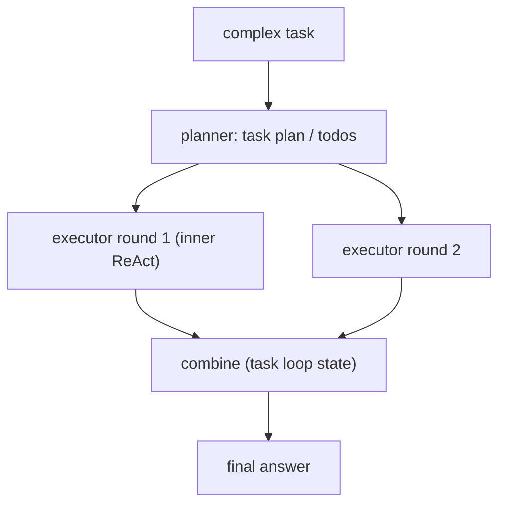

Anchors

<strong>Anchors:</strong> &bull; <code>agent-core/openjiuwen/harness/deep_agent.py:2694</code> — outer task loop &bull; <code>agent-core/openjiuwen/harness/rails/task_planning_rail.py:31/108</code> — planning layer + todo tools &bull; <code>agent-core/openjiuwen/harness/tools/todo.py:193</code> — <code>TodoCreateTool</code> &bull; <code>agent-core/openjiuwen/harness/tools/subagent/task_tool.py:194/657</code> — subagent delegation &bull; <code>agent-core/openjiuwen/core/multi_agent/teams/hierarchical_tools/hierarchical_team.py:101/108</code> — supervisor (agents-as-tools); <code>agent-core/openjiuwen/harness/subagents/plan_agent.py:88</code> — plan subagent

---

## 13. Critic or reflection loop

**General:** a self-check before returning. The primary agent drafts; a critic reviews it against the request or rules; if it fails, the primary revises. Adds a verification step for high-stakes output. Used for: financial summaries, compliance checks, high-stakes outputs where a wrong answer is costly.

**Jiuwen:** There is no generic draft→critique→revise loop in the single-agent ReAct path, but the pieces exist: a **verification agent** restricted to read-only tools that must show verbatim evidence and emit PASS/FAIL/PARTIAL; an `agent_teams` reviewer that scores `Correctness`/completeness with rework thresholds; and the RSI weighted-rubric judge. These run as separate review layers, not as an in-loop reflection that blocks generation.

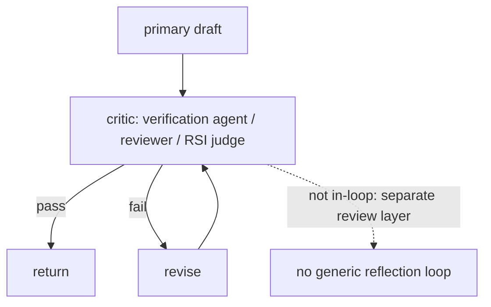

Anchors

<strong>Anchors:</strong> &bull; <code>agent-core/openjiuwen/harness/rails/subagent/verification_rail.py:92</code> — <code>VerificationRail</code> allowlist; <code>agent-core/openjiuwen/harness/subagents/verification_agent.py:51</code> — PASS/FAIL/PARTIAL &bull; <code>agent-core/openjiuwen/agent_teams/verification/reviewer.py:26/43/279</code> — review dimensions + rework thresholds &bull; <code>agent-core/openjiuwen/rsi/harness_rsi/evaluator/judger/scoring.py:193</code> — weighted rubric judge

---

## 14. Memory-augmented agent

**General:** context across sessions, not just one conversation. Short-term memory is the active context window; long-term memory is a vector store/DB of past interactions; retrieval decides what long-term memory is relevant to the current turn. Used for: personal assistants, customer support.

**Jiuwen:** Short-term is `SessionModelContext` with a bounded `ContextMessageBuffer`; long-term is `LongTermMemory` with a typed taxonomy, and the product adds a SQLite/FTS5 hybrid index over markdown memory files. Retrieval-into-turn is a tool the model calls (`memory_search`), and `MemoryRail` suppresses it when daily memory is auto-loaded.

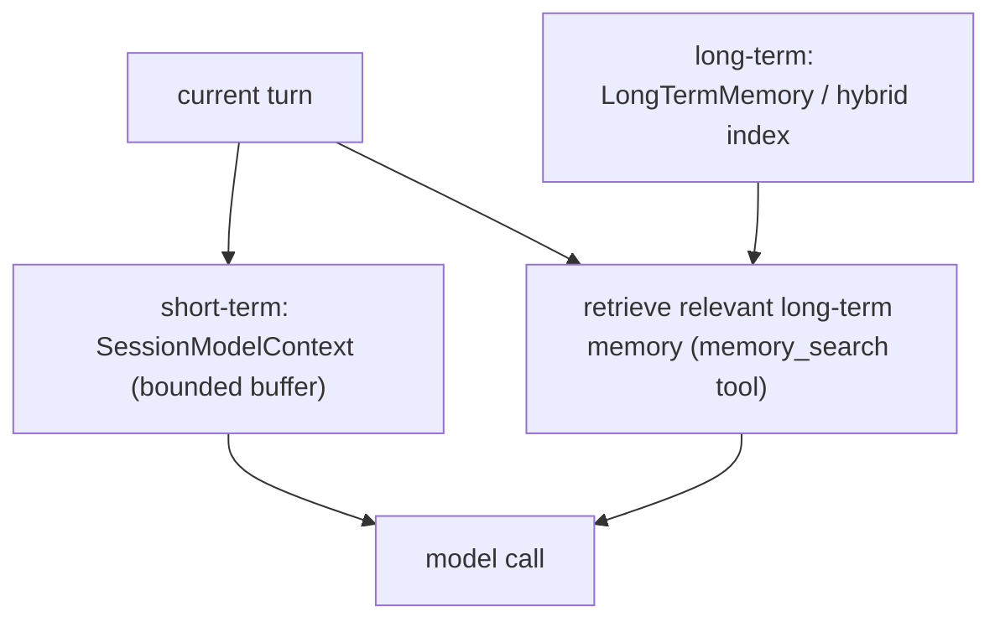

Anchors

<strong>Anchors:</strong> &bull; <code>agent-core/openjiuwen/core/context_engine/context/context.py:44</code> — <code>SessionModelContext</code>; <code>agent-core/openjiuwen/core/context_engine/context/message_buffer.py:11</code> — <code>ContextMessageBuffer</code> &bull; <code>agent-core/openjiuwen/core/memory/long_term_memory.py:69</code> — <code>LongTermMemory</code> &bull; <code>jiuwenswarm/jiuwenswarm/agents/harness/common/memory/manager.py:183/805</code> — product hybrid index &bull; <code>jiuwenswarm/jiuwenswarm/agents/harness/common/tools/memory_tools.py:167</code> — <code>memory_search</code>; <code>agent-core/openjiuwen/harness/prompts/sections/memory.py:14</code> — when to call

---

## 15. How do you detect and prevent memory contamination — an agent remembering incorrect facts?

**General:** Memory contamination happens when wrong or hallucinated facts are written to long-term memory and then retrieved into future turns, compounding errors. Prevention: write to memory only from verified/confirmed outputs (not raw model scratchpads); tag memory entries with provenance (source, confidence, timestamp); implement targeted invalidation — delete or overwrite specific wrong entries by key rather than wiping all memory; use versioning so you can roll back. Detection: run a periodic audit query that cross-checks stored facts against the authoritative source.

**Jiuwen:** `LongTermMemory` stores typed memory units with metadata fields (category, source). Memory is written by the agent via `MemoryRail` and the `memory_write` / `memory_update` tools. There is no confidence gate before writing — any output the model chooses to commit is stored. `memory_update` allows targeted overwrite of an existing entry by `id`, which is the closest analogue to targeted invalidation; a full category wipe is `memory_delete_by_category`. There is no versioning or provenance chain, no periodic audit loop, and no automatic invalidation when the retrieval pipeline returns a conflicting fact.

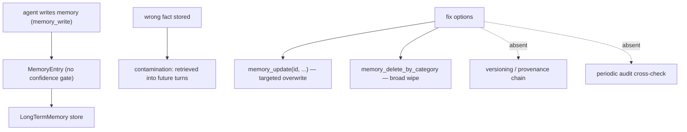

Anchors

<strong>Anchors:</strong> &bull; <code>agent-core/openjiuwen/core/memory/long_term_memory.py:69</code> — <code>LongTermMemory</code> and entry schema &bull; <code>jiuwenswarm/jiuwenswarm/agents/harness/common/tools/memory_tools.py:167</code> — <code>memory_write</code>/<code>memory_update</code>/<code>memory_delete_by_category</code> &bull; <code>jiuwenswarm/jiuwenswarm/agents/harness/common/rails/memory_forbidden_rail.py:1</code> — memory suppression gate &bull; <code>agent-core/openjiuwen/harness/prompts/sections/memory.py:14</code> — when/what to write

**Gap.** No confidence gate before memory write, no versioning or provenance tracking, no audit loop, and no automatic invalidation on conflict detection.

_Canonical source: `source/agent-failure-patterns_for_engineers.md`; also covered in: agent-failure._