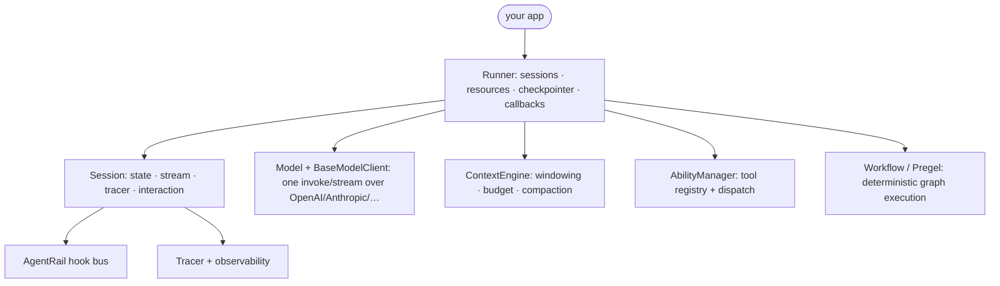
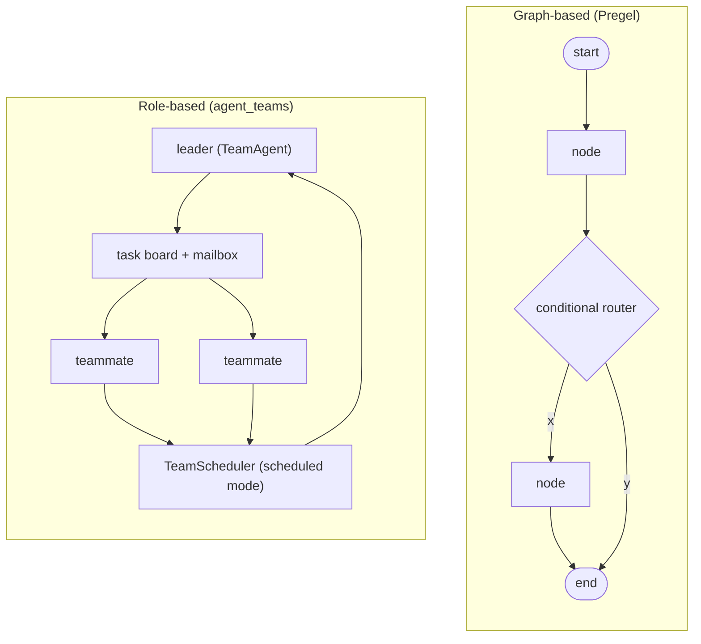
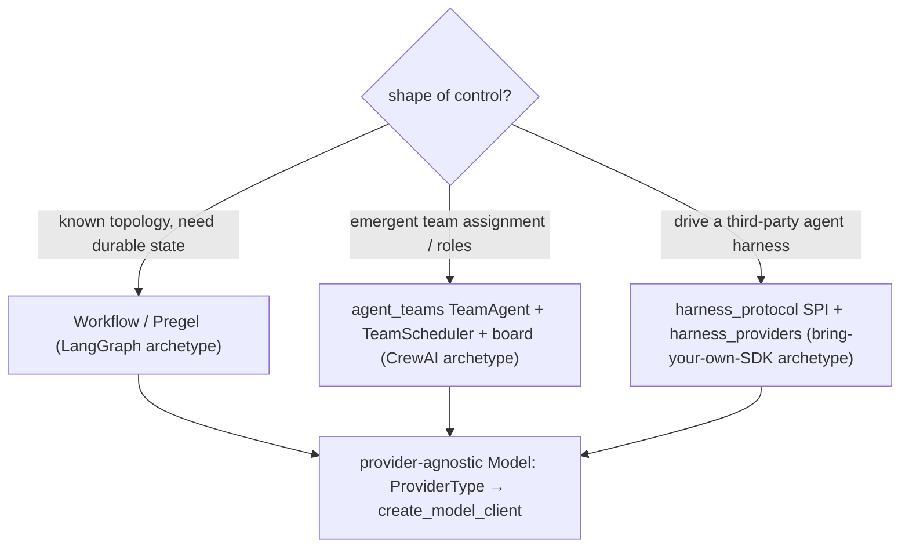
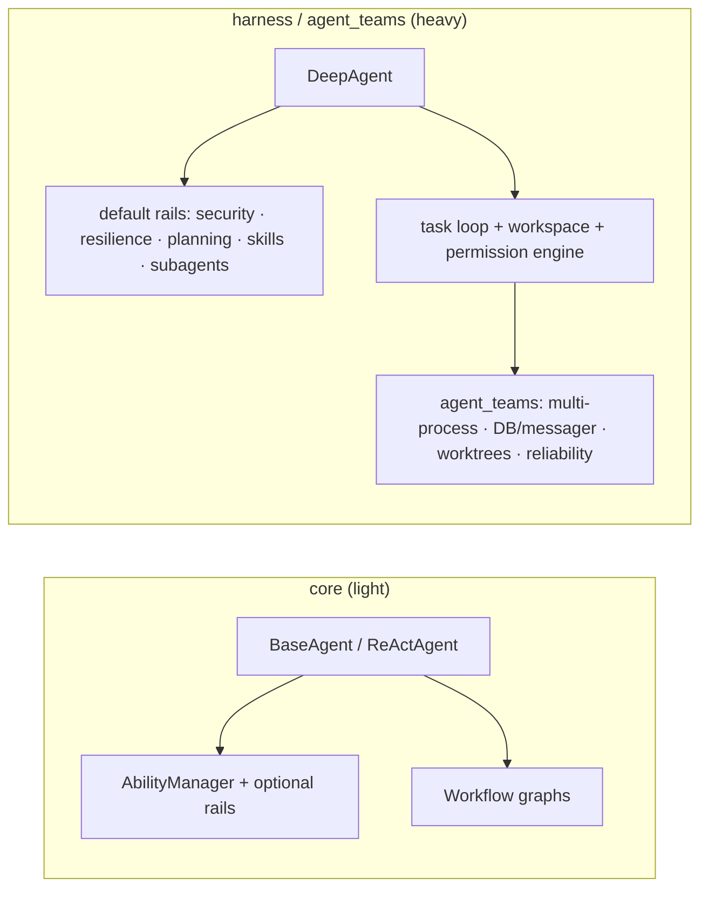
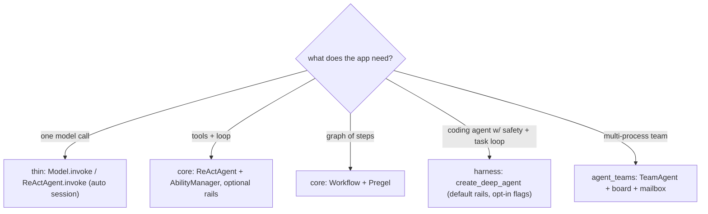
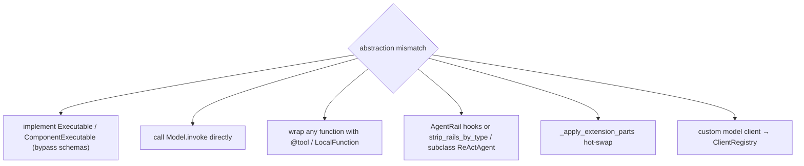
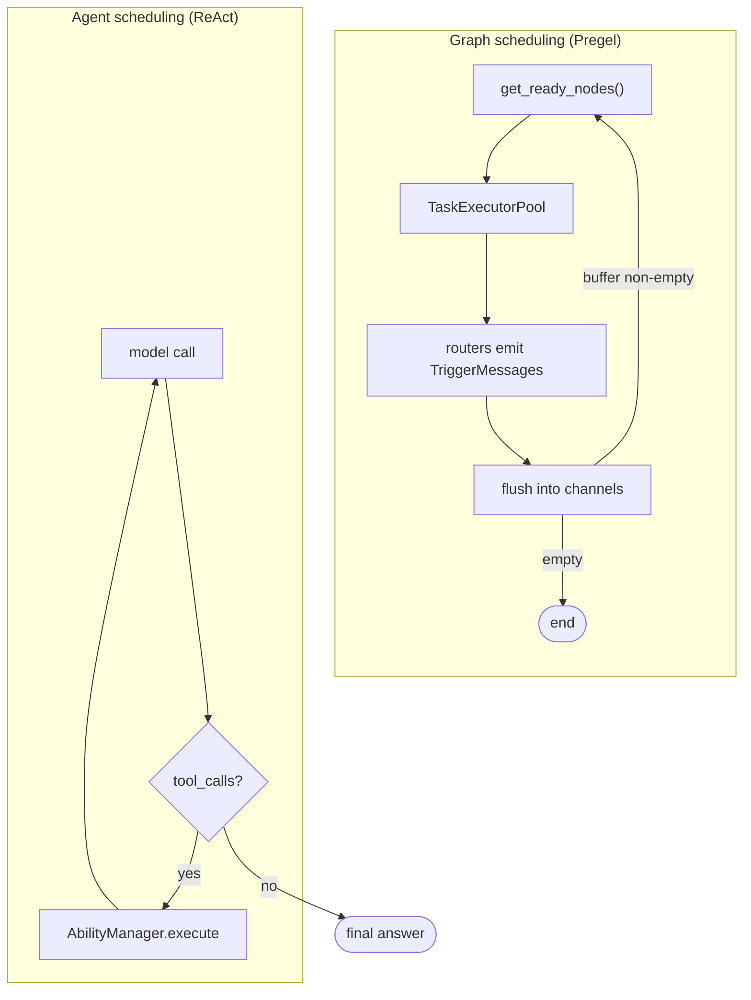
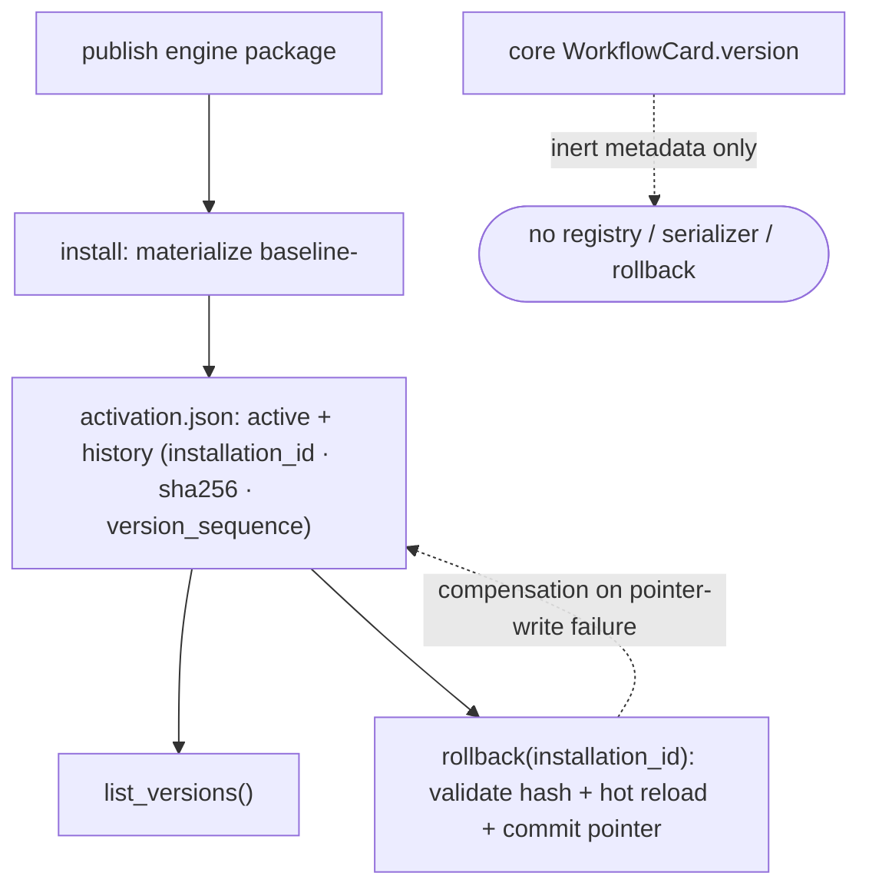
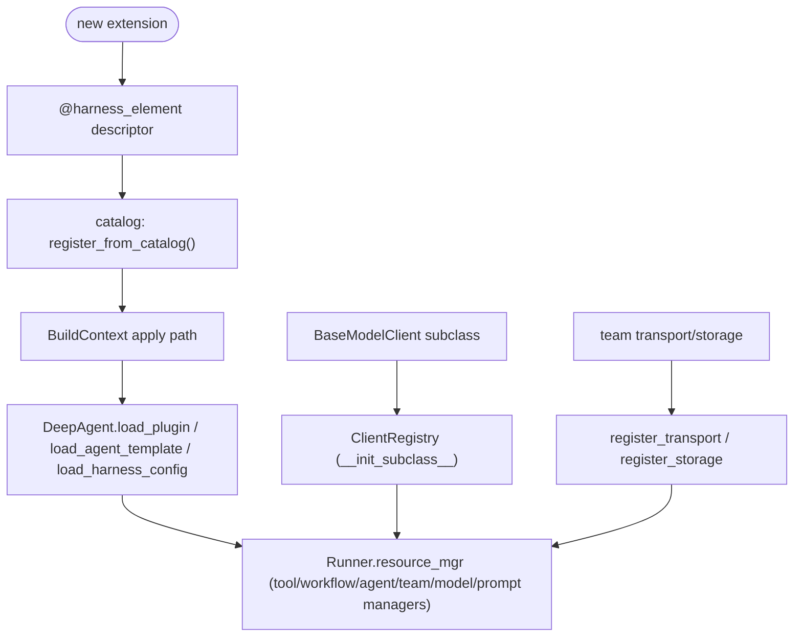
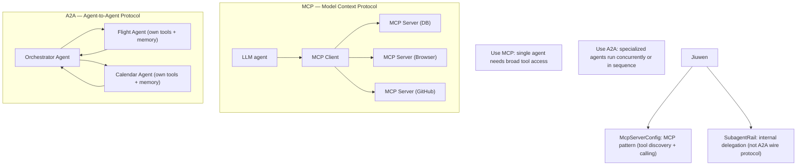

# Agent frameworks

## 1. What does an agent framework actually give you that raw API calls don't

**General:** A raw API call is request → response. A framework adds the machinery around it: a session/state object that survives across turns, a context manager that trims and compresses history, a tool registry that turns functions into model-facing schemas and dispatches calls, a provider-agnostic model client, a loop with stop conditions, error handling, and observability. You do not re-implement conversation state, schema extraction, provider quirks, and tracing for every app.

**Jiuwen:** The reusable pieces are concrete classes, not a monolith. `Session` owns state, streaming, tracer, and interaction lifecycle; `Model` + `BaseModelClient` wrap providers behind one `invoke`/`stream` surface; `ContextEngine` owns windowing and compression; `AbilityManager` owns tool registration and execution; `AgentRail` is the class-based lifecycle hook bus; `Tracer` plus `extensions/observability` own telemetry; `Workflow`/`Pregel` own deterministic graph execution; and `Runner` is the process-global facade binding sessions, resource registry, checkpointer, and callbacks.

Anchors

<strong>Anchors:</strong> &bull; <code>agent-core/openjiuwen/core/session/agent.py:33</code> — <code>Session</code> (state, stream, tracer, interaction) &bull; <code>agent-core/openjiuwen/core/runner/runner.py:696</code> — <code>Runner</code> facade class; <code>:408</code> <code>run_agent</code> binds session + lifecycle &bull; <code>agent-core/openjiuwen/core/context_engine/context_engine.py:28</code> — <code>ContextEngine</code> (processors, token limits, compression) &bull; <code>agent-core/openjiuwen/core/foundation/llm/model.py:27</code> — <code>Model</code>, unified LLM entry; <code>:94</code> <code>invoke</code> &bull; <code>agent-core/openjiuwen/core/foundation/llm/model_clients/__init__.py:58</code> — <code>create_model_client</code> provider dispatch &bull; <code>agent-core/openjiuwen/core/single_agent/ability_manager.py:142</code> — <code>AbilityManager</code> (tool registry + execution) &bull; <code>agent-core/openjiuwen/core/single_agent/rail/base.py:824</code> — <code>AgentRail</code> base (lifecycle hooks) &bull; <code>agent-core/openjiuwen/core/session/tracer/tracer.py:98</code> — <code>Tracer</code>; <code>agent-core/openjiuwen/extensions/observability/runtime.py:103</code> — <code>ObservabilityRuntime</code>

_Canonical source: `source/ai-agent-framework-interview-questions_for_engineers.md`; also covered in: framework._

---

## 2. What's the difference between a graph-based framework like LangGraph and a role-based framework like CrewAI

**General:** Graph-based frameworks make control flow an explicit graph of nodes and edges over shared state; routing is deterministic, inspectable, and easy to persist. Role-based frameworks make the unit an agent with a role/persona and let agents collaborate through messages and a task board; control flow is emergent and driven by the model plus a manager. Graph = you author the topology; role = you author the team.

**Jiuwen:** It contains both archetypes as separate subsystems. The graph side is a genuine Pregel engine: `Workflow` compiles components into a `PregelGraph`, edges become channels, and `PregelLoop.run_step()` drives super-steps with static routers, conditional routers, barriers, and CNF OR-groups for exclusive merges. The role side is `TeamAgent`, a single class that switches between `TeamRole.LEADER` and `TEAMMATE`; leadership is expressed through tools (`create_team_tools`), an event-driven `CoordinationKernel`, and an optional `TeamScheduler` that dispatches tasks from a shared board. There is no declarative bridge that compiles a team into a Pregel graph.

Anchors

<strong>Anchors:</strong> &bull; <code>agent-core/openjiuwen/core/workflow/workflow.py:98</code> — <code>Workflow</code> graph facade &bull; <code>agent-core/openjiuwen/core/graph/pregel/engine.py:209</code> — <code>Pregel</code>; <code>:231</code> <code>run</code>; <code>:255</code> <code>while await loop.run_step()</code> driver &bull; <code>agent-core/openjiuwen/core/graph/pregel/builder.py:13</code> — <code>PregelBuilder</code> (<code>add_node</code>/<code>add_edge</code>/<code>add_branch</code>) &bull; <code>agent-core/openjiuwen/core/graph/pregel/router.py:11/26</code> — <code>StaticRouter</code> / <code>ConditionalRouter</code> &bull; <code>agent-core/openjiuwen/core/workflow/_workflow.py:221</code> — <code>add_connection</code> (src/target edges) &bull; <code>agent-core/openjiuwen/agent_teams/agent/team_agent.py:76</code> — <code>TeamAgent</code> one impl for leader/teammate &bull; <code>agent-core/openjiuwen/agent_teams/schema/team.py:81</code> — <code>TeamRole</code>; <code>agent-core/openjiuwen/agent_teams/agent/scheduling/scheduler.py:92</code> — <code>TeamScheduler</code>; <code>agent-core/openjiuwen/agent_teams/agent/coordination/kernel.py:33</code> — <code>CoordinationKernel</code> &bull; <code>agent-core/openjiuwen/agent_teams/runtime/manager.py:104</code> — <code>TeamRuntimeManager</code> pool/dispatch; <code>agent-core/openjiuwen/agent_teams/tools/tool_factory.py:97</code> — <code>create_team_tools</code>

_Canonical source: `source/ai-agent-framework-interview-questions_for_engineers.md`; also covered in: framework._

---

## 3. How do you decide between LangGraph, CrewAI, and the Anthropic Agent SDK for a given project

**General:** Pick by the shape of control and the state model you need. Explicit graph/routing with durable state → LangGraph. Role/team collaboration with fast multi-agent setup → CrewAI. A managed coding/agent harness with strong tool and sandbox defaults, and you accept the vendor → the Anthropic Agent SDK (or an equivalent). Weigh state model, persistence, provider lock-in, tool ecosystem, and team familiarity.

**Jiuwen:** There is no in-repo LangGraph or CrewAI code, so this is architectural reading. Jiuwen's design center is *deterministic graph when the flow is known* (`Workflow`/`Pregel`, with persistence via `GraphStore`/checkpointer) and *role-based teams when work assignment is emergent* (`TeamAgent` + `TeamScheduler` + task board). Over both sits a provider-agnostic model client: `ProviderType` enumerates OpenAI/Anthropic/DashScope/DeepSeek/… and `create_model_client` resolves the implementation, with `IntelliRouterModelClient` for routing. For the third archetype ("bring your own agent SDK"), it ships a `harness_protocol` SPI plus `harness_providers` (`native`, `claudecode`, `codex`, `dsh`) and `create_harness(manifest, provider=...)`.

Anchors

<strong>Anchors:</strong> &bull; <code>agent-core/openjiuwen/core/graph/pregel/engine.py:255</code> — graph driver &bull; <code>agent-core/openjiuwen/agent_teams/agent/scheduling/scheduler.py:92</code> — <code>TeamScheduler</code>; <code>agent-core/openjiuwen/agent_teams/runtime/manager.py:104</code> — pool/dispatch &bull; <code>agent-core/openjiuwen/core/foundation/llm/schema/config.py:13</code> — <code>ProviderType</code> enum &bull; <code>agent-core/openjiuwen/core/foundation/llm/model_clients/__init__.py:58</code> — provider→client dispatch + registry fallback &bull; <code>agent-core/openjiuwen/harness_providers/factory.py:160</code> — <code>create_harness(manifest, provider=...)</code> &bull; <code>agent-core/openjiuwen/core/workflow/workflow.py:98</code> — graph and teams coexist in one SDK &bull; <code>agent-core/openjiuwen/harness/manifest/catalog.py:67</code> — declarative element catalog

**Gap.** There are no comparative benchmarks, migration guides, or explicit decision docs versus LangGraph/CrewAI — the mapping is by architectural reading only. Model-client parity across providers is deep for OpenAI/Anthropic, but non-OpenAI providers are largely endpoint/`extra_body` profiles rather than first-class native SDKs.

_Canonical source: `source/ai-agent-framework-interview-questions_for_engineers.md`; also covered in: framework._

---

## 4. What tradeoffs come with choosing a heavier framework versus writing a lighter custom orchestration layer

**General:** Heavy frameworks give you batteries — tools, memory, permissions, teams, observability — at the cost of startup time, learning curve, config surface, and update churn. Light custom code is transparent and fast but you rebuild context management, retries, tracing, and safety. Choose by how much of the battery you would otherwise write yourself.

**Jiuwen:** The light path is `core`: `BaseAgent`/`ReActAgent` with `AbilityManager`, optional rails, and `Workflow` graphs — no workspace, no permission engine, no task loop, no teams. The heavy path is `harness`: `factory.create_deep_agent` assembles `DeepAgent` with default rails (security, tool resilience, task planning, skills, subagents), a task loop, a workspace, and a tiered permission engine; `agent_teams` adds multi-process teams, DB/messager transport, worktrees, and reliability monitoring. Heaviness is partly config-gated (`enable_task_loop`, `enable_subagent_runtime`, `enable_security_rail`), but the default DeepAgent assembly is substantial.

Anchors

<strong>Anchors:</strong> &bull; <code>agent-core/openjiuwen/core/single_agent/base.py:85</code> — <code>BaseAgent</code>; <code>agent-core/openjiuwen/core/single_agent/agents/react_agent.py:2492</code> — <code>invoke</code> (light path) &bull; <code>agent-core/openjiuwen/core/application/llm_agent/llm_agent.py:96</code>; <code>agent-core/openjiuwen/core/application/workflow_agent/workflow_agent.py:11</code> — thin application agents &bull; <code>agent-core/openjiuwen/harness/deep_agent.py:298</code> — <code>DeepAgent</code>; <code>agent-core/openjiuwen/harness/factory.py:460</code> <code>create_deep_agent</code>; <code>:394-409</code> default rail set &bull; <code>agent-core/openjiuwen/harness/schema/config.py:248-260</code> — <code>enable_task_loop</code>/<code>enable_subagent_runtime</code>/<code>enable_skill_discovery</code> defaults <code>False</code> &bull; <code>agent-core/openjiuwen/harness/schema/deep_agent_spec.py:448/452</code> — spec defaults <code>enable_task_loop=True</code>, <code>enable_security_rail=True</code> &bull; <code>agent-core/openjiuwen/agent_teams/agent/team_agent.py:76</code> — team heaviness; <code>agent-core/openjiuwen/extensions/context_evolver/</code> + <code>agent-core/openjiuwen/rsi/</code> + <code>agent-core/openjiuwen/auto_harness/</code> — optional layers

**Gap.** The two paths are not cleanly layered: `Workflow` lives in `core` but is fully integrated with runner callbacks/tracing, and `harness` imports many core internals. There is no single "minimal install" flag; optional layers (`agent_evolving`, `symphony`, `dev_tools`) ship in the same distribution.

_Canonical source: `source/ai-agent-framework-interview-questions_for_engineers.md`; also covered in: framework._

---

## 5. When does a framework add unnecessary abstraction instead of solving a real problem

**General:** When the app is a single model call, when the framework's node/agent/state model forces you to reshape business logic to fit, or when the graph is actually a straight line. Warning signs: you fight the state schema, wrap everything in adapters, or need an escape hatch on the happy path. The abstraction pays for itself only when you actually need the loop, state, tools, and observability.

**Jiuwen:** The base layer is deliberately thin and elective. `ReActAgent.invoke` auto-creates a session when none is passed, so a minimal loop runs without `Runner`; the legacy `BaseAgent` still offers `add_tools` + `invoke`; `Workflow` is just a graph of `Executable`s with optional schema validation. Heavier behavior lives in `harness/` and is opt-in: `factory.create_deep_agent` adds default rails only when their config flag is on, and `DeepAgentConfig` defaults `enable_task_loop`, `enable_skill_discovery`, and `enable_subagent_runtime` to `False`.

Anchors

<strong>Anchors:</strong> &bull; <code>agent-core/openjiuwen/core/single_agent/agents/react_agent.py:2492</code> — <code>invoke</code> auto-creates session when <code>session is None</code> (<code>:2523</code>) &bull; <code>agent-core/openjiuwen/core/application/llm_agent/llm_agent.py:96</code> — <code>LLMAgent</code> thin controller-based agent; <code>agent-core/openjiuwen/core/application/workflow_agent/workflow_agent.py:11</code> — <code>WorkflowAgent</code> &bull; <code>agent-core/openjiuwen/core/single_agent/legacy/agent.py:116</code> — legacy <code>BaseAgent</code>; <code>:222</code> <code>add_tools</code> &bull; <code>agent-core/openjiuwen/harness/factory.py:394</code> — <code>default_rails</code>, each guarded by <code>should_add</code> &bull; <code>agent-core/openjiuwen/harness/schema/deep_agent_spec.py:448/452/469</code> — <code>enable_task_loop</code>/<code>enable_security_rail</code>/<code>enable_skill_discovery</code> defaults &bull; <code>agent-core/openjiuwen/harness/deep_agent.py:1873</code> — <code>add_rail</code> optional, queue-based &bull; <code>agent-core/openjiuwen/core/workflow/workflow.py:328</code> — <code>Workflow.invoke</code> requires an explicit session

**Gap.** Config gating is inconsistent: `DeepAgentConfig` (`agent-core/openjiuwen/harness/schema/config.py:248`, `enable_task_loop=False`) and `DeepAgentSpec` (`agent-core/openjiuwen/harness/schema/deep_agent_spec.py:448`, `enable_task_loop=True`) disagree, so "default heaviness" depends on which constructor you use. `Workflow.invoke` is not self-sufficient — it requires a session, which is friction next to `ReActAgent.invoke`.

_Canonical source: `source/ai-agent-framework-interview-questions_for_engineers.md`; also covered in: framework._

---

## 6. What happens when the framework's abstractions don't match how your actual business logic needs to work

**General:** Prefer escape hatches: implement the base interface directly, call the primitive (model/tool) without the high-level wrapper, override hooks, or replace a component. If the framework has no seam, you fork it or drop it. Good frameworks make the low-level primitive reachable from the high-level API.

**Jiuwen:** The framework exposes multiple escape hatches. At graph level, implement `Executable`/`ComponentExecutable` with full control over I/O and bypass schemas. At LLM level, call `Model.invoke` directly (no agent/runner required). At tool level, wrap any function with `LocalFunction`/`@tool`, including a custom `render`. At behavior level, intercept with `AgentRail` hooks or replace a rail via `strip_rails_by_type`; at assembly level, override config fields or subclass (`ReActAgentEvolve` is a shipped example). `_apply_extension_parts` hot-swaps rails/tools/prompts, and custom clients plug into the registry.

Anchors

<strong>Anchors:</strong> &bull; <code>agent-core/openjiuwen/core/graph/executable.py:14</code> — <code>on_invoke</code> override &bull; <code>agent-core/openjiuwen/core/workflow/components/component.py:124/148</code> — <code>invoke</code>/<code>stream</code> overrides with raw <code>Session</code>+<code>ModelContext</code> &bull; <code>agent-core/openjiuwen/core/foundation/llm/model.py:94</code> — direct <code>Model.invoke</code> &bull; <code>agent-core/openjiuwen/core/foundation/tool/function/function.py:48</code> — <code>LocalFunction</code>; <code>agent-core/openjiuwen/core/foundation/tool/tool.py:14</code> — <code>@tool</code> &bull; <code>agent-core/openjiuwen/core/single_agent/rail/base.py:824</code> — <code>AgentRail</code>; <code>agent-core/openjiuwen/harness/deep_agent.py:1936</code> — <code>strip_rails_by_type</code> &bull; <code>agent-core/openjiuwen/core/single_agent/agents/react_agent_evolve.py:16</code> — subclassing <code>ReActAgent</code> &bull; <code>agent-core/openjiuwen/core/foundation/llm/model_clients/base_model_client.py:53</code> + <code>agent-core/openjiuwen/core/common/clients/client_registry.py:50</code> — custom model backend &bull; <code>agent-core/openjiuwen/harness/deep_agent.py:2015</code> — <code>_apply_extension_parts</code> hot-swap

**Gap.** Escape hatches are unevenly documented and some are "advanced / for tests". Rail routing requires the event to be in the correct allow-set or the callback silently does not run. There is no formal "override this method" contract for the ReAct loop beyond subclassing a large class, and no public config-level override hook for the `agent_teams` prompt/dispatch policy beyond editing specs and YAML.

_Canonical source: `source/ai-agent-framework-interview-questions_for_engineers.md`; also covered in: framework._

---

## 7. How does the framework decide which node or agent runs next

**General:** In a graph framework, a scheduler activates every node whose input channels are ready, runs them (often concurrently), then routes their outputs to successors; the loop repeats until no node is active. In an agent framework, the model decides the next action by emitting tool calls. Frameworks that have both use each at its level.

**Jiuwen:** Workflow next-node selection is Pregel super-step scheduling: each step `ChannelManager.get_ready_nodes()` yields nodes whose trigger/barrier channels are satisfied, they are submitted to a `TaskExecutorPool`, their routers emit messages, messages are flushed into channels, and the loop repeats until the active set and buffer are empty. Agent-level dispatch is separate and LLM-driven: the ReAct loop calls the model, and if the assistant message carries `tool_calls` it hands them to `AbilityManager.execute`; if there are none it terminates with an answer. Team-level, `TeamScheduler` scans the task board and starts each idle member's earliest assigned pending task.

Anchors

<strong>Anchors:</strong> &bull; <code>agent-core/openjiuwen/core/graph/pregel/engine.py:122</code> — <code>ready_nodes = manager.get_ready_nodes()</code>; <code>:130</code> end condition; <code>:144-150</code> consume + <code>executor.submit</code>; <code>:255</code> <code>while await loop.run_step()</code> &bull; <code>agent-core/openjiuwen/core/graph/pregel/channels.py:39</code> — <code>flush()</code> marks updated nodes ready; <code>:60</code> <code>get_ready_nodes</code> &bull; <code>agent-core/openjiuwen/core/graph/pregel/task.py:27</code> — <code>submit</code> creates a <code>NodeTask</code>; <code>:47</code> <code>asyncio.wait(..., FIRST_EXCEPTION)</code>; <code>:158</code> node routers produce next targets &bull; <code>agent-core/openjiuwen/core/single_agent/agents/react_agent.py:2740</code> — iteration loop; <code>:2793</code> no <code>tool_calls</code> → answer; <code>:2813</code> <code>_execute_tool_call</code> &bull; <code>agent-core/openjiuwen/core/single_agent/ability_manager.py:1078</code> — <code>execute</code> (invoked from <code>agent-core/openjiuwen/core/single_agent/agents/react_agent.py:2813</code>) &bull; <code>agent-core/openjiuwen/agent_teams/agent/scheduling/scheduler.py:197</code> — <code>_scan</code>; <code>:208</code> <code>_reconcile_starts</code>

**Gap.** The ready set is a Python `set`, so when several nodes are simultaneously ready their execution/iteration order is nondeterministic (only the *set* of concurrent nodes is deterministic). `asyncio.wait(FIRST_EXCEPTION)` cancels sibling nodes on first failure, so "next" is partly failure-driven. `AbilityManager` decides nothing itself — tool choice is entirely model output. `TeamScheduler` is constructed only when `dispatch_mode == "scheduled"`.

_Canonical source: `source/ai-agent-framework-interview-questions_for_engineers.md`; also covered in: framework._

---

## 8. How do you version and roll back an agent's workflow definition, not just its prompts

**General:** Treat the agent/workflow definition as a versioned artifact: store immutable versions with a content hash, activate one, list history, and roll back atomically. Prompts are only a subset — the topology and config change too. Most frameworks do not do this for you.

**Jiuwen:** In the core framework this is **essentially absent**: `WorkflowCard` has a free-form `version: str = ''` and a `generate_workflow_key(id, version)` helper, but there is no registry, no version history, no graph serializer, and no rollback API — `version` is only part of a composite key. The real, working versioning is at the product layer in the RSI (recursive self-improvement) harness subsystem: `RsiHarnessActivationStore` persists an `activation.json` with `schema_version`, an `active` record, and an immutable `history` of installed versions, each carrying `installation_id`, `sha256`, `runtime_path`, and a monotonic `version_sequence`; `install(task_id)` copies a published engine package into a content-addressed `versions/baseline-<sha16>` directory and `rollback(installation_id)` re-activates any retained version (validating path, sha256, and manifest, hot-reloading, with compensation if the pointer write fails), exposed over the WebSocket protocol as `rsi.harness.rollback`.

Anchors

<strong>Anchors:</strong> &bull; <code>agent-core/openjiuwen/core/workflow/base.py:21</code> — <code>WorkflowCard.version: str = ''</code>; <code>:68</code> <code>generate_workflow_key(workflow_id, workflow_version)</code> &bull; <code>jiuwenswarm/jiuwenswarm/agents/harness/common/rsi/harness_activation.py:296</code> — <code>RsiHarnessActivationStore</code>; <code>:350</code> <code>list_versions()</code>; <code>:386</code> <code>snapshot()</code>; <code>:391</code> <code>restore()</code>; <code>:416</code> <code>commit()</code> assigns <code>version_sequence</code>; <code>:466</code> atomic write &bull; <code>jiuwenswarm/jiuwenswarm/agents/harness/common/rsi/harness_activation.py:617</code> — <code>rollback(installation_id)</code>; <code>:623</code> <code>_rollback_unlocked</code>; <code>:682</code> <code>_assert_rollback_allowed</code>; <code>:694</code> <code>_validate_rollback_target</code> &bull; <code>jiuwenswarm/jiuwenswarm/agents/harness/common/rsi/materializer.py:222</code> — content-addressed <code>version_id = baseline-&lt;sha16&gt;</code>; <code>:231-246</code> writes <code>harness_refs.yaml</code> &bull; <code>jiuwenswarm/jiuwenswarm/server/rsi/rsi_handlers.py:224</code> — <code>_do_harness_rollback</code>; <code>:218</code> <code>_do_harness_versions_list</code>; <code>:209</code> install &bull; <code>jiuwenswarm/jiuwenswarm/gateway/channel_manager/web/app_web_handlers.py:7634</code> — <code>rsi.harness.rollback</code> dispatch &bull; <code>agent-core/openjiuwen/auto_harness/infra/runtime_manifest.py:121</code> — <code>schema_version</code>; <code>agent-core/openjiuwen/harness/schema/expert_harness_spec.py:122</code> — <code>schema_version</code> &bull; <code>agent-core/openjiuwen/agent_evolving/checkpointing/manager.py:121</code> — restores operator state/best score (training only)

**Gap.** Core `openjiuwen` has no agent/workflow definition versioning or rollback; `WorkflowCard.version` is inert metadata. Versioning/rollback is real only in the product-layer RSI harness installer and only for engine-published harness packages. `agent_evolving` checkpointing rolls back training operator state, not a workflow definition. The config-migration path only migrates YAML keys forward and retains no old versions. Retained versions can be listed but there is no automatic pruning/retention policy.

_Canonical source: `source/ai-agent-framework-interview-questions_for_engineers.md`; also covered in: framework._

---

## 9. How do you evaluate whether a framework will scale with your team, not just your first prototype

**General:** Look for declarative registration and plugins, stable extension contracts, provider and config abstraction, schema'd configuration, and real documentation. Be wary of frameworks where every change means patching internals. Prototype speed is not the same as team-scale maintainability.

**Jiuwen:** Extension is registry/manifest based rather than patch based. Provider modules declare `@harness_element(kind, name, ...)` descriptors; `register_from_catalog()` converts the catalog into class registrations, and `DeepAgent.load_plugin` / `load_agent_template` / `load_harness_config` hot-load packages through one `BuildContext` apply path. Model providers auto-register via `BaseModelClient.__init_subclass__` into `ClientRegistry`, and team infrastructure uses `register_transport`/`register_storage` name→config registries. `Runner.resource_mgr` centralizes tool/workflow/agent/team/model/prompt managers, and the product demonstrates the pattern: `jiuwenswarm/agents/swarm/registry.py` imports provider modules and drives registration from the manifest catalog.

Anchors

<strong>Anchors:</strong> &bull; <code>agent-core/openjiuwen/harness/manifest/catalog.py:67</code> — <code>@harness_element</code>; <code>:55</code> <code>list_elements()</code>; <code>agent-core/openjiuwen/harness/manifest/registration.py:31</code> — <code>register_from_catalog</code> &bull; <code>agent-core/openjiuwen/harness/deep_agent.py:2027</code> — <code>load_plugin</code>; <code>:2076</code> <code>load_agent_template</code>; <code>:2190</code> <code>load_harness_config</code> &bull; <code>agent-core/openjiuwen/core/foundation/llm/model_clients/base_model_client.py:53</code> — <code>__init_subclass__</code> auto-registration; <code>agent-core/openjiuwen/core/common/clients/client_registry.py:19/50/94</code> &bull; <code>agent-core/openjiuwen/core/runner/resources_manager/resource_registry.py:13</code> — <code>ResourceRegistry</code> &bull; <code>agent-core/openjiuwen/harness/schema/config.py:248</code>; <code>agent-core/openjiuwen/harness/schema/deep_agent_spec.py:354</code> — config schema (Pydantic) &bull; <code>agent-core/openjiuwen/agent_teams/schema/blueprint.py:99</code> — <code>TransportSpec</code>/<code>StorageSpec</code> registry pattern &bull; <code>jiuwenswarm/jiuwenswarm/agents/swarm/registry.py:8-12</code> — product-side provider registration via the catalog

**Gap.** There is no visible semantic-versioning or deprecation policy for `@harness_element` names or config fields — the descriptor stores a factory ref and an input JSON schema but no version. Adding a new tool/rail also requires touching prompt/description contracts (a documentation discipline, not enforced by types). The legacy `single_agent/legacy/` surface shows the cost of past API drift.

_Canonical source: `source/ai-agent-framework-interview-questions_for_engineers.md`; also covered in: framework._

---

## 10. What is the difference between MCP and A2A, and when do you use each?

**General:** **MCP (Model Context Protocol)** is a standardized interface for connecting a single LLM to external tools — the model stays in control, and MCP provides a universal connector layer so the model can call databases, browsers, APIs, and code tools without custom integration for each. One brain, many tools, centralized control. **A2A (Agent-to-Agent Protocol)** is a communication protocol for multi-agent systems — agents collaborate as peers, each with its own tools, memory, and reasoning loop; an orchestrator delegates to specialized agents rather than touching tools directly. The key difference: MCP = a single model gains tool access; A2A = a network of agents coordinate and hand off work to each other. In practice, both are often used together: MCP governs how each individual agent talks to its tools, while A2A governs how agents talk to each other. Use MCP alone for single-agent assistants that need broad tool access. Add A2A when specialized agents need to run concurrently or in sequence, each with their own tool contexts.

**Jiuwen:** MCP is supported via `McpServerConfig` (agent-core/openjiuwen/core/foundation/tool/mcp/base.py) — each server exposes tools that the agent discovers via `tools/list` and calls via `tools/call`. This is the MCP pattern: one agent, many tool providers. For A2A-style multi-agent coordination, Jiuwen uses `SubagentRail` to delegate tasks to sub-agents (planner → researcher → critic chains), but this is a framework-internal pattern rather than the A2A wire protocol. True A2A interoperability across independently deployed agents is not implemented.

Anchors

<strong>Anchors:</strong> &bull; <code>agent-core/openjiuwen/core/foundation/tool/mcp/base.py:1</code> — <code>McpServerConfig</code> (MCP tool discovery + calling) &bull; <code>agent-core/openjiuwen/core/foundation/tool/mcp/</code> — MCP client implementation &bull; <code>agent-core/openjiuwen/harness/rails/subagent/subagent_rail.py:1</code> — internal agent delegation (not A2A protocol) &bull; A2A wire protocol: not implemented; multi-agent coordination is framework-internal via SubagentRail

**Gap.** A2A as an interoperability wire protocol (agents from different deployments/providers communicating) is not implemented. Multi-agent coordination is internal to the Jiuwen framework via SubagentRail.

_Canonical source: `source/agent-design-patterns-2026_for_engineers.md`; also covered in: agent-design-patterns._