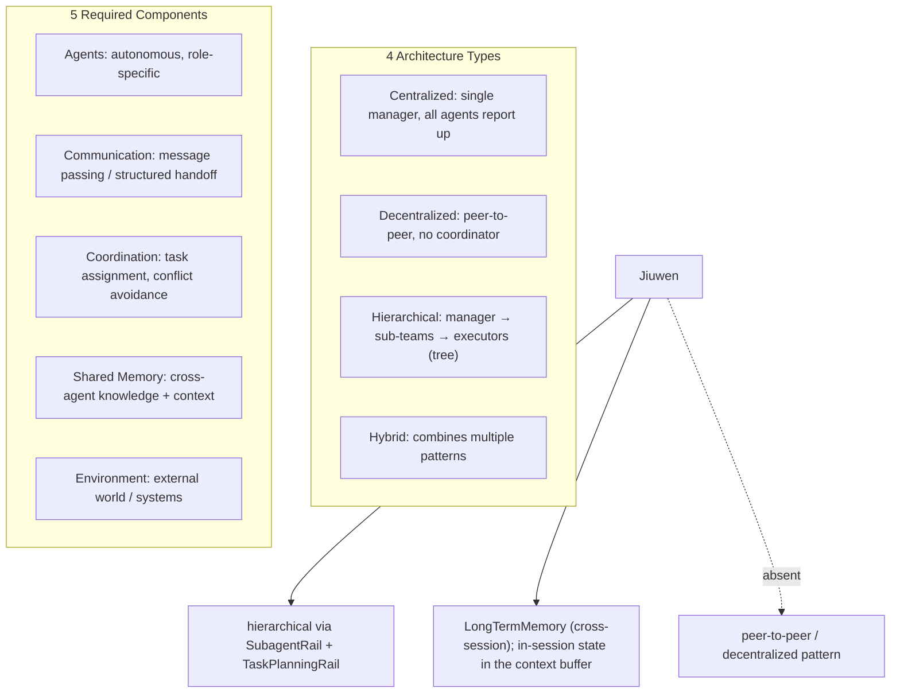
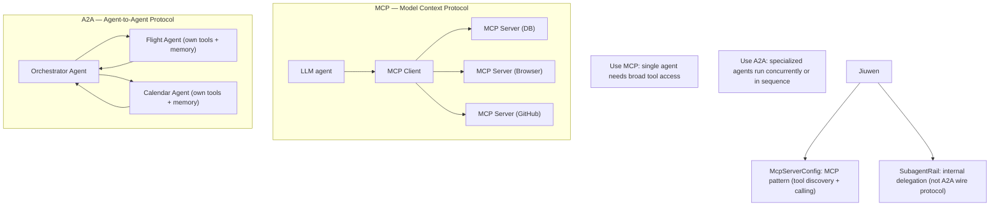
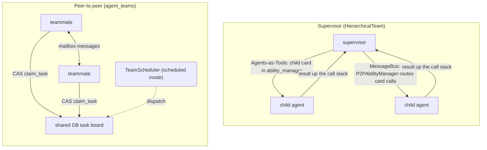
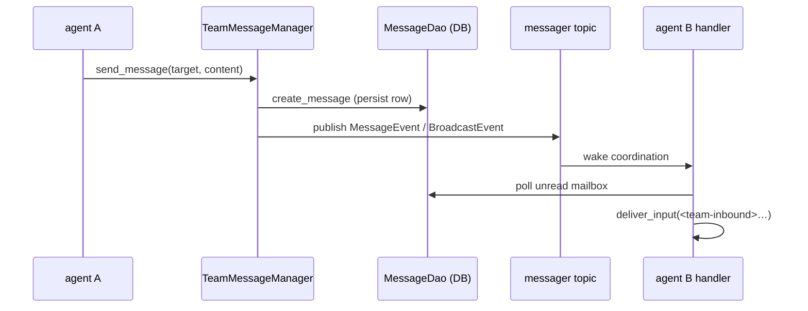
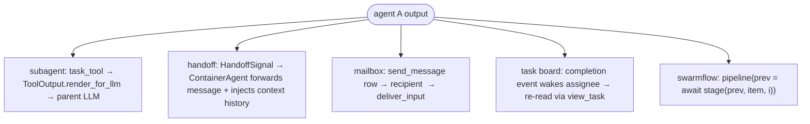
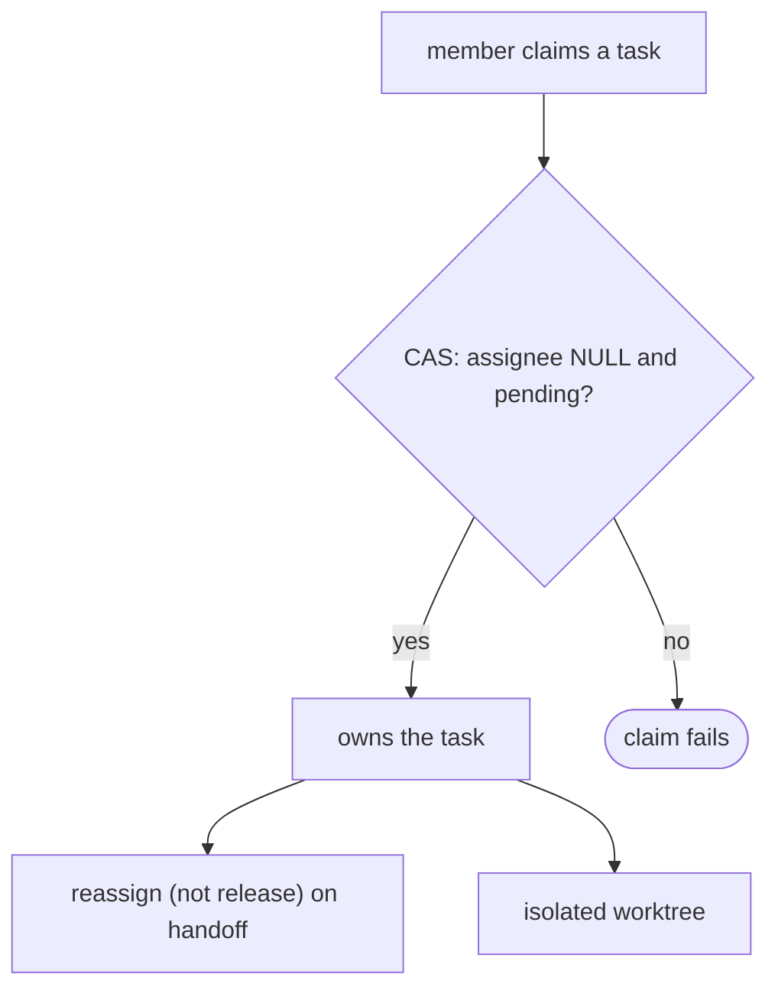
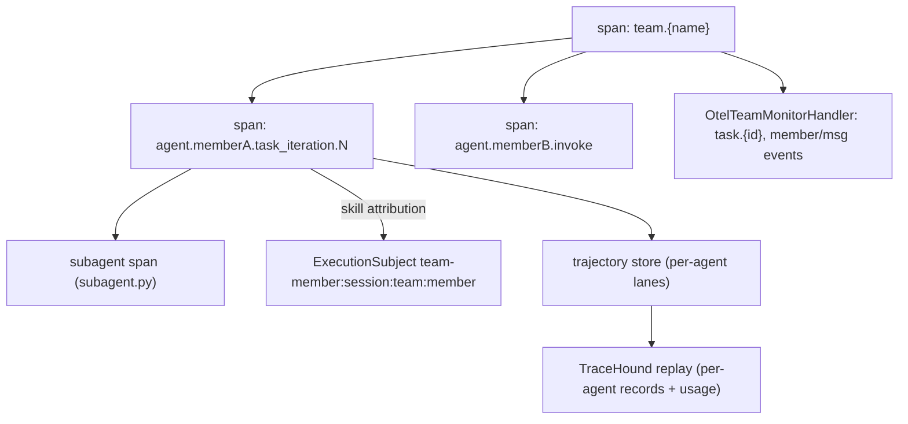
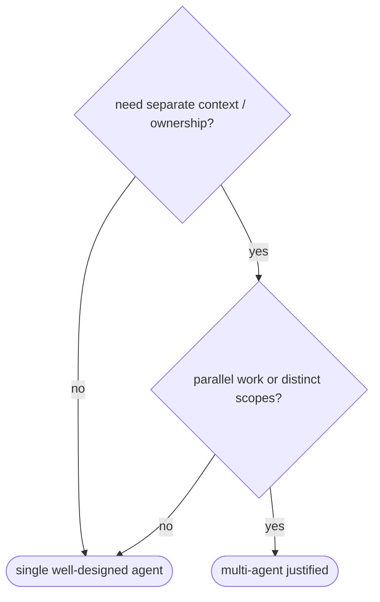

# Multi-agent systems

## 1. What are the four multi-agent architecture types and what components does every MAS need?

**General:** Multi-agent systems (MAS) come in four structural patterns: (1) **Centralized** — all agents report to a single manager/supervisor that assigns tasks and aggregates results. Simple to reason about, single point of failure. (2) **Decentralized** — agents communicate directly with each other (peer-to-peer) with no central coordinator. Resilient but harder to ensure consistency. (3) **Hierarchical** — manager agents oversee sub-agent teams, which may themselves have managers — a tree of authority. Natural for complex decomposition (planner → domain-specialist teams → executors). (4) **Hybrid** — combines patterns; e.g., a centralized orchestrator with peer-to-peer specialist agents underneath. Every MAS needs five components regardless of architecture: **agents** (autonomous entities with specific roles), **communication** (message passing — structured output, shared state, or explicit handoff), **coordination** (how tasks are assigned and conflicts avoided), **shared memory** (knowledge and context accessible across agents), and **environment** (the external world or system agents act on). Choosing an architecture is a tradeoff: centralized is debuggable but bottlenecked; decentralized is resilient but harder to coordinate; hierarchical handles complexity but adds latency through multiple delegation layers.

**Jiuwen:** The `SubagentRail` pattern is **hierarchical**: a top-level agent delegates to specialized sub-agents via `SubagentRail`, which itself can call further sub-agents. `TaskPlanningRail` breaks the task and generates a plan before delegation. Shared long-term memory is `LongTermMemory`; within-session state lives in the context buffer rather than a separate memory class. Delegation payloads are handled by the subagent runtime (`SubagentRuntimeConfig`/`SubagentInstance`). There is no peer-to-peer (decentralized) pattern; all coordination flows through the top-level agent.

Anchors

<strong>Anchors:</strong> &bull; <code>agent-core/openjiuwen/harness/rails/subagent/subagent_rail.py:1</code> — hierarchical delegation &bull; <code>agent-core/openjiuwen/harness/rails/task_planning_rail.py:1</code> — <code>TaskPlanningRail</code> (planner layer) &bull; <code>agent-core/openjiuwen/core/memory/long_term_memory.py:69</code> — shared long-term memory &bull; <code>agent-core/openjiuwen/harness/subagent_runtime/config.py:22</code> — <code>SubagentRuntimeConfig</code> (delegation payloads)

_Canonical source: `source/agent-design-patterns-2026_for_engineers.md`; also covered in: agent-design-patterns._

## 2. What is the difference between MCP and A2A, and when do you use each?

**General:** **MCP (Model Context Protocol)** is a standardized interface for connecting a single LLM to external tools — the model stays in control, and MCP provides a universal connector layer so the model can call databases, browsers, APIs, and code tools without custom integration for each. One brain, many tools, centralized control. **A2A (Agent-to-Agent Protocol)** is a communication protocol for multi-agent systems — agents collaborate as peers, each with its own tools, memory, and reasoning loop; an orchestrator delegates to specialized agents rather than touching tools directly. The key difference: MCP = a single model gains tool access; A2A = a network of agents coordinate and hand off work to each other. In practice, both are often used together: MCP governs how each individual agent talks to its tools, while A2A governs how agents talk to each other. Use MCP alone for single-agent assistants that need broad tool access. Add A2A when specialized agents need to run concurrently or in sequence, each with their own tool contexts.

**Jiuwen:** MCP is supported via `McpServerConfig` (agent-core/openjiuwen/core/foundation/tool/mcp/base.py) — each server exposes tools that the agent discovers via `tools/list` and calls via `tools/call`. This is the MCP pattern: one agent, many tool providers. For A2A-style multi-agent coordination, Jiuwen uses `SubagentRail` to delegate tasks to sub-agents (planner → researcher → critic chains), but this is a framework-internal pattern rather than the A2A wire protocol. True A2A interoperability across independently deployed agents is not implemented.

Anchors

<strong>Anchors:</strong> &bull; <code>agent-core/openjiuwen/core/foundation/tool/mcp/base.py:1</code> — <code>McpServerConfig</code> (MCP tool discovery + calling) &bull; <code>agent-core/openjiuwen/core/foundation/tool/mcp/</code> — MCP client implementation &bull; <code>agent-core/openjiuwen/harness/rails/subagent/subagent_rail.py:1</code> — internal agent delegation (not A2A protocol) &bull; A2A wire protocol: not implemented; multi-agent coordination is framework-internal via SubagentRail

**Gap.** A2A as an interoperability wire protocol (agents from different deployments/providers communicating) is not implemented. Multi-agent coordination is internal to the Jiuwen framework via SubagentRail.

_Canonical source: `source/agent-design-patterns-2026_for_engineers.md`; also covered in: agent-design-patterns._

## 3. What's the difference between a supervisor pattern and a peer-to-peer pattern in these frameworks

**General:** A supervisor is one controller that plans and dispatches to workers (often workers-as-tools); control is top-down and data returns synchronously up the call stack. Peer-to-peer has agents share a board/bus and claim/communicate directly; control is distributed, needs arbitration (atomic claims, one-active-task invariants), but scales autonomy.

**Jiuwen:** Supervisor teams are built on `core/multi_agent`'s `HierarchicalTeam`, in two implementations: **Agents-as-Tools** (`hierarchical_tools`) registers each child `AgentCard` into the parent's `ability_manager`, so the LLM invokes a child like any tool; **MessageBus** (`hierarchical_msgbus`) uses `SupervisorAgent` (a `ReActAgent` + `CommunicableAgent`) whose `P2PAbilityManager` intercepts AgentCard tool calls and routes them in parallel. Peer-to-peer is the `agent_teams` leader/teammate design: `TeamAgent` is one class for both roles, all members share a persistent DB task board and mailbox, and work is claimed via a single CAS (`claim_task`) with an optional `TeamScheduler` acting only as a leader-side dispatcher in `scheduled` mode.

Anchors

<strong>Anchors:</strong> &bull; <code>agent-core/openjiuwen/core/multi_agent/teams/hierarchical_tools/hierarchical_team.py:101</code> — <code>_setup_hierarchy()</code>; <code>:108</code> <code>parent_agent.ability_manager.add(child_card)</code> &bull; <code>agent-core/openjiuwen/core/multi_agent/teams/hierarchical_msgbus/supervisor_agent.py:20</code> — <code>SupervisorAgent</code> &bull; <code>agent-core/openjiuwen/core/multi_agent/teams/hierarchical_msgbus/p2p_ability_manager.py:52</code> — <code>execute()</code> partitions AgentCard calls; <code>:199</code> parallel P2P dispatch &bull; <code>agent-core/openjiuwen/core/multi_agent/teams/hierarchical_msgbus/hierarchical_team.py:87</code> — team <code>invoke()</code> → supervisor &bull; <code>agent-core/openjiuwen/agent_teams/tools/database/task_dao.py:634</code> — <code>claim_task()</code> single-CAS self-claim &bull; <code>agent-core/openjiuwen/agent_teams/tools/task_manager.py:1581</code> — one-active-task invariant &bull; <code>agent-core/openjiuwen/agent_teams/agent/scheduling/scheduler.py:208</code> — <code>_reconcile_starts()</code> leader mailbox dispatch

**Gap.** There is no single API that switches between the two families. Both `hierarchical_*` teams are supervisor-shaped; the only sequential-ish `core/multi_agent` team is `HandoffTeam`, still orchestrator-controlled. `HierarchicalTeam` supervisors have no task board or autonomous claim and do not persist intermediate work; the peer model has no hierarchical parent-child tool relationship. `P2PAbilityManager` only supports `parallel_tool_calls=True` and raises otherwise.

_Canonical source: `source/ai-agent-framework-interview-questions_for_engineers.md`; also covered in: framework._

---

## 4. How does a framework handle communication between multiple agents

**General:** Either a shared blackboard (task board/state) plus a message bus, or direct message passing. Messages should be persistent and ordered for auditability, with routing (direct, broadcast, mentions). Direct handoffs must carry enough context and be bounded.

**Jiuwen:** The `agent_teams` stack uses a persisted mailbox plus an event bus. `TeamMessageManager.send_message()` writes a `TeamMessage` row through `MessageDao` and then publishes a `MessageEvent`/`BroadcastEvent` on the team's messager topic; recipients are woken by coordination handlers, which poll their unread mailbox (`MessageHandler._process_unread_messages`) and feed rendered `<team-inbound>` text into the harness via `deliver_input`. External input enters through `agent-core/openjiuwen/agent_teams/interaction/router.py` (`parse_interact_str` → `resolve_targets`, strict `@member` routing) and `TeamRuntimeManager._dispatch_payload`. The lower-level `core/multi_agent` stack has a separate `TeamRuntime`/`MessageBus` with `send` (P2P, waits for response) and `publish` (pub/sub). Subagents are a third, synchronous channel: `TaskTool` builds a child session and returns the terminal output directly.

Anchors

<strong>Anchors:</strong> &bull; <code>agent-core/openjiuwen/agent_teams/tools/message_manager.py:27</code> — <code>TeamMessageManager</code>; <code>:60</code> <code>send_message()</code> persist-then-publish &bull; <code>agent-core/openjiuwen/agent_teams/tools/database/message_dao.py:153</code> — <code>MessageDao.create_message()</code> &bull; <code>agent-core/openjiuwen/agent_teams/agent/coordination/handlers/message.py:181</code> — <code>_process_unread_messages()</code> → <code>deliver_input</code> &bull; <code>agent-core/openjiuwen/agent_teams/interaction/router.py:273</code> — <code>resolve_targets()</code> <code>@member</code> routing &bull; <code>agent-core/openjiuwen/agent_teams/runtime/manager.py:573</code> — <code>_dispatch_payload()</code> &bull; <code>agent-core/openjiuwen/core/multi_agent/team_runtime/communicable_agent.py:105</code> — <code>send()</code> (P2P); <code>:131</code> <code>publish()</code> &bull; <code>agent-core/openjiuwen/core/multi_agent/teams/handoff/handoff_tool.py:17</code> — <code>HandoffTool</code> &bull; <code>agent-core/openjiuwen/harness/tools/subagent/task_tool.py:154</code> — <code>TaskTool</code> (synchronous child session, not a mailbox peer)

**Gap.** Two disjoint communication stacks (`core/multi_agent` TeamRuntime/MessageBus and `agent_teams` DB mailbox/messager) share no bridge. Delivery is pull-based (poll/drain + event wakeup), so a busy member's messages are deferred or steered, never pushed mid-token. Broadcast read state is a per-member watermark with multiple special-case paths. Subagent `TaskTool` calls do not touch the mailbox and are invisible to other agents.

_Canonical source: `source/ai-agent-framework-interview-questions_for_engineers.md`; also covered in: framework, ai-agent._

---

## 5. How does the framework handle one agent's output becoming another agent's input

**General:** Either a call returns the value (subagent/tool), or a handoff transfers control and context, or a shared board/bus carries the artifact. The framework must define how results and context propagate, and whether propagation is automatic or requires the consumer to re-read.

**Jiuwen:** Four paths. **Subagent delegation:** `TaskTool` builds isolated child inputs (`_build_subagent_inputs`), runs the subagent, wraps the terminal `output` into a `ToolOutput` (`_build_task_output`), and `render_for_llm` returns the answer as the tool result the parent reads. **Handoff:** `HandoffTool` emits a `HandoffSignal`; `ContainerAgent` appends `{"agent": ..., "output": result}` to a history, forwards `signal.message or inputs.input_message` as the next input, and seeds the next session from team history. **Mailbox flow (peer):** `send_message` persists a row; the recipient renders `<team-inbound>` and calls `deliver_input`. **Shared task board:** completion/dependency events wake assignees, but the work product is re-read via `view_task` rather than auto-injected. Swarmflow's `pipeline()` passes each stage's return value as the next stage's `prev`.

Anchors

<strong>Anchors:</strong> &bull; <code>agent-core/openjiuwen/harness/tools/subagent/task_tool.py:657</code> — <code>_build_subagent_inputs()</code>; <code>:726</code> <code>_build_task_output()</code>; <code>:1005</code> <code>render_for_llm()</code> &bull; <code>agent-core/openjiuwen/core/multi_agent/teams/handoff/handoff_signal.py:47</code> — <code>extract_handoff_signal()</code> &bull; <code>agent-core/openjiuwen/core/multi_agent/teams/handoff/container_agent.py:56</code> — <code>_build_agent_input()</code>; <code>:112</code> <code>_inject_context_history()</code>; <code>:249</code> <code>coordinator.complete(result)</code> &bull; <code>agent-core/openjiuwen/agent_teams/agent/scheduling/scheduler.py:208</code> — scheduled handoff as a rendered leader message &bull; <code>agent-core/openjiuwen/agent_teams/tools/database/task_dao.py:634</code> — peer task handoff via CAS claim &bull; <code>agent-core/openjiuwen/agent_teams/workflow/engine/primitives.py:1495</code> — <code>pipeline()</code> passes <code>prev</code> between stages

**Gap.** Peer teammates do not automatically receive a producer's output — completion unblocks and wakes them, but the result text must be re-read from the task/message store. Subagent return values are collapsed to text plus a fixed envelope; structured outputs are not generically propagated between agents. Handoff context transfer relies on private session keys and a crude message-key dedupe. Swarmflow's dataflow is ordinary Python with no durable edge model and is invisible to the team mailbox/task board.

_Canonical source: `source/ai-agent-framework-interview-questions_for_engineers.md`; also covered in: framework._

---

## 6. How do you prevent multiple agents from producing conflicting or redundant results

**General:** Give each unit of work a single owner, enforce one-active-task-per-worker, arbitrate claims atomically, reassign rather than release (to avoid race windows), dedupe dispatch, and isolate workspaces so edits don't collide.

**Jiuwen:** One-active-task-per-member invariant, atomic compare-and-swap claim, reassign instead of release, spawn idempotency for teammates and subagents, and per-member worktree/workspace isolation. Reliability detectors catch ping-pong and repeated tools.

Anchors

<strong>Anchors:</strong> &bull; <code>agent-core/openjiuwen/agent_teams/tools/task_manager.py:1581</code> — one-active-task-per-member &bull; <code>agent-core/openjiuwen/agent_teams/tools/database/task_dao.py:634</code> — atomic CAS claim &bull; <code>agent-core/openjiuwen/agent_teams/tools/task_manager.py:1673</code> — reassign instead of release &bull; <code>agent-core/openjiuwen/agent_teams/agent/spawn_manager.py:73</code> — teammate spawn idempotency &bull; <code>agent-core/openjiuwen/harness/subagent_runtime/control.py:169</code> — reject live subagent re-spawn &bull; <code>../../../agent-core/openjiuwen/agent_teams/worktree</code> — per-member worktree isolation &bull; <code>agent-core/openjiuwen/agent_teams/reliability/</code> — conflict detectors

_Canonical source: `source/ai-agent-interview-questions_for_engineers.md`; also covered in: ai-agent._

---

## 7. How do you debug a failure when it's unclear which agent in the chain caused it

**General:** You need per-agent attribution: a trace/span tree where every agent, model call, and tool call is a span carrying agent identity, plus durable conversation and task history to reconstruct ordering. Root-cause is then manual or LLM-assisted, not automatic.

**Jiuwen:** The framework emits an OpenTelemetry span tree attributing each LLM/tool/agent action to a member: `AgentObservabilityRail` opens `agent.{member}.task_iteration.N` / `agent.{member}.invoke` spans, and `TeamObservabilityRail` stamps `agentteam.agent_id`, `member_name`, `role`, `team_id`, and `gen_ai.conversation.id` via an `AgentSpanDecoration`. `OtelTeamMonitorHandler` adds `task.{id}` and `member.*`/`msg.*` event spans under the team span, so task-state and message-routing timelines are visible. Dispatched subagents get their own span (`harness/observability/subagent.py`), and each span carries an `ExecutionSubject` for trajectory-lane attribution. On the product side, TraceHound replays session history and groups records per agent with token/cost attribution; the task board and per-member message history remain ground truth when spans are absent.

Anchors

<strong>Anchors:</strong> &bull; <code>agent-core/openjiuwen/agent_teams/observability/rail.py:56</code> — <code>TeamObservabilityRail</code>; <code>:136</code> <code>_build_decoration()</code> sets agent_id/member_name/role/team/session &bull; <code>agent-core/openjiuwen/harness/observability/rail.py:355</code> — <code>AgentObservabilityRail</code>; <code>:623</code> <code>before_invoke()</code> &bull; <code>agent-core/openjiuwen/harness/observability/subagent.py:60</code> — <code>install_subagent_observability_hook()</code> &bull; <code>agent-core/openjiuwen/agent_teams/observability/monitor_handler.py:370</code> — <code>_open_task_span()</code> &bull; <code>agent-core/openjiuwen/agent_teams/agent/team_agent.py:734</code> — <code>observability_execution_subject()</code> &bull; <code>agent-core/openjiuwen/agent_evolving/trajectory/store.py:23</code> — <code>TrajectoryStore</code> protocol; <code>:135</code> <code>FileTrajectoryStore</code> &bull; <code>jiuwenswarm/jiuwenswarm/server/agent_ws_server.py:12840</code> — <code>_replay_agent_of()</code> &bull; <code>jiuwenswarm/jiuwenswarm/server/runtime/session/session_history.py:863</code> — <code>_is_member_relevant()</code>

**Gap.** There is no automated causal/root-cause analysis — spans provide attribution, and TraceHound's `tracehound.analyze` is an LLM overlay, not deterministic blame. Leader events carry no `member_name`, so leader-vs-single-agent attribution relies on role heuristics. Subagents are excluded from team identity and inherit attribution only by span nesting. Trajectory capture is opt-in, and logs carry no trace/span id by default.

_Canonical source: `source/ai-agent-framework-interview-questions_for_engineers.md`; also covered in: framework._

---

## 8. When is a multi-agent system overkill compared to a single well-designed agent

**General:** Multi-agent is justified when you need genuinely separated context/ownership: parallel independent workstreams, distinct tool/permission scopes, or specialization that would otherwise fight for one context window. It is overkill when a single agent with good tools, memory, and a clear prompt can do the job — multi-agent adds coordination cost, latency, and new failure modes (ping-pong, conflicting results) without adding "intelligence".

**Jiuwen:** Supported but not the default: `agent_teams` provides a leader/teammate model with a DB task board and mailbox, and subagents provide intra-agent delegation with isolated sessions/workspaces to avoid context pollution. The product's swarm is an assembly layer composing team specs from config. A single well-designed agent is the baseline.

Anchors

<strong>Anchors:</strong> &bull; <code>agent-core/openjiuwen/harness/subagent_runtime/control.py:169</code> — reject live subagent re-spawn &bull; <code>agent-core/openjiuwen/harness/tools/subagent/task_tool.py:154-158</code> — <code>TaskTool</code> isolated subagent session &bull; <code>jiuwenswarm/jiuwenswarm/agents/swarm/assembly.py:260</code> — product swarm assembly &bull; <code>agent-core/openjiuwen/agent_teams/agent/team_agent.py:76</code> — one <code>TeamAgent</code> for leader/teammate

_Canonical source: `source/genai-interview-questions_for_engineers.md`; also covered in: ai-agent, engineering, genai, llm-applied, rag-practical._

---
