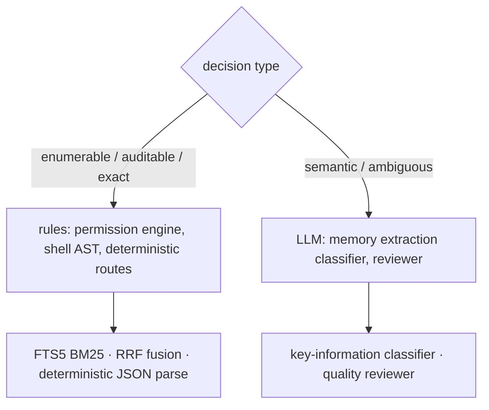
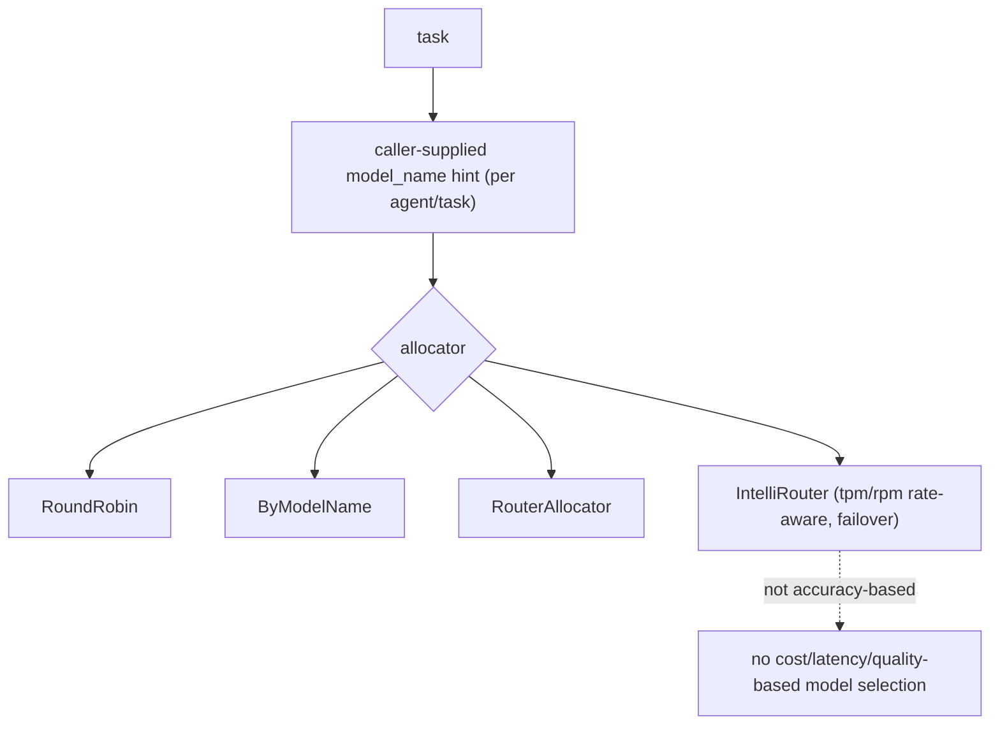
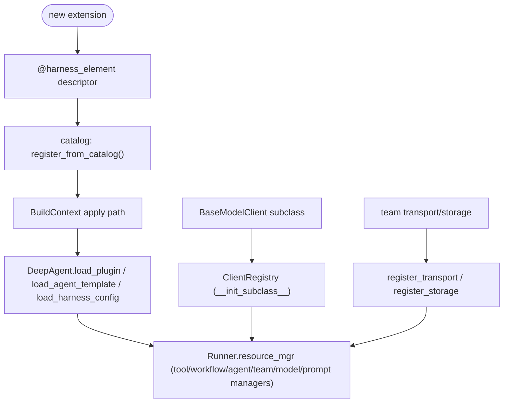
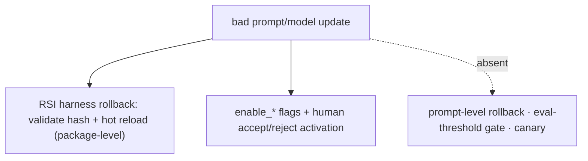
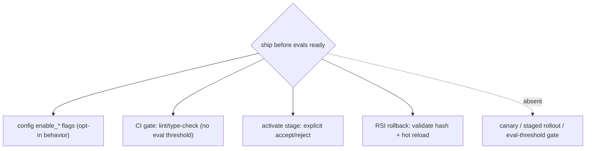

# General engineering

5 unique questions, deduplicated from the archived docs. Each `##` is one question; identical questions from other docs were merged. Full source files are in `source/`.
## 1. Deciding when a problem actually needs an LLM versus a simpler rule-based system

**General:** Use a rule-based/deterministic system when the logic is enumerable, must be auditable, or needs exact reproducibility (validation, routing by known patterns, permission checks, arithmetic, parsing). Use an LLM when the task is semantic, open-ended, or handles ambiguity that rules cannot enumerate (summarization, intent, extraction from messy text). Rules for control, LLM for meaning; often both.

**Jiuwen:** The codebase deliberately routes many decisions through deterministic code. The permission engine is a pure rule/AST engine — its docstring notes the model is not used on the permission path — evaluating tiered regex rules and a tree-sitter shell AST before falling back to ASK. The product's auto-permission layer has deterministic routes that hard-block/ask by URL scheme, egress fields, and capability side-effects before any reviewer is consulted. Lexical/deterministic retrieval coexists with vector paths (SQLite FTS5 BM25, RRF rank fusion), and structured JSON is extracted with deterministic parsers. Conversely, memory extraction uses an LLM key-information classifier because judging "is this worth remembering" is semantic.

Anchors

<strong>Anchors:</strong> &bull; <code>agent-core/openjiuwen/harness/security/permission_engine/core.py:192</code> — docstring: LLM not used on the permission path &bull; <code>agent-core/openjiuwen/harness/security/permission_engine/toolguard/tool_policy.py:588</code> — rule-based tiered policy; <code>agent-core/openjiuwen/harness/security/permission_engine/toolguard/shell_ast.py:82</code> — deterministic parse &bull; <code>jiuwenswarm/jiuwenswarm/agents/harness/common/rails/permissions/auto_decision.py:73</code> <code>deterministic_guard_route</code>; <code>:116</code> <code>deterministic_domain_route</code> &bull; <code>jiuwenswarm/jiuwenswarm/agents/harness/common/memory/internal.py:165</code> <code>bm25_rank_to_score</code>; <code>jiuwenswarm/jiuwenswarm/agents/harness/common/memory/manager.py:1044</code> FTS BM25 &bull; <code>agent-core/openjiuwen/core/retrieval/utils/fusion.py:15</code> <code>rrf_fusion</code>; <code>agent-core/openjiuwen/core/foundation/store/index/simple_memory_index.py:348</code> sort by score &bull; <code>agent-core/openjiuwen/core/context_engine/context/message_buffer.py:74</code> — deterministic drop beyond 2× &bull; <code>agent-core/openjiuwen/rsi/harness_rsi/auto_harness/infra/parsers.py:147</code> — deterministic JSON extraction &bull; <code>agent-core/openjiuwen/core/memory/process/extract/memory_analyzer.py:26</code> — LLM classifier (semantic)

**Gap.** The boundary is principled but implicit — no single "classifier vs LLM" decision function or policy table exists; each subsystem chooses independently.

_Canonical source: `source/ai-engineer-technical-questions_for_engineers.md`; also covered in: engineering._

## 2. Larger model vs. smaller, faster one for a given task

**General:** Match model capability to task difficulty: use a large model for reasoning/ambiguity and a small/fast one for classification, extraction, routing, and formatting. Measure quality per task and weigh latency and cost; route by task, and fall back to the larger model only when needed. A leaderboard score is a prior, not a per-task decision.

**Jiuwen:** Model selection here is about availability and endpoint distribution, not task quality. A team can declare a `model_pool` of endpoints or a `ModelRouterConfig`/`IntelliRouterConfig` convenience shape; allocators (`RoundRobin`, `ByModelName`, `Router`, `IntelliRouter`) pick an entry by rotation or an explicit `model_name` hint supplied per agent/task. IntelliRouter is rate-aware only through `tpm`/`rpm` budgets. The `ModelPoolEntry` metadata comment ("weights, affinity hints") is documented but not implemented.

Anchors

<strong>Anchors:</strong> &bull; <code>agent-core/openjiuwen/agent_teams/models/pool.py:38</code> — <code>ModelPoolEntry</code>; <code>:133</code> <code>ModelRouterConfig</code>; <code>:241</code> <code>IntelliRouterDeployment</code>; <code>:314</code> <code>IntelliRouterConfig</code>; <code>:278</code> tpm/rpm rate-aware; <code>:95</code> "weights/affinity hints" (documented, not implemented) &bull; <code>agent-core/openjiuwen/agent_teams/models/allocator.py:176</code> round-robin; <code>:240</code> by-model-name; <code>:452</code> IntelliRouter; <code>:559</code> <code>build_model_allocator</code>; <code>:28</code> allocation-vs-reliability docstring &bull; <code>agent-core/openjiuwen/harness/schema/config.py:242</code> / <code>agent-core/openjiuwen/harness/schema/deep_agent_spec.py:441</code> — per-agent/task model config

**Gap.** Routing is not accuracy-based and has no cost/latency/quality-based selection. Choosing a smaller cheap model is a caller/human decision expressed as a `model_name` hint.

_Canonical source: `source/ai-engineer-technical-questions_for_engineers.md`; also covered in: engineering._

## 3. How do you evaluate whether a framework will scale with your team, not just your first prototype

**General:** Look for declarative registration and plugins, stable extension contracts, provider and config abstraction, schema'd configuration, and real documentation. Be wary of frameworks where every change means patching internals. Prototype speed is not the same as team-scale maintainability.

**Jiuwen:** Extension is registry/manifest based rather than patch based. Provider modules declare `@harness_element(kind, name, ...)` descriptors; `register_from_catalog()` converts the catalog into class registrations, and `DeepAgent.load_plugin` / `load_agent_template` / `load_harness_config` hot-load packages through one `BuildContext` apply path. Model providers auto-register via `BaseModelClient.__init_subclass__` into `ClientRegistry`, and team infrastructure uses `register_transport`/`register_storage` name→config registries. `Runner.resource_mgr` centralizes tool/workflow/agent/team/model/prompt managers, and the product demonstrates the pattern: `jiuwenswarm/agents/swarm/registry.py` imports provider modules and drives registration from the manifest catalog.

Anchors

<strong>Anchors:</strong> &bull; <code>agent-core/openjiuwen/harness/manifest/catalog.py:67</code> — <code>@harness_element</code>; <code>:55</code> <code>list_elements()</code>; <code>agent-core/openjiuwen/harness/manifest/registration.py:31</code> — <code>register_from_catalog</code> &bull; <code>agent-core/openjiuwen/harness/deep_agent.py:2027</code> — <code>load_plugin</code>; <code>:2076</code> <code>load_agent_template</code>; <code>:2190</code> <code>load_harness_config</code> &bull; <code>agent-core/openjiuwen/core/foundation/llm/model_clients/base_model_client.py:53</code> — <code>__init_subclass__</code> auto-registration; <code>agent-core/openjiuwen/core/common/clients/client_registry.py:19/50/94</code> &bull; <code>agent-core/openjiuwen/core/runner/resources_manager/resource_registry.py:13</code> — <code>ResourceRegistry</code> &bull; <code>agent-core/openjiuwen/harness/schema/config.py:248</code>; <code>agent-core/openjiuwen/harness/schema/deep_agent_spec.py:354</code> — config schema (Pydantic) &bull; <code>agent-core/openjiuwen/agent_teams/schema/blueprint.py:99</code> — <code>TransportSpec</code>/<code>StorageSpec</code> registry pattern &bull; <code>jiuwenswarm/jiuwenswarm/agents/swarm/registry.py:8-12</code> — product-side provider registration via the catalog

**Gap.** There is no visible semantic-versioning or deprecation policy for `@harness_element` names or config fields — the descriptor stores a factory ref and an input JSON schema but no version. Adding a new tool/rail also requires touching prompt/description contracts (a documentation discipline, not enforced by types). The legacy `single_agent/legacy/` surface shows the cost of past API drift.

_Canonical source: `source/ai-agent-framework-interview-questions_for_engineers.md`; also covered in: framework._

## 4. What's your rollback plan if a prompt or model update degrades output quality?

**General:** Make every change reversible and observable: version the prompt/model, ship behind a flag or canary, define a one-command rollback, and gate broad rollout on a fixed eval. Monitor quality (not just errors) so you detect the degradation, and keep the previous version warm.

**Jiuwen:** Rollback exists for whole RSI **harness packages**: `rollback(installation_id)` refuses while tasks are active, validates the target hash, hot-reloads the prior version, and compensates if the pointer write fails — exposed over the WebSocket protocol. Behavior is gated by `enable_*` flags and a human `accept`/`reject` activation step. But there is **no prompt-level rollback** and no eval-threshold release gate, so a bad prompt change is only reversible if it was packaged as a harness version.

Anchors

<strong>Anchors:</strong> &bull; <code>jiuwenswarm/jiuwenswarm/agents/harness/common/rsi/harness_activation.py:617</code> — <code>rollback</code>; <code>:682</code> <code>_assert_rollback_allowed</code>; <code>:694</code> validate target hash &bull; <code>jiuwenswarm/jiuwenswarm/server/rsi/rsi_handlers.py:218/224</code> — versions list + rollback RPC &bull; <code>agent-core/openjiuwen/harness/schema/deep_agent_spec.py:448</code> — <code>enable_*</code> flags &bull; <code>agent-core/openjiuwen/auto_harness/stages/activate.py:118</code> — explicit <code>accept</code>/<code>reject</code> &bull; <code>agent-core/openjiuwen/auto_harness/resources/ci_gate.yaml:21</code> — no eval gate

_Canonical source: `source/llm-applied-interview-questions_for_engineers.md`; also covered in: llm-applied._

## 5. A stakeholder wants to ship before your eval scores are ready, how do you handle it

**General:** This is mostly process. De-risk instead of refusing: ship behind a flag or to a small canary, define a rollback path, cap the blast radius, agree on a minimal offline eval before broad rollout, and add monitoring so a quality drop is caught quickly. Make the tradeoff explicit (what's unmeasured, what the fallback is) and put a date on the missing eval.

**Jiuwen:** The closest code mechanisms are CI gates and explicit human activation, not an eval-score gate. The auto-harness `CIGateRunner` loads gates from `ci_gate.yaml` and returns pass/fail; the activate stage requires an explicit user `accept`/`reject` before an extension is hot-loaded; and the product's RSI harness activation supports rollback (refuses while tasks are active, validates the target hash, hot-loads the old version). Behavior gating is done with `enable_*` config flags. There is no release gate tied to eval thresholds and no canary/percentage rollout.

Anchors

<strong>Anchors:</strong> &bull; <code>agent-core/openjiuwen/auto_harness/infra/ci_gate_runner.py:168</code> load gates; <code>:1153</code> run + aggregate <code>passed</code> &bull; <code>agent-core/openjiuwen/auto_harness/stages/activate.py:118</code> — explicit <code>accept</code>/<code>reject</code> interaction before hot-load &bull; <code>agent-core/openjiuwen/auto_harness/stages/merge.py:95</code> — static-check retry (max 3) then fail-fast &bull; <code>jiuwenswarm/jiuwenswarm/agents/harness/common/rsi/harness_activation.py:617</code> <code>rollback</code>; <code>:682</code> <code>_assert_rollback_allowed</code>; <code>:694</code> validate target hash &bull; <code>agent-core/openjiuwen/harness/schema/deep_agent_spec.py:448</code> — <code>enable_*</code> config flags

**Gap.** No eval-threshold release gate and no canary/percentage rollout; the decision is human process, supported only by feature flags, explicit activation, CI checks, and manual rollback.

_Canonical source: `source/ai-engineer-technical-questions_for_engineers.md`; also covered in: engineering._
