# RAG pipelines and patterns

## 1. Walking through a RAG pipeline end to end, query to final answer

**General:** Ingest: parse → chunk → embed → index. Query: embed the query → retrieve top-k (dense and/or sparse) → rerank → assemble the retrieved context into the prompt → generate → optionally cite. Each stage is separable; failures and quality drops can occur at any of them.

**Jiuwen:** Ingestion: `KnowledgeBase.parse_files` (parser), then `SimpleKnowledgeBase.add_documents` calls `chunker.chunk_documents`, builds an `IndexConfig`, and `Indexer.build_index` computes embeddings via `compute_chunk_embeddings` and writes them to the vector store. Query: `SimpleKnowledgeBase.retrieve` lazily instantiates `VectorRetriever`/`SparseRetriever`/`HybridRetriever` by `index_type`, embeds the query, and calls `vector_store.search`. The production end-to-end wiring is the workflow `KnowledgeRetrievalComponent`, which returns `results`/`context` (texts joined by `\n\n`); a downstream `LLMComponent` formats them (e.g. `Context:\n{{context}}\n\nQuestion: {{query}}`).

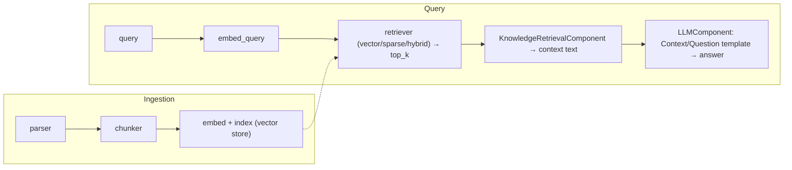

Anchors

<strong>Anchors:</strong> &bull; <code>agent-core/openjiuwen/core/retrieval/simple_knowledge_base.py:96</code> — <code>chunk_documents</code>; <code>:110</code> <code>build_index(chunks=..., embed_model=...)</code>; <code>:182</code> delegate to retriever &bull; <code>agent-core/openjiuwen/core/retrieval/indexing/indexer/embed_chunks.py:46/73</code> — <code>embed_documents</code> / <code>embed_multimodal</code> set <code>chunk.embedding</code> &bull; <code>agent-core/openjiuwen/core/retrieval/retriever/vector_retriever.py:78</code> — <code>embed_query</code> → <code>vector_store.search</code> &bull; <code>agent-core/openjiuwen/core/workflow/components/resource/knowledge_retrieval_comp.py:109</code> — <code>retrieve_multi_kb_with_source(...)</code>; <code>:243</code> joins texts into <code>context</code> &bull; <code>agent-core/openjiuwen/core/workflow/components/llm/llm_comp.py:654</code> — template format feeding <code>{{context}}</code>/<code>{{query}}</code>

**Gap.** No packaged end-to-end RAG agent or retrieval tool in `harness`/`agent_teams`; `KnowledgeRetrievalComponent` only emits a string. Retrieved context is concatenated with no token-budget trimming and no citation synthesis.

_Canonical source: `source/ai-engineer-technical-questions_for_engineers.md`; also covered in: engineering, genai, llm-applied, rag-1._

## 2. The pipeline: query embedding, vector search, context assembly, prompt construction, generation

**General:** Ingest: parse → chunk → embed → index. Query: embed the query → retrieve top-k (dense and/or sparse) → rerank → assemble the retrieved context into the prompt → generate → optionally cite. Each stage is separable; failures and quality drops can occur at any of them.

**Jiuwen:** Ingestion: `KnowledgeBase.parse_files` (parser), then `SimpleKnowledgeBase.add_documents` calls `chunker.chunk_documents`, builds an `IndexConfig`, and `Indexer.build_index` computes embeddings via `compute_chunk_embeddings` and writes them to the vector store. Query: `SimpleKnowledgeBase.retrieve` lazily instantiates `VectorRetriever`/`SparseRetriever`/`HybridRetriever` by `index_type`, embeds the query, and calls `vector_store.search`. The production end-to-end wiring is the workflow `KnowledgeRetrievalComponent`, which returns `results`/`context`; a downstream `LLMComponent` formats them into the prompt.

Anchors

<strong>Anchors:</strong> &bull; <code>agent-core/openjiuwen/core/retrieval/simple_knowledge_base.py:96</code> — <code>chunk_documents</code>; <code>:110</code> <code>build_index(...)</code>; <code>:182</code> delegate to retriever &bull; <code>agent-core/openjiuwen/core/retrieval/indexing/indexer/embed_chunks.py:46/73</code> — <code>embed_documents</code> / <code>embed_multimodal</code> &bull; <code>agent-core/openjiuwen/core/retrieval/retriever/vector_retriever.py:78</code> — <code>embed_query</code> → <code>vector_store.search</code> &bull; <code>agent-core/openjiuwen/core/workflow/components/resource/knowledge_retrieval_comp.py:109</code> — <code>retrieve_multi_kb_with_source(...)</code>; <code>:243</code> joins texts into <code>context</code> &bull; <code>agent-core/openjiuwen/core/workflow/components/llm/llm_comp.py:654</code> — template format feeding <code>{{context}}</code>/<code>{{query}}</code>

**Gap.** No packaged end-to-end RAG agent or retrieval tool in `harness`/`agent_teams`.

_Canonical source: `source/rag-practical-interview-questions_for_engineers.md`; also covered in: rag-practical._

## 3. What is Modular RAG, and how is it different from a simple RAG pipeline

**General:** A simple RAG pipeline is a fixed linear chain (retrieve → stuff → generate). Modular RAG decomposes it into interchangeable modules — indexing, retrieval, fusion, reranking, query rewriting, generation, orchestration — with routing and scheduling, so you can swap or add modules (rewrite, rerank, iterative/multi-hop retrieval) and branch conditionally per query. It is "RAG as a configurable graph of components" rather than one hardcoded path. The cost is more moving parts and the need for a router/orchestrator.

**Jiuwen:** The building blocks are modular and pluggable: parsers self-register by extension, chunkers are selected from a registry, retrievers are chosen by `index_type`, the vector store comes from a factory, rerankers and query rewriters are swappable classes, and `RetrievalConfig.agentic` toggles the LLM-driven iterative retriever. But the modules are composed **manually** via config/KB construction — there is no per-query router/scheduler that assembles a module graph, and `AgenticRetriever` derives its mode from `index_type` rather than planning.

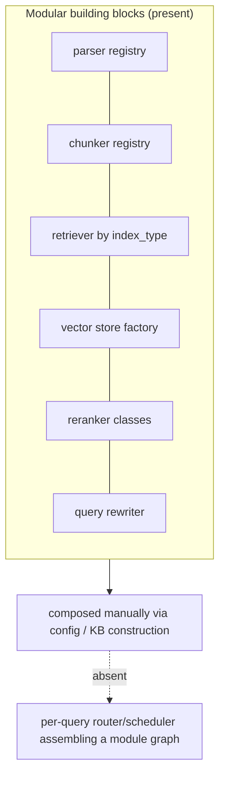

Anchors

<strong>Anchors:</strong> &bull; <code>agent-core/openjiuwen/core/retrieval/indexing/processor/parser/auto_file_parser.py:21</code> — parser registry by extension &bull; <code>agent-core/openjiuwen/core/retrieval/indexing/processor/chunker/__init__.py:117</code> — chunker registry &bull; <code>agent-core/openjiuwen/core/retrieval/simple_knowledge_base.py:141</code> — retriever selection by <code>index_type</code>; <code>:172</code> agentic wrap toggle &bull; <code>agent-core/openjiuwen/core/retrieval/vector_store/store.py:16</code> — vector store factory; <code>agent-core/openjiuwen/core/retrieval/common/config.py:67</code> — <code>StoreType</code> &bull; <code>agent-core/openjiuwen/core/retrieval/reranker/standard_reranker.py:23</code> — swappable reranker &bull; <code>agent-core/openjiuwen/core/retrieval/query_rewriter/query_rewriter.py:412</code> — query rewriter module &bull; <code>agent-core/openjiuwen/core/retrieval/common/config.py:51</code> — <code>agentic</code> toggle

_Canonical source: `source/rag-part1-interview-questions_for_engineers.md`; also covered in: rag-1._

## 4. Deciding chunk size, and what breaks at each extreme

**General:** Chunk size trades context against precision. Too small and each chunk lacks the context to answer (and the answer may be split across chunks); too large and a chunk covers many topics, diluting the embedding and wasting the prompt budget. Practical defaults are a few hundred tokens with modest overlap, then tune against a retrieval eval. Size is usually measured in tokens (what the model sees), not characters.

**Jiuwen:** `Chunker.__init__` defaults `chunk_size=512`, `chunk_overlap=50`, `length_function=len`. Size is measured in characters (`CharChunker` → `CharSplitter`, `len()`) or tokens (`TokenizerChunker` → `IndexSentenceSplitter` → `SentenceSplitter`, tokenizer length). Hard validation rejects `chunk_size<=0`, `chunk_overlap<0`, and `chunk_overlap>=chunk_size`. Token-based chunk size is silently clamped to the embedding tokenizer's `model_max_length` (`_resolve_chunk_size`), and DB caps fail at write time (Milvus text field `max_length=65535`, pgvector dims ≤2000).

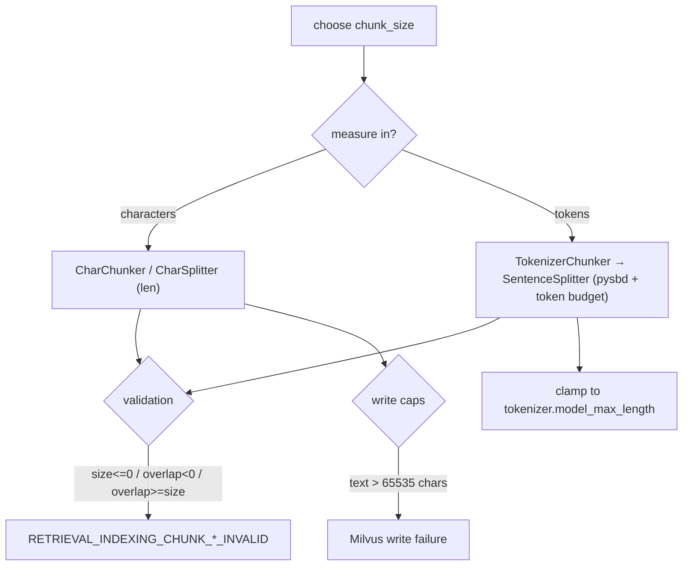

Anchors

<strong>Anchors:</strong> &bull; <code>agent-core/openjiuwen/core/retrieval/indexing/processor/chunker/base.py:36</code> — defaults <code>chunk_size=512</code>, <code>chunk_overlap=50</code>; <code>:59/64/69</code> validation raises &bull; <code>agent-core/openjiuwen/core/retrieval/common/config.py:34</code> — <code>KnowledgeBaseConfig.chunk_size/chunk_overlap</code> &bull; <code>agent-core/openjiuwen/core/retrieval/indexing/processor/chunker/text_splitter.py:15</code> — <code>DEFAULT_CHUNK_SIZE=200</code>; <code>:198</code> <code>_resolve_chunk_size</code> clamps to <code>tokenizer.model_max_length</code> &bull; <code>agent-core/openjiuwen/core/retrieval/indexing/processor/chunker/chunking.py:82</code> — <code>get_chunker</code> auto-lowers size to tokenizer max &bull; <code>agent-core/openjiuwen/core/retrieval/indexing/indexer/milvus_indexer.py:375</code> — text field <code>max_length=65535</code> &bull; <code>agent-core/openjiuwen/core/retrieval/vector_store/pg_store.py:176</code> — pgvector rejects dim &gt; 2000

**Gap.** `KnowledgeBaseConfig.chunk_size/chunk_overlap` are never read by `SimpleKnowledgeBase.add_documents` (it uses the injected chunker), so those config fields are advisory. No document/file-length limit exists.

_Canonical source: `source/rag-retrieval-interview-questions_for_engineers.md`; also covered in: engineering, rag-retrieval, llm-applied, rag-1, rag-practical._

## 5. What happens if your chunks are too small or too large

**General:** Too small: each chunk lacks the context to answer, the answer gets split across chunks, and recall of the *answer-bearing* chunk drops while index size/overhead grows. Too large: the embedding averages multiple topics so relevance dilutes, retrieval precision drops, and each hit wastes prompt tokens; it can also exceed the embedding model's max sequence length and get truncated. Both extremes lower end-to-end quality, for opposite reasons.

**Jiuwen:** The code guards the mechanics but not the quality: construction rejects `chunk_size <= 0` / `chunk_overlap >= chunk_size`, token chunkers clamp size to the tokenizer max (so oversized chunks are silently truncated to the model limit), and Milvus fails the write above 65535 chars. There is no retrieval-quality feedback loop to tell you a size choice was bad.

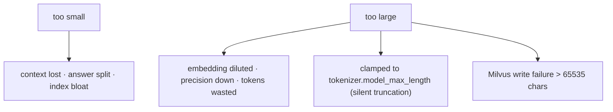

Anchors

<strong>Anchors:</strong> &bull; <code>agent-core/openjiuwen/core/retrieval/indexing/processor/chunker/base.py:59/64/69</code> — validation raises &bull; <code>agent-core/openjiuwen/core/retrieval/indexing/processor/chunker/text_splitter.py:198</code> — <code>_resolve_chunk_size</code> clamps to <code>model_max_length</code> &bull; <code>agent-core/openjiuwen/core/retrieval/indexing/processor/chunker/chunking.py:82</code> — tokenizer-limit auto-adjust &bull; <code>agent-core/openjiuwen/core/retrieval/indexing/indexer/milvus_indexer.py:378</code> — text <code>max_length=65535</code>

_Canonical source: `source/rag-part1-interview-questions_for_engineers.md`; also covered in: rag-1._

## 6. Fixed-size vs. semantic chunking, the actual retrieval tradeoff

**General:** Fixed-size chunking is deterministic and cheap but cuts mid-sentence or mid-table, producing fragments that embed poorly. Semantic / structure-aware chunking splits on natural boundaries (sentences, paragraphs, headings, records) so each chunk is coherent, at the cost of variable size and extra processing. Sentence-window and recursive-delimiter strategies sit between the two.

**Jiuwen:** True fixed-size is `CharChunker` (raw character windows via `CharSplitter`). Token-based `TokenizerChunker` is actually sentence-boundary-aware: `SentenceSplitter` uses `pysbd` to segment and packs whole sentences up to a token budget, sub-splitting overly long sentences. `HybridChunker` is a structural guard, not a semantic splitter — it keeps `source_type in ("row","column")` units whole and delegates the rest. There is no embedding-similarity breakpoint chunker and no recursive delimiter hierarchy; `splitter_config` is normalized but never forwarded to `SentenceSplitter` (an inert stub).

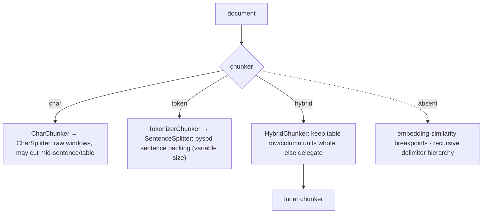

Anchors

<strong>Anchors:</strong> &bull; <code>agent-core/openjiuwen/core/retrieval/indexing/processor/chunker/char_chunker.py:12</code> — <code>CharChunker</code> "fixed size based on character length"; <code>:47</code> builds <code>CharSplitter</code> &bull; <code>agent-core/openjiuwen/core/retrieval/indexing/processor/chunker/text_splitter.py:47</code> — <code>CharSplitter.split</code> slices <code>text[start:end]</code> &bull; <code>agent-core/openjiuwen/core/retrieval/indexing/processor/chunker/tokenizer_chunker.py:17</code> — <code>TokenizerChunker</code> builds <code>IndexSentenceSplitter</code> &bull; <code>agent-core/openjiuwen/core/retrieval/indexing/processor/splitter/splitter.py:92</code> — <code>SentenceSplitter.__call__</code> (pysbd); <code>:142</code> <code>_sentences_with_spans</code>; <code>:173</code> long-sentence sub-split &bull; <code>agent-core/openjiuwen/core/retrieval/indexing/processor/chunker/hybrid_chunker.py:19</code> — <code>HybridChunker</code> no-split predicate; <code>:66</code> delegation &bull; <code>agent-core/openjiuwen/core/retrieval/indexing/processor/chunker/__init__.py:117</code> — only <code>"char"</code>/<code>"hybrid"</code> registered &bull; <code>agent-core/openjiuwen/core/retrieval/indexing/processor/chunker/text_splitter.py:98</code> — <code>splitter_config</code> normalized but not forwarded

_Canonical source: `source/rag-retrieval-interview-questions_for_engineers.md`; also covered in: rag-practical, rag-retrieval._

## 7. Overlapping vs. non-overlapping chunks

**General:** A small overlap preserves context that straddles a boundary, improving recall for answers that span a cut; too much overlap duplicates content, inflates the index, and can return near-identical hits that crowd out diverse results. Non-overlapping is cheaper and deduplicated but risks losing boundary context.

**Jiuwen:** Overlap is a first-class `chunk_overlap` integer (default 50) enforced on both paths. `CharSplitter` does a strided sliding window (`step = chunk_size - chunk_overlap`). `SentenceSplitter` re-injects a suffix of whole sentences from the previous buffer up to the overlap token budget, so token chunks overlap on sentence boundaries. Overlap content is duplicated text across chunks, and chunk IDs are fresh UUIDs each run, so downstream indexing cannot distinguish overlap content.

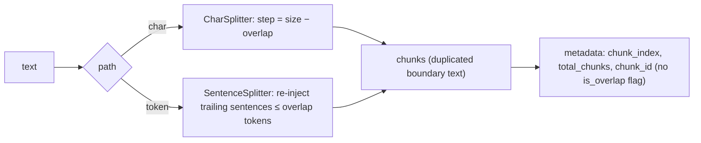

Anchors

<strong>Anchors:</strong> &bull; <code>agent-core/openjiuwen/core/retrieval/indexing/processor/chunker/base.py:39</code> — <code>chunk_overlap: int = 50</code>; <code>:69</code> <code>overlap &gt;= chunk_size</code> raises; <code>:106</code> overlap not carried into metadata &bull; <code>agent-core/openjiuwen/core/retrieval/indexing/processor/chunker/text_splitter.py:41</code> — overlap clamped to <code>[0, size-1]</code>; <code>:54</code> <code>step = chunk_size - chunk_overlap</code>; <code>:56</code> slicing loop; <code>:110</code> token path default <code>chunk_size // 5</code> &bull; <code>agent-core/openjiuwen/core/retrieval/indexing/processor/splitter/splitter.py:215</code> — <code>_flush</code> re-injects trailing sentences ≤ overlap; <code>:186</code> long-segment window step

_Canonical source: `source/rag-retrieval-interview-questions_for_engineers.md`; also covered in: rag-1, rag-retrieval._

## 8. Chunking structured content like tables, code, or nested headings without losing structure

**General:** Structure should be captured at parse time and carried as metadata, not thrown away before chunking. Tables should stay intact or be serialized (row/column/record), code should be split on function/class boundaries with fences preserved, and nested headings should be used as split boundaries with the heading path attached to each chunk. A generic text chunker over flattened content loses all of this.

**Jiuwen:** Structure is preserved at parse time, not chunk time. Excel emits one `Document` per data row and per column tagged `source_type` (`row`/`column`), and `HybridChunker` keeps those as atomic chunks. Word emits heading-marked Markdown (`#`, `##`, …) and Markdown tables. PDF/HTML flatten to newline-joined text; JSON is pretty-printed. Metadata (`source_type`, `sheet_name`, `row_index`, `column_name`, `image_path`, `title`) is propagated from `Document` to `TextChunk` by the chunker base. There is no Markdown-header-aware chunker, so `##` sections can still be split mid-section, and HTML heading tags are discarded before chunking.

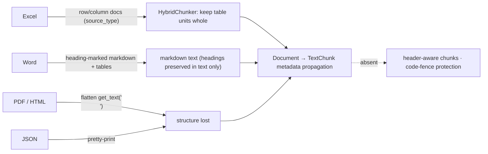

Anchors

<strong>Anchors:</strong> &bull; <code>agent-core/openjiuwen/core/retrieval/indexing/processor/parser/excel_parser.py:32</code> — <code>_rows_to_documents</code>; <code>:69</code> <code>source_type: "row"</code>; <code>:96</code> <code>source_type: "column"</code> &bull; <code>agent-core/openjiuwen/core/retrieval/indexing/processor/parser/word_parser.py:23</code> — <code>_table_to_markdown</code>; <code>:37</code> <code>_paragraph_to_markdown</code> (Heading N → N+1 hashes) &bull; <code>agent-core/openjiuwen/core/retrieval/indexing/processor/chunker/hybrid_chunker.py:19</code> — keeps <code>row</code>/<code>column</code> units as one chunk &bull; <code>agent-core/openjiuwen/core/retrieval/indexing/processor/parser/html_file_parser.py:78</code> — <code>_get_text_from_soup</code> flattens &bull; <code>agent-core/openjiuwen/core/retrieval/indexing/processor/parser/txt_md_parser.py:40</code> — Markdown read verbatim &bull; <code>agent-core/openjiuwen/core/retrieval/indexing/processor/chunker/base.py:106</code> — metadata copied onto every <code>TextChunk</code>

_Canonical source: `source/rag-retrieval-interview-questions_for_engineers.md`; also covered in: rag-retrieval._

## 9. Context relevant but answer vague: chunk boundaries likely cut the answer mid context

**General:** If the answer spans a chunk boundary, the chunk that ranks may contain only half of it, so the model sees an incomplete fact. Remedies: overlap chunks, split on sentence/structure boundaries rather than fixed characters, and at serve time expand a hit with its neighbors. Sentence-aware chunking with overlap is the common fix; fixed-character splitting is the usual culprit.

**Jiuwen:** Protection is inconsistent by chunker. `SentenceSplitter` builds chunks from whole `pysbd` sentences, carries trailing sentences into the next chunk for overlap, and sub-splits over-long sentences losslessly; `HybridChunker` keeps table rows/columns whole. But `CharChunker`/`CharSplitter` (whose `chunk_unit="char"` default sets the unit) hard-cut at fixed offsets, `WhitespaceNormalizer` collapses newlines and destroys paragraph structure before splitting, and downstream `budget_guard`/`round_level_compressor` truncate head/tail (dropping the middle) rather than extracting the answer span.

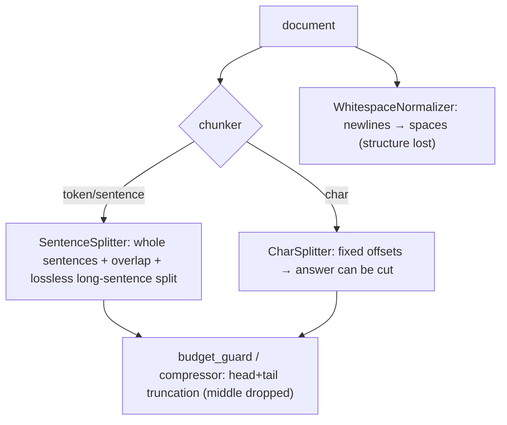

Anchors

<strong>Anchors:</strong> &bull; <code>agent-core/openjiuwen/core/retrieval/indexing/processor/splitter/splitter.py:119</code> — long-sentence sub-split; <code>:142</code> <code>_sentences_with_spans</code>; <code>:210</code> <code>_flush</code> overlap &bull; <code>agent-core/openjiuwen/core/retrieval/indexing/processor/chunker/hybrid_chunker.py:19</code> — keep row/column units whole &bull; <code>agent-core/openjiuwen/core/retrieval/indexing/processor/chunker/text_splitter.py:56</code> — <code>CharSplitter</code> fixed offsets &bull; <code>agent-core/openjiuwen/core/retrieval/indexing/processor/chunker/text_preprocessor.py:53</code> — <code>WhitespaceNormalizer</code> &bull; <code>agent-core/openjiuwen/core/context_engine/processor/budget_guard.py:118</code> — head/tail truncation; <code>agent-core/openjiuwen/core/context_engine/processor/compressor/round_level_compressor.py:1088</code> — <code>_build_head_tail_truncated_text</code>

_Canonical source: `source/rag-practical-interview-questions_for_engineers.md`; also covered in: rag-practical._

## 10. Picking an embedding model, and whether bigger always means better retrieval

**General:** Bigger is not automatically better: retrieval quality depends on domain fit, the language, whether the model is asymmetric (query vs passage prefixes), the dimension you can afford, and latency/cost. A smaller in-domain model often beats a large general one, and dimensionality reduction (Matryoshka) can trade a little recall for large storage savings. The right way to pick is to measure recall on your own data, not to read a leaderboard.

**Jiuwen:** An `Embedding` ABC defines `embed_query`, `embed_documents`, and a `dimension` property; `EmbeddingConfig` carries only `model_name`/`base_url`/`api_key`. Providers are `APIEmbedding` (generic HTTP), `OpenAIEmbedding` (OpenAI-compatible), `VLLMEmbedding` (extends OpenAI, adds multimodal `instruction`), and `DashscopeEmbedding`. Dimension is discovered lazily from the first response or set explicitly for Matryoshka models. Batching is provider-level (`max_batch_size=8`, `max_concurrent=50`). Model choice is entirely caller-driven — there is no model registry, benchmark, or size heuristic.

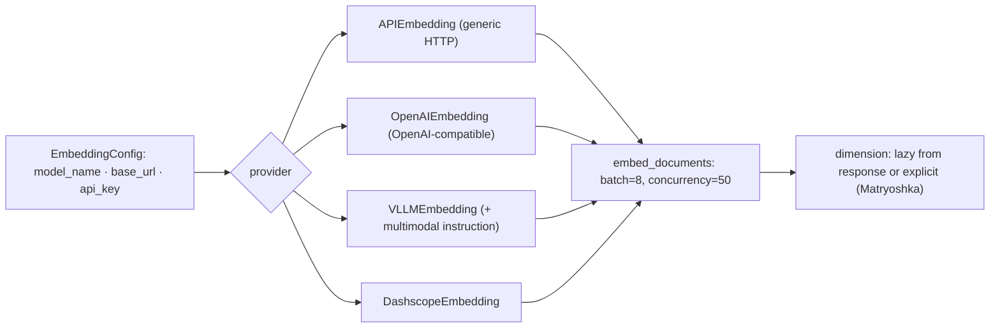

Anchors

<strong>Anchors:</strong> &bull; <code>agent-core/openjiuwen/core/foundation/store/base_embedding.py:16</code> — <code>EmbeddingConfig</code>; <code>:24</code> <code>Embedding</code> ABC; <code>:29</code> <code>embed_query</code> &bull; <code>agent-core/openjiuwen/core/retrieval/embedding/openai_embedding.py:67</code> — Matryoshka <code>dimension</code> &bull; <code>agent-core/openjiuwen/core/retrieval/embedding/dashscope_embedding.py:105</code> — Dashscope <code>dimension</code> &bull; <code>agent-core/openjiuwen/core/retrieval/embedding/api_embedding.py:45</code> — <code>max_batch_size=8</code>; <code>:46</code> <code>max_concurrent=50</code>; <code>:175</code> batch splitting/concurrency &bull; <code>agent-core/openjiuwen/core/retrieval/embedding/vllm_embedding.py:17</code> — <code>VLLMEmbedding</code>

**Gap.** No `create_embedding` factory or model-selection helper in `core/retrieval` (only `create_vector_store` exists there; embedding factories live elsewhere, e.g. `create_embedding_provider` in the memory subsystem), and no evaluation/benchmark to justify model size.

_Canonical source: `source/rag-retrieval-interview-questions_for_engineers.md`; also covered in: rag-1, rag-practical, rag-retrieval._

## 11. Should queries and documents use the same embedding model

**General:** Yes — queries and documents must be embedded by the same model, and for asymmetric models you must also apply the correct role prefix (e.g. `query:` vs `passage:`) to each side. Mixing models produces incomparable vectors; dropping the role prefix on an instruction-tuned model measurably degrades retrieval.

**Jiuwen:** In the KB pipeline they do: one `embed_model` instance is held on the KB, passed to `build_index` for documents and to the constructed `VectorRetriever`/`HybridRetriever` for queries. Query embedding uses `embed_query`; document embedding uses `embed_documents`. For Dashscope, `embed_query` literally calls `embed_documents([text])` (the OpenAI-compatible client calls the same shared embedding method directly), so there is no query-vs-passage prefix distinction. Only `VLLMEmbedding.embed_multimodal` supports an `instruction`. Nothing validates that the retriever's model matches the indexer's (only dimension is indirectly constrained by the collection schema).

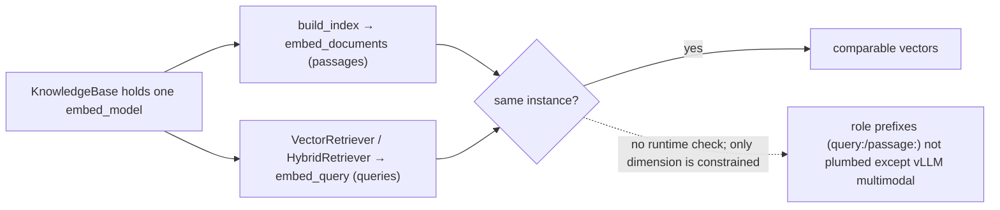

Anchors

<strong>Anchors:</strong> &bull; <code>agent-core/openjiuwen/core/retrieval/retriever/vector_retriever.py:78</code> — query <code>embed_query</code> &bull; <code>agent-core/openjiuwen/core/retrieval/indexing/indexer/embed_chunks.py:46</code> — docs <code>embed_documents</code> &bull; <code>agent-core/openjiuwen/core/retrieval/simple_knowledge_base.py:110</code> — index build uses <code>self.embed_model</code>; <code>:144</code> <code>VectorRetriever(embed_model=...)</code>; <code>:157</code> <code>HybridRetriever(embed_model=...)</code> &bull; <code>agent-core/openjiuwen/core/retrieval/knowledge_base.py:34</code> — single <code>embed_model</code> field &bull; <code>agent-core/openjiuwen/core/retrieval/embedding/dashscope_embedding.py:124</code> — <code>embed_query</code> delegates to <code>embed_documents</code> &bull; <code>agent-core/openjiuwen/core/retrieval/embedding/vllm_embedding.py:25</code> — instruction only for multimodal

_Canonical source: `source/rag-retrieval-interview-questions_for_engineers.md`; also covered in: rag-retrieval._

## 12. Why swapping embedding models forces a full re-embedding of the corpus

**General:** Stored vectors are the output of one specific model. A different model — even at the same dimension — projects into a different space, so old and new vectors are not comparable; distance computations become meaningless. You must re-embed every chunk (and often rebuild the index, since the vector width may change too). Good systems persist a model fingerprint/version with the index so a mismatch is detected rather than silently corrupted.

**Jiuwen:** At index time `compute_chunk_embeddings` calls `embed_model.embed_documents` and mutates `chunk.embedding` in place; indexers trigger it only for `vector`/`hybrid` index types. Milvus derives the collection vector `dim` from `embed_model.dimension` at schema creation and stores only the width — the model identity/name is **not persisted**. `update_index` deletes a doc's rows and rebuilds (re-embeds). Dimension is a hard constraint: Milvus/Chroma collections and pgvector tables are fixed-width (pgvector rejects >2000). So a model swap means a manual full re-index; there is only a low-level dimension-update migration operation with an optional re-embed callback.

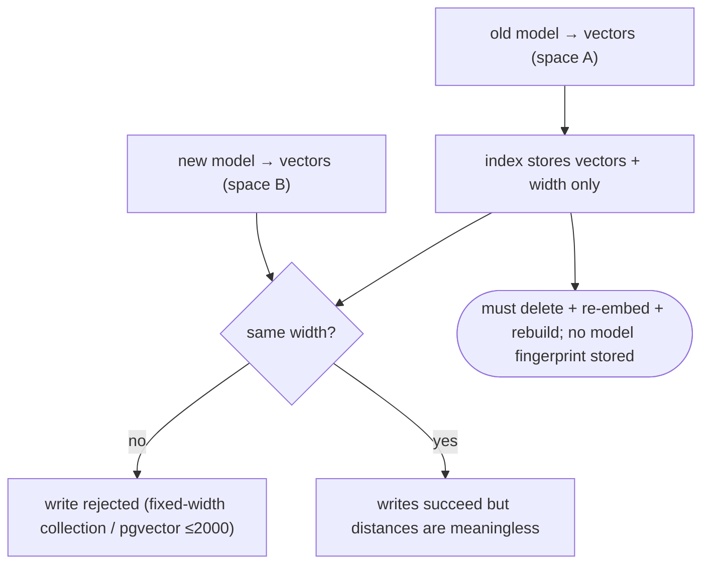

Anchors

<strong>Anchors:</strong> &bull; <code>agent-core/openjiuwen/core/retrieval/indexing/indexer/embed_chunks.py:21</code> — <code>compute_chunk_embeddings</code>; <code>:46</code> <code>embed_documents</code> sets vectors &bull; <code>agent-core/openjiuwen/core/retrieval/indexing/indexer/milvus_indexer.py:156</code> — embedding only for vector/hybrid; <code>:409</code> <code>dimension = embed_model.dimension</code>; <code>:427</code> schema stores <code>dim</code> but no model name; <code>:209</code> <code>update_index</code> = delete + rebuild &bull; <code>agent-core/openjiuwen/core/retrieval/graph_knowledge_base.py:294</code> — <code>update_documents</code> delete + re-add &bull; <code>agent-core/openjiuwen/core/retrieval/vector_store/pg_store.py:129</code> — fixed pgvector table definition &bull; <code>agent-core/openjiuwen/core/foundation/store/vector/utils.py:264</code> — <code>UpdateEmbeddingDimensionOperation</code>

_Canonical source: `source/rag-retrieval-interview-questions_for_engineers.md`; also covered in: rag-practical, rag-retrieval._

## 13. Multilingual documents: multilingual embedding models, translate at query or index time

**General:** Use a multilingual/alignment embedding model so queries and documents land in one space; if no good multilingual model exists for a language, translate either at index time (normalize the corpus) or query time (translate the query), and store language metadata so you can route and evaluate per language. Cross-lingual rerankers help at the top.

**Jiuwen:** Effectively bilingual zh/en at the processing layer, with no translation. `SentenceSplitter` resolves `lan` via a Chinese-character-ratio heuristic (→ zh or en) for `pysbd`; explicit codes are passed through (documented in the splitter docstrings). The query rewriter's `prompt_lang` only picks a `_zh.md`/`_en.md` template and never translates. Embedding clients expose no language parameter — multilingual support exists only if the operator picks a multilingual embedding model. No language metadata is persisted and there is no language routing.

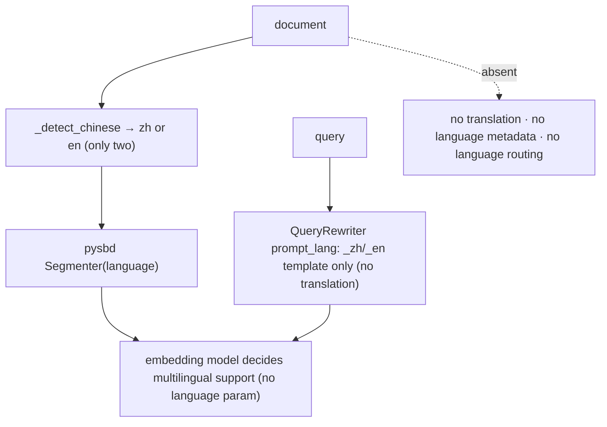

Anchors

<strong>Anchors:</strong> &bull; <code>agent-core/openjiuwen/core/retrieval/indexing/processor/splitter/splitter.py:17</code> — <code>lan: str = "auto"</code>; <code>:46</code> <code>_detect_chinese(threshold=0.1)</code>; <code>:105</code> builds <code>Segmenter(language=...)</code> &bull; <code>agent-core/openjiuwen/core/retrieval/indexing/processor/chunker/text_splitter.py:81</code> — <code>IndexSentenceSplitter(language="auto")</code> &bull; <code>agent-core/openjiuwen/core/retrieval/indexing/processor/chunker/tokenizer_chunker.py:25</code> — <code>language="auto"</code> &bull; <code>agent-core/openjiuwen/core/retrieval/query_rewriter/query_rewriter.py:228</code> — <code>prompt_lang: str = "zh"</code>; <code>:309</code> template selection &bull; <code>agent-core/openjiuwen/core/retrieval/embedding/openai_embedding.py:140</code> — no language field; <code>agent-core/openjiuwen/core/retrieval/embedding/dashscope_embedding.py:37</code> — multimodal, not multilingual

_Canonical source: `source/rag-practical-interview-questions_for_engineers.md`; also covered in: rag-practical._

## 14. Handling multiple document types and formats in the same system

**General:** Normalize everything to one record shape (text + metadata + id) at ingestion, with a parser per format behind a registry keyed by MIME/extension, and preserve format-specific structure as metadata. Chunking and indexing then operate on the uniform record. The risks are silent format gaps (a parser that drops structure) and mixed semantics (tables vs prose) needing different chunk policies.

**Jiuwen:** Format dispatch is an extension-keyed plugin registry loaded lazily by `AutoFileParser._ensure_parsers_loaded`; each parser returns `Document` objects with a common text+metadata shape. Registered extensions cover `.txt/.md/.markdown`, `.pdf`, `.docx`, `.xlsx/.csv/.tsv`, `.htm/.html`, `.json`, and `.png/.jpg/.jpeg/.webp/.gif/.jfif`; `AutoParser` adds URL routing (WeChat vs generic web). `source_type` (`row`/`column`/`web_page`/`wechat_article`) and `image_path` distinguish semantics. Downstream chunking/indexing is format-agnostic. Word/PDF/JSON/TXT parsers set no `source_type` (only `file_ext`), and there is no per-format chunking policy beyond `HybridChunker`'s row/column predicate.

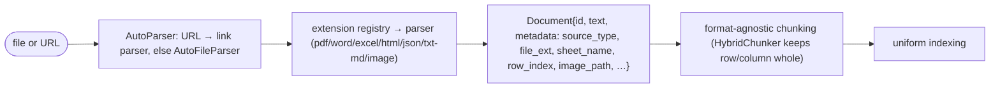

Anchors

<strong>Anchors:</strong> &bull; <code>agent-core/openjiuwen/core/retrieval/indexing/processor/parser/auto_parser.py:23</code> — <code>AutoParser</code> URL vs file routing; <code>:48</code> <code>parse</code> &bull; <code>agent-core/openjiuwen/core/retrieval/indexing/processor/parser/auto_file_parser.py:24</code> — <code>@register_parser(file_extensions)</code> registry; <code>:98</code> extension dispatch; <code>:121</code> enriches <code>doc_id</code>/<code>title</code>/<code>file_path</code>/<code>file_ext</code> &bull; <code>agent-core/openjiuwen/core/retrieval/indexing/processor/parser/txt_md_parser.py:14</code> — <code>.txt/.md/.markdown</code>; <code>agent-core/openjiuwen/core/retrieval/indexing/processor/parser/pdf_parser.py:16</code> <code>.pdf</code>; <code>agent-core/openjiuwen/core/retrieval/indexing/processor/parser/word_parser.py:63</code> <code>.docx</code>; <code>agent-core/openjiuwen/core/retrieval/indexing/processor/parser/excel_parser.py:131</code> <code>.xlsx/.csv/.tsv</code>; <code>agent-core/openjiuwen/core/retrieval/indexing/processor/parser/html_file_parser.py:89</code> <code>.htm/.html</code>; <code>agent-core/openjiuwen/core/retrieval/indexing/processor/parser/json_parser.py:15</code> <code>.json</code>; <code>agent-core/openjiuwen/core/retrieval/indexing/processor/parser/image_parser.py:15</code> images &bull; <code>agent-core/openjiuwen/core/foundation/store/base_reranker.py:29</code> — uniform <code>Document{id_, text, metadata}</code> &bull; <code>agent-core/openjiuwen/core/retrieval/indexing/processor/chunker/base.py:91</code> — <code>chunk_documents</code> uniform conversion

_Canonical source: `source/rag-retrieval-interview-questions_for_engineers.md`; also covered in: rag-2, rag-retrieval, rag-system._

## 15. RAG vs. pasting retrieved text into a long-context prompt

**General:** With a large context window you can skip retrieval and paste whole documents. That is simpler and avoids chunking errors, but it is expensive (you pay for every token every call), slow (TTFT grows with context), noisy (irrelevant text dilutes attention), and limited to what fits. RAG pays a one-time indexing cost and per-query retrieval, keeps the prompt small, and scales to corpora far larger than any window. The trade is a retrieval system and its failure modes for token efficiency and scale.

**Jiuwen:** The KB is not budgeted against the model window. `KnowledgeRetrievalExecutable._format_output` simply concatenates result texts with `"\n\n"` into a `context` string — the only bound is `top_k`; there is no token count, truncation, or window check before insertion. The context engine has real budgeting primitives (`context_window_tokens`, `effective_context_budget`, `ContextWindowUsage.occupancy_rate`, `FullCompactProcessor` at 180k), but those apply to the *conversation*, and retrieved text enters as ordinary messages measured only after the fact. There is no comparison or decision guidance for "retrieve top-k" vs. "paste whole document".

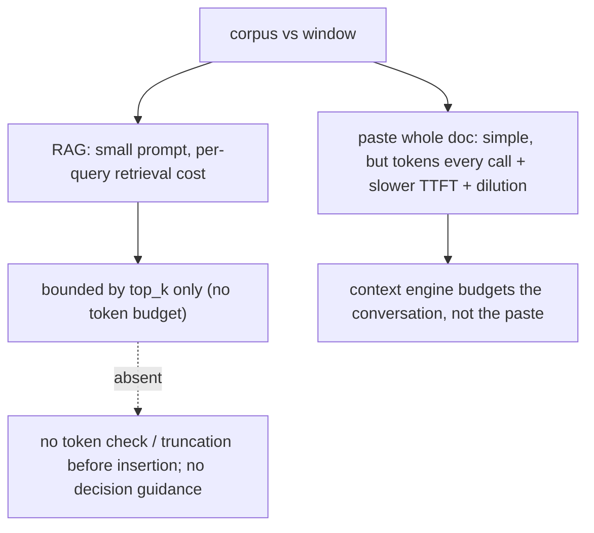

Anchors

<strong>Anchors:</strong> &bull; <code>agent-core/openjiuwen/core/workflow/components/resource/knowledge_retrieval_comp.py:241</code> — <code>_format_output</code> joins <code>r.text</code> with <code>"\n\n"</code>, unbounded; <code>:109</code> bounded only by <code>top_k</code> &bull; <code>agent-core/openjiuwen/core/context_engine/schema/config.py:136</code> — <code>context_window_tokens</code>; <code>:131</code> <code>max_context_message_num</code>; <code>:139</code> <code>model_context_window_tokens</code> &bull; <code>agent-core/openjiuwen/core/context_engine/processor/budget_guard.py:37</code> — <code>effective_context_budget</code> (strictest positive) &bull; <code>agent-core/openjiuwen/core/context_engine/usage/models.py:45</code> — <code>ContextWindowUsage.limit_tokens</code> / <code>occupancy_rate</code> &bull; <code>agent-core/openjiuwen/core/context_engine/processor/compressor/full_compact_processor.py:184</code> — 180k compaction threshold

**Gap.** No token budgeting on retrieved context; the only safety net is post-hoc conversation compaction (itself an extra LLM call).

_Canonical source: `source/rag-practical-interview-questions_for_engineers.md`; also covered in: rag-practical._

## 16. Simple RAG pipeline

**General:** the most common starting point. Query is embedded → a vector database returns top-k similar documents → documents are stuffed into a prompt → the LLM generates the answer. Used for: FAQ bots, internal document search, basic knowledge assistants.

**Jiuwen:** Implemented end to end as composable pieces rather than a packaged app: ingest via `parse_files` → `chunk_documents` → `build_index`; query via `retrieve` → `vector_store.search`; the workflow `KnowledgeRetrievalComponent` concatenates results into a `context` string and `LLMComponent` formats it into the prompt. Gap: no single "simple RAG" agent, and retrieved context is inserted with no token budgeting.

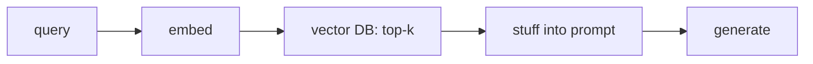

Anchors

<strong>Anchors:</strong> &bull; <code>agent-core/openjiuwen/core/retrieval/simple_knowledge_base.py:96/110/182</code> — ingest + retrieve &bull; <code>agent-core/openjiuwen/core/retrieval/retriever/vector_retriever.py:78</code> — embed query → search &bull; <code>agent-core/openjiuwen/core/workflow/components/resource/knowledge_retrieval_comp.py:109/243</code> — context assembly &bull; <code>agent-core/openjiuwen/core/workflow/components/llm/llm_comp.py:654</code> — prompt template

## 17. Modular RAG with reranking

**General:** the upgrade once simple RAG returns irrelevant context. A retriever pulls a larger candidate set, a reranker reorders by actual relevance to the query, and only the top results enter the prompt. Used for: legal, medical, or research tools where retrieval accuracy affects trust.

**Jiuwen:** The reranker modules exist (`StandardReranker` cross-encoder, `ChatReranker` LLM-judge, `DashscopeReranker`) but are **not wired into the KB path** — only the graph store calls `rerank`, and `top_k` is static. So "retrieve N, rerank to K" is not available out of the box; the retrievers also drop metadata `filters`.

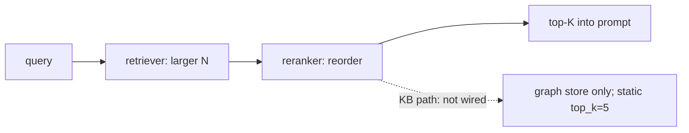

Anchors

<strong>Anchors:</strong> &bull; <code>agent-core/openjiuwen/core/foundation/store/base_reranker.py:37/41</code> — <code>Reranker</code> ABC &bull; <code>agent-core/openjiuwen/core/retrieval/reranker/standard_reranker.py:23</code> — <code>StandardReranker</code> (<code>/rerank</code>) &bull; <code>agent-core/openjiuwen/core/foundation/store/graph/milvus/milvus_support.py:458</code> — reranker applied only in graph store &bull; <code>agent-core/openjiuwen/core/retrieval/simple_knowledge_base.py:182</code> — KB path calls no reranker &bull; <code>agent-core/openjiuwen/core/retrieval/common/config.py:46</code> — <code>top_k: int = 5</code>

## 18. What is agentic RAG, and how is it different from a standard fixed RAG pipeline

**General:** A fixed RAG pipeline always retrieves once and feeds the top-k to the generator. Agentic RAG adds a decision loop: the model chooses whether and when to retrieve, may rewrite or decompose the query, retrieves again based on what it found, and stops when it has enough. It trades latency/cost and non-determinism for better answers on complex questions.

**Jiuwen:** `RetrievalConfig.agentic` (default `False`) is the switch. When true, `SimpleKnowledgeBase.retrieve` wraps its base retriever in `AgenticRetriever(retriever=..., llm_client=...)`; otherwise the base `VectorRetriever`/`SparseRetriever`/`HybridRetriever` is called directly. `GraphKnowledgeBase` does the same wrapping a `GraphRetriever`. Agentic = base retrieval + LLM triple extraction + sufficiency/rewrite + multi-round RRF + optional graph expansion; it requires an `llm_client`. In the product harness the model also chooses retrieval via the `memory_search` tool.

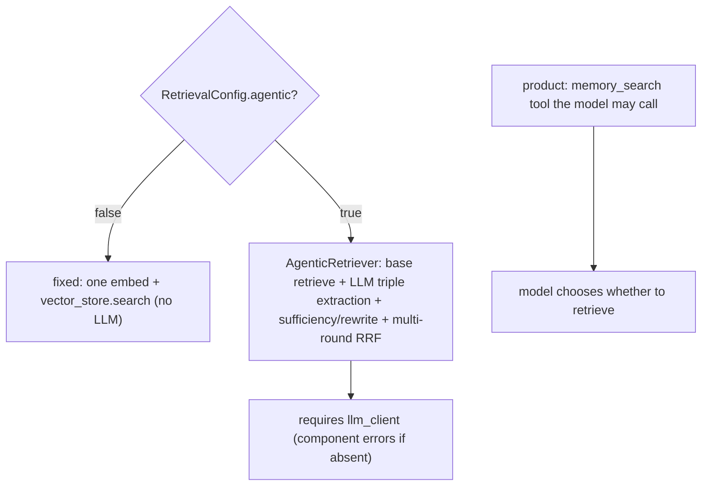

Anchors

<strong>Anchors:</strong> &bull; <code>agent-core/openjiuwen/core/retrieval/common/config.py:51</code> — <code>agentic: bool = False</code> &bull; <code>agent-core/openjiuwen/core/retrieval/simple_knowledge_base.py:172/182</code> — agentic wrap vs direct base retriever &bull; <code>agent-core/openjiuwen/core/retrieval/graph_knowledge_base.py:218</code> — agentic wrap of <code>GraphRetriever</code> &bull; <code>agent-core/openjiuwen/core/retrieval/retriever/agentic_retriever.py:113</code> — <code>AgenticRetriever</code> construction; <code>agent-core/openjiuwen/core/retrieval/retriever/vector_retriever.py:38</code> — fixed single-pass (contrast) &bull; <code>agent-core/openjiuwen/core/workflow/components/resource/knowledge_retrieval_comp.py:156</code> — LLM only when agentic &bull; <code>jiuwenswarm/jiuwenswarm/agents/harness/common/tools/memory_tools.py:167</code> — <code>memory_search</code> tool &bull; <code>agent-core/openjiuwen/harness/deep_agent.py:225</code> — <code>memory_search</code> in builtin tools

**Gap.** The agentic flag is per-KB and static (cannot promote mid-run), and there is no planner choosing retriever/mode per query.

_Canonical source: `source/rag-part2-interview-questions_for_engineers.md`; also covered in: rag-2._

## 19. How would you prevent an agentic RAG system from retrieving in an unnecessary loop and burning cost

**General:** Cap the rounds, detect repeated queries/results, require a sufficiency signal to continue, and put a token/cost budget on the retrieval loop itself. Cache retrieval results and dedupe identical queries. Alert on loops.

**Jiuwen:** Caps exist (`AgenticRetriever.max_iter` default 2 clamped, `graph_hops`/`max_length` default 2), and the sufficiency break avoids a needless round. Harness rails catch loops at the tool layer: `ModelAnomalyDetectionRail` compacts consecutive identical tool rounds and aborts after a threshold, and `ToolCallDeduplicationRail` caches/exact-suppresses repeated read calls. The ReAct loop is capped at `max_iterations`. But there is no retrieval-specific token/cost budget, and the harness rails are not applied to the retrieval agent's own LLM calls.

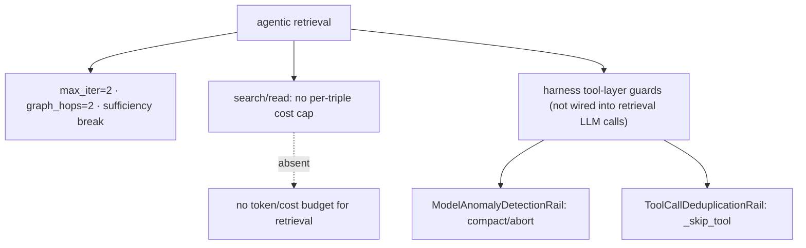

Anchors

<strong>Anchors:</strong> &bull; <code>agent-core/openjiuwen/core/retrieval/retriever/agentic_retriever.py:133/241/287</code> — <code>max_iter</code> and turn-cap breaks &bull; <code>agent-core/openjiuwen/harness/rails/model_anomaly_detection_rail.py:74</code> — <code>ToolLoopCompactConfig</code> (default off); <code>:386</code> compact-or-bailout &bull; <code>jiuwenswarm/jiuwenswarm/agents/harness/common/rails/tool_dedup_rail.py:25/109/157</code> — cacheable whitelist + per-turn cache + repeat warning &bull; <code>agent-core/openjiuwen/core/single_agent/agents/react_agent.py:288</code> — <code>max_iterations=5</code> &bull; <code>jiuwenswarm/jiuwenswarm/agents/harness/common/rails/context_headroom_rail.py:97</code> — 60%/80% token-window directives

**Gap.** No retrieval token/cost budget; `_link_triples`/`_link_passages` issue one request per triple (`asyncio.gather` with no concurrency limit), and the tool-loop guards do not cover these calls.

_Canonical source: `source/rag-part2-interview-questions_for_engineers.md`; also covered in: rag-2._
