# Retrieval and ranking

## 1. Dense vs. sparse retrieval, and fusing both with reciprocal rank fusion

**General:** Dense retrieval embeds queries/documents and searches a vector index; it matches meaning but can miss rare exact terms. Sparse retrieval (BM25/TF-IDF) matches literal terms with term-frequency weighting; strong on exact tokens but fails on paraphrase. Fuse both — RRF (`Σ 1/(k+rank)`) is the robust default because it needs no score calibration.

**Jiuwen:** Dense is `VectorRetriever`; sparse is `SparseRetriever`, which on Milvus is real BM25 (`metric_type="BM25"` against a `SPARSE_FLOAT_VECTOR` field with `SPARSE_INVERTED_INDEX`). Chroma falls back to a TF-IDF text query; PG uses full-text search. `HybridRetriever` takes an `alpha` but every backend actually uses RRF: Milvus `RRFRanker(k=60)`, Chroma/PG `rrf_fusion(..., k=60)` scoring deduped text by `Σ 1/(k+rank)`. The only true weighted fusion is in the graph store (`WeightedRankConfig`).

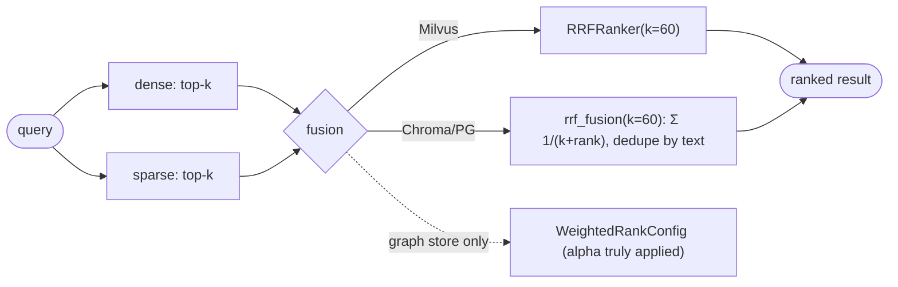

Anchors

<strong>Anchors:</strong> &bull; <code>agent-core/openjiuwen/core/retrieval/retriever/sparse_retriever.py:19</code> — <code>SparseRetriever</code> (BM25); <code>:62</code> delegates to <code>sparse_search</code> &bull; <code>agent-core/openjiuwen/core/retrieval/vector_store/milvus_store.py:277</code> — <code>metric_type: "BM25"</code>; <code>:348</code> native <code>RRFRanker(k=60)</code> &bull; <code>agent-core/openjiuwen/core/retrieval/indexing/indexer/milvus_indexer.py:390</code> — Milvus <code>Function(BM25)</code>; <code>:399</code> <code>SPARSE_INVERTED_INDEX</code> &bull; <code>agent-core/openjiuwen/core/retrieval/retriever/hybrid_retriever.py:26</code> — <code>alpha</code> (ignored by stores) &bull; <code>agent-core/openjiuwen/core/retrieval/utils/fusion.py:15/39</code> — <code>rrf_fusion</code> + <code>1/(k+rank)</code> &bull; <code>agent-core/openjiuwen/core/retrieval/vector_store/chroma_store.py:300</code> — no BM25 (TF-IDF); <code>agent-core/openjiuwen/core/retrieval/vector_store/pg_store.py:375</code> — FTS

_Canonical source: `source/rag-practical-interview-questions_for_engineers.md`; also covered in: rag-2, rag-practical, rag-retrieval._

---

## 2. When keyword search outperforms semantic search

**General:** Keyword search wins when the query contains exact identifiers, codes, rare names, or domain jargon that the embedding model never learned to map, and when the corpus is small or the terms are highly distinctive. Dense search wins on paraphrase and intent. The strongest approach is a router that picks by query type (or always runs hybrid and fuses).

**Jiuwen:** Routing is static and config-driven, not query-content-driven: `SimpleKnowledgeBase.retrieve` picks the retriever and mode from `config.index_type` (`vector` → `VectorRetriever`, `bm25` → `SparseRetriever`, else hybrid). `AgenticRetriever` derives its default mode from the underlying retriever's `index_type`, and `GraphRetriever` validates against `_allowed_modes`. The only dynamic keyword behavior is a degenerate fallback: if dense returns zero results, `VectorRetriever` (and `HybridRetriever` only in its `mode="vector"` branch) re-runs `sparse_search`. `QueryRewriter` produces an `intention` field but never uses it to switch modes.

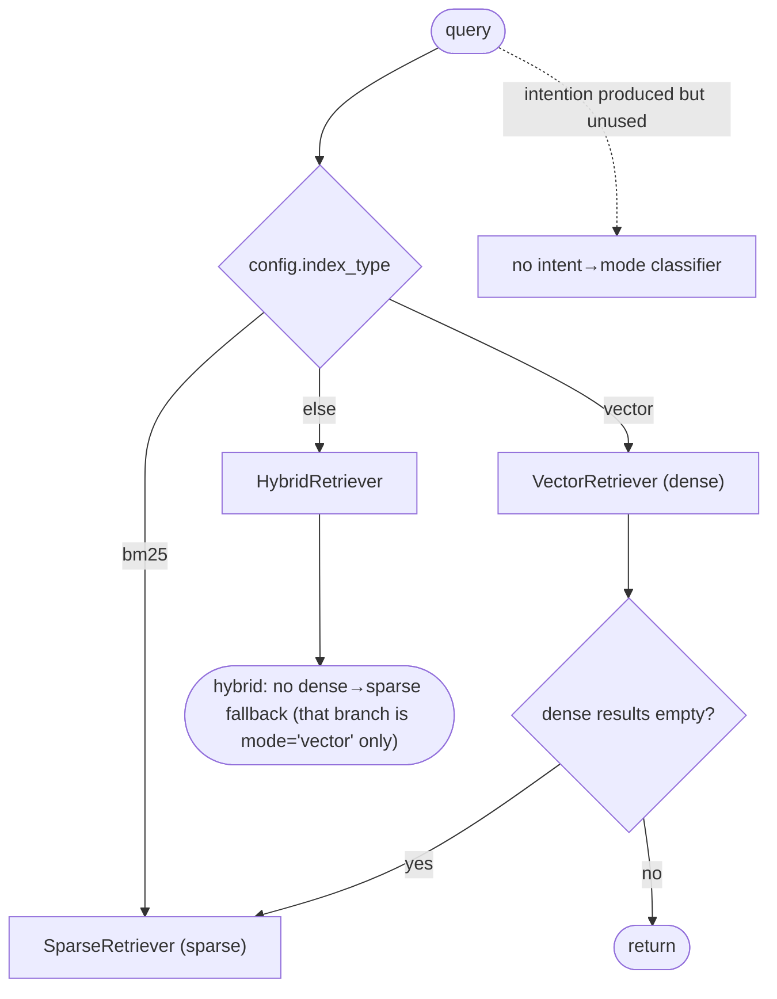

Anchors

<strong>Anchors:</strong> &bull; <code>agent-core/openjiuwen/core/retrieval/simple_knowledge_base.py:141</code> — retriever selection by <code>index_type</code>; <code>:166</code> mode selection &bull; <code>agent-core/openjiuwen/core/retrieval/retriever/vector_retriever.py:83</code> — dense-empty → BM25 fallback &bull; <code>agent-core/openjiuwen/core/retrieval/retriever/hybrid_retriever.py:97</code> — same fallback &bull; <code>agent-core/openjiuwen/core/retrieval/retriever/agentic_retriever.py:155</code> — <code>default_mode</code> from <code>index_type</code> &bull; <code>agent-core/openjiuwen/core/retrieval/retriever/graph_retriever.py:262</code> — <code>_allowed_modes</code> &bull; <code>agent-core/openjiuwen/core/retrieval/query_rewriter/query_rewriter.py:277</code> — rewrite schema includes <code>intention</code>

_Canonical source: `source/rag-retrieval-interview-questions_for_engineers.md`; also covered in: rag-2, rag-practical, rag-retrieval._

---

## 3. Why a purely semantic system can fail on queries with exact codes, IDs, or names

**General:** Embedding models are trained on natural-language co-occurrence; short opaque tokens (error codes, SKUs, UUIDs, version strings, rare proper nouns) carry little semantic signal and get mapped to near-random neighbors. A semantically "close" but wrong chunk can outrank the exact hit, and because dense results are rarely empty, no lexical fallback fires. The fix is metadata/exact filtering, a sparse leg, or an explicit exact-match boost.

**Jiuwen:** The stores *can* filter: Milvus builds `key == value` expressions (string-sanitized) and supports `QueryExpr`; PG does JSONB containment; Chroma builds a `where` dict; Milvus even creates `INVERTED` scalar indexes on `document_id`/`chunk_id`. But the retriever layer hardcodes `filters=None` and drops the `filters` kwarg the KB passes, so metadata filtering is unreachable through `KnowledgeBase.retrieve`. There is no exact-term boost, no `IN`/`LIKE` substring matching, and the lexical fallback fires only when dense output is *empty*, not when it is semantically wrong.

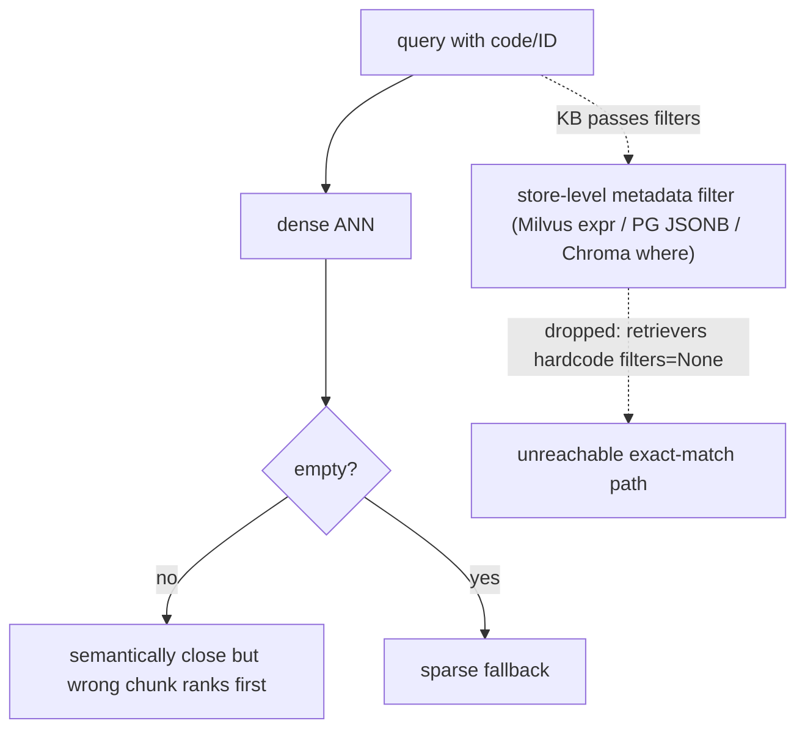

Anchors

<strong>Anchors:</strong> &bull; <code>agent-core/openjiuwen/core/retrieval/retriever/vector_retriever.py:88</code> — hardcoded <code>filters=None</code>; <code>:84</code> sparse fallback only when dense empty &bull; <code>agent-core/openjiuwen/core/retrieval/retriever/hybrid_retriever.py:81</code> — hardcoded <code>filters=None</code> &bull; <code>agent-core/openjiuwen/core/retrieval/simple_knowledge_base.py:186</code> — KB passes <code>filters</code>, retriever swallows it &bull; <code>agent-core/openjiuwen/core/retrieval/vector_store/milvus_store.py:215</code> — <code>key == value</code> filter expr; <code>:219</code> <code>QueryExpr.sanitize_str</code> &bull; <code>agent-core/openjiuwen/core/retrieval/vector_store/pg_store.py:474</code> — <code>build_filters</code> JSONB containment &bull; <code>agent-core/openjiuwen/core/retrieval/vector_store/chroma_store.py:265</code> — <code>where</code> dict filter &bull; <code>agent-core/openjiuwen/core/retrieval/indexing/indexer/milvus_indexer.py:346</code> — <code>INVERTED</code> scalar index on doc id

_Canonical source: `source/rag-retrieval-interview-questions_for_engineers.md`; also covered in: engineering, rag-practical, rag-retrieval, genai, llm-applied, rag-1._

---

## 4. How do you decide between retrieving 5 documents versus 20

**General:** It is a recall-vs-precision/token/latency tradeoff. Retrieve more when the question is multi-part, aggregative, or high-stakes and recall matters; fewer when answers are localized and you want precision and low token cost. The robust pattern is retrieve a larger candidate set (e.g. 20–50), rerank to a small k (3–5), and pass only the reranked top-k to the generator — so you keep recall without paying context cost. Tune k on an eval set; do not hardcode a gut number.

**Jiuwen:** `top_k` is a static config (default 5) with no adaptive or cost-aware policy, and `score_threshold` defaults to `None`. There is no rerank-to-K lever in the KB path (rerankers are wired only in the graph store), and the assembled context is not token-budgeted. So "retrieve 20, rerank to 5" is not available out of the box; you would set `top_k` directly and accept the untrimmed context.

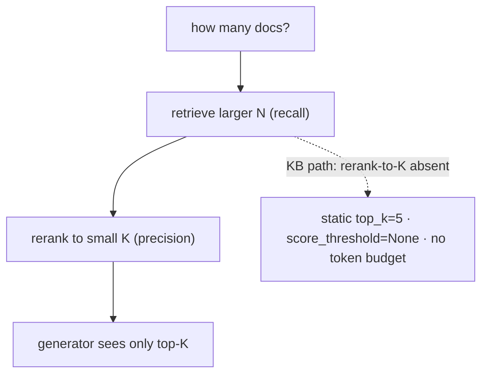

Anchors

<strong>Anchors:</strong> &bull; <code>agent-core/openjiuwen/core/retrieval/common/config.py:46</code> — <code>top_k: int = 5</code>; <code>:47</code> <code>score_threshold</code> default <code>None</code> &bull; <code>agent-core/openjiuwen/core/retrieval/retriever/hybrid_retriever.py:64</code> — threshold honored only in <code>mode="vector"</code> &bull; <code>agent-core/openjiuwen/core/retrieval/simple_knowledge_base.py:182</code> — KB path calls no reranker &bull; <code>agent-core/openjiuwen/core/workflow/components/resource/knowledge_retrieval_comp.py:241</code> — context concatenated unbounded

_Canonical source: `source/rag-part1-interview-questions_for_engineers.md`; also covered in: rag-1._

---

## 5. How would you design retrieval to work across structured data (SQL tables) and unstructured data (documents) in the same system

**General:** Keep the two paths explicit: route structured questions to a text-to-SQL/table-query tool (schema-aware, validable) and unstructured questions to document retrieval, then merge/ground the results. Do not flatten tables into text and hope; and do not let a free-form shell tool be the only SQL path, because it is unverified. An orchestrator or router picks the source(s), and the answer cites which.

**Jiuwen:** Retrieval is document-RAG only: parsers emit `TextChunk`s into vector/graph stores and `KnowledgeRetrievalComponent` fans queries to one or more KBs. Structured access is limited to the generic `bash`/`code` escape hatch (`SysOperation.fs()/shell()/code()`); spreadsheets are ingested as row/column text documents rather than queried as tables. SQLite is used only for local lock/session persistence.

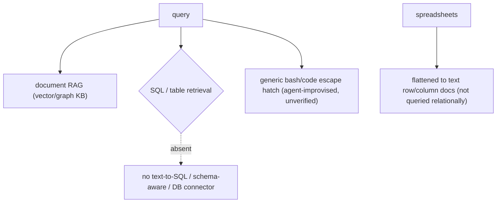

Anchors

<strong>Anchors:</strong> &bull; <code>agent-core/openjiuwen/core/sys_operation/sys_operation.py:204</code> — <code>SysOperation</code> exposes only <code>fs</code>/<code>code</code>/<code>shell</code>; <code>:139</code> card proxies limited to fs/shell/code &bull; <code>agent-core/openjiuwen/harness/tools/__init__.py:42</code> — only Bash/PowerShell shell escape hatch; no DB tool &bull; <code>agent-core/openjiuwen/harness/tools/code.py:34</code> — <code>CodeTool.invoke</code> (generic code, not SQL-aware) &bull; <code>agent-core/openjiuwen/core/retrieval/indexing/processor/parser/excel_parser.py:131</code> — spreadsheets flattened to text documents &bull; <code>agent-core/openjiuwen/core/sys_operation/local/_async_read_write_lock.py:6</code> — SQLite used only as a lock DB

_Canonical source: `source/rag-part2-interview-questions_for_engineers.md`; also covered in: rag-2._

---

## 6. What reranking adds that initial retrieval doesn't already do

**General:** First-stage retrieval optimizes recall with cheap approximate similarity over the whole corpus. A reranker scores each candidate *jointly with the query* using an expensive cross-encoder, reordering the top-k for precision. It cannot recover documents retrieval never returned.

**Jiuwen:** `Reranker` is an abstract cross-encoder client (`rerank`/`rerank_sync` returning `{doc: score}`), implemented by `StandardReranker`, `DashscopeReranker`, and experimental `ChatReranker`. It is integrated only in the graph store: `milvus_support.py` accepts an optional `reranker` and calls it in `_rank_results`/`_combined_rerank`, and even there it is a no-op unless the caller passes `reranker=...`. Neither `SimpleKnowledgeBase.retrieve` nor `GraphKnowledgeBase.retrieve` constructs or forwards one, so RAG retrieval is first-stage-only.

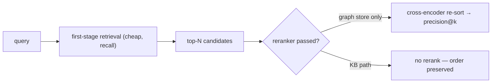

Anchors

<strong>Anchors:</strong> &bull; <code>agent-core/openjiuwen/core/foundation/store/base_reranker.py:16</code> — <code>RerankerConfig</code>; <code>:37/41</code> <code>Reranker</code> + abstract <code>rerank</code> &bull; <code>agent-core/openjiuwen/core/retrieval/reranker/standard_reranker.py:23</code> — <code>StandardReranker</code> (<code>/rerank</code>); <code>agent-core/openjiuwen/core/retrieval/reranker/chat_reranker.py:22</code> — <code>ChatReranker</code> (experimental) &bull; <code>agent-core/openjiuwen/core/foundation/store/graph/milvus/milvus_support.py:458</code> — reranker applied only when truthy; <code>:87</code> <code>async def rerank</code> &bull; <code>agent-core/openjiuwen/core/retrieval/simple_knowledge_base.py:125</code> — no reranker in <code>retrieve</code>; <code>agent-core/openjiuwen/core/retrieval/graph_knowledge_base.py:251</code> — passes <code>**kwargs</code> only &bull; <code>agent-core/openjiuwen/core/retrieval/common/result_ranking.py:11</code> — fusion rankers, distinct from cross-encoder

**Gap.** Reranking is effectively dead for RAG: no KB/component/retriever instantiates a reranker, and `KnowledgeRetrievalCompConfig` has no reranker field.

_Canonical source: `source/ai-engineer-technical-questions_for_engineers.md`; also covered in: engineering, rag-retrieval, rag-1._

---

## 7. How do you know if your reranker is actually improving results, or just reordering noise, without an A/B test

**General:** You cannot tell from the order alone. Offline, hold out a labeled set of (query, relevant docs) and compare ranking metrics (NDCG@k, MRR, precision@k) with and without the reranker on the same candidate set. If NDCG does not improve, the reranker is reordering noise. Watch for it merely promoting longer/more generic chunks. A/B is better but needs traffic; offline label-based comparison is the first check.

**Jiuwen:** There is a real reranker stack (`StandardReranker`, `ChatReranker`, DashScope) and a cross-encoder re-rank hook in the graph store, but the only before/after evidence is a **manual demo comparison**: `showcase_milvus_graph_store.py` searches twice (`reranker=RERANKER` then `reranker=None`) and `_log_score_comparison` prints per-rank scores, a diff, and min/max ranges. No ground-truth labels, no held-out query set, no metric delta, no significance test.

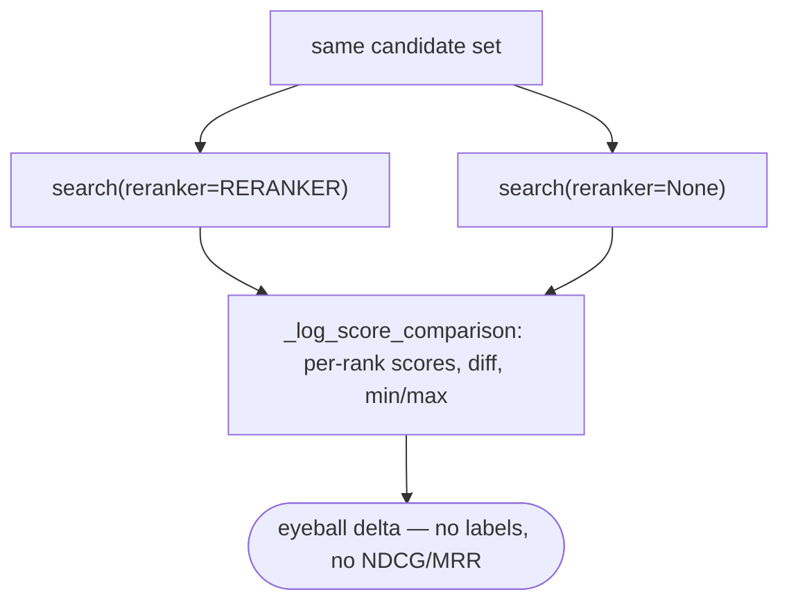

Anchors

<strong>Anchors:</strong> &bull; <code>agent-core/examples/store/showcase_milvus_graph_store.py:51</code> — <code>_log_score_comparison</code>; <code>:217</code> reranker on; <code>:240</code> reranker off &bull; <code>agent-core/openjiuwen/core/retrieval/reranker/standard_reranker.py:58</code> — <code>rerank()</code> returns <code>relevance_score</code> per doc &bull; <code>agent-core/openjiuwen/core/foundation/store/graph/milvus/milvus_support.py:87</code> — <code>rerank</code> sorts in place (<code>_combined_rerank</code> at <code>:467</code>) &bull; <code>agent-core/examples/retrieval/showcase_reranker.py:23</code> — standalone reranker demo (no baseline)

_Canonical source: `source/rag-evaluation-interview-questions_for_engineers.md`; also covered in: rag-eval, rag-retrieval._

---

## 8. Would you rerank every query, or only some, and how do you decide

**General:** Rerank only when it improves the top-k enough to justify its latency: for high-stakes or ambiguous queries where first-stage precision is low, and when the candidate count is bounded. Skip it for exact-match lookups, high-volume cheap queries, or when latency dominates. Measure NDCG/precision with and without rerank on a labeled set to decide, and cache.

**Jiuwen:** Reranking is **optional and not part of the default KB path** — the `Reranker` classes exist (`StandardReranker`, `ChatReranker`, `DashscopeReranker`) but only the graph store / graph memory call `rerank`, gated by `config_e.rerank`. So the codebase effectively never reranks default RAG queries; there is no per-query rerank policy and no metric-driven decision (only the demo score-delta script).

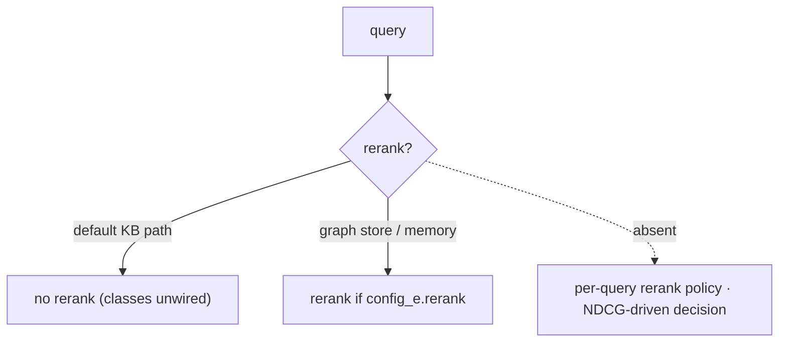

Anchors

<strong>Anchors:</strong> &bull; <code>agent-core/openjiuwen/core/retrieval/simple_knowledge_base.py:182</code> — KB retrieve has no reranker &bull; <code>agent-core/openjiuwen/core/foundation/store/graph/milvus/milvus_support.py:87</code> — <code>rerank</code> in graph store &bull; <code>agent-core/openjiuwen/core/memory/graph/graph_memory/base.py:645</code> — <code>config_e.rerank</code> gate &bull; <code>agent-core/openjiuwen/core/retrieval/reranker/standard_reranker.py:23</code> — <code>StandardReranker</code> (<code>/rerank</code>) &bull; <code>agent-core/examples/store/showcase_milvus_graph_store.py:51</code> — before/after rerank demo (no labels)

_Canonical source: `source/rag-system-design-interview-questions_for_engineers.md`; also covered in: rag-system._

---

## 9. How much latency does reranking add?

**General:** Reranking latency scales with the number of candidates and whether the model scores them in one batch or one-by-one. A cross-encoder over ~50–100 candidates typically adds tens to low-hundreds of milliseconds; an LLM-judge reranker is one call per document and can add seconds.

**Jiuwen:** `RerankerConfig.timeout` defaults to 10 s, and `StandardReranker` sends **all** candidates in one request with `top_n=len(documents)` (no batching/concurrency), `max_retries=3` with backoff. `ChatReranker` enforces a list of size 1, so it costs one LLM call per candidate (O(N) latency) and is flagged experimental. There is no per-document timing, only the request timeout.

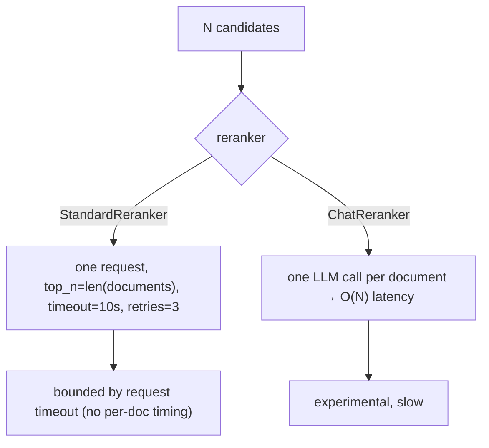

Anchors

<strong>Anchors:</strong> &bull; <code>agent-core/openjiuwen/core/foundation/store/base_reranker.py:22</code> — `timeout` default 10 s &bull; <code>agent-core/openjiuwen/core/retrieval/reranker/standard_reranker.py:120</code> — `top_n=len(documents)` single request; `:35` `max_retries=3` &bull; <code>agent-core/openjiuwen/core/retrieval/reranker/chat_reranker.py:113</code> — list-size-1 constraint (per-doc LLM call) &bull; <code>agent-core/openjiuwen/core/retrieval/utils/api_requests.py:55</code> — retry/backoff loop

_Canonical source: `source/rag-retrieval-interview-questions_for_engineers.md`; also covered in: rag-retrieval._

---

## 10. When is reranking worth the latency cost?

**General:** Rerank when precision@k matters more than latency, when the candidate count is bounded, and when results can be cached. Reranking a large, unbounded candidate set is usually not worth it — the latency and cost grow with N while the precision gain does not.

**Jiuwen:** The reranker is optional (`reranker=None` by default), and the product `jiuwenswarm` pins `rerank_enabled: False` in its external memory builder. The only guard is the per-request timeout plus `min_score`; there is no candidate cap, rerank batch size, or cost accounting — so “is it worth it” is a caller decision, not an enforced policy.

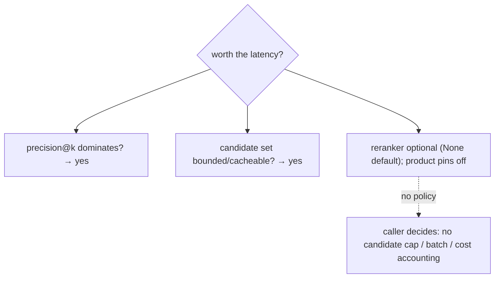

Anchors

<strong>Anchors:</strong> &bull; <code>agent-core/openjiuwen/core/foundation/store/graph/milvus/milvus_support.py:167</code> — `reranker=None` optional &bull; <code>jiuwenswarm/jiuwenswarm/agents/harness/common/memory/external_memory_builder.py:340</code> — product pins `rerank_enabled: False`

_Canonical source: `source/rag-retrieval-interview-questions_for_engineers.md`; also covered in: rag-retrieval._

---

## 11. Bi-encoder for retrieval vs. cross-encoder for reranking

**General:** A bi-encoder embeds query and document independently (fast, precomputable, indexable) but cannot model their interaction. A cross-encoder feeds query+document together through the model and scores the pair, capturing fine-grained relevance at the cost of one forward pass per candidate — hence two-stage retrieval.

**Jiuwen:** Retrieval is bi-encoder (query and docs embedded independently, compared by vector similarity). Reranking is cross-encoder / LLM-as-reranker: `StandardReranker` POSTs `instruct+query` and all documents to a `/rerank` endpoint and reads `relevance_score`; `ChatReranker` (experimental) asks a chat LLM a yes/no judge question and returns `P(yes)/(P(yes)+P(no))` from `top_logprobs`; `DashscopeReranker` extends `StandardReranker` for DashScope's `text-rerank` endpoint. Scoring is query-conditioned at rerank time, unlike the bi-encoder's independent embeddings.

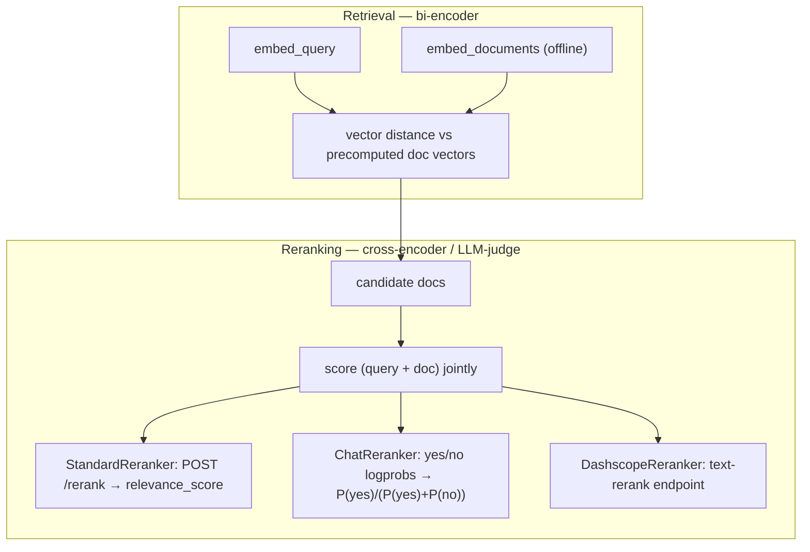

Anchors

<strong>Anchors:</strong> &bull; <code>agent-core/openjiuwen/core/retrieval/retriever/vector_retriever.py:78</code> — independent query bi-encoder &bull; <code>agent-core/openjiuwen/core/retrieval/reranker/standard_reranker.py:28</code> — <code>/rerank</code> endpoint; <code>:29</code> instruct+query template; <code>:81</code> parses <code>relevance_score</code> &bull; <code>agent-core/openjiuwen/core/retrieval/reranker/chat_reranker.py:83</code> — logprob yes/no scoring; <code>:125</code> chat prompt assembly &bull; <code>agent-core/openjiuwen/core/retrieval/reranker/dashscope_reranker.py:16</code> — DashScope reranker

**Gap.** `ChatReranker` is one document per request. The `language` kwarg from the graph store is silently dropped by `StandardReranker._assemble_params`.

_Canonical source: `source/rag-retrieval-interview-questions_for_engineers.md`; also covered in: rag-practical, rag-retrieval._

---

## 12. How do you chunk documents that mix prose, tables, and code?

**General:** Uniform character or token splitting destroys the structure of tables and code. Apply content-aware chunking: detect content type (prose, Markdown table, fenced code block), then apply per-type rules — keep fenced code blocks whole (or split at the function boundary for long files), keep table rows together with their header row, and split prose at paragraph or sentence boundaries. Attach metadata to each chunk (content_type, source_section) so downstream filtering can distinguish them. For large tables or code files that exceed your chunk budget, summarize or use a structured query path (text-to-SQL, AST grep) instead of embedding the raw content.

**Jiuwen:** The default is `CharChunker` → `CharSplitter`, which cuts at fixed character offsets with no content-type detection — an offset can fall inside a code block, table row, or sentence. `HybridChunker` is the one structural guard: it keeps parser-emitted table units (`metadata.source_type in ("row","column")`) whole and delegates the rest. Chunkers propagate `Document` metadata and add `chunk_index`/`total_chunks`/`chunk_id`, but no chunker derives content type from structure, there is no Markdown-header/code-fence-aware splitter, and there is no structured-query fallback for table-heavy content.

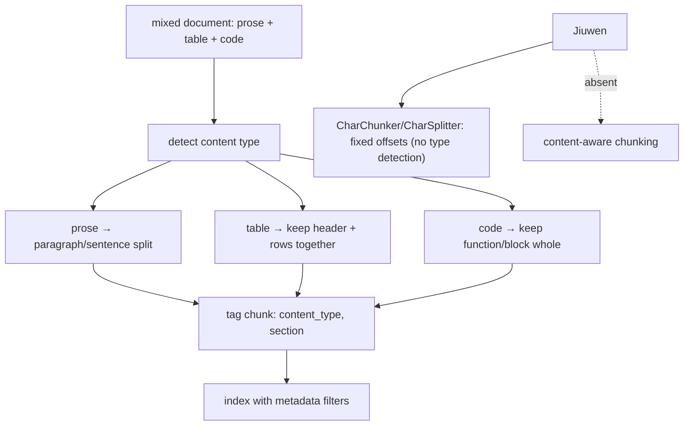

Anchors

<strong>Anchors:</strong> &bull; <code>agent-core/openjiuwen/core/retrieval/indexing/processor/chunker/text_splitter.py:34</code> — <code>CharSplitter</code>, fixed offset splits (<code>:56</code> slicing loop) &bull; <code>agent-core/openjiuwen/core/retrieval/indexing/processor/chunker/char_chunker.py:12</code> — <code>CharChunker</code> &bull; <code>agent-core/openjiuwen/core/retrieval/indexing/processor/chunker/hybrid_chunker.py:19</code> — <code>HybridChunker</code> keeps row/column units whole; <code>:76</code> writes <code>chunk_index</code>/<code>total_chunks</code>/<code>chunk_id</code> &bull; <code>agent-core/openjiuwen/core/retrieval/common/document.py:30</code> — <code>TextChunk</code> (<code>id_</code>, <code>text</code>, <code>doc_id</code>, <code>metadata</code>, <code>embedding</code>)

**Gap.** No prose content-type detection or code-fence awareness; `CharSplitter` can split mid-row or mid-function, and table units stay whole only when a parser emits them as row/column documents. No structured-content fallback path wired into the ingest pipeline.

_Canonical source: `source/agent-failure-patterns_for_engineers.md`; also covered in: agent-failure, rag-retrieval._