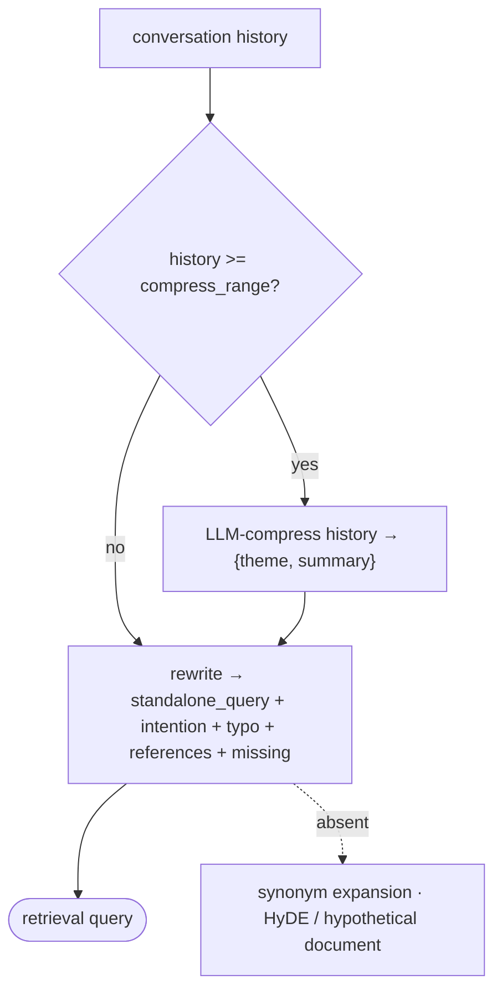
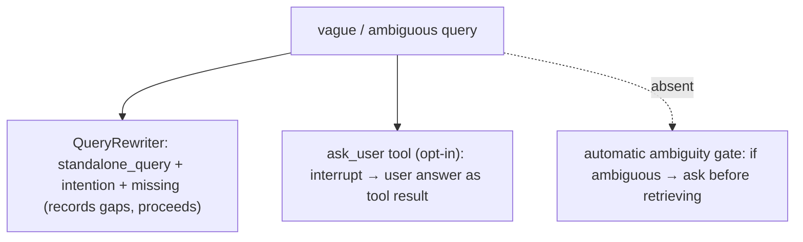
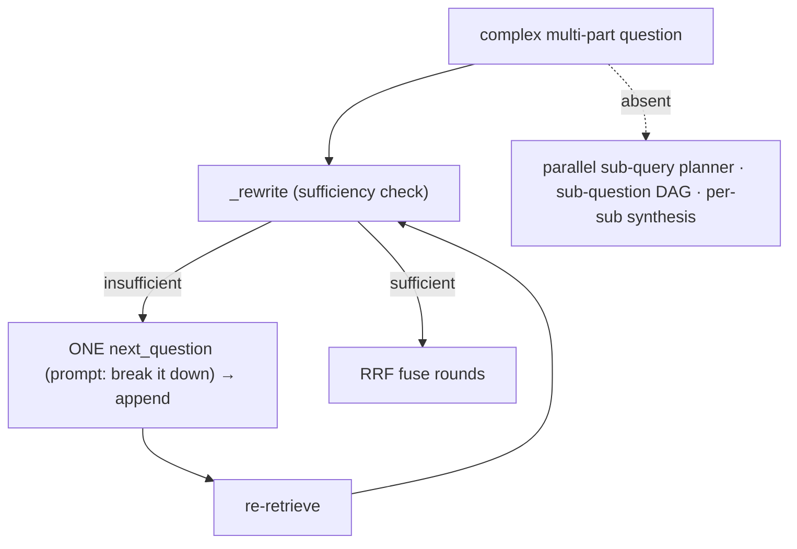
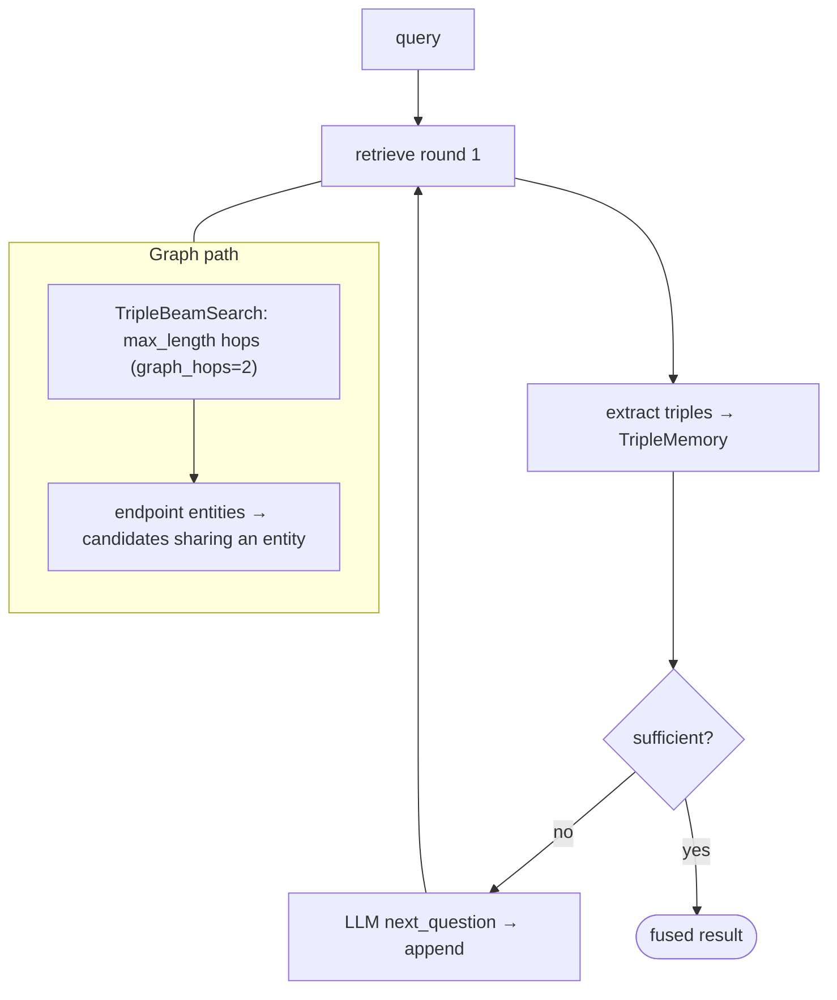
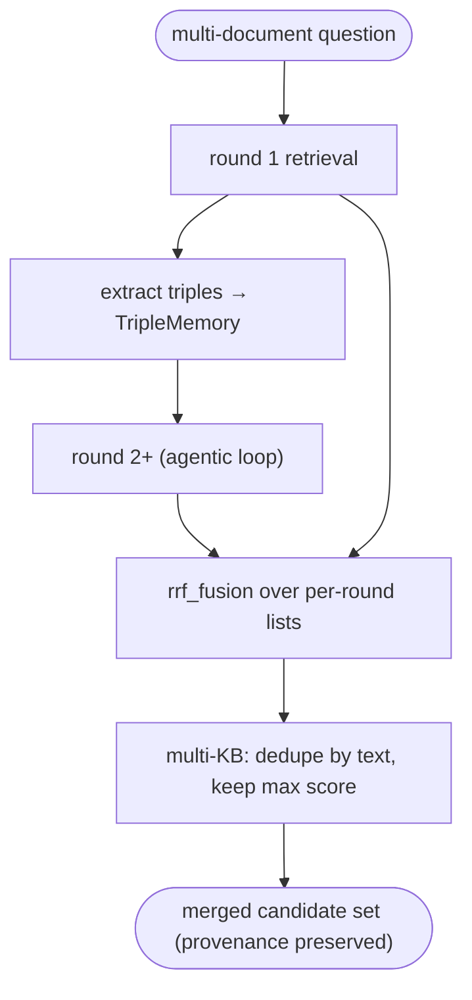
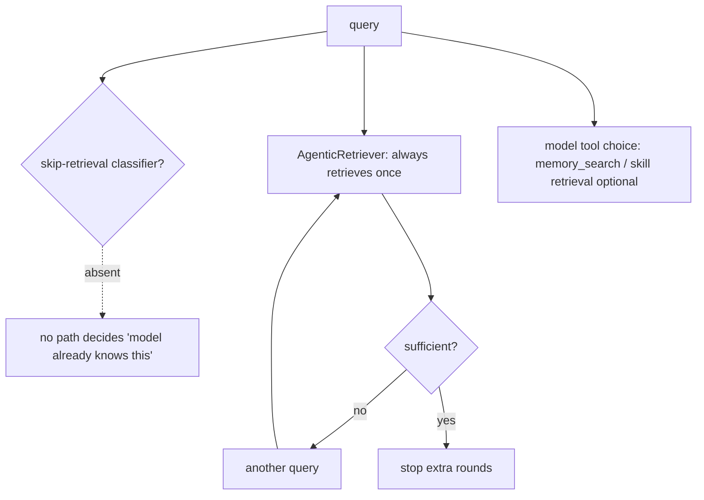

# Query understanding

## 1. What is query rewriting or query expansion, and when does it meaningfully improve retrieval quality

**General:** Query rewriting makes a query self-contained (resolves coreference/ellipsis, fixes typos, removes reliance on prior turns) — it improves multi-turn and malformed queries. Query expansion adds terms/synonyms or generates a hypothetical answer (HyDE) to bridge vocabulary mismatch. Rewriting helps conversational and noisy queries; expansion helps when the corpus uses different wording than the user.

**Jiuwen:** `QueryRewriter` performs context-aware rewriting, not expansion: it produces a self-contained `standalone_query`, corrects typos, detects gibberish, summarizes intent, and lists gaps. When history reaches `compress_range` it first LLM-compresses history into a `{theme, summary}` system message, then rewrites from the recent turns — history compression, not query expansion. There is no synonym expansion and no HyDE.

Anchors

<strong>Anchors:</strong> &bull; <code>agent-core/openjiuwen/core/retrieval/query_rewriter/query_rewriter.py:412</code> — <code>rewrite()</code>; <code>:349</code> <code>compress()</code>; <code>:449</code> history ≥ <code>compress_range</code>; <code>:227</code> <code>compress_range</code> default 20 &bull; <code>agent-core/openjiuwen/core/retrieval/query_rewriter/prompts/intention_completion_en.md:32</code> — coreference resolution; <code>:47</code> typo correction &bull; <code>agent-core/openjiuwen/core/retrieval/retriever/agentic_retriever.py:326</code> — follow-up question generation

_Canonical source: `source/rag-part2-interview-questions_for_engineers.md`; also covered in: rag-2._

## 2. How would you handle a vague or ambiguous user query before it even reaches retrieval

**General:** Detect ambiguity and either ask a clarifying question or rewrite to the most likely intent. The cheap path is a rewrite that resolves coreference/ellipsis; the interactive path is a clarification turn when the ambiguity would change the retrieval target. Most production systems rewrite by default and clarify only when confidence is low.

**Jiuwen:** Ambiguity is not resolved by asking the user pre-retrieval. `QueryRewriter.rewrite` returns `intention`, `standalone_query`, `references`, and a `missing` list; when a gap cannot be filled from history it marks the gap with `(…)` in the standalone query and records it in `missing` but still proceeds with a best-effort query. Asking the user is a separate, opt-in mechanism: `AskUserRail`/`AskUserTool` interrupt the tool loop and return the answer as a tool result. None of these is wired automatically into the RAG flow as an ambiguity gate.

Anchors

<strong>Anchors:</strong> &bull; <code>agent-core/openjiuwen/core/retrieval/query_rewriter/query_rewriter.py:412</code> — <code>rewrite()</code>; <code>:277</code> output schema (<code>intention</code>/<code>references</code>/<code>missing</code>/<code>typo</code>) &bull; <code>agent-core/openjiuwen/core/retrieval/query_rewriter/prompts/intention_completion_en.md:41</code> — missing-info completion (marks gaps, does not ask) &bull; <code>agent-core/openjiuwen/harness/tools/ask_user.py:11</code> — <code>AskUserTool</code>; <code>agent-core/openjiuwen/harness/rails/interrupt/ask_user_rail.py:63</code> — <code>resolve_interrupt</code> &bull; <code>agent-core/openjiuwen/core/controller/schema/intent.py:59</code> — <code>UNKNOWN_TASK</code> clarification prompt; <code>agent-core/openjiuwen/core/controller/modules/intent_recognizer.py:436</code>

_Canonical source: `source/rag-part2-interview-questions_for_engineers.md`; also covered in: rag-2._

## 3. How would you decompose a complex, multi-part question into smaller retrievable sub-questions

**General:** Split "compare A and B on X and Y" into independently answerable sub-questions, retrieve for each (often in parallel), then synthesize. A dedicated LLM decomposition call or an agentic loop generates the sub-questions; a planner can produce a DAG when there are dependencies.

**Jiuwen:** Decomposition is prompt-level and **sequential** inside `AgenticRetriever`. `_REWRITE_PROMPT` instructs the LLM to "break it down into smaller questions if needed", and when triples are insufficient it generates exactly one `next_question`, appended to `queries` and used as the next retrieval query; rounds are fused with RRF. It is not a parallel sub-query planner: sub-questions are produced one at a time, conditioned on the prior round, capped at `max_iter` (default 2). `batch_retrieve` runs independent caller-supplied queries concurrently, not a decomposition.

Anchors

<strong>Anchors:</strong> &bull; <code>agent-core/openjiuwen/core/retrieval/retriever/agentic_retriever.py:70</code> — "Break it down into smaller questions if needed."; <code>:326</code> <code>_rewrite</code> one next question; <code>:213/272</code> loops; <code>:290</code> append; <code>:295</code> <code>rrf_fusion(history_results)</code>; <code>:133</code> <code>max_iter=2</code>; <code>:530</code> <code>batch_retrieve</code> &bull; <code>agent-core/openjiuwen/core/controller/legacy/reasoner/planner.py:12</code> — general task Planner (not retrieval)

_Canonical source: `source/rag-part2-interview-questions_for_engineers.md`; also covered in: rag-2, rag-retrieval._

## 4. What is multi-hop retrieval, and when does single-pass retrieval fail to answer a question

**General:** Multi-hop retrieval runs more than one retrieval step, using what the first hop found to form the next query, because the answer needs a bridging entity that is not in the original query (e.g. "who employed the founder of X" needs X → founder → employer). Single-pass fails when the supporting evidence is only reachable through that intermediate entity, so the top-k for the original query never contains it. Graph/triple stores make hops explicit; query-decomposition approaches generate sub-queries.

**Jiuwen:** Two mechanisms. `AgenticRetriever` keeps a `queries` list and loops up to `max_iter`, extracting triples each round into a `TripleMemory` and asking the LLM for a `next_question` when triples are insufficient. `GraphRetriever` delegates to `TripleBeamSearch`, which expands a beam of triples for `max_length` hops, re-querying from the two endpoint entities of the last triple and keeping only candidates that share an entity. Single-pass `VectorRetriever.retrieve` embeds once and returns `top_k` with no state.

Anchors

<strong>Anchors:</strong> &bull; <code>agent-core/openjiuwen/core/retrieval/retriever/agentic_retriever.py:213</code> — <code>for turn in range(1, max_iter+1)</code>; <code>:237</code> <code>_read</code> triples + <code>batch_extend_memory</code>; <code>:244</code> <code>_rewrite</code> → append &bull; <code>agent-core/openjiuwen/core/retrieval/retriever/graph_retriever.py:100</code> — beam expansion <code>range(max_length-1)</code>; <code>:190</code> endpoint entities <code>{triple[0], triple[-1]}</code>; <code>:402</code> <code>graph_hops = kwargs.get("graph_hops", 2)</code> &bull; <code>agent-core/openjiuwen/core/retrieval/common/triple_beam.py:12</code> — <code>TripleBeam</code>; <code>agent-core/openjiuwen/core/retrieval/common/triple_memory.py:31</code> — <code>extend_memory</code> dedup &bull; <code>agent-core/openjiuwen/core/memory/config/graph.py:86</code> — <code>bfs_k</code>/<code>bfs_depth</code> &bull; <code>agent-core/openjiuwen/core/retrieval/retriever/vector_retriever.py:38</code> — fixed single-pass retrieve

_Canonical source: `source/rag-part2-interview-questions_for_engineers.md`; also covered in: rag-2, rag-retrieval._

## 5. Handling a question requiring information from multiple documents

**General:** Retrieve a candidate set per sub-query or per entity, then merge and deduplicate, and let the generator synthesize across them (or do an aggregation/summarization step). The hard parts are merging ranked lists from different queries, keeping per-document provenance for citation, and ensuring no single document dominates. Recall must be high because every needed document must be present.

**Jiuwen:** This is the strongest area. `AgenticRetriever` runs up to `max_iter` rounds against a base retriever, accumulating `TripleMemory`, then fuses all per-round result lists with RRF (`rrf_fusion(ret + history_results)` in graph mode, `rrf_fusion(history_results)` in generic mode). `GraphRetriever.graph_expansion` fetches triple-linked chunks and fuses new+original chunks via RRF. Multi-KB retrieval merges/dedupes by text keeping the max score. Core memory search aggregates across typed managers, and graph memory searches entity/relation/episode collections concurrently.

Anchors

<strong>Anchors:</strong> &bull; <code>agent-core/openjiuwen/core/retrieval/retriever/agentic_retriever.py:250</code> — <code>rrf_fusion(ret + history_results)[:top_k]</code> (graph mode); <code>:295</code> <code>rrf_fusion(history_results)[:top_k]</code> (generic) &bull; <code>agent-core/openjiuwen/core/retrieval/retriever/graph_retriever.py:520</code> — <code>rrf_fusion([new_chunks, chunks], k=60)</code> &bull; <code>agent-core/openjiuwen/core/retrieval/simple_knowledge_base.py:285</code> — <code>retrieve_multi_kb</code> dedupe-by-text + max-score merge; <code>:318</code> <code>retrieve_multi_kb_with_source</code> &bull; <code>agent-core/openjiuwen/core/memory/manage/search/search_manager.py:86</code> — aggregate + sort + truncate &bull; <code>agent-core/openjiuwen/core/memory/graph/graph_memory/base.py:422</code> — concurrent entity/relation/episode search &bull; <code>agent-core/openjiuwen/core/retrieval/graph_knowledge_base.py:353</code> — <code>retrieve_multi_graph_kb</code>

**Gap.** No explicit cross-document synthesis or evidence-linking step; merging is score/rank fusion, not reasoning over combined docs.

_Canonical source: `source/rag-retrieval-interview-questions_for_engineers.md`; also covered in: rag-2, rag-retrieval._

## 6. When to skip RAG and rely on parametric knowledge instead

**General:** Skip retrieval when the question is general knowledge the model already holds (definitions, common facts, reasoning, code), when latency/cost matter and the corpus is unlikely to add signal, or when the query is conversational and context is already in the window. Retrieve when the answer depends on private, recent, or verifiable facts. The decision is often made by the model choosing whether to call a retrieval tool; a cheap classifier is the alternative.

**Jiuwen:** There is no skip-retrieval classifier. `RetrievalConfig.agentic` is opt-in (default `False`); when enabled, `AgenticRetriever` still executes at least one retrieval unconditionally and uses an LLM "sufficiency" judgment only to decide whether to issue *another* rewritten query — it stops extra rounds, never the first. Otherwise the retrieval-vs-parametric decision is delegated to the model's tool choice: `memory_search` is a normal tool card the agent may elect to call, and skill retrieval is invoked through tool calls. Nothing inspects the query to decide "the model already knows this".

Anchors

<strong>Anchors:</strong> &bull; <code>agent-core/openjiuwen/core/retrieval/retriever/agentic_retriever.py:173</code> — <code>retrieve</code> always performs one round; <code>:326</code> <code>_rewrite</code> returns <code>None</code> when sufficient; <code>:241</code> loop breaks after <code>max_iter</code> &bull; <code>agent-core/openjiuwen/core/retrieval/common/config.py:51</code> — <code>RetrievalConfig.agentic: bool = False</code> (opt-in, not a router) &bull; <code>agent-core/openjiuwen/harness/tools/memory.py:25</code> — <code>memory_search</code> tool (model decides whether to call)

**Gap.** No retrieval-necessity classifier or confidence threshold; every skip decision is implicit in the model's tool call.

_Canonical source: `source/rag-practical-interview-questions_for_engineers.md`; also covered in: rag-2, rag-practical._
