# RAG failure modes and evaluation

## 1. How do you measure whether your retrieval step is actually working

**General:** Use retrieval metrics against a labeled set of (query, relevant docs): Recall@k (did the relevant docs appear in top-k?), Precision@k (of the top-k, how many are relevant?), MRR (mean of 1/rank of the first relevant hit, averaged over queries), and NDCG (position-weighted with graded relevance). Track zero-result rate and score distributions in production, and check that a reranker actually improves NDCG rather than just reordering.

**Jiuwen:** None of these metrics exist. There is no `recall_at_k`/`precision_at_k`/MRR/NDCG, no ranked-list metric interface (`Metric.compute(prediction, label)` is pairwise), and no gold-relevance set. The only recall/precision present is *classification* metrics in the PerStream example and sklearn gate tests. The reranker's only before/after evidence is a demo score-delta script with no labels.

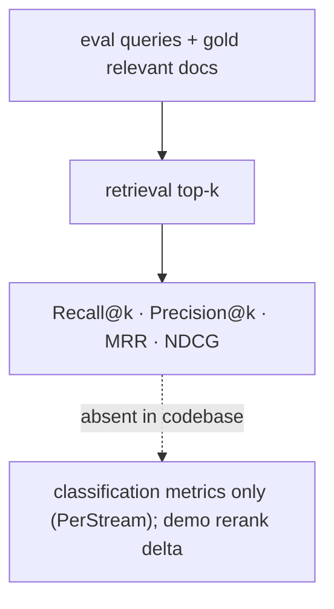

Anchors

<strong>Anchors:</strong> &bull; <code>agent-core/openjiuwen/agent_evolving/evaluator/metrics/base.py:42</code> — <code>compute(prediction, label)</code>, no ranked list &bull; <code>agent-core/openjiuwen/agent_evolving/evaluator/metrics/__init__.py:11</code> — only three metrics exported &bull; <code>agent-core/examples/PerStream/src/eval/score_proactive_judge.py:355/362</code> — classification recall/precision &bull; <code>agent-core/examples/store/showcase_milvus_graph_store.py:51</code> — reranker score-delta (no labels)

_Canonical source: `source/rag-part1-interview-questions_for_engineers.md`; also covered in: rag-1._

---

## 2. Retrieval looks correct, answer is wrong: check if the chunk actually contains the answer

**General:** "Looked relevant" is not "contains the answer". The first diagnostic is to read the retrieved chunks and confirm the answer span is actually present — if it is not, retrieval failed (bad chunking, wrong index, query mismatch); if it is present but the answer is wrong, the problem is generation or grounding. This is why faithfulness evaluation needs the retrieved context, not just answer-vs-reference.

**Jiuwen:** There is no tooling for "does the retrieved chunk contain the answer". The closest signals: `score_threshold` defaults to `None` (so weak chunks pass), relevance checks are lexical (`free_search`), and the judges (`AccuracyEvaluator`, `LLMAsJudgeMetric`) do not receive the retrieved context, so they cannot distinguish "context lacks the answer" from "model ignored it". The `VerificationReviewer`'s `Correctness` dimension checks the output, not the grounding.

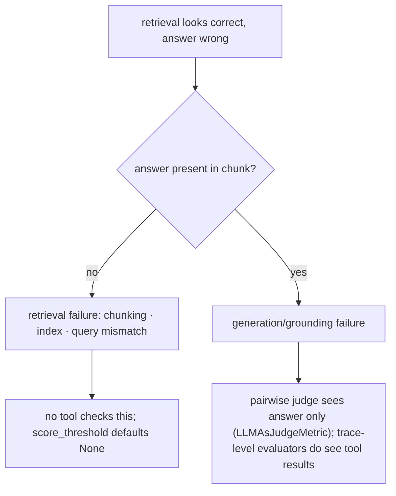

Anchors

<strong>Anchors:</strong> &bull; <code>agent-core/openjiuwen/core/retrieval/common/config.py:47</code> — <code>score_threshold</code> defaults <code>None</code> &bull; <code>agent-core/openjiuwen/harness/tools/web/free_search.py:299</code> — lexical relevance only &bull; <code>agent-core/openjiuwen/symphony/evaluation/evaluators.py:438</code> — <code>AccuracyEvaluator</code> (no context input) &bull; <code>agent-core/openjiuwen/agent_evolving/evaluator/metrics/llm_as_judge.py:58</code> — parses <code>result: true/false</code>, no context/attribution &bull; <code>agent-core/openjiuwen/agent_teams/verification/reviewer.py:43</code> — <code>Correctness</code> dimension on the output

_Canonical source: `source/rag-practical-interview-questions_for_engineers.md`; also covered in: rag-1, rag-practical._

---

## 3. How do you handle hallucinations when retrieved context doesn't actually answer the question

**General:** First detect that the context is insufficient, then answer only from what is supported: gate on retrieval score/answerability, allow an explicit "I don't know" abstention, and verify claims against the context (citations/groundedness). Without an answerability gate, a model will still produce a fluent answer from irrelevant context. The failure mode is under-specified retrieval, not just a bad generator.

**Jiuwen:** There is a retrieval score filter (`score_threshold`) but its default is `None`, so out-of-scope chunks are normally returned. The closest "answerable?" logic is in `AgenticRetriever`, which asks an LLM whether current facts are `sufficient` — but `sufficient=False` only generates a follow-up query, never a user-facing abstention. A true abstention path exists only inside `symphony/retrieval` internal selection (`is_abstain` → empty candidates). Grounding is provided by separate higher layers: the `VerificationReviewer` scores a `Correctness` dimension and downgrades status, the RSI judge forbids treating claims as proof, and the harness verification agent requires command evidence with a PASS/FAIL/PARTIAL verdict — none of which is a RAG answerability gate.

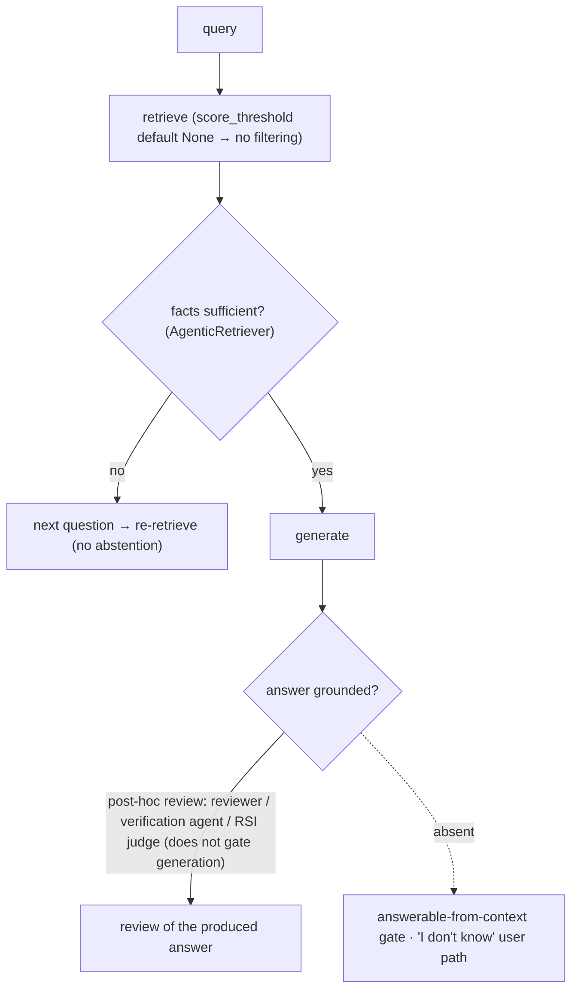

Anchors

<strong>Anchors:</strong> &bull; <code>agent-core/openjiuwen/core/retrieval/common/config.py:47</code> — <code>score_threshold</code> defaults <code>None</code>; <code>agent-core/openjiuwen/core/retrieval/retriever/vector_retriever.py:94</code> / <code>agent-core/openjiuwen/core/retrieval/retriever/hybrid_retriever.py:117</code> — applied only when supplied &bull; <code>agent-core/openjiuwen/core/retrieval/retriever/agentic_retriever.py:326</code> — <code>_rewrite</code> sufficiency check (rewrite, not abstain) &bull; <code>agent-core/openjiuwen/symphony/retrieval/search/runtime/engine.py:94</code> — <code>is_abstain</code> → empty candidates; <code>agent-core/openjiuwen/symphony/retrieval/search/runtime/selector.py:305</code> — <code>is_abstain</code> &bull; <code>agent-core/openjiuwen/agent_teams/verification/reviewer.py:43</code> — <code>Correctness</code> dimension; <code>:279</code> threshold re-normalization &bull; <code>agent-core/openjiuwen/harness/subagents/verification_agent.py:51</code> — PASS/FAIL/PARTIAL verdict

**Gap.** No RAG-side answerable-from-context gate and no "I don't know" path; `score_threshold` has no default and verification is a separate, non-blocking review layer.

_Canonical source: `source/genai-interview-questions_for_engineers.md`; also covered in: genai, llm-applied, rag-1._

---

## 4. How do you handle retrieval when documents contain conflicting or outdated information on the same topic

**General:** Prefer precedence rules before generation: recency (timestamp), source authority, or an explicit priority field; dedupe/reconcile; and either surface the conflict to the model with the metadata or abstain. Outdated facts are usually handled by recency-weighted ranking or by versioning/tombstoning superseded documents. Unchecked, the model picks the first or most fluent version.

**Jiuwen:** The retrieval layer has no notion of document time at all: `RetrievalResult`/`TextChunk` carry only `text`/`score`/metadata, parsers populate no timestamp, and ranking is score/rank only (RRF by rank, max-score merge) — no recency boost or "outdated" filter. Conflict handling exists only at the **memory** layer: `MemUpdateChecker` classifies a new memory as redundant/conflicting/none and deletes superseded old memories (newest wins). A freshness notion exists in the experience subsystem (`calc_freshness`, time decay) but scores experience records, not retrieved documents.

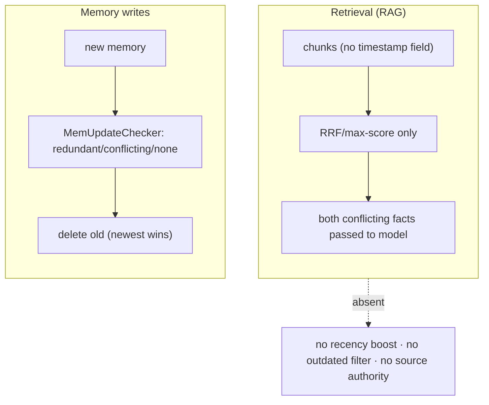

Anchors

<strong>Anchors:</strong> &bull; <code>agent-core/openjiuwen/core/retrieval/common/retrieval_result.py:23</code> — <code>RetrievalResult</code> (no timestamp/recency) &bull; <code>agent-core/openjiuwen/core/retrieval/common/document.py:30</code> — <code>TextChunk</code> (text/doc_id/metadata only) &bull; <code>agent-core/openjiuwen/core/retrieval/utils/fusion.py:39</code> — RRF by text/rank; <code>agent-core/openjiuwen/core/retrieval/simple_knowledge_base.py:313</code> — max-score merge, no recency tiebreak &bull; <code>agent-core/openjiuwen/core/memory/manage/update/mem_update_checker.py:22</code> — <code>CheckResult</code>; <code>:252</code> conflicting → add new/delete old; <code>agent-core/openjiuwen/core/memory/manage/index/fragment_memory_manager.py:163</code> &bull; <code>agent-core/openjiuwen/agent_evolving/experience/scorer.py:219</code> — <code>calc_freshness</code> (experiences only) &bull; <code>agent-core/openjiuwen/core/memory/long_term_memory.py:1004</code> — search sorts by score, ignores timestamp

_Canonical source: `source/rag-part2-interview-questions_for_engineers.md`; also covered in: rag-2, rag-practical._

---

## 5. No relevant documents exist: expected behavior is a confidence-gated "not enough information"

**General:** When retrieval returns nothing relevant, the system should abstain rather than answer from noise: gate on a retrieval-score threshold or an explicit answerability check, and return "not enough information" (or ask a clarifying question). Without this, the model will still produce a fluent answer from irrelevant context.

**Jiuwen:** There is a retrieval score filter but its default is `None`, so out-of-scope chunks are normally returned. `AgenticRetriever` asks an LLM whether facts are `sufficient`, but `sufficient=False` only generates a follow-up query — never a user-facing abstention. A true abstention path exists only in `symphony/retrieval` internal selection (`is_abstain` → empty candidates). Grounding is a separate, non-blocking review layer.

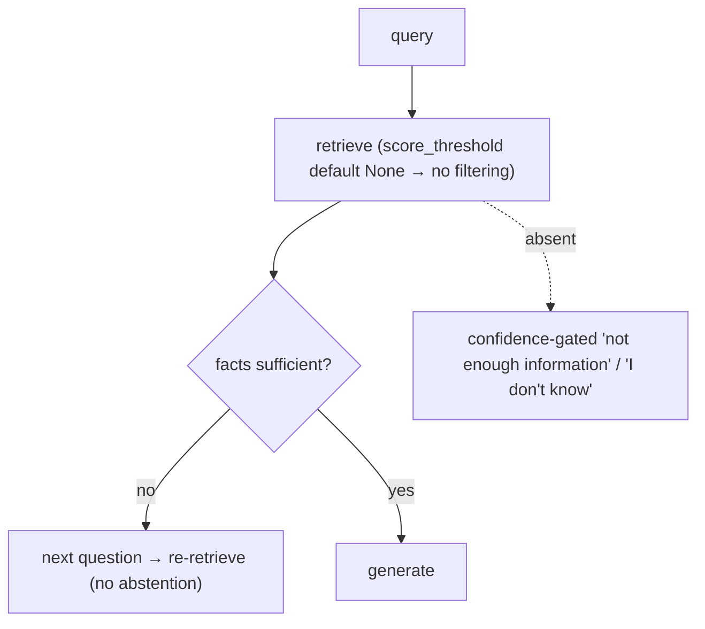

Anchors

<strong>Anchors:</strong> &bull; <code>agent-core/openjiuwen/core/retrieval/common/config.py:47</code> — <code>score_threshold</code> defaults <code>None</code>; <code>agent-core/openjiuwen/core/retrieval/retriever/vector_retriever.py:94</code> — applied only when supplied &bull; <code>agent-core/openjiuwen/core/retrieval/retriever/agentic_retriever.py:326</code> — <code>_rewrite</code> sufficiency (rewrite, not abstain) &bull; <code>agent-core/openjiuwen/symphony/retrieval/search/runtime/engine.py:94</code> — <code>is_abstain</code> → empty candidates; <code>agent-core/openjiuwen/symphony/retrieval/search/runtime/selector.py:305</code> — <code>is_abstain</code> &bull; <code>agent-core/openjiuwen/harness/subagents/verification_agent.py:51</code> — PASS/FAIL/PARTIAL verdict

_Canonical source: `source/rag-practical-interview-questions_for_engineers.md`; also covered in: rag-1, rag-practical._

---

## 6. Same question, different answers on different days: non-deterministic reranking or embedding drift

**General:** Run-to-run variation comes from sampling (temperature/seed), non-deterministic remote rerankers, and embedding drift (the provider updates the embedding model behind the same name, or you change models). Remedies: pin temperature/seed, store a model/version fingerprint with the index, and re-index when the fingerprint changes. Identical inputs should otherwise be reproducible.

**Jiuwen:** Determinism is partial. `ChatReranker` hard-codes `temperature=0` and `AgenticRetriever` calls its rewrite LLM at `temperature=0.0`, but `StandardReranker`/`DashscopeReranker` send no temperature or seed (the remote `/rerank` model decides), and `QueryRewriter` uses the configured temperature, which defaults to `None` (provider default). There is no seed plumbing and no embedding fingerprint in core retrieval — `OpenAIEmbedding`/`DashscopeEmbedding` store only a cached dimension. The memory/lite subsystem does store an `EmbeddingProvider.config_fingerprint` and re-indexes when it changes.

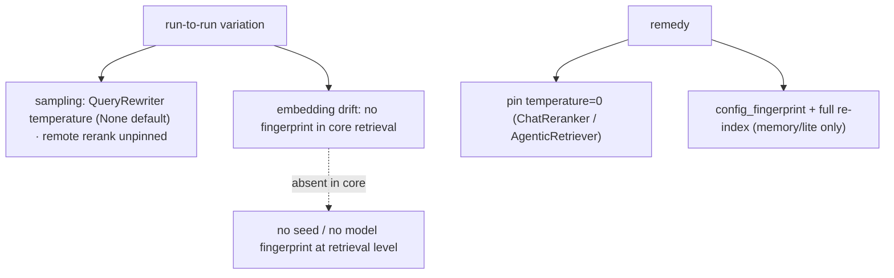

Anchors

<strong>Anchors:</strong> &bull; <code>agent-core/openjiuwen/core/retrieval/reranker/chat_reranker.py:137</code> — hard-codes <code>"temperature": 0</code> &bull; <code>agent-core/openjiuwen/core/retrieval/reranker/standard_reranker.py:101</code> — rerank params (no temperature/seed) &bull; <code>agent-core/openjiuwen/core/retrieval/retriever/agentic_retriever.py:311</code> — rewrite LLM <code>temperature=0.0</code> &bull; <code>agent-core/openjiuwen/core/retrieval/query_rewriter/query_rewriter.py:265</code> — temperature from config; <code>agent-core/openjiuwen/core/foundation/llm/schema/config.py:210</code> — default <code>None</code> &bull; <code>agent-core/openjiuwen/core/memory/lite/embeddings.py:78</code> — <code>config_fingerprint</code>; <code>agent-core/openjiuwen/core/memory/lite/manager.py:873</code> — <code>_should_full_reindex</code> &bull; <code>agent-core/openjiuwen/symphony/retrieval/llm/base/types.py:58</code> — <code>seed=1223</code> (skill-retrieval subsystem only)

_Canonical source: `source/rag-practical-interview-questions_for_engineers.md`; also covered in: rag-practical._

---

## 7. Vocabulary mismatch, where the answer exists but uses different wording

**General:** The document says "myocardial infarction", the user says "heart attack". Mitigations: better embeddings (semantic match), query expansion/synonyms, HyDE (generate a hypothetical answer and retrieve with it), and hybrid search so exact terms still match. Pure dense handles paraphrase but not rare terms; pure sparse handles rare terms but not paraphrase.

**Jiuwen:** The `QueryRewriter` is the designated mitigation, but it targets **coreference/ellipsis/semantic gaps**, not synonyms: it produces a `standalone_query` and records `typo` corrections, `missing` items, and `references`. Retrieval-side semantic matching comes from the vector/hybrid retrievers and graph-memory name embeddings. There is **no** HyDE, no synonym/query-expansion dictionary, and no pseudo-document generation.

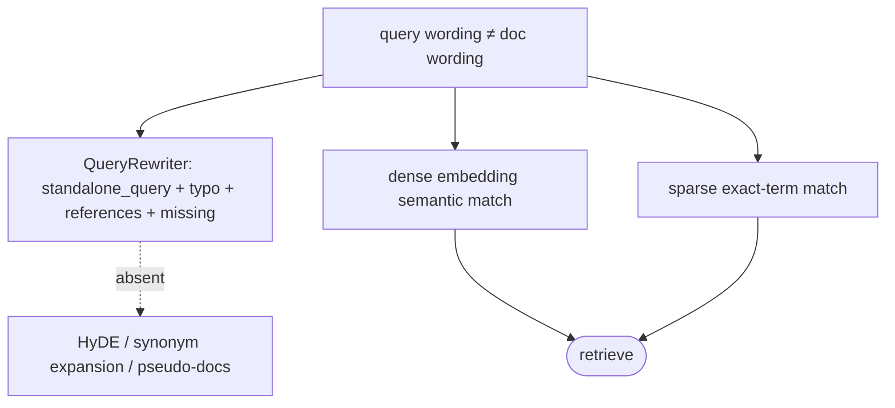

Anchors

<strong>Anchors:</strong> &bull; <code>agent-core/openjiuwen/core/retrieval/query_rewriter/query_rewriter.py:412</code> — <code>rewrite(query)</code> → <code>standalone_query</code>; <code>:277</code> output schema &bull; <code>agent-core/openjiuwen/core/retrieval/query_rewriter/prompts/intention_completion_en.md:32</code> — coreference resolution; <code>:41</code> missing-information completion; <code>:47</code> typo correction &bull; <code>agent-core/openjiuwen/core/retrieval/retriever/graph_retriever.py:349</code> — vector retriever (dense semantic match) &bull; <code>agent-core/openjiuwen/core/memory/graph/graph_memory/base.py:735</code> — <code>_fetch_relevant_entities</code> semantic entity match

_Canonical source: `source/rag-retrieval-interview-questions_for_engineers.md`; also covered in: rag-practical, rag-retrieval._

---

## 8. Structuring error handling for a pipeline where retrieval, reranking, or generation can each fail independently

**General:** Isolate each stage so one failure degrades rather than aborts: retrieval returns an empty/flagged result, reranking falls back to the pre-rerank order, generation surfaces a structured error. Use typed errors per stage, explicit fallbacks, retries only for transient failures, and a top-level handler that converts failure into a model-readable message instead of a crash.

**Jiuwen:** Failures are mostly contained per stage. Retrievers implement stage-local fallbacks: `VectorRetriever` falls back to BM25 when vector search is empty, `HybridRetriever` falls back to sparse when dense search is empty (in `mode="vector"` only), and `GraphRetriever` falls back to sparse only in its `mode="sparse"` branch. Model-call failures are handled by rails: `ModelAnomalyDetectionRail.on_model_exception` retries stream-timeout/repetition with backoff, and `ToolCallResilienceRail` retries transport/timeout tool errors. In `AbilityManager`, any tool/workflow/sub-agent exception is caught and converted to an error `ToolMessage` so the round continues. Workflow HTTP components have per-component retry (`HttpRetryConfig`, 429/5xx) and rate-limit config. Pregel node failure cancels siblings via `FIRST_EXCEPTION`.

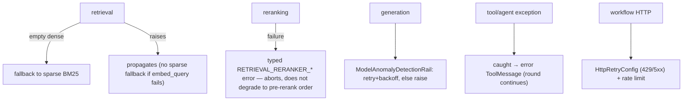

Anchors

<strong>Anchors:</strong> &bull; <code>agent-core/openjiuwen/core/retrieval/retriever/vector_retriever.py:83</code> — dense-empty → BM25 fallback; <code>agent-core/openjiuwen/core/retrieval/retriever/hybrid_retriever.py:97/194</code> — fallback branches; <code>agent-core/openjiuwen/core/retrieval/retriever/graph_retriever.py:462</code> — fallback to sparse &bull; <code>agent-core/openjiuwen/harness/rails/model_anomaly_detection_rail.py:236</code> — <code>on_model_exception</code> retry classification; <code>agent-core/openjiuwen/harness/rails/tool_call_resilience_rail.py:106</code> — tool exception retry decision &bull; <code>agent-core/openjiuwen/core/single_agent/ability_manager.py:1186</code> — exception rendered into a <code>ToolMessage</code> &bull; <code>agent-core/openjiuwen/core/workflow/components/tool/http/http_request_component.py:102</code> — <code>HttpRetryConfig</code>; <code>:110</code> <code>HttpRateLimitConfig</code> &bull; <code>agent-core/openjiuwen/core/graph/pregel/task.py:47</code> — FIRST_EXCEPTION cancels siblings

**Gap.** No retrieval-stage circuit breaker or pipeline-level compensation (a generic runner `CircuitBreakerFilter` exists but is not wired into the retrieval stages). Reranker failure aborts retrieval rather than degrading to the pre-rerank order, and a failed `embed_query` has no sparse fallback. Failures are swallowed into model-visible text, so downstream cannot distinguish "empty" from "broken".

_Canonical source: `source/ai-engineer-technical-questions_for_engineers.md`; also covered in: engineering._

---

## 9. "Design a RAG system" tests failure mode awareness, not architecture recall

**General:** This claim holds: the value in "design a RAG system" is naming the failure modes and how you detect them, not reciting a reference architecture. Drawing embed → retrieve → rerank → generate is the basic shape. When retrieval returns the wrong chunk, the causes are usually retrieval-side: chunk boundaries cut the answer, the embedding mismatches the domain, the query wording differs from the corpus, exact IDs need sparse search, or metadata filters were dropped. Point at the stage that fails, not the pipeline as a whole. "Wrong chunk" is usually retrieval-side: chunk boundaries cut the answer, the embedding mismatches the domain, the query wording differs from the corpus, exact IDs need sparse search, or metadata filters were dropped. Name the check for each (read the chunk, score threshold, hybrid fallback).

**Jiuwen:** The failure points are concrete. Dense retrieval falls back to sparse only when it returns *empty*, not when it is wrong; `score_threshold` defaults to `None` so weak chunks pass; the KB path never reranks; and metadata `filters` are dropped at the retriever boundary, so an "authorized docs only" filter silently does nothing.

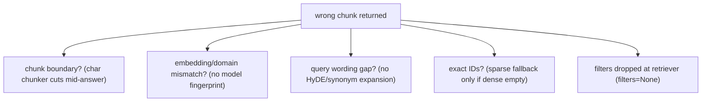

Anchors

<strong>Anchors:</strong> &bull; <code>agent-core/openjiuwen/core/retrieval/retriever/vector_retriever.py:83</code> — dense-empty → sparse fallback only; <code>:88</code> <code>filters=None</code>; <code>:94</code> threshold applied only when supplied &bull; <code>agent-core/openjiuwen/core/retrieval/common/config.py:47</code> — <code>score_threshold</code> defaults <code>None</code> &bull; <code>agent-core/openjiuwen/core/retrieval/simple_knowledge_base.py:182</code> — KB path calls no reranker &bull; <code>agent-core/openjiuwen/core/retrieval/indexing/processor/chunker/text_splitter.py:56</code> — char chunker cuts at fixed offsets

---

## 10. "The model made something up" is testing hallucination handling, not model quality

**General:** This claim holds: "the model made something up" is about hallucination handling and mitigation, not about which model is best. how you ground and verify output — grounding in retrieved context, citations tied to sources, confidence thresholds before generating, and defined fallback when retrieval is empty or irrelevant. Treat this as a system design, not a claim about model quality: pass the retrieved context to the generator, require citations, gate on an answerability/score threshold before generating, and define the empty/irrelevant fallback (abstain or ask). Measure faithfulness against the context, not just correctness against a reference.

**Jiuwen:** Grounding is a separate, non-blocking layer: a verification agent (read-only evidence, PASS/FAIL/PARTIAL) and a reviewer `Correctness` dimension. But `score_threshold` defaults to `None`, there is no answerability gate or abstention in the KB path, and no judge receives the retrieved context (no faithfulness score).

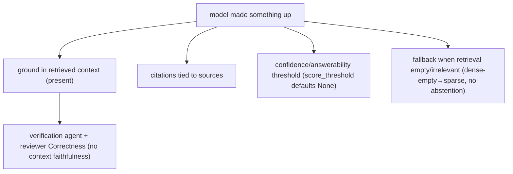

Anchors

<strong>Anchors:</strong> &bull; <code>agent-core/openjiuwen/harness/rails/subagent/verification_rail.py:92</code> — <code>VerificationRail</code> allowlist &bull; <code>agent-core/openjiuwen/agent_teams/verification/reviewer.py:43</code> — <code>Correctness</code> dimension &bull; <code>agent-core/openjiuwen/core/retrieval/common/config.py:47</code> — <code>score_threshold</code> default <code>None</code> &bull; <code>agent-core/openjiuwen/core/retrieval/retriever/vector_retriever.py:83</code> — dense-empty → sparse fallback &bull; <code>agent-core/openjiuwen/agent_evolving/evaluator/metrics/llm_as_judge.py:40</code> — no context input

---

## 11. How do you treat output validation as a pipeline stage, not an afterthought?

**General:** Output validation should be an explicit, typed stage between generation and delivery: (1) syntactic validation — does the output match the declared schema or format (JSON schema, regex, structured output type)? (2) semantic validation — is the content grounded in the retrieved context (faithfulness check)? (3) policy validation — does the output pass safety/guardrail rules? Each stage has a clear pass/fail contract: fail syntactic → retry with repair prompt; fail semantic → abstain or flag; fail policy → redact or block. Logging the failure mode at each stage is what makes the system debuggable.

**Jiuwen:** The framework has components for each stage but they are not wired into a single linear validation pipeline. Syntactic: `SchemaUtils.validate_with_schema` on tool results; `structured_output` tool enforces a caller-supplied JSON Schema. Semantic: `VerificationRail` (read-only evidence, PASS/FAIL/PARTIAL); `FaithfulnessEvaluator` in `agent_evolving/eval/`. Policy: `SecurityRail` (prompt injection detection), `PromptInjectionGuardrail` (sequence-classification model). But these operate as independent rails — there is no shared output-validation stage that all responses must pass before leaving the agent, and there is no pipeline-level failure-mode log distinguishing syntactic vs semantic vs policy failures.

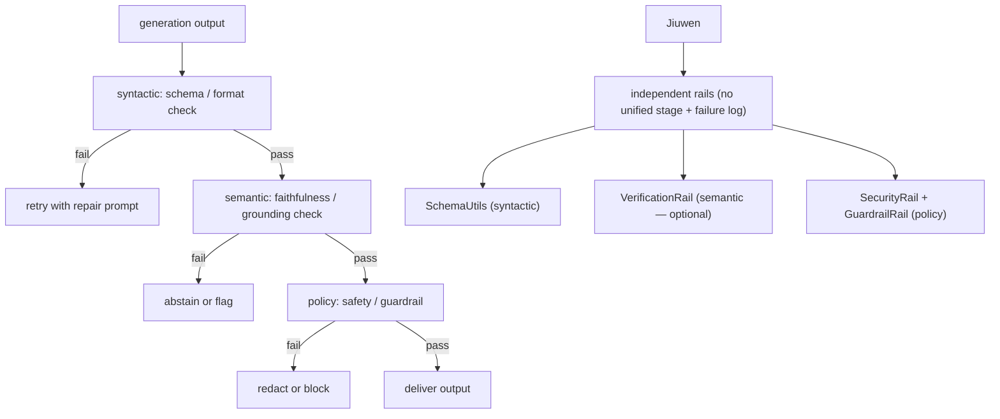

Anchors

<strong>Anchors:</strong> &bull; <code>agent-core/openjiuwen/core/common/utils/schema_utils.py:115</code> — <code>validate_with_schema</code> (syntactic) &bull; <code>agent-core/openjiuwen/harness/rails/subagent/verification_rail.py:92</code> — <code>VerificationRail</code> (semantic) &bull; <code>agent-core/openjiuwen/agent_evolving/evaluator/metrics/faithfulness_evaluator.py:1</code> — <code>FaithfulnessEvaluator</code> &bull; <code>agent-core/openjiuwen/auto_harness/rails/security_rail.py:1</code> — <code>SecurityRail</code> (policy) &bull; <code>agent-core/openjiuwen/core/security/guardrail/builtin.py:1</code> — <code>GuardrailRail</code> (policy)

**Gap.** No unified output-validation pipeline with a shared failure-mode log; rails are independently enabled/disabled and do not feed a per-response validation record distinguishing syntactic vs semantic vs policy failures.

_Canonical source: `source/agent-failure-patterns_for_engineers.md`; also covered in: agent-failure._