# Production, cost and scale

## 1. Where cost concentrates: embedding is cheap and one-time, generation scales with traffic

**General:** Embedding is a one-time (or change-only) indexing cost and is cheap per token; the recurring, traffic-scaling cost is generation — especially input tokens when you stuff long context. So optimization effort should go to the generation loop (fewer iterations, smaller context, cheaper model) more than to embeddings. Measure input vs output tokens separately.

**Jiuwen:** Embedding is batched and effectively one-time: `APIEmbedding` chunks texts (`max_batch_size=8`, `max_concurrent=50`) and `compute_chunk_embeddings` runs at index/update time. Generation is what is metered: `usage_cost.add_session_usage` accumulates provider-reported `input_tokens`/`output_tokens`/`total_tokens` (and optional costs) per session, fed by every `chat.usage_metadata` event. Core tracks KV/prompt-cache hit rates (tokens, not dollars). The only per-token dollar rates are hardcoded estimates in the auto-harness budget rail.

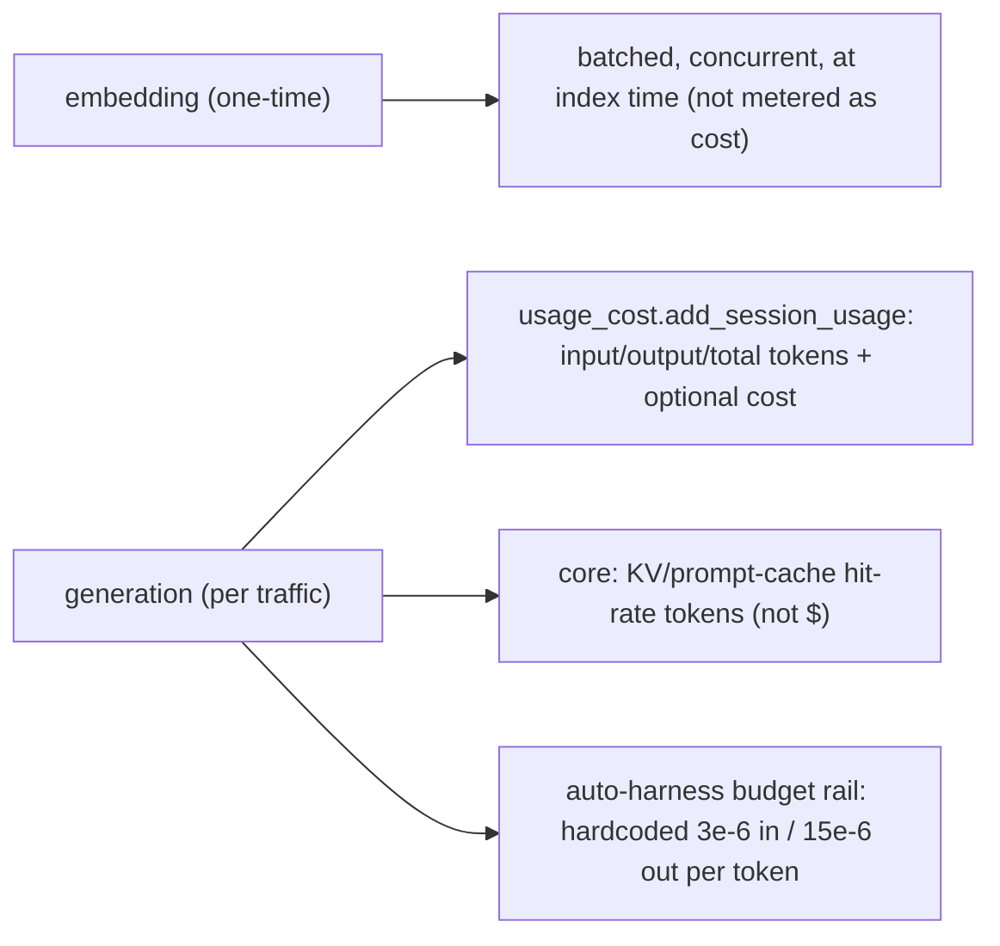

Anchors

<strong>Anchors:</strong> &bull; <code>agent-core/openjiuwen/core/retrieval/embedding/api_embedding.py:45</code> — <code>max_batch_size: int = 8</code>, <code>max_concurrent: int = 50</code>; <code>:167</code> batch + gather &bull; <code>agent-core/openjiuwen/core/retrieval/indexing/indexer/embed_chunks.py:21</code> — <code>compute_chunk_embeddings</code> at index/update time &bull; <code>agent-core/openjiuwen/core/context_engine/usage/provider_usage.py:14</code> — normalizes input/cache tokens; <code>agent-core/openjiuwen/core/context_engine/usage/session_aggregator.py:45</code> — cache hit-rate aggregation &bull; <code>jiuwenswarm/jiuwenswarm/server/runtime/usage_cost.py:101</code> — <code>add_session_usage</code>; <code>jiuwenswarm/jiuwenswarm/server/runtime/agent_adapter/interface_deep.py:17212</code> — usage events &bull; <code>agent-core/openjiuwen/auto_harness/rails/budget_rail.py:24</code> — input <code>3e-6</code> / output <code>15e-6</code> USD per token; <code>:85</code> cost computed

**Gap.** Embedding cost is never tracked, core retrieval/indexing has no embedding result cache (the product memory index does keep a SQLite `embedding_cache`), and session totals are in-process (lost on restart).

_Canonical source: `source/rag-practical-interview-questions_for_engineers.md`; also covered in: rag-practical._

---

## 2. How would you reduce cost for a high-volume RAG system without degrading answer quality

**General:** Cut the dominant (input-token/generation) cost: rerank a larger candidate set down to a smaller k, cache (exact and semantic), route easy queries to smaller models, shorten prompts (fewer examples, tighter context), summarize long chunks, and cap the agent's iterations. Prefer quality-preserving levers (rerank+tighten, cache, route) over blind k reduction.

**Jiuwen:** The product tracks provider-reported session cost and enforces a per-session cap; core caps repetition via `max_iterations`, team `BudgetLedger`, and anomaly/dedup rails; conversation compaction reduces context tokens. But embedding cost is never tracked, there is no semantic/response cache, no rerank-to-K lever in the KB, and no query-difficulty/cost-aware model routing.

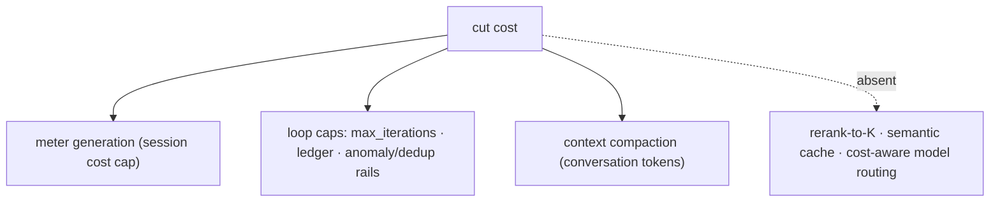

Anchors

<strong>Anchors:</strong> &bull; <code>jiuwenswarm/jiuwenswarm/server/runtime/usage_cost.py:171/196</code> — session cost cap &bull; <code>agent-core/openjiuwen/core/single_agent/agents/react_agent.py:288</code> — <code>max_iterations</code>; <code>agent-core/openjiuwen/harness/schema/config.py:252</code> — harness default &bull; <code>agent-core/openjiuwen/agent_teams/workflow/engine/budget.py:27</code> — <code>BudgetLedger</code> &bull; <code>agent-core/openjiuwen/core/context_engine/processor/compressor/full_compact_processor.py:184</code> — 180k compaction &bull; <code>agent-core/openjiuwen/agent_teams/models/allocator.py:559</code> — availability routing (not cost/quality)

_Canonical source: `source/rag-system-design-interview-questions_for_engineers.md`; also covered in: rag-system._

---

## 3. How do you control cost in a system where usage scales unpredictably

**General:** Bound the loop (max iterations/rounds/time), cap tokens per request and per session, make cheap models do cheap work, cache, offload/summarize context, and surface per-run cost so it can be budgeted and alerted. Retries and huge tool outputs are common hidden cost sources.

**Jiuwen:** The product tracks provider-reported session cost and enforces a per-session cap: totals accumulate under a lock, `set_session_cost_limit` sets a ceiling only when provider cost metadata is available, and `raise_if_session_cost_limit_exceeded` raises when over. Core limits repetition via ReAct `max_iterations` (default 5, harness 15), team `BudgetLedger` token ceilings, and `ModelAnomalyDetectionRail`'s tool-loop compaction/bailout. `ToolCallDeduplicationRail` counts repeated read-only calls and warns.

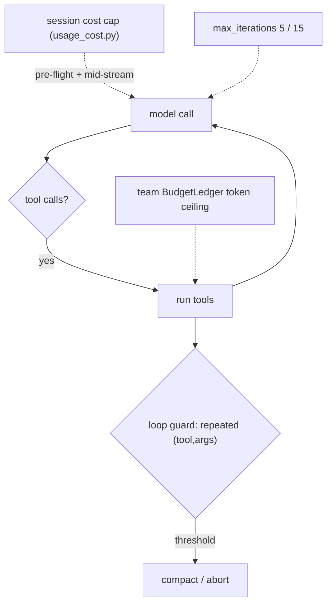

Anchors

<strong>Anchors:</strong> &bull; <code>jiuwenswarm/jiuwenswarm/server/runtime/usage_cost.py:171</code> — <code>raise_if_session_cost_limit_exceeded</code>; <code>:196</code> <code>set_session_cost_limit</code> (requires provider cost) &bull; <code>agent-core/openjiuwen/core/single_agent/agents/react_agent.py:288</code> — <code>max_iterations</code>; <code>agent-core/openjiuwen/harness/schema/config.py:252</code> — harness default 15 &bull; <code>agent-core/openjiuwen/agent_teams/workflow/engine/budget.py:27</code> — <code>BudgetLedger</code> &bull; <code>agent-core/openjiuwen/harness/rails/model_anomaly_detection_rail.py:74/90</code> — tool-loop threshold + bailout &bull; <code>jiuwenswarm/jiuwenswarm/agents/harness/common/rails/tool_dedup_rail.py:157</code> — cross-turn repeat counter; <code>agent-core/openjiuwen/harness/goal/evaluation.py:298</code> — <code>max_attempts</code>

**Gap.** Cost enforcement is inert unless the provider reports cost metadata, and totals/limits are per-process (not shared across replicas). No cost-aware model downgrade.

_Canonical source: `source/genai-interview-questions_for_engineers.md`; also covered in: genai._

---

## 4. First cut at 50% cost reduction: route simple queries to a smaller model, reduce top-k

**General:** The cheapest high-impact cuts: route easy queries to a smaller/cheaper model (classify query difficulty first), lower `top_k`, cache, shorten the prompt (fewer examples, tighter context), and reduce the agent's iteration cap. Start with model routing and top-k because they cut the dominant (generation/input-token) cost directly.

**Jiuwen:** Model selection is about availability and endpoint distribution, not cost or query difficulty. `build_model_allocator` dispatches four availability strategies (`round_robin`, `by_model_name`, `router`, `intelli_router`); allocation happens at member construction from a `model_name` hint and is immutable per member. `IntelliRouter` is rate-aware only through `tpm`/`rpm`. The only retrieval-size knob is the static `top_k` (default 5). There is no query-classification-to-model routing and no cost-aware top-k policy.

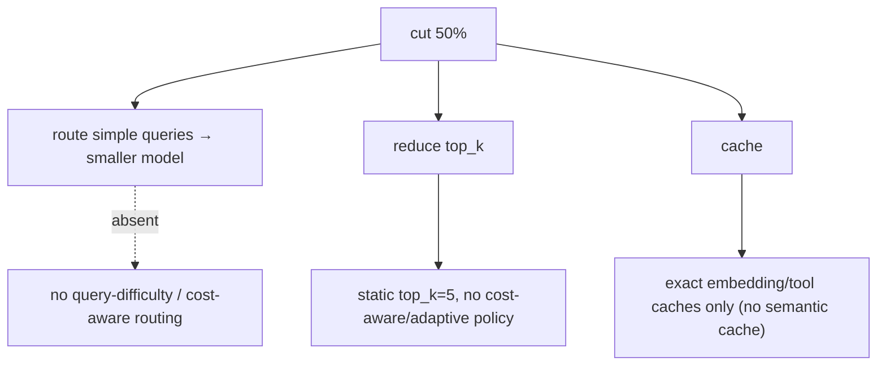

Anchors

<strong>Anchors:</strong> &bull; <code>agent-core/openjiuwen/agent_teams/models/allocator.py:559</code> — <code>build_model_allocator</code> (4 availability strategies); <code>:240</code> <code>ByModelNameAllocator</code>; <code>:520</code> <code>resolve_member_model</code> (no query awareness) &bull; <code>agent-core/openjiuwen/agent_teams/models/pool.py:38</code> — <code>ModelPoolEntry</code>; <code>:278</code> <code>tpm</code>/<code>rpm</code> rate-aware only &bull; <code>agent-core/openjiuwen/core/retrieval/common/config.py:46</code> — <code>top_k: int = 5</code> (only retrieval-size config) &bull; <code>jiuwenswarm/jiuwenswarm/agents/harness/common/memory/manager.py:773</code> — exact embedding cache (no semantic cache)

**Gap.** No query-classification-to-model routing, no cost-aware routing, and no adaptive top-k.

_Canonical source: `source/rag-practical-interview-questions_for_engineers.md`; also covered in: rag-practical._

---

## 5. Designing caching for repeated or semantically similar queries

**General:** Layer caches: exact-match response/prompt cache, provider prefix/prompt caching, embedding cache, and — harder — a semantic cache that embeds the query and returns a prior answer for similar queries above a similarity threshold. The semantic cache needs a threshold and invalidation strategy, and exact-match caches need a stable key including model and parameters.

**Jiuwen:** Caching is exact-match, not semantic. Core has a session KV-cache runtime with affinity/lineage identities (parent/child sessions, team members, compressors) to reuse inference KV state. The product memory index keeps a SQLite `embedding_cache` keyed by text hash, and `agent_evolving` has its own embedding cache. `ToolCallDeduplicationRail` is an exact `(tool_name, args-hash)` per-turn result cache for read-only tools. Local vLLM/transformers use prefix/prompt caches.

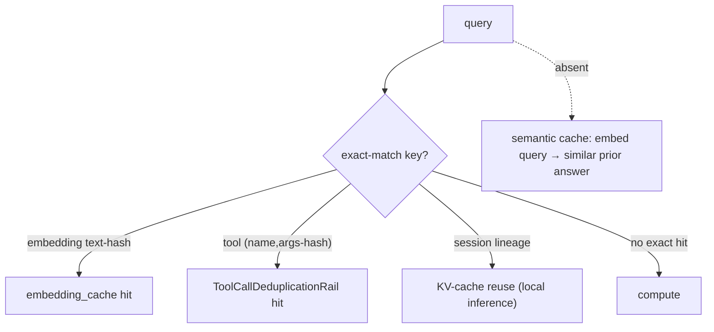

Anchors

<strong>Anchors:</strong> &bull; <code>agent-core/openjiuwen/core/kv_cache/kv_cache_runtime.py:32</code> — <code>KVCacheRuntime</code>; <code>agent-core/openjiuwen/core/kv_cache/__init__.py:10</code> — <code>KVCacheAffinityConfig</code> &bull; <code>jiuwenswarm/jiuwenswarm/agents/harness/common/memory/manager.py:31</code> — <code>EMBEDDING_CACHE_TABLE</code>; <code>:773</code> text-hash lookup before embedding &bull; <code>jiuwenswarm/jiuwenswarm/agents/harness/common/rails/tool_dedup_rail.py:47</code> — exact per-turn tool result cache &bull; <code>agent-core/openjiuwen/core/retrieval/lazy_load.py:25</code> — lazy import cache; <code>agent-core/openjiuwen/core/context_engine/token/tiktoken_counter.py:221</code> — reusable encodings &bull; <code>agent-core/openjiuwen/agent_evolving/ttse/stores.py:522</code> — embedding cache limit; <code>agent-core/openjiuwen/symphony/retrieval/llm/vllm/client.py:176</code> — prefix cache

**Gap.** No semantic/response cache anywhere — nothing embeds a query and looks up a prior answer by similarity. Tool dedup is exact-arg; only the *result* cache is single-turn (the rail keeps a cross-turn execution counter). The product memory index keeps a SQLite `embedding_cache`; the agent_evolving TTSE cache is memory-only.

_Canonical source: `source/ai-engineer-technical-questions_for_engineers.md`; also covered in: engineering, rag-1._

---

## 6. Reducing latency in a multi-step LLM pipeline

**General:** Stream tokens so time-to-first-token matters more than total; run independent steps in parallel; cache prompts/prefixes and embeddings; route easy steps to faster/smaller models; and avoid blocking the event loop. Measure TTFT and per-stage latency to find the bottleneck.

**Jiuwen:** End-to-end streaming is supported (ReAct `stream` → session stream iterator → WebSocket chunk frames), and TTFT is measured per model call (`ttft_ms`). Shared persistent HTTP clients avoid per-call TLS setup, parallel tool execution shortens multi-tool turns, and local inference uses prompt/prefix KV-cache reuse. `IntelliRouter` provides a reliable router across deployments, and the product caches built model objects by name.

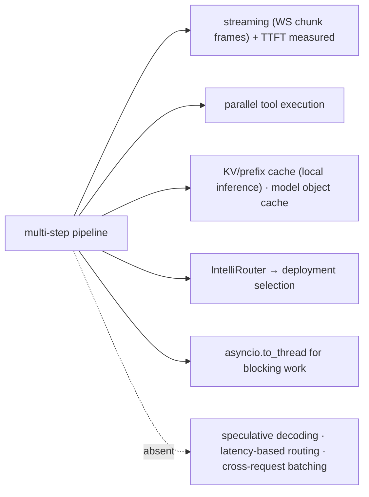

Anchors

<strong>Anchors:</strong> &bull; <code>agent-core/openjiuwen/core/single_agent/agents/react_agent.py:2938</code> — <code>stream</code> entry; <code>:1758</code> <code>ttft_ms</code> &bull; <code>agent-core/openjiuwen/core/foundation/llm/model.py:197</code> — stream first-chunk/idle timeouts &bull; <code>agent-core/openjiuwen/core/kv_cache/kv_cache_runtime.py:32</code> — session KV-cache runtime &bull; <code>agent-core/openjiuwen/symphony/retrieval/llm/vllm/client.py:176</code> — <code>prepare_prefix_cache</code> &bull; <code>agent-core/openjiuwen/core/foundation/llm/model_clients/intelli_router_model_client.py:32</code> — <code>ReliableRouter</code> &bull; <code>jiuwenswarm/jiuwenswarm/server/runtime/agent_adapter/interface_deep.py:6353</code> — model object cache by name

**Gap.** No speculative decoding, no latency/SLA-based routing, no cross-request batching; prefix caching exists only for local inference.

_Canonical source: `source/ai-engineer-technical-questions_for_engineers.md`; also covered in: engineering, genai, llm-applied, rag-1._

---

## 7. Multithreading vs. multiprocessing, which matters more for I/O-bound LLM API calls

**General:** For I/O-bound work (network calls to LLM APIs, vector DBs), async I/O or threads beat multiprocessing: the CPU is idle while waiting, so you want concurrency, not extra processes. Async is the most efficient (no thread-per-request overhead) when your stack is async end to end; threads are the fallback for blocking SDKs. Multiprocessing only pays off for CPU-bound work (local inference, heavy parsing) because it escapes the GIL.

**Jiuwen:** The LLM path is single-process asyncio/anyio. `httpx.AsyncClient` instances share a process-global `AsyncConnectionPool` via `HttpXConnectorPool`, and `AsyncOpenAI`/`AsyncAnthropic` clients are cached process-wide with `httpx.Limits(max_connections=100, max_keepalive_connections=20)`. Blocking work is offloaded with `asyncio.to_thread`/`run_in_executor`, never `multiprocessing`. Embeddings use an `asyncio.Semaphore(max_concurrent)` (default 50), with a `ThreadPoolExecutor` only for the sync facade. `multiprocessing` appears in tests, the observability trace store, process isolation, and `agent_rl`'s offline `parallel_executor` — not as an LLM throughput strategy.

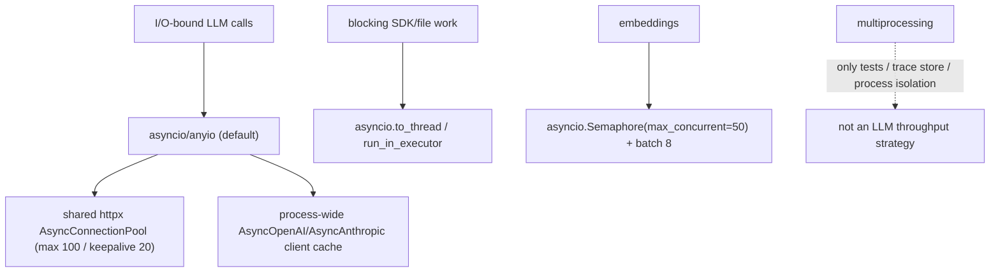

Anchors

<strong>Anchors:</strong> &bull; <code>agent-core/openjiuwen/core/common/clients/llm_client.py:52</code> — <code>HttpXConnectorPool</code> (<code>AsyncConnectionPool</code>) &bull; <code>agent-core/openjiuwen/core/foundation/llm/model_clients/openai_model_client.py:383</code> — process-wide <code>_client_cache</code>; <code>:1118</code> <code>httpx.Limits(max_connections=100, max_keepalive_connections=20)</code> &bull; <code>agent-core/openjiuwen/core/foundation/llm/model_clients/anthropic_model_client.py:719</code> — same pooling for <code>AsyncAnthropic</code> &bull; <code>agent-core/openjiuwen/core/retrieval/embedding/api_embedding.py:55</code> — <code>asyncio.Semaphore(max_concurrent)</code>; <code>:120</code> <code>ThreadPoolExecutor</code> for sync path &bull; <code>jiuwenswarm/jiuwenswarm/server/agent_ws_server.py:5326</code> — <code>asyncio.to_thread(...)</code> offload; <code>jiuwenswarm/jiuwenswarm/server/runtime/agent_warm_pool.py:154</code> — semaphore-bounded warm pool

**Gap.** No process-level parallelism to escape the GIL for tokenization/parsing at scale; sync embedding still consumes a thread per concurrent request.

_Canonical source: `source/ai-engineer-technical-questions_for_engineers.md`; also covered in: engineering._

---

## 8. What happens to your architecture at 10x current traffic

**General:** You hit dependencies and queues before arithmetic: provider rate limits and 429s, serialized tool/DB access, memory pressure from context, and connection pools. Costs scale roughly linearly with tokens but can super-linearly if retries or coordination rise. Fixes are caching, concurrency limits, queues/shards, backpressure, and cheaper routing — plus autoscaling at the process boundary.

**Jiuwen:** The system has per-process bounded resources rather than elastic scaling. LLM HTTP concurrency is capped by a shared httpx pool (`max_connections=100`, keepalive 20); embeddings by a semaphore (default 50) with batch size 8; team sub-agent fan-out by a semaphore (default 10); the warm pool and message queues have their own bounds. Internal channels use bounded `asyncio.Queue(maxsize=...)`; workflow HTTP supports token-bucket rate limiting; retries/backoff exist at model and tool layers. There is no autoscaling.

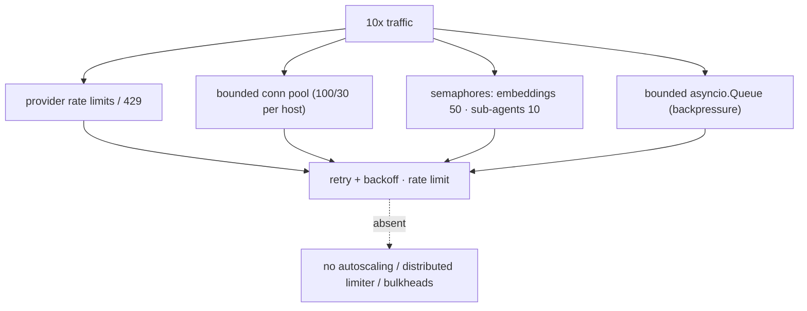

Anchors

<strong>Anchors:</strong> &bull; <code>agent-core/openjiuwen/core/common/clients/connector_pool.py:21</code> — <code>limit: 100</code>, <code>limit_per_host: 30</code>; <code>agent-core/openjiuwen/core/foundation/llm/model_clients/openai_model_client.py:1118</code> — pool limits &bull; <code>agent-core/openjiuwen/core/retrieval/embedding/api_embedding.py:55</code> — concurrency semaphore &bull; <code>agent-core/openjiuwen/core/multi_agent/teams/hierarchical_msgbus/p2p_ability_manager.py:34</code> — max parallel sub-agents &bull; <code>agent-core/openjiuwen/core/workflow/components/tool/http/http_request_component.py:110</code> — <code>HttpRateLimitConfig</code> &bull; <code>agent-core/openjiuwen/core/runner/message_queue_inmemory.py:34</code> — bounded queue; <code>agent-core/openjiuwen/harness/subagent_runtime/activity_events.py:53</code> — bounded activity queue &bull; <code>agent-core/openjiuwen/harness/rails/model_anomaly_detection_rail.py:35</code> — backoff schedule; <code>jiuwenswarm/jiuwenswarm/server/runtime/agent_warm_pool.py:154</code> — warm-pool semaphore split

**Gap.** No HPA/autoscaling, no global/distributed rate limiter or admission control, no cross-tenant bulkheads. Connection caps and cost totals are per-process, so N replicas multiply the effective limit.

_Canonical source: `source/ai-engineer-technical-questions_for_engineers.md`; also covered in: ai-agent, engineering, genai._

---

## 9. Scaling questions test whether you've thought past the demo

**General:** "What happens at 10x traffic" is asked because most architectures don't survive it. If nothing changes in your design when asked, that's the signal they're waiting for. Name one lever *with where it fits*: caching repeated queries, batching concurrent requests, parallelizing independent tool calls. A strong answer includes: identify the first bottleneck (provider rate limits, serialized tools, connection pools, context memory), then name the lever and where it sits. Mention backpressure and bounded concurrency, not just "add more servers".

**Jiuwen:** Bounded resources exist per process: shared httpx pool (`max_connections=100`), embedding semaphore (50), sub-agent fan-out semaphore (10), bounded `asyncio.Queue`s, and parallel tool execution with resource lanes. What is missing is autoscaling, a distributed rate limiter, and any semantic response cache — so the design change at 10x is mostly "add replicas + a global limiter", which the repo does not provide.

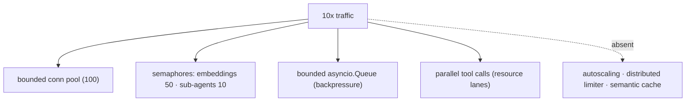

Anchors

<strong>Anchors:</strong> &bull; <code>agent-core/openjiuwen/core/common/clients/connector_pool.py:21</code> — <code>limit: 100</code>, <code>limit_per_host: 30</code> &bull; <code>agent-core/openjiuwen/core/retrieval/embedding/api_embedding.py:55</code> — concurrency semaphore &bull; <code>agent-core/openjiuwen/core/runner/message_queue_inmemory.py:34</code> — bounded queue; <code>agent-core/openjiuwen/harness/subagent_runtime/activity_events.py:53</code> — bounded activity queue &bull; <code>agent-core/openjiuwen/core/single_agent/ability_manager.py:431</code> — <code>_execute_parallel_tool_tasks</code>; <code>:467</code> <code>parallel_safe</code> lanes &bull; <code>jiuwenswarm/jiuwenswarm/agents/harness/common/memory/manager.py:773</code> — exact embedding cache (no semantic cache)

---

## 10. What's your rollback plan if a prompt or model update degrades output quality?

**General:** Make every change reversible and observable: version the prompt/model, ship behind a flag or canary, define a one-command rollback, and gate broad rollout on a fixed eval. Monitor quality (not just errors) so you detect the degradation, and keep the previous version warm.

**Jiuwen:** Rollback exists for whole RSI **harness packages**: `rollback(installation_id)` refuses while tasks are active, validates the target hash, hot-reloads the prior version, and compensates if the pointer write fails — exposed over the WebSocket protocol. Behavior is gated by `enable_*` flags and a human `accept`/`reject` activation step. But there is **no prompt-level rollback** and no eval-threshold release gate, so a bad prompt change is only reversible if it was packaged as a harness version.

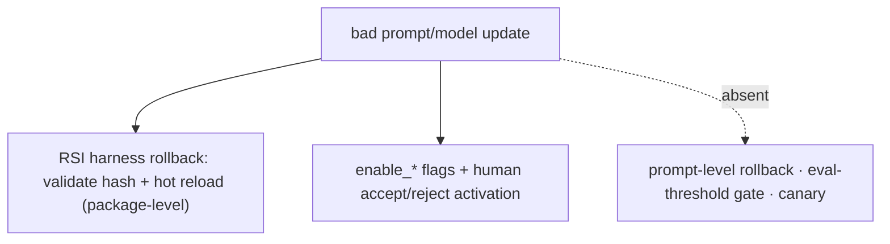

Anchors

<strong>Anchors:</strong> &bull; <code>jiuwenswarm/jiuwenswarm/agents/harness/common/rsi/harness_activation.py:617</code> — <code>rollback</code>; <code>:682</code> <code>_assert_rollback_allowed</code>; <code>:694</code> validate target hash &bull; <code>jiuwenswarm/jiuwenswarm/server/rsi/rsi_handlers.py:218/224</code> — versions list + rollback RPC &bull; <code>agent-core/openjiuwen/harness/schema/deep_agent_spec.py:448</code> — <code>enable_*</code> flags &bull; <code>agent-core/openjiuwen/auto_harness/stages/activate.py:118</code> — explicit <code>accept</code>/<code>reject</code> &bull; <code>agent-core/openjiuwen/auto_harness/resources/ci_gate.yaml:21</code> — no eval gate

_Canonical source: `source/llm-applied-interview-questions_for_engineers.md`; also covered in: llm-applied._

---

## 11. A stakeholder wants to ship before your eval scores are ready, how do you handle it

**General:** This is mostly process. De-risk instead of refusing: ship behind a flag or to a small canary, define a rollback path, cap the blast radius, agree on a minimal offline eval before broad rollout, and add monitoring so a quality drop is caught quickly. Make the tradeoff explicit (what's unmeasured, what the fallback is) and put a date on the missing eval.

**Jiuwen:** The closest code mechanisms are CI gates and explicit human activation, not an eval-score gate. The auto-harness `CIGateRunner` loads gates from `ci_gate.yaml` and returns pass/fail; the activate stage requires an explicit user `accept`/`reject` before an extension is hot-loaded; and the product's RSI harness activation supports rollback (refuses while tasks are active, validates the target hash, hot-loads the old version). Behavior gating is done with `enable_*` config flags. There is no release gate tied to eval thresholds and no canary/percentage rollout.

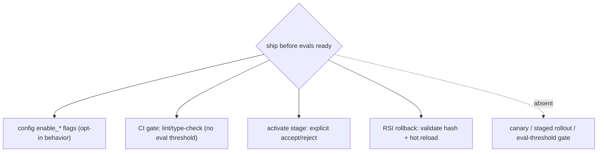

Anchors

<strong>Anchors:</strong> &bull; <code>agent-core/openjiuwen/auto_harness/infra/ci_gate_runner.py:168</code> load gates; <code>:1153</code> run + aggregate <code>passed</code> &bull; <code>agent-core/openjiuwen/auto_harness/stages/activate.py:118</code> — explicit <code>accept</code>/<code>reject</code> interaction before hot-load &bull; <code>agent-core/openjiuwen/auto_harness/stages/merge.py:95</code> — static-check retry (max 3) then fail-fast &bull; <code>jiuwenswarm/jiuwenswarm/agents/harness/common/rsi/harness_activation.py:617</code> <code>rollback</code>; <code>:682</code> <code>_assert_rollback_allowed</code>; <code>:694</code> validate target hash &bull; <code>agent-core/openjiuwen/harness/schema/deep_agent_spec.py:448</code> — <code>enable_*</code> config flags

**Gap.** No eval-threshold release gate and no canary/percentage rollout; the decision is human process, supported only by feature flags, explicit activation, CI checks, and manual rollback.

_Canonical source: `source/ai-engineer-technical-questions_for_engineers.md`; also covered in: engineering._

---

## 12. Controlling cost when an agent can call tools repeatedly

**General:** Bound the loop (max iterations/rounds/time), cap tokens, make cheap models do cheap work, cache, and surface per-run cost so it can be budgeted. Retries and huge tool outputs are common hidden cost sources.

**Jiuwen:** The product tracks provider-reported session cost and enforces a per-session cap: totals accumulate under a lock, `set_session_cost_limit` sets a ceiling only when provider cost metadata is available, and `raise_if_session_cost_limit_exceeded` raises when over. Core limits repetition via ReAct `max_iterations` (default 5, harness 15), team `BudgetLedger` token ceilings, and `ModelAnomalyDetectionRail`'s tool-loop compaction/bailout. `ToolCallDeduplicationRail` counts repeated read-only calls and warns.

Anchors

<strong>Anchors:</strong> &bull; <code>jiuwenswarm/jiuwenswarm/server/runtime/usage_cost.py:171</code> — <code>raise_if_session_cost_limit_exceeded</code>; <code>:196</code> <code>set_session_cost_limit</code> (requires provider cost) &bull; <code>agent-core/openjiuwen/core/single_agent/agents/react_agent.py:288</code> — <code>max_iterations</code>; <code>agent-core/openjiuwen/harness/schema/config.py:252</code> — harness default 15 &bull; <code>agent-core/openjiuwen/agent_teams/workflow/engine/budget.py:27</code> — <code>BudgetLedger</code> &bull; <code>agent-core/openjiuwen/harness/rails/model_anomaly_detection_rail.py:74/90</code> — tool-loop threshold + bailout &bull; <code>jiuwenswarm/jiuwenswarm/agents/harness/common/rails/tool_dedup_rail.py:157</code> — cross-turn repeat counter; <code>agent-core/openjiuwen/harness/goal/evaluation.py:298</code> — <code>max_attempts</code>

**Gap.** Cost enforcement is inert unless the provider reports cost metadata, and totals/limits are per-process (not shared across replicas). No cost-aware model downgrade or per-tool hard token budget in the core single-agent path.

_Canonical source: `source/ai-engineer-technical-questions_for_engineers.md`; also covered in: ai-agent, engineering, llm-applied._

---

## 13. Cutting tokens without losing quality: tighter reranking, summarizing long chunks

**General:** Reduce prompt tokens by retrieving fewer but better chunks (rerank a larger candidate set down to a small k), summarizing long chunks/passages before insertion, and trimming conversation history. Reranking preserves quality while cutting k; summarization trades fidelity for tokens. Both beat blindly lowering k.

**Jiuwen:** The retrieval path exposes only `top_k` (default 5) and `score_threshold`, and threshold filtering is honored only in `mode="vector"`. Crucially, the KB path never invokes a reranker (the `Reranker` classes are wired only into graph-memory search), so "retrieve N, rerank to K" is absent. Token reduction instead happens in the context engine on the *conversation*: tool results over 50k tokens are offloaded, stale tool results beyond `keep_last_k=3` are windowed, micro-compaction clears old tool results, and full compaction LLM-summarizes at 180k. Chunk text is embedded verbatim — no chunk-level summarization.

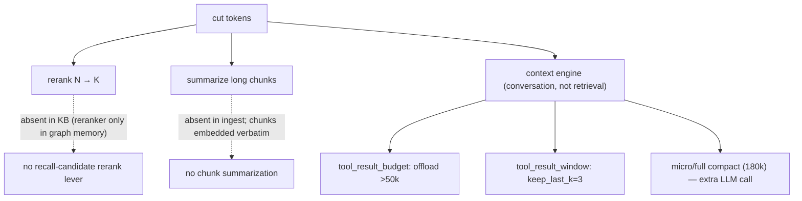

Anchors

<strong>Anchors:</strong> &bull; <code>agent-core/openjiuwen/core/retrieval/common/config.py:46</code> — <code>top_k: int = 5</code>; <code>:47</code> <code>score_threshold</code> &bull; <code>agent-core/openjiuwen/core/retrieval/retriever/hybrid_retriever.py:64</code> — threshold rejected unless <code>mode="vector"</code>; <code>:41</code> retrieve path has no reranker &bull; <code>agent-core/openjiuwen/core/memory/graph/graph_memory/base.py:645</code> — reranker only in graph-memory search &bull; <code>agent-core/openjiuwen/core/context_engine/processor/offloader/tool_result_budget_processor.py:34</code> — <code>tokens_threshold=50000</code>; <code>agent-core/openjiuwen/core/context_engine/processor/offloader/tool_result_window_processor.py:44</code> — <code>keep_last_k=3</code> &bull; <code>agent-core/openjiuwen/core/context_engine/processor/compressor/micro_compact_processor.py:24</code> — threshold 5; <code>agent-core/openjiuwen/core/context_engine/processor/compressor/full_compact_processor.py:184</code> — 180k &bull; <code>agent-core/openjiuwen/core/retrieval/query_rewriter/query_rewriter.py:227/349</code> — <code>compress_range=20</code> + history compression

_Canonical source: `source/rag-practical-interview-questions_for_engineers.md`; also covered in: rag-practical._
