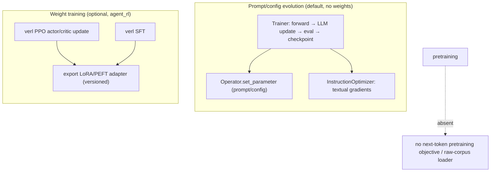
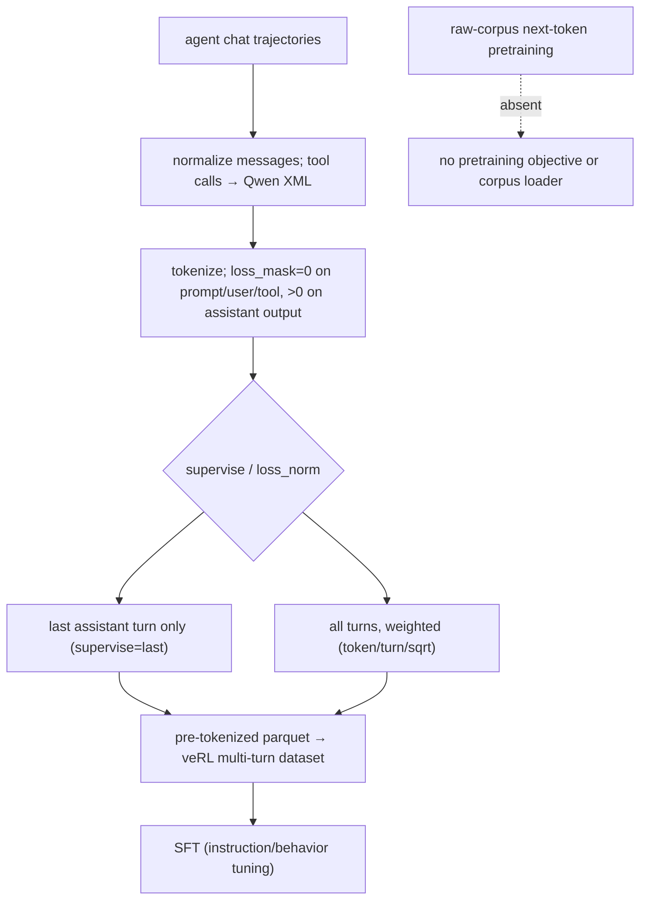
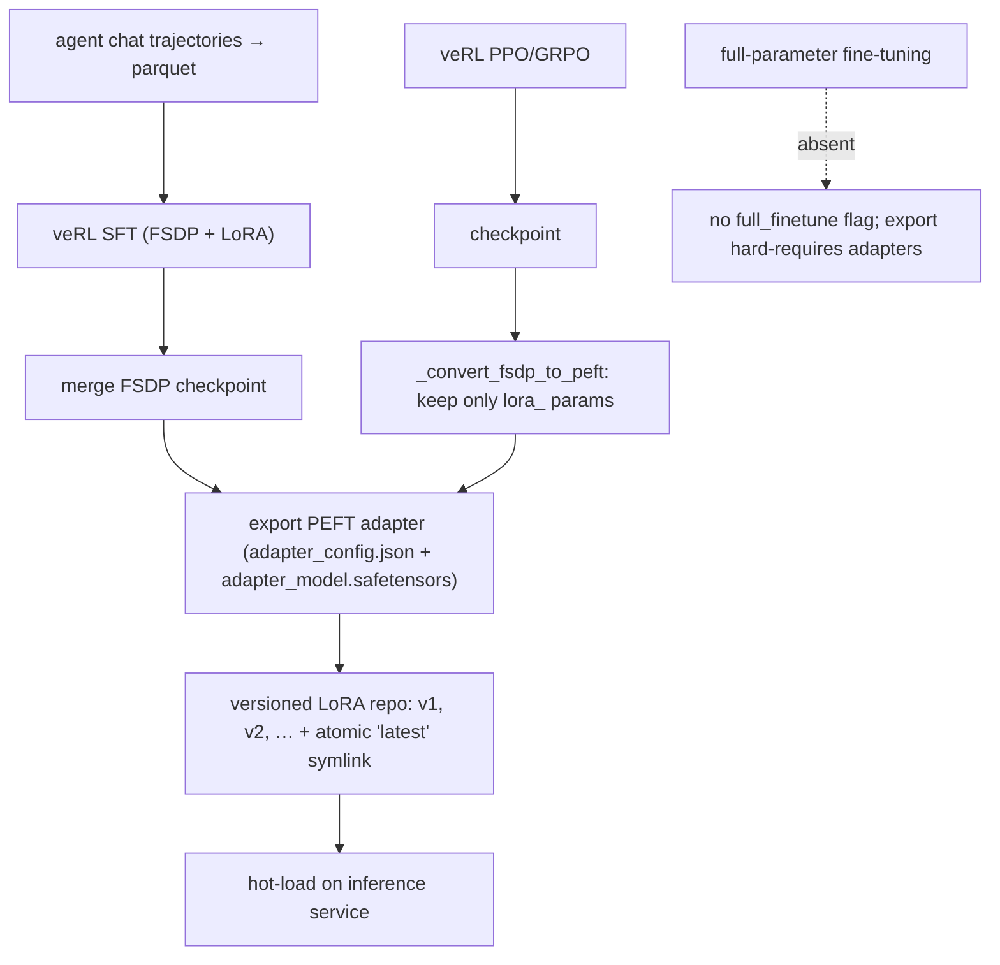
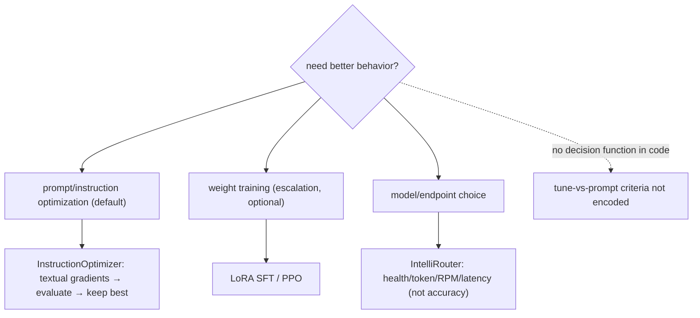
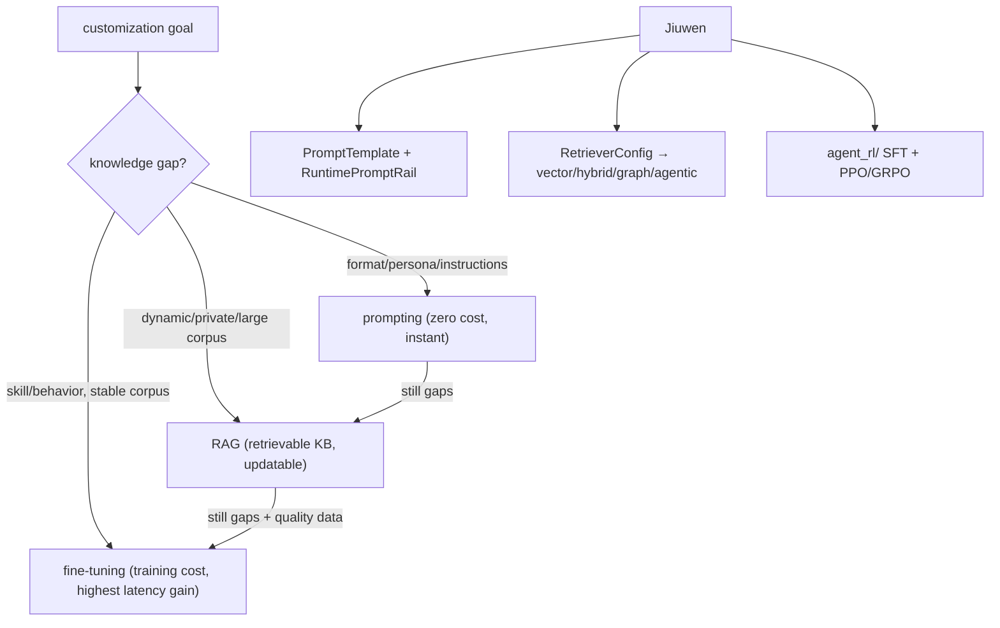
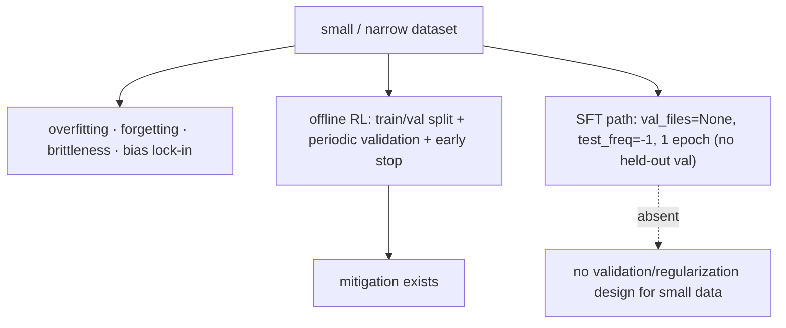
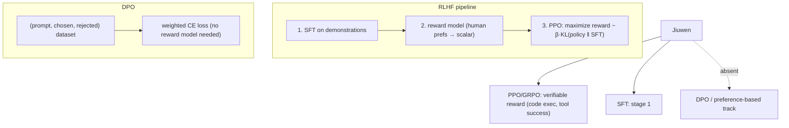

# Fine-tuning and customization

## 1. What's the difference between pretraining and fine-tuning

**General:** Pretraining learns general language structure from a huge unlabeled corpus with a self-supervised objective (next-token or masked-token); it is expensive and done once per base model. Fine-tuning adapts a pretrained model to a task/domain/behavior on a much smaller labeled or demonstration dataset, updating some or all weights. Instruction tuning is a specific kind of fine-tuning on instruction→response pairs.

**Jiuwen:** Two distinct things live here. The default "evolution" path does **not** train weights: `agent_evolving.Trainer` runs evaluate → LLM-generated update → validate → checkpoint and writes back **operators/parameters** (system/user prompts, configs) via `Operator.set_parameter` using "textual gradients" — prompt optimization, not gradient descent. `rsi/` and `auto_harness` evolve harness code/prompt sections. Separately, the optional `agent_evolving/agent_rl/` subsystem genuinely trains weights with veRL (PPO actor/critic updates, SFT) and exports **LoRA/PEFT adapters**. The training subsystems start from an existing base model rather than pretraining from scratch.

Anchors

<strong>Anchors:</strong> &bull; <code>agent-core/openjiuwen/agent_evolving/trainer/trainer.py:145</code> — <code>train()</code> loop; <code>:359</code> <code>op.set_parameter(target, value)</code> &bull; <code>agent-core/openjiuwen/agent_evolving/optimizer/llm_call/instruction_optimizer.py:30</code> — prompt rewrite via textual gradients &bull; <code>agent-core/openjiuwen/rsi/__init__.py:2</code> — recursive self-improvement over harness/prompt/code &bull; <code>agent-core/openjiuwen/agent_evolving/agent_rl/rl_trainer/ppo_step.py:147</code> — <code>update_actor</code> / <code>:145</code> <code>update_critic</code> (real PPO) &bull; <code>agent-core/openjiuwen/agent_evolving/agent_rl/online/backends/sft/trainer.py:211</code> — async SFT producing a LoRA &bull; <code>agent-core/openjiuwen/agent_evolving/agent_rl/optimizer/task_runner.py:438</code> — <code>export_lora(...)</code>; <code>:489</code> <code>_convert_fsdp_to_peft(...)</code> &bull; <code>agent-core/openjiuwen/agent_evolving/agent_rl/storage/lora_repo.py:51</code> — versioned adapter store

**Gap.** Pretraining and full fine-tuning are absent. Weight training is confined to the optional RL subsystem (`agent_rl`, requires veRL/Ray/GPU, lazily imported).

_Canonical source: `source/llm-fundamentals-interview-questions_for_engineers.md`; also covered in: llm-fund._

---

## 2. What is instruction tuning, and how is it different from base model pretraining

**General:** Pretraining is self-supervised on raw text (predict the next/masked token) and produces a base model that completes text but does not follow instructions. Instruction tuning is supervised fine-tuning on (instruction, response) pairs that teaches the base model to follow commands, formats, and safety behavior. It is a small, high-quality stage relative to pretraining.

**Jiuwen:** Instruction tuning is implemented as **SFT over agent chat trajectories**: messages are normalized, tool calls are rendered into Qwen XML, and each assistant turn is tokenized with a `loss_mask` that is 0 for prompt/user/tool tokens and non-zero only on assistant output tokens. `supervise="last"` trains only the final assistant turn; `loss_norm` (`token`/`turn`/`sqrt`) controls per-turn weighting. The output is a pre-tokenized parquet consumed by a custom multi-turn dataset in veRL. This is behavior tuning on demonstrations, not continued pretraining.

Anchors

<strong>Anchors:</strong> &bull; <code>agent-core/openjiuwen/agent_evolving/agent_rl/online/backends/sft/sft_data_formatter.py:201-249</code> — <code>build_sft_tokenized_sample</code>, loss mask on assistant only; <code>:270-345</code> <code>write_sft_parquet</code>; <code>:101-133</code> <code>convert_message_openai</code>; <code>:50-60</code> Qwen <code>&lt;tool_call&gt;</code> XML; <code>:77-84</code> <code>&lt;think&gt;</code> → <code>reasoning_content</code> &bull; <code>agent-core/openjiuwen/agent_evolving/agent_rl/online/backends/sft/trainer.py:136-176</code> — <code>train_batch</code>; <code>:395-398</code> <code>QwenMultiTurnSFTDataset</code>; <code>:270-276</code> parquet write

**Gap.** Pretraining is absent — no next-token objective, no raw-corpus dataloader; `from_pretrained` hits only load existing base/tokenizer weights.

_Canonical source: `source/llm-fundamentals-interview-questions_for_engineers.md`; also covered in: genai, llm-fund._

---

## 3. What's the difference between full fine-tuning and parameter-efficient fine-tuning like LoRA

**General:** Full fine-tuning updates every weight in the model — highest capacity to adapt but needs the full model in memory per training run, large checkpoints, and is easy to overfit/drift. LoRA freezes the base weights and trains small low-rank adapter matrices injected into the attention/MLP projections, so you store and serve only the adapters, need far less memory, and can keep many task adapters over one base model. Quality is often close to full FT for style/format/domain adaptation; full FT is preferred when the task needs deep capability change.

**Jiuwen:** The repo trains weights, but only via **LoRA/PEFT adapters** — there is no full-parameter fine-tuning mode. Two backends exist: an online SFT backend and an online/offline RL/PPO backend (veRL). The SFT trainer writes a parquet dataset, invokes veRL's SFT trainer (FSDP + LoRA), then merges the FSDP checkpoint and exports a PEFT adapter directory (`adapter_config.json` + `adapter_model.safetensors`). The RL path saves a checkpoint and `_convert_fsdp_to_peft` filters only `lora_` params and writes a PEFT `adapter_config.json` (`peft_type: LORA`, `r`, and an explicit `target_modules` list — the q/k/v/o and gate/up/down projections). Published adapters are versioned (`v1`, `v2`, …) with an atomic `latest` symlink, then hot-loaded on the inference service.

Anchors

<strong>Anchors:</strong> &bull; <code>agent-core/openjiuwen/agent_evolving/agent_rl/online/backends/sft/trainer.py:44</code> — <code>SFTTrainingExecutor</code> (owns SFT + LoRA publish); <code>:328-345</code> lora_rank/alpha/target_modules; <code>:455-482</code> <code>_export_sft_lora_adapter</code>; <code>:577-586</code> <code>_is_publishable_lora_dir</code> &bull; <code>agent-core/openjiuwen/agent_evolving/agent_rl/optimizer/task_runner.py:438-470</code> — <code>export_lora</code>; <code>:543-579</code> PEFT <code>adapter_config.json</code>; <code>:550-552</code> warn+fallback if no LoRA params &bull; <code>agent-core/openjiuwen/agent_evolving/agent_rl/storage/lora_repo.py:56-131</code> — versioned publish + atomic <code>latest</code> &bull; <code>agent-core/openjiuwen/agent_evolving/agent_rl/config/online_config.py:42-45</code> — PPO overlay <code>lora_rank: 16</code>, <code>lora_alpha: 32</code>, <code>target_modules: all-linear</code> &bull; <code>agent-core/openjiuwen/agent_evolving/agent_rl/rl_trainer/ppo_step.py:147</code> — <code>update_actor</code> (PPO)

**Gap.** No full-parameter fine-tuning support and no direct `peft` import (the PEFT artifact format is hand-written). The primary self-evolution loop is textual prompt optimization, not weight training.

_Canonical source: `source/llm-fundamentals-interview-questions_for_engineers.md`; also covered in: genai, llm-fund._

---

## 4. When would you fine-tune instead of using a longer, more detailed prompt

**General:** Fine-tune when the behavior is hard to specify in words (style, tone, domain jargon, strict output schema), when you need to compress a long few-shot prompt into the weights for latency/cost, when you have many labeled examples of the desired behavior, or when the task is high-volume and a smaller tuned model is cheaper. Prefer prompting when the task is general, examples are few, the requirement changes often, or you need to iterate quickly — prompt changes ship in seconds, fine-tunes in hours/days.

**Jiuwen:** The repo contains conceptual guidance plus two separate mechanisms, not a decision function. A design doc states the rationale directly: fine-tuning on bad cases is expensive and its fix cycle is tied to model release versions, so openJiuwen instead does automatic prompt/instruction-and-example optimization. The practical default is `Trainer` + `InstructionOptimizer`/`JointOptimizer` (rewrite prompts via textual gradients, evaluate candidates, keep the best). For choosing *which model/endpoint* serves a task, IntelliRouter routes among deployments by adaptive health/token/RPM/latency scoring — availability/cost routing, not "tune vs prompt" reasoning. Weight-level SFT/LoRA exists as a heavier escalation path, but no selection criteria are encoded in code.

Anchors

<strong>Anchors:</strong> &bull; <code>agent-core/openjiuwen/agent_evolving/optimizer/llm_call/instruction_optimizer.py:30-38</code> — prompt rewriting via textual gradients &bull; <code>agent-core/openjiuwen/agent_evolving/trainer/trainer.py:241-272</code> — evaluates candidate prompt-config updates, keeps best &bull; <code>agent-core/openjiuwen/agent_evolving/agent_rl/online/backends/sft/trainer.py:44-45</code> — alternate weight-training (SFT/LoRA) path &bull; <code>agent-core/openjiuwen/agent_teams/models/pool.py:133-235</code> — <code>ModelRouterConfig</code>; <code>agent-core/openjiuwen/agent_teams/models/allocator.py:176/240/357/452/559</code> — allocator strategies / <code>build_model_allocator</code> &bull; <code>agent-core/examples/intelli_router/intelliRouter_demo.py:142-160</code> — adaptive routing weights (<code>w_health</code>, <code>w_token</code>, <code>w_rpm</code>, <code>w_latency</code>)

**Gap.** No explicit "fine-tune vs longer prompt" decision guidance beyond one conceptual paragraph; no cost/benefit calculator or context-length-vs-tuning trigger.

_Canonical source: `source/llm-fundamentals-interview-questions_for_engineers.md`; also covered in: genai, llm-fund._

---

## 5. Fine-tuning vs prompting vs RAG: when does each win?

**General:** Three complementary customization levers, not competitors. **Prompting** (including few-shot): zero additional training cost, instantly reversible, works well when the base model already has the knowledge and just needs format/persona/instructions. Fails when the required knowledge is absent from pre-training or must be current/private. **RAG**: grounds responses in a retrievable knowledge base, handles dynamic/private/large corpora without retraining, updatable in real time. Fails when retrieved content is insufficient for complex reasoning chains, or when the model needs new behavioral patterns (not just facts). **Fine-tuning**: teaches new skills, formats, or consistent behavioral patterns; bakes in knowledge that doesn't fit in a prompt or a retrieval pipeline; required for latency-critical paths where you can't afford a retrieval step. Fails when data is scarce (overfitting), distribution shifts frequently (stale), or compute is unavailable. In practice: prompt first, add RAG when knowledge gaps appear, fine-tune only when prompting + RAG cannot close the gap and you have quality data.

**Jiuwen:** All three are implemented. Prompting: `PromptTemplate` (`core/foundation/prompt/template.py`) + `PromptSection` (`core/single_agent/prompts/builder.py`); `RuntimePromptRail` (`jiuwenswarm/jiuwenswarm/agents/harness/common/rails/runtime_prompt_rail.py`) for dynamic prompt state. RAG: full retrieval pipeline (vector, hybrid, graph, agentic retrievers). Fine-tuning: `agent_rl/` SFT + PPO/GRPO via veRL. Agents start with prompting, retrieval is added via `RetrievalConfig`, and fine-tuning (via `agent_rl/`) runs offline to improve on collected trajectories. The three levers are independent and composable.

Anchors

<strong>Anchors:</strong> &bull; <code>agent-core/openjiuwen/core/foundation/prompt/template.py:14</code> — <code>PromptTemplate</code> &bull; <code>jiuwenswarm/jiuwenswarm/agents/harness/common/rails/runtime_prompt_rail.py:39</code> — <code>RuntimePromptRail</code> &bull; <code>agent-core/openjiuwen/core/retrieval/common/config.py:8</code> — <code>RetrievalConfig</code> &bull; <code>agent-core/openjiuwen/agent_evolving/agent_rl/online/backends/sft/trainer.py:44</code> — SFT path &bull; <code>agent-core/openjiuwen/agent_evolving/agent_rl/online/backends/rl/ppo_engine.py:19</code> — PPO/GRPO path

_Canonical source: `source/ai-engineer-levelled-interview-questions_for_engineers.md`; also covered in: ai-engineer-levelled._

## 6. What's the risk of fine-tuning on a small, narrow dataset

**General:** Small/narrow data risks overfitting (memorizing the sample rather than generalizing), catastrophic forgetting of general ability, brittleness to slightly different inputs, and amplified bias/format lock-in from the narrow distribution. Mitigations: held-out validation with early stopping, regularization (weight decay, LoRA's low rank), data augmentation/diversity, and evaluating on a broader set than you trained on. The smaller the data, the more you should prefer PEFT and prompt engineering over full fine-tuning.

**Jiuwen:** The offline RL trainer has a real train/val pipeline (`train_data_path`/`val_data_path`, `val_before_train`, periodic `test_freq` validation with metric persistence), and the `dev_tools.tune.Trainer` has an `early_stop_score` gate. But the SFT path has **no held-out validation** at all: `_build_sft_config` sets `val_files: None` and `test_freq: -1`, and `total_epochs` defaults to 1. The SFT formatter applies only internal structural filters (dropping multimodal and non-assistant-ending rows); there is no external sample-quality gate. `weight_decay`/`clip_grad`/warmup are exposed only as raw veRL knobs, not framed as overfitting controls.

Anchors

<strong>Anchors:</strong> &bull; <code>agent-core/openjiuwen/agent_evolving/agent_rl/config/offline_config.py:32</code> — <code>train_data_path</code>/<code>val_data_path</code>; <code>:53/69</code> <code>test_freq=20</code>, <code>val_before_train=True</code> &bull; <code>agent-core/openjiuwen/agent_evolving/agent_rl/offline/main_trainer.py:160</code> — <code>validate()</code> full pass + metric persistence; <code>:232</code> validate before train &bull; <code>agent-core/openjiuwen/agent_evolving/agent_rl/offline/coordinator/processors.py:55</code> — rollout validate gating &bull; <code>agent-core/openjiuwen/dev_tools/tune/trainer/trainer.py:38</code> — <code>early_stop_score</code>; <code>:99</code> val gate &bull; <code>agent-core/openjiuwen/agent_evolving/agent_rl/online/backends/sft/trainer.py:377</code> — <code>val_files: None</code>; <code>:420</code> <code>test_freq: -1</code>; <code>:359</code> <code>weight_decay</code>/<code>clip_grad</code> knobs &bull; <code>agent-core/examples/agent_evolving/react_agent_evolving.py:156</code> — <code>split(ratio=0.6)</code> train/val; <code>:202</code> <code>early_stop_score=0.95</code>

**Gap.** No overfitting/validation/regularization guidance for small data; the SFT path lacks held-out validation and early stopping and runs 1 epoch by default.

_Canonical source: `source/genai-interview-questions_for_engineers.md`; also covered in: genai._

---

## 7. RLHF vs DPO: what changes and when do you use each?

**General:** RLHF (Reinforcement Learning from Human Feedback) has three stages: supervised fine-tuning (SFT), reward model training (human preferences → a scalar reward model), and RL optimization (PPO to maximize the reward model's score subject to a KL divergence penalty against the SFT model). It works but is complex: two models in memory during PPO training, reward model can be gamed (reward hacking), requires online sampling. DPO (Direct Preference Optimization) is a mathematical simplification: given a preference dataset of (prompt, chosen, rejected) pairs, DPO directly optimizes the policy to increase the probability of chosen over rejected without needing a separate reward model or RL loop — it reduces to a weighted cross-entropy loss. DPO is simpler, more stable, and requires less compute; RLHF/PPO is more flexible for non-differentiable rewards (binary pass/fail, code execution, tool call success) and allows online improvement. Use DPO when you have a preference dataset and want stability; use PPO when your reward is computed externally (unit test pass rate, API call success).

**Jiuwen:** `agent_rl/` implements both paths via veRL. The online PPO path (`agent-core/openjiuwen/agent_evolving/agent_rl/online/backends/rl/ppo_engine.py`) trains against a verifiable reward signal (code execution, math grading, tool-use success). GRPO (Group Relative Policy Optimization) is also supported, which eliminates the value model from PPO. There is no DPO path in the current codebase — the preference-based alignment track is absent; the framework's RL is entirely reward-signal-based (PPO/GRPO), not preference-based (DPO/IPO). The SFT path (`online/backends/sft/`) covers the first stage of RLHF.

Anchors

<strong>Anchors:</strong> &bull; <code>agent-core/openjiuwen/agent_evolving/agent_rl/online/backends/rl/ppo_engine.py:19</code> — <code>PPOBatchEngine</code> &bull; <code>agent-core/openjiuwen/agent_evolving/agent_rl/online/backends/sft/trainer.py:44</code> — <code>SFTTrainingExecutor</code> (stage 1) &bull; <code>agent-core/openjiuwen/agent_evolving/agent_rl/config/offline_config.py:43</code> — GRPO config (no value model) &bull; <code>agent-core/openjiuwen/agent_evolving/agent_rl/</code> — no DPO backend present

**Gap.** DPO/IPO preference-based alignment is absent from the framework; the RL track is exclusively reward-signal-based. No reward model training pipeline exists either.

_Canonical source: `source/ai-engineer-levelled-interview-questions_for_engineers.md`; also covered in: ai-engineer-levelled._

---
