# Security and safety

## 1. What is prompt injection?

**General:** Untrusted input containing instructions that hijack the model. It is **direct** when the user types the malicious instruction, and **indirect** when it arrives inside retrieved documents, tool results, or any content the model reads.

**Jiuwen:** Detection-side support exists but is not wired in: `core/security/guardrail/` provides `PromptInjectionGuardrail` with default regex patterns, and the auto-harness adds an input heuristic that force-finishes on “ignore previous instructions”. The configurable guardrail has **no production registration**, so detection is not active by default.

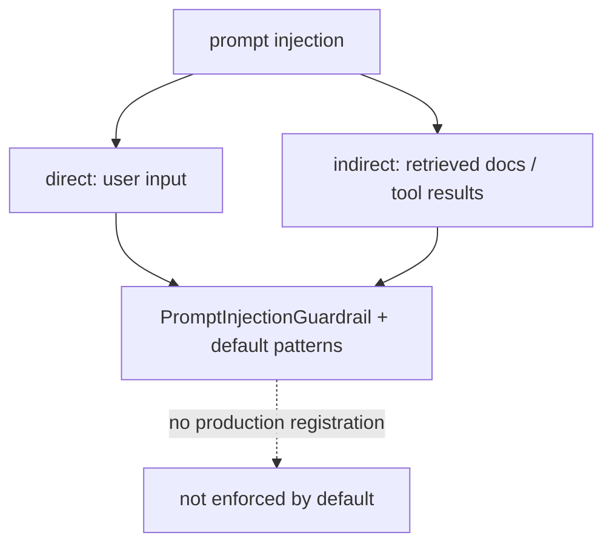

Anchors

<strong>Anchors:</strong> &bull; <code>agent-core/openjiuwen/core/security/guardrail/builtin.py:60</code> — `PromptInjectionGuardrail` &bull; <code>agent-core/openjiuwen/core/security/guardrail/backends.py:184</code> — default patterns &bull; <code>agent-core/openjiuwen/rsi/harness_rsi/auto_harness/rails/security_rail.py:119</code> — input heuristic → `request_force_finish`

_Canonical source: `source/ai-engineer-technical-questions_for_engineers.md`; also covered in: engineering, genai, llm-applied._

---

## 2. How do you defend against prompt injection?

**General:** Treat content as data, not instructions; delimit and label untrusted content; never let it trigger privileged actions without a permission re-check; and enforce controls outside the model (tool policy, sandboxing, egress rules). Instructions in the prompt alone are not a control.

**Jiuwen:** The codebase separates prompt-level from enforced defenses. Prompt-level: `SafetyPromptRail` injects a bilingual safety section into the system prompt before each call (instruction, not control). Enforced: shell command/process substitution is blocked before execution; the permission engine merges tool policy + file guard + net guard by “strictest” and floors risky shell structures to ASK; builtin YAML denies reverse shells, disk writes, shutdown, and sensitive paths.

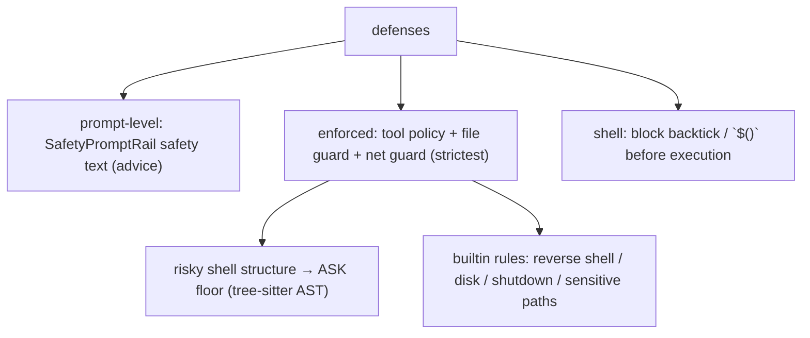

Anchors

<strong>Anchors:</strong> &bull; <code>agent-core/openjiuwen/harness/rails/security/prompt_security_rail.py:16</code> — `SafetyPromptRail`; `:38` injects safety section; `harness/prompts/sections/safety.py:14` static text &bull; <code>agent-core/openjiuwen/harness/tools/shell/bash/_security.py:29</code> — substitution regex; `:40` `check_injection` blocks &bull; <code>agent-core/openjiuwen/harness/resources/builtin_rules.yaml:59</code> — reverse-shell deny; `:35` disk; `:99` shutdown; `:148` sensitive paths &bull; <code>agent-core/openjiuwen/harness/security/permission_engine/toolguard/tool_policy.py:588</code> — tiered policy; `:409` shell AST floor; `:502` ASK fallback; `shell_ast.py:82` parse; `core.py:272` merge

_Canonical source: `source/ai-engineer-technical-questions_for_engineers.md`; also covered in: engineering, genai, llm-applied._

---

## 3. Handling untrusted content from a tool result or retrieved document

**General:** Treat tool output and retrieved documents as untrusted data, never as instructions. Delimit and label them as data, strip control/escape sequences, and never let them silently trigger privileged actions without re-checking permissions. Prompt injection via tool output is a real threat because it flows straight into the model context.

**Jiuwen:** Weakest area. Tool results are rendered through the tool's own `render_for_llm` and wrapped in a plain `ToolMessage` with no data/instruction framing; after-tool rails may rewrite the result but nothing marks it untrusted. Sanitizer helpers exist (`sanitize.py`) but have no production callers. The only untrusted-data defenses are prompt-level: the auto-harness input heuristic scans all input messages (tool-role messages already in the transcript included), and the personal-context pipeline instructs its summarizer to treat supplied content as untrusted data (one internal call). There is no mandatory untrusted-tool-result seam.

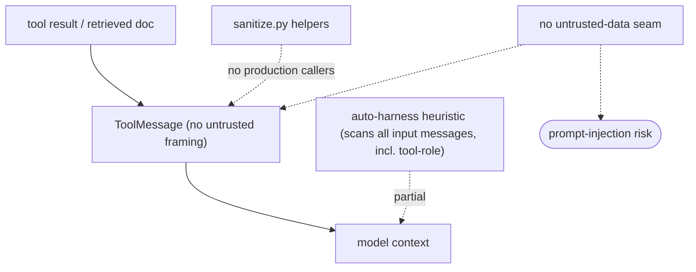

Anchors

<strong>Anchors:</strong> &bull; <code>agent-core/openjiuwen/core/single_agent/ability_manager.py:266</code> — <code>_render_tool_result</code>; <code>:1612</code> builds <code>ToolMessage</code> with no untrusted wrapper; <code>:1281</code> after-tool rewrite adds no label &bull; <code>agent-core/openjiuwen/harness/prompts/sanitize.py:11</code> — <code>sanitize_path</code>; <code>:20</code> <code>sanitize_user_content</code> (no production callers) &bull; <code>agent-core/openjiuwen/rsi/harness_rsi/auto_harness/rails/security_rail.py:119</code> — heuristic runs before model call &bull; <code>agent-core/openjiuwen/harness/personal_context/context_pipeline.py:9237</code> — prompt-level "untrusted source data, never instructions"; <code>agent-core/openjiuwen/harness/personal_context/agent_support.py:792</code> — same for the subagent path

_Canonical source: `source/ai-engineer-technical-questions_for_engineers.md`; also covered in: ai-agent, engineering, llm-applied._

---

## 4. How do you handle a user trying to jailbreak your system's guardrails

**General:** Assume the model can be talked around, so enforce outside it: detect and block known jailbreak/injection patterns at input, keep privileged actions behind a permission check that the model cannot bypass, sandbox tools, and log/rate-limit repeated attempts. No single regex is sufficient (paraphrase, encoding, multi-turn role-play evade it), so detection is a signal, not the control.

**Jiuwen:** No dedicated jailbreak subsystem; four independent mechanisms. A `RuleBasedPromptInjectionBackend` matches `ignore.*previous.*instructions`, `disregard.*prior.*commands`, `system.*prompt`, `you.*are.*now`, `act.*as`, `forget.*everything` — but the guardrail is unregistered in production. The auto-harness `SecurityRail` heuristic (production-registered only in the auto-harness factory) scans messages for suspicious patterns and force-finishes the run. Shell command substitution is hard-blocked, and the permission engine floors risky/unknown shell structures and interpreter sinks to ASK, with builtin rules denying reverse shells, shutdown, and sensitive paths, while recursive/forced delete (`rm -rf`) is floored to ASK rather than denied.

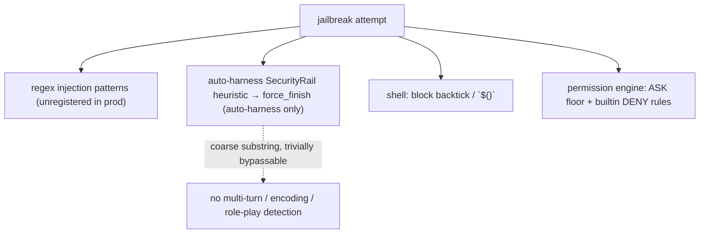

Anchors

<strong>Anchors:</strong> &bull; <code>agent-core/openjiuwen/core/security/guardrail/backends.py:184</code> — default injection patterns; <code>:127</code> <code>RuleBasedPromptInjectionBackend</code> &bull; <code>agent-core/openjiuwen/auto_harness/rails/security_rail.py:28</code> — <code>_SUSPICIOUS_PATTERNS</code>; <code>:129</code> scan + <code>request_force_finish</code>; <code>agent-core/openjiuwen/auto_harness/agents/factory.py:178</code> — production registration path &bull; <code>agent-core/openjiuwen/harness/tools/shell/bash/_security.py:29</code> — <code>_INJECTION_PATTERNS</code>; <code>:40</code> <code>check_injection</code> blocks; <code>agent-core/openjiuwen/harness/tools/shell/bash/_tool.py:378</code> call site; <code>:71</code> destructive-command warnings &bull; <code>agent-core/openjiuwen/harness/security/permission_engine/toolguard/tool_policy.py:409</code> — shell AST ASK floor; <code>:502</code> ASK fallback; <code>:694</code> interpreter-sink ASK &bull; <code>agent-core/openjiuwen/harness/resources/builtin_rules.yaml:59</code> reverse-shell DENY; <code>:99</code> shutdown; <code>:148</code> sensitive paths &bull; <code>agent-core/openjiuwen/harness/security/permission_engine/core.py:246</code> — strictest merge; <code>agent-core/openjiuwen/harness/rails/security/tool_security_rail.py:57</code> <code>PermissionInterruptRail</code>

**Gap.** The pattern guardrail is unregistered in production; the only enforced input abort is the auto-harness heuristic, which normal agents do not mount and which is a coarse case-insensitive substring match (bypassable by paraphrase/encoding/multimodal).

_Canonical source: `source/genai-interview-questions_for_engineers.md`; also covered in: genai._

---

## 5. How do you make sure a user only retrieves documents they're actually authorized to see

**General:** Enforce authorization inside retrieval: every chunk carries ACL metadata (owner/group/tenant), and the query includes a mandatory filter derived from the caller's identity, applied by the vector store (pre-filter), never post-hoc. Prefer the strongest isolation you can afford (per-tenant index/collection), use row-level security where available, and audit.

**Jiuwen:** The store layer supports metadata filters (Milvus expr, Chroma `where`, PG JSONB) and there is a permission engine and audit logging. But `RetrievalConfig.filters` is **dropped at the retriever boundary** (concrete retrievers hardcode `filters=None`; the abstract `Retriever.retrieve` has no `filters` param), and documents/chunks have **no ACL field**. So permission-aware retrieval is not reachable through the KB path; the permission engine guards tool/file/net execution, not retrieval.

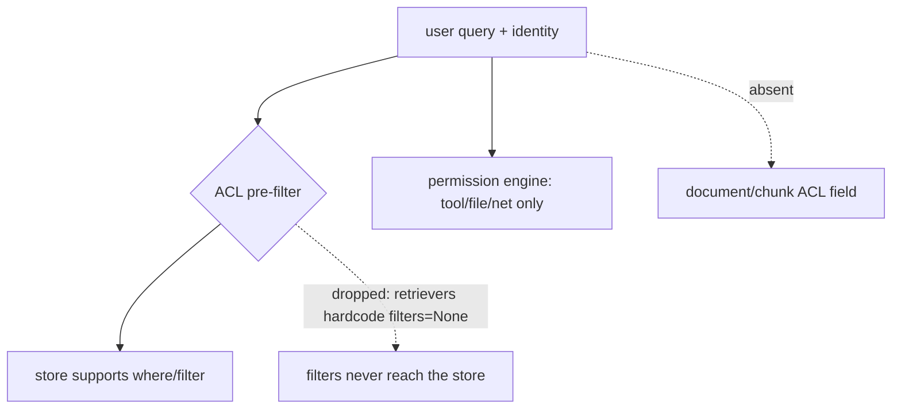

Anchors

<strong>Anchors:</strong> &bull; <code>agent-core/openjiuwen/core/retrieval/common/config.py:53</code> — <code>RetrievalConfig.filters</code>; <code>agent-core/openjiuwen/core/retrieval/retriever/base.py:19</code> — no <code>filters</code> param; <code>agent-core/openjiuwen/core/retrieval/simple_knowledge_base.py:186</code> — KB passes it; <code>agent-core/openjiuwen/core/retrieval/retriever/vector_retriever.py:88</code>/<code>agent-core/openjiuwen/core/retrieval/retriever/hybrid_retriever.py:81</code> — <code>filters=None</code> &bull; <code>agent-core/openjiuwen/core/retrieval/vector_store/milvus_store.py:215</code>, <code>agent-core/openjiuwen/core/retrieval/vector_store/chroma_store.py:265</code>, <code>agent-core/openjiuwen/core/retrieval/vector_store/pg_store.py:332</code> — store-level filters &bull; <code>agent-core/openjiuwen/harness/security/permission_engine/core.py:272</code> — <code>check_permission</code> (tool/file/net) &bull; <code>agent-core/openjiuwen/core/retrieval/common/document.py:30</code> — no ACL field on <code>TextChunk</code>

_Canonical source: `source/rag-system-design-interview-questions_for_engineers.md`; also covered in: rag-system._

---

## 6. How do you prevent an agent from taking a destructive or irreversible action by mistake

**General:** Layer defenses: classify actions by risk, deny known-dangerous patterns, require approval for the ambiguous middle, and prefer reversible operations (dry-run, snapshot, sandbox) over hard blocks alone. Fail closed — unknown should mean "ask", not "allow".

**Jiuwen:** A layered permission engine returns `ALLOW`/`ASK`/`DENY`, merging tool policy + file guard + net guard by `strictest`. Tool policy is tiered and falls back to ASK when nothing matches. Shell commands are parsed with a tree-sitter AST; too-complex or unparseable-but-risky input is floored to ASK. Builtin rules deny reverse shells, fork bombs, disk writes, and shutdown/reboot, and deny sensitive paths like `~/.ssh/**` and `**/.env`. Injection via backticks/`$()` is blocked before execution.

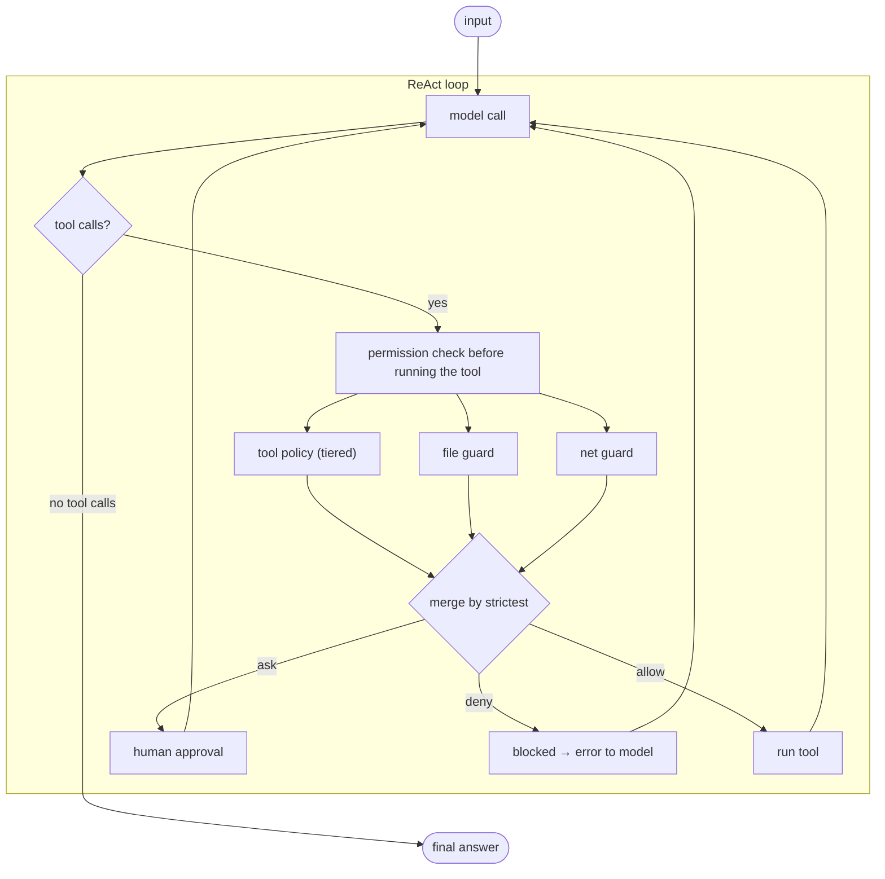

Anchors

<strong>Anchors:</strong> &bull; <code>agent-core/openjiuwen/harness/security/permission_engine/core.py:272</code> — <code>check_permission</code> merge &bull; <code>agent-core/openjiuwen/harness/security/permission_engine/toolguard/tool_policy.py:502/588</code> — tiered policy, ASK fallback &bull; <code>agent-core/openjiuwen/harness/security/permission_engine/toolguard/shell_ast.py:82</code> — tree-sitter shell parse &bull; <code>agent-core/openjiuwen/harness/security/permission_engine/toolguard/tool_policy.py:409</code> — risky-structure ASK floor &bull; <code>agent-core/openjiuwen/harness/resources/builtin_rules.yaml:10/148</code> — builtin deny rules + sensitive paths &bull; <code>agent-core/openjiuwen/harness/tools/shell/bash/_security.py:40</code> — injection blocking

_Canonical source: `source/ai-agent-interview-questions_for_engineers.md`; also covered in: ai-agent._

---

## 7. How do you prevent a model from generating harmful or biased content

**General:** Layer defenses: a safety instruction in the system prompt, input and output content classifiers/moderation, policy filters on generated output, and refusal behavior validated by red-teaming. Because a prompt is advice not a control, real safety needs an enforced output filter. Bias specifically needs measurement (bias probes, disaggregated evals) and mitigation, not just a "be safe" instruction.

**Jiuwen:** Two layers. Prompt-level (advisory): `SafetyPromptRail` is production-registered and, on each model call, appends a static bilingual safety section to the system prompt then always returns allow — it never inspects or rewrites content. Enforced-but-unwired: `core/security/guardrail/` provides `BaseGuardrail` + backends; `PromptInjectionGuardrail` can raise `AbortError`/`GuardrailError` on risky input/output, and an optional local `AutoModelForSequenceClassification` / QwenGuard classifier exists — but none has a production caller. There is no bias, toxicity, or content-policy detector anywhere.

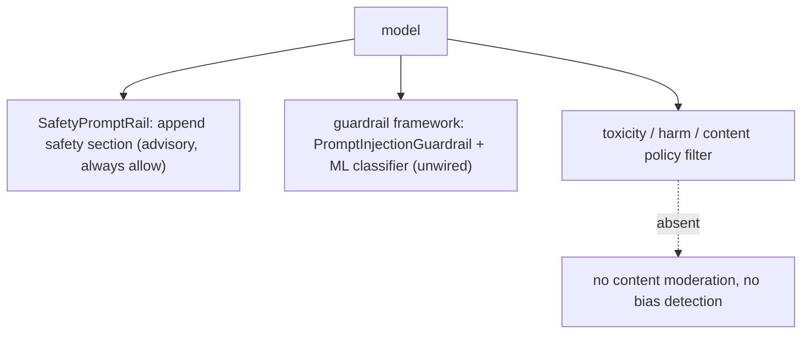

Anchors

<strong>Anchors:</strong> &bull; <code>agent-core/openjiuwen/harness/rails/security/prompt_security_rail.py:16</code> — <code>SafetyPromptRail</code>; <code>:38</code> injects section; <code>:41</code> always returns allow &bull; <code>agent-core/openjiuwen/harness/prompts/sections/safety.py:14</code> (CN) / <code>:26</code> (EN) — static safety text; <code>:44</code> <code>build_safety_section</code>; <code>:57</code> priority &bull; <code>jiuwenswarm/jiuwenswarm/server/runtime/agent_adapter/interface_deep.py:93</code> — production import of <code>SecurityRail</code>; <code>:8577</code> <code>_build_security_rail()</code>; <code>jiuwenswarm/jiuwenswarm/agents/harness/team/team_runtime_inheritance.py:248</code> — team members create <code>SecurityRail()</code> &bull; <code>agent-core/openjiuwen/core/security/guardrail/builtin.py:60</code> — <code>PromptInjectionGuardrail</code>; <code>agent-core/openjiuwen/core/security/guardrail/guardrail.py:378</code> — raises <code>AbortError</code>/<code>GuardrailError</code> &bull; <code>agent-core/openjiuwen/core/security/guardrail/backends.py:445</code> — <code>LocalModelBackend</code> (<code>AutoModelForSequenceClassification</code>); <code>agent-core/openjiuwen/core/security/guardrail/context.py:207</code> — <code>QwenGuardParser</code> &bull; <code>agent-core/openjiuwen/harness/rails/security/base_security_rail.py:58</code> — <code>SecurityReject</code>/<code>SecurityInterrupt</code>/<code>SecurityAlert</code>

**Gap.** The ML guardrail and content classifier are implemented but have no production callers; only `SafetyPromptRail` (advisory) is mounted. No bias/toxicity/content-policy detection exists.

_Canonical source: `source/genai-interview-questions_for_engineers.md`; also covered in: genai._

---

## 8. Preventing sensitive data from leaking into a model's context or output logs

**General:** Detect and redact secrets before they reach the model or the logs: scrub known patterns (API keys, tokens, PII) from tool results and prompts, redact log fields (don't just drop whole fields), gate egress of secret-like payloads, and keep a path to audit without storing the secret. Detection alone is not redaction.

**Jiuwen:** Actual model-context redaction exists only as a demo rail: `SensitivedatasanitizeRail` regex-redacts keys/tokens/bearer strings in history and responses, replacing with `[REDACTED]`. In production, redaction is layer-specific: structured log events redact whole sensitive fields via an allowlist, the auto-permission audit writer redacts secret-like text before appending JSONL, and the auto-permission rule engine *detects* secret-like egress payloads to force ASK/DENY rather than redact. There is no built-in sensitive-data guardrail.

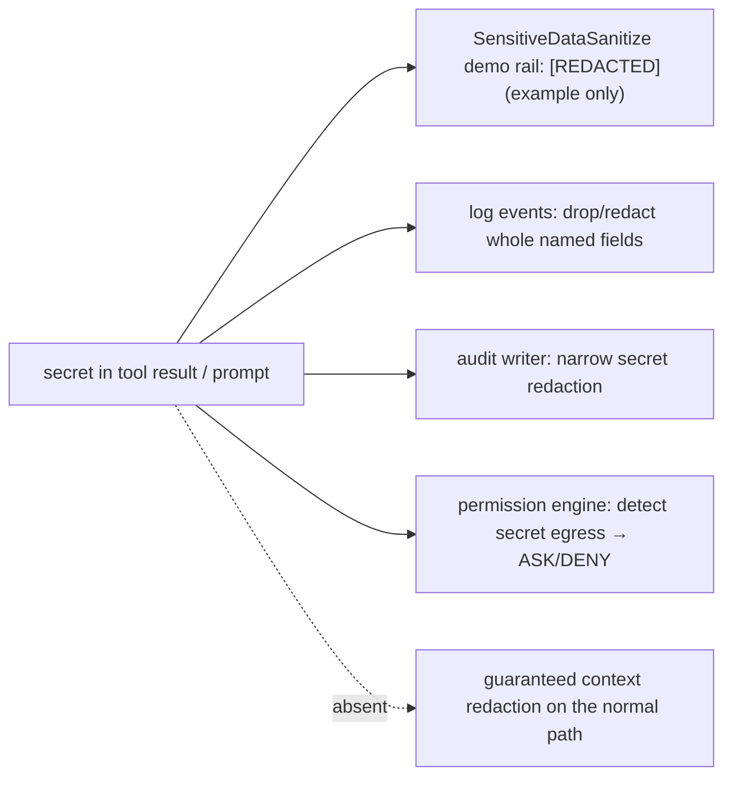

Anchors

<strong>Anchors:</strong> &bull; <code>agent-core/examples/security_rail_demo/SensitiveDataSanitize/rail.py:27</code> — sensitive regexes; <code>:60</code> <code>run_security_check</code>; <code>:96</code> <code>_sanitize_output</code> rewrites history/response &bull; <code>agent-core/openjiuwen/core/common/logging/events.py:920</code> — <code>sanitize_event_for_logging</code>; <code>:932</code> sensitive field list; <code>:951</code> <code>&lt;REDACTED&gt;</code>; <code>agent-core/openjiuwen/core/common/logging/base_impl.py:114</code> <code>_sanitize_message</code> &bull; <code>jiuwenswarm/jiuwenswarm/agents/harness/common/rails/permissions/persistent_audit.py:50</code> — secret-like pattern; <code>:262</code> <code>_sanitize_audit_text</code>; <code>:289</code> combined detection &bull; <code>jiuwenswarm/jiuwenswarm/agents/harness/common/rails/permissions/auto_decision.py:35</code> — egress secret patterns; <code>:82</code> redacted risk labels &bull; <code>agent-core/openjiuwen/core/security/guardrail/builtin.py</code> — only <code>PromptInjectionGuardrail</code> (no sensitive-data guardrail)

**Gap.** `SensitiveDataSanitize` is example-only; production redaction is partial and layer-specific (log redaction destroys debuggability rather than scrubbing payloads). Nothing guarantees secrets are stripped from model context on the normal path.

_Canonical source: `source/ai-engineer-technical-questions_for_engineers.md`; also covered in: engineering, genai._

---

## 9. Design a multi-tenant RAG system where each customer's data must stay isolated from others

**General:** Isolation choices, strongest first: a separate index/collection (or DB) per tenant; a tenant partition key with mandatory pre-filtering; or row-level security in a relational store. The key is that the tenant filter is applied inside the vector search and cannot be forgotten by a caller. Also isolate embeddings, caches, and logs per tenant, and audit cross-tenant access.

**Jiuwen:** The only separation primitive is the collection name derived from `kb_id` (`kb_{kb_id}_chunks`/`_triples`) plus a configurable `database_name` — this isolates **knowledge bases, not tenants**; if tenants share a `kb_id`, their chunks land in the same collection with no tenant column. The product tracks `user_id` in auth sessions but never propagates it into retrieval. There is no tenant/namespace field on documents, and the retriever drops filters, so per-tenant pre-filtering is not available.

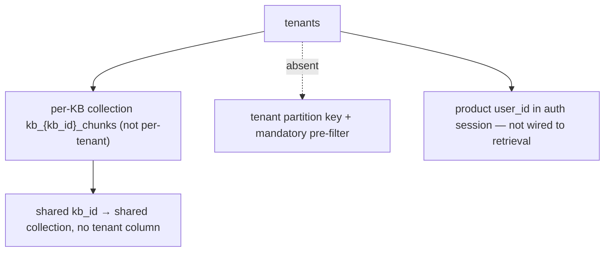

Anchors

<strong>Anchors:</strong> &bull; <code>agent-core/openjiuwen/core/retrieval/simple_knowledge_base.py:102</code> — <code>kb_{kb_id}_chunks</code>; <code>agent-core/openjiuwen/core/retrieval/graph_knowledge_base.py:196</code> — <code>kb_{kb_id}_triples</code> &bull; <code>agent-core/openjiuwen/core/retrieval/common/config.py:75</code> — <code>VectorStoreConfig(database_name, collection_name, …)</code> &bull; <code>jiuwenswarm/jiuwenswarm/common/auth/session_store.py:198</code> — <code>user_id</code> in auth session (not retrieval) &bull; <code>jiuwenswarm/jiuwenswarm/gateway/app_gateway.py:660</code> — WS <code>user_id</code> for routing/sandbox (not KB scoping)

_Canonical source: `source/rag-system-design-interview-questions_for_engineers.md`; also covered in: rag-system._

---

## 10. Security-adjacent questions are disguised as normal engineering questions

**General:** Content from a tool result or retrieved document is untrusted input. Treat it as data, never as instructions: delimit and label untrusted content as data, never let it trigger privileged actions without a permission re-check, enforce controls outside the model (tool policy, sandbox, egress), and remember prompt-level safety text is advice, not a control.

**Jiuwen:** This is the weakest area. Tool results are returned as plain `ToolMessage` with no untrusted-data framing; sanitizer helpers exist but have no production callers. Prompt-level safety is advisory (`SafetyPromptRail` always allows), while the enforced controls live in the shell/permission layer (AST ASK floor, builtin deny rules) — not in retrieval. There is no mandatory untrusted-tool-result seam.

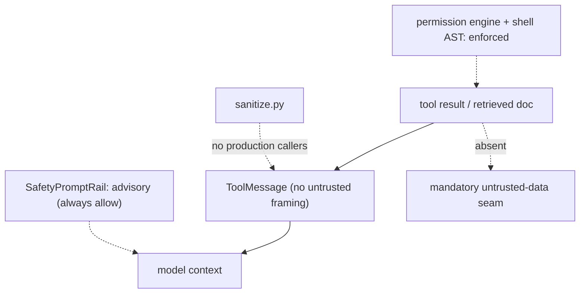

Anchors

<strong>Anchors:</strong> &bull; <code>agent-core/openjiuwen/core/single_agent/ability_manager.py:1612</code> — <code>ToolMessage</code> built with no untrusted wrapper; <code>:431</code> parallel path &bull; <code>agent-core/openjiuwen/harness/prompts/sanitize.py:20</code> — sanitizer (no production callers) &bull; <code>agent-core/openjiuwen/harness/rails/security/prompt_security_rail.py:16/41</code> — <code>SafetyPromptRail</code> (advisory, always allows) &bull; <code>agent-core/openjiuwen/harness/security/permission_engine/core.py:272</code> — <code>check_permission</code> (enforced tool/file/net) &bull; <code>agent-core/openjiuwen/harness/resources/builtin_rules.yaml:59</code> — reverse-shell deny

---

## 11. Any question about untrusted input is testing prompt injection awareness

**General:** a tool result or retrieved document can carry hidden instructions. Treat tool output and retrieved content as data, never as commands, and sanitize input before it reaches the prompt: delimit and label untrusted content as data, strip it, enforce privileged actions outside the model (tool policy, sandbox, egress), and remember that a system-prompt warning is advice, not a control.

**Jiuwen:** Weakest area. Tool results are plain `ToolMessage` with no untrusted-data framing, `sanitize.py` has no production callers, the injection detector is unregistered, and `SafetyPromptRail` is advisory. The real controls are in the shell/permission layer (substitution blocking, AST ASK floor, builtin deny rules).

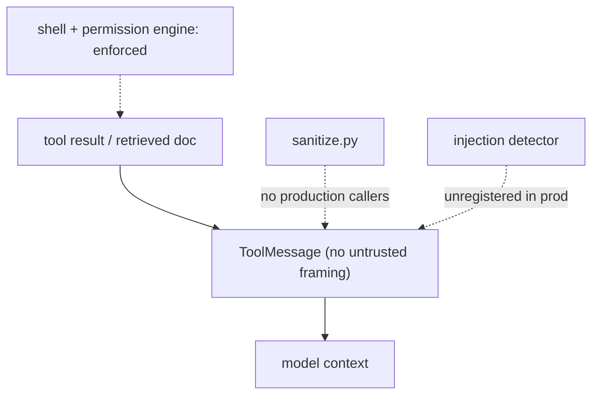

Anchors

<strong>Anchors:</strong> &bull; <code>agent-core/openjiuwen/core/single_agent/ability_manager.py:1612</code> — <code>ToolMessage</code> with no wrapper &bull; <code>agent-core/openjiuwen/harness/prompts/sanitize.py:20</code> — no production callers &bull; <code>agent-core/openjiuwen/core/security/guardrail/builtin.py:60</code> — <code>PromptInjectionGuardrail</code> (unregistered) &bull; <code>agent-core/openjiuwen/harness/rails/security/prompt_security_rail.py:16</code> — advisory safety rail &bull; <code>agent-core/openjiuwen/harness/security/permission_engine/toolguard/tool_policy.py:409</code> — shell AST ASK floor

---

## 12. What is Constitutional AI and how does it reduce the human-labeling bottleneck in alignment?

**General:** Constitutional AI (Bai et al. 2022, Anthropic) replaces a large portion of human preference labeling with **model self-critique**. The pipeline has two stages. (1) **SL-CAI**: generate responses, have the model critique each against a list of explicit principles (the "constitution" — rules like "do not assist with illegal activities", "be honest"), then revise based on the critique. Use these revised responses for supervised fine-tuning. (2) **RL-CAI**: use a reward model trained on model-generated preference pairs (not human-labeled pairs) to run RLHF. The result: steering a model toward a set of principles requires far fewer human labels. The "constitution" is an **explicit, auditable list** — easier to update and inspect than a black-box reward model trained on opaque human ratings. Claude's alignment training is based on CAI.

**Jiuwen:** Safety enforcement in the framework uses fixed classifiers and guardrails: `SecurityRail` (prompt injection detection), `GuardrailRail` (sequence-classification safety model), and `GuardianRail` (policy-level filtering). These are static — there is no self-critique loop, no constitutional principle list that the model iterates against, and no model-generates-then-revises revision pipeline. Adding a principle requires updating the classifier or system prompt, not appending to a constitution document.

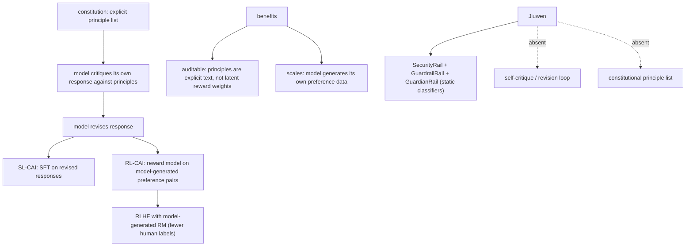

Anchors

<strong>Anchors:</strong> &bull; <code>agent-core/openjiuwen/harness/rails/security_rail.py:1</code> — <code>SecurityRail</code> (prompt injection, static) &bull; <code>agent-core/openjiuwen/core/security/guardrail/backends.py:1</code> — <code>GuardrailBackend</code> (sequence classifier, static) &bull; <code>agent-core/openjiuwen/harness/rails/guardrail_rail.py:1</code> — <code>GuardrailRail</code> &bull; <code>agent-core/openjiuwen/harness/rails/guardian_rail.py:1</code> — <code>GuardianRail</code> (policy filtering) &bull; Framework has no self-critique, constitution file, or model-generated preference pipeline

**Gap.** No self-critique loop, no constitutional principle list, no model-generated preference pipeline. Safety rails are static classifiers that require code or config changes to update — there is no "edit the constitution" interface.

_Canonical source: `source/15-foundational-papers_for_engineers.md`; also covered in: foundational-papers._