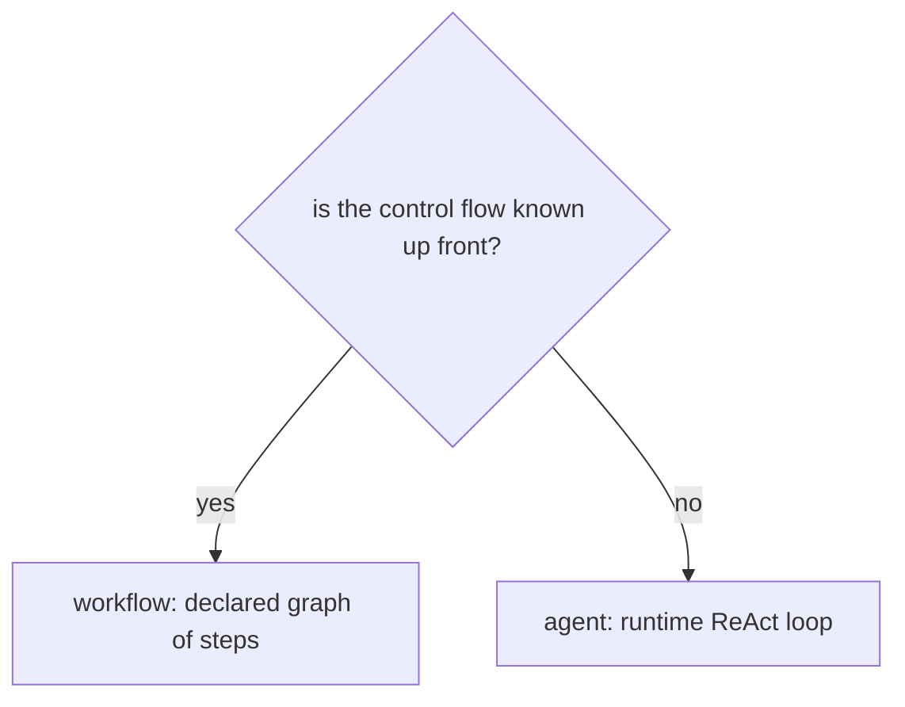
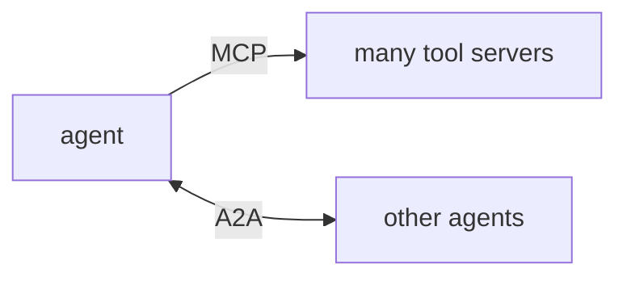
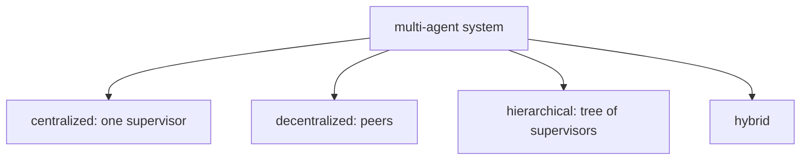
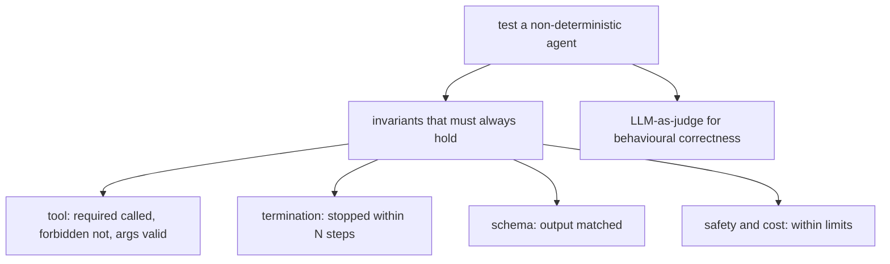

# Agent architectures and protocols

## 1. Workflows versus agents

**Definition:** A workflow is a deterministic, pre-defined sequence of steps — the control flow is fixed by the developer. An agent is a dynamic, model-driven loop — the model decides which tools to call and when to stop. Workflows are predictable and auditable; agents are flexible but non-deterministic. The choice depends on whether the task structure is known in advance.

**Jiuwen:** The graph path (Pregel workflow engine) handles known control flow with static and conditional routers, barriers, and OR-groups. The harness path (ReAct agent loop + rails) handles dynamic tool use. The framework supports both, and the design guidance is explicit: use the graph path for known control flow, the team path for flexible collaboration.

---

## 2. MCP versus A2A protocol

**Definition:** Two complementary protocols for extending AI systems. **MCP (Model Context Protocol):** One LLM connects to many tool providers. Centralized control — the agent decides which MCP server to call. Analogous to a single developer with a library of APIs. **A2A (Agent-to-Agent Protocol):** Agents coordinate with other agents. Decentralized execution — agents delegate to other agents asynchronously, potentially across deployments. Analogous to a team of specialists.

**Jiuwen:** MCP: `McpServerConfig` (in the MCP tool module) configures MCP servers; the client discovers tools via `tools/list` and invokes via `tools/call`. A2A-style delegation: `SubagentRail` delegates tasks to sub-agents using `SubagentRequest`/`SubagentResponse` schemas — this is internal delegation, not the A2A wire protocol. Cross-deployment agent-to-agent communication is not implemented.

---

## 3. Four multi-agent system architectures

**Definition:** Multi-agent systems fall into four architectural types, and every one of them needs the same five components.

**Jiuwen:** Architecture is hierarchical via `SubagentRail` and `TaskPlanningRail`. No peer-to-peer pattern is implemented. Five components: agents (`SubagentSpec` configs), communication (`SubagentRequest`/`SubagentResponse`), coordination (`TaskPlanningRail`), shared memory (`LongTermMemory` + `EphemeralMemory`), environment (tools via `ToolCard` and MCP servers).

---

## 4. Testing non-deterministic agents (invariant-based testing)

**Definition:** Exact output strings cannot be asserted for agents, so tests target invariants: properties that must always hold regardless of the specific output.

**Jiuwen:** `ModelClientABC` (in the model-clients package) is the mockable boundary. Rail contract invariants: `CircuitBreakerRail` for termination, the structured-output tool for schema, `GuardrailRail` for safety, `usage_cost.py` for budget. Behavioural correctness: `LLMAsJudge`. The evaluator pipeline is offline and is not integrated with pytest.

---
