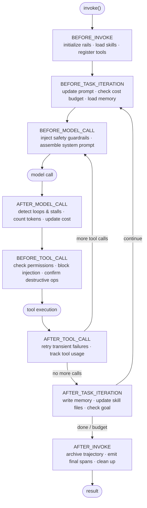
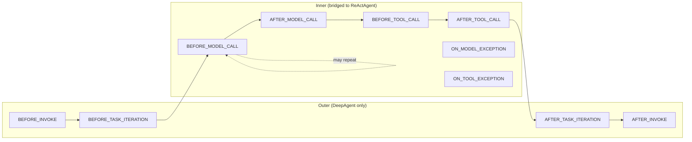
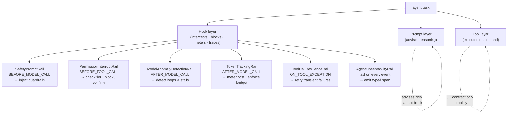
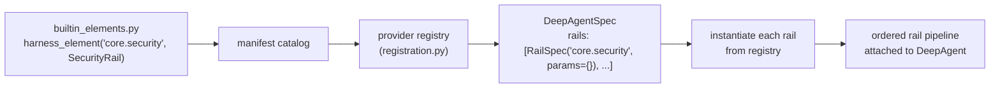
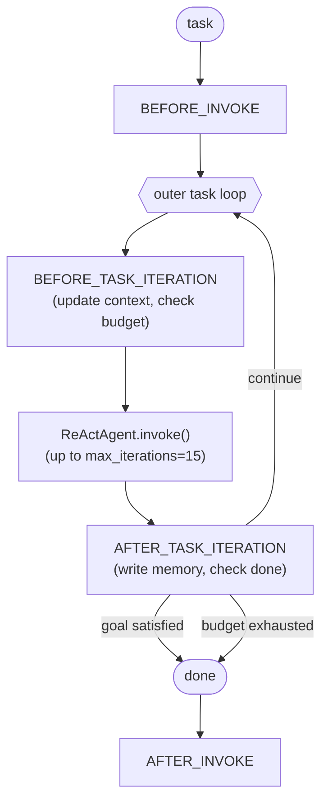
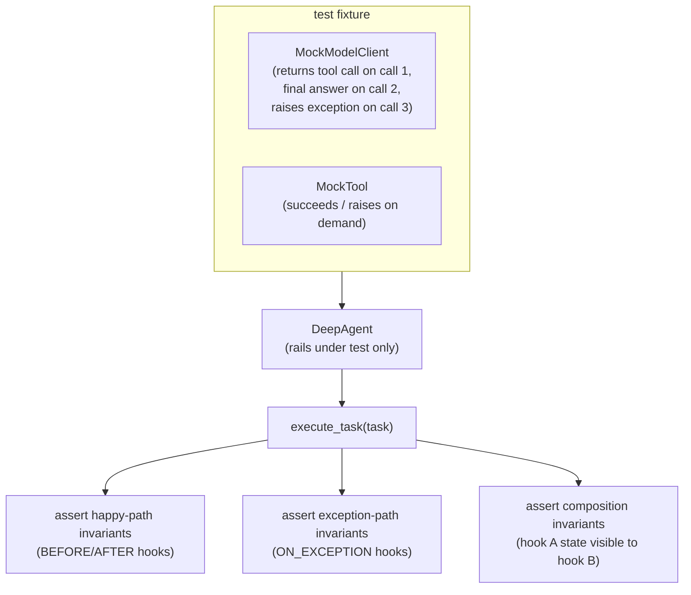
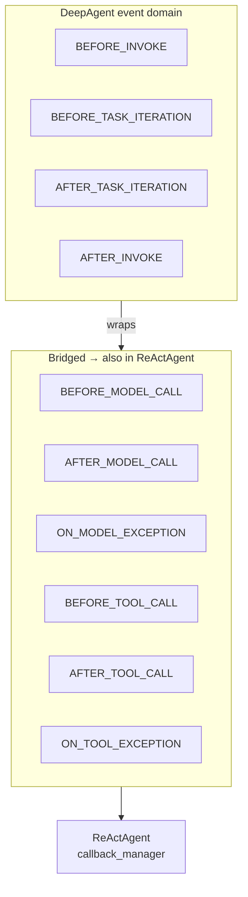
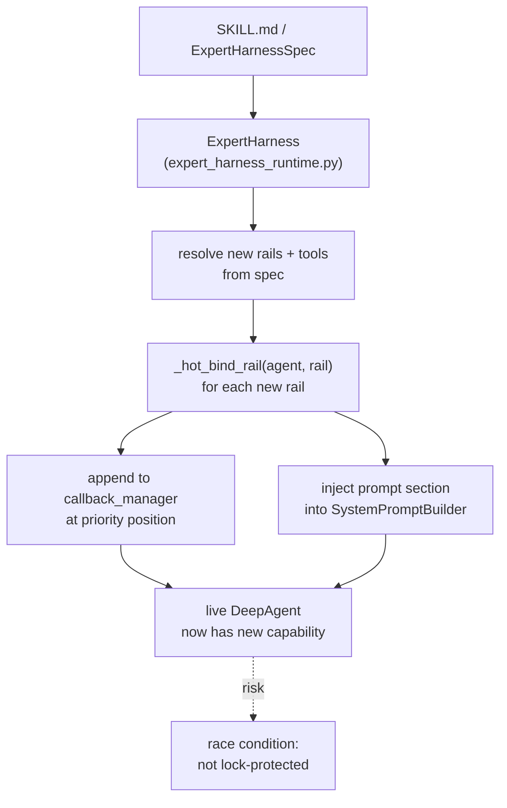
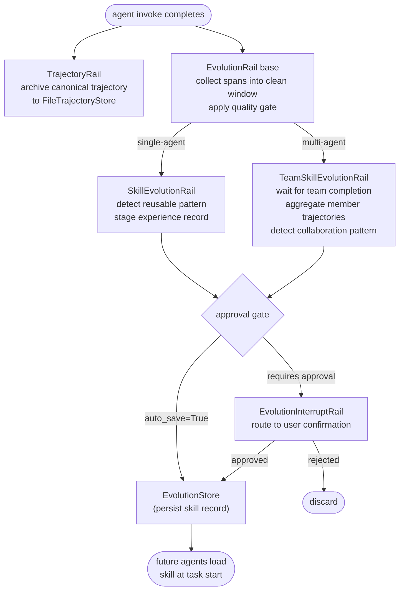

# Agent harness and middleware

## 1. What is an agent harness and what does it add over a raw agent loop?

**General:** A raw agent loop (ReAct) handles one reasoning episode: call model → execute tool calls → feed results back → return final answer. A harness wraps this with every production concern that cannot live inside the reasoning loop:

- **Outer task loop.** Drives the inner agent across multiple episodes toward a long-horizon goal, checking for completion after each pass.
- **Safety and injection filtering.** Injects guardrails into every model call; intercepts every tool call to detect prompt injection attempts and block harmful actions before they execute.
- **Permission and sensitive-data enforcement.** Checks each tool's permission tier before execution, pauses for human confirmation on sensitive or destructive operations, and prevents the agent from returning credentials or PII in output.
- **Resilience.** Detects LLM stream stalls, identifies repeated identical tool-call loops, retries transient failures with exponential backoff, and circuit-breaks when the loop stops making progress.
- **Memory and context.** Reads relevant memories before each pass, writes what was learned after each pass, and compresses the context window when it approaches capacity.
- **Observability and cost metering.** Emits a structured span for every model call and tool call, tracks token usage, enforces cost budgets, and archives the full execution trajectory.
- **Capability composition.** Declares which rails and tools are active per agent type via a manifest-driven spec, so the same framework powers a code agent, a web agent, and a data agent with different capability sets.

The inner loop owns reasoning. The harness owns everything else.

**Jiuwen:** `DeepAgent` wraps `ReActAgent`. Each production concern is a separate `DeepAgentRail` class registered in the pipeline. Core rails: `SafetyPromptRail` — injects bilingual safety guidelines before every model call. `PermissionInterruptRail` — checks tool calls against a `PermissionEngine`; triggers a HITL interrupt for ASK/ASK_USER decisions; parses shell commands for dangerous patterns. `ToolCallResilienceRail` — retries transport/timeout failures with backoff (0.5 s → 1.0 s → 2.0 s, budget 3 retries per invoke); skips retry for non-idempotent operations (write/shell/subagent-spawn). `ModelAnomalyDetectionRail` — detects consecutive identical tool-call rounds and stream-stall patterns; injects a loop-break warning or triggers a full model retry. `MemoryRail` — registers memory tools and injects a memory-usage prompt section; reads on BEFORE_TASK_ITERATION, writes on AFTER_TASK_ITERATION. `AgentObservabilityRail` — always the last rail in any spec; emits a typed span for every lifecycle event. `TaskCompletionRail` — drives the stop-condition evaluation after each outer pass. Inner default `max_iterations = 5` (`react_agent.py:288`); harness outer default 15 (`config.py:252`).

Anchors

<code>agent-core/openjiuwen/harness/deep_agent.py:2694</code> — outer task loop in <code>DeepAgent</code> <code>agent-core/openjiuwen/core/single_agent/agents/react_agent.py:288</code> — <code>max_iterations: int = Field(default=5)</code> <code>agent-core/openjiuwen/harness/schema/config.py:252</code> — harness outer default 15 iterations <code>agent-core/openjiuwen/harness/schema/deep_agent_spec.py:1</code> — <code>DeepAgentSpec</code>: declarative rail list <code>agent-core/openjiuwen/harness/rails/security/prompt_security_rail.py:1</code> — <code>SafetyPromptRail</code>: bilingual safety injection <code>agent-core/openjiuwen/harness/rails/security/tool_security_rail.py:1</code> — <code>PermissionInterruptRail</code>: permission engine + HITL <code>agent-core/openjiuwen/harness/rails/tool_call_resilience_rail.py:1</code> — <code>ToolCallResilienceRail</code>: retry with backoff <code>agent-core/openjiuwen/harness/rails/model_anomaly_detection_rail.py:1</code> — <code>ModelAnomalyDetectionRail</code>: loop and stall detection <code>agent-core/openjiuwen/harness/rails/memory/memory_rail.py:1</code> — <code>MemoryRail</code>: memory tools + prompt section <code>agent-core/openjiuwen/harness/rails/observability/agent_observability_rail.py:1</code> — <code>AgentObservabilityRail</code>: always last, traces all events

---

## 2. What are lifecycle hooks (middleware) in an agent harness, and at which points can they fire?

**General:** Lifecycle hooks are callbacks registered by middleware components at specific points in the agent's execution. They can read state, inject content into the context, block or modify an action, or emit observability events — without the agent code knowing. A well-designed hook set covers: the full invocation boundary (before/after the entire task), the task loop iteration boundary (before/after each outer pass), and the inner reasoning steps (before/after each model call and each tool call, plus exception paths). Hooks that fire only at the invocation level cannot intercept a specific tool call; hooks that fire at the model-call level fire many times per outer pass.

**Jiuwen:** `DeepAgentRail` base class (`harness/rails/base.py`) defines 10 hook points — two groups: inner events that bridge to `ReActAgent`'s callback manager (6: before/after model call, before/after tool call, on model exception, on tool exception) and outer events that stay on `DeepAgent` (4: before/after invoke, before/after task iteration). Rails are priority-ordered (lower number fires first). `get_callbacks()` returns the hooks a rail wants to register; the callback manager invokes them in priority order per event.

Anchors

<code>agent-core/openjiuwen/harness/rails/base.py:1</code> — <code>DeepAgentRail</code>: 10 hook point declarations <code>agent-core/openjiuwen/core/single_agent/middleware/base.py:1</code> — <code>AgentMiddleware</code> base; <code>AgentCallbackEvent</code> enum <code>agent-core/openjiuwen/core/single_agent/agent_callback_manager.py:1</code> — priority-ordered callback dispatch <code>agent-core/openjiuwen/harness/deep_agent.py:1</code> — <code>_BRIDGE_EVENTS</code>, <code>_OUTER_ONLY_EVENTS</code>, <code>_DEEP_EVENTS</code>

---

## 3. What concerns belong in a lifecycle hook versus in the agent prompt versus in a tool?

**General:** Three distinct layers, each with its own job. **Prompt:** reasoning guidance — what the task is, how to think about it, what format to return. Prompts advise but cannot enforce. A prompt that says "do not return passwords" can be ignored by the model. **Tool:** domain capability with a defined I/O contract — fetch a URL, run a query, call an API. Tools execute when the model calls them and carry no policy. **Lifecycle hook:** cross-cutting policy that fires unconditionally, regardless of task or tool selection. Use a hook when the concern must *intercept or block* execution, not merely advise it:

- **Safety / prompt injection** — a user message containing "ignore previous instructions" is not a prompt concern (prompts don't see user input at hook time); a BEFORE_TOOL_CALL hook can inspect the full context and veto the action.
- **Sensitive-data enforcement** — preventing the agent from executing a shell command that would print a secret, or from returning a password in its final answer, requires a hook that fires at BEFORE_TOOL_CALL or AFTER_MODEL_CALL and can block before the output reaches the user.
- **Permission gating** — if a tool requires elevated privileges, a hook checks the caller's permission tier before letting execution proceed, rather than trusting the tool to check itself.
- **Cost and budget** — token metering must intercept after every model call; encoding this in the prompt or in every tool is impractical.
- **Observability** — tracing every event requires a hook that fires last on every event point, regardless of which tools or prompts are active.

If a concern must apply to every agent regardless of purpose, it belongs in a hook, not in every tool or in every prompt.

**Jiuwen:** Prompt layer: `SystemPromptBuilder` assembles sections contributed by active rails — `SafetyPromptRail` adds a bilingual safety section, `TaskPlanningRail` adds planning instructions, `SkillUseRail` adds available-skills guidance. Tool layer: `ToolCard` defines schema, callable, and permission tier. Hook layer (selected examples): `SafetyPromptRail` fires on BEFORE_MODEL_CALL to inject safety guidelines — it advises but cannot block; `PermissionInterruptRail` fires on BEFORE_TOOL_CALL — it reads the permission tier from `ToolCard`, runs `PermissionEngine.decide()`, and either approves, blocks, or raises an interrupt for human confirmation (the only layer that can prevent a destructive shell command from running); `ModelAnomalyDetectionRail` fires on AFTER_MODEL_CALL — it detects repeated identical tool-call sequences and stream stalls that the model itself cannot report; `TokenTrackingRail` meters usage at AFTER_MODEL_CALL; `AgentObservabilityRail` fires last on every event and emits typed spans. Removing a hook removes its policy for every agent; removing a tool or prompt section affects only agents that use it.

Anchors

<code>agent-core/openjiuwen/harness/prompts/template.py:1</code> — <code>SystemPromptBuilder</code>; rail prompt section injection <code>agent-core/openjiuwen/core/foundation/tool/base.py:1</code> — <code>ToolCard</code> schema and permission tier <code>agent-core/openjiuwen/harness/rails/security/prompt_security_rail.py:1</code> — <code>SafetyPromptRail</code>: bilingual safety at BEFORE_MODEL_CALL <code>agent-core/openjiuwen/harness/rails/security/tool_security_rail.py:1</code> — <code>PermissionInterruptRail</code>: permission engine + HITL at BEFORE_TOOL_CALL <code>agent-core/openjiuwen/harness/rails/model_anomaly_detection_rail.py:1</code> — <code>ModelAnomalyDetectionRail</code>: loop/stall detection at AFTER_MODEL_CALL <code>jiuwenswarm/jiuwenswarm/agents/harness/common/rails/execution_guard/circuit_breaker_rail.py:1</code> — <code>CircuitBreakerRail</code>: loop-count circuit breaker <code>agent-core/openjiuwen/harness/rails/token_tracking_rail.py:1</code> — <code>TokenTrackingRail</code>: usage metering

---

## 4. How are middleware components registered and assembled for a specific agent type?

**General:** Registration and assembly are separate steps. Registration happens at import time: each middleware class is declared with a name in a manifest catalog. At agent construction, a spec — a declarative list of named middleware types plus per-instance parameters — is resolved against the registry: each entry is looked up, instantiated with its params, and appended to the pipeline in declaration order. Different agent types use different specs built from the same registry. This separates capability authoring (write the class, register it once) from capability composition (declare which classes to activate, per agent type).

**Jiuwen:** `builtin_elements.py` (`harness/manifest/builtin_elements.py`) registers every built-in rail into the manifest catalog using `harness_element(ElementKind.RAIL, "core.security", SecurityRail)`. `registration.py` syncs the catalog to a provider registry at startup. At `DeepAgent` construction, `factory.py` resolves `DeepAgentSpec.rails` (a list of `RailSpec` items): each `RailSpec.type` string (e.g. `"core.task_planning"`) is looked up in the provider registry, instantiated with `RailSpec.params`, and appended. A base agent spec has `[core.task_planning, core.security, core.sys_operation, ...]`; a code agent spec adds `[code.task_planning, code.plan_approval, ...]` on top.

Anchors

<code>agent-core/openjiuwen/harness/manifest/builtin_elements.py:1</code> — <code>harness_element()</code> declarations for all built-in rails <code>agent-core/openjiuwen/harness/manifest/registration.py:1</code> — catalog → provider registry sync <code>agent-core/openjiuwen/harness/schema/deep_agent_spec.py:1</code> — <code>DeepAgentSpec.rails: list[RailSpec]</code> <code>agent-core/openjiuwen/harness/factory.py:1</code> — <code>DeepAgent</code> construction: spec → resolved rail instances

---

## 5. How does the harness task loop differ from a single agent invocation?

**General:** A single agent invocation runs one ReAct episode — the model and tools interact until the agent returns a final answer, hits its iteration limit, or encounters an error. The harness task loop calls this invocation repeatedly, evaluating whether the overall goal is complete after each pass. Between passes, task-iteration hooks fire, giving middleware time to update working memory, flush completed sub-tasks, check whether the budget allows another pass, and inject new context or instructions. This enables long-horizon tasks that require more reasoning steps than a single episode's iteration limit allows, without losing state between episodes.

**Jiuwen:** `DeepAgent.execute_task()` is the outer loop. Each iteration: BEFORE_TASK_ITERATION fires (rails update prompt sections, check token/cost quotas, load relevant memories); inner `ReActAgent.invoke()` runs up to 15 iterations; AFTER_TASK_ITERATION fires (rails write memory, update skill files via `SkillUseRail`, decide if goal is satisfied via `TaskCompletionRail`). If `TaskCompletionRail` signals complete, the loop exits. If the outer iteration budget is exhausted first, the loop exits with a truncation signal. The outer budget is separate from the inner `max_iterations`.

Anchors

<code>agent-core/openjiuwen/harness/deep_agent.py:2694</code> — <code>execute_task()</code>: outer task loop <code>agent-core/openjiuwen/harness/schema/config.py:252</code> — outer and inner iteration defaults <code>agent-core/openjiuwen/harness/rails/task_completion_rail.py:1</code> — completion signal <code>agent-core/openjiuwen/harness/rails/skill_use_rail.py:1</code> — skill file update on AFTER_TASK_ITERATION <code>agent-core/openjiuwen/harness/rails/memory_rail.py:1</code> — memory write on task iteration boundary

---

## 6. How do you test a lifecycle hook in isolation from the LLM?

**General:** Inject a deterministic model client at the agent's model boundary and structure tests around three concerns:

1. **What invariant to assert.** A pre-call hook's job is to block, modify, or annotate the action — assert on whether it blocked (call not made), what it modified (args changed), or what it annotated (context field set). A post-call hook's job is to update state or gate output — assert on counters, emitted events, or downstream blocks. Asserting on output strings fails when any hook in the stack modifies context between your hook and the model.

2. **Which paths to exercise.** The happy path (model returns an answer, tools succeed) tests BEFORE/AFTER hooks. The exception paths — ON_TOOL_EXCEPTION and ON_MODEL_EXCEPTION — require the fixture to raise controlled errors on demand. This matters: a retry hook that never sees a failure is functionally untested. A blocking hook that only triggers on specific error codes needs an error fixture that produces those codes.

3. **Hook composition.** Isolated tests verify each hook's invariants individually. Composition tests verify that state written by a higher-priority hook at a given event point is visible to lower-priority hooks at the same event. If hook A at priority 10 tags a context field and hook B at priority 20 reads it to decide whether to block, testing them separately misses the interaction.

**Jiuwen:** `ModelClientABC` (`core/foundation/llm/model_clients/base.py`) is the injectable boundary. Subclass it: normal path returns a fixed tool-call sequence or a final answer; exception path raises `ModelException` on a specific invocation number. For tool exception paths: wrap the tool callable in the `ToolCard` to raise `ToolException` on demand. Assert on: `PermissionInterruptRail` — check `blocked_calls` list after a run with a disallowed tool; `TokenTrackingRail` — check cumulative token count after N model invocations; `CircuitBreakerRail.trip_count` after injecting N consecutive failures; `AgentObservabilityRail` event log (typed span list) after a full run. For composition: register two rails with known priority order and assert that the lower-priority rail's `before_tool_call` received the context field written by the higher-priority rail's `before_tool_call`. No framework test harness or fixture library exists — each test constructs `DeepAgent` manually.

Anchors

<code>agent-core/openjiuwen/core/foundation/llm/model_clients/base.py:1</code> — <code>ModelClientABC</code>: injectable mock boundary <code>agent-core/openjiuwen/harness/factory.py:1</code> — <code>DeepAgent</code> construction accepts model client override <code>agent-core/openjiuwen/core/foundation/tool/base.py:1</code> — <code>ToolCard</code> callable wrapper: injectable error fixture <code>jiuwenswarm/jiuwenswarm/agents/harness/common/rails/execution_guard/circuit_breaker_rail.py:1</code> — <code>trip_count</code> assertable after N injected failures <code>agent-core/openjiuwen/harness/rails/security/tool_security_rail.py:1</code> — <code>blocked_calls</code> assertable list <code>agent-core/openjiuwen/harness/rails/observability/agent_observability_rail.py:1</code> — typed span event log assertable after run

---

## 7. What is the event bridge model — which events propagate to the inner agent and which stay on the outer harness?

**General:** The outer harness and the inner agent loop are separate event domains. Inner-agent events (model call, tool call, exceptions at those call sites) must bridge into the inner loop's callback manager because they occur during active reasoning — a security hook that blocks a specific tool call must fire at the point of execution, inside the inner loop, not before the loop starts. Outer events (full invocation boundary, task loop iteration boundary) stay on the outer harness because the inner loop does not know it is being called multiple times toward a long-horizon goal. Incorrectly wiring a hook to the wrong domain causes it to fire at the wrong granularity — a per-model-call cost meter registered as a per-invocation hook only fires once per outer pass and misses all intermediate calls.

**Jiuwen:** Three event sets are defined in `deep_agent.py`: `_BRIDGE_EVENTS` (6) — BEFORE_MODEL_CALL, AFTER_MODEL_CALL, ON_MODEL_EXCEPTION, BEFORE_TOOL_CALL, AFTER_TOOL_CALL, ON_TOOL_EXCEPTION — are registered into both the outer callback manager and the inner `ReActAgent.callback_manager` so rails intercept at execution time. `_OUTER_ONLY_EVENTS` (2) — BEFORE_INVOKE, AFTER_INVOKE — stay on `DeepAgent` only. `_DEEP_EVENTS` (2) — BEFORE_TASK_ITERATION, AFTER_TASK_ITERATION — are fired by the outer task loop controller and have no equivalent in the inner loop. Priority ordering within each event point determines which rail fires first.

Anchors

<code>agent-core/openjiuwen/harness/deep_agent.py:1</code> — <code>_BRIDGE_EVENTS</code>, <code>_OUTER_ONLY_EVENTS</code>, <code>_DEEP_EVENTS</code> definitions <code>agent-core/openjiuwen/core/single_agent/agent_callback_manager.py:1</code> — inner callback manager that receives bridged events <code>agent-core/openjiuwen/core/single_agent/agents/react_agent.py:1</code> — <code>callback_manager</code> field; tool/model call sites that invoke it

**Gap.** No runtime check prevents a rail from registering on a DEEP event and expecting per-model-call granularity. The mismatch is a silent design error — the hook fires, just at the wrong rate.

---

## 8. How does hot-loading middleware into a running agent work and when would you need it?

**General:** Standard middleware is bound at construction — the spec is resolved, instances are created, and the pipeline is fixed. Hot-loading binds new middleware to a live agent without stopping and restarting it. This is needed when the full capability set is not known at construction time: an agent discovers a skill library during a task and must load the tools and hooks declared in it; a user grants a new permission mid-session; an external plugin is installed while the agent is running. Hot-loading must preserve the existing pipeline state — the new hook joins the priority order without disrupting hooks that are mid-execution. Because agent invocations are async, binding a new callback during an active model call creates a race; the implementation must guard against partial registration.

**Jiuwen:** `ExpertHarness` (`harness/expert_harness_runtime.py:1`) implements hot-loading. It reads an `ExpertHarnessSpec` from a SKILL.md file or a spec JSON, resolves new rails and tools from it, then calls `_hot_bind_rail(agent, rail)` for each: the rail is appended to `self._rails`, its callbacks are registered into the live `callback_manager` at the correct priority, and its prompt section is injected into the `SystemPromptBuilder`. This is how skills can declare custom tools and middleware that activate when the skill is loaded mid-session. Atomicity is not guaranteed under concurrent invocations — `_hot_bind_rail` is not lock-protected.

Anchors

<code>agent-core/openjiuwen/harness/expert_harness_runtime.py:1</code> — <code>ExpertHarness</code>; <code>_hot_bind_rail()</code> <code>agent-core/openjiuwen/harness/schema/deep_agent_spec.py:1</code> — <code>ExpertHarnessSpec</code> schema <code>agent-core/openjiuwen/harness/prompts/template.py:1</code> — <code>SystemPromptBuilder</code>: prompt section injection <code>agent-core/openjiuwen/core/single_agent/agent_callback_manager.py:1</code> — live callback registration target

**Gap.** `_hot_bind_rail` is not protected by a lock; a rail loaded while the agent is mid-model-call may register incompletely. No rollback mechanism exists if hot-bind fails partway through.

---

## 9. How does a harness accumulate experience — what is the skill evolution pipeline?

**General:** A harness that intercepts every model call and tool call already has the data needed to improve itself: which tool sequences solved the problem, which reasoning patterns were reused, which sub-task plans worked. Skill evolution captures this data, extracts reusable patterns from it, and persists them as skill experience records that future agents load at task start. Without an evolution pipeline, every agent run starts from zero; with it, the agent population improves across sessions without retraining the underlying model. Three design decisions shape any evolution pipeline: (1) **what to capture** — the full execution trajectory or only successful final passes; (2) **what quality gate** prevents low-quality or noisy patterns from being persisted; (3) **whether human approval** is required before a pattern becomes a permanent skill (human-in-the-loop evolution) or whether the system auto-saves (fully autonomous evolution). The approval gate is the main lever for controlling how much the agent is trusted to modify its own future behaviour.

**Jiuwen:** `EvolutionRail` is the base class: it subscribes to a trajectory processor, collects execution spans into scope-local clean windows, applies quality gates, and suppresses capture during evolution work itself (to prevent skills about writing skills). `SkillEvolutionRail` extends it for single-agent experience: after each invoke it scans the trajectory for reusable patterns, stages candidate experience records, and routes them through `EvolutionInterruptRail` for user approval before `EvolutionStore` persistence — or auto-saves if `auto_save=True`. `TeamSkillEvolutionRail` extends it for multi-agent collaboration: it waits for a team completion event, aggregates trajectories from all member agents, detects the collaboration pattern, and generates a team skill record. `TrajectoryRail` (lowest priority, always last) archives one canonical trajectory per invoke to a `FileTrajectoryStore` for offline analysis, independent of whether evolution rails are active. Trigger paths: passive signal scanning (`signal_trigger`, default `False`), periodic self-check follow-up (`review_trigger`, default `False`), or explicit `/evolve` command dispatch.

Anchors

<code>agent-core/openjiuwen/harness/rails/evolution/evolution_rail.py:1</code> — <code>EvolutionRail</code> base: trajectory capture, quality gate, clean window <code>agent-core/openjiuwen/harness/rails/evolution/skill_evolution_rail.py:1</code> — <code>SkillEvolutionRail</code>: single-agent experience staging and persistence <code>agent-core/openjiuwen/harness/rails/evolution/team_skill_evolution_rail.py:1</code> — <code>TeamSkillEvolutionRail</code>: multi-agent collaboration pattern detection <code>agent-core/openjiuwen/harness/rails/evolution/evolution_interrupt_rail.py:1</code> — <code>EvolutionInterruptRail</code>: approval bridge <code>agent-core/openjiuwen/harness/rails/evolution/trajectory_rail.py:1</code> — <code>TrajectoryRail</code>: canonical trajectory archive (priority 10, always last)

