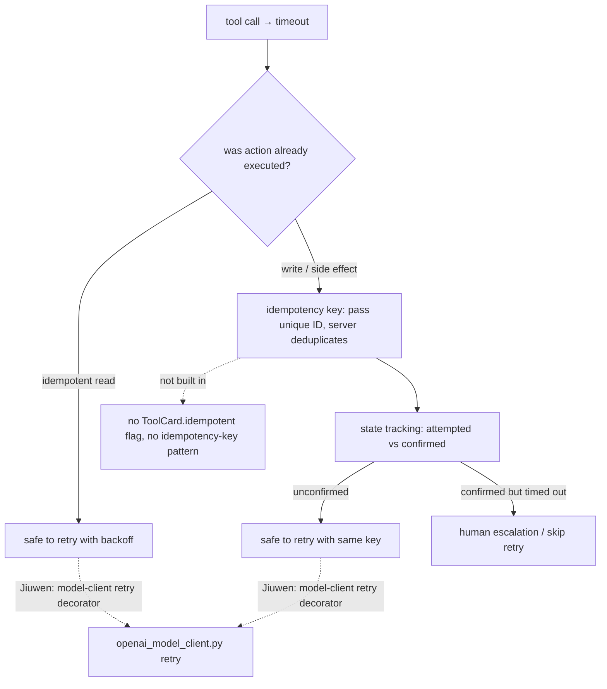
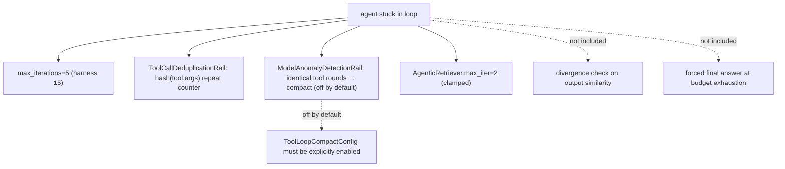
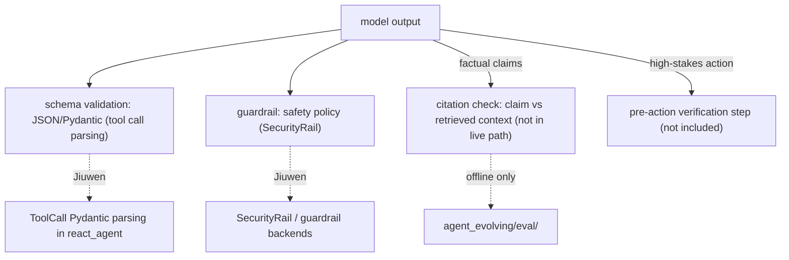
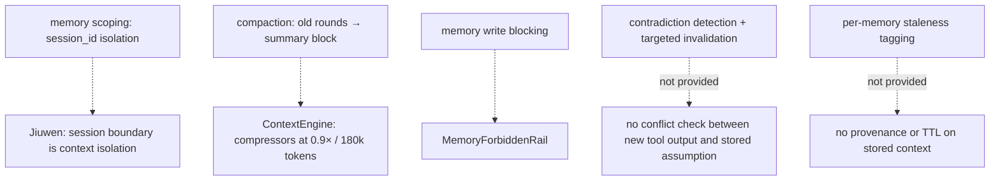
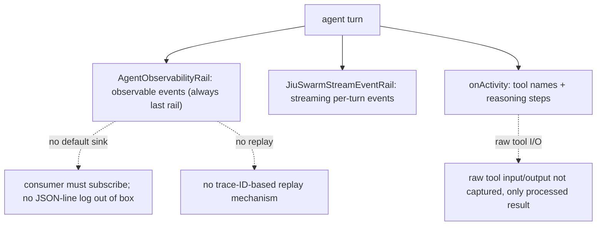
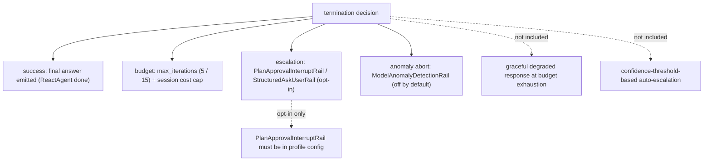
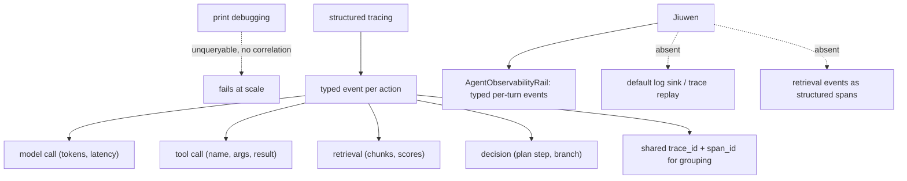

# Agent failure modes

## 1. Tool call failures and idempotency

**Definition:** A tool call can time out after its action has already executed. Reads are idempotent and safe to retry with backoff; writes must track whether they were confirmed or only attempted. The standard fix is an **idempotency key** — a unique request ID passed with every write, which the server uses to deduplicate. State must persist across retries so the agent knows that `payment_id=abc123` was *attempted*, not merely that the last call failed. Any irreversible action needs a human-escalation path.

**Jiuwen:** Retry logic lives in the model-client layer (a per-provider retry decorator in `openai_model_client.py`). Tool calls are deduplicated at the argument level by `ToolCallDeduplicationRail`, which detects repeated `(tool, args)` hashes and warns or compacts. Idempotency keys, attempted-vs-confirmed state tracking, and a read/write tool taxonomy are not built in; `ToolCard` has no `idempotent` field, so retry safety is a design decision the developer encodes.

Anchors

<code>agent-core/openjiuwen/core/foundation/llm/model_clients/openai_model_client.py</code> — per-provider retry decorator on API errors <code>jiuwenswarm/jiuwenswarm/agents/harness/common/rails/tool_dedup_rail.py:157</code> — <code>ToolCallDeduplicationRail</code>: repeated <code>(tool, args)</code> → warn/compact <code>agent-core/openjiuwen/core/foundation/tool/base.py</code> — <code>ToolCard</code> schema; no <code>idempotent</code> field <code>agent-core/openjiuwen/core/single_agent/agents/react_agent.py</code> — tool execution path; no confirmed-vs-attempted state

---

## 2. Stuck loops and loop invariants

**Definition:** Agents rarely crash visibly — they loop. A wrong conclusion is written back into context and reinforces itself; a bad tool call is retried unchanged. The mechanisms that prevent this are: a hard step cap (`max_iterations`); **divergence detection** that aborts when the last N tool calls or the output are structurally identical; **state deduplication** that canonicalises `(tool, input_hash)` and rejects re-execution of a confirmed call; **context compaction** to clear the noise that is reinforcing the wrong path; and a forced final answer at budget exhaustion.

**Jiuwen:** Concrete mechanisms exist: `ReactAgent.max_iterations` defaults to 5 (the harness raises it to 15); `ModelAnomalyDetectionRail` detects consecutive identical tool-call rounds via `ToolLoopCompactConfig` (off by default; it compacts then aborts); `ToolCallDeduplicationRail` counts repeated `(tool, args)`; `AgenticRetriever.max_iter` defaults to 2. Output-similarity divergence checks and a forced final answer at budget are not included, and `ToolLoopCompactConfig` must be enabled explicitly.

Anchors

<code>agent-core/openjiuwen/core/single_agent/agents/react_agent.py:288</code> — <code>max_iterations: int = Field(default=5)</code> <code>agent-core/openjiuwen/harness/schema/config.py:252</code> — harness default iterations 15 <code>agent-core/openjiuwen/harness/rails/model_anomaly_detection_rail.py:74</code> — <code>ToolLoopCompactConfig</code> (default off); <code>:90</code> loop → compact → abort <code>jiuwenswarm/jiuwenswarm/agents/harness/common/rails/tool_dedup_rail.py:157</code> — repeat counter/warning <code>agent-core/openjiuwen/core/retrieval/retriever/agentic_retriever.py</code> — <code>max_iter=2</code> clamped

---

## 3. Output validation and ungrounded confidence

**Definition:** A fluent answer is not a correct one, so validation is an architectural stage rather than a review step. For factual claims, extract each claim and verify it against the retrieved sources (an NLI model or LLM-as-judge). For structured output, validate against the expected schema (JSON Schema, Pydantic) before acting. For high-stakes actions, insert a separate verification step before the result is trusted. Treat "the model said X" as a hypothesis, not a fact.

**Jiuwen:** Structured output validation is present through `StructuredAskUserRail` and Pydantic parsing of `ToolCall` responses in the tool-call path; the `SecurityRail` guardrail layer validates inputs and outputs for safety policy. Claim-level citation verification against retrieved context is not in the live path — the faithfulness evaluator in `agent_evolving/eval/` runs offline — and there is no general pre-action verification step; schema-guided generation constrains format but not content accuracy.

Anchors

<code>agent-core/openjiuwen/core/single_agent/agents/react_agent.py</code> — <code>ToolCall</code> Pydantic parsing; schema-validated tool calls <code>agent-core/openjiuwen/core/security/guardrail/builtin.py</code> — <code>SecurityRail</code> content classification <code>jiuwenswarm/jiuwenswarm/agents/harness/common/rails/ask_user_rail.py</code> — structured output rail <code>agent-core/openjiuwen/agent_evolving/eval/</code> — faithfulness evaluation (offline)

---

## 4. Memory as a source of compounding error

**Definition:** Memory is a liability as well as a feature: a wrong assumption stored early can quietly shape every later decision. Mitigations: scope memory by task or session so assumptions do not leak across sessions; when a tool returns contradictory evidence, flag or discard the related memory instead of letting both coexist; tag memories with the context that produced them so superseded ones can be identified as stale; and compact the context window rather than accumulate it.

**Jiuwen:** Memory is session-scoped: `session_id` is the isolation unit and contexts do not cross sessions. The context engine compresses history (compressors at a 0.9× token budget and a full compaction at 180k tokens), and `MemoryForbiddenRail` blocks specific write patterns. Contradiction detection, per-memory staleness tags, and targeted invalidation are not provided — compaction is all-or-nothing.

Anchors

<code>agent-core/openjiuwen/core/context_engine/context_engine.py</code> — session-scoped context; <code>recover_from_model_exception</code> for overflow <code>agent-core/openjiuwen/core/context_engine/processor/compressor/round_level_compressor.py:104</code> — <code>trigger_context_ratio=0.9</code> <code>agent-core/openjiuwen/core/context_engine/processor/compressor/full_compact_processor.py</code> — full compaction at 180k tokens <code>jiuwenswarm/jiuwenswarm/agents/harness/common/rails/memory_forbidden_rail.py</code> — <code>MemoryForbiddenRail</code>

---

## 5. Observability and auditing agent decisions

**Definition:** If the only artifact is the final transcript, no one can audit why the agent chose one tool or path over another. Structured tracing records, per turn: the model's reasoning text, which tools were called with what inputs, the raw tool outputs, and the rail/guard decisions that shaped the response, each stamped with a time and a session/turn identifier. Production uses a sampling strategy (full trace on errors, sampled on success) and supports replaying a specific trace to reproduce a failure.

**Jiuwen:** `AgentObservabilityRail` is always the last rail in the profile and captures per-turn observable events; the `harness/observability` module structures them, `JiuSwarmStreamEventRail` emits streaming per-turn events, and tool names and reasoning steps surface as `onActivity` events. A structured JSON-line sink, capture of raw tool input/output (only the processed result surfaces), and trace-ID-based replay are not included out of the box — events require a subscribing consumer.

Anchors

<code>agent-core/openjiuwen/harness/observability/__init__.py</code> — <code>AgentObservabilityRail</code>; always last in profile <code>jiuwenswarm/jiuwenswarm/agents/harness/common/rails/stream_event_rail.py</code> — <code>JiuSwarmStreamEventRail</code> <code>agent-core/openjiuwen/harness/rails/</code> — rail pipeline; <code>AgentObservabilityRail</code> appended last <code>agent-core/openjiuwen/core/single_agent/agents/react_agent.py</code> — tool call execution; raw I/O not persisted separately

---

## 6. Termination conditions

**Definition:** "Stop when done" is not a termination condition. An agent needs at least three explicit paths: **success** (a final answer meeting a defined condition, such as required fields populated or context cited); **budget exhaustion** (a hard cap on iterations and tokens, with a graceful degraded response rather than silence); and **human escalation** (handing off when budget is exhausted or ambiguity is unresolvable). A confidence threshold can add a fourth: escalate before acting when the model's uncertainty is high.

**Jiuwen:** Several termination paths exist: `ReactAgent.max_iterations` is the hard iteration cap (5, or 15 in the harness); `PlanApprovalInterruptRail` and `StructuredAskUserRail` provide human-in-the-loop escalation; `ModelAnomalyDetectionRail` can abort on anomaly detection; and `AgentObservabilityRail` logs every turn. A graceful degraded response at budget exhaustion and confidence-threshold auto-escalation are not included, and the approval rails are opt-in per agent config.

Anchors

<code>agent-core/openjiuwen/core/single_agent/agents/react_agent.py:288</code> — <code>max_iterations: int = Field(default=5)</code> <code>agent-core/openjiuwen/harness/schema/config.py:252</code> — harness default iterations 15 <code>agent-core/openjiuwen/harness/rails/model_anomaly_detection_rail.py:74</code> — anomaly abort (off by default) <code>jiuwenswarm/jiuwenswarm/server/runtime/usage_cost.py:171</code> — session cost cap <code>jiuwenswarm/jiuwenswarm/agents/harness/common/rails/ask_user_rail.py</code> — structured human escalation <code>jiuwenswarm/jiuwenswarm/agents/harness/code/rails/code_plan_approval_interrupt_rail.py</code> — <code>PlanApprovalInterruptRail</code> (opt-in)

---

## 7. What does structured agent tracing look like, and why does print-debugging fail at scale?

**General:** Print/log statements produce unstructured text: you can't query "all tool calls in session X", can't aggregate latency by tool, and can't correlate a wrong answer back to which retrieval chunk was in context. Structured tracing means emitting a typed event for every meaningful action — model call started/completed, tool called/returned, retrieval executed, decision made — with a shared trace/span ID so events from the same agent run can be grouped. Each event carries: timestamp, latency, token counts, tool name + arguments, retrieval score, model response. This enables offline debugging (replay a trace), production monitoring (alert on p99 latency), and eval (attach ground truth to a trace for scoring). The minimum viable schema: `trace_id`, `span_id`, `event_type`, `payload`, `duration_ms`.

**Jiuwen:** `AgentObservabilityRail` (`harness/observability/rail.py`) emits typed observability events at the major points of each turn — model call, tool call, final answer — and is always the last rail in the profile. Token and cost figures come from the model response's usage metadata. Events are delivered to a subscribing consumer: there is no default log sink, and retrieval details (which chunks, their scores) are not emitted as structured spans — they appear only in tool-result text, so cross-run retrieval analytics need manual instrumentation.

Anchors

<strong>Anchors:</strong> &bull; <code>agent-core/openjiuwen/harness/observability/rail.py:355</code> — <code>AgentObservabilityRail</code> (typed events) &bull; <code>agent-core/openjiuwen/core/single_agent/agents/react_agent.py:1328</code> — <code>_emit_context_usage</code> (token/usage emission) &bull; <code>agent-core/openjiuwen/core/foundation/llm/schema/generation_response.py:9</code> — <code>GenerationResponse</code> usage/token counts

**Gap.** Retrieval events (chunk ids, scores, query) are not emitted as structured observability spans; they appear only in the tool result text, making cross-run retrieval analysis require custom instrumentation.

_Canonical source: `source/agent-failure-patterns_for_engineers.md`; also covered in: agent-failure._

---
