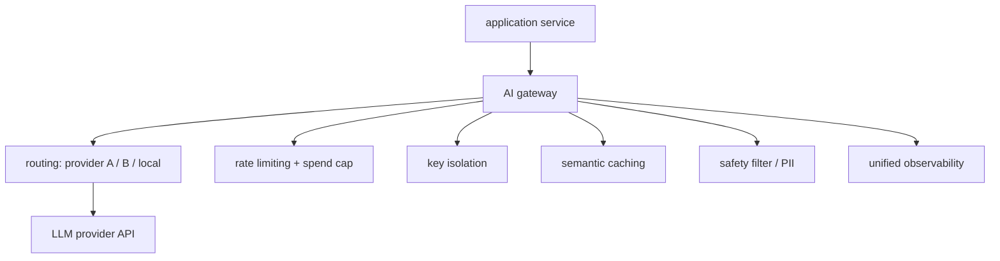

# Model routing & gateways

## 1. What is an AI gateway and when do you need one?

**General:** An AI gateway is an infrastructure layer that sits between your application and one or more LLM provider APIs. It centralises concerns that would otherwise be duplicated in every service that calls a model.

What a gateway does: (1) **routing** — send requests to different providers (OpenAI, Anthropic, local vLLM) based on cost, latency, availability, or model capability; (2) **rate limiting and cost enforcement** — per-tenant or per-user token budgets, hard spend caps, and quota management without touching application code; (3) **authentication and key isolation** — API keys never leave the gateway; application services hold only an internal token; (4) **semantic caching** — embed incoming queries and return cached responses for near-duplicate requests, reducing redundant model calls; (5) **safety enforcement** — content filtering and PII redaction applied uniformly at the gateway before the request reaches the model; (6) **observability** — every model call is logged with provider, model, token usage, latency, and cost in one place.

When you need a gateway: multiple services calling LLMs independently (key sprawl, duplicated cost logic), strict per-tenant budgets, multi-provider fallback, or a need for a single audit log of all model calls. Single-service applications with one provider generally do not need a dedicated gateway.

**Jiuwen:** No standalone gateway component. Equivalent functions are distributed across the framework: provider routing via `ModelClientFactory`; cost tracking via `usage_cost.py`; circuit breaking via `CircuitBreakerRail`; content safety via `GuardrailRail`; observability via `ObservabilityHandler`. A separate AI gateway upstream of Jiuwen would handle cross-service key isolation and semantic caching.

Anchors

<strong>Anchors:</strong> &bull; Equivalent in Jiuwen: `usage_cost.py:101` (cost), `circuit_breaker_rail.py:1` (circuit), `guardrail_rail.py:1` (safety), `observability/event.py:1` (logging) &bull; No gateway component in the codebase; these concerns are per-agent, not cross-service

_Canonical source: `source/ai-gateway-architecture_for_engineers.md`._

---

## 2. How a gateway's responsibilities map onto a production LLM stack

**Definition:** Each of the gateway's six responsibilities addresses a distinct production concern. **Routing** chooses among providers by cost, latency, or availability. **Fallback** defines what happens when a call fails, so the user does not see an error. **Rate limiting and cost caps** bound spend per tenant or user and prevent a single client from exhausting the budget. **Semantic caching** removes redundant calls when the same or a similar question recurs. **Load balancing and endpoint health** keep healthy endpoints in rotation and drop failing ones. **Observability** attaches span, trace, and cost metadata to every call so behaviour can be audited. **Safety enforcement** rejects or sanitizes requests before they reach the model. Together these are the concerns to name when designing the layer between an application and its model providers.

**Jiuwen:** Routing lives in the `ModelPoolEntry` router with health, rate, and latency scoring; the remaining concerns are configured separately rather than composed by a single component, so a dedicated AI gateway would sit upstream of Jiuwen's model clients.

---
