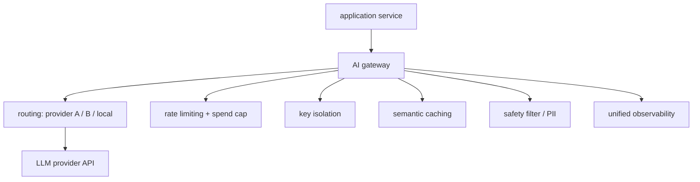
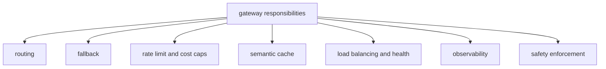
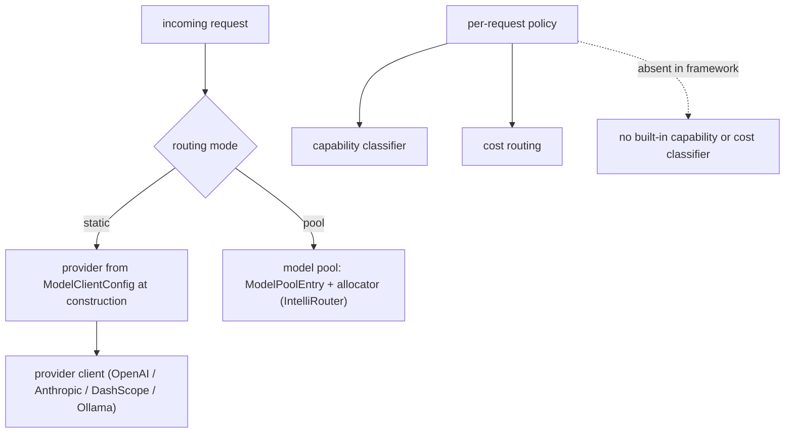
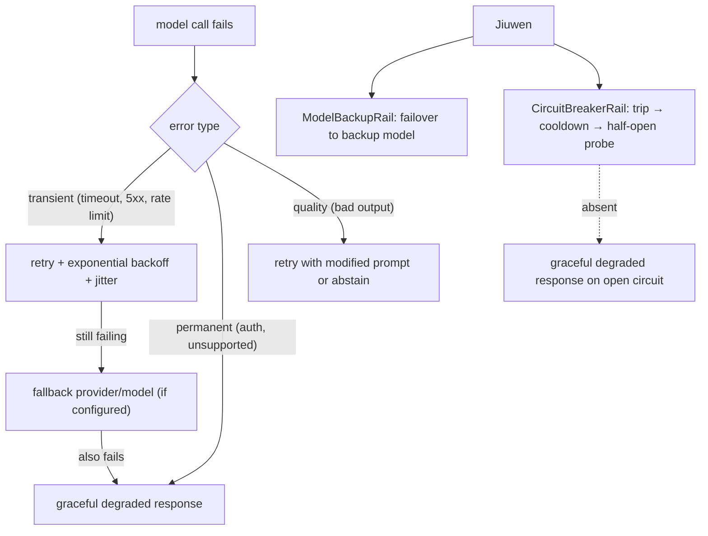

# Model routing & gateways

## 1. What is an AI gateway and when do you need one?

**General:** An AI gateway is an infrastructure layer that sits between your application and one or more LLM provider APIs. It centralises concerns that would otherwise be duplicated in every service that calls a model.

What a gateway does: (1) **routing** — send requests to different providers (OpenAI, Anthropic, local vLLM) based on cost, latency, availability, or model capability; (2) **rate limiting and cost enforcement** — per-tenant or per-user token budgets, hard spend caps, and quota management without touching application code; (3) **authentication and key isolation** — API keys never leave the gateway; application services hold only an internal token; (4) **semantic caching** — embed incoming queries and return cached responses for near-duplicate requests, reducing redundant model calls; (5) **safety enforcement** — content filtering and PII redaction applied uniformly at the gateway before the request reaches the model; (6) **observability** — every model call is logged with provider, model, token usage, latency, and cost in one place.

When you need a gateway: multiple services calling LLMs independently (key sprawl, duplicated cost logic), strict per-tenant budgets, multi-provider fallback, or a need for a single audit log of all model calls. Single-service applications with one provider generally do not need a dedicated gateway.

**Jiuwen:** No standalone gateway component. Its functions are distributed: provider routing through the model pool (`ModelPoolEntry`), cost tracking in `usage_cost.py`, circuit breaking via `CircuitBreakerRail`, content safety via the guardrail layer, and observability events through the harness observability rail. A separate AI gateway upstream of Jiuwen would handle cross-service key isolation and semantic caching.

Anchors

<strong>Anchors:</strong> &bull; <code>jiuwenswarm/jiuwenswarm/server/runtime/usage_cost.py:101</code> — cost meter &bull; <code>jiuwenswarm/jiuwenswarm/agents/harness/common/rails/execution_guard/circuit_breaker_rail.py:1</code> — <code>CircuitBreakerRail</code> &bull; <code>agent-core/openjiuwen/core/security/guardrail/builtin.py:1</code> — guardrail &bull; <code>agent-core/openjiuwen/harness/observability/rail.py:1</code> — observability events &bull; No gateway component in the codebase; these concerns are per-agent, not cross-service

_Canonical source: `source/ai-gateway-architecture_for_engineers.md`._

---

## 2. How a gateway's responsibilities map onto a production LLM stack

**Definition:** Each of the gateway's six responsibilities addresses a distinct production concern. **Routing** chooses among providers by cost, latency, or availability. **Fallback** defines what happens when a call fails, so the user does not see an error. **Rate limiting and cost caps** bound spend per tenant or user and prevent a single client from exhausting the budget. **Semantic caching** removes redundant calls when the same or a similar question recurs. **Load balancing and endpoint health** keep healthy endpoints in rotation and drop failing ones. **Observability** attaches span, trace, and cost metadata to every call so behaviour can be audited. **Safety enforcement** rejects or sanitizes requests before they reach the model. Together these are the concerns to name when designing the layer between an application and its model providers.

**Jiuwen:** Routing lives in the `ModelPoolEntry` router with health, rate, and latency scoring; the remaining concerns are configured separately rather than composed by a single component, so a dedicated AI gateway would sit upstream of Jiuwen's model clients.

---

## 3. How do you route between multiple model providers — and when do you switch dynamically?

**General:** Multi-provider routing has two modes: static (choose provider at config time based on cost, capability, or data residency) and dynamic (route at request time based on load, availability, or task type). Dynamic routing patterns: (1) primary/fallback — always try provider A, fall back to B on error or timeout; (2) capability routing — send code tasks to a coding-optimized model, chat tasks to a general model; (3) cost routing — send cheap queries to a small cheap model, expensive reasoning to a large model (classifier decides). Key considerations: response format compatibility across providers (different tool-call schemas), token counting per-provider, and observable routing decisions (which provider was actually used).

**Jiuwen:** Routing is configured per agent through `ModelClientConfig` and `ProviderType`, and `create_model_client` resolves the provider client. At the team layer there is a real model pool: `ModelPoolEntry` plus allocators (including `IntelliRouterAllocator`) select a model by name, rotation, and health. What is not built in is a per-request capability classifier or cost-based dispatcher that picks a model for each call; those policies live in the application or in the pool configuration. `CircuitBreakerRail` trips on consecutive failures and cools down, which is the closest analogue to provider failover.

Anchors

<strong>Anchors:</strong> &bull; <code>agent-core/openjiuwen/core/foundation/llm/model_clients/__init__.py:58</code> — <code>create_model_client</code> provider dispatch &bull; <code>agent-core/openjiuwen/core/foundation/llm/schema/config.py:13</code> — <code>ProviderType</code> / <code>ModelClientConfig</code> &bull; <code>agent-core/openjiuwen/agent_teams/models/pool.py:38</code> — <code>ModelPoolEntry</code>; <code>agent-core/openjiuwen/agent_teams/models/allocator.py:452</code> — <code>IntelliRouterAllocator</code> &bull; <code>jiuwenswarm/jiuwenswarm/agents/harness/common/rails/execution_guard/circuit_breaker_rail.py:303</code> — <code>CircuitBreakerRail</code> failure trip + cooldown

**Gap.** No built-in runtime capability or cost router; multi-provider setups require application-layer orchestration. `CircuitBreakerRail` trips on consecutive errors but does not reroute to an alternate provider.

_Canonical source: `source/real-interview-ai-engineer-4rounds_for_engineers.md`; also covered in: real-interview._

---

## 4. What is the correct fallback sequence when a model call fails?

**General:** Model call failures fall into three categories: transient (timeout, rate limit, 5xx), permanent (auth error, unsupported model, input too long), and quality (response parsed but content invalid/refused). The correct fallback sequence: (1) retry with exponential backoff + jitter for transient errors (max 3 attempts); (2) if still failing, route to a fallback provider/model if one is configured; (3) if the fallback also fails or no fallback exists, return a graceful degraded response — "I was unable to complete this request, please try again" — rather than surfacing a raw exception. Do not retry permanent errors (they will not recover). Do not retry quality failures as-is (retry with a modified prompt or abstain).

**Jiuwen:** `ModelBackupRail` provides failover to a backup model on failure, and `CircuitBreakerRail` tracks consecutive failures, opens the circuit during cooldown, and half-opens to probe recovery. `ModelClientConfig.timeout` is forwarded to the provider client. There is no structured degraded response emitted by a rail, and no retry-with-modified-prompt path for quality failures.

Anchors

<strong>Anchors:</strong> &bull; <code>jiuwenswarm/jiuwenswarm/agents/harness/common/rails/execution_guard/circuit_breaker_rail.py:303</code> — <code>CircuitBreakerRail</code> open/closed/half-open states &bull; <code>agent-core/openjiuwen/core/single_agent/rail/model_backup.py:9</code> — <code>ModelBackupRail</code> failover &bull; <code>agent-core/openjiuwen/core/foundation/llm/schema/config.py:102</code> — <code>ModelClientConfig.timeout</code>

**Gap.** No automatic fallback-provider routing; an open circuit raises rather than returning a structured degraded response. No retry-with-modified-prompt path for quality failures.

_Canonical source: `source/real-interview-ai-engineer-4rounds_for_engineers.md`; also covered in: real-interview._
