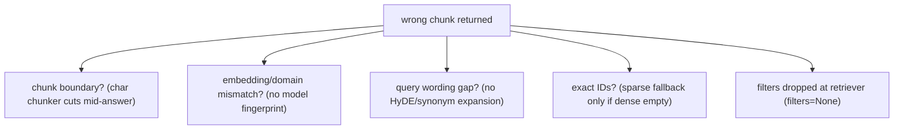
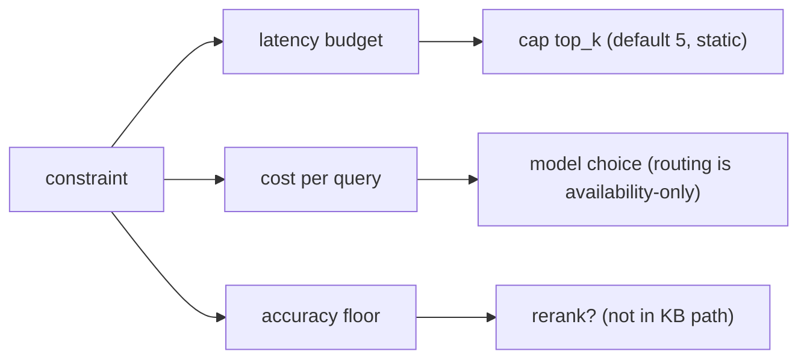
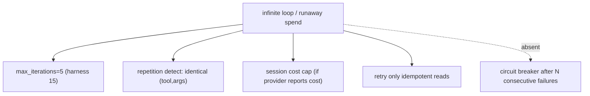
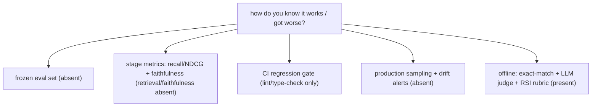
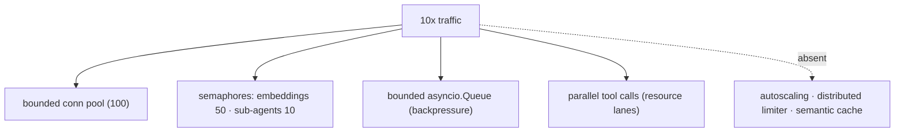
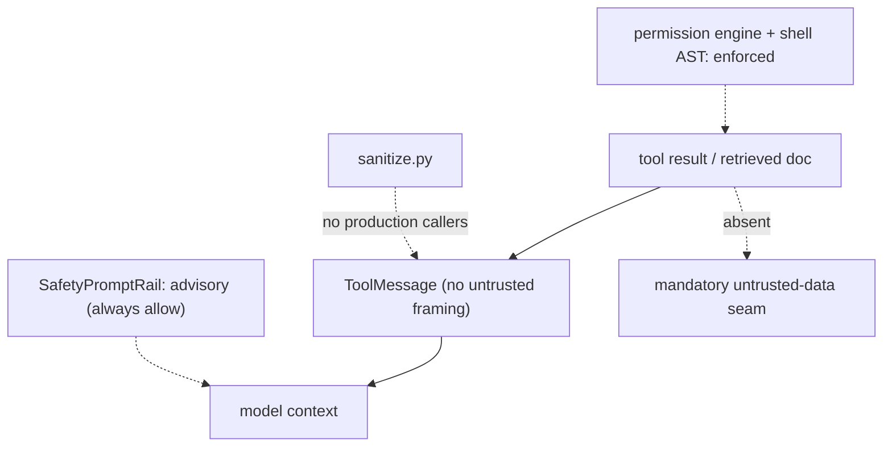
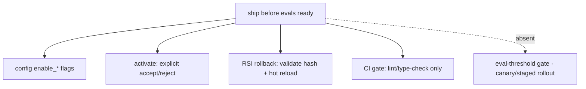

# AI engineer interview patterns — what's really being tested + how Jiuwen maps

Based on the recurring observations *Patterns I Keep Seeing in AI Engineer Technical Interviews*. This is not a question list; each entry is an interview dynamic — what the interviewer is actually probing, what a strong answer includes (with a concrete number), and the concrete mechanism in this codebase that backs it up (or shows the gap).

The through-line is the same as the other docs: a strong answer names a specific failure point, a specific number, or a specific mechanism, rather than a memorized diagram. See [README](README.md) for the shared conventions (answer shape, anchor format, repo layers).

---

## 1. "Design a RAG system" tests failure mode awareness, not architecture recall

**What they're testing:** Drawing embed → retrieve → rerank → generate is table stakes. The real follow-up is "retrieval returned the wrong chunk — why?", expecting chunk-size mismatch, embedding drift, or a query that doesn't semantically match the source wording. Naming failure points unprompted separates a memorized diagram from someone who has debugged one.

**What a strong answer includes:** point at the stage that fails, not the pipeline as a whole. "Wrong chunk" is usually retrieval-side: chunk boundaries cut the answer, the embedding mismatches the domain, the query wording differs from the corpus, exact IDs need sparse search, or metadata filters were dropped. Name the check for each (read the chunk, score threshold, hybrid fallback).

**Jiuwen:** The failure points are concrete. Dense retrieval falls back to sparse only when it returns *empty*, not when it is wrong; `score_threshold` defaults to `None` so weak chunks pass; the KB path never reranks; and metadata `filters` are dropped at the retriever boundary, so an "authorized docs only" filter silently does nothing.

Anchors

<strong>Anchors:</strong> &bull; <code>agent-core/openjiuwen/core/retrieval/retriever/vector_retriever.py:83</code> — dense-empty → sparse fallback only; <code>:88</code> <code>filters=None</code>; <code>:94</code> threshold applied only when supplied &bull; <code>agent-core/openjiuwen/core/retrieval/common/config.py:47</code> — <code>score_threshold</code> defaults <code>None</code> &bull; <code>agent-core/openjiuwen/core/retrieval/simple_knowledge_base.py:182</code> — KB path calls no reranker &bull; <code>agent-core/openjiuwen/core/retrieval/indexing/processor/chunker/text_splitter.py:56</code> — char chunker cuts at fixed offsets

## 2. "Compare two approaches" tests tradeoff reasoning tied to numbers, not a correct pick

**What they're testing:** RAG vs. fine-tuning, 7B vs. 70B, top-5 vs. top-20 retrieval. "It depends" without naming the constraint (latency budget, cost per query, accuracy floor) reads as a dodge. The strongest answers put a number on it — e.g. "at a 200ms budget, reranking 20 docs isn't viable, so I'd cap retrieval at 5."

**What a strong answer includes:** state the constraint, then the decision it forces, then the number. Tie retrieval size to latency/tokens, model size to accuracy floor vs cost, and reranking to the latency it buys you in precision.

**Jiuwen:** The relevant knobs are static and named: `top_k` defaults to 5 (no adaptive policy), reranking is not in the KB path, and model allocation is availability-based, not cost/accuracy-based — so "smaller model for easy queries" is not automatic. Session cost is tracked and capped when the provider reports cost.

Anchors

<strong>Anchors:</strong> &bull; <code>agent-core/openjiuwen/core/retrieval/common/config.py:46</code> — <code>top_k: int = 5</code> static &bull; <code>agent-core/openjiuwen/core/retrieval/simple_knowledge_base.py:182</code> — no reranker in KB retrieve &bull; <code>agent-core/openjiuwen/agent_teams/models/allocator.py:559</code> — <code>build_model_allocator</code> (availability strategies, not cost/accuracy) &bull; <code>jiuwenswarm/jiuwenswarm/server/runtime/usage_cost.py:171</code> — enforced session cost cap

## 3. "The agent is stuck" tests whether you've shipped one, not studied one

**What they're testing:** Infinite tool loops, retries on a flaky API that never terminate, token spend that quietly spikes overnight. Vague answers ("I'd add safeguards") don't land; concrete answers do — `max_iterations=5`, a token budget per session, a circuit breaker after N consecutive tool failures.

**What a strong answer includes:** a hard iteration cap, repetition detection on canonicalized `(tool, args)`, per-session token/cost budget, retry with backoff only for idempotent reads, and a circuit breaker on repeated failures.

**Jiuwen:** Concrete caps exist: ReAct `max_iterations` (default 5, harness 15), `AgenticRetriever.max_iter` (default 2, clamped), `ModelAnomalyDetectionRail` (consecutive identical tool rounds → compact/abort) and `ToolCallDeduplicationRail`. A session cost cap is enforced when the provider reports cost, and `ModelBackupRail` fails over. What is **missing** is a circuit breaker after N consecutive failures and a durable token budget on the retrieval loop.

Anchors

<strong>Anchors:</strong> &bull; <code>agent-core/openjiuwen/core/single_agent/agents/react_agent.py:288</code> — <code>max_iterations: int = Field(default=5)</code>; <code>agent-core/openjiuwen/harness/schema/config.py:252</code> — harness default 15 &bull; <code>agent-core/openjiuwen/harness/rails/model_anomaly_detection_rail.py:74</code> — <code>ToolLoopCompactConfig</code> (default off); <code>:90</code> bailout &bull; <code>jiuwenswarm/jiuwenswarm/agents/harness/common/rails/tool_dedup_rail.py:157</code> — repeat counter/warning &bull; <code>jiuwenswarm/jiuwenswarm/server/runtime/usage_cost.py:171/196</code> — enforced session cost cap &bull; <code>agent-core/openjiuwen/core/single_agent/rail/model_backup.py:9</code> — <code>ModelBackupRail</code> failover (no circuit breaker)

## 4. "How do you know it's working" tests evaluation depth, not confidence

**What they're testing:** "It looked good to me" ends the conversation. They want a fixed eval set, faithfulness scoring on generated claims, and how you'd catch silent degradation after an unflagged prompt change. The real trap is "how would you know if it got *worse*", not "how do you know it works now".

**What a strong answer includes:** a frozen labeled eval set scored on every change, stage-level metrics (retrieval recall/NDCG; generation faithfulness), a regression gate in CI, and production sampling with drift alerts. Name the baseline and the threshold.

**Jiuwen:** Offline answer-level evaluation exists (`ExactMatchMetric`, `LLMAsJudgeMetric`, RSI weighted rubric, `evaluator_pipeline` pass-rate), but there is no retrieval metric layer, no faithfulness/claim-level scoring, no quality regression gate in CI (`ci_gate.yaml` is lint/type-check only), and no production quality monitoring or drift detection — so the "how would you know it got worse" question exposes real gaps.

Anchors

<strong>Anchors:</strong> &bull; <code>agent-core/openjiuwen/agent_evolving/evaluator/metrics/llm_as_judge.py:47</code> — LLM judge; <code>agent-core/openjiuwen/agent_evolving/evaluator/metrics/exact_match.py:12</code> — exact match &bull; <code>agent-core/openjiuwen/rsi/harness_rsi/evaluator/judger/scoring.py:193</code> — weighted rubric &bull; <code>agent-core/openjiuwen/agent_evolving/evaluator/evaluator_pipeline/pipeline.py:167</code> — benchmark eval &bull; <code>agent-core/openjiuwen/auto_harness/resources/ci_gate.yaml:21</code> — gates are only <code>lint</code>/<code>type-check</code>; <code>agent-core/pyproject.toml:236</code> — <code>level0</code>/<code>level1</code> markers (not invoked) &bull; <code>jiuwenswarm/jiuwenswarm/observability/store.py:102</code> — <code>has_error</code> (operations, not quality)

## 5. Scaling questions test whether you've thought past the demo

**What they're testing:** "What happens at 10x traffic" is asked because most architectures don't survive it. If nothing changes in your design when asked, that's the signal they're waiting for. Name one lever *with where it fits*: caching repeated queries, batching concurrent requests, parallelizing independent tool calls.

**What a strong answer includes:** identify the first bottleneck (provider rate limits, serialized tools, connection pools, context memory), then name the lever and where it sits. Mention backpressure and bounded concurrency, not just "add more servers".

**Jiuwen:** Bounded resources exist per process: shared httpx pool (`max_connections=100`), embedding semaphore (50), sub-agent fan-out semaphore (10), bounded `asyncio.Queue`s, and parallel tool execution with resource lanes. What is missing is autoscaling, a distributed rate limiter, and any semantic response cache — so the design change at 10x is mostly "add replicas + a global limiter", which the repo does not provide.

Anchors

<strong>Anchors:</strong> &bull; <code>agent-core/openjiuwen/core/common/clients/connector_pool.py:21</code> — <code>limit: 100</code>, <code>limit_per_host: 30</code> &bull; <code>agent-core/openjiuwen/core/retrieval/embedding/api_embedding.py:55</code> — concurrency semaphore &bull; <code>agent-core/openjiuwen/core/runner/message_queue_inmemory.py:34</code> — bounded queue; <code>agent-core/openjiuwen/harness/subagent_runtime/activity_events.py:53</code> — bounded activity queue &bull; <code>agent-core/openjiuwen/core/single_agent/ability_manager.py:431</code> — <code>_execute_parallel_tool_tasks</code>; <code>:467</code> <code>parallel_safe</code> lanes &bull; <code>jiuwenswarm/jiuwenswarm/agents/harness/common/memory/manager.py:773</code> — exact embedding cache (no semantic cache)

## 6. Security-adjacent questions are disguised as normal engineering questions

**What they're testing:** "How do you handle content from a tool result or retrieved document" doesn't sound like security — that's the point. It tests prompt-injection awareness: treating tool output and retrieved content as data, never as instructions.

**What a strong answer includes:** delimit and label untrusted content as data, never let it trigger privileged actions without a permission re-check, enforce controls outside the model (tool policy, sandbox, egress), and remember prompt-level safety text is advice, not a control.

**Jiuwen:** This is the weakest area. Tool results are returned as plain `ToolMessage` with no untrusted-data framing; sanitizer helpers exist but have no production callers. Prompt-level safety is advisory (`SafetyPromptRail` always allows), while the enforced controls live in the shell/permission layer (AST ASK floor, builtin deny rules) — not in retrieval. There is no mandatory untrusted-tool-result seam.

Anchors

<strong>Anchors:</strong> &bull; <code>agent-core/openjiuwen/core/single_agent/ability_manager.py:1612</code> — <code>ToolMessage</code> built with no untrusted wrapper; <code>:431</code> parallel path &bull; <code>agent-core/openjiuwen/harness/prompts/sanitize.py:20</code> — sanitizer (no production callers) &bull; <code>agent-core/openjiuwen/harness/rails/security/prompt_security_rail.py:16/41</code> — <code>SafetyPromptRail</code> (advisory, always allows) &bull; <code>agent-core/openjiuwen/harness/security/permission_engine/core.py:272</code> — <code>check_permission</code> (enforced tool/file/net) &bull; <code>agent-core/openjiuwen/harness/resources/builtin_rules.yaml:59</code> — reverse-shell deny

## 7. Stakeholder questions test judgment under pressure, not technical depth

**What they're testing:** "A stakeholder wants to ship before your eval scores are ready" isn't about the metric. It tests whether you can hold a line without becoming difficult to work with — de-risk (flag, canary, rollback, monitoring), make the unmeasured risk explicit, and put a date on the missing eval.

**What a strong answer includes:** don't refuse and don't cave. Ship behind a flag/canary, define the rollback path, cap blast radius, agree a minimal offline check before broad rollout, add monitoring, and state plainly what is unmeasured and the fallback.

**Jiuwen:** The closest code mechanisms are config flags (`enable_*`), explicit human activation before hot-load, and RSI rollback with hash re-validation — plus a CI gate that is lint/type-check only. There is no eval-threshold release gate and no canary/percentage rollout, so the answer is supported only by flags, explicit activation, and manual rollback.

Anchors

<strong>Anchors:</strong> &bull; <code>agent-core/openjiuwen/harness/schema/deep_agent_spec.py:448</code> — <code>enable_*</code> flags &bull; <code>agent-core/openjiuwen/auto_harness/stages/activate.py:99</code> — explicit <code>accept</code>/<code>reject</code> interaction before hot-load &bull; <code>jiuwenswarm/jiuwenswarm/agents/harness/common/rsi/harness_activation.py:617</code> — <code>rollback</code>; <code>:682</code> <code>_assert_rollback_allowed</code> &bull; <code>agent-core/openjiuwen/auto_harness/resources/ci_gate.yaml:21</code> — only <code>lint</code>/<code>type-check</code>

---

## Summary: what each pattern rewards, and where Jiuwen stands

| Pattern | What a strong answer includes | Jiuwen |
|---|---|---|
| 1. Design a RAG system | Named failure points (chunking, embedding drift, query mismatch, dropped filters) | Concrete failure points; no rerank/faithfulness layer |
| 2. Compare two approaches | Constraint → decision → number | Static `top_k=5`; availability-only routing; session cost cap |
| 3. The agent is stuck | Iteration cap, repetition detection, token budget, circuit breaker | Caps + anomaly/dedup rails + cost cap; no circuit breaker |
| 4. How do you know it's working | Fixed eval set, stage metrics, regression gate, drift alerts | Offline answer eval only; no retrieval metrics/faithfulness/gate |
| 5. Scaling past the demo | Bottleneck → lever → where it fits | Bounded pools/semaphores/queues; no autoscaling/semantic cache |
| 6. Security dressed as engineering | Treat tool/retrieved content as untrusted data; enforce outside the model | Prompt-level advisory; no untrusted-data seam; enforced controls are tool-layer |
| 7. Stakeholder judgment | De-risk: flag, canary, rollback, monitoring, explicit risk | Flags + activation + rollback; no eval gate or canary |
