# ML foundations

## 1. What is the difference between AI, Machine Learning, and Deep Learning?

Compare basic

**TL;DR.** AI is the broadest umbrella; ML is the subset that learns from data; Deep Learning is the sub-subset using multi-layer neural nets.

**Key points.**

- AI: any technique making a machine exhibit intelligent behaviour.
- ML: learns patterns from data rather than hand-coded rules.
- DL: ML with many-layer neural nets enabling end-to-end representation learning.
- Jiuwen sits at the DL layer and above — it calls LLMs, builds agentic loops, provides retrieval.

**Concept.** Nested definitions. Artificial Intelligence is the broadest umbrella: any technique that makes a machine exhibit behaviour associated with human intelligence — search, planning, rule systems, ML. Machine Learning is the subset where the machine learns patterns from data rather than following hand-coded rules. Deep Learning is the sub-subset of ML that uses neural networks with many layers, enabling end-to-end representation learning from raw inputs like images, text, or audio without manual feature engineering. Concretely: a rule-based spam filter is AI but not ML. A logistic regression spam classifier is AI and ML but not DL. A transformer-based classifier is all three.

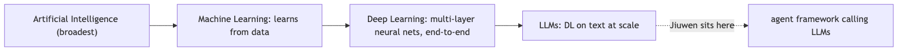

**In Jiuwen.** Jiuwen sits at the Deep Learning layer and above. It calls LLMs (the output of deep learning research) via provider APIs or local HuggingFace loads, builds agentic loops on top of them, and provides retrieval and evaluation tooling. There is no hand-coded rule system, no classical ML, and no custom DL architecture in the inference framework. The only place the framework touches DL training is the optional agent_rl/ subsystem (SFT + PPO/GRPO via veRL).

<b>Under the hood</b>

**Implementation**

The framework sits at the DL layer and above. It calls LLMs (the output of deep learning research), builds agentic loops on top of them, and provides retrieval and evaluation tooling. There is no hand-coded rule system, no classical ML (logistic regression, decision trees), and no custom DL training in the inference framework.

**Code anchors**

| Code anchor | What it points to |
|---|---|
| `agent-core/openjiuwen/core/foundation/llm/model_clients/` | API clients calling hosted LLMs (DL output) |
| `agent-core/openjiuwen/agent_evolving/agent_rl/` | SFT/PPO/GRPO training subsystem; the only place the framework touches DL training |

---

## 2. What is supervised vs unsupervised vs reinforcement learning?

Compare basic

**TL;DR.** Supervised uses labelled pairs to learn a mapping; unsupervised discovers structure without labels; RL maximises cumulative reward via trial and error.

**Key points.**

- Supervised: labelled (x, y) pairs → learn f(x)→y.
- Unsupervised: no labels → clusters, embeddings, density.
- RL: reward signal → policy that maximises return.
- LLM training combines all three: self-supervised pretraining, SFT, RLHF.

**Concept.** Supervised: labelled `(x, y)` pairs; the model learns `f(x)→y` by minimising prediction loss. Examples: classification, regression, NER. Unsupervised: no labels; the model discovers structure in the data — clusters, embeddings, density. Examples: k-means, PCA, autoencoders, contrastive embedding training. Reinforcement learning: an agent takes actions in an environment, receives scalar reward signals, and learns a policy that maximises cumulative reward — no labelled correct action. Examples: game-playing agents, RLHF for LLM alignment. LLM training combines all three: self-supervised pre-training (structurally supervised but labels come from the data itself), SFT (supervised), RLHF (RL).

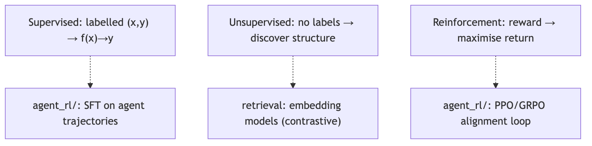

**In Jiuwen.** All three learning paradigms appear in the framework. Supervised: agent_rl/ runs SFT on agent chat trajectories with per-token loss masks. Unsupervised/self-supervised: embedding models used in the retrieval layer are pre-trained with contrastive or masked objectives. Reinforcement: agent_rl/ runs PPO/GRPO for alignment. The inference layer calls pre-trained LLMs — themselves the product of self-supervised pretraining — without touching any learning mechanism.

<b>Under the hood</b>

**Implementation**

All three appear in the framework. The model clients call LLMs pre-trained with self-supervised next-token prediction. `agent_rl/` runs SFT (supervised) and PPO/GRPO (RL). Embedding models in the retrieval layer use contrastive loss (unsupervised/self-supervised). The evaluation harness tracks supervised validation metrics.

**Code anchors**

| Code anchor | What it points to |
|---|---|
| `agent-core/openjiuwen/agent_evolving/agent_rl/` | SFT + PPO/GRPO training |
| `agent-core/openjiuwen/core/retrieval/retriever/vector_retriever.py` | embedding-based retrieval (unsupervised representation) |

---

## 3. What is the bias-variance tradeoff?

Mechanism basic

**TL;DR.** Generalisation error = bias² (underfitting) + variance (overfitting) + irreducible noise; the tradeoff is between model complexity and stability.

**Key points.**

- High bias: model too simple, misses patterns.
- High variance: model too complex, fits noise.
- Reducing bias (more complexity) tends to increase variance.
- Double descent: very large models can re-enter low-variance regime with enough data.

**Concept.** Every model's generalisation error decomposes into: bias (error from wrong assumptions — underfitting, model too simple), variance (error from sensitivity to training set fluctuations — overfitting, model too complex), and irreducible noise. High bias: model misses patterns. High variance: model fits noise. Reducing bias by adding complexity tends to increase variance and vice versa. The goal is to minimise total expected error. In modern large models, "double descent" complicates the classic picture: very high-capacity models can re-enter a low-variance regime with enough data and regularisation — which is why LLMs generalise despite billions of parameters.

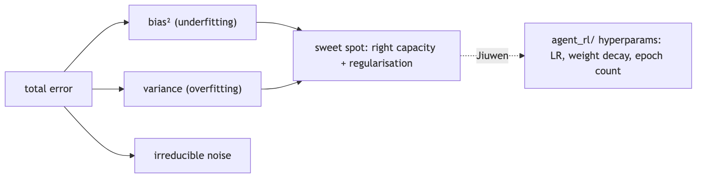

**In Jiuwen.** Not directly present in the inference framework. In agent_rl/, the bias-variance balance is controlled by training hyperparameters: learning rate, weight decay, dropout rate, and epoch count. The evaluation harness in agent_evolving/eval/ tracks the train-vs-validation metric divergence that signals overfitting. These are configuration parameters forwarded to veRL; no bias-variance diagnostic is built into the framework.

<b>Under the hood</b>

**Implementation**

Not directly implemented in the inference framework. In `agent_rl/`, the tradeoff manifests as a hyperparameter concern: learning rate, regularisation strength (weight decay), and SFT epoch count all control where on the bias-variance curve the fine-tuned model lands. `agent_evolving/eval/` tracks the signal (train vs validation metric divergence).

**Code anchors**

| Code anchor | What it points to |
|---|---|
| `agent-core/openjiuwen/agent_evolving/agent_rl/` | training hyperparams controlling the bias-variance balance |
| `agent-core/openjiuwen/agent_evolving/eval/` | validation metrics to detect divergence |

---

## 4. What is the difference between a parameter and a hyperparameter?

Compare basic

**TL;DR.** Parameters are learned weights updated by gradient descent; hyperparameters are engineer-set configuration choices not changed by training.

**Key points.**

- Parameters: W, b, attention matrices — set by gradient descent.
- Training hyperparams: LR, batch size, epochs, dropout, LoRA rank.
- Inference hyperparams: temperature, top-p, max_tokens — not weights.
- Jiuwen: ModelRequestConfig for inference; agent_rl/ config for training.

**Concept.** Parameters are the learned weights of the model — the numbers changed during training via gradient descent (`W`, `b` in a linear layer; attention projection matrices in a transformer). Training data determines their values. Hyperparameters are the configuration choices made before or during training that the training process does not change: learning rate, batch size, number of layers, dropout rate, regularisation coefficient, training epochs, LoRA rank. A common source of confusion: context window size, temperature, and top-p are inference-time hyperparameters — they do not affect weights, only how the model generates at prediction time.

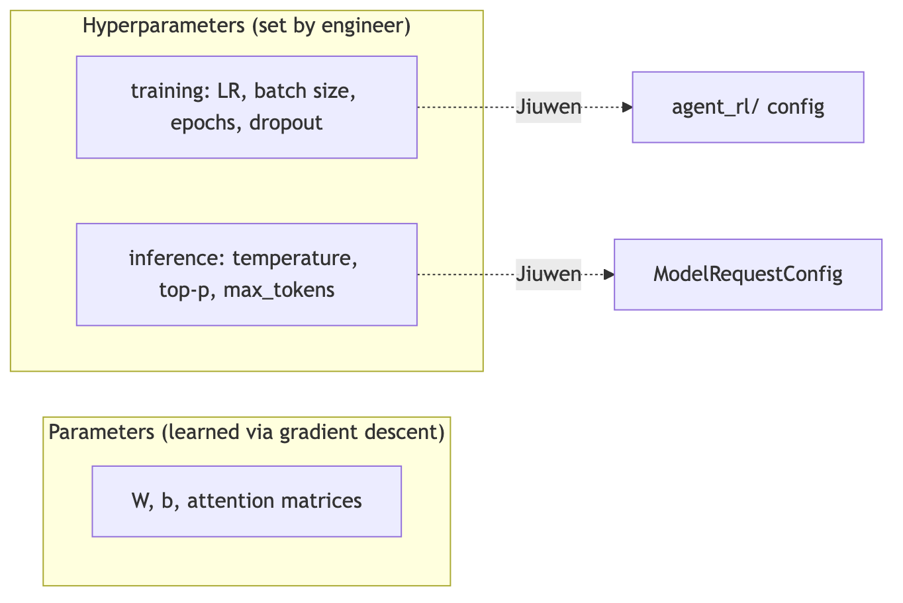

**In Jiuwen.** Model weights (parameters) are managed by PyTorch/veRL in the agent_rl/ training subsystem. Inference-time hyperparameters — temperature, top-p, max_tokens, context window size — are fields in ModelRequestConfig and are forwarded to the provider or local model without affecting weights. Training hyperparameters — learning rate, batch size, epochs, LoRA rank, dropout — are agent_rl/ config fields. The framework makes no type distinction between the two in its config schema.

<b>Under the hood</b>

**Implementation**

Model weights are managed by PyTorch/veRL in `agent_rl/`. Inference-time hyperparameters (temperature, top-p, max tokens) are `ModelRequestConfig` fields. Training hyperparameters are `agent_rl/` config. Both are plain config fields — the framework makes no type distinction between them in its schema.

**Code anchors**

| Code anchor | What it points to |
|---|---|
| `agent-core/openjiuwen/core/foundation/llm/schema/config.py` | ModelRequestConfig: temperature, top-p, max_tokens (inference hyperparams) |
| `agent-core/openjiuwen/agent_evolving/agent_rl/` | training hyperparams (LR, epochs, etc.) |

---

## 5. What is gradient descent, and how does it work?

Concept intermediate

**TL;DR.** Iterative optimisation that moves parameters in the direction of steepest loss decrease by subtracting learning_rate × gradient at each step.

**Key points.**

- Step: compute loss, compute gradient, subtract lr × grad.
- SGD uses mini-batches — noisy but cheap per step.
- Variants: momentum, Adam (adaptive per-parameter LR).
- Jiuwen: delegated to veRL/PyTorch optimizer in agent_rl/.

**Concept.** An iterative optimisation algorithm that minimises a loss function by moving parameters in the direction of steepest descent. Each step: compute the loss, compute the gradient `∂L/∂w` for each parameter, subtract `learning_rate × gradient` from each parameter. Stochastic gradient descent (SGD) does this on a mini-batch rather than the full dataset — the gradient estimate is noisy but each step is cheap and often generalises better. Key variants: SGD with momentum (accumulates gradient history to reduce oscillation), Adam (adaptive per-parameter learning rates based on gradient moments).

**In Jiuwen.** Gradient descent lives in the training stack: the agent_rl/ subsystem runs SFT and PPO/GRPO through veRL, which manages the optimisation loop with PyTorch Optimizer.step(). The inference layer calls hosted models and performs no parameter updates, so gradient descent is a training-side concern.

---

## 6. Compute cosine similarity between two vectors without using a library

Mechanism basic

**TL;DR.** dot(A,B) / (|A| × |B|) — measures directional similarity, length-independent, range [-1,1].

**Key points.**

- Dot product divided by product of magnitudes.
- Length-independent: normalising to unit length reduces it to a dot product.
- Edge cases: zero vectors, dimension mismatch.
- Jiuwen: metric_type in IndexConfig, delegated to vector store.

**Concept.** Cosine similarity = `dot(A, B) / (|A| × |B|)`. The dot product measures shared direction; dividing by the product of magnitudes normalises to `[-1, 1]`, making the result length-independent. In retrieval, pre-normalising all vectors to unit length reduces cosine similarity to a plain dot product, which is cheaper to compute at scale.

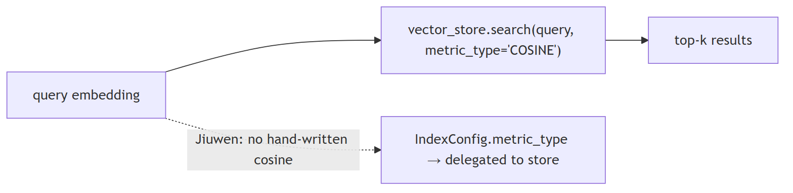

**In Jiuwen.** Vector similarity is computed by the vector store backend (Milvus, Chroma, or similar): IndexConfig takes a metric_type parameter forwarded to the store, so metric choice is configuration rather than hand-written code.

<b>Under the hood</b>

**Implementation**

Not hand-coded. Vector similarity queries go through the vector store (Milvus, Chroma, or similar), which computes cosine/IP/L2 internally. `IndexConfig` accepts a `metric_type` parameter. No custom dot-product or magnitude code exists in the framework.

**Code anchors**

| Code anchor | What it points to |
|---|---|
| `agent-core/openjiuwen/core/retrieval/common/config.py:56` | IndexConfig with metric_type |
| `agent-core/openjiuwen/core/retrieval/vector_store/` | search delegated to backing store |

---

## 7. Given a confusion matrix, calculate precision, recall, and F1 manually

Mechanism basic

**TL;DR.** Precision = TP/(TP+FP); Recall = TP/(TP+FN); F1 = harmonic mean of the two — each measures a different cost of classification error.

**Key points.**

- Precision: of predicted positives, how many are actually positive.
- Recall: of all actual positives, how many were caught.
- F1: harmonic mean; penalises imbalance between precision and recall.
- Multi-class: per-class TP/FP/FN, then macro/micro average.

**Concept.** For a binary classifier `[[TN, FP], [FN, TP]]`:
- Precision = TP / (TP + FP) — of predicted positives, how many were actually positive
- Recall = TP / (TP + FN) — of all actual positives, how many were caught
- F1 = 2 × (Precision × Recall) / (Precision + Recall) — harmonic mean, penalises imbalance

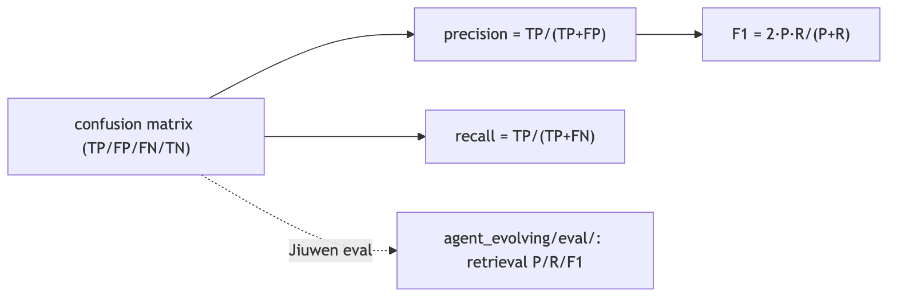

**In Jiuwen.** The evaluation module under agent_evolving/evaluator/ provides classification-style metrics such as ExactMatchMetric, and delegates the arithmetic to standard library helpers. Generation evaluation uses LLM-as-judge scoring (LLMAsJudgeMetric). The only true classifier is AutoModelForSequenceClassification in the guardrail layer.

<b>Under the hood</b>

**Implementation**

`agent_evolving/eval/` computes precision, recall, and F1 for retrieval evaluation. The framework does not hand-implement the confusion-matrix arithmetic; it uses standard library helpers. The one true classifier in the framework is `AutoModelForSequenceClassification` in the guardrail layer, evaluated externally.

**Code anchors**

| Code anchor | What it points to |
|---|---|
| `agent-core/openjiuwen/agent_evolving/eval/` | evaluation framework; retrieval-level P/R/F1 |
| `agent-core/openjiuwen/core/security/guardrail/backends.py` | AutoModelForSequenceClassification: the one true classifier |

---

## 8. Implement k-nearest neighbors from scratch

Mechanism basic

**TL;DR.** Lazy learner: store all training points, predict by majority vote of the k nearest examples by distance.

**Key points.**

- No training cost, all cost at inference (O(n·d) per query).
- Sensitive to feature scale — normalise first.
- ANN indexes (HNSW, IVF) approximate KNN at scale.
- Jiuwen retrieval is effectively ANN over embedding space.

**Concept.** KNN at inference: store all training points, then for a new query: (1) compute distance from the query to every training point, (2) sort by distance, (3) take the k smallest, (4) return majority class (classification) or mean (regression). KNN is lazy — no training cost, all cost at inference, O(n·d) per query without indexing. Sensitive to feature scale (normalise first) and irrelevant dimensions. ANN indexes (HNSW, IVF) replicate the nearest-neighbour idea at scale.

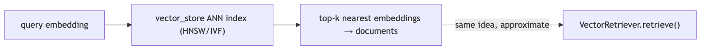

**In Jiuwen.** k-NN shows up as vector retrieval: VectorRetriever performs top-k approximate nearest-neighbour search over the vector store's index (typically HNSW or IVF) — the same concept at scale with approximation instead of exact distance.

<b>Under the hood</b>

**Implementation**

k-NN shows up as vector retrieval rather than a classifier: `VectorRetriever` performs top-k approximate nearest-neighbour search over embedding space via the vector store's index. The embedding retrieval pipeline is the direct instantiation of the concept.

**Code anchors**

| Code anchor | What it points to |
|---|---|
| `agent-core/openjiuwen/core/retrieval/retriever/vector_retriever.py` | VectorRetriever; top-k ANN search |
| `agent-core/openjiuwen/core/retrieval/vector_store/` | backing ANN index |

---

## 9. Explain forward pass and backpropagation in a neural network

Mechanism intermediate

**TL;DR.** Forward pass computes the prediction and loss; backpropagation applies the chain rule backwards to compute gradients for every weight.

**Key points.**

- Forward: input → layers → loss.
- Backward: chain rule ∂L/∂w = ∂L/∂output × ∂output/∂w.
- PyTorch autograd records graph forward, traverses backward.
- Jiuwen: delegated to veRL/PyTorch in agent_rl/.

**Concept.** The forward pass flows inputs through layers, applying learned weights and non-linearities, to produce a prediction and a scalar loss. Backpropagation then applies the chain rule backwards through every layer: `∂L/∂w = ∂L/∂output × ∂output/∂w` for each weight. PyTorch's autograd engine records the computation graph during the forward pass and traverses it in reverse during `.backward()`, accumulating `w.grad`. The optimiser then applies `w -= lr × w.grad`.

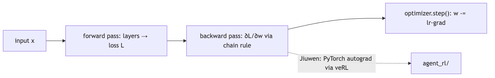

**In Jiuwen.** Backpropagation is handled by the training stack: agent_rl/ runs veRL's SFT and PPO/GRPO loops, which use PyTorch's standard autograd (recorded on the forward pass, traversed in reverse on .backward()). The framework delegates the backward pass to PyTorch.

<b>Under the hood</b>

**Implementation**

Backpropagation is handled by the training stack: `agent_rl/` runs veRL's SFT and PPO/GRPO loops, which use PyTorch's standard autograd. The framework delegates the backward pass to PyTorch.

**Code anchors**

| Code anchor | What it points to |
|---|---|
| `agent-core/openjiuwen/agent_evolving/agent_rl/rl_trainer/ppo_step.py:146` | update_actor; autograd delegated to veRL/PyTorch |
| `agent-core/openjiuwen/agent_evolving/agent_rl/online/backends/sft/trainer.py` | SFT training; backprop via PyTorch |

---

## 10. What is vanishing/exploding gradient, and how do you fix it?

Mechanism intermediate

**TL;DR.** Products of many Jacobians shrink (vanishing) or grow (exploding) exponentially; fixed by ReLU, residual connections, layer norm, and gradient clipping.

**Key points.**

- Vanishing: eigenvalue < 1 → early weights stop learning.
- Exploding: eigenvalue > 1 → NaN weights.
- Fixes: ReLU, residuals, layer norm, He init (vanishing); gradient clipping (exploding).
- Transformers largely avoid both via residual + layer norm at every block.

**Concept.** In deep networks, gradients are products of many Jacobians chained together. Eigenvalues consistently below 1 → gradients shrink exponentially toward early layers (vanishing) — early weights stop learning. Eigenvalues consistently above 1 → gradients grow exponentially (exploding) — NaN weights.

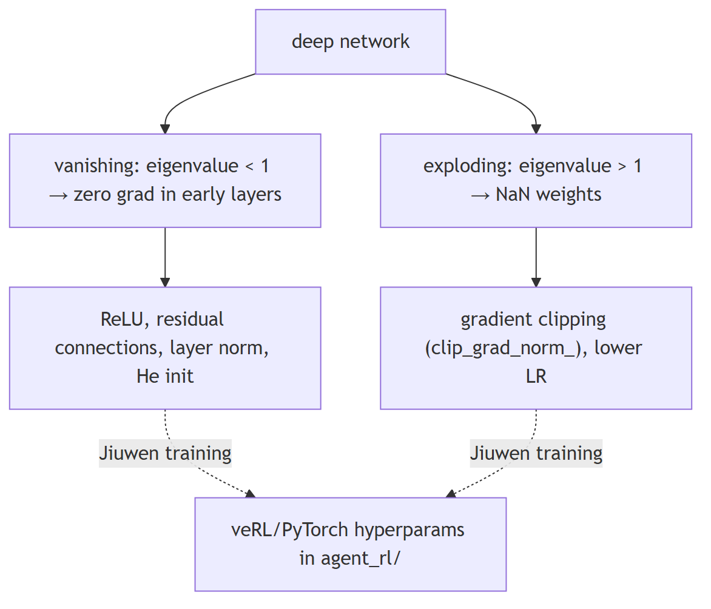

**In Jiuwen.** Gradient clipping is a training-side hyperparameter in agent_rl/ (veRL/PyTorch, clip_grad). At inference, hosted models handle architectural choices — residual connections, layer norm, initialisation — internally, so gradient stability is a training concern.

<b>Under the hood</b>

**Implementation**

Gradient clipping is a training-side hyperparameter in `agent_rl/` (veRL/PyTorch). At inference, hosted models handle it internally.

**Code anchors**

| Code anchor | What it points to |
|---|---|
| `agent-core/openjiuwen/agent_evolving/agent_rl/` | training hyperparams including gradient clip settings, delegated to veRL |

---

## 11. What is the difference between batch normalization and layer normalization?

Compare intermediate

**TL;DR.** Batch norm normalises over the batch dimension (good for CNNs); layer norm normalises over the feature dimension (standard in Transformers and LLMs).

**Key points.**

- BatchNorm: over batch dim; needs large batches; good for CNNs.
- LayerNorm: over feature dim; independent of batch size; standard in Transformers.
- Small batch or variable-length sequence? Always LayerNorm.
- Jiuwen: delegated to model architecture via AutoModelForCausalLM.

**Concept.** Batch normalisation normalises across the batch dimension — mean and variance computed over all examples in the batch, per feature. Requires a reasonable batch size for stable statistics. Effective in CNNs and feedforward networks; struggles with small batches, variable-length sequences, and batch size 1 at inference.

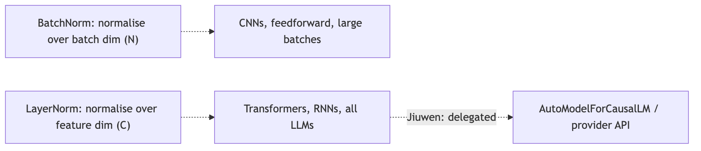

**In Jiuwen.** Normalization is part of the served model: hosted models apply it internally, and AutoModelForCausalLM.from_pretrained loads whatever norm the architecture specifies (layer norm for transformer LLMs). The only norm-adjacent config the framework forwards is attn_implementation and rope_scaling_type as HuggingFace/vLLM engine args.

<b>Under the hood</b>

**Implementation**

Batch/layer normalization is part of the served model: hosted models apply it internally, and local `AutoModelForCausalLM` uses whatever norm the architecture specifies. It is a model-layer concern, not a framework one.

**Code anchors**

| Code anchor | What it points to |
|---|---|
| `agent-core/openjiuwen/symphony/retrieval/llm/transformers_prefix_cached_generation/client.py:175` | AutoModelForCausalLM.from_pretrained; norm choice delegated to model architecture |

---

## 12. What is dropout, and why does it help generalisation?

Mechanism basic

**TL;DR.** Randomly zeroes activations with probability p during training, forcing distributed representations and acting as an ensemble of 2^n thinned networks.

**Key points.**

- Each neuron zeroed with probability p; inference scales by 1/(1-p).
- Prevents co-adaptation between neurons.
- Applied to attention weights, FFN, and embeddings in Transformers.
- LoRA dropout is a key regularisation knob for PEFT fine-tuning.

**Concept.** Dropout randomly zeroes each neuron's activation with probability `p` (typically 0.1–0.5) on each forward pass during training. At inference, dropout is disabled and activations are scaled by `1/(1-p)` (inverted dropout). Why it works: by randomly removing neurons, the network cannot co-adapt (learn to rely on specific neurons to compensate for each other's mistakes in a memorisation-specific way) and is forced to learn redundant, distributed representations. The effect is similar to training an ensemble of `2^n` thinned networks and averaging them at inference. In transformers, dropout is applied to attention weights, FFN layers, and embeddings. In LoRA fine-tuning, dropout on the low-rank matrices is a key regularisation knob.

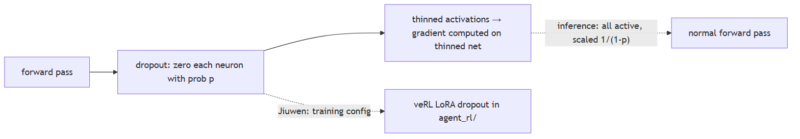

**In Jiuwen.** Dropout is a training-side hyperparameter: agent_rl/ forwards dropout rates to veRL/PyTorch, and for LoRA fine-tuning it is a PEFT adapter config parameter. At inference, models run with dropout disabled by default (standard inference mode).

<b>Under the hood</b>

**Implementation**

Dropout is a training-side hyperparameter: in `agent_rl/` it is forwarded to veRL/PyTorch, and for LoRA fine-tuning it is a PEFT adapter config parameter. At inference, the served model applies whatever dropout it was trained with.

**Code anchors**

| Code anchor | What it points to |
|---|---|
| `agent-core/openjiuwen/agent_evolving/agent_rl/` | dropout rate as a training hyperparameter forwarded to veRL |

---

## 13. What is the difference between CNNs and RNNs, and when would you use each?

Compare basic

**TL;DR.** CNNs use shared spatial filters (images, 1D signals); RNNs maintain a sequential hidden state (time series, variable-length text before Transformers).

**Key points.**

- CNN: translation-invariant, shared weights, efficient for grids.
- RNN/LSTM: sequential hidden state, order-aware, bottleneck on long sequences.
- Transformers replaced RNNs for text; CNNs dominate for images.
- Jiuwen: transformer-only at the model layer.

**Concept.** Convolutional Neural Networks (CNNs) apply learned filters spatially using shared weights — translation-invariant and efficient for structured grid data (images, audio spectrograms, 1D signals). Not designed for variable-length sequential dependencies. Recurrent Neural Networks (RNNs, LSTMs, GRUs) process sequences step by step, maintaining a hidden state. Designed for sequential data where order matters and length varies: time series, text (pre-transformer), audio frames. Weakness: the hidden state is a bottleneck for long sequences; vanishing gradients make long-range dependencies hard. Transformers have largely replaced RNNs for text because attention can directly attend to any position. CNNs remain dominant for image tasks.

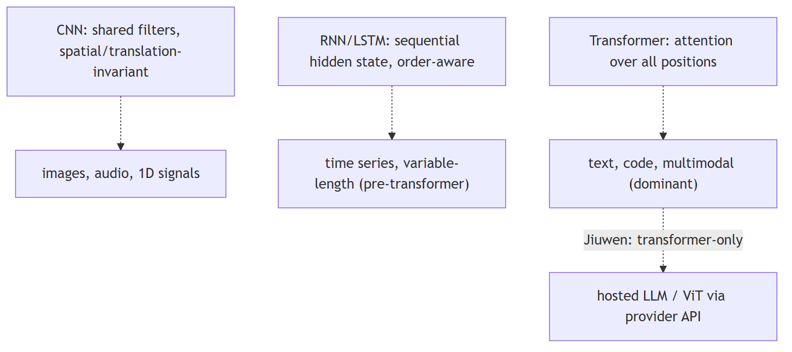

**In Jiuwen.** Neither CNNs nor RNNs are implemented in the framework. Text processing uses transformer-based LLMs via provider API or AutoModelForCausalLM. Image inputs in multimodal models use a vision encoder (typically a Vision Transformer applied to image patches, not a CNN) loaded by the provider. No RNN, LSTM, GRU, or CNN code exists in the codebase.

<b>Under the hood</b>

**Implementation**

These architectures live in the served models: text is handled by transformer LLMs via provider APIs, and image inputs by a vision encoder (typically a ViT) in multimodal models. The agent framework itself does not implement CNN or RNN layers.

**Code anchors**

| Code anchor | What it points to |
|---|---|
| `agent-core/openjiuwen/core/foundation/llm/model_clients/` | calls transformer-based LLMs; no CNN/RNN code |

---

## 14. What is transfer learning, and when is it useful?

Mechanism basic

**TL;DR.** Use a model trained on one task as the starting point for another — either freezing weights (feature extraction) or continuing to train them (fine-tuning).

**Key points.**

- Feature extraction: freeze pre-trained weights, train new head.
- Fine-tuning: continue training all or some pre-trained weights.
- Every use of a foundation model is transfer learning.
- Jiuwen: model clients = feature extraction; agent_rl/ = fine-tuning.

**Concept.** Transfer learning uses a model trained on one task or dataset as the starting point for a different but related task, rather than training from scratch. Two forms: (1) feature extraction — freeze pre-trained weights, train a new task-specific head; (2) fine-tuning — continue training all or some pre-trained weights on the new task's data. Useful almost always when labelled data for the target task is limited, when compute budget is constrained, or when source and target domains are related. In the LLM context, every use of a foundation model (GPT-4, LLaMA, Claude) is transfer learning. SFT and LoRA/PEFT are explicit transfer learning from a base model to a narrower task.

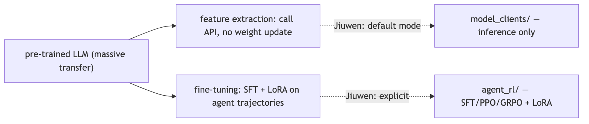

**In Jiuwen.** The framework is built entirely on transfer learning. The model clients call pre-trained LLMs for all reasoning — this is feature extraction, the base case of transfer learning. The agent_rl/ subsystem performs explicit fine-tuning (SFT + PPO/GRPO via veRL) — transfer learning from the base LLM to an agent-specific policy. LoRA adapters in agent_rl/ are the parameter-efficient variant. There is no from-scratch model training.

<b>Under the hood</b>

**Implementation**

The framework is built entirely on transfer learning. Model clients call pre-trained LLMs for all reasoning (feature extraction). `agent_rl/` performs fine-tuning (SFT + PPO/GRPO via veRL) — transfer learning from the base LLM to an agent-specific policy. LoRA adapters in `agent_rl/` are the parameter-efficient fine-tuning variant.

**Code anchors**

| Code anchor | What it points to |
|---|---|
| `agent-core/openjiuwen/core/foundation/llm/model_clients/` | feature extraction (calling pre-trained LLMs) |
| `agent-core/openjiuwen/agent_evolving/agent_rl/` | SFT + PPO/GRPO; explicit fine-tuning / transfer learning |

---

## 15. How do you evaluate a classification model beyond accuracy?

Mechanism basic

**TL;DR.** Accuracy is misleading on imbalanced data; use precision/recall/F1, confusion matrix, ROC-AUC, PR-AUC, and log loss for a complete picture.

**Key points.**

- Precision/Recall/F1: cost-weighted classification quality.
- Confusion matrix: reveals per-class error patterns.
- ROC-AUC: ranking quality, threshold-independent.
- PR-AUC: better than ROC-AUC for severely imbalanced data.

**Concept.** Accuracy is misleading on imbalanced datasets — a classifier that always predicts the majority class achieves 95% accuracy on a 95/5 split. Richer metrics:
- **Precision / Recall / F1** — precision = TP/(TP+FP); recall = TP/(TP+FN); F1 = harmonic mean. Precision matters when false positives are costly (spam filters); recall when false negatives are costly (cancer screening).
- **Confusion matrix** — reveals per-class error patterns and which classes are being confused.
- **ROC-AUC** — area under the ROC curve; measures ranking quality across all thresholds. Threshold-independent.
- **PR-AUC** — area under the Precision-Recall curve; better than ROC-AUC for severely imbalanced data.
- **Log loss / cross-entropy** — penalises confident wrong predictions; measures calibration.
- **Calibration curve** — do predicted probabilities reflect actual event rates?

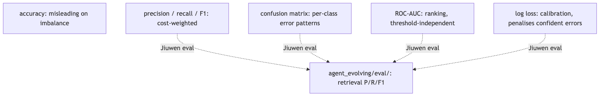

**In Jiuwen.** The evaluation harness under agent_evolving/evaluator/ provides ExactMatchMetric and LLMAsJudgeMetric (LLM-as-judge) rather than classification metrics. The one true classifier is AutoModelForSequenceClassification in the security/guardrail layer. ROC-AUC, PR-AUC, and calibration are not part of the framework.

<b>Under the hood</b>

**Implementation**

`agent_evolving/eval/` computes retrieval-level P/R/F1. Generation evaluation uses LLM-judge and NLI-model scores, not classification metrics. The one classifier in the framework is the guardrail (`AutoModelForSequenceClassification`), evaluated externally.

**Code anchors**

| Code anchor | What it points to |
|---|---|
| `agent-core/openjiuwen/agent_evolving/eval/` | P/R/F1 at retrieval level |
| `agent-core/openjiuwen/core/security/guardrail/backends.py` | AutoModelForSequenceClassification |

---

## 16. What is cross-validation, and why does it matter?

Mechanism basic

**TL;DR.** k-fold CV splits data into k folds and rotates the held-out set, producing a low-variance generalisation estimate that uses every sample.

**Key points.**

- Train on k-1 folds, evaluate on the held-out fold, repeat k times.
- Average of k scores is more reliable than a single split.
- Essential for honest hyperparameter tuning.
- Jiuwen: not implemented; evaluation uses a fixed held-out set.

**Concept.** Cross-validation estimates how well a model generalises when you have limited data. In k-fold CV: split data into k equal folds; train on k-1 folds and evaluate on the held-out fold; repeat k times rotating the held-out fold; average the k evaluation scores. The result is a low-variance generalisation estimate that uses every sample for both training and evaluation. Why it matters: a single train/test split gives a noisy estimate dependent on which examples landed in the test set. CV reduces that variance. Essential for honest hyperparameter tuning — tuning on a fixed held-out set leaks information and overfits the hyperparameters to that specific split. In the LLM context: rarely used on the full model (too expensive) but used when fine-tuning on small datasets via `agent_rl/`.

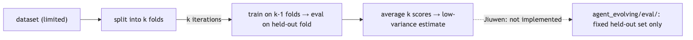

**In Jiuwen.** The evaluation harness (agent_evolving/eval/) runs on a fixed held-out set; k-fold cross-validation is left to users fine-tuning on small datasets via agent_rl/.

<b>Under the hood</b>

**Implementation**

Not present in the inference framework. The evaluation harness (`agent_evolving/eval/`) does not implement k-fold CV. Evaluation runs on a fixed held-out eval set. Cross-validation would be a concern for users fine-tuning on small datasets via `agent_rl/`.

**Code anchors**

| Code anchor | What it points to |
|---|---|
| `agent-core/openjiuwen/agent_evolving/eval/` | evaluation harness; fixed split, no CV |

---

## 17. What is overfitting, and how do you prevent it?

Mechanism basic

**TL;DR.** Overfitting: training loss falls but validation loss rises as the model memorises noise; prevent with more data, regularisation, early stopping, or reduced capacity.

**Key points.**

- Signal: train loss ↓, val loss ↑.
- Prevent: more data, L2/dropout regularisation, early stopping.
- For LLMs: LoRA reduces trainable parameters; monitor validation perplexity.
- Jiuwen SFT path has no held-out validation by default.

**Concept.** Overfitting occurs when a model learns the training data too well — including noise and idiosyncrasies — and fails to generalise to unseen examples. Training loss decreases but validation loss increases (the classic divergence signal). Prevention:
- **More data / augmentation** — the most reliable fix
- **Regularisation** — L2 (weight decay) penalises large weights; L1 encourages sparsity; dropout randomly zeroes activations
- **Early stopping** — stop when validation loss stops improving
- **Reduce model capacity** — smaller architecture or fewer fine-tuned parameters (LoRA)
- **Cross-validation** — ensures evaluation is not from a lucky split

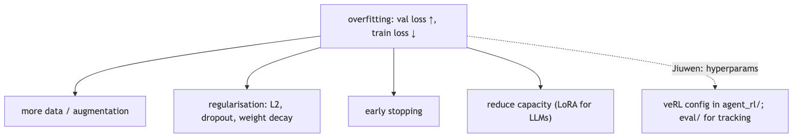

**In Jiuwen.** Not a concern in the inference framework. In agent_rl/, training hyperparameters that address overfitting — weight decay, dropout, epoch count, early stopping — are configuration parameters forwarded to veRL. The offline RL trainer has a real train/validation pipeline; the SFT path notably has no held-out validation (val_files: None, test_freq: -1, default 1 epoch). The evaluation harness in agent_evolving/eval/ tracks validation metrics to detect divergence.

<b>Under the hood</b>

**Implementation**

Not a concern in the inference framework. In `agent_rl/`, training hyperparameters (weight decay, dropout, early stopping via epoch limits) are configuration parameters forwarded to veRL. The offline RL trainer has real train/val validation pipeline; the SFT path notably has no held-out validation.

**Code anchors**

| Code anchor | What it points to |
|---|---|
| `agent-core/openjiuwen/agent_evolving/agent_rl/` | training hyperparams including weight decay, dropout, epoch limits |
| `agent-core/openjiuwen/agent_evolving/eval/` | validation metric tracking |

---

## 18. Why does the Transformer use multi-head attention instead of a single head?

Mechanism intermediate

**TL;DR.** Multiple heads run in parallel on lower-dimensional projections, each free to specialise on different relationship types simultaneously, with no extra compute cost.

**Key points.**

- Single head: one relationship type at a time.
- Multi-head: each head specialises (syntax, coreference, position, etc.).
- Same compute cost: d_model splits into h × d_k per head.
- Jiuwen: fully delegated to provider API / AutoModelForCausalLM.

**Concept.** A single attention head learns one type of relationship simultaneously — for example, syntactic dependency or positional proximity. Multiple heads run in parallel on lower-dimensional projections, each free to specialise on different relationship types: one head may track subject-verb agreement, another coreference, another relative position. Concatenating and projecting the outputs lets the model integrate all those signals. The compute cost is equivalent to one full-dimensional head (because `d_model` splits into `h × d_k` heads), but the representational expressivity is higher. Evidence: ablating individual heads degrades performance on different tasks depending on which head was removed.

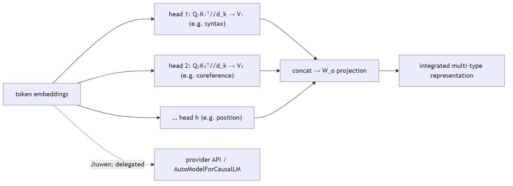

**In Jiuwen.** Multi-head attention is the served model's job — provider APIs or HuggingFace weights via AutoModelForCausalLM.from_pretrained. The framework exposes no number-of-heads configuration; this entry covers the architectural motivation for multiple heads.

<b>Under the hood</b>

**Implementation**

Multi-head attention is entirely the served model's job — provider APIs or HuggingFace weights loaded by name. The framework exposes no number-of-heads configuration; this entry covers the architectural motivation rather than the mechanics.

**Code anchors**

| Code anchor | What it points to |
|---|---|
| `agent-core/openjiuwen/core/foundation/llm/schema/config.py:13` | ProviderType; no head-count configuration |
| `agent-core/openjiuwen/symphony/retrieval/llm/transformers_prefix_cached_generation/client.py:175` | AutoModelForCausalLM.from_pretrained; architecture delegated |

---
