# LLM foundations

## 1. What's the difference between a token and a word?

Compare basic

**TL;DR.** A token is the model's atomic unit — usually a sub-word — so one word may be one or several tokens.

**Key points.**

- A token is the model's atomic input/output unit.
- One word can be several tokens; rare/long words and code fragment more.
- Tokenization explains character-level mistakes (miscounting letters).

**Concept.** A token is the model's atomic unit — typically a sub-word produced by a BPE/unigram vocabulary — so one word may be one or several tokens, and rare/long words and code fragment heavily. This is also why models miscount letters and struggle with character-level tasks.

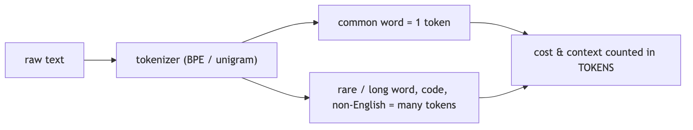

**In Jiuwen.** Jiuwen counts tokens, never words, via a pluggable TokenCounter: TiktokenCounter maps known model names to tiktoken encodings (with a cl100k_base fallback), and TiktokenModelCounter loads a model-native BPE vocabulary. TokenizerManager downloads the tokenizer artifacts per model/family.

<b>Under the hood</b>

**Implementation**

The framework counts **tokens**, never words, via a pluggable `TokenCounter`: `TiktokenCounter` maps known model names to tiktoken encodings (falling back to `cl100k_base` for unknown models), and `TiktokenModelCounter` loads a model-native BPE vocabulary. `TokenizerArtifactManager` (`core/context_engine/token/tokenizer_manager.py:23`) resolves and downloads HuggingFace/tiktoken artifacts per model/family.

**Implementation diagram**

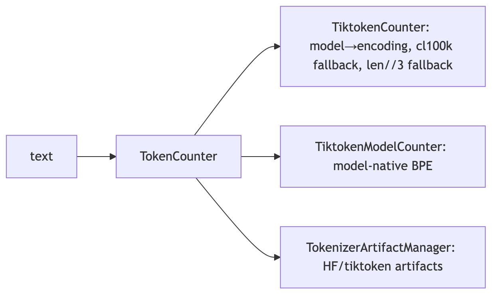

**Code anchors**

| Code anchor | What it points to |
|---|---|
| `agent-core/openjiuwen/core/context_engine/token/tiktoken_counter.py:212` | TiktokenCounter; :225 model→encoding map; :287 count() with len(text)//3 fallback |
| `agent-core/openjiuwen/core/context_engine/token/tiktoken_model_counter.py:86` | model-native tiktoken BPE |
| `agent-core/openjiuwen/core/context_engine/token/tokenizer_spec.py:34` | TokenizerSpec; :50 fallback policy chain |
| `agent-core/openjiuwen/core/context_engine/token/tokenizer_manager.py:23` | resolves/downloads tokenizer artifacts |

---

## 2. Why does tokenization affect cost and context limits

Mechanism intermediate

**TL;DR.** Cost and context are measured in tokens, not words — text that fragments more costs more and fills the window faster.

**Key points.**

- Cost and context are counted in tokens, not words.
- More fragmentation → more tokens → higher cost, faster window fill.
- Token counts also drive chunking and compaction thresholds.

**Concept.** Cost and context limits are measured in tokens, not words, so a language or domain that fragments more costs more per word and fills the window faster. The same token count drives when history must be compacted or tool output offloaded.

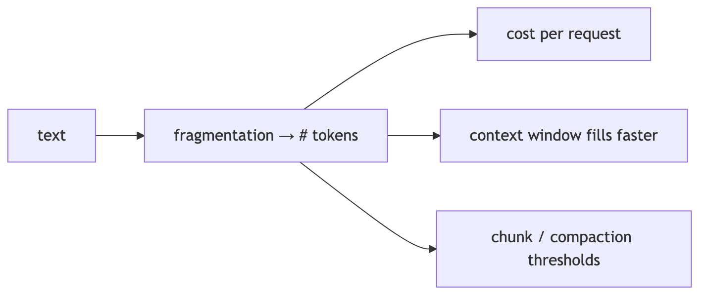

**In Jiuwen.** Token counts drive context limits (DEFAULT_CONTEXT_MAX_TOKENS = 200,000), compression/offload thresholds, and cost via provider-reported usage metadata (input/output/cache/reasoning tokens). Retrieval chunking is also token-based.

<b>Under the hood</b>

**Implementation**

Token counts drive per-model context limits (`MODEL_DEFAULT_CONTEXT_WINDOW_TOKENS`, default 200,000), compression/offload thresholds, and cost via provider-reported `usage_metadata` (`input_tokens`/`output_tokens`/cache/reasoning tokens). Retrieval chunking is also token-based.

**Implementation diagram**

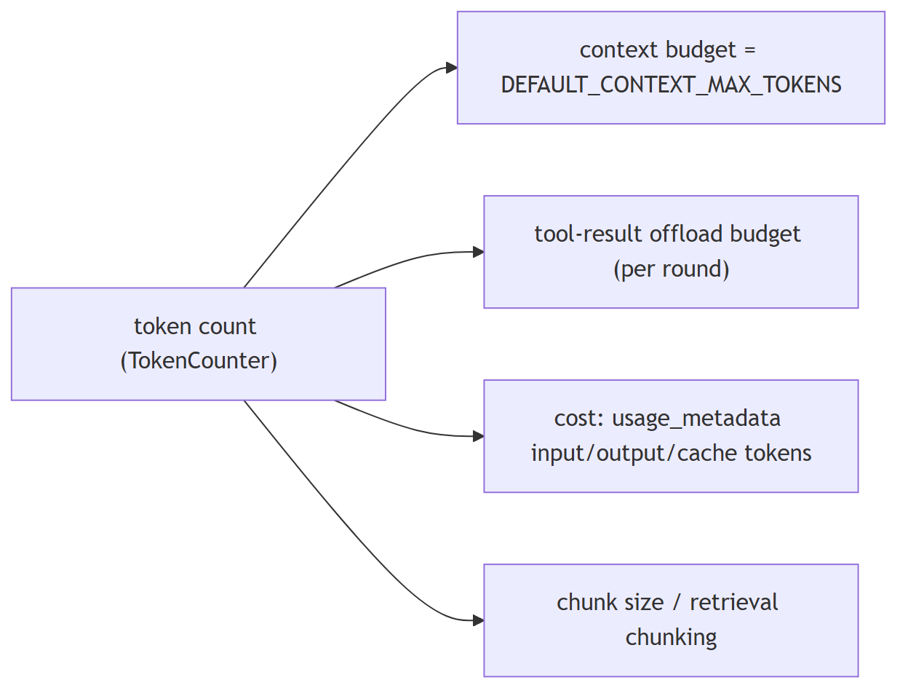

**Code anchors**

| Code anchor | What it points to |
|---|---|
| `agent-core/openjiuwen/core/context_engine/context/context_utils.py:20` | DEFAULT_CONTEXT_MAX_TOKENS = 200000 |
| `agent-core/openjiuwen/core/context_engine/processor/offloader/tool_result_budget_processor.py:34` | per-round token budget |
| `agent-core/openjiuwen/core/context_engine/token/tiktoken_counter.py:287` | count() drives limits/cost |
| `agent-core/openjiuwen/core/foundation/llm/schema/message.py:28` | total_tokens usage metadata |

---

## 3. What is the difference between tokens and embeddings?

Compare basic

**TL;DR.** Tokens are the discrete input/output units; embeddings are continuous vectors that encode meaning for similarity search.

**Key points.**

- Tokens: discrete sub-word units, bounded vocabulary, drive cost/limits.
- Embeddings: dense vectors in a semantic space, used for similarity.
- You embed chunks (token sequences), but they are different abstractions.

**Concept.** A token is a unit of text (a sub-word piece) — the input/output alphabet of the model. An embedding is a vector representation of text that encodes meaning, used for similarity search. Tokens are discrete and count against cost/context; embeddings are continuous and live in a vector space. You embed chunks/tokens, but they are different abstractions.

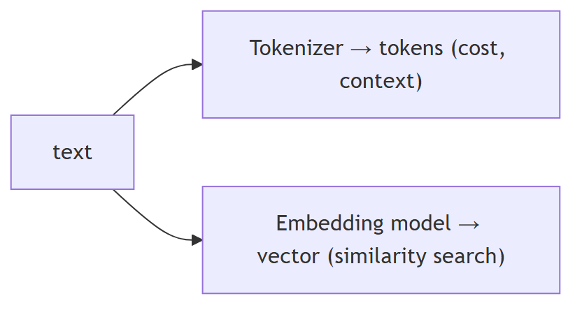

**In Jiuwen.** Tokens and embeddings are handled by two separate subsystems. A tokenizer counts tokens and drives context/cost limits; a separate embedding provider turns text into vectors that are stored and compared in a vector index. Which tokenizer you use sets chunk sizes, and which embedding model you use sets vector dimensions — the two are chosen independently.

<b>Under the hood</b>

**Implementation**

Tokens are counted by a pluggable `TokenCounter` (an ABC; the tiktoken-backed `TiktokenCounter` drives limits/cost); embeddings are produced by the `Embedding` ABC and compared in a vector store. The two are independent: the tokenizer sets chunk sizes, the embedder sets vector dimension.

**Code anchors**

| Code anchor | What it points to |
|---|---|
| `agent-core/openjiuwen/core/context_engine/token/tiktoken_counter.py:212` | TiktokenCounter; :287 fallback |
| `agent-core/openjiuwen/core/foundation/store/base_embedding.py:24` | Embedding ABC; :30 embed_query |
| `agent-core/openjiuwen/core/retrieval/indexing/indexer/embed_chunks.py:46` | embed_documents |

---

## 4. Explain how self-attention works in a transformer

Mechanism intermediate

**TL;DR.** Each token builds a context-aware representation by attending to every other token, weighting them by query–key similarity.

**Key points.**

- Q/K/V projections; scores = Q·Kᵀ/√d_k; softmax → weights; weighted sum of V.
- Multiple heads capture different relationships in parallel.
- Permutation-equivariant: order comes from positional encoding, not attention.
- Stacked layers build increasingly abstract context.

**Concept.** Each token is projected into three vectors — query, key, value. The query of a token is dot-producted with the keys of all tokens (scaled by `1/√d_k`), softmaxed into attention weights, and used to take a weighted sum of the values. Doing this with multiple heads in parallel and stacking layers lets each token aggregate information from every other token, with the weights computed from content rather than position. The result is a context-dependent representation per token.

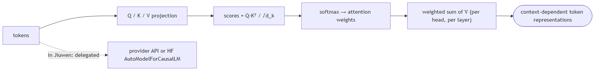

**In Jiuwen.** Jiuwen does not implement attention itself — it delegates to hosted models or to HuggingFace models loaded by name. Its boundary is the model-client/config layer, which builds request parameters and sends them to a provider; when running a local model it loads a causal language model and consumes the returned logits. Attention lives in the model, not in this codebase.

<b>Under the hood</b>

**Implementation**

Attention is the served model's job: provider APIs or HuggingFace models loaded by name. The framework's boundary is the model-client/config layer, which serializes request params, sends them to a provider, and (for the local `transformers` client) calls `AutoModelForCausalLM` and consumes the logits. The only `torch.softmax` in the framework is for token sampling, not attention.

**Code anchors**

| Code anchor | What it points to |
|---|---|
| `agent-core/openjiuwen/core/foundation/llm/schema/config.py:13` | ProviderType enum: the model-client provider boundary, no architecture logic |
| `agent-core/openjiuwen/core/foundation/llm/model_clients/openai_model_client.py:1491` | builds hosted request params, delegates computation |
| `agent-core/openjiuwen/symphony/retrieval/llm/transformers_logit_selection/client.py:227` | torch.no_grad() forward; logit extraction only, no attention code |
| `agent-core/openjiuwen/symphony/retrieval/llm/transformers_prefix_cached_generation/client.py:175` | AutoModelForCausalLM.from_pretrained(...); attention delegated |
| `agent-core/openjiuwen/symphony/retrieval/llm/transformers_prefix_cached_generation/generation.py:527` | torch.softmax(...) is sampling, not attention |

---

## 5. What is positional encoding, and why do transformers need it if attention has no inherent sense of order

Mechanism basic

**TL;DR.** Attention is order-blind, so a position signal must be injected — added to embeddings (sinusoidal/learned) or applied as a rotation to Q/K (RoPE).

**Key points.**

- Without it, 'dog bites man' and 'man bites dog' are indistinguishable.
- Sinusoidal/learned: add a position vector to token embeddings.
- RoPE: rotate Q/K inside attention to encode relative position.
- Modern LLMs mostly use RoPE variants.

**Concept.** Self-attention is permutation-equivariant — without positional information it cannot distinguish token order, so "dog bites man" and "man bites dog" yield the same multiset of token representations, only reordered (not one identical output). Positional encoding injects order information — by adding a position-dependent signal to the token representations (sinusoidal/learned), or by rotating the query and key vectors inside attention (RoPE) — so the attention scores can depend on relative or absolute position. Without it the model cannot know sequence order.

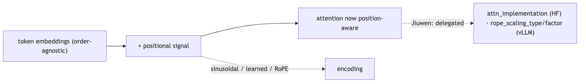

**In Jiuwen.** There is no positional-encoding code here — it lives inside the model. Jiuwen only passes through the relevant knobs: an attention-implementation hint for HuggingFace, and RoPE scaling options for the vLLM engine. Any position ids you see in the RL data pipeline are just batching/padding metadata.

<b>Under the hood</b>

**Implementation**

Positional encoding is the served model's job. The framework only passes related engine settings through: `attn_implementation` to HuggingFace, and `rope_scaling_type`/`rope_scaling_factor` as vLLM engine args. In the RL data pipeline, `position_ids` are computed for padded training batches — batching metadata, not an encoding scheme.

**Code anchors**

| Code anchor | What it points to |
|---|---|
| `agent-core/openjiuwen/symphony/retrieval/llm/config.py:88` | attn_implementation: str = "" (HF passthrough) |
| `agent-core/openjiuwen/symphony/retrieval/llm/transformers_prefix_cached_generation/client.py:171` | model_kwargs["attn_implementation"] |
| `agent-core/openjiuwen/symphony/retrieval/search/service/serving.py:42` | rope_scaling_type / rope_scaling_factor vLLM defaults |
| `agent-core/openjiuwen/symphony/retrieval/llm/vllm/client.py:584` | rope scaling passed through |
| `agent-core/openjiuwen/agent_evolving/agent_rl/offline/coordinator/batch_builder.py:175` | position_ids from cumsum(attention_mask) (padding metadata) |

---

## 6. What's the difference between an encoder-only, decoder-only, and encoder-decoder model, and where does GPT fit

Compare basic

**TL;DR.** Encoder-only reads bidirectionally for understanding; decoder-only generates left-to-right; encoder-decoder maps one sequence to another. GPT is decoder-only.

**Key points.**

- Encoder-only (BERT): bidirectional; classification, embeddings, extraction.
- Decoder-only (GPT): autoregressive; generation.
- Encoder-decoder (T5): input→output tasks such as translation.

**Concept.** Encoder-only models (BERT) read bidirectional context and produce representations — good for classification, embedding, extraction. Decoder-only models (GPT) are autoregressive: they predict the next token attending only leftward, which makes them generators. Encoder-decoder models (T5, original Transformer) encode an input and generate an output, suited to translation/summarization. GPT is decoder-only.

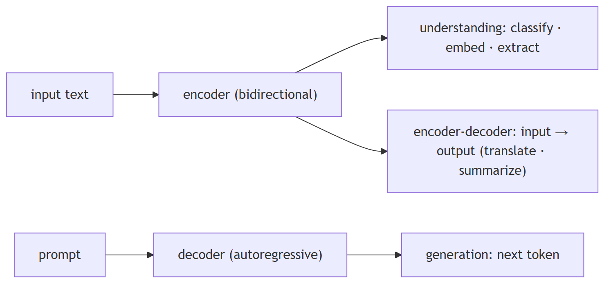

**In Jiuwen.** Jiuwen does not classify models as encoder or decoder. Behavior is chosen by provider and by the model-name string. The two HuggingFace loaders it uses reveal intent: causal generation loads a decoder language model, while guardrail classification loads a sequence-classification model (encoder-style). GPT is treated simply as a provider/model name.

<b>Under the hood</b>

**Implementation**

Architecture type is selected by model/provider choice rather than a config flag, no `is_encoder_decoder`/`is_decoder` flag, and no encoder/decoder classification. Behavior is selected by **provider type** and **model-name string** (model-family patterns also drive reasoning/thinking wire protocols and tokenizer selection). The two HuggingFace classes named in the repo imply the intent: causal generation uses `AutoModelForCausalLM` (decoder-only), and guardrail classification uses `AutoModelForSequenceClassification` (typically an encoder-style classifier). GPT is handled purely as a provider/model name.

**Implementation diagram**

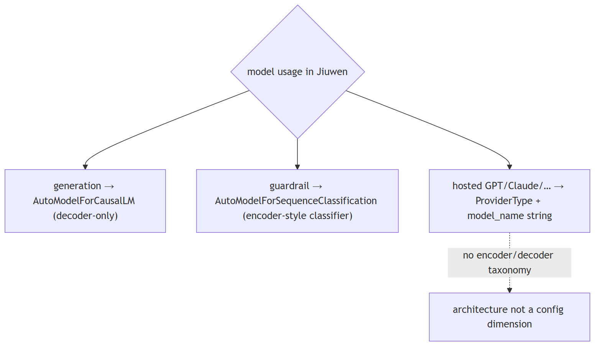

**Code anchors**

| Code anchor | What it points to |
|---|---|
| `agent-core/openjiuwen/core/foundation/llm/schema/config.py:13` | ProviderType; architecture is not a config dimension |
| `agent-core/openjiuwen/core/foundation/llm/reasoning_profiles.py:100` | model-family patterns used for reasoning-protocol selection (not architecture) |
| `agent-core/openjiuwen/core/security/guardrail/backends.py:445` | AutoModelForSequenceClassification |
| `agent-core/openjiuwen/core/security/guardrail/builtin.py:174` | model_type limited to None \| "bert" \| "qwen" |
| `agent-core/openjiuwen/symphony/retrieval/llm/transformers_prefix_cached_generation/client.py:175` | AutoModelForCausalLM (decoder-only) |
| `agent-core/openjiuwen/symphony/retrieval/search/service/serving.py:35` | vLLM architectures string |

---

## 7. What's the difference between a model's context window and its training data cutoff

Compare basic

**TL;DR.** The context window is a per-call capacity limit; the training cutoff is a knowledge-date limit. A big window does not make the model current.

**Key points.**

- Window = max tokens attended in one call (capacity).
- Cutoff = date after which the model has no knowledge (temporal).
- Fitting a document does not mean the model knows post-cutoff facts.

**Concept.** The context window is how many tokens the model can attend to at once (a capacity limit). The training data cutoff is the date after which the model has no knowledge (a temporal limit). A model can have a large window but an old cutoff — it can read a long document you paste but still not know events after its training date. Confusing the two leads to expecting up-to-date answers from a frozen model.

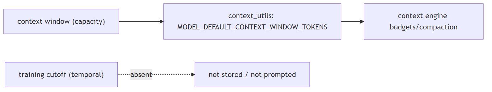

**In Jiuwen.** Jiuwen tracks operational metadata only: model name, provider, context-window size, output cap, and endpoint/auth. It resolves a window size per model but never stores or exposes a training cutoff or knowledge date, so it cannot distinguish 'the model does not know this' from 'it does not fit the window'.

<b>Under the hood</b>

**Implementation**

Model metadata here is operational only: model name, provider, context-window token counts, output `max_tokens`, auth/endpoint. The context engine resolves a window size per model but never stores, prompts, or exposes a training-data cutoff or knowledge date. Nothing distinguishes "the model does not know X" from "the window does not fit X".

**Code anchors**

| Code anchor | What it points to |
|---|---|
| `agent-core/openjiuwen/core/context_engine/context/context_utils.py:29` | builtin window table; :275 fetch_openrouter_model_context_window_tokens() (window only) |
| `agent-core/openjiuwen/core/context_engine/schema/config.py:137` | model_name; :139 model_context_window_tokens |
| `agent-core/openjiuwen/core/foundation/llm/schema/config.py:209` | model_name; :214 max_tokens (output cap) |
| `agent-core/openjiuwen/core/foundation/llm/schema/generation_response.py:20` | created timestamp (response, not cutoff) |

---

## 8. What happens when a conversation exceeds the model's context window

Mechanism intermediate

**TL;DR.** Either the provider rejects the request or you must shrink the prompt first — drop old turns, offload big tool outputs, or summarize.

**Key points.**

- Pre-empt: count tokens and budget before sending.
- Truncate oldest history but preserve recent turns.
- Offload large tool results and summarize old turns into memory.
- Otherwise the call is rejected or silently truncated.

**Concept.** Either the provider rejects the request, or the framework must shrink the prompt before sending. Robust systems pre-empt it: count tokens, then drop/truncate oldest history, offload large tool outputs, and/or summarize old turns into a compact memory block, always preserving recent turns. The goal is to keep the prompt within budget without losing the information needed for the next step.

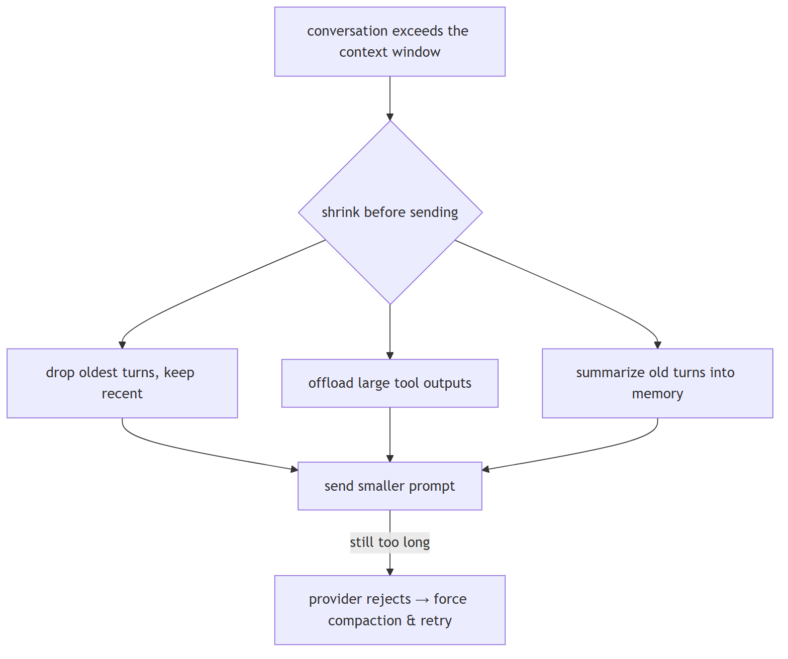

**In Jiuwen.** On each turn Jiuwen counts tokens with a model-aware tokenizer and trims proactively: large tool results are offloaded to disk and replaced with short previews, and older history is compressed once it crosses ratio or token thresholds. If the provider still rejects the request as too long, it detects the overflow, forces compaction, and retries only if the context actually changed; a hard message-count cap is the last resort.

<b>Under the hood</b>

**Implementation**

On every `add_messages`/`get_context_window`, the context engine counts tokens with a model-aware tokenizer and runs passive processors: offloaders persist oversized tool results to `{workspace}/context/{session_id}_context/offload/` and replace them with `<persisted-output>` previews, while compressors trigger at ratio/token thresholds (`RoundLevelCompressor` at 0.9×budget, `FullCompactProcessor` at 180k) and rewrite history into summary/memory blocks. If the model still rejects the request, `ContextEngine.recover_from_model_exception` matches overflow phrases, force-runs compaction, and retries only if context actually changed. A hard `max_context_message_num` provides a last-resort FIFO drop. `effective_context_budget` is the strictest positive bound across configured window, per-call budget, and resolved model window.

**Implementation diagram**

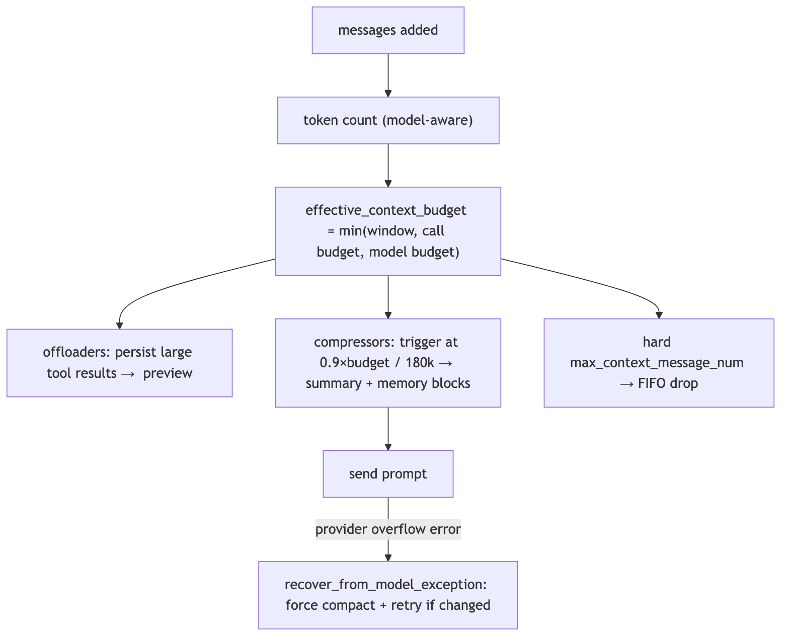

**Code anchors**

| Code anchor | What it points to |
|---|---|
| `agent-core/openjiuwen/core/context_engine/context/context_utils.py:20` | DEFAULT_CONTEXT_MAX_TOKENS = 200000; :404 resolve_context_max(); :29 per-model window table |
| `agent-core/openjiuwen/core/context_engine/processor/budget_guard.py:37` | effective_context_budget() = min of budgets |
| `agent-core/openjiuwen/core/context_engine/context/message_buffer.py:71` | _if_need_resize() drops oldest beyond 2× |
| `agent-core/openjiuwen/core/context_engine/processor/compressor/round_level_compressor.py:104` | trigger_context_ratio=0.9; :1159 _trigger_token_threshold() |
| `agent-core/openjiuwen/core/context_engine/processor/compressor/full_compact_processor.py:184` | trigger_total_tokens=180000; :194 messages_to_keep=10 |
| `agent-core/openjiuwen/core/context_engine/context_engine.py:372` | recover_from_model_exception() |
| `agent-core/openjiuwen/core/context_engine/processor/offloader/tool_result_budget_processor.py:34` | per-round tokens_threshold=50000; agent-core/openjiuwen/core/context_engine/processor/offloader/message_offloader.py:45 tokens_threshold=20000 |

---

## 9. Why does model performance sometimes degrade with very long context, even when the context fits

Mechanism basic

**TL;DR.** Attention spreads thinner over more tokens and models use the middle poorly ('lost in the middle'), so a bigger context is not automatically better.

**Key points.**

- Signal dilution grows with context length.
- Primacy/recency bias: the start and end are used best.
- Distractor content can override instructions.
- Mitigate with retrieval, reranking, and ordering.

**Concept.** Attention spreads over more tokens, diluting the signal for any one of them, and models are empirically better at using information at the beginning and end of the context than in the middle ("lost in the middle"). Irrelevant long context also introduces distractors and can override instructions. Fitting the window is necessary but not sufficient; relevance and ordering matter too.

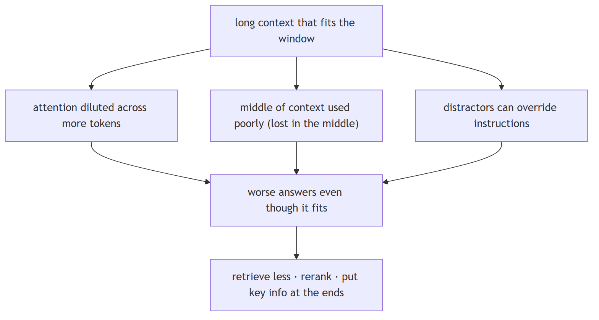

**In Jiuwen.** Jiuwen has no explicit 'lost in the middle' handling. Instead it keeps prompts small and favors recent content: compressors keep the newest messages, offloaders keep only the most recent tool results, and truncation preserves the head and tail rather than only the front. When enabled, an optional mode archives replaced messages and can re-surface the relevant ones using keyword search.

<b>Under the hood</b>

**Implementation**

The system keeps the window small and biases toward recency, and it preserves the middle when trimming: Compressors protect a newest-message tail (`keep_recent_messages`, `messages_to_keep`, `keep_last_round`), offloaders keep only the newest K results, and truncation helpers preserve head + tail (one also keeps a middle slice) rather than only a prefix. When enabled, `CompressionRecallConfig` archives replaced messages in overlapping token chunks and a two-stage BM25 retriever can re-surface relevant archived chunks by query — the closest thing to relevance-based long-context handling.

**Implementation diagram**

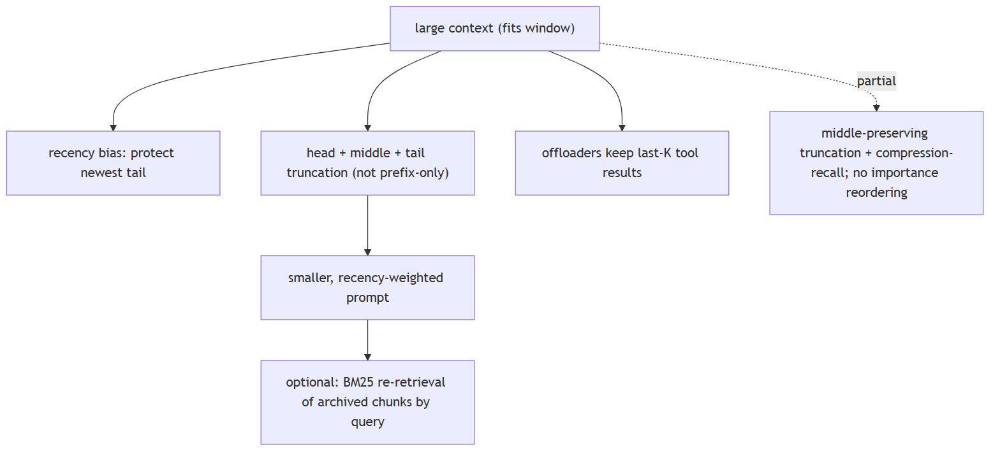

**Code anchors**

| Code anchor | What it points to |
|---|---|
| `agent-core/openjiuwen/core/context_engine/processor/compressor/round_level_compressor.py:119` | keep_recent_messages; :1088 _build_head_tail_truncated_text(); :112 target_total_tokens=160000 |
| `agent-core/openjiuwen/core/context_engine/processor/compressor/full_compact_processor.py:194` | messages_to_keep=10 |
| `agent-core/openjiuwen/core/context_engine/processor/offloader/message_offloader.py:63` | keep_last_round=True |
| `agent-core/openjiuwen/core/context_engine/processor/offloader/message_summary_offloader.py:697` | _smart_truncate_content() head/middle/tail |
| `agent-core/openjiuwen/core/context_engine/processor/budget_guard.py:114` | _build_head_tail() |
| `agent-core/openjiuwen/core/context_engine/processor/forked/compressor/recall/archive.py:48` | archive in 3000-token chunks / 300 overlap; agent-core/openjiuwen/core/context_engine/processor/forked/compressor/recall/retriever.py:27 BM25 recall_compressed_context() |

---

## 10. What does temperature actually control, mathematically, in the output distribution

Mechanism basic

**TL;DR.** Temperature rescales logits before softmax: near 0 is greedy and deterministic; higher flattens the distribution for diversity. It never changes which tokens are possible.

**Key points.**

- softmax(z/T); T = 1 leaves the model's raw distribution unchanged.
- T → 0 collapses toward argmax; T > 1 flattens.
- Only relative probabilities change; the token set stays the same.
- Use T = 0 for extraction/classification, higher for creative work.

**Concept.** The model produces logits `z_i` for the next token. Temperature `T` rescales them: `softmax(z_i / T)`. As `T → 0` the distribution collapses toward the argmax (greedy/deterministic); as `T` rises the distribution flattens, increasing diversity and the chance of lower-probability tokens. `T = 1` leaves the model's raw distribution unchanged. It does not change which tokens are possible, only their relative probabilities.

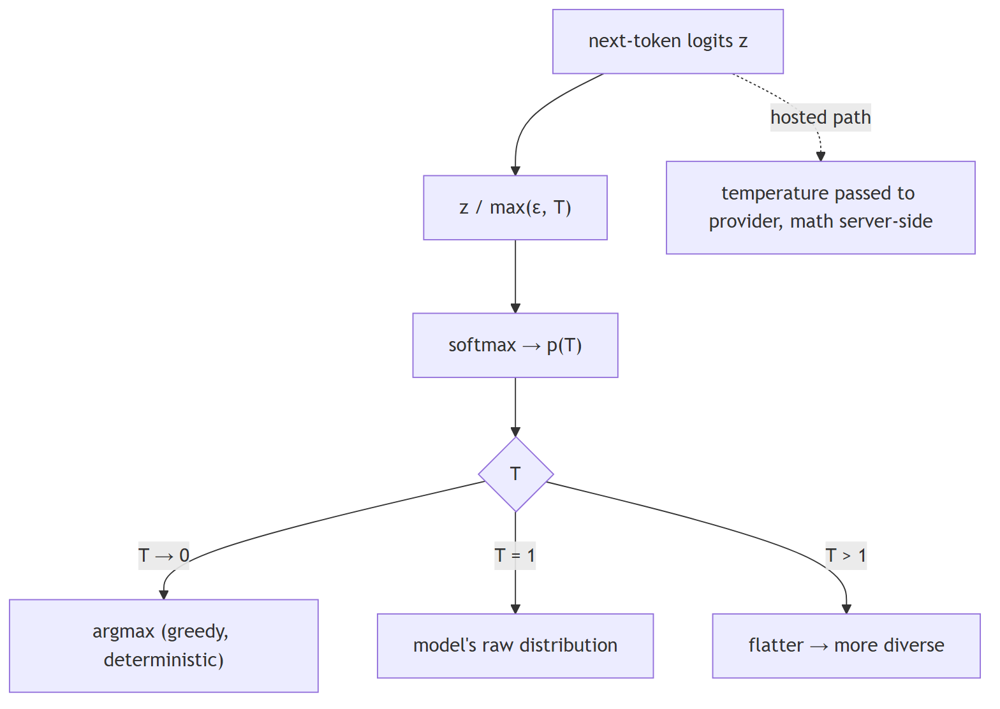

**In Jiuwen.** Temperature is mostly passed through to the provider, which does the math, and is also implemented for local models. At the client layer it defaults to unset and is added only when you specify it, and your request-level value overrides the config. Hosted quirks are handled: some OpenAI-style endpoints keep only one of temperature/top-p, and Anthropic routes sampling differently. Locally it divides logits by temperature and falls back to greedy at zero, with a default of 0.

<b>Under the hood</b>

**Implementation**

Temperature is a **passthrough request parameter** — hosted APIs apply the math — with a local implementation on the HF/vLLM path. At the core client layer `temperature`/`top_p` default to `None` and are added only when set; request-level args override `ModelRequestConfig`. OpenAI-compatible calls targeting `openai.com` keep only one of temperature/top_p (temperature wins, top_p dropped); Anthropic routes sampling through `extra_body` and drops `top_p` when temperature is explicitly set. The local sampler divides logits by temperature and softmaxes, with `T <= 0` falling back to argmax. The local `GenerationConfig` default is `temperature=0.0`.

**Code anchors**

| Code anchor | What it points to |
|---|---|
| `agent-core/openjiuwen/core/foundation/llm/schema/config.py:210` | temperature: Optional[float] = None |
| `agent-core/openjiuwen/core/foundation/llm/model_clients/base_model_client.py:556` | final_temperature = ...; added only when not None |
| `agent-core/openjiuwen/core/foundation/llm/model_clients/openai_model_client.py:944` | drops top_p when temperature present (openai.com) |
| `agent-core/openjiuwen/core/foundation/llm/model_clients/anthropic_model_client.py:929` | temperature via extra_body; drops top_p if both set |
| `agent-core/openjiuwen/symphony/retrieval/llm/transformers_prefix_cached_generation/generation.py:516` | scores = next_token_logits / max(1e-6, temperature) |
| `agent-core/openjiuwen/symphony/retrieval/llm/base/types.py:60` | GenerationConfig.temperature: float = 0.0 |

---

## 11. What's the difference between top-k sampling and top-p (nucleus) sampling

Compare basic

**TL;DR.** Both truncate the distribution before sampling: top-k keeps a fixed k tokens; top-p keeps the smallest set reaching cumulative probability p (adaptive).

**Key points.**

- Top-k: fixed candidate count regardless of confidence.
- Top-p: adaptive — few tokens when peaked, many when flat.
- Often combined; top-p usually adapts better.

**Concept.** Both truncate the next-token distribution before sampling. Top-k keeps the `k` most probable tokens and renormalizes — a fixed candidate count regardless of how peaked the distribution is. Top-p keeps the smallest set of tokens whose cumulative probability reaches `p` — an adaptive count: few tokens when the model is confident, many when it is flat. Top-p usually adapts better; they are often combined.

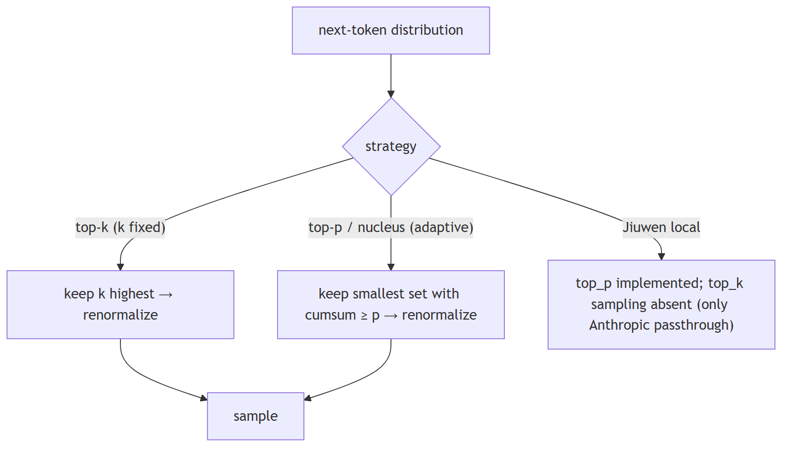

**In Jiuwen.** Jiuwen implements top-p (nucleus) sampling locally and does not implement top-k sampling — there is simply no top-k field for generation. The local sampler keeps the smallest set of tokens reaching the target cumulative probability, renormalizes, and samples. Hosted models receive top-p normally, and Anthropic also accepts top-k if you pass it. Note the codebase reuses the name 'top-k' elsewhere for retrieval counts and other unrelated things, not sampling.

<b>Under the hood</b>

**Implementation**

Top-p (nucleus) is implemented locally; top-k sampling is not. `GenerationConfig` exposes `top_p` (default `1.0`) but has no top-k sampling field. The local sampler sorts scores, masks tokens beyond the cumulative `top_p`, re-softmaxes, and multinomial-samples; `top_p == 1.0` samples the full distribution. Hosted providers receive `top_p` in the normal body; Anthropic additionally forwards `top_k` via `extra_body` if present. Note three unrelated `top_k` meanings in the codebase that are **not** LLM sampling: retrieval result count, trie-constraint allowed outputs, and logit-selection candidate scoring.

**Code anchors**

| Code anchor | What it points to |
|---|---|
| `agent-core/openjiuwen/symphony/retrieval/llm/base/types.py:61` | GenerationConfig.top_p: float = 1.0; no top_k sampling field |
| `agent-core/openjiuwen/symphony/retrieval/llm/transformers_prefix_cached_generation/generation.py:517` | nucleus top_p truncation; :534 full-distribution softmax when top_p ∉ (0,1) |
| `agent-core/openjiuwen/core/foundation/llm/model_clients/base_model_client.py:561` | top_p resolved/passed |
| `agent-core/openjiuwen/core/foundation/llm/model_clients/anthropic_model_client.py:936` | top_p via extra_body; :940 top_k forwarded if present |
| `agent-core/openjiuwen/core/foundation/llm/schema/config.py:213` | top_p: Optional[float] = None (no top_k) |
| `agent-core/openjiuwen/symphony/retrieval/llm/base/types.py:40` | TrieConstraint.top_k (allowed outputs, not sampling) |

---

## 12. Why does greedy decoding sometimes produce worse output than sampling-based decoding

Mechanism basic

**TL;DR.** Greedy is locally optimal but can lock into repetitive or bland text; sampling explores alternatives for more natural output. Use greedy when there's one right answer.

**Key points.**

- Greedy = argmax each step; it cannot recover from one bad choice.
- Sampling adds diversity and naturalness.
- Extraction/classification → greedy; open-ended → sampling.

**Concept.** Greedy picks the single highest-probability token each step. That is locally optimal but not globally: it can lock into repetitive, degenerate, or bland sequences, and it cannot recover from one early bad choice. Sampling explores alternatives, which often yields more natural and diverse text; a moderate temperature with top-p is a common default. For tasks with a single correct answer (extraction, classification), greedy/`T=0` is usually preferred.

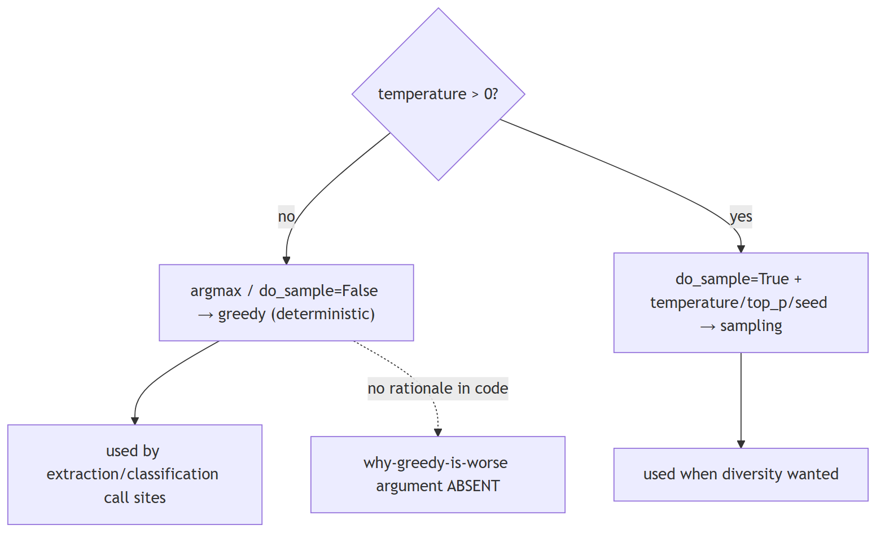

**In Jiuwen.** Greedy decoding is what you get at temperature zero: the local sampler returns the single highest-probability token and disables sampling. Because the local default temperature is 0, greedy is the default. Many internal call sites deliberately use temperature 0 for deterministic extraction/classification and switch to sampling when temperature is above zero. Tellingly, the code treats this purely as a determinism switch — there is no reasoning anywhere about why greedy can produce worse text.

<b>Under the hood</b>

**Implementation**

Greedy is implemented but not argued. The local sampler returns `argmax` when `temperature <= 0.0`, and the generate path sets `do_sample=False` in that branch; since `GenerationConfig` defaults to `temperature=0.0`, the local default is greedy. Many framework call sites deliberately pass `temperature=0.0` for deterministic extraction/classification, while sampling is enabled (`do_sample=True`, temperature/top_p/seed) when temperature > 0. There is **no** comment, doc, or code discussion explaining why greedy can be worse than sampling — the choice is treated purely as a determinism knob.

**Code anchors**

| Code anchor | What it points to |
|---|---|
| `agent-core/openjiuwen/symphony/retrieval/llm/transformers_prefix_cached_generation/generation.py:514` | if temperature <= 0.0: return int(torch.argmax(...)) |
| `agent-core/openjiuwen/symphony/retrieval/llm/transformers_prefix_cached_generation/generation.py:335` | do_sample=True when temperature > 0; :344 do_sample=False |
| `agent-core/openjiuwen/symphony/retrieval/llm/base/types.py:60` | default temperature = 0.0 ⇒ local default greedy |
| `agent-core/openjiuwen/agent_evolving/agent_rl/rl_trainer/verl_executor.py:185` | remax_input.meta_info["do_sample"] = False (REMAX baseline, not an exploit path) |
| `agent-core/openjiuwen/core/retrieval/indexing/processor/extractor/triple_extractor.py:31` | constructor default temperature=0.0 |

---

## 13. Why do LLMs struggle with tasks like counting or basic arithmetic

Mechanism intermediate

**TL;DR.** Models see tokens, not characters or digits, and never learn a carry algorithm — so exact math is unreliable and should be delegated to a tool.

**Key points.**

- BPE hides characters, so letter counting fails.
- Multi-digit arithmetic requires carrying, which is not learned reliably.
- Fix it with tool use (calculator/code), not a bigger prompt.

**Concept.** The model operates on tokens, not characters or digits-as-numbers; counting letters requires character-level reasoning that BPE hides, and multi-digit arithmetic requires carrying/positional algorithms that are error-prone to learn implicitly. Models also have no scratchpad guarantee unless asked to show work. The reliable fix is tool use — call a calculator or run code — rather than expecting the forward pass to do exact math.

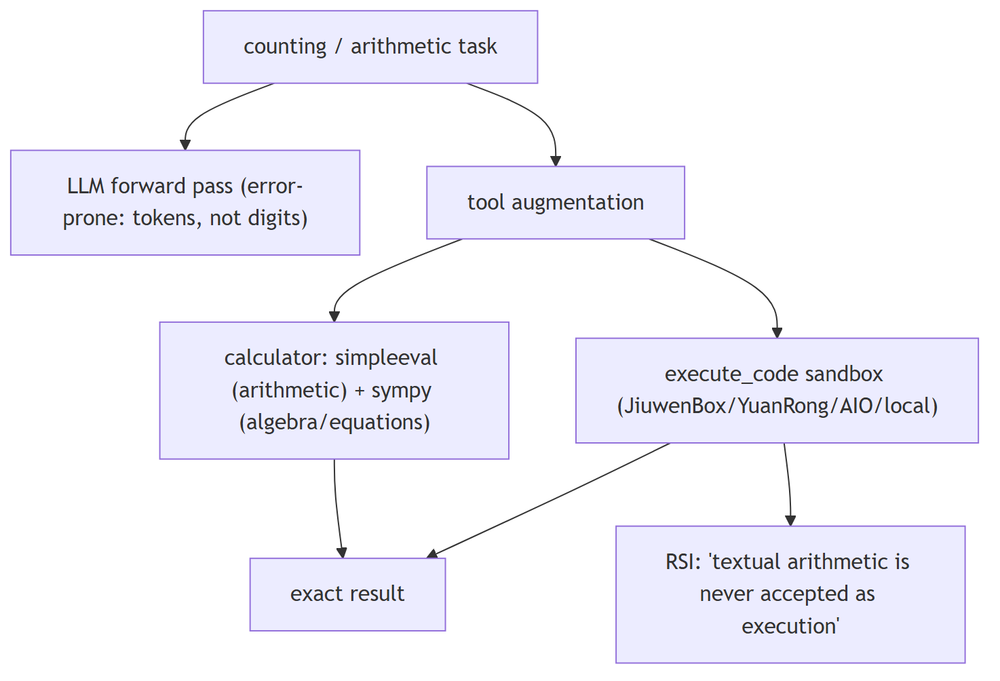

**In Jiuwen.** Jiuwen treats math as a tool problem. A canonical example teaches an agent to call a calculator tool (arithmetic via a safe evaluator, algebra via a symbolic library), and the prompt walks it through the steps. More generally, agents can run code in a sandbox to do math and logic. The repo's evaluation code even encodes the rule that 'textual arithmetic is never accepted as execution' — results must come from real execution.

<b>Under the hood</b>

**Implementation**

The repo frames arithmetic/counting as a tool-augmentation problem. A canonical example trains a DeepAgent to call a `calculator` tool that evaluates arithmetic via `simpleeval` and solves/simplifies algebra/equations via `sympy`; the system prompt explicitly instructs tool use step by step. More generally, an `execute_code` sandbox operation (JiuwenBox/YuanRong/AIO providers plus a local provider) lets agents run code for math/logic. The RSI evidence analyzer encodes the principle "textual arithmetic is never accepted as execution" — verification must come from actual code execution.

**Code anchors**

| Code anchor | What it points to |
|---|---|
| `agent-core/examples/rl_calculator/tools.py:11-14` | @tool(name="calculator"); :15-85 simple_eval + sympy |
| `agent-core/examples/rl_calculator/prompts.py:7-16` | "Use the calculator tool … step by step" |
| `agent-core/openjiuwen/core/sys_operation/code.py:16-49` | execute_code sys-operation |
| `agent-core/openjiuwen/extensions/sys_operation/sandbox/providers/jiuwenbox.py:2927` | sandbox execute_code |
| `agent-core/openjiuwen/rsi/harness_rsi/evaluation_result_analyzer/evidence_investigation.py:200` | "textual arithmetic is never accepted as execution" |

---

## 14. What is hallucination, and why does it happen even in a well-trained model

Mechanism basic

**TL;DR.** Hallucination is fluent but unsupported output, caused by optimizing next-token likelihood rather than truth. Mitigate with grounding, verification, and abstention.

**Key points.**

- Objective is plausibility, not factuality; there is no built-in fact store.
- Generalized patterns fabricate specifics confidently.
- Mitigations: retrieval/citations, verification, constrained formats, abstention.
- It is a property of the objective, not a bug you patch in the weights.

**Concept.** Hallucination is fluent output that is not grounded in fact or in the provided context. It arises because the objective is next-token likelihood, not truth: the model optimizes plausibility, has no built-in fact database, generalizes patterns that sometimes fabricate specifics, and cannot reliably know the boundary of its own knowledge. Mitigations are grounding (retrieval/citations), verification, constrained formats, and abstention — not a property of the weights you can simply "fix".

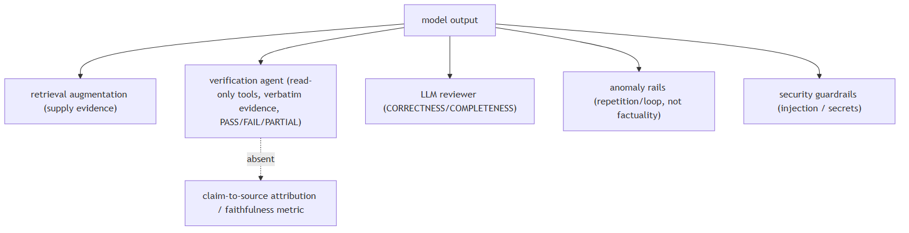

**In Jiuwen.** Jiuwen does not try to detect hallucination inside the model; it provides mitigations around it: retrieval infrastructure to supply evidence; a verification agent limited to read-only/command tools that must show real command output and give a PASS/FAIL/PARTIAL verdict; an LLM reviewer that scores correctness and completeness; anomaly detection for degenerate repetition/loops (not false claims); and security guardrails. There is no claim-to-source attribution checker.

<b>Under the hood</b>

**Implementation**

The repo does not model or detect low-level hallucination; it implements downstream mitigations: (1) retrieval-augmentation infrastructure to supply evidence; (2) a dedicated **verification agent** restricted to read-only/command tools that must show verbatim command output with a PASS/FAIL/PARTIAL verdict; (3) an LLM quality reviewer scoring CORRECTNESS/COMPLETENESS; (4) model-anomaly rails that catch degenerate repetition/loops (not false claims); and (5) security guardrails/sanitization for injection and secret leakage. There is no claim-to-source attribution checker.

**Code anchors**

| Code anchor | What it points to |
|---|---|
| `agent-core/openjiuwen/harness/rails/model_anomaly_detection_rail.py:110-117` | repeated stream output / timeouts / tool-call loops (degeneracy, not factual errors) |
| `agent-core/openjiuwen/harness/rails/subagent/verification_rail.py:92-108` | VerificationRail tool allowlist; :165-196 blocks disallowed tools, requires evidence |
| `agent-core/openjiuwen/agent_teams/verification/reviewer.py:127` | VerificationReviewer (LLM reviewer, correctness/completeness) |
| `agent-core/openjiuwen/core/security/guardrail/backends.py:39-80` | guardrail detection backends; agent-core/openjiuwen/core/security/guardrail/context.py:115-202 confidence thresholds → risk levels |
| `agent-core/openjiuwen/harness/tools/web/paid_search.py:221-222` | extracts citation URLs (no claim linkage) |
| `agent-core/openjiuwen/agent_evolving/tools/skill.py:284` | "then cite only the refs you actually read" |

---

## 15. What's the difference between the model being "wrong" and the model being "uncertain," and can you tell the difference from the output alone

Compare basic

**TL;DR.** They are independent axes: a model can be confidently wrong or rightly unsure, and surface text does not reveal calibration.

**Key points.**

- Wrong = factually incorrect; uncertain = low confidence in the distribution.
- Fluent text carries no calibrated confidence.
- Approximations — logprobs, entropy, self-consistency — are all imperfect.
- Abstention only helps if it correlates with being wrong.

**Concept.** Wrong means the answer is factually incorrect; uncertain means the model's distribution is not confident, which may still yield a correct or incorrect answer. They are independent: a model can be confidently wrong, or rightly unsure. From the surface text alone you generally cannot tell — fluent text carries no calibrated confidence. Token log-probabilities, entropy, or self-consistency/vote checking can approximate uncertainty, but they are imperfect and need calibration; abstention only helps if it correlates with being wrong.

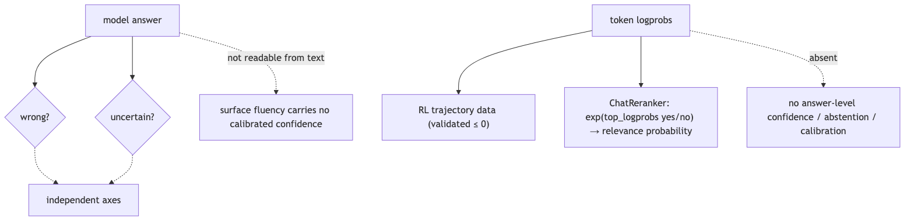

**In Jiuwen.** Jiuwen captures token log-probabilities but does not turn them into an uncertainty or 'I do not know' signal for normal answers. Logprobs are collected for RL training and used in one specific spot — a reranker that reads the 'yes'/'no' logprobs to make a binary relevance call. Retrieval has its own abstain token, but that is about whether to return a document, not whether the answer is uncertain. There is no calibrated confidence threshold and no abstention on ordinary answers.

<b>Under the hood</b>

**Implementation**

The repo collects token **logprobs** but does not expose an uncertainty/abstention signal on ordinary agent answers. `ReactAgent` can request `logprobs`/`top_logprobs`, captured into canonical RL trajectory spans and validated (must be ≤ 0) for RL training. `ChatReranker` uses them for one specific binary decision: it exponentiates the top-logprobs of "yes"/"no" and normalizes to a relevance probability. The retrieval subsystem has an explicit abstain token ("0"), but that is retrieval-selection abstention, not output uncertainty. There is no confidence threshold at which an agent says "I don't know," and no calibration.

**Code anchors**

| Code anchor | What it points to |
|---|---|
| `agent-core/openjiuwen/core/retrieval/reranker/chat_reranker.py:83-107` | exp(logprob) yes/no → normalized confidence; :134-141 logprobs=True, top_logprobs=5, yes/no logit bias |
| `agent-core/openjiuwen/core/single_agent/agents/react_agent.py:294-303` | llm_logprobs/llm_top_logprobs; :1622-1624 passes to model call |
| `agent-core/openjiuwen/agent_evolving/agent_rl/online/capture_pipeline.py:404-427` | parses per-token logprobs, rejects > 0 |
| `agent-core/openjiuwen/agent_evolving/trajectory/schema.py:36-47` | RL_LOGPROBS; agent-core/openjiuwen/agent_evolving/trajectory/spans.py:849-873 — read_rl_fields |
| `agent-core/openjiuwen/symphony/retrieval/search/runtime/selector.py:305-315` | is_abstain from output token "0" (retrieval only) |

---

## 16. "How does the model know X" is really testing context window understanding

Claim intermediate

**Claim, not a question.** The heading is an assertion about what these questions probe; the notes below assess whether it holds.

**TL;DR.** 'How does the model know X' is really testing context-window understanding.

**Key points.**

- Strictest-bound budget.
- Offload large tool results.
- Multi-stage compaction.
- FIFO drop beyond message cap.

**Concept.** This claim is largely true: the useful thing to assess is what is actually inside the context window at generation time, not the model's stored knowledge; the one qualification is that the same question can also probe retrieval when the context is fetched. why the model forgot something earlier, why it mixed up two similar entities, why longer context degrades output — all trace back to what is actually inside the context window at generation time and how attention weights it. Reason about context *contents*, not model capability: name what is in the window (system prompt, retained turns, retrieved chunks, tool results) and what got dropped/compacted/offloaded; explain positional/attention dilution (lost in the middle); and for entity mix-ups, point at missing entity disambiguation or too-similar surface forms.

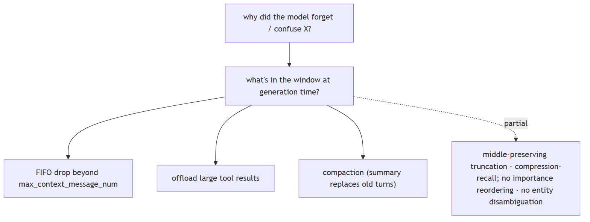

**In Jiuwen.** The context engine decides what is in the window and how it is trimmed: a strictest-bound budget, offload of large tool results, multi-stage compaction, and a FIFO drop beyond the max context message count, all biased toward the newest turns.

<b>Under the hood</b>

**Implementation**

The context engine decides what is in the window and how it is trimmed: a strictest-bound budget, offload of large tool results, multi-stage compaction, and a FIFO drop beyond `max_context_message_num`, all biased toward the newest turns. Truncation keeps head + middle + tail rather than only a prefix, and compression-recall can re-surface archived chunks; there is no separate importance-reordering step, and entity disambiguation/aliasing is not implemented.

**Code anchors**

| Code anchor | What it points to |
|---|---|
| `agent-core/openjiuwen/core/context_engine/context/context_utils.py:20/404` | window resolution |
| `agent-core/openjiuwen/core/context_engine/processor/budget_guard.py:37` | effective_context_budget (strictest) |
| `agent-core/openjiuwen/core/context_engine/context/message_buffer.py:71` | FIFO drop |
| `agent-core/openjiuwen/core/context_engine/processor/offloader/tool_result_budget_processor.py:34` | offload threshold |
| `agent-core/openjiuwen/core/context_engine/processor/compressor/full_compact_processor.py:184` | compaction |

---

## 17. What was BERT's key contribution, and why did the pretrain-then-finetune paradigm change everything?

Mechanism basic

**TL;DR.** BERT introduced bidirectional MLM pretraining and made pretrain-then-finetune the standard NLP template.

**Key points.**

- Masked language model (MLM): randomly mask 15% of tokens, train to predict them — forces bidirectional context
- Unlike GPT's left-to-right autoregressive objective, MLM produces richer contextual representations
- Pretrain-then-finetune: one large pretrained encoder + thin task head + small labeled dataset = replaces per-task training
- Template became the foundation of transfer learning for NLP and beyond
- Jiuwen: BERT-family models appear as frozen embedding encoders and finetuned classifiers (guardrail)

**Concept.** BERT (Devlin et al. 2018) made two contributions. First, the **masked language model (MLM)** pretraining objective: randomly mask 15% of input tokens and train the model to predict them. Unlike GPT's left-to-right objective, MLM forces the model to attend to both left and right context simultaneously — producing richer bidirectional representations. Second, and more broadly important, it demonstrated the **pretrain-then-finetune paradigm** at scale: pretrain one large encoder on unlabeled text, then add a thin task-specific head and finetune on a small labeled dataset. This template — one general pretrained model, many downstream tasks — replaced the prior approach of training a separate model per task and became the foundation of modern transfer learning for NLP and beyond.

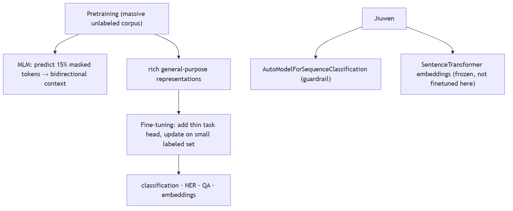

**In Jiuwen.** BERT-family models appear in two roles: (1) AutoModelForSequenceClassification (agent-core/openjiuwen/core/security/guardrail/backends.py:445) as a finetuned classifier for GuardrailRail; model_type accepts 'bert' (builtin.py:174). (2) SentenceTransformerEmbedding (agent-core/openjiuwen/core/retrieval/embedding/sentence_transformer_embedding.py:1) as frozen pretrained encoder for document embeddings — no finetune path in the KB pipeline. The SFT path in agent_rl/ covers decoder-only generation models only.

<b>Under the hood</b>

**Implementation**

BERT-family models appear only as an encoder classifier for the guardrail framework: `LocalModelBackend._load_model` loads `AutoModelForSequenceClassification` (`core/security/guardrail/backends.py:445`), parsed by `BertBinaryParser` (`core/security/guardrail/context.py:106`). Jiuwen does not use BERT as a frozen embedding encoder; document embeddings come from API/sentence-transformer embedders. Fine-tuning under `agent_evolving/agent_rl/` targets decoder-only models, not BERT encoders.

**Code anchors**

| Code anchor | What it points to |
|---|---|
| `agent-core/openjiuwen/core/security/guardrail/backends.py:445` | AutoModelForSequenceClassification (finetuned BERT-family) |
| `agent-core/openjiuwen/core/security/guardrail/builtin.py:174` | model_type accepts "bert" |
| `agent-core/openjiuwen/symphony/experience/embed.py:64` | EmbeddingClient (local sentence-transformers; not a BERT encoder) |
| `agent-core/openjiuwen/agent_evolving/agent_rl/online/backends/sft/trainer.py:44` | finetune stage (decoder-only models) |

---

## 18. What is in-context learning, and why was GPT-3 the paper that established it?

Mechanism basic

**TL;DR.** ICL — performing a task from prompt examples without weight update — emerges at scale; GPT-3 established this at 175B.

**Key points.**

- In-context learning (ICL): model performs a task from examples in the prompt with no weight update
- GPT-3 (175B) showed few-shot accuracy approaching fine-tuned baselines; smaller GPT versions did not
- Mechanism: diverse pretraining implicitly teaches pattern recognition from prefix sequences
- Practical implication: prompting became the primary interface for using LLMs, not per-task fine-tuning
- Jiuwen gap: no retrieval-augmented ICL (no system selects similar few-shot examples per query)

**Concept.** In-context learning (ICL) is the ability of a large language model to perform a new task from examples placed directly in the prompt — **without any weight update**. GPT-3 (Brown et al. 2020, 175B parameters) demonstrated that this capability emerges at scale: smaller GPT versions showed weak few-shot performance, but at 175B, few-shot accuracy on many benchmarks approached fine-tuned baselines. The mechanism: pretraining on diverse text implicitly teaches the model to recognize task patterns from prefix sequences; a few in-context examples "activate" the relevant completion behavior at inference time. The practical implication: prompting became the primary interface for steering LLMs, not per-task fine-tuning — changing how practitioners think about deploying models.

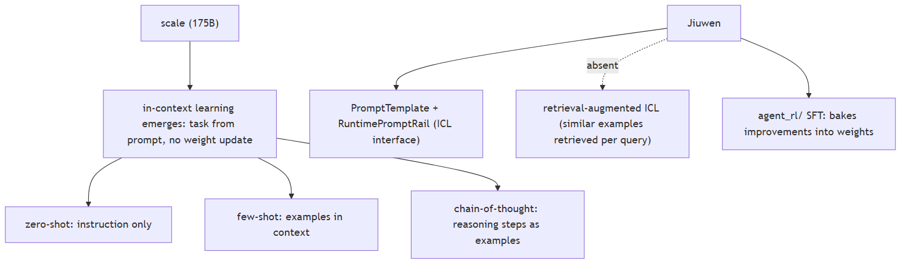

**In Jiuwen.** RuntimePromptRail (agent-core/openjiuwen/harness/rails/runtime_prompt_rail.py:1) and PromptTemplate/PromptSection (agent-core/openjiuwen/harness/prompts/template.py:1) are the ICL interface — few-shot examples and instructions are injected as prompt sections. The SFT path in agent_rl/online/backends/sft/trainer.py:1 bakes improvements into weights (weight-update path, reducing reliance on ICL). No retrieval-augmented ICL: there is no system that selects similar demonstrations by query similarity to include in context.

<b>Under the hood</b>

**Implementation**

Prompt construction is the inference-time interface for ICL: `PromptTemplate` (`core/foundation/prompt/template.py:14`) and prompt sections (`PromptSection`, `core/single_agent/prompts/builder.py:24`), with system/dynamic prompt state assembled by `RuntimePromptRail` (`jiuwenswarm/jiuwenswarm/agents/harness/common/rails/runtime_prompt_rail.py:39`). Few-shot examples are placed in the prompt by the caller; there is no demonstration retrieval (no system selects the most relevant few-shot examples by similarity to the query). SFT under `agent_evolving/agent_rl/` instead bakes improvements into weights. There is no demonstration retrieval (no system that selects the most relevant few-shot examples by similarity to the current query — so-called "retrieval-augmented ICL").

**Code anchors**

| Code anchor | What it points to |
|---|---|
| `agent-core/openjiuwen/core/foundation/prompt/template.py:1` | PromptTemplate / PromptSection |
| `jiuwenswarm/jiuwenswarm/agents/harness/common/rails/runtime_prompt_rail.py:39` | RuntimePromptRail (dynamic prompt state) |
| `agent-core/openjiuwen/agent_evolving/agent_rl/online/backends/sft/trainer.py:44` | SFT (weight update path) |

---

## 19. What did the Chinchilla paper change about how we train large models?

Mechanism intermediate

**TL;DR.** Compute-optimal training is ~20 tokens per parameter; most large models (GPT-3, Gopher) were undertrained.

**Key points.**

- Empirical finding: for a fixed compute budget, scale model size and training tokens roughly equally (~20 tokens/param)
- GPT-3 (175B, 300B tokens) and Gopher (280B, 300B tokens) were undertrained relative to their size
- Chinchilla (70B, 1.4T tokens) outperformed Gopher (280B) despite being 4× smaller
- Takeaway: for fixed compute, prefer a smaller model trained on more data
- Jiuwen: pretraining is out of scope; Chinchilla-aware decisions (which base model, how much SFT data) are operator-level

**Concept.** Hoffmann et al. 2022 (DeepMind) systematically varied parameter count and training token budget across hundreds of runs to find the **compute-optimal** configuration: for a given FLOPs budget, roughly **20 training tokens per parameter** is optimal. Prior large models (GPT-3 175B trained on ~300B tokens, Gopher 280B on 300B tokens) were **undertrained** — they had too many parameters for the data they saw. Chinchilla (70B parameters, trained on 1.4T tokens) outperformed Gopher (280B) despite being 4× smaller, because the data budget matched the parameter count. Practically: for a fixed compute budget, you should prefer a smaller model trained on more data over a larger model trained on less. This reframed the scaling law debate — data matters as much as parameters.

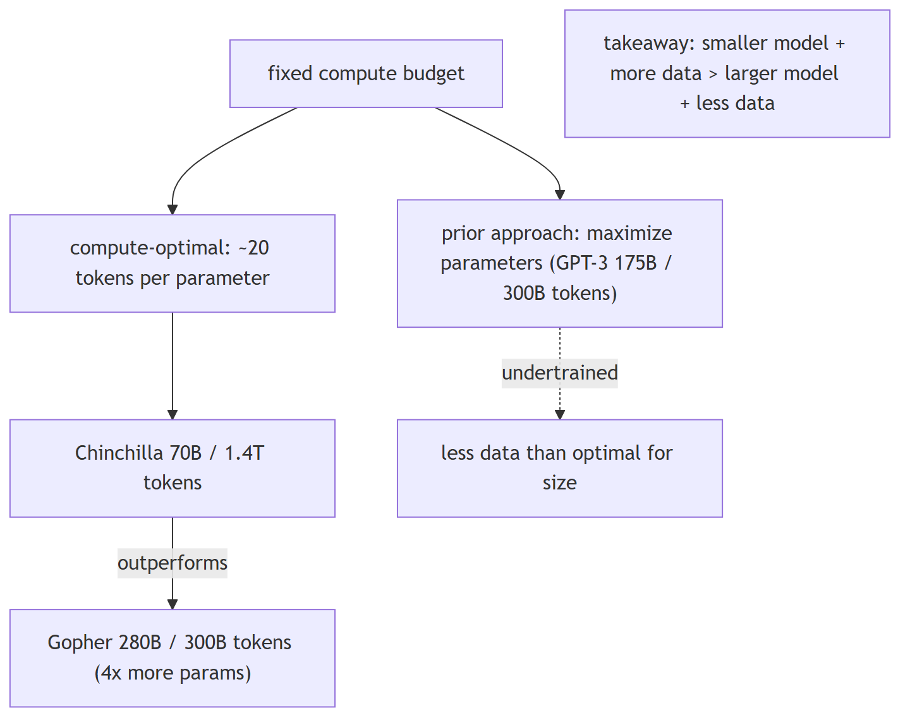

**In Jiuwen.** Pretraining is out of scope. agent_rl/ handles SFT (stage 1) and RL fine-tuning (stages 2-3) starting from a fixed pre-trained base model (agent-core/openjiuwen/agent_evolving/agent_rl/online/backends/sft/trainer.py:1 and offline_config.py:1). Chinchilla-aware decisions — which base model to select, how much SFT data to collect relative to model size — are human/operator choices. No compute-optimal token budget calculator or data-to-parameter ratio check exists in the codebase.

<b>Under the hood</b>

**Implementation**

Pretraining is outside the framework's scope. The SFT and RL fine-tuning paths in `agent_rl/` use a fixed pre-trained base model. Chinchilla-aware decisions — which base model to select, how much SFT data to collect relative to model size — are human/operator-level choices, not framework policy. There is no compute-optimal token budget calculator or data-to-parameter ratio check.

**Code anchors**

| Code anchor | What it points to |
|---|---|
| `agent-core/openjiuwen/agent_evolving/agent_rl/online/backends/sft/trainer.py:44` | SFT uses fixed base model (no pretraining) |
| `agent-core/openjiuwen/agent_evolving/agent_rl/config/offline_config.py:220` | offline RL config (no data-to-parameter ratio policy) |

---

## 20. What is FlashAttention and why does it matter for building long-context systems?

Mechanism intermediate

**TL;DR.** FlashAttention tiles attention into SRAM to avoid materializing the NxN matrix, giving O(N) memory and enabling 32k–1M context.

**Key points.**

- Standard attention: O(N²) HBM memory — the full NxN attention matrix is written to GPU memory
- FlashAttention: tiles computation into SRAM blocks, never writes the full matrix — O(N) memory, 2-4× faster
- Enables practical long-context training and inference (32k, 128k, 1M tokens)
- Used by default in modern LLMs and serving frameworks (vLLM, TRT-LLM)
- Jiuwen manages long context at application level (offloading, compaction); FlashAttention is the serving infrastructure layer

**Concept.** Standard self-attention materializes an N×N attention matrix in GPU high-bandwidth memory (HBM), giving O(N²) memory complexity in sequence length N. FlashAttention (Dao et al. 2022) is **IO-aware**: it tiles the computation into blocks that fit in the faster on-chip SRAM, computing attention without ever writing the full NxN matrix to HBM. Result: **O(N) memory** (the matrix is never materialized), 2–4× faster wall-clock time for typical sequence lengths, and practical training/inference at 32k–1M tokens. Without FlashAttention (or equivalent — xFormers, Flex Attention), training on sequences longer than ~8k tokens was memory-prohibitive. Most modern LLMs and inference servers (vLLM, TRT-LLM) use it by default. For practitioners: FlashAttention is why long-context models exist, and why "does this serving framework support FlashAttention?" is a production question.

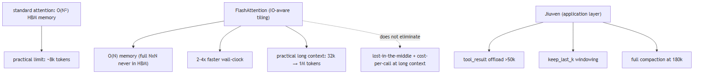

**In Jiuwen.** FlashAttention is an infrastructure concern handled by the serving layer: vLLM (agent-core/openjiuwen/symphony/retrieval/llm/transformers_prefix_cached_generation/client.py:175) enables it in the backend. Jiuwen manages long context at the application level: tool_result_budget_processor.py:34 offloads tool results >50k tokens; tool_result_window_processor.py keep_last_k=3; full_compact_processor.py:184 compacts at 180k. These application guards are necessary even with FlashAttention because cost per call and lost-in-the-middle effects remain.

<b>Under the hood</b>

**Implementation**

FlashAttention is handled at the infrastructure layer below the framework — by the base model weights and the serving backend (vLLM in `symphony/retrieval/llm/`). Jiuwen manages long context at the **application** level: tool-result offloading (>50k tokens), `keep_last_k` windowing, and LLM-based compaction at 180k tokens. These application-level guards are necessary even with FlashAttention because attention still degrades at very long contexts (lost-in-the-middle, cost per call) regardless of the memory technique.

**Code anchors**

| Code anchor | What it points to |
|---|---|
| `agent-core/openjiuwen/symphony/retrieval/llm/transformers_prefix_cached_generation/client.py:175` | vLLM-backed serving (FlashAttention enabled by vLLM, not by framework) |
| `agent-core/openjiuwen/core/context_engine/processor/offloader/tool_result_budget_processor.py:34` | 50k offload |
| `agent-core/openjiuwen/core/context_engine/processor/compressor/full_compact_processor.py:184` | 180k compaction |

---

## 21. What is Mixture of Experts (MoE), and how does Switch Transformers show it scales capacity without proportional compute?

Mechanism intermediate

**TL;DR.** MoE activates only k of N expert networks per token — scaling total parameters without proportional FLOPs.

**Key points.**

- Dense FFN: every token processed by every parameter → FLOPs ∝ total parameters
- MoE FFN: N experts + learned router activates k (1–2) per token → FLOPs ≈ k-expert dense, total params = N×k
- Switch Transformers (k=1): 1.6T-parameter model at ~same FLOPs as dense 7B; 4× speedup over T5-XXL
- Practitioner implication: a 47B MoE model (e.g. Mixtral 8×7B, ~13B active) has far lower inference FLOPs than a 47B dense model
- Jiuwen: model architecture is opaque (selected by name/provider string); no MoE-aware routing or expert metadata

**Concept.** In a standard dense Transformer, every token passes through every parameter in every layer. **Mixture of Experts** replaces each feed-forward sublayer with N expert networks plus a learned **router** that activates only k of them (typically k=1 or 2) per token. Total parameter count is N×(expert size), but FLOPs per token stay ~constant because only k experts are active. Switch Transformers (Fedus et al. 2021) simplified routing to k=1 and showed a 1.6T-parameter model can be trained at roughly the same FLOPs as a dense 7B model at the same training step — a 4× speed improvement over T5-XXL. Modern MoE deployments: Mixtral 8×7B (active params ~13B out of 47B total), Gemini 1.0 Ultra, Grok-1. Practitioner implication: a model's **total parameter count overstates its compute cost** for MoE architectures — a 47B MoE is not a 47B dense model in terms of inference FLOPs.

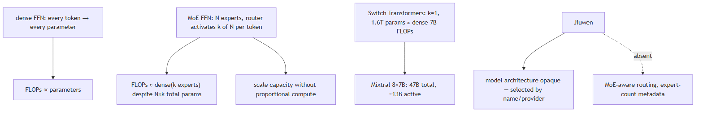

**In Jiuwen.** Model architecture (dense vs MoE) is fully opaque to the framework. ModelPoolEntry (agent-core/openjiuwen/agent_teams/models/pool.py:38) and allocators (allocator.py:559) handle endpoint distribution by availability (round-robin, by-model-name, IntelliRouter by rate). No MoE-aware routing, expert count metadata, or active-parameter tracking exists. Architecture string is available in the vLLM serving config (symphony/retrieval/search/service/serving.py:35) but is not propagated upward.

<b>Under the hood</b>

**Implementation**

The framework selects models by provider/model-name string and does not expose MoE-aware metadata. `ModelPoolEntry` and the allocators are endpoint distribution mechanisms, not expert routers. Whether the underlying model is dense or MoE is opaque to the framework — the only operational implication is that MoE models may have higher memory requirements (all experts must be loaded) despite lower FLOPs.

**Code anchors**

| Code anchor | What it points to |
|---|---|
| `agent-core/openjiuwen/core/foundation/llm/schema/config.py:13` | ProviderType (architecture not a config dimension) |
| `agent-core/openjiuwen/agent_teams/models/pool.py:38` | ModelPoolEntry (endpoint distribution, not expert routing) |
| `agent-core/openjiuwen/symphony/retrieval/search/service/serving.py:35` | vLLM architectures string (closest to architecture awareness) |

---

## 22. What is CLIP, and how does it enable multimodal retrieval?

Mechanism intermediate

**TL;DR.** CLIP trains image and text encoders jointly via contrastive learning, enabling text-to-image and image-to-text retrieval with no task labels.

**Key points.**

- Contrastive pretraining on 400M (image, text) pairs: push matching pairs close, mismatched pairs apart
- Result: shared embedding space where cosine similarity between text and image embeddings is semantically meaningful
- Enables zero-shot image classification, text-to-image retrieval, and multimodal RAG
- Underpins DALL-E 2's text conditioning and Stable Diffusion's text-image alignment
- Jiuwen gap: text-only embedding pipeline; MultimodalImageRail sends images to generation, not to a shared embedding index

**Concept.** CLIP (Contrastive Language-Image Pretraining, Radford et al. 2021) trains an image encoder and a text encoder **jointly** via contrastive learning on 400M internet (image, text) pairs. The training objective: push the embedding of a matching (image, text) pair close together in a shared vector space, push mismatched pairs apart. The result is a **shared embedding space** where cosine similarity between a text embedding and an image embedding is semantically meaningful — enabling zero-shot image classification, text-to-image retrieval, and image-to-text retrieval without task-specific labeling. CLIP underpins DALL-E 2's text-to-image alignment, Stable Diffusion's text conditioning, and multimodal RAG systems that index images alongside text. For practitioners: CLIP-based retrieval lets you run a text query against an image index (or vice versa) using the same vector search infrastructure as text-only RAG.

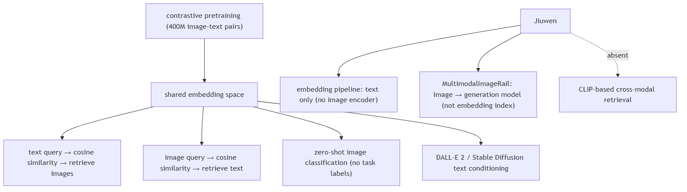

**In Jiuwen.** Embedding pipeline (APIEmbedding, SentenceTransformerEmbedding) is text-only — no image encoder or multimodal embedding path. DocumentChunk has no image-content field. MultimodalImageRail (agent-core/openjiuwen/harness/rails/multimodal_image_rail.py:1) handles image inputs from users but routes them directly to the generation model, not to a shared embedding index. CLIP-based cross-modal retrieval is absent.

<b>Under the hood</b>

**Implementation**

Cross-modal retrieval here uses provider multimodal embeddings rather than CLIP. Jiuwen does have a provider-based multimodal embedding path — `DashscopeEmbedding.embed_multimodal` (`core/retrieval/embedding/dashscope_embedding.py:199`) and `VLLMEmbedding.embed_multimodal` (`core/retrieval/embedding/vllm_embedding.py:32`) embed image+text via `MultimodalDocument` (`core/retrieval/common/document.py:50`) — but it uses provider embedding APIs, not CLIP. `MultimodalImageRail` prepares image attachments for the generation model; it is not an embedding index.

**Code anchors**

| Code anchor | What it points to |
|---|---|
| `agent-core/openjiuwen/core/retrieval/embedding/api_embedding.py:1` | API embedding |
| `agent-core/openjiuwen/core/retrieval/embedding/dashscope_embedding.py:199` | embed_multimodal (provider multimodal embedding) |
| `jiuwenswarm/jiuwenswarm/agents/harness/common/rails/multimodal_image_rail.py:21` | prepares image attachments for the generation model |
| `agent-core/openjiuwen/core/retrieval/indexing/processor/chunker/text_splitter.py:1` | no image chunk type |

---

## 23. What is the denoising diffusion mechanism behind Stable Diffusion and DALL-E?

Mechanism basic

**TL;DR.** Train a network to reverse a noise-addition process step by step; run inference from pure noise to generate images.

**Key points.**

- Forward process: add Gaussian noise over T steps until signal is destroyed
- Reverse process: U-Net trained to predict the noise at each step and subtract it
- Inference: start from pure noise, run reverse T steps → generated image
- Latent diffusion (Stable Diffusion): run forward/reverse in VAE-compressed latent space — ~8× compute reduction
- Practitioner levers: number of steps, guidance scale, and scheduler type all map directly to the reverse diffusion process

**Concept.** Denoising Diffusion Probabilistic Models (DDPM, Ho et al. 2020) define two processes. **Forward**: add Gaussian noise to an image over T steps until the image is pure noise (a known distribution). **Reverse**: train a neural network (U-Net) to denoise one step at a time — predict the noise added at each step and subtract it. At inference: sample pure noise, run the reverse process T times, get a generated image. The insight is that denoising is a stable, well-defined supervised objective. **Latent Diffusion Models** (Stable Diffusion) extend this by running the forward/reverse process in a compressed **latent space** (encoded by a VAE) rather than pixel space — reducing compute by ~8×. DALL-E 2 uses diffusion in the CLIP embedding space. For practitioners: generation quality levers (number of denoising steps, guidance scale, scheduler type) directly map to the reverse diffusion process.

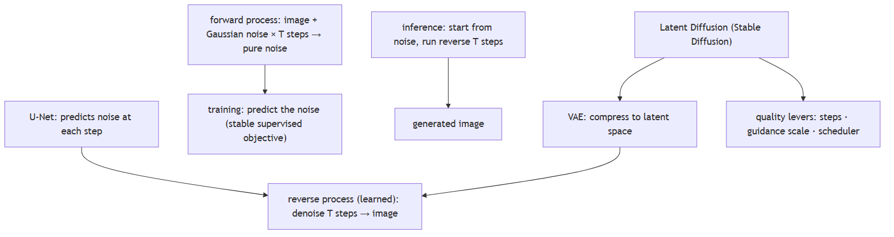

**In Jiuwen.** No diffusion model integration exists in the framework. Image generation tools (DALL-E, Stable Diffusion API) would be invoked as external tool calls via ToolCard definitions (agent-core/openjiuwen/core/foundation/tool/base.py:90). The SVG avatar system in jiuwenswarm-bee/src/avatar/ uses procedural animation (keyframe interpolation, state machine), not diffusion-based generation.

<b>Under the hood</b>

**Implementation**

Jiuwen is a language agent framework with no image generation capability and no diffusion integration; image generation, if needed, is an external tool/service called through a tool definition, not something the framework implements.

**Code anchors**

| Code anchor | What it points to |
|---|---|
| `ToolCard` | call |

---

## 24. What is the KV cache and how does it affect inference cost and speed?

Mechanism intermediate

**TL;DR.** KV cache stores computed key/value tensors for prefix tokens, making each decode step O(1) instead of O(N). Prompt cache hits cost ~10% of normal input token price.

**Key points.**

- Prefill phase processes all input tokens in parallel; decode phase generates one token per step reusing cached K/V
- Without KV cache: decoding N tokens from prompt P costs O((P+N)²); with it: amortized O(P+N)
- Prompt caching (Anthropic, OpenAI): stable prefix cached across API calls → ~10% input token cost for cached tokens
- Strategy: put stable system prompt first, variable query last to maximize cache hits
- Jiuwen observes cache hits via ProviderUsage.cached_input_tokens but does not control provider-side cache policy

**Concept.** During autoregressive decoding, the transformer computes key (K) and value (V) vectors for every token in every layer. For the input prefix these computations don't change as new tokens are generated — so they can be cached. The **KV cache** stores K and V tensors for all processed tokens so far: on each decode step only the new token's K/V is computed, and the cached values are reused. Without KV cache, generating N tokens from a prompt of P tokens costs O((P+N)²) compute; with it, the decode phase amortizes to O(P+N). **Prompt caching** (Anthropic, OpenAI, Google) extends this across API calls: if your request begins with a cached prefix, you pay ~10% of the normal input token cost for those cached tokens. Practical implication: put your stable system prompt and long context at the *beginning* of the message, and put the variable user query at the *end* — this maximizes cache hits across repeated calls.

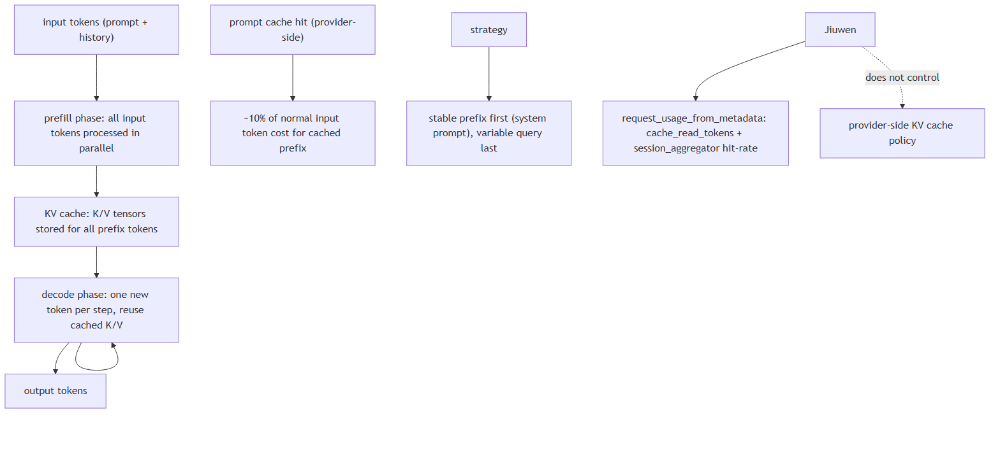

**In Jiuwen.** ProviderUsage (agent-core/openjiuwen/core/context_engine/usage/provider_usage.py:14) normalizes cached_input_tokens from provider usage metadata. session_aggregator.py:45 tracks cache hit rates in tokens. The framework cannot control provider-side KV cache policy — it observes whether the provider reported a hit. Prompt-prefix stability is indirectly improved by full_compact_processor.py:184 (compaction at 180k keeps stable prefixes at the top).

<b>Under the hood</b>

**Implementation**

The context engine is cache-aware: `request_usage_from_metadata` (`core/context_engine/usage/provider_usage.py:14`) reads `cache_read_tokens` into `RequestKVCacheUsage` (`core/context_engine/usage/models.py:55`), and `SessionKVCacheAggregator` (`session_aggregator.py:45`) aggregates the cache hit rate. The framework can only observe whether the provider reported a cache hit; it does not control the provider-side KV cache. Indirectly, the context engine's full-compaction and offloading strategy keeps long stable prefixes (system prompt, background context) at the top of the prompt, which improves cache-hit rate on re-queries.

**Code anchors**

| Code anchor | What it points to |
|---|---|
| `agent-core/openjiuwen/core/context_engine/usage/provider_usage.py:14` | normalizes cache_read_tokens from usage metadata |
| `agent-core/openjiuwen/core/context_engine/usage/session_aggregator.py:45` | cache hit-rate aggregation (tokens, not dollars) |
| `agent-core/openjiuwen/core/context_engine/processor/compressor/full_compact_processor.py:184` | prefix-preserving compaction (indirectly improves cache locality) |

---

## 25. What is the difference between a base model and an instruct model?

Compare basic

**TL;DR.** A base model predicts text; an instruct model has been through SFT + reward modeling + RLHF/DPO to follow instructions and decline harmful requests.

**Key points.**

- Base model: next-token prediction on massive corpus — no assistant persona, completes in any style seen during training
- Stage 1 SFT: fine-tune on helpful demonstrations — teaches format and tone
- Stage 2: reward model trained on human preference rankings
- Stage 3 RLHF or DPO: policy optimization toward reward model — produces instruction-following, safety-refusing behavior
- Jiuwen: no base/instruct distinction in config; SFT path in agent_rl/ is the stage that produces an instruct model from a base

**Concept.** A **base model** is pretrained on next-token prediction over a massive text corpus — it learns language, world knowledge, and code, but has no "assistant" persona. It will complete text in any style it has seen, including harmful ones. An **instruct model** (chat model) is a base model that has passed through one or more alignment stages: (1) **SFT** — supervised fine-tuning on demonstration data of helpful responses; (2) **Reward modeling** — a model trained to score responses by human preference rankings; (3) **RLHF or DPO** — policy optimization toward the reward model. The result is a model that follows instructions, declines harmful requests, and maintains a consistent persona. Base models (Llama-3-8B, Mistral-7B-base) are released for researchers to apply custom alignment; production systems virtually always use the instruct/chat variant.

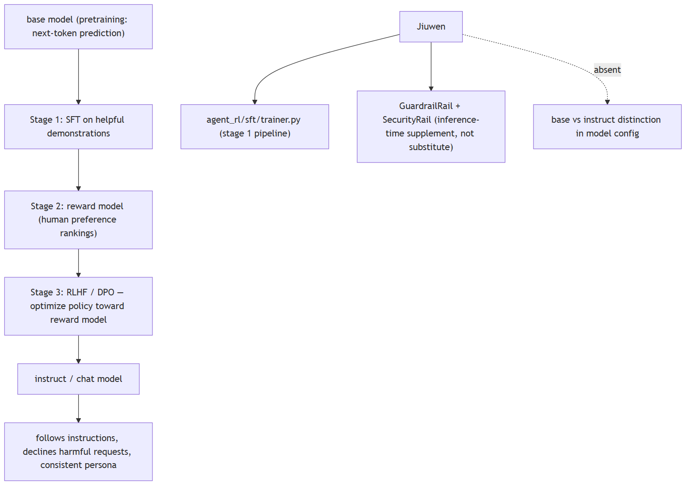

**In Jiuwen.** No base/instruct distinction in model config schema: ProviderType + model_name string selects a model (agent-core/openjiuwen/core/foundation/llm/schema/config.py:13). agent_rl/online/backends/sft/trainer.py:1 is the SFT stage that produces an instruct-model-like output from demonstration data — the framework implements the alignment training pipeline but does not tag served models as base vs instruct. GuardrailRail (agent-core/openjiuwen/harness/rails/guardrail_rail.py:1) provides inference-time safety supplement but does not substitute for RLHF/DPO training.

<b>Under the hood</b>

**Implementation**

The framework consumes models by `ProviderType` + `model_name` string — there is no base/instruct distinction in the config schema. Jiuwen does not perform base→instruct alignment; that happens before serving. Its only training code is `SFTTrainingExecutor` (`agent_evolving/agent_rl/online/backends/sft/trainer.py`), an online-RL SFT executor rather than a full alignment pipeline. `PromptInjectionGuardrail` and `SecurityRail` apply safety classification at inference time as a supplement to alignment — they do not substitute for RLHF/DPO training.

**Code anchors**

| Code anchor | What it points to |
|---|---|
| `agent-core/openjiuwen/core/foundation/llm/schema/config.py:13` | ProviderType (no instruct/base flag) |
| `agent-core/openjiuwen/agent_evolving/agent_rl/online/backends/sft/trainer.py:44` | SFT stage (produces instruct-like model from base) |
| `agent-core/openjiuwen/core/security/guardrail/builtin.py:1` | inference-time safety supplement |

---

## 26. Walk me through what happens in the ~400ms when you call an LLM API

Mechanism intermediate

**TL;DR.** API gateway → load balancer → tokenization → model router → prefill/decode (KV cache) → post-processing (safety) → response + billing + logging. Inference is ~95% of total latency.

**Key points.**

- API Gateway: TLS, API key validation, rate limiting (429 if exceeded), billing meter starts
- Tokenization: text → token IDs; this locks in your input cost
- Prefill phase: all input tokens processed in parallel (fast); Decode phase: one token per step (this loop is why streaming exists)
- KV cache avoids recomputing past token K/V tensors; FlashAttention reduces memory pressure
- Output tokens cost 3-5× more than input tokens; safety classifier runs at post-processing at every major provider

**Concept.** (1) **API Gateway** — TLS termination, API key validation, rate limiting (429 if exceeded), billing meter starts. (2) **Load Balancer** — routes to a GPU cluster; identical requests have different latency because different clusters are selected. (3) **Tokenization** — your text is converted to token IDs ("Hello world" → [15339, 1917]); this is where your cost is locked in for input. (4) **Model Router** (provider-internal) — large requests route to a multi-GPU cluster; small requests to an optimized single GPU. (5) **Inference Engine** — *Prefill phase*: all input tokens processed in parallel (fast). *Decode phase*: one output token generated per step (this loop is why streaming exists). KV cache avoids recomputing past token representations; FlashAttention reduces memory pressure. (6) **Post-Processing** — tokens decoded to text; safety classifier runs (every major provider has this). (7) **Response and Billing** — JSON response returned via load balancer and TLS; output tokens cost 3–5× more than input tokens per provider pricing. (8) **Logging** — every call logged: latency, token count, model, safety flags; feeds abuse detection and capacity planning. **Inference (step 5) accounts for ~95% of total latency.**

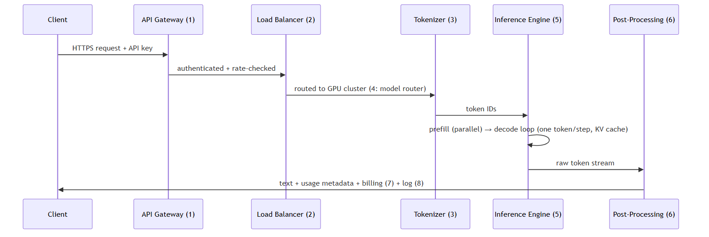

**In Jiuwen.** Framework operates from the model-router stage onward. Model clients (agent-core/openjiuwen/core/foundation/llm/model_clients/openai_model_client.py:865) send requests and receive streamed responses. ProviderUsage (provider_usage.py:14) captures input_tokens, output_tokens, and cached_input_tokens from the response usage metadata (step 7). ObservabilityHandler (agent-core/openjiuwen/harness/observability/event.py:1) logs model call events (step 8 equivalent). jiuwenswarm/jiuwenswarm/server/runtime/usage_cost.py:101 is the session billing meter. Steps 1-3 (API gateway, load balancer, tokenization) are the provider's infrastructure — not visible to the framework.

<b>Under the hood</b>

**Implementation**

The framework operates from step 4 onward. Model clients build the request and send/stream it via `invoke`/`stream` (`openai_model_client.py:1491`/`:1665`); they do not control tokenization, routing, or prefill/decode. `request_usage_from_metadata` captures `input_tokens`, `output_tokens`, and `cache_read_tokens` from step 7's usage metadata. `OtelCallbackHandler` (`extensions/observability/callback_handler.py:371`) logs model-call events for step 8 equivalents. Steps 1–3 (gateway, load balancer, tokenization) are the provider's infrastructure.

**Code anchors**

| Code anchor | What it points to |
|---|---|
| `agent-core/openjiuwen/core/foundation/llm/model_clients/openai_model_client.py:1491` | invoke (sends request, step 4+) |
| `agent-core/openjiuwen/core/context_engine/usage/provider_usage.py:14` | captures usage metadata from step 7 |
| `jiuwenswarm/jiuwenswarm/server/runtime/usage_cost.py:101` | billing meter equivalent (step 7) |
| `agent-core/openjiuwen/extensions/observability/callback_handler.py:371` | observability events (step 8 equivalent) |

---
