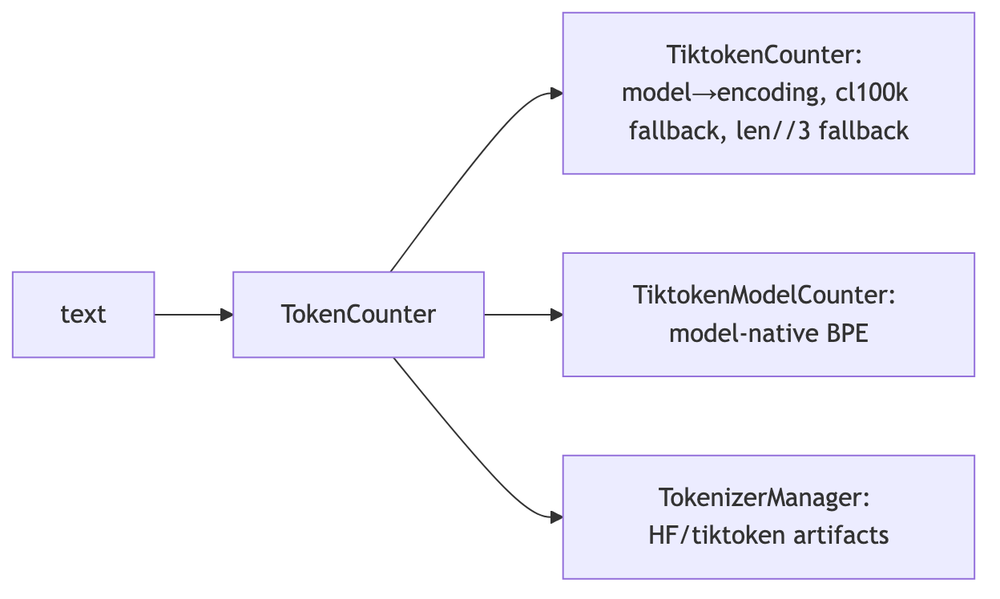
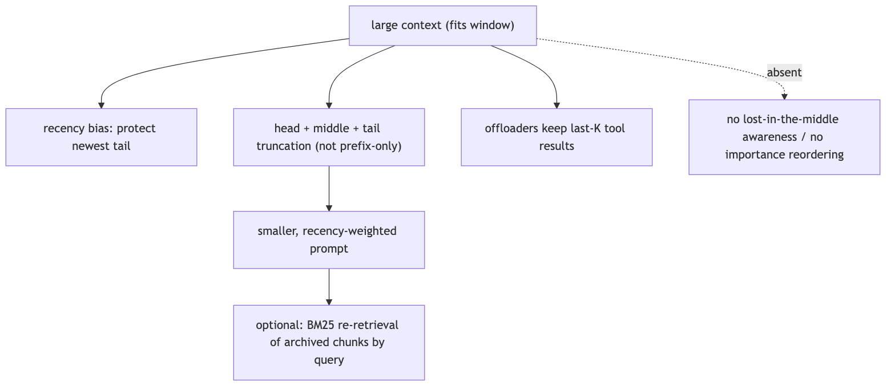
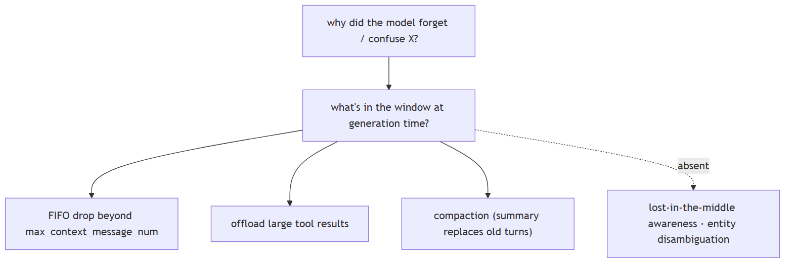

# LLM foundations

## 1. What's the difference between a token and a word?

Compare basic

**TL;DR.** A token is the model's atomic unit — usually a sub-word — so one word may be one or several tokens.

**Key points.**

- A token is the model's atomic input/output unit.
- One word can be several tokens; rare/long words and code fragment more.
- Tokenization explains character-level mistakes (miscounting letters).

**Concept.** A token is the model's atomic unit — typically a sub-word produced by a BPE/unigram vocabulary — so one word may be one or several tokens, and rare/long words and code fragment heavily. This is also why models miscount letters and struggle with character-level tasks.

**In Jiuwen.** Jiuwen counts tokens, never words, via a pluggable TokenCounter: TiktokenCounter maps known model names to tiktoken encodings (with a cl100k_base fallback), and TiktokenModelCounter loads a model-native BPE vocabulary. TokenizerManager downloads the tokenizer artifacts per model/family.

<b>Under the hood</b>

**Implementation**

The framework counts **tokens**, never words, via a pluggable `TokenCounter`: `TiktokenCounter` maps known model names to tiktoken encodings (falling back to `cl100k_base` for unknown models), and `TiktokenModelCounter` loads a model-native BPE vocabulary. `TokenizerManager` downloads HuggingFace/tiktoken artifacts per model/family.

**Code anchors**

| Code anchor | What it points to |
|---|---|
| `agent-core/openjiuwen/core/context_engine/token/tiktoken_counter.py:212` | TiktokenCounter; :225 model→encoding map; :287 count() with len(text)//3 fallback |
| `agent-core/openjiuwen/core/context_engine/token/tiktoken_model_counter.py:86` | model-native tiktoken BPE |
| `agent-core/openjiuwen/core/context_engine/token/tokenizer_spec.py:34` | TokenizerSpec; :50 fallback policy chain |
| `agent-core/openjiuwen/core/context_engine/token/tokenizer_manager.py:60` | resolves/downloads tokenizer artifacts |

**Implementation diagram**

**Canonical source**

`source/llm-fundamentals-interview-questions_for_engineers.md`

---

## 2. Why does tokenization affect cost and context limits

Mechanism intermediate

**TL;DR.** Cost and context are measured in tokens, not words — text that fragments more costs more and fills the window faster.

**Key points.**

- Cost and context are counted in tokens, not words.
- More fragmentation → more tokens → higher cost, faster window fill.
- Token counts also drive chunking and compaction thresholds.

**Concept.** Cost and context limits are measured in tokens, not words, so a language or domain that fragments more costs more per word and fills the window faster. The same token count drives when history must be compacted or tool output offloaded.

**In Jiuwen.** Token counts drive context limits (DEFAULT_CONTEXT_MAX_TOKENS = 200,000), compression/offload thresholds, and cost via provider-reported usage metadata (input/output/cache/reasoning tokens). Retrieval chunking is also token-based.

<b>Under the hood</b>

**Implementation**

Token counts drive per-model context limits (`MODEL_DEFAULT_CONTEXT_WINDOW_TOKENS`, default 200,000), compression/offload thresholds, and cost via provider-reported `usage_metadata` (`input_tokens`/`output_tokens`/cache/reasoning tokens). Retrieval chunking is also token-based.

**Code anchors**

| Code anchor | What it points to |
|---|---|
| `agent-core/openjiuwen/core/context_engine/context/context_utils.py:20` | DEFAULT_CONTEXT_MAX_TOKENS = 200000 |
| `agent-core/openjiuwen/core/context_engine/processor/offloader/tool_result_budget_processor.py:34` | per-round token budget |
| `agent-core/openjiuwen/core/context_engine/token/tiktoken_counter.py:287` | count() drives limits/cost |
| `agent-core/openjiuwen/core/foundation/llm/schema/message.py:28` | total_tokens usage metadata |

**Implementation diagram**

**Canonical source**

`source/llm-fundamentals-interview-questions_for_engineers.md`

---

## 3. What is the difference between tokens and embeddings?

Compare basic

**TL;DR.** Tokens are the discrete input/output units; embeddings are continuous vectors that encode meaning for similarity search.

**Key points.**

- Tokens: discrete sub-word units, bounded vocabulary, drive cost/limits.
- Embeddings: dense vectors in a semantic space, used for similarity.
- You embed chunks (token sequences), but they are different abstractions.

**Concept.** A token is a unit of text (a sub-word piece) — the input/output alphabet of the model. An embedding is a vector representation of text that encodes meaning, used for similarity search. Tokens are discrete and count against cost/context; embeddings are continuous and live in a vector space. You embed chunks/tokens, but they are different abstractions.

**In Jiuwen.** Tokens and embeddings are handled by two separate subsystems. A tokenizer counts tokens and drives context/cost limits; a separate embedding provider turns text into vectors that are stored and compared in a vector index. Which tokenizer you use sets chunk sizes, and which embedding model you use sets vector dimensions — the two are chosen independently.

<b>Under the hood</b>

**Implementation**

Tokens are counted by a pluggable `TokenCounter` (an ABC; the tiktoken-backed `TiktokenCounter` drives limits/cost); embeddings are produced by the `Embedding` ABC and compared in a vector store. The two are independent: the tokenizer sets chunk sizes, the embedder sets vector dimension.

**Code anchors**

| Code anchor | What it points to |
|---|---|
| `agent-core/openjiuwen/core/context_engine/token/tiktoken_counter.py:212` | TiktokenCounter; :287 fallback |
| `agent-core/openjiuwen/core/foundation/store/base_embedding.py:24` | Embedding ABC; :29 embed_query |
| `agent-core/openjiuwen/core/retrieval/indexing/indexer/embed_chunks.py:46` | embed_documents |

**Canonical source**

`source/llm-applied-interview-questions_for_engineers.md`

---

## 4. Explain how self-attention works in a transformer

Mechanism intermediate

**TL;DR.** Each token builds a context-aware representation by attending to every other token, weighting them by query–key similarity.

**Key points.**

- Q/K/V projections; scores = Q·Kᵀ/√d_k; softmax → weights; weighted sum of V.
- Multiple heads capture different relationships in parallel.
- Permutation-equivariant: order comes from positional encoding, not attention.
- Stacked layers build increasingly abstract context.

**Concept.** Each token is projected into three vectors — query, key, value. The query of a token is dot-producted with the keys of all tokens (scaled by `1/√d_k`), softmaxed into attention weights, and used to take a weighted sum of the values. Doing this with multiple heads in parallel and stacking layers lets each token aggregate information from every other token, with the weights computed from content rather than position. The result is a context-dependent representation per token.

**In Jiuwen.** Jiuwen does not implement attention itself — it delegates to hosted models or to HuggingFace models loaded by name. Its boundary is the model-client/config layer, which builds request parameters and sends them to a provider; when running a local model it loads a causal language model and consumes the returned logits. Attention lives in the model, not in this codebase.

<b>Under the hood</b>

**Implementation**

Not implemented — attention is delegated entirely to provider APIs or to HuggingFace models loaded by name. There is no Q/K/V projection, scaled dot-product, or multi-head code anywhere; the only `torch.softmax` in the framework is used for token sampling, not attention. The framework's boundary is the model-client/config layer, which serializes request params and sends them to a provider; the local `transformers` client calls `AutoModelForCausalLM` and consumes logits.

**Code anchors**

| Code anchor | What it points to |
|---|---|
| `agent-core/openjiuwen/core/foundation/llm/schema/config.py:13` | ProviderType enum: the model-client provider boundary, no architecture logic |
| `agent-core/openjiuwen/core/foundation/llm/model_clients/openai_model_client.py:865` | builds hosted request params, delegates computation |
| `agent-core/openjiuwen/symphony/retrieval/llm/transformers_logit_selection/client.py:227` | torch.no_grad() forward; logit extraction only, no attention code |
| `agent-core/openjiuwen/symphony/retrieval/llm/transformers_prefix_cached_generation/client.py:175` | AutoModelForCausalLM.from_pretrained(...); attention delegated |
| `agent-core/openjiuwen/symphony/retrieval/llm/transformers_prefix_cached_generation/generation.py:527` | torch.softmax(...) is sampling, not attention |

**Canonical source**

`source/llm-fundamentals-interview-questions_for_engineers.md`

---

## 5. What is positional encoding, and why do transformers need it if attention has no inherent sense of order

Mechanism basic

**TL;DR.** Attention is order-blind, so a position signal must be injected — added to embeddings (sinusoidal/learned) or applied as a rotation to Q/K (RoPE).

**Key points.**

- Without it, 'dog bites man' and 'man bites dog' are indistinguishable.
- Sinusoidal/learned: add a position vector to token embeddings.
- RoPE: rotate Q/K inside attention to encode relative position.
- Modern LLMs mostly use RoPE variants.

**Concept.** Self-attention is permutation-equivariant — without positional information it cannot distinguish token order, so "dog bites man" and "man bites dog" yield the same multiset of token representations, only reordered (not one identical output). Positional encoding injects order information — by adding a position-dependent signal to the token representations (sinusoidal/learned), or by rotating the query and key vectors inside attention (RoPE) — so the attention scores can depend on relative or absolute position. Without it the model cannot know sequence order.

**In Jiuwen.** There is no positional-encoding code here — it lives inside the model. Jiuwen only passes through the relevant knobs: an attention-implementation hint for HuggingFace, and RoPE scaling options for the vLLM engine. Any position ids you see in the RL data pipeline are just batching/padding metadata.

<b>Under the hood</b>

**Implementation**

No positional-encoding implementation exists — no sinusoidal, learned, or RoPE code. The only positional-adjacent items are passthrough configuration: `attn_implementation` forwarded to HuggingFace and `rope_scaling_type`/`rope_scaling_factor` forwarded as vLLM engine args. In the RL data pipeline, `position_ids` are computed for padded training batches, which is batching metadata rather than an encoding scheme.

**Code anchors**

| Code anchor | What it points to |
|---|---|
| `agent-core/openjiuwen/symphony/retrieval/llm/config.py:88` | attn_implementation: str = "" (HF passthrough) |
| `agent-core/openjiuwen/symphony/retrieval/llm/transformers_prefix_cached_generation/client.py:171` | model_kwargs["attn_implementation"] |
| `agent-core/openjiuwen/symphony/retrieval/search/service/serving.py:42` | rope_scaling_type / rope_scaling_factor vLLM defaults |
| `agent-core/openjiuwen/symphony/retrieval/llm/vllm/client.py:584` | rope scaling passed through |
| `agent-core/openjiuwen/agent_evolving/agent_rl/offline/coordinator/batch_builder.py:175` | position_ids from cumsum(attention_mask) (padding metadata) |

**Canonical source**

`source/llm-fundamentals-interview-questions_for_engineers.md`

---

## 6. What's the difference between an encoder-only, decoder-only, and encoder-decoder model, and where does GPT fit

Compare basic

**TL;DR.** Encoder-only reads bidirectionally for understanding; decoder-only generates left-to-right; encoder-decoder maps one sequence to another. GPT is decoder-only.

**Key points.**

- Encoder-only (BERT): bidirectional; classification, embeddings, extraction.
- Decoder-only (GPT): autoregressive; generation.
- Encoder-decoder (T5): input→output tasks such as translation.

**Concept.** Encoder-only models (BERT) read bidirectional context and produce representations — good for classification, embedding, extraction. Decoder-only models (GPT) are autoregressive: they predict the next token attending only leftward, which makes them generators. Encoder-decoder models (T5, original Transformer) encode an input and generate an output, suited to translation/summarization. GPT is decoder-only.

**In Jiuwen.** Jiuwen does not classify models as encoder or decoder. Behavior is chosen by provider and by the model-name string. The two HuggingFace loaders it uses reveal intent: causal generation loads a decoder language model, while guardrail classification loads a sequence-classification model (encoder-style). GPT is treated simply as a provider/model name.

<b>Under the hood</b>

**Implementation**

There is no architecture-type configuration, no `is_encoder_decoder`/`is_decoder` flag, and no encoder/decoder classification. Behavior is selected by **provider type** and **model-name string** (model-family patterns also drive reasoning/thinking wire protocols and tokenizer selection). The two HuggingFace classes named in the repo imply the intent: causal generation uses `AutoModelForCausalLM` (decoder-only), and guardrail classification uses `AutoModelForSequenceClassification` (typically an encoder-style classifier). GPT is handled purely as a provider/model name.

**Code anchors**

| Code anchor | What it points to |
|---|---|
| `agent-core/openjiuwen/core/foundation/llm/schema/config.py:13` | ProviderType; architecture is not a config dimension |
| `agent-core/openjiuwen/core/foundation/llm/reasoning_profiles.py:100` | model-family patterns used for reasoning-protocol selection (not architecture) |
| `agent-core/openjiuwen/core/security/guardrail/backends.py:445` | AutoModelForSequenceClassification |
| `agent-core/openjiuwen/core/security/guardrail/builtin.py:174` | model_type limited to None \| "bert" \| "qwen" |
| `agent-core/openjiuwen/symphony/retrieval/llm/transformers_prefix_cached_generation/client.py:175` | AutoModelForCausalLM (decoder-only) |
| `agent-core/openjiuwen/symphony/retrieval/search/service/serving.py:35` | vLLM architectures string |

**Implementation diagram**

**Canonical source**

`source/llm-fundamentals-interview-questions_for_engineers.md`

---

## 7. What's the difference between a model's context window and its training data cutoff

Compare basic

**TL;DR.** The context window is a per-call capacity limit; the training cutoff is a knowledge-date limit. A big window does not make the model current.

**Key points.**

- Window = max tokens attended in one call (capacity).
- Cutoff = date after which the model has no knowledge (temporal).
- Fitting a document does not mean the model knows post-cutoff facts.

**Concept.** The context window is how many tokens the model can attend to at once (a capacity limit). The training data cutoff is the date after which the model has no knowledge (a temporal limit). A model can have a large window but an old cutoff — it can read a long document you paste but still not know events after its training date. Confusing the two leads to expecting up-to-date answers from a frozen model.

**In Jiuwen.** Jiuwen tracks operational metadata only: model name, provider, context-window size, output cap, and endpoint/auth. It resolves a window size per model but never stores or exposes a training cutoff or knowledge date, so it cannot distinguish 'the model does not know this' from 'it does not fit the window'.

<b>Under the hood</b>

**Implementation**

Model metadata here is operational only: model name, provider, context-window token counts, output `max_tokens`, auth/endpoint. The context engine resolves a window size per model but never stores, prompts, or exposes a training-data cutoff or knowledge date. Nothing distinguishes "the model does not know X" from "the window does not fit X".

**Code anchors**

| Code anchor | What it points to |
|---|---|
| `agent-core/openjiuwen/core/context_engine/context/context_utils.py:29` | builtin window table; :275 fetch_openrouter_model_context_window_tokens() (window only) |
| `agent-core/openjiuwen/core/context_engine/schema/config.py:137` | model_name; :139 model_context_window_tokens |
| `agent-core/openjiuwen/core/foundation/llm/schema/config.py:209` | model_name; :214 max_tokens (output cap) |
| `agent-core/openjiuwen/core/foundation/llm/schema/generation_response.py:20` | created timestamp (response, not cutoff) |

**Canonical source**

`source/llm-fundamentals-interview-questions_for_engineers.md`

---

## 8. What happens when a conversation exceeds the model's context window

Mechanism intermediate

**TL;DR.** Either the provider rejects the request or you must shrink the prompt first — drop old turns, offload big tool outputs, or summarize.

**Key points.**

- Pre-empt: count tokens and budget before sending.
- Truncate oldest history but preserve recent turns.
- Offload large tool results and summarize old turns into memory.
- Otherwise the call is rejected or silently truncated.

**Concept.** Either the provider rejects the request, or the framework must shrink the prompt before sending. Robust systems pre-empt it: count tokens, then drop/truncate oldest history, offload large tool outputs, and/or summarize old turns into a compact memory block, always preserving recent turns. The goal is to keep the prompt within budget without losing the information needed for the next step.

**In Jiuwen.** On each turn Jiuwen counts tokens with a model-aware tokenizer and trims proactively: large tool results are offloaded to disk and replaced with short previews, and older history is compressed once it crosses ratio or token thresholds. If the provider still rejects the request as too long, it detects the overflow, forces compaction, and retries only if the context actually changed; a hard message-count cap is the last resort.

<b>Under the hood</b>

**Implementation**

On every `add_messages`/`get_context_window`, the context engine counts tokens with a model-aware tokenizer and runs passive processors: offloaders persist oversized tool results to `{workspace}/context/{session_id}_context/offload/` and replace them with `<persisted-output>` previews, while compressors trigger at ratio/token thresholds (`RoundLevelCompressor` at 0.9×budget, `FullCompactProcessor` at 180k) and rewrite history into summary/memory blocks. If the model still rejects the request, `ContextEngine.recover_from_model_exception` matches overflow phrases, force-runs compaction, and retries only if context actually changed. A hard `max_context_message_num` provides a last-resort FIFO drop. `effective_context_budget` is the strictest positive bound across configured window, per-call budget, and resolved model window.

**Code anchors**

| Code anchor | What it points to |
|---|---|
| `agent-core/openjiuwen/core/context_engine/context/context_utils.py:20` | DEFAULT_CONTEXT_MAX_TOKENS = 200000; :404 resolve_context_max(); :29 per-model window table |
| `agent-core/openjiuwen/core/context_engine/processor/budget_guard.py:37` | effective_context_budget() = min of budgets |
| `agent-core/openjiuwen/core/context_engine/context/message_buffer.py:71` | _if_need_resize() drops oldest beyond 2× |
| `agent-core/openjiuwen/core/context_engine/processor/compressor/round_level_compressor.py:104` | trigger_context_ratio=0.9; :1159 _trigger_token_threshold() |
| `agent-core/openjiuwen/core/context_engine/processor/compressor/full_compact_processor.py:184` | trigger_total_tokens=180000; :194 messages_to_keep=10 |
| `agent-core/openjiuwen/core/context_engine/context_engine.py:372` | recover_from_model_exception() |
| `agent-core/openjiuwen/core/context_engine/processor/offloader/tool_result_budget_processor.py:34` | per-round tokens_threshold=50000; agent-core/openjiuwen/core/context_engine/processor/offloader/message_offloader.py:45 tokens_threshold=20000 |

**Implementation diagram**

**Canonical source**

`source/llm-fundamentals-interview-questions_for_engineers.md`

---

## 9. Why does model performance sometimes degrade with very long context, even when the context fits

Mechanism basic

**TL;DR.** Attention spreads thinner over more tokens and models use the middle poorly ('lost in the middle'), so a bigger context is not automatically better.

**Key points.**

- Signal dilution grows with context length.
- Primacy/recency bias: the start and end are used best.
- Distractor content can override instructions.
- Mitigate with retrieval, reranking, and ordering.

**Concept.** Attention spreads over more tokens, diluting the signal for any one of them, and models are empirically better at using information at the beginning and end of the context than in the middle ("lost in the middle"). Irrelevant long context also introduces distractors and can override instructions. Fitting the window is necessary but not sufficient; relevance and ordering matter too.

**In Jiuwen.** Jiuwen has no explicit 'lost in the middle' handling. Instead it keeps prompts small and favors recent content: compressors keep the newest messages, offloaders keep only the most recent tool results, and truncation preserves the head and tail rather than only the front. When enabled, an optional mode archives replaced messages and can re-surface the relevant ones using keyword search.

<b>Under the hood</b>

**Implementation**

There is no explicit "lost-in-the-middle" mitigation; the system instead mechanically keeps the window small and biases toward recency. Compressors protect a newest-message tail (`keep_recent_messages`, `messages_to_keep`, `keep_last_round`), offloaders keep only the newest K results, and truncation helpers preserve head + tail (one also keeps a middle slice) rather than only a prefix. When enabled, `CompressionRecallConfig` archives replaced messages in overlapping token chunks and a two-stage BM25 retriever can re-surface relevant archived chunks by query — the closest thing to relevance-based long-context handling.

**Code anchors**

| Code anchor | What it points to |
|---|---|
| `agent-core/openjiuwen/core/context_engine/processor/compressor/round_level_compressor.py:119` | keep_recent_messages; :1088 _build_head_tail_truncated_text(); :112 target_total_tokens=160000 |
| `agent-core/openjiuwen/core/context_engine/processor/compressor/full_compact_processor.py:194` | messages_to_keep=10 |
| `agent-core/openjiuwen/core/context_engine/processor/offloader/message_offloader.py:63` | keep_last_round=True |
| `agent-core/openjiuwen/core/context_engine/processor/offloader/message_summary_offloader.py:697` | _smart_truncate_content() head/middle/tail |
| `agent-core/openjiuwen/core/context_engine/processor/budget_guard.py:114` | _build_head_tail() |
| `agent-core/openjiuwen/core/context_engine/processor/forked/compressor/recall/archive.py:48` | archive in 3000-token chunks / 300 overlap; agent-core/openjiuwen/core/context_engine/processor/forked/compressor/recall/retriever.py:27 BM25 recall_compressed_context() |

**Implementation diagram**

**Canonical source**

`source/llm-fundamentals-interview-questions_for_engineers.md`

---

## 10. What does temperature actually control, mathematically, in the output distribution

Mechanism basic

**TL;DR.** Temperature rescales logits before softmax: near 0 is greedy and deterministic; higher flattens the distribution for diversity. It never changes which tokens are possible.

**Key points.**

- softmax(z/T); T = 1 leaves the model's raw distribution unchanged.
- T → 0 collapses toward argmax; T > 1 flattens.
- Only relative probabilities change; the token set stays the same.
- Use T = 0 for extraction/classification, higher for creative work.

**Concept.** The model produces logits `z_i` for the next token. Temperature `T` rescales them: `softmax(z_i / T)`. As `T → 0` the distribution collapses toward the argmax (greedy/deterministic); as `T` rises the distribution flattens, increasing diversity and the chance of lower-probability tokens. `T = 1` leaves the model's raw distribution unchanged. It does not change which tokens are possible, only their relative probabilities.

**In Jiuwen.** Temperature is mostly passed through to the provider, which does the math, and is also implemented for local models. At the client layer it defaults to unset and is added only when you specify it, and your request-level value overrides the config. Hosted quirks are handled: some OpenAI-style endpoints keep only one of temperature/top-p, and Anthropic routes sampling differently. Locally it divides logits by temperature and falls back to greedy at zero, with a default of 0.

<b>Under the hood</b>

**Implementation**

Temperature is a **passthrough request parameter** — hosted APIs apply the math — with a local implementation on the HF/vLLM path. At the core client layer `temperature`/`top_p` default to `None` and are added only when set; request-level args override `ModelRequestConfig`. OpenAI-compatible calls targeting `openai.com` keep only one of temperature/top_p (temperature wins, top_p dropped); Anthropic routes sampling through `extra_body` and drops `top_p` when temperature is explicitly set. The local sampler divides logits by temperature and softmaxes, with `T <= 0` falling back to argmax. The local `GenerationConfig` default is `temperature=0.0`.

**Code anchors**

| Code anchor | What it points to |
|---|---|
| `agent-core/openjiuwen/core/foundation/llm/schema/config.py:210` | temperature: Optional[float] = None |
| `agent-core/openjiuwen/core/foundation/llm/model_clients/base_model_client.py:556` | final_temperature = ...; added only when not None |
| `agent-core/openjiuwen/core/foundation/llm/model_clients/openai_model_client.py:944` | drops top_p when temperature present (openai.com) |
| `agent-core/openjiuwen/core/foundation/llm/model_clients/anthropic_model_client.py:929` | temperature via extra_body; drops top_p if both set |
| `agent-core/openjiuwen/symphony/retrieval/llm/transformers_prefix_cached_generation/generation.py:516` | scores = next_token_logits / max(1e-6, temperature) |
| `agent-core/openjiuwen/symphony/retrieval/llm/base/types.py:60` | GenerationConfig.temperature: float = 0.0 |

**Canonical source**

`source/llm-fundamentals-interview-questions_for_engineers.md`

---

## 11. What's the difference between top-k sampling and top-p (nucleus) sampling

Compare basic

**TL;DR.** Both truncate the distribution before sampling: top-k keeps a fixed k tokens; top-p keeps the smallest set reaching cumulative probability p (adaptive).

**Key points.**

- Top-k: fixed candidate count regardless of confidence.
- Top-p: adaptive — few tokens when peaked, many when flat.
- Often combined; top-p usually adapts better.

**Concept.** Both truncate the next-token distribution before sampling. Top-k keeps the `k` most probable tokens and renormalizes — a fixed candidate count regardless of how peaked the distribution is. Top-p keeps the smallest set of tokens whose cumulative probability reaches `p` — an adaptive count: few tokens when the model is confident, many when it is flat. Top-p usually adapts better; they are often combined.

**In Jiuwen.** Jiuwen implements top-p (nucleus) sampling locally and does not implement top-k sampling — there is simply no top-k field for generation. The local sampler keeps the smallest set of tokens reaching the target cumulative probability, renormalizes, and samples. Hosted models receive top-p normally, and Anthropic also accepts top-k if you pass it. Note the codebase reuses the name 'top-k' elsewhere for retrieval counts and other unrelated things, not sampling.

<b>Under the hood</b>

**Implementation**

Top-p (nucleus) is implemented locally; top-k sampling is not. `GenerationConfig` exposes `top_p` (default `1.0`) but has no top-k sampling field. The local sampler sorts scores, masks tokens beyond the cumulative `top_p`, re-softmaxes, and multinomial-samples; `top_p == 1.0` samples the full distribution. Hosted providers receive `top_p` in the normal body; Anthropic additionally forwards `top_k` via `extra_body` if present. Note three unrelated `top_k` meanings in the codebase that are **not** LLM sampling: retrieval result count, trie-constraint allowed outputs, and logit-selection candidate scoring.

**Code anchors**

| Code anchor | What it points to |
|---|---|
| `agent-core/openjiuwen/symphony/retrieval/llm/base/types.py:61` | GenerationConfig.top_p: float = 1.0; no top_k sampling field |
| `agent-core/openjiuwen/symphony/retrieval/llm/transformers_prefix_cached_generation/generation.py:517` | nucleus top_p truncation; :534 full-distribution softmax when top_p ∉ (0,1) |
| `agent-core/openjiuwen/core/foundation/llm/model_clients/base_model_client.py:561` | top_p resolved/passed |
| `agent-core/openjiuwen/core/foundation/llm/model_clients/anthropic_model_client.py:936` | top_p via extra_body; :940 top_k forwarded if present |
| `agent-core/openjiuwen/core/foundation/llm/schema/config.py:213` | top_p: Optional[float] = None (no top_k) |
| `agent-core/openjiuwen/symphony/retrieval/llm/base/types.py:40` | TrieConstraint.top_k (allowed outputs, not sampling) |

**Canonical source**

`source/llm-fundamentals-interview-questions_for_engineers.md`

---

## 12. Why does greedy decoding sometimes produce worse output than sampling-based decoding

Mechanism basic

**TL;DR.** Greedy is locally optimal but can lock into repetitive or bland text; sampling explores alternatives for more natural output. Use greedy when there's one right answer.

**Key points.**

- Greedy = argmax each step; it cannot recover from one bad choice.
- Sampling adds diversity and naturalness.
- Extraction/classification → greedy; open-ended → sampling.

**Concept.** Greedy picks the single highest-probability token each step. That is locally optimal but not globally: it can lock into repetitive, degenerate, or bland sequences, and it cannot recover from one early bad choice. Sampling explores alternatives, which often yields more natural and diverse text; a moderate temperature with top-p is a common default. For tasks with a single correct answer (extraction, classification), greedy/`T=0` is usually preferred.

**In Jiuwen.** Greedy decoding is what you get at temperature zero: the local sampler returns the single highest-probability token and disables sampling. Because the local default temperature is 0, greedy is the default. Many internal call sites deliberately use temperature 0 for deterministic extraction/classification and switch to sampling when temperature is above zero. Tellingly, the code treats this purely as a determinism switch — there is no reasoning anywhere about why greedy can produce worse text.

<b>Under the hood</b>

**Implementation**

Greedy is implemented but not argued. The local sampler returns `argmax` when `temperature <= 0.0`, and the generate path sets `do_sample=False` in that branch; since `GenerationConfig` defaults to `temperature=0.0`, the local default is greedy. Many framework call sites deliberately pass `temperature=0.0` for deterministic extraction/classification, while sampling is enabled (`do_sample=True`, temperature/top_p/seed) when temperature > 0. There is **no** comment, doc, or code discussion explaining why greedy can be worse than sampling — the choice is treated purely as a determinism knob.

**Code anchors**

| Code anchor | What it points to |
|---|---|
| `agent-core/openjiuwen/symphony/retrieval/llm/transformers_prefix_cached_generation/generation.py:514` | if temperature <= 0.0: return int(torch.argmax(...)) |
| `agent-core/openjiuwen/symphony/retrieval/llm/transformers_prefix_cached_generation/generation.py:335` | do_sample=True when temperature > 0; :344 do_sample=False |
| `agent-core/openjiuwen/symphony/retrieval/llm/base/types.py:60` | default temperature = 0.0 ⇒ local default greedy |
| `agent-core/openjiuwen/agent_evolving/agent_rl/rl_trainer/verl_executor.py:185` | remax_input.meta_info["do_sample"] = False (REMAX baseline, not an exploit path) |
| `agent-core/openjiuwen/core/retrieval/indexing/processor/extractor/triple_extractor.py:31` | constructor default temperature=0.0 |

**Canonical source**

`source/llm-fundamentals-interview-questions_for_engineers.md`

---

## 13. Why do LLMs struggle with tasks like counting or basic arithmetic

Mechanism intermediate

**TL;DR.** Models see tokens, not characters or digits, and never learn a carry algorithm — so exact math is unreliable and should be delegated to a tool.

**Key points.**

- BPE hides characters, so letter counting fails.
- Multi-digit arithmetic requires carrying, which is not learned reliably.
- Fix it with tool use (calculator/code), not a bigger prompt.

**Concept.** The model operates on tokens, not characters or digits-as-numbers; counting letters requires character-level reasoning that BPE hides, and multi-digit arithmetic requires carrying/positional algorithms that are error-prone to learn implicitly. Models also have no scratchpad guarantee unless asked to show work. The reliable fix is tool use — call a calculator or run code — rather than expecting the forward pass to do exact math.

**In Jiuwen.** Jiuwen treats math as a tool problem. A canonical example teaches an agent to call a calculator tool (arithmetic via a safe evaluator, algebra via a symbolic library), and the prompt walks it through the steps. More generally, agents can run code in a sandbox to do math and logic. The repo's evaluation code even encodes the rule that 'textual arithmetic is never accepted as execution' — results must come from real execution.

<b>Under the hood</b>

**Implementation**

The repo frames arithmetic/counting as a tool-augmentation problem. A canonical example trains a DeepAgent to call a `calculator` tool that evaluates arithmetic via `simpleeval` and solves/simplifies algebra/equations via `sympy`; the system prompt explicitly instructs tool use step by step. More generally, an `execute_code` sandbox operation (JiuwenBox/YuanRong/AIO providers plus a local provider) lets agents run code for math/logic. The RSI evidence analyzer encodes the principle "textual arithmetic is never accepted as execution" — verification must come from actual code execution.

**Code anchors**

| Code anchor | What it points to |
|---|---|
| `agent-core/examples/rl_calculator/tools.py:11-14` | @tool(name="calculator"); :15-85 simple_eval + sympy |
| `agent-core/examples/rl_calculator/prompts.py:7-16` | "Use the calculator tool … step by step" |
| `agent-core/openjiuwen/core/sys_operation/code.py:16-49` | execute_code sys-operation |
| `agent-core/openjiuwen/extensions/sys_operation/sandbox/providers/jiuwenbox.py:2927` | sandbox execute_code |
| `agent-core/openjiuwen/rsi/harness_rsi/evaluation_result_analyzer/evidence_investigation.py:200` | "textual arithmetic is never accepted as execution" |

**Canonical source**

`source/llm-fundamentals-interview-questions_for_engineers.md`

---

## 14. What is hallucination, and why does it happen even in a well-trained model

Mechanism basic

**TL;DR.** Hallucination is fluent but unsupported output, caused by optimizing next-token likelihood rather than truth. Mitigate with grounding, verification, and abstention.

**Key points.**

- Objective is plausibility, not factuality; there is no built-in fact store.
- Generalized patterns fabricate specifics confidently.
- Mitigations: retrieval/citations, verification, constrained formats, abstention.
- It is a property of the objective, not a bug you patch in the weights.

**Concept.** Hallucination is fluent output that is not grounded in fact or in the provided context. It arises because the objective is next-token likelihood, not truth: the model optimizes plausibility, has no built-in fact database, generalizes patterns that sometimes fabricate specifics, and cannot reliably know the boundary of its own knowledge. Mitigations are grounding (retrieval/citations), verification, constrained formats, and abstention — not a property of the weights you can simply "fix".

**In Jiuwen.** Jiuwen does not try to detect hallucination inside the model; it provides mitigations around it: retrieval infrastructure to supply evidence; a verification agent limited to read-only/command tools that must show real command output and give a PASS/FAIL/PARTIAL verdict; an LLM reviewer that scores correctness and completeness; anomaly detection for degenerate repetition/loops (not false claims); and security guardrails. There is no claim-to-source attribution checker.

<b>Under the hood</b>

**Implementation**

The repo does not model or detect low-level hallucination; it implements downstream mitigations: (1) retrieval-augmentation infrastructure to supply evidence; (2) a dedicated **verification agent** restricted to read-only/command tools that must show verbatim command output with a PASS/FAIL/PARTIAL verdict; (3) an LLM quality reviewer scoring CORRECTNESS/COMPLETENESS; (4) model-anomaly rails that catch degenerate repetition/loops (not false claims); and (5) security guardrails/sanitization for injection and secret leakage. There is no claim-to-source attribution checker.

**Code anchors**

| Code anchor | What it points to |
|---|---|
| `agent-core/openjiuwen/harness/rails/model_anomaly_detection_rail.py:110-117` | repeated stream output / timeouts / tool-call loops (degeneracy, not factual errors) |
| `agent-core/openjiuwen/harness/rails/subagent/verification_rail.py:92-108` | VerificationRail tool allowlist; :165-196 blocks disallowed tools, requires evidence |
| `agent-core/openjiuwen/agent_teams/verification/reviewer.py:26-58` | LLM reviewer dimension "CORRECTNESS" |
| `agent-core/openjiuwen/core/security/guardrail/backends.py:39-80` | guardrail detection backends; agent-core/openjiuwen/core/security/guardrail/context.py:115-202 confidence thresholds → risk levels |
| `agent-core/openjiuwen/harness/tools/web/paid_search.py:221-222` | extracts citation URLs (no claim linkage) |
| `agent-core/openjiuwen/agent_evolving/tools/skill.py:284` | "then cite only the refs you actually read" |

**Canonical source**

`source/llm-fundamentals-interview-questions_for_engineers.md`

---

## 15. What's the difference between the model being "wrong" and the model being "uncertain," and can you tell the difference from the output alone

Compare basic

**TL;DR.** They are independent axes: a model can be confidently wrong or rightly unsure, and surface text does not reveal calibration.

**Key points.**

- Wrong = factually incorrect; uncertain = low confidence in the distribution.
- Fluent text carries no calibrated confidence.
- Approximations — logprobs, entropy, self-consistency — are all imperfect.
- Abstention only helps if it correlates with being wrong.

**Concept.** Wrong means the answer is factually incorrect; uncertain means the model's distribution is not confident, which may still yield a correct or incorrect answer. They are independent: a model can be confidently wrong, or rightly unsure. From the surface text alone you generally cannot tell — fluent text carries no calibrated confidence. Token log-probabilities, entropy, or self-consistency/vote checking can approximate uncertainty, but they are imperfect and need calibration; abstention only helps if it correlates with being wrong.

**In Jiuwen.** Jiuwen captures token log-probabilities but does not turn them into an uncertainty or 'I do not know' signal for normal answers. Logprobs are collected for RL training and used in one specific spot — a reranker that reads the 'yes'/'no' logprobs to make a binary relevance call. Retrieval has its own abstain token, but that is about whether to return a document, not whether the answer is uncertain. There is no calibrated confidence threshold and no abstention on ordinary answers.

<b>Under the hood</b>

**Implementation**

The repo collects token **logprobs** but does not expose an uncertainty/abstention signal on ordinary agent answers. `ReactAgent` can request `logprobs`/`top_logprobs`, captured into canonical RL trajectory spans and validated (must be ≤ 0) for RL training. `ChatReranker` uses them for one specific binary decision: it exponentiates the top-logprobs of "yes"/"no" and normalizes to a relevance probability. The retrieval subsystem has an explicit abstain token ("0"), but that is retrieval-selection abstention, not output uncertainty. There is no confidence threshold at which an agent says "I don't know," and no calibration.

**Code anchors**

| Code anchor | What it points to |
|---|---|
| `agent-core/openjiuwen/core/retrieval/reranker/chat_reranker.py:83-107` | exp(logprob) yes/no → normalized confidence; :134-141 logprobs=True, top_logprobs=5, yes/no logit bias |
| `agent-core/openjiuwen/core/single_agent/agents/react_agent.py:294-303` | llm_logprobs/llm_top_logprobs; :1622-1624 passes to model call |
| `agent-core/openjiuwen/agent_evolving/agent_rl/online/capture_pipeline.py:404-427` | parses per-token logprobs, rejects > 0 |
| `agent-core/openjiuwen/agent_evolving/trajectory/schema.py:36-47` | RL_LOGPROBS; agent-core/openjiuwen/agent_evolving/trajectory/spans.py:849-873 — read_rl_fields |
| `agent-core/openjiuwen/symphony/retrieval/search/runtime/selector.py:305-315` | is_abstain from output token "0" (retrieval only) |

**Canonical source**

`source/llm-fundamentals-interview-questions_for_engineers.md`

---

## 16. "How does the model know X" is really testing context window understanding

Mechanism intermediate

**TL;DR.** 'How does the model know X' is really testing context-window understanding.

**Key points.**

- Strictest-bound budget.
- Offload large tool results.
- Multi-stage compaction.
- FIFO drop beyond message cap.

**Concept.** why the model forgot something earlier, why it mixed up two similar entities, why longer context degrades output — all trace back to what is actually inside the context window at generation time and how attention weights it. The interviewer is checking whether you reason about context *contents*, not model capability. A strong answer includes: name what is in the window (system prompt, retained turns, retrieved chunks, tool results) and what got dropped/compacted/offloaded; explain positional/attention dilution (lost in the middle); and for entity mix-ups, point at missing entity disambiguation or too-similar surface forms.

**In Jiuwen.** The context engine decides what is in the window and how it is trimmed: a strictest-bound budget, offload of large tool results, multi-stage compaction, and a FIFO drop beyond the max context message count, all biased toward the newest turns.

<b>Under the hood</b>

**Implementation**

The context engine decides what is in the window and how it is trimmed: a strictest-bound budget, offload of large tool results, multi-stage compaction, and a FIFO drop beyond `max_context_message_num`, all biased toward the newest turns. There is no lost-in-the-middle awareness and no entity disambiguation/aliasing.

**Code anchors**

| Code anchor | What it points to |
|---|---|
| `agent-core/openjiuwen/core/context_engine/context/context_utils.py:20/404` | window resolution |
| `agent-core/openjiuwen/core/context_engine/processor/budget_guard.py:37` | effective_context_budget (strictest) |
| `agent-core/openjiuwen/core/context_engine/context/message_buffer.py:71` | FIFO drop |
| `agent-core/openjiuwen/core/context_engine/processor/offloader/tool_result_budget_processor.py:34` | offload threshold |
| `agent-core/openjiuwen/core/context_engine/processor/compressor/full_compact_processor.py:184` | compaction |

---
