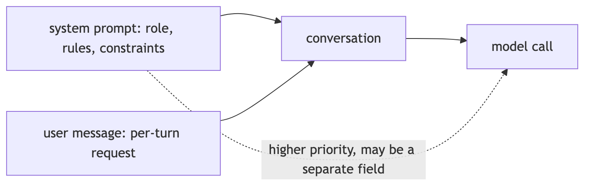
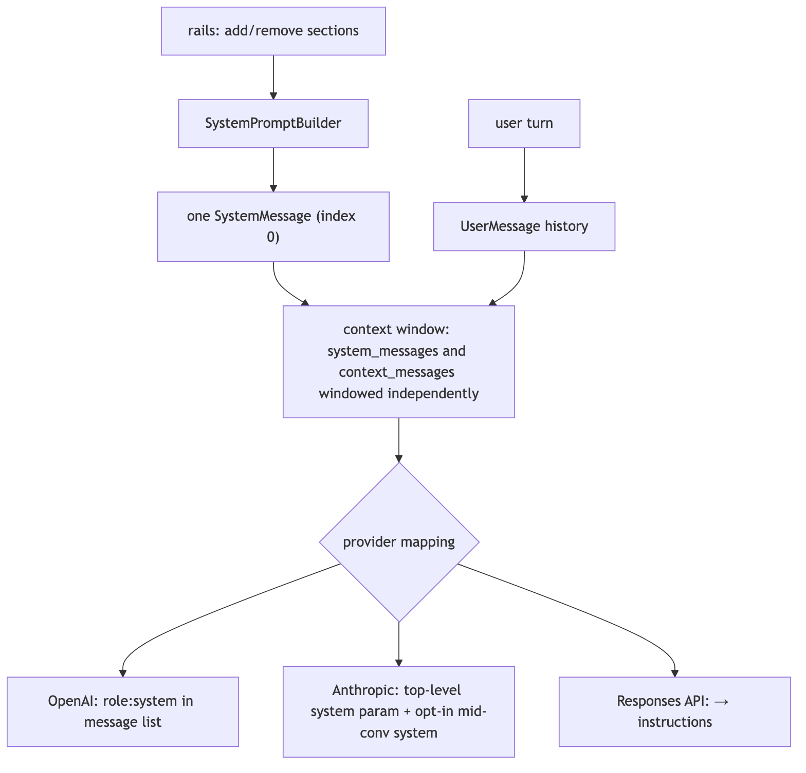
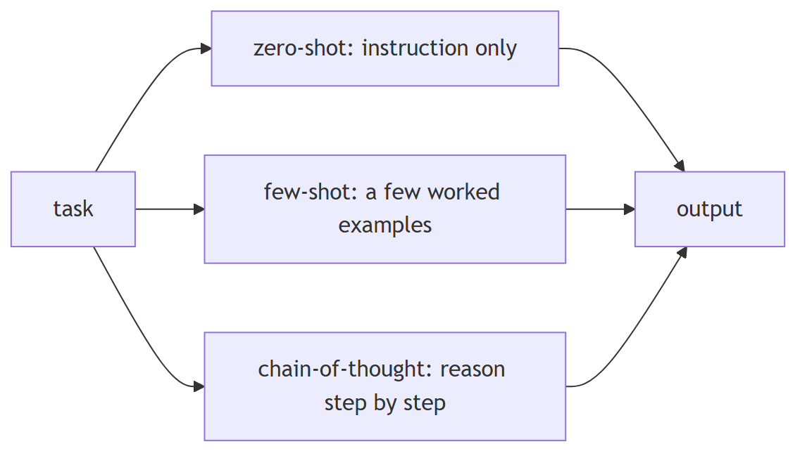
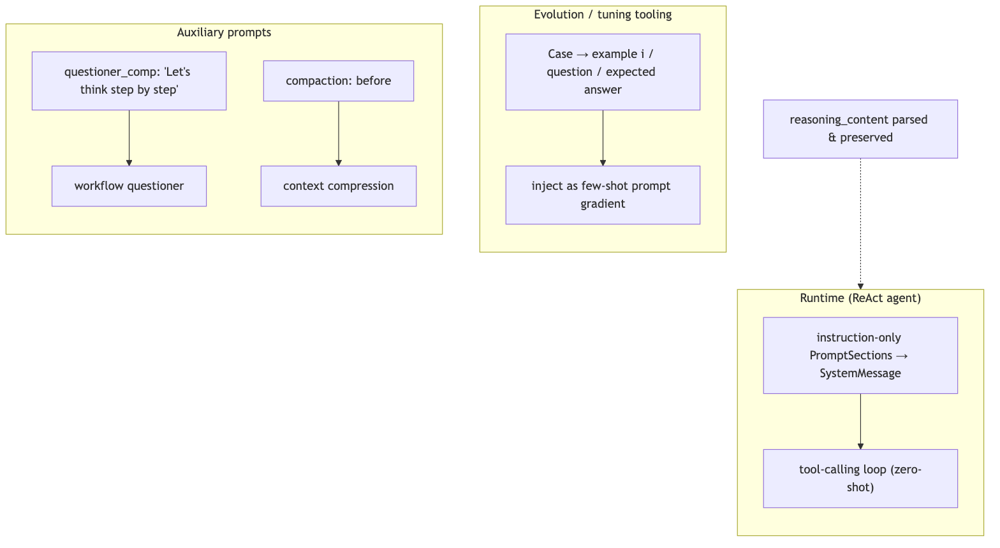
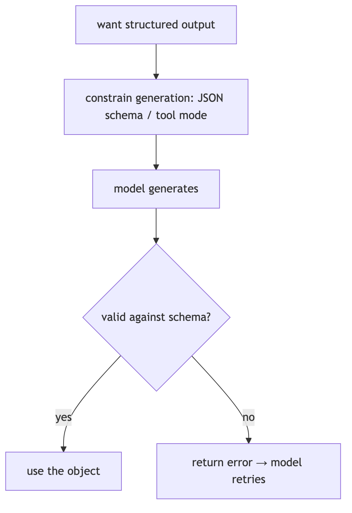
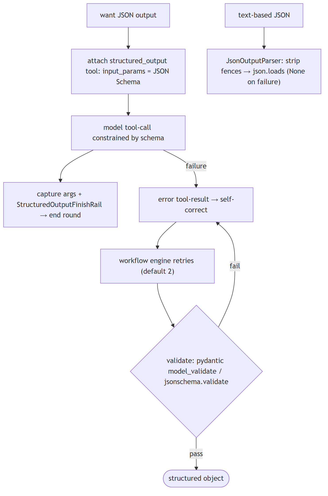
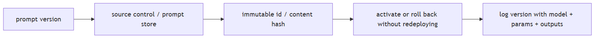
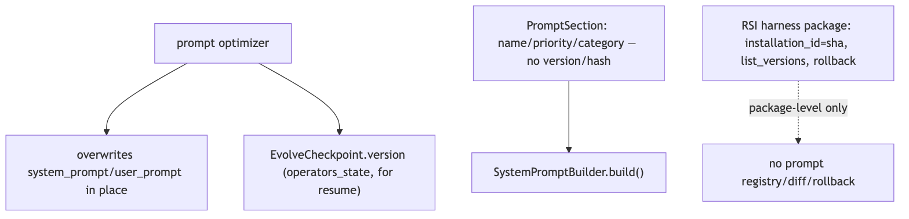

# Prompting and output control

## 1. What's the difference between a system prompt and a user prompt

**Title.** System vs user prompt

**Summary.** The system prompt sets persistent role and rules; the user prompt is the per-turn request. Providers give system content higher priority and may pass it as a separate field.

**Key points.**

- System: identity, rules, constraints — consistent across turns.
- User: the changing per-turn input.
- Anthropic lifts system to a top-level field; the Responses API folds it into instructions.

**General.** The system prompt sets persistent role, rules, persona, and constraints for the whole conversation; the user prompt is the per-turn request. Providers give the system message higher priority and apply it consistently, while user turns are the changing input. Some APIs (Anthropic) pass system content as a separate top-level field rather than a role in the message list.



**Jiuwen.** Jiuwen assembles the system prompt as one string from priority-ordered, host-injectable sections; rails can add or remove sections before the model call, and the ReAct agent renders it once as a system message passed separately. User turns are admitted as separate user-message history, and the context engine windows system and context messages independently. Provider mapping differs: OpenAI keeps the system role in the message list, Anthropic lifts system to a top-level field, and the Responses API folds it into instructions.

<details open>
<summary><b>Technical detail (classes &amp; functions)</b></summary>

The system prompt is a single assembled string from priority-ordered, host-injectable sections; rails mutate the `SystemPromptBuilder` (add/remove sections) before the model call, and `ReActAgent` renders it once as a `SystemMessage` passed as `system_messages`. User turns are admitted separately as `UserMessage` history; the context engine windows `system_messages` and `context_messages` independently. Provider mapping differs: OpenAI chat keeps `role:"system"` in the list, Anthropic lifts system content to the top-level `system` parameter (with an opt-in mid-conversation system path), and the Responses API folds system/developer into `instructions`.

<sub>&bull; `agent-core/openjiuwen/core/single_agent/agents/react_agent.py:1504` — builds one SystemMessage; :883 _admit_user_message() writes a UserMessage<br>&bull; `agent-core/openjiuwen/core/context_engine/context/context.py:574` — get_context_window(system_messages, ...); :718 _get_window_messages() windows independently<br>&bull; `agent-core/openjiuwen/harness/rails/task_planning_rail.py:154` — rail adds/removes a system-prompt section<br>&bull; `agent-core/openjiuwen/harness/rails/security/prompt_security_rail.py:17` — security section injection<br>&bull; `agent-core/openjiuwen/harness/prompts/prompt_attachment_manager.py:591` — user→system re-role per provider<br>&bull; `agent-core/openjiuwen/core/foundation/llm/model_clients/anthropic_model_client.py:379` — lifts system into top-level blocks; :858 params["system"]<br>&bull; `agent-core/openjiuwen/core/foundation/llm/utils/responses_utils.py:142` — system/developer → instructions</sub>



</details>

<sub>_Canonical source: `source/llm-fundamentals-interview-questions_for_engineers.md`_</sub>

---

## 2. Zero-shot vs. few-shot vs. chain-of-thought, when does each actually improve output

**Title.** Zero-shot, few-shot, CoT

**Summary.** Zero-shot for tasks the model knows; few-shot pins down format or edge cases; chain-of-thought helps multi-step reasoning (more as scale grows) and is largely subsumed by reasoning models.

**Key points.**

- Few-shot: worked examples fix format, labels, and conventions.
- CoT: intermediate reasoning; benefit grows with model scale.
- All add tokens; not free wins on simple tasks.

**General.** Zero-shot (instruction only) works for tasks the model saw in instruction tuning. Few-shot (worked examples) helps when the task has a specific format, label set, or edge-case convention the instruction can't fully specify. Chain-of-thought (ask for intermediate reasoning) helps multi-step reasoning/arithmetic, and its benefit generally grows with model scale (on small models it is unreliable and can even hurt); it is largely subsumed by native reasoning models. All three cost prompt tokens; examples and CoT are not free wins on simple tasks.



**Jiuwen.** The runtime agent is fundamentally zero-shot: the system prompt is built from instruction-only sections and the model is steered by the ReAct tool loop, not worked examples. Few-shot machinery exists only in the tuning/evolution tooling, which formats cases into example blocks. Chain-of-thought appears in auxiliary prompts (a workflow questioner and the compaction prompt's analysis-then-summary), and reasoning-model output is preserved by parsing the reasoning content.

<details open>
<summary><b>Technical detail (classes &amp; functions)</b></summary>

The runtime agent is fundamentally zero-shot: the system prompt is assembled from instruction-only `PromptSection`s (identity, safety, skills, tools, task guidance) and the model is steered through the ReAct tool-calling loop, not worked examples. Few-shot machinery exists only in the evolution/tuning tooling (`agent_evolving`, `dev_tools/tune`), which formats cases into example blocks and injects them as prompt gradients. Chain-of-thought appears in auxiliary prompts (workflow `questioner_comp` has an explicit "Let's think step by step") and implicitly in the compaction prompt's `<analysis>`-then-`<summary>` structure. Reasoning-model output is preserved: clients parse `reasoning_content`, and DeepSeek profiles inject an empty `reasoning_content` into assistant history.

<sub>&bull; `agent-core/openjiuwen/core/single_agent/agents/react_agent.py:842` — renders role=="system" template messages; :1504 SystemMessage(content=prompt_builder.build())<br>&bull; `agent-core/openjiuwen/core/single_agent/prompts/builder.py:219` — build() joins priority-ordered sections<br>&bull; `agent-core/openjiuwen/harness/prompts/sections/identity.py:11` — default identity prompt (zero-shot)<br>&bull; `agent-core/openjiuwen/agent_evolving/utils.py:238` — convert_cases_to_examples()<br>&bull; `agent-core/openjiuwen/dev_tools/tune/optimizer/example_optimizer.py:109` — init_examples() few-shot injection<br>&bull; `agent-core/openjiuwen/core/foundation/llm/model_clients/openai_model_client.py:347` — parses reasoning_content; agent-core/openjiuwen/core/foundation/llm/utils/endpoint_profiles.py:33 — DeepSeek empty reasoning_content<br>&bull; `agent-core/openjiuwen/core/workflow/components/llm/questioner_comp.py:68` — explicit CoT instruction</sub>



</details>

<sub>_Canonical source: `source/llm-fundamentals-interview-questions_for_engineers.md`_</sub>

---

## 3. How do you get consistent, parseable output like JSON from an LLM

**Title.** Reliable JSON output

**Summary.** Constrain generation (schema/tool mode), validate, and retry on failure; treat free-text JSON as a last resort.

**Key points.**

- Prefer provider JSON/schema mode or tool calling with a JSON Schema.
- Validate against the schema and feed errors back for a retry.
- Free-text/fenced JSON needs tolerant extraction and repair.
- Never act on unvalidated structured output.

**General.** Layer the guarantees: prefer a provider JSON/schema mode or tool/function calling with a JSON Schema so the model is constrained at generation time; validate against the schema; on failure, return the validation error to the model for a retry; only then parse. Fenced or free-text JSON should be a last resort with tolerant extraction and repair.



**Jiuwen.** The core harness has no native JSON or response-format mode; structured output is enforced by giving the model a single-use structured-output tool whose input schema is the caller's JSON Schema, so the provider's tool layer constrains the arguments. On success the arguments are captured and a finish rail ends the round; on failure the error is returned for self-correction, and the workflow engine validates the captured object. For text JSON, a JSON output parser strips a json code fence and loads the payload, returning nothing on decode failure.

<details open>
<summary><b>Technical detail (classes &amp; functions)</b></summary>

The core harness has **no native `response_format`/JSON mode**; structured output is enforced by giving the model a single-use `structured_output` tool whose `ToolCard.input_params` is the caller's JSON Schema, so the provider's tool-use layer constrains arguments. On success the arguments are captured on the tool instance and a finish rail ends the round; on failure the error tool-result is returned for self-correction, and the workflow engine retries then validates the captured object with pydantic `model_validate` or `jsonschema.validate`. For text-based JSON (compression summaries), `JsonOutputParser` strips a ```` ```json ```` fence when present and `json.loads` the payload, returning `None` on decode failure rather than raising.

<sub>&bull; `agent-core/openjiuwen/agent_teams/tools/structured_output_tool.py:46` — StructuredOutputTool; :82 input_params = schema_json; :117 StructuredOutputFinishRail.after_tool_call<br>&bull; `agent-core/openjiuwen/agent_teams/workflow/backends/team_worker_backend.py:230` — attaches one StructuredOutputTool per schema; :484 finish rail; :498 reminder<br>&bull; `agent-core/openjiuwen/agent_teams/workflow/engine/schema.py:55` — resolve_schema(); :74 coerce() (pydantic/jsonschema)<br>&bull; `agent-core/openjiuwen/agent_teams/workflow/engine/primitives.py:693` — retries; :763 coerce(res.structured, ...); agent-core/openjiuwen/agent_teams/workflow/engine/runtime.py:62 retries: int = 2<br>&bull; `agent-core/openjiuwen/core/foundation/llm/output_parsers/json_output_parser.py:15` — fence/bare extraction + json.loads; :92 stream_parse()<br>&bull; `agent-core/openjiuwen/core/context_engine/processor/compressor/round_level_compressor.py:713` — JsonOutputParser(); :1266 validates {"blocks":[...]}</sub>



</details>

<sub>_Canonical source: `source/llm-fundamentals-interview-questions_for_engineers.md`_</sub>

---

## 4. How does the framework validate a tool call's structured output before executing it

**Title.** Validating tool-call output

**Summary.** Parse arguments against the tool's schema, repair obvious damage, reject with a readable error, and never run the function on unvalidated input.

**Key points.**

- json.loads → bracket/quote repair → otherwise a readable error.
- Schema-validate (jsonschema/Pydantic) and fill defaults before invoking.
- Return the error to the model so it can self-correct.

**General.** Parse the model's arguments against the tool's JSON Schema; repair obviously damaged JSON (unbalanced brackets) when possible; reject with a readable error so the model can retry. Never run a function on unvalidated arguments.


**Jiuwen.** Before executing, the ability manager parses the model's raw argument string, first trying JSON then repairing brackets and braces; unrecoverable JSON raises an error that is fed back to the model. The parsed dict is passed to the tool, where the function and MCP wrappers run schema validation (jsonschema with a Pydantic fallback) and fill defaults. The structured-output tool uses the caller's schema as its own input, so the same path constrains captured results.

<details open>
<summary><b>Technical detail (classes &amp; functions)</b></summary>

Before executing, `AbilityManager._execute_single_tool_call` parses the model's raw argument string with `_parse_tool_arguments_with_repair`, which first tries `json.loads`, then `_repair_tool_arguments_json` to balance brackets/braces; unrecoverable JSON raises an `AbilityExecutionError` fed back to the model. The parsed dict is passed to `tool.invoke`, where `LocalFunction`/`MCPTool` call `SchemaUtils.format_with_schema`, which runs `validate_with_schema` (jsonschema, falling back to a dynamically created Pydantic model) and then fills defaults. The `structured_output` tool uses the caller's JSON Schema as its own `input_params`, so the same validation path constrains captured results.

<sub>&bull; `agent-core/openjiuwen/core/single_agent/ability_manager.py:482` — _repair_tool_arguments_json(); :537 _parse_tool_arguments_with_repair(); :1419 execution path rewrites tool_call.arguments<br>&bull; `agent-core/openjiuwen/core/foundation/tool/function/function.py:76` — LocalFunction.invoke; :82 validation via SchemaUtils.format_with_schema<br>&bull; `agent-core/openjiuwen/core/common/utils/schema_utils.py:115` — validate_with_schema() (jsonschema → Pydantic fallback); :23 format_with_schema(); :49 calls validate then fills defaults<br>&bull; `agent-core/openjiuwen/core/foundation/tool/mcp/base.py:208` — MCPTool.invoke validates MCP args via the same path<br>&bull; `agent-core/openjiuwen/agent_teams/tools/structured_output_tool.py:82` — input_params = schema_json; :86 invoke<br>&bull; `agent-core/openjiuwen/core/foundation/tool/base.py:90` — ToolCard.input_params is the schema source</sub>


</details>

<sub>_Canonical source: `source/ai-agent-framework-interview-questions_for_engineers.md`_</sub>

---

## 5. How do you version prompts the same way you'd version code

**Title.** Versioning prompts

**Summary.** Treat prompts like code: immutable IDs/hashes, diffs, activate/rollback without redeploying, and tie each version to the model and parameters it was tested with.

**Key points.**

- Store in source control or a prompt store with content hashes.
- Build prompts from composable, individually versioned sections.
- Support activate/rollback and A/B without redeploying.
- Log the prompt version alongside outputs.

**General.** Treat prompts as versioned artifacts: store them in source control (or a prompt store), give each version an immutable ID/content hash, track diffs and metadata, allow activate/rollback without redeploying, and tie a version to the model/parameters it was tested with. Ideally prompts are assembled from composable, individually versioned pieces.



**Jiuwen.** Prompts are assembled from named sections ordered by priority and extended with a mode filter; sections carry only name, priority, and category — no version or hash. Diagnostics exist but are not versioning. Prompt optimization overwrites the operator's prompts in place, and the only persistence is a checkpoint version storing operator state for resume. Real versioning and rollback exist only at the product's RSI harness-package level and in config migration.

<details open>
<summary><b>Technical detail (classes &amp; functions)</b></summary>

Prompts are assembled from named `PromptSection`s ordered by priority (`SystemPromptBuilder.add_section`/`build`), extended by `harness.prompts.builder` with a `PromptMode` filter, and JiuwenSwarm supplies a static priority registry. Sections carry only name/priority/category — no version, hash, or ID. Diagnostics exist (`PromptReport`) but are not versioning. Prompt optimization overwrites the operator's `system_prompt`/`user_prompt` in place; the only persistence is `EvolveCheckpoint.version` storing `operators_state` for resume. Real versioning/rollback exists only at the RSI harness-package level (content-addressed `installation_id`, `list_versions`, `rollback` with hash re-validation) and config migration.

<sub>&bull; `agent-core/openjiuwen/core/single_agent/prompts/builder.py:24` — PromptSection (no version); :97 add_section; :219 build<br>&bull; `agent-core/openjiuwen/harness/prompts/builder.py:21` — PromptMode filtering; agent-core/openjiuwen/harness/prompts/sections/__init__.py:6 — SectionName constants<br>&bull; `agent-core/openjiuwen/harness/prompts/report.py:58` — PromptReport diagnostics (no hash/version)<br>&bull; `agent-core/openjiuwen/harness/manifest/models.py:43` — HarnessElementDescriptor (no version field)<br>&bull; `jiuwenswarm/jiuwenswarm/agents/harness/common/prompt/priority_registry.py:19` — static priority registry<br>&bull; `agent-core/openjiuwen/core/operator/llm_call/base.py:107` — get_state/load_state snapshot prompt content<br>&bull; `agent-core/openjiuwen/agent_evolving/checkpointing/state.py:15` — EvolveCheckpoint.version for resume<br>&bull; `jiuwenswarm/jiuwenswarm/agents/harness/common/rsi/harness_activation.py:617` — rollback; :587 list_versions; jiuwenswarm/jiuwenswarm/server/rsi/rsi_handlers.py:218 — RPC list/rollback<br>&bull; `jiuwenswarm/jiuwenswarm/common/utils.py:882` — config_version migration</sub>



</details>

<sub>_Canonical source: `source/genai-interview-questions_for_engineers.md`_</sub>

---
