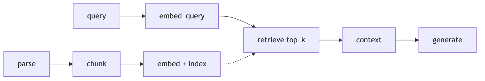
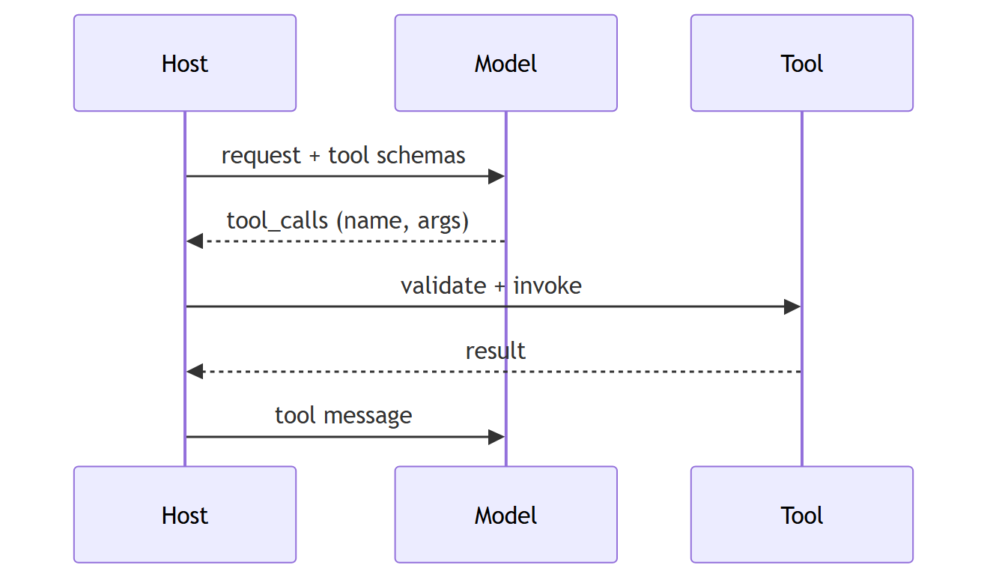
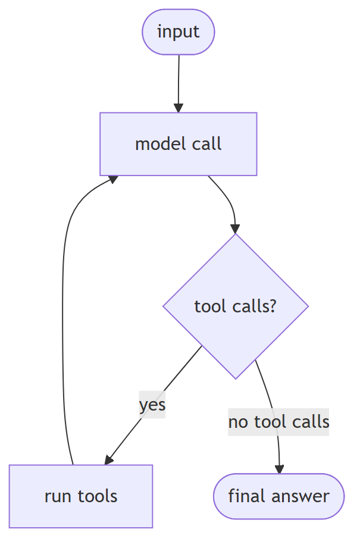
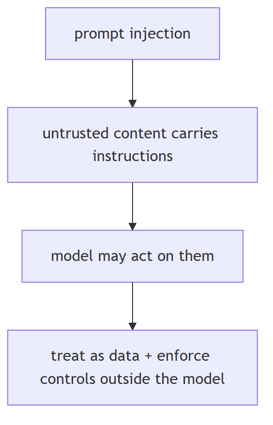
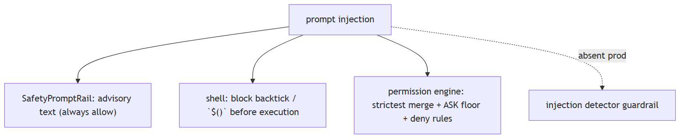

# LLM terms glossary

## 1. Token

**Title.** Token

**Summary.** The smallest sub-word unit of text a model processes.

**Key points.**

- A sub-word piece, not a word.
- Count tokens, not words.
- Drives context limits and cost.

**General.** the smallest unit of text a model processes — usually a sub-word piece, not a full word.

**Jiuwen.** Jiuwen counts tokens via a token counter: a tiktoken counter maps model names to encodings with fallback heuristics, and a tokenizer manager downloads the model's own artifacts. Counts drive context limits and cost.

<b>Technical detail (classes &amp; functions)</b>

Counts tokens, never words, via a `TokenCounter`. `TiktokenCounter` maps model names to encodings with `cl100k_base` and `len(text)//3` fallbacks; `TokenizerManager` downloads the model's own artifacts. Counts drive context limits and cost.

&bull; `agent-core/openjiuwen/core/context_engine/token/tiktoken_counter.py:212` — TiktokenCounter; :299 len//3 fallback &bull; `agent-core/openjiuwen/core/context_engine/token/tokenizer_manager.py:60` — resolves/downloads tokenizer artifacts &bull; `agent-core/openjiuwen/core/context_engine/context/context_utils.py:20` — DEFAULT_CONTEXT_MAX_TOKENS = 200000

---

## 2. Embedding

**Title.** Embedding

**Summary.** A numeric vector representing the meaning of text, used for similarity search.

**Key points.**

- Vector representation of meaning.
- Used for similarity search.
- One per query or document.

**General.** a numerical vector that represents the meaning of text, used for similarity search.

**Jiuwen.** An embedding interface defines embed-query, embed-documents, and dimension, with providers including OpenAI, DashScope, and vLLM. Indexers compute embeddings when building the index, and the model identity is not stored with the index.

<b>Technical detail (classes &amp; functions)</b>

An `Embedding` ABC defines `embed_query`/`embed_documents`/`dimension`; providers include OpenAI/DashScope/vLLM. Indexers compute embeddings via `compute_chunk_embeddings`, and the model identity is **not** stored with the index.

&bull; `agent-core/openjiuwen/core/foundation/store/base_embedding.py:24` — Embedding ABC; :29 embed_query &bull; `agent-core/openjiuwen/core/retrieval/indexing/indexer/embed_chunks.py:46` — embed_documents sets vectors &bull; `agent-core/openjiuwen/core/retrieval/embedding/utils.py:15` — base64 decode only (no normalization/instruction)

---

## 3. Context window

**Title.** Context window

**Summary.** The maximum amount of text a model can process in a single request.

**Key points.**

- Max tokens per request.
- Bounds prompt + history + output.
- Exceeding it forces trimming/compaction.

**General.** the maximum amount of text a model can process in a single request.

**Jiuwen.** The context engine budgets the window (effective budget is the strictest of window, call, and model), offloads large tool results, compacts at thresholds, and falls back to a FIFO drop beyond the max context message count.

<b>Technical detail (classes &amp; functions)</b>

The context engine budgets the window (`effective_context_budget` = strictest of window/call/model), offloads large tool results, compacts at thresholds, and falls back to a FIFO drop beyond `max_context_message_num`.

&bull; `agent-core/openjiuwen/core/context_engine/context/context_utils.py:20/404` — window resolution &bull; `agent-core/openjiuwen/core/context_engine/processor/budget_guard.py:37` — effective_context_budget &bull; `agent-core/openjiuwen/core/context_engine/context/message_buffer.py:71` — FIFO drop beyond 2×

---

## 4. Temperature

**Title.** Temperature

**Summary.** Controls sampling randomness; lower values produce more deterministic output.

**Key points.**

- Scales logits before sampling.
- Lower = more deterministic.
- 0 ≈ greedy.

**General.** controls output randomness at sampling; lower values produce more deterministic output.

**Jiuwen.** Temperature is a passthrough request param; the local HF/vLLM path implements softmax over logits divided by temperature, and temperature <= 0 becomes argmax. Some calls default to the provider default while the local generation default is 0.0.

<b>Technical detail (classes &amp; functions)</b>

A passthrough request param; the local HF/vLLM path implements `softmax(logits/T)` with `T<=0` → argmax. Some calls default to `None` (provider default), while the local `GenerationConfig` default is `0.0`.

&bull; `agent-core/openjiuwen/core/foundation/llm/schema/config.py:210` — temperature: Optional[float] = None &bull; `agent-core/openjiuwen/core/foundation/llm/model_clients/base_model_client.py:556` — resolved/passed &bull; `agent-core/openjiuwen/symphony/retrieval/llm/transformers_prefix_cached_generation/generation.py:516` — logits / max(1e-6, temperature); :514 argmax

---

## 5. Top-p (nucleus sampling)

**Title.** Top-p (nucleus sampling)

**Summary.** Limits token selection to the smallest set whose cumulative probability exceeds p.

**Key points.**

- Cumulative-probability cutoff.
- Nucleus sampling.
- Alternative to top-k.

**General.** limits token selection to the smallest set of tokens whose combined probability exceeds `p`.

**Jiuwen.** Top-p is implemented locally with a default of 1.0; top-k sampling is absent from the local sampler (Anthropic's top-k is only a passthrough). Note that top-k elsewhere in the codebase means retrieval result count, not sampling.

<b>Technical detail (classes &amp; functions)</b>

Top-p is implemented locally (`top_p` default `1.0`); **top-k sampling is absent** from the local sampler (Anthropic `top_k` is only a passthrough). Beware: `top_k` elsewhere in the codebase means retrieval result count, not sampling.

&bull; `agent-core/openjiuwen/symphony/retrieval/llm/base/types.py:61` — GenerationConfig.top_p = 1.0 (no top-k field) &bull; `agent-core/openjiuwen/symphony/retrieval/llm/transformers_prefix_cached_generation/generation.py:517` — nucleus truncation; :534 full-distribution softmax when top_p ∉ (0,1) &bull; `agent-core/openjiuwen/core/foundation/llm/model_clients/anthropic_model_client.py:940` — top_k passthrough

---

## 6. RAG

**Title.** RAG (retrieval-augmented generation)

**Summary.** Giving a model external data by retrieving relevant passages and putting them in the prompt before generation.

**Key points.**

- Retrieve relevant passages.
- Put them in the prompt.
- Grounds generation in external data.

**General.** giving a model access to external data by retrieving relevant passages and putting them in the prompt before generation.

**Jiuwen.** Ingestion runs parse files, chunk documents, and build index; query-time retrieval runs retrieve then vector store search, wired through a knowledge-retrieval component and an LLM component.

<b>Technical detail (classes &amp; functions)</b>

Ingestion (`parse_files` → `chunk_documents` → `build_index`) plus query-time retrieval (`retrieve` → `vector_store.search`) wired through `KnowledgeRetrievalComponent` and `LLMComponent`.

&bull; `agent-core/openjiuwen/core/retrieval/simple_knowledge_base.py:96/110/182` — ingest + retrieve &bull; `agent-core/openjiuwen/core/workflow/components/resource/knowledge_retrieval_comp.py:109` — retrieve_multi_kb_with_source &bull; `agent-core/openjiuwen/core/workflow/components/llm/llm_comp.py:654` — context/query template

---

## 7. Chunking

**Title.** Chunking

**Summary.** Splitting documents into smaller pieces before embedding so retrieval returns relevant sections.

**Key points.**

- Split docs before embedding.
- Size and overlap matter.
- Affects retrieval granularity.

**General.** splitting documents into smaller pieces before embedding so retrieval returns relevant sections.

**Jiuwen.** There are char, token, and hybrid chunkers with validation (chunk size > 0, overlap < size), tokenizer-length clamping, and sentence-boundary packing on the token path; the hybrid chunker keeps table rows and columns whole. No header or code-aware chunker.

<b>Technical detail (classes &amp; functions)</b>

Char/token/hybrid chunkers with validation (`chunk_size>0`, `overlap<size`), tokenizer-length clamping, and sentence-boundary packing on the token path; table rows/columns kept whole by `HybridChunker`. No header/code-aware chunker.

&bull; `agent-core/openjiuwen/core/retrieval/indexing/processor/chunker/base.py:36/59` — defaults + validation &bull; `agent-core/openjiuwen/core/retrieval/indexing/processor/chunker/chunking.py:82` — tokenizer-limit auto-adjust &bull; `agent-core/openjiuwen/core/retrieval/indexing/processor/chunker/hybrid_chunker.py:19` — keep row/column units whole

---

## 8. Vector database

**Title.** Vector database

**Summary.** A database built for similarity search over embeddings rather than exact-match queries.

**Key points.**

- Optimized for similarity search.
- Stores embeddings + metadata.
- Supports ANN indexes.

**General.** a database built for similarity search over embeddings rather than exact-match queries.

**Jiuwen.** Chroma (local, vector-only), Milvus (server, BM25, hybrid, quantized indexes), and PGVector sit behind one factory. Metadata filters are supported at the store level but dropped at the retriever.

<b>Technical detail (classes &amp; functions)</b>

Chroma (local, vector-only), Milvus (server, BM25 + hybrid + quantized indexes), PGVector (relational) behind one factory; metadata filters supported at store level but dropped at the retriever.

&bull; `agent-core/openjiuwen/core/retrieval/vector_store/store.py:16` — create_vector_store; agent-core/openjiuwen/core/retrieval/common/config.py:67 — StoreType &bull; `agent-core/openjiuwen/core/retrieval/vector_store/milvus_store.py:108` — ; agent-core/openjiuwen/core/retrieval/vector_store/chroma_store.py:120; agent-core/openjiuwen/core/retrieval/vector_store/pg_store.py:108 &bull; `agent-core/openjiuwen/core/retrieval/retriever/vector_retriever.py:88` — filters=None (dropped)

---

## 9. Reranking

**Title.** Reranking

**Summary.** Reordering retrieved documents by actual relevance (often a cross-encoder) after a broad initial retrieval.

**Key points.**

- Second-stage relevance ordering.
- Usually a cross-encoder.
- Retrieve many, keep few.

**General.** reordering retrieved documents by actual relevance (via a cross-encoder) after an initial broad retrieval.

**Jiuwen.** A reranker interface with cross-encoder and LLM variants exists, but it is wired only into the graph store; the default knowledge-base path never reranks, so retrieve-20-rerank-to-5 is not available out of the box.

<b>Technical detail (classes &amp; functions)</b>

A `Reranker` ABC with cross-encoder/LLM variants exists, but it is wired only into the graph store — the default KB path never reranks, so "retrieve 20, rerank to 5" is not available out of the box.

&bull; `agent-core/openjiuwen/core/foundation/store/base_reranker.py:37/41` — Reranker ABC &bull; `agent-core/openjiuwen/core/retrieval/reranker/standard_reranker.py:23` — StandardReranker (/rerank) &bull; `agent-core/openjiuwen/core/foundation/store/graph/milvus/milvus_support.py:458` — applied only in graph store &bull; `agent-core/openjiuwen/core/retrieval/simple_knowledge_base.py:182` — KB path calls no reranker

---

## 10. Hallucination

**Title.** Hallucination

**Summary.** Confident but factually incorrect or unsupported output.

**Key points.**

- Confident and wrong.
- Not grounded in source.
- Mitigate with grounding and checks.

**General.** confident but factually incorrect or unsupported output.

**Jiuwen.** There is no hallucination or attribution detector. Mitigations exist separately: a verification agent (read-only evidence, PASS/FAIL/PARTIAL), a reviewer correctness dimension, and an evidence-citation rubric — but none receives the retrieved context as a faithfulness check.

<b>Technical detail (classes &amp; functions)</b>

No hallucination/attribution detector. Mitigations exist separately: a verification agent (read-only evidence, PASS/FAIL/PARTIAL), a reviewer `Correctness` dimension, and the RSI evidence-citation rubric — none receives the retrieved context as a faithfulness check.

&bull; `agent-core/openjiuwen/harness/rails/subagent/verification_rail.py:92` — VerificationRail tool allowlist &bull; `agent-core/openjiuwen/agent_teams/verification/reviewer.py:43` — Correctness dimension &bull; `agent-core/openjiuwen/symphony/evaluation/evaluators.py:438` — AccuracyEvaluator &bull; `agent-core/openjiuwen/agent_evolving/evaluator/metrics/llm_as_judge.py:40` — no context input

---

## 11. Fine-tuning

**Title.** Fine-tuning

**Summary.** Further training a model on a specific dataset to adjust its behavior or style.

**Key points.**

- Adapts a pretrained model.
- Needs task data.
- Changes behavior, not just knowledge.

**General.** further training a model on a specific dataset to adjust its behavior or style.

**Jiuwen.** Real SFT and PPO run via the RL framework, exporting versioned LoRA/PEFT adapters (no full fine-tuning, no pretraining). Automatic prompt optimization is the default alternative.

<b>Technical detail (classes &amp; functions)</b>

Real SFT + PPO via veRL, exporting versioned **LoRA/PEFT** adapters (no full fine-tuning, no pretraining). Prompt optimization is the default alternative.

&bull; `agent-core/openjiuwen/agent_evolving/agent_rl/online/backends/sft/trainer.py:44` — SFTTrainingExecutor; :455 _export_sft_lora_adapter &bull; `agent-core/openjiuwen/agent_evolving/agent_rl/optimizer/task_runner.py:438` — export_lora &bull; `agent-core/openjiuwen/agent_evolving/agent_rl/storage/lora_repo.py:56` — versioned adapter store

---

## 12. Prompt engineering

**Title.** Prompt engineering

**Summary.** Structuring input to get a reliable, specific output without changing the model.

**Key points.**

- Shape input, not weights.
- Improve reliability/format.
- Cheap and fast to iterate.

**General.** structuring input to get a reliable, specific output without changing the model.

**Jiuwen.** System prompts are assembled from priority-ordered prompt sections that rails can add or remove per call. There is no native JSON mode; structured output is done by exposing a schema as a tool.

<b>Technical detail (classes &amp; functions)</b>

System prompts are assembled from priority-ordered `PromptSection`s that rails can add/remove per call; no native JSON mode (structured output is schema-as-tool).

&bull; `agent-core/openjiuwen/core/single_agent/prompts/builder.py:24/97/219` — PromptSection + build() &bull; `agent-core/openjiuwen/harness/rails/task_planning_rail.py:154` — rail mutates system prompt &bull; `agent-core/openjiuwen/core/single_agent/agents/react_agent.py:1504` — rendered SystemMessage

---

## 13. Few-shot prompting

**Title.** Few-shot prompting

**Summary.** Providing a small number of examples in the prompt to guide output format or behavior.

**Key points.**

- A few examples in the prompt.
- Guides format/behavior.
- Costs tokens per call.

**General.** providing a small number of examples in the prompt to guide output format/behavior.

**Jiuwen.** The runtime agent is zero-shot; few-shot example injection exists only in the tuning tooling (converting cases to examples and initializing examples), not in the harness or single-agent core.

<b>Technical detail (classes &amp; functions)</b>

The runtime agent is zero-shot; few-shot example injection exists only in the tuning tooling (`convert_cases_to_examples`, `init_examples`), not in `harness`/`core/single_agent`.

&bull; `agent-core/openjiuwen/agent_evolving/utils.py:238` — convert_cases_to_examples() &bull; `agent-core/openjiuwen/dev_tools/tune/optimizer/example_optimizer.py:109` — init_examples() &bull; `agent-core/openjiuwen/harness/prompts/sections/identity.py:11` — default zero-shot identity prompt

---

## 14. Chain-of-thought prompting

**Title.** Chain-of-thought prompting

**Summary.** Asking the model to reason step by step before giving a final answer.

**Key points.**

- Intermediate reasoning steps.
- Improves multi-step accuracy.
- Can be implicit in reasoning models.

**General.** asking the model to reason step by step before giving a final answer.

**Jiuwen.** There is no global chain-of-thought instruction in the deep-agent prompt; explicit CoT appears in auxiliary prompts (a workflow questioner) and implicitly in compaction. Reasoning-model output is parsed and preserved.

<b>Technical detail (classes &amp; functions)</b>

No global CoT instruction in the DeepAgent prompt; explicit CoT appears in auxiliary prompts (workflow `questioner_comp`) and implicitly in compaction. Reasoning-model output (`reasoning_content`) is parsed and preserved.

&bull; `agent-core/openjiuwen/core/workflow/components/llm/questioner_comp.py:68` — "Let's think step by step" &bull; `agent-core/openjiuwen/core/foundation/llm/model_clients/openai_model_client.py:347` — parses reasoning_content &bull; `agent-core/openjiuwen/core/foundation/llm/utils/endpoint_profiles.py:33` — DeepSeek empty reasoning_content

---

## 15. Function calling

**Title.** Function calling

**Summary.** A model's ability to emit a structured request to invoke an external tool or API.

**Key points.**

- Model emits structured tool calls.
- Tools described as schemas.
- Runtime executes and returns results.

**General.** a model's ability to emit a structured request to invoke an external tool/API.

**Jiuwen.** Cards become JSON Schema via the callable schema extractor, the ability manager builds the model-facing tool list, and tool calls are parsed per provider, validated in the local function invoke, and dispatched.

<b>Technical detail (classes &amp; functions)</b>

Cards become JSON Schema via the callable schema extractor, the ability manager builds the model-facing tool list, and tool calls are parsed per provider, validated in `LocalFunction.invoke`, and dispatched.

&bull; `agent-core/openjiuwen/core/foundation/tool/utils/callable_schema_extractor.py:20` — card → JSON Schema &bull; `agent-core/openjiuwen/core/single_agent/ability_manager.py:984/1078` — tool list + dispatch &bull; `agent-core/openjiuwen/core/foundation/tool/function/function.py:82` — argument schema validation

---

## 16. Agent

**Title.** Agent

**Summary.** A system where the model plans, calls tools, and decides its own next step in a loop.

**Key points.**

- Model decides next steps.
- Uses tools in a loop.
- Bounded by iterations/stopping.

**General.** a system where the model plans, calls tools, and decides its own next step in a loop.

**Jiuwen.** The ReAct loop calls the model, executes tools on tool calls, and returns when none are present, bounded by max iterations; the deep agent adds an outer task loop with stop evaluators.

<b>Technical detail (classes &amp; functions)</b>

The ReAct loop calls the model, executes tools on `tool_calls`, and returns when none are present, bounded by `max_iterations`; `DeepAgent` adds an outer task loop with stop evaluators.

&bull; `agent-core/openjiuwen/core/single_agent/agents/react_agent.py:2740` — loop; :2793 no tool calls → answer; :2813 execute tools &bull; `agent-core/openjiuwen/core/single_agent/agents/react_agent.py:288` — max_iterations &bull; `agent-core/openjiuwen/harness/deep_agent.py:2694` — outer task loop

---

## 17. Memory

**Title.** Memory

**Summary.** Context an agent retains across turns (short-term) or sessions (long-term).

**Key points.**

- Short-term = current context window.
- Long-term = persisted across sessions.
- Retrieval chooses what to bring back.

**General.** context an agent retains across turns (short-term) or sessions (long-term).

**Jiuwen.** Short-term memory is a session model context with a bounded message buffer; long-term is a typed memory taxonomy. The product adds a SQLite/FTS5 hybrid index over markdown memory files.

<b>Technical detail (classes &amp; functions)</b>

Short-term is `SessionModelContext` with a bounded `ContextMessageBuffer`; long-term is `LongTermMemory` with a typed taxonomy. The product adds a SQLite/FTS5 hybrid index over markdown memory files.

&bull; `agent-core/openjiuwen/core/context_engine/context/context.py:44` — SessionModelContext; agent-core/openjiuwen/core/context_engine/context/message_buffer.py:11 — ContextMessageBuffer &bull; `agent-core/openjiuwen/core/memory/long_term_memory.py:69` — LongTermMemory &bull; `jiuwenswarm/jiuwenswarm/agents/harness/common/memory/manager.py:183/805` — product hybrid memory index

---

## 18. Latency

**Title.** Latency

**Summary.** The time between sending a request and receiving a complete response.

**Key points.**

- End-to-end response time.
- TTFT matters for streaming.
- Affected by model, context, tools.

**General.** the time between sending a request and receiving a complete response.

**Jiuwen.** Streaming with per-call TTFT, parallel tool execution, KV/prefix cache affinity, and model failover. There is no latency-based routing or result cache.

<b>Technical detail (classes &amp; functions)</b>

Streaming with per-call `ttft_ms`, parallel tool execution, KV/prefix cache affinity, and model failover; no latency-based routing or result cache.

&bull; `agent-core/openjiuwen/core/single_agent/agents/react_agent.py:2938` — stream; :1758 ttft_ms &bull; `agent-core/openjiuwen/core/single_agent/ability_manager.py:431` — parallel tool execution &bull; `agent-core/openjiuwen/core/common/clients/connector_pool.py:21` — bounded connection pool

---

## 19. Quantization

**Title.** Quantization

**Summary.** Reducing a model's numerical precision to shrink size and speed up inference.

**Key points.**

- Lower-precision weights.
- Smaller/faster, some accuracy loss.
- Applies to weights and indexes.

**General.** reducing a model's numerical precision to shrink size and speed up inference.

**Jiuwen.** Model-weight quantization is not implemented here — it is a passthrough engine param for local vLLM. Vector-index quantization is first-class for Milvus: SQ8 (about 75% memory cut), PQ, PRQ, RABITQ, and SCANN (IVF plus product quantization).

<b>Technical detail (classes &amp; functions)</b>

Model-weight quantization is **not implemented** here — it is a passthrough engine param for local vLLM. Vector-index quantization is first-class for Milvus: SQ8 (~75% memory cut), PQ, PRQ, RABITQ, and SCANN (IVF + product quantization).

&bull; `agent-core/openjiuwen/core/foundation/store/vector_fields/milvus_fields.py:209` — quantization variants; :211 SQ8; :212 PQ; :213 RABITQ &bull; `agent-core/openjiuwen/core/foundation/store/vector_fields/milvus_fields.py:167` — SCANN (IVF + product quantization) &bull; `agent-core/openjiuwen/symphony/retrieval/llm/vllm/client.py:613` — "quantization": None (engine passthrough)

---

## 20. Prompt injection

**Title.** Prompt injection

**Summary.** Malicious or unintended instructions embedded in input or retrieved content that hijack the model.

**Key points.**

- Untrusted content as instructions.
- Direct or indirect (retrieval/tools).
- Defend outside the model.

**General.** malicious or unintended instructions embedded in input or retrieved content that hijack the model.

**Jiuwen.** Enforcement lives in the shell and permission layer (substitution blocking, AST ask floor, builtin deny rules); safety text is advisory and injection detectors are largely unregistered. The untrusted-tool-result seam is missing.

<b>Technical detail (classes &amp; functions)</b>

Enforcement lives in the shell/permission layer (substitution blocking, AST ASK floor, builtin deny rules); safety text is advisory and injection detectors are largely unregistered. The untrusted-tool-result seam is missing.

&bull; `agent-core/openjiuwen/harness/rails/security/prompt_security_rail.py:16` — SafetyPromptRail; :38 injects safety section &bull; `agent-core/openjiuwen/harness/tools/shell/bash/_security.py:40` — check_injection blocks &bull; `agent-core/openjiuwen/harness/security/permission_engine/toolguard/tool_policy.py:409` — shell AST ASK floor; agent-core/openjiuwen/harness/security/permission_engine/core.py:272 — strictest merge &bull; `agent-core/openjiuwen/core/security/guardrail/builtin.py:60` — PromptInjectionGuardrail (unregistered in production)

---
