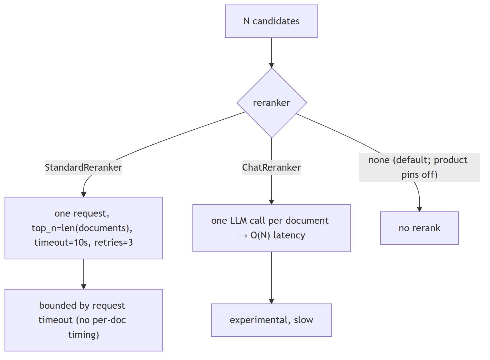

# RAG and retrieval

## 1. Walking through a RAG pipeline end to end, query to final answer

**Title.** RAG pipeline end to end

**Summary.** Two halves — ingestion (parse → chunk → embed → index) and query (embed → retrieve → rerank → assemble → generate); every stage is separable and can fail.

**Key points.**

- Ingestion: parse files, chunk, embed, and write vectors to the store.
- Query: embed the query, retrieve top-k (dense and/or sparse), rerank, assemble context.
- Generation sees only the assembled context; cite from it.
- Quality drops can come from any stage — isolate them.

**General.** Ingest: parse → chunk → embed → index. Query: embed the query → retrieve top-k (dense and/or sparse) → rerank → assemble the retrieved context into the prompt → generate → optionally cite. Each stage is separable; failures and quality drops can occur at any of them.

**Jiuwen.** Jiuwen builds this from composable pieces rather than a packaged app. During ingestion it parses files, chunks them, and an indexer computes embeddings and writes them to the vector store. At query time the knowledge base lazily creates a vector, sparse, or hybrid retriever (chosen by the index type), gets the top-k chunks, and a workflow component folds them into the prompt for the model. Reranking exists but is not wired into the default knowledge-base path.

<b>Technical detail (classes &amp; functions)</b>

Ingestion: `KnowledgeBase.parse_files` (parser), then `SimpleKnowledgeBase.add_documents` calls `chunker.chunk_documents`, builds an `IndexConfig`, and `Indexer.build_index` computes embeddings via `compute_chunk_embeddings` and writes them to the vector store. Query: `SimpleKnowledgeBase.retrieve` lazily instantiates `VectorRetriever`/`SparseRetriever`/`HybridRetriever` by `index_type`, embeds the query, and calls `vector_store.search`. The production end-to-end wiring is the workflow `KnowledgeRetrievalComponent`, which returns `results`/`context` (texts joined by `\n\n`); a downstream `LLMComponent` formats them (e.g. `Context:\n{{context}}\n\nQuestion: {{query}}`).

&bull; `agent-core/openjiuwen/core/retrieval/simple_knowledge_base.py:96` — chunk_documents; :110 build_index(chunks=..., embed_model=...); :182 delegate to retriever &bull; `agent-core/openjiuwen/core/retrieval/indexing/indexer/embed_chunks.py:46/73` — embed_documents / embed_multimodal set chunk.embedding &bull; `agent-core/openjiuwen/core/retrieval/retriever/vector_retriever.py:78` — embed_query → vector_store.search &bull; `agent-core/openjiuwen/core/workflow/components/resource/knowledge_retrieval_comp.py:109` — retrieve_multi_kb_with_source(...); :243 joins texts into context &bull; `agent-core/openjiuwen/core/workflow/components/llm/llm_comp.py:654` — template format feeding {{context}}/{{query}}

_Canonical source: `source/ai-engineer-technical-questions_for_engineers.md`_

---

## 2. The pipeline: query embedding, vector search, context assembly, prompt construction, generation

**Title.** Pipeline stages

**Summary.** The same pipeline stage by stage: query embedding → vector search → context assembly → prompt construction → generation.

**Key points.**

- Embed the query with the same model used for the index.
- Vector search returns top-k candidate chunks.
- Assemble the hits into a context string and build the prompt.
- Generate the answer from that context.

**General.** Ingest: parse → chunk → embed → index. Query: embed the query → retrieve top-k (dense and/or sparse) → rerank → assemble the retrieved context into the prompt → generate → optionally cite. Each stage is separable; failures and quality drops can occur at any of them.

**Jiuwen.** Each stage is a distinct component: the query is embedded, a retriever performs the vector search over the store, the retrieval workflow component concatenates the hits into a context string, and the LLM component formats that context into the prompt and calls the model. The stages are swappable and can be instrumented independently.

<b>Technical detail (classes &amp; functions)</b>

Ingestion: `KnowledgeBase.parse_files` (parser), then `SimpleKnowledgeBase.add_documents` calls `chunker.chunk_documents`, builds an `IndexConfig`, and `Indexer.build_index` computes embeddings via `compute_chunk_embeddings` and writes them to the vector store. Query: `SimpleKnowledgeBase.retrieve` lazily instantiates `VectorRetriever`/`SparseRetriever`/`HybridRetriever` by `index_type`, embeds the query, and calls `vector_store.search`. The production end-to-end wiring is the workflow `KnowledgeRetrievalComponent`, which returns `results`/`context`; a downstream `LLMComponent` formats them into the prompt.

&bull; `agent-core/openjiuwen/core/retrieval/simple_knowledge_base.py:96` — chunk_documents; :110 build_index(...); :182 delegate to retriever &bull; `agent-core/openjiuwen/core/retrieval/indexing/indexer/embed_chunks.py:46/73` — embed_documents / embed_multimodal &bull; `agent-core/openjiuwen/core/retrieval/retriever/vector_retriever.py:78` — embed_query → vector_store.search &bull; `agent-core/openjiuwen/core/workflow/components/resource/knowledge_retrieval_comp.py:109` — retrieve_multi_kb_with_source(...); :243 joins texts into context &bull; `agent-core/openjiuwen/core/workflow/components/llm/llm_comp.py:654` — template format feeding {{context}}/{{query}}

_Canonical source: `source/rag-practical-interview-questions_for_engineers.md`_

---

## 3. How do you measure whether your retrieval step is actually working

**Title.** Measuring retrieval

**Summary.** Use a labeled (query, relevant docs) set and ranked metrics — Recall@k, Precision@k, MRR, NDCG — and track zero-result rate.

**Key points.**

- Recall@k: did the relevant docs make the top-k?
- Precision@k / MRR / NDCG: how high and how well-ordered the hits are.
- Track zero-result rate and score distributions in production.
- Judge retrieval separately from generation.

**General.** Use retrieval metrics against a labeled set of (query, relevant docs): Recall@k (did the relevant docs appear in top-k?), Precision@k (of the top-k, how many are relevant?), MRR (mean of 1/rank of the first relevant hit, averaged over queries), and NDCG (position-weighted with graded relevance). Track zero-result rate and score distributions in production, and check that a reranker actually improves NDCG rather than just reordering.

**Jiuwen.** Jiuwen does not ship retrieval metrics — there is no recall/precision/MRR/NDCG and no gold-relevance set; its metric interface is pairwise (prediction vs label), not ranked-list. The reranker ships only a demo score-delta script. So measuring retrieval here means bringing your own labeled set and tooling; in-repo you can only observe retrieval scores and whether results came back.

<b>Technical detail (classes &amp; functions)</b>

None of these metrics exist. There is no `recall_at_k`/`precision_at_k`/MRR/NDCG, no ranked-list metric interface (`Metric.compute(prediction, label)` is pairwise), and no gold-relevance set. The only recall/precision present is *classification* metrics in the PerStream example and sklearn gate tests. The reranker's only before/after evidence is a demo score-delta script with no labels.

&bull; `agent-core/openjiuwen/agent_evolving/evaluator/metrics/base.py:42` — compute(prediction, label), no ranked list &bull; `agent-core/openjiuwen/agent_evolving/evaluator/metrics/__init__.py:11` — only three metrics exported &bull; `agent-core/examples/PerStream/src/eval/score_proactive_judge.py:355/362` — classification recall/precision &bull; `agent-core/examples/store/showcase_milvus_graph_store.py:51` — reranker score-delta (no labels)

_Canonical source: `source/rag-part1-interview-questions_for_engineers.md`_

---

## 4. What is Modular RAG, and how is it different from a simple RAG pipeline

**Title.** Modular RAG

**Summary.** Simple RAG is a fixed chain; Modular RAG decomposes it into swappable modules (indexing, retrieval, fusion, reranking, query rewriting, generation) that can be routed and scheduled.

**Key points.**

- Simple RAG: retrieve → stuff → generate, fixed order.
- Modular RAG: interchangeable modules with routing/orchestration.
- Lets you add rewriting, reranking, or iteration per query.

**General.** A simple RAG pipeline is a fixed linear chain (retrieve → stuff → generate). Modular RAG decomposes it into interchangeable modules — indexing, retrieval, fusion, reranking, query rewriting, generation, orchestration — with routing and scheduling, so you can swap or add modules (rewrite, rerank, iterative/multi-hop retrieval) and branch conditionally per query. It is "RAG as a configurable graph of components" rather than one hardcoded path. The cost is more moving parts and the need for a router/orchestrator.

**Jiuwen.** Jiuwen has modular, pluggable building blocks — parsers self-register by file type, chunkers come from a registry, the retriever is chosen by index type, the vector store comes from a factory, rerankers and query rewriters are swappable classes, and an LLM-driven agentic retriever is toggled by config. But the modules are wired together manually via config and workflow components; there is no automatic router or scheduler deciding the module graph per query.

<b>Technical detail (classes &amp; functions)</b>

The building blocks are modular and pluggable: parsers self-register by extension, chunkers are selected from a registry, retrievers are chosen by `index_type`, the vector store comes from a factory, rerankers and query rewriters are swappable classes, and `RetrievalConfig.agentic` toggles the LLM-driven iterative retriever. But the modules are composed **manually** via config/KB construction — there is no per-query router/scheduler that assembles a module graph, and `AgenticRetriever` derives its mode from `index_type` rather than planning.

&bull; `agent-core/openjiuwen/core/retrieval/indexing/processor/parser/auto_file_parser.py:21` — parser registry by extension &bull; `agent-core/openjiuwen/core/retrieval/indexing/processor/chunker/__init__.py:117` — chunker registry &bull; `agent-core/openjiuwen/core/retrieval/simple_knowledge_base.py:141` — retriever selection by index_type; :172 agentic wrap toggle &bull; `agent-core/openjiuwen/core/retrieval/vector_store/store.py:16` — vector store factory; agent-core/openjiuwen/core/retrieval/common/config.py:67 — StoreType &bull; `agent-core/openjiuwen/core/retrieval/reranker/standard_reranker.py:23` — swappable reranker &bull; `agent-core/openjiuwen/core/retrieval/query_rewriter/query_rewriter.py:412` — query rewriter module &bull; `agent-core/openjiuwen/core/retrieval/common/config.py:51` — agentic toggle

_Canonical source: `source/rag-part1-interview-questions_for_engineers.md`_

---

## 5. Deciding chunk size, and what breaks at each extreme

**Title.** Choosing chunk size

**Summary.** Too small loses context and splits answers; too large dilutes the embedding. Start at a few hundred tokens with modest overlap.

**Key points.**

- Small chunks: precise but may lack context or split the answer.
- Large chunks: richer context but a diluted, multi-topic embedding.
- Start ~a few hundred tokens with small overlap; tune by measuring.

**General.** Chunk size trades context against precision. Too small and each chunk lacks the context to answer (and the answer may be split across chunks); too large and a chunk covers many topics, diluting the embedding and wasting the prompt budget. Practical defaults are a few hundred tokens with modest overlap, then tune against a retrieval eval. Size is usually measured in tokens (what the model sees), not characters.

**Jiuwen.** Jiuwen defaults chunk_size to 512 with chunk_overlap 50, measured in characters (char chunker) or tokens (tokenizer chunker). It validates size/overlap, clamps token chunks to the tokenizer limit, and rejects Milvus writes above 65535 characters — but there is no feedback loop telling you a size was a bad choice, so you tune it yourself and evaluate externally.

<b>Technical detail (classes &amp; functions)</b>

`Chunker.__init__` defaults `chunk_size=512`, `chunk_overlap=50`, `length_function=len`. Size is measured in characters (`CharChunker` → `CharSplitter`, `len()`) or tokens (`TokenizerChunker` → `IndexSentenceSplitter` → `SentenceSplitter`, tokenizer length). Hard validation rejects `chunk_size<=0`, `chunk_overlap<0`, and `chunk_overlap>=chunk_size`. Token-based chunk size is silently clamped to the embedding tokenizer's `model_max_length` (`_resolve_chunk_size`), and DB caps fail at write time (Milvus text field `max_length=65535`, pgvector dims ≤2000).

&bull; `agent-core/openjiuwen/core/retrieval/indexing/processor/chunker/base.py:36` — defaults chunk_size=512, chunk_overlap=50; :59/64/69 validation raises &bull; `agent-core/openjiuwen/core/retrieval/common/config.py:34` — KnowledgeBaseConfig.chunk_size/chunk_overlap &bull; `agent-core/openjiuwen/core/retrieval/indexing/processor/chunker/text_splitter.py:15` — DEFAULT_CHUNK_SIZE=200; :198 _resolve_chunk_size clamps to tokenizer.model_max_length &bull; `agent-core/openjiuwen/core/retrieval/indexing/processor/chunker/chunking.py:82` — get_chunker auto-lowers size to tokenizer max &bull; `agent-core/openjiuwen/core/retrieval/indexing/indexer/milvus_indexer.py:375` — text field max_length=65535 &bull; `agent-core/openjiuwen/core/retrieval/vector_store/pg_store.py:176` — pgvector rejects dim > 2000

_Canonical source: `source/rag-retrieval-interview-questions_for_engineers.md`_

---

## 6. What happens if your chunks are too small or too large

**Title.** Chunks too small or too large

**Summary.** Too small: the answer splits and the answer-bearing chunk can be missed. Too large: the embedding blends topics, precision drops, and prompt cost rises.

**Key points.**

- Small: context lost, answer split, more index overhead.
- Large: embedding averages topics, precision down, prompt budget wasted.
- The code guards mechanics (invalid values, limits), not retrieval quality.

**General.** Too small: each chunk lacks the context to answer, the answer gets split across chunks, and recall of the *answer-bearing* chunk drops while index size/overhead grows. Too large: the embedding averages multiple topics so relevance dilutes, retrieval precision drops, and each hit wastes prompt tokens; it can also exceed the embedding model's max sequence length and get truncated. Both extremes lower end-to-end quality, for opposite reasons.

**Jiuwen.** The code only guards the mechanics: it rejects non-positive sizes and overlap greater than or equal to size, token chunkers silently clamp to the tokenizer max, and Milvus rejects writes over 65535 characters. What it does not do is tell you whether a chunk size hurt retrieval quality — there is no quality feedback loop, so you must measure that yourself.

<b>Technical detail (classes &amp; functions)</b>

The code guards the mechanics but not the quality: construction rejects `chunk_size <= 0` / `chunk_overlap >= chunk_size`, token chunkers clamp size to the tokenizer max (so oversized chunks are silently truncated to the model limit), and Milvus fails the write above 65535 chars. There is no retrieval-quality feedback loop to tell you a size choice was bad.

&bull; `agent-core/openjiuwen/core/retrieval/indexing/processor/chunker/base.py:59/64/69` — validation raises &bull; `agent-core/openjiuwen/core/retrieval/indexing/processor/chunker/text_splitter.py:198` — _resolve_chunk_size clamps to model_max_length &bull; `agent-core/openjiuwen/core/retrieval/indexing/processor/chunker/chunking.py:82` — tokenizer-limit auto-adjust &bull; `agent-core/openjiuwen/core/retrieval/indexing/indexer/milvus_indexer.py:378` — text max_length=65535

_Canonical source: `source/rag-part1-interview-questions_for_engineers.md`_

---

## 7. Fixed-size vs. semantic chunking, the actual retrieval tradeoff

**Title.** Fixed-size vs semantic chunking

**Summary.** Fixed-size is cheap and deterministic but cuts mid-sentence; structure/sentence-aware chunking keeps chunks coherent at the cost of variable size and extra processing.

**Key points.**

- Fixed-size: deterministic and cheap, but fragments mid-sentence/mid-table.
- Semantic/structure-aware: split on real boundaries; coherent, variable size.
- Best: sentence/structure-aware with a cap, not raw character windows.

**General.** Fixed-size chunking is deterministic and cheap but cuts mid-sentence or mid-table, producing fragments that embed poorly. Semantic / structure-aware chunking splits on natural boundaries (sentences, paragraphs, headings, records) so each chunk is coherent, at the cost of variable size and extra processing. Sentence-window and recursive-delimiter strategies sit between the two.

**Jiuwen.** Jiuwen's truly fixed-size chunker is the char chunker (raw character windows). Its token chunker is actually sentence-aware: it uses a sentence segmenter to pack whole sentences up to a token budget and sub-splits over-long ones. The hybrid chunker is a structural guard that keeps table rows/columns whole, not a semantic splitter. So structure awareness lives at parse time and in the sentence/structural chunkers, not in a generic semantic model.

<b>Technical detail (classes &amp; functions)</b>

True fixed-size is `CharChunker` (raw character windows via `CharSplitter`). Token-based `TokenizerChunker` is actually sentence-boundary-aware: `SentenceSplitter` uses `pysbd` to segment and packs whole sentences up to a token budget, sub-splitting overly long sentences. `HybridChunker` is a structural guard, not a semantic splitter — it keeps `source_type in ("row","column")` units whole and delegates the rest. There is no embedding-similarity breakpoint chunker and no recursive delimiter hierarchy; `splitter_config` is normalized but never forwarded to `SentenceSplitter` (an inert stub).

&bull; `agent-core/openjiuwen/core/retrieval/indexing/processor/chunker/char_chunker.py:12` — CharChunker "fixed size based on character length"; :47 builds CharSplitter &bull; `agent-core/openjiuwen/core/retrieval/indexing/processor/chunker/text_splitter.py:47` — CharSplitter.split slices text[start:end] &bull; `agent-core/openjiuwen/core/retrieval/indexing/processor/chunker/tokenizer_chunker.py:17` — TokenizerChunker builds IndexSentenceSplitter &bull; `agent-core/openjiuwen/core/retrieval/indexing/processor/splitter/splitter.py:92` — SentenceSplitter.__call__ (pysbd); :142 _sentences_with_spans; :173 long-sentence sub-split &bull; `agent-core/openjiuwen/core/retrieval/indexing/processor/chunker/hybrid_chunker.py:19` — HybridChunker no-split predicate; :66 delegation &bull; `agent-core/openjiuwen/core/retrieval/indexing/processor/chunker/__init__.py:117` — only "char"/"hybrid" registered &bull; `agent-core/openjiuwen/core/retrieval/indexing/processor/chunker/text_splitter.py:98` — splitter_config normalized but not forwarded

_Canonical source: `source/rag-retrieval-interview-questions_for_engineers.md`_

---

## 8. Overlapping vs. non-overlapping chunks

**Title.** Chunk overlap

**Summary.** A small overlap preserves meaning across a boundary; too much duplicates content, inflates the index, and returns near-identical hits.

**Key points.**

- Overlap keeps boundary-spanning answers retrievable.
- Too much overlap duplicates text and crowds out diverse hits.
- Non-overlapping is cheaper but risks losing the boundary fact.

**General.** A small overlap preserves context that straddles a boundary, improving recall for answers that span a cut; too much overlap duplicates content, inflates the index, and can return near-identical hits that crowd out diverse results. Non-overlapping is cheaper and deduplicated but risks losing boundary context.

**Jiuwen.** Overlap is a first-class setting (default 50). The char chunker uses a strided sliding window; the sentence/token chunker re-injects whole trailing sentences up to the overlap budget, so overlap happens on sentence boundaries. The overlapped text is duplicated across chunks rather than deduplicated, so keep it modest.

<b>Technical detail (classes &amp; functions)</b>

Overlap is a first-class `chunk_overlap` integer (default 50) enforced on both paths. `CharSplitter` does a strided sliding window (`step = chunk_size - chunk_overlap`). `SentenceSplitter` re-injects a suffix of whole sentences from the previous buffer up to the overlap token budget, so token chunks overlap on sentence boundaries. Overlap content is duplicated text across chunks, and chunk IDs are fresh UUIDs each run, so downstream indexing cannot distinguish overlap content.

&bull; `agent-core/openjiuwen/core/retrieval/indexing/processor/chunker/base.py:39` — chunk_overlap: int = 50; :69 overlap >= chunk_size raises; :106 overlap not carried into metadata &bull; `agent-core/openjiuwen/core/retrieval/indexing/processor/chunker/text_splitter.py:41` — overlap clamped to [0, size-1]; :54 step = chunk_size - chunk_overlap; :56 slicing loop; :110 token path default chunk_size // 5 &bull; `agent-core/openjiuwen/core/retrieval/indexing/processor/splitter/splitter.py:215` — _flush re-injects trailing sentences ≤ overlap; :186 long-segment window step

_Canonical source: `source/rag-retrieval-interview-questions_for_engineers.md`_

---

## 9. Chunking structured content like tables, code, or nested headings without losing structure

**Title.** Chunking tables, code, headings

**Summary.** Capture structure at parse time and carry it as metadata — keep tables intact (row/column), preserve code boundaries, and split on headings.

**Key points.**

- Preserve structure at parse time, not chunk time.
- Tables: keep rows/columns whole or serialize per record.
- Code: split on function/class boundaries and keep fences.
- Headings: use them as split boundaries.

**General.** Structure should be captured at parse time and carried as metadata, not thrown away before chunking. Tables should stay intact or be serialized (row/column/record), code should be split on function/class boundaries with fences preserved, and nested headings should be used as split boundaries with the heading path attached to each chunk. A generic text chunker over flattened content loses all of this.

**Jiuwen.** Jiuwen preserves structure at parse time: spreadsheets emit one document per row and per column tagged with a source type, and the hybrid chunker keeps those units atomic; Word becomes heading-marked Markdown and Markdown tables. PDF and HTML flatten to text, and JSON is pretty-printed, so those lose structure. There is no code-aware or function-boundary chunker; metadata like sheet and row is carried on the chunk but not used to split code or tables beyond the row/column rule.

<b>Technical detail (classes &amp; functions)</b>

Structure is preserved at parse time, not chunk time. Excel emits one `Document` per data row and per column tagged `source_type` (`row`/`column`), and `HybridChunker` keeps those as atomic chunks. Word emits heading-marked Markdown (`#`, `##`, …) and Markdown tables. PDF/HTML flatten to newline-joined text; JSON is pretty-printed. Metadata (`source_type`, `sheet_name`, `row_index`, `column_name`, `image_path`, `title`) is propagated from `Document` to `TextChunk` by the chunker base. There is no Markdown-header-aware chunker, so `##` sections can still be split mid-section, and HTML heading tags are discarded before chunking.

&bull; `agent-core/openjiuwen/core/retrieval/indexing/processor/parser/excel_parser.py:32` — _rows_to_documents; :69 source_type: "row"; :96 source_type: "column" &bull; `agent-core/openjiuwen/core/retrieval/indexing/processor/parser/word_parser.py:23` — _table_to_markdown; :37 _paragraph_to_markdown (Heading N → N+1 hashes) &bull; `agent-core/openjiuwen/core/retrieval/indexing/processor/chunker/hybrid_chunker.py:19` — keeps row/column units as one chunk &bull; `agent-core/openjiuwen/core/retrieval/indexing/processor/parser/html_file_parser.py:78` — _get_text_from_soup flattens &bull; `agent-core/openjiuwen/core/retrieval/indexing/processor/parser/txt_md_parser.py:40` — Markdown read verbatim &bull; `agent-core/openjiuwen/core/retrieval/indexing/processor/chunker/base.py:106` — metadata copied onto every TextChunk

_Canonical source: `source/rag-retrieval-interview-questions_for_engineers.md`_

---

## 10. Context relevant but answer vague: chunk boundaries likely cut the answer mid context

**Title.** Answer cut across chunks

**Summary.** If the answer spans a boundary, the retrieved chunk holds only half of it. Fix with overlap, sentence/structure-aware splitting, and neighbor expansion at serve time.

**Key points.**

- Boundary cuts produce half-answers that still rank.
- Overlap + sentence/structure-aware chunking reduce it.
- At serve time, expand a hit with its neighbors.

**General.** If the answer spans a chunk boundary, the chunk that ranks may contain only half of it, so the model sees an incomplete fact. Remedies: overlap chunks, split on sentence/structure boundaries rather than fixed characters, and at serve time expand a hit with its neighbors. Sentence-aware chunking with overlap is the common fix; fixed-character splitting is the usual culprit.

**Jiuwen.** Protection is inconsistent: the sentence chunker builds from whole sentences, carries trailing sentences for overlap, and splits over-long sentences losslessly; the hybrid chunker keeps table rows/columns whole. But the char chunker hard-cuts at fixed offsets and a whitespace normalizer can collapse newlines first. There is no serve-time neighbor expansion, so a boundary-cut chunk can be all the model sees.

<b>Technical detail (classes &amp; functions)</b>

Protection is inconsistent by chunker. `SentenceSplitter` builds chunks from whole `pysbd` sentences, carries trailing sentences into the next chunk for overlap, and sub-splits over-long sentences losslessly; `HybridChunker` keeps table rows/columns whole. But `CharChunker`/`CharSplitter` (whose `chunk_unit="char"` default sets the unit) hard-cut at fixed offsets, `WhitespaceNormalizer` collapses newlines and destroys paragraph structure before splitting, and downstream `budget_guard`/`round_level_compressor` truncate head/tail (dropping the middle) rather than extracting the answer span.

&bull; `agent-core/openjiuwen/core/retrieval/indexing/processor/splitter/splitter.py:119` — long-sentence sub-split; :142 _sentences_with_spans; :210 _flush overlap &bull; `agent-core/openjiuwen/core/retrieval/indexing/processor/chunker/hybrid_chunker.py:19` — keep row/column units whole &bull; `agent-core/openjiuwen/core/retrieval/indexing/processor/chunker/text_splitter.py:56` — CharSplitter fixed offsets &bull; `agent-core/openjiuwen/core/retrieval/indexing/processor/chunker/text_preprocessor.py:53` — WhitespaceNormalizer &bull; `agent-core/openjiuwen/core/context_engine/processor/budget_guard.py:118` — head/tail truncation; agent-core/openjiuwen/core/context_engine/processor/compressor/round_level_compressor.py:1088 — _build_head_tail_truncated_text

_Canonical source: `source/rag-practical-interview-questions_for_engineers.md`_

---

## 11. Picking an embedding model, and whether bigger always means better retrieval

**Title.** Choosing an embedding model

**Summary.** Bigger isn't automatically better: fit to domain and language, use the right query/passage prefixes, pick an affordable dimension, and weigh latency/cost.

**Key points.**

- Domain + language fit beats raw size.
- Asymmetric models need correct query/passage prefixes.
- Dimension drives storage/latency; a smaller in-domain model can win.
- Evaluate recall on your data, not a leaderboard.

**General.** Bigger is not automatically better: retrieval quality depends on domain fit, the language, whether the model is asymmetric (query vs passage prefixes), the dimension you can afford, and latency/cost. A smaller in-domain model often beats a large general one, and dimensionality reduction (Matryoshka) can trade a little recall for large storage savings. The right way to pick is to measure recall on your own data, not to read a leaderboard.

**Jiuwen.** Jiuwen exposes an embedding interface that supports embedding queries, embedding documents, and reporting a vector dimension; the config only carries model name, base URL, and API key, with providers for OpenAI-compatible, vLLM (which adds a multimodal instruction), and Dashscope. Dimension is discovered from the first response rather than declared, and there is no model-selection helper or benchmark — you choose the model and validate it yourself.

<b>Technical detail (classes &amp; functions)</b>

An `Embedding` ABC defines `embed_query`, `embed_documents`, and a `dimension` property; `EmbeddingConfig` carries only `model_name`/`base_url`/`api_key`. Providers are `APIEmbedding` (generic HTTP), `OpenAIEmbedding` (OpenAI-compatible), `VLLMEmbedding` (extends OpenAI, adds multimodal `instruction`), and `DashscopeEmbedding`. Dimension is discovered lazily from the first response or set explicitly for Matryoshka models. Batching is provider-level (`max_batch_size=8`, `max_concurrent=50`). Model choice is entirely caller-driven — there is no model registry, benchmark, or size heuristic.

&bull; `agent-core/openjiuwen/core/foundation/store/base_embedding.py:16` — EmbeddingConfig; :24 Embedding ABC; :29 embed_query &bull; `agent-core/openjiuwen/core/retrieval/embedding/openai_embedding.py:67` — Matryoshka dimension &bull; `agent-core/openjiuwen/core/retrieval/embedding/dashscope_embedding.py:105` — Dashscope dimension &bull; `agent-core/openjiuwen/core/retrieval/embedding/api_embedding.py:45` — max_batch_size=8; :46 max_concurrent=50; :175 batch splitting/concurrency &bull; `agent-core/openjiuwen/core/retrieval/embedding/vllm_embedding.py:17` — VLLMEmbedding

_Canonical source: `source/rag-retrieval-interview-questions_for_engineers.md`_

---

## 12. Should queries and documents use the same embedding model

**Title.** Same embedding model for query & docs

**Summary.** Yes — both sides must use the same model, and asymmetric models need the correct role prefix on each side, or the vectors aren't comparable.

**Key points.**

- One model embeds both queries and documents.
- Asymmetric models: apply query vs passage prefixes.
- Mixing models or dropping prefixes degrades retrieval.

**General.** Yes — queries and documents must be embedded by the same model, and for asymmetric models you must also apply the correct role prefix (e.g. `query:` vs `passage:`) to each side. Mixing models produces incomparable vectors; dropping the role prefix on an instruction-tuned model measurably degrades retrieval.

**Jiuwen.** In Jiuwen the knowledge base holds one embedding model instance and passes it to both the indexer (documents) and the retriever (queries), so both sides use the same model. Query embedding calls the query path and document embedding calls the document path; for one provider the query path literally reuses the document call. There is no enforced query-vs-passage prefix split, so with an instruction-tuned model you must ensure prefixes are applied consistently yourself.

<b>Technical detail (classes &amp; functions)</b>

In the KB pipeline they do: one `embed_model` instance is held on the KB, passed to `build_index` for documents and to the constructed `VectorRetriever`/`HybridRetriever` for queries. Query embedding uses `embed_query`; document embedding uses `embed_documents`. For Dashscope, `embed_query` literally calls `embed_documents([text])` (the OpenAI-compatible client calls the same shared embedding method directly), so there is no query-vs-passage prefix distinction. Only `VLLMEmbedding.embed_multimodal` supports an `instruction`. Nothing validates that the retriever's model matches the indexer's (only dimension is indirectly constrained by the collection schema).

&bull; `agent-core/openjiuwen/core/retrieval/retriever/vector_retriever.py:78` — query embed_query &bull; `agent-core/openjiuwen/core/retrieval/indexing/indexer/embed_chunks.py:46` — docs embed_documents &bull; `agent-core/openjiuwen/core/retrieval/simple_knowledge_base.py:110` — index build uses self.embed_model; :144 VectorRetriever(embed_model=...); :157 HybridRetriever(embed_model=...) &bull; `agent-core/openjiuwen/core/retrieval/knowledge_base.py:34` — single embed_model field &bull; `agent-core/openjiuwen/core/retrieval/embedding/dashscope_embedding.py:124` — embed_query delegates to embed_documents &bull; `agent-core/openjiuwen/core/retrieval/embedding/vllm_embedding.py:25` — instruction only for multimodal

_Canonical source: `source/rag-retrieval-interview-questions_for_engineers.md`_

---

## 13. Why swapping embedding models forces a full re-embedding of the corpus

**Title.** Re-embedding after model swap

**Summary.** Stored vectors belong to one model; a new model — even at the same dimension — is a different space, so every chunk must be re-embedded and the index rebuilt.

**Key points.**

- Vectors from different models aren't comparable.
- Same dimension does not mean same space.
- Re-embed the whole corpus and rebuild the index.

**General.** Stored vectors are the output of one specific model. A different model — even at the same dimension — projects into a different space, so old and new vectors are not comparable; distance computations become meaningless. You must re-embed every chunk (and often rebuild the index, since the vector width may change too). Good systems persist a model fingerprint/version with the index so a mismatch is detected rather than silently corrupted.

**Jiuwen.** Embeddings are computed at index time and stored on each chunk; the vector store takes only the dimension from the embedding model and does not persist the model identity. So there is no fingerprint to detect a mismatch — swapping models silently makes old and new vectors incomparable, and the correct action is to re-embed every chunk and rebuild the index.

<b>Technical detail (classes &amp; functions)</b>

At index time `compute_chunk_embeddings` calls `embed_model.embed_documents` and mutates `chunk.embedding` in place; indexers trigger it only for `vector`/`hybrid` index types. Milvus derives the collection vector `dim` from `embed_model.dimension` at schema creation and stores only the width — the model identity/name is **not persisted**. `update_index` deletes a doc's rows and rebuilds (re-embeds). Dimension is a hard constraint: Milvus/Chroma collections and pgvector tables are fixed-width (pgvector rejects >2000). So a model swap means a manual full re-index; there is only a low-level dimension-update migration operation with an optional re-embed callback.

&bull; `agent-core/openjiuwen/core/retrieval/indexing/indexer/embed_chunks.py:21` — compute_chunk_embeddings; :46 embed_documents sets vectors &bull; `agent-core/openjiuwen/core/retrieval/indexing/indexer/milvus_indexer.py:156` — embedding only for vector/hybrid; :409 dimension = embed_model.dimension; :427 schema stores dim but no model name; :209 update_index = delete + rebuild &bull; `agent-core/openjiuwen/core/retrieval/graph_knowledge_base.py:294` — update_documents delete + re-add &bull; `agent-core/openjiuwen/core/retrieval/vector_store/pg_store.py:129` — fixed pgvector table definition &bull; `agent-core/openjiuwen/core/foundation/store/vector/utils.py:264` — UpdateEmbeddingDimensionOperation

_Canonical source: `source/rag-retrieval-interview-questions_for_engineers.md`_

---

## 14. Multilingual documents: multilingual embedding models, translate at query or index time

**Title.** Multilingual retrieval

**Summary.** Use a multilingual/alignment embedding so queries and docs share one space; otherwise translate at index or query time and store language metadata.

**Key points.**

- Prefer a multilingual/alignment embedding model.
- Otherwise translate at index or query time.
- Store language metadata to route and evaluate per language.

**General.** Use a multilingual/alignment embedding model so queries and documents land in one space; if no good multilingual model exists for a language, translate either at index time (normalize the corpus) or query time (translate the query), and store language metadata so you can route and evaluate per language. Cross-lingual rerankers help at the top.

**Jiuwen.** Jiuwen is effectively bilingual (Chinese/English) at the processing layer and does not translate: the sentence splitter guesses the language from a character-ratio heuristic for the segmenter, and the query rewriter only picks a Chinese or English prompt template. Embedding clients expose no language parameter, so multilingual support exists only if you choose a multilingual model yourself; no language metadata is stored and there is no routing.

<b>Technical detail (classes &amp; functions)</b>

Effectively bilingual zh/en at the processing layer, with no translation. `SentenceSplitter` resolves `lan` via a Chinese-character-ratio heuristic (→ zh or en) for `pysbd`; explicit codes are passed through (documented in the splitter docstrings). The query rewriter's `prompt_lang` only picks a `_zh.md`/`_en.md` template and never translates. Embedding clients expose no language parameter — multilingual support exists only if the operator picks a multilingual embedding model. No language metadata is persisted and there is no language routing.

&bull; `agent-core/openjiuwen/core/retrieval/indexing/processor/splitter/splitter.py:17` — lan: str = "auto"; :46 _detect_chinese(threshold=0.1); :105 builds Segmenter(language=...) &bull; `agent-core/openjiuwen/core/retrieval/indexing/processor/chunker/text_splitter.py:81` — IndexSentenceSplitter(language="auto") &bull; `agent-core/openjiuwen/core/retrieval/indexing/processor/chunker/tokenizer_chunker.py:25` — language="auto" &bull; `agent-core/openjiuwen/core/retrieval/query_rewriter/query_rewriter.py:228` — prompt_lang: str = "zh"; :309 template selection &bull; `agent-core/openjiuwen/core/retrieval/embedding/openai_embedding.py:140` — no language field; agent-core/openjiuwen/core/retrieval/embedding/dashscope_embedding.py:37 — multimodal, not multilingual

_Canonical source: `source/rag-practical-interview-questions_for_engineers.md`_

---

## 15. Dense vs. sparse retrieval, and fusing both with reciprocal rank fusion

**Title.** Dense vs sparse + rank fusion

**Summary.** Dense matches meaning but can miss rare exact terms; sparse (BM25) matches literal terms but fails on paraphrase; fuse both with reciprocal rank fusion.

**Key points.**

- Dense: embeddings, semantic match; weak on exact tokens.
- Sparse/BM25: literal term match; weak on paraphrase.
- Fuse with RRF: combine ranks, not raw scores.
- Weighting is often ignored in favor of RRF.

**General.** Dense retrieval embeds queries/documents and searches a vector index; it matches meaning but can miss rare exact terms. Sparse retrieval (BM25/TF-IDF) matches literal terms with term-frequency weighting; strong on exact tokens but fails on paraphrase. Fuse both — RRF (`Σ 1/(k+rank)`) is the robust default because it needs no score calibration.

**Jiuwen.** Dense retrieval is the vector retriever; sparse is BM25 on the vector store (with a full-text or TF-IDF fallback on other backends). The hybrid retriever accepts an alpha weight, but the backends actually combine results with reciprocal rank fusion (rank-based), not a weighted score blend — so treat hybrid fusion here as RRF.

<b>Technical detail (classes &amp; functions)</b>

Dense is `VectorRetriever`; sparse is `SparseRetriever`, which on Milvus is real BM25 (`metric_type="BM25"` against a `SPARSE_FLOAT_VECTOR` field with `SPARSE_INVERTED_INDEX`). Chroma falls back to a TF-IDF text query; PG uses full-text search. `HybridRetriever` takes an `alpha` but every backend actually uses RRF: Milvus `RRFRanker(k=60)`, Chroma/PG `rrf_fusion(..., k=60)` scoring deduped text by `Σ 1/(k+rank)`. The only true weighted fusion is in the graph store (`WeightedRankConfig`).

&bull; `agent-core/openjiuwen/core/retrieval/retriever/sparse_retriever.py:19` — SparseRetriever (BM25); :62 delegates to sparse_search &bull; `agent-core/openjiuwen/core/retrieval/vector_store/milvus_store.py:277` — metric_type: "BM25"; :348 native RRFRanker(k=60) &bull; `agent-core/openjiuwen/core/retrieval/indexing/indexer/milvus_indexer.py:390` — Milvus Function(BM25); :399 SPARSE_INVERTED_INDEX &bull; `agent-core/openjiuwen/core/retrieval/retriever/hybrid_retriever.py:26` — alpha (ignored by stores) &bull; `agent-core/openjiuwen/core/retrieval/utils/fusion.py:15/39` — rrf_fusion + 1/(k+rank) &bull; `agent-core/openjiuwen/core/retrieval/vector_store/chroma_store.py:300` — no BM25 (TF-IDF); agent-core/openjiuwen/core/retrieval/vector_store/pg_store.py:375 — FTS

_Canonical source: `source/rag-practical-interview-questions_for_engineers.md`_

---

## 16. When keyword search outperforms semantic search

**Title.** When keyword search wins

**Summary.** Keyword wins on exact identifiers, codes, rare names, jargon, and small/distinctive corpora; dense wins on paraphrase and intent. Best is hybrid.

**Key points.**

- Exact codes/IDs/names favor keyword.
- Paraphrase/intent favor dense.
- Combine both to cover each other's blind spots.

**General.** Keyword search wins when the query contains exact identifiers, codes, rare names, or domain jargon that the embedding model never learned to map, and when the corpus is small or the terms are highly distinctive. Dense search wins on paraphrase and intent. The strongest approach is a router that picks by query type (or always runs hybrid and fuses).

**Jiuwen.** Jiuwen's choice is static config, not query-driven: the knowledge base picks the retriever and mode from the configured index type (vector, bm25, or hybrid); the agentic retriever derives its mode from the underlying retriever, and the graph retriever validates against allowed modes. There is no classifier that decides per query whether keyword or semantic is better.

<b>Technical detail (classes &amp; functions)</b>

Routing is static and config-driven, not query-content-driven: `SimpleKnowledgeBase.retrieve` picks the retriever and mode from `config.index_type` (`vector` → `VectorRetriever`, `bm25` → `SparseRetriever`, else hybrid). `AgenticRetriever` derives its default mode from the underlying retriever's `index_type`, and `GraphRetriever` validates against `_allowed_modes`. The only dynamic keyword behavior is a degenerate fallback: if dense returns zero results, `VectorRetriever`/`HybridRetriever` re-run `sparse_search`. `QueryRewriter` produces an `intention` field but never uses it to switch modes.

&bull; `agent-core/openjiuwen/core/retrieval/simple_knowledge_base.py:141` — retriever selection by index_type; :166 mode selection &bull; `agent-core/openjiuwen/core/retrieval/retriever/vector_retriever.py:83` — dense-empty → BM25 fallback &bull; `agent-core/openjiuwen/core/retrieval/retriever/hybrid_retriever.py:97` — same fallback &bull; `agent-core/openjiuwen/core/retrieval/retriever/agentic_retriever.py:155` — default_mode from index_type &bull; `agent-core/openjiuwen/core/retrieval/retriever/graph_retriever.py:262` — _allowed_modes &bull; `agent-core/openjiuwen/core/retrieval/query_rewriter/query_rewriter.py:277` — rewrite schema includes intention

_Canonical source: `source/rag-retrieval-interview-questions_for_engineers.md`_

---

## 17. Why a purely semantic system can fail on queries with exact codes, IDs, or names

**Title.** Semantic misses exact codes

**Summary.** Opaque tokens (codes, SKUs, UUIDs, rare names) carry little semantic signal, so a semantically close but wrong chunk can outrank the exact hit — and dense results are rarely empty, so no fallback fires.

**Key points.**

- Short opaque tokens embed to near-random neighbors.
- A wrong-but-close chunk can rank above the exact hit.
- Fix: metadata/exact filtering, a sparse leg, or an exact-match boost.

**General.** Embedding models are trained on natural-language co-occurrence; short opaque tokens (error codes, SKUs, UUIDs, version strings, rare proper nouns) carry little semantic signal and get mapped to near-random neighbors. A semantically "close" but wrong chunk can outrank the exact hit, and because dense results are rarely empty, no lexical fallback fires. The fix is metadata/exact filtering, a sparse leg, or an explicit exact-match boost.

**Jiuwen.** The stores can filter (Milvus expressions, PG JSONB containment, Chroma where-clauses, and Milvus inverted scalar indexes), but the retriever layer hardcodes filters to None and drops the filters the knowledge base passes — so metadata/exact filtering is unreachable through the normal path. The practical fix is to add a sparse leg or re-plumb filters through the retriever.

<b>Technical detail (classes &amp; functions)</b>

The stores *can* filter: Milvus builds `key == value` expressions (string-sanitized) and supports `QueryExpr`; PG does JSONB containment; Chroma builds a `where` dict; Milvus even creates `INVERTED` scalar indexes on `document_id`/`chunk_id`. But the retriever layer hardcodes `filters=None` and drops the `filters` kwarg the KB passes, so metadata filtering is unreachable through `KnowledgeBase.retrieve`. There is no exact-term boost, no `IN`/`LIKE` substring matching, and the lexical fallback fires only when dense output is *empty*, not when it is semantically wrong.

&bull; `agent-core/openjiuwen/core/retrieval/retriever/vector_retriever.py:88` — hardcoded filters=None; :84 sparse fallback only when dense empty &bull; `agent-core/openjiuwen/core/retrieval/retriever/hybrid_retriever.py:81` — hardcoded filters=None &bull; `agent-core/openjiuwen/core/retrieval/simple_knowledge_base.py:186` — KB passes filters, retriever swallows it &bull; `agent-core/openjiuwen/core/retrieval/vector_store/milvus_store.py:215` — key == value filter expr; :219 QueryExpr.sanitize_str &bull; `agent-core/openjiuwen/core/retrieval/vector_store/pg_store.py:474` — build_filters JSONB containment &bull; `agent-core/openjiuwen/core/retrieval/vector_store/chroma_store.py:265` — where dict filter &bull; `agent-core/openjiuwen/core/retrieval/indexing/indexer/milvus_indexer.py:346` — INVERTED scalar index on doc id

_Canonical source: `source/rag-retrieval-interview-questions_for_engineers.md`_

---

## 18. How do you decide between retrieving 5 documents versus 20

**Title.** Retrieve 5 vs 20

**Summary.** Higher k raises recall but costs tokens/latency and can dilute; lower k is precise and cheap. Retrieve more then rerank down when you have a reranker.

**Key points.**

- More docs → recall up, tokens/latency up.
- Fewer docs → precision, lower cost.
- Ideal: retrieve many, rerank to few (needs a wired reranker).

**General.** It is a recall-vs-precision/token/latency tradeoff. Retrieve more when the question is multi-part, aggregative, or high-stakes and recall matters; fewer when answers are localized and you want precision and low token cost. The robust pattern is retrieve a larger candidate set (e.g. 20–50), rerank to a small k (3–5), and pass only the reranked top-k to the generator — so you keep recall without paying context cost. Tune k on an eval set; do not hardcode a gut number.

**Jiuwen.** Jiuwen's top_k is a static config (default 5) with no adaptive or cost-aware policy, and no score threshold by default. Because reranking is not wired into the default knowledge-base path and the assembled context is not token-budgeted, 'retrieve 20, rerank to 5' isn't available out of the box — you'd set top_k directly and accept the token cost.

<b>Technical detail (classes &amp; functions)</b>

`top_k` is a static config (default 5) with no adaptive or cost-aware policy, and `score_threshold` defaults to `None`. There is no rerank-to-K lever in the KB path (rerankers are wired only in the graph store), and the assembled context is not token-budgeted. So "retrieve 20, rerank to 5" is not available out of the box; you would set `top_k` directly and accept the untrimmed context.

&bull; `agent-core/openjiuwen/core/retrieval/common/config.py:46` — top_k: int = 5; :47 score_threshold default None &bull; `agent-core/openjiuwen/core/retrieval/retriever/hybrid_retriever.py:64` — threshold honored only in mode="vector" &bull; `agent-core/openjiuwen/core/retrieval/simple_knowledge_base.py:182` — KB path calls no reranker &bull; `agent-core/openjiuwen/core/workflow/components/resource/knowledge_retrieval_comp.py:241` — context concatenated unbounded

_Canonical source: `source/rag-part1-interview-questions_for_engineers.md`_

---

## 19. How would you design retrieval to work across structured data (SQL tables) and unstructured data (documents) in the same system

**Title.** SQL + documents retrieval

**Summary.** Keep paths explicit: route structured questions to a schema-aware text-to-SQL/table tool and unstructured to document retrieval, then merge and ground results.

**Key points.**

- Structured → text-to-SQL/table query (validatable).
- Unstructured → document retrieval.
- Merge and ground; don't flatten tables into text.

**General.** Keep the two paths explicit: route structured questions to a text-to-SQL/table-query tool (schema-aware, validable) and unstructured questions to document retrieval, then merge/ground the results. Do not flatten tables into text and hope; and do not let a free-form shell tool be the only SQL path, because it is unverified. An orchestrator or router picks the source(s), and the answer cites which.

**Jiuwen.** Jiuwen is document-RAG only: the retrieval package indexes documents into vector/graph stores, and the retrieval component fans a query across knowledge bases. Its system operations expose filesystem, shell, and code — there is no database operation, text-to-SQL, schema introspection, or table-retrieval tool, so structured data would require adding that path.

<b>Technical detail (classes &amp; functions)</b>

The system is document-RAG only. The retrieval package indexes documents (PDF/Office/images/…) into vector/graph stores; `KnowledgeRetrievalComponent` fans a query to one or more KBs. `core/sys_operation` exposes only `fs()`, `shell()`, and `code()` — no database operation — and there is no text-to-SQL, schema introspection, table retrieval, or DB query tool. SQLite appears only as internal persistence/coordination (locks, session/observability stores), and even spreadsheets are flattened into text row/column documents.

&bull; `agent-core/openjiuwen/core/sys_operation/sys_operation.py:204` — SysOperation exposes only fs/code/shell; :139 card proxies limited to fs/shell/code &bull; `agent-core/openjiuwen/harness/tools/__init__.py:42` — only Bash/PowerShell shell escape hatch; no DB tool &bull; `agent-core/openjiuwen/harness/tools/code.py:43` — CodeTool.invoke (generic code, not SQL-aware) &bull; `agent-core/openjiuwen/core/retrieval/indexing/processor/parser/excel_parser.py:131` — spreadsheets flattened to text documents &bull; `agent-core/openjiuwen/core/sys_operation/local/_rw_lock_manager.py:23` — SQLite used only as a lock DB

_Canonical source: `source/rag-part2-interview-questions_for_engineers.md`_

---

## 20. What reranking adds that initial retrieval doesn't already do

**Title.** What reranking adds

**Summary.** First-stage retrieval optimizes recall with cheap approximate similarity; a cross-encoder reranker scores candidates jointly with the query to reorder the top-k for precision — but only over candidates retrieval already returned.

**Key points.**

- Retrieval: recall, cheap, approximate.
- Rerank: precision, joint query+doc scoring, expensive.
- Cannot recover what retrieval never returned.

**General.** First-stage retrieval optimizes recall with cheap approximate similarity over the whole corpus. A reranker scores each candidate *jointly with the query* using an expensive cross-encoder, reordering the top-k for precision. It cannot recover documents retrieval never returned.

**Jiuwen.** Jiuwen has a reranker interface (cross-encoder and LLM-judge variants), but it is integrated only in the graph store; the default knowledge-base retrieve path never reranks. So reranking is available as a component, yet out of the box it does not reorder normal retrieval results.

<b>Technical detail (classes &amp; functions)</b>

`Reranker` is an abstract cross-encoder client (`rerank`/`rerank_sync` returning `{doc: score}`), implemented by `StandardReranker`, `DashscopeReranker`, and experimental `ChatReranker`. It is integrated only in the graph store: `milvus_support.py` accepts an optional `reranker` and calls it in `_rank_results`/`_combined_rerank`, and even there it is a no-op unless the caller passes `reranker=...`. Neither `SimpleKnowledgeBase.retrieve` nor `GraphKnowledgeBase.retrieve` constructs or forwards one, so RAG retrieval is first-stage-only.

&bull; `agent-core/openjiuwen/core/foundation/store/base_reranker.py:16` — RerankerConfig; :37/41 Reranker + abstract rerank &bull; `agent-core/openjiuwen/core/retrieval/reranker/standard_reranker.py:23` — StandardReranker (/rerank); agent-core/openjiuwen/core/retrieval/reranker/chat_reranker.py:22 — ChatReranker (experimental) &bull; `agent-core/openjiuwen/core/foundation/store/graph/milvus/milvus_support.py:458` — reranker applied only when truthy; :87 async def rerank &bull; `agent-core/openjiuwen/core/retrieval/simple_knowledge_base.py:125` — no reranker in retrieve; agent-core/openjiuwen/core/retrieval/graph_knowledge_base.py:251 — passes **kwargs only &bull; `agent-core/openjiuwen/core/retrieval/common/result_ranking.py:11` — fusion rankers, distinct from cross-encoder

_Canonical source: `source/ai-engineer-technical-questions_for_engineers.md`_

---

## 21. How do you know if your reranker is actually improving results, or just reordering noise, without an A/B test

**Title.** Is the reranker helping?

**Summary.** You can't tell from order alone; on a labeled set, compare ranking metrics (NDCG/MRR/precision) with and without the reranker on the same candidates.

**Key points.**

- Order alone isn't evidence.
- Compare ranked metrics on the same candidate set.
- If NDCG doesn't improve, it's just reordering.

**General.** You cannot tell from the order alone. Offline, hold out a labeled set of (query, relevant docs) and compare ranking metrics (NDCG@k, MRR, precision@k) with and without the reranker on the same candidate set. If NDCG does not improve, the reranker is reordering noise. Watch for it merely promoting longer/more generic chunks. A/B is better but needs traffic; offline label-based comparison is the first check.

**Jiuwen.** Jiuwen has a real reranker stack and a graph-store hook, but the only before/after evidence is a manual demo that searches twice (with and without the reranker) and prints per-rank score differences. There is no labeled evaluation or metric to prove improvement, so its value must be measured outside the repo.

<b>Technical detail (classes &amp; functions)</b>

There is a real reranker stack (`StandardReranker`, `ChatReranker`, DashScope) and a cross-encoder re-rank hook in the graph store, but the only before/after evidence is a **manual demo comparison**: `showcase_milvus_graph_store.py` searches twice (`reranker=RERANKER` then `reranker=None`) and `_log_score_comparison` prints per-rank scores, a diff, and min/max ranges. No ground-truth labels, no held-out query set, no metric delta, no significance test.

&bull; `agent-core/examples/store/showcase_milvus_graph_store.py:51` — _log_score_comparison; :217 reranker on; :240 reranker off &bull; `agent-core/openjiuwen/core/retrieval/reranker/standard_reranker.py:58` — rerank() returns relevance_score per doc &bull; `agent-core/openjiuwen/core/foundation/store/graph/milvus/milvus_support.py:87` — _combined_rerank/rerank sorts in place &bull; `agent-core/examples/retrieval/showcase_reranker.py:23` — standalone reranker demo (no baseline)

_Canonical source: `source/rag-evaluation-interview-questions_for_engineers.md`_

---

## 22. Would you rerank every query, or only some, and how do you decide

**Title.** Rerank every query?

**Summary.** Rerank only when it pays off: high-stakes or ambiguous queries with low first-stage precision and a bounded candidate count; skip exact lookups and latency-critical cheap queries.

**Key points.**

- Rerank when precision matters and candidates are bounded.
- Skip exact-match, high-volume, latency-critical queries.
- Decide per query, not globally.

**General.** Rerank only when it improves the top-k enough to justify its latency: for high-stakes or ambiguous queries where first-stage precision is low, and when the candidate count is bounded. Skip it for exact-match lookups, high-volume cheap queries, or when latency dominates. Measure NDCG/precision with and without rerank on a labeled set to decide, and cache.

**Jiuwen.** In Jiuwen reranking is optional and outside the default knowledge-base path — only the graph store/graph memory rerank, gated by a config flag. So default RAG queries are effectively never reranked, and there is no per-query rerank policy or metric-driven decision.

<b>Technical detail (classes &amp; functions)</b>

Reranking is **optional and not part of the default KB path** — the `Reranker` classes exist (`StandardReranker`, `ChatReranker`, `DashscopeReranker`) but only the graph store / graph memory call `rerank`, gated by `config_e.rerank`. So the codebase effectively never reranks default RAG queries; there is no per-query rerank policy and no metric-driven decision (only the demo score-delta script).

&bull; `agent-core/openjiuwen/core/retrieval/simple_knowledge_base.py:182` — KB retrieve has no reranker &bull; `agent-core/openjiuwen/core/foundation/store/graph/milvus/milvus_support.py:87` — rerank in graph store &bull; `agent-core/openjiuwen/core/memory/graph/graph_memory/base.py:645` — config_e.rerank gate &bull; `agent-core/openjiuwen/core/retrieval/reranker/standard_reranker.py:23` — StandardReranker (/rerank) &bull; `agent-core/examples/store/showcase_milvus_graph_store.py:51` — before/after rerank demo (no labels)

_Canonical source: `source/rag-system-design-interview-questions_for_engineers.md`_

---

## 23. How much latency reranking adds, and deciding if it's worth it

**Title.** Reranking latency

**Summary.** Latency scales with candidate count and batching: a cross-encoder over ~50–100 candidates adds tens to low-hundreds of ms; an LLM-judge reranker is one call per document (O(N)).

**Key points.**

- Cross-encoder: one batched call over N candidates.
- LLM-judge: one call per doc — much slower.
- Weigh added latency against precision gain.

**General.** Reranking latency scales with the number of candidates and whether the model scores them in one batch or one-by-one. A cross-encoder over ~50–100 candidates typically adds tens to low-hundreds of milliseconds; an LLM-judge reranker is one call per document and can add seconds. Worth it when precision@k matters more than latency, when the candidate count is bounded, and when you can cache.

**Jiuwen.** Jiuwen's reranker sends all candidates in a single request with no batching (default 10s timeout, retries with backoff); the LLM-judge variant handles one document per call, so its cost is linear in candidates and it is marked experimental. Reranking is optional and off by default, so the latency is only incurred when you enable it.

<b>Technical detail (classes &amp; functions)</b>

`RerankerConfig.timeout` defaults to 10 s, and `StandardReranker` sends **all** candidates in one request with `top_n=len(documents)` (no batching/concurrency), `max_retries=3` with backoff. `ChatReranker` enforces a list of size 1, so it costs one LLM call per candidate (O(N) latency) and is flagged experimental. Reranking is optional (`reranker=None` default), and the product `jiuwenswarm` pins `rerank_enabled: False` in the external memory builder. The only guard is the per-request timeout plus `min_score`; no candidate cap, rerank batch size, or cost accounting.

&bull; `agent-core/openjiuwen/core/foundation/store/base_reranker.py:22` — timeout default 10 s &bull; `agent-core/openjiuwen/core/retrieval/reranker/standard_reranker.py:120` — top_n=len(documents) single request; :35 max_retries=3 &bull; `agent-core/openjiuwen/core/retrieval/reranker/chat_reranker.py:113` — list-size-1 constraint (per-doc LLM call) &bull; `agent-core/openjiuwen/core/retrieval/utils/api_requests.py:55` — retry/backoff loop &bull; `agent-core/openjiuwen/core/foundation/store/graph/milvus/milvus_support.py:160` — reranker=None optional &bull; `jiuwenswarm/jiuwenswarm/agents/harness/common/memory/external_memory_builder.py:340` — product pins rerank_enabled: False

_Canonical source: `source/rag-retrieval-interview-questions_for_engineers.md`_

---

## 24. Bi-encoder for retrieval vs. cross-encoder for reranking

**Title.** Bi-encoder vs cross-encoder

**Summary.** Bi-encoders embed query and document independently (fast, precomputable, indexable); cross-encoders feed query+document together for a precise relevance score (slow, per-pair).

**Key points.**

- Bi-encoder: independent embeddings, scalable retrieval.
- Cross-encoder: joint scoring, higher precision, per-pair cost.
- Use bi-encoder to retrieve, cross-encoder to rerank.

**General.** A bi-encoder embeds query and document independently (fast, precomputable, indexable) but cannot model their interaction. A cross-encoder feeds query+document together through the model and scores the pair, capturing fine-grained relevance at the cost of one forward pass per candidate — hence two-stage retrieval.

**Jiuwen.** Jiuwen retrieves with a bi-encoder (query and documents embedded independently and compared by similarity) and reranks with a cross-encoder or an LLM judge: the standard reranker posts the query and all documents to a rerank endpoint and reads the relevance score; the chat reranker asks a yes/no judge question. Retrieval is vector-based; reranking is the expensive joint model.

<b>Technical detail (classes &amp; functions)</b>

Retrieval is bi-encoder (query and docs embedded independently, compared by vector similarity). Reranking is cross-encoder / LLM-as-reranker: `StandardReranker` POSTs `instruct+query` and all documents to a `/rerank` endpoint and reads `relevance_score`; `ChatReranker` (experimental) asks a chat LLM a yes/no judge question and returns `P(yes)/(P(yes)+P(no))` from `top_logprobs`; `DashscopeReranker` extends `StandardReranker` for DashScope's `text-rerank` endpoint. Scoring is query-conditioned at rerank time, unlike the bi-encoder's independent embeddings.

&bull; `agent-core/openjiuwen/core/retrieval/retriever/vector_retriever.py:78` — independent query bi-encoder &bull; `agent-core/openjiuwen/core/retrieval/reranker/standard_reranker.py:28` — /rerank endpoint; :29 instruct+query template; :81 parses relevance_score &bull; `agent-core/openjiuwen/core/retrieval/reranker/chat_reranker.py:83` — logprob yes/no scoring; :125 chat prompt assembly &bull; `agent-core/openjiuwen/core/retrieval/reranker/dashscope_reranker.py:16` — DashScope reranker

_Canonical source: `source/rag-retrieval-interview-questions_for_engineers.md`_

---

## 25. What is query rewriting or query expansion, and when does it meaningfully improve retrieval quality

**Title.** Query rewriting vs expansion

**Summary.** Rewriting makes a query self-contained (coreference, typos, prior-turn reliance); expansion adds terms/synonyms or a hypothetical answer (HyDE) to bridge vocabulary gaps.

**Key points.**

- Rewriting: coreference/ellipsis, typos, drop turn dependence.
- Expansion: synonyms or a hypothetical answer (HyDE).
- Rewriting for multi-turn/malformed; expansion for vocabulary mismatch.

**General.** Query rewriting makes a query self-contained (resolves coreference/ellipsis, fixes typos, removes reliance on prior turns) — it improves multi-turn and malformed queries. Query expansion adds terms/synonyms or generates a hypothetical answer (HyDE) to bridge vocabulary mismatch. Rewriting helps conversational and noisy queries; expansion helps when the corpus uses different wording than the user.

**Jiuwen.** Jiuwen does context-aware rewriting, not expansion: it produces a self-contained query, fixes typos, detects gibberish, summarizes intent, and lists gaps, and it compresses long history before rewriting. There is no synonym expansion and no HyDE, so keep that distinction in mind.

<b>Technical detail (classes &amp; functions)</b>

`QueryRewriter` performs context-aware rewriting, not expansion: it produces a self-contained `standalone_query`, corrects typos, detects gibberish, summarizes intent, and lists gaps. When history reaches `compress_range` it first LLM-compresses history into a `{theme, summary}` system message, then rewrites from the recent turns — history compression, not query expansion. There is no synonym expansion and no HyDE.

&bull; `agent-core/openjiuwen/core/retrieval/query_rewriter/query_rewriter.py:412` — rewrite(); :349 compress(); :449 history ≥ compress_range; :227 compress_range default 20 &bull; `agent-core/openjiuwen/core/retrieval/query_rewriter/prompts/intention_completion_en.md:32` — coreference resolution; :47 typo correction &bull; `agent-core/openjiuwen/core/retrieval/retriever/agentic_retriever.py:326` — follow-up question generation

_Canonical source: `source/rag-part2-interview-questions_for_engineers.md`_

---

## 26. How would you handle a vague or ambiguous user query before it even reaches retrieval

**Title.** Handling vague queries

**Summary.** Detect ambiguity and either ask a clarifying question or rewrite to the most likely intent; cheap path is a rewrite, interactive path is a clarification turn.

**Key points.**

- Rewrite resolves coreference/ellipsis for free.
- Ask a clarification only when it changes the retrieval target.
- Don't blindly retrieve on an ambiguous query.

**General.** Detect ambiguity and either ask a clarifying question or rewrite to the most likely intent. The cheap path is a rewrite that resolves coreference/ellipsis; the interactive path is a clarification turn when the ambiguity would change the retrieval target. Most production systems rewrite by default and clarify only when confidence is low.

**Jiuwen.** Jiuwen does not ask the user before retrieving: the query rewriter marks unfilled gaps and records them but still proceeds with a best-effort query. Asking the user is a separate, opt-in mechanism (an interrupt tool) that is not wired automatically into the RAG flow as an ambiguity gate.

<b>Technical detail (classes &amp; functions)</b>

Ambiguity is not resolved by asking the user pre-retrieval. `QueryRewriter.rewrite` returns `intention`, `standalone_query`, `references`, and a `missing` list; when a gap cannot be filled from history it marks the gap with `(…)` in the standalone query and records it in `missing` but still proceeds with a best-effort query. Asking the user is a separate, opt-in mechanism: `AskUserRail`/`AskUserTool` interrupt the tool loop and return the answer as a tool result. None of these is wired automatically into the RAG flow as an ambiguity gate.

&bull; `agent-core/openjiuwen/core/retrieval/query_rewriter/query_rewriter.py:412` — rewrite(); :277 output schema (intention/references/missing/typo) &bull; `agent-core/openjiuwen/core/retrieval/query_rewriter/prompts/intention_completion_en.md:41` — missing-info completion (marks gaps, does not ask) &bull; `agent-core/openjiuwen/harness/tools/ask_user.py:11` — AskUserTool; agent-core/openjiuwen/harness/rails/interrupt/ask_user_rail.py:63 — resolve_interrupt &bull; `agent-core/openjiuwen/core/controller/schema/intent.py:59` — UNKNOWN_TASK clarification prompt; agent-core/openjiuwen/core/controller/modules/intent_recognizer.py:436

_Canonical source: `source/rag-part2-interview-questions_for_engineers.md`_

---

## 27. How would you decompose a complex, multi-part question into smaller retrievable sub-questions

**Title.** Decomposing multi-part questions

**Summary.** Split a compound question into independently answerable sub-questions, retrieve for each (often in parallel), then synthesize.

**Key points.**

- Break 'compare A and B on X and Y' into sub-questions.
- Retrieve per sub-question; merge and dedupe.
- Synthesize across the sub-answers.

**General.** Split "compare A and B on X and Y" into independently answerable sub-questions, retrieve for each (often in parallel), then synthesize. A dedicated LLM decomposition call or an agentic loop generates the sub-questions; a planner can produce a DAG when there are dependencies.

**Jiuwen.** Jiuwen does prompt-level, sequential decomposition inside its agentic retriever: the rewrite prompt tells the model to break the question down if needed, and when the accumulated facts are insufficient it generates exactly one follow-up question, appends it to the query list, and retrieves again, fusing each round's results. There is no parallel multi-query planner; it is a single next-question loop.

<b>Technical detail (classes &amp; functions)</b>

Decomposition is prompt-level and **sequential** inside `AgenticRetriever`. `_REWRITE_PROMPT` instructs the LLM to "break it down into smaller questions if needed", and when triples are insufficient it generates exactly one `next_question`, appended to `queries` and used as the next retrieval query; rounds are fused with RRF. It is not a parallel sub-query planner: sub-questions are produced one at a time, conditioned on the prior round, capped at `max_iter` (default 2). `batch_retrieve` runs independent caller-supplied queries concurrently, not a decomposition.

&bull; `agent-core/openjiuwen/core/retrieval/retriever/agentic_retriever.py:70` — "Break it down into smaller questions if needed."; :326 _rewrite one next question; :213/272 loops; :290 append; :295 rrf_fusion(history_results); :133 max_iter=2; :530 batch_retrieve &bull; `agent-core/openjiuwen/core/controller/legacy/reasoner/planner.py:12` — general task Planner (not retrieval)

_Canonical source: `source/rag-part2-interview-questions_for_engineers.md`_

---

## 28. What is multi-hop retrieval, and when does single-pass retrieval fail to answer a question

**Title.** Multi-hop retrieval

**Summary.** Multi-hop runs more than one retrieval step, using the first hop's result to form the next query, because the answer needs a bridging entity not present in the original question.

**Key points.**

- The answer needs a bridging entity/fact.
- Each hop feeds the next query.
- Single-pass fails when the link isn't in the query.

**General.** Multi-hop retrieval runs more than one retrieval step, using what the first hop found to form the next query, because the answer needs a bridging entity that is not in the original query (e.g. "who employed the founder of X" needs X → founder → employer). Single-pass fails when the supporting evidence is only reachable through that intermediate entity, so the top-k for the original query never contains it. Graph/triple stores make hops explicit; query-decomposition approaches generate sub-queries.

**Jiuwen.** Jiuwen has two mechanisms: the agentic retriever keeps a query list and loops up to a maximum, extracting triples into a memory each round and asking the model for a next question when the facts are insufficient; and the graph retriever delegates to a beam search that expands a beam of triples across hops. So multi-hop is implemented in the agentic and graph paths, not the plain vector path.

<b>Technical detail (classes &amp; functions)</b>

Two mechanisms. `AgenticRetriever` keeps a `queries` list and loops up to `max_iter`, extracting triples each round into a `TripleMemory` and asking the LLM for a `next_question` when triples are insufficient. `GraphRetriever` delegates to `TripleBeamSearch`, which expands a beam of triples for `max_length` hops, re-querying from the two endpoint entities of the last triple and keeping only candidates that share an entity. Single-pass `VectorRetriever.retrieve` embeds once and returns `top_k` with no state.

&bull; `agent-core/openjiuwen/core/retrieval/retriever/agentic_retriever.py:213` — for turn in range(1, max_iter+1); :237 _read triples + batch_extend_memory; :244 _rewrite → append &bull; `agent-core/openjiuwen/core/retrieval/retriever/graph_retriever.py:100` — beam expansion range(max_length-1); :190 endpoint entities {triple[0], triple[-1]}; :402 graph_hops = kwargs.get("graph_hops", 2) &bull; `agent-core/openjiuwen/core/retrieval/common/triple_beam.py:12` — TripleBeam; agent-core/openjiuwen/core/retrieval/common/triple_memory.py:31 — extend_memory dedup &bull; `agent-core/openjiuwen/core/memory/config/graph.py:86` — bfs_k/bfs_depth &bull; `agent-core/openjiuwen/core/retrieval/retriever/vector_retriever.py:38` — fixed single-pass retrieve

_Canonical source: `source/rag-part2-interview-questions_for_engineers.md`_

---

## 29. Handling a question requiring information from multiple documents

**Title.** Multi-document questions

**Summary.** Retrieve a candidate set per sub-query or entity, merge and deduplicate, and let the generator synthesize across them (or add an aggregation step).

**Key points.**

- Per-sub-query retrieval, then merge/dedupe.
- Ranked-list fusion across queries.
- Generator synthesizes across documents.

**General.** Retrieve a candidate set per sub-query or per entity, then merge and deduplicate, and let the generator synthesize across them (or do an aggregation/summarization step). The hard parts are merging ranked lists from different queries, keeping per-document provenance for citation, and ensuring no single document dominates. Recall must be high because every needed document must be present.

**Jiuwen.** This is a strong area: the agentic retriever runs several rounds against a base retriever, accumulates a memory of facts, and fuses all per-round result lists with reciprocal rank fusion; graph expansion fetches related triples. Multi-document gathering is handled by the agentic/graph path with RRF fusion, though the default single-shot path retrieves once.

<b>Technical detail (classes &amp; functions)</b>

This is the strongest area. `AgenticRetriever` runs up to `max_iter` rounds against a base retriever, accumulating `TripleMemory`, then fuses all per-round result lists with RRF (`rrf_fusion(ret + history_results)` in graph mode, `rrf_fusion(history_results)` in generic mode). `GraphRetriever.graph_expansion` fetches triple-linked chunks and fuses new+original chunks via RRF. Multi-KB retrieval merges/dedupes by text keeping the max score. Core memory search aggregates across typed managers, and graph memory searches entity/relation/episode collections concurrently.

&bull; `agent-core/openjiuwen/core/retrieval/retriever/agentic_retriever.py:250` — rrf_fusion(ret + history_results)[:top_k] (graph mode); :295 rrf_fusion(history_results)[:top_k] (generic) &bull; `agent-core/openjiuwen/core/retrieval/retriever/graph_retriever.py:520` — rrf_fusion([new_chunks, chunks], k=60) &bull; `agent-core/openjiuwen/core/retrieval/simple_knowledge_base.py:285` — retrieve_multi_kb dedupe-by-text + max-score merge; :318 retrieve_multi_kb_with_source &bull; `agent-core/openjiuwen/core/memory/manage/search/search_manager.py:86` — aggregate + sort + truncate &bull; `agent-core/openjiuwen/core/memory/graph/graph_memory/base.py:422` — concurrent entity/relation/episode search &bull; `agent-core/openjiuwen/core/retrieval/graph_knowledge_base.py:353` — retrieve_multi_graph_kb

_Canonical source: `source/rag-retrieval-interview-questions_for_engineers.md`_

---

## 30. When to skip RAG and rely on parametric knowledge instead

**Title.** When to skip RAG

**Summary.** Skip retrieval for general knowledge the model already holds, when latency/cost matter and the corpus won't add signal, or for conversational turns — but you need a way to decide.

**Key points.**

- Skip for general knowledge, reasoning, or code the model knows.
- Skip when the corpus adds no signal and cost/latency matter.
- Decide with a classifier or a sufficiency check.

**General.** Skip retrieval when the question is general knowledge the model already holds (definitions, common facts, reasoning, code), when latency/cost matter and the corpus is unlikely to add signal, or when the query is conversational and context is already in the window. Retrieve when the answer depends on private, recent, or verifiable facts. The decision is often made by the model choosing whether to call a retrieval tool; a cheap classifier is the alternative.

**Jiuwen.** There is no skip-retrieval classifier. Agentic mode is opt-in and, when on, always retrieves at least once; its sufficiency judgment only decides whether to issue another rewritten query (it stops extra rounds, never the first). So Jiuwen never decides to rely solely on parametric knowledge before retrieving.

<b>Technical detail (classes &amp; functions)</b>

There is no skip-retrieval classifier. `RetrievalConfig.agentic` is opt-in (default `False`); when enabled, `AgenticRetriever` still executes at least one retrieval unconditionally and uses an LLM "sufficiency" judgment only to decide whether to issue *another* rewritten query — it stops extra rounds, never the first. Otherwise the retrieval-vs-parametric decision is delegated to the model's tool choice: `memory_search` is a normal tool card the agent may elect to call, and skill retrieval is invoked through tool calls. Nothing inspects the query to decide "the model already knows this".

&bull; `agent-core/openjiuwen/core/retrieval/retriever/agentic_retriever.py:173` — retrieve always performs one round; :326 _rewrite returns None when sufficient; :241 loop breaks after max_iter &bull; `agent-core/openjiuwen/core/retrieval/common/config.py:51` — RetrievalConfig.agentic: bool = False (opt-in, not a router) &bull; `agent-core/openjiuwen/harness/tools/memory.py:25` — memory_search tool (model decides whether to call)

_Canonical source: `source/rag-practical-interview-questions_for_engineers.md`_

---

## 31. Retrieval looks correct, answer is wrong: check if the chunk actually contains the answer

**Title.** Chunk doesn't contain the answer

**Summary.** 'Looked relevant' isn't 'contains the answer': read the chunk and confirm the answer span is present; if not, retrieval failed; if yes, generation failed.

**Key points.**

- First check: is the answer actually in the retrieved chunk?
- No → retrieval failure (chunking, index, query mismatch).
- Yes → generation/grounding failure.

**General.** "Looked relevant" is not "contains the answer". The first diagnostic is to read the retrieved chunks and confirm the answer span is actually present — if it is not, retrieval failed (bad chunking, wrong index, query mismatch); if it is present but the answer is wrong, the problem is generation or grounding. This is why faithfulness evaluation needs the retrieved context, not just answer-vs-reference.

**Jiuwen.** There is no tooling to check whether a retrieved chunk contains the answer. The nearest signals are weak: no score threshold by default, only lexical relevance checks, and judges that never see the retrieved context — so they cannot tell a chunk that contains the answer from one that merely looks similar. You would diagnose this manually.

<b>Technical detail (classes &amp; functions)</b>

There is no tooling for "does the retrieved chunk contain the answer". The closest signals: `score_threshold` defaults to `None` (so weak chunks pass), relevance checks are lexical (`free_search`), and the judges (`AccuracyEvaluator`, `LLMAsJudgeMetric`) do not receive the retrieved context, so they cannot distinguish "context lacks the answer" from "model ignored it". The `VerificationReviewer`'s `Correctness` dimension checks the output, not the grounding.

&bull; `agent-core/openjiuwen/core/retrieval/common/config.py:47` — score_threshold defaults None &bull; `agent-core/openjiuwen/harness/tools/web/free_search.py:299` — lexical relevance only &bull; `agent-core/openjiuwen/symphony/evaluation/evaluators.py:438` — AccuracyEvaluator (no context input) &bull; `agent-core/openjiuwen/agent_evolving/evaluator/metrics/llm_as_judge.py:58` — parses result: true/false, no context/attribution &bull; `agent-core/openjiuwen/agent_teams/verification/reviewer.py:43` — Correctness dimension on the output

_Canonical source: `source/rag-practical-interview-questions_for_engineers.md`_

---

## 32. How do you handle hallucinations when retrieved context doesn't actually answer the question

**Title.** Context doesn't answer the question

**Summary.** Detect that the context is insufficient, then answer only from what's supported: gate on retrieval score/answerability, allow explicit 'I don't know', and verify claims against the context.

**Key points.**

- Detect insufficient context (score/answerability gate).
- Allow explicit abstention ('I don't know').
- Ground/verify claims against the context.

**General.** First detect that the context is insufficient, then answer only from what is supported: gate on retrieval score/answerability, allow an explicit "I don't know" abstention, and verify claims against the context (citations/groundedness). Without an answerability gate, a model will still produce a fluent answer from irrelevant context. The failure mode is under-specified retrieval, not just a bad generator.

**Jiuwen.** There is a score filter, but it defaults to off, so out-of-scope chunks are normally returned. The only 'answerable?' logic is in the agentic retriever, which asks whether the facts are sufficient — and 'not sufficient' only triggers a follow-up query, never a user-facing abstention. So in the default path there is no grounded 'I don't know'.

<b>Technical detail (classes &amp; functions)</b>

There is a retrieval score filter (`score_threshold`) but its default is `None`, so out-of-scope chunks are normally returned. The closest "answerable?" logic is in `AgenticRetriever`, which asks an LLM whether current facts are `sufficient` — but `sufficient=False` only generates a follow-up query, never a user-facing abstention. A true abstention path exists only inside `symphony/retrieval` internal selection (`is_abstain` → empty candidates). Grounding is provided by separate higher layers: the `VerificationReviewer` scores a `Correctness` dimension and downgrades status, the RSI judge forbids treating claims as proof, and the harness verification agent requires command evidence with a PASS/FAIL/PARTIAL verdict — none of which is a RAG answerability gate.

&bull; `agent-core/openjiuwen/core/retrieval/common/config.py:47` — score_threshold defaults None; agent-core/openjiuwen/core/retrieval/retriever/vector_retriever.py:94 / agent-core/openjiuwen/core/retrieval/retriever/hybrid_retriever.py:117 — applied only when supplied &bull; `agent-core/openjiuwen/core/retrieval/retriever/agentic_retriever.py:326` — _rewrite sufficiency check (rewrite, not abstain) &bull; `agent-core/openjiuwen/symphony/retrieval/search/runtime/engine.py:94` — is_abstain → empty candidates; agent-core/openjiuwen/symphony/retrieval/search/runtime/selector.py:305 — is_abstain &bull; `agent-core/openjiuwen/agent_teams/verification/reviewer.py:43` — Correctness dimension; :279 threshold re-normalization &bull; `agent-core/openjiuwen/harness/subagents/verification_agent.py:51` — PASS/FAIL/PARTIAL verdict

_Canonical source: `source/genai-interview-questions_for_engineers.md`_

---

## 33. How do you handle retrieval when documents contain conflicting or outdated information on the same topic

**Title.** Conflicting / outdated documents

**Summary.** Apply precedence before generation — recency, source authority, or an explicit priority field; dedupe/reconcile; and surface the conflict (or abstain).

**Key points.**

- Precedence: newest / most authoritative / priority field.
- Dedupe and reconcile conflicting facts.
- Surface the conflict or abstain rather than guess.

**General.** Prefer precedence rules before generation: recency (timestamp), source authority, or an explicit priority field; dedupe/reconcile; and either surface the conflict to the model with the metadata or abstain. Outdated facts are usually handled by recency-weighted ranking or by versioning/tombstoning superseded documents. Unchecked, the model picks the first or most fluent version.

**Jiuwen.** The retrieval layer has no notion of document time: chunks carry only text, score, and metadata, parsers set no timestamp, and ranking is score/rank only — no recency boost or 'outdated' filter. Conflict handling exists only at the memory layer (newest wins), not in retrieval, so conflicting documents are not reconciled during RAG.

<b>Technical detail (classes &amp; functions)</b>

The retrieval layer has no notion of document time at all: `RetrievalResult`/`TextChunk` carry only `text`/`score`/metadata, parsers populate no timestamp, and ranking is score/rank only (RRF by rank, max-score merge) — no recency boost or "outdated" filter. Conflict handling exists only at the **memory** layer: `MemUpdateChecker` classifies a new memory as redundant/conflicting/none and deletes superseded old memories (newest wins). A freshness notion exists in the experience subsystem (`calc_freshness`, time decay) but scores experience records, not retrieved documents.

&bull; `agent-core/openjiuwen/core/retrieval/common/retrieval_result.py:23` — RetrievalResult (no timestamp/recency) &bull; `agent-core/openjiuwen/core/retrieval/common/document.py:30` — TextChunk (text/doc_id/metadata only) &bull; `agent-core/openjiuwen/core/retrieval/utils/fusion.py:39` — RRF by text/rank; agent-core/openjiuwen/core/retrieval/simple_knowledge_base.py:313 — max-score merge, no recency tiebreak &bull; `agent-core/openjiuwen/core/memory/manage/update/mem_update_checker.py:22` — CheckResult; :252 conflicting → add new/delete old; agent-core/openjiuwen/core/memory/manage/index/fragment_memory_manager.py:163 &bull; `agent-core/openjiuwen/agent_evolving/experience/scorer.py:219` — calc_freshness (experiences only) &bull; `agent-core/openjiuwen/core/memory/long_term_memory.py:1004` — search sorts by score, ignores timestamp

_Canonical source: `source/rag-part2-interview-questions_for_engineers.md`_

---

## 34. No relevant documents exist: expected behavior is a confidence-gated "not enough information"

**Title.** No relevant documents

**Summary.** When retrieval returns nothing relevant, abstain rather than answer from noise: gate on a score threshold or answerability check and return 'not enough information'.

**Key points.**

- Gate on retrieval score or answerability.
- Abstain or ask a clarifying question.
- Don't generate from out-of-scope chunks.

**General.** When retrieval returns nothing relevant, the system should abstain rather than answer from noise: gate on a retrieval-score threshold or an explicit answerability check, and return "not enough information" (or ask a clarifying question). Without this, the model will still produce a fluent answer from irrelevant context.

**Jiuwen.** There is a score filter, but its default is off, so out-of-scope chunks are normally returned. The agentic retriever's sufficiency check only triggers another query, never a user-facing abstention. A real abstention path exists only in a separate retrieval subsystem, not in the knowledge-base RAG path.

<b>Technical detail (classes &amp; functions)</b>

There is a retrieval score filter but its default is `None`, so out-of-scope chunks are normally returned. `AgenticRetriever` asks an LLM whether facts are `sufficient`, but `sufficient=False` only generates a follow-up query — never a user-facing abstention. A true abstention path exists only in `symphony/retrieval` internal selection (`is_abstain` → empty candidates). Grounding is a separate, non-blocking review layer.

&bull; `agent-core/openjiuwen/core/retrieval/common/config.py:47` — score_threshold defaults None; agent-core/openjiuwen/core/retrieval/retriever/vector_retriever.py:94 — applied only when supplied &bull; `agent-core/openjiuwen/core/retrieval/retriever/agentic_retriever.py:326` — _rewrite sufficiency (rewrite, not abstain) &bull; `agent-core/openjiuwen/symphony/retrieval/search/runtime/engine.py:94` — is_abstain → empty candidates; agent-core/openjiuwen/symphony/retrieval/search/runtime/selector.py:305 — is_abstain &bull; `agent-core/openjiuwen/harness/subagents/verification_agent.py:51` — PASS/FAIL/PARTIAL verdict

_Canonical source: `source/rag-practical-interview-questions_for_engineers.md`_

---

## 35. Same question, different answers on different days: non-deterministic reranking or embedding drift

**Title.** Different answers on different days

**Summary.** Run-to-run variation comes from sampling (temperature/seed), non-deterministic remote rerankers, and embedding drift (provider updates the model behind the same name, or you switch models).

**Key points.**

- Sampling: pin temperature 0 and use a seed.
- Remote rerankers may be non-deterministic.
- Embedding drift: fingerprint the model and re-index on change.

**General.** Run-to-run variation comes from sampling (temperature/seed), non-deterministic remote rerankers, and embedding drift (the provider updates the embedding model behind the same name, or you change models). Remedies: pin temperature/seed, store a model/version fingerprint with the index, and re-index when the fingerprint changes. Identical inputs should otherwise be reproducible.

**Jiuwen.** Determinism is partial: the chat reranker and the agentic rewrite use temperature 0, but the standard rerankers send no temperature or seed (the remote model decides) and the query rewriter uses the configured temperature, which defaults to unset. There is no model fingerprint on the index, so embedding drift is undetectable at the retrieval level.

<b>Technical detail (classes &amp; functions)</b>

Determinism is partial. `ChatReranker` hard-codes `temperature=0` and `AgenticRetriever` calls its rewrite LLM at `temperature=0.0`, but `StandardReranker`/`DashscopeReranker` send no temperature or seed (the remote `/rerank` model decides), and `QueryRewriter` uses the configured temperature, which defaults to `None` (provider default). There is no seed plumbing and no embedding fingerprint in core retrieval — `OpenAIEmbedding`/`DashscopeEmbedding` store only a cached dimension. The memory/lite subsystem does store an `EmbeddingProvider.config_fingerprint` and re-indexes when it changes.

&bull; `agent-core/openjiuwen/core/retrieval/reranker/chat_reranker.py:137` — hard-codes "temperature": 0 &bull; `agent-core/openjiuwen/core/retrieval/reranker/standard_reranker.py:101` — rerank params (no temperature/seed) &bull; `agent-core/openjiuwen/core/retrieval/retriever/agentic_retriever.py:311` — rewrite LLM temperature=0.0 &bull; `agent-core/openjiuwen/core/retrieval/query_rewriter/query_rewriter.py:265` — temperature from config; agent-core/openjiuwen/core/foundation/llm/schema/config.py:210 — default None &bull; `agent-core/openjiuwen/core/memory/lite/embeddings.py:78` — config_fingerprint; agent-core/openjiuwen/core/memory/lite/manager.py:873 — _should_full_reindex &bull; `agent-core/openjiuwen/symphony/retrieval/llm/base/types.py:58` — seed=1223 (skill-retrieval subsystem only)

_Canonical source: `source/rag-practical-interview-questions_for_engineers.md`_

---

## 36. Vocabulary mismatch, where the answer exists but uses different wording

**Title.** Vocabulary mismatch

**Summary.** The doc says 'myocardial infarction', the user says 'heart attack': use semantic embeddings, query expansion/synonyms, HyDE, and hybrid search to bridge the wording gap.

**Key points.**

- Semantic embeddings match paraphrases.
- Query expansion / synonyms.
- HyDE: retrieve with a generated hypothetical answer.
- Hybrid search catches exact terms.

**General.** The document says "myocardial infarction", the user says "heart attack". Mitigations: better embeddings (semantic match), query expansion/synonyms, HyDE (generate a hypothetical answer and retrieve with it), and hybrid search so exact terms still match. Pure dense handles paraphrase but not rare terms; pure sparse handles rare terms but not paraphrase.

**Jiuwen.** Jiuwen's query rewriter targets coreference/ellipsis and semantic gaps, not synonyms — it produces a self-contained query and records typos, missing items, and references, but does no synonym expansion or HyDE. Semantic bridging relies on the vector/hybrid retrievers and graph-memory name embeddings, not on explicit expansion.

<b>Technical detail (classes &amp; functions)</b>

The `QueryRewriter` is the designated mitigation, but it targets **coreference/ellipsis/semantic gaps**, not synonyms: it produces a `standalone_query` and records `typo` corrections, `missing` items, and `references`. Retrieval-side semantic matching comes from the vector/hybrid retrievers and graph-memory name embeddings. There is **no** HyDE, no synonym/query-expansion dictionary, and no pseudo-document generation.

&bull; `agent-core/openjiuwen/core/retrieval/query_rewriter/query_rewriter.py:412` — rewrite(query) → standalone_query; :277 output schema &bull; `agent-core/openjiuwen/core/retrieval/query_rewriter/prompts/intention_completion_en.md:32` — coreference resolution; :41 missing-information completion; :47 typo correction &bull; `agent-core/openjiuwen/core/retrieval/retriever/graph_retriever.py:349` — vector retriever (dense semantic match) &bull; `agent-core/openjiuwen/core/memory/graph/graph_memory/base.py:735` — _fetch_relevant_entities semantic entity match

_Canonical source: `source/rag-retrieval-interview-questions_for_engineers.md`_

---

## 37. Structuring error handling for a pipeline where retrieval, reranking, or generation can each fail independently

**Title.** Per-stage error handling

**Summary.** Isolate each stage so one failure degrades rather than aborts: retrieval returns empty/flagged, reranking falls back to pre-rerank order, generation surfaces a structured error.

**Key points.**

- Typed errors per stage.
- Explicit fallbacks (empty result, pre-rerank order).
- Degrade, don't abort the whole pipeline.

**General.** Isolate each stage so one failure degrades rather than aborts: retrieval returns an empty/flagged result, reranking falls back to the pre-rerank order, generation surfaces a structured error. Use typed errors per stage, explicit fallbacks, retries only for transient failures, and a top-level handler that converts failure into a model-readable message instead of a crash.

**Jiuwen.** Failures are mostly contained per stage: the vector retriever falls back to sparse when the vector search is empty, the hybrid retriever falls back to sparse when dense is empty (in vector mode), and the graph retriever falls back to sparse in its sparse branch. Model failures are handled by rails with retry/backoff, and tool exceptions become error messages the model can read.

<b>Technical detail (classes &amp; functions)</b>

Failures are mostly contained per stage. Retrievers implement stage-local fallbacks: `VectorRetriever` falls back to BM25 when vector search is empty, `HybridRetriever` falls back to sparse when dense search is empty (in `mode="vector"` only), and `GraphRetriever` falls back to sparse only in its `mode="sparse"` branch. Model-call failures are handled by rails: `ModelAnomalyDetectionRail.on_model_exception` retries stream-timeout/repetition with backoff, and `ToolCallResilienceRail` retries transport/timeout tool errors. In `AbilityManager`, any tool/workflow/sub-agent exception is caught and converted to an error `ToolMessage` so the round continues. Workflow HTTP components have per-component retry (`HttpRetryConfig`, 429/5xx) and rate-limit config. Pregel node failure cancels siblings via `FIRST_EXCEPTION`.

&bull; `agent-core/openjiuwen/core/retrieval/retriever/vector_retriever.py:83` — dense-empty → BM25 fallback; agent-core/openjiuwen/core/retrieval/retriever/hybrid_retriever.py:97/194 — fallback branches; agent-core/openjiuwen/core/retrieval/retriever/graph_retriever.py:462 — fallback to sparse &bull; `agent-core/openjiuwen/harness/rails/model_anomaly_detection_rail.py:236` — on_model_exception retry classification; agent-core/openjiuwen/harness/rails/tool_call_resilience_rail.py:106 — tool exception retry decision &bull; `agent-core/openjiuwen/core/single_agent/ability_manager.py:1186` — exception rendered into a ToolMessage &bull; `agent-core/openjiuwen/core/workflow/components/tool/http/http_request_component.py:102` — HttpRetryConfig; :110 HttpRateLimitConfig &bull; `agent-core/openjiuwen/core/graph/pregel/task.py:47` — FIRST_EXCEPTION cancels siblings

_Canonical source: `source/ai-engineer-technical-questions_for_engineers.md`_

---

## 38. Cutting tokens without losing quality: tighter reranking, summarizing long chunks

**Title.** Cutting tokens without losing quality

**Summary.** Retrieve fewer but better chunks (rerank a larger candidate set down to small k), summarize long chunks, and trim history.

**Key points.**

- Retrieve many, rerank to few (needs a reranker).
- Summarize long chunks before insertion.
- Trim conversation history.

**General.** Reduce prompt tokens by retrieving fewer but better chunks (rerank a larger candidate set down to a small k), summarizing long chunks/passages before insertion, and trimming conversation history. Reranking preserves quality while cutting k; summarization trades fidelity for tokens. Both beat blindly lowering k.

**Jiuwen.** The retrieval path exposes only top_k (default 5) and an optional score threshold, and because the default knowledge-base path never invokes a reranker, 'retrieve N, rerank to K' is absent. Token reduction instead comes from offloading and compressing context in the context engine, not from the retrieval stage.

<b>Technical detail (classes &amp; functions)</b>

The retrieval path exposes only `top_k` (default 5) and `score_threshold`, and threshold filtering is honored only in `mode="vector"`. Crucially, the KB path never invokes a reranker (the `Reranker` classes are wired only into graph-memory search), so "retrieve N, rerank to K" is absent. Token reduction instead happens in the context engine on the *conversation*: tool results over 50k tokens are offloaded, stale tool results beyond `keep_last_k=3` are windowed, micro-compaction clears old tool results, and full compaction LLM-summarizes at 180k. Chunk text is embedded verbatim — no chunk-level summarization.

&bull; `agent-core/openjiuwen/core/retrieval/common/config.py:46` — top_k: int = 5; :47 score_threshold &bull; `agent-core/openjiuwen/core/retrieval/retriever/hybrid_retriever.py:64` — threshold rejected unless mode="vector"; :41 retrieve path has no reranker &bull; `agent-core/openjiuwen/core/memory/graph/graph_memory/base.py:645` — reranker only in graph-memory search &bull; `agent-core/openjiuwen/core/context_engine/processor/offloader/tool_result_budget_processor.py:34` — tokens_threshold=50000; agent-core/openjiuwen/core/context_engine/processor/offloader/tool_result_window_processor.py:44 — keep_last_k=3 &bull; `agent-core/openjiuwen/core/context_engine/processor/compressor/micro_compact_processor.py:24` — threshold 5; agent-core/openjiuwen/core/context_engine/processor/compressor/full_compact_processor.py:184 — 180k &bull; `agent-core/openjiuwen/core/retrieval/query_rewriter/query_rewriter.py:227/349` — compress_range=20 + history compression

_Canonical source: `source/rag-practical-interview-questions_for_engineers.md`_

---

## 39. Building a retrieval eval set without labeled relevant documents yet

**Title.** Building a retrieval eval set

**Summary.** Bootstrap with real queries from logs, then label relevance with an LLM judge, RAGAS-style (a strong model's cited chunks as gold), or synthetic queries built from known documents.

**Key points.**

- Mine real queries from logs.
- Label via LLM judge or a strong model's citations.
- Or synthesize queries from known documents (doc = gold).

**General.** Common bootstraps: mine queries from real logs or user questions, then label relevance by (a) LLM judging candidate chunks, (b) using a strong model to answer and treating cited chunks as relevant (RAGAS-style), or (c) creating synthetic queries from known documents (the document is the gold answer). Start small (50–200 queries), cover query types including exact-match and multi-hop, and iterate; a tiny labeled set beats none.

**Jiuwen.** There is no synthetic-query generator, no retrieval eval harness, and no retrieval-relevance judge. The only generate-and-judge code is the proactive-memory evaluation example, which runs inference and uses an LLM to judge memory moments — unrelated to retrieval. So you must build the retrieval eval set and tooling yourself.

<b>Technical detail (classes &amp; functions)</b>

There is no synthetic-query generation, no retrieval eval harness, and no LLM judge for retrieval relevance. The only "generate data + judge" code is the PerStream proactive-memory eval (`eval_proactive_dataset.py` runs inference; `score_proactive_judge.py:annotate` uses an LLM to judge memory moments). `tests/unit_tests/core/retrieval/` contains unit fixtures with mocked retrievers/embeddings asserting shapes, not gold relevance labels. So there is no established path to bootstrap a retrieval eval set here.

&bull; `agent-core/examples/PerStream/src/eval/score_proactive_judge.py:35` — annotate(...) LLM judge (memory, not retrieval) &bull; `agent-core/examples/PerStream/src/eval/eval_proactive_dataset.py:121` — run_inference, dataset build for memory task &bull; `agent-core/tests/unit_tests/core/retrieval/query_rewriter/test_query_rewriter.py` — mock-based unit fixtures &bull; `agent-core/tests/unit_tests/core/retrieval/retriever/test_agentic_retriever.py` — mock-based agentic test &bull; `agent-core/openjiuwen/core/retrieval/query_rewriter/query_rewriter.py:412` — rewrite (query generation from user input, not eval-set synthesis)

_Canonical source: `source/rag-retrieval-interview-questions_for_engineers.md`_

---

## 40. Handling multiple document types and formats in the same system

**Title.** Multiple document formats

**Summary.** Normalize everything to one record shape (text + metadata + id) at ingestion, with a parser per format behind a registry keyed by type, preserving format-specific structure as metadata.

**Key points.**

- One record shape: text + metadata + id.
- Parser per format behind a registry.
- Keep format-specific structure as metadata.

**General.** Normalize everything to one record shape (text + metadata + id) at ingestion, with a parser per format behind a registry keyed by MIME/extension, and preserve format-specific structure as metadata. Chunking and indexing then operate on the uniform record. The risks are silent format gaps (a parser that drops structure) and mixed semantics (tables vs prose) needing different chunk policies.

**Jiuwen.** Format dispatch is an extension-keyed parser registry loaded lazily, and each parser returns documents with a common text-plus-metadata shape. Registered types cover plain text and Markdown, PDF, Word, spreadsheets and CSV, HTML, JSON, and images, so everything is normalized before chunking and indexing.

<b>Technical detail (classes &amp; functions)</b>

Format dispatch is an extension-keyed plugin registry loaded lazily by `AutoFileParser._ensure_parsers_loaded`; each parser returns `Document` objects with a common text+metadata shape. Registered extensions cover `.txt/.md/.markdown`, `.pdf`, `.docx`, `.xlsx/.csv/.tsv`, `.htm/.html`, `.json`, and `.png/.jpg/.jpeg/.webp/.gif/.jfif`; `AutoParser` adds URL routing (WeChat vs generic web). `source_type` (`row`/`column`/`web_page`/`wechat_article`) and `image_path` distinguish semantics. Downstream chunking/indexing is format-agnostic. Word/PDF/JSON/TXT parsers set no `source_type` (only `file_ext`), and there is no per-format chunking policy beyond `HybridChunker`'s row/column predicate.

&bull; `agent-core/openjiuwen/core/retrieval/indexing/processor/parser/auto_parser.py:23` — AutoParser URL vs file routing; :48 parse &bull; `agent-core/openjiuwen/core/retrieval/indexing/processor/parser/auto_file_parser.py:24` — @register_parser(file_extensions) registry; :98 extension dispatch; :121 enriches doc_id/title/file_path/file_ext &bull; `agent-core/openjiuwen/core/retrieval/indexing/processor/parser/txt_md_parser.py:14` — .txt/.md/.markdown; agent-core/openjiuwen/core/retrieval/indexing/processor/parser/pdf_parser.py:16 .pdf; agent-core/openjiuwen/core/retrieval/indexing/processor/parser/word_parser.py:63 .docx; agent-core/openjiuwen/core/retrieval/indexing/processor/parser/excel_parser.py:131 .xlsx/.csv/.tsv; agent-core/openjiuwen/core/retrieval/indexing/processor/parser/html_file_parser.py:89 .htm/.html; agent-core/openjiuwen/core/retrieval/indexing/processor/parser/json_parser.py:15 .json; agent-core/openjiuwen/core/retrieval/indexing/processor/parser/image_parser.py:15 images &bull; `agent-core/openjiuwen/core/foundation/store/base_reranker.py:29` — uniform Document{id_, text, metadata} &bull; `agent-core/openjiuwen/core/retrieval/indexing/processor/chunker/base.py:91` — chunk_documents uniform conversion

_Canonical source: `source/rag-retrieval-interview-questions_for_engineers.md`_

---

## 41. RAG vs. pasting retrieved text into a long-context prompt

**Title.** RAG vs pasting a long context

**Summary.** Pasting whole documents is simpler and avoids chunking errors but is expensive, slow, and noisy; retrieval pays a one-time chunking/index cost and sends only relevant, citable chunks.

**Key points.**

- Paste: simple, no chunking bugs, but costly/slow/noisy.
- RAG: cheaper per call, citable, scales past the window.
- Choose by cost, latency, and need to cite.

**General.** With a large context window you can skip retrieval and paste whole documents. That is simpler and avoids chunking errors, but it is expensive (you pay for every token every call), slow (TTFT grows with context), noisy (irrelevant text dilutes attention), and limited to what fits. RAG pays a one-time indexing cost and per-query retrieval, keeps the prompt small, and scales to corpora far larger than any window. The trade is a retrieval system and its failure modes for token efficiency and scale.

**Jiuwen.** The knowledge base is not budgeted against the model window: the retrieval component simply concatenates result texts into a context string, bounded only by top_k — there is no token count, truncation, or window check before insertion. The context engine has real budgeting primitives, but the RAG assembly path does not use them.

<b>Technical detail (classes &amp; functions)</b>

The KB is not budgeted against the model window. `KnowledgeRetrievalExecutable._format_output` simply concatenates result texts with `"\n\n"` into a `context` string — the only bound is `top_k`; there is no token count, truncation, or window check before insertion. The context engine has real budgeting primitives (`context_window_tokens`, `effective_context_budget`, `ContextWindowUsage.occupancy_rate`, `FullCompactProcessor` at 180k), but those apply to the *conversation*, and retrieved text enters as ordinary messages measured only after the fact. There is no comparison or decision guidance for "retrieve top-k" vs. "paste whole document".

&bull; `agent-core/openjiuwen/core/workflow/components/resource/knowledge_retrieval_comp.py:241` — _format_output joins r.text with "\n\n", unbounded; :109 bounded only by top_k &bull; `agent-core/openjiuwen/core/context_engine/schema/config.py:136` — context_window_tokens; :131 max_context_message_num; :139 model_context_window_tokens &bull; `agent-core/openjiuwen/core/context_engine/processor/budget_guard.py:37` — effective_context_budget (strictest positive) &bull; `agent-core/openjiuwen/core/context_engine/usage/models.py:45` — ContextWindowUsage.limit_tokens / occupancy_rate &bull; `agent-core/openjiuwen/core/context_engine/processor/compressor/full_compact_processor.py:184` — 180k compaction threshold

_Canonical source: `source/rag-practical-interview-questions_for_engineers.md`_

---
