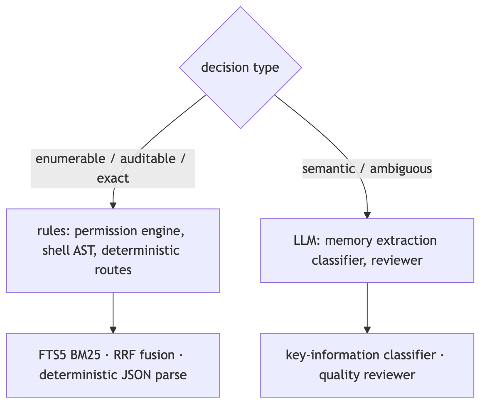
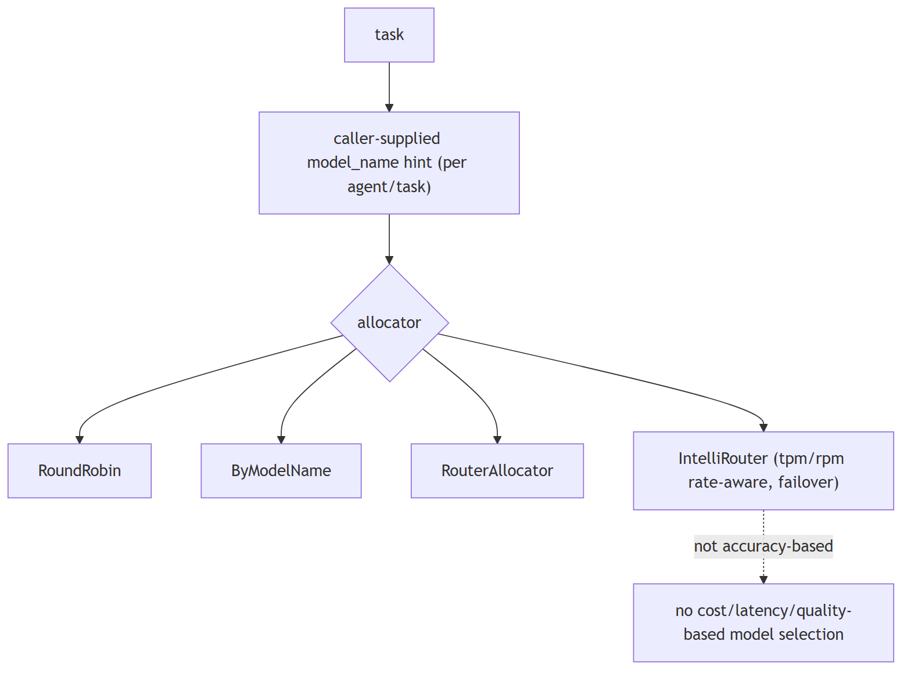
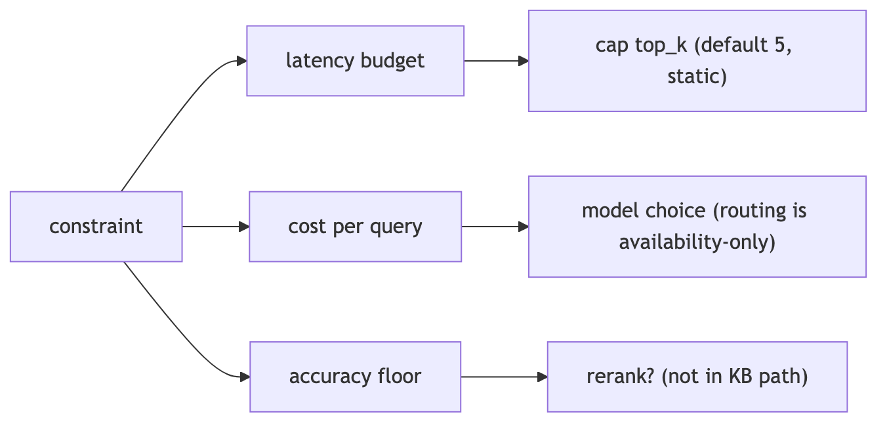
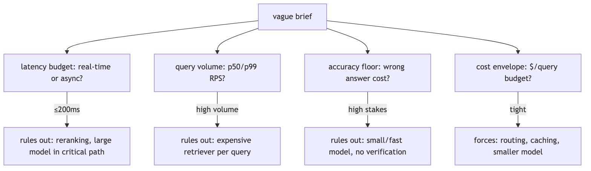
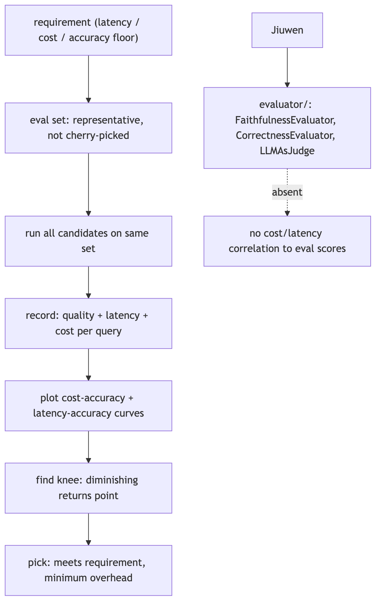
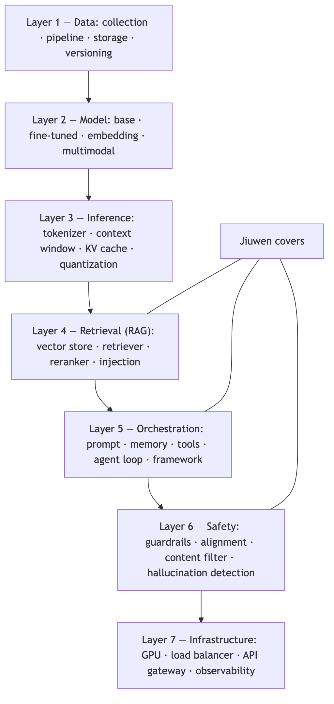

<a class="topic-nav__link topic-nav__prev" href="02-prompting-and-output-control.html">← PreviousPrompting and output control</a>
<a class="topic-nav__link topic-nav__next" href="17-fine-tuning-and-customization.html">Next →Fine-tuning and customization</a>

# Choosing models and tradeoffs

## 1. Deciding when a problem actually needs an LLM versus a simpler rule-based system

Compare intermediate

**TL;DR.** Use rules when logic is enumerable, must be auditable, or needs exact reproducibility (validation, pattern routing, permissions, arithmetic, parsing). Use an LLM when the task is semantic or open-ended.

**Key points.**

- Rules: enumerable, auditable, reproducible.
- LLM: semantic, ambiguous, open-ended.
- Prefer rules; add the LLM where needed.

**Concept.** Use a rule-based/deterministic system when the logic is enumerable, must be auditable, or needs exact reproducibility (validation, routing by known patterns, permission checks, arithmetic, parsing). Use an LLM when the task is semantic, open-ended, or handles ambiguity that rules cannot enumerate (summarization, intent, extraction from messy text). Rules for control, LLM for meaning; often both.

**In Jiuwen.** The codebase deliberately routes many decisions through deterministic code. The permission engine is a pure rule and AST engine — its docstring notes the model is not used on the permission path — evaluating tiered regex rules and a shell AST before falling back to ask. Safety-critical decisions are rule-based, not model-based.

<b>Under the hood</b>

**Implementation**

The codebase deliberately routes many decisions through deterministic code. The permission engine is a pure rule/AST engine — its docstring notes the model is not used on the permission path — evaluating tiered regex rules and a tree-sitter shell AST before falling back to ASK. The product's auto-permission layer has deterministic routes that hard-block/ask by URL scheme, egress fields, and capability side-effects before any reviewer is consulted. Lexical/deterministic retrieval coexists with vector paths (SQLite FTS5 BM25, RRF rank fusion), and structured JSON is extracted with deterministic parsers. Conversely, memory extraction uses an LLM key-information classifier because judging "is this worth remembering" is semantic.

**Code anchors**

| Code anchor | What it points to |
|---|---|
| `agent-core/openjiuwen/harness/security/permission_engine/core.py:193` | docstring: LLM not used on the permission path |
| `agent-core/openjiuwen/harness/security/permission_engine/toolguard/tool_policy.py:588` | rule-based tiered policy; agent-core/openjiuwen/harness/security/permission_engine/toolguard/shell_ast.py:82 — deterministic parse |
| `jiuwenswarm/jiuwenswarm/agents/harness/common/rails/permissions/auto_decision.py:73` | deterministic_guard_route; :116 deterministic_domain_route |
| `jiuwenswarm/jiuwenswarm/agents/harness/common/memory/internal.py:165` | bm25_rank_to_score; jiuwenswarm/jiuwenswarm/agents/harness/common/memory/manager.py:1044 FTS BM25 |
| `agent-core/openjiuwen/core/retrieval/utils/fusion.py:15` | rrf_fusion; agent-core/openjiuwen/core/foundation/store/index/simple_memory_index.py:348 sort by score |
| `agent-core/openjiuwen/core/context_engine/context/message_buffer.py:74` | deterministic drop beyond 2× |
| `agent-core/openjiuwen/rsi/harness_rsi/auto_harness/infra/parsers.py:147` | deterministic JSON extraction |
| `agent-core/openjiuwen/core/memory/process/extract/memory_analyzer.py:26` | LLM classifier (semantic) |

---

## 2. Larger model vs. smaller, faster one for a given task

Mechanism intermediate

**TL;DR.** Match capability to difficulty: a large model for reasoning/ambiguity, a small/fast one for classification, extraction, routing, and formatting; measure quality per task and weigh latency and cost.

**Key points.**

- Large for reasoning/ambiguity.
- Small/fast for classification/extraction/routing.
- Measure quality per task; weigh latency/cost.

**Concept.** Match model capability to task difficulty: use a large model for reasoning/ambiguity and a small/fast one for classification, extraction, routing, and formatting. Measure quality per task and weigh latency and cost; route by task, and fall back to the larger model only when needed. A leaderboard score is a prior, not a per-task decision.

**In Jiuwen.** Model selection here is about availability and endpoint distribution, not task quality. A team can declare a pool of endpoints or a router config, and allocators pick an entry by rotation or an explicit model-name hint at member construction. Capability-based routing by task difficulty must be added by the caller.

<b>Under the hood</b>

**Implementation**

Model selection here is about availability and endpoint distribution, not task quality. A team can declare a `model_pool` of endpoints or a `ModelRouterConfig`/`IntelliRouterConfig` convenience shape; allocators (`RoundRobinModelAllocator`, `ByModelNameAllocator`, `Router`, `IntelliRouter`) pick an entry by rotation or an explicit `model_name` hint supplied per agent/task. IntelliRouter is rate-aware only through `tpm`/`rpm` budgets. The `ModelPoolEntry` metadata comment ("weights, affinity hints") is documented but not implemented.

**Code anchors**

| Code anchor | What it points to |
|---|---|
| `agent-core/openjiuwen/agent_teams/models/pool.py:38` | ModelPoolEntry; :133 ModelRouterConfig; :241 IntelliRouterDeployment; :314 IntelliRouterConfig; :278 tpm/rpm rate-aware; :95 "weights/affinity hints" (documented, not implemented) |
| `agent-core/openjiuwen/agent_teams/models/allocator.py:176` | round-robin; :240 by-model-name; :452 IntelliRouter; :559 build_model_allocator; :28 allocation-vs-reliability docstring |
| `agent-core/openjiuwen/harness/schema/config.py:242` | / agent-core/openjiuwen/harness/schema/deep_agent_spec.py:441 — per-agent/task model config |

---

## 3. When the "best" model is the wrong choice

Concept intermediate

**TL;DR.** "Best" is relative to a constraint, not an absolute quality score.

**Key points.**

- A model too slow or too expensive to ship is not the right choice
- Justify against the constraint it satisfies or violates

**Concept.** Define "best" relative to a constraint, not as an absolute quality score. A model that is too slow or too expensive to ship at scale is not the right choice regardless of its accuracy; the justification is the constraint it satisfies or violates.

---

## 4. "Compare two approaches" tests tradeoff reasoning tied to numbers, not a correct pick

Claim advanced

**Claim, not a question.** The heading is an assertion about what these questions probe; the notes below assess whether it holds.

**TL;DR.** 'Compare two approaches' tests tradeoff reasoning tied to numbers, not a correct pick.

**Key points.**

- top_k defaults 5, no adaptive policy.
- Reranking absent from the KB path.
- Model allocation is availability-based.
- Session cost tracked and capped.

**Concept.** This claim holds: the expected answer is a constraint-driven tradeoff with numbers, not a single correct pick. RAG vs. fine-tuning, 7B vs. 70B, top-5 vs. top-20 retrieval. "It depends" without naming the constraint (latency budget, cost per query, accuracy floor) is not enough; put a number on it — e.g. "at a 200ms budget, reranking 20 docs is not viable, so cap retrieval at 5." State the constraint, then the decision it forces, then the number. Tie retrieval size to latency/tokens, model size to accuracy floor vs cost, and reranking to the latency it buys in precision.

**In Jiuwen.** The relevant knobs are static and named: top-k defaults to 5 with no adaptive policy, reranking is not in the knowledge-base path, and model allocation is availability-based rather than cost or accuracy based, so routing easy queries to a smaller model is not automatic. Session cost is tracked and capped.

<b>Under the hood</b>

**Implementation**

The relevant knobs are static and named: `top_k` defaults to 5 (no adaptive policy), reranking is not in the KB path, and model allocation is availability-based, not cost/accuracy-based — so "smaller model for easy queries" is not automatic. Session cost is tracked and capped when the provider reports cost.

**Code anchors**

| Code anchor | What it points to |
|---|---|
| `agent-core/openjiuwen/core/retrieval/common/config.py:46` | top_k: int = 5 static |
| `agent-core/openjiuwen/core/retrieval/simple_knowledge_base.py:182` | no reranker in KB retrieve |
| `agent-core/openjiuwen/agent_teams/models/allocator.py:559` | build_model_allocator (availability strategies, not cost/accuracy) |
| `jiuwenswarm/jiuwenswarm/server/runtime/usage_cost.py:171` | enforced session cost cap |

---

## 5. You're given a vague AI system design brief with no stated constraints — what do you ask first?

Mechanism intermediate

**TL;DR.** Extract the four binding constraints before proposing any architecture: latency budget, query volume, accuracy floor, and cost envelope.

**Key points.**

- Latency budget — real-time (≤200ms) or async? Rules out reranking and large-model calls in the critical path
- Query volume — p50/p99 RPS? Rules out expensive retrievers per query at scale
- Accuracy floor — what is the cost of a wrong answer? Rules out small/fast models for high-stakes tasks
- Cost envelope — $/query budget? Forces routing, caching, and smaller models when tight
- Propose an architecture only after these constraints are known

**Concept.** Before proposing any architecture, extract the four constraints that determine every significant tradeoff: (1) **latency budget** — is this real-time (≤200ms) or async? (2) **query volume** — requests per second, peak vs average; (3) **accuracy floor** — is a wrong answer a minor inconvenience or a safety/legal risk? (4) **cost envelope** — is this internal tooling or a consumer product at scale? These four drive every meaningful decision: latency budget rules out reranking or large-model calls in the critical path; accuracy floor rules out smaller models; volume rules out expensive retrievers. Propose an architecture only after these constraints are known.

**In Jiuwen.** The four constraint levers are each separately configurable: latency via ModelClientConfig.timeout (agent-core/openjiuwen/core/foundation/llm/schema/config.py:102); volume via IntelliRouterDeployment tpm/rpm (agent-core/openjiuwen/agent_teams/models/pool.py:278); accuracy via score_threshold (agent-core/openjiuwen/core/retrieval/common/config.py:47); cost via the auto-harness BudgetRail dollar cap (agent-core/openjiuwen/auto_harness/rails/budget_rail.py:24). The operator sets them per use case.

<b>Under the hood</b>

**Implementation**

The deployment surface exposes these constraints as distinct configuration layers. Latency: `ModelClientConfig.timeout` per call, agent `max_turns`. Volume/concurrency: `IntelliRouterDeployment` `tpm`/`rpm` caps, `APIEmbedding` `max_concurrent`. Accuracy tradeoff: `score_threshold` (retrieval), `temperature`, `max_tokens`. Cost: the auto-harness `BudgetRail` (per-session dollar cap). The operator sets them per use case.

**Code anchors**

| Code anchor | What it points to |
|---|---|
| `agent-core/openjiuwen/core/foundation/llm/schema/config.py:102` | ModelClientConfig.timeout (latency) |
| `agent-core/openjiuwen/agent_teams/models/pool.py:278` | tpm/rpm (volume) |
| `agent-core/openjiuwen/core/retrieval/common/config.py:47` | score_threshold (accuracy lever) |
| `agent-core/openjiuwen/auto_harness/rails/budget_rail.py:24` | dollar cap (cost) |

---

## 6. Gathering constraints before designing

Concept intermediate

**TL;DR.** Extract the four binding constraints — latency budget, query volume, accuracy floor, and cost envelope — before proposing any architecture.

**Key points.**

- A tight latency budget rules out reranking or large-model calls in the critical path
- A high accuracy floor rules out smaller models
- High query volume rules out expensive retrievers
- In Jiuwen these are manual levers: timeout, tpm/rpm, score_threshold, budget cap

**Concept.** Before proposing an architecture, extract the four constraints that determine every significant tradeoff: **latency budget** — real-time (≤200ms) or async?; **query volume** — requests per second, peak versus average; **accuracy floor** — is a wrong answer a minor inconvenience or a safety/legal risk?; and **cost envelope** — internal tooling or a consumer product at scale? These four drive every meaningful decision: a tight latency budget rules out reranking or large-model calls in the critical path, a high accuracy floor rules out smaller models, and high volume rules out expensive retrievers.

<b>Under the hood</b>

**Implementation**

Latency is set via `ModelClientConfig.timeout`; volume via `IntelliRouterDeployment` `tpm`/`rpm`; accuracy via `score_threshold`; cost via the auto-harness `BudgetRail` dollar cap. The operator sets them per use case.

---

## 7. How do you make a defensible model selection decision — what does the evaluation actually look like?

Mechanism intermediate

**TL;DR.** Define an eval set, run all candidates, record quality + latency + cost, plot the curves, and pick the knee — not the highest-accuracy option.

**Key points.**

- Eval set must be representative of the actual use-case distribution, not cherry-picked examples
- Run every candidate on the same eval set; record quality score, latency, and cost per query
- Plot cost-accuracy and latency-accuracy curves to find the knee: where extra spend buys diminishing quality gain
- Pick the option that meets the requirement with minimum overhead — not the top-accuracy option
- Jiuwen gap: evaluators measure quality only; cost and latency are not correlated to eval scores in the pipeline

**Concept.** "There's a tradeoff" is not an answer — it is the beginning of one. A defensible selection looks like: (1) define a representative eval set covering the actual use-case distribution (not cherry-picked examples); (2) run every candidate model (or configuration) on the same eval set; (3) record accuracy/quality score AND latency AND cost per query; (4) plot the cost-accuracy and latency-accuracy curves; (5) identify the **knee of the curve** — the point where additional cost or latency buys diminishing quality gain; (6) choose the option that meets the requirement with the least overhead, not the option with the highest absolute accuracy. Critically: the choice is a decision that follows from the requirement, not from intuition or a leaderboard.

**In Jiuwen.** Quality measurement: ExactMatchMetric and LLMAsJudgeMetric (agent-core/openjiuwen/agent_evolving/evaluator/metrics/). Session costs are tracked separately in jiuwenswarm/jiuwenswarm/server/runtime/usage_cost.py:101 via add_session_usage. Cost and latency are tracked separately from quality scores, so the cost-accuracy curve is assembled by the operator.

<b>Under the hood</b>

**Implementation**

`agent_evolving/evaluator/` provides metrics such as `ExactMatchMetric` and `LLMAsJudgeMetric` for quality measurement. `dev_tools/tune/Trainer` supports `early_stop_score` for automated quality gating. Gaps: cost and latency are not recorded *alongside* quality in the eval pipeline — there is no built-in cost-accuracy curve generation. Session costs are tracked in `usage_cost.py` but not correlated to per-query eval scores.

**Code anchors**

| Code anchor | What it points to |
|---|---|
| `agent-core/openjiuwen/agent_evolving/evaluator/metrics/exact_match.py:12` | ExactMatchMetric |
| `agent-core/openjiuwen/agent_evolving/evaluator/metrics/llm_as_judge.py:17` | LLMAsJudgeMetric |
| `agent-core/openjiuwen/dev_tools/tune/trainer/trainer.py:38` | early_stop_score |
| `jiuwenswarm/jiuwenswarm/server/runtime/usage_cost.py:101` | session cost (not per-eval-query) |

---

## 8. Measuring the tradeoff empirically

Concept advanced

**TL;DR.** Operationalize the tradeoff: eval set, per-candidate quality/latency/cost, curves, and the knee.

**Key points.**

- Define a representative eval set and run every candidate on it
- Record quality score, latency, and cost per query
- Plot cost-accuracy and latency-accuracy curves and find the knee
- Pick the option meeting the requirement with minimum overhead

**Concept.** Define a representative eval set, run every candidate on it, and record quality score, latency, and cost per query. Plot the cost–accuracy and latency–accuracy curves, find the knee (the point of diminishing returns), and pick the option that meets the requirement with the minimum overhead — not the highest-accuracy option.

<b>Under the hood</b>

**Implementation**

`agent_evolving/evaluator/` provides metrics such as `ExactMatchMetric` and `LLMAsJudgeMetric`; session costs are tracked in `usage_cost.py`. Cost and latency are tracked separately from quality scores, so the cost-accuracy curve is assembled by the operator.

---

## 9. What are the architectural layers of a modern AI product?

Design intermediate

**TL;DR.** Data → Model → Inference → Retrieval (RAG) → Orchestration → Safety → Infrastructure. Every production AI product runs all 7 simultaneously; most developers interact only with Layer 5.

**Key points.**

- Layer 1 Data: collection, cleaning, storage (vector DB/object store/data lake), versioning
- Layer 2 Model: base, fine-tuned, embedding, multimodal
- Layer 3 Inference: tokenizer, context window, temperature, KV cache, quantization
- Layer 4 RAG: vector store, retriever, reranker, context injection
- Layers 5-7: orchestration (prompt+memory+tools+agent loop), safety (guardrails+alignment+filter), infrastructure (GPU+LB+API GW+observability). Jiuwen covers Layers 4-6 directly.

**Concept.** A production AI system has seven functional layers, each independently scalable and debuggable: **(1) Data Layer** — raw collection, cleaning/deduplication/filtering, storage (vector DB, object store, data lake), and versioning (what data trained which model). **(2) Model Layer** — base model (raw language prediction), fine-tuned model (task-specific behavior), embedding model (text→vectors), multimodal model (text+image+audio). **(3) Inference Layer** — tokenizer, context window management, temperature/sampling controls, KV cache (reuse past token computations), quantization (reduce weight precision for speed/memory). **(4) Retrieval Layer** — vector store, retriever, reranker, context injection. **(5) Orchestration Layer** — prompt template, conversation memory, tools/function calling, agent loop (plan → act → observe → repeat), orchestration framework. **(6) Safety Layer** — guardrails, alignment (RLHF/CAI), content filter, hallucination detection. **(7) Infrastructure Layer** — GPU cluster (inference compute), load balancer, API gateway (auth/rate limiting/billing), observability (logs, latency, token counts, traces). Every production AI product runs all 7 layers simultaneously. Most developers interact only with Layer 5. The practical test: if something breaks, can you identify which layer it's in?

**In Jiuwen.** The framework covers Layers 4-6 directly. Layer 4: agent-core/openjiuwen/core/retrieval/ (vector, hybrid, graph, agentic retrievers). Layer 5: core/foundation/prompt/template.py (prompt), core/context_engine/ (memory + context), core/foundation/tool/base.py (tools), core/single_agent/agents/react_agent.py (ReAct loop). Layer 6: auto_harness/rails/security_rail.py, core/security/guardrail/builtin.py, harness/rails/subagent/verification_rail.py. Layer 7 infrastructure is delegated: Milvus, vLLM, provider APIs, harness/observability/rail.py. Layers 1-3 (data pipeline, base model training, inference engine) are external.

<b>Under the hood</b>

**Implementation**

The framework maps onto Layers 4–6 directly and delegates the rest. **Layer 4**: full retrieval pipeline (vector, hybrid, graph, agentic retrievers). **Layer 5**: `PromptTemplate`, `ContextEngine`, `ToolCard` system, `ReActAgent` loop, framework rails. **Layer 6**: `SecurityRail`, `PromptInjectionGuardrail`, `VerificationRail`. Layer 7 infrastructure is provided by Milvus (vector store), vLLM (local inference), provider APIs (OpenAI, Anthropic), and the harness observability rail. Layers 1–3 (data pipeline, base model training, inference engine) are handled outside the framework.

**Code anchors**

| Code anchor | What it points to |
|---|---|
| `agent-core/openjiuwen/core/retrieval/` | full retrieval pipeline |
| `agent-core/openjiuwen/core/foundation/prompt/template.py` | ; agent-core/openjiuwen/core/context_engine/; agent-core/openjiuwen/core/foundation/tool/base.py; agent-core/openjiuwen/core/single_agent/agents/react_agent.py |
| `agent-core/openjiuwen/auto_harness/rails/security_rail.py` | ; agent-core/openjiuwen/core/security/guardrail/builtin.py; agent-core/openjiuwen/harness/rails/subagent/verification_rail.py |
| `agent-core/openjiuwen/harness/observability/rail.py` | ; Milvus + vLLM + provider APIs (external) |

---

## 10. Planning for 10x traffic

Concept intermediate

**TL;DR.** Scale decisions are made before the demo: identify the bottleneck and the first scaling lever for each stage.

**Key points.**

- First levers: caching, batching, and latency under load
- Bottleneck is generation, retrieval, or orchestration
- Each stage has a different first scaling lever

**Concept.** Scaling is decided before the demo, not after. The first levers are caching, batching, and confirming that latency holds under load. Identify the bottleneck — generation, retrieval, or orchestration — and the first scaling lever for each.

---

## 11. What to cut first under a budget constraint

Concept intermediate

**TL;DR.** Embedding is one-time; generation scales with traffic, so cut generation first.

**Key points.**

- Route simple queries to a smaller model, lower top-k, add semantic caching
- Safety and guardrail layers are the last to cut
- Know which components degrade gracefully versus break the system

**Concept.** Know which components cost the most and which degrade gracefully versus break the system. Embedding is one-time; generation scales with traffic — so cut generation first: route simple queries to a smaller model, lower top-k, add semantic caching. Safety and guardrail layers are the last thing to cut, because they prevent unsafe output.

---
