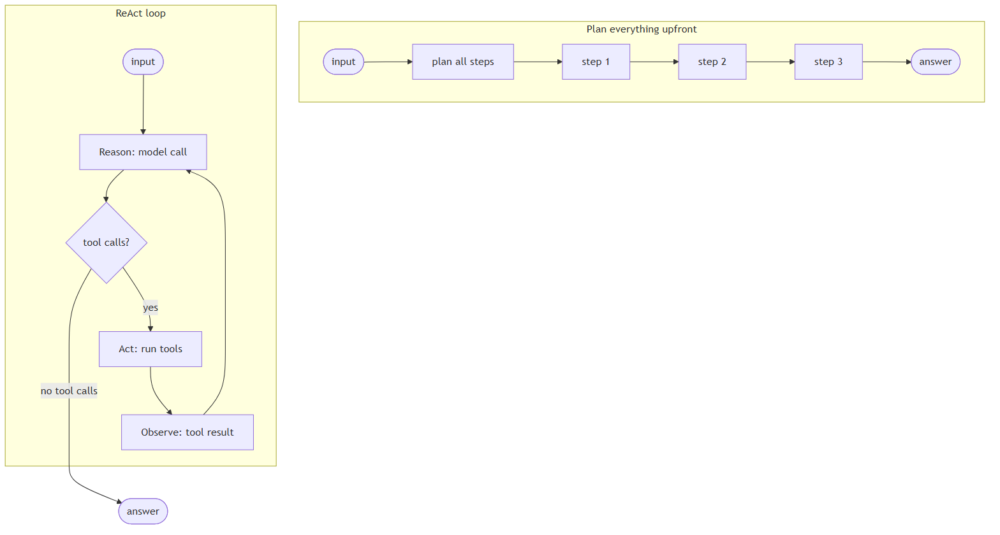
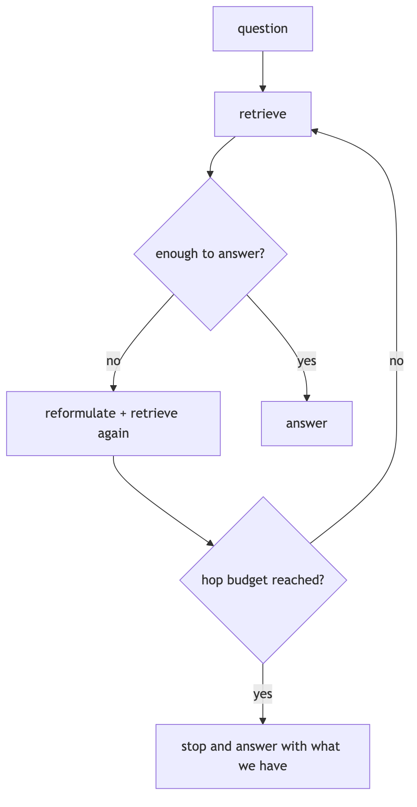
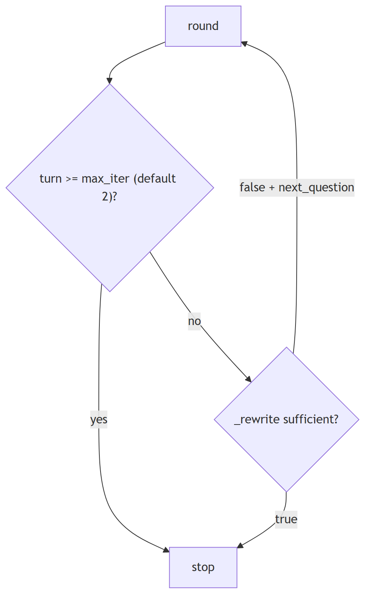
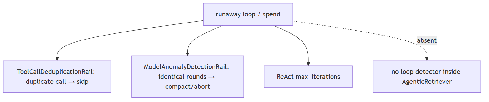
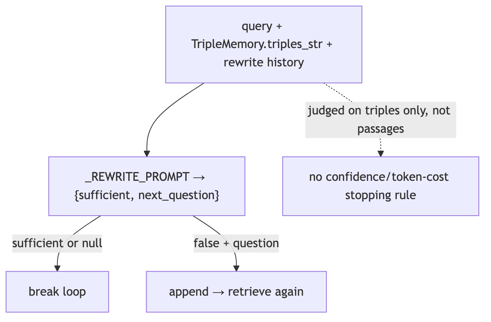

# Agent fundamentals and the loop

## 1. What's the difference between a chatbot and an agent

basic

**Title.** Chatbot vs agent

**Summary.** A chatbot maps one input to one model reply; an agent runs a loop (model → tools → results → repeat) until a stopping condition.

**Key points.**

- Chatbot: one model turn, no tools.
- Agent: tool/reason loop with a stopping rule.
- The loop and tools, not the model, define an agent.

**General.** A chatbot maps one input to one model reply. An agent runs a loop: it calls the model, may call tools, feeds results back, and repeats until a stopping condition is met. The defining trait is the tool/reason loop and a termination rule, not the size of the model.

**Jiuwen.** There is no separate chatbot class; the distinction is structural. A single model turn is the workflow LLM component, which calls the model once and has no tool branch. An agent is the ReAct loop: it calls the model, and if the reply has no tool calls it returns the answer; otherwise it executes the tools and feeds the results back for another turn.

<b>Jiuwen technical detail (classes &amp; functions)</b>

**Implementation**

There is no separate `Chatbot` class; the distinction is structural. A single model turn is the workflow LLM component, which calls `llm.invoke` once and has no tool branch. An agent is the loop in `ReActAgent.invoke`: it calls the model, and if the returned message has no tool calls it returns the answer; otherwise it executes the tools and iterates. `DeepAgent` wraps this with an outer task loop.

**Code anchors**

| Code anchor | What it points to |
|---|---|
| `agent-core/openjiuwen/core/workflow/components/llm/llm_comp.py:524` | single model call, no tool branch |
| `agent-core/openjiuwen/core/single_agent/agents/react_agent.py:2740` | the ReAct loop |
| `agent-core/openjiuwen/core/single_agent/agents/react_agent.py:2793` | no tool calls → final answer |
| `agent-core/openjiuwen/core/single_agent/agents/react_agent.py:2813` | execute tools and iterate |
| `agent-core/openjiuwen/harness/deep_agent.py:2694` | outer task loop |

**Canonical source**

`source/ai-agent-interview-questions_for_engineers.md`

---

## 2. What's the difference between a workflow and an agent

basic

**Title.** Workflow vs agent

**Summary.** A workflow is a pre-declared graph (you author steps/edges/branches); an agent decides its next step at runtime from model output.

**Key points.**

- Workflow: fixed topology, predictable, cheap.
- Agent: runtime branching on model output.
- A workflow can embed an agent as a node.

**General.** A workflow is a pre-declared graph: you author the steps, edges, and branches, and execution follows that topology. An agent decides its next step at runtime from model output. Workflows are predictable and cheap; agents are flexible and variable. They compose: a workflow can contain an agent node.

**Jiuwen.** The workflow engine is a Pregel-style graph machine: topology is declared up front via the start component and (conditional) connections, and execution ends at the end component. An agent loop instead branches on live tool calls. A workflow can embed an agent as one of its nodes, so the two are layers, not opposites.

<b>Jiuwen technical detail (classes &amp; functions)</b>

**Implementation**

The workflow engine is a Pregel-style graph machine. Topology is declared up front via the start component, connections, and conditional connections, and execution terminates when the end component produces output. An agent loop instead branches on live `tool_calls`. A workflow can embed an agent as one node, where a single executable just calls the agent's `invoke`.

**Code anchors**

| Code anchor | What it points to |
|---|---|
| `agent-core/openjiuwen/core/workflow/workflow.py:98` | Workflow class |
| `agent-core/openjiuwen/core/graph/pregel/engine.py:255` | graph execution driver |
| `agent-core/openjiuwen/core/workflow/workflow.py:136/279/311` | set_start_comp / add_connection / add_conditional_connection |
| `agent-core/openjiuwen/core/workflow/workflow.py:551` | terminates when the end component produces output |
| `agent-core/openjiuwen/core/workflow/components/llm/react/react_executable.py:41` | workflow node embedding an agent |

**Canonical source**

`source/ai-agent-interview-questions_for_engineers.md`

---

## 3. What's the difference between a linear chain and a graph with conditional branches

basic

**Title.** Linear chain vs conditional graph

**Summary.** A linear chain always activates the next step; a graph adds routing (choose successors from state) and joining/barriers (when a merge node is ready).

**Key points.**

- Linear: static edges, fixed order.
- Graph: conditional edges route by state.
- Join/barrier gates merge nodes.

**General.** A linear chain is a fixed sequence where each step always activates the next. A graph adds branching and merging: a router selects successors based on state at runtime, and a join/barrier decides when a merge node is ready (all predecessors, or any of an exclusive group).

**Jiuwen.** Both use the same graph engine. A static connection becomes a simple router (one-to-many) or a barrier (many-to-one, with OR-groups for mutually exclusive predecessors). A conditional connection registers a branch router that picks successors from state at runtime. So the difference is which kind of edge you add, not a different engine.

<b>Jiuwen technical detail (classes &amp; functions)</b>

**Implementation**

Both are built on the same `PregelGraph`. `add_connection` registers a static edge; at compile time `PregelGraph._compile` turns static edges into `StaticRouter` (1→N) or `BarrierChannel` (N→1, with CNF OR-groups for mutually exclusive predecessors). `add_conditional_connection` registers a branch router compiled to `ConditionalRouter`, whose `dispatch` calls the user selector and emits `TriggerMessage`s only for the chosen targets. A linear chain always activates its single successor; a conditional graph activates only the selector's targets, and `BranchRouter` raises `COMPONENT_BRANCH_EXECUTION_ERROR` if none match.

**Code anchors**

| Code anchor | What it points to |
|---|---|
| `agent-core/openjiuwen/core/workflow/workflow.py:279` | add_connection (static); :311 — add_conditional_connection |
| `agent-core/openjiuwen/core/workflow/_workflow.py:221` | BaseWorkflow.add_connection → self._graph.add_edge; :255 — add_conditional_connection wraps BranchRouter + register_branch_targets |
| `agent-core/openjiuwen/core/graph/graph.py:103` | add_edge; :122 — add_conditional_edges; :267 _compile; :300 adds branches to the Pregel builder |
| `agent-core/openjiuwen/core/graph/pregel/builder.py:28` | add_edge (N→1 BarrierChannel, 1→N StaticRouter); :67 add_branch |
| `agent-core/openjiuwen/core/graph/pregel/router.py:11` | StaticRouter.dispatch; :26 ConditionalRouter.dispatch |
| `agent-core/openjiuwen/core/graph/pregel/channels.py:104` | TriggerChannel; :129 BarrierChannel; :166 is_ready (CNF OR-groups) |
| `agent-core/openjiuwen/core/workflow/components/flow/branch_router.py:92` | BranchRouter.__call__ |

**Implementation diagram**

**Canonical source**

`source/ai-agent-framework-interview-questions_for_engineers.md`

---

## 4. What's the ReAct pattern, and why interleave reasoning with actions instead of planning everything upfront

basic

**Title.** ReAct pattern

**Summary.** ReAct alternates thought → action → observation; interleaving lets each real tool result inform the next thought, correcting drift and grounding reasoning.

**Key points.**

- Loop: reason → act → observe.
- Tool results become the next observation.
- Interleaving corrects drift vs a big upfront plan.

**General.** ReAct alternates thought → action → observation. Interleaving lets each action's real result inform the next thought, which corrects drift and grounds reasoning in observed state. A fully upfront plan cannot react to what the tools actually return.

**Jiuwen.** Jiuwen's loop is exactly reason/act/observe: call the model, branch on whether it returned tool calls, execute the tools, and feed the results back as the next observation, repeating. The reasoning trace is preserved by copying the model's reasoning content into the assistant message, and the iteration count is exposed to rails.

<b>Jiuwen technical detail (classes &amp; functions)</b>

**Implementation**

The loop is exactly reason/act/observe: model call, branch on `tool_calls`, execute, feed `ToolMessage`s back as the next observation, repeat. The reasoning trace is retained by copying `reasoning_content` into the assistant message, and the iteration number is exposed to rails.

**Code anchors**

| Code anchor | What it points to |
|---|---|
| `agent-core/openjiuwen/core/single_agent/agents/react_agent.py:2766` | model call (reason) |
| `agent-core/openjiuwen/core/single_agent/agents/react_agent.py:2793` | branch on tool calls |
| `agent-core/openjiuwen/core/single_agent/agents/react_agent.py:2813` | execute (act) |
| `agent-core/openjiuwen/core/single_agent/agents/react_agent.py:2787` | retain reasoning_content |
| `agent-core/openjiuwen/core/single_agent/agents/react_agent.py:2742` | iteration exposed to rails |
| `agent-core/openjiuwen/core/single_agent/agents/react_agent.py:568` | ReActAgent documents the pattern |

**Canonical source**

`source/ai-agent-interview-questions_for_engineers.md`

---

## 5. How do you set a hard limit on iterations or steps within a framework

intermediate

**Title.** Hard iteration limit

**Summary.** Cap the loop with a max-iteration/round counter plus token/time budgets, enforced (not just reported), with a cap at each nesting level and configurable.

**Key points.**

- Max iterations/rounds, enforced.
- Add token and wall-clock budgets.
- Cap each nested loop; make caps configurable.

**General.** Cap the loop with a max-iteration/max-round counter, plus optional token and wall-clock budgets, and *enforce* them rather than only reporting. Nested loops need a cap at each level, and the caps should be configurable.

**Jiuwen.** The inner ReAct loop is bounded by the agent config's max_iterations (default 5) and exits with an error result when exceeded. When the task loop is enabled, the inner ReAct ceiling is raised and the real bound moves to the outer loop, where a coordinator OR-evaluates stop evaluators; there is also a hard outer-round literal.

<b>Jiuwen technical detail (classes &amp; functions)</b>

**Implementation**

The inner ReAct loop is bounded by `ReActAgentConfig.max_iterations` (default 5) and exits with `{"result_type": "error", "output": "Max iterations reached without completion"}`. When `enable_task_loop=True`, DeepAgent raises the inner ReAct ceiling to `sys.maxsize` and moves the real bound to the outer task loop, where `LoopCoordinator.should_continue()` OR-evaluates a chain of `StopConditionEvaluator`s. `TaskCompletionRail.build_evaluators()` contributes `MaxRounds`/`Timeout`/`TokenBudget`/`CompletionPromise`; the `NoProgressAnswer` evaluator is added separately from `task_loop_no_progress_guard` (`deep_agent._build_task_loop_evaluators`). Independently, `_run_task_loop` hard-codes `max_outer_rounds = 50` and force-stops with `stop_reason: "MaxOuterRounds"`. Team members reuse the wiring via `TaskCompletionRail(max_rounds=...)`, and cooperative stops exist via `ctx.request_force_finish()` and `DeepAgent.abort()`.

**Code anchors**

| Code anchor | What it points to |
|---|---|
| `agent-core/openjiuwen/core/single_agent/agents/react_agent.py:288` | max_iterations: int = Field(default=5); :2740 the bounded loop; :2852 exhaustion result |
| `agent-core/openjiuwen/harness/schema/stop_condition.py:134` | MaxRoundsEvaluator.should_stop; :143 TokenBudget; :162 Timeout |
| `agent-core/openjiuwen/harness/task_loop/loop_coordinator.py:139` | should_continue() OR-chain; :110 increment_iteration; :133 request_abort |
| `agent-core/openjiuwen/harness/rails/task_completion_rail.py:168` | build_evaluators(); :178-185 build MaxRounds/Timeout/TokenBudget |
| `agent-core/openjiuwen/harness/deep_agent.py:2723` | max_outer_rounds = 50; :2725 while coordinator.should_continue(); :2727-2739 force-stop; :1116 inner cap swap; :2338 _build_task_loop_evaluators; :3380 abort() |
| `agent-core/openjiuwen/agent_teams/agent/agent_configurator.py:436` | member TaskCompletionRail(max_rounds=agent_spec.max_iterations) |
| `agent-core/openjiuwen/agent_teams/workflow/backends/budget_rail.py:88` | token-ceiling ctx.request_force_finish; agent-core/openjiuwen/agent_teams/agent/scheduling/scheduler.py:300 — review-round cap |

**Canonical source**

`source/ai-agent-framework-interview-questions_for_engineers.md`

---

## 6. What decides when an agent stops and returns a final answer instead of calling another tool

intermediate

**Title.** What stops an agent

**Summary.** Usually the model: no tool calls means the answer is final. Around that sit hard limits — max iterations, token/time budgets, explicit stop conditions.

**Key points.**

- No tool calls → final answer.
- Hard limits: iterations, tokens, time.
- Outer loop: stop evaluators + completion promise.

**General.** Usually the model itself: when it emits no tool calls, the answer is final. Around that sit hard limits — max iterations, token/time budgets, and explicit stop conditions — so a confused agent does not loop forever.

**Jiuwen.** Two levels. Inner: in the ReAct agent, no tool calls means a final answer, bounded by max_iterations. Outer (the DeepAgent task loop): a coordinator OR-evaluates stop evaluators — max rounds, timeout, token budget, completion promise, and a no-progress answer evaluator — so the loop ends on the first condition that fires.

<b>Jiuwen technical detail (classes &amp; functions)</b>

**Implementation**

Two levels. Inner: in `ReActAgent`, no tool calls means a final answer, bounded by `max_iterations` (default 5). Outer (`DeepAgent` task loop): the `LoopCoordinator` OR-evaluates a chain of stop evaluators — max rounds, timeout, token budget, completion promise, and no-progress answer. Completion can also arrive as a `<promise>…</promise>` marker extracted by `TaskCompletionRail`. A hardcoded ceiling of 50 outer rounds backstops everything.

**Code anchors**

| Code anchor | What it points to |
|---|---|
| `agent-core/openjiuwen/core/single_agent/agents/react_agent.py:2793` | no tool calls → final answer |
| `agent-core/openjiuwen/core/single_agent/agents/react_agent.py:288` | max_iterations default 5 |
| `agent-core/openjiuwen/core/single_agent/agents/react_agent.py:2740` | inner loop |
| `agent-core/openjiuwen/harness/task_loop/loop_coordinator.py:139` | outer should_continue |
| `agent-core/openjiuwen/harness/schema/stop_condition.py:124-331` | evaluator chain |
| `agent-core/openjiuwen/harness/rails/task_completion_rail.py:403` | completion-promise extraction |
| `agent-core/openjiuwen/harness/deep_agent.py:2723` | hard 50-round ceiling |

**Canonical source**

`source/ai-agent-interview-questions_for_engineers.md`

---

## 7. How do you decide how many retrieval hops are enough?

intermediate

**Title.** How many retrieval hops

**Summary.** Use a sufficiency check to stop when evidence answers the question, and cap hops with a hard limit plus repetition and cost guards.

**Key points.**

- Stop when evidence is sufficient.
- Hard hop cap as a backstop.
- Repetition detection + cost ceiling.

**General.** Use a sufficiency check: decide whether the accumulated evidence already answers the question, and stop when it does. Back that with a hard hop cap so a confused retriever cannot keep going. Good design pairs a dynamic stop (sufficiency) with a static cap (max hops).

**Jiuwen.** Three caps: the agentic retriever's max iterations (default 2, hard-clamped) breaks the loop at the limit; a beam search caps graph hops (default 2); and a rewrite prompt returns a sufficiency flag plus an optional next question, which stops the loop when sufficient or when no next question is produced.

<b>Jiuwen technical detail (classes &amp; functions)</b>

**Implementation**

`AgenticRetriever.max_iter` defaults to 2 and is hard-clamped (invalid values fall back to 2); each loop breaks at `turn >= max_iter`. The sufficiency decision comes from `_rewrite`, which sends `_REWRITE_PROMPT` and parses `{"sufficient": bool, "next_question": str|null}`; only `sufficient=false` with a non-empty question continues. Graph retrieval uses `TripleBeamSearch.max_length` / `graph_hops` (default 2, rejects `<1`).

**Code anchors**

| Code anchor | What it points to |
|---|---|
| `agent-core/openjiuwen/core/retrieval/retriever/agentic_retriever.py:133` | `max_iter=2`; `:148` invalid-value fallback; `:241/287` turn-cap break; `:364` parses `sufficient`/`next_question` |
| `agent-core/openjiuwen/core/retrieval/retriever/graph_retriever.py:37` | `max_length < 1` raises; `:402` `graph_hops` default 2 |

**Implementation diagram**

**Canonical source**

`source/rag-part2-interview-questions_for_engineers.md`

---

## 8. How do you prevent a retrieval loop from running indefinitely and burning cost?

intermediate

**Title.** Preventing an infinite retrieval/tool loop

**Summary.** Add repetition detection, tool-call dedup, a max-iteration cap, and a cost ceiling so a confused agent cannot loop forever.

**Key points.**

- Detect repetition and duplicate tool calls.
- Bound the agent loop with max_iterations.
- Set a session cost ceiling.

**General.** Add repetition/loop detection, deduplicate identical tool calls, bound the agent's own loop with a max-iteration cap, and put a cost ceiling on the session. The failure mode is quiet: retries on a flaky call that never terminate, or token spend that climbs overnight.

**Jiuwen.** The harness guards are not wired into AgenticRetriever: ModelAnomalyDetectionRail compacts/aborts on identical tool rounds, ToolCallDeduplicationRail skips duplicate calls, and the ReAct loop is bounded by max_iterations (default 5). No loop detector runs inside the retriever itself.

<b>Jiuwen technical detail (classes &amp; functions)</b>

**Implementation**

`ModelAnomalyDetectionRail` detects consecutive identical tool-call rounds and compacts or aborts; `ToolCallDeduplicationRail` short-circuits duplicate calls via `_skip_tool`; the ReAct loop is bounded by `max_iterations` (default 5). These harness guards are **not wired into `AgenticRetriever`**, which has no loop detector beyond its turn cap.

**Code anchors**

| Code anchor | What it points to |
|---|---|
| `agent-core/openjiuwen/harness/rails/model_anomaly_detection_rail.py:418` | loop bailout `AbortError`; `:466` `_find_tool_loop_compact_range` |
| `jiuwenswarm/jiuwenswarm/agents/harness/common/rails/tool_dedup_rail.py:128` | `_skip_tool` duplicate suppression |
| `agent-core/openjiuwen/core/single_agent/agents/react_agent.py:2740` | `for iteration in range(..., max_iterations)` |

**Canonical source**

`source/rag-part2-interview-questions_for_engineers.md`

---

## 9. Preventing an agent from getting stuck in an infinite tool-calling loop

intermediate

**Title.** Infinite tool-calling loop

**Summary.** Cap iterations, detect repetition on canonicalized (tool,args), nudge or abort on no progress, and cap rounds/tokens/time.

**Key points.**

- Iteration cap.
- Repetition detection on canonicalized args.
- No-progress nudge/abort + token/time caps.

**General.** Cap iterations, detect repetition (same tool and arguments repeatedly), nudge or abort when no progress is made, and also cap rounds, tokens, and wall time. Detection should compare canonicalized arguments, not raw strings.

**Jiuwen.** The inner loop is capped by max_iterations (ReAct default 5, harness default 15). An anomaly-detection rail finds consecutive identical (tool name, canonicalized args) rounds and either folds them into a warning or aborts, and a dedup rail counts repeated read-only calls and warns. Outer caps add rounds, tokens, and time.

<b>Jiuwen technical detail (classes &amp; functions)</b>

**Implementation**

Inner cap `max_iterations` (ReAct default 5, harness default 15). Repetition detection: `ModelAnomalyDetectionRail` finds consecutive identical `(tool_name, canonical_args)` rounds and either folds them into a warning or aborts; `ToolCallDeduplicationRail` counts repeated read-only calls and warns. Outer guards: `NoProgressAnswerEvaluator`, `MaxRoundsEvaluator`, and the hard 50-round ceiling. Agent teams add repeat-tool and ping-pong detectors.

**Code anchors**

| Code anchor | What it points to |
|---|---|
| `agent-core/openjiuwen/core/single_agent/agents/react_agent.py:288` | max_iterations default 5; agent-core/openjiuwen/harness/schema/config.py:252 — harness default 15 |
| `agent-core/openjiuwen/harness/rails/model_anomaly_detection_rail.py:74/90` | tool-loop threshold + bailout |
| `jiuwenswarm/jiuwenswarm/agents/harness/common/rails/tool_dedup_rail.py:157` | cross-turn repeat counter |
| `agent-core/openjiuwen/harness/schema/stop_condition.py:181` | NoProgressAnswerEvaluator |
| `agent-core/openjiuwen/harness/deep_agent.py:2723` | hard 50-round ceiling |
| `agent-core/openjiuwen/agent_teams/reliability/detectors/repeat_tool.py:15` | repeat-tool; agent-core/openjiuwen/agent_teams/reliability/detectors/pingpong.py:12 — ping-pong |

**Implementation diagram**

**Canonical source**

`source/ai-engineer-technical-questions_for_engineers.md`

---

## 10. How does an agent decide when to retrieve again versus when it has enough context to answer

intermediate

**Title.** Retrieve again or answer

**Summary.** Ask the model a sufficiency question — is the evidence enough, and if not what's the next query? Stop when sufficient or the cap is hit.

**Key points.**

- Sufficiency judgment on accumulated evidence.
- If not sufficient, produce the next query.
- Stop on sufficient/no-next-question or the cap.

**General.** Ask the model a sufficiency question — given the query and the evidence so far, is it enough to answer, and if not what is the next query? Stop when sufficient or when the hop/round cap is hit. Judging sufficiency on the evidence (not just a scratchpad) matters.

**Jiuwen.** This is the agentic retriever's rewrite step: a prompt receives the query, the accumulated facts, and the rewrite history, and returns a sufficiency flag plus an optional next question. If it is sufficient or there is no next question, the rewrite returns nothing and the loop breaks; otherwise the next question drives another retrieval round.

<b>Jiuwen technical detail (classes &amp; functions)</b>

**Implementation**

This is `AgenticRetriever._rewrite`: `_REWRITE_PROMPT` receives the query, the accumulated `TripleMemory.triples_str`, and the rewrite history, and returns `{"sufficient": bool, "next_question": str|null}`. If sufficient or no next question, `_rewrite` returns `None`, which breaks the loop; otherwise the next question is appended. The hard stop is `turn >= max_iter` before `_rewrite` is called.

**Code anchors**

| Code anchor | What it points to |
|---|---|
| `agent-core/openjiuwen/core/retrieval/retriever/agentic_retriever.py:51` | _REWRITE_PROMPT JSON contract; :326 _rewrite; :341 history formatting; :364 sufficient/next_question; :244/290 append-and-continue |
| `agent-core/openjiuwen/core/retrieval/common/triple_memory.py:16` | triples_str fed to the prompt |
| `agent-core/openjiuwen/core/retrieval/retriever/agentic_retriever.py:67` | prompt to differentiate/simplify later questions |

**Canonical source**

`source/rag-part2-interview-questions_for_engineers.md`

---

## 11. "The agent is stuck" tests whether you've shipped one, not studied one

intermediate

**Title.** 'The agent is stuck': tests shipped experience

**Summary.** 'The agent is stuck' tests whether you've shipped one, not studied one.

**Key points.**

- ReAct max_iterations (5; harness 15).
- Agentic retriever max iter (2, clamped).
- Anomaly rail: identical rounds → compact/abort.
- Dedup rail + session cost cap.

**General.** Infinite tool loops, retries on a flaky API that never terminate, token spend that quietly spikes overnight. Vague answers ("I'd add safeguards") don't land; concrete answers do — `max_iterations=5`, a token budget per session, a circuit breaker after N consecutive tool failures. A strong answer includes: a hard iteration cap, repetition detection on canonicalized `(tool, args)`, per-session token/cost budget, retry with backoff only for idempotent reads, and a circuit breaker on repeated failures.

**Jiuwen.** Concrete caps exist: ReAct max iterations (default 5, harness 15), agentic-retriever max iterations (default 2, clamped), an anomaly-detection rail (consecutive identical tool rounds trigger compaction or abort), and a tool-call dedup rail. A session cost cap is enforced.

<b>Jiuwen technical detail (classes &amp; functions)</b>

**Implementation**

Concrete caps exist: ReAct `max_iterations` (default 5, harness 15), `AgenticRetriever.max_iter` (default 2, clamped), `ModelAnomalyDetectionRail` (consecutive identical tool rounds → compact/abort) and `ToolCallDeduplicationRail`. A session cost cap is enforced when the provider reports cost, and `ModelBackupRail` fails over. What is **missing** is a circuit breaker after N consecutive failures and a durable token budget on the retrieval loop.

**Code anchors**

| Code anchor | What it points to |
|---|---|
| `agent-core/openjiuwen/core/single_agent/agents/react_agent.py:288` | max_iterations: int = Field(default=5); agent-core/openjiuwen/harness/schema/config.py:252 — harness default 15 |
| `agent-core/openjiuwen/harness/rails/model_anomaly_detection_rail.py:74` | ToolLoopCompactConfig (default off); :90 bailout |
| `jiuwenswarm/jiuwenswarm/agents/harness/common/rails/tool_dedup_rail.py:157` | repeat counter/warning |
| `jiuwenswarm/jiuwenswarm/server/runtime/usage_cost.py:171/196` | enforced session cost cap |
| `agent-core/openjiuwen/core/single_agent/rail/model_backup.py:9` | ModelBackupRail failover (no circuit breaker) |

---

## 12. "The agent is stuck in a loop" is testing production experience

intermediate

**Title.** 'Stuck in a loop': production experience

**Summary.** 'The agent is stuck in a loop' is testing production experience.

**Key points.**

- ReAct max_iterations (5; harness 15).
- Agentic retriever max_iter (2, clamped).
- Anomaly rail compact/abort.
- Dedup rail; idempotent=False default.

**General.** max iteration limits per task, token budget caps per step, detecting and killing a failing loop before it burns cost, and retry logic on failed tool calls without infinite recursion. This separates people who have run one from people who have read about one. A strong answer includes: a hard iteration cap, a per-session/step token or cost budget, repetition detection on canonicalized `(tool, args)`, and bounded retries that never retry non-idempotent tools.

**Jiuwen.** Caps are concrete: ReAct max iterations (5, harness 15), agentic-retriever max iterations (2, clamped), an anomaly-detection rail (identical tool rounds trigger compaction or abort), a tool-call dedup rail, and secure-by-default non-idempotent tool handling.

<b>Jiuwen technical detail (classes &amp; functions)</b>

**Implementation**

Caps are concrete: ReAct `max_iterations` (5; harness 15), `AgenticRetriever.max_iter` (2, clamped), `ModelAnomalyDetectionRail` (identical tool rounds → compact/abort), `ToolCallDeduplicationRail`, and secure-by-default `idempotent=False` (non-idempotent tools never retried). A session cost cap is enforced when the provider reports cost; a per-step token budget in the task loop is wired but off by default.

**Code anchors**

| Code anchor | What it points to |
|---|---|
| `agent-core/openjiuwen/core/single_agent/agents/react_agent.py:288` | max_iterations=5; agent-core/openjiuwen/harness/schema/config.py:252 — harness 15 |
| `agent-core/openjiuwen/core/retrieval/retriever/agentic_retriever.py:133` | max_iter=2 clamped |
| `agent-core/openjiuwen/harness/rails/model_anomaly_detection_rail.py:74/90` | loop compact/abort |
| `agent-core/openjiuwen/core/foundation/tool/base.py:109` | idempotent default False |
| `agent-core/openjiuwen/harness/rails/tool_call_resilience_rail.py:128/145` | non-idempotent guard + retry budget |
| `jiuwenswarm/jiuwenswarm/server/runtime/usage_cost.py:171` | session cost cap |

---
