# Agent fundamentals and the loop

## 1. What's the difference between a chatbot and an agent

Compare basic

**TL;DR.** A chatbot maps one input to one model reply; an agent runs a loop (model → tools → results → repeat) until a stopping condition.

**Key points.**

- Chatbot: one model turn, no tools.
- Agent: tool/reason loop with a stopping rule.
- The loop and tools, not the model, define an agent.

**Concept.** A chatbot maps one input to one model reply. An agent runs a loop: it calls the model, may call tools, feeds results back, and repeats until a stopping condition is met. The defining trait is the tool/reason loop and a termination rule, not the size of the model.

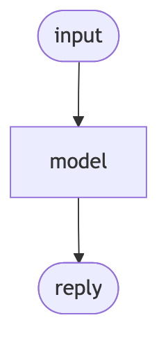

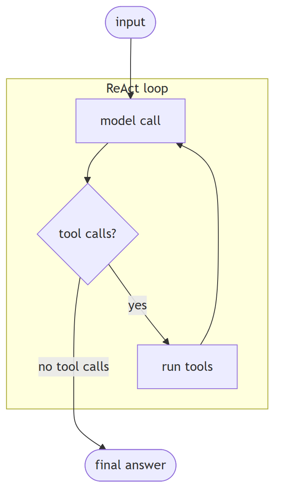

**In Jiuwen.** There is no separate chatbot class; the distinction is structural. A single model turn is the workflow LLM component, which calls the model once and has no tool branch. An agent is the ReAct loop: it calls the model, and if the reply has no tool calls it returns the answer; otherwise it executes the tools and feeds the results back for another turn.

<b>Under the hood</b>

**Implementation**

There is no separate `Chatbot` class; the distinction is structural. A single model turn is the workflow LLM component, which calls `llm.invoke` once and has no tool branch. An agent is the loop in `ReActAgent.invoke`: it calls the model, and if the returned message has no tool calls it returns the answer; otherwise it executes the tools and iterates. `DeepAgent` wraps this with an outer task loop.

**Code anchors**

| Code anchor | What it points to |
|---|---|
| `agent-core/openjiuwen/core/workflow/components/llm/llm_comp.py:524` | single model call, no tool branch |
| `agent-core/openjiuwen/core/single_agent/agents/react_agent.py:2740` | the ReAct loop |
| `agent-core/openjiuwen/core/single_agent/agents/react_agent.py:2793` | no tool calls → final answer |
| `agent-core/openjiuwen/core/single_agent/agents/react_agent.py:2813` | execute tools and iterate |
| `agent-core/openjiuwen/harness/deep_agent.py:2694` | outer task loop |

---

## 2. What's the difference between a workflow and an agent

Compare basic

**TL;DR.** A workflow is a pre-declared graph (you author steps/edges/branches); an agent decides its next step at runtime from model output.

**Key points.**

- Workflow: fixed topology, predictable, cheap.
- Agent: runtime branching on model output.
- A workflow can embed an agent as a node.

**Concept.** A workflow is a pre-declared graph: you author the steps, edges, and branches, and execution follows that topology. An agent decides its next step at runtime from model output. Workflows are predictable and cheap; agents are flexible and variable. They compose: a workflow can contain an agent node.

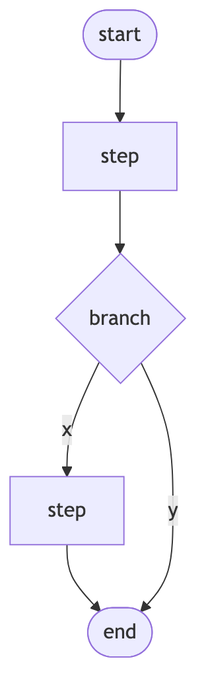

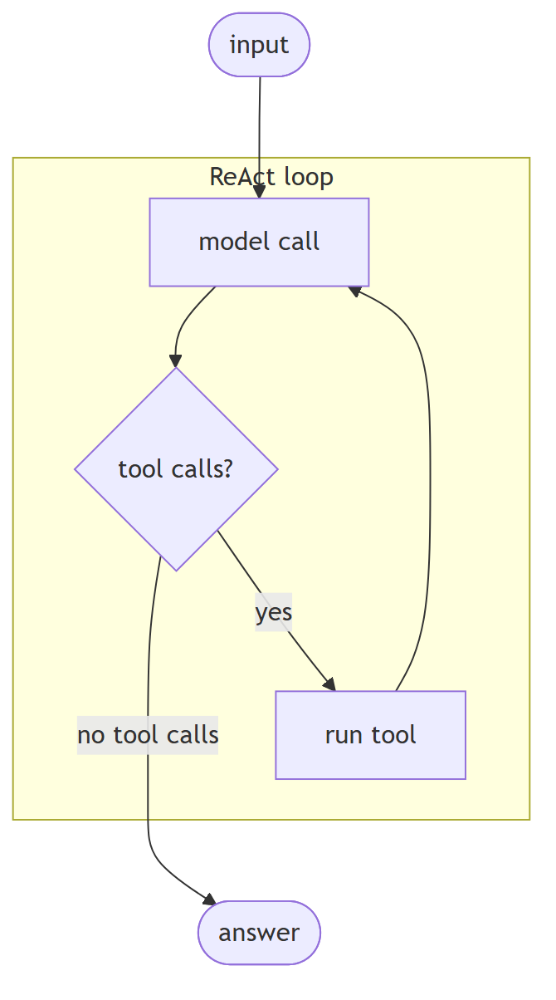

**In Jiuwen.** The workflow engine is a Pregel-style graph machine: topology is declared up front via the start component and (conditional) connections, and execution ends at the end component. An agent loop instead branches on live tool calls. A workflow can embed an agent as one of its nodes, so the two are layers, not opposites.

<b>Under the hood</b>

**Implementation**

The workflow engine is a Pregel-style graph machine. Topology is declared up front via the start component, connections, and conditional connections, and execution terminates when the end component produces output. An agent loop instead branches on live `tool_calls`. A workflow can embed an agent as one node, where a single executable just calls the agent's `invoke`.

**Code anchors**

| Code anchor | What it points to |
|---|---|
| `agent-core/openjiuwen/core/workflow/workflow.py:98` | Workflow class |
| `agent-core/openjiuwen/core/graph/pregel/engine.py:255` | graph execution driver |
| `agent-core/openjiuwen/core/workflow/workflow.py:136/279/311` | set_start_comp / add_connection / add_conditional_connection |
| `agent-core/openjiuwen/core/workflow/workflow.py:551` | terminates when the end component produces output |
| `agent-core/openjiuwen/core/workflow/components/llm/react/react_executable.py:41` | workflow node embedding an agent |

---

## 3. What's the difference between a linear chain and a graph with conditional branches

Compare basic

**TL;DR.** A linear chain always activates the next step; a graph adds routing (choose successors from state) and joining/barriers (when a merge node is ready).

**Key points.**

- Linear: static edges, fixed order.
- Graph: conditional edges route by state.
- Join/barrier gates merge nodes.

**Concept.** A linear chain is a fixed sequence where each step always activates the next. A graph adds branching and merging: a router selects successors based on state at runtime, and a join/barrier decides when a merge node is ready (all predecessors, or any of an exclusive group).

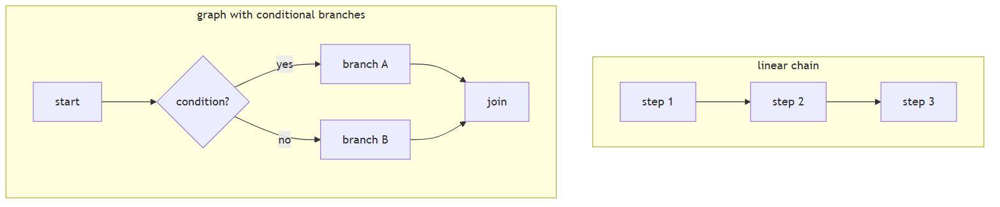

**In Jiuwen.** Both use the same graph engine. A static connection becomes a simple router (one-to-many) or a barrier (many-to-one, with OR-groups for mutually exclusive predecessors). A conditional connection registers a branch router that picks successors from state at runtime. So the difference is which kind of edge you add, not a different engine.

<b>Under the hood</b>

**Implementation**

Both are built on the same `PregelGraph`. `add_connection` registers a static edge; at compile time `PregelGraph._compile` turns static edges into `StaticRouter` (1→N) or `BarrierChannel` (N→1, with CNF OR-groups for mutually exclusive predecessors). `add_conditional_connection` registers a branch router compiled to `ConditionalRouter`, whose `dispatch` calls the user selector and emits `TriggerMessage`s only for the chosen targets. A linear chain always activates its single successor; a conditional graph activates only the selector's targets, and `BranchRouter` raises `COMPONENT_BRANCH_EXECUTION_ERROR` if none match.

**Implementation diagram**

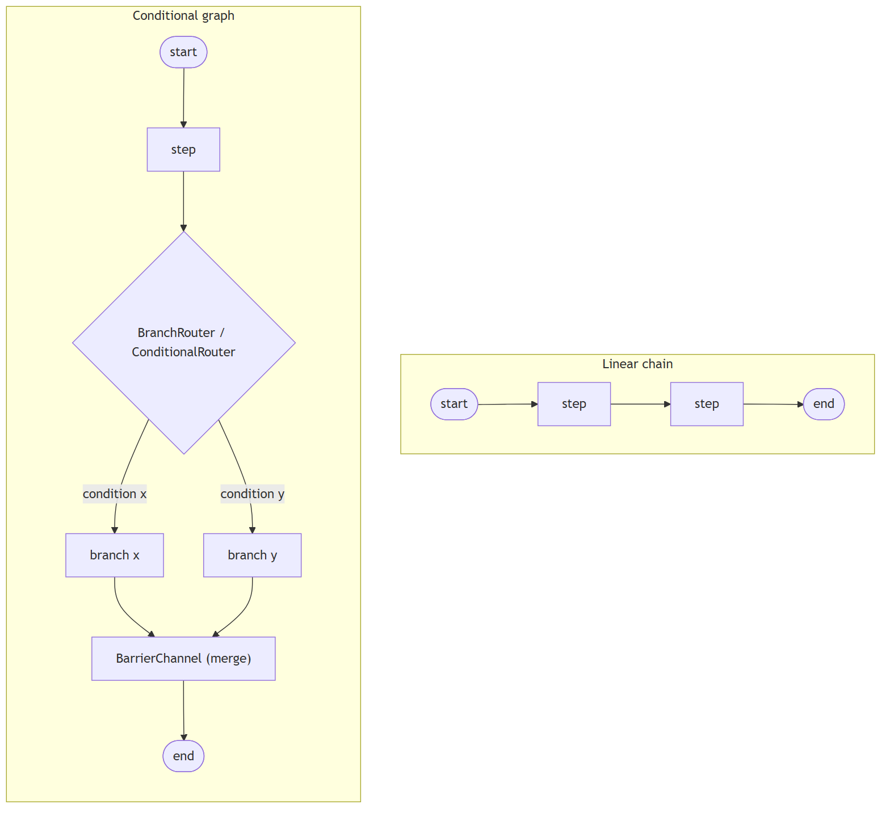

**Code anchors**

| Code anchor | What it points to |
|---|---|
| `agent-core/openjiuwen/core/workflow/workflow.py:279` | add_connection (static); :311 — add_conditional_connection |
| `agent-core/openjiuwen/core/workflow/_workflow.py:221` | BaseWorkflow.add_connection → self._graph.add_edge; :255 — add_conditional_connection wraps BranchRouter + register_branch_targets |
| `agent-core/openjiuwen/core/graph/graph.py:103` | add_edge; :122 — add_conditional_edges; :267 _compile; :300 adds branches to the Pregel builder |
| `agent-core/openjiuwen/core/graph/pregel/builder.py:28` | add_edge (N→1 BarrierChannel, 1→N StaticRouter); :67 add_branch |
| `agent-core/openjiuwen/core/graph/pregel/router.py:11` | StaticRouter.dispatch; :26 ConditionalRouter.dispatch |
| `agent-core/openjiuwen/core/graph/pregel/channels.py:104` | TriggerChannel; :129 BarrierChannel; :166 is_ready (CNF OR-groups) |
| `agent-core/openjiuwen/core/workflow/components/flow/branch_router.py:92` | BranchRouter.__call__ |

---

## 4. What's the ReAct pattern?

Mechanism basic

**TL;DR.** ReAct alternates thought → action → observation, so each tool result informs the next reasoning step.

**Key points.**

- Alternates reason, act, observe.
- Each observation feeds the next thought.
- Repeats until there are no tool calls.

**Concept.** ReAct alternates thought → action → observation. Each action's real result informs the next thought, so the agent grounds its reasoning in observed state rather than assumptions about it.

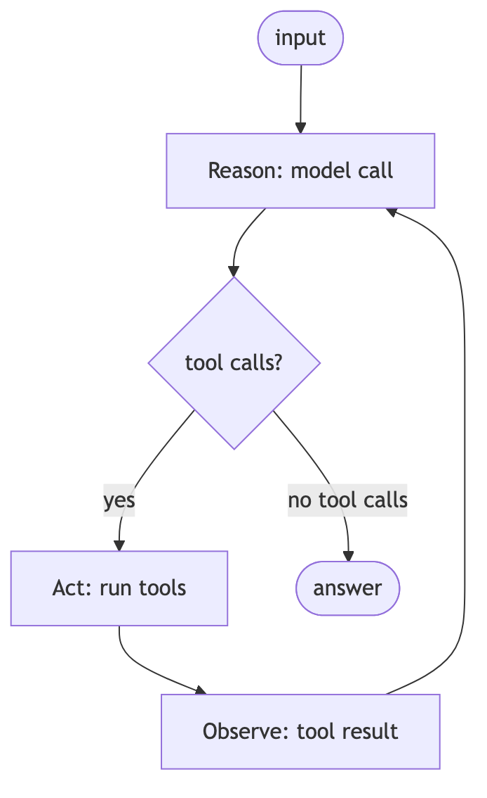

**In Jiuwen.** The loop is exactly reason/act/observe: model call, branch on tool_calls, execute the tools, feed ToolMessages back as the next observation, and repeat until there are no tool calls. The reasoning trace is retained by copying reasoning_content into the assistant message, and the iteration number is exposed to rails.

<b>Under the hood</b>

**Implementation**

The loop is exactly reason/act/observe: model call, branch on `tool_calls`, execute, feed `ToolMessage`s back as the next observation, repeat. The reasoning trace is retained by copying `reasoning_content` into the assistant message, and the iteration number is exposed to rails.

**Code anchors**

| Code anchor | What it points to |
|---|---|
| `agent-core/openjiuwen/core/single_agent/agents/react_agent.py:2766` | model call (reason) |
| `agent-core/openjiuwen/core/single_agent/agents/react_agent.py:2793` | branch on tool calls |
| `agent-core/openjiuwen/core/single_agent/agents/react_agent.py:2813` | execute (act) |
| `agent-core/openjiuwen/core/single_agent/agents/react_agent.py:2787` | retain reasoning_content |
| `agent-core/openjiuwen/core/single_agent/agents/react_agent.py:2742` | iteration exposed to rails |
| `agent-core/openjiuwen/core/single_agent/agents/react_agent.py:568` | ReActAgent documents the pattern |

---

## 5. Why interleave reasoning and actions instead of planning everything upfront?

Mechanism intermediate

**TL;DR.** A fully upfront plan cannot react to what tools return; interleaving feeds each result back so the agent adapts.

**Key points.**

- An upfront plan executes with no feedback.
- Interleaving grounds each step in real results.
- Adapts when reality differs from the plan.

**Concept.** A fully upfront plan executes with no feedback, so it cannot adapt when reality differs. Interleaving feeds each observation back into the next reasoning step, which corrects drift and grounds the plan in what the tools actually returned.

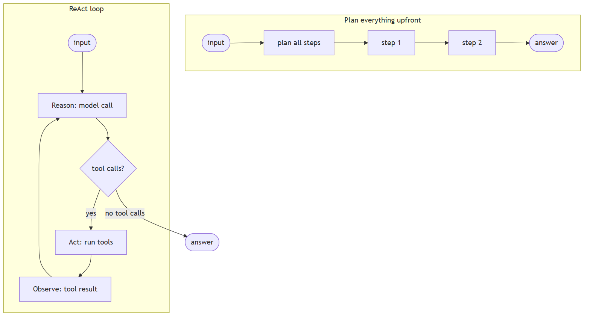

**In Jiuwen.** Jiuwen's agent is a ReAct loop, not a plan-then-execute pipeline: every turn re-decides based on the latest observation and is bounded by max_iterations (default 5). The deep agent's outer task loop is likewise iterative (todos updated as results arrive) rather than a fixed upfront plan.

<b>Under the hood</b>

**Implementation**

Jiuwen's agent is a ReAct loop, not a plan-then-execute pipeline: every turn re-decides based on the latest observation and is bounded by `max_iterations` (default 5). The deep agent's outer task loop is likewise iterative — todos are updated as results arrive — rather than a fixed upfront plan.

**Code anchors**

| Code anchor | What it points to |
|---|---|
| `agent-core/openjiuwen/core/single_agent/agents/react_agent.py:2793` | re-decides each turn from the latest observation |
| `agent-core/openjiuwen/core/single_agent/agents/react_agent.py:2813` | acts, then loops on the result |
| `agent-core/openjiuwen/core/single_agent/agents/react_agent.py:288` | max_iterations=5 bounds the loop |
| `agent-core/openjiuwen/harness/deep_agent.py:2723` | outer task loop (iterative, hard ceiling) |

---

## 6. How do you set a hard limit on iterations or steps within a framework

Mechanism intermediate

**TL;DR.** Cap the loop with a max-iteration/round counter plus token/time budgets, enforced (not just reported), with a cap at each nesting level and configurable.

**Key points.**

- Max iterations/rounds, enforced.
- Add token and wall-clock budgets.
- Cap each nested loop; make caps configurable.

**Concept.** Cap the loop with a max-iteration/max-round counter, plus optional token and wall-clock budgets, and *enforce* them rather than only reporting. Nested loops need a cap at each level, and the caps should be configurable.

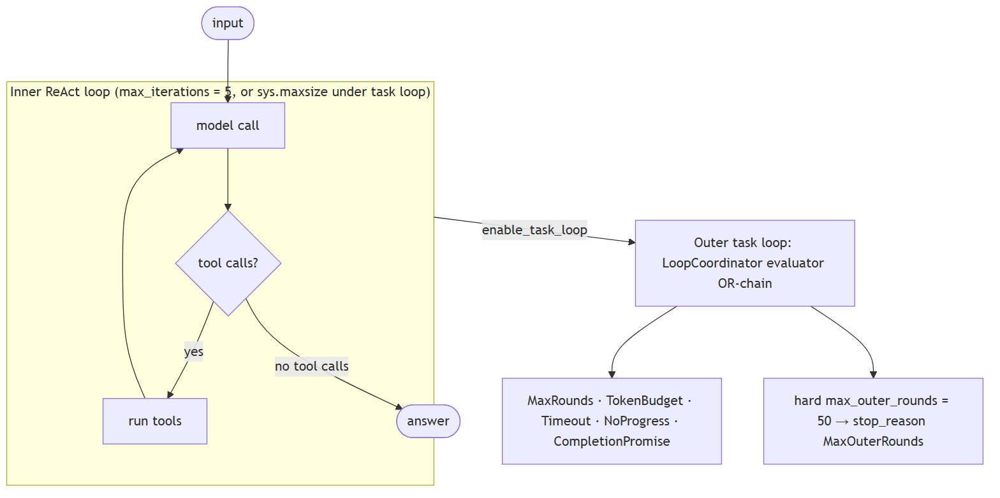

**In Jiuwen.** The inner ReAct loop is bounded by the agent config's max_iterations (default 5) and exits with an error result when exceeded. When the task loop is enabled, the inner ReAct ceiling is raised and the real bound moves to the outer loop, where a coordinator OR-evaluates stop evaluators; there is also a hard outer-round literal.

<b>Under the hood</b>

**Implementation**

The inner ReAct loop is bounded by `ReActAgentConfig.max_iterations` (default 5) and exits with `{"result_type": "error", "output": "Max iterations reached without completion"}`. When `enable_task_loop=True`, DeepAgent raises the inner ReAct ceiling to `sys.maxsize` and moves the real bound to the outer task loop, where `LoopCoordinator.should_continue()` OR-evaluates a chain of `StopConditionEvaluator`s. `TaskCompletionRail.build_evaluators()` contributes `MaxRounds`/`Timeout`/`TokenBudget`/`CompletionPromise`; the `NoProgressAnswer` evaluator is added separately from `task_loop_no_progress_guard` (`deep_agent._build_task_loop_evaluators`). Independently, `_run_task_loop` hard-codes `max_outer_rounds = 50` and force-stops with `stop_reason: "MaxOuterRounds"`. Team members reuse the wiring via `TaskCompletionRail(max_rounds=...)`, and cooperative stops exist via `ctx.request_force_finish()` and `DeepAgent.abort()`.

**Code anchors**

| Code anchor | What it points to |
|---|---|
| `agent-core/openjiuwen/core/single_agent/agents/react_agent.py:288` | max_iterations: int = Field(default=5); :2740 the bounded loop; :2852 exhaustion result |
| `agent-core/openjiuwen/harness/schema/stop_condition.py:134` | MaxRoundsEvaluator.should_stop; :143 TokenBudget; :162 Timeout |
| `agent-core/openjiuwen/harness/task_loop/loop_coordinator.py:139` | should_continue() OR-chain; :110 increment_iteration; :133 request_abort |
| `agent-core/openjiuwen/harness/rails/task_completion_rail.py:168` | build_evaluators(); :178-185 build MaxRounds/Timeout/TokenBudget |
| `agent-core/openjiuwen/harness/deep_agent.py:2723` | max_outer_rounds = 50; :2725 while coordinator.should_continue(); :2727-2739 force-stop; :1116 inner cap swap; :2338 _build_task_loop_evaluators; :3380 abort() |
| `agent-core/openjiuwen/agent_teams/agent/agent_configurator.py:436` | member TaskCompletionRail(max_rounds=agent_spec.max_iterations) |
| `agent-core/openjiuwen/agent_teams/workflow/backends/budget_rail.py:88` | token-ceiling ctx.request_force_finish; agent-core/openjiuwen/agent_teams/agent/scheduling/scheduler.py:300 — review-round cap |

---

## 7. What decides when an agent stops and returns a final answer instead of calling another tool

Mechanism intermediate

**TL;DR.** Usually the model: no tool calls means the answer is final. Around that sit hard limits — max iterations, token/time budgets, explicit stop conditions.

**Key points.**

- No tool calls → final answer.
- Hard limits: iterations, tokens, time.
- Outer loop: stop evaluators + completion promise.

**Concept.** Usually the model itself: when it emits no tool calls, the answer is final. Around that sit hard limits — max iterations, token/time budgets, and explicit stop conditions — so a confused agent does not loop forever.

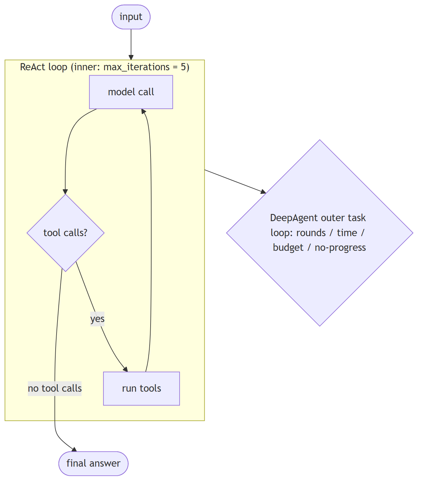

**In Jiuwen.** Two levels. Inner: in the ReAct agent, no tool calls means a final answer, bounded by max_iterations. Outer (the DeepAgent task loop): a coordinator OR-evaluates stop evaluators — max rounds, timeout, token budget, completion promise, and a no-progress answer evaluator — so the loop ends on the first condition that fires.

<b>Under the hood</b>

**Implementation**

Two levels. Inner: in `ReActAgent`, no tool calls means a final answer, bounded by `max_iterations` (default 5). Outer (`DeepAgent` task loop): the `LoopCoordinator` OR-evaluates a chain of stop evaluators — max rounds, timeout, token budget, completion promise, and no-progress answer. Completion can also arrive as a `<promise>…</promise>` marker extracted by `TaskCompletionRail`. A hardcoded ceiling of 50 outer rounds backstops everything.

**Code anchors**

| Code anchor | What it points to |
|---|---|
| `agent-core/openjiuwen/core/single_agent/agents/react_agent.py:2793` | no tool calls → final answer |
| `agent-core/openjiuwen/core/single_agent/agents/react_agent.py:288` | max_iterations default 5 |
| `agent-core/openjiuwen/core/single_agent/agents/react_agent.py:2740` | inner loop |
| `agent-core/openjiuwen/harness/task_loop/loop_coordinator.py:139` | outer should_continue |
| `agent-core/openjiuwen/harness/schema/stop_condition.py:124-331` | evaluator chain |
| `agent-core/openjiuwen/harness/rails/task_completion_rail.py:403` | completion-promise extraction |
| `agent-core/openjiuwen/harness/deep_agent.py:2723` | hard 50-round ceiling |

---

## 8. Preventing an agent from getting stuck in an infinite tool-calling loop

Mechanism intermediate

**TL;DR.** Cap iterations, detect repetition on canonicalized (tool,args), nudge or abort on no progress, and cap rounds/tokens/time.

**Key points.**

- Iteration cap.
- Repetition detection on canonicalized args.
- No-progress nudge/abort + token/time caps.

**Concept.** Cap iterations, detect repetition (same tool and arguments repeatedly), nudge or abort when no progress is made, and also cap rounds, tokens, and wall time. Detection should compare canonicalized arguments, not raw strings.

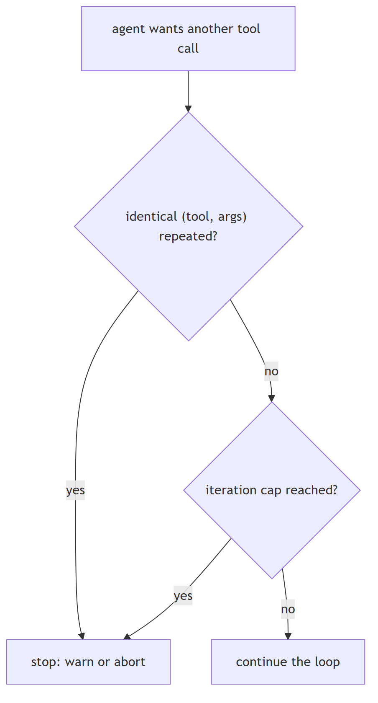

**In Jiuwen.** The inner loop is capped by max_iterations (ReAct default 5, harness default 15). An anomaly-detection rail finds consecutive identical (tool name, canonicalized args) rounds and either folds them into a warning or aborts, and a dedup rail counts repeated read-only calls and warns. Outer caps add rounds, tokens, and time.

<b>Under the hood</b>

**Implementation**

Inner cap `max_iterations` (ReAct default 5, harness default 15). Repetition detection: `ModelAnomalyDetectionRail` finds consecutive identical `(tool_name, canonical_args)` rounds and either folds them into a warning or aborts; `ToolCallDeduplicationRail` counts repeated read-only calls and warns. Outer guards: `NoProgressAnswerEvaluator`, `MaxRoundsEvaluator`, and the hard 50-round ceiling. Agent teams add repeat-tool and ping-pong detectors.

**Implementation diagram**

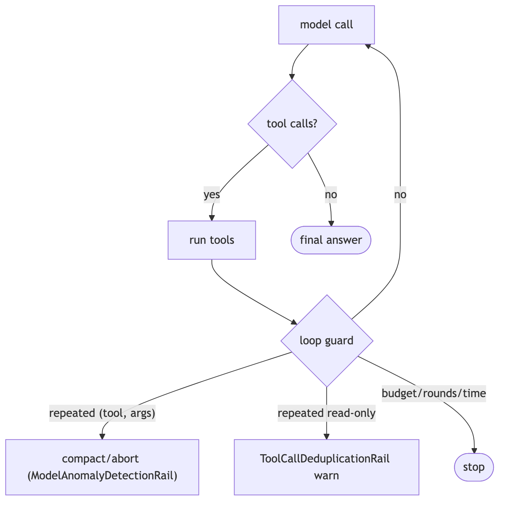

**Code anchors**

| Code anchor | What it points to |
|---|---|
| `agent-core/openjiuwen/core/single_agent/agents/react_agent.py:288` | max_iterations default 5; agent-core/openjiuwen/harness/schema/config.py:252 — harness default 15 |
| `agent-core/openjiuwen/harness/rails/model_anomaly_detection_rail.py:74/90` | tool-loop threshold + bailout |
| `jiuwenswarm/jiuwenswarm/agents/harness/common/rails/tool_dedup_rail.py:157` | cross-turn repeat counter |
| `agent-core/openjiuwen/harness/schema/stop_condition.py:181` | NoProgressAnswerEvaluator |
| `agent-core/openjiuwen/harness/deep_agent.py:2723` | hard 50-round ceiling |
| `agent-core/openjiuwen/agent_teams/reliability/detectors/repeat_tool.py:15` | repeat-tool; agent-core/openjiuwen/agent_teams/reliability/detectors/pingpong.py:12 — ping-pong |

---

## 9. "The agent is stuck" tests whether you've shipped one, not studied one

Claim intermediate

**Claim, not a question.** The heading is an assertion about what these questions probe; the notes below assess whether it holds.

**TL;DR.** 'The agent is stuck' tests whether you've shipped one, not studied one.

**Key points.**

- ReAct max_iterations (5; harness 15).
- Agentic retriever max iter (2, clamped).
- Anomaly rail: identical rounds → compact/abort.
- Dedup rail + session cost cap.

**Concept.** This claim is fair: diagnosing a stuck agent requires operational experience with loops, budgets, and retries rather than theory alone — though there is a knowledge question underneath the framing. Infinite tool loops, retries on a flaky API that never terminate, token spend that spikes overnight. The concrete controls are `max_iterations=5`, a token budget per session, and a circuit breaker after N consecutive tool failures: a hard iteration cap, repetition detection on canonicalized `(tool, args)`, a per-session token/cost budget, retry with backoff only for idempotent reads, and a circuit breaker on repeated failures.

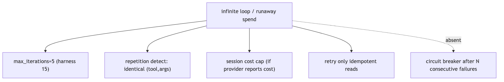

**In Jiuwen.** Concrete caps exist: ReAct max iterations (default 5, harness 15), agentic-retriever max iterations (default 2, clamped), an anomaly-detection rail (consecutive identical tool rounds trigger compaction or abort), and a tool-call dedup rail. A session cost cap is enforced.

<b>Under the hood</b>

**Implementation**

Concrete caps exist: ReAct `max_iterations` (default 5, harness 15), `AgenticRetriever.max_iter` (default 2, clamped), `ModelAnomalyDetectionRail` (consecutive identical tool rounds → compact/abort) and `ToolCallDeduplicationRail`. A session cost cap is enforced when the provider reports cost, and `ModelBackupRail` fails over. What is **missing** is a circuit breaker after N consecutive failures and a durable token budget on the retrieval loop.

**Code anchors**

| Code anchor | What it points to |
|---|---|
| `agent-core/openjiuwen/core/single_agent/agents/react_agent.py:288` | max_iterations: int = Field(default=5); agent-core/openjiuwen/harness/schema/config.py:252 — harness default 15 |
| `agent-core/openjiuwen/harness/rails/model_anomaly_detection_rail.py:74` | ToolLoopCompactConfig (default off); :90 bailout |
| `jiuwenswarm/jiuwenswarm/agents/harness/common/rails/tool_dedup_rail.py:157` | repeat counter/warning |
| `jiuwenswarm/jiuwenswarm/server/runtime/usage_cost.py:171/196` | enforced session cost cap |
| `agent-core/openjiuwen/core/single_agent/rail/model_backup.py:9` | ModelBackupRail failover (no circuit breaker) |

---

## 10. How do you detect and prevent divergence in an agent loop — not just cap iterations?

Concept intermediate

**TL;DR.** Cap iterations to stop infinite loops, but also detect meaningless cycling: track tool-call fingerprints and output-text similarity to catch repetitive steps early.

**Key points.**

- ToolCallDeduplicationRail suppresses repeated identical calls within a session.
- ModelAnomalyDetectionRail detects repeated outputs (off by default).
- Gap: no output-text similarity comparison across turns to catch paraphrase loops.

**Concept.** A hard iteration cap (`max_iterations`) prevents runaway loops by time but does not detect that the agent is *stuck repeating itself*. Divergence detection is a complementary mechanism: (1) hash `(tool_name, canonicalised_args)` on each turn and compare against prior turns — if the same call recurs, the agent is spinning; (2) compare model output text similarity across consecutive turns — if the reasoning text is structurally identical, the agent is not making progress; (3) on detection, trigger a compaction step (rewrite history to remove the reinforcing noise) before continuing, rather than simply aborting. The goal is to detect the loop early and repair the context, not just stop at a budget limit.

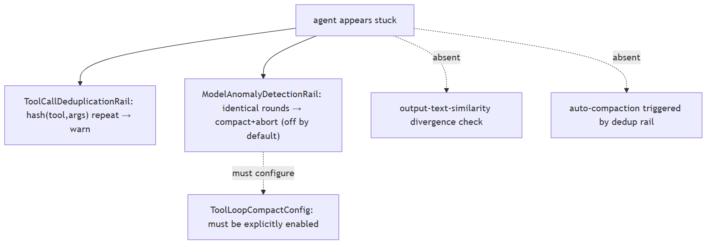

**In Jiuwen.** ToolCallDeduplicationRail (agent-core/openjiuwen/harness/rails/subagent/tool_call_deduplication_rail.py) suppresses repeated identical tool calls within a session. ModelAnomalyDetectionRail exists for output-pattern anomalies but is off by default. No output-text similarity comparison across turns exists — paraphrase loops that change argument wording pass the dedup rail.

<b>Under the hood</b>

**Implementation**

`ToolCallDeduplicationRail` hashes `(tool, args)` per turn and emits warnings on repeat. `ModelAnomalyDetectionRail` detects consecutive identical tool-call rounds and can trigger compact-then-abort (`ToolLoopCompactConfig`), but this config is **off by default** — loops generate warnings but do not abort without explicit configuration. There is no output-text-similarity divergence check (only tool-call-level detection). Compaction on loop is available via `FullCompactProcessor` but is not automatically triggered by the dedup rail.

---

## 11. What are the explicit termination conditions an agent needs — beyond "stop when done"?

Concept intermediate

**TL;DR.** An agent needs named success, budget-exceeded, and escalation exit paths — not just 'stop when done' — so every run terminates predictably and failures degrade gracefully.

**Key points.**

- Success: structured_output or answer action fires.
- Budget: turn/token cap, CircuitBreakerRail.
- Escalation: AskUserRail for human input.
- Gap: no graceful degraded response from any path — budget exhaustion raises rather than returns a partial result.

**Concept.** "Stop when done" is not a termination condition; it is an aspiration. A production agent needs at least three explicit paths: (1) **success** — the agent emits a final answer meeting a defined success condition (e.g., all required fields populated, context cited, schema valid); (2) **budget exhaustion** — hard cap on iterations and tokens, with a graceful degraded response (partial answer + "budget exceeded" notice) rather than silence or an error; (3) **human escalation** — when the agent cannot resolve the task within budget or detects irresolvable ambiguity, it hands off explicitly. Confidence threshold as a fourth optional path: if the model's self-assessed uncertainty is above a threshold, escalate before acting rather than produce an ungrounded answer.

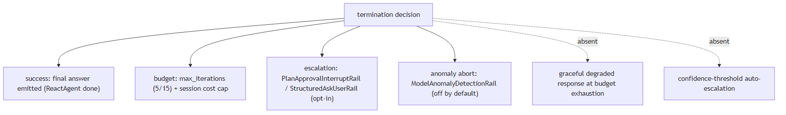

**In Jiuwen.** Success path: model emits a structured_output tool call or the ReactAgent's answer branch (react_agent.py:2793). Budget paths: turn cap (max_turns), CircuitBreakerRail trip on consecutive failures. Escalation: AskUserRail pauses and surfaces the question. Gap: no path returns a graceful degraded partial result — budget exhaustion raises an exception that propagates to the caller.

<b>Under the hood</b>

**Implementation**

Multiple termination paths are implemented. `ReactAgent.max_iterations` is the hard iteration cap (default 5, harness 15). `PlanApprovalInterruptRail` and `StructuredAskUserRail` provide the human-in-the-loop escalation path. `ModelAnomalyDetectionRail` can abort on anomaly detection. `AgentObservabilityRail` always runs last, ensuring every turn is logged even at termination. What is **absent**: no graceful degraded response on budget exhaustion (the agent aborts rather than returning a partial answer), no confidence-threshold-based escalation, and `PlanApprovalInterruptRail` is opt-in per agent config.

---

## 12. When should you use a deterministic workflow instead of an autonomous agent?

Concept intermediate

**TL;DR.** Use a workflow when the task structure is fully known; use an agent when the next action depends on prior results in ways you cannot enumerate. Most production systems are hybrid: deterministic outer shell with agent sub-tasks where flexibility is required.

**Key points.**

- Workflow: fixed developer-defined step sequence — deterministic, bounded cost, enumerable failure modes, unit-testable.
- Agent: model-driven loop — model chooses tools and termination, flexible but non-deterministic and harder to test.
- Choose workflow: task structure known, compliance requires same path every time, cost must be bounded.
- Choose agent: task requires open-ended reasoning, tool selection is context-dependent, goal is underspecified.
- Hybrid pattern: deterministic outer workflow calling agent sub-tasks only where flexibility is genuinely required — build the workflow path first.

**Concept.** A **workflow** is a fixed, developer-defined sequence of steps — the control flow is hardcoded. An **agent** is a model-driven loop where the model decides which tools to call and when to stop. The distinction matters for reliability, cost, and testability.

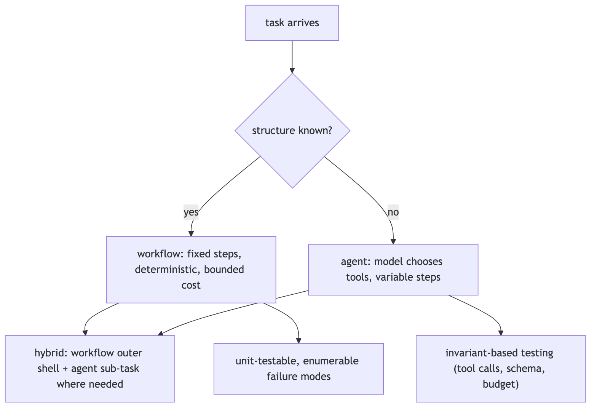

**In Jiuwen.** The graph path (Pregel-based workflow engine) handles known control flow with static and conditional routers, barriers, and OR-groups. The agent harness (ReAct loop with rails) handles dynamic tool use. Both are first-class: the framework design guidance is explicit — use graphs for known control flow, the agent harness for flexible collaboration. Hybrid: a workflow can delegate a sub-step to an agent sub-task.

<b>Under the hood</b>

**Implementation**

The graph path (Pregel-based workflow engine with static and conditional routers, barriers, OR-groups) handles known control flow. The agent harness (ReAct loop with rails) handles dynamic tool use. Both are first-class: the framework design guidance is explicit — use graphs for known control flow, the agent harness for flexible collaboration.

---
