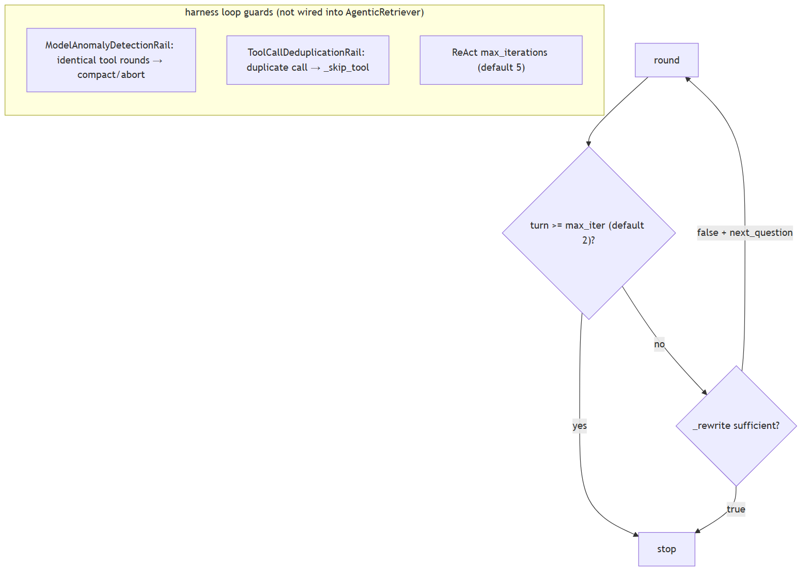

# Agents, tools and memory

## 1. What's the difference between a chatbot and an agent

**Title.** Chatbot vs agent

**Summary.** A chatbot maps one input to one model reply; an agent runs a loop (model → tools → results → repeat) until a stopping condition.

**Key points.**

- Chatbot: one model turn, no tools.
- Agent: tool/reason loop with a stopping rule.
- The loop and tools, not the model, define an agent.

**General.** A chatbot maps one input to one model reply. An agent runs a loop: it calls the model, may call tools, feeds results back, and repeats until a stopping condition is met. The defining trait is the tool/reason loop and a termination rule, not the size of the model.

**Jiuwen.** There is no separate chatbot class; the distinction is structural. A single model turn is the workflow LLM component, which calls the model once and has no tool branch. An agent is the ReAct loop: it calls the model, and if the reply has no tool calls it returns the answer; otherwise it executes the tools and feeds the results back for another turn.

<b>Technical detail (classes &amp; functions)</b>

There is no separate `Chatbot` class; the distinction is structural. A single model turn is the workflow LLM component, which calls `llm.invoke` once and has no tool branch. An agent is the loop in `ReActAgent.invoke`: it calls the model, and if the returned message has no tool calls it returns the answer; otherwise it executes the tools and iterates. `DeepAgent` wraps this with an outer task loop.

&bull; `agent-core/openjiuwen/core/workflow/components/llm/llm_comp.py:524` — single model call, no tool branch &bull; `agent-core/openjiuwen/core/single_agent/agents/react_agent.py:2740` — the ReAct loop &bull; `agent-core/openjiuwen/core/single_agent/agents/react_agent.py:2793` — no tool calls → final answer &bull; `agent-core/openjiuwen/core/single_agent/agents/react_agent.py:2813` — execute tools and iterate &bull; `agent-core/openjiuwen/harness/deep_agent.py:2694` — outer task loop

_Canonical source: `source/ai-agent-interview-questions_for_engineers.md`_

---

## 2. What's the difference between a workflow and an agent

**Title.** Workflow vs agent

**Summary.** A workflow is a pre-declared graph (you author steps/edges/branches); an agent decides its next step at runtime from model output.

**Key points.**

- Workflow: fixed topology, predictable, cheap.
- Agent: runtime branching on model output.
- A workflow can embed an agent as a node.

**General.** A workflow is a pre-declared graph: you author the steps, edges, and branches, and execution follows that topology. An agent decides its next step at runtime from model output. Workflows are predictable and cheap; agents are flexible and variable. They compose: a workflow can contain an agent node.

**Jiuwen.** The workflow engine is a Pregel-style graph machine: topology is declared up front via the start component and (conditional) connections, and execution ends at the end component. An agent loop instead branches on live tool calls. A workflow can embed an agent as one of its nodes, so the two are layers, not opposites.

<b>Technical detail (classes &amp; functions)</b>

The workflow engine is a Pregel-style graph machine. Topology is declared up front via the start component, connections, and conditional connections, and execution terminates when the end component produces output. An agent loop instead branches on live `tool_calls`. A workflow can embed an agent as one node, where a single executable just calls the agent's `invoke`.

&bull; `agent-core/openjiuwen/core/workflow/workflow.py:98` — Workflow class &bull; `agent-core/openjiuwen/core/graph/pregel/engine.py:255` — graph execution driver &bull; `agent-core/openjiuwen/core/workflow/workflow.py:136/279/311` — set_start_comp / add_connection / add_conditional_connection &bull; `agent-core/openjiuwen/core/workflow/workflow.py:551` — terminates when the end component produces output &bull; `agent-core/openjiuwen/core/workflow/components/llm/react/react_executable.py:41` — workflow node embedding an agent

_Canonical source: `source/ai-agent-interview-questions_for_engineers.md`_

---

## 3. What's the difference between a linear chain and a graph with conditional branches

**Title.** Linear chain vs conditional graph

**Summary.** A linear chain always activates the next step; a graph adds routing (choose successors from state) and joining/barriers (when a merge node is ready).

**Key points.**

- Linear: static edges, fixed order.
- Graph: conditional edges route by state.
- Join/barrier gates merge nodes.

**General.** A linear chain is a fixed sequence where each step always activates the next. A graph adds branching and merging: a router selects successors based on state at runtime, and a join/barrier decides when a merge node is ready (all predecessors, or any of an exclusive group).

**Jiuwen.** Both use the same graph engine. A static connection becomes a simple router (one-to-many) or a barrier (many-to-one, with OR-groups for mutually exclusive predecessors). A conditional connection registers a branch router that picks successors from state at runtime. So the difference is which kind of edge you add, not a different engine.

<b>Technical detail (classes &amp; functions)</b>

Both are built on the same `PregelGraph`. `add_connection` registers a static edge; at compile time `PregelGraph._compile` turns static edges into `StaticRouter` (1→N) or `BarrierChannel` (N→1, with CNF OR-groups for mutually exclusive predecessors). `add_conditional_connection` registers a branch router compiled to `ConditionalRouter`, whose `dispatch` calls the user selector and emits `TriggerMessage`s only for the chosen targets. A linear chain always activates its single successor; a conditional graph activates only the selector's targets, and `BranchRouter` raises `COMPONENT_BRANCH_EXECUTION_ERROR` if none match.

&bull; `agent-core/openjiuwen/core/workflow/workflow.py:279` — add_connection (static); :311 — add_conditional_connection &bull; `agent-core/openjiuwen/core/workflow/_workflow.py:221` — BaseWorkflow.add_connection → self._graph.add_edge; :255 — add_conditional_connection wraps BranchRouter + register_branch_targets &bull; `agent-core/openjiuwen/core/graph/graph.py:103` — add_edge; :122 — add_conditional_edges; :267 _compile; :300 adds branches to the Pregel builder &bull; `agent-core/openjiuwen/core/graph/pregel/builder.py:28` — add_edge (N→1 BarrierChannel, 1→N StaticRouter); :67 add_branch &bull; `agent-core/openjiuwen/core/graph/pregel/router.py:11` — StaticRouter.dispatch; :26 ConditionalRouter.dispatch &bull; `agent-core/openjiuwen/core/graph/pregel/channels.py:104` — TriggerChannel; :129 BarrierChannel; :166 is_ready (CNF OR-groups) &bull; `agent-core/openjiuwen/core/workflow/components/flow/branch_router.py:92` — BranchRouter.__call__

_Canonical source: `source/ai-agent-framework-interview-questions_for_engineers.md`_

---

## 4. What's the ReAct pattern, and why interleave reasoning with actions instead of planning everything upfront

**Title.** ReAct pattern

**Summary.** ReAct alternates thought → action → observation; interleaving lets each real tool result inform the next thought, correcting drift and grounding reasoning.

**Key points.**

- Loop: reason → act → observe.
- Tool results become the next observation.
- Interleaving corrects drift vs a big upfront plan.

**General.** ReAct alternates thought → action → observation. Interleaving lets each action's real result inform the next thought, which corrects drift and grounds reasoning in observed state. A fully upfront plan cannot react to what the tools actually return.

**Jiuwen.** Jiuwen's loop is exactly reason/act/observe: call the model, branch on whether it returned tool calls, execute the tools, and feed the results back as the next observation, repeating. The reasoning trace is preserved by copying the model's reasoning content into the assistant message, and the iteration count is exposed to rails.

<b>Technical detail (classes &amp; functions)</b>

The loop is exactly reason/act/observe: model call, branch on `tool_calls`, execute, feed `ToolMessage`s back as the next observation, repeat. The reasoning trace is retained by copying `reasoning_content` into the assistant message, and the iteration number is exposed to rails.

&bull; `agent-core/openjiuwen/core/single_agent/agents/react_agent.py:2766` — model call (reason) &bull; `agent-core/openjiuwen/core/single_agent/agents/react_agent.py:2793` — branch on tool calls &bull; `agent-core/openjiuwen/core/single_agent/agents/react_agent.py:2813` — execute (act) &bull; `agent-core/openjiuwen/core/single_agent/agents/react_agent.py:2787` — retain reasoning_content &bull; `agent-core/openjiuwen/core/single_agent/agents/react_agent.py:2742` — iteration exposed to rails &bull; `agent-core/openjiuwen/core/single_agent/agents/react_agent.py:568` — ReActAgent documents the pattern

_Canonical source: `source/ai-agent-interview-questions_for_engineers.md`_

---

## 5. How does function calling actually work under the hood

**Title.** Function calling under the hood

**Summary.** Tool schemas (name, description, JSON-Schema params) go in the request; the model returns a structured tool_calls list; the host validates args, executes, and feeds results back.

**Key points.**

- Send tool schemas with the request.
- Model returns structured tool_calls (not prose).
- Host validates args, runs the tool, feeds the result back.

**General.** Tool definitions (name, description, JSON-Schema parameters) are sent to the model in the request. The model returns a structured `tool_calls` list instead of prose; the host parses it, validates arguments against the schema, invokes the function, and appends the result as a tool message for the next model turn. The model never runs code — it only emits a request to.

**Jiuwen.** Tool cards become JSON Schema, the ability manager builds the model-facing tool list, and the model client converts it to the provider's tool format. The model's tool calls are parsed (non-streaming, streaming, and a provider-specific path), validated, and dispatched by the ability manager, with schema validation inside the local function call.

<b>Technical detail (classes &amp; functions)</b>

Cards become JSON Schema through the callable schema extractor, the ability manager builds the model-facing tool list, and the model client converts it to OpenAI/Anthropic tool format. The model's `tool_calls` are parsed (non-streaming, streaming, and Anthropic), validated, and dispatched by the ability manager, with schema validation inside `LocalFunction.invoke`.

&bull; `agent-core/openjiuwen/core/foundation/tool/utils/callable_schema_extractor.py:20` — card → JSON Schema &bull; `agent-core/openjiuwen/core/single_agent/ability_manager.py:984` — builds the model-facing tool list &bull; `agent-core/openjiuwen/core/foundation/llm/model_clients/base_model_client.py:483` — OpenAI tool format &bull; `agent-core/openjiuwen/core/foundation/llm/model_clients/anthropic_model_client.py:494` — Anthropic tool format &bull; `agent-core/openjiuwen/core/foundation/llm/model_clients/openai_model_client.py:2388` — parse non-streaming tool calls &bull; `agent-core/openjiuwen/core/foundation/llm/model_clients/openai_model_client.py:2612` — parse streaming tool-call deltas &bull; `agent-core/openjiuwen/core/foundation/llm/model_clients/anthropic_model_client.py:1229` — parse Anthropic tool_use &bull; `agent-core/openjiuwen/core/single_agent/ability_manager.py:1078` — dispatch &bull; `agent-core/openjiuwen/core/foundation/tool/function/function.py:82` — argument schema validation

_Canonical source: `source/ai-agent-interview-questions_for_engineers.md`_

---

## 6. How do you set a hard limit on iterations or steps within a framework

**Title.** Hard iteration limit

**Summary.** Cap the loop with a max-iteration/round counter plus token/time budgets, enforced (not just reported), with a cap at each nesting level and configurable.

**Key points.**

- Max iterations/rounds, enforced.
- Add token and wall-clock budgets.
- Cap each nested loop; make caps configurable.

**General.** Cap the loop with a max-iteration/max-round counter, plus optional token and wall-clock budgets, and *enforce* them rather than only reporting. Nested loops need a cap at each level, and the caps should be configurable.

**Jiuwen.** The inner ReAct loop is bounded by the agent config's max_iterations (default 5) and exits with an error result when exceeded. When the task loop is enabled, the inner ReAct ceiling is raised and the real bound moves to the outer loop, where a coordinator OR-evaluates stop evaluators; there is also a hard outer-round literal.

<b>Technical detail (classes &amp; functions)</b>

The inner ReAct loop is bounded by `ReActAgentConfig.max_iterations` (default 5) and exits with `{"result_type": "error", "output": "Max iterations reached without completion"}`. When `enable_task_loop=True`, DeepAgent raises the inner ReAct ceiling to `sys.maxsize` and moves the real bound to the outer task loop, where `LoopCoordinator.should_continue()` OR-evaluates a chain of `StopConditionEvaluator`s. `TaskCompletionRail.build_evaluators()` contributes `MaxRounds`/`Timeout`/`TokenBudget`/`CompletionPromise`; the `NoProgressAnswer` evaluator is added separately from `task_loop_no_progress_guard` (`deep_agent._build_task_loop_evaluators`). Independently, `_run_task_loop` hard-codes `max_outer_rounds = 50` and force-stops with `stop_reason: "MaxOuterRounds"`. Team members reuse the wiring via `TaskCompletionRail(max_rounds=...)`, and cooperative stops exist via `ctx.request_force_finish()` and `DeepAgent.abort()`.

&bull; `agent-core/openjiuwen/core/single_agent/agents/react_agent.py:288` — max_iterations: int = Field(default=5); :2740 the bounded loop; :2852 exhaustion result &bull; `agent-core/openjiuwen/harness/schema/stop_condition.py:134` — MaxRoundsEvaluator.should_stop; :143 TokenBudget; :162 Timeout &bull; `agent-core/openjiuwen/harness/task_loop/loop_coordinator.py:139` — should_continue() OR-chain; :110 increment_iteration; :133 request_abort &bull; `agent-core/openjiuwen/harness/rails/task_completion_rail.py:168` — build_evaluators(); :178-185 build MaxRounds/Timeout/TokenBudget &bull; `agent-core/openjiuwen/harness/deep_agent.py:2723` — max_outer_rounds = 50; :2725 while coordinator.should_continue(); :2727-2739 force-stop; :1116 inner cap swap; :2338 _build_task_loop_evaluators; :3380 abort() &bull; `agent-core/openjiuwen/agent_teams/agent/agent_configurator.py:436` — member TaskCompletionRail(max_rounds=agent_spec.max_iterations) &bull; `agent-core/openjiuwen/agent_teams/workflow/backends/budget_rail.py:88` — token-ceiling ctx.request_force_finish; agent-core/openjiuwen/agent_teams/agent/scheduling/scheduler.py:300 — review-round cap

_Canonical source: `source/ai-agent-framework-interview-questions_for_engineers.md`_

---

## 7. What decides when an agent stops and returns a final answer instead of calling another tool

**Title.** What stops an agent

**Summary.** Usually the model: no tool calls means the answer is final. Around that sit hard limits — max iterations, token/time budgets, explicit stop conditions.

**Key points.**

- No tool calls → final answer.
- Hard limits: iterations, tokens, time.
- Outer loop: stop evaluators + completion promise.

**General.** Usually the model itself: when it emits no tool calls, the answer is final. Around that sit hard limits — max iterations, token/time budgets, and explicit stop conditions — so a confused agent does not loop forever.

**Jiuwen.** Two levels. Inner: in the ReAct agent, no tool calls means a final answer, bounded by max_iterations. Outer (the DeepAgent task loop): a coordinator OR-evaluates stop evaluators — max rounds, timeout, token budget, completion promise, and a no-progress answer evaluator — so the loop ends on the first condition that fires.

<b>Technical detail (classes &amp; functions)</b>

Two levels. Inner: in `ReActAgent`, no tool calls means a final answer, bounded by `max_iterations` (default 5). Outer (`DeepAgent` task loop): the `LoopCoordinator` OR-evaluates a chain of stop evaluators — max rounds, timeout, token budget, completion promise, and no-progress answer. Completion can also arrive as a `<promise>…</promise>` marker extracted by `TaskCompletionRail`. A hardcoded ceiling of 50 outer rounds backstops everything.

&bull; `agent-core/openjiuwen/core/single_agent/agents/react_agent.py:2793` — no tool calls → final answer &bull; `agent-core/openjiuwen/core/single_agent/agents/react_agent.py:288` — max_iterations default 5 &bull; `agent-core/openjiuwen/core/single_agent/agents/react_agent.py:2740` — inner loop &bull; `agent-core/openjiuwen/harness/task_loop/loop_coordinator.py:139` — outer should_continue &bull; `agent-core/openjiuwen/harness/schema/stop_condition.py:124-331` — evaluator chain &bull; `agent-core/openjiuwen/harness/rails/task_completion_rail.py:403` — completion-promise extraction &bull; `agent-core/openjiuwen/harness/deep_agent.py:2723` — hard 50-round ceiling

_Canonical source: `source/ai-agent-interview-questions_for_engineers.md`_

---

## 8. How do you decide how many retrieval hops are enough, and how do you prevent the system from looping indefinitely

**Title.** How many retrieval hops

**Summary.** Use a sufficiency check to stop when evidence answers the question, and cap hops with a hard limit plus repetition and cost guards.

**Key points.**

- Stop when evidence is sufficient.
- Hard hop cap as a backstop.
- Repetition detection + cost ceiling.

**General.** Use a sufficiency check — decide whether the accumulated evidence answers the question — and stop when it does; cap the hops with a hard limit as a backstop. Add repetition/loop detection and a cost ceiling so a confused retriever cannot burn tokens. Prefer a dynamic stop (sufficiency) with a static cap (max hops).

**Jiuwen.** Three caps: the agentic retriever's max iterations (default 2, hard-clamped) breaks the loop at the limit; a beam search caps graph hops (default 2); and a rewrite prompt returns a sufficiency flag plus an optional next question, which stops the loop when sufficient or when no next question is produced.

<b>Technical detail (classes &amp; functions)</b>

Three caps. `AgenticRetriever.max_iter` defaults to 2 and is hard-clamped (invalid values fall back to 2); each loop breaks at `turn >= max_iter`. `TripleBeamSearch.max_length` defaults to 2 and rejects `<1`. Sufficiency: `_rewrite` sends `_REWRITE_PROMPT`, which returns `{"sufficient": bool, "next_question": str|null}`; only `sufficient=false` with a non-empty question continues. Beyond retrieval, `ModelAnomalyDetectionRail` detects consecutive identical tool-call rounds and compacts or aborts, `ToolCallDeduplicationRail` short-circuits duplicate calls, and the ReAct loop is bounded by `max_iterations`.

&bull; `agent-core/openjiuwen/core/retrieval/retriever/agentic_retriever.py:133` — max_iter=2; :148 invalid-value fallback; :241/287 turn-cap break; :364 parses sufficient/next_question &bull; `agent-core/openjiuwen/core/retrieval/retriever/graph_retriever.py:37` — max_length < 1 raises; :402 graph_hops default 2 &bull; `agent-core/openjiuwen/harness/rails/model_anomaly_detection_rail.py:418` — loop bailout AbortError; :466 _find_tool_loop_compact_range &bull; `jiuwenswarm/jiuwenswarm/agents/harness/common/rails/tool_dedup_rail.py:128` — _skip_tool duplicate suppression &bull; `agent-core/openjiuwen/core/single_agent/agents/react_agent.py:2740` — for iteration in range(..., max_iterations)

_Canonical source: `source/rag-part2-interview-questions_for_engineers.md`_

---

## 9. Preventing an agent from getting stuck in an infinite tool-calling loop

**Title.** Infinite tool-calling loop

**Summary.** Cap iterations, detect repetition on canonicalized (tool,args), nudge or abort on no progress, and cap rounds/tokens/time.

**Key points.**

- Iteration cap.
- Repetition detection on canonicalized args.
- No-progress nudge/abort + token/time caps.

**General.** Cap iterations, detect repetition (same tool and arguments repeatedly), nudge or abort when no progress is made, and also cap rounds, tokens, and wall time. Detection should compare canonicalized arguments, not raw strings.

**Jiuwen.** The inner loop is capped by max_iterations (ReAct default 5, harness default 15). An anomaly-detection rail finds consecutive identical (tool name, canonicalized args) rounds and either folds them into a warning or aborts, and a dedup rail counts repeated read-only calls and warns. Outer caps add rounds, tokens, and time.

<b>Technical detail (classes &amp; functions)</b>

Inner cap `max_iterations` (ReAct default 5, harness default 15). Repetition detection: `ModelAnomalyDetectionRail` finds consecutive identical `(tool_name, canonical_args)` rounds and either folds them into a warning or aborts; `ToolCallDeduplicationRail` counts repeated read-only calls and warns. Outer guards: `NoProgressAnswerEvaluator`, `MaxRoundsEvaluator`, and the hard 50-round ceiling. Agent teams add repeat-tool and ping-pong detectors.

&bull; `agent-core/openjiuwen/core/single_agent/agents/react_agent.py:288` — max_iterations default 5; agent-core/openjiuwen/harness/schema/config.py:252 — harness default 15 &bull; `agent-core/openjiuwen/harness/rails/model_anomaly_detection_rail.py:74/90` — tool-loop threshold + bailout &bull; `jiuwenswarm/jiuwenswarm/agents/harness/common/rails/tool_dedup_rail.py:157` — cross-turn repeat counter &bull; `agent-core/openjiuwen/harness/schema/stop_condition.py:181` — NoProgressAnswerEvaluator &bull; `agent-core/openjiuwen/harness/deep_agent.py:2723` — hard 50-round ceiling &bull; `agent-core/openjiuwen/agent_teams/reliability/detectors/repeat_tool.py:15` — repeat-tool; agent-core/openjiuwen/agent_teams/reliability/detectors/pingpong.py:12 — ping-pong

_Canonical source: `source/ai-engineer-technical-questions_for_engineers.md`_

---

## 10. How does an agent decide when to retrieve again versus when it has enough context to answer

**Title.** Retrieve again or answer

**Summary.** Ask the model a sufficiency question — is the evidence enough, and if not what's the next query? Stop when sufficient or the cap is hit.

**Key points.**

- Sufficiency judgment on accumulated evidence.
- If not sufficient, produce the next query.
- Stop on sufficient/no-next-question or the cap.

**General.** Ask the model a sufficiency question — given the query and the evidence so far, is it enough to answer, and if not what is the next query? Stop when sufficient or when the hop/round cap is hit. Judging sufficiency on the evidence (not just a scratchpad) matters.

**Jiuwen.** This is the agentic retriever's rewrite step: a prompt receives the query, the accumulated facts, and the rewrite history, and returns a sufficiency flag plus an optional next question. If it is sufficient or there is no next question, the rewrite returns nothing and the loop breaks; otherwise the next question drives another retrieval round.

<b>Technical detail (classes &amp; functions)</b>

This is `AgenticRetriever._rewrite`: `_REWRITE_PROMPT` receives the query, the accumulated `TripleMemory.triples_str`, and the rewrite history, and returns `{"sufficient": bool, "next_question": str|null}`. If sufficient or no next question, `_rewrite` returns `None`, which breaks the loop; otherwise the next question is appended. The hard stop is `turn >= max_iter` before `_rewrite` is called.

&bull; `agent-core/openjiuwen/core/retrieval/retriever/agentic_retriever.py:51` — _REWRITE_PROMPT JSON contract; :326 _rewrite; :341 history formatting; :364 sufficient/next_question; :244/290 append-and-continue &bull; `agent-core/openjiuwen/core/retrieval/common/triple_memory.py:16` — triples_str fed to the prompt &bull; `agent-core/openjiuwen/core/retrieval/retriever/agentic_retriever.py:67` — prompt to differentiate/simplify later questions

_Canonical source: `source/rag-part2-interview-questions_for_engineers.md`_

---

## 11. How does a framework register and expose tools to the underlying model

**Title.** Registering tools

**Summary.** Register a tool with name, description, and parameter schema; the framework collects them into the model request in the provider's tool format; returned tool calls are dispatched.

**Key points.**

- Register name + description + schema.
- Framework builds the provider tool list.
- Model tool calls are parsed and dispatched.

**General.** You register a tool with a name, description, and parameter schema; the framework collects registered tools into the model request in the provider's tool format; the model returns tool calls that the framework dispatches. Auto-deriving the schema from a function signature is the convenience that makes this usable.

**Jiuwen.** Abilities are stored as metadata cards (tool, workflow, agent, MCP) in the ability manager's per-type maps, while executable instances live in the runner's resource manager, bound when the ability is added. Each ReAct iteration flattens the cards into the model-facing tool list, and returned tool calls are parsed and dispatched.

<b>Technical detail (classes &amp; functions)</b>

Abilities are stored as metadata cards (`ToolCard`/`WorkflowCard`/`AgentCard`/`McpServerConfig`) in `AbilityManager`'s per-type dicts via `add()`; executable instances live separately in `Runner.resource_mgr`, bound by `add_ability()`. On each ReAct iteration, `list_tool_info()` flattens cards into `ToolInfo(name, description, parameters)`, and MCP servers are resolved lazily with an `mcp_<server>_` prefix. The list is placed on `ctx.inputs.tools` (after rails may filter it) and converted by the model client — OpenAI-style `_convert_tools_to_dict` emits `{"type":"function","function":{...}}`, Anthropic `_convert_tool_schemas` renames `parameters` → `input_schema`. Function/`@tool` backends auto-derive the schema via `CallableSchemaExtractor`.

&bull; `agent-core/openjiuwen/core/single_agent/ability_manager.py:616` — add() registers any ability card; ToolCard branch stores at :669 &bull; `agent-core/openjiuwen/core/single_agent/ability_manager.py:772` — add_ability() card + concrete Tool &bull; `agent-core/openjiuwen/core/single_agent/ability_manager.py:984` — list_tool_info() cards → ToolInfo &bull; `agent-core/openjiuwen/core/single_agent/ability_manager.py:1047` — MCP path (get_mcp_tool_infos, mcp_model_tool_name); :1067 lazy ToolCard &bull; `agent-core/openjiuwen/core/foundation/tool/base.py:120` — ToolCard.tool_info() &bull; `agent-core/openjiuwen/core/foundation/tool/utils/callable_schema_extractor.py:20` — generate_schema() from a callable signature &bull; `agent-core/openjiuwen/core/foundation/llm/model_clients/base_model_client.py:483` — _convert_tools_to_dict(); attached at :576 &bull; `agent-core/openjiuwen/core/foundation/llm/model_clients/anthropic_model_client.py:494` — _convert_tool_schemas() → input_schema &bull; `agent-core/openjiuwen/core/single_agent/agents/react_agent.py:2683` — per-invoke list_tool_info(); set at :1538 &bull; `agent-core/openjiuwen/harness/factory.py:443` — registers tool instances (add_ability); :453 pure cards (add)

_Canonical source: `source/ai-agent-framework-interview-questions_for_engineers.md`_

---

## 12. How do you handle a tool that a framework doesn't natively support

**Title.** Unsupported tool

**Summary.** Wrap an arbitrary function as a tool, define a custom tool class for special transport/auth, or connect an external tool server via a protocol like MCP.

**Key points.**

- Wrap any function as a tool.
- Custom tool class for transport/auth.
- MCP for external tool servers.

**General.** The framework should let you wrap an arbitrary function as a tool, define a custom tool class for custom transport/auth, or connect an external tool server through a protocol such as MCP. If none of those is possible, that is a real limitation.

**Jiuwen.** The primary path is the tool decorator, which wraps a plain function into a local tool with an auto-extracted or explicit parameter schema, then registers it with the ability manager. For other transports there are custom tool classes and MCP servers, so the framework does not need a built-in for every tool.

<b>Technical detail (classes &amp; functions)</b>

The primary path is the `@tool` decorator, which wraps any plain function into a `LocalFunction` (a `Tool` subclass) with an auto-extracted or explicit `input_params`, then registers it via `ability_manager.add_ability(card, resource)`. The decorator builds a fresh `ToolCard` (`_create_new_tool_card`) or derives one from a prebuilt card (`_handle_prebuilt_card`), so callers can override `name`/`description`/`input_params`/`stateless`. Unsupported tools can also be declared as a `ToolCard` plus a concrete `Tool` subclass, or exposed through MCP: a `McpServerConfig` is added to the ability manager, and the runner materializes each discovered `McpToolCard` into an `MCPTool`. `build_tool_card` is the harness-standard card factory.

&bull; `agent-core/openjiuwen/core/foundation/tool/tool.py:31` — tool() universal decorator; :95/115 returns decorated LocalFunction &bull; `agent-core/openjiuwen/core/foundation/tool/tool.py:120` — _handle_prebuilt_card(); :160 _create_new_tool_card() &bull; `agent-core/openjiuwen/core/foundation/tool/function/function.py:48` — LocalFunction.__init__; :76 invoke &bull; `agent-core/openjiuwen/core/foundation/tool/__init__.py:19` — tool; :29 LocalFunction &bull; `agent-core/openjiuwen/core/foundation/tool/mcp/base.py:137` — McpServerConfig; :178 MCPTool; :198 invoke &bull; `agent-core/openjiuwen/core/runner/resources_manager/tool_manager.py:281` — discovered MCP cards materialized into MCPTool &bull; `agent-core/openjiuwen/extensions/context_evolver/tool/wikipedia_tool.py:86` — minimal ToolCard + LocalFunction example &bull; `agent-core/openjiuwen/harness/prompts/tools/__init__.py:250` — build_tool_card()

_Canonical source: `source/ai-agent-framework-interview-questions_for_engineers.md`_

---

## 13. How do you handle a tool call that fails or returns malformed output

**Title.** Failed or malformed tool call

**Summary.** Treat failures as data: catch, classify retryable, return a structured error the model can read, and repair obvious damage (e.g., unbalanced JSON).

**Key points.**

- Catch and classify retryable vs not.
- Return a structured, model-readable error.
- Repair broken payloads when possible.

**General.** Treat failures as data, not crashes: catch the exception, classify whether it is retryable, return a structured error the model can read and react to, and repair obviously broken payloads (e.g., unbalanced JSON) when possible.

**Jiuwen.** A resilience rail is auto-mounted: it classifies retryable versus not, never retries non-idempotent tools, and returns a retry summary when the budget is exhausted. Broken tool arguments are repaired by bracket balancing, and if unrepairable the raw JSON is surfaced to the model. The generic JSON parser, by contrast, does not repair — it returns nothing on failure.

<b>Technical detail (classes &amp; functions)</b>

`ToolCallResilienceRail` is auto-mounted. It classifies retryable vs not, never retries non-idempotent tools, and returns a `[Retry Summary]` when the budget is exhausted. Broken tool arguments are repaired by bracket balancing; if unrepairable, the raw JSON is surfaced to the model. The general-purpose `JsonOutputParser`, by contrast, does not repair — it returns `None` on failure.

&bull; `agent-core/openjiuwen/harness/schema/config.py:294` — resilience rail enabled by default &bull; `agent-core/openjiuwen/harness/factory.py:408` — auto-mount &bull; `agent-core/openjiuwen/harness/rails/tool_call_resilience_rail.py:198` — retryability classification &bull; `agent-core/openjiuwen/harness/rails/tool_call_resilience_rail.py:222` — never retry non-idempotent tools &bull; `agent-core/openjiuwen/harness/rails/tool_call_resilience_rail.py:169` — retry-summary on exhaustion &bull; `agent-core/openjiuwen/core/single_agent/ability_manager.py:482` — JSON bracket-repair &bull; `agent-core/openjiuwen/core/single_agent/ability_manager.py:1424` — surface raw JSON to the model &bull; `agent-core/openjiuwen/core/foundation/llm/output_parsers/json_output_parser.py:56` — no repair (returns None)

_Canonical source: `source/ai-agent-interview-questions_for_engineers.md`_

---

## 14. Designing retry logic that doesn't cause duplicate side effects on a tool call

**Title.** Retry without duplicate effects

**Summary.** Never blindly retry non-idempotent actions; mark side-effecting tools, use idempotency keys, and retry only reads or explicitly idempotent operations.

**Key points.**

- Mark non-idempotent tools; never blind-retry.
- Idempotency keys make repeats detectable.
- Retry reads/idempotent ops only.

**General.** Never blindly retry non-idempotent actions (payments, emails, writes). Mark side-effecting tools, use idempotency keys so a repeated call is recognized, and prefer retry only for reads or explicitly idempotent operations. Bound retries with backoff. On ambiguity, surface to a human rather than guess.

**Jiuwen.** The tool card's idempotent flag defaults to false (secure by default), and non-idempotent tools are never retried. The resilience rail decides in layers: it rejects retry for non-idempotent cards and allows retry only for retryable exception types such as timeouts and connection resets.

<b>Technical detail (classes &amp; functions)</b>

`ToolCard.idempotent` defaults to `False` (secure-by-default), and non-idempotent tools are never retried. `ToolCallResilienceRail` decides in layers: reject retry for any card with `idempotent is False`; allow retry only for retryable exception types/markers (timeouts, connection resets, MCP transport); enforce a per-invoke budget (default 3). On a retry it calls `ctx.request_retry()` and the `@rail` decorator re-runs the call. Separately, `ToolCallDeduplicationRail` short-circuits repeated *read-only* calls via an exact `(tool_name, args-hash)` cache, setting `_skip_tool` so the real tool never runs.

&bull; `agent-core/openjiuwen/core/foundation/tool/base.py:109` — idempotent default False &bull; `agent-core/openjiuwen/harness/rails/tool_call_resilience_rail.py:128` — non-idempotent guard; :141 retryable-exception filter; :145 per-invoke budget; :196 ctx.request_retry() &bull; `agent-core/openjiuwen/core/single_agent/rail/base.py:612/1024` — request_retry + decorator retry loop &bull; `jiuwenswarm/jiuwenswarm/agents/harness/common/rails/tool_dedup_rail.py:24/109` — read-only whitelist + exact cache interception &bull; `agent-core/openjiuwen/core/single_agent/ability_manager.py:1324` — _skip_tool_calls honored &bull; `agent-core/openjiuwen/harness_providers/native/harness.py:226` — native harness rejects protocol checkpoints (no replay)

_Canonical source: `source/ai-engineer-technical-questions_for_engineers.md`_

---

## 15. How would you add a custom retry policy for a specific tool without breaking the framework's default behavior

**Title.** Custom per-tool retry policy

**Summary.** Retry policy should be per-tool and overridable — idempotency flag, max attempts, backoff, timeout — without silently disabling safety.

**Key points.**

- Per-tool override: attempts, backoff, timeout.
- Keep the idempotency safety default.
- Central policy with per-tool hooks.

**General.** Retry policy should be per-tool and overridable: an idempotency flag, max attempts, backoff, and timeout. A single global retry that ignores non-idempotency is dangerous, but so is a per-tool override that silently disables the framework's safety defaults.

**Jiuwen.** Retry decisions are centralized in the resilience rail (auto-mounted unless disabled): it resets a per-invoke counter before the call and, on exceptions, applies layered rules starting with refusing to retry non-idempotent tools. So a custom policy is expressed by marking a tool idempotent and letting the central rail handle attempts and backoff, rather than letting a per-tool override bypass the guard.

<b>Technical detail (classes &amp; functions)</b>

Retry decisions are centralized in `ToolCallResilienceRail` (priority 70, auto-mounted unless `enable_tool_resilience_rail=False`). It hooks `before_tool_call` to reset a per-invoke counter and `on_tool_exception`, where it applies layers: non-idempotent tools (`ToolCard.idempotent is False`, the default) are never retried; retryable exception types/markers (timeouts, connection resets, MCP transport) are; otherwise it calls `ctx.request_retry()`, consumed by the `@rail` decorator wrapping the tool execution. The per-invoke timeout is read separately from `ToolCard.properties["resilience"]["timeout_s"]` by `AbilityManager._resolve_call_timeout`. Customization without breaking defaults is done by setting `idempotent=True`/`properties={"resilience": {...}}` on the card, or by supplying your own rail (the auto-mount checks `_already_provided`).

&bull; `agent-core/openjiuwen/harness/rails/tool_call_resilience_rail.py:24` — ToolCallResilienceRail; :102 counter reset; :106 on_tool_exception; :145 budget check; :196 retry request &bull; `agent-core/openjiuwen/harness/rails/tool_call_resilience_rail.py:223` — _is_non_idempotent(); :244 _resolve_max_attempts() &bull; `agent-core/openjiuwen/core/foundation/tool/base.py:109` — ToolCard.idempotent (default False); :90/92 properties/parallel_safe &bull; `agent-core/openjiuwen/core/single_agent/ability_manager.py:571` — _resolve_call_timeout() reads properties["resilience"]["timeout_s"]; :137 hard limit &bull; `agent-core/openjiuwen/harness/schema/config.py:294` — enable_tool_resilience_rail: bool = True; agent-core/openjiuwen/harness/schema/deep_agent_spec.py:453 mirror &bull; `agent-core/openjiuwen/harness/factory.py:408` — auto-mount; :411 _already_provided guard &bull; `agent-core/openjiuwen/harness/tools/subagent/subagent_tools.py:45` — _attach_call_timeout() sets properties["resilience"]["timeout_s"] &bull; `agent-core/openjiuwen/core/single_agent/rail/base.py:612` — ctx.request_retry(); agent-core/openjiuwen/harness/prompts/tools/__init__.py:284 — build_tool_card honors ToolCardBuildOptions(idempotent=…)

_Canonical source: `source/ai-agent-framework-interview-questions_for_engineers.md`_

---

## 16. Handling concurrent API calls when an agent needs to call multiple tools at once

**Title.** Concurrent tool calls

**Summary.** Run independent tool calls from one turn concurrently with async tasks, but bound concurrency and respect per-resource ordering.

**Key points.**

- Group the turn's tool calls; run them concurrently.
- Bound concurrency (semaphore/pool).
- Respect ordering for conflicting writes.

**General.** When a turn contains several independent tool calls, run them concurrently with async tasks rather than a serial `for` loop, but bound the concurrency (semaphore/pool), respect per-resource ordering (two writes to the same file must not interleave), and mark which tools are safe to parallelize. Failures in one call should not silently cancel the others unless you want fail-fast semantics.

**Jiuwen.** One turn can contain several tool calls. The ability manager normalizes them, creates an isolated callback context per call, and, when parallel tool calls are enabled, dispatches them concurrently with a bounded executor and resource lanes; otherwise it runs them in sequence. The per-call context copy avoids racy mutation across parallel calls.

<b>Technical detail (classes &amp; functions)</b>

The ReAct loop can emit a `List[ToolCall]` in one turn. `AbilityManager.execute` normalizes them, builds one coroutine plus an isolated `AgentCallbackContext` per call (copying `extra` to avoid racy dict mutation), and if `parallel_tool_calls=True` dispatches to `_execute_parallel_tool_tasks`. That groups consecutive calls whose `ToolCard.parallel_safe` is true into batches; each batch runs through `_execute_resource_ordered_tool_tasks`, which partitions calls into "lanes" keyed by normalized file path (unknown resources get private lanes) and `asyncio.gather`s across lanes while awaiting sequentially *within* a lane. A `parallel_safe=False` tool acts as an exclusive barrier. Team supervisors override `execute` in `P2PAbilityManager` to fan AgentCard calls out under a semaphore (default 10).

&bull; `agent-core/openjiuwen/core/single_agent/ability_manager.py:1083` — parallel_tool_calls parameter; :1148 parallel-vs-sequential branch; :431 _execute_parallel_tool_tasks (batching + barrier); :393 _execute_resource_ordered_tool_tasks (lanes); :421 asyncio.gather across lanes &bull; `agent-core/openjiuwen/core/foundation/tool/base.py:92` — ToolCard.parallel_safe (default True) &bull; `agent-core/openjiuwen/core/graph/pregel/task.py:27` — submit creates a Task; :47 asyncio.wait(..., FIRST_EXCEPTION) cancels siblings &bull; `agent-core/openjiuwen/core/multi_agent/teams/hierarchical_msgbus/p2p_ability_manager.py:45` — lazy semaphore for sub-agent fan-out

_Canonical source: `source/ai-engineer-technical-questions_for_engineers.md`_

---

## 17. How does the framework handle a step that times out or throws an error

**Title.** Step timeout or error

**Summary.** Bound each step with a timeout, classify errors, convert failures into data (an observation) so the loop can adapt, and propagate fatal errors with cleanup.

**Key points.**

- Timeout each step.
- Classify retryable vs fatal.
- Convert failure into a model-readable result.

**General.** Bound each step with a timeout; classify errors (retryable vs not); convert failures into data (a tool/observation result) so the loop can adapt; propagate fatal errors with cleanup. Distinguish control-flow exceptions (cancellation, interrupt) from real failures.

**Jiuwen.** Tool calls are wrapped with a timeout resolved from the tool's resilience config (with a hard ceiling for exempt tools). A timeout becomes an execution error carrying a prebuilt tool message so the model sees the failure as data; other exceptions are classified and surfaced similarly, so the loop can adapt instead of crashing.

<b>Technical detail (classes &amp; functions)</b>

Tool calls are wrapped in `anyio.fail_after(call_timeout)`, where the timeout resolves from `ToolCard.properties["resilience"]["timeout_s"]` (or a default), and an exempt tool is still bounded by a hard limit. A `TimeoutError` becomes an `AbilityExecutionError` carrying a pre-built `ToolMessage`; `asyncio.CancelledError` and `ToolInterruptException` are re-raised as control flow. `ToolCallResilienceRail.on_tool_exception` decides retryability in layers and calls `ctx.request_retry()`, which the `@rail` decorator consumes to re-run the tool; on budget exhaustion it fabricates a `[Retry Summary]` `ToolMessage` so the model sees the failure as a result. Model-call failures route to `ON_MODEL_EXCEPTION` rails (`ModelAnomalyDetectionRail` retries repeated/stream-timeout errors with backoff; `_call_model` has a one-shot recovery hook). Workflow failures wrap timeout as `WORKFLOW_EXECUTION_TIMEOUT`.

&bull; `agent-core/openjiuwen/core/single_agent/ability_manager.py:1455` — with anyio.fail_after(call_timeout); :1457-1463 TimeoutError → _build_execution_error; :556 _build_execution_error; :1186-1238 parallel-batch handling; :1492 workflow error wrapping &bull; `agent-core/openjiuwen/harness/rails/tool_call_resilience_rail.py:106` — on_tool_exception; :128-138 non-idempotent layer; :145 budget; :169-186 retry-summary; :196 request_retry; :198 _is_retryable_exception &bull; `agent-core/openjiuwen/core/single_agent/rail/base.py:1016` — @rail retry loop; :1036 catch; :1049 fire on_exception; :1065 consume retry; :633 request_force_finish &bull; `agent-core/openjiuwen/harness/rails/model_anomaly_detection_rail.py:236` — on_model_exception; :336 ctx.request_retry(delay_seconds=...) &bull; `agent-core/openjiuwen/core/single_agent/agents/react_agent.py:1016` — model exception + one recovery attempt; :2857/2868 persist safe prefix then re-raise &bull; `agent-core/openjiuwen/harness/schema/stop_condition.py:162` — TimeoutEvaluator; agent-core/openjiuwen/harness/deep_agent.py:2712 — completion_timeout (600s) &bull; `agent-core/openjiuwen/core/workflow/workflow.py:671` — WORKFLOW_EXECUTION_TIMEOUT; agent-core/openjiuwen/harness/rails/interrupt/interrupt_base.py:243 — interrupt as AbortError

_Canonical source: `source/ai-agent-framework-interview-questions_for_engineers.md`_

---

## 18. How does an agent break a complex task into smaller subtasks

**Title.** Task decomposition

**Summary.** Either ask the model to emit a plan/todo list up front, or decompose lazily and revise; store it as structured tasks that can be marked in-progress/done.

**Key points.**

- Model emits a plan/todo list.
- Or decompose lazily and revise.
- Store as structured tasks with status.

**General.** Either the model is asked to emit a plan/todo list up front, or the agent decomposes lazily and revises. Often the decomposition is stored as structured tasks the agent can mark in-progress/completed.

**Jiuwen.** Decomposition is model-driven through todo tools, not an algorithmic planner: the model's reply requests a todo-create call (prompted by the planning rail's guidance), the ReAct loop executes it, and the tool validates and persists the list. There is no separate planner component producing a plan graph.

<b>Technical detail (classes &amp; functions)</b>

Model-driven todo tools, not an algorithmic planner. The model's answer *requests* a `todo_create` tool call (prompted by the rail's guidance to plan when the task warrants it); the ReAct loop then executes it, and the tool validates and persists the list. `TodoCreateTool` takes a JSON array of `{id, content, activeForm, description}` and persists a `todo.json` per session; `TaskPlan` stores the goal plus ordered `TodoItem`s with `depends_on` and resolves the next task. `TaskPlanningRail` registers the todo tools and injects planning guidance, and the `Plan` agent mode adds a `task_tool` to delegate subtasks to subagents.

&bull; `agent-core/openjiuwen/harness/tools/todo.py:193` — TodoCreateTool &bull; `agent-core/openjiuwen/harness/tools/todo.py:113` — per-session todo.json &bull; `agent-core/openjiuwen/harness/schema/task.py:97` — TaskPlan &bull; `agent-core/openjiuwen/harness/rails/task_planning_rail.py:31/108/152` — rail, tool registration, guidance &bull; `agent-core/openjiuwen/harness/rails/agent_mode_rail.py:645` — plan-mode task_tool

_Canonical source: `source/ai-agent-interview-questions_for_engineers.md`_

---

## 19. How do you handle a task where the plan needs to change mid-execution based on a tool's result

**Title.** Changing the plan mid-run

**Summary.** Allow plan mutation during the run — add, reorder, cancel, replace tasks — and support steering with new instructions; keep the authoritative plan separate from live state.

**Key points.**

- Mutate: add/reorder/cancel/replace tasks.
- Steer with new instructions.
- Reconcile plan vs live state.

**General.** Allow plan mutation during the run: the agent can add, reorder, cancel, or replace tasks, and can be steered by new instructions. Track the authoritative plan separately from the live state so they can be reconciled.

**Jiuwen.** Several mechanisms: a todo tool supports update/delete/cancel/append/insert with a single-in-progress invariant; the planning rail reconciles todos against the authoritative plan each outer round; and steering messages inject new instructions that are drained before the next model call. So the plan can be revised mid-execution while staying consistent.

<b>Technical detail (classes &amp; functions)</b>

Several mechanisms. `TodoModifyTool` supports update/delete/cancel/append/insert operations with a single-in-progress invariant. `TaskPlanningRail._sync_todos_from_plan` reconciles todos against the authoritative `TaskPlan` each outer round. Steering messages inject new instructions and are drained before each model call. Mode transitions enter/exit plan with an approval gate.

&bull; `agent-core/openjiuwen/harness/tools/todo.py:473` — TodoModifyTool operations &bull; `agent-core/openjiuwen/harness/tools/todo.py:621` — single-in-progress invariant &bull; `agent-core/openjiuwen/harness/rails/task_planning_rail.py:320` — reconcile todos from plan &bull; `agent-core/openjiuwen/core/single_agent/agents/react_agent.py:2756` — drain steering before model call &bull; `agent-core/openjiuwen/core/single_agent/rail/base.py:687` — ctx.push_steering &bull; `agent-core/openjiuwen/harness/rails/agent_mode_rail.py:460` — enter/exit plan gate &bull; `jiuwenswarm/jiuwenswarm/agents/harness/code/rails/code_plan_approval_rail.py:74` — product plan-approval rail

_Canonical source: `source/ai-agent-interview-questions_for_engineers.md`_

---

## 20. What's the difference between a single-step agent and a multi-step planning agent

**Title.** Single-step vs planning agent

**Summary.** Two axes: single-step vs multi-step (how many model↔tool cycles) and reactive vs planning (whether an explicit plan is kept and updated).

**Key points.**

- Axis 1: number of model/tool cycles.
- Axis 2: explicit plan vs none.
- The two are independent.

**General.** Two axes, not one. *Single-step vs multi-step* is how many model↔tool cycles run. *Reactive vs planning* is whether the agent keeps an explicit plan (a todo list / task plan) that it creates up front and updates as it goes. Planning normally implies multi-step, but multi-step does not imply planning.

**Jiuwen.** Jiuwen keeps the axes separate: the ReAct agent is multi-step reactive (loops with no explicit plan), while planning is an additive rail that registers todo tools and persists an ordered plan; the DeepAgent outer task loop adds the planning layer. So 'planning' is a rail you add to a reactive loop, not a different loop.

<b>Technical detail (classes &amp; functions)</b>

Jiuwen keeps the two axes as separate layers. `ReActAgent` is multi-step **reactive**: it loops (bounded by `max_iterations`) with no explicit plan. Planning is an *additive* rail: `TaskPlanningRail` registers the todo tools and `TaskPlan` persists an ordered plan. `DeepAgent`'s outer task loop is multi-step **with** planning: each outer round runs a full inner `react_agent.invoke`, while the persistent `TaskPlan`/todos carry state between rounds and `TaskCompletionRail` bounds the loop. So "multi-step" and "planning" are orthogonal.

&bull; `agent-core/openjiuwen/core/single_agent/agents/react_agent.py:2740` — multi-step reactive loop &bull; `agent-core/openjiuwen/core/single_agent/agents/react_agent.py:288` — iteration bound &bull; `agent-core/openjiuwen/harness/rails/task_planning_rail.py:31` — planning layer (additive) &bull; `agent-core/openjiuwen/harness/rails/task_planning_rail.py:108/152` — registers todo tools, injects planning prompt &bull; `agent-core/openjiuwen/harness/tools/todo.py:193` — TodoCreateTool writes todo.json &bull; `agent-core/openjiuwen/harness/schema/task.py:97` — TaskPlan &bull; `agent-core/openjiuwen/harness/deep_agent.py:2694` — multi-step + planning (outer loop) &bull; `agent-core/openjiuwen/harness/task_loop/task_loop_event_executor.py:222` — one outer round = one inner invoke &bull; `agent-core/openjiuwen/harness/rails/task_completion_rail.py:74` — completion rail bounds the loop

_Canonical source: `source/ai-agent-interview-questions_for_engineers.md`_

---

## 21. What's the planner-executor pattern, and when do you need it

**Title.** Planner-executor pattern

**Summary.** A planner produces the steps; one or more executors carry them out, often with a supervisor re-planning — useful when planning needs a global view and execution is parallel/specialized.

**Key points.**

- Planner produces steps.
- Executors carry them out.
- Supervisor re-plans; parallel/specialized execution.

**General.** A planner produces the plan/steps; one or more executors carry them out, often with a supervisor re-planning. Useful when planning needs a global view while execution is parallelizable or specialized, and when separating "decide" from "do" improves reliability.

**Jiuwen.** Jiuwen has three related patterns: a scheduled-dispatch leader (a scheduler scans the task board and hands pending tasks to idle members, then reviews); supervisor routing (a hierarchical team sends to a supervisor agent that calls sub-agents as tools); and a dedicated plan subagent. Planner-executor here is realized through team scheduling and supervision rather than a single class.

<b>Technical detail (classes &amp; functions)</b>

Three patterns exist. (a) Scheduled-dispatch leader: `TeamScheduler` scans the task board and dispatches assigned pending tasks to idle members, then reviews. (b) Supervisor routing: `HierarchicalTeam` sends to a `SupervisorAgent` that calls sub-agents-as-tools via `P2PAbilityManager`. (c) A dedicated plan subagent invoked via `task_tool`.

&bull; `agent-core/openjiuwen/agent_teams/agent/scheduling/scheduler.py:92/208/239` — TeamScheduler scan/dispatch/review &bull; `../../../agent-core/openjiuwen/core/multi_agent/teams/hierarchical_msgbus` — supervisor routing &bull; `agent-core/openjiuwen/harness/subagents/plan_agent.py:88` — dedicated plan subagent

_Canonical source: `source/ai-agent-interview-questions_for_engineers.md`_

---

## 22. How does a framework track state across multiple steps in an agent's execution

**Title.** State across steps

**Summary.** A state object threaded through (or held per session) that each step reads/writes; conversation history is usually separate from working state; persist via checkpoints.

**Key points.**

- Working state object per session.
- Separate conversation history from task state.
- Checkpoint for persistence.

**General.** A state object (dict or dataclass) is threaded through the steps or held per session; each node reads and writes it. Conversation history is usually separate from working state. Frameworks persist state via checkpoints so a run can be resumed or audited.

**Jiuwen.** State lives in three checkpointed layers: the agent layer keeps a state collection (global plus agent state) inside the session; the workflow layer keeps a different state collection split into IO, global, comp, and workflow state; and conversation history is its own structure. Each layer is checkpointed independently.

<b>Technical detail (classes &amp; functions)</b>

State lives in three layers that are checkpointed independently. The agent layer uses `StateCollection` (a `global_state` + `agent_state`) inside `AgentSession`. The workflow layer uses a different `StateCollection` split into `io_state`, `global_state`, `comp_state`, and `workflow_state`. Conversation history is a separate `ContextMessageBuffer` inside `SessionModelContext`, flushed to session global state by `ContextEngine.save_contexts`. Graph execution adds a third layer — `GraphState` (step, channel snapshot, pending buffer/nodes, node versions) persisted through a `Store`/checkpointer keyed by `(session_id, ns)` and restored in `PregelLoop.init`.

&bull; `agent-core/openjiuwen/core/session/internal/agent.py:36` — AgentSession.__init__ creates StateCollection; :74 create_workflow_session passes global state into InMemoryState &bull; `agent-core/openjiuwen/core/session/state/agent_state.py:9` — agent StateCollection; :34 get_state &bull; `agent-core/openjiuwen/core/session/state/workflow_state.py:12` — workflow StateCollection (io/global/comp/workflow); :100 get_workflow_state; :151 get_state &bull; `agent-core/openjiuwen/core/context_engine/context/context.py:64` — SessionModelContext; :1519 save_state(); :1526 load_state &bull; `agent-core/openjiuwen/core/graph/store/base.py:31` — GraphState dataclass; :41 Store ABC &bull; `agent-core/openjiuwen/core/graph/pregel/engine.py:39` — PregelLoop.init reads saved state; :44 restore path &bull; `agent-core/openjiuwen/core/session/checkpointer/persistence.py:299` — _get_state_to_save; :352 WorkflowStorage.save &bull; `agent-core/openjiuwen/core/context_engine/context_engine.py:589` — save_contexts

_Canonical source: `source/ai-agent-framework-interview-questions_for_engineers.md`_

---

## 23. How would you pause an agent mid-execution and resume it later with the same state

**Title.** Pause and resume an agent

**Summary.** Pause needs a durable checkpoint at a safe boundary or a first-class interrupt that unwinds the run preserving state; resume reloads the checkpoint or replays the suspended step.

**Key points.**

- Durable checkpoint or interrupt signal.
- Preserve state while unwinding.
- Resume by reload or replay.

**General.** Pause requires either a durable checkpoint at a safe boundary or a first-class interrupt/suspend signal that unwinds the run while preserving state. Resume reloads the checkpoint (or replays the suspended step) and continues. The hard part is non-idempotent side effects: replay must be safe.

**Jiuwen.** Two mechanisms. Interrupt rails abort the current tool call by raising an abort error carrying the cause; the framework re-raises it and the ReAct loop catches it, saving conversation context plus the interruption state and returning an interaction result; on resume it replays the interrupted calls with the user's input. The workflow/graph path instead uses checkpointing to pause and restore.

<b>Technical detail (classes &amp; functions)</b>

Two mechanisms. *Interrupt rails* abort the current tool call by raising `AbortError(cause=ToolInterruptException(...))`; the callback framework re-raises the cause, the ReAct loop catches it, and `ToolInterruptHandler.commit_interrupt` saves conversation context plus a `ToolInterruptionState` into session state, returning an `INTERACTION` result. On resume, `handle_resume` replays the interrupted tool calls with the user's `InteractiveInput`. *Workflow/graph* pause uses checkpointing: `CompiledGraph._invoke` calls `checkpointer.pre_workflow_execute` (recover or require input) and `post_workflow_execute` (save on interrupt, clear on completion); `PregelLoop` snapshots channels/pending nodes on error and restores them in `init`; provider harnesses expose explicit `pause()`/`resume()` gated on `HarnessCapability.PAUSE_RESUME`.

&bull; `agent-core/openjiuwen/harness/rails/interrupt/interrupt_base.py:237` — _raise_interrupt; :243 raises AbortError(cause=ToolInterruptException); re-raised at agent-core/openjiuwen/core/runner/callback/framework.py:1172 &bull; `agent-core/openjiuwen/core/single_agent/interrupt/handler.py:279` — commit_interrupt; :310 handle_resume; :326 uses preserved state.iteration &bull; `agent-core/openjiuwen/core/single_agent/interrupt/state.py:32` — ToolInterruptionState &bull; `agent-core/openjiuwen/core/session/checkpointer/persistence.py:803` — pre_workflow_execute; :824 recover on InteractiveInput; :860 post_workflow_execute; :876 save on TASK_STATUS_INTERRUPT &bull; `agent-core/openjiuwen/core/graph/graph.py:315` — CompiledGraph._invoke; :326 pre; :334 pregel.run; :346 post &bull; `agent-core/openjiuwen/core/graph/pregel/engine.py:45` — _is_resume; :174 _save_state_on_error; :39 restore in init &bull; `agent-core/openjiuwen/core/context_engine/context/context.py:1519/1526` — save_state/load_state &bull; `agent-core/openjiuwen/harness/deep_agent.py:2491/2516` — load_state/save_state; agent-core/openjiuwen/harness_providers/io_adapter.py:299/308 — pause()/resume()

_Canonical source: `source/ai-agent-framework-interview-questions_for_engineers.md`_

---

## 24. How would you add human-in-the-loop approval before a specific step executes

**Title.** Human-in-the-loop approval

**Summary.** Route sensitive steps through a permission check returning allow/ask/deny, pause on ask, surface a confirm payload, resume with the decision, and remember/persist rules; fail closed on unknown.

**Key points.**

- Permission check: allow/ask/deny.
- Pause on ask; resume with the decision.
- Persist allow rules; fail closed.

**General.** Route sensitive steps through a permission check that returns allow/ask/deny, pause on ask, surface a confirm payload, resume with the decision, and optionally remember or persist allow rules. Fail closed: unknown should mean "ask", not "allow".

**Jiuwen.** Every tool call passes through a permission interrupt rail that calls the permission engine, which merges the tiered tool policy, file guard, and net rules. If the decision is 'ask', it pauses with a confirmation payload and resumes with the user's answer, optionally remembering the rule. Unknown actions are floored to ask (fail closed).

<b>Technical detail (classes &amp; functions)</b>

Tool execution passes through `PermissionInterruptRail` (subclass of `ConfirmInterruptRail` ← `BaseInterruptRail`), which overrides `before_tool_call` and intercepts **every** tool. On first entry it calls `PermissionEngine.check_permission`, which merges the tiered tool policy, file guard, and net guard with "strictest wins" and returns `ALLOW`/`ASK`/`DENY`. `ALLOW` approves; `DENY` returns a synthetic `[PERMISSION_DENIED]` tool result; `ASK` either hits a session auto-confirm key, delegates to a hosted confirmation callback, or raises `AbortError(cause=ToolInterruptException(ConfirmPayload.to_schema()))` to pause. Resume parses a `ConfirmPayload` (`approved`, `feedback`, `auto_confirm`, `persist_allow`); the rail can remember session-scoped or persist an allow rule. Plan-mode exit uses a separate `PlanApprovalRail`, and `AskUserRail` reuses the same mechanism for `ask_user`.

&bull; `agent-core/openjiuwen/harness/rails/security/tool_security_rail.py:57` — PermissionInterruptRail; :186 before_tool_call; :404 resolve_interrupt; :486 ALLOW; :494 DENY; :510-563 hosted confirm + persist; :594-598 ASK → interrupt; :729 _store_auto_confirm &bull; `agent-core/openjiuwen/harness/security/permission_engine/core.py:272` — check_permission; :414 build_permission_interrupt_rail; :426 permissions.enabled gate &bull; `agent-core/openjiuwen/harness/security/permission_engine/toolguard/tool_policy.py:588` — evaluate_tiered_policy; :502 ASK fallback; :385 DENY precedence &bull; `agent-core/openjiuwen/harness/security/permission_engine/models.py:19` — PermissionLevel; :52 PermissionConfirmResponse &bull; `agent-core/openjiuwen/harness/rails/interrupt/interrupt_base.py:243` — _raise_interrupt; :248 _skip_tool; :269 _get_user_input &bull; `agent-core/openjiuwen/harness/rails/interrupt/confirm_rail.py:16` — ConfirmPayload; :57 resolve_interrupt &bull; `agent-core/openjiuwen/core/single_agent/interrupt/handler.py:310` — handle_resume; :358 re-commit; :384 restore auto-confirm &bull; `agent-core/openjiuwen/harness/deep_agent.py:767-782` — auto-mount when permissions["enabled"]; jiuwenswarm/jiuwenswarm/agents/harness/code/rails/code_plan_approval_rail.py:74 — PlanApprovalRail; agent-core/openjiuwen/harness/rails/interrupt/ask_user_rail.py:29 — AskUserRail

_Canonical source: `source/ai-agent-framework-interview-questions_for_engineers.md`_

---

## 25. What's the difference between short-term and long-term memory in an agent

**Title.** Short vs long-term memory

**Summary.** Short-term is the live working context (recent turns, task state) for the next call; long-term is durable cross-session knowledge retrieved on demand.

**Key points.**

- Short-term: live context window.
- Long-term: durable, cross-session.
- Long-term is retrieved into the turn.

**General.** Short-term is the live working context (recent turns, current task state) needed for the next model call. Long-term is durable knowledge distilled across sessions — facts, preferences, summaries — retrieved on demand.

**Jiuwen.** Short-term is the session model context with a bounded message buffer; long-term is a typed memory store (variables, user profile, semantic and episodic memory, summaries). The product adds a SQLite/FTS5 hybrid index over markdown memory files, and retrieval into the current turn happens through a memory-search tool.

<b>Technical detail (classes &amp; functions)</b>

Short-term is `SessionModelContext` with a bounded message buffer. Long-term is `LongTermMemory`, with a typed taxonomy (`VARIABLE`, `USER_PROFILE`, `SEMANTIC_MEMORY`, `EPISODIC_MEMORY`, `SUMMARY`). The product adds a SQLite/FTS5 hybrid index over markdown memory files.

&bull; `agent-core/openjiuwen/core/context_engine/context/context.py:44` — SessionModelContext &bull; `agent-core/openjiuwen/core/context_engine/context/message_buffer.py:11` — ContextMessageBuffer &bull; `agent-core/openjiuwen/core/memory/long_term_memory.py:69` — LongTermMemory &bull; `../../../agent-core/openjiuwen/core/memory/manage/mem_model/memory_unit.py` — memory type taxonomy &bull; `jiuwenswarm/jiuwenswarm/agents/harness/common/memory/manager.py:56` — product hybrid memory index

_Canonical source: `source/ai-agent-interview-questions_for_engineers.md`_

---

## 26. How do you decide what to store in memory versus what to discard

**Title.** What to store vs discard

**Summary.** Keep durable, reused, preference-like, decision-relevant facts; discard transient chatter and stale/contradicted entries — usually extract candidates with an LLM, then dedupe/resolve.

**Key points.**

- Keep durable/reused/preference facts.
- Discard transient and contradicted.
- LLM extract then dedupe/resolve.

**General.** Keep durable, reused, preference-like, and decision-relevant facts; discard transient chatter, redundant restatements, and stale/contradicted entries. Most systems extract candidates with an LLM, then dedupe and resolve conflicts against existing memory.

**Jiuwen.** An LLM classifier decides whether a turn has key information, and extraction runs only if flagged. Writes dedupe and resolve conflicts: the memory manager searches related old memories, classifies them as redundant, conflicting, or none, deletes redundant or conflicting entries, and writes the new one. So storing is a classify-then-reconcile pipeline, not append-only.

<b>Technical detail (classes &amp; functions)</b>

An LLM classifier decides whether a turn has key information, and extraction runs only if flagged. Writes dedupe and resolve conflicts: `FragmentMemoryManager.add_memories` searches related old memories, invokes `MemUpdateChecker` (REDUNDANT/CONFLICTING/NONE), deletes redundant/conflicting IDs, and adds survivors. The product's sweeper prompt explicitly treats "output [] as the norm" and forbids generic/static facts.

&bull; `agent-core/openjiuwen/core/memory/process/extract/memory_analyzer.py:26` — key-information classifier &bull; `agent-core/openjiuwen/core/memory/process/extract/generation.py:102` — extraction gated on the classifier &bull; `agent-core/openjiuwen/core/memory/manage/index/fragment_memory_manager.py:125` — dedupe + conflict resolution &bull; `agent-core/openjiuwen/core/memory/manage/update/mem_update_checker.py:22` — CheckResult &bull; `jiuwenswarm/jiuwenswarm/agents/harness/common/memory/dreaming/sweeper.py:617` — discard rules

_Canonical source: `source/ai-agent-interview-questions_for_engineers.md`_

---

## 27. How do you prevent memory from growing unbounded across a long session

**Title.** Bounding memory growth

**Summary.** Bound on multiple axes: hard-drop/truncate oldest context, offload large blobs, compact old tool results, summarize/archive, and cap stored long-term entries.

**Key points.**

- FIFO/truncate oldest context.
- Offload large blobs; compact tool results.
- Summarize/archive; cap long-term entries.

**General.** Bound it on multiple axes: hard-drop or truncate the oldest context, offload large blobs, compact old tool results, summarize and archive, and cap the number of stored long-term entries.

**Jiuwen.** A bounded FIFO buffer drops the oldest messages beyond twice the limit; budget guarding truncates oversized content with head/tail previews; offloaders move large messages and tool results out of context; compactors run at token thresholds; and long-term promotion is capped per session. Growth is bounded on several axes at once.

<b>Technical detail (classes &amp; functions)</b>

A bounded FIFO buffer drops the oldest messages beyond twice the limit. Budget guarding truncates oversized content with head/tail previews. Offloaders move large messages and tool results out of context. Compactors run at token thresholds. Long-term promotion is capped per session.

&bull; `agent-core/openjiuwen/core/context_engine/context/message_buffer.py:71` — drop oldest beyond 2× &bull; `agent-core/openjiuwen/core/context_engine/processor/budget_guard.py:88` — head/tail truncation &bull; `agent-core/openjiuwen/core/context_engine/processor/offloader/message_offloader.py:71` — offload large messages &bull; `agent-core/openjiuwen/core/context_engine/processor/offloader/tool_result_budget_processor.py:81` — tool-result budget &bull; `agent-core/openjiuwen/core/context_engine/processor/compressor/micro_compact_processor.py:47` — micro compaction &bull; `agent-core/openjiuwen/core/context_engine/processor/compressor/full_compact_processor.py:183` — full compaction &bull; `agent-core/openjiuwen/core/context_engine/processor/compressor/round_level_compressor.py:96` — round compaction &bull; `jiuwenswarm/jiuwenswarm/agents/harness/common/memory/dreaming/sweeper.py:36` — per-session promotion caps

_Canonical source: `source/ai-agent-interview-questions_for_engineers.md`_

---

## 28. How would you summarize conversation history without losing important details

**Title.** Summarizing history safely

**Summary.** Keep recent turns verbatim; summarize older turns into a structured note (goal, decisions, files/state, open tasks, next step) rather than free prose; re-inject durable state.

**Key points.**

- Recent turns verbatim.
- Structured summary, not free prose.
- Re-inject durable state (plan, status, files).

**General.** Keep the most recent turns verbatim, summarize older turns into a structured note (goal, decisions, files/state, open tasks, next step) rather than free prose, and re-inject the durable state (plan, task status, key artifacts) separately so it is not lost inside a summary. Boundary markers separate summary from live turns, and the summary should be updated incrementally so each pass only processes new messages.

**Jiuwen.** Compaction replaces the active segment with a structured summary plus a boundary system message, then re-injects high-value state as separate messages: plan and task status, recent skill reads, read-file snapshots, and the team policy. The structured form preserves details that free prose would lose.

<b>Technical detail (classes &amp; functions)</b>

Compaction replaces the active segment with a structured summary plus a boundary `SystemMessage`, then re-injects high-value state as separate `UserMessage` blocks: plan/task status, recent skill-read rounds, read-file snapshots, and the team collaboration policy (returned as messages so they escape `state_snapshot_max_chars` truncation). `FullCompactProcessor` uses a 9-section summary prompt and boundary markers (`[FULL_COMPACT_BOUNDARY]`, `[FULL_COMPACT_STATE]`, `[SESSION_MEMORY_BOUNDARY]`). The session-memory path runs a background updater triggered at 0.7×context window, summarizes only completed API rounds, writes to a pending file and atomically renames on commit, and records `notes_upto_message_id` so only un-summarized messages are processed next time.

&bull; `agent-core/openjiuwen/core/context_engine/processor/compressor/full_compact_processor.py:69` — BASE_COMPACT_PROMPT; :167 boundary markers; :342 _build_replacement_messages(); :774 build_reinjected_state_messages() &bull; `agent-core/openjiuwen/core/context_engine/processor/compressor/util.py:242` — build_skill_reinjected_content(); :294 build_task_status_reinjected_content(); :105 build_team_policy_reinjected_messages() &bull; `agent-core/openjiuwen/core/context_engine/context/session_memory_manager.py:37` — 15-section template; :738 should_update(); :824 _update_background(); :529 invalidate_session_memory_anchor() &bull; `agent-core/openjiuwen/core/context_engine/processor/forked/compressor/reinjection/builders.py:29` — forked reinjection builders

_Canonical source: `source/llm-fundamentals-interview-questions_for_engineers.md`_

---

## 29. What does an agent framework actually give you that raw API calls don't

**Title.** What a framework gives you

**Summary.** Raw API = request → response. A framework adds the surrounding machinery: session/state, context management, a tool registry, a control loop, streaming, tracing, and guardrails.

**Key points.**

- Session/state across turns.
- Context trimming/compression.
- Tool registry + control loop.
- Streaming, tracing, guardrails.

**General.** A raw API call is request → response. A framework adds the machinery around it: a session/state object that survives across turns, a context manager that trims and compresses history, a tool registry that turns functions into model-facing schemas and dispatches calls, a provider-agnostic model client, a loop with stop conditions, error handling, and observability. You do not re-implement conversation state, schema extraction, provider quirks, and tracing for every app.

**Jiuwen.** The reusable pieces are concrete classes, not a monolith: a session owns state, streaming, tracing, and interaction lifecycle; a model client wraps providers behind one invoke/stream surface; a context engine owns windowing and compression; an ability manager owns tool registration and execution; and rails provide the loop's guardrails. Together they are the plumbing you would otherwise rebuild.

<b>Technical detail (classes &amp; functions)</b>

The reusable pieces are concrete classes, not a monolith. `Session` owns state, streaming, tracer, and interaction lifecycle; `Model` + `BaseModelClient` wrap providers behind one `invoke`/`stream` surface; `ContextEngine` owns windowing and compression; `AbilityManager` owns tool registration and execution; `AgentRail` is the class-based lifecycle hook bus; `Tracer` plus `extensions/observability` own telemetry; `Workflow`/`Pregel` own deterministic graph execution; and `Runner` is the process-global facade binding sessions, resource registry, checkpointer, and callbacks.

&bull; `agent-core/openjiuwen/core/session/agent.py:33` — Session (state, stream, tracer, interaction) &bull; `agent-core/openjiuwen/core/runner/runner.py:696` — Runner facade class; :408 run_agent binds session + lifecycle &bull; `agent-core/openjiuwen/core/context_engine/context_engine.py:28` — ContextEngine (processors, token limits, compression) &bull; `agent-core/openjiuwen/core/foundation/llm/model.py:27` — Model, unified LLM entry; :94 invoke &bull; `agent-core/openjiuwen/core/foundation/llm/model_clients/__init__.py:58` — create_model_client provider dispatch &bull; `agent-core/openjiuwen/core/single_agent/ability_manager.py:142` — AbilityManager (tool registry + execution) &bull; `agent-core/openjiuwen/core/single_agent/rail/base.py:824` — AgentRail base (lifecycle hooks) &bull; `agent-core/openjiuwen/core/session/tracer/tracer.py:98` — Tracer; agent-core/openjiuwen/extensions/observability/runtime.py:103 — ObservabilityRuntime

_Canonical source: `source/ai-agent-framework-interview-questions_for_engineers.md`_

---

## 30. What's the difference between a graph-based framework like LangGraph and a role-based framework like CrewAI

**Title.** Graph vs role frameworks

**Summary.** Graph-based makes control flow an explicit graph of nodes/edges over shared state (deterministic, inspectable); role-based makes the unit an agent with a role that collaborates (flexible, less deterministic).

**Key points.**

- Graph: explicit nodes/edges, deterministic routing.
- Role: agents with roles that collaborate.
- Trade control for flexibility.

**General.** Graph-based frameworks make control flow an explicit graph of nodes and edges over shared state; routing is deterministic, inspectable, and easy to persist. Role-based frameworks make the unit an agent with a role/persona and let agents collaborate through messages and a task board; control flow is emergent and driven by the model plus a manager. Graph = you author the topology; role = you author the team.

**Jiuwen.** Jiuwen contains both archetypes as separate subsystems: the graph side is a real Pregel engine where components compile into a graph, edges become channels, and a loop drives super-steps with static and conditional routers, barriers, and OR-groups; the role side is the agent-teams stack with members, a supervisor, and message routing. So it is not graph versus role — it has both.

<b>Technical detail (classes &amp; functions)</b>

It contains both archetypes as separate subsystems. The graph side is a genuine Pregel engine: `Workflow` compiles components into a `PregelGraph`, edges become channels, and `PregelLoop.run_step()` drives super-steps with static routers, conditional routers, barriers, and CNF OR-groups for exclusive merges. The role side is `TeamAgent`, a single class that switches between `TeamRole.LEADER` and `TEAMMATE`; leadership is expressed through tools (`create_team_tools`), an event-driven `CoordinationKernel`, and an optional `TeamScheduler` that dispatches tasks from a shared board. There is no declarative bridge that compiles a team into a Pregel graph.

&bull; `agent-core/openjiuwen/core/workflow/workflow.py:98` — Workflow graph facade &bull; `agent-core/openjiuwen/core/graph/pregel/engine.py:209` — Pregel; :231 run; :255 while await loop.run_step() driver &bull; `agent-core/openjiuwen/core/graph/pregel/builder.py:13` — PregelBuilder (add_node/add_edge/add_branch) &bull; `agent-core/openjiuwen/core/graph/pregel/router.py:11/26` — StaticRouter / ConditionalRouter &bull; `agent-core/openjiuwen/core/workflow/_workflow.py:221` — add_connection (src/target edges) &bull; `agent-core/openjiuwen/agent_teams/agent/team_agent.py:76` — TeamAgent one impl for leader/teammate &bull; `agent-core/openjiuwen/agent_teams/schema/team.py:81` — TeamRole; agent-core/openjiuwen/agent_teams/agent/scheduling/scheduler.py:92 — TeamScheduler; agent-core/openjiuwen/agent_teams/agent/coordination/kernel.py:33 — CoordinationKernel &bull; `agent-core/openjiuwen/agent_teams/runtime/manager.py:104` — TeamRuntimeManager pool/dispatch; agent-core/openjiuwen/agent_teams/tools/tool_factory.py:97 — create_team_tools

_Canonical source: `source/ai-agent-framework-interview-questions_for_engineers.md`_

---

## 31. How do you decide between LangGraph, CrewAI, and the Anthropic Agent SDK for a given project

**Title.** Choosing a framework

**Summary.** Pick by control shape and state model: explicit graph/routing with durable state → LangGraph; role/team collaboration for fast multi-agent → CrewAI; a managed agent SDK for host-managed agents.

**Key points.**

- Explicit graph + durable state → LangGraph.
- Role/team collaboration → CrewAI.
- Managed agent SDK for hosted agents.
- Match the framework to the control shape.

**General.** Pick by the shape of control and the state model you need. Explicit graph/routing with durable state → LangGraph. Role/team collaboration with fast multi-agent setup → CrewAI. A managed coding/agent harness with strong tool and sandbox defaults, and you accept the vendor → the Anthropic Agent SDK (or an equivalent). Weigh state model, persistence, provider lock-in, tool ecosystem, and team familiarity.

**Jiuwen.** Jiuwen's design center is deterministic graphs when the flow is known (a Pregel workflow with persistence) and role-based teams when work assignment is emergent (a leader with teammates on a task board). Its answer to framework choice is: use the graph path for known control flow and the team path for flexible collaboration, rather than adopting a specific external framework.

<b>Technical detail (classes &amp; functions)</b>

There is no in-repo LangGraph or CrewAI code, so this is architectural reading. Jiuwen's design center is *deterministic graph when the flow is known* (`Workflow`/`Pregel`, with persistence via `GraphStore`/checkpointer) and *role-based teams when work assignment is emergent* (`TeamAgent` + `TeamScheduler` + task board). Over both sits a provider-agnostic model client: `ProviderType` enumerates OpenAI/Anthropic/DashScope/DeepSeek/… and `create_model_client` resolves the implementation, with `IntelliRouterModelClient` for routing. For the third archetype ("bring your own agent SDK"), it ships a `harness_protocol` SPI plus `harness_providers` (`native`, `claudecode`, `codex`, `dsh`) and `create_harness(manifest, provider=...)`.

&bull; `agent-core/openjiuwen/core/graph/pregel/engine.py:255` — graph driver &bull; `agent-core/openjiuwen/agent_teams/agent/scheduling/scheduler.py:92` — TeamScheduler; agent-core/openjiuwen/agent_teams/runtime/manager.py:104 — pool/dispatch &bull; `agent-core/openjiuwen/core/foundation/llm/schema/config.py:13` — ProviderType enum &bull; `agent-core/openjiuwen/core/foundation/llm/model_clients/__init__.py:58` — provider→client dispatch + registry fallback &bull; `agent-core/openjiuwen/harness_providers/factory.py:160` — create_harness(manifest, provider=...) &bull; `agent-core/openjiuwen/core/workflow/workflow.py:98` — graph and teams coexist in one SDK &bull; `agent-core/openjiuwen/harness/manifest/catalog.py:67` — declarative element catalog

_Canonical source: `source/ai-agent-framework-interview-questions_for_engineers.md`_

---

## 32. What tradeoffs come with choosing a heavier framework versus writing a lighter custom orchestration layer

**Title.** Heavier framework vs custom

**Summary.** Heavy frameworks give batteries (tools, memory, permissions, teams, observability) at the cost of startup time, learning curve, config surface, and churn; light custom code is transparent but you build the plumbing.

**Key points.**

- Heavy: batteries included, more config/learning.
- Light: transparent, you build plumbing.
- Choose by team size, rate of change, control needs.

**General.** Heavy frameworks give you batteries — tools, memory, permissions, teams, observability — at the cost of startup time, learning curve, config surface, and update churn. Light custom code is transparent and fast but you rebuild context management, retries, tracing, and safety. Choose by how much of the battery you would otherwise write yourself.

**Jiuwen.** The light path is the core SDK: a base agent with a ReAct loop, an ability manager, optional rails, and workflow graphs — no workspace, permission engine, task loop, or teams. The heavy path is the harness: a factory assembles a deep agent with default rails, workspace, permissions, and teams. So you can start light and opt into the heavy layer.

<b>Technical detail (classes &amp; functions)</b>

The light path is `core`: `BaseAgent`/`ReActAgent` with `AbilityManager`, optional rails, and `Workflow` graphs — no workspace, no permission engine, no task loop, no teams. The heavy path is `harness`: `factory.create_deep_agent` assembles `DeepAgent` with default rails (security, tool resilience, task planning, skills, subagents), a task loop, a workspace, and a tiered permission engine; `agent_teams` adds multi-process teams, DB/messager transport, worktrees, and reliability monitoring. Heaviness is partly config-gated (`enable_task_loop`, `enable_subagent_runtime`, `enable_security_rail`), but the default DeepAgent assembly is substantial.

&bull; `agent-core/openjiuwen/core/single_agent/base.py:85` — BaseAgent; agent-core/openjiuwen/core/single_agent/agents/react_agent.py:2492 — invoke (light path) &bull; `agent-core/openjiuwen/core/application/llm_agent/llm_agent.py:96` — ; agent-core/openjiuwen/core/application/workflow_agent/workflow_agent.py:11 — thin application agents &bull; `agent-core/openjiuwen/harness/deep_agent.py:298` — DeepAgent; agent-core/openjiuwen/harness/factory.py:460 create_deep_agent; :394-409 default rail set &bull; `agent-core/openjiuwen/harness/schema/config.py:248-260` — enable_task_loop/enable_subagent_runtime/enable_skill_discovery defaults False &bull; `agent-core/openjiuwen/harness/schema/deep_agent_spec.py:448/452` — spec defaults enable_task_loop=True, enable_security_rail=True &bull; `agent-core/openjiuwen/agent_teams/agent/team_agent.py:76` — team heaviness; agent-core/openjiuwen/extensions/context_evolver/ + agent-core/openjiuwen/rsi/ + agent-core/openjiuwen/auto_harness/ — optional layers

_Canonical source: `source/ai-agent-framework-interview-questions_for_engineers.md`_

---

## 33. When does a framework add unnecessary abstraction instead of solving a real problem

**Title.** Unnecessary abstraction

**Summary.** The framework adds abstraction when the app is a single model call, when its node/agent/state model forces you to reshape logic, or when the graph is actually a straight line — warning signs include fighting the framework.

**Key points.**

- Single model call doesn't need a framework.
- Forcing business logic into nodes/agents is a smell.
- A straight line disguised as a graph.

**General.** When the app is a single model call, when the framework's node/agent/state model forces you to reshape business logic to fit, or when the graph is actually a straight line. Warning signs: you fight the state schema, wrap everything in adapters, or need an escape hatch on the happy path. The abstraction pays for itself only when you actually need the loop, state, tools, and observability.

**Jiuwen.** The base layer is deliberately thin and elective: the ReAct agent auto-creates a session when none is passed, so a minimal loop runs without the runner; the legacy base agent still offers add-tools plus invoke; and a workflow is just a graph of executables. So you can avoid the heavy abstractions when they do not fit.

<b>Technical detail (classes &amp; functions)</b>

The base layer is deliberately thin and elective. `ReActAgent.invoke` auto-creates a session when none is passed, so a minimal loop runs without `Runner`; the legacy `BaseAgent` still offers `add_tools` + `invoke`; `Workflow` is just a graph of `Executable`s with optional schema validation. Heavier behavior lives in `harness/` and is opt-in: `factory.create_deep_agent` adds default rails only when their config flag is on, and `DeepAgentConfig` defaults `enable_task_loop`, `enable_skill_discovery`, and `enable_subagent_runtime` to `False`.

&bull; `agent-core/openjiuwen/core/single_agent/agents/react_agent.py:2492` — invoke auto-creates session when session is None (:2523) &bull; `agent-core/openjiuwen/core/application/llm_agent/llm_agent.py:96` — LLMAgent thin controller-based agent; agent-core/openjiuwen/core/application/workflow_agent/workflow_agent.py:11 — WorkflowAgent &bull; `agent-core/openjiuwen/core/single_agent/legacy/agent.py:116` — legacy BaseAgent; :222 add_tools &bull; `agent-core/openjiuwen/harness/factory.py:394` — default_rails, each guarded by should_add &bull; `agent-core/openjiuwen/harness/schema/deep_agent_spec.py:448/452/469` — enable_task_loop/enable_security_rail/enable_skill_discovery defaults &bull; `agent-core/openjiuwen/harness/deep_agent.py:1873` — add_rail optional, queue-based &bull; `agent-core/openjiuwen/core/workflow/workflow.py:328` — Workflow.invoke requires an explicit session

_Canonical source: `source/ai-agent-framework-interview-questions_for_engineers.md`_

---

## 34. What happens when the framework's abstractions don't match how your actual business logic needs to work

**Title.** When abstractions don't fit

**Summary.** Use escape hatches: implement the base interface directly, call the primitive without the wrapper, override hooks, or replace a component; if there's no seam, that's a real limitation.

**Key points.**

- Implement the base interface directly.
- Call the primitive (model/tool) without the wrapper.
- Override hooks or replace a component.

**General.** Prefer escape hatches: implement the base interface directly, call the primitive (model/tool) without the high-level wrapper, override hooks, or replace a component. If the framework has no seam, you fork it or drop it. Good frameworks make the low-level primitive reachable from the high-level API.

**Jiuwen.** There are multiple escape hatches: at the graph level you can implement the executable interface with full IO control and bypass schemas; at the model level you can call the model directly without an agent or runner; at the tool level you can wrap any function; and rails and hooks can be overridden. So mismatched abstractions can usually be bypassed rather than fought.

<b>Technical detail (classes &amp; functions)</b>

The framework exposes multiple escape hatches. At graph level, implement `Executable`/`ComponentExecutable` with full control over I/O and bypass schemas. At LLM level, call `Model.invoke` directly (no agent/runner required). At tool level, wrap any function with `LocalFunction`/`@tool`, including a custom `render`. At behavior level, intercept with `AgentRail` hooks or replace a rail via `strip_rails_by_type`; at assembly level, override config fields or subclass (`ReActAgentEvolve` is a shipped example). `_apply_extension_parts` hot-swaps rails/tools/prompts, and custom clients plug into the registry.

&bull; `agent-core/openjiuwen/core/graph/executable.py:14` — on_invoke override &bull; `agent-core/openjiuwen/core/workflow/components/component.py:124/148` — invoke/stream overrides with raw Session+ModelContext &bull; `agent-core/openjiuwen/core/foundation/llm/model.py:94` — direct Model.invoke &bull; `agent-core/openjiuwen/core/foundation/tool/function/function.py:48` — LocalFunction; agent-core/openjiuwen/core/foundation/tool/tool.py:14 — @tool &bull; `agent-core/openjiuwen/core/single_agent/rail/base.py:824` — AgentRail; agent-core/openjiuwen/harness/deep_agent.py:1936 — strip_rails_by_type &bull; `agent-core/openjiuwen/core/single_agent/agents/react_agent_evolve.py:16` — subclassing ReActAgent &bull; `agent-core/openjiuwen/core/foundation/llm/model_clients/base_model_client.py:53` — + agent-core/openjiuwen/core/common/clients/client_registry.py:50 — custom model backend &bull; `agent-core/openjiuwen/harness/deep_agent.py:2015` — _apply_extension_parts hot-swap

_Canonical source: `source/ai-agent-framework-interview-questions_for_engineers.md`_

---

## 35. How does the framework decide which node or agent runs next

**Title.** Which node runs next

**Summary.** A scheduler activates every node whose input channels are ready, runs them (often concurrently), routes outputs to successors, and repeats until no node is active.

**Key points.**

- Ready = input channels satisfied.
- Run ready nodes concurrently.
- Route outputs; repeat until quiescent.

**General.** In a graph framework, a scheduler activates every node whose input channels are ready, runs them (often concurrently), then routes their outputs to successors; the loop repeats until no node is active. In an agent framework, the model decides the next action by emitting tool calls. Frameworks that have both use each at its level.

**Jiuwen.** Next-node selection is Pregel super-step scheduling: each step asks the channel manager for nodes whose trigger/barrier channels are satisfied, submits them to a task executor pool, collects their router outputs, flushes messages into channels, and repeats until nothing is ready. Barriers and OR-groups gate joins of mutually exclusive branches.

<b>Technical detail (classes &amp; functions)</b>

Workflow next-node selection is Pregel super-step scheduling: each step `ChannelManager.get_ready_nodes()` yields nodes whose trigger/barrier channels are satisfied, they are submitted to a `TaskExecutorPool`, their routers emit messages, messages are flushed into channels, and the loop repeats until the active set and buffer are empty. Agent-level dispatch is separate and LLM-driven: the ReAct loop calls the model, and if the assistant message carries `tool_calls` it hands them to `AbilityManager.execute`; if there are none it terminates with an answer. Team-level, `TeamScheduler` scans the task board and starts each idle member's earliest assigned pending task.

&bull; `agent-core/openjiuwen/core/graph/pregel/engine.py:122` — ready_nodes = manager.get_ready_nodes(); :130 end condition; :144-150 consume + executor.submit; :255 while await loop.run_step() &bull; `agent-core/openjiuwen/core/graph/pregel/channels.py:39` — flush() marks updated nodes ready; :60 get_ready_nodes &bull; `agent-core/openjiuwen/core/graph/pregel/task.py:27` — submit creates a NodeTask; :47 asyncio.wait(..., FIRST_EXCEPTION); :158 node routers produce next targets &bull; `agent-core/openjiuwen/core/single_agent/agents/react_agent.py:2740` — iteration loop; :2793 no tool_calls → answer; :2813 _execute_tool_call &bull; `agent-core/openjiuwen/core/single_agent/ability_manager.py:1078` — execute (invoked from agent-core/openjiuwen/core/single_agent/agents/react_agent.py:2813) &bull; `agent-core/openjiuwen/agent_teams/agent/scheduling/scheduler.py:197` — _scan; :208 _reconcile_starts

_Canonical source: `source/ai-agent-framework-interview-questions_for_engineers.md`_

---

## 36. How do you version and roll back an agent's workflow definition, not just its prompts

**Title.** Versioning & rolling back workflows

**Summary.** Treat the agent/workflow definition as a versioned artifact: immutable versions with a content hash, activate one, list history, roll back atomically — prompts are only a subset.

**Key points.**

- Version the whole definition, not just prompts.
- Immutable versions + content hash.
- Activate/list/rollback atomically.

**General.** Treat the agent/workflow definition as a versioned artifact: store immutable versions with a content hash, activate one, list history, and roll back atomically. Prompts are only a subset — the topology and config change too. Most frameworks do not do this for you.

**Jiuwen.** In the core framework this is essentially absent: a workflow card has a free-form version string and a key helper, but there is no registry, version history, graph serializer, or rollback API — the version is only part of a composite key. Real versioning and rollback exist at the product's RSI harness-package level, not for arbitrary workflow definitions.

<b>Technical detail (classes &amp; functions)</b>

In the core framework this is **essentially absent**: `WorkflowCard` has a free-form `version: str = ''` and a `generate_workflow_key(id, version)` helper, but there is no registry, no version history, no graph serializer, and no rollback API — `version` is only part of a composite key. The real, working versioning is at the product layer in the RSI (recursive self-improvement) harness subsystem: `RsiHarnessActivationStore` persists an `activation.json` with `schema_version`, an `active` record, and an immutable `history` of installed versions, each carrying `installation_id`, `sha256`, `runtime_path`, and a monotonic `version_sequence`; `install(task_id)` copies a published engine package into a content-addressed `versions/baseline-<sha16>` directory and `rollback(installation_id)` re-activates any retained version (validating path, sha256, and manifest, hot-reloading, with compensation if the pointer write fails), exposed over the WebSocket protocol as `rsi.harness.rollback`.

&bull; `agent-core/openjiuwen/core/workflow/base.py:21` — WorkflowCard.version: str = ''; :68 generate_workflow_key(workflow_id, workflow_version) &bull; `jiuwenswarm/jiuwenswarm/agents/harness/common/rsi/harness_activation.py:296` — RsiHarnessActivationStore; :350 list_versions(); :386 snapshot(); :391 restore(); :416 commit() assigns version_sequence; :466 atomic write &bull; `jiuwenswarm/jiuwenswarm/agents/harness/common/rsi/harness_activation.py:617` — rollback(installation_id); :623 _rollback_unlocked; :682 _assert_rollback_allowed; :694 _validate_rollback_target &bull; `jiuwenswarm/jiuwenswarm/agents/harness/common/rsi/materializer.py:222` — content-addressed version_id = baseline-<sha16>; :231-246 writes harness_refs.yaml &bull; `jiuwenswarm/jiuwenswarm/server/rsi/rsi_handlers.py:224` — _do_harness_rollback; :218 _do_harness_versions_list; :209 install &bull; `jiuwenswarm/jiuwenswarm/gateway/channel_manager/web/app_web_handlers.py:7634` — rsi.harness.rollback dispatch &bull; `agent-core/openjiuwen/auto_harness/infra/runtime_manifest.py:121` — schema_version; agent-core/openjiuwen/harness/schema/expert_harness_spec.py:122 — schema_version &bull; `agent-core/openjiuwen/agent_evolving/checkpointing/manager.py:121` — restores operator state/best score (training only)

_Canonical source: `source/ai-agent-framework-interview-questions_for_engineers.md`_

---

## 37. What's the difference between a supervisor pattern and a peer-to-peer pattern in these frameworks

**Title.** Supervisor vs peer-to-peer

**Summary.** A supervisor is one controller that plans and dispatches to workers (workers-as-tools), top-down; peer-to-peer has agents share a board/bus and coordinate as equals.

**Key points.**

- Supervisor: top-down, workers-as-tools.
- Peer-to-peer: shared board/bus, equals.
- Different control and failure modes.

**General.** A supervisor is one controller that plans and dispatches to workers (often workers-as-tools); control is top-down and data returns synchronously up the call stack. Peer-to-peer has agents share a board/bus and claim/communicate directly; control is distributed, needs arbitration (atomic claims, one-active-task invariants), but scales autonomy.

**Jiuwen.** Supervisor teams are built on the multi-agent hierarchical team in two forms: agents-as-tools (each child is registered into the parent's ability manager, so the model calls a child like a tool) and a message-bus variant. Peer-to-peer runs the team's members against a shared task board with messaging, without a single controller.

<b>Technical detail (classes &amp; functions)</b>

Supervisor teams are built on `core/multi_agent`'s `HierarchicalTeam`, in two implementations: **Agents-as-Tools** (`hierarchical_tools`) registers each child `AgentCard` into the parent's `ability_manager`, so the LLM invokes a child like any tool; **MessageBus** (`hierarchical_msgbus`) uses `SupervisorAgent` (a `ReActAgent` + `CommunicableAgent`) whose `P2PAbilityManager` intercepts AgentCard tool calls and routes them in parallel. Peer-to-peer is the `agent_teams` leader/teammate design: `TeamAgent` is one class for both roles, all members share a persistent DB task board and mailbox, and work is claimed via a single CAS (`claim_task`) with an optional `TeamScheduler` acting only as a leader-side dispatcher in `scheduled` mode.

&bull; `agent-core/openjiuwen/core/multi_agent/teams/hierarchical_tools/hierarchical_team.py:101` — _setup_hierarchy(); :108 parent_agent.ability_manager.add(child_card) &bull; `agent-core/openjiuwen/core/multi_agent/teams/hierarchical_msgbus/supervisor_agent.py:20` — SupervisorAgent &bull; `agent-core/openjiuwen/core/multi_agent/teams/hierarchical_msgbus/p2p_ability_manager.py:52` — execute() partitions AgentCard calls; :199 parallel P2P dispatch &bull; `agent-core/openjiuwen/core/multi_agent/teams/hierarchical_msgbus/hierarchical_team.py:87` — team invoke() → supervisor &bull; `agent-core/openjiuwen/agent_teams/tools/database/task_dao.py:634` — claim_task() single-CAS self-claim &bull; `agent-core/openjiuwen/agent_teams/tools/task_manager.py:1581` — one-active-task invariant &bull; `agent-core/openjiuwen/agent_teams/agent/scheduling/scheduler.py:208` — _reconcile_starts() leader mailbox dispatch

_Canonical source: `source/ai-agent-framework-interview-questions_for_engineers.md`_

---

## 38. How does a framework handle communication between multiple agents

**Title.** Multi-agent communication

**Summary.** Either a shared blackboard (task board/state) plus a message bus, or direct messaging; messages should be persisted and ordered for auditability, with routing (direct/broadcast/mentions).

**Key points.**

- Shared board + message bus.
- Or direct message passing.
- Persist and order; support routing.

**General.** Either a shared blackboard (task board/state) plus a message bus, or direct message passing. Messages should be persistent and ordered for auditability, with routing (direct, broadcast, mentions). Direct handoffs must carry enough context and be bounded.

**Jiuwen.** The agent-teams stack uses a persisted mailbox plus an event bus: sending a message writes a message row and publishes an event on the team's topic; recipients are woken by coordination handlers that poll their unread mailbox and feed rendered text into the agent. External input routes through an interaction router with strict member targeting.

<b>Technical detail (classes &amp; functions)</b>

The `agent_teams` stack uses a persisted mailbox plus an event bus. `TeamMessageManager.send_message()` writes a `TeamMessage` row through `MessageDao` and then publishes a `MessageEvent`/`BroadcastEvent` on the team's messager topic; recipients are woken by coordination handlers, which poll their unread mailbox (`MessageHandler._process_unread_messages`) and feed rendered `<team-inbound>` text into the harness via `deliver_input`. External input enters through `interaction/router.py` (`parse_interact_str` → `resolve_targets`, strict `@member` routing) and `TeamRuntimeManager._dispatch_payload`. The lower-level `core/multi_agent` stack has a separate `TeamRuntime`/`MessageBus` with `send` (P2P, waits for response) and `publish` (pub/sub). Subagents are a third, synchronous channel: `TaskTool` builds a child session and returns the terminal output directly.

&bull; `agent-core/openjiuwen/agent_teams/tools/message_manager.py:27` — TeamMessageManager; :60 send_message() persist-then-publish &bull; `agent-core/openjiuwen/agent_teams/tools/database/message_dao.py:153` — MessageDao.create_message() &bull; `agent-core/openjiuwen/agent_teams/agent/coordination/handlers/message.py:181` — _process_unread_messages() → deliver_input &bull; `agent-core/openjiuwen/agent_teams/interaction/router.py:273` — resolve_targets() @member routing &bull; `agent-core/openjiuwen/agent_teams/runtime/manager.py:573` — _dispatch_payload() &bull; `agent-core/openjiuwen/core/multi_agent/team_runtime/communicable_agent.py:105` — send() (P2P); :131 publish() &bull; `agent-core/openjiuwen/core/multi_agent/teams/handoff/handoff_tool.py:17` — HandoffTool &bull; `agent-core/openjiuwen/harness/tools/subagent/task_tool.py:154` — TaskTool (synchronous child session, not a mailbox peer)

_Canonical source: `source/ai-agent-framework-interview-questions_for_engineers.md`_

---

## 39. How does the framework handle one agent's output becoming another agent's input

**Title.** Agent output as another's input

**Summary.** Either a call returns the value (subagent/tool), a handoff transfers control and context, or a shared board/bus carries the artifact — the framework must define result and context propagation.

**Key points.**

- Subagent/tool call returns the value.
- Handoff transfers control + context.
- Shared board/bus carries the artifact.

**General.** Either a call returns the value (subagent/tool), or a handoff transfers control and context, or a shared board/bus carries the artifact. The framework must define how results and context propagate, and whether propagation is automatic or requires the consumer to re-read.

**Jiuwen.** Four paths: subagent delegation (a subagent tool builds isolated inputs, runs the child, wraps its terminal output as a tool result the parent reads); handoff (transferring control and context); and message/board passing between team members. Each defines how the result and context flow to the next consumer.

<b>Technical detail (classes &amp; functions)</b>

Four paths. **Subagent delegation:** `TaskTool` builds isolated child inputs (`_build_subagent_inputs`), runs the subagent, wraps the terminal `output` into a `ToolOutput` (`_build_task_output`), and `render_for_llm` returns the answer as the tool result the parent reads. **Handoff:** `HandoffTool` emits a `HandoffSignal`; `ContainerAgent` appends `{"agent": ..., "output": result}` to a history, forwards `signal.message or inputs.input_message` as the next input, and seeds the next session from team history. **Mailbox flow (peer):** `send_message` persists a row; the recipient renders `<team-inbound>` and calls `deliver_input`. **Shared task board:** completion/dependency events wake assignees, but the work product is re-read via `view_task` rather than auto-injected. Swarmflow's `pipeline()` passes each stage's return value as the next stage's `prev`.

&bull; `agent-core/openjiuwen/harness/tools/subagent/task_tool.py:657` — _build_subagent_inputs(); :726 _build_task_output(); :1005 render_for_llm() &bull; `agent-core/openjiuwen/core/multi_agent/teams/handoff/handoff_signal.py:47` — extract_handoff_signal() &bull; `agent-core/openjiuwen/core/multi_agent/teams/handoff/container_agent.py:56` — _build_agent_input(); :112 _inject_context_history(); :249 coordinator.complete(result) &bull; `agent-core/openjiuwen/agent_teams/agent/scheduling/scheduler.py:208` — scheduled handoff as a rendered leader message &bull; `agent-core/openjiuwen/agent_teams/tools/database/task_dao.py:634` — peer task handoff via CAS claim &bull; `agent-core/openjiuwen/agent_teams/workflow/engine/primitives.py:1495` — pipeline() passes prev between stages

_Canonical source: `source/ai-agent-framework-interview-questions_for_engineers.md`_

---

## 40. How do you prevent multiple agents from producing conflicting or redundant results

**Title.** Conflicting/redundant results

**Summary.** Give each unit of work one owner, enforce one-active-task-per-worker, arbitrate claims atomically, reassign instead of release, dedupe dispatch, and isolate workspaces.

**Key points.**

- Single owner per task.
- Atomic claim; reassign not release.
- Dedupe dispatch; isolate workspaces.

**General.** Give each unit of work a single owner, enforce one-active-task-per-worker, arbitrate claims atomically, reassign rather than release (to avoid race windows), dedupe dispatch, and isolate workspaces so edits don't collide.

**Jiuwen.** Jiuwen enforces a one-active-task-per-member invariant with an atomic compare-and-swap claim, reassigns instead of releasing (to avoid a race window), makes teammate and subagent spawning idempotent, and isolates each member's workspace. Reliability detectors catch ping-pong and repeated tool use.

<b>Technical detail (classes &amp; functions)</b>

One-active-task-per-member invariant, atomic compare-and-swap claim, reassign instead of release, spawn idempotency for teammates and subagents, and per-member worktree/workspace isolation. Reliability detectors catch ping-pong and repeated tools.

&bull; `agent-core/openjiuwen/agent_teams/tools/task_manager.py:1581` — one-active-task-per-member &bull; `agent-core/openjiuwen/agent_teams/tools/database/task_dao.py:634` — atomic CAS claim &bull; `agent-core/openjiuwen/agent_teams/tools/task_manager.py:1673` — reassign instead of release &bull; `agent-core/openjiuwen/agent_teams/agent/spawn_manager.py:73` — teammate spawn idempotency &bull; `agent-core/openjiuwen/harness/subagent_runtime/control.py:169` — reject live subagent re-spawn &bull; `../../../agent-core/openjiuwen/agent_teams/worktree` — per-member worktree isolation &bull; `agent-core/openjiuwen/agent_teams/reliability/` — conflict detectors

_Canonical source: `source/ai-agent-interview-questions_for_engineers.md`_

---

## 41. How do you debug a failure when it's unclear which agent in the chain caused it

**Title.** Debugging a multi-agent failure

**Summary.** You need per-agent attribution: a trace/span tree where every agent, model, and tool call is a span with agent identity, plus durable conversation/task history to reconstruct order.

**Key points.**

- Per-agent span attribution.
- Trace model/tool calls per member.
- Durable history to reconstruct order.

**General.** You need per-agent attribution: a trace/span tree where every agent, model call, and tool call is a span carrying agent identity, plus durable conversation and task history to reconstruct ordering. Root-cause is then manual or LLM-assisted, not automatic.

**Jiuwen.** The framework emits an OpenTelemetry span tree that attributes each LLM, tool, and agent action to a member — the agent observability rail opens per-member iteration and invoke spans, and the team observability rail stamps member id, name, and role onto team spans. Durable message and task history adds ordering, so you can find the failing agent.

<b>Technical detail (classes &amp; functions)</b>

The framework emits an OpenTelemetry span tree attributing each LLM/tool/agent action to a member: `AgentObservabilityRail` opens `agent.{member}.task_iteration.N` / `agent.{member}.invoke` spans, and `TeamObservabilityRail` stamps `agentteam.agent_id`, `member_name`, `role`, `team_id`, and `gen_ai.conversation.id` via an `AgentSpanDecoration`. `OtelTeamMonitorHandler` adds `task.{id}` and `member.*`/`msg.*` event spans under the team span, so task-state and message-routing timelines are visible. Dispatched subagents get their own span (`harness/observability/subagent.py`), and each span carries an `ExecutionSubject` for trajectory-lane attribution. On the product side, TraceHound replays session history and groups records per agent with token/cost attribution; the task board and per-member message history remain ground truth when spans are absent.

&bull; `agent-core/openjiuwen/agent_teams/observability/rail.py:56` — TeamObservabilityRail; :136 _build_decoration() sets agent_id/member_name/role/team/session &bull; `agent-core/openjiuwen/harness/observability/rail.py:355` — AgentObservabilityRail; :623 before_invoke() &bull; `agent-core/openjiuwen/harness/observability/subagent.py:60` — install_subagent_observability_hook() &bull; `agent-core/openjiuwen/agent_teams/observability/monitor_handler.py:370` — _open_task_span() &bull; `agent-core/openjiuwen/agent_teams/agent/team_agent.py:734` — observability_execution_subject() &bull; `agent-core/openjiuwen/agent_evolving/trajectory/store.py:23` — TrajectoryStore protocol; :135 FileTrajectoryStore &bull; `jiuwenswarm/jiuwenswarm/server/agent_ws_server.py:12840` — _replay_agent_of() &bull; `jiuwenswarm/jiuwenswarm/server/runtime/session/session_history.py:863` — _is_member_relevant()

_Canonical source: `source/ai-agent-framework-interview-questions_for_engineers.md`_

---

## 42. When is a multi-agent system overkill compared to a single well-designed agent

**Title.** When multi-agent is overkill

**Summary.** Multi-agent is justified when workstreams are genuinely independent, scopes differ (tools/permissions), or specialization would otherwise fight for one context; otherwise a single well-designed agent is simpler.

**Key points.**

- Justified: independent parallel workstreams.
- Justified: distinct tool/permission scopes.
- Otherwise: a single agent is simpler.

**General.** Multi-agent is justified when you need genuinely separated context/ownership: parallel independent workstreams, distinct tool/permission scopes, or specialization that would otherwise fight for one context window. It is overkill when a single agent with good tools, memory, and a clear prompt can do the job — multi-agent adds coordination cost, latency, and new failure modes (ping-pong, conflicting results) without adding "intelligence".

**Jiuwen.** Multi-agent is supported but not the default: teams provide a leader/teammate model with a database task board and mailbox, and subagents provide intra-agent delegation with isolated sessions and workspaces to avoid context pollution. So the framework lets you add multi-agent when it is justified, without making it mandatory.

<b>Technical detail (classes &amp; functions)</b>

Supported but not the default: `agent_teams` provides a leader/teammate model with a DB task board and mailbox, and subagents provide intra-agent delegation with isolated sessions/workspaces to avoid context pollution. The product's swarm is an assembly layer composing team specs from config. A single well-designed agent is the baseline.

&bull; `agent-core/openjiuwen/harness/subagent_runtime/control.py:169` — reject live subagent re-spawn &bull; `agent-core/openjiuwen/harness/tools/subagent/task_tool.py:154-158` — TaskTool isolated subagent session &bull; `jiuwenswarm/jiuwenswarm/agents/swarm/assembly.py:260` — product swarm assembly &bull; `agent-core/openjiuwen/agent_teams/agent/team_agent.py:76` — one TeamAgent for leader/teammate

_Canonical source: `source/genai-interview-questions_for_engineers.md`_

---

## 43. What is agentic RAG, and how is it different from a standard fixed RAG pipeline

**Title.** Agentic RAG

**Summary.** A fixed RAG pipeline retrieves once and feeds top-k to the generator; agentic RAG adds a decision loop — whether/when to retrieve, rewrite/decompose the query, and whether the evidence is enough.

**Key points.**

- Fixed: retrieve once, then generate.
- Agentic: decide whether/when to retrieve again.
- Loop until sufficient or capped.

**General.** A fixed RAG pipeline always retrieves once and feeds the top-k to the generator. Agentic RAG adds a decision loop: the model chooses whether and when to retrieve, may rewrite or decompose the query, retrieves again based on what it found, and stops when it has enough. It trades latency/cost and non-determinism for better answers on complex questions.

**Jiuwen.** Agentic mode is an opt-in switch (off by default). When on, the knowledge base wraps its base retriever in an agentic retriever that drives an LLM loop: retrieve, extract facts, ask whether they are sufficient, and if not issue a rewritten query — repeating up to a cap. When off, the base vector, sparse, or hybrid retriever is called once.

<b>Technical detail (classes &amp; functions)</b>

`RetrievalConfig.agentic` (default `False`) is the switch. When true, `SimpleKnowledgeBase.retrieve` wraps its base retriever in `AgenticRetriever(retriever=..., llm_client=...)`; otherwise the base `VectorRetriever`/`SparseRetriever`/`HybridRetriever` is called directly. `GraphKnowledgeBase` does the same wrapping a `GraphRetriever`. Agentic = base retrieval + LLM triple extraction + sufficiency/rewrite + multi-round RRF + optional graph expansion; it requires an `llm_client`. In the product harness the model also chooses retrieval via the `memory_search` tool.

&bull; `agent-core/openjiuwen/core/retrieval/common/config.py:51` — agentic: bool = False &bull; `agent-core/openjiuwen/core/retrieval/simple_knowledge_base.py:172/182` — agentic wrap vs direct base retriever &bull; `agent-core/openjiuwen/core/retrieval/graph_knowledge_base.py:218` — agentic wrap of GraphRetriever &bull; `agent-core/openjiuwen/core/retrieval/retriever/agentic_retriever.py:113` — AgenticRetriever construction; agent-core/openjiuwen/core/retrieval/retriever/vector_retriever.py:38 — fixed single-pass (contrast) &bull; `agent-core/openjiuwen/core/workflow/components/resource/knowledge_retrieval_comp.py:156` — LLM only when agentic &bull; `jiuwenswarm/jiuwenswarm/agents/harness/common/tools/memory_tools.py:167` — memory_search tool &bull; `agent-core/openjiuwen/harness/deep_agent.py:225` — memory_search in builtin tools

_Canonical source: `source/rag-part2-interview-questions_for_engineers.md`_

---

## 44. How would you prevent an agentic RAG system from retrieving in an unnecessary loop and burning cost

**Title.** Preventing agentic RAG loops

**Summary.** Cap the rounds, detect repeated queries/results, require a sufficiency signal to continue, put a token/cost budget on the loop, and cache/dedupe retrieval.

**Key points.**

- Round cap + sufficiency gate.
- Detect repeated queries/results.
- Token/cost budget; cache/dedupe.

**General.** Cap the rounds, detect repeated queries/results, require a sufficiency signal to continue, and put a token/cost budget on the retrieval loop itself. Cache retrieval results and dedupe identical queries. Alert on loops.

**Jiuwen.** Caps exist (the agentic retriever's max iterations default 2 and is clamped; graph hops default 2), and the sufficiency break avoids a needless round. Tool-layer rails catch loops: the anomaly-detection rail compacts consecutive identical tool rounds and aborts, and the dedup rail warns on repeated calls. There is no retrieval-result cache.

<b>Technical detail (classes &amp; functions)</b>

Caps exist (`AgenticRetriever.max_iter` default 2 clamped, `graph_hops`/`max_length` default 2), and the sufficiency break avoids a needless round. Harness rails catch loops at the tool layer: `ModelAnomalyDetectionRail` compacts consecutive identical tool rounds and aborts after a threshold, and `ToolCallDeduplicationRail` caches/exact-suppresses repeated read calls. The ReAct loop is capped at `max_iterations`. But there is no retrieval-specific token/cost budget, and the harness rails are not applied to the retrieval agent's own LLM calls.

&bull; `agent-core/openjiuwen/core/retrieval/retriever/agentic_retriever.py:133/241/287` — max_iter and turn-cap breaks &bull; `agent-core/openjiuwen/harness/rails/model_anomaly_detection_rail.py:74` — ToolLoopCompactConfig (default off); :386 compact-or-bailout &bull; `jiuwenswarm/jiuwenswarm/agents/harness/common/rails/tool_dedup_rail.py:25/109/157` — cacheable whitelist + per-turn cache + repeat warning &bull; `agent-core/openjiuwen/core/single_agent/agents/react_agent.py:288` — max_iterations=5 &bull; `jiuwenswarm/jiuwenswarm/agents/harness/common/rails/context_headroom_rail.py:97` — 60%/80% token-window directives

_Canonical source: `source/rag-part2-interview-questions_for_engineers.md`_

---

## 45. Controlling cost when an agent can call tools repeatedly

**Title.** Cost with repeated tool calls

**Summary.** Bound the loop (iterations/rounds/time), cap tokens, use cheaper models for cheap work, cache, and surface per-run cost; retries and huge tool outputs are hidden cost sources.

**Key points.**

- Bound loop: iterations/rounds/time.
- Cap tokens; route cheap work to small models.
- Cache; watch retries and large tool outputs.

**General.** Bound the loop (max iterations/rounds/time), cap tokens, make cheap models do cheap work, cache, and surface per-run cost so it can be budgeted. Retries and huge tool outputs are common hidden cost sources.

**Jiuwen.** The product tracks provider-reported session cost and enforces a per-session cap: totals accumulate under a lock, the limit is set only when provider cost metadata is available, and a check raises when exceeded. Core limits repeated calls (iteration caps and anomaly/dedup rails), and tool outputs are offloaded or compacted to control token cost.

<b>Technical detail (classes &amp; functions)</b>

The product tracks provider-reported session cost and enforces a per-session cap: totals accumulate under a lock, `set_session_cost_limit` sets a ceiling only when provider cost metadata is available, and `raise_if_session_cost_limit_exceeded` raises when over. Core limits repetition via ReAct `max_iterations` (default 5, harness 15), team `BudgetLedger` token ceilings, and `ModelAnomalyDetectionRail`'s tool-loop compaction/bailout. `ToolCallDeduplicationRail` counts repeated read-only calls and warns.

&bull; `jiuwenswarm/jiuwenswarm/server/runtime/usage_cost.py:171` — raise_if_session_cost_limit_exceeded; :196 set_session_cost_limit (requires provider cost) &bull; `agent-core/openjiuwen/core/single_agent/agents/react_agent.py:288` — max_iterations; agent-core/openjiuwen/harness/schema/config.py:252 — harness default 15 &bull; `agent-core/openjiuwen/agent_teams/workflow/engine/budget.py:27` — BudgetLedger &bull; `agent-core/openjiuwen/harness/rails/model_anomaly_detection_rail.py:74/90` — tool-loop threshold + bailout &bull; `jiuwenswarm/jiuwenswarm/agents/harness/common/rails/tool_dedup_rail.py:157` — cross-turn repeat counter; agent-core/openjiuwen/harness/goal/evaluation.py:298 — max_attempts

_Canonical source: `source/ai-engineer-technical-questions_for_engineers.md`_

---
