

<a class="topic-nav__link topic-nav__prev" href="09-multi-agent-systems.html">← PreviousMulti-agent systems</a>
<a class="topic-nav__link topic-nav__next" href="07-planning-memory-and-state.html">Next →Planning, memory and state</a>

# Tools and function calling

## 1. How does function calling actually work under the hood

Mechanism intermediate

**TL;DR.** Tool schemas (name, description, JSON-Schema params) go in the request; the model returns a structured tool_calls list; the host validates args, executes, and feeds results back.

**Key points.**

- Send tool schemas with the request.
- Model returns structured tool_calls (not prose).
- Host validates args, runs the tool, feeds the result back.

**Concept.** Tool definitions (name, description, JSON-Schema parameters) are sent to the model in the request. The model returns a structured `tool_calls` list instead of prose; the host parses it, validates arguments against the schema, invokes the function, and appends the result as a tool message for the next model turn. The model never runs code — it only emits a request to.

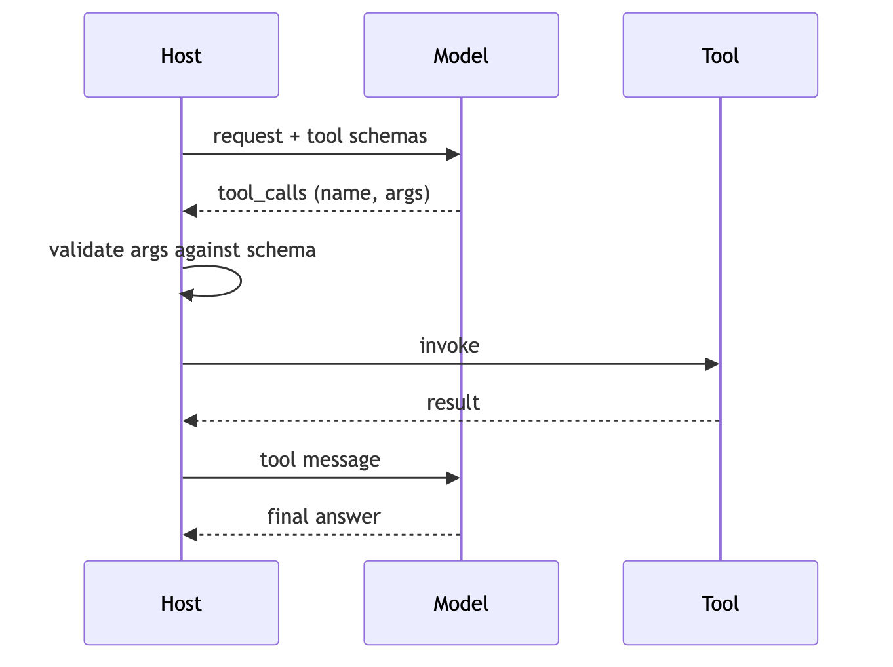

**In Jiuwen.** Tool cards become JSON Schema, the ability manager builds the model-facing tool list, and the model client converts it to the provider's tool format. The model's tool calls are parsed (non-streaming, streaming, and a provider-specific path), validated, and dispatched by the ability manager, with schema validation inside the local function call.

<b>Under the hood</b>

**Implementation**

Cards become JSON Schema through the callable schema extractor, the ability manager builds the model-facing tool list, and the model client converts it to OpenAI/Anthropic tool format. The model's `tool_calls` are parsed (non-streaming, streaming, and Anthropic), validated, and dispatched by the ability manager, with schema validation inside `LocalFunction.invoke`.

**Code anchors**

| Code anchor | What it points to |
|---|---|
| `agent-core/openjiuwen/core/foundation/tool/utils/callable_schema_extractor.py:20` | card → JSON Schema |
| `agent-core/openjiuwen/core/single_agent/ability_manager.py:984` | builds the model-facing tool list |
| `agent-core/openjiuwen/core/foundation/llm/model_clients/base_model_client.py:483` | OpenAI tool format |
| `agent-core/openjiuwen/core/foundation/llm/model_clients/anthropic_model_client.py:494` | Anthropic tool format |
| `agent-core/openjiuwen/core/foundation/llm/model_clients/openai_model_client.py:2388` | parse non-streaming tool calls |
| `agent-core/openjiuwen/core/foundation/llm/model_clients/openai_model_client.py:2612` | parse streaming tool-call deltas |
| `agent-core/openjiuwen/core/foundation/llm/model_clients/anthropic_model_client.py:1229` | parse Anthropic tool_use |
| `agent-core/openjiuwen/core/single_agent/ability_manager.py:1078` | dispatch |
| `agent-core/openjiuwen/core/foundation/tool/function/function.py:82` | argument schema validation |

---

## 2. Agentic tool-calling pattern

Mechanism intermediate

**TL;DR.** The model decides when to call external functions: it emits a structured tool call, the tool executes, the result is fed back, and the loop continues.

**Key points.**

- Model emits structured tool calls.
- Runtime executes and feeds back results.
- Loops until the model answers.

**Concept.** the model decides when to call external functions. It receives the query and a tool list, emits a structured tool call instead of an answer, the tool executes and the result is fed back, and the model either calls another tool or returns a final answer. Used for: data lookups, sending emails, querying a database, checking live information.

**In Jiuwen.** This is the ReAct loop plus the ability manager. Cards become JSON Schema via the callable schema extractor, the ability manager builds the model-facing tool list and dispatches parsed tool calls, and the local function invoke validates arguments.

<b>Under the hood</b>

**Implementation**

This is the ReAct loop plus the ability manager. Cards become JSON Schema via the callable schema extractor, the ability manager builds the model-facing tool list and dispatches parsed `tool_calls`, and `LocalFunction.invoke` validates arguments.

**Code anchors**

| Code anchor | What it points to |
|---|---|
| `agent-core/openjiuwen/core/single_agent/agents/react_agent.py:2740/2793/2813` | loop / answer / execute |
| `agent-core/openjiuwen/core/single_agent/ability_manager.py:984/1078` | tool list + dispatch |
| `agent-core/openjiuwen/core/foundation/tool/utils/callable_schema_extractor.py:20` | card → JSON Schema |
| `agent-core/openjiuwen/core/foundation/tool/function/function.py:82` | argument validation |

---

## 3. How does a framework register and expose tools to the underlying model

Mechanism intermediate

**TL;DR.** Register a tool with name, description, and parameter schema; the framework collects them into the model request in the provider's tool format; returned tool calls are dispatched.

**Key points.**

- Register name + description + schema.
- Framework builds the provider tool list.
- Model tool calls are parsed and dispatched.

**Concept.** You register a tool with a name, description, and parameter schema; the framework collects registered tools into the model request in the provider's tool format; the model returns tool calls that the framework dispatches. Auto-deriving the schema from a function signature is the convenience that makes this usable.

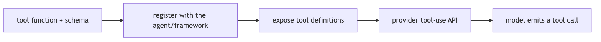

**In Jiuwen.** Abilities are stored as metadata cards (tool, workflow, agent, MCP) in the ability manager's per-type maps, while executable instances live in the runner's resource manager, bound when the ability is added. Each ReAct iteration flattens the cards into the model-facing tool list, and returned tool calls are parsed and dispatched.

<b>Under the hood</b>

**Implementation**

Abilities are stored as metadata cards (`ToolCard`/`WorkflowCard`/`AgentCard`/`McpServerConfig`) in `AbilityManager`'s per-type dicts via `add()`; executable instances live separately in `Runner.resource_mgr`, bound by `add_ability()`. On each ReAct iteration, `list_tool_info()` flattens cards into `ToolInfo(name, description, parameters)`, and MCP servers are resolved lazily with an `mcp_<server>_` prefix. The list is placed on `ctx.inputs.tools` (after rails may filter it) and converted by the model client — OpenAI-style `_convert_tools_to_dict` emits `{"type":"function","function":{...}}`, Anthropic `_convert_tool_schemas` renames `parameters` → `input_schema`. Function/`@tool` backends auto-derive the schema via `CallableSchemaExtractor`.

**Implementation diagram**

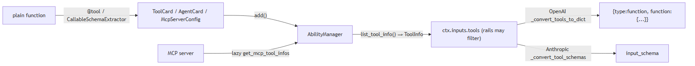

**Code anchors**

| Code anchor | What it points to |
|---|---|
| `agent-core/openjiuwen/core/single_agent/ability_manager.py:616` | add() registers any ability card; ToolCard branch stores at :669 |
| `agent-core/openjiuwen/core/single_agent/ability_manager.py:772` | add_ability() card + concrete Tool |
| `agent-core/openjiuwen/core/single_agent/ability_manager.py:984` | list_tool_info() cards → ToolInfo |
| `agent-core/openjiuwen/core/single_agent/ability_manager.py:1047` | MCP path (get_mcp_tool_infos, mcp_model_tool_name); :1067 lazy ToolCard |
| `agent-core/openjiuwen/core/foundation/tool/base.py:120` | ToolCard.tool_info() |
| `agent-core/openjiuwen/core/foundation/tool/utils/callable_schema_extractor.py:20` | generate_schema() from a callable signature |
| `agent-core/openjiuwen/core/foundation/llm/model_clients/base_model_client.py:483` | _convert_tools_to_dict(); attached at :576 |
| `agent-core/openjiuwen/core/foundation/llm/model_clients/anthropic_model_client.py:494` | _convert_tool_schemas() → input_schema |
| `agent-core/openjiuwen/core/single_agent/agents/react_agent.py:2683` | per-invoke list_tool_info(); set at :1538 |
| `agent-core/openjiuwen/harness/factory.py:443` | registers tool instances (add_ability); :453 pure cards (add) |

---

## 4. How does the framework validate a tool call's structured output before executing it

Mechanism intermediate

**TL;DR.** Parse arguments against the tool's schema, repair obvious damage, reject with a readable error, and never run the function on unvalidated input.

**Key points.**

- json.loads → bracket/quote repair → otherwise a readable error.
- Schema-validate (jsonschema/Pydantic) and fill defaults before invoking.
- Return the error to the model so it can self-correct.

**Concept.** Parse the model's arguments against the tool's JSON Schema; repair obviously damaged JSON (unbalanced brackets) when possible; reject with a readable error so the model can retry. Never run a function on unvalidated arguments.

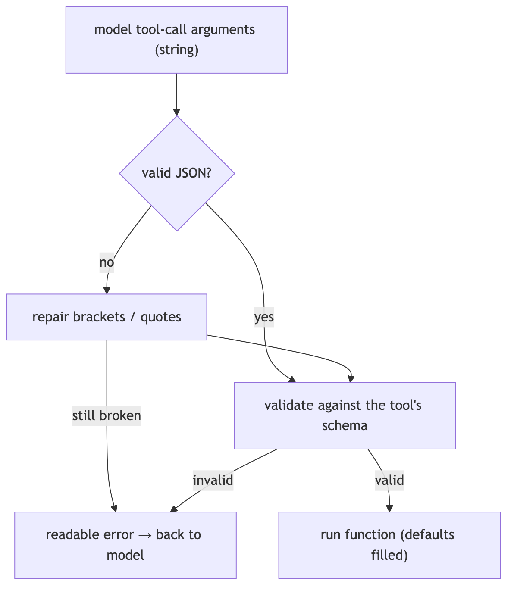

**In Jiuwen.** Before executing, the ability manager parses the model's raw argument string, first trying JSON then repairing brackets and braces; unrecoverable JSON raises an error that is fed back to the model. The parsed dict is passed to the tool, where the function and MCP wrappers run schema validation (jsonschema with a Pydantic fallback) and fill defaults. The structured-output tool uses the caller's schema as its own input, so the same path constrains captured results.

<b>Under the hood</b>

**Implementation**

Before executing, `AbilityManager._execute_single_tool_call` parses the model's raw argument string with `_parse_tool_arguments_with_repair`, which first tries `json.loads`, then `_repair_tool_arguments_json` to balance brackets/braces; unrecoverable JSON raises an `AbilityExecutionError` fed back to the model. The parsed dict is passed to `tool.invoke`, where `LocalFunction`/`MCPTool` call `SchemaUtils.format_with_schema`, which runs `validate_with_schema` (jsonschema, falling back to a dynamically created Pydantic model) and then fills defaults. The `structured_output` tool uses the caller's JSON Schema as its own `input_params`, so the same validation path constrains captured results.

**Implementation diagram**

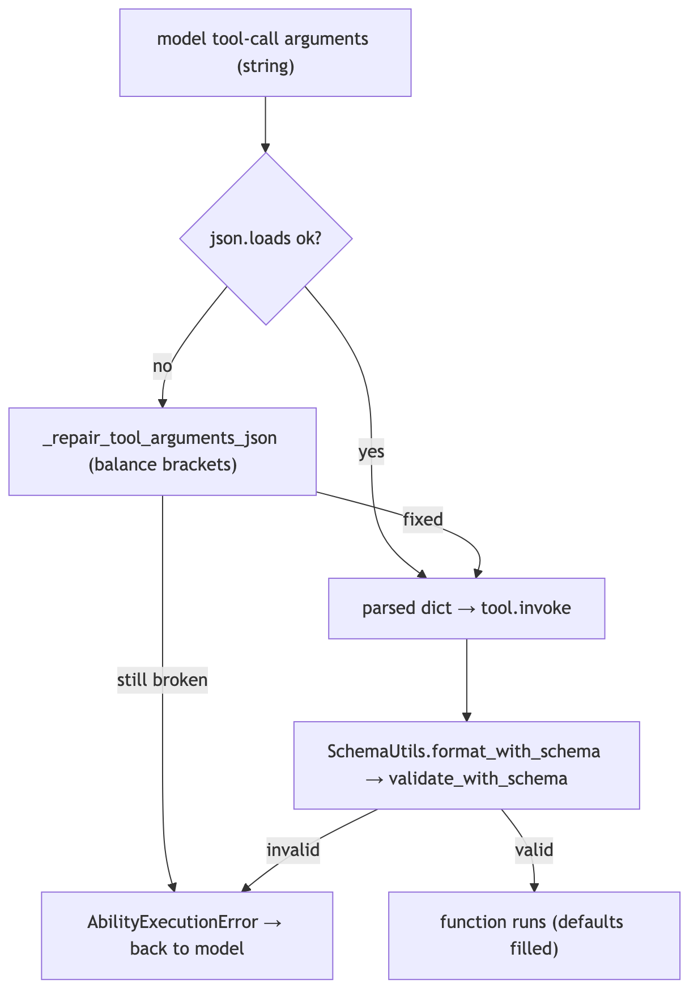

**Code anchors**

| Code anchor | What it points to |
|---|---|
| `agent-core/openjiuwen/core/single_agent/ability_manager.py:482` | _repair_tool_arguments_json(); :537 _parse_tool_arguments_with_repair(); :1419 execution path rewrites tool_call.arguments |
| `agent-core/openjiuwen/core/foundation/tool/function/function.py:76` | LocalFunction.invoke; :82 validation via SchemaUtils.format_with_schema |
| `agent-core/openjiuwen/core/common/utils/schema_utils.py:115` | validate_with_schema() (jsonschema → Pydantic fallback); :23 format_with_schema(); :49 calls validate then fills defaults |
| `agent-core/openjiuwen/core/foundation/tool/mcp/base.py:208` | MCPTool.invoke validates MCP args via the same path |
| `agent-core/openjiuwen/agent_teams/tools/structured_output_tool.py:82` | input_params = schema_json; :86 invoke |
| `agent-core/openjiuwen/core/foundation/tool/base.py:90` | ToolCard.input_params is the schema source |

---

## 5. How do you handle a tool that a framework doesn't natively support

Mechanism intermediate

**TL;DR.** Wrap an arbitrary function as a tool, define a custom tool class for special transport/auth, or connect an external tool server via a protocol like MCP.

**Key points.**

- Wrap any function as a tool.
- Custom tool class for transport/auth.
- MCP for external tool servers.

**Concept.** The framework should let you wrap an arbitrary function as a tool, define a custom tool class for custom transport/auth, or connect an external tool server through a protocol such as MCP. If none of those is possible, that is a real limitation.

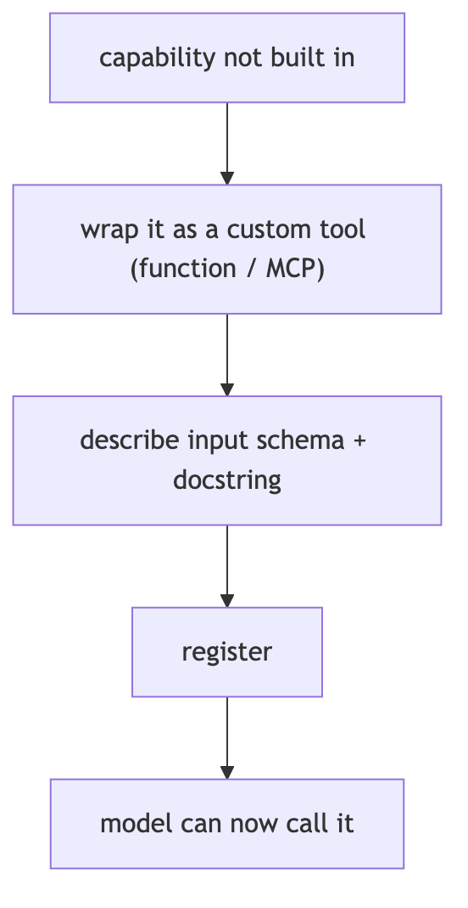

**In Jiuwen.** The primary path is the tool decorator, which wraps a plain function into a local tool with an auto-extracted or explicit parameter schema, then registers it with the ability manager. For other transports there are custom tool classes and MCP servers, so the framework does not need a built-in for every tool.

<b>Under the hood</b>

**Implementation**

The primary path is the `@tool` decorator, which wraps any plain function into a `LocalFunction` (a `Tool` subclass) with an auto-extracted or explicit `input_params`, then registers it via `ability_manager.add_ability(card, resource)`. The decorator builds a fresh `ToolCard` (`_create_new_tool_card`) or derives one from a prebuilt card (`_handle_prebuilt_card`), so callers can override `name`/`description`/`input_params`/`stateless`. Unsupported tools can also be declared as a `ToolCard` plus a concrete `Tool` subclass, or exposed through MCP: a `McpServerConfig` is added to the ability manager, and the runner materializes each discovered `McpToolCard` into an `MCPTool`. `build_tool_card` is the harness-standard card factory.

**Implementation diagram**

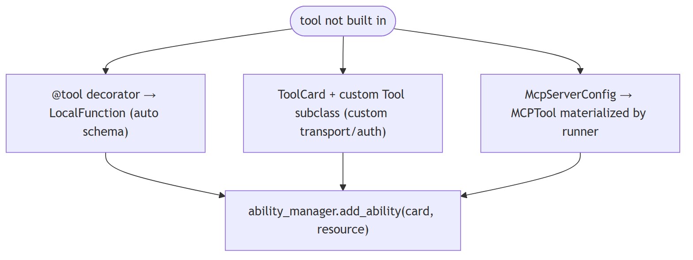

**Code anchors**

| Code anchor | What it points to |
|---|---|
| `agent-core/openjiuwen/core/foundation/tool/tool.py:31` | tool() universal decorator; :95/115 returns decorated LocalFunction |
| `agent-core/openjiuwen/core/foundation/tool/tool.py:120` | _handle_prebuilt_card(); :160 _create_new_tool_card() |
| `agent-core/openjiuwen/core/foundation/tool/function/function.py:48` | LocalFunction.__init__; :76 invoke |
| `agent-core/openjiuwen/core/foundation/tool/__init__.py:19` | tool; :29 LocalFunction |
| `agent-core/openjiuwen/core/foundation/tool/mcp/base.py:137` | McpServerConfig; :178 MCPTool; :198 invoke |
| `agent-core/openjiuwen/core/runner/resources_manager/tool_manager.py:281` | discovered MCP cards materialized into MCPTool |
| `agent-core/openjiuwen/extensions/context_evolver/tool/wikipedia_tool.py:86` | minimal ToolCard + LocalFunction example |
| `agent-core/openjiuwen/harness/prompts/tools/__init__.py:250` | build_tool_card() |

---

## 6. How do you handle a tool call that fails or returns malformed output

Mechanism intermediate

**TL;DR.** Treat failures as data: catch, classify retryable, return a structured error the model can read, and repair obvious damage (e.g., unbalanced JSON).

**Key points.**

- Catch and classify retryable vs not.
- Return a structured, model-readable error.
- Repair broken payloads when possible.

**Concept.** Treat failures as data, not crashes: catch the exception, classify whether it is retryable, return a structured error the model can read and react to, and repair obviously broken payloads (e.g., unbalanced JSON) when possible.

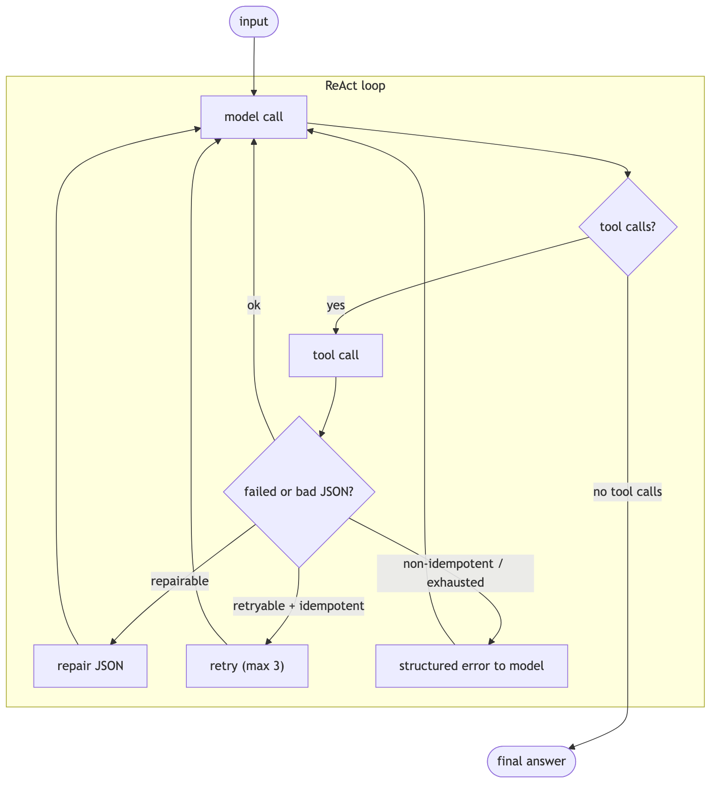

**In Jiuwen.** A resilience rail is auto-mounted: it classifies retryable versus not, never retries non-idempotent tools, and returns a retry summary when the budget is exhausted. Broken tool arguments are repaired by bracket balancing, and if unrepairable the raw JSON is surfaced to the model. The generic JSON parser, by contrast, does not repair — it returns nothing on failure.

<b>Under the hood</b>

**Implementation**

`ToolCallResilienceRail` is auto-mounted. It classifies retryable vs not, never retries non-idempotent tools, and returns a `[Retry Summary]` when the budget is exhausted. Broken tool arguments are repaired by bracket balancing; if unrepairable, the raw JSON is surfaced to the model. The general-purpose `JsonOutputParser`, by contrast, does not repair — it returns `None` on failure.

**Code anchors**

| Code anchor | What it points to |
|---|---|
| `agent-core/openjiuwen/harness/schema/config.py:294` | resilience rail enabled by default |
| `agent-core/openjiuwen/harness/factory.py:408` | auto-mount |
| `agent-core/openjiuwen/harness/rails/tool_call_resilience_rail.py:198` | retryability classification |
| `agent-core/openjiuwen/harness/rails/tool_call_resilience_rail.py:222` | never retry non-idempotent tools |
| `agent-core/openjiuwen/harness/rails/tool_call_resilience_rail.py:169` | retry-summary on exhaustion |
| `agent-core/openjiuwen/core/single_agent/ability_manager.py:482` | JSON bracket-repair |
| `agent-core/openjiuwen/core/single_agent/ability_manager.py:1424` | surface raw JSON to the model |
| `agent-core/openjiuwen/core/foundation/llm/output_parsers/json_output_parser.py:56` | no repair (returns None) |

---

## 7. How does the framework handle a step that times out or throws an error

Mechanism intermediate

**TL;DR.** Bound each step with a timeout, classify errors, convert failures into data (an observation) so the loop can adapt, and propagate fatal errors with cleanup.

**Key points.**

- Timeout each step.
- Classify retryable vs fatal.
- Convert failure into a model-readable result.

**Concept.** Bound each step with a timeout; classify errors (retryable vs not); convert failures into data (a tool/observation result) so the loop can adapt; propagate fatal errors with cleanup. Distinguish control-flow exceptions (cancellation, interrupt) from real failures.

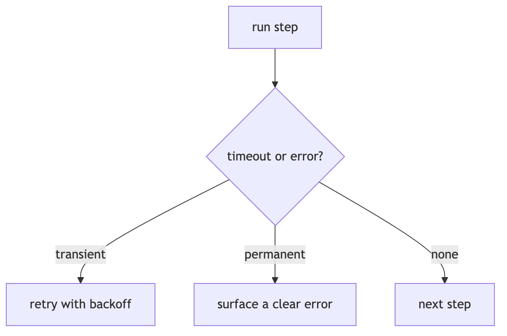

**In Jiuwen.** Tool calls are wrapped with a timeout resolved from the tool's resilience config (with a hard ceiling for exempt tools). A timeout becomes an execution error carrying a prebuilt tool message so the model sees the failure as data; other exceptions are classified and surfaced similarly, so the loop can adapt instead of crashing.

<b>Under the hood</b>

**Implementation**

Tool calls are wrapped in `anyio.fail_after(call_timeout)`, where the timeout resolves from `ToolCard.properties["resilience"]["timeout_s"]` (or a default), and an exempt tool is still bounded by a hard limit. A `TimeoutError` becomes an `AbilityExecutionError` carrying a pre-built `ToolMessage`; `asyncio.CancelledError` and `ToolInterruptException` are re-raised as control flow. `ToolCallResilienceRail.on_tool_exception` decides retryability in layers and calls `ctx.request_retry()`, which the `@rail` decorator consumes to re-run the tool; on budget exhaustion it fabricates a `[Retry Summary]` `ToolMessage` so the model sees the failure as a result. Model-call failures route to `ON_MODEL_EXCEPTION` rails (`ModelAnomalyDetectionRail` retries repeated/stream-timeout errors with backoff; `_call_model` has a one-shot recovery hook). Workflow failures wrap timeout as `WORKFLOW_EXECUTION_TIMEOUT`.

**Implementation diagram**

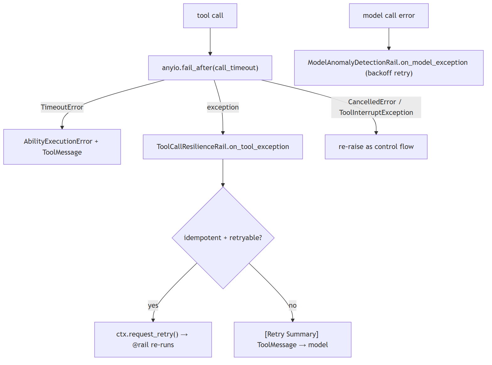

**Code anchors**

| Code anchor | What it points to |
|---|---|
| `agent-core/openjiuwen/core/single_agent/ability_manager.py:1455` | with anyio.fail_after(call_timeout); :1457-1463 TimeoutError → _build_execution_error; :556 _build_execution_error; :1186-1238 parallel-batch handling; :1492 workflow error wrapping |
| `agent-core/openjiuwen/harness/rails/tool_call_resilience_rail.py:106` | on_tool_exception; :128-138 non-idempotent layer; :145 budget; :169-186 retry-summary; :196 request_retry; :198 _is_retryable_exception |
| `agent-core/openjiuwen/core/single_agent/rail/base.py:1016` | @rail retry loop; :1036 catch; :1049 fire on_exception; :1065 consume retry; :633 request_force_finish |
| `agent-core/openjiuwen/harness/rails/model_anomaly_detection_rail.py:236` | on_model_exception; :336 ctx.request_retry(delay_seconds=...) |
| `agent-core/openjiuwen/core/single_agent/agents/react_agent.py:1016` | model exception + one recovery attempt; :2857/2868 persist safe prefix then re-raise |
| `agent-core/openjiuwen/harness/schema/stop_condition.py:162` | TimeoutEvaluator; agent-core/openjiuwen/harness/deep_agent.py:2712 — completion_timeout (600s) |
| `agent-core/openjiuwen/core/workflow/workflow.py:671` | WORKFLOW_EXECUTION_TIMEOUT; agent-core/openjiuwen/harness/rails/interrupt/interrupt_base.py:243 — interrupt as AbortError |

---

## 8. Designing retry logic that doesn't cause duplicate side effects on a tool call

Mechanism intermediate

**TL;DR.** Never blindly retry non-idempotent actions; mark side-effecting tools, use idempotency keys, and retry only reads or explicitly idempotent operations.

**Key points.**

- Mark non-idempotent tools; never blind-retry.
- Idempotency keys make repeats detectable.
- Retry reads/idempotent ops only.

**Concept.** Never blindly retry non-idempotent actions (payments, emails, writes). Mark side-effecting tools, use idempotency keys so a repeated call is recognized, and prefer retry only for reads or explicitly idempotent operations. Bound retries with backoff. On ambiguity, surface to a human rather than guess.

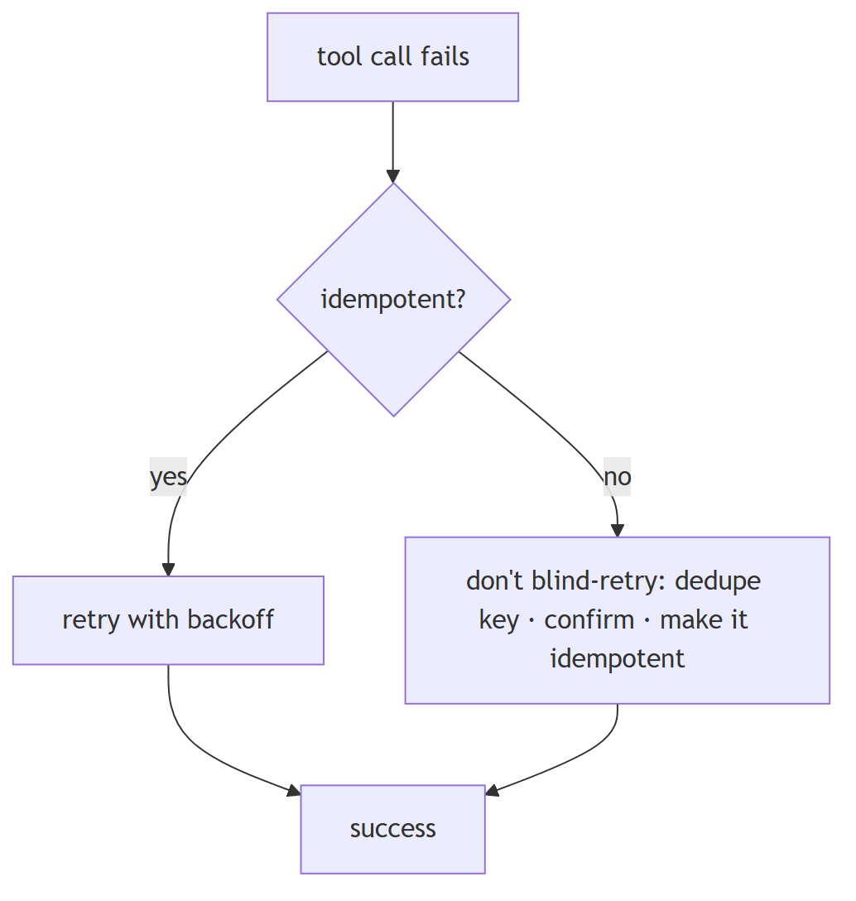

**In Jiuwen.** The tool card's idempotent flag defaults to false (secure by default), and non-idempotent tools are never retried. The resilience rail decides in layers: it rejects retry for non-idempotent cards and allows retry only for retryable exception types such as timeouts and connection resets.

<b>Under the hood</b>

**Implementation**

`ToolCard.idempotent` defaults to `False` (secure-by-default), and non-idempotent tools are never retried. `ToolCallResilienceRail` decides in layers: reject retry for any card with `idempotent is False`; allow retry only for retryable exception types/markers (timeouts, connection resets, MCP transport); enforce a per-invoke budget (default 3). On a retry it calls `ctx.request_retry()` and the `@rail` decorator re-runs the call. Separately, `ToolCallDeduplicationRail` short-circuits repeated *read-only* calls via an exact `(tool_name, args-hash)` cache, setting `_skip_tool` so the real tool never runs.

**Implementation diagram**

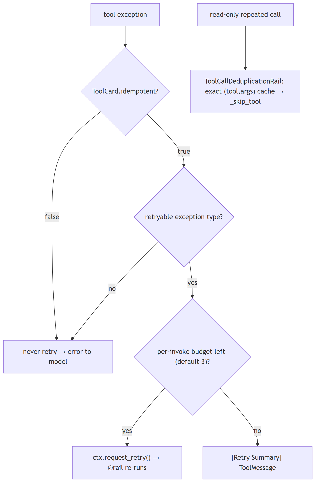

**Code anchors**

| Code anchor | What it points to |
|---|---|
| `agent-core/openjiuwen/core/foundation/tool/base.py:109` | idempotent default False |
| `agent-core/openjiuwen/harness/rails/tool_call_resilience_rail.py:128` | non-idempotent guard; :141 retryable-exception filter; :145 per-invoke budget; :196 ctx.request_retry() |
| `agent-core/openjiuwen/core/single_agent/rail/base.py:612/1024` | request_retry + decorator retry loop |
| `jiuwenswarm/jiuwenswarm/agents/harness/common/rails/tool_dedup_rail.py:24/109` | read-only whitelist + exact cache interception |
| `agent-core/openjiuwen/core/single_agent/ability_manager.py:1324` | _skip_tool_calls honored |
| `agent-core/openjiuwen/harness_providers/native/harness.py:226` | native harness rejects protocol checkpoints (no replay) |

---

## 9. How would you add a custom retry policy for a specific tool without breaking the framework's default behavior

Mechanism advanced

**TL;DR.** Retry policy should be per-tool and overridable — idempotency flag, max attempts, backoff, timeout — without silently disabling safety.

**Key points.**

- Per-tool override: attempts, backoff, timeout.
- Keep the idempotency safety default.
- Central policy with per-tool hooks.

**Concept.** Retry policy should be per-tool and overridable: an idempotency flag, max attempts, backoff, and timeout. A single global retry that ignores non-idempotency is dangerous, but so is a per-tool override that silently disables the framework's safety defaults.

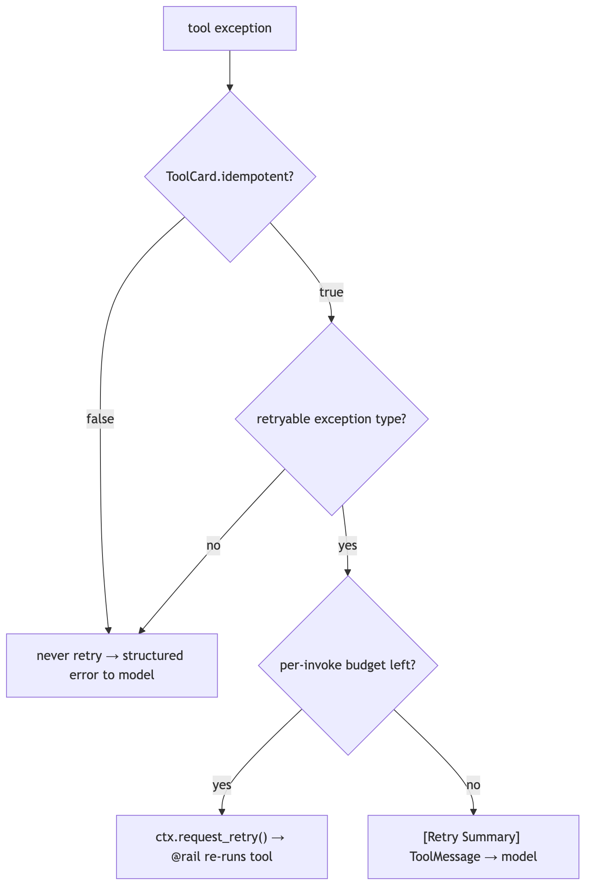

**In Jiuwen.** Retry decisions are centralized in the resilience rail (auto-mounted unless disabled): it resets a per-invoke counter before the call and, on exceptions, applies layered rules starting with refusing to retry non-idempotent tools. So a custom policy is expressed by marking a tool idempotent and letting the central rail handle attempts and backoff, rather than letting a per-tool override bypass the guard.

<b>Under the hood</b>

**Implementation**

Retry decisions are centralized in `ToolCallResilienceRail` (priority 70, auto-mounted unless `enable_tool_resilience_rail=False`). It hooks `before_tool_call` to reset a per-invoke counter and `on_tool_exception`, where it applies layers: non-idempotent tools (`ToolCard.idempotent is False`, the default) are never retried; retryable exception types/markers (timeouts, connection resets, MCP transport) are; otherwise it calls `ctx.request_retry()`, consumed by the `@rail` decorator wrapping the tool execution. The per-invoke timeout is read separately from `ToolCard.properties["resilience"]["timeout_s"]` by `AbilityManager._resolve_call_timeout`. Customization without breaking defaults is done by setting `idempotent=True`/`properties={"resilience": {...}}` on the card, or by supplying your own rail (the auto-mount checks `_already_provided`).

**Code anchors**

| Code anchor | What it points to |
|---|---|
| `agent-core/openjiuwen/harness/rails/tool_call_resilience_rail.py:24` | ToolCallResilienceRail; :102 counter reset; :106 on_tool_exception; :145 budget check; :196 retry request |
| `agent-core/openjiuwen/harness/rails/tool_call_resilience_rail.py:223` | _is_non_idempotent(); :244 _resolve_max_attempts() |
| `agent-core/openjiuwen/core/foundation/tool/base.py:109` | ToolCard.idempotent (default False); :90/92 properties/parallel_safe |
| `agent-core/openjiuwen/core/single_agent/ability_manager.py:571` | _resolve_call_timeout() reads properties["resilience"]["timeout_s"]; :137 hard limit |
| `agent-core/openjiuwen/harness/schema/config.py:294` | enable_tool_resilience_rail: bool = True; agent-core/openjiuwen/harness/schema/deep_agent_spec.py:453 mirror |
| `agent-core/openjiuwen/harness/factory.py:408` | auto-mount; :411 _already_provided guard |
| `agent-core/openjiuwen/harness/tools/subagent/subagent_tools.py:45` | _attach_call_timeout() sets properties["resilience"]["timeout_s"] |
| `agent-core/openjiuwen/core/single_agent/rail/base.py:612` | ctx.request_retry(); agent-core/openjiuwen/harness/prompts/tools/__init__.py:284 — build_tool_card honors ToolCardBuildOptions(idempotent=…) |

---

## 10. How do you design tools for idempotency and safe retry?

Mechanism intermediate

**TL;DR.** Separate tools into idempotent reads (safe to retry) and non-idempotent writes (require idempotency keys and attempted-vs-confirmed tracking).

**Key points.**

- Reads: retry with backoff — same result every time.
- Writes: attach an idempotency key; verify state before retrying.
- Jiuwen: no idempotent flag on ToolCard; ToolCallDeduplicationRail is narrow (same args in session only).

**Concept.** Separate tools into two categories: idempotent reads (GET-style — safe to retry with backoff, identical result every time) and non-idempotent writes (payment, email send, database insert — must not be executed twice). For writes: attach an idempotency key — a unique request ID generated by the agent before the call and passed with every attempt, so the server deduplicates on that key. Track "attempted vs confirmed" state in the agent's memory so a subsequent retry knows whether the call was received but timed out, or never sent. Never retry a write blindly on timeout; always verify state first.

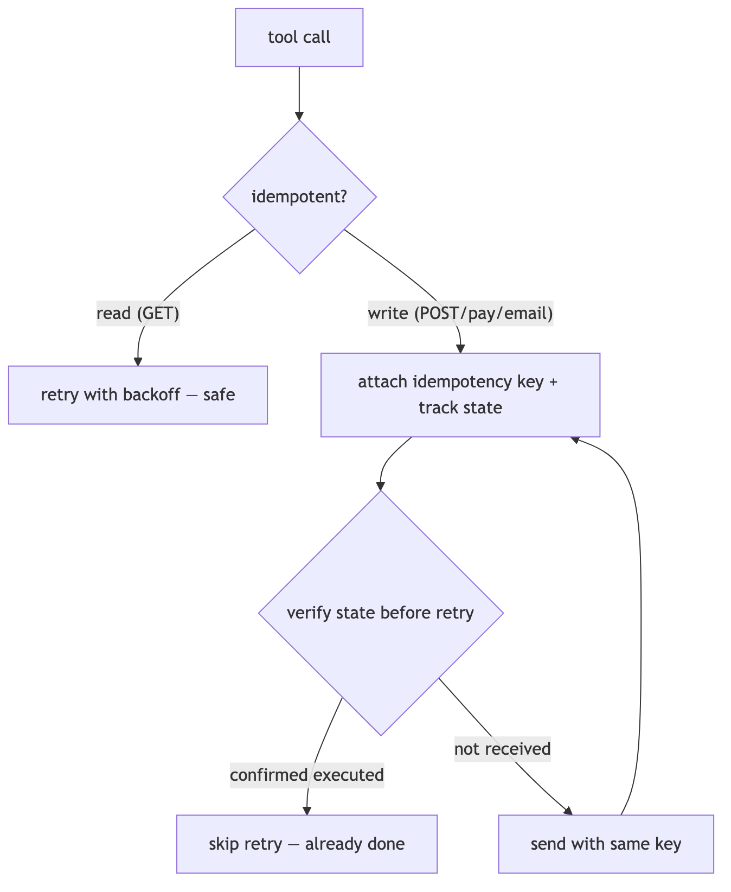

**In Jiuwen.** ToolCard schema (agent-core/openjiuwen/core/foundation/tool/base.py:90) has no idempotent flag. ToolCallDeduplicationRail (jiuwenswarm/jiuwenswarm/agents/harness/common/rails/tool_dedup_rail.py:47) suppresses identical (name + args) calls within a session — a narrow guard, not general idempotency. McpServerConfig.retry_on_failure (agent-core/openjiuwen/core/foundation/tool/mcp/base.py:137) controls MCP connection retries, not semantic idempotency. Idempotency keys and attempted-vs-confirmed state are the tool author's responsibility.

<b>Under the hood</b>

**Implementation**

`ToolCard.idempotent` defaults to `False`, and non-idempotent tools are never retried by the resilience rail — so the framework does distinguish reads from writes at the card level. Retry decisions live in `ToolCallResilienceRail` (only retryable exception types, with a per-invoke budget). `ToolCallDeduplicationRail` additionally suppresses exact repeated calls within a session, which guards against loop-induced repeats rather than providing semantic idempotency. Idempotency keys and "attempted vs confirmed" state are still the tool author's responsibility; the framework provides no scaffold. The `retry_on_failure` field in `McpServerConfig` controls MCP connection retries, not tool-call semantic idempotency.

**Code anchors**

| Code anchor | What it points to |
|---|---|
| `agent-core/openjiuwen/core/foundation/tool/base.py:109` | ToolCard.idempotent (default False) |
| `jiuwenswarm/jiuwenswarm/agents/harness/common/rails/tool_dedup_rail.py:1` | session-scoped same-args dedup |
| `agent-core/openjiuwen/core/foundation/tool/mcp/base.py:40` | McpServerConfig.retry_on_failure (connection, not semantic) |

---

## 11. Handling concurrent API calls when an agent needs to call multiple tools at once

Mechanism intermediate

**TL;DR.** Run independent tool calls from one turn concurrently with async tasks, but bound concurrency and respect per-resource ordering.

**Key points.**

- Group the turn's tool calls; run them concurrently.
- Bound concurrency (semaphore/pool).
- Respect ordering for conflicting writes.

**Concept.** When a turn contains several independent tool calls, run them concurrently with async tasks rather than a serial `for` loop, but bound the concurrency (semaphore/pool), respect per-resource ordering (two writes to the same file must not interleave), and mark which tools are safe to parallelize. Failures in one call should not silently cancel the others unless you want fail-fast semantics.

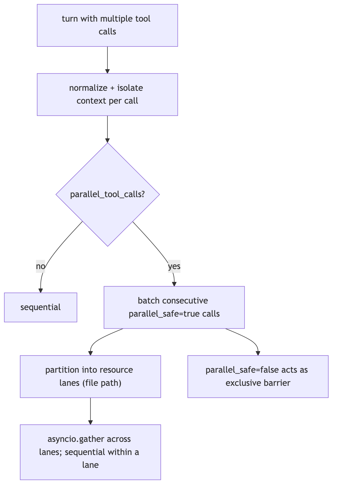

**In Jiuwen.** One turn can contain several tool calls. The ability manager normalizes them, creates an isolated callback context per call, and, when parallel tool calls are enabled, dispatches them concurrently with a bounded executor and resource lanes; otherwise it runs them in sequence. The per-call context copy avoids racy mutation across parallel calls.

<b>Under the hood</b>

**Implementation**

The ReAct loop can emit a `List[ToolCall]` in one turn. `AbilityManager.execute` normalizes them, builds one coroutine plus an isolated `AgentCallbackContext` per call (copying `extra` to avoid racy dict mutation), and if `parallel_tool_calls=True` dispatches to `_execute_parallel_tool_tasks`. That groups consecutive calls whose `ToolCard.parallel_safe` is true into batches; each batch runs through `_execute_resource_ordered_tool_tasks`, which partitions calls into "lanes" keyed by normalized file path (unknown resources get private lanes) and `asyncio.gather`s across lanes while awaiting sequentially *within* a lane. A `parallel_safe=False` tool acts as an exclusive barrier. Team supervisors override `execute` in `P2PAbilityManager` to fan AgentCard calls out under a semaphore (default 10).

**Code anchors**

| Code anchor | What it points to |
|---|---|
| `agent-core/openjiuwen/core/single_agent/ability_manager.py:1083` | parallel_tool_calls parameter; :1148 parallel-vs-sequential branch; :431 _execute_parallel_tool_tasks (batching + barrier); :393 _execute_resource_ordered_tool_tasks (lanes); :421 asyncio.gather across lanes |
| `agent-core/openjiuwen/core/foundation/tool/base.py:92` | ToolCard.parallel_safe (default True) |
| `agent-core/openjiuwen/core/graph/pregel/task.py:27` | submit creates a Task; :47 asyncio.wait(..., FIRST_EXCEPTION) cancels siblings |
| `agent-core/openjiuwen/core/multi_agent/teams/hierarchical_msgbus/p2p_ability_manager.py:45` | lazy semaphore for sub-agent fan-out |

---
