# Planning, memory and state

## 1. How does an agent break a complex task into smaller subtasks

intermediate

**Title.** Task decomposition

**Summary.** Either ask the model to emit a plan/todo list up front, or decompose lazily and revise; store it as structured tasks that can be marked in-progress/done.

**Key points.**

- Model emits a plan/todo list.
- Or decompose lazily and revise.
- Store as structured tasks with status.

**General.** Either the model is asked to emit a plan/todo list up front, or the agent decomposes lazily and revises. Often the decomposition is stored as structured tasks the agent can mark in-progress/completed.

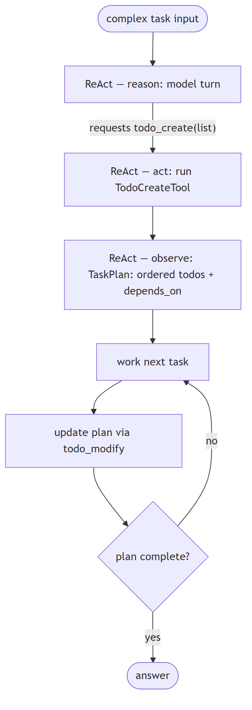

**Jiuwen.** Decomposition is model-driven through todo tools, not an algorithmic planner: the model's reply requests a todo-create call (prompted by the planning rail's guidance), the ReAct loop executes it, and the tool validates and persists the list. There is no separate planner component producing a plan graph.

<b>Jiuwen technical detail (classes &amp; functions)</b>

**Implementation**

Model-driven todo tools, not an algorithmic planner. The model's answer *requests* a `todo_create` tool call (prompted by the rail's guidance to plan when the task warrants it); the ReAct loop then executes it, and the tool validates and persists the list. `TodoCreateTool` takes a JSON array of `{id, content, activeForm, description}` and persists a `todo.json` per session; `TaskPlan` stores the goal plus ordered `TodoItem`s with `depends_on` and resolves the next task. `TaskPlanningRail` registers the todo tools and injects planning guidance, and the `Plan` agent mode adds a `task_tool` to delegate subtasks to subagents.

**Code anchors**

| Code anchor | What it points to |
|---|---|
| `agent-core/openjiuwen/harness/tools/todo.py:193` | TodoCreateTool |
| `agent-core/openjiuwen/harness/tools/todo.py:113` | per-session todo.json |
| `agent-core/openjiuwen/harness/schema/task.py:97` | TaskPlan |
| `agent-core/openjiuwen/harness/rails/task_planning_rail.py:31/108/152` | rail, tool registration, guidance |
| `agent-core/openjiuwen/harness/rails/agent_mode_rail.py:645` | plan-mode task_tool |

**Canonical source**

`source/ai-agent-interview-questions_for_engineers.md`

---

## 2. How do you handle a task where the plan needs to change mid-execution based on a tool's result

intermediate

**Title.** Changing the plan mid-run

**Summary.** Allow plan mutation during the run — add, reorder, cancel, replace tasks — and support steering with new instructions; keep the authoritative plan separate from live state.

**Key points.**

- Mutate: add/reorder/cancel/replace tasks.
- Steer with new instructions.
- Reconcile plan vs live state.

**General.** Allow plan mutation during the run: the agent can add, reorder, cancel, or replace tasks, and can be steered by new instructions. Track the authoritative plan separately from the live state so they can be reconciled.

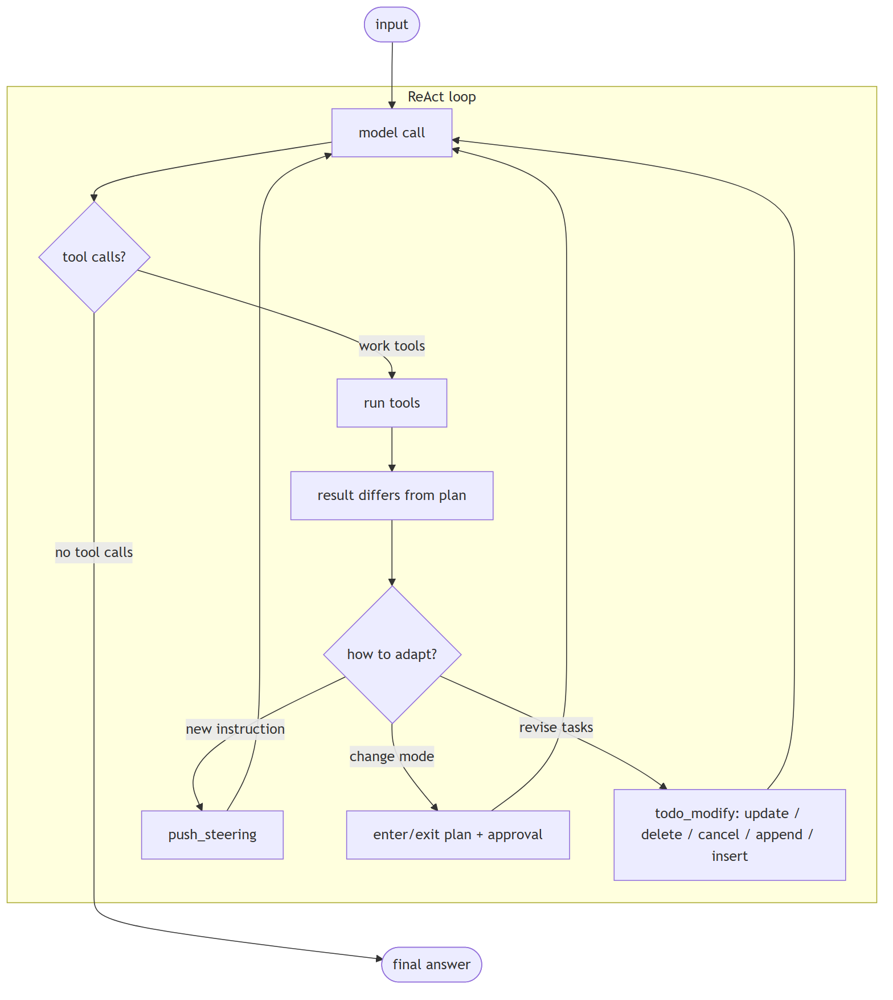

**Jiuwen.** Several mechanisms: a todo tool supports update/delete/cancel/append/insert with a single-in-progress invariant; the planning rail reconciles todos against the authoritative plan each outer round; and steering messages inject new instructions that are drained before the next model call. So the plan can be revised mid-execution while staying consistent.

<b>Jiuwen technical detail (classes &amp; functions)</b>

**Implementation**

Several mechanisms. `TodoModifyTool` supports update/delete/cancel/append/insert operations with a single-in-progress invariant. `TaskPlanningRail._sync_todos_from_plan` reconciles todos against the authoritative `TaskPlan` each outer round. Steering messages inject new instructions and are drained before each model call. Mode transitions enter/exit plan with an approval gate.

**Code anchors**

| Code anchor | What it points to |
|---|---|
| `agent-core/openjiuwen/harness/tools/todo.py:473` | TodoModifyTool operations |
| `agent-core/openjiuwen/harness/tools/todo.py:621` | single-in-progress invariant |
| `agent-core/openjiuwen/harness/rails/task_planning_rail.py:320` | reconcile todos from plan |
| `agent-core/openjiuwen/core/single_agent/agents/react_agent.py:2756` | drain steering before model call |
| `agent-core/openjiuwen/core/single_agent/rail/base.py:687` | ctx.push_steering |
| `agent-core/openjiuwen/harness/rails/agent_mode_rail.py:460` | enter/exit plan gate |
| `jiuwenswarm/jiuwenswarm/agents/harness/code/rails/code_plan_approval_rail.py:74` | product plan-approval rail |

**Canonical source**

`source/ai-agent-interview-questions_for_engineers.md`

---

## 3. What's the difference between a single-step agent and a multi-step planning agent

basic

**Title.** Single-step vs planning agent

**Summary.** Two axes: single-step vs multi-step (how many model↔tool cycles) and reactive vs planning (whether an explicit plan is kept and updated).

**Key points.**

- Axis 1: number of model/tool cycles.
- Axis 2: explicit plan vs none.
- The two are independent.

**General.** Two axes, not one. *Single-step vs multi-step* is how many model↔tool cycles run. *Reactive vs planning* is whether the agent keeps an explicit plan (a todo list / task plan) that it creates up front and updates as it goes. Planning normally implies multi-step, but multi-step does not imply planning.

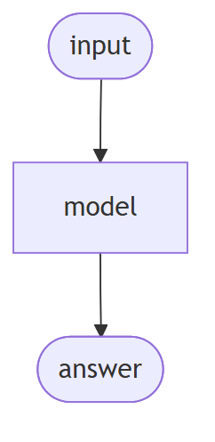

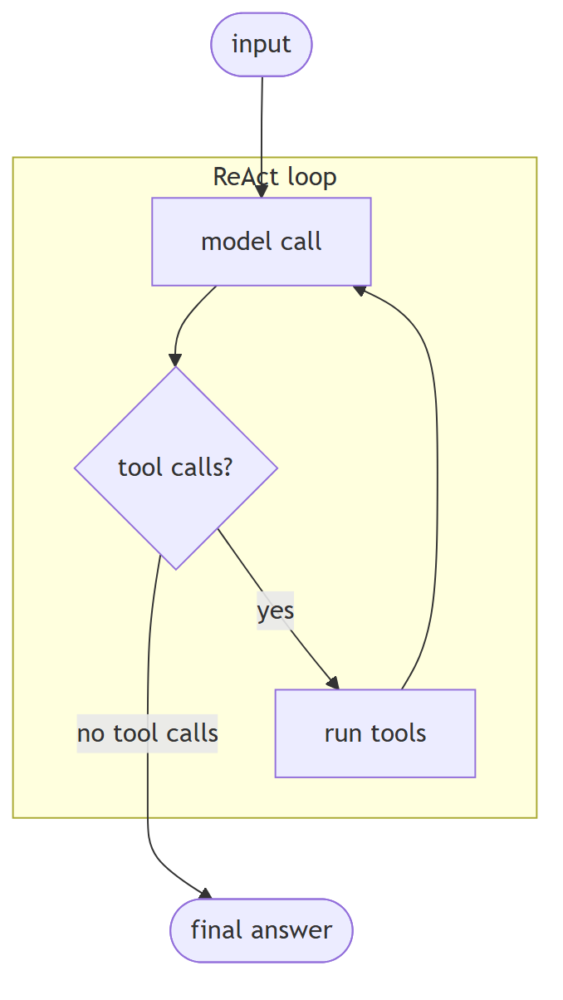

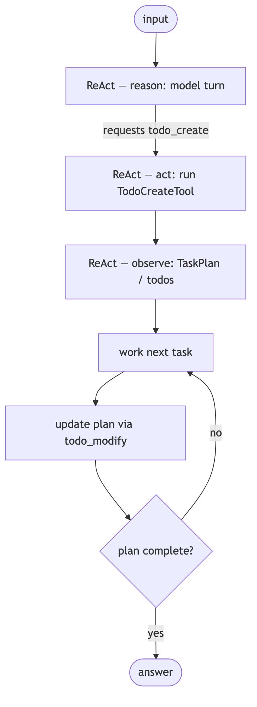

**Jiuwen.** Jiuwen keeps the axes separate: the ReAct agent is multi-step reactive (loops with no explicit plan), while planning is an additive rail that registers todo tools and persists an ordered plan; the DeepAgent outer task loop adds the planning layer. So 'planning' is a rail you add to a reactive loop, not a different loop.

<b>Jiuwen technical detail (classes &amp; functions)</b>

**Implementation**

Jiuwen keeps the two axes as separate layers. `ReActAgent` is multi-step **reactive**: it loops (bounded by `max_iterations`) with no explicit plan. Planning is an *additive* rail: `TaskPlanningRail` registers the todo tools and `TaskPlan` persists an ordered plan. `DeepAgent`'s outer task loop is multi-step **with** planning: each outer round runs a full inner `react_agent.invoke`, while the persistent `TaskPlan`/todos carry state between rounds and `TaskCompletionRail` bounds the loop. So "multi-step" and "planning" are orthogonal.

**Code anchors**

| Code anchor | What it points to |
|---|---|
| `agent-core/openjiuwen/core/single_agent/agents/react_agent.py:2740` | multi-step reactive loop |
| `agent-core/openjiuwen/core/single_agent/agents/react_agent.py:288` | iteration bound |
| `agent-core/openjiuwen/harness/rails/task_planning_rail.py:31` | planning layer (additive) |
| `agent-core/openjiuwen/harness/rails/task_planning_rail.py:108/152` | registers todo tools, injects planning prompt |
| `agent-core/openjiuwen/harness/tools/todo.py:193` | TodoCreateTool writes todo.json |
| `agent-core/openjiuwen/harness/schema/task.py:97` | TaskPlan |
| `agent-core/openjiuwen/harness/deep_agent.py:2694` | multi-step + planning (outer loop) |
| `agent-core/openjiuwen/harness/task_loop/task_loop_event_executor.py:222` | one outer round = one inner invoke |
| `agent-core/openjiuwen/harness/rails/task_completion_rail.py:74` | completion rail bounds the loop |

**Canonical source**

`source/ai-agent-interview-questions_for_engineers.md`

---

## 4. What's the planner-executor pattern, and when do you need it

basic

**Title.** Planner-executor pattern

**Summary.** A planner produces the steps; one or more executors carry them out, often with a supervisor re-planning — useful when planning needs a global view and execution is parallel/specialized.

**Key points.**

- Planner produces steps.
- Executors carry them out.
- Supervisor re-plans; parallel/specialized execution.

**General.** A planner produces the plan/steps; one or more executors carry them out, often with a supervisor re-planning. Useful when planning needs a global view while execution is parallelizable or specialized, and when separating "decide" from "do" improves reliability.

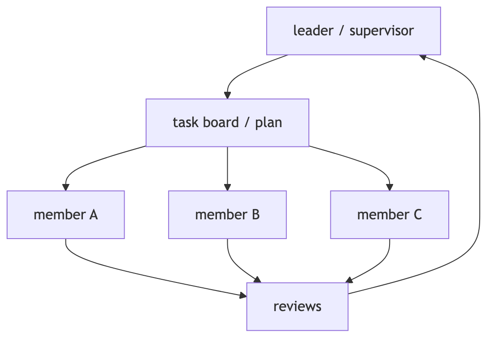

**Jiuwen.** Jiuwen has three related patterns: a scheduled-dispatch leader (a scheduler scans the task board and hands pending tasks to idle members, then reviews); supervisor routing (a hierarchical team sends to a supervisor agent that calls sub-agents as tools); and a dedicated plan subagent. Planner-executor here is realized through team scheduling and supervision rather than a single class.

<b>Jiuwen technical detail (classes &amp; functions)</b>

**Implementation**

Three patterns exist. (a) Scheduled-dispatch leader: `TeamScheduler` scans the task board and dispatches assigned pending tasks to idle members, then reviews. (b) Supervisor routing: `HierarchicalTeam` sends to a `SupervisorAgent` that calls sub-agents-as-tools via `P2PAbilityManager`. (c) A dedicated plan subagent invoked via `task_tool`.

**Code anchors**

| Code anchor | What it points to |
|---|---|
| `agent-core/openjiuwen/agent_teams/agent/scheduling/scheduler.py:92/208/239` | TeamScheduler scan/dispatch/review |
| `../../../agent-core/openjiuwen/core/multi_agent/teams/hierarchical_msgbus` | supervisor routing |
| `agent-core/openjiuwen/harness/subagents/plan_agent.py:88` | dedicated plan subagent |

**Canonical source**

`source/ai-agent-interview-questions_for_engineers.md`

---

## 5. How does a framework track state across multiple steps in an agent's execution

intermediate

**Title.** State across steps

**Summary.** A state object threaded through (or held per session) that each step reads/writes; conversation history is usually separate from working state; persist via checkpoints.

**Key points.**

- Working state object per session.
- Separate conversation history from task state.
- Checkpoint for persistence.

**General.** A state object (dict or dataclass) is threaded through the steps or held per session; each node reads and writes it. Conversation history is usually separate from working state. Frameworks persist state via checkpoints so a run can be resumed or audited.

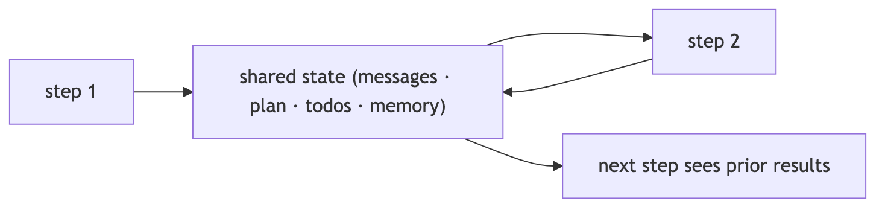

**Jiuwen.** State lives in three checkpointed layers: the agent layer keeps a state collection (global plus agent state) inside the session; the workflow layer keeps a different state collection split into IO, global, comp, and workflow state; and conversation history is its own structure. Each layer is checkpointed independently.

<b>Jiuwen technical detail (classes &amp; functions)</b>

**Implementation**

State lives in three layers that are checkpointed independently. The agent layer uses `StateCollection` (a `global_state` + `agent_state`) inside `AgentSession`. The workflow layer uses a different `StateCollection` split into `io_state`, `global_state`, `comp_state`, and `workflow_state`. Conversation history is a separate `ContextMessageBuffer` inside `SessionModelContext`, flushed to session global state by `ContextEngine.save_contexts`. Graph execution adds a third layer — `GraphState` (step, channel snapshot, pending buffer/nodes, node versions) persisted through a `Store`/checkpointer keyed by `(session_id, ns)` and restored in `PregelLoop.init`.

**Code anchors**

| Code anchor | What it points to |
|---|---|
| `agent-core/openjiuwen/core/session/internal/agent.py:36` | AgentSession.__init__ creates StateCollection; :74 create_workflow_session passes global state into InMemoryState |
| `agent-core/openjiuwen/core/session/state/agent_state.py:9` | agent StateCollection; :34 get_state |
| `agent-core/openjiuwen/core/session/state/workflow_state.py:12` | workflow StateCollection (io/global/comp/workflow); :100 get_workflow_state; :151 get_state |
| `agent-core/openjiuwen/core/context_engine/context/context.py:64` | SessionModelContext; :1519 save_state(); :1526 load_state |
| `agent-core/openjiuwen/core/graph/store/base.py:31` | GraphState dataclass; :41 Store ABC |
| `agent-core/openjiuwen/core/graph/pregel/engine.py:39` | PregelLoop.init reads saved state; :44 restore path |
| `agent-core/openjiuwen/core/session/checkpointer/persistence.py:299` | _get_state_to_save; :352 WorkflowStorage.save |
| `agent-core/openjiuwen/core/context_engine/context_engine.py:589` | save_contexts |

**Implementation diagram**

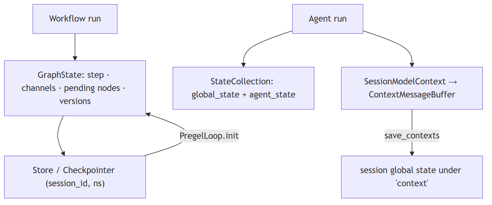

**Canonical source**

`source/ai-agent-framework-interview-questions_for_engineers.md`

---

## 6. How would you pause an agent mid-execution and resume it later with the same state

advanced

**Title.** Pause and resume an agent

**Summary.** Pause needs a durable checkpoint at a safe boundary or a first-class interrupt that unwinds the run preserving state; resume reloads the checkpoint or replays the suspended step.

**Key points.**

- Durable checkpoint or interrupt signal.
- Preserve state while unwinding.
- Resume by reload or replay.

**General.** Pause requires either a durable checkpoint at a safe boundary or a first-class interrupt/suspend signal that unwinds the run while preserving state. Resume reloads the checkpoint (or replays the suspended step) and continues. The hard part is non-idempotent side effects: replay must be safe.

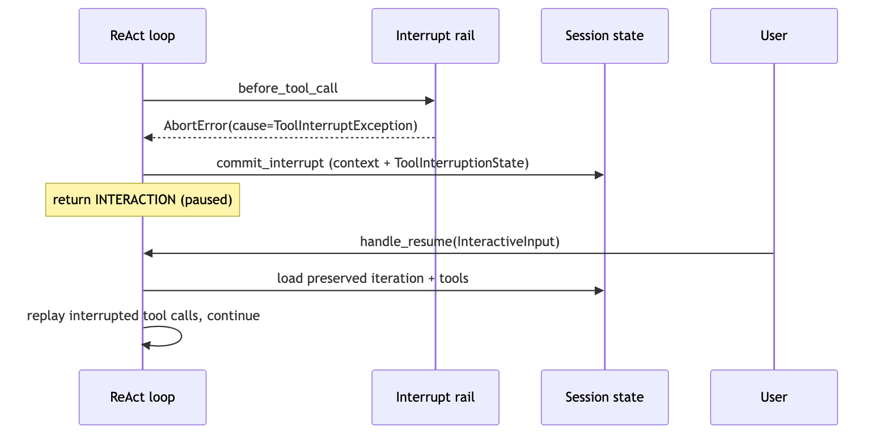

**Jiuwen.** Two mechanisms. Interrupt rails abort the current tool call by raising an abort error carrying the cause; the framework re-raises it and the ReAct loop catches it, saving conversation context plus the interruption state and returning an interaction result; on resume it replays the interrupted calls with the user's input. The workflow/graph path instead uses checkpointing to pause and restore.

<b>Jiuwen technical detail (classes &amp; functions)</b>

**Implementation**

Two mechanisms. *Interrupt rails* abort the current tool call by raising `AbortError(cause=ToolInterruptException(...))`; the callback framework re-raises the cause, the ReAct loop catches it, and `ToolInterruptHandler.commit_interrupt` saves conversation context plus a `ToolInterruptionState` into session state, returning an `INTERACTION` result. On resume, `handle_resume` replays the interrupted tool calls with the user's `InteractiveInput`. *Workflow/graph* pause uses checkpointing: `CompiledGraph._invoke` calls `checkpointer.pre_workflow_execute` (recover or require input) and `post_workflow_execute` (save on interrupt, clear on completion); `PregelLoop` snapshots channels/pending nodes on error and restores them in `init`; provider harnesses expose explicit `pause()`/`resume()` gated on `HarnessCapability.PAUSE_RESUME`.

**Code anchors**

| Code anchor | What it points to |
|---|---|
| `agent-core/openjiuwen/harness/rails/interrupt/interrupt_base.py:237` | _raise_interrupt; :243 raises AbortError(cause=ToolInterruptException); re-raised at agent-core/openjiuwen/core/runner/callback/framework.py:1172 |
| `agent-core/openjiuwen/core/single_agent/interrupt/handler.py:279` | commit_interrupt; :310 handle_resume; :326 uses preserved state.iteration |
| `agent-core/openjiuwen/core/single_agent/interrupt/state.py:32` | ToolInterruptionState |
| `agent-core/openjiuwen/core/session/checkpointer/persistence.py:803` | pre_workflow_execute; :824 recover on InteractiveInput; :860 post_workflow_execute; :876 save on TASK_STATUS_INTERRUPT |
| `agent-core/openjiuwen/core/graph/graph.py:315` | CompiledGraph._invoke; :326 pre; :334 pregel.run; :346 post |
| `agent-core/openjiuwen/core/graph/pregel/engine.py:45` | _is_resume; :174 _save_state_on_error; :39 restore in init |
| `agent-core/openjiuwen/core/context_engine/context/context.py:1519/1526` | save_state/load_state |
| `agent-core/openjiuwen/harness/deep_agent.py:2491/2516` | load_state/save_state; agent-core/openjiuwen/harness_providers/io_adapter.py:299/308 — pause()/resume() |

**Canonical source**

`source/ai-agent-framework-interview-questions_for_engineers.md`

---

## 7. How would you add human-in-the-loop approval before a specific step executes

advanced

**Title.** Human-in-the-loop approval

**Summary.** Route sensitive steps through a permission check returning allow/ask/deny, pause on ask, surface a confirm payload, resume with the decision, and remember/persist rules; fail closed on unknown.

**Key points.**

- Permission check: allow/ask/deny.
- Pause on ask; resume with the decision.
- Persist allow rules; fail closed.

**General.** Route sensitive steps through a permission check that returns allow/ask/deny, pause on ask, surface a confirm payload, resume with the decision, and optionally remember or persist allow rules. Fail closed: unknown should mean "ask", not "allow".

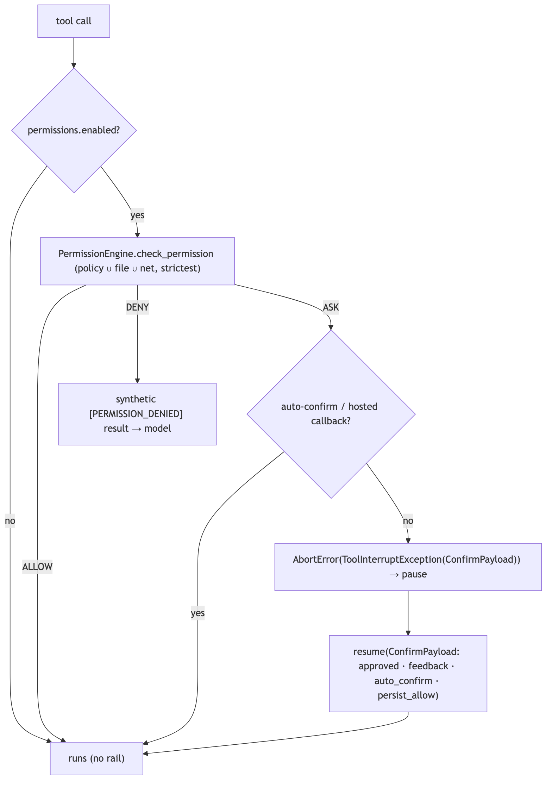

**Jiuwen.** Every tool call passes through a permission interrupt rail that calls the permission engine, which merges the tiered tool policy, file guard, and net rules. If the decision is 'ask', it pauses with a confirmation payload and resumes with the user's answer, optionally remembering the rule. Unknown actions are floored to ask (fail closed).

<b>Jiuwen technical detail (classes &amp; functions)</b>

**Implementation**

Tool execution passes through `PermissionInterruptRail` (subclass of `ConfirmInterruptRail` ← `BaseInterruptRail`), which overrides `before_tool_call` and intercepts **every** tool. On first entry it calls `PermissionEngine.check_permission`, which merges the tiered tool policy, file guard, and net guard with "strictest wins" and returns `ALLOW`/`ASK`/`DENY`. `ALLOW` approves; `DENY` returns a synthetic `[PERMISSION_DENIED]` tool result; `ASK` either hits a session auto-confirm key, delegates to a hosted confirmation callback, or raises `AbortError(cause=ToolInterruptException(ConfirmPayload.to_schema()))` to pause. Resume parses a `ConfirmPayload` (`approved`, `feedback`, `auto_confirm`, `persist_allow`); the rail can remember session-scoped or persist an allow rule. Plan-mode exit uses a separate `PlanApprovalRail`, and `AskUserRail` reuses the same mechanism for `ask_user`.

**Code anchors**

| Code anchor | What it points to |
|---|---|
| `agent-core/openjiuwen/harness/rails/security/tool_security_rail.py:57` | PermissionInterruptRail; :186 before_tool_call; :404 resolve_interrupt; :486 ALLOW; :494 DENY; :510-563 hosted confirm + persist; :594-598 ASK → interrupt; :729 _store_auto_confirm |
| `agent-core/openjiuwen/harness/security/permission_engine/core.py:272` | check_permission; :414 build_permission_interrupt_rail; :426 permissions.enabled gate |
| `agent-core/openjiuwen/harness/security/permission_engine/toolguard/tool_policy.py:588` | evaluate_tiered_policy; :502 ASK fallback; :385 DENY precedence |
| `agent-core/openjiuwen/harness/security/permission_engine/models.py:19` | PermissionLevel; :52 PermissionConfirmResponse |
| `agent-core/openjiuwen/harness/rails/interrupt/interrupt_base.py:243` | _raise_interrupt; :248 _skip_tool; :269 _get_user_input |
| `agent-core/openjiuwen/harness/rails/interrupt/confirm_rail.py:16` | ConfirmPayload; :57 resolve_interrupt |
| `agent-core/openjiuwen/core/single_agent/interrupt/handler.py:310` | handle_resume; :358 re-commit; :384 restore auto-confirm |
| `agent-core/openjiuwen/harness/deep_agent.py:767-782` | auto-mount when permissions["enabled"]; jiuwenswarm/jiuwenswarm/agents/harness/code/rails/code_plan_approval_rail.py:74 — PlanApprovalRail; agent-core/openjiuwen/harness/rails/interrupt/ask_user_rail.py:29 — AskUserRail |

**Canonical source**

`source/ai-agent-framework-interview-questions_for_engineers.md`

---

## 8. What's the difference between short-term and long-term memory in an agent

basic

**Title.** Short vs long-term memory

**Summary.** Short-term is the live working context (recent turns, task state) for the next call; long-term is durable cross-session knowledge retrieved on demand.

**Key points.**

- Short-term: live context window.
- Long-term: durable, cross-session.
- Long-term is retrieved into the turn.

**General.** Short-term is the live working context (recent turns, current task state) needed for the next model call. Long-term is durable knowledge distilled across sessions — facts, preferences, summaries — retrieved on demand.

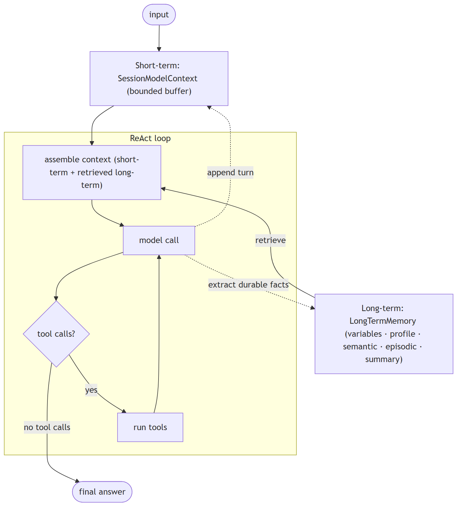

**Jiuwen.** Short-term is the session model context with a bounded message buffer; long-term is a typed memory store (variables, user profile, semantic and episodic memory, summaries). The product adds a SQLite/FTS5 hybrid index over markdown memory files, and retrieval into the current turn happens through a memory-search tool.

<b>Jiuwen technical detail (classes &amp; functions)</b>

**Implementation**

Short-term is `SessionModelContext` with a bounded message buffer. Long-term is `LongTermMemory`, with a typed taxonomy (`VARIABLE`, `USER_PROFILE`, `SEMANTIC_MEMORY`, `EPISODIC_MEMORY`, `SUMMARY`). The product adds a SQLite/FTS5 hybrid index over markdown memory files.

**Code anchors**

| Code anchor | What it points to |
|---|---|
| `agent-core/openjiuwen/core/context_engine/context/context.py:44` | SessionModelContext |
| `agent-core/openjiuwen/core/context_engine/context/message_buffer.py:11` | ContextMessageBuffer |
| `agent-core/openjiuwen/core/memory/long_term_memory.py:69` | LongTermMemory |
| `../../../agent-core/openjiuwen/core/memory/manage/mem_model/memory_unit.py` | memory type taxonomy |
| `jiuwenswarm/jiuwenswarm/agents/harness/common/memory/manager.py:56` | product hybrid memory index |

**Canonical source**

`source/ai-agent-interview-questions_for_engineers.md`

---

## 9. How do you decide what to store in memory versus what to discard

intermediate

**Title.** What to store vs discard

**Summary.** Keep durable, reused, preference-like, decision-relevant facts; discard transient chatter and stale/contradicted entries — usually extract candidates with an LLM, then dedupe/resolve.

**Key points.**

- Keep durable/reused/preference facts.
- Discard transient and contradicted.
- LLM extract then dedupe/resolve.

**General.** Keep durable, reused, preference-like, and decision-relevant facts; discard transient chatter, redundant restatements, and stale/contradicted entries. Most systems extract candidates with an LLM, then dedupe and resolve conflicts against existing memory.

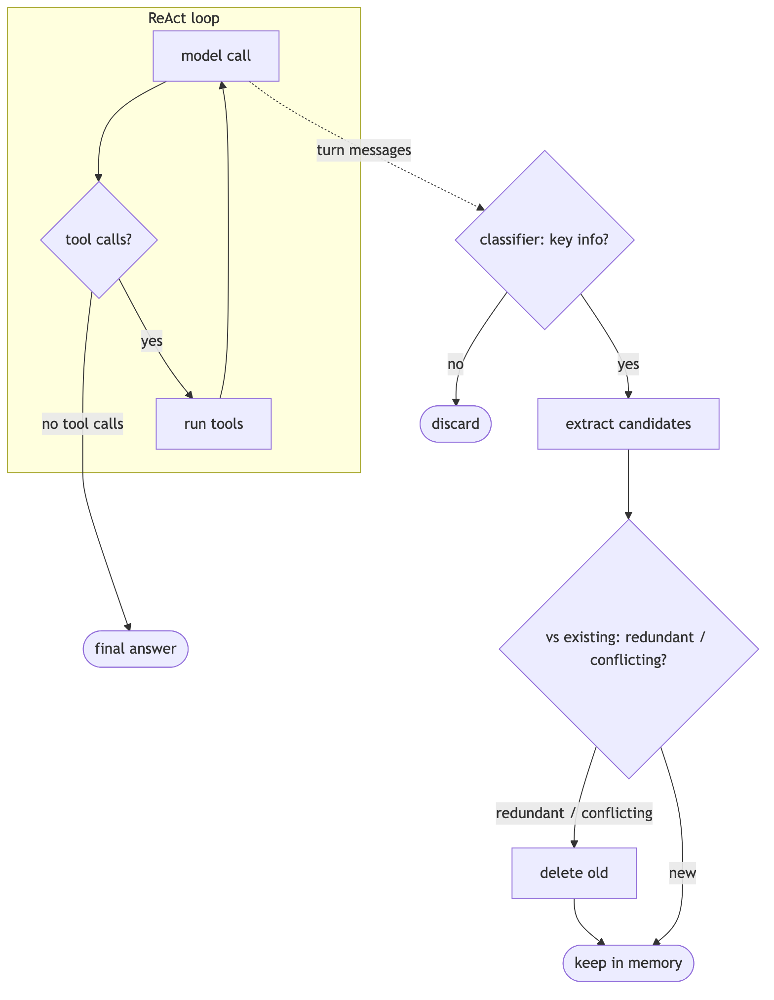

**Jiuwen.** An LLM classifier decides whether a turn has key information, and extraction runs only if flagged. Writes dedupe and resolve conflicts: the memory manager searches related old memories, classifies them as redundant, conflicting, or none, deletes redundant or conflicting entries, and writes the new one. So storing is a classify-then-reconcile pipeline, not append-only.

<b>Jiuwen technical detail (classes &amp; functions)</b>

**Implementation**

An LLM classifier decides whether a turn has key information, and extraction runs only if flagged. Writes dedupe and resolve conflicts: `FragmentMemoryManager.add_memories` searches related old memories, invokes `MemUpdateChecker` (REDUNDANT/CONFLICTING/NONE), deletes redundant/conflicting IDs, and adds survivors. The product's sweeper prompt explicitly treats "output [] as the norm" and forbids generic/static facts.

**Code anchors**

| Code anchor | What it points to |
|---|---|
| `agent-core/openjiuwen/core/memory/process/extract/memory_analyzer.py:26` | key-information classifier |
| `agent-core/openjiuwen/core/memory/process/extract/generation.py:102` | extraction gated on the classifier |
| `agent-core/openjiuwen/core/memory/manage/index/fragment_memory_manager.py:125` | dedupe + conflict resolution |
| `agent-core/openjiuwen/core/memory/manage/update/mem_update_checker.py:22` | CheckResult |
| `jiuwenswarm/jiuwenswarm/agents/harness/common/memory/dreaming/sweeper.py:617` | discard rules |

**Canonical source**

`source/ai-agent-interview-questions_for_engineers.md`

---

## 10. How do you prevent memory from growing unbounded across a long session

intermediate

**Title.** Bounding memory growth

**Summary.** Bound on multiple axes: hard-drop/truncate oldest context, offload large blobs, compact old tool results, summarize/archive, and cap stored long-term entries.

**Key points.**

- FIFO/truncate oldest context.
- Offload large blobs; compact tool results.
- Summarize/archive; cap long-term entries.

**General.** Bound it on multiple axes: hard-drop or truncate the oldest context, offload large blobs, compact old tool results, summarize and archive, and cap the number of stored long-term entries.

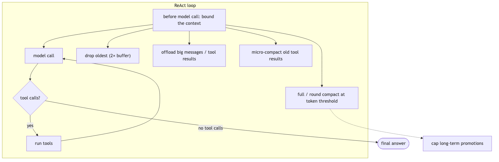

**Jiuwen.** A bounded FIFO buffer drops the oldest messages beyond twice the limit; budget guarding truncates oversized content with head/tail previews; offloaders move large messages and tool results out of context; compactors run at token thresholds; and long-term promotion is capped per session. Growth is bounded on several axes at once.

<b>Jiuwen technical detail (classes &amp; functions)</b>

**Implementation**

A bounded FIFO buffer drops the oldest messages beyond twice the limit. Budget guarding truncates oversized content with head/tail previews. Offloaders move large messages and tool results out of context. Compactors run at token thresholds. Long-term promotion is capped per session.

**Code anchors**

| Code anchor | What it points to |
|---|---|
| `agent-core/openjiuwen/core/context_engine/context/message_buffer.py:71` | drop oldest beyond 2× |
| `agent-core/openjiuwen/core/context_engine/processor/budget_guard.py:88` | head/tail truncation |
| `agent-core/openjiuwen/core/context_engine/processor/offloader/message_offloader.py:71` | offload large messages |
| `agent-core/openjiuwen/core/context_engine/processor/offloader/tool_result_budget_processor.py:81` | tool-result budget |
| `agent-core/openjiuwen/core/context_engine/processor/compressor/micro_compact_processor.py:47` | micro compaction |
| `agent-core/openjiuwen/core/context_engine/processor/compressor/full_compact_processor.py:183` | full compaction |
| `agent-core/openjiuwen/core/context_engine/processor/compressor/round_level_compressor.py:96` | round compaction |
| `jiuwenswarm/jiuwenswarm/agents/harness/common/memory/dreaming/sweeper.py:36` | per-session promotion caps |

**Canonical source**

`source/ai-agent-interview-questions_for_engineers.md`

---

## 11. How would you summarize conversation history without losing important details

advanced

**Title.** Summarizing history safely

**Summary.** Keep recent turns verbatim; summarize older turns into a structured note (goal, decisions, files/state, open tasks, next step) rather than free prose; re-inject durable state.

**Key points.**

- Recent turns verbatim.
- Structured summary, not free prose.
- Re-inject durable state (plan, status, files).

**General.** Keep the most recent turns verbatim, summarize older turns into a structured note (goal, decisions, files/state, open tasks, next step) rather than free prose, and re-inject the durable state (plan, task status, key artifacts) separately so it is not lost inside a summary. Boundary markers separate summary from live turns, and the summary should be updated incrementally so each pass only processes new messages.

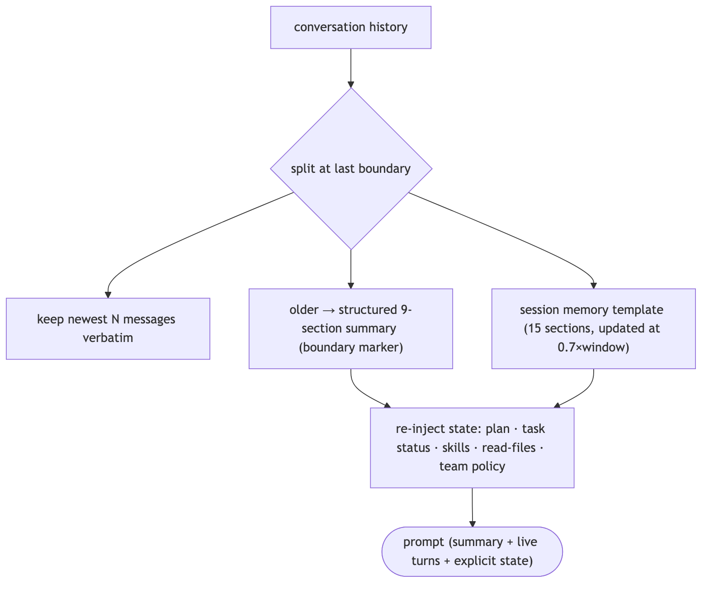

**Jiuwen.** Compaction replaces the active segment with a structured summary plus a boundary system message, then re-injects high-value state as separate messages: plan and task status, recent skill reads, read-file snapshots, and the team policy. The structured form preserves details that free prose would lose.

<b>Jiuwen technical detail (classes &amp; functions)</b>

**Implementation**

Compaction replaces the active segment with a structured summary plus a boundary `SystemMessage`, then re-injects high-value state as separate `UserMessage` blocks: plan/task status, recent skill-read rounds, read-file snapshots, and the team collaboration policy (returned as messages so they escape `state_snapshot_max_chars` truncation). `FullCompactProcessor` uses a 9-section summary prompt and boundary markers (`[FULL_COMPACT_BOUNDARY]`, `[FULL_COMPACT_STATE]`, `[SESSION_MEMORY_BOUNDARY]`). The session-memory path runs a background updater triggered at 0.7×context window, summarizes only completed API rounds, writes to a pending file and atomically renames on commit, and records `notes_upto_message_id` so only un-summarized messages are processed next time.

**Code anchors**

| Code anchor | What it points to |
|---|---|
| `agent-core/openjiuwen/core/context_engine/processor/compressor/full_compact_processor.py:69` | BASE_COMPACT_PROMPT; :167 boundary markers; :342 _build_replacement_messages(); :774 build_reinjected_state_messages() |
| `agent-core/openjiuwen/core/context_engine/processor/compressor/util.py:242` | build_skill_reinjected_content(); :294 build_task_status_reinjected_content(); :105 build_team_policy_reinjected_messages() |
| `agent-core/openjiuwen/core/context_engine/context/session_memory_manager.py:37` | 15-section template; :738 should_update(); :824 _update_background(); :529 invalidate_session_memory_anchor() |
| `agent-core/openjiuwen/core/context_engine/processor/forked/compressor/reinjection/builders.py:29` | forked reinjection builders |

**Canonical source**

`source/llm-fundamentals-interview-questions_for_engineers.md`

---

## 12. Planner–executor pattern

intermediate

**Title.** Planner–executor pattern

**Summary.** A planner breaks a complex request into subtasks; one or more executors carry each out; results are combined into a final response.

**Key points.**

- Planner decomposes the task.
- Executors carry out subtasks.
- Results are combined.

**General.** a planner breaks a complex request into subtasks; one or more executors carry each out; results are combined into a final response. Common in multi-step agent systems. Used for: research assistants, report generation, multi-source data analysis.

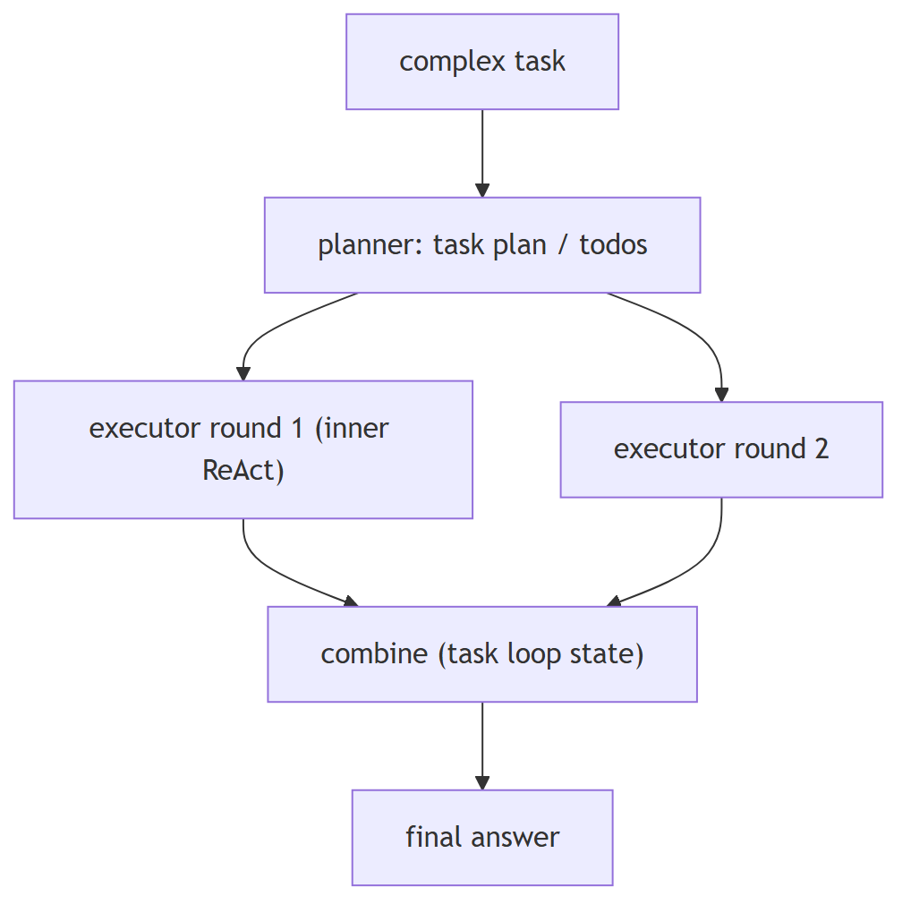

**Jiuwen.** Two paths. The deep agent's outer task loop runs a full inner ReAct invoke per round while a persistent task plan and todos carry state; a task-planning rail registers the todo tools and injects planning guidance (plan mode adds a task tool to delegate).

<b>Jiuwen technical detail (classes &amp; functions)</b>

**Implementation**

Two paths. `DeepAgent`'s outer task loop runs a full inner ReAct invoke per round while a persistent `TaskPlan`/todos carry state; `TaskPlanningRail` registers the todo tools and injects planning guidance (`Plan` mode adds a `task_tool` to delegate). `agent_teams` adds supervisor/leader decomposition, and a dedicated plan subagent exists.

**Code anchors**

| Code anchor | What it points to |
|---|---|
| `agent-core/openjiuwen/harness/deep_agent.py:2694` | outer task loop |
| `agent-core/openjiuwen/harness/rails/task_planning_rail.py:31/108` | planning layer + todo tools |
| `agent-core/openjiuwen/harness/tools/todo.py:193` | TodoCreateTool |
| `agent-core/openjiuwen/harness/tools/subagent/task_tool.py:194/657` | subagent delegation |
| `agent-core/openjiuwen/core/multi_agent/teams/hierarchical_tools/hierarchical_team.py:101/108` | supervisor (agents-as-tools); agent-core/openjiuwen/harness/subagents/plan_agent.py:88 — plan subagent |

---

## 13. Critic or reflection loop

intermediate

**Title.** Critic or reflection loop

**Summary.** A self-check before returning: the primary agent drafts, a critic reviews against the request or rules, and the primary revises if it fails.

**Key points.**

- Draft, then critique.
- Revise on failure.
- Adds a verification step.

**General.** a self-check before returning. The primary agent drafts; a critic reviews it against the request or rules; if it fails, the primary revises. Adds a verification step for high-stakes output. Used for: financial summaries, compliance checks, high-stakes outputs where a wrong answer is costly.

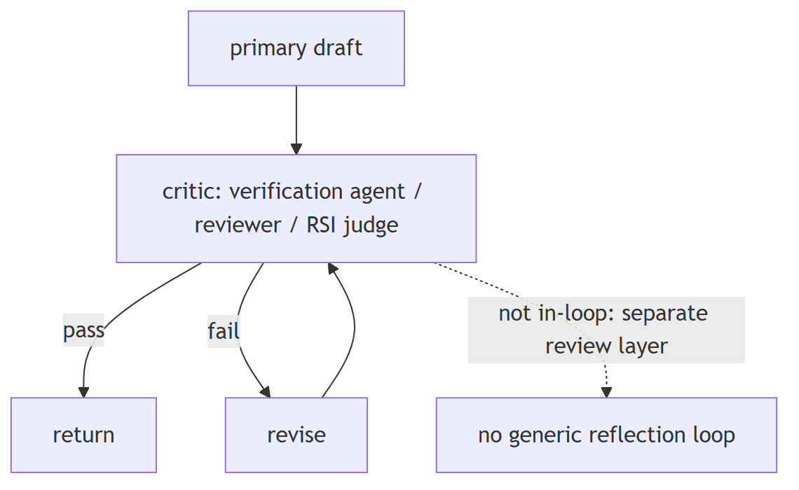

**Jiuwen.** There is no generic draft-critique-revise loop in the single-agent ReAct path, but the pieces exist: a verification agent restricted to read-only tools that must show verbatim evidence and emit PASS/FAIL/PARTIAL, and a team reviewer that scores correctness.

<b>Jiuwen technical detail (classes &amp; functions)</b>

**Implementation**

There is no generic draft→critique→revise loop in the single-agent ReAct path, but the pieces exist: a **verification agent** restricted to read-only tools that must show verbatim evidence and emit PASS/FAIL/PARTIAL; an `agent_teams` reviewer that scores `Correctness`/completeness with rework thresholds; and the RSI weighted-rubric judge. These run as separate review layers, not as an in-loop reflection that blocks generation.

**Code anchors**

| Code anchor | What it points to |
|---|---|
| `agent-core/openjiuwen/harness/rails/subagent/verification_rail.py:92` | VerificationRail allowlist; agent-core/openjiuwen/harness/subagents/verification_agent.py:51 — PASS/FAIL/PARTIAL |
| `agent-core/openjiuwen/agent_teams/verification/reviewer.py:26/43/279` | review dimensions + rework thresholds |
| `agent-core/openjiuwen/rsi/harness_rsi/evaluator/judger/scoring.py:193` | weighted rubric judge |

---

## 14. Memory-augmented agent

intermediate

**Title.** Memory-augmented agent

**Summary.** Context across sessions: short-term is the active window; long-term is a store of past interactions; retrieval decides what long-term memory returns.

**Key points.**

- Short-term = active context window.
- Long-term = persisted store.
- Retrieval brings memory back.

**General.** context across sessions, not just one conversation. Short-term memory is the active context window; long-term memory is a vector store/DB of past interactions; retrieval decides what long-term memory is relevant to the current turn. Used for: personal assistants, customer support.

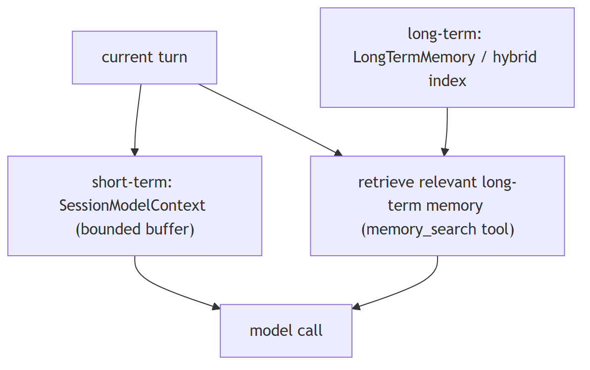

**Jiuwen.** Short-term is a session model context with a bounded message buffer; long-term is a typed memory taxonomy, and the product adds a SQLite/FTS5 hybrid index over markdown memory files. Retrieval-into-turn is a tool the model calls.

<b>Jiuwen technical detail (classes &amp; functions)</b>

**Implementation**

Short-term is `SessionModelContext` with a bounded `ContextMessageBuffer`; long-term is `LongTermMemory` with a typed taxonomy, and the product adds a SQLite/FTS5 hybrid index over markdown memory files. Retrieval-into-turn is a tool the model calls (`memory_search`), and `MemoryRail` suppresses it when daily memory is auto-loaded.

**Code anchors**

| Code anchor | What it points to |
|---|---|
| `agent-core/openjiuwen/core/context_engine/context/context.py:44` | SessionModelContext; agent-core/openjiuwen/core/context_engine/context/message_buffer.py:11 — ContextMessageBuffer |
| `agent-core/openjiuwen/core/memory/long_term_memory.py:69` | LongTermMemory |
| `jiuwenswarm/jiuwenswarm/agents/harness/common/memory/manager.py:183/805` | product hybrid index |
| `jiuwenswarm/jiuwenswarm/agents/harness/common/tools/memory_tools.py:167` | memory_search; agent-core/openjiuwen/harness/prompts/sections/memory.py:14 — when to call |

---

## 15. Router pattern

intermediate

**Title.** Router pattern

**Summary.** One entry point decides which subsystem handles the request: the query is classified and routed to a specialized agent or tool.

**Key points.**

- Classify the query.
- Route to a specialized handler.
- Avoid one generic prompt.

**General.** one entry point decides which subsystem handles the request. The query is classified and routed to a specialized agent/tool (SQL agent, search agent, summarization agent), so one generic prompt does not handle everything poorly. Used for: mixed workloads where one prompt can't cover all request types.

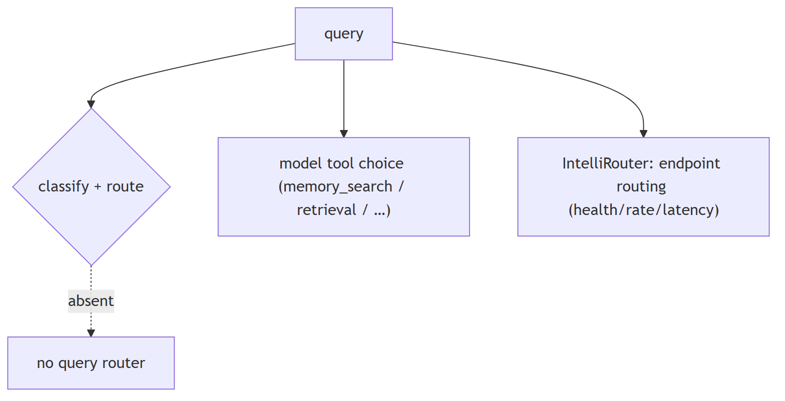

**Jiuwen.** There is no query-classification router. Routing that exists is model tool choice (the model picks memory search, retrieval, or other tools), and the intelli-router is model-endpoint routing (health, rate, latency), not query routing.

<b>Jiuwen technical detail (classes &amp; functions)</b>

**Implementation**

There is **no query-classification router**. Routing that exists is model tool choice (the model picks `memory_search` / retrieval / other tools), and `IntelliRouter` is model-**endpoint** routing (health/rate/latency), not query routing. `AgenticRetriever` derives its mode from `index_type`, not from the query.

**Code anchors**

| Code anchor | What it points to |
|---|---|
| `jiuwenswarm/jiuwenswarm/agents/harness/common/tools/memory_tools.py:167` | tool the model chooses |
| `agent-core/openjiuwen/agent_teams/models/allocator.py:559` | build_model_allocator (endpoint strategies) |
| `agent-core/openjiuwen/core/foundation/llm/model_clients/intelli_router_model_client.py:32` | ReliableRouter |
| `agent-core/openjiuwen/core/retrieval/retriever/agentic_retriever.py:155` | mode from index_type, not the query |

---
