

<a class="topic-nav__link topic-nav__prev" href="21-agent-harness-and-rails.html">← PreviousAgent harness and lifecycle hooks</a>
<a class="topic-nav__link topic-nav__next" href="09-multi-agent-systems.html">Next →Multi-agent systems</a>

# Agent frameworks

## 1. What does an agent framework actually give you that raw API calls don't

Mechanism basic

**TL;DR.** Raw API = request → response. A framework adds the surrounding machinery: session/state, context management, a tool registry, a control loop, streaming, tracing, and guardrails.

**Key points.**

- Session/state across turns.
- Context trimming/compression.
- Tool registry + control loop.
- Streaming, tracing, guardrails.

**Concept.** A raw API call is request → response. A framework adds the machinery around it: a session/state object that survives across turns, a context manager that trims and compresses history, a tool registry that turns functions into model-facing schemas and dispatches calls, a provider-agnostic model client, a loop with stop conditions, error handling, and observability. You do not re-implement conversation state, schema extraction, provider quirks, and tracing for every app.

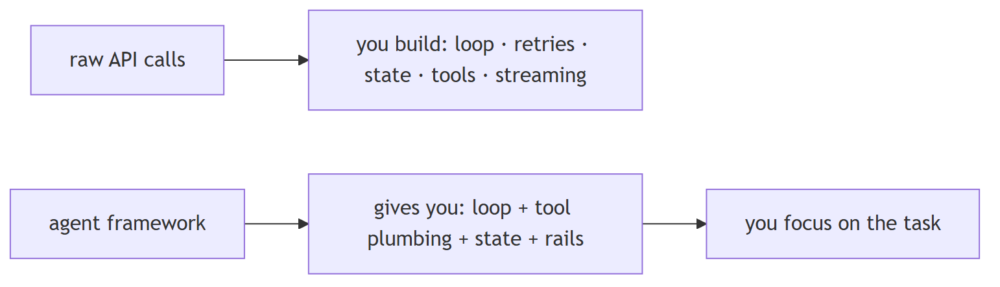

**In Jiuwen.** The reusable pieces are concrete classes, not a monolith: a session owns state, streaming, tracing, and interaction lifecycle; a model client wraps providers behind one invoke/stream surface; a context engine owns windowing and compression; an ability manager owns tool registration and execution; and rails provide the loop's guardrails. Together they are the plumbing you would otherwise rebuild.

<b>Under the hood</b>

**Implementation**

The reusable pieces are concrete classes, not a monolith. `Session` owns state, streaming, tracer, and interaction lifecycle; `Model` + `BaseModelClient` wrap providers behind one `invoke`/`stream` surface; `ContextEngine` owns windowing and compression; `AbilityManager` owns tool registration and execution; `AgentRail` is the class-based lifecycle hook bus; `Tracer` plus `extensions/observability` own telemetry; `Workflow`/`Pregel` own deterministic graph execution; and `Runner` is the process-global facade binding sessions, resource registry, checkpointer, and callbacks.

**Implementation diagram**

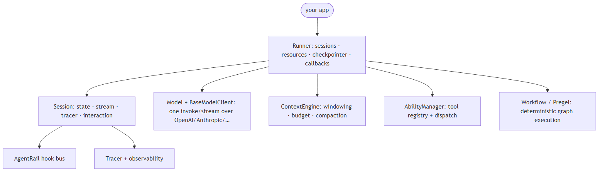

**Code anchors**

| Code anchor | What it points to |
|---|---|
| `agent-core/openjiuwen/core/session/agent.py:33` | Session (state, stream, tracer, interaction) |
| `agent-core/openjiuwen/core/runner/runner.py:696` | Runner facade class; :408 run_agent binds session + lifecycle |
| `agent-core/openjiuwen/core/context_engine/context_engine.py:28` | ContextEngine (processors, token limits, compression) |
| `agent-core/openjiuwen/core/foundation/llm/model.py:27` | Model, unified LLM entry; :94 invoke |
| `agent-core/openjiuwen/core/foundation/llm/model_clients/__init__.py:58` | create_model_client provider dispatch |
| `agent-core/openjiuwen/core/single_agent/ability_manager.py:142` | AbilityManager (tool registry + execution) |
| `agent-core/openjiuwen/core/single_agent/rail/base.py:824` | AgentRail base (lifecycle hooks) |
| `agent-core/openjiuwen/core/session/tracer/tracer.py:98` | Tracer; agent-core/openjiuwen/extensions/observability/runtime.py:103 — ObservabilityRuntime |

---

## 2. What's the difference between a graph-based framework like LangGraph and a role-based framework like CrewAI

Compare basic

**TL;DR.** Graph-based makes control flow an explicit graph of nodes/edges over shared state (deterministic, inspectable); role-based makes the unit an agent with a role that collaborates (flexible, less deterministic).

**Key points.**

- Graph: explicit nodes/edges, deterministic routing.
- Role: agents with roles that collaborate.
- Trade control for flexibility.

**Concept.** Graph-based frameworks make control flow an explicit graph of nodes and edges over shared state; routing is deterministic, inspectable, and easy to persist. Role-based frameworks make the unit an agent with a role/persona and let agents collaborate through messages and a task board; control flow is emergent and driven by the model plus a manager. Graph = you author the topology; role = you author the team.

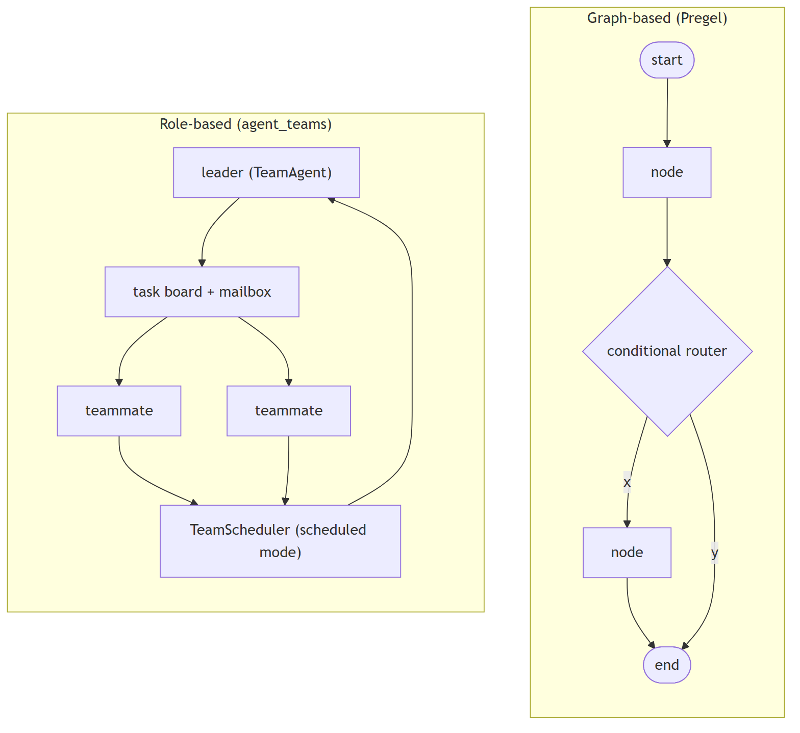

**In Jiuwen.** Jiuwen contains both archetypes as separate subsystems: the graph side is a real Pregel engine where components compile into a graph, edges become channels, and a loop drives super-steps with static and conditional routers, barriers, and OR-groups; the role side is the agent-teams stack with members, a supervisor, and message routing. So it is not graph versus role — it has both.

<b>Under the hood</b>

**Implementation**

It contains both archetypes as separate subsystems. The graph side is a genuine Pregel engine: `Workflow` compiles components into a `PregelGraph`, edges become channels, and `PregelLoop.run_step()` drives super-steps with static routers, conditional routers, barriers, and CNF OR-groups for exclusive merges. The role side is `TeamAgent`, a single class that switches between `TeamRole.LEADER` and `TEAMMATE`; leadership is expressed through tools (`create_team_tools`), an event-driven `CoordinationKernel`, and an optional `TeamScheduler` that dispatches tasks from a shared board. There is no declarative bridge that compiles a team into a Pregel graph.

**Code anchors**

| Code anchor | What it points to |
|---|---|
| `agent-core/openjiuwen/core/workflow/workflow.py:98` | Workflow graph facade |
| `agent-core/openjiuwen/core/graph/pregel/engine.py:209` | Pregel; :231 run; :255 while await loop.run_step() driver |
| `agent-core/openjiuwen/core/graph/pregel/builder.py:13` | PregelBuilder (add_node/add_edge/add_branch) |
| `agent-core/openjiuwen/core/graph/pregel/router.py:11/26` | StaticRouter / ConditionalRouter |
| `agent-core/openjiuwen/core/workflow/_workflow.py:221` | add_connection (src/target edges) |
| `agent-core/openjiuwen/agent_teams/agent/team_agent.py:76` | TeamAgent one impl for leader/teammate |
| `agent-core/openjiuwen/agent_teams/schema/team.py:81` | TeamRole; agent-core/openjiuwen/agent_teams/agent/scheduling/scheduler.py:92 — TeamScheduler; agent-core/openjiuwen/agent_teams/agent/coordination/kernel.py:33 — CoordinationKernel |
| `agent-core/openjiuwen/agent_teams/runtime/manager.py:104` | TeamRuntimeManager pool/dispatch; agent-core/openjiuwen/agent_teams/tools/tool_factory.py:97 — create_team_tools |

---

## 3. How do you decide between LangGraph, CrewAI, and the Anthropic Agent SDK for a given project

Mechanism intermediate

**TL;DR.** Pick by control shape and state model: explicit graph/routing with durable state → LangGraph; role/team collaboration for fast multi-agent → CrewAI; a managed agent SDK for host-managed agents.

**Key points.**

- Explicit graph + durable state → LangGraph.
- Role/team collaboration → CrewAI.
- Managed agent SDK for hosted agents.
- Match the framework to the control shape.

**Concept.** Pick by the shape of control and the state model you need. Explicit graph/routing with durable state → LangGraph. Role/team collaboration with fast multi-agent setup → CrewAI. A managed coding/agent harness with strong tool and sandbox defaults, and you accept the vendor → the Anthropic Agent SDK (or an equivalent). Weigh state model, persistence, provider lock-in, tool ecosystem, and team familiarity.

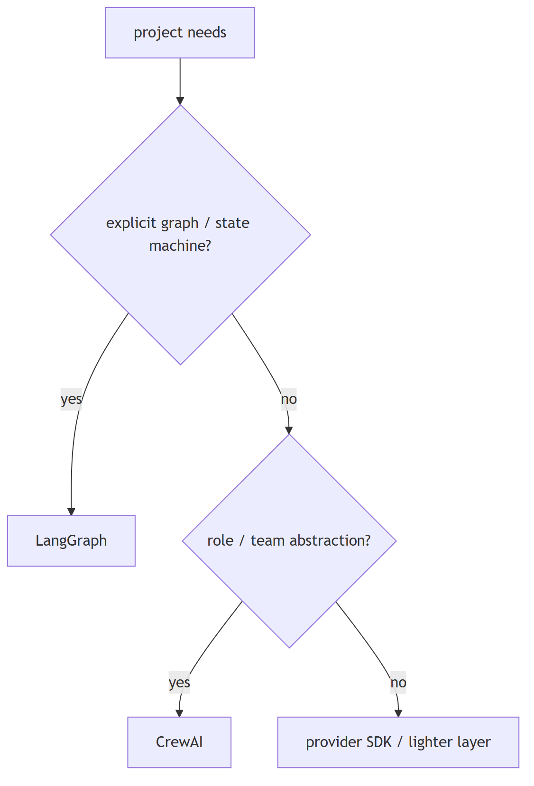

**In Jiuwen.** Jiuwen's design center is deterministic graphs when the flow is known (a Pregel workflow with persistence) and role-based teams when work assignment is emergent (a leader with teammates on a task board). Its answer to framework choice is: use the graph path for known control flow and the team path for flexible collaboration, rather than adopting a specific external framework.

<b>Under the hood</b>

**Implementation**

There is no in-repo LangGraph or CrewAI code, so this is architectural reading. Jiuwen's design center is *deterministic graph when the flow is known* (`Workflow`/`Pregel`, with persistence via `GraphStore`/checkpointer) and *role-based teams when work assignment is emergent* (`TeamAgent` + `TeamScheduler` + task board). Over both sits a provider-agnostic model client: `ProviderType` enumerates OpenAI/Anthropic/DashScope/DeepSeek/… and `create_model_client` resolves the implementation, with `IntelliRouterModelClient` for routing. For the third archetype ("bring your own agent SDK"), it ships a `harness_protocol` SPI plus `harness_providers` (`native`, `claudecode`, `codex`, `dsh`) and `create_harness(manifest, provider=...)`.

**Implementation diagram**

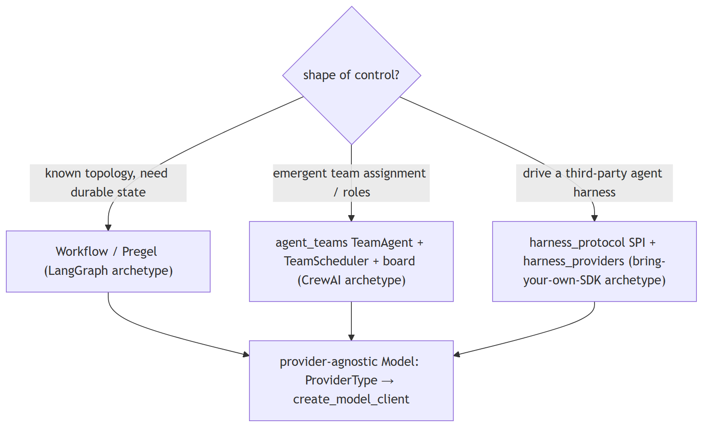

**Code anchors**

| Code anchor | What it points to |
|---|---|
| `agent-core/openjiuwen/core/graph/pregel/engine.py:255` | graph driver |
| `agent-core/openjiuwen/agent_teams/agent/scheduling/scheduler.py:92` | TeamScheduler; agent-core/openjiuwen/agent_teams/runtime/manager.py:104 — pool/dispatch |
| `agent-core/openjiuwen/core/foundation/llm/schema/config.py:13` | ProviderType enum |
| `agent-core/openjiuwen/core/foundation/llm/model_clients/__init__.py:58` | provider→client dispatch + registry fallback |
| `agent-core/openjiuwen/harness_providers/factory.py:160` | create_harness(manifest, provider=...) |
| `agent-core/openjiuwen/core/workflow/workflow.py:98` | graph and teams coexist in one SDK |
| `agent-core/openjiuwen/harness/manifest/catalog.py:67` | declarative element catalog |

---

## 4. What tradeoffs come with choosing a heavier framework versus writing a lighter custom orchestration layer

Compare advanced

**TL;DR.** Heavy frameworks give batteries (tools, memory, permissions, teams, observability) at the cost of startup time, learning curve, config surface, and churn; light custom code is transparent but you build the plumbing.

**Key points.**

- Heavy: batteries included, more config/learning.
- Light: transparent, you build plumbing.
- Choose by team size, rate of change, control needs.

**Concept.** Heavy frameworks give you batteries — tools, memory, permissions, teams, observability — at the cost of startup time, learning curve, config surface, and update churn. Light custom code is transparent and fast but you rebuild context management, retries, tracing, and safety. Choose by how much of the battery you would otherwise write yourself.

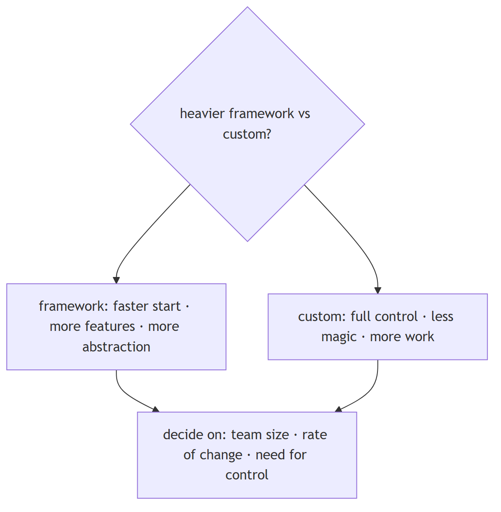

**In Jiuwen.** The light path is the core SDK: a base agent with a ReAct loop, an ability manager, optional rails, and workflow graphs — no workspace, permission engine, task loop, or teams. The heavy path is the harness: a factory assembles a deep agent with default rails, workspace, permissions, and teams. So you can start light and opt into the heavy layer.

<b>Under the hood</b>

**Implementation**

The light path is `core`: `BaseAgent`/`ReActAgent` with `AbilityManager`, optional rails, and `Workflow` graphs — no workspace, no permission engine, no task loop, no teams. The heavy path is `harness`: `factory.create_deep_agent` assembles `DeepAgent` with default rails (security, tool resilience, task planning, skills, subagents), a task loop, a workspace, and a tiered permission engine; `agent_teams` adds multi-process teams, DB/messager transport, worktrees, and reliability monitoring. Heaviness is partly config-gated (`enable_task_loop`, `enable_subagent_runtime`, `enable_security_rail`), but the default DeepAgent assembly is substantial.

**Implementation diagram**

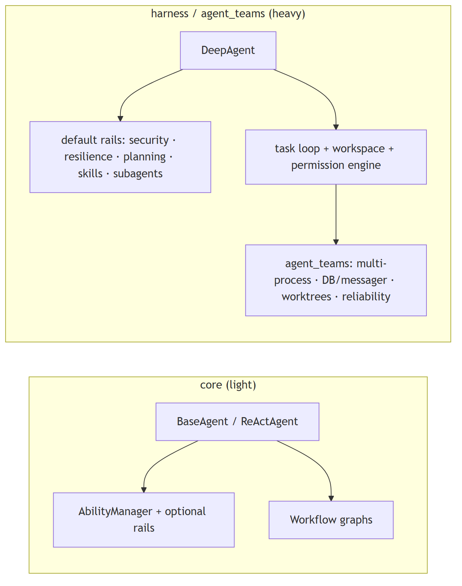

**Code anchors**

| Code anchor | What it points to |
|---|---|
| `agent-core/openjiuwen/core/single_agent/base.py:85` | BaseAgent; agent-core/openjiuwen/core/single_agent/agents/react_agent.py:2492 — invoke (light path) |
| `agent-core/openjiuwen/core/application/llm_agent/llm_agent.py:96` | ; agent-core/openjiuwen/core/application/workflow_agent/workflow_agent.py:11 — thin application agents |
| `agent-core/openjiuwen/harness/deep_agent.py:298` | DeepAgent; agent-core/openjiuwen/harness/factory.py:460 create_deep_agent; :394-409 default rail set |
| `agent-core/openjiuwen/harness/schema/config.py:248-260` | enable_task_loop/enable_subagent_runtime/enable_skill_discovery defaults False |
| `agent-core/openjiuwen/harness/schema/deep_agent_spec.py:448/452` | spec defaults enable_task_loop=True, enable_security_rail=True |
| `agent-core/openjiuwen/agent_teams/agent/team_agent.py:76` | team heaviness; agent-core/openjiuwen/extensions/context_evolver/ + agent-core/openjiuwen/rsi/ + agent-core/openjiuwen/auto_harness/ — optional layers |

---

## 5. When does a framework add unnecessary abstraction instead of solving a real problem

Mechanism intermediate

**TL;DR.** The framework adds abstraction when the app is a single model call, when its node/agent/state model forces you to reshape logic, or when the graph is actually a straight line — warning signs include fighting the framework.

**Key points.**

- Single model call doesn't need a framework.
- Forcing business logic into nodes/agents is a smell.
- A straight line disguised as a graph.

**Concept.** When the app is a single model call, when the framework's node/agent/state model forces you to reshape business logic to fit, or when the graph is actually a straight line. Warning signs: you fight the state schema, wrap everything in adapters, or need an escape hatch on the happy path. The abstraction pays for itself only when you actually need the loop, state, tools, and observability.

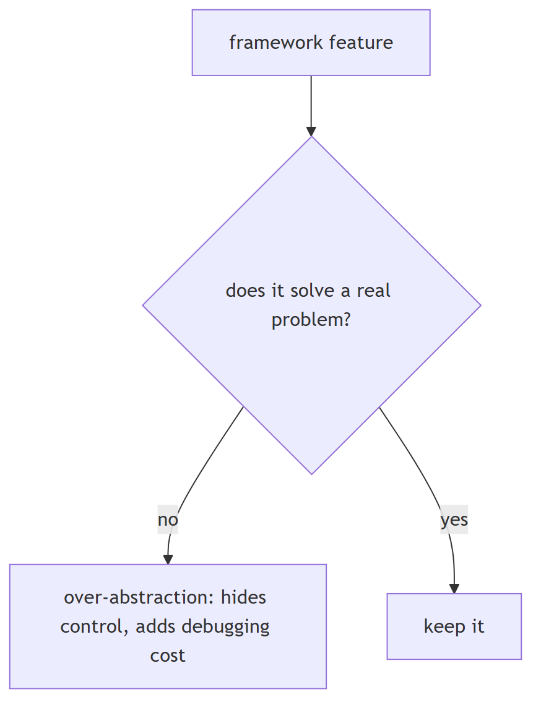

**In Jiuwen.** The base layer is deliberately thin and elective: the ReAct agent auto-creates a session when none is passed, so a minimal loop runs without the runner; the legacy base agent still offers add-tools plus invoke; and a workflow is just a graph of executables. So you can avoid the heavy abstractions when they do not fit.

<b>Under the hood</b>

**Implementation**

The base layer is deliberately thin and elective. `ReActAgent.invoke` auto-creates a session when none is passed, so a minimal loop runs without `Runner`; the legacy `BaseAgent` still offers `add_tools` + `invoke`; `Workflow` is just a graph of `Executable`s with optional schema validation. Heavier behavior lives in `harness/` and is opt-in: `factory.create_deep_agent` adds default rails only when their config flag is on, and `DeepAgentConfig` defaults `enable_task_loop`, `enable_skill_discovery`, and `enable_subagent_runtime` to `False`.

**Implementation diagram**

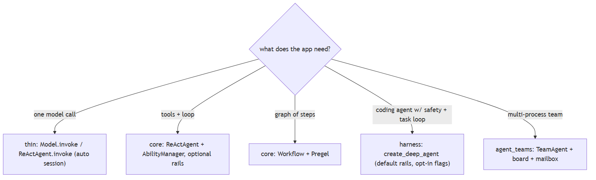

**Code anchors**

| Code anchor | What it points to |
|---|---|
| `agent-core/openjiuwen/core/single_agent/agents/react_agent.py:2492` | invoke auto-creates session when session is None (:2523) |
| `agent-core/openjiuwen/core/application/llm_agent/llm_agent.py:96` | LLMAgent thin controller-based agent; agent-core/openjiuwen/core/application/workflow_agent/workflow_agent.py:11 — WorkflowAgent |
| `agent-core/openjiuwen/core/single_agent/legacy/agent.py:116` | legacy BaseAgent; :222 add_tools |
| `agent-core/openjiuwen/harness/factory.py:394` | default_rails, each guarded by should_add |
| `agent-core/openjiuwen/harness/schema/deep_agent_spec.py:448/452/469` | enable_task_loop/enable_security_rail/enable_skill_discovery defaults |
| `agent-core/openjiuwen/harness/deep_agent.py:1873` | add_rail optional, queue-based |
| `agent-core/openjiuwen/core/workflow/workflow.py:328` | Workflow.invoke requires an explicit session |

---

## 6. What happens when the framework's abstractions don't match how your actual business logic needs to work

Mechanism intermediate

**TL;DR.** Use escape hatches: implement the base interface directly, call the primitive without the wrapper, override hooks, or replace a component; if there's no seam, that's a real limitation.

**Key points.**

- Implement the base interface directly.
- Call the primitive (model/tool) without the wrapper.
- Override hooks or replace a component.

**Concept.** Prefer escape hatches: implement the base interface directly, call the primitive (model/tool) without the high-level wrapper, override hooks, or replace a component. If the framework has no seam, you fork it or drop it. Good frameworks make the low-level primitive reachable from the high-level API.

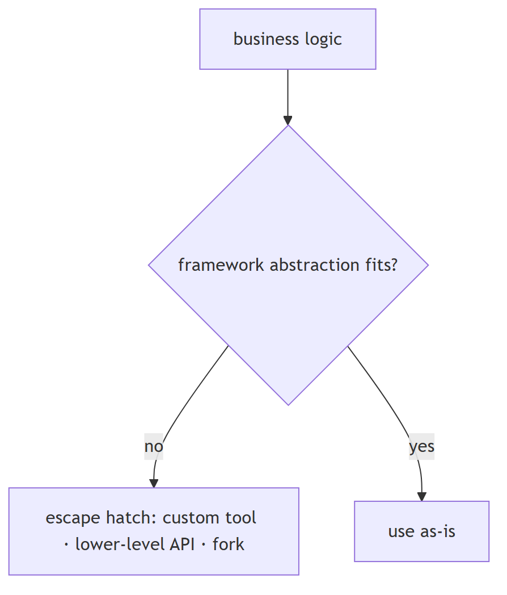

**In Jiuwen.** There are multiple escape hatches: at the graph level you can implement the executable interface with full IO control and bypass schemas; at the model level you can call the model directly without an agent or runner; at the tool level you can wrap any function; and rails and hooks can be overridden. So mismatched abstractions can usually be bypassed rather than fought.

<b>Under the hood</b>

**Implementation**

The framework exposes multiple escape hatches. At graph level, implement `Executable`/`ComponentExecutable` with full control over I/O and bypass schemas. At LLM level, call `Model.invoke` directly (no agent/runner required). At tool level, wrap any function with `LocalFunction`/`@tool`, including a custom `render`. At behavior level, intercept with `AgentRail` hooks or replace a rail via `strip_rails_by_type`; at assembly level, override config fields or subclass (`ReActAgentEvolve` is a shipped example). `_apply_extension_parts` hot-swaps rails/tools/prompts, and custom clients plug into the registry.

**Implementation diagram**

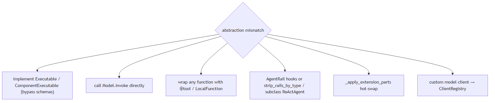

**Code anchors**

| Code anchor | What it points to |
|---|---|
| `agent-core/openjiuwen/core/graph/executable.py:14` | on_invoke override |
| `agent-core/openjiuwen/core/workflow/components/component.py:124/148` | invoke/stream overrides with raw Session+ModelContext |
| `agent-core/openjiuwen/core/foundation/llm/model.py:94` | direct Model.invoke |
| `agent-core/openjiuwen/core/foundation/tool/function/function.py:48` | LocalFunction; agent-core/openjiuwen/core/foundation/tool/tool.py:14 — @tool |
| `agent-core/openjiuwen/core/single_agent/rail/base.py:824` | AgentRail; agent-core/openjiuwen/harness/deep_agent.py:1936 — strip_rails_by_type |
| `agent-core/openjiuwen/core/single_agent/agents/react_agent_evolve.py:16` | subclassing ReActAgent |
| `agent-core/openjiuwen/core/foundation/llm/model_clients/base_model_client.py:53` | + agent-core/openjiuwen/core/common/clients/client_registry.py:50 — custom model backend |
| `agent-core/openjiuwen/harness/deep_agent.py:2015` | _apply_extension_parts hot-swap |

---

## 7. How does the framework decide which node or agent runs next

Mechanism intermediate

**TL;DR.** A scheduler activates every node whose input channels are ready, runs them (often concurrently), routes outputs to successors, and repeats until no node is active.

**Key points.**

- Ready = input channels satisfied.
- Run ready nodes concurrently.
- Route outputs; repeat until quiescent.

**Concept.** In a graph framework, a scheduler activates every node whose input channels are ready, runs them (often concurrently), then routes their outputs to successors; the loop repeats until no node is active. In an agent framework, the model decides the next action by emitting tool calls. Frameworks that have both use each at its level.

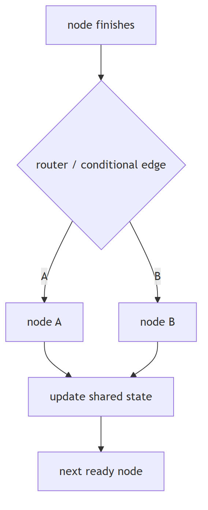

**In Jiuwen.** Next-node selection is Pregel super-step scheduling: each step asks the channel manager for nodes whose trigger/barrier channels are satisfied, submits them to a task executor pool, collects their router outputs, flushes messages into channels, and repeats until nothing is ready. Barriers and OR-groups gate joins of mutually exclusive branches.

<b>Under the hood</b>

**Implementation**

Workflow next-node selection is Pregel super-step scheduling: each step `ChannelManager.get_ready_nodes()` yields nodes whose trigger/barrier channels are satisfied, they are submitted to a `TaskExecutorPool`, their routers emit messages, messages are flushed into channels, and the loop repeats until the active set and buffer are empty. Agent-level dispatch is separate and LLM-driven: the ReAct loop calls the model, and if the assistant message carries `tool_calls` it hands them to `AbilityManager.execute`; if there are none it terminates with an answer. Team-level, `TeamScheduler` scans the task board and starts each idle member's earliest assigned pending task.

**Implementation diagram**

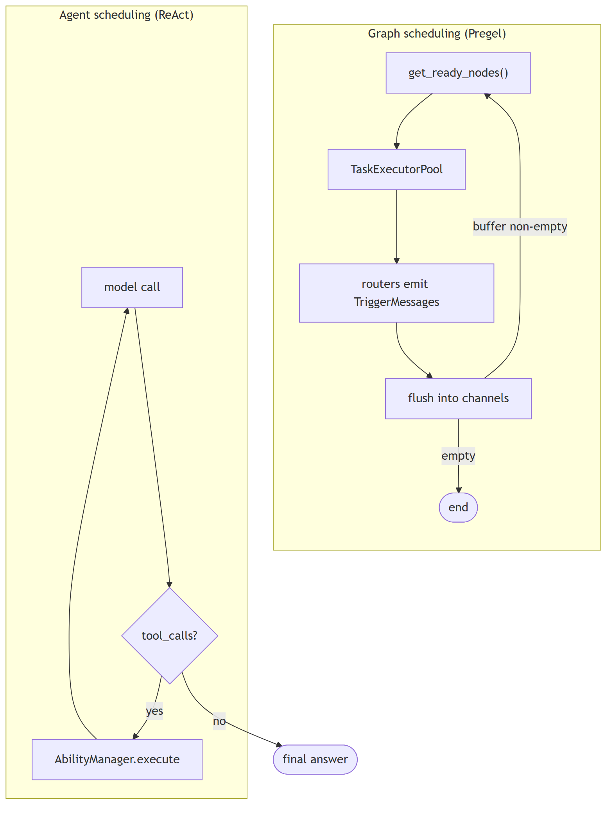

**Code anchors**

| Code anchor | What it points to |
|---|---|
| `agent-core/openjiuwen/core/graph/pregel/engine.py:122` | ready_nodes = manager.get_ready_nodes(); :130 end condition; :144-150 consume + executor.submit; :255 while await loop.run_step() |
| `agent-core/openjiuwen/core/graph/pregel/channels.py:39` | flush() marks updated nodes ready; :60 get_ready_nodes |
| `agent-core/openjiuwen/core/graph/pregel/task.py:27` | submit creates a NodeTask; :47 asyncio.wait(..., FIRST_EXCEPTION); :158 node routers produce next targets |
| `agent-core/openjiuwen/core/single_agent/agents/react_agent.py:2740` | iteration loop; :2793 no tool_calls → answer; :2813 _execute_tool_call |
| `agent-core/openjiuwen/core/single_agent/ability_manager.py:1078` | execute (invoked from agent-core/openjiuwen/core/single_agent/agents/react_agent.py:2813) |
| `agent-core/openjiuwen/agent_teams/agent/scheduling/scheduler.py:197` | _scan; :208 _reconcile_starts |

---

## 8. How do you version and roll back an agent's workflow definition, not just its prompts

Mechanism intermediate

**TL;DR.** Treat the agent/workflow definition as a versioned artifact: immutable versions with a content hash, activate one, list history, roll back atomically — prompts are only a subset.

**Key points.**

- Version the whole definition, not just prompts.
- Immutable versions + content hash.
- Activate/list/rollback atomically.

**Concept.** Treat the agent/workflow definition as a versioned artifact: store immutable versions with a content hash, activate one, list history, and roll back atomically. Prompts are only a subset — the topology and config change too. Most frameworks do not do this for you.

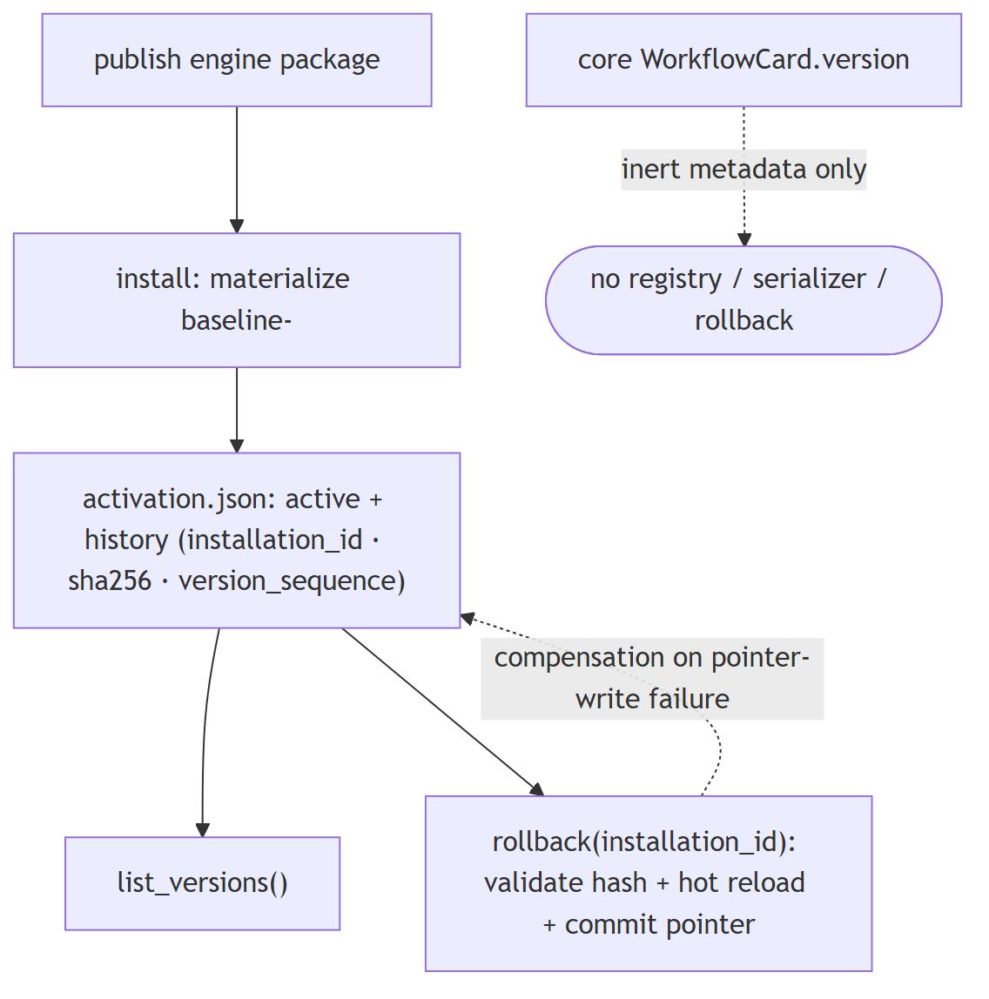

**In Jiuwen.** In the core framework this is essentially absent: a workflow card has a free-form version string and a key helper, but there is no registry, version history, graph serializer, or rollback API — the version is only part of a composite key. Real versioning and rollback exist at the product's RSI harness-package level, not for arbitrary workflow definitions.

<b>Under the hood</b>

**Implementation**

In the core framework this is **essentially absent**: `WorkflowCard` has a free-form `version: str = ''` and a `generate_workflow_key(id, version)` helper, but there is no registry, no version history, no graph serializer, and no rollback API — `version` is only part of a composite key. The real, working versioning is at the product layer in the RSI (recursive self-improvement) harness subsystem: `RsiHarnessActivationStore` persists an `activation.json` with `schema_version`, an `active` record, and an immutable `history` of installed versions, each carrying `installation_id`, `sha256`, `runtime_path`, and a monotonic `version_sequence`; `install(task_id)` copies a published engine package into a content-addressed `versions/baseline-<sha16>` directory and `rollback(installation_id)` re-activates any retained version (validating path, sha256, and manifest, hot-reloading, with compensation if the pointer write fails), exposed over the WebSocket protocol as `rsi.harness.rollback`.

**Code anchors**

| Code anchor | What it points to |
|---|---|
| `agent-core/openjiuwen/core/workflow/base.py:21` | WorkflowCard.version: str = ''; :68 generate_workflow_key(workflow_id, workflow_version) |
| `jiuwenswarm/jiuwenswarm/agents/harness/common/rsi/harness_activation.py:296` | RsiHarnessActivationStore; :350 list_versions(); :386 snapshot(); :391 restore(); :416 commit() assigns version_sequence; :466 atomic write |
| `jiuwenswarm/jiuwenswarm/agents/harness/common/rsi/harness_activation.py:617` | rollback(installation_id); :623 _rollback_unlocked; :682 _assert_rollback_allowed; :694 _validate_rollback_target |
| `jiuwenswarm/jiuwenswarm/agents/harness/common/rsi/materializer.py:222` | content-addressed version_id = baseline-<sha16>; :231-246 writes harness_refs.yaml |
| `jiuwenswarm/jiuwenswarm/server/rsi/rsi_handlers.py:224` | _do_harness_rollback; :218 _do_harness_versions_list; :209 install |
| `jiuwenswarm/jiuwenswarm/gateway/channel_manager/web/app_web_handlers.py:7634` | rsi.harness.rollback dispatch |
| `agent-core/openjiuwen/auto_harness/infra/runtime_manifest.py:121` | schema_version; agent-core/openjiuwen/harness/schema/expert_harness_spec.py:122 — schema_version |
| `agent-core/openjiuwen/agent_evolving/checkpointing/manager.py:121` | restores operator state/best score (training only) |

---

## 9. How do you evaluate whether a framework will scale with your team, not just your first prototype

Mechanism advanced

**TL;DR.** Look for declarative registration and plugins, stable extension contracts, provider/config abstraction, schema'd config, and real docs. Be wary if every change means patching internals.

**Key points.**

- Declarative registration and plugins.
- Stable extension contracts.
- Provider/config abstraction.
- Schema'd config + docs.

**Concept.** Look for declarative registration and plugins, stable extension contracts, provider and config abstraction, schema'd configuration, and real documentation. Be wary of frameworks where every change means patching internals. Prototype speed is not the same as team-scale maintainability.

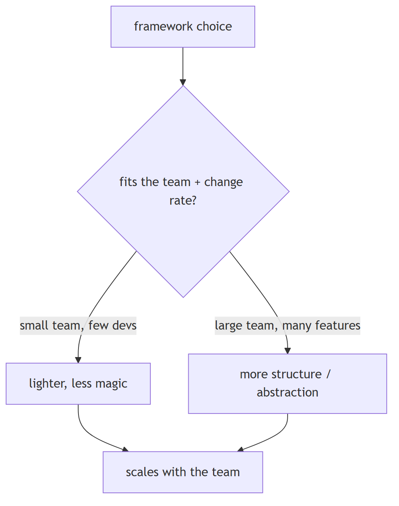

**In Jiuwen.** Extension is registry and manifest based rather than patch based. Provider modules declare element descriptors that a catalog registration converts into class registrations, and the deep agent can hot-load plugin, agent-template, and harness-config packages through one builder. Extension is by registration, not by patching internals.

<b>Under the hood</b>

**Implementation**

Extension is registry/manifest based rather than patch based. Provider modules declare `@harness_element(kind, name, ...)` descriptors; `register_from_catalog()` converts the catalog into class registrations, and `DeepAgent.load_plugin` / `load_agent_template` / `load_harness_config` hot-load packages through one `BuildContext` apply path. Model providers auto-register via `BaseModelClient.__init_subclass__` into `ClientRegistry`, and team infrastructure uses `register_transport`/`register_storage` name→config registries. `Runner.resource_mgr` centralizes tool/workflow/agent/team/model/prompt managers, and the product demonstrates the pattern: `jiuwenswarm/jiuwenswarm/agents/swarm/registry.py` imports provider modules and drives registration from the manifest catalog.

**Implementation diagram**

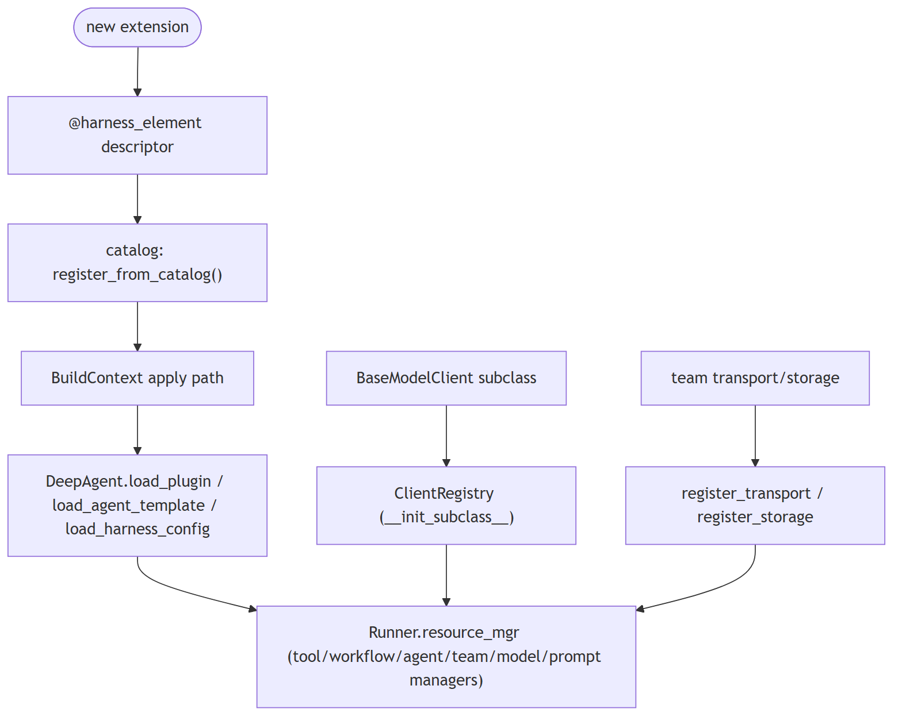

**Code anchors**

| Code anchor | What it points to |
|---|---|
| `agent-core/openjiuwen/harness/manifest/catalog.py:67` | @harness_element; :55 list_elements(); agent-core/openjiuwen/harness/manifest/registration.py:31 — register_from_catalog |
| `agent-core/openjiuwen/harness/deep_agent.py:2027` | load_plugin; :2076 load_agent_template; :2190 load_harness_config |
| `agent-core/openjiuwen/core/foundation/llm/model_clients/base_model_client.py:53` | __init_subclass__ auto-registration; agent-core/openjiuwen/core/common/clients/client_registry.py:19/50/94 |
| `agent-core/openjiuwen/core/runner/resources_manager/resource_registry.py:13` | ResourceRegistry |
| `agent-core/openjiuwen/harness/schema/config.py:248` | ; agent-core/openjiuwen/harness/schema/deep_agent_spec.py:354 — config schema (Pydantic) |
| `agent-core/openjiuwen/agent_teams/schema/blueprint.py:99` | TransportSpec/StorageSpec registry pattern |
| `jiuwenswarm/jiuwenswarm/agents/swarm/registry.py:8-12` | product-side provider registration via the catalog |

---
