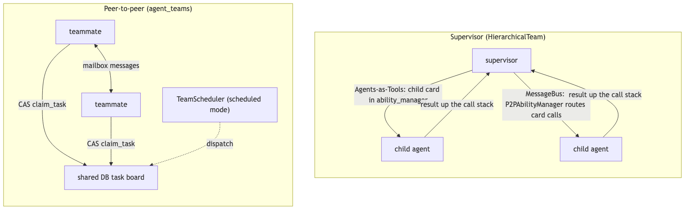
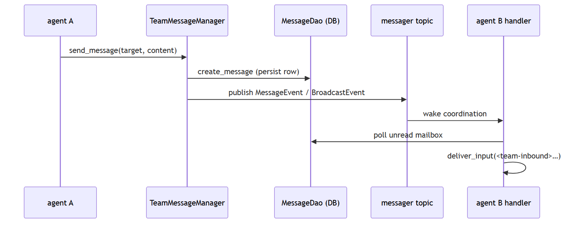
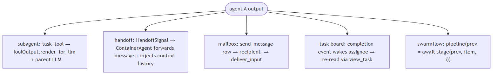
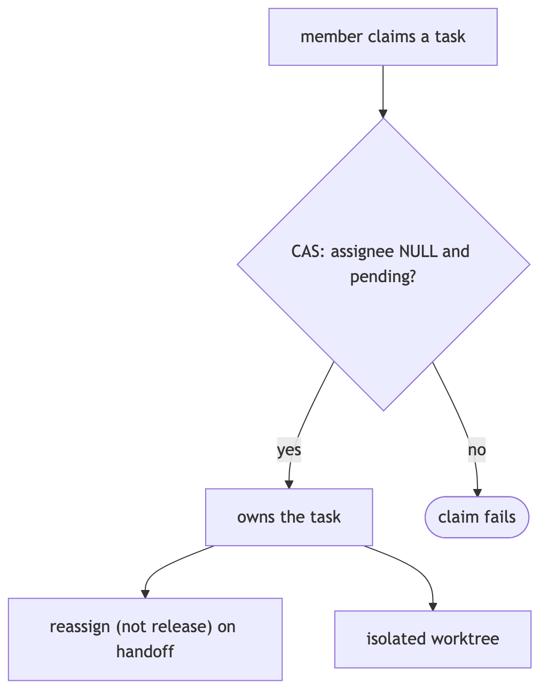
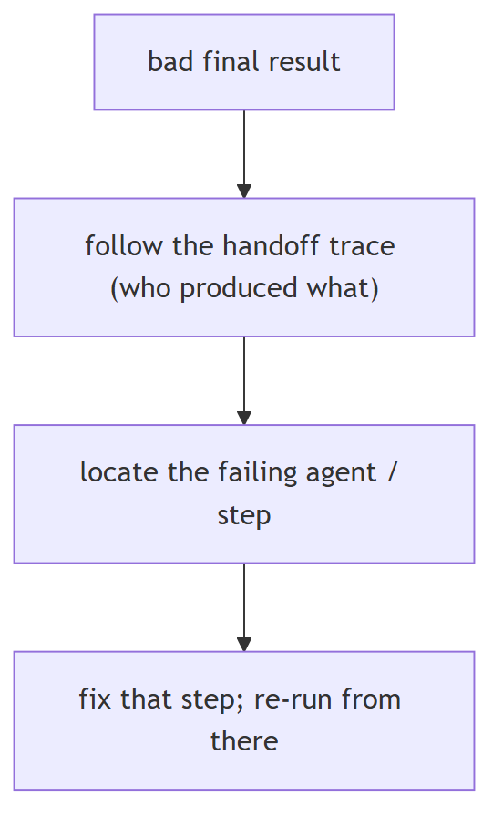
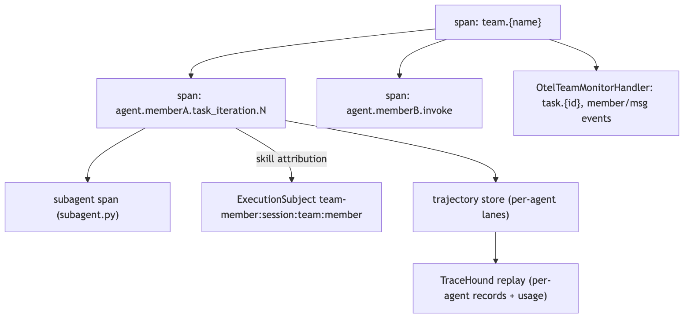
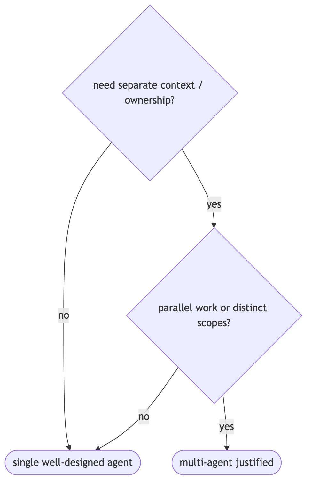
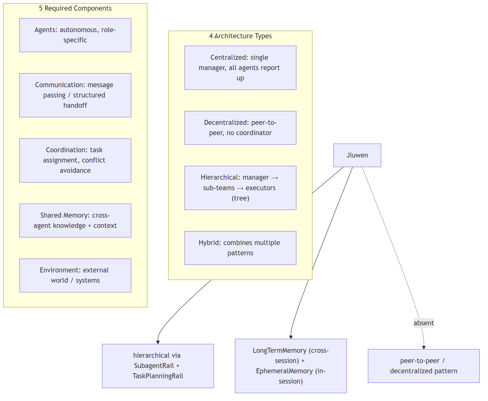

# Multi-agent systems

## 1. What's the difference between a supervisor pattern and a peer-to-peer pattern in these frameworks

Compare basic

**TL;DR.** A supervisor is one controller that plans and dispatches to workers (workers-as-tools), top-down; peer-to-peer has agents share a board/bus and coordinate as equals.

**Key points.**

- Supervisor: top-down, workers-as-tools.
- Peer-to-peer: shared board/bus, equals.
- Different control and failure modes.

**Concept.** A supervisor is one controller that plans and dispatches to workers (often workers-as-tools); control is top-down and data returns synchronously up the call stack. Peer-to-peer has agents share a board/bus and claim/communicate directly; control is distributed, needs arbitration (atomic claims, one-active-task invariants), but scales autonomy.

**In Jiuwen.** Supervisor teams are built on the multi-agent hierarchical team in two forms: agents-as-tools (each child is registered into the parent's ability manager, so the model calls a child like a tool) and a message-bus variant. Peer-to-peer runs the team's members against a shared task board with messaging, without a single controller.

<b>Under the hood</b>

**Implementation**

Supervisor teams are built on `core/multi_agent`'s `HierarchicalTeam`, in two implementations: **Agents-as-Tools** (`hierarchical_tools`) registers each child `AgentCard` into the parent's `ability_manager`, so the LLM invokes a child like any tool; **MessageBus** (`hierarchical_msgbus`) uses `SupervisorAgent` (a `ReActAgent` + `CommunicableAgent`) whose `P2PAbilityManager` intercepts AgentCard tool calls and routes them in parallel. Peer-to-peer is the `agent_teams` leader/teammate design: `TeamAgent` is one class for both roles, all members share a persistent DB task board and mailbox, and work is claimed via a single CAS (`claim_task`) with an optional `TeamScheduler` acting only as a leader-side dispatcher in `scheduled` mode.

**Code anchors**

| Code anchor | What it points to |
|---|---|
| `agent-core/openjiuwen/core/multi_agent/teams/hierarchical_tools/hierarchical_team.py:101` | _setup_hierarchy(); :108 parent_agent.ability_manager.add(child_card) |
| `agent-core/openjiuwen/core/multi_agent/teams/hierarchical_msgbus/supervisor_agent.py:20` | SupervisorAgent |
| `agent-core/openjiuwen/core/multi_agent/teams/hierarchical_msgbus/p2p_ability_manager.py:52` | execute() partitions AgentCard calls; :199 parallel P2P dispatch |
| `agent-core/openjiuwen/core/multi_agent/teams/hierarchical_msgbus/hierarchical_team.py:87` | team invoke() → supervisor |
| `agent-core/openjiuwen/agent_teams/tools/database/task_dao.py:634` | claim_task() single-CAS self-claim |
| `agent-core/openjiuwen/agent_teams/tools/task_manager.py:1581` | one-active-task invariant |
| `agent-core/openjiuwen/agent_teams/agent/scheduling/scheduler.py:208` | _reconcile_starts() leader mailbox dispatch |

---

## 2. How does a framework handle communication between multiple agents

Mechanism intermediate

**TL;DR.** Either a shared blackboard (task board/state) plus a message bus, or direct messaging; messages should be persisted and ordered for auditability, with routing (direct/broadcast/mentions).

**Key points.**

- Shared board + message bus.
- Or direct message passing.
- Persist and order; support routing.

**Concept.** Either a shared blackboard (task board/state) plus a message bus, or direct message passing. Messages should be persistent and ordered for auditability, with routing (direct, broadcast, mentions). Direct handoffs must carry enough context and be bounded.

**In Jiuwen.** The agent-teams stack uses a persisted mailbox plus an event bus: sending a message writes a message row and publishes an event on the team's topic; recipients are woken by coordination handlers that poll their unread mailbox and feed rendered text into the agent. External input routes through an interaction router with strict member targeting.

<b>Under the hood</b>

**Implementation**

The `agent_teams` stack uses a persisted mailbox plus an event bus. `TeamMessageManager.send_message()` writes a `TeamMessage` row through `MessageDao` and then publishes a `MessageEvent`/`BroadcastEvent` on the team's messager topic; recipients are woken by coordination handlers, which poll their unread mailbox (`MessageHandler._process_unread_messages`) and feed rendered `<team-inbound>` text into the harness via `deliver_input`. External input enters through `interaction/router.py` (`parse_interact_str` → `resolve_targets`, strict `@member` routing) and `TeamRuntimeManager._dispatch_payload`. The lower-level `core/multi_agent` stack has a separate `TeamRuntime`/`MessageBus` with `send` (P2P, waits for response) and `publish` (pub/sub). Subagents are a third, synchronous channel: `TaskTool` builds a child session and returns the terminal output directly.

**Code anchors**

| Code anchor | What it points to |
|---|---|
| `agent-core/openjiuwen/agent_teams/tools/message_manager.py:27` | TeamMessageManager; :60 send_message() persist-then-publish |
| `agent-core/openjiuwen/agent_teams/tools/database/message_dao.py:153` | MessageDao.create_message() |
| `agent-core/openjiuwen/agent_teams/agent/coordination/handlers/message.py:181` | _process_unread_messages() → deliver_input |
| `agent-core/openjiuwen/agent_teams/interaction/router.py:273` | resolve_targets() @member routing |
| `agent-core/openjiuwen/agent_teams/runtime/manager.py:573` | _dispatch_payload() |
| `agent-core/openjiuwen/core/multi_agent/team_runtime/communicable_agent.py:105` | send() (P2P); :131 publish() |
| `agent-core/openjiuwen/core/multi_agent/teams/handoff/handoff_tool.py:17` | HandoffTool |
| `agent-core/openjiuwen/harness/tools/subagent/task_tool.py:154` | TaskTool (synchronous child session, not a mailbox peer) |

---

## 3. How does the framework handle one agent's output becoming another agent's input

Mechanism intermediate

**TL;DR.** Either a call returns the value (subagent/tool), a handoff transfers control and context, or a shared board/bus carries the artifact — the framework must define result and context propagation.

**Key points.**

- Subagent/tool call returns the value.
- Handoff transfers control + context.
- Shared board/bus carries the artifact.

**Concept.** Either a call returns the value (subagent/tool), or a handoff transfers control and context, or a shared board/bus carries the artifact. The framework must define how results and context propagate, and whether propagation is automatic or requires the consumer to re-read.

**In Jiuwen.** Four paths: subagent delegation (a subagent tool builds isolated inputs, runs the child, wraps its terminal output as a tool result the parent reads); handoff (transferring control and context); and message/board passing between team members. Each defines how the result and context flow to the next consumer.

<b>Under the hood</b>

**Implementation**

Four paths. **Subagent delegation:** `TaskTool` builds isolated child inputs (`_build_subagent_inputs`), runs the subagent, wraps the terminal `output` into a `ToolOutput` (`_build_task_output`), and `render_for_llm` returns the answer as the tool result the parent reads. **Handoff:** `HandoffTool` emits a `HandoffSignal`; `ContainerAgent` appends `{"agent": ..., "output": result}` to a history, forwards `signal.message or inputs.input_message` as the next input, and seeds the next session from team history. **Mailbox flow (peer):** `send_message` persists a row; the recipient renders `<team-inbound>` and calls `deliver_input`. **Shared task board:** completion/dependency events wake assignees, but the work product is re-read via `view_task` rather than auto-injected. Swarmflow's `pipeline()` passes each stage's return value as the next stage's `prev`.

**Code anchors**

| Code anchor | What it points to |
|---|---|
| `agent-core/openjiuwen/harness/tools/subagent/task_tool.py:657` | _build_subagent_inputs(); :726 _build_task_output(); :1005 render_for_llm() |
| `agent-core/openjiuwen/core/multi_agent/teams/handoff/handoff_signal.py:47` | extract_handoff_signal() |
| `agent-core/openjiuwen/core/multi_agent/teams/handoff/container_agent.py:56` | _build_agent_input(); :112 _inject_context_history(); :249 coordinator.complete(result) |
| `agent-core/openjiuwen/agent_teams/agent/scheduling/scheduler.py:208` | scheduled handoff as a rendered leader message |
| `agent-core/openjiuwen/agent_teams/tools/database/task_dao.py:634` | peer task handoff via CAS claim |
| `agent-core/openjiuwen/agent_teams/workflow/engine/primitives.py:1495` | pipeline() passes prev between stages |

---

## 4. How do you prevent multiple agents from producing conflicting or redundant results

Mechanism intermediate

**TL;DR.** Give each unit of work one owner, enforce one-active-task-per-worker, arbitrate claims atomically, reassign instead of release, dedupe dispatch, and isolate workspaces.

**Key points.**

- Single owner per task.
- Atomic claim; reassign not release.
- Dedupe dispatch; isolate workspaces.

**Concept.** Give each unit of work a single owner, enforce one-active-task-per-worker, arbitrate claims atomically, reassign rather than release (to avoid race windows), dedupe dispatch, and isolate workspaces so edits don't collide.

**In Jiuwen.** Jiuwen enforces a one-active-task-per-member invariant with an atomic compare-and-swap claim, reassigns instead of releasing (to avoid a race window), makes teammate and subagent spawning idempotent, and isolates each member's workspace. Reliability detectors catch ping-pong and repeated tool use.

<b>Under the hood</b>

**Implementation**

One-active-task-per-member invariant, atomic compare-and-swap claim, reassign instead of release, spawn idempotency for teammates and subagents, and per-member worktree/workspace isolation. Reliability detectors catch ping-pong and repeated tools.

**Code anchors**

| Code anchor | What it points to |
|---|---|
| `agent-core/openjiuwen/agent_teams/tools/task_manager.py:1581` | one-active-task-per-member |
| `agent-core/openjiuwen/agent_teams/tools/database/task_dao.py:634` | atomic CAS claim |
| `agent-core/openjiuwen/agent_teams/tools/task_manager.py:1673` | reassign instead of release |
| `agent-core/openjiuwen/agent_teams/agent/spawn_manager.py:73` | teammate spawn idempotency |
| `agent-core/openjiuwen/harness/subagent_runtime/control.py:169` | reject live subagent re-spawn |
| `../../../agent-core/openjiuwen/agent_teams/worktree` | per-member worktree isolation |
| `agent-core/openjiuwen/agent_teams/reliability/` | conflict detectors |

---

## 5. How do you debug a failure when it's unclear which agent in the chain caused it

Mechanism advanced

**TL;DR.** You need per-agent attribution: a trace/span tree where every agent, model, and tool call is a span with agent identity, plus durable conversation/task history to reconstruct order.

**Key points.**

- Per-agent span attribution.
- Trace model/tool calls per member.
- Durable history to reconstruct order.

**Concept.** You need per-agent attribution: a trace/span tree where every agent, model call, and tool call is a span carrying agent identity, plus durable conversation and task history to reconstruct ordering. Root-cause is then manual or LLM-assisted, not automatic.

**In Jiuwen.** The framework emits an OpenTelemetry span tree that attributes each LLM, tool, and agent action to a member — the agent observability rail opens per-member iteration and invoke spans, and the team observability rail stamps member id, name, and role onto team spans. Durable message and task history adds ordering, so you can find the failing agent.

<b>Under the hood</b>

**Implementation**

The framework emits an OpenTelemetry span tree attributing each LLM/tool/agent action to a member: `AgentObservabilityRail` opens `agent.{member}.task_iteration.N` / `agent.{member}.invoke` spans, and `TeamObservabilityRail` stamps `agentteam.agent_id`, `member_name`, `role`, `team_id`, and `gen_ai.conversation.id` via an `AgentSpanDecoration`. `OtelTeamMonitorHandler` adds `task.{id}` and `member.*`/`msg.*` event spans under the team span, so task-state and message-routing timelines are visible. Dispatched subagents get their own span (`harness/observability/subagent.py`), and each span carries an `ExecutionSubject` for trajectory-lane attribution. On the product side, TraceHound replays session history and groups records per agent with token/cost attribution; the task board and per-member message history remain ground truth when spans are absent.

**Implementation diagram**

**Code anchors**

| Code anchor | What it points to |
|---|---|
| `agent-core/openjiuwen/agent_teams/observability/rail.py:56` | TeamObservabilityRail; :136 _build_decoration() sets agent_id/member_name/role/team/session |
| `agent-core/openjiuwen/harness/observability/rail.py:355` | AgentObservabilityRail; :623 before_invoke() |
| `agent-core/openjiuwen/harness/observability/subagent.py:60` | install_subagent_observability_hook() |
| `agent-core/openjiuwen/agent_teams/observability/monitor_handler.py:370` | _open_task_span() |
| `agent-core/openjiuwen/agent_teams/agent/team_agent.py:734` | observability_execution_subject() |
| `agent-core/openjiuwen/agent_evolving/trajectory/store.py:23` | TrajectoryStore protocol; :135 FileTrajectoryStore |
| `jiuwenswarm/jiuwenswarm/server/agent_ws_server.py:12840` | _replay_agent_of() |
| `jiuwenswarm/jiuwenswarm/server/runtime/session/session_history.py:863` | _is_member_relevant() |

---

## 6. When is a multi-agent system overkill compared to a single well-designed agent

Mechanism advanced

**TL;DR.** Multi-agent is justified when workstreams are genuinely independent, scopes differ (tools/permissions), or specialization would otherwise fight for one context; otherwise a single well-designed agent is simpler.

**Key points.**

- Justified: independent parallel workstreams.
- Justified: distinct tool/permission scopes.
- Otherwise: a single agent is simpler.

**Concept.** Multi-agent is justified when you need genuinely separated context/ownership: parallel independent workstreams, distinct tool/permission scopes, or specialization that would otherwise fight for one context window. It is overkill when a single agent with good tools, memory, and a clear prompt can do the job — multi-agent adds coordination cost, latency, and new failure modes (ping-pong, conflicting results) without adding "intelligence".

**In Jiuwen.** Multi-agent is supported but not the default: teams provide a leader/teammate model with a database task board and mailbox, and subagents provide intra-agent delegation with isolated sessions and workspaces to avoid context pollution. So the framework lets you add multi-agent when it is justified, without making it mandatory.

<b>Under the hood</b>

**Implementation**

Supported but not the default: `agent_teams` provides a leader/teammate model with a DB task board and mailbox, and subagents provide intra-agent delegation with isolated sessions/workspaces to avoid context pollution. The product's swarm is an assembly layer composing team specs from config. A single well-designed agent is the baseline.

**Code anchors**

| Code anchor | What it points to |
|---|---|
| `agent-core/openjiuwen/harness/subagent_runtime/control.py:169` | reject live subagent re-spawn |
| `agent-core/openjiuwen/harness/tools/subagent/task_tool.py:154-158` | TaskTool isolated subagent session |
| `jiuwenswarm/jiuwenswarm/agents/swarm/assembly.py:260` | product swarm assembly |
| `agent-core/openjiuwen/agent_teams/agent/team_agent.py:76` | one TeamAgent for leader/teammate |

---

## 7. What are the four multi-agent architecture types and what components does every MAS need?

Design intermediate

**TL;DR.** Centralized, decentralized, hierarchical, or hybrid — every MAS also needs agents, communication, coordination, shared memory, and environment.

**Key points.**

- Centralized: single manager, all agents report up — simple, debuggable, single point of failure
- Decentralized: peer-to-peer — resilient, harder to ensure consistency
- Hierarchical: manager agents oversee sub-agent teams (tree of authority) — handles complexity, adds delegation latency
- Hybrid: combines patterns; e.g. centralized orchestrator with peer-to-peer specialists beneath
- 5 components every MAS needs: agents, communication, coordination, shared memory, environment. Jiuwen: hierarchical via SubagentRail; LongTermMemory + EphemeralMemory for shared state; no peer-to-peer pattern

**Concept.** Multi-agent systems (MAS) come in four structural patterns: (1) **Centralized** — all agents report to a single manager/supervisor that assigns tasks and aggregates results. Simple to reason about, single point of failure. (2) **Decentralized** — agents communicate directly with each other (peer-to-peer) with no central coordinator. Resilient but harder to ensure consistency. (3) **Hierarchical** — manager agents oversee sub-agent teams, which may themselves have managers — a tree of authority. Natural for complex decomposition (planner → domain-specialist teams → executors). (4) **Hybrid** — combines patterns; e.g., a centralized orchestrator with peer-to-peer specialist agents underneath. Every MAS needs five components regardless of architecture: **agents** (autonomous entities with specific roles), **communication** (message passing — structured output, shared state, or explicit handoff), **coordination** (how tasks are assigned and conflicts avoided), **shared memory** (knowledge and context accessible across agents), and **environment** (the external world or system agents act on). Choosing an architecture is a tradeoff: centralized is debuggable but bottlenecked; decentralized is resilient but harder to coordinate; hierarchical handles complexity but adds latency through multiple delegation layers.

**In Jiuwen.** Architecture: hierarchical via SubagentRail (agent-core/openjiuwen/harness/rails/subagent/subagent_rail.py:1) and TaskPlanningRail (agent-core/openjiuwen/harness/rails/task_planning_rail.py:1). No peer-to-peer pattern exists. 5 components: agents (SubagentSpec configs), communication (SubagentRequest/SubagentResponse schemas), coordination (TaskPlanningRail task decomposition), shared memory (LongTermMemory at agent-core/openjiuwen/core/memory/long_term_memory.py:69 + EphemeralMemory), environment (external APIs via ToolCard and MCP servers).

<b>Under the hood</b>

**Implementation**

The `SubagentRail` pattern is **hierarchical**: a top-level agent delegates to specialized sub-agents via `SubagentRail`, which itself can call further sub-agents. `TaskPlanningRail` breaks the task and generates a plan before delegation. Shared memory is provided by `LongTermMemory` (cross-session KV store) and `EphemeralMemory` (within-session). Communication is structured via `SubagentRequest`/`SubagentResponse` schemas. There is no peer-to-peer (decentralized) pattern; all coordination flows through the top-level agent.

**Code anchors**

| Code anchor | What it points to |
|---|---|
| `agent-core/openjiuwen/harness/rails/subagent/subagent_rail.py:1` | hierarchical delegation |
| `agent-core/openjiuwen/harness/rails/task_planning_rail.py:1` | TaskPlanningRail (planner layer) |
| `agent-core/openjiuwen/core/memory/long_term_memory.py:69` | shared long-term memory |
| `agent-core/openjiuwen/core/memory/long_term_memory.py:1` | within-session shared state |
| `SubagentRequest` | /SubagentResponse in agent-core/openjiuwen/harness/rails/subagent/ |

---
