# RAG pipelines and patterns

## 1. Walking through a RAG pipeline end to end, query to final answer

**Title.** RAG pipeline end to end

**Summary.** Two halves — ingestion (parse → chunk → embed → index) and query (embed → retrieve → rerank → assemble → generate); every stage is separable and can fail.

**Key points.**

- Ingestion: parse files, chunk, embed, and write vectors to the store.
- Query: embed the query, retrieve top-k (dense and/or sparse), rerank, assemble context.
- Generation sees only the assembled context; cite from it.
- Quality drops can come from any stage — isolate them.

**General.** Ingest: parse → chunk → embed → index. Query: embed the query → retrieve top-k (dense and/or sparse) → rerank → assemble the retrieved context into the prompt → generate → optionally cite. Each stage is separable; failures and quality drops can occur at any of them.

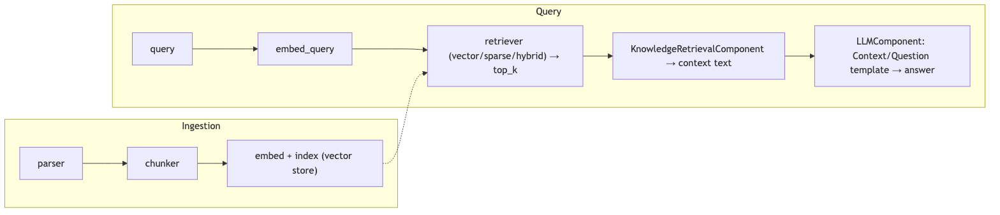

**Jiuwen.** Jiuwen builds this from composable pieces rather than a packaged app. During ingestion it parses files, chunks them, and an indexer computes embeddings and writes them to the vector store. At query time the knowledge base lazily creates a vector, sparse, or hybrid retriever (chosen by the index type), gets the top-k chunks, and a workflow component folds them into the prompt for the model. Reranking exists but is not wired into the default knowledge-base path.

<b>Jiuwen technical detail (classes &amp; functions)</b>

**Implementation**

Ingestion: `KnowledgeBase.parse_files` (parser), then `SimpleKnowledgeBase.add_documents` calls `chunker.chunk_documents`, builds an `IndexConfig`, and `Indexer.build_index` computes embeddings via `compute_chunk_embeddings` and writes them to the vector store. Query: `SimpleKnowledgeBase.retrieve` lazily instantiates `VectorRetriever`/`SparseRetriever`/`HybridRetriever` by `index_type`, embeds the query, and calls `vector_store.search`. The production end-to-end wiring is the workflow `KnowledgeRetrievalComponent`, which returns `results`/`context` (texts joined by `\n\n`); a downstream `LLMComponent` formats them (e.g. `Context:\n{{context}}\n\nQuestion: {{query}}`).

**Code anchors**

| Code anchor | What it points to |
|---|---|
| `agent-core/openjiuwen/core/retrieval/simple_knowledge_base.py:96` | chunk_documents; :110 build_index(chunks=..., embed_model=...); :182 delegate to retriever |
| `agent-core/openjiuwen/core/retrieval/indexing/indexer/embed_chunks.py:46/73` | embed_documents / embed_multimodal set chunk.embedding |
| `agent-core/openjiuwen/core/retrieval/retriever/vector_retriever.py:78` | embed_query → vector_store.search |
| `agent-core/openjiuwen/core/workflow/components/resource/knowledge_retrieval_comp.py:109` | retrieve_multi_kb_with_source(...); :243 joins texts into context |
| `agent-core/openjiuwen/core/workflow/components/llm/llm_comp.py:654` | template format feeding {{context}}/{{query}} |

**Canonical source**

`source/ai-engineer-technical-questions_for_engineers.md`

---

## 2. The pipeline: query embedding, vector search, context assembly, prompt construction, generation

**Title.** Pipeline stages

**Summary.** The same pipeline stage by stage: query embedding → vector search → context assembly → prompt construction → generation.

**Key points.**

- Embed the query with the same model used for the index.
- Vector search returns top-k candidate chunks.
- Assemble the hits into a context string and build the prompt.
- Generate the answer from that context.

**General.** Ingest: parse → chunk → embed → index. Query: embed the query → retrieve top-k (dense and/or sparse) → rerank → assemble the retrieved context into the prompt → generate → optionally cite. Each stage is separable; failures and quality drops can occur at any of them.

**Jiuwen.** Each stage is a distinct component: the query is embedded, a retriever performs the vector search over the store, the retrieval workflow component concatenates the hits into a context string, and the LLM component formats that context into the prompt and calls the model. The stages are swappable and can be instrumented independently.

<b>Jiuwen technical detail (classes &amp; functions)</b>

**Implementation**

Ingestion: `KnowledgeBase.parse_files` (parser), then `SimpleKnowledgeBase.add_documents` calls `chunker.chunk_documents`, builds an `IndexConfig`, and `Indexer.build_index` computes embeddings via `compute_chunk_embeddings` and writes them to the vector store. Query: `SimpleKnowledgeBase.retrieve` lazily instantiates `VectorRetriever`/`SparseRetriever`/`HybridRetriever` by `index_type`, embeds the query, and calls `vector_store.search`. The production end-to-end wiring is the workflow `KnowledgeRetrievalComponent`, which returns `results`/`context`; a downstream `LLMComponent` formats them into the prompt.

**Code anchors**

| Code anchor | What it points to |
|---|---|
| `agent-core/openjiuwen/core/retrieval/simple_knowledge_base.py:96` | chunk_documents; :110 build_index(...); :182 delegate to retriever |
| `agent-core/openjiuwen/core/retrieval/indexing/indexer/embed_chunks.py:46/73` | embed_documents / embed_multimodal |
| `agent-core/openjiuwen/core/retrieval/retriever/vector_retriever.py:78` | embed_query → vector_store.search |
| `agent-core/openjiuwen/core/workflow/components/resource/knowledge_retrieval_comp.py:109` | retrieve_multi_kb_with_source(...); :243 joins texts into context |
| `agent-core/openjiuwen/core/workflow/components/llm/llm_comp.py:654` | template format feeding {{context}}/{{query}} |

**Canonical source**

`source/rag-practical-interview-questions_for_engineers.md`

---

## 3. What is Modular RAG, and how is it different from a simple RAG pipeline

**Title.** Modular RAG

**Summary.** Simple RAG is a fixed chain; Modular RAG decomposes it into swappable modules (indexing, retrieval, fusion, reranking, query rewriting, generation) that can be routed and scheduled.

**Key points.**

- Simple RAG: retrieve → stuff → generate, fixed order.
- Modular RAG: interchangeable modules with routing/orchestration.
- Lets you add rewriting, reranking, or iteration per query.

**General.** A simple RAG pipeline is a fixed linear chain (retrieve → stuff → generate). Modular RAG decomposes it into interchangeable modules — indexing, retrieval, fusion, reranking, query rewriting, generation, orchestration — with routing and scheduling, so you can swap or add modules (rewrite, rerank, iterative/multi-hop retrieval) and branch conditionally per query. It is "RAG as a configurable graph of components" rather than one hardcoded path. The cost is more moving parts and the need for a router/orchestrator.

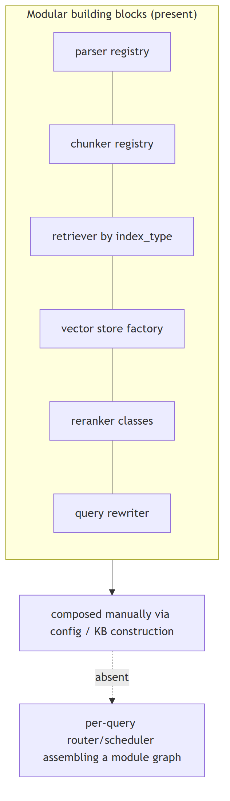

**Jiuwen.** Jiuwen has modular, pluggable building blocks — parsers self-register by file type, chunkers come from a registry, the retriever is chosen by index type, the vector store comes from a factory, rerankers and query rewriters are swappable classes, and an LLM-driven agentic retriever is toggled by config. But the modules are wired together manually via config and workflow components; there is no automatic router or scheduler deciding the module graph per query.

<b>Jiuwen technical detail (classes &amp; functions)</b>

**Implementation**

The building blocks are modular and pluggable: parsers self-register by extension, chunkers are selected from a registry, retrievers are chosen by `index_type`, the vector store comes from a factory, rerankers and query rewriters are swappable classes, and `RetrievalConfig.agentic` toggles the LLM-driven iterative retriever. But the modules are composed **manually** via config/KB construction — there is no per-query router/scheduler that assembles a module graph, and `AgenticRetriever` derives its mode from `index_type` rather than planning.

**Code anchors**

| Code anchor | What it points to |
|---|---|
| `agent-core/openjiuwen/core/retrieval/indexing/processor/parser/auto_file_parser.py:21` | parser registry by extension |
| `agent-core/openjiuwen/core/retrieval/indexing/processor/chunker/__init__.py:117` | chunker registry |
| `agent-core/openjiuwen/core/retrieval/simple_knowledge_base.py:141` | retriever selection by index_type; :172 agentic wrap toggle |
| `agent-core/openjiuwen/core/retrieval/vector_store/store.py:16` | vector store factory; agent-core/openjiuwen/core/retrieval/common/config.py:67 — StoreType |
| `agent-core/openjiuwen/core/retrieval/reranker/standard_reranker.py:23` | swappable reranker |
| `agent-core/openjiuwen/core/retrieval/query_rewriter/query_rewriter.py:412` | query rewriter module |
| `agent-core/openjiuwen/core/retrieval/common/config.py:51` | agentic toggle |

**Canonical source**

`source/rag-part1-interview-questions_for_engineers.md`

---

## 4. Deciding chunk size, and what breaks at each extreme

**Title.** Choosing chunk size

**Summary.** Too small loses context and splits answers; too large dilutes the embedding. Start at a few hundred tokens with modest overlap.

**Key points.**

- Small chunks: precise but may lack context or split the answer.
- Large chunks: richer context but a diluted, multi-topic embedding.
- Start ~a few hundred tokens with small overlap; tune by measuring.

**General.** Chunk size trades context against precision. Too small and each chunk lacks the context to answer (and the answer may be split across chunks); too large and a chunk covers many topics, diluting the embedding and wasting the prompt budget. Practical defaults are a few hundred tokens with modest overlap, then tune against a retrieval eval. Size is usually measured in tokens (what the model sees), not characters.

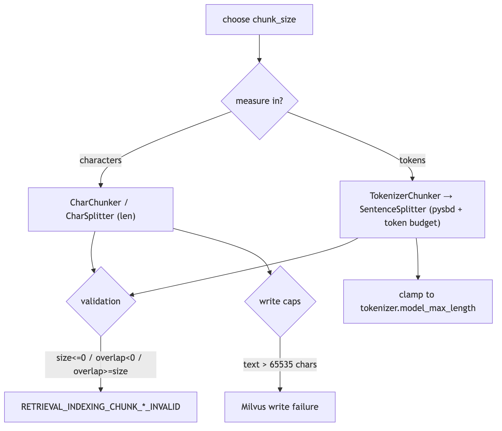

**Jiuwen.** Jiuwen defaults chunk_size to 512 with chunk_overlap 50, measured in characters (char chunker) or tokens (tokenizer chunker). It validates size/overlap, clamps token chunks to the tokenizer limit, and rejects Milvus writes above 65535 characters — but there is no feedback loop telling you a size was a bad choice, so you tune it yourself and evaluate externally.

<b>Jiuwen technical detail (classes &amp; functions)</b>

**Implementation**

`Chunker.__init__` defaults `chunk_size=512`, `chunk_overlap=50`, `length_function=len`. Size is measured in characters (`CharChunker` → `CharSplitter`, `len()`) or tokens (`TokenizerChunker` → `IndexSentenceSplitter` → `SentenceSplitter`, tokenizer length). Hard validation rejects `chunk_size<=0`, `chunk_overlap<0`, and `chunk_overlap>=chunk_size`. Token-based chunk size is silently clamped to the embedding tokenizer's `model_max_length` (`_resolve_chunk_size`), and DB caps fail at write time (Milvus text field `max_length=65535`, pgvector dims ≤2000).

**Code anchors**

| Code anchor | What it points to |
|---|---|
| `agent-core/openjiuwen/core/retrieval/indexing/processor/chunker/base.py:36` | defaults chunk_size=512, chunk_overlap=50; :59/64/69 validation raises |
| `agent-core/openjiuwen/core/retrieval/common/config.py:34` | KnowledgeBaseConfig.chunk_size/chunk_overlap |
| `agent-core/openjiuwen/core/retrieval/indexing/processor/chunker/text_splitter.py:15` | DEFAULT_CHUNK_SIZE=200; :198 _resolve_chunk_size clamps to tokenizer.model_max_length |
| `agent-core/openjiuwen/core/retrieval/indexing/processor/chunker/chunking.py:82` | get_chunker auto-lowers size to tokenizer max |
| `agent-core/openjiuwen/core/retrieval/indexing/indexer/milvus_indexer.py:375` | text field max_length=65535 |
| `agent-core/openjiuwen/core/retrieval/vector_store/pg_store.py:176` | pgvector rejects dim > 2000 |

**Canonical source**

`source/rag-retrieval-interview-questions_for_engineers.md`

---

## 5. What happens if your chunks are too small or too large

**Title.** Chunks too small or too large

**Summary.** Too small: the answer splits and the answer-bearing chunk can be missed. Too large: the embedding blends topics, precision drops, and prompt cost rises.

**Key points.**

- Small: context lost, answer split, more index overhead.
- Large: embedding averages topics, precision down, prompt budget wasted.
- The code guards mechanics (invalid values, limits), not retrieval quality.

**General.** Too small: each chunk lacks the context to answer, the answer gets split across chunks, and recall of the *answer-bearing* chunk drops while index size/overhead grows. Too large: the embedding averages multiple topics so relevance dilutes, retrieval precision drops, and each hit wastes prompt tokens; it can also exceed the embedding model's max sequence length and get truncated. Both extremes lower end-to-end quality, for opposite reasons.

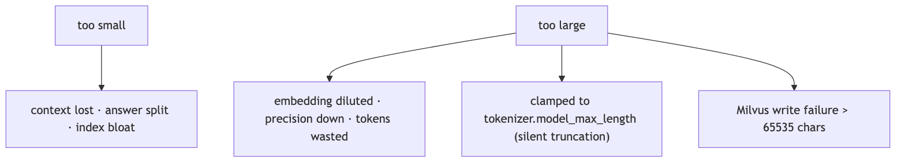

**Jiuwen.** The code only guards the mechanics: it rejects non-positive sizes and overlap greater than or equal to size, token chunkers silently clamp to the tokenizer max, and Milvus rejects writes over 65535 characters. What it does not do is tell you whether a chunk size hurt retrieval quality — there is no quality feedback loop, so you must measure that yourself.

<b>Jiuwen technical detail (classes &amp; functions)</b>

**Implementation**

The code guards the mechanics but not the quality: construction rejects `chunk_size <= 0` / `chunk_overlap >= chunk_size`, token chunkers clamp size to the tokenizer max (so oversized chunks are silently truncated to the model limit), and Milvus fails the write above 65535 chars. There is no retrieval-quality feedback loop to tell you a size choice was bad.

**Code anchors**

| Code anchor | What it points to |
|---|---|
| `agent-core/openjiuwen/core/retrieval/indexing/processor/chunker/base.py:59/64/69` | validation raises |
| `agent-core/openjiuwen/core/retrieval/indexing/processor/chunker/text_splitter.py:198` | _resolve_chunk_size clamps to model_max_length |
| `agent-core/openjiuwen/core/retrieval/indexing/processor/chunker/chunking.py:82` | tokenizer-limit auto-adjust |
| `agent-core/openjiuwen/core/retrieval/indexing/indexer/milvus_indexer.py:378` | text max_length=65535 |

**Canonical source**

`source/rag-part1-interview-questions_for_engineers.md`

---

## 6. Fixed-size vs. semantic chunking, the actual retrieval tradeoff

**Title.** Fixed-size vs semantic chunking

**Summary.** Fixed-size is cheap and deterministic but cuts mid-sentence; structure/sentence-aware chunking keeps chunks coherent at the cost of variable size and extra processing.

**Key points.**

- Fixed-size: deterministic and cheap, but fragments mid-sentence/mid-table.
- Semantic/structure-aware: split on real boundaries; coherent, variable size.
- Best: sentence/structure-aware with a cap, not raw character windows.

**General.** Fixed-size chunking is deterministic and cheap but cuts mid-sentence or mid-table, producing fragments that embed poorly. Semantic / structure-aware chunking splits on natural boundaries (sentences, paragraphs, headings, records) so each chunk is coherent, at the cost of variable size and extra processing. Sentence-window and recursive-delimiter strategies sit between the two.

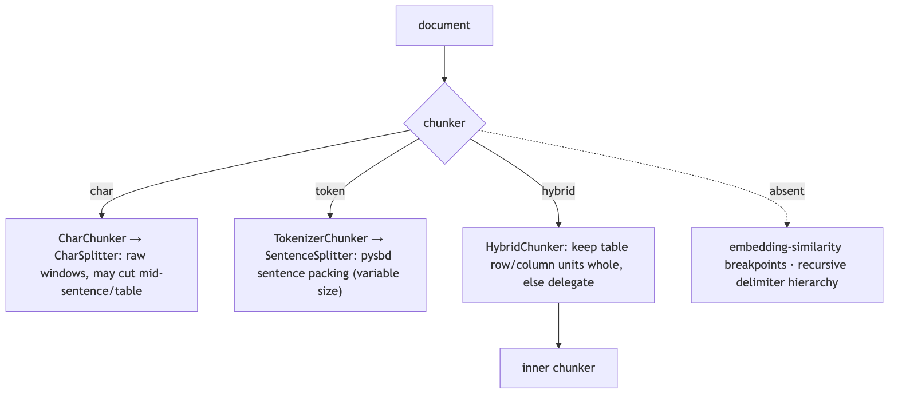

**Jiuwen.** Jiuwen's truly fixed-size chunker is the char chunker (raw character windows). Its token chunker is actually sentence-aware: it uses a sentence segmenter to pack whole sentences up to a token budget and sub-splits over-long ones. The hybrid chunker is a structural guard that keeps table rows/columns whole, not a semantic splitter. So structure awareness lives at parse time and in the sentence/structural chunkers, not in a generic semantic model.

<b>Jiuwen technical detail (classes &amp; functions)</b>

**Implementation**

True fixed-size is `CharChunker` (raw character windows via `CharSplitter`). Token-based `TokenizerChunker` is actually sentence-boundary-aware: `SentenceSplitter` uses `pysbd` to segment and packs whole sentences up to a token budget, sub-splitting overly long sentences. `HybridChunker` is a structural guard, not a semantic splitter — it keeps `source_type in ("row","column")` units whole and delegates the rest. There is no embedding-similarity breakpoint chunker and no recursive delimiter hierarchy; `splitter_config` is normalized but never forwarded to `SentenceSplitter` (an inert stub).

**Code anchors**

| Code anchor | What it points to |
|---|---|
| `agent-core/openjiuwen/core/retrieval/indexing/processor/chunker/char_chunker.py:12` | CharChunker "fixed size based on character length"; :47 builds CharSplitter |
| `agent-core/openjiuwen/core/retrieval/indexing/processor/chunker/text_splitter.py:47` | CharSplitter.split slices text[start:end] |
| `agent-core/openjiuwen/core/retrieval/indexing/processor/chunker/tokenizer_chunker.py:17` | TokenizerChunker builds IndexSentenceSplitter |
| `agent-core/openjiuwen/core/retrieval/indexing/processor/splitter/splitter.py:92` | SentenceSplitter.__call__ (pysbd); :142 _sentences_with_spans; :173 long-sentence sub-split |
| `agent-core/openjiuwen/core/retrieval/indexing/processor/chunker/hybrid_chunker.py:19` | HybridChunker no-split predicate; :66 delegation |
| `agent-core/openjiuwen/core/retrieval/indexing/processor/chunker/__init__.py:117` | only "char"/"hybrid" registered |
| `agent-core/openjiuwen/core/retrieval/indexing/processor/chunker/text_splitter.py:98` | splitter_config normalized but not forwarded |

**Canonical source**

`source/rag-retrieval-interview-questions_for_engineers.md`

---

## 7. Overlapping vs. non-overlapping chunks

**Title.** Chunk overlap

**Summary.** A small overlap preserves meaning across a boundary; too much duplicates content, inflates the index, and returns near-identical hits.

**Key points.**

- Overlap keeps boundary-spanning answers retrievable.
- Too much overlap duplicates text and crowds out diverse hits.
- Non-overlapping is cheaper but risks losing the boundary fact.

**General.** A small overlap preserves context that straddles a boundary, improving recall for answers that span a cut; too much overlap duplicates content, inflates the index, and can return near-identical hits that crowd out diverse results. Non-overlapping is cheaper and deduplicated but risks losing boundary context.

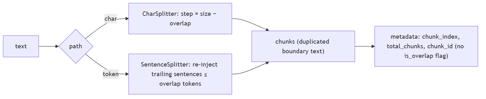

**Jiuwen.** Overlap is a first-class setting (default 50). The char chunker uses a strided sliding window; the sentence/token chunker re-injects whole trailing sentences up to the overlap budget, so overlap happens on sentence boundaries. The overlapped text is duplicated across chunks rather than deduplicated, so keep it modest.

<b>Jiuwen technical detail (classes &amp; functions)</b>

**Implementation**

Overlap is a first-class `chunk_overlap` integer (default 50) enforced on both paths. `CharSplitter` does a strided sliding window (`step = chunk_size - chunk_overlap`). `SentenceSplitter` re-injects a suffix of whole sentences from the previous buffer up to the overlap token budget, so token chunks overlap on sentence boundaries. Overlap content is duplicated text across chunks, and chunk IDs are fresh UUIDs each run, so downstream indexing cannot distinguish overlap content.

**Code anchors**

| Code anchor | What it points to |
|---|---|
| `agent-core/openjiuwen/core/retrieval/indexing/processor/chunker/base.py:39` | chunk_overlap: int = 50; :69 overlap >= chunk_size raises; :106 overlap not carried into metadata |
| `agent-core/openjiuwen/core/retrieval/indexing/processor/chunker/text_splitter.py:41` | overlap clamped to [0, size-1]; :54 step = chunk_size - chunk_overlap; :56 slicing loop; :110 token path default chunk_size // 5 |
| `agent-core/openjiuwen/core/retrieval/indexing/processor/splitter/splitter.py:215` | _flush re-injects trailing sentences ≤ overlap; :186 long-segment window step |

**Canonical source**

`source/rag-retrieval-interview-questions_for_engineers.md`

---

## 8. Chunking structured content like tables, code, or nested headings without losing structure

**Title.** Chunking tables, code, headings

**Summary.** Capture structure at parse time and carry it as metadata — keep tables intact (row/column), preserve code boundaries, and split on headings.

**Key points.**

- Preserve structure at parse time, not chunk time.
- Tables: keep rows/columns whole or serialize per record.
- Code: split on function/class boundaries and keep fences.
- Headings: use them as split boundaries.

**General.** Structure should be captured at parse time and carried as metadata, not thrown away before chunking. Tables should stay intact or be serialized (row/column/record), code should be split on function/class boundaries with fences preserved, and nested headings should be used as split boundaries with the heading path attached to each chunk. A generic text chunker over flattened content loses all of this.

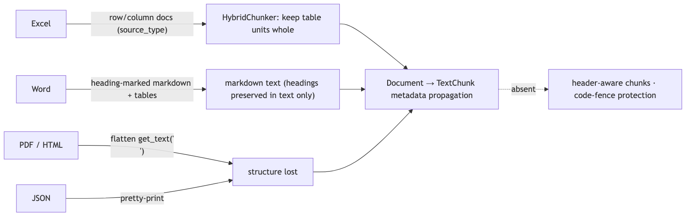

**Jiuwen.** Jiuwen preserves structure at parse time: spreadsheets emit one document per row and per column tagged with a source type, and the hybrid chunker keeps those units atomic; Word becomes heading-marked Markdown and Markdown tables. PDF and HTML flatten to text, and JSON is pretty-printed, so those lose structure. There is no code-aware or function-boundary chunker; metadata like sheet and row is carried on the chunk but not used to split code or tables beyond the row/column rule.

<b>Jiuwen technical detail (classes &amp; functions)</b>

**Implementation**

Structure is preserved at parse time, not chunk time. Excel emits one `Document` per data row and per column tagged `source_type` (`row`/`column`), and `HybridChunker` keeps those as atomic chunks. Word emits heading-marked Markdown (`#`, `##`, …) and Markdown tables. PDF/HTML flatten to newline-joined text; JSON is pretty-printed. Metadata (`source_type`, `sheet_name`, `row_index`, `column_name`, `image_path`, `title`) is propagated from `Document` to `TextChunk` by the chunker base. There is no Markdown-header-aware chunker, so `##` sections can still be split mid-section, and HTML heading tags are discarded before chunking.

**Code anchors**

| Code anchor | What it points to |
|---|---|
| `agent-core/openjiuwen/core/retrieval/indexing/processor/parser/excel_parser.py:32` | _rows_to_documents; :69 source_type: "row"; :96 source_type: "column" |
| `agent-core/openjiuwen/core/retrieval/indexing/processor/parser/word_parser.py:23` | _table_to_markdown; :37 _paragraph_to_markdown (Heading N → N+1 hashes) |
| `agent-core/openjiuwen/core/retrieval/indexing/processor/chunker/hybrid_chunker.py:19` | keeps row/column units as one chunk |
| `agent-core/openjiuwen/core/retrieval/indexing/processor/parser/html_file_parser.py:78` | _get_text_from_soup flattens |
| `agent-core/openjiuwen/core/retrieval/indexing/processor/parser/txt_md_parser.py:40` | Markdown read verbatim |
| `agent-core/openjiuwen/core/retrieval/indexing/processor/chunker/base.py:106` | metadata copied onto every TextChunk |

**Canonical source**

`source/rag-retrieval-interview-questions_for_engineers.md`

---

## 9. Context relevant but answer vague: chunk boundaries likely cut the answer mid context

**Title.** Answer cut across chunks

**Summary.** If the answer spans a boundary, the retrieved chunk holds only half of it. Fix with overlap, sentence/structure-aware splitting, and neighbor expansion at serve time.

**Key points.**

- Boundary cuts produce half-answers that still rank.
- Overlap + sentence/structure-aware chunking reduce it.
- At serve time, expand a hit with its neighbors.

**General.** If the answer spans a chunk boundary, the chunk that ranks may contain only half of it, so the model sees an incomplete fact. Remedies: overlap chunks, split on sentence/structure boundaries rather than fixed characters, and at serve time expand a hit with its neighbors. Sentence-aware chunking with overlap is the common fix; fixed-character splitting is the usual culprit.

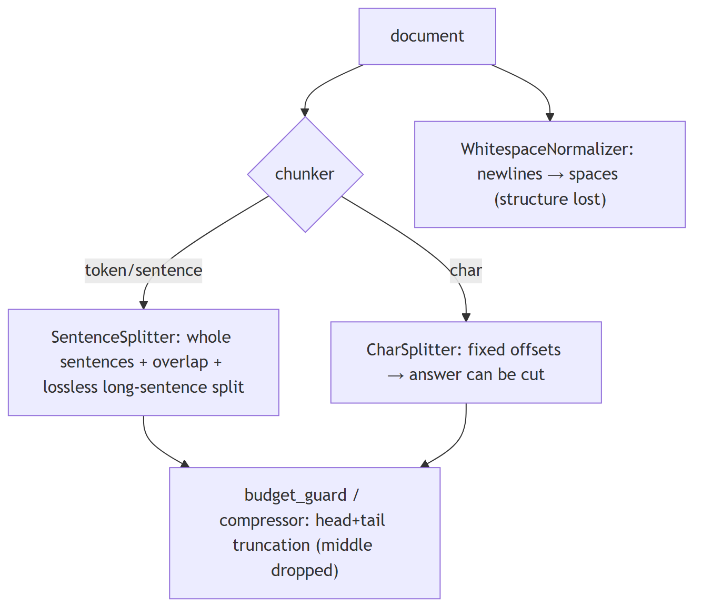

**Jiuwen.** Protection is inconsistent: the sentence chunker builds from whole sentences, carries trailing sentences for overlap, and splits over-long sentences losslessly; the hybrid chunker keeps table rows/columns whole. But the char chunker hard-cuts at fixed offsets and a whitespace normalizer can collapse newlines first. There is no serve-time neighbor expansion, so a boundary-cut chunk can be all the model sees.

<b>Jiuwen technical detail (classes &amp; functions)</b>

**Implementation**

Protection is inconsistent by chunker. `SentenceSplitter` builds chunks from whole `pysbd` sentences, carries trailing sentences into the next chunk for overlap, and sub-splits over-long sentences losslessly; `HybridChunker` keeps table rows/columns whole. But `CharChunker`/`CharSplitter` (whose `chunk_unit="char"` default sets the unit) hard-cut at fixed offsets, `WhitespaceNormalizer` collapses newlines and destroys paragraph structure before splitting, and downstream `budget_guard`/`round_level_compressor` truncate head/tail (dropping the middle) rather than extracting the answer span.

**Code anchors**

| Code anchor | What it points to |
|---|---|
| `agent-core/openjiuwen/core/retrieval/indexing/processor/splitter/splitter.py:119` | long-sentence sub-split; :142 _sentences_with_spans; :210 _flush overlap |
| `agent-core/openjiuwen/core/retrieval/indexing/processor/chunker/hybrid_chunker.py:19` | keep row/column units whole |
| `agent-core/openjiuwen/core/retrieval/indexing/processor/chunker/text_splitter.py:56` | CharSplitter fixed offsets |
| `agent-core/openjiuwen/core/retrieval/indexing/processor/chunker/text_preprocessor.py:53` | WhitespaceNormalizer |
| `agent-core/openjiuwen/core/context_engine/processor/budget_guard.py:118` | head/tail truncation; agent-core/openjiuwen/core/context_engine/processor/compressor/round_level_compressor.py:1088 — _build_head_tail_truncated_text |

**Canonical source**

`source/rag-practical-interview-questions_for_engineers.md`

---

## 10. Picking an embedding model, and whether bigger always means better retrieval

**Title.** Choosing an embedding model

**Summary.** Bigger isn't automatically better: fit to domain and language, use the right query/passage prefixes, pick an affordable dimension, and weigh latency/cost.

**Key points.**

- Domain + language fit beats raw size.
- Asymmetric models need correct query/passage prefixes.
- Dimension drives storage/latency; a smaller in-domain model can win.
- Evaluate recall on your data, not a leaderboard.

**General.** Bigger is not automatically better: retrieval quality depends on domain fit, the language, whether the model is asymmetric (query vs passage prefixes), the dimension you can afford, and latency/cost. A smaller in-domain model often beats a large general one, and dimensionality reduction (Matryoshka) can trade a little recall for large storage savings. The right way to pick is to measure recall on your own data, not to read a leaderboard.

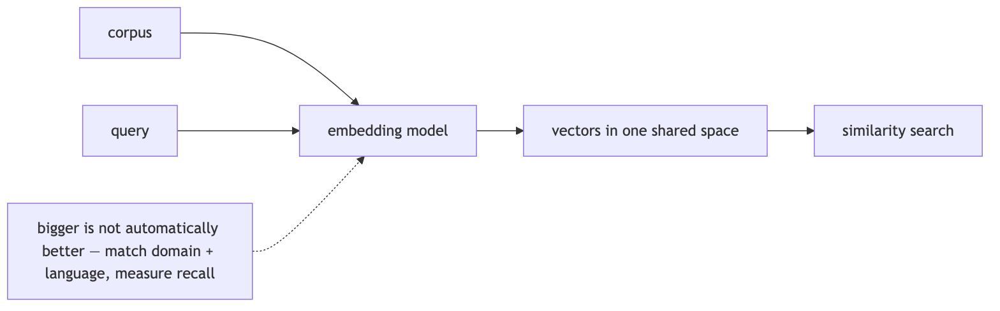

**Jiuwen.** Jiuwen exposes an embedding interface that supports embedding queries, embedding documents, and reporting a vector dimension; the config only carries model name, base URL, and API key, with providers for OpenAI-compatible, vLLM (which adds a multimodal instruction), and Dashscope. Dimension is discovered from the first response rather than declared, and there is no model-selection helper or benchmark — you choose the model and validate it yourself.

<b>Jiuwen technical detail (classes &amp; functions)</b>

**Implementation**

An `Embedding` ABC defines `embed_query`, `embed_documents`, and a `dimension` property; `EmbeddingConfig` carries only `model_name`/`base_url`/`api_key`. Providers are `APIEmbedding` (generic HTTP), `OpenAIEmbedding` (OpenAI-compatible), `VLLMEmbedding` (extends OpenAI, adds multimodal `instruction`), and `DashscopeEmbedding`. Dimension is discovered lazily from the first response or set explicitly for Matryoshka models. Batching is provider-level (`max_batch_size=8`, `max_concurrent=50`). Model choice is entirely caller-driven — there is no model registry, benchmark, or size heuristic.

**Code anchors**

| Code anchor | What it points to |
|---|---|
| `agent-core/openjiuwen/core/foundation/store/base_embedding.py:16` | EmbeddingConfig; :24 Embedding ABC; :29 embed_query |
| `agent-core/openjiuwen/core/retrieval/embedding/openai_embedding.py:67` | Matryoshka dimension |
| `agent-core/openjiuwen/core/retrieval/embedding/dashscope_embedding.py:105` | Dashscope dimension |
| `agent-core/openjiuwen/core/retrieval/embedding/api_embedding.py:45` | max_batch_size=8; :46 max_concurrent=50; :175 batch splitting/concurrency |
| `agent-core/openjiuwen/core/retrieval/embedding/vllm_embedding.py:17` | VLLMEmbedding |

**Implementation diagram**

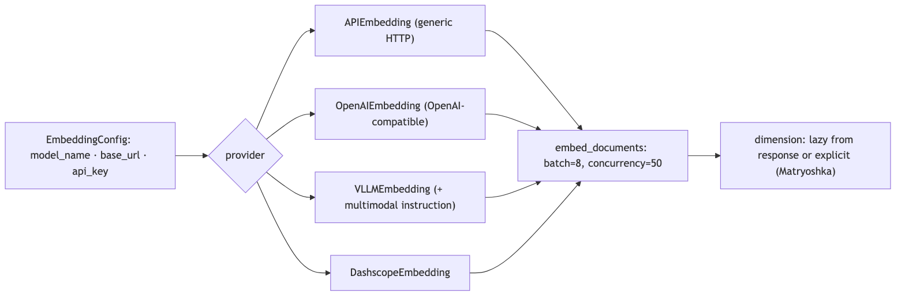

**Canonical source**

`source/rag-retrieval-interview-questions_for_engineers.md`

---

## 11. Should queries and documents use the same embedding model

**Title.** Same embedding model for query & docs

**Summary.** Yes — both sides must use the same model, and asymmetric models need the correct role prefix on each side, or the vectors aren't comparable.

**Key points.**

- One model embeds both queries and documents.
- Asymmetric models: apply query vs passage prefixes.
- Mixing models or dropping prefixes degrades retrieval.

**General.** Yes — queries and documents must be embedded by the same model, and for asymmetric models you must also apply the correct role prefix (e.g. `query:` vs `passage:`) to each side. Mixing models produces incomparable vectors; dropping the role prefix on an instruction-tuned model measurably degrades retrieval.

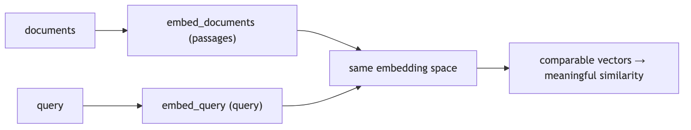

**Jiuwen.** In Jiuwen the knowledge base holds one embedding model instance and passes it to both the indexer (documents) and the retriever (queries), so both sides use the same model. Query embedding calls the query path and document embedding calls the document path; for one provider the query path literally reuses the document call. There is no enforced query-vs-passage prefix split, so with an instruction-tuned model you must ensure prefixes are applied consistently yourself.

<b>Jiuwen technical detail (classes &amp; functions)</b>

**Implementation**

In the KB pipeline they do: one `embed_model` instance is held on the KB, passed to `build_index` for documents and to the constructed `VectorRetriever`/`HybridRetriever` for queries. Query embedding uses `embed_query`; document embedding uses `embed_documents`. For Dashscope, `embed_query` literally calls `embed_documents([text])` (the OpenAI-compatible client calls the same shared embedding method directly), so there is no query-vs-passage prefix distinction. Only `VLLMEmbedding.embed_multimodal` supports an `instruction`. Nothing validates that the retriever's model matches the indexer's (only dimension is indirectly constrained by the collection schema).

**Code anchors**

| Code anchor | What it points to |
|---|---|
| `agent-core/openjiuwen/core/retrieval/retriever/vector_retriever.py:78` | query embed_query |
| `agent-core/openjiuwen/core/retrieval/indexing/indexer/embed_chunks.py:46` | docs embed_documents |
| `agent-core/openjiuwen/core/retrieval/simple_knowledge_base.py:110` | index build uses self.embed_model; :144 VectorRetriever(embed_model=...); :157 HybridRetriever(embed_model=...) |
| `agent-core/openjiuwen/core/retrieval/knowledge_base.py:34` | single embed_model field |
| `agent-core/openjiuwen/core/retrieval/embedding/dashscope_embedding.py:124` | embed_query delegates to embed_documents |
| `agent-core/openjiuwen/core/retrieval/embedding/vllm_embedding.py:25` | instruction only for multimodal |

**Implementation diagram**

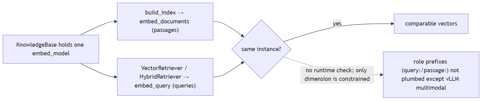

**Canonical source**

`source/rag-retrieval-interview-questions_for_engineers.md`

---

## 12. Why swapping embedding models forces a full re-embedding of the corpus

**Title.** Re-embedding after model swap

**Summary.** Stored vectors belong to one model; a new model — even at the same dimension — is a different space, so every chunk must be re-embedded and the index rebuilt.

**Key points.**

- Vectors from different models aren't comparable.
- Same dimension does not mean same space.
- Re-embed the whole corpus and rebuild the index.

**General.** Stored vectors are the output of one specific model. A different model — even at the same dimension — projects into a different space, so old and new vectors are not comparable; distance computations become meaningless. You must re-embed every chunk (and often rebuild the index, since the vector width may change too). Good systems persist a model fingerprint/version with the index so a mismatch is detected rather than silently corrupted.

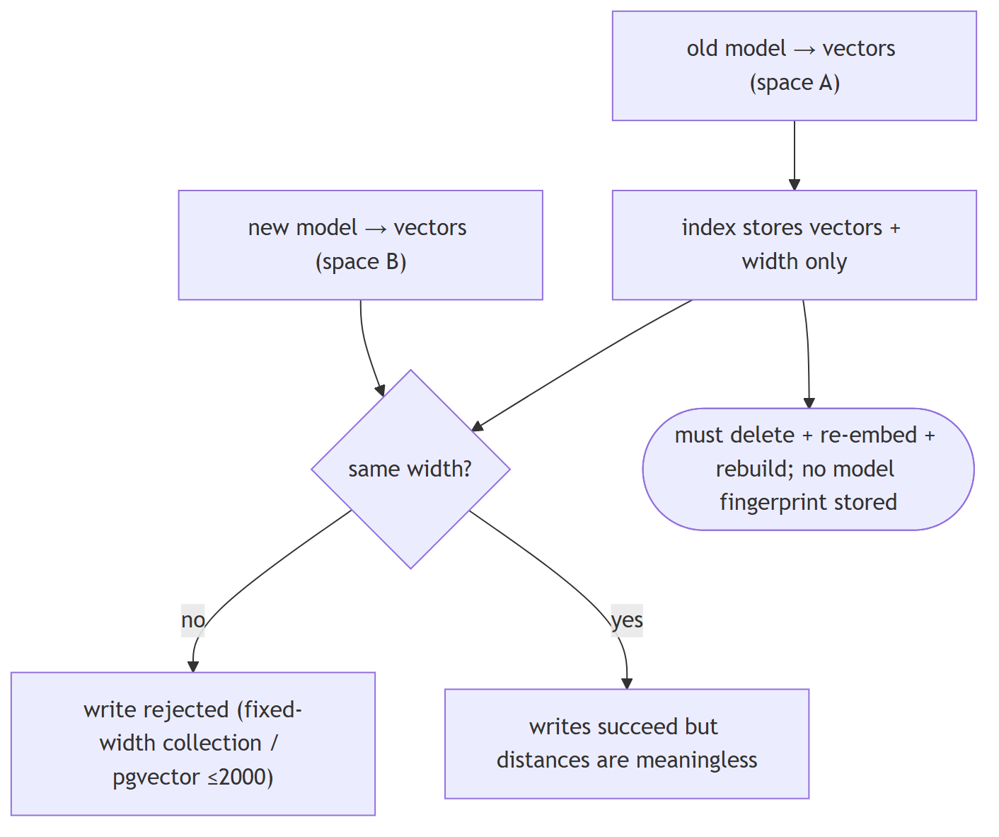

**Jiuwen.** Embeddings are computed at index time and stored on each chunk; the vector store takes only the dimension from the embedding model and does not persist the model identity. So there is no fingerprint to detect a mismatch — swapping models silently makes old and new vectors incomparable, and the correct action is to re-embed every chunk and rebuild the index.

<b>Jiuwen technical detail (classes &amp; functions)</b>

**Implementation**

At index time `compute_chunk_embeddings` calls `embed_model.embed_documents` and mutates `chunk.embedding` in place; indexers trigger it only for `vector`/`hybrid` index types. Milvus derives the collection vector `dim` from `embed_model.dimension` at schema creation and stores only the width — the model identity/name is **not persisted**. `update_index` deletes a doc's rows and rebuilds (re-embeds). Dimension is a hard constraint: Milvus/Chroma collections and pgvector tables are fixed-width (pgvector rejects >2000). So a model swap means a manual full re-index; there is only a low-level dimension-update migration operation with an optional re-embed callback.

**Code anchors**

| Code anchor | What it points to |
|---|---|
| `agent-core/openjiuwen/core/retrieval/indexing/indexer/embed_chunks.py:21` | compute_chunk_embeddings; :46 embed_documents sets vectors |
| `agent-core/openjiuwen/core/retrieval/indexing/indexer/milvus_indexer.py:156` | embedding only for vector/hybrid; :409 dimension = embed_model.dimension; :427 schema stores dim but no model name; :209 update_index = delete + rebuild |
| `agent-core/openjiuwen/core/retrieval/graph_knowledge_base.py:294` | update_documents delete + re-add |
| `agent-core/openjiuwen/core/retrieval/vector_store/pg_store.py:129` | fixed pgvector table definition |
| `agent-core/openjiuwen/core/foundation/store/vector/utils.py:264` | UpdateEmbeddingDimensionOperation |

**Canonical source**

`source/rag-retrieval-interview-questions_for_engineers.md`

---

## 13. Multilingual documents: multilingual embedding models, translate at query or index time

**Title.** Multilingual retrieval

**Summary.** Use a multilingual/alignment embedding so queries and docs share one space; otherwise translate at index or query time and store language metadata.

**Key points.**

- Prefer a multilingual/alignment embedding model.
- Otherwise translate at index or query time.
- Store language metadata to route and evaluate per language.

**General.** Use a multilingual/alignment embedding model so queries and documents land in one space; if no good multilingual model exists for a language, translate either at index time (normalize the corpus) or query time (translate the query), and store language metadata so you can route and evaluate per language. Cross-lingual rerankers help at the top.

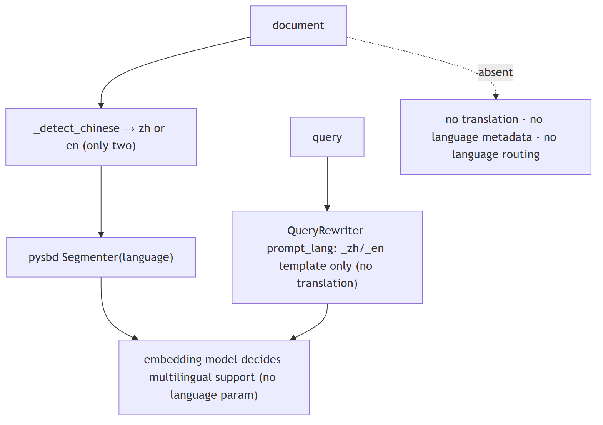

**Jiuwen.** Jiuwen is effectively bilingual (Chinese/English) at the processing layer and does not translate: the sentence splitter guesses the language from a character-ratio heuristic for the segmenter, and the query rewriter only picks a Chinese or English prompt template. Embedding clients expose no language parameter, so multilingual support exists only if you choose a multilingual model yourself; no language metadata is stored and there is no routing.

<b>Jiuwen technical detail (classes &amp; functions)</b>

**Implementation**

Effectively bilingual zh/en at the processing layer, with no translation. `SentenceSplitter` resolves `lan` via a Chinese-character-ratio heuristic (→ zh or en) for `pysbd`; explicit codes are passed through (documented in the splitter docstrings). The query rewriter's `prompt_lang` only picks a `_zh.md`/`_en.md` template and never translates. Embedding clients expose no language parameter — multilingual support exists only if the operator picks a multilingual embedding model. No language metadata is persisted and there is no language routing.

**Code anchors**

| Code anchor | What it points to |
|---|---|
| `agent-core/openjiuwen/core/retrieval/indexing/processor/splitter/splitter.py:17` | lan: str = "auto"; :46 _detect_chinese(threshold=0.1); :105 builds Segmenter(language=...) |
| `agent-core/openjiuwen/core/retrieval/indexing/processor/chunker/text_splitter.py:81` | IndexSentenceSplitter(language="auto") |
| `agent-core/openjiuwen/core/retrieval/indexing/processor/chunker/tokenizer_chunker.py:25` | language="auto" |
| `agent-core/openjiuwen/core/retrieval/query_rewriter/query_rewriter.py:228` | prompt_lang: str = "zh"; :309 template selection |
| `agent-core/openjiuwen/core/retrieval/embedding/openai_embedding.py:140` | no language field; agent-core/openjiuwen/core/retrieval/embedding/dashscope_embedding.py:37 — multimodal, not multilingual |

**Canonical source**

`source/rag-practical-interview-questions_for_engineers.md`

---

## 14. Handling multiple document types and formats in the same system

**Title.** Multiple document formats

**Summary.** Normalize everything to one record shape (text + metadata + id) at ingestion, with a parser per format behind a registry keyed by type, preserving format-specific structure as metadata.

**Key points.**

- One record shape: text + metadata + id.
- Parser per format behind a registry.
- Keep format-specific structure as metadata.

**General.** Normalize everything to one record shape (text + metadata + id) at ingestion, with a parser per format behind a registry keyed by MIME/extension, and preserve format-specific structure as metadata. Chunking and indexing then operate on the uniform record. The risks are silent format gaps (a parser that drops structure) and mixed semantics (tables vs prose) needing different chunk policies.

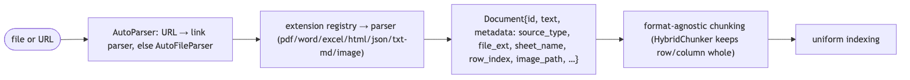

**Jiuwen.** Format dispatch is an extension-keyed parser registry loaded lazily, and each parser returns documents with a common text-plus-metadata shape. Registered types cover plain text and Markdown, PDF, Word, spreadsheets and CSV, HTML, JSON, and images, so everything is normalized before chunking and indexing.

<b>Jiuwen technical detail (classes &amp; functions)</b>

**Implementation**

Format dispatch is an extension-keyed plugin registry loaded lazily by `AutoFileParser._ensure_parsers_loaded`; each parser returns `Document` objects with a common text+metadata shape. Registered extensions cover `.txt/.md/.markdown`, `.pdf`, `.docx`, `.xlsx/.csv/.tsv`, `.htm/.html`, `.json`, and `.png/.jpg/.jpeg/.webp/.gif/.jfif`; `AutoParser` adds URL routing (WeChat vs generic web). `source_type` (`row`/`column`/`web_page`/`wechat_article`) and `image_path` distinguish semantics. Downstream chunking/indexing is format-agnostic. Word/PDF/JSON/TXT parsers set no `source_type` (only `file_ext`), and there is no per-format chunking policy beyond `HybridChunker`'s row/column predicate.

**Code anchors**

| Code anchor | What it points to |
|---|---|
| `agent-core/openjiuwen/core/retrieval/indexing/processor/parser/auto_parser.py:23` | AutoParser URL vs file routing; :48 parse |
| `agent-core/openjiuwen/core/retrieval/indexing/processor/parser/auto_file_parser.py:24` | @register_parser(file_extensions) registry; :98 extension dispatch; :121 enriches doc_id/title/file_path/file_ext |
| `agent-core/openjiuwen/core/retrieval/indexing/processor/parser/txt_md_parser.py:14` | .txt/.md/.markdown; agent-core/openjiuwen/core/retrieval/indexing/processor/parser/pdf_parser.py:16 .pdf; agent-core/openjiuwen/core/retrieval/indexing/processor/parser/word_parser.py:63 .docx; agent-core/openjiuwen/core/retrieval/indexing/processor/parser/excel_parser.py:131 .xlsx/.csv/.tsv; agent-core/openjiuwen/core/retrieval/indexing/processor/parser/html_file_parser.py:89 .htm/.html; agent-core/openjiuwen/core/retrieval/indexing/processor/parser/json_parser.py:15 .json; agent-core/openjiuwen/core/retrieval/indexing/processor/parser/image_parser.py:15 images |
| `agent-core/openjiuwen/core/foundation/store/base_reranker.py:29` | uniform Document{id_, text, metadata} |
| `agent-core/openjiuwen/core/retrieval/indexing/processor/chunker/base.py:91` | chunk_documents uniform conversion |

**Canonical source**

`source/rag-retrieval-interview-questions_for_engineers.md`

---

## 15. RAG vs. pasting retrieved text into a long-context prompt

**Title.** RAG vs pasting a long context

**Summary.** Pasting whole documents is simpler and avoids chunking errors but is expensive, slow, and noisy; retrieval pays a one-time chunking/index cost and sends only relevant, citable chunks.

**Key points.**

- Paste: simple, no chunking bugs, but costly/slow/noisy.
- RAG: cheaper per call, citable, scales past the window.
- Choose by cost, latency, and need to cite.

**General.** With a large context window you can skip retrieval and paste whole documents. That is simpler and avoids chunking errors, but it is expensive (you pay for every token every call), slow (TTFT grows with context), noisy (irrelevant text dilutes attention), and limited to what fits. RAG pays a one-time indexing cost and per-query retrieval, keeps the prompt small, and scales to corpora far larger than any window. The trade is a retrieval system and its failure modes for token efficiency and scale.

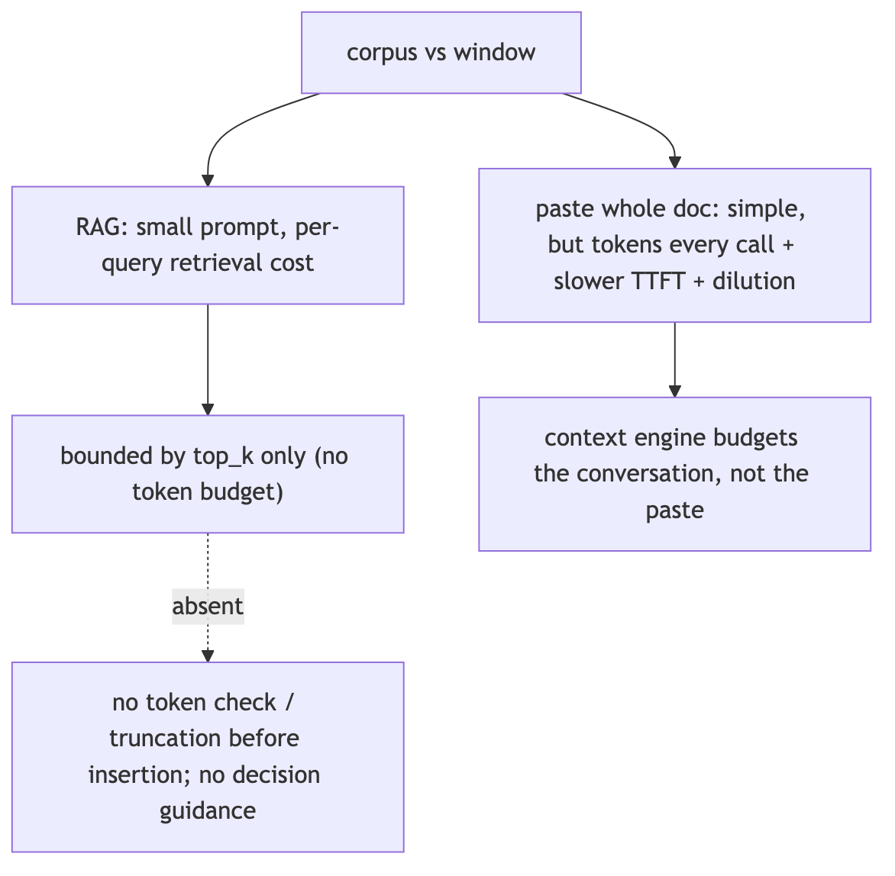

**Jiuwen.** The knowledge base is not budgeted against the model window: the retrieval component simply concatenates result texts into a context string, bounded only by top_k — there is no token count, truncation, or window check before insertion. The context engine has real budgeting primitives, but the RAG assembly path does not use them.

<b>Jiuwen technical detail (classes &amp; functions)</b>

**Implementation**

The KB is not budgeted against the model window. `KnowledgeRetrievalExecutable._format_output` simply concatenates result texts with `"\n\n"` into a `context` string — the only bound is `top_k`; there is no token count, truncation, or window check before insertion. The context engine has real budgeting primitives (`context_window_tokens`, `effective_context_budget`, `ContextWindowUsage.occupancy_rate`, `FullCompactProcessor` at 180k), but those apply to the *conversation*, and retrieved text enters as ordinary messages measured only after the fact. There is no comparison or decision guidance for "retrieve top-k" vs. "paste whole document".

**Code anchors**

| Code anchor | What it points to |
|---|---|
| `agent-core/openjiuwen/core/workflow/components/resource/knowledge_retrieval_comp.py:241` | _format_output joins r.text with "\n\n", unbounded; :109 bounded only by top_k |
| `agent-core/openjiuwen/core/context_engine/schema/config.py:136` | context_window_tokens; :131 max_context_message_num; :139 model_context_window_tokens |
| `agent-core/openjiuwen/core/context_engine/processor/budget_guard.py:37` | effective_context_budget (strictest positive) |
| `agent-core/openjiuwen/core/context_engine/usage/models.py:45` | ContextWindowUsage.limit_tokens / occupancy_rate |
| `agent-core/openjiuwen/core/context_engine/processor/compressor/full_compact_processor.py:184` | 180k compaction threshold |

**Canonical source**

`source/rag-practical-interview-questions_for_engineers.md`

---

## 16. Simple RAG pipeline

**Title.** Simple RAG pipeline

**Summary.** The most common starting point: embed the query, get top-k similar docs, stuff them into the prompt, and generate.

**Key points.**

- Embed query → vector search top-k.
- Stuff docs into the prompt.
- LLM generates the answer.

**General.** the most common starting point. Query is embedded → a vector database returns top-k similar documents → documents are stuffed into a prompt → the LLM generates the answer. Used for: FAQ bots, internal document search, basic knowledge assistants.

**Jiuwen.** Implemented end to end as composable pieces rather than a packaged app: ingest via parse files, chunk documents, and build index; query via retrieve and vector store search; the workflow knowledge-retrieval component concatenates results into a context string for the LLM component.

<b>Jiuwen technical detail (classes &amp; functions)</b>

**Implementation**

Implemented end to end as composable pieces rather than a packaged app: ingest via `parse_files` → `chunk_documents` → `build_index`; query via `retrieve` → `vector_store.search`; the workflow `KnowledgeRetrievalComponent` concatenates results into a `context` string and `LLMComponent` formats it into the prompt. Gap: no single "simple RAG" agent, and retrieved context is inserted with no token budgeting.

**Code anchors**

| Code anchor | What it points to |
|---|---|
| `agent-core/openjiuwen/core/retrieval/simple_knowledge_base.py:96/110/182` | ingest + retrieve |
| `agent-core/openjiuwen/core/retrieval/retriever/vector_retriever.py:78` | embed query → search |
| `agent-core/openjiuwen/core/workflow/components/resource/knowledge_retrieval_comp.py:109/243` | context assembly |
| `agent-core/openjiuwen/core/workflow/components/llm/llm_comp.py:654` | prompt template |

---

## 17. Modular RAG with reranking

**Title.** Modular RAG with reranking

**Summary.** The upgrade once simple RAG returns irrelevant context: retrieve a larger candidate set, rerank by relevance, and keep only the top results.

**Key points.**

- Retrieve a larger candidate set.
- Rerank by query relevance.
- Keep only the top results.

**General.** the upgrade once simple RAG returns irrelevant context. A retriever pulls a larger candidate set, a reranker reorders by actual relevance to the query, and only the top results enter the prompt. Used for: legal, medical, or research tools where retrieval accuracy affects trust.

**Jiuwen.** The reranker modules exist (cross-encoder, LLM judge, DashScope) but are not wired into the knowledge-base path — only the graph store calls rerank, and top-k is static. Retrieve-N-rerank-to-K is not available out of the box.

<b>Jiuwen technical detail (classes &amp; functions)</b>

**Implementation**

The reranker modules exist (`StandardReranker` cross-encoder, `ChatReranker` LLM-judge, `DashscopeReranker`) but are **not wired into the KB path** — only the graph store calls `rerank`, and `top_k` is static. So "retrieve N, rerank to K" is not available out of the box; the retrievers also drop metadata `filters`.

**Code anchors**

| Code anchor | What it points to |
|---|---|
| `agent-core/openjiuwen/core/foundation/store/base_reranker.py:37/41` | Reranker ABC |
| `agent-core/openjiuwen/core/retrieval/reranker/standard_reranker.py:23` | StandardReranker (/rerank) |
| `agent-core/openjiuwen/core/foundation/store/graph/milvus/milvus_support.py:458` | reranker applied only in graph store |
| `agent-core/openjiuwen/core/retrieval/simple_knowledge_base.py:182` | KB path calls no reranker |
| `agent-core/openjiuwen/core/retrieval/common/config.py:46` | top_k: int = 5 |

---

## 18. What is agentic RAG, and how is it different from a standard fixed RAG pipeline

**Title.** Agentic RAG

**Summary.** A fixed RAG pipeline retrieves once and feeds top-k to the generator; agentic RAG adds a decision loop — whether/when to retrieve, rewrite/decompose the query, and whether the evidence is enough.

**Key points.**

- Fixed: retrieve once, then generate.
- Agentic: decide whether/when to retrieve again.
- Loop until sufficient or capped.

**General.** A fixed RAG pipeline always retrieves once and feeds the top-k to the generator. Agentic RAG adds a decision loop: the model chooses whether and when to retrieve, may rewrite or decompose the query, retrieves again based on what it found, and stops when it has enough. It trades latency/cost and non-determinism for better answers on complex questions.

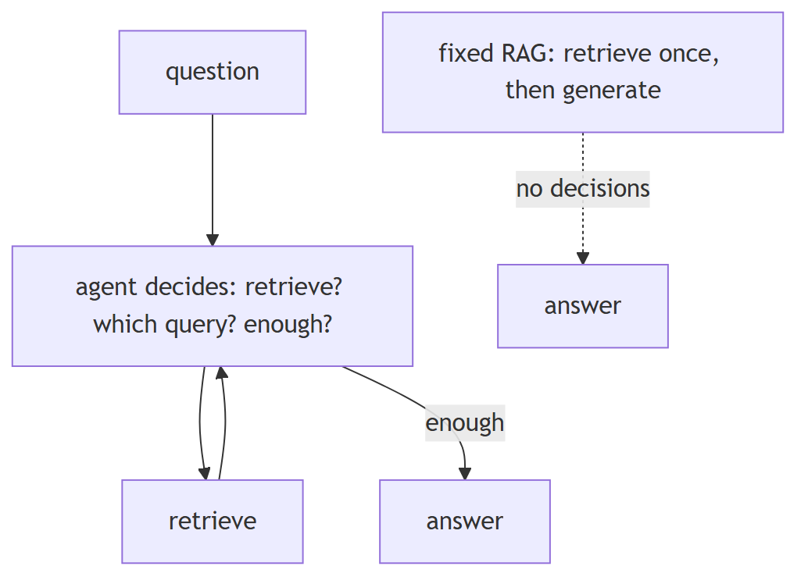

**Jiuwen.** Agentic mode is an opt-in switch (off by default). When on, the knowledge base wraps its base retriever in an agentic retriever that drives an LLM loop: retrieve, extract facts, ask whether they are sufficient, and if not issue a rewritten query — repeating up to a cap. When off, the base vector, sparse, or hybrid retriever is called once.

<b>Jiuwen technical detail (classes &amp; functions)</b>

**Implementation**

`RetrievalConfig.agentic` (default `False`) is the switch. When true, `SimpleKnowledgeBase.retrieve` wraps its base retriever in `AgenticRetriever(retriever=..., llm_client=...)`; otherwise the base `VectorRetriever`/`SparseRetriever`/`HybridRetriever` is called directly. `GraphKnowledgeBase` does the same wrapping a `GraphRetriever`. Agentic = base retrieval + LLM triple extraction + sufficiency/rewrite + multi-round RRF + optional graph expansion; it requires an `llm_client`. In the product harness the model also chooses retrieval via the `memory_search` tool.

**Code anchors**

| Code anchor | What it points to |
|---|---|
| `agent-core/openjiuwen/core/retrieval/common/config.py:51` | agentic: bool = False |
| `agent-core/openjiuwen/core/retrieval/simple_knowledge_base.py:172/182` | agentic wrap vs direct base retriever |
| `agent-core/openjiuwen/core/retrieval/graph_knowledge_base.py:218` | agentic wrap of GraphRetriever |
| `agent-core/openjiuwen/core/retrieval/retriever/agentic_retriever.py:113` | AgenticRetriever construction; agent-core/openjiuwen/core/retrieval/retriever/vector_retriever.py:38 — fixed single-pass (contrast) |
| `agent-core/openjiuwen/core/workflow/components/resource/knowledge_retrieval_comp.py:156` | LLM only when agentic |
| `jiuwenswarm/jiuwenswarm/agents/harness/common/tools/memory_tools.py:167` | memory_search tool |
| `agent-core/openjiuwen/harness/deep_agent.py:225` | memory_search in builtin tools |

**Implementation diagram**

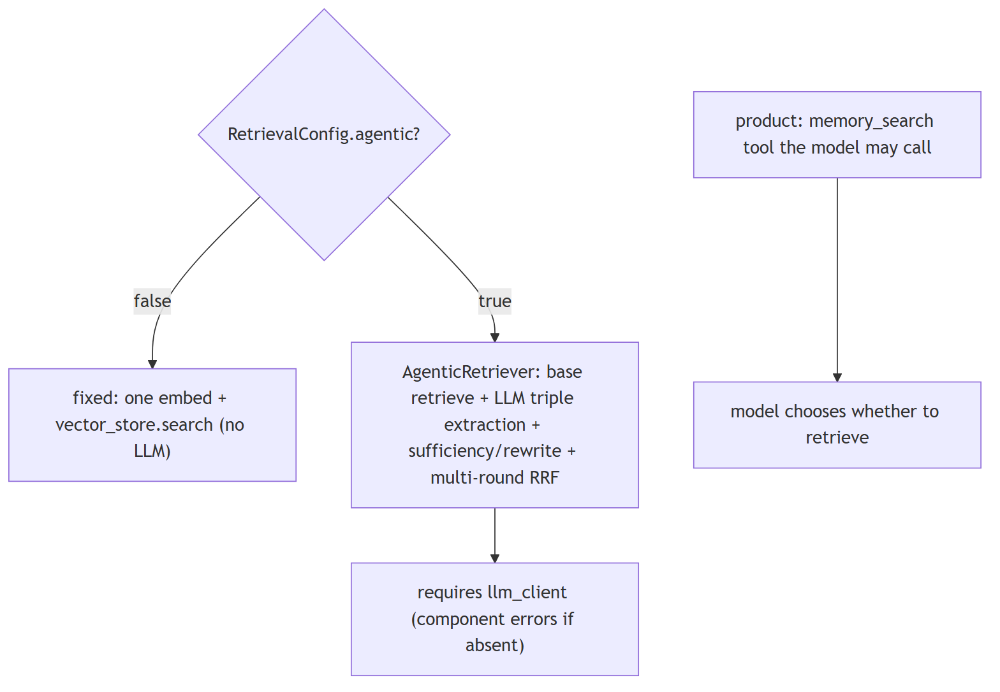

**Canonical source**

`source/rag-part2-interview-questions_for_engineers.md`

---

## 19. How would you prevent an agentic RAG system from retrieving in an unnecessary loop and burning cost

**Title.** Preventing agentic RAG loops

**Summary.** Cap the rounds, detect repeated queries/results, require a sufficiency signal to continue, put a token/cost budget on the loop, and cache/dedupe retrieval.

**Key points.**

- Round cap + sufficiency gate.
- Detect repeated queries/results.
- Token/cost budget; cache/dedupe.

**General.** Cap the rounds, detect repeated queries/results, require a sufficiency signal to continue, and put a token/cost budget on the retrieval loop itself. Cache retrieval results and dedupe identical queries. Alert on loops.

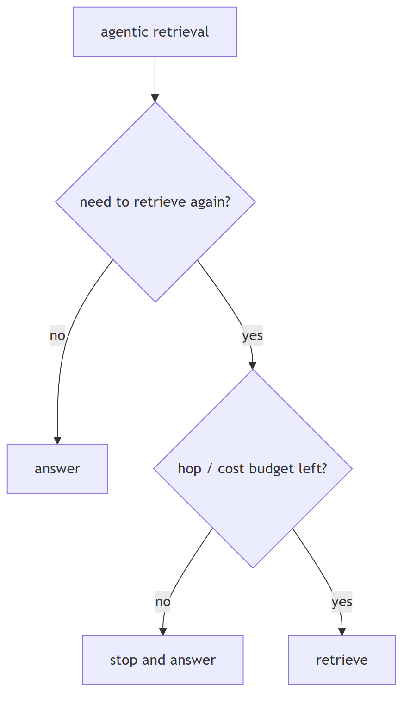

**Jiuwen.** Caps exist (the agentic retriever's max iterations default 2 and is clamped; graph hops default 2), and the sufficiency break avoids a needless round. Tool-layer rails catch loops: the anomaly-detection rail compacts consecutive identical tool rounds and aborts, and the dedup rail warns on repeated calls. There is no retrieval-result cache.

<b>Jiuwen technical detail (classes &amp; functions)</b>

**Implementation**

Caps exist (`AgenticRetriever.max_iter` default 2 clamped, `graph_hops`/`max_length` default 2), and the sufficiency break avoids a needless round. Harness rails catch loops at the tool layer: `ModelAnomalyDetectionRail` compacts consecutive identical tool rounds and aborts after a threshold, and `ToolCallDeduplicationRail` caches/exact-suppresses repeated read calls. The ReAct loop is capped at `max_iterations`. But there is no retrieval-specific token/cost budget, and the harness rails are not applied to the retrieval agent's own LLM calls.

**Code anchors**

| Code anchor | What it points to |
|---|---|
| `agent-core/openjiuwen/core/retrieval/retriever/agentic_retriever.py:133/241/287` | max_iter and turn-cap breaks |
| `agent-core/openjiuwen/harness/rails/model_anomaly_detection_rail.py:74` | ToolLoopCompactConfig (default off); :386 compact-or-bailout |
| `jiuwenswarm/jiuwenswarm/agents/harness/common/rails/tool_dedup_rail.py:25/109/157` | cacheable whitelist + per-turn cache + repeat warning |
| `agent-core/openjiuwen/core/single_agent/agents/react_agent.py:288` | max_iterations=5 |
| `jiuwenswarm/jiuwenswarm/agents/harness/common/rails/context_headroom_rail.py:97` | 60%/80% token-window directives |

**Implementation diagram**

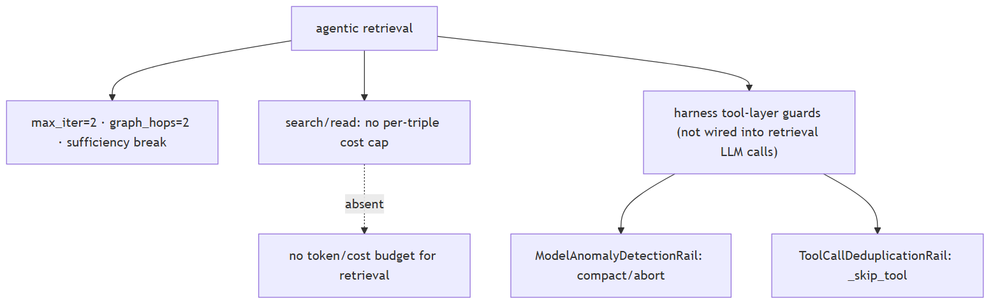

**Canonical source**

`source/rag-part2-interview-questions_for_engineers.md`

---
