# Retrieval and ranking

## 1. Dense vs. sparse retrieval, and fusing both with reciprocal rank fusion

Mechanism intermediate

**TL;DR.** Dense matches meaning but can miss rare exact terms; sparse (BM25) matches literal terms but fails on paraphrase; fuse both with reciprocal rank fusion.

**Key points.**

- Dense: embeddings, semantic match; weak on exact tokens.
- Sparse/BM25: literal term match; weak on paraphrase.
- Fuse with RRF: combine ranks, not raw scores.
- Weighting is often ignored in favor of RRF.

**Concept.** Dense retrieval embeds queries/documents and searches a vector index; it matches meaning but can miss rare exact terms. Sparse retrieval (BM25/TF-IDF) matches literal terms with term-frequency weighting; strong on exact tokens but fails on paraphrase. Fuse both — RRF (`Σ 1/(k+rank)`) is the robust default because it needs no score calibration.

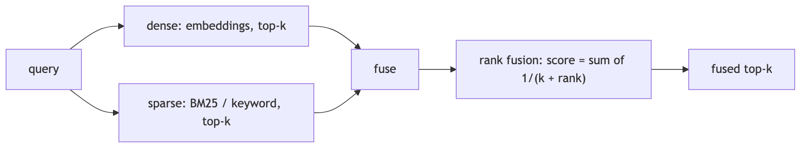

**In Jiuwen.** Dense retrieval is the vector retriever; sparse is BM25 on the vector store (with a full-text or TF-IDF fallback on other backends). The hybrid retriever accepts an alpha weight, but the backends actually combine results with reciprocal rank fusion (rank-based), not a weighted score blend — so treat hybrid fusion here as RRF.

<b>Under the hood</b>

**Implementation**

Dense is `VectorRetriever`; sparse is `SparseRetriever`, which on Milvus is real BM25 (`metric_type="BM25"` against a `SPARSE_FLOAT_VECTOR` field with `SPARSE_INVERTED_INDEX`). Chroma falls back to a TF-IDF text query; PG uses full-text search. `HybridRetriever` takes an `alpha` but every backend actually uses RRF: Milvus `RRFRanker(k=60)`, Chroma/PG `rrf_fusion(..., k=60)` scoring deduped text by `Σ 1/(k+rank)`. The only true weighted fusion is in the graph store (`WeightedRankConfig`).

**Implementation diagram**

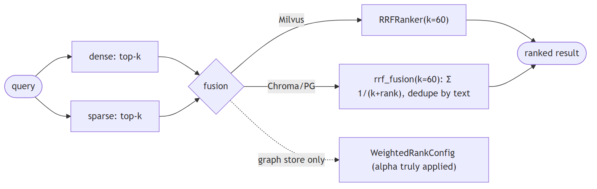

**Code anchors**

| Code anchor | What it points to |
|---|---|
| `agent-core/openjiuwen/core/retrieval/retriever/sparse_retriever.py:19` | SparseRetriever (BM25); :62 delegates to sparse_search |
| `agent-core/openjiuwen/core/retrieval/vector_store/milvus_store.py:277` | metric_type: "BM25"; :348 native RRFRanker(k=60) |
| `agent-core/openjiuwen/core/retrieval/indexing/indexer/milvus_indexer.py:390` | Milvus Function(BM25); :399 SPARSE_INVERTED_INDEX |
| `agent-core/openjiuwen/core/retrieval/retriever/hybrid_retriever.py:26` | alpha (ignored by stores) |
| `agent-core/openjiuwen/core/retrieval/utils/fusion.py:15/39` | rrf_fusion + 1/(k+rank) |
| `agent-core/openjiuwen/core/retrieval/vector_store/chroma_store.py:300` | no BM25 (TF-IDF); agent-core/openjiuwen/core/retrieval/vector_store/pg_store.py:375 — FTS |

---

## 2. When keyword search outperforms semantic search

Mechanism intermediate

**TL;DR.** Keyword wins on exact identifiers, codes, rare names, jargon, and small/distinctive corpora; dense wins on paraphrase and intent. Best is hybrid.

**Key points.**

- Exact codes/IDs/names favor keyword.
- Paraphrase/intent favor dense.
- Combine both to cover each other's blind spots.

**Concept.** Keyword search wins when the query contains exact identifiers, codes, rare names, or domain jargon that the embedding model never learned to map, and when the corpus is small or the terms are highly distinctive. Dense search wins on paraphrase and intent. The strongest approach is a router that picks by query type (or always runs hybrid and fuses).

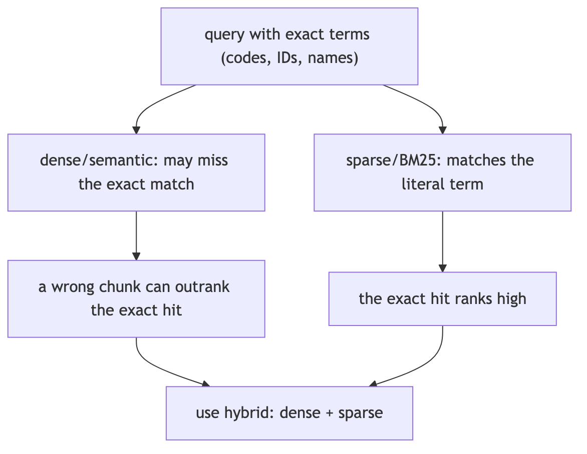

**In Jiuwen.** Jiuwen's choice is static config, not query-driven: the knowledge base picks the retriever and mode from the configured index type (vector, bm25, or hybrid); the agentic retriever derives its mode from the underlying retriever, and the graph retriever validates against allowed modes. There is no classifier that decides per query whether keyword or semantic is better.

<b>Under the hood</b>

**Implementation**

Routing is static and config-driven, not query-content-driven: `SimpleKnowledgeBase.retrieve` picks the retriever and mode from `config.index_type` (`vector` → `VectorRetriever`, `bm25` → `SparseRetriever`, else hybrid). `AgenticRetriever` derives its default mode from the underlying retriever's `index_type`, and `GraphRetriever` validates against `_allowed_modes`. The only dynamic keyword behavior is a degenerate fallback: if dense returns zero results, `VectorRetriever` (and `HybridRetriever` only in its `mode="vector"` branch) re-runs `sparse_search`. `QueryRewriter` produces an `intention` field but never uses it to switch modes.

**Implementation diagram**

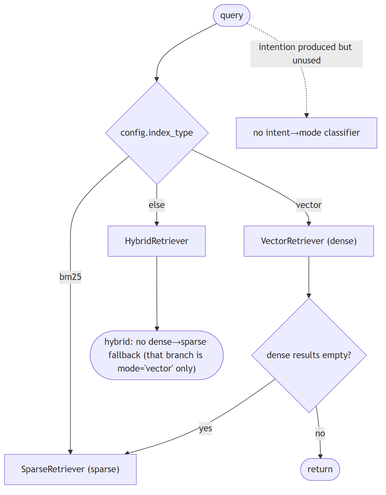

**Code anchors**

| Code anchor | What it points to |
|---|---|
| `agent-core/openjiuwen/core/retrieval/simple_knowledge_base.py:141` | retriever selection by index_type; :166 mode selection |
| `agent-core/openjiuwen/core/retrieval/retriever/vector_retriever.py:83` | dense-empty → BM25 fallback |
| `agent-core/openjiuwen/core/retrieval/retriever/hybrid_retriever.py:97` | same fallback |
| `agent-core/openjiuwen/core/retrieval/retriever/agentic_retriever.py:155` | default_mode from index_type |
| `agent-core/openjiuwen/core/retrieval/retriever/graph_retriever.py:262` | _allowed_modes |
| `agent-core/openjiuwen/core/retrieval/query_rewriter/query_rewriter.py:277` | rewrite schema includes intention |

---

## 3. Why a purely semantic system can fail on queries with exact codes, IDs, or names

Mechanism intermediate

**TL;DR.** Opaque tokens (codes, SKUs, UUIDs, rare names) carry little semantic signal, so a semantically close but wrong chunk can outrank the exact hit — and dense results are rarely empty, so no fallback fires.

**Key points.**

- Short opaque tokens embed to near-random neighbors.
- A wrong-but-close chunk can rank above the exact hit.
- Fix: metadata/exact filtering, a sparse leg, or an exact-match boost.

**Concept.** Embedding models are trained on natural-language co-occurrence; short opaque tokens (error codes, SKUs, UUIDs, version strings, rare proper nouns) carry little semantic signal and get mapped to near-random neighbors. A semantically "close" but wrong chunk can outrank the exact hit, and because dense results are rarely empty, no lexical fallback fires. The fix is metadata/exact filtering, a sparse leg, or an explicit exact-match boost.

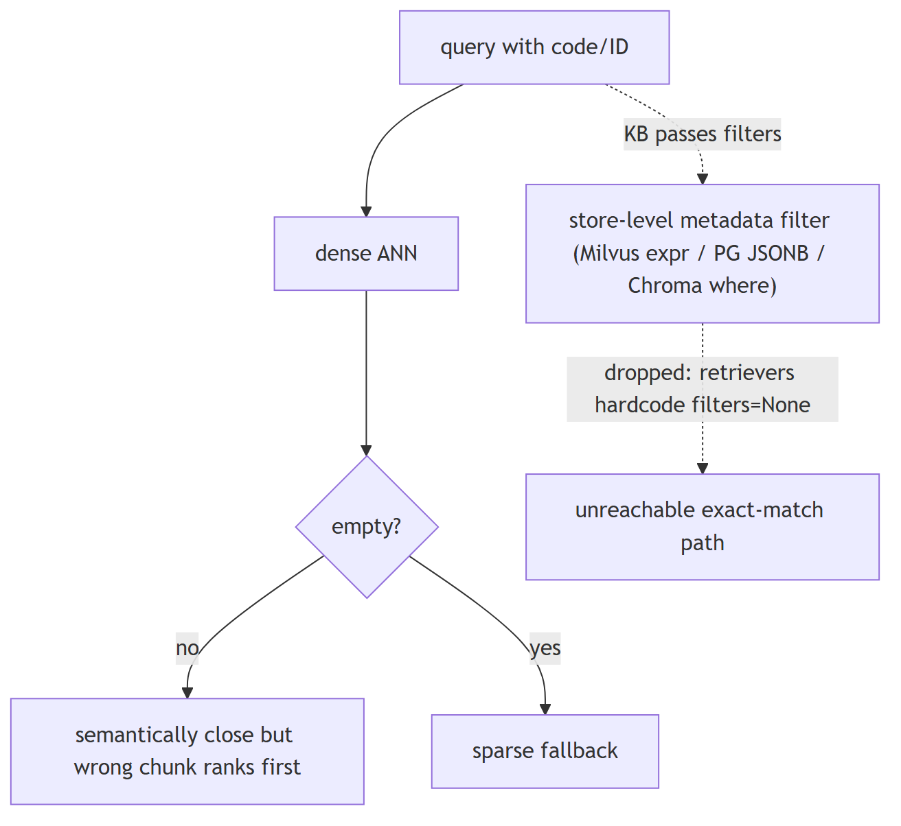

**In Jiuwen.** The stores can filter (Milvus expressions, PG JSONB containment, Chroma where-clauses, and Milvus inverted scalar indexes), but the retriever layer hardcodes filters to None and drops the filters the knowledge base passes — so metadata/exact filtering is unreachable through the normal path. The practical fix is to add a sparse leg or re-plumb filters through the retriever.

<b>Under the hood</b>

**Implementation**

The stores *can* filter: Milvus builds `key == value` expressions (string-sanitized) and supports `QueryExpr`; PG does JSONB containment; Chroma builds a `where` dict; Milvus even creates `INVERTED` scalar indexes on `document_id`/`chunk_id`. But the retriever layer hardcodes `filters=None` and drops the `filters` kwarg the KB passes, so metadata filtering is unreachable through `KnowledgeBase.retrieve`. There is no exact-term boost, no `IN`/`LIKE` substring matching, and the lexical fallback fires only when dense output is *empty*, not when it is semantically wrong.

**Code anchors**

| Code anchor | What it points to |
|---|---|
| `agent-core/openjiuwen/core/retrieval/retriever/vector_retriever.py:88` | hardcoded filters=None; :84 sparse fallback only when dense empty |
| `agent-core/openjiuwen/core/retrieval/retriever/hybrid_retriever.py:81` | hardcoded filters=None |
| `agent-core/openjiuwen/core/retrieval/simple_knowledge_base.py:186` | KB passes filters, retriever swallows it |
| `agent-core/openjiuwen/core/retrieval/vector_store/milvus_store.py:215` | key == value filter expr; :219 QueryExpr.sanitize_str |
| `agent-core/openjiuwen/core/retrieval/vector_store/pg_store.py:474` | build_filters JSONB containment |
| `agent-core/openjiuwen/core/retrieval/vector_store/chroma_store.py:265` | where dict filter |
| `agent-core/openjiuwen/core/retrieval/indexing/indexer/milvus_indexer.py:346` | INVERTED scalar index on doc id |

---

## 4. How do you decide between retrieving 5 documents versus 20

Compare intermediate

**TL;DR.** Higher k raises recall but costs tokens/latency and can dilute; lower k is precise and cheap. Retrieve more then rerank down when you have a reranker.

**Key points.**

- More docs → recall up, tokens/latency up.
- Fewer docs → precision, lower cost.
- Ideal: retrieve many, rerank to few (needs a wired reranker).

**Concept.** It is a recall-vs-precision/token/latency tradeoff. Retrieve more when the question is multi-part, aggregative, or high-stakes and recall matters; fewer when answers are localized and you want precision and low token cost. The robust pattern is retrieve a larger candidate set (e.g. 20–50), rerank to a small k (3–5), and pass only the reranked top-k to the generator — so you keep recall without paying context cost. Tune k on an eval set; do not hardcode a gut number.

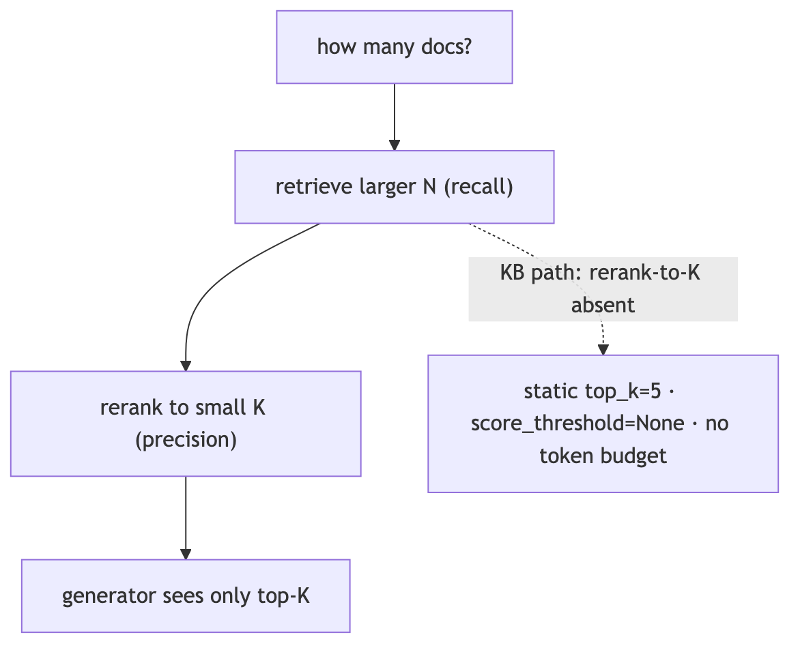

**In Jiuwen.** Jiuwen's top_k is a static config (default 5) with no adaptive or cost-aware policy, and no score threshold by default. Because reranking is not wired into the default knowledge-base path and the assembled context is not token-budgeted, 'retrieve 20, rerank to 5' isn't available out of the box — you'd set top_k directly and accept the token cost.

<b>Under the hood</b>

**Implementation**

`top_k` is a static config (default 5) with no adaptive or cost-aware policy, and `score_threshold` defaults to `None`. There is no rerank-to-K lever in the KB path (rerankers are wired only in the graph store), and the assembled context is not token-budgeted. So "retrieve 20, rerank to 5" is not available out of the box; you would set `top_k` directly and accept the untrimmed context.

**Code anchors**

| Code anchor | What it points to |
|---|---|
| `agent-core/openjiuwen/core/retrieval/common/config.py:46` | top_k: int = 5; :47 score_threshold default None |
| `agent-core/openjiuwen/core/retrieval/retriever/hybrid_retriever.py:64` | threshold honored only in mode="vector" |
| `agent-core/openjiuwen/core/retrieval/simple_knowledge_base.py:182` | KB path calls no reranker |
| `agent-core/openjiuwen/core/workflow/components/resource/knowledge_retrieval_comp.py:241` | context concatenated unbounded |

---

## 5. How would you design retrieval to work across structured data (SQL tables) and unstructured data (documents) in the same system

Design advanced

**TL;DR.** Keep paths explicit: route structured questions to a schema-aware text-to-SQL/table tool and unstructured to document retrieval, then merge and ground results.

**Key points.**

- Structured → text-to-SQL/table query (validatable).
- Unstructured → document retrieval.
- Merge and ground; don't flatten tables into text.

**Concept.** Keep the two paths explicit: route structured questions to a text-to-SQL/table-query tool (schema-aware, validable) and unstructured questions to document retrieval, then merge/ground the results. Do not flatten tables into text and hope; and do not let a free-form shell tool be the only SQL path, because it is unverified. An orchestrator or router picks the source(s), and the answer cites which.

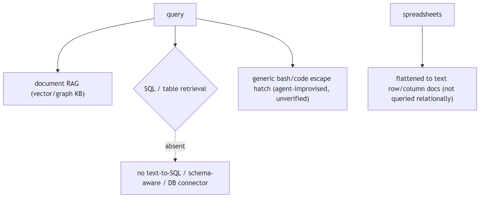

**In Jiuwen.** Retrieval is document-RAG only: parsers emit text chunks into vector/graph stores and the retrieval component fans a query across knowledge bases. Structured access is limited to the generic shell/code escape hatch; spreadsheets are ingested as row/column text documents rather than queried as tables.

<b>Under the hood</b>

**Implementation**

Retrieval is document-RAG only: parsers emit `TextChunk`s into vector/graph stores and `KnowledgeRetrievalComponent` fans queries to one or more KBs. Structured access is limited to the generic `bash`/`code` escape hatch (`SysOperation.fs()/shell()/code()`); spreadsheets are ingested as row/column text documents rather than queried as tables. SQLite is used only for local lock/session persistence.

**Code anchors**

| Code anchor | What it points to |
|---|---|
| `agent-core/openjiuwen/core/sys_operation/sys_operation.py:204` | SysOperation exposes only fs/code/shell; :139 card proxies limited to fs/shell/code |
| `agent-core/openjiuwen/harness/tools/__init__.py:42` | only Bash/PowerShell shell escape hatch; no DB tool |
| `agent-core/openjiuwen/harness/tools/code.py:34` | CodeTool.invoke (generic code, not SQL-aware) |
| `agent-core/openjiuwen/core/retrieval/indexing/processor/parser/excel_parser.py:131` | spreadsheets flattened to text documents |
| `agent-core/openjiuwen/core/sys_operation/local/_async_read_write_lock.py:6` | SQLite used only as a lock DB |

---

## 6. What reranking adds that initial retrieval doesn't already do

Mechanism intermediate

**TL;DR.** First-stage retrieval optimizes recall with cheap approximate similarity; a cross-encoder reranker scores candidates jointly with the query to reorder the top-k for precision — but only over candidates retrieval already returned.

**Key points.**

- Retrieval: recall, cheap, approximate.
- Rerank: precision, joint query+doc scoring, expensive.
- Cannot recover what retrieval never returned.

**Concept.** First-stage retrieval optimizes recall with cheap approximate similarity over the whole corpus. A reranker scores each candidate *jointly with the query* using an expensive cross-encoder, reordering the top-k for precision. It cannot recover documents retrieval never returned.

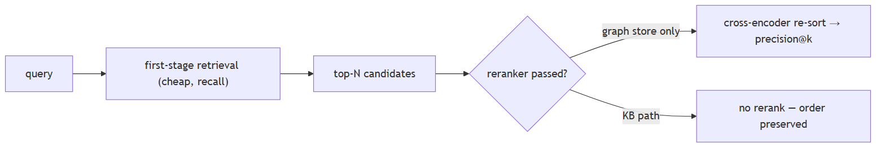

**In Jiuwen.** Jiuwen has a reranker interface (cross-encoder and LLM-judge variants), but it is integrated only in the graph store; the default knowledge-base retrieve path never reranks. So reranking is available as a component, yet out of the box it does not reorder normal retrieval results.

<b>Under the hood</b>

**Implementation**

`Reranker` is an abstract cross-encoder client (`rerank`/`rerank_sync` returning `{doc: score}`), implemented by `StandardReranker`, `DashscopeReranker`, and experimental `ChatReranker`. It is integrated only in the graph store: `milvus_support.py` accepts an optional `reranker` and calls it in `_rank_results`/`_combined_rerank`, and even there it is a no-op unless the caller passes `reranker=...`. Neither `SimpleKnowledgeBase.retrieve` nor `GraphKnowledgeBase.retrieve` constructs or forwards one, so RAG retrieval is first-stage-only.

**Code anchors**

| Code anchor | What it points to |
|---|---|
| `agent-core/openjiuwen/core/foundation/store/base_reranker.py:16` | RerankerConfig; :37/41 Reranker + abstract rerank |
| `agent-core/openjiuwen/core/retrieval/reranker/standard_reranker.py:23` | StandardReranker (/rerank); agent-core/openjiuwen/core/retrieval/reranker/chat_reranker.py:22 — ChatReranker (experimental) |
| `agent-core/openjiuwen/core/foundation/store/graph/milvus/milvus_support.py:458` | reranker applied only when truthy; :87 async def rerank |
| `agent-core/openjiuwen/core/retrieval/simple_knowledge_base.py:125` | no reranker in retrieve; agent-core/openjiuwen/core/retrieval/graph_knowledge_base.py:251 — passes **kwargs only |
| `agent-core/openjiuwen/core/retrieval/common/result_ranking.py:11` | fusion rankers, distinct from cross-encoder |

---

## 7. How do you know if your reranker is actually improving results, or just reordering noise, without an A/B test

Mechanism intermediate

**TL;DR.** You can't tell from order alone; on a labeled set, compare ranking metrics (NDCG/MRR/precision) with and without the reranker on the same candidates.

**Key points.**

- Order alone isn't evidence.
- Compare ranked metrics on the same candidate set.
- If NDCG doesn't improve, it's just reordering.

**Concept.** You cannot tell from the order alone. Offline, hold out a labeled set of (query, relevant docs) and compare ranking metrics (NDCG@k, MRR, precision@k) with and without the reranker on the same candidate set. If NDCG does not improve, the reranker is reordering noise. Watch for it merely promoting longer/more generic chunks. A/B is better but needs traffic; offline label-based comparison is the first check.

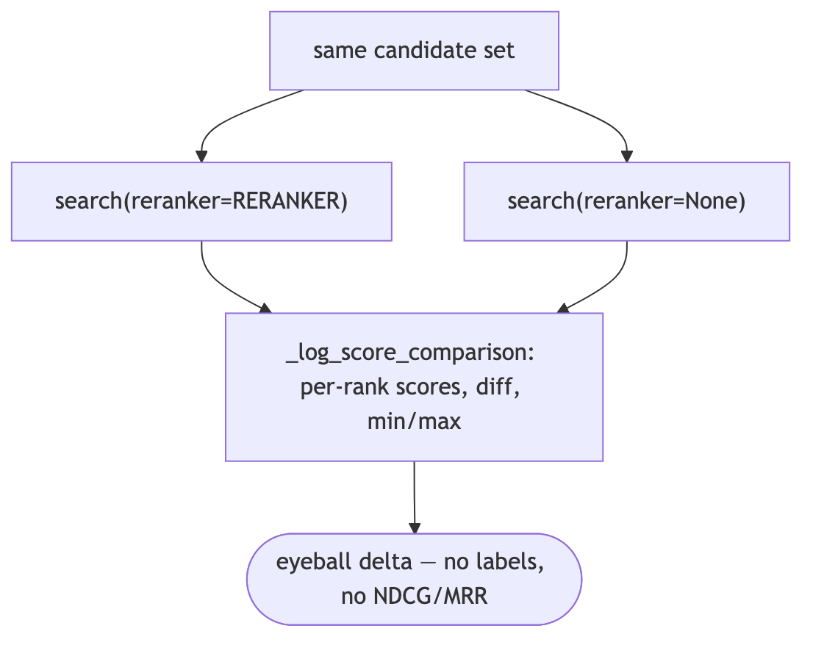

**In Jiuwen.** Jiuwen has a real reranker stack and a graph-store hook, but the only before/after evidence is a manual demo that searches twice (with and without the reranker) and prints per-rank score differences. There is no labeled evaluation or metric to prove improvement, so its value must be measured outside the repo.

<b>Under the hood</b>

**Implementation**

There is a real reranker stack (`StandardReranker`, `ChatReranker`, DashScope) and a cross-encoder re-rank hook in the graph store, but the only before/after evidence is a **manual demo comparison**: `showcase_milvus_graph_store.py` searches twice (`reranker=RERANKER` then `reranker=None`) and `_log_score_comparison` prints per-rank scores, a diff, and min/max ranges. No ground-truth labels, no held-out query set, no metric delta, no significance test.

**Code anchors**

| Code anchor | What it points to |
|---|---|
| `agent-core/examples/store/showcase_milvus_graph_store.py:51` | _log_score_comparison; :217 reranker on; :240 reranker off |
| `agent-core/openjiuwen/core/retrieval/reranker/standard_reranker.py:58` | rerank() returns relevance_score per doc |
| `agent-core/openjiuwen/core/foundation/store/graph/milvus/milvus_support.py:87` | rerank sorts in place (_combined_rerank at :467) |
| `agent-core/examples/retrieval/showcase_reranker.py:23` | standalone reranker demo (no baseline) |

---

## 8. Would you rerank every query, or only some, and how do you decide

Mechanism intermediate

**TL;DR.** Rerank only when it pays off: high-stakes or ambiguous queries with low first-stage precision and a bounded candidate count; skip exact lookups and latency-critical cheap queries.

**Key points.**

- Rerank when precision matters and candidates are bounded.
- Skip exact-match, high-volume, latency-critical queries.
- Decide per query, not globally.

**Concept.** Rerank only when it improves the top-k enough to justify its latency: for high-stakes or ambiguous queries where first-stage precision is low, and when the candidate count is bounded. Skip it for exact-match lookups, high-volume cheap queries, or when latency dominates. Measure NDCG/precision with and without rerank on a labeled set to decide, and cache.

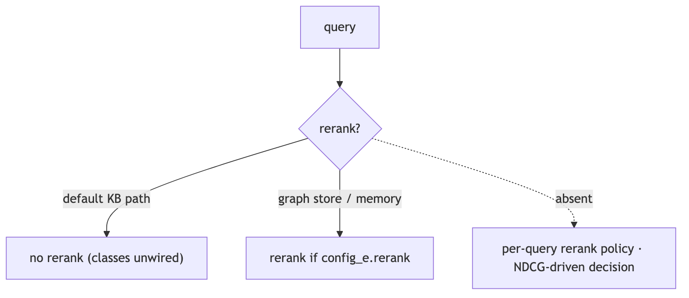

**In Jiuwen.** In Jiuwen reranking is optional and outside the default knowledge-base path — only the graph store/graph memory rerank, gated by a config flag. So default RAG queries are effectively never reranked, and there is no per-query rerank policy or metric-driven decision.

<b>Under the hood</b>

**Implementation**

Reranking is **optional and not part of the default KB path** — the `Reranker` classes exist (`StandardReranker`, `ChatReranker`, `DashscopeReranker`) but only the graph store / graph memory call `rerank`, gated by `config_e.rerank`. So the codebase effectively never reranks default RAG queries; there is no per-query rerank policy and no metric-driven decision (only the demo score-delta script).

**Code anchors**

| Code anchor | What it points to |
|---|---|
| `agent-core/openjiuwen/core/retrieval/simple_knowledge_base.py:182` | KB retrieve has no reranker |
| `agent-core/openjiuwen/core/foundation/store/graph/milvus/milvus_support.py:87` | rerank in graph store |
| `agent-core/openjiuwen/core/memory/graph/graph_memory/base.py:645` | config_e.rerank gate |
| `agent-core/openjiuwen/core/retrieval/reranker/standard_reranker.py:23` | StandardReranker (/rerank) |
| `agent-core/examples/store/showcase_milvus_graph_store.py:51` | before/after rerank demo (no labels) |

---

## 9. How much latency does reranking add?

Mechanism intermediate

**TL;DR.** Latency scales with candidate count and batching: a cross-encoder over ~50–100 candidates adds tens to low-hundreds of ms; an LLM-judge reranker is one call per document (O(N)).

**Key points.**

- Cross-encoder: one batched call over N candidates.
- LLM-judge: one call per doc — much slower.
- Weigh added latency against precision gain.

**Concept.** Reranking latency scales with the number of candidates and whether the model scores them in one batch or one-by-one. A cross-encoder over ~50–100 candidates typically adds tens to low-hundreds of milliseconds; an LLM-judge reranker is one call per document and can add seconds.

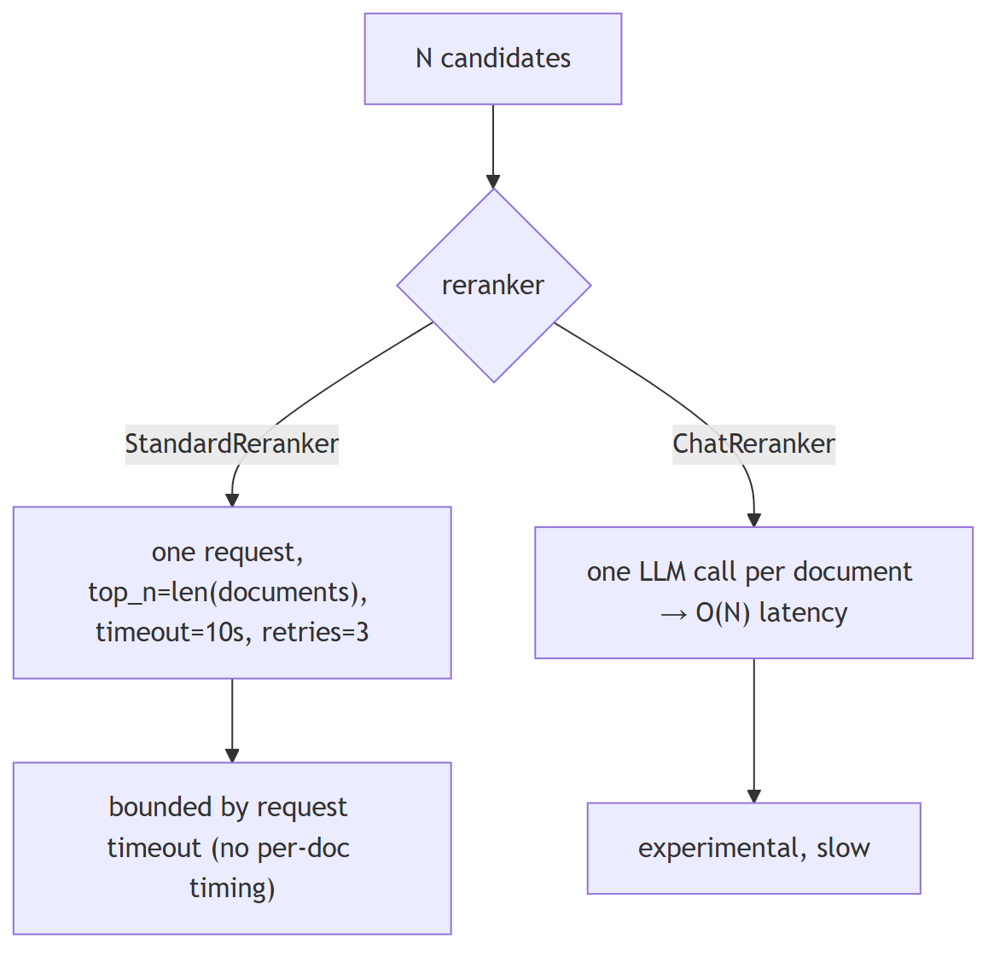

**In Jiuwen.** Jiuwen's reranker sends all candidates in a single request with no batching (default 10s timeout, retries with backoff); the LLM-judge variant handles one document per call, so its cost is linear in candidates and it is marked experimental. Reranking is optional and off by default, so the latency is only incurred when you enable it.

<b>Under the hood</b>

**Implementation**

`RerankerConfig.timeout` defaults to 10 s, and `StandardReranker` sends **all** candidates in one request with `top_n=len(documents)` (no batching/concurrency), `max_retries=3` with backoff. `ChatReranker` enforces a list of size 1, so it costs one LLM call per candidate (O(N) latency) and is flagged experimental. There is no per-document timing, only the request timeout.

**Code anchors**

| Code anchor | What it points to |
|---|---|
| `agent-core/openjiuwen/core/foundation/store/base_reranker.py:22` | `timeout` default 10 s |
| `agent-core/openjiuwen/core/retrieval/reranker/standard_reranker.py:120` | `top_n=len(documents)` single request; `:35` `max_retries=3` |
| `agent-core/openjiuwen/core/retrieval/reranker/chat_reranker.py:113` | list-size-1 constraint (per-doc LLM call) |
| `agent-core/openjiuwen/core/retrieval/utils/api_requests.py:55` | retry/backoff loop |

---

## 10. When is reranking worth the latency cost?

Mechanism advanced

**TL;DR.** Rerank when precision@k dominates, the candidate set is bounded, and results are cacheable — not when latency/cost grow with N.

**Key points.**

- Worth it when precision@k matters more than latency.
- Worth it when the candidate set is bounded/cacheable.
- Unbounded reranking is usually not worth it.

**Concept.** Rerank when precision@k matters more than latency, when the candidate count is bounded, and when results can be cached. Reranking a large, unbounded candidate set is usually not worth it — the latency and cost grow with N while the precision gain does not.

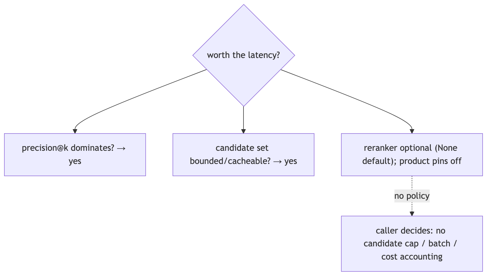

**In Jiuwen.** Reranking is optional (reranker=None) and the product pins rerank_enabled: False. The only guard is a per-request timeout + min_score; there is no candidate cap, batch size, or cost accounting, so whether it is worth it is a caller decision.

<b>Under the hood</b>

**Implementation**

The reranker is optional (`reranker=None` by default), and the product `jiuwenswarm` pins `rerank_enabled: False` in its external memory builder. The only guard is the per-request timeout plus `min_score`; there is no candidate cap, rerank batch size, or cost accounting — so “is it worth it” is a caller decision, not an enforced policy.

**Code anchors**

| Code anchor | What it points to |
|---|---|
| `agent-core/openjiuwen/core/foundation/store/graph/milvus/milvus_support.py:167` | `reranker=None` optional |
| `jiuwenswarm/jiuwenswarm/agents/harness/common/memory/external_memory_builder.py:340` | product pins `rerank_enabled: False` |

---

## 11. Bi-encoder for retrieval vs. cross-encoder for reranking

Mechanism intermediate

**TL;DR.** Bi-encoders embed query and document independently (fast, precomputable, indexable); cross-encoders feed query+document together for a precise relevance score (slow, per-pair).

**Key points.**

- Bi-encoder: independent embeddings, scalable retrieval.
- Cross-encoder: joint scoring, higher precision, per-pair cost.
- Use bi-encoder to retrieve, cross-encoder to rerank.

**Concept.** A bi-encoder embeds query and document independently (fast, precomputable, indexable) but cannot model their interaction. A cross-encoder feeds query+document together through the model and scores the pair, capturing fine-grained relevance at the cost of one forward pass per candidate — hence two-stage retrieval.

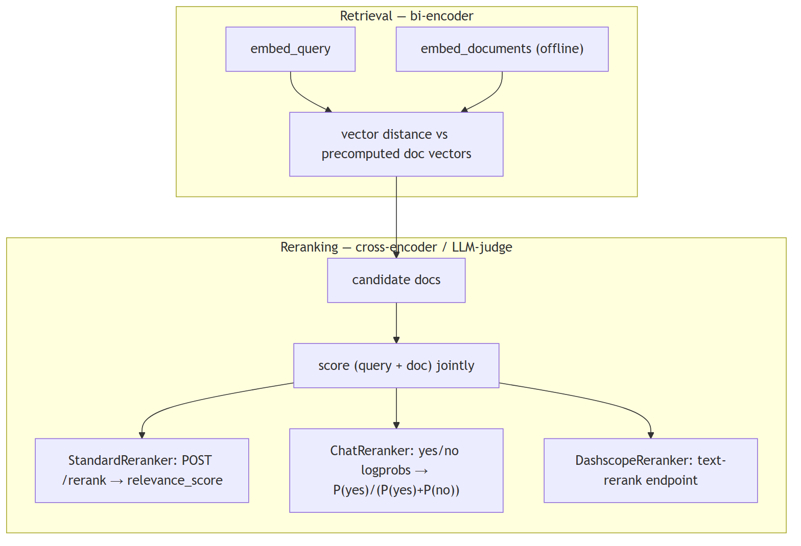

**In Jiuwen.** Jiuwen retrieves with a bi-encoder (query and documents embedded independently and compared by similarity) and reranks with a cross-encoder or an LLM judge: the standard reranker posts the query and all documents to a rerank endpoint and reads the relevance score; the chat reranker asks a yes/no judge question. Retrieval is vector-based; reranking is the expensive joint model.

<b>Under the hood</b>

**Implementation**

Retrieval is bi-encoder (query and docs embedded independently, compared by vector similarity). Reranking is cross-encoder / LLM-as-reranker: `StandardReranker` POSTs `instruct+query` and all documents to a `/rerank` endpoint and reads `relevance_score`; `ChatReranker` (experimental) asks a chat LLM a yes/no judge question and returns `P(yes)/(P(yes)+P(no))` from `top_logprobs`; `DashscopeReranker` extends `StandardReranker` for DashScope's `text-rerank` endpoint. Scoring is query-conditioned at rerank time, unlike the bi-encoder's independent embeddings.

**Code anchors**

| Code anchor | What it points to |
|---|---|
| `agent-core/openjiuwen/core/retrieval/retriever/vector_retriever.py:78` | independent query bi-encoder |
| `agent-core/openjiuwen/core/retrieval/reranker/standard_reranker.py:28` | /rerank endpoint; :29 instruct+query template; :81 parses relevance_score |
| `agent-core/openjiuwen/core/retrieval/reranker/chat_reranker.py:83` | logprob yes/no scoring; :125 chat prompt assembly |
| `agent-core/openjiuwen/core/retrieval/reranker/dashscope_reranker.py:16` | DashScope reranker |

---

## 12. How do you chunk documents that mix prose, tables, and code?

Mechanism intermediate

**TL;DR.** Prose, tables, and code need separate chunking rules: keep code blocks whole, keep table rows with their header, split prose at paragraph/sentence boundaries.

**Key points.**

- Code: keep function/block whole.
- Tables: header + rows together.
- Prose: paragraph or sentence split.
- Jiuwen: CharChunker/CharSplitter cut at fixed offsets with no content-type detection; HybridChunker keeps table units whole.

**Concept.** Uniform character or token splitting destroys the structure of tables and code. Apply content-aware chunking: detect content type (prose, Markdown table, fenced code block), then apply per-type rules — keep fenced code blocks whole (or split at the function boundary for long files), keep table rows together with their header row, and split prose at paragraph or sentence boundaries. Attach metadata to each chunk (content_type, source_section) so downstream filtering can distinguish them. For large tables or code files that exceed your chunk budget, summarize or use a structured query path (text-to-SQL, AST grep) instead of embedding the raw content.

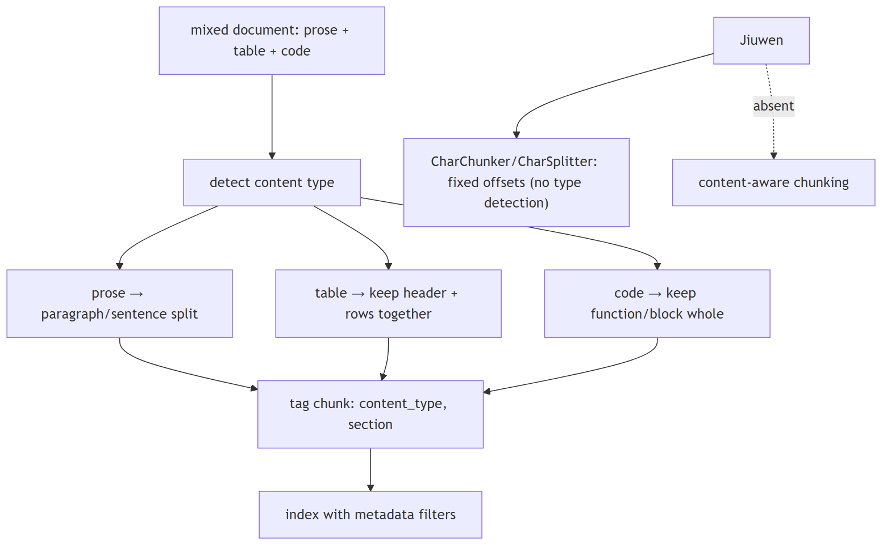

**In Jiuwen.** CharChunker/CharSplitter (agent-core/openjiuwen/core/retrieval/indexing/processor/chunker/char_chunker.py:12) cut at fixed character offsets with no content-type detection; HybridChunker keeps parser-emitted table units (metadata.source_type in row/column) whole and delegates the rest. Chunkers propagate Document metadata and add chunk_index/total_chunks/chunk_id, but no chunker derives content type from structure. No Markdown-table/code-fence-aware splitter, and no structured-query fallback for table-heavy content.

<b>Under the hood</b>

**Implementation**

The default is `CharChunker` → `CharSplitter`, which cuts at fixed character offsets with no content-type detection — an offset can fall inside a code block, table row, or sentence. `HybridChunker` is the one structural guard: it keeps parser-emitted table units (`metadata.source_type in ("row","column")`) whole and delegates the rest. Chunkers propagate `Document` metadata and add `chunk_index`/`total_chunks`/`chunk_id`, but no chunker derives content type from structure, there is no Markdown-header/code-fence-aware splitter, and there is no structured-query fallback for table-heavy content.

**Code anchors**

| Code anchor | What it points to |
|---|---|
| `agent-core/openjiuwen/core/retrieval/indexing/processor/chunker/text_splitter.py:34` | CharSplitter, fixed offset splits (:56 slicing loop) |
| `agent-core/openjiuwen/core/retrieval/indexing/processor/chunker/char_chunker.py:12` | CharChunker |
| `agent-core/openjiuwen/core/retrieval/indexing/processor/chunker/hybrid_chunker.py:19` | HybridChunker keeps row/column units whole; :76 writes chunk_index/total_chunks/chunk_id |
| `agent-core/openjiuwen/core/retrieval/common/document.py:30` | TextChunk (id_, text, doc_id, metadata, embedding) |

---
