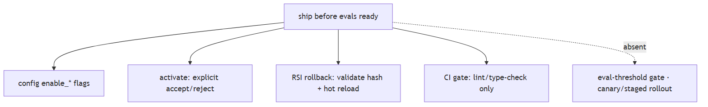

# AI engineer interview patterns

## 1. "Design a RAG system" tests failure mode awareness, not architecture recall

**Title.** Design a RAG system: tests failure-mode awareness

**Summary.** 'Design a RAG system' tests whether you know how it fails, not whether you can draw boxes.

**Key points.**

- Dense fallback only on empty, not on wrong.
- score_threshold defaults none → weak chunks pass.
- KB path never reranks.
- Metadata filters dropped at the retriever.

**Jiuwen.** The failure points are concrete: dense retrieval falls back to sparse only when it returns empty, not when it is wrong; score threshold defaults to none so weak chunks pass; the knowledge-base path never reranks; and metadata filters are dropped at the retriever boundary.

<b>Technical detail (classes &amp; functions)</b>

The failure points are concrete. Dense retrieval falls back to sparse only when it returns *empty*, not when it is wrong; `score_threshold` defaults to `None` so weak chunks pass; the KB path never reranks; and metadata `filters` are dropped at the retriever boundary, so an "authorized docs only" filter silently does nothing.

&bull; `agent-core/openjiuwen/core/retrieval/retriever/vector_retriever.py:83` — dense-empty → sparse fallback only; :88 filters=None; :94 threshold applied only when supplied &bull; `agent-core/openjiuwen/core/retrieval/common/config.py:47` — score_threshold defaults None &bull; `agent-core/openjiuwen/core/retrieval/simple_knowledge_base.py:182` — KB path calls no reranker &bull; `agent-core/openjiuwen/core/retrieval/indexing/processor/chunker/text_splitter.py:56` — char chunker cuts at fixed offsets

---

## 2. "Compare two approaches" tests tradeoff reasoning tied to numbers, not a correct pick

**Title.** Compare two approaches: tests tradeoff reasoning

**Summary.** 'Compare two approaches' tests tradeoff reasoning tied to numbers, not a correct pick.

**Key points.**

- top_k defaults 5, no adaptive policy.
- Reranking absent from the KB path.
- Model allocation is availability-based.
- Session cost tracked and capped.

**Jiuwen.** The relevant knobs are static and named: top-k defaults to 5 with no adaptive policy, reranking is not in the knowledge-base path, and model allocation is availability-based rather than cost or accuracy based, so routing easy queries to a smaller model is not automatic. Session cost is tracked and capped.

<b>Technical detail (classes &amp; functions)</b>

The relevant knobs are static and named: `top_k` defaults to 5 (no adaptive policy), reranking is not in the KB path, and model allocation is availability-based, not cost/accuracy-based — so "smaller model for easy queries" is not automatic. Session cost is tracked and capped when the provider reports cost.

&bull; `agent-core/openjiuwen/core/retrieval/common/config.py:46` — top_k: int = 5 static &bull; `agent-core/openjiuwen/core/retrieval/simple_knowledge_base.py:182` — no reranker in KB retrieve &bull; `agent-core/openjiuwen/agent_teams/models/allocator.py:559` — build_model_allocator (availability strategies, not cost/accuracy) &bull; `jiuwenswarm/jiuwenswarm/server/runtime/usage_cost.py:171` — enforced session cost cap

---

## 3. "The agent is stuck" tests whether you've shipped one, not studied one

**Title.** 'The agent is stuck': tests shipped experience

**Summary.** 'The agent is stuck' tests whether you've shipped one, not studied one.

**Key points.**

- ReAct max_iterations (5; harness 15).
- Agentic retriever max iter (2, clamped).
- Anomaly rail: identical rounds → compact/abort.
- Dedup rail + session cost cap.

**Jiuwen.** Concrete caps exist: ReAct max iterations (default 5, harness 15), agentic-retriever max iterations (default 2, clamped), an anomaly-detection rail (consecutive identical tool rounds trigger compaction or abort), and a tool-call dedup rail. A session cost cap is enforced.

<b>Technical detail (classes &amp; functions)</b>

Concrete caps exist: ReAct `max_iterations` (default 5, harness 15), `AgenticRetriever.max_iter` (default 2, clamped), `ModelAnomalyDetectionRail` (consecutive identical tool rounds → compact/abort) and `ToolCallDeduplicationRail`. A session cost cap is enforced when the provider reports cost, and `ModelBackupRail` fails over. What is **missing** is a circuit breaker after N consecutive failures and a durable token budget on the retrieval loop.

&bull; `agent-core/openjiuwen/core/single_agent/agents/react_agent.py:288` — max_iterations: int = Field(default=5); agent-core/openjiuwen/harness/schema/config.py:252 — harness default 15 &bull; `agent-core/openjiuwen/harness/rails/model_anomaly_detection_rail.py:74` — ToolLoopCompactConfig (default off); :90 bailout &bull; `jiuwenswarm/jiuwenswarm/agents/harness/common/rails/tool_dedup_rail.py:157` — repeat counter/warning &bull; `jiuwenswarm/jiuwenswarm/server/runtime/usage_cost.py:171/196` — enforced session cost cap &bull; `agent-core/openjiuwen/core/single_agent/rail/model_backup.py:9` — ModelBackupRail failover (no circuit breaker)

---

## 4. "How do you know it's working" tests evaluation depth, not confidence

**Title.** How do you know it's working: eval depth

**Summary.** 'How do you know it's working' tests evaluation depth, not confidence.

**Key points.**

- Offline answer-level eval exists.
- No retrieval metric layer.
- No faithfulness/claim scoring.
- No CI quality gate.

**Jiuwen.** Offline answer-level evaluation exists (exact match, LLM judge, weighted rubric, pipeline pass rate), but there is no retrieval metric layer, no faithfulness or claim-level scoring, and no quality regression gate in CI (the gate config is lint and type-check).

<b>Technical detail (classes &amp; functions)</b>

Offline answer-level evaluation exists (`ExactMatchMetric`, `LLMAsJudgeMetric`, RSI weighted rubric, `evaluator_pipeline` pass-rate), but there is no retrieval metric layer, no faithfulness/claim-level scoring, no quality regression gate in CI (`ci_gate.yaml` is lint/type-check only), and no production quality monitoring or drift detection — so the "how would you know it got worse" question exposes real gaps.

&bull; `agent-core/openjiuwen/agent_evolving/evaluator/metrics/llm_as_judge.py:47` — LLM judge; agent-core/openjiuwen/agent_evolving/evaluator/metrics/exact_match.py:12 — exact match &bull; `agent-core/openjiuwen/rsi/harness_rsi/evaluator/judger/scoring.py:193` — weighted rubric &bull; `agent-core/openjiuwen/agent_evolving/evaluator/evaluator_pipeline/pipeline.py:167` — benchmark eval &bull; `agent-core/openjiuwen/auto_harness/resources/ci_gate.yaml:21` — gates are only lint/type-check; agent-core/pyproject.toml:236 — level0/level1 markers (not invoked) &bull; `jiuwenswarm/jiuwenswarm/observability/store.py:102` — has_error (operations, not quality)

---

## 5. Scaling questions test whether you've thought past the demo

**Title.** Scaling questions: thinking past the demo

**Summary.** Scaling questions test whether you've thought past the demo.

**Key points.**

- Per-process bounded resources.
- Shared HTTP pool + embedding/sub-agent semaphores.
- Missing: autoscaling, distributed queues.

**Jiuwen.** Bounded resources exist per process: a shared HTTP pool (100 connections), embedding semaphore (50), sub-agent fan-out semaphore (10), bounded async queues, and parallel tool execution with resource lanes. What is missing is autoscaling and a distributed queue.

<b>Technical detail (classes &amp; functions)</b>

Bounded resources exist per process: shared httpx pool (`max_connections=100`), embedding semaphore (50), sub-agent fan-out semaphore (10), bounded `asyncio.Queue`s, and parallel tool execution with resource lanes. What is missing is autoscaling, a distributed rate limiter, and any semantic response cache — so the design change at 10x is mostly "add replicas + a global limiter", which the repo does not provide.

&bull; `agent-core/openjiuwen/core/common/clients/connector_pool.py:21` — limit: 100, limit_per_host: 30 &bull; `agent-core/openjiuwen/core/retrieval/embedding/api_embedding.py:55` — concurrency semaphore &bull; `agent-core/openjiuwen/core/runner/message_queue_inmemory.py:34` — bounded queue; agent-core/openjiuwen/harness/subagent_runtime/activity_events.py:53 — bounded activity queue &bull; `agent-core/openjiuwen/core/single_agent/ability_manager.py:431` — _execute_parallel_tool_tasks; :467 parallel_safe lanes &bull; `jiuwenswarm/jiuwenswarm/agents/harness/common/memory/manager.py:773` — exact embedding cache (no semantic cache)

---

## 6. Security-adjacent questions are disguised as normal engineering questions

**Title.** Security-adjacent questions in disguise

**Summary.** Security-adjacent questions are disguised as normal engineering questions.

**Key points.**

- Tool results not framed as untrusted.
- Sanitizers exist, unused.
- Prompt safety is advisory.
- Real control is the shell/permission layer.

**Jiuwen.** This is the weakest area. Tool results are returned as a plain tool message with no untrusted-data framing; sanitizer helpers exist but have no production callers. Prompt-level safety is advisory, while the enforced controls live in the shell and permission layers.

<b>Technical detail (classes &amp; functions)</b>

This is the weakest area. Tool results are returned as plain `ToolMessage` with no untrusted-data framing; sanitizer helpers exist but have no production callers. Prompt-level safety is advisory (`SafetyPromptRail` always allows), while the enforced controls live in the shell/permission layer (AST ASK floor, builtin deny rules) — not in retrieval. There is no mandatory untrusted-tool-result seam.

&bull; `agent-core/openjiuwen/core/single_agent/ability_manager.py:1612` — ToolMessage built with no untrusted wrapper; :431 parallel path &bull; `agent-core/openjiuwen/harness/prompts/sanitize.py:20` — sanitizer (no production callers) &bull; `agent-core/openjiuwen/harness/rails/security/prompt_security_rail.py:16/41` — SafetyPromptRail (advisory, always allows) &bull; `agent-core/openjiuwen/harness/security/permission_engine/core.py:272` — check_permission (enforced tool/file/net) &bull; `agent-core/openjiuwen/harness/resources/builtin_rules.yaml:59` — reverse-shell deny

---

## 7. Stakeholder questions test judgment under pressure, not technical depth

**Title.** Stakeholder questions: judgment under pressure

**Summary.** Stakeholder questions test judgment under pressure, not technical depth.

**Key points.**

- Config flags (enable_*) gate behavior.
- Human activation before hot-load.
- RSI rollback with hash re-validation.
- No eval-threshold gate or canary.

**Jiuwen.** The closest code mechanisms are config flags, explicit human activation before hot-load, and RSI rollback with hash re-validation — plus a CI gate that is lint and type-check only. There is no eval-threshold release gate and no canary or percentage rollout.

<b>Technical detail (classes &amp; functions)</b>

The closest code mechanisms are config flags (`enable_*`), explicit human activation before hot-load, and RSI rollback with hash re-validation — plus a CI gate that is lint/type-check only. There is no eval-threshold release gate and no canary/percentage rollout, so the answer is supported only by flags, explicit activation, and manual rollback.

&bull; `agent-core/openjiuwen/harness/schema/deep_agent_spec.py:448` — enable_* flags &bull; `agent-core/openjiuwen/auto_harness/stages/activate.py:99` — explicit accept/reject interaction before hot-load &bull; `jiuwenswarm/jiuwenswarm/agents/harness/common/rsi/harness_activation.py:617` — rollback; :682 _assert_rollback_allowed &bull; `agent-core/openjiuwen/auto_harness/resources/ci_gate.yaml:21` — only lint/type-check

---
