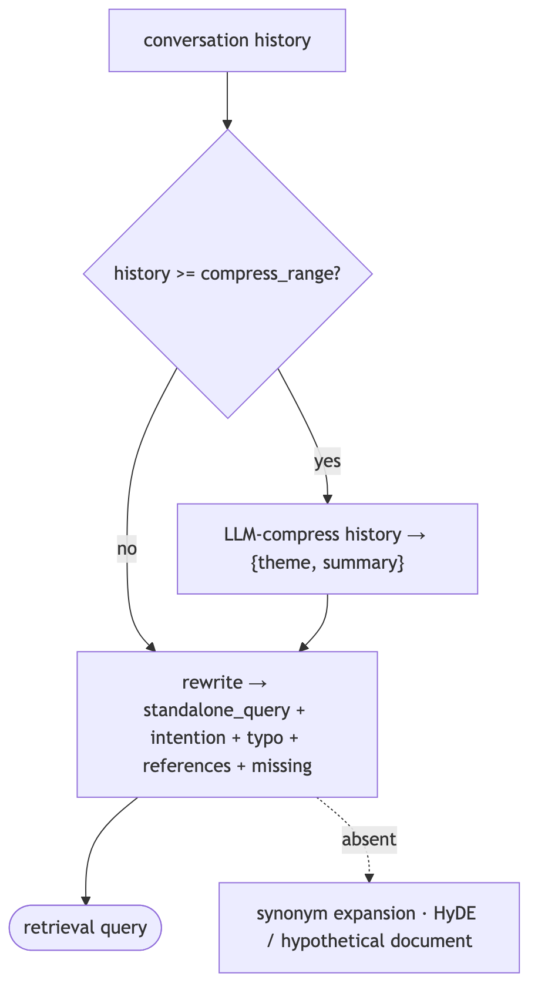
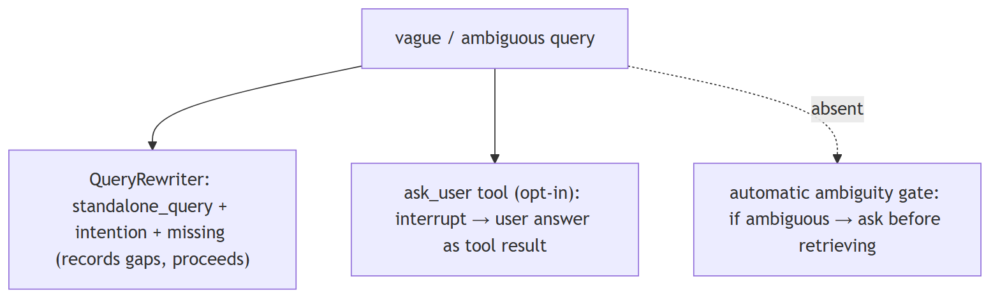
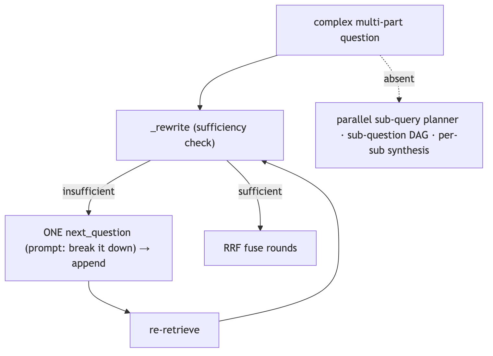
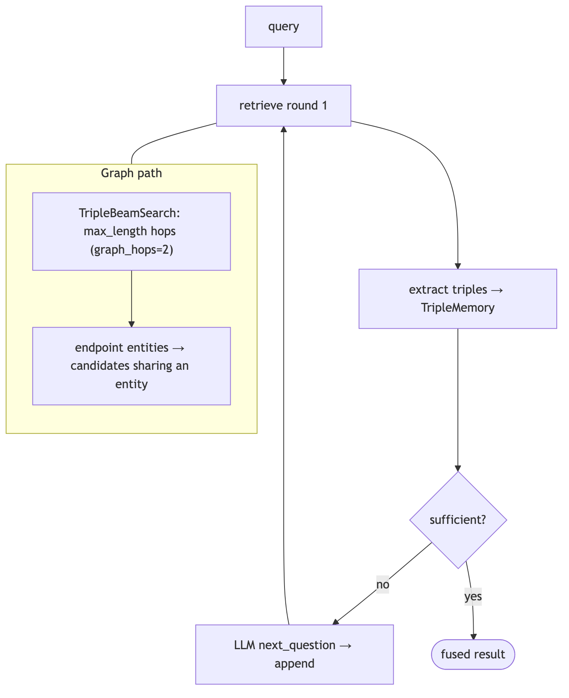
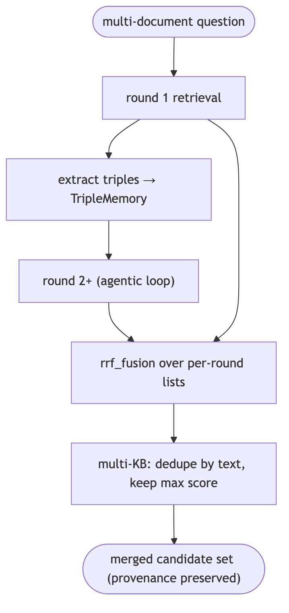
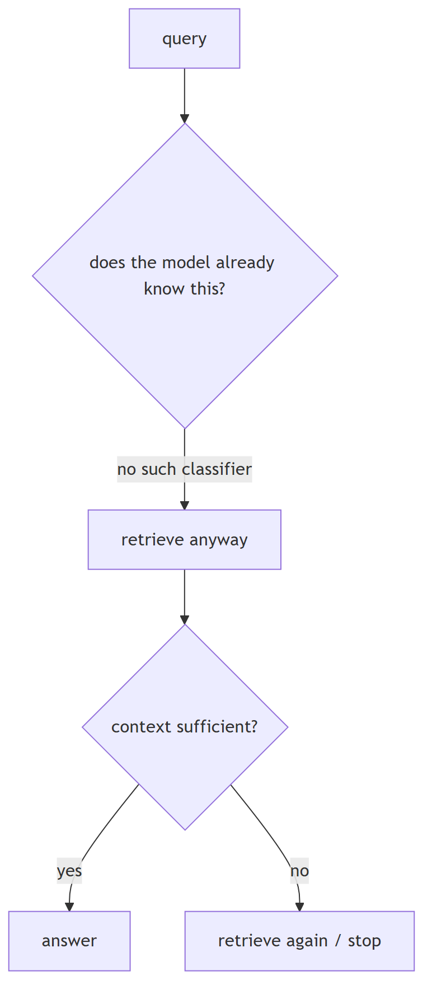
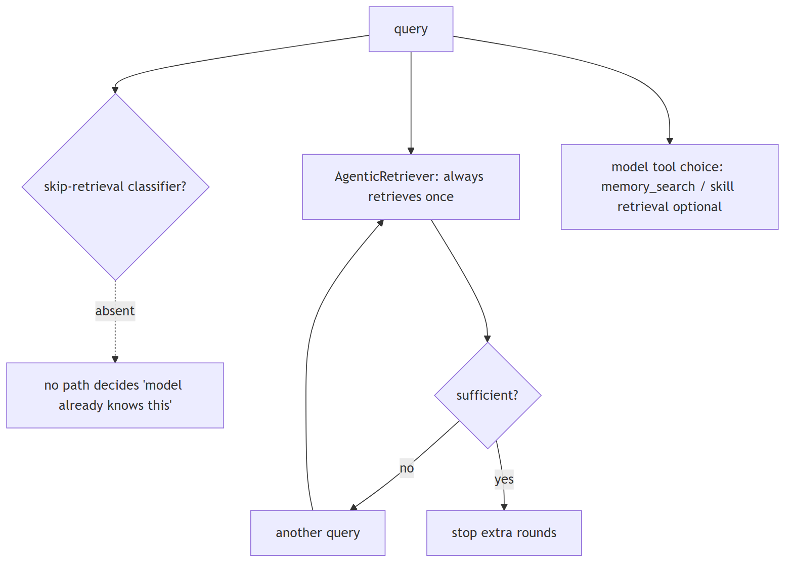

# Query understanding

## 1. What is query rewriting or query expansion, and when does it meaningfully improve retrieval quality

Mechanism basic

**Summary.** Rewriting makes a query self-contained (coreference, typos, prior-turn reliance); expansion adds terms/synonyms or a hypothetical answer (HyDE) to bridge vocabulary gaps.

**Key points.**

- Rewriting: coreference/ellipsis, typos, drop turn dependence.
- Expansion: synonyms or a hypothetical answer (HyDE).
- Rewriting for multi-turn/malformed; expansion for vocabulary mismatch.

**General.** Query rewriting makes a query self-contained (resolves coreference/ellipsis, fixes typos, removes reliance on prior turns) — it improves multi-turn and malformed queries. Query expansion adds terms/synonyms or generates a hypothetical answer (HyDE) to bridge vocabulary mismatch. Rewriting helps conversational and noisy queries; expansion helps when the corpus uses different wording than the user.

**Jiuwen.** Jiuwen does context-aware rewriting, not expansion: it produces a self-contained query, fixes typos, detects gibberish, summarizes intent, and lists gaps, and it compresses long history before rewriting. There is no synonym expansion and no HyDE, so keep that distinction in mind.

<b>Jiuwen technical detail (classes &amp; functions)</b>

**Implementation**

`QueryRewriter` performs context-aware rewriting, not expansion: it produces a self-contained `standalone_query`, corrects typos, detects gibberish, summarizes intent, and lists gaps. When history reaches `compress_range` it first LLM-compresses history into a `{theme, summary}` system message, then rewrites from the recent turns — history compression, not query expansion. There is no synonym expansion and no HyDE.

**Code anchors**

| Code anchor | What it points to |
|---|---|
| `agent-core/openjiuwen/core/retrieval/query_rewriter/query_rewriter.py:412` | rewrite(); :349 compress(); :449 history ≥ compress_range; :227 compress_range default 20 |
| `agent-core/openjiuwen/core/retrieval/query_rewriter/prompts/intention_completion_en.md:32` | coreference resolution; :47 typo correction |
| `agent-core/openjiuwen/core/retrieval/retriever/agentic_retriever.py:326` | follow-up question generation |

**Canonical source**

`source/rag-part2-interview-questions_for_engineers.md`

---

## 2. How would you handle a vague or ambiguous user query before it even reaches retrieval

Mechanism advanced

**Summary.** Detect ambiguity and either ask a clarifying question or rewrite to the most likely intent; cheap path is a rewrite, interactive path is a clarification turn.

**Key points.**

- Rewrite resolves coreference/ellipsis for free.
- Ask a clarification only when it changes the retrieval target.
- Don't blindly retrieve on an ambiguous query.

**General.** Detect ambiguity and either ask a clarifying question or rewrite to the most likely intent. The cheap path is a rewrite that resolves coreference/ellipsis; the interactive path is a clarification turn when the ambiguity would change the retrieval target. Most production systems rewrite by default and clarify only when confidence is low.

**Jiuwen.** Jiuwen does not ask the user before retrieving: the query rewriter marks unfilled gaps and records them but still proceeds with a best-effort query. Asking the user is a separate, opt-in mechanism (an interrupt tool) that is not wired automatically into the RAG flow as an ambiguity gate.

<b>Jiuwen technical detail (classes &amp; functions)</b>

**Implementation**

Ambiguity is not resolved by asking the user pre-retrieval. `QueryRewriter.rewrite` returns `intention`, `standalone_query`, `references`, and a `missing` list; when a gap cannot be filled from history it marks the gap with `(…)` in the standalone query and records it in `missing` but still proceeds with a best-effort query. Asking the user is a separate, opt-in mechanism: `AskUserRail`/`AskUserTool` interrupt the tool loop and return the answer as a tool result. None of these is wired automatically into the RAG flow as an ambiguity gate.

**Code anchors**

| Code anchor | What it points to |
|---|---|
| `agent-core/openjiuwen/core/retrieval/query_rewriter/query_rewriter.py:412` | rewrite(); :277 output schema (intention/references/missing/typo) |
| `agent-core/openjiuwen/core/retrieval/query_rewriter/prompts/intention_completion_en.md:41` | missing-info completion (marks gaps, does not ask) |
| `agent-core/openjiuwen/harness/tools/ask_user.py:11` | AskUserTool; agent-core/openjiuwen/harness/rails/interrupt/ask_user_rail.py:63 — resolve_interrupt |
| `agent-core/openjiuwen/core/controller/schema/intent.py:59` | UNKNOWN_TASK clarification prompt; agent-core/openjiuwen/core/controller/modules/intent_recognizer.py:436 |

**Canonical source**

`source/rag-part2-interview-questions_for_engineers.md`

---

## 3. How would you decompose a complex, multi-part question into smaller retrievable sub-questions

Mechanism advanced

**Summary.** Split a compound question into independently answerable sub-questions, retrieve for each (often in parallel), then synthesize.

**Key points.**

- Break 'compare A and B on X and Y' into sub-questions.
- Retrieve per sub-question; merge and dedupe.
- Synthesize across the sub-answers.

**General.** Split "compare A and B on X and Y" into independently answerable sub-questions, retrieve for each (often in parallel), then synthesize. A dedicated LLM decomposition call or an agentic loop generates the sub-questions; a planner can produce a DAG when there are dependencies.

**Jiuwen.** Jiuwen does prompt-level, sequential decomposition inside its agentic retriever: the rewrite prompt tells the model to break the question down if needed, and when the accumulated facts are insufficient it generates exactly one follow-up question, appends it to the query list, and retrieves again, fusing each round's results. There is no parallel multi-query planner; it is a single next-question loop.

<b>Jiuwen technical detail (classes &amp; functions)</b>

**Implementation**

Decomposition is prompt-level and **sequential** inside `AgenticRetriever`. `_REWRITE_PROMPT` instructs the LLM to "break it down into smaller questions if needed", and when triples are insufficient it generates exactly one `next_question`, appended to `queries` and used as the next retrieval query; rounds are fused with RRF. It is not a parallel sub-query planner: sub-questions are produced one at a time, conditioned on the prior round, capped at `max_iter` (default 2). `batch_retrieve` runs independent caller-supplied queries concurrently, not a decomposition.

**Code anchors**

| Code anchor | What it points to |
|---|---|
| `agent-core/openjiuwen/core/retrieval/retriever/agentic_retriever.py:70` | "Break it down into smaller questions if needed."; :326 _rewrite one next question; :213/272 loops; :290 append; :295 rrf_fusion(history_results); :133 max_iter=2; :530 batch_retrieve |
| `agent-core/openjiuwen/core/controller/legacy/reasoner/planner.py:12` | general task Planner (not retrieval) |

**Canonical source**

`source/rag-part2-interview-questions_for_engineers.md`

---

## 4. What is multi-hop retrieval, and when does single-pass retrieval fail to answer a question

Mechanism basic

**Summary.** Multi-hop runs more than one retrieval step, using the first hop's result to form the next query, because the answer needs a bridging entity not present in the original question.

**Key points.**

- The answer needs a bridging entity/fact.
- Each hop feeds the next query.
- Single-pass fails when the link isn't in the query.

**General.** Multi-hop retrieval runs more than one retrieval step, using what the first hop found to form the next query, because the answer needs a bridging entity that is not in the original query (e.g. "who employed the founder of X" needs X → founder → employer). Single-pass fails when the supporting evidence is only reachable through that intermediate entity, so the top-k for the original query never contains it. Graph/triple stores make hops explicit; query-decomposition approaches generate sub-queries.

**Jiuwen.** Jiuwen has two mechanisms: the agentic retriever keeps a query list and loops up to a maximum, extracting triples into a memory each round and asking the model for a next question when the facts are insufficient; and the graph retriever delegates to a beam search that expands a beam of triples across hops. So multi-hop is implemented in the agentic and graph paths, not the plain vector path.

<b>Jiuwen technical detail (classes &amp; functions)</b>

**Implementation**

Two mechanisms. `AgenticRetriever` keeps a `queries` list and loops up to `max_iter`, extracting triples each round into a `TripleMemory` and asking the LLM for a `next_question` when triples are insufficient. `GraphRetriever` delegates to `TripleBeamSearch`, which expands a beam of triples for `max_length` hops, re-querying from the two endpoint entities of the last triple and keeping only candidates that share an entity. Single-pass `VectorRetriever.retrieve` embeds once and returns `top_k` with no state.

**Code anchors**

| Code anchor | What it points to |
|---|---|
| `agent-core/openjiuwen/core/retrieval/retriever/agentic_retriever.py:213` | for turn in range(1, max_iter+1); :237 _read triples + batch_extend_memory; :244 _rewrite → append |
| `agent-core/openjiuwen/core/retrieval/retriever/graph_retriever.py:100` | beam expansion range(max_length-1); :190 endpoint entities {triple[0], triple[-1]}; :402 graph_hops = kwargs.get("graph_hops", 2) |
| `agent-core/openjiuwen/core/retrieval/common/triple_beam.py:12` | TripleBeam; agent-core/openjiuwen/core/retrieval/common/triple_memory.py:31 — extend_memory dedup |
| `agent-core/openjiuwen/core/memory/config/graph.py:86` | bfs_k/bfs_depth |
| `agent-core/openjiuwen/core/retrieval/retriever/vector_retriever.py:38` | fixed single-pass retrieve |

**Canonical source**

`source/rag-part2-interview-questions_for_engineers.md`

---

## 5. Handling a question requiring information from multiple documents

Mechanism intermediate

**Summary.** Retrieve a candidate set per sub-query or entity, merge and deduplicate, and let the generator synthesize across them (or add an aggregation step).

**Key points.**

- Per-sub-query retrieval, then merge/dedupe.
- Ranked-list fusion across queries.
- Generator synthesizes across documents.

**General.** Retrieve a candidate set per sub-query or per entity, then merge and deduplicate, and let the generator synthesize across them (or do an aggregation/summarization step). The hard parts are merging ranked lists from different queries, keeping per-document provenance for citation, and ensuring no single document dominates. Recall must be high because every needed document must be present.

**Jiuwen.** This is a strong area: the agentic retriever runs several rounds against a base retriever, accumulates a memory of facts, and fuses all per-round result lists with reciprocal rank fusion; graph expansion fetches related triples. Multi-document gathering is handled by the agentic/graph path with RRF fusion, though the default single-shot path retrieves once.

<b>Jiuwen technical detail (classes &amp; functions)</b>

**Implementation**

This is the strongest area. `AgenticRetriever` runs up to `max_iter` rounds against a base retriever, accumulating `TripleMemory`, then fuses all per-round result lists with RRF (`rrf_fusion(ret + history_results)` in graph mode, `rrf_fusion(history_results)` in generic mode). `GraphRetriever.graph_expansion` fetches triple-linked chunks and fuses new+original chunks via RRF. Multi-KB retrieval merges/dedupes by text keeping the max score. Core memory search aggregates across typed managers, and graph memory searches entity/relation/episode collections concurrently.

**Code anchors**

| Code anchor | What it points to |
|---|---|
| `agent-core/openjiuwen/core/retrieval/retriever/agentic_retriever.py:250` | rrf_fusion(ret + history_results)[:top_k] (graph mode); :295 rrf_fusion(history_results)[:top_k] (generic) |
| `agent-core/openjiuwen/core/retrieval/retriever/graph_retriever.py:520` | rrf_fusion([new_chunks, chunks], k=60) |
| `agent-core/openjiuwen/core/retrieval/simple_knowledge_base.py:285` | retrieve_multi_kb dedupe-by-text + max-score merge; :318 retrieve_multi_kb_with_source |
| `agent-core/openjiuwen/core/memory/manage/search/search_manager.py:86` | aggregate + sort + truncate |
| `agent-core/openjiuwen/core/memory/graph/graph_memory/base.py:422` | concurrent entity/relation/episode search |
| `agent-core/openjiuwen/core/retrieval/graph_knowledge_base.py:353` | retrieve_multi_graph_kb |

**Canonical source**

`source/rag-retrieval-interview-questions_for_engineers.md`

---

## 6. When to skip RAG and rely on parametric knowledge instead

Mechanism intermediate

**Summary.** Skip retrieval for general knowledge the model already holds, when latency/cost matter and the corpus won't add signal, or for conversational turns — but you need a way to decide.

**Key points.**

- Skip for general knowledge, reasoning, or code the model knows.
- Skip when the corpus adds no signal and cost/latency matter.
- Decide with a classifier or a sufficiency check.

**General.** Skip retrieval when the question is general knowledge the model already holds (definitions, common facts, reasoning, code), when latency/cost matter and the corpus is unlikely to add signal, or when the query is conversational and context is already in the window. Retrieve when the answer depends on private, recent, or verifiable facts. The decision is often made by the model choosing whether to call a retrieval tool; a cheap classifier is the alternative.

**Jiuwen.** There is no skip-retrieval classifier. Agentic mode is opt-in and, when on, always retrieves at least once; its sufficiency judgment only decides whether to issue another rewritten query (it stops extra rounds, never the first). So Jiuwen never decides to rely solely on parametric knowledge before retrieving.

<b>Jiuwen technical detail (classes &amp; functions)</b>

**Implementation**

There is no skip-retrieval classifier. `RetrievalConfig.agentic` is opt-in (default `False`); when enabled, `AgenticRetriever` still executes at least one retrieval unconditionally and uses an LLM "sufficiency" judgment only to decide whether to issue *another* rewritten query — it stops extra rounds, never the first. Otherwise the retrieval-vs-parametric decision is delegated to the model's tool choice: `memory_search` is a normal tool card the agent may elect to call, and skill retrieval is invoked through tool calls. Nothing inspects the query to decide "the model already knows this".

**Code anchors**

| Code anchor | What it points to |
|---|---|
| `agent-core/openjiuwen/core/retrieval/retriever/agentic_retriever.py:173` | retrieve always performs one round; :326 _rewrite returns None when sufficient; :241 loop breaks after max_iter |
| `agent-core/openjiuwen/core/retrieval/common/config.py:51` | RetrievalConfig.agentic: bool = False (opt-in, not a router) |
| `agent-core/openjiuwen/harness/tools/memory.py:25` | memory_search tool (model decides whether to call) |

**Implementation diagram**

**Canonical source**

`source/rag-practical-interview-questions_for_engineers.md`

---
