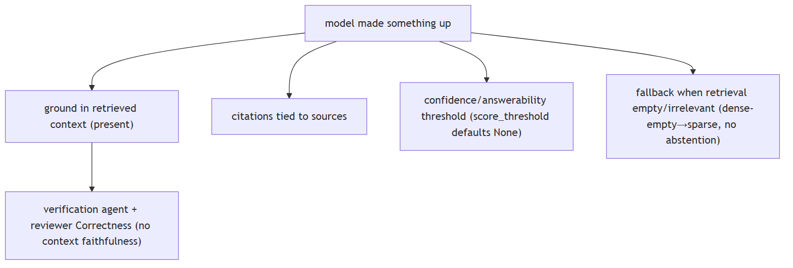
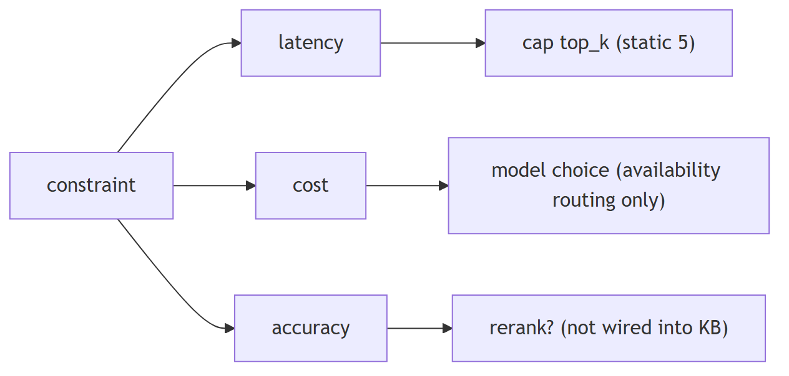
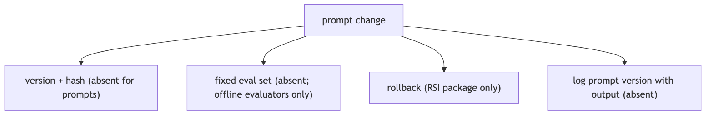

# LLM interview patterns

## 1. "How does the model know X" is really testing context window understanding

**Title.** 'How does the model know X': context window understanding

**Summary.** 'How does the model know X' is really testing context-window understanding.

**Key points.**

- Strictest-bound budget.
- Offload large tool results.
- Multi-stage compaction.
- FIFO drop beyond message cap.

**Jiuwen.** The context engine decides what is in the window and how it is trimmed: a strictest-bound budget, offload of large tool results, multi-stage compaction, and a FIFO drop beyond the max context message count, all biased toward the newest turns.

<b>Technical detail (classes &amp; functions)</b>

The context engine decides what is in the window and how it is trimmed: a strictest-bound budget, offload of large tool results, multi-stage compaction, and a FIFO drop beyond `max_context_message_num`, all biased toward the newest turns. There is no lost-in-the-middle awareness and no entity disambiguation/aliasing.

&bull; `agent-core/openjiuwen/core/context_engine/context/context_utils.py:20/404` — window resolution &bull; `agent-core/openjiuwen/core/context_engine/processor/budget_guard.py:37` — effective_context_budget (strictest) &bull; `agent-core/openjiuwen/core/context_engine/context/message_buffer.py:71` — FIFO drop &bull; `agent-core/openjiuwen/core/context_engine/processor/offloader/tool_result_budget_processor.py:34` — offload threshold &bull; `agent-core/openjiuwen/core/context_engine/processor/compressor/full_compact_processor.py:184` — compaction

---

## 2. "The model made something up" is testing hallucination handling, not model quality

**Title.** 'The model made something up': hallucination handling

**Summary.** 'The model made something up' is testing hallucination handling, not model quality.

**Key points.**

- Verification agent (read-only, PASS/FAIL/PARTIAL).
- Reviewer correctness dimension.
- No answerability gate/abstention.
- No faithfulness judge with context.

**Jiuwen.** Grounding is a separate, non-blocking layer: a verification agent (read-only evidence, PASS/FAIL/PARTIAL) and a reviewer correctness dimension. But score threshold defaults to none, there is no answerability gate or abstention in the knowledge-base path, and no judge receives the retrieved context.

<b>Technical detail (classes &amp; functions)</b>

Grounding is a separate, non-blocking layer: a verification agent (read-only evidence, PASS/FAIL/PARTIAL) and a reviewer `Correctness` dimension. But `score_threshold` defaults to `None`, there is no answerability gate or abstention in the KB path, and no judge receives the retrieved context (no faithfulness score).

&bull; `agent-core/openjiuwen/harness/rails/subagent/verification_rail.py:92` — VerificationRail allowlist &bull; `agent-core/openjiuwen/agent_teams/verification/reviewer.py:43` — Correctness dimension &bull; `agent-core/openjiuwen/core/retrieval/common/config.py:47` — score_threshold default None &bull; `agent-core/openjiuwen/core/retrieval/retriever/vector_retriever.py:83` — dense-empty → sparse fallback &bull; `agent-core/openjiuwen/agent_evolving/evaluator/metrics/llm_as_judge.py:40` — no context input

---

## 3. Any A-vs-B comparison is testing tradeoff reasoning, not the "right" answer

**Title.** A-vs-B comparisons: tradeoff reasoning

**Summary.** Any A-vs-B comparison is testing tradeoff reasoning, not the 'right' answer.

**Key points.**

- top_k defaults 5.
- No reranking in the KB path.
- Allocation is availability-based.
- Session cost tracked and capped.

**Jiuwen.** The knobs are static and named: top-k defaults to 5, reranking is not in the knowledge-base path (so retrieve-many-then-rerank is unavailable), and model allocation is availability-based rather than cost or accuracy based. Session cost is tracked and capped when the provider reports it.

<b>Technical detail (classes &amp; functions)</b>

The knobs are static and named: `top_k` defaults to 5, reranking is not in the KB path (so retrieve-many-then-rerank is unavailable), and model allocation is availability-based rather than cost/accuracy-based. Session cost is tracked and capped when the provider reports it.

&bull; `agent-core/openjiuwen/core/retrieval/common/config.py:46` — top_k: int = 5 &bull; `agent-core/openjiuwen/core/retrieval/simple_knowledge_base.py:182` — no reranker in KB retrieve &bull; `agent-core/openjiuwen/agent_teams/models/allocator.py:559` — availability strategies &bull; `jiuwenswarm/jiuwenswarm/server/runtime/usage_cost.py:171` — enforced session cost cap

---

## 4. "The agent is stuck in a loop" is testing production experience

**Title.** 'Stuck in a loop': production experience

**Summary.** 'The agent is stuck in a loop' is testing production experience.

**Key points.**

- ReAct max_iterations (5; harness 15).
- Agentic retriever max_iter (2, clamped).
- Anomaly rail compact/abort.
- Dedup rail; idempotent=False default.

**Jiuwen.** Caps are concrete: ReAct max iterations (5, harness 15), agentic-retriever max iterations (2, clamped), an anomaly-detection rail (identical tool rounds trigger compaction or abort), a tool-call dedup rail, and secure-by-default non-idempotent tool handling.

<b>Technical detail (classes &amp; functions)</b>

Caps are concrete: ReAct `max_iterations` (5; harness 15), `AgenticRetriever.max_iter` (2, clamped), `ModelAnomalyDetectionRail` (identical tool rounds → compact/abort), `ToolCallDeduplicationRail`, and secure-by-default `idempotent=False` (non-idempotent tools never retried). A session cost cap is enforced when the provider reports cost; a per-step token budget in the task loop is wired but off by default.

&bull; `agent-core/openjiuwen/core/single_agent/agents/react_agent.py:288` — max_iterations=5; agent-core/openjiuwen/harness/schema/config.py:252 — harness 15 &bull; `agent-core/openjiuwen/core/retrieval/retriever/agentic_retriever.py:133` — max_iter=2 clamped &bull; `agent-core/openjiuwen/harness/rails/model_anomaly_detection_rail.py:74/90` — loop compact/abort &bull; `agent-core/openjiuwen/core/foundation/tool/base.py:109` — idempotent default False &bull; `agent-core/openjiuwen/harness/rails/tool_call_resilience_rail.py:128/145` — non-idempotent guard + retry budget &bull; `jiuwenswarm/jiuwenswarm/server/runtime/usage_cost.py:171` — session cost cap

---

## 5. Any prompt behavior question is secretly a versioning and testing question

**Title.** Prompt behavior: versioning and testing

**Summary.** Any prompt behavior question is secretly a versioning and testing question.

**Key points.**

- Sections carry name/priority/category, no version.
- Optimization overwrites in place.
- Diagnostics ≠ versioning.
- Rollback only at harness-package level.

**Jiuwen.** Prompts are assembled from named sections that carry only name, priority, category, and carrier — no version or hash; optimization overwrites them in place; and the prompt report is diagnostics, not versioning. Rollback exists only at the RSI harness-package level.

<b>Technical detail (classes &amp; functions)</b>

Prompts are assembled from named `PromptSection`s that carry only name/priority/category/carrier (no version/hash); optimization overwrites them in place; `PromptReport` is diagnostics, not versioning. Rollback exists only at the RSI **harness-package** level, and the CI gate has no eval threshold. Logs carry spans but not a prompt-version identifier.

&bull; `agent-core/openjiuwen/core/single_agent/prompts/builder.py:24` — PromptSection (no version); :219 build &bull; `agent-core/openjiuwen/harness/prompts/report.py:58` — PromptReport diagnostics &bull; `agent-core/openjiuwen/agent_evolving/checkpointing/manager.py:43` — checkpoint version (operator state) &bull; `jiuwenswarm/jiuwenswarm/agents/harness/common/rsi/harness_activation.py:617` — package-level rollback &bull; `agent-core/openjiuwen/auto_harness/resources/ci_gate.yaml:21` — no eval gate

---

## 6. "How do you know it's working" is testing evaluation depth

**Title.** 'How do you know it's working': eval depth

**Summary.** 'How do you know it's working' is testing evaluation depth.

**Key points.**

- Offline answer-level eval exists.
- No faithfulness/relevance metric.
- No retrieval metric layer.
- No CI quality gate.

**Jiuwen.** Offline answer-level evaluation exists (exact match, LLM judge, rubric, pipeline pass rate), but there is no faithfulness or relevance metric (the judges lack the retrieved context), no retrieval metric layer, and no CI quality gate (the gate is lint and type-check).

<b>Technical detail (classes &amp; functions)</b>

Offline answer-level evaluation exists (`ExactMatchMetric`, `LLMAsJudgeMetric`, RSI rubric, `evaluator_pipeline`), but there is no faithfulness/relevance metric (judges lack the retrieved context), no retrieval metric layer, no CI quality gate (lint/type-check only), no human-sampling pipeline, and no production quality monitoring. The "how would you know it got worse" follow-up exposes real gaps.

&bull; `agent-core/openjiuwen/agent_evolving/evaluator/metrics/llm_as_judge.py:40` — no context input; agent-core/openjiuwen/agent_evolving/evaluator/metrics/exact_match.py:12 — exact match &bull; `agent-core/openjiuwen/rsi/harness_rsi/evaluator/judger/scoring.py:193` — weighted rubric &bull; `agent-core/openjiuwen/agent_evolving/evaluator/evaluator_pipeline/pipeline.py:167` — benchmark eval &bull; `agent-core/openjiuwen/auto_harness/resources/ci_gate.yaml:21` — lint/type-check only; agent-core/pyproject.toml:236 — markers not invoked &bull; `jiuwenswarm/jiuwenswarm/observability/store.py:102` — has_error (operations, not quality)

---

## 7. Any question about untrusted input is testing prompt injection awareness

**Title.** Untrusted input: injection awareness

**Summary.** Any question about untrusted input is testing prompt-injection awareness.

**Key points.**

- Tool results are plain messages.
- Sanitizers unused; detector unregistered.
- Safety rail is advisory.
- Real control: shell/permission layer.

**Jiuwen.** Weakest area. Tool results are plain messages with no untrusted-data framing, the sanitizer has no production callers, the injection detector is unregistered, and the safety rail is advisory. The real controls are in the shell and permission layer (substitution blocking, AST ask floor).

<b>Technical detail (classes &amp; functions)</b>

Weakest area. Tool results are plain `ToolMessage` with no untrusted-data framing, `sanitize.py` has no production callers, the injection detector is unregistered, and `SafetyPromptRail` is advisory. The real controls are in the shell/permission layer (substitution blocking, AST ASK floor, builtin deny rules).

&bull; `agent-core/openjiuwen/core/single_agent/ability_manager.py:1612` — ToolMessage with no wrapper &bull; `agent-core/openjiuwen/harness/prompts/sanitize.py:20` — no production callers &bull; `agent-core/openjiuwen/core/security/guardrail/builtin.py:60` — PromptInjectionGuardrail (unregistered) &bull; `agent-core/openjiuwen/harness/rails/security/prompt_security_rail.py:16` — advisory safety rail &bull; `agent-core/openjiuwen/harness/security/permission_engine/toolguard/tool_policy.py:409` — shell AST ASK floor

---
