# RAG failure modes and evaluation

## 1. How do you measure whether your retrieval step is actually working

Mechanism intermediate

**TL;DR.** Use a labeled (query, relevant docs) set and ranked metrics — Recall@k, Precision@k, MRR, NDCG — and track zero-result rate.

**Key points.**

- Recall@k: did the relevant docs make the top-k?
- Precision@k / MRR / NDCG: how high and how well-ordered the hits are.
- Track zero-result rate and score distributions in production.
- Judge retrieval separately from generation.

**Concept.** Use retrieval metrics against a labeled set of (query, relevant docs): Recall@k (did the relevant docs appear in top-k?), Precision@k (of the top-k, how many are relevant?), MRR (mean of 1/rank of the first relevant hit, averaged over queries), and NDCG (position-weighted with graded relevance). Track zero-result rate and score distributions in production, and check that a reranker actually improves NDCG rather than just reordering.

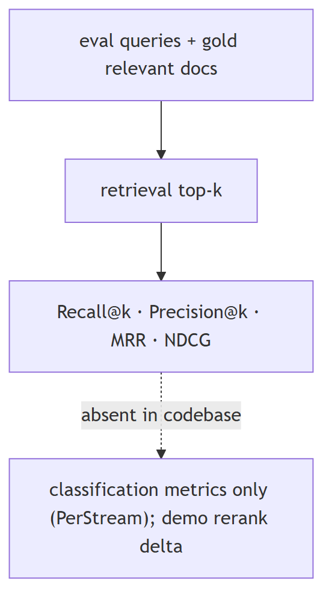

**In Jiuwen.** Jiuwen does not ship retrieval metrics — there is no recall/precision/MRR/NDCG and no gold-relevance set; its metric interface is pairwise (prediction vs label), not ranked-list. The reranker ships only a demo score-delta script. So measuring retrieval here means bringing your own labeled set and tooling; in-repo you can only observe retrieval scores and whether results came back.

<b>Under the hood</b>

**Implementation**

None of these metrics exist. There is no `recall_at_k`/`precision_at_k`/MRR/NDCG, no ranked-list metric interface (`Metric.compute(prediction, label)` is pairwise), and no gold-relevance set. The only recall/precision present is *classification* metrics in the PerStream example and sklearn gate tests. The reranker's only before/after evidence is a demo score-delta script with no labels.

**Code anchors**

| Code anchor | What it points to |
|---|---|
| `agent-core/openjiuwen/agent_evolving/evaluator/metrics/base.py:42` | compute(prediction, label), no ranked list |
| `agent-core/openjiuwen/agent_evolving/evaluator/metrics/__init__.py:11` | only three metrics exported |
| `agent-core/examples/PerStream/src/eval/score_proactive_judge.py:355/362` | classification recall/precision |
| `agent-core/examples/store/showcase_milvus_graph_store.py:51` | reranker score-delta (no labels) |

---

## 2. Retrieval looks correct, answer is wrong: check if the chunk actually contains the answer

Mechanism intermediate

**TL;DR.** 'Looked relevant' isn't 'contains the answer': read the chunk and confirm the answer span is present; if not, retrieval failed; if yes, generation failed.

**Key points.**

- First check: is the answer actually in the retrieved chunk?
- No → retrieval failure (chunking, index, query mismatch).
- Yes → generation/grounding failure.

**Concept.** "Looked relevant" is not "contains the answer". The first diagnostic is to read the retrieved chunks and confirm the answer span is actually present — if it is not, retrieval failed (bad chunking, wrong index, query mismatch); if it is present but the answer is wrong, the problem is generation or grounding. This is why faithfulness evaluation needs the retrieved context, not just answer-vs-reference.

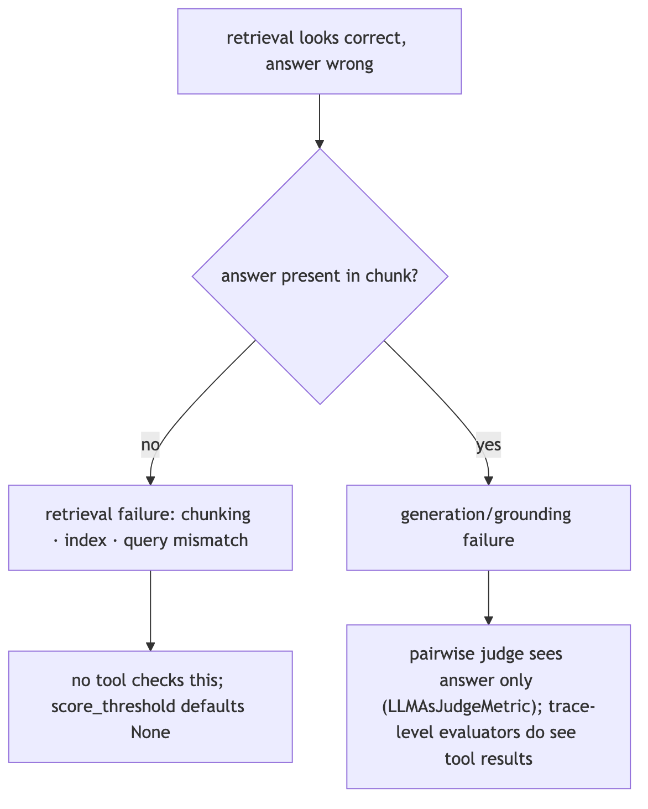

**In Jiuwen.** There is no tooling to check whether a retrieved chunk contains the answer. The nearest signals are weak: no score threshold by default, only lexical relevance checks, and judges that never see the retrieved context — so they cannot tell a chunk that contains the answer from one that merely looks similar. You would diagnose this manually.

<b>Under the hood</b>

**Implementation**

There is no tooling for "does the retrieved chunk contain the answer". The closest signals: `score_threshold` defaults to `None` (so weak chunks pass), relevance checks are lexical (`free_search`), and the judges (`AccuracyEvaluator`, `LLMAsJudgeMetric`) do not receive the retrieved context, so they cannot distinguish "context lacks the answer" from "model ignored it". The `VerificationReviewer`'s `Correctness` dimension checks the output, not the grounding.

**Code anchors**

| Code anchor | What it points to |
|---|---|
| `agent-core/openjiuwen/core/retrieval/common/config.py:47` | score_threshold defaults None |
| `agent-core/openjiuwen/harness/tools/web/free_search.py:299` | lexical relevance only |
| `agent-core/openjiuwen/symphony/evaluation/evaluators.py:438` | AccuracyEvaluator (no context input) |
| `agent-core/openjiuwen/agent_evolving/evaluator/metrics/llm_as_judge.py:58` | parses result: true/false, no context/attribution |
| `agent-core/openjiuwen/agent_teams/verification/reviewer.py:43` | Correctness dimension on the output |

---

## 3. How do you handle hallucinations when retrieved context doesn't actually answer the question

Mechanism intermediate

**TL;DR.** Detect that the context is insufficient, then answer only from what's supported: gate on retrieval score/answerability, allow explicit 'I don't know', and verify claims against the context.

**Key points.**

- Detect insufficient context (score/answerability gate).
- Allow explicit abstention ('I don't know').
- Ground/verify claims against the context.

**Concept.** First detect that the context is insufficient, then answer only from what is supported: gate on retrieval score/answerability, allow an explicit "I don't know" abstention, and verify claims against the context (citations/groundedness). Without an answerability gate, a model will still produce a fluent answer from irrelevant context. The failure mode is under-specified retrieval, not just a bad generator.

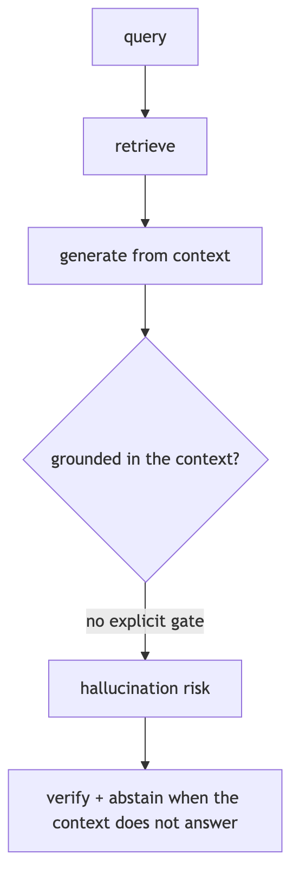

**In Jiuwen.** There is a score filter, but it defaults to off, so out-of-scope chunks are normally returned. The only 'answerable?' logic is in the agentic retriever, which asks whether the facts are sufficient — and 'not sufficient' only triggers a follow-up query, never a user-facing abstention. So in the default path there is no grounded 'I don't know'.

<b>Under the hood</b>

**Implementation**

There is a retrieval score filter (`score_threshold`) but its default is `None`, so out-of-scope chunks are normally returned. The closest "answerable?" logic is in `AgenticRetriever`, which asks an LLM whether current facts are `sufficient` — but `sufficient=False` only generates a follow-up query, never a user-facing abstention. A true abstention path exists only inside `symphony/retrieval` internal selection (`is_abstain` → empty candidates). Grounding is provided by separate higher layers: the `VerificationReviewer` scores a `Correctness` dimension and downgrades status, the RSI judge forbids treating claims as proof, and the harness verification agent requires command evidence with a PASS/FAIL/PARTIAL verdict — none of which is a RAG answerability gate.

**Implementation diagram**

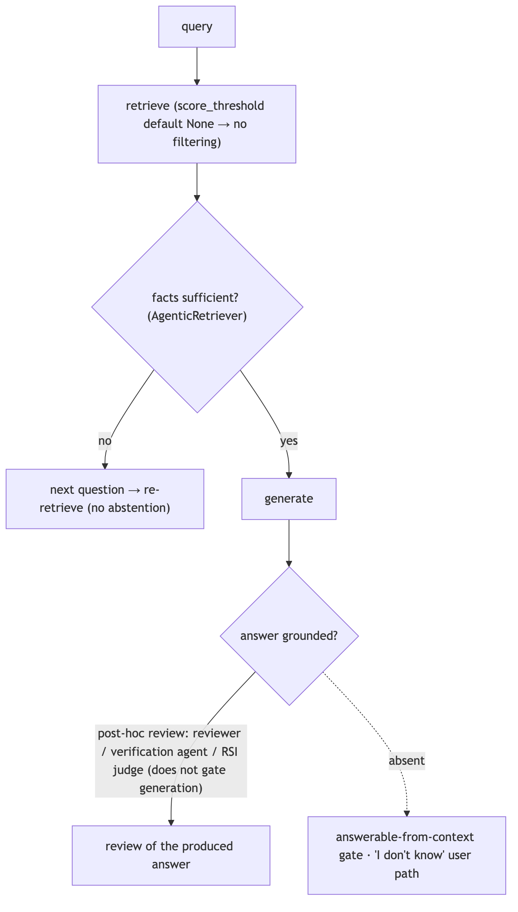

**Code anchors**

| Code anchor | What it points to |
|---|---|
| `agent-core/openjiuwen/core/retrieval/common/config.py:47` | score_threshold defaults None; agent-core/openjiuwen/core/retrieval/retriever/vector_retriever.py:94 / agent-core/openjiuwen/core/retrieval/retriever/hybrid_retriever.py:117 — applied only when supplied |
| `agent-core/openjiuwen/core/retrieval/retriever/agentic_retriever.py:326` | _rewrite sufficiency check (rewrite, not abstain) |
| `agent-core/openjiuwen/symphony/retrieval/search/runtime/engine.py:94` | is_abstain → empty candidates; agent-core/openjiuwen/symphony/retrieval/search/runtime/selector.py:305 — is_abstain |
| `agent-core/openjiuwen/agent_teams/verification/reviewer.py:43` | Correctness dimension; :279 threshold re-normalization |
| `agent-core/openjiuwen/harness/subagents/verification_agent.py:51` | PASS/FAIL/PARTIAL verdict |

---

## 4. How do you handle retrieval when documents contain conflicting or outdated information on the same topic

Mechanism intermediate

**TL;DR.** Apply precedence before generation — recency, source authority, or an explicit priority field; dedupe/reconcile; and surface the conflict (or abstain).

**Key points.**

- Precedence: newest / most authoritative / priority field.
- Dedupe and reconcile conflicting facts.
- Surface the conflict or abstain rather than guess.

**Concept.** Prefer precedence rules before generation: recency (timestamp), source authority, or an explicit priority field; dedupe/reconcile; and either surface the conflict to the model with the metadata or abstain. Outdated facts are usually handled by recency-weighted ranking or by versioning/tombstoning superseded documents. Unchecked, the model picks the first or most fluent version.

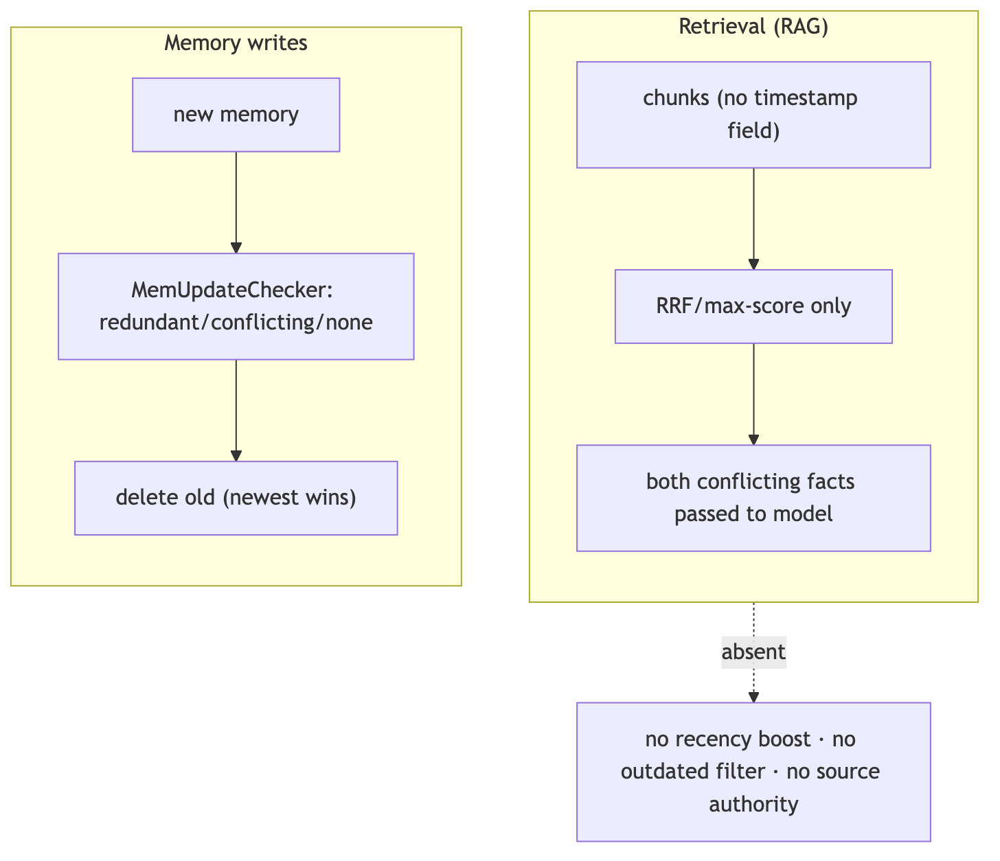

**In Jiuwen.** The retrieval layer has no notion of document time: chunks carry only text, score, and metadata, parsers set no timestamp, and ranking is score/rank only — no recency boost or 'outdated' filter. Conflict handling exists only at the memory layer (newest wins), not in retrieval, so conflicting documents are not reconciled during RAG.

<b>Under the hood</b>

**Implementation**

The retrieval layer has no notion of document time at all: `RetrievalResult`/`TextChunk` carry only `text`/`score`/metadata, parsers populate no timestamp, and ranking is score/rank only (RRF by rank, max-score merge) — no recency boost or "outdated" filter. Conflict handling exists only at the **memory** layer: `MemUpdateChecker` classifies a new memory as redundant/conflicting/none and deletes superseded old memories (newest wins). A freshness notion exists in the experience subsystem (`calc_freshness`, time decay) but scores experience records, not retrieved documents.

**Code anchors**

| Code anchor | What it points to |
|---|---|
| `agent-core/openjiuwen/core/retrieval/common/retrieval_result.py:23` | RetrievalResult (no timestamp/recency) |
| `agent-core/openjiuwen/core/retrieval/common/document.py:30` | TextChunk (text/doc_id/metadata only) |
| `agent-core/openjiuwen/core/retrieval/utils/fusion.py:39` | RRF by text/rank; agent-core/openjiuwen/core/retrieval/simple_knowledge_base.py:313 — max-score merge, no recency tiebreak |
| `agent-core/openjiuwen/core/memory/manage/update/mem_update_checker.py:22` | CheckResult; :252 conflicting → add new/delete old; agent-core/openjiuwen/core/memory/manage/index/fragment_memory_manager.py:163 |
| `agent-core/openjiuwen/agent_evolving/experience/scorer.py:219` | calc_freshness (experiences only) |
| `agent-core/openjiuwen/core/memory/long_term_memory.py:1004` | search sorts by score, ignores timestamp |

---

## 5. No relevant documents exist: expected behavior is a confidence-gated "not enough information"

Mechanism intermediate

**TL;DR.** When retrieval returns nothing relevant, abstain rather than answer from noise: gate on a score threshold or answerability check and return 'not enough information'.

**Key points.**

- Gate on retrieval score or answerability.
- Abstain or ask a clarifying question.
- Don't generate from out-of-scope chunks.

**Concept.** When retrieval returns nothing relevant, the system should abstain rather than answer from noise: gate on a retrieval-score threshold or an explicit answerability check, and return "not enough information" (or ask a clarifying question). Without this, the model will still produce a fluent answer from irrelevant context.

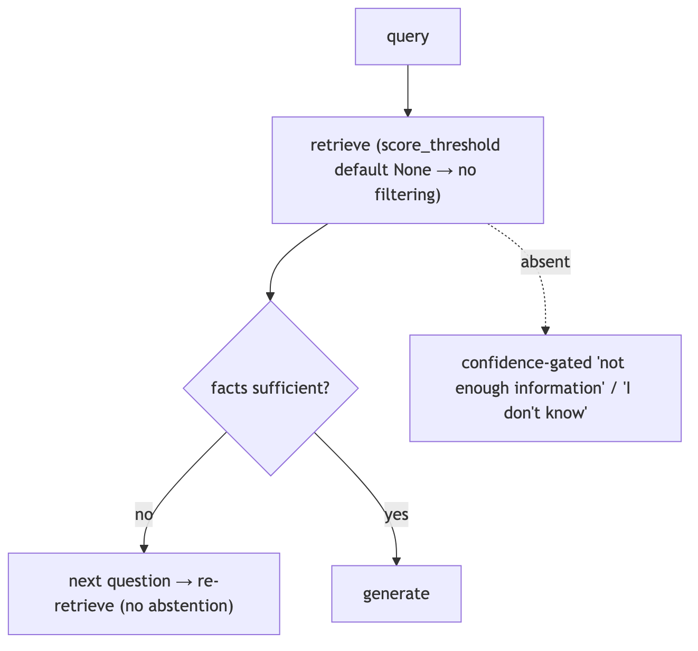

**In Jiuwen.** There is a score filter, but its default is off, so out-of-scope chunks are normally returned. The agentic retriever's sufficiency check only triggers another query, never a user-facing abstention. A real abstention path exists only in a separate retrieval subsystem, not in the knowledge-base RAG path.

<b>Under the hood</b>

**Implementation**

There is a retrieval score filter but its default is `None`, so out-of-scope chunks are normally returned. `AgenticRetriever` asks an LLM whether facts are `sufficient`, but `sufficient=False` only generates a follow-up query — never a user-facing abstention. A true abstention path exists only in `symphony/retrieval` internal selection (`is_abstain` → empty candidates). Grounding is a separate, non-blocking review layer.

**Code anchors**

| Code anchor | What it points to |
|---|---|
| `agent-core/openjiuwen/core/retrieval/common/config.py:47` | score_threshold defaults None; agent-core/openjiuwen/core/retrieval/retriever/vector_retriever.py:94 — applied only when supplied |
| `agent-core/openjiuwen/core/retrieval/retriever/agentic_retriever.py:326` | _rewrite sufficiency (rewrite, not abstain) |
| `agent-core/openjiuwen/symphony/retrieval/search/runtime/engine.py:94` | is_abstain → empty candidates; agent-core/openjiuwen/symphony/retrieval/search/runtime/selector.py:305 — is_abstain |
| `agent-core/openjiuwen/harness/subagents/verification_agent.py:51` | PASS/FAIL/PARTIAL verdict |

---

## 6. Same question, different answers on different days: non-deterministic reranking or embedding drift

Mechanism intermediate

**TL;DR.** Run-to-run variation comes from sampling (temperature/seed), non-deterministic remote rerankers, and embedding drift (provider updates the model behind the same name, or you switch models).

**Key points.**

- Sampling: pin temperature 0 and use a seed.
- Remote rerankers may be non-deterministic.
- Embedding drift: fingerprint the model and re-index on change.

**Concept.** Run-to-run variation comes from sampling (temperature/seed), non-deterministic remote rerankers, and embedding drift (the provider updates the embedding model behind the same name, or you change models). Remedies: pin temperature/seed, store a model/version fingerprint with the index, and re-index when the fingerprint changes. Identical inputs should otherwise be reproducible.

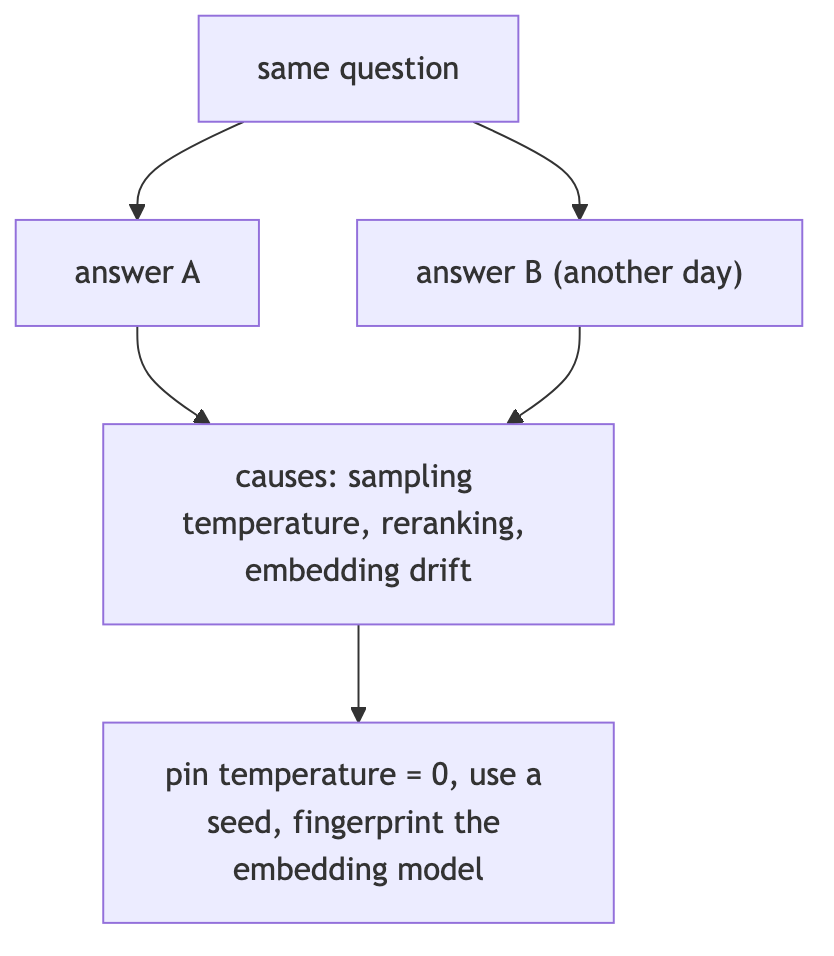

**In Jiuwen.** Determinism is partial: the chat reranker and the agentic rewrite use temperature 0, but the standard rerankers send no temperature or seed (the remote model decides) and the query rewriter uses the configured temperature, which defaults to unset. There is no model fingerprint on the index, so embedding drift is undetectable at the retrieval level.

<b>Under the hood</b>

**Implementation**

Determinism is partial. `ChatReranker` hard-codes `temperature=0` and `AgenticRetriever` calls its rewrite LLM at `temperature=0.0`, but `StandardReranker`/`DashscopeReranker` send no temperature or seed (the remote `/rerank` model decides), and `QueryRewriter` uses the configured temperature, which defaults to `None` (provider default). There is no seed plumbing and no embedding fingerprint in core retrieval — `OpenAIEmbedding`/`DashscopeEmbedding` store only a cached dimension. The memory/lite subsystem does store an `EmbeddingProvider.config_fingerprint` and re-indexes when it changes.

**Implementation diagram**

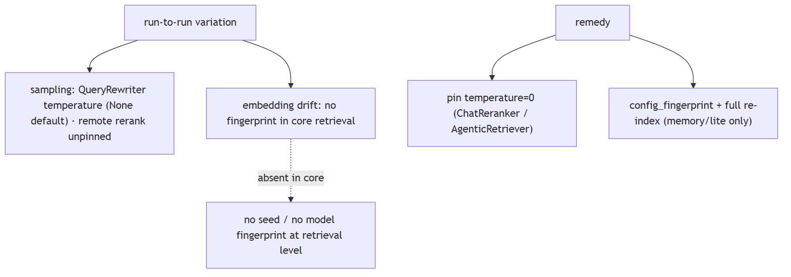

**Code anchors**

| Code anchor | What it points to |
|---|---|
| `agent-core/openjiuwen/core/retrieval/reranker/chat_reranker.py:137` | hard-codes "temperature": 0 |
| `agent-core/openjiuwen/core/retrieval/reranker/standard_reranker.py:101` | rerank params (no temperature/seed) |
| `agent-core/openjiuwen/core/retrieval/retriever/agentic_retriever.py:311` | rewrite LLM temperature=0.0 |
| `agent-core/openjiuwen/core/retrieval/query_rewriter/query_rewriter.py:265` | temperature from config; agent-core/openjiuwen/core/foundation/llm/schema/config.py:210 — default None |
| `agent-core/openjiuwen/core/memory/lite/embeddings.py:78` | config_fingerprint; agent-core/openjiuwen/core/memory/lite/manager.py:873 — _should_full_reindex |
| `agent-core/openjiuwen/symphony/retrieval/llm/base/types.py:58` | seed=1223 (skill-retrieval subsystem only) |

---

## 7. Vocabulary mismatch, where the answer exists but uses different wording

Mechanism intermediate

**TL;DR.** The doc says 'myocardial infarction', the user says 'heart attack': use semantic embeddings, query expansion/synonyms, HyDE, and hybrid search to bridge the wording gap.

**Key points.**

- Semantic embeddings match paraphrases.
- Query expansion / synonyms.
- HyDE: retrieve with a generated hypothetical answer.
- Hybrid search catches exact terms.

**Concept.** The document says "myocardial infarction", the user says "heart attack". Mitigations: better embeddings (semantic match), query expansion/synonyms, HyDE (generate a hypothetical answer and retrieve with it), and hybrid search so exact terms still match. Pure dense handles paraphrase but not rare terms; pure sparse handles rare terms but not paraphrase.

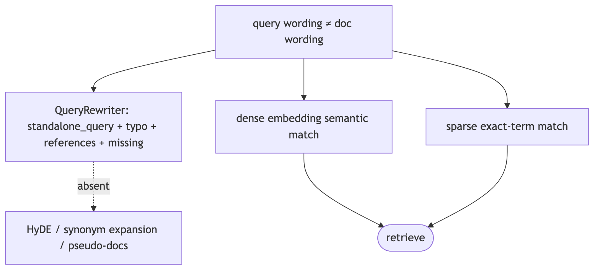

**In Jiuwen.** Jiuwen's query rewriter targets coreference/ellipsis and semantic gaps, not synonyms — it produces a self-contained query and records typos, missing items, and references, but does no synonym expansion or HyDE. Semantic bridging relies on the vector/hybrid retrievers and graph-memory name embeddings, not on explicit expansion.

<b>Under the hood</b>

**Implementation**

The `QueryRewriter` is the designated mitigation, but it targets **coreference/ellipsis/semantic gaps**, not synonyms: it produces a `standalone_query` and records `typo` corrections, `missing` items, and `references`. Retrieval-side semantic matching comes from the vector/hybrid retrievers and graph-memory name embeddings. There is **no** HyDE, no synonym/query-expansion dictionary, and no pseudo-document generation.

**Code anchors**

| Code anchor | What it points to |
|---|---|
| `agent-core/openjiuwen/core/retrieval/query_rewriter/query_rewriter.py:412` | rewrite(query) → standalone_query; :277 output schema |
| `agent-core/openjiuwen/core/retrieval/query_rewriter/prompts/intention_completion_en.md:32` | coreference resolution; :41 missing-information completion; :47 typo correction |
| `agent-core/openjiuwen/core/retrieval/retriever/graph_retriever.py:349` | vector retriever (dense semantic match) |
| `agent-core/openjiuwen/core/memory/graph/graph_memory/base.py:735` | _fetch_relevant_entities semantic entity match |

---

## 8. Structuring error handling for a pipeline where retrieval, reranking, or generation can each fail independently

Mechanism intermediate

**TL;DR.** Isolate each stage so one failure degrades rather than aborts: retrieval returns empty/flagged, reranking falls back to pre-rerank order, generation surfaces a structured error.

**Key points.**

- Typed errors per stage.
- Explicit fallbacks (empty result, pre-rerank order).
- Degrade, don't abort the whole pipeline.

**Concept.** Isolate each stage so one failure degrades rather than aborts: retrieval returns an empty/flagged result, reranking falls back to the pre-rerank order, generation surfaces a structured error. Use typed errors per stage, explicit fallbacks, retries only for transient failures, and a top-level handler that converts failure into a model-readable message instead of a crash.

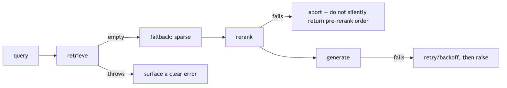

**In Jiuwen.** Failures are mostly contained per stage: the vector retriever falls back to sparse when the vector search is empty, the hybrid retriever falls back to sparse when dense is empty (in vector mode), and the graph retriever falls back to sparse in its sparse branch. Model failures are handled by rails with retry/backoff, and tool exceptions become error messages the model can read.

<b>Under the hood</b>

**Implementation**

Failures are mostly contained per stage. Retrievers implement stage-local fallbacks: `VectorRetriever` falls back to BM25 when vector search is empty, `HybridRetriever` falls back to sparse when dense search is empty (in `mode="vector"` only), and `GraphRetriever` falls back to sparse only in its `mode="sparse"` branch. Model-call failures are handled by rails: `ModelAnomalyDetectionRail.on_model_exception` retries stream-timeout/repetition with backoff, and `ToolCallResilienceRail` retries transport/timeout tool errors. In `AbilityManager`, any tool/workflow/sub-agent exception is caught and converted to an error `ToolMessage` so the round continues. Workflow HTTP components have per-component retry (`HttpRetryConfig`, 429/5xx) and rate-limit config. Pregel node failure cancels siblings via `FIRST_EXCEPTION`.

**Implementation diagram**

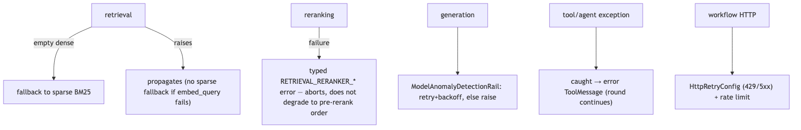

**Code anchors**

| Code anchor | What it points to |
|---|---|
| `agent-core/openjiuwen/core/retrieval/retriever/vector_retriever.py:83` | dense-empty → BM25 fallback; agent-core/openjiuwen/core/retrieval/retriever/hybrid_retriever.py:97/194 — fallback branches; agent-core/openjiuwen/core/retrieval/retriever/graph_retriever.py:462 — fallback to sparse |
| `agent-core/openjiuwen/harness/rails/model_anomaly_detection_rail.py:236` | on_model_exception retry classification; agent-core/openjiuwen/harness/rails/tool_call_resilience_rail.py:106 — tool exception retry decision |
| `agent-core/openjiuwen/core/single_agent/ability_manager.py:1186` | exception rendered into a ToolMessage |
| `agent-core/openjiuwen/core/workflow/components/tool/http/http_request_component.py:102` | HttpRetryConfig; :110 HttpRateLimitConfig |
| `agent-core/openjiuwen/core/graph/pregel/task.py:47` | FIRST_EXCEPTION cancels siblings |

---

## 9. "Design a RAG system" tests failure mode awareness, not architecture recall

Claim advanced

**Claim, not a question.** The heading is an assertion about what these questions probe; the notes below assess whether it holds.

**TL;DR.** 'Design a RAG system' tests whether you know how it fails, not whether you can draw boxes.

**Key points.**

- Dense fallback only on empty, not on wrong.
- score_threshold defaults none → weak chunks pass.
- KB path never reranks.
- Metadata filters dropped at the retriever.

**Concept.** This claim holds: the value in "design a RAG system" is naming the failure modes and how you detect them, not reciting a reference architecture. Drawing embed → retrieve → rerank → generate is the basic shape. When retrieval returns the wrong chunk, the causes are usually retrieval-side: chunk boundaries cut the answer, the embedding mismatches the domain, the query wording differs from the corpus, exact IDs need sparse search, or metadata filters were dropped. Point at the stage that fails, not the pipeline as a whole. "Wrong chunk" is usually retrieval-side: chunk boundaries cut the answer, the embedding mismatches the domain, the query wording differs from the corpus, exact IDs need sparse search, or metadata filters were dropped. Name the check for each (read the chunk, score threshold, hybrid fallback).

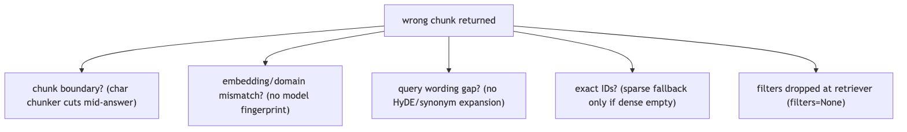

**In Jiuwen.** The failure points are concrete: dense retrieval falls back to sparse only when it returns empty, not when it is wrong; score threshold defaults to none so weak chunks pass; the knowledge-base path never reranks; and metadata filters are dropped at the retriever boundary.

<b>Under the hood</b>

**Implementation**

The failure points are concrete. Dense retrieval falls back to sparse only when it returns *empty*, not when it is wrong; `score_threshold` defaults to `None` so weak chunks pass; the KB path never reranks; and metadata `filters` are dropped at the retriever boundary, so an "authorized docs only" filter silently does nothing.

**Code anchors**

| Code anchor | What it points to |
|---|---|
| `agent-core/openjiuwen/core/retrieval/retriever/vector_retriever.py:83` | dense-empty → sparse fallback only; :88 filters=None; :94 threshold applied only when supplied |
| `agent-core/openjiuwen/core/retrieval/common/config.py:47` | score_threshold defaults None |
| `agent-core/openjiuwen/core/retrieval/simple_knowledge_base.py:182` | KB path calls no reranker |
| `agent-core/openjiuwen/core/retrieval/indexing/processor/chunker/text_splitter.py:56` | char chunker cuts at fixed offsets |

---

## 10. "The model made something up" is testing hallucination handling, not model quality

Claim intermediate

**Claim, not a question.** The heading is an assertion about what these questions probe; the notes below assess whether it holds.

**TL;DR.** 'The model made something up' is testing hallucination handling, not model quality.

**Key points.**

- Verification agent (read-only, PASS/FAIL/PARTIAL).
- Reviewer correctness dimension.
- No answerability gate/abstention.
- No faithfulness judge with context.

**Concept.** This claim holds: "the model made something up" is about hallucination handling and mitigation, not about which model is best. how you ground and verify output — grounding in retrieved context, citations tied to sources, confidence thresholds before generating, and defined fallback when retrieval is empty or irrelevant. Treat this as a system design, not a claim about model quality: pass the retrieved context to the generator, require citations, gate on an answerability/score threshold before generating, and define the empty/irrelevant fallback (abstain or ask). Measure faithfulness against the context, not just correctness against a reference.

**In Jiuwen.** Grounding is a separate, non-blocking layer: a verification agent (read-only evidence, PASS/FAIL/PARTIAL) and a reviewer correctness dimension. But score threshold defaults to none, there is no answerability gate or abstention in the knowledge-base path, and no judge receives the retrieved context.

<b>Under the hood</b>

**Implementation**

Grounding is a separate, non-blocking layer: a verification agent (read-only evidence, PASS/FAIL/PARTIAL) and a reviewer `Correctness` dimension. But `score_threshold` defaults to `None`, there is no answerability gate or abstention in the KB path, and no judge receives the retrieved context (no faithfulness score).

**Code anchors**

| Code anchor | What it points to |
|---|---|
| `agent-core/openjiuwen/harness/rails/subagent/verification_rail.py:92` | VerificationRail allowlist |
| `agent-core/openjiuwen/agent_teams/verification/reviewer.py:43` | Correctness dimension |
| `agent-core/openjiuwen/core/retrieval/common/config.py:47` | score_threshold default None |
| `agent-core/openjiuwen/core/retrieval/retriever/vector_retriever.py:83` | dense-empty → sparse fallback |
| `agent-core/openjiuwen/agent_evolving/evaluator/metrics/llm_as_judge.py:40` | no context input |

---

## 11. How do you treat output validation as a pipeline stage, not an afterthought?

Mechanism intermediate

**TL;DR.** Validation must be three explicit stages with typed pass/fail contracts: syntactic (schema), semantic (faithfulness), policy (safety) — not ad hoc checks.

**Key points.**

- Syntactic: schema/format → retry with repair prompt on fail.
- Semantic: faithfulness/grounding → abstain or flag on fail.
- Policy: safety/guardrail → redact or block on fail.
- Jiuwen: independent rails, no unified stage with shared failure-mode log.

**Concept.** Output validation should be an explicit, typed stage between generation and delivery: (1) syntactic validation — does the output match the declared schema or format (JSON schema, regex, structured output type)? (2) semantic validation — is the content grounded in the retrieved context (faithfulness check)? (3) policy validation — does the output pass safety/guardrail rules? Each stage has a clear pass/fail contract: fail syntactic → retry with repair prompt; fail semantic → abstain or flag; fail policy → redact or block. Logging the failure mode at each stage is what makes the system debuggable.

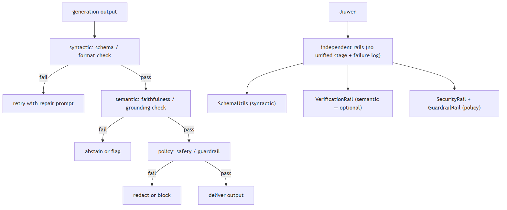

**In Jiuwen.** Syntactic: SchemaUtils.validate_with_schema (agent-core/openjiuwen/core/common/utils/schema_utils.py:115) on tool results; structured_output tool enforces a caller-supplied schema. Semantic: VerificationRail (agent-core/openjiuwen/harness/rails/subagent/verification_rail.py:92) PASS/FAIL/PARTIAL; FaithfulnessEvaluator in agent_evolving/eval/. Policy: SecurityRail + GuardrailRail. These are independent rails, not a unified pipeline stage — there is no shared output-validation stage or failure-mode log distinguishing syntactic vs semantic vs policy failures.

<b>Under the hood</b>

**Implementation**

The framework has components for each stage but they are not wired into a single linear validation pipeline. Syntactic: `SchemaUtils.validate_with_schema` on tool results; `structured_output` tool enforces a caller-supplied JSON Schema. Semantic: `VerificationRail` (read-only evidence, PASS/FAIL/PARTIAL); `FaithfulnessEvaluator` in `agent_evolving/eval/`. Policy: `SecurityRail` (prompt injection detection), `PromptInjectionGuardrail` (sequence-classification model). But these operate as independent rails — there is no shared output-validation stage that all responses must pass before leaving the agent, and there is no pipeline-level failure-mode log distinguishing syntactic vs semantic vs policy failures.

**Code anchors**

| Code anchor | What it points to |
|---|---|
| `agent-core/openjiuwen/core/common/utils/schema_utils.py:115` | validate_with_schema (syntactic) |
| `agent-core/openjiuwen/harness/rails/subagent/verification_rail.py:92` | VerificationRail (semantic) |
| `agent-core/openjiuwen/agent_evolving/evaluator/metrics/faithfulness_evaluator.py:1` | FaithfulnessEvaluator |
| `agent-core/openjiuwen/auto_harness/rails/security_rail.py:1` | SecurityRail (policy) |
| `agent-core/openjiuwen/core/security/guardrail/builtin.py:1` | GuardrailRail (policy) |

---
