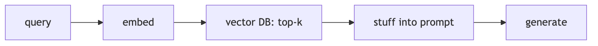
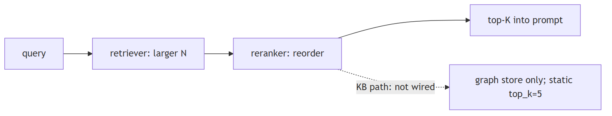
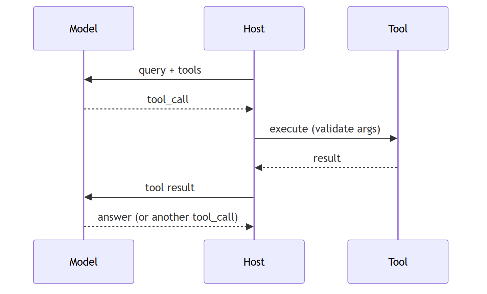

# LLM architecture patterns

## 1. Simple RAG pipeline

**Title.** Simple RAG pipeline

**Summary.** The most common starting point: embed the query, get top-k similar docs, stuff them into the prompt, and generate.

**Key points.**

- Embed query → vector search top-k.
- Stuff docs into the prompt.
- LLM generates the answer.

**General.** the most common starting point. Query is embedded → a vector database returns top-k similar documents → documents are stuffed into a prompt → the LLM generates the answer.

**Jiuwen.** Implemented end to end as composable pieces rather than a packaged app: ingest via parse files, chunk documents, and build index; query via retrieve and vector store search; the workflow knowledge-retrieval component concatenates results into a context string for the LLM component.

<b>Technical detail (classes &amp; functions)</b>

Implemented end to end as composable pieces rather than a packaged app: ingest via `parse_files` → `chunk_documents` → `build_index`; query via `retrieve` → `vector_store.search`; the workflow `KnowledgeRetrievalComponent` concatenates results into a `context` string and `LLMComponent` formats it into the prompt. Gap: no single "simple RAG" agent, and retrieved context is inserted with no token budgeting.

&bull; `agent-core/openjiuwen/core/retrieval/simple_knowledge_base.py:96/110/182` — ingest + retrieve &bull; `agent-core/openjiuwen/core/retrieval/retriever/vector_retriever.py:78` — embed query → search &bull; `agent-core/openjiuwen/core/workflow/components/resource/knowledge_retrieval_comp.py:109/243` — context assembly &bull; `agent-core/openjiuwen/core/workflow/components/llm/llm_comp.py:654` — prompt template

---

## 2. Modular RAG with reranking

**Title.** Modular RAG with reranking

**Summary.** The upgrade once simple RAG returns irrelevant context: retrieve a larger candidate set, rerank by relevance, and keep only the top results.

**Key points.**

- Retrieve a larger candidate set.
- Rerank by query relevance.
- Keep only the top results.

**General.** the upgrade once simple RAG returns irrelevant context. A retriever pulls a larger candidate set, a reranker reorders by actual relevance to the query, and only the top results enter the prompt.

**Jiuwen.** The reranker modules exist (cross-encoder, LLM judge, DashScope) but are not wired into the knowledge-base path — only the graph store calls rerank, and top-k is static. Retrieve-N-rerank-to-K is not available out of the box.

<b>Technical detail (classes &amp; functions)</b>

The reranker modules exist (`StandardReranker` cross-encoder, `ChatReranker` LLM-judge, `DashscopeReranker`) but are **not wired into the KB path** — only the graph store calls `rerank`, and `top_k` is static. So "retrieve N, rerank to K" is not available out of the box; the retrievers also drop metadata `filters`.

&bull; `agent-core/openjiuwen/core/foundation/store/base_reranker.py:37/41` — Reranker ABC &bull; `agent-core/openjiuwen/core/retrieval/reranker/standard_reranker.py:23` — StandardReranker (/rerank) &bull; `agent-core/openjiuwen/core/foundation/store/graph/milvus/milvus_support.py:458` — reranker applied only in graph store &bull; `agent-core/openjiuwen/core/retrieval/simple_knowledge_base.py:182` — KB path calls no reranker &bull; `agent-core/openjiuwen/core/retrieval/common/config.py:46` — top_k: int = 5

---

## 3. Agentic tool-calling pattern

**Title.** Agentic tool-calling pattern

**Summary.** The model decides when to call external functions: it emits a structured tool call, the tool executes, the result is fed back, and the loop continues.

**Key points.**

- Model emits structured tool calls.
- Runtime executes and feeds back results.
- Loops until the model answers.

**General.** the model decides when to call external functions. It receives the query and a tool list, emits a structured tool call instead of an answer, the tool executes and the result is fed back, and the model either calls another tool or returns a final answer.

**Jiuwen.** This is the ReAct loop plus the ability manager. Cards become JSON Schema via the callable schema extractor, the ability manager builds the model-facing tool list and dispatches parsed tool calls, and the local function invoke validates arguments.

<b>Technical detail (classes &amp; functions)</b>

This is the ReAct loop plus the ability manager. Cards become JSON Schema via the callable schema extractor, the ability manager builds the model-facing tool list and dispatches parsed `tool_calls`, and `LocalFunction.invoke` validates arguments.

&bull; `agent-core/openjiuwen/core/single_agent/agents/react_agent.py:2740/2793/2813` — loop / answer / execute &bull; `agent-core/openjiuwen/core/single_agent/ability_manager.py:984/1078` — tool list + dispatch &bull; `agent-core/openjiuwen/core/foundation/tool/utils/callable_schema_extractor.py:20` — card → JSON Schema &bull; `agent-core/openjiuwen/core/foundation/tool/function/function.py:82` — argument validation

---

## 4. Planner–executor pattern

**Title.** Planner–executor pattern

**Summary.** A planner breaks a complex request into subtasks; one or more executors carry each out; results are combined into a final response.

**Key points.**

- Planner decomposes the task.
- Executors carry out subtasks.
- Results are combined.

**General.** a planner breaks a complex request into subtasks; one or more executors carry each out; results are combined into a final response. Common in multi-step agent systems.

**Jiuwen.** Two paths. The deep agent's outer task loop runs a full inner ReAct invoke per round while a persistent task plan and todos carry state; a task-planning rail registers the todo tools and injects planning guidance (plan mode adds a task tool to delegate).

<b>Technical detail (classes &amp; functions)</b>

Two paths. `DeepAgent`'s outer task loop runs a full inner ReAct invoke per round while a persistent `TaskPlan`/todos carry state; `TaskPlanningRail` registers the todo tools and injects planning guidance (`Plan` mode adds a `task_tool` to delegate). `agent_teams` adds supervisor/leader decomposition, and a dedicated plan subagent exists.

&bull; `agent-core/openjiuwen/harness/deep_agent.py:2694` — outer task loop &bull; `agent-core/openjiuwen/harness/rails/task_planning_rail.py:31/108` — planning layer + todo tools &bull; `agent-core/openjiuwen/harness/tools/todo.py:193` — TodoCreateTool &bull; `agent-core/openjiuwen/harness/tools/subagent/task_tool.py:194/657` — subagent delegation &bull; `agent-core/openjiuwen/core/multi_agent/teams/hierarchical_tools/hierarchical_team.py:101/108` — supervisor (agents-as-tools); agent-core/openjiuwen/harness/subagents/plan_agent.py:88 — plan subagent

---

## 5. Critic or reflection loop

**Title.** Critic or reflection loop

**Summary.** A self-check before returning: the primary agent drafts, a critic reviews against the request or rules, and the primary revises if it fails.

**Key points.**

- Draft, then critique.
- Revise on failure.
- Adds a verification step.

**General.** a self-check before returning. The primary agent drafts; a critic reviews it against the request or rules; if it fails, the primary revises. Adds a verification step for high-stakes output.

**Jiuwen.** There is no generic draft-critique-revise loop in the single-agent ReAct path, but the pieces exist: a verification agent restricted to read-only tools that must show verbatim evidence and emit PASS/FAIL/PARTIAL, and a team reviewer that scores correctness.

<b>Technical detail (classes &amp; functions)</b>

There is no generic draft→critique→revise loop in the single-agent ReAct path, but the pieces exist: a **verification agent** restricted to read-only tools that must show verbatim evidence and emit PASS/FAIL/PARTIAL; an `agent_teams` reviewer that scores `Correctness`/completeness with rework thresholds; and the RSI weighted-rubric judge. These run as separate review layers, not as an in-loop reflection that blocks generation.

&bull; `agent-core/openjiuwen/harness/rails/subagent/verification_rail.py:92` — VerificationRail allowlist; agent-core/openjiuwen/harness/subagents/verification_agent.py:51 — PASS/FAIL/PARTIAL &bull; `agent-core/openjiuwen/agent_teams/verification/reviewer.py:26/43/279` — review dimensions + rework thresholds &bull; `agent-core/openjiuwen/rsi/harness_rsi/evaluator/judger/scoring.py:193` — weighted rubric judge

---

## 6. Memory-augmented agent

**Title.** Memory-augmented agent

**Summary.** Context across sessions: short-term is the active window; long-term is a store of past interactions; retrieval decides what long-term memory returns.

**Key points.**

- Short-term = active context window.
- Long-term = persisted store.
- Retrieval brings memory back.

**General.** context across sessions, not just one conversation. Short-term memory is the active context window; long-term memory is a vector store/DB of past interactions; retrieval decides what long-term memory is relevant to the current turn.

**Jiuwen.** Short-term is a session model context with a bounded message buffer; long-term is a typed memory taxonomy, and the product adds a SQLite/FTS5 hybrid index over markdown memory files. Retrieval-into-turn is a tool the model calls.

<b>Technical detail (classes &amp; functions)</b>

Short-term is `SessionModelContext` with a bounded `ContextMessageBuffer`; long-term is `LongTermMemory` with a typed taxonomy, and the product adds a SQLite/FTS5 hybrid index over markdown memory files. Retrieval-into-turn is a tool the model calls (`memory_search`), and `MemoryRail` suppresses it when daily memory is auto-loaded.

&bull; `agent-core/openjiuwen/core/context_engine/context/context.py:44` — SessionModelContext; agent-core/openjiuwen/core/context_engine/context/message_buffer.py:11 — ContextMessageBuffer &bull; `agent-core/openjiuwen/core/memory/long_term_memory.py:69` — LongTermMemory &bull; `jiuwenswarm/jiuwenswarm/agents/harness/common/memory/manager.py:183/805` — product hybrid index &bull; `jiuwenswarm/jiuwenswarm/agents/harness/common/tools/memory_tools.py:167` — memory_search; agent-core/openjiuwen/harness/prompts/sections/memory.py:14 — when to call

---

## 7. Router pattern

**Title.** Router pattern

**Summary.** One entry point decides which subsystem handles the request: the query is classified and routed to a specialized agent or tool.

**Key points.**

- Classify the query.
- Route to a specialized handler.
- Avoid one generic prompt.

**General.** one entry point decides which subsystem handles the request. The query is classified and routed to a specialized agent/tool (SQL agent, search agent, summarization agent), so one generic prompt does not handle everything poorly.

**Jiuwen.** There is no query-classification router. Routing that exists is model tool choice (the model picks memory search, retrieval, or other tools), and the intelli-router is model-endpoint routing (health, rate, latency), not query routing.

<b>Technical detail (classes &amp; functions)</b>

There is **no query-classification router**. Routing that exists is model tool choice (the model picks `memory_search` / retrieval / other tools), and `IntelliRouter` is model-**endpoint** routing (health/rate/latency), not query routing. `AgenticRetriever` derives its mode from `index_type`, not from the query.

&bull; `jiuwenswarm/jiuwenswarm/agents/harness/common/tools/memory_tools.py:167` — tool the model chooses &bull; `agent-core/openjiuwen/agent_teams/models/allocator.py:559` — build_model_allocator (endpoint strategies) &bull; `agent-core/openjiuwen/core/foundation/llm/model_clients/intelli_router_model_client.py:32` — ReliableRouter &bull; `agent-core/openjiuwen/core/retrieval/retriever/agentic_retriever.py:155` — mode from index_type, not the query

---
