# RAG system design

## 1. Design a RAG system for a customer support chatbot handling 100,000 queries a day

Design advanced

**TL;DR.** Start from rate/SLA, then pick components: ingestion, hybrid retrieval, reranking, generation, caching, observability. 100k/day is ~1.2 QPS average with bursts.

**Key points.**

- Budget from QPS + latency SLA.
- Ingestion: parse → chunk → embed → index.
- Hybrid retrieval + reranker + generation + cache.
- Observability and per-session cost caps.

**Concept.** Start from the request rate and SLA, then choose components: ingestion (parse → chunk → embed → index), retrieval (hybrid dense+sparse), a reranker, a generation layer, caching, and observability. 100k/day is ~1.2 QPS average (bursts higher), so a single server-class vector DB is fine; the real work is cache hit rate, top-k tuning, guardrails, and a feedback loop. Size context and cost per query, then multiply.

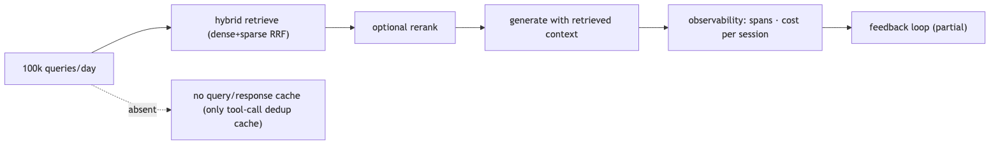

**In Jiuwen.** Jiuwen provides the ingestion pipeline, hybrid retrieval with rank fusion, optional rerankers (wired only into the graph store), and the context-plus-generation path through its workflow components; the product adds session cost tracking and a per-session cost cap. What a design must add on top: caching, autoscaling, reranking in the knowledge-base path, and production monitoring.

<b>Under the hood</b>

**Implementation**

Provides the ingestion pipeline (`parse_files` → `chunk_documents` → `build_index`), hybrid retrieval with RRF, optional rerankers (graph store only), and the context/generation path via `KnowledgeRetrievalComponent` + `LLMComponent`. Product adds session cost tracking and a per-session cost cap. Gaps a design must cover: no packaged end-to-end RAG agent, no token budgeting on retrieved context, no quality monitoring (only error/latency tracing), and no semantic response cache.

**Code anchors**

| Code anchor | What it points to |
|---|---|
| `agent-core/openjiuwen/core/retrieval/simple_knowledge_base.py:96/110/182` | ingest/retrieve pipeline |
| `agent-core/openjiuwen/core/retrieval/utils/fusion.py:15` | RRF hybrid merge |
| `agent-core/openjiuwen/core/workflow/components/resource/knowledge_retrieval_comp.py:109/243` | context assembly |
| `jiuwenswarm/jiuwenswarm/server/runtime/usage_cost.py:171` | session cost cap |
| `jiuwenswarm/jiuwenswarm/agents/harness/common/rails/tool_dedup_rail.py:47` | exact tool result cache |

---

## 2. Design a RAG pipeline for a codebase assistant that needs to stay current as code changes daily

Design advanced

**TL;DR.** Make re-indexing incremental and event-driven: stable IDs per file/chunk, delete-by-ID on change, append new chunks, and trigger on commit/CI — avoid full re-embeds except on model/index changes.

**Key points.**

- Stable doc/chunk IDs; delete-by-ID on change.
- Append new chunks (no full re-index).
- Trigger into indexing from commit/CI.
- Structure-aware chunks (function boundaries).

**Concept.** Make re-indexing incremental and event-driven: a stable ID per file/chunk, delete-by-ID on change, append new chunks, and a trigger on commit/CI. Avoid full re-embeds except on model/index changes. Keep chunk boundaries structure-aware (functions/classes) and include file paths/branches as metadata so the assistant can cite and filter.

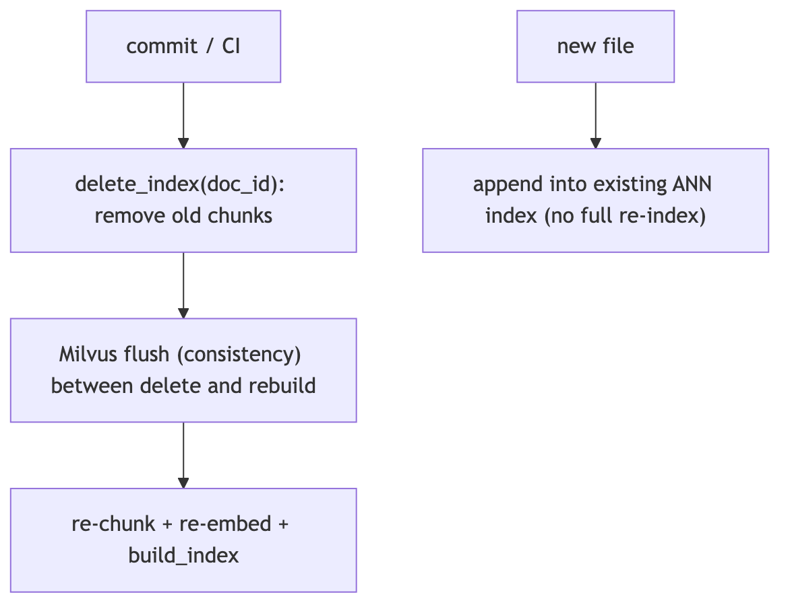

**In Jiuwen.** The contract is delete-by-document-id plus rebuild: indexers scan a document's chunk ids, delete them, then re-chunk, re-embed, and write (Milvus flushes in between to defeat eventual consistency); new documents append into the existing ANN index with no full re-index. The document id is a first-class scalar-indexed field. There is no code-aware or function-boundary chunker, so a codebase assistant would need to add that.

<b>Under the hood</b>

**Implementation**

The contract is delete-by-`doc_id` + rebuild: indexers scan a doc's chunk IDs, delete them, then re-chunk/re-embed/write (Milvus flushes between to defeat eventual consistency); new documents append into the pre-existing ANN index (no full re-index). `doc_id` is a first-class, scalar-inverted field. Chunking supports char/token/hybrid but has no code-aware/function-boundary chunker.

**Code anchors**

| Code anchor | What it points to |
|---|---|
| `agent-core/openjiuwen/core/retrieval/simple_knowledge_base.py:219` | update_documents; :74 add_documents appends |
| `agent-core/openjiuwen/core/retrieval/indexing/indexer/chroma_indexer.py:198` | update_index = delete + build; :217 delete by doc_id |
| `agent-core/openjiuwen/core/retrieval/indexing/indexer/milvus_indexer.py:209` | delete + flush + rebuild; :346 INVERTED scalar index |
| `agent-core/openjiuwen/core/retrieval/indexing/processor/chunker/hybrid_chunker.py:19` | structural no-split guard |

---

## 3. Design a document search system for a legal firm with millions of confidential documents

Design advanced

**TL;DR.** Access control dominates, then scale: every chunk carries an ACL and every query is filtered by the caller's permissions inside the vector search (pre-filter), not after.

**Key points.**

- ACL on every chunk (owner/matter/tenant).
- Pre-filter queries by caller permissions.
- Per-tenant/matter isolation + audit logging.
- Then scale: ANN, quantization, sharding.

**Concept.** The dominant requirement is access control, then scale. Every chunk must carry an ACL (owner, matter, tenant) and every query must be filtered by the caller's permissions *inside* the vector search (pre-filter), not after. Combine that with hybrid retrieval, a reranker, encryption at rest, audit logging, and per-matter isolation. Confidentiality also means no cross-matter leakage in the prompt context.

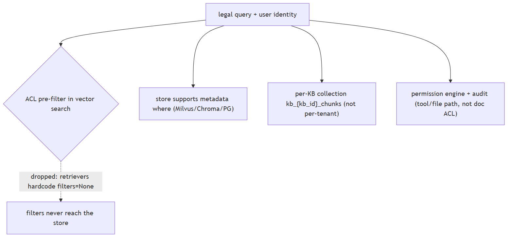

**In Jiuwen.** Jiuwen supports metadata filtering at the store layer (Milvus expressions, Chroma where-clauses, PG JSONB), per-knowledge-base collections, a permission engine, and audit logging. But the retriever layer drops the configured filters — concrete retrievers hardcode filters to None — so permission-aware retrieval is not reachable through the knowledge-base path; you would have to re-plumb filters through the retriever.

<b>Under the hood</b>

**Implementation**

Supports metadata filtering at the **store** layer (Milvus expr, Chroma `where`, PG JSONB) and per-KB collections (`kb_{kb_id}_chunks`), plus a permission engine and audit logging. But the retriever layer **drops** `RetrievalConfig.filters` — concrete retrievers hardcode `filters=None` — so permission-aware retrieval is not reachable through the KB path, and there is no document/chunk ACL field. Permission-aware retrieval would require re-plumbing filters through the retriever.

**Code anchors**

| Code anchor | What it points to |
|---|---|
| `agent-core/openjiuwen/core/retrieval/common/config.py:53` | RetrievalConfig.filters; agent-core/openjiuwen/core/retrieval/retriever/base.py:19 — abstract retrieve has no filters; agent-core/openjiuwen/core/retrieval/simple_knowledge_base.py:186 — KB passes filters; agent-core/openjiuwen/core/retrieval/retriever/vector_retriever.py:88 / agent-core/openjiuwen/core/retrieval/retriever/hybrid_retriever.py:81 — hardcoded filters=None |
| `agent-core/openjiuwen/core/retrieval/vector_store/milvus_store.py:215` | Milvus filter expr; agent-core/openjiuwen/core/retrieval/vector_store/chroma_store.py:265 — where; agent-core/openjiuwen/core/retrieval/vector_store/pg_store.py:474 — JSONB |
| `agent-core/openjiuwen/core/retrieval/simple_knowledge_base.py:102` | kb_{kb_id}_chunks |
| `agent-core/openjiuwen/harness/security/permission_engine/core.py:272` | check_permission (tool/file/net, not retrieval) |
| `agent-core/openjiuwen/core/common/security/user_config.py:69` | sensitive-path config (filesystem, not doc ACL) |

---

## 4. How retrieval architecture changes from 10,000 to 10 million documents

Design intermediate

**TL;DR.** Small scale: a local index (Chroma/FAISS). Large scale: a dedicated vector DB with tuned ANN (HNSW/IVF/quantization), sharding/replication, and batch ingestion — and you tune recall vs latency.

**Key points.**

- Small: local in-process index.
- Large: server vector DB, tuned ANN + quantization.
- Sharding/partitioning, replication, batch ingest.
- Tune recall vs latency per query.

**Concept.** At small scale, a local in-process index (FAISS/Chroma) is fine. At large scale you need a dedicated vector DB with tuned ANN indexes (HNSW/IVF/quantization), sharding/partitioning, replication, and batch ingestion; you also start caring about memory, index build time, and recall/latency tuning per query. The interface stays the same but the operational envelope changes.

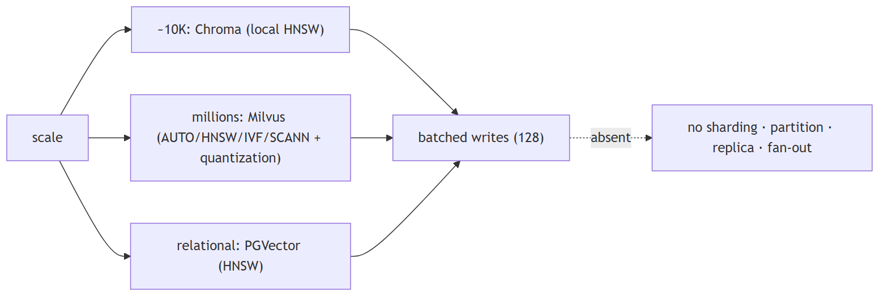

**In Jiuwen.** Scale-out is delegated to the backend: Chroma is a local persistent HNSW store for small and medium scale; Milvus is a server ANN with selectable index types and quantization for large scale; PGVector is relational HNSW. Writes are batched. There is no sharding, partitioning, replication, or multi-collection fan-out in the repo — those are the backend's job.

<b>Under the hood</b>

**Implementation**

Scale-out is delegated to the backend: Chroma = local persistent HNSW (small/medium), Milvus = server ANN with selectable AUTO/HNSW/IVF/SCANN and quantization variants (large), PGVector = pgvector HNSW (relational; the field type also declares `ivfflat`, but no IVFFlat index branch is implemented). Writes are batched (128) and flushed. Milvus BM25 for hybrid is native (`SPARSE_INVERTED_INDEX`) plus a jieba analyzer. The architecture is a single collection per KB (`kb_{kb_id}_chunks`) with one ANN index created once at collection creation. There is no sharding, partitioning, replica, or multi-collection fan-out anywhere.

**Code anchors**

| Code anchor | What it points to |
|---|---|
| `agent-core/openjiuwen/core/retrieval/vector_store/store.py:16` | create_vector_store (Milvus/Chroma/PGVector); agent-core/openjiuwen/core/retrieval/common/config.py:67 — store type enum |
| `agent-core/openjiuwen/core/retrieval/indexing/indexer/milvus_indexer.py:433` | index type AUTOINDEX/HNSW/IVF/FLAT/SCANN; :346 inverted scalar indexes |
| `agent-core/openjiuwen/core/foundation/store/vector_fields/milvus_fields.py:282` | MilvusHNSW (M=30, efConstruction=360); :100 IVFFlat defaults; :164 SCANN |
| `agent-core/openjiuwen/core/retrieval/vector_store/pg_store.py:203` | HNSW index; agent-core/openjiuwen/core/foundation/store/vector_fields/pg_fields.py:37 — pgvector defaults |
| `agent-core/openjiuwen/core/foundation/store/vector_fields/chroma_fields.py:47` | Chroma HNSW defaults |
| `agent-core/openjiuwen/core/retrieval/vector_store/base.py:57` | add(..., batch_size=128) |

---

## 5. How do you shard or partition a vector database as it grows

Mechanism advanced

**TL;DR.** Options: partition by key (tenant/category) so queries hit one partition; shard by hash/range across nodes; or replicate and route by collection. Plan for metadata routing and rebalancing.

**Key points.**

- Partition by tenant/category.
- Hash/range shard across nodes.
- Route queries; plan rebalancing.

**Concept.** Options: partition by a key (tenant/category) so queries hit one partition; shard by hash/range across nodes; or replicate + route by collection. Most vector DBs expose partition keys or collections; plan for metadata routing and rebalancing. Sharding trades query fan-out for per-shard size.

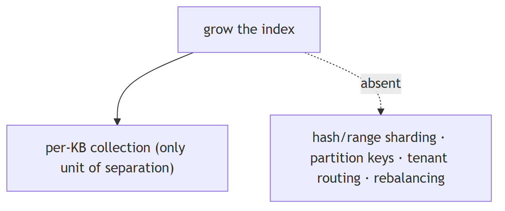

**In Jiuwen.** Jiuwen has no sharding or hash/range partitioning. The only partition-like unit is a per-knowledge-base collection plus a database-name field; there are no Milvus partition keys, no shard config, and no tenant-hash routing. So sharding would be handled entirely by the chosen backend, not by this code.

<b>Under the hood</b>

**Implementation**

**No sharding or hash/range partitioning.** The only partition-like unit is the per-KB collection (`kb_{kb_id}_chunks`/`_triples`) plus the `database_name` field. There are no Milvus partition keys, shard config, or tenant-hash routing.

**Code anchors**

| Code anchor | What it points to |
|---|---|
| `agent-core/openjiuwen/core/retrieval/simple_knowledge_base.py:102` | kb_{kb_id}_chunks |
| `agent-core/openjiuwen/core/retrieval/common/config.py:79` | database_name |
| `agent-core/openjiuwen/core/retrieval/vector_store/milvus_store.py:512` | delete_table/drop granularity only |

---

## 6. Keeping retrieval fast as the vector database grows, without a full re-index

Mechanism intermediate

**TL;DR.** Append-only incremental indexing into a pre-built ANN index avoids rebuilds; deletes/filters stay fast with scalar/inverted indexes; search-time parameters tune recall vs latency without reindexing.

**Key points.**

- Append-only writes; no full rebuild.
- Scalar/inverted indexes for fast deletes/filters.
- Search-time params (ef/nprobe) tune the dial.

**Concept.** Append-only incremental indexing into a pre-built ANN index avoids full rebuilds; deletes/filters stay fast with scalar/inverted indexes; search-time parameters (efSearch, nprobe) tune the recall/latency dial without reindexing. At some point you need compaction/merge of segments and periodic index rebuilds — that is an operational concern, not a query-time one.

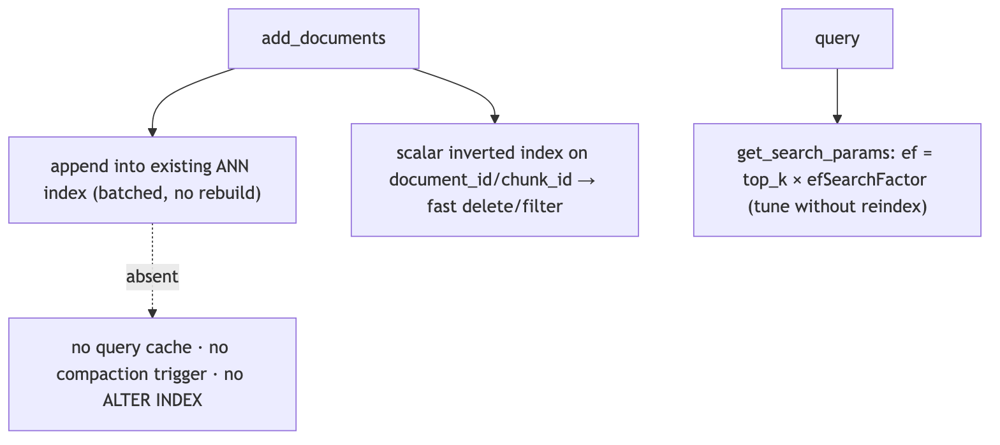

**In Jiuwen.** Growth is handled by append-only batched writes into a pre-existing ANN index, so adding documents does not trigger a full re-index. Fast deletes and filters use a Milvus inverted scalar index on document and chunk ids, and a search-time recall knob scales with top-k. There is no query result cache and no reindex or compaction trigger.

<b>Under the hood</b>

**Implementation**

Growth is handled by append-only batched writes into a pre-existing ANN index; existing vectors are untouched, so adding documents triggers no full re-index. Fast deletes/filters use the Milvus inverted scalar index on `document_id`/`chunk_id`. `get_search_params` derives `ef = top_k * efSearchFactor` per query (a search-time recall knob). `lazy_load` defers heavy module imports (Milvus/Chroma/parsers), not data. There is **no query result cache**, no reindex/compaction trigger, and no `ALTER INDEX` path — once the collection is created, ANN algorithm/params cannot change.

**Code anchors**

| Code anchor | What it points to |
|---|---|
| `agent-core/openjiuwen/core/retrieval/vector_store/milvus_store.py:519` | _ensure_loaded lazy load; :144 index_type change guard; :117 get_search_params ef dial; :199 flush after write |
| `agent-core/openjiuwen/core/retrieval/indexing/indexer/milvus_indexer.py:321` | _ensure_collection no-op if exists; :346 inverted scalar indexes |
| `agent-core/openjiuwen/core/retrieval/vector_store/pg_store.py:157` | reflects existing table; :203 index created once |
| `agent-core/openjiuwen/core/retrieval/lazy_load.py:143` | lazy_load (module imports) |
| `agent-core/openjiuwen/core/retrieval/simple_knowledge_base.py:74` | add_documents appends via build_index |

---

## 7. What database would you choose for the vector store, and why that one over the alternatives

Mechanism intermediate

**TL;DR.** Choose by scale and features: local/embedded for prototypes; a managed vector DB for scale and hybrid; pgvector when you already run Postgres and want one datastore.

**Key points.**

- Local/embedded for prototypes.
- Managed vector DB for scale + hybrid.
- pgvector for one relational datastore + joins.
- Evaluate hybrid, filtering, ops cost, lock-in.

**Concept.** Choose by scale and features, not familiarity: local/embedded (FAISS/Chroma) for prototypes; a managed vector DB (Pinecone / Zilliz Cloud) for scale and hybrid search; or pgvector when you already run Postgres and want one datastore, transactions, and metadata joins. Evaluate hybrid support, filtering, operational cost, and lock-in.

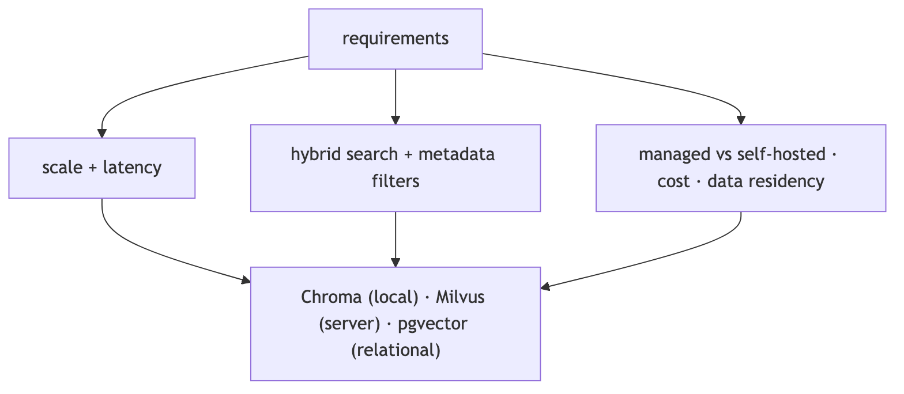

**In Jiuwen.** Three backends sit behind one factory: Chroma (local, vector-only — sparse and hybrid are rejected), Milvus (server, native BM25 and hybrid with rank fusion), and PostgreSQL plus pgvector (server, full-text sparse plus vector). The knowledge base selects the index type (hybrid by default), so hybrid requires Milvus or PG; Chroma is the small local choice.

<b>Under the hood</b>

**Implementation**

Three backends behind one factory: Chroma (local persisted, **vector-only** — sparse/hybrid rejected), Milvus (server, native BM25 + hybrid with RRF), PostgreSQL+pgvector (server, `tsvector` sparse + vector). The KB selects the index type (`hybrid` default). So hybrid/RRF requires Milvus or PG; Chroma is the small/local choice.

**Implementation diagram**

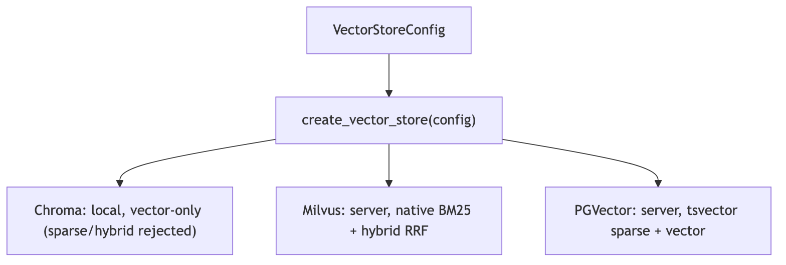

**Code anchors**

| Code anchor | What it points to |
|---|---|
| `agent-core/openjiuwen/core/retrieval/vector_store/store.py:16` | factory dispatch; agent-core/openjiuwen/core/retrieval/common/config.py:67 — StoreType = Milvus \| Chroma \| PGVector |
| `agent-core/openjiuwen/core/retrieval/vector_store/chroma_store.py:129` | PersistentClient (local); agent-core/openjiuwen/core/retrieval/vector_store/milvus_store.py:108 — MilvusClient(uri=...) (server); agent-core/openjiuwen/core/retrieval/vector_store/pg_store.py:108 — create_async_engine(...) |
| `agent-core/openjiuwen/core/retrieval/knowledge_base.py:59` | Chroma rejects sparse/hybrid in local mode |
| `agent-core/openjiuwen/core/retrieval/common/config.py:32/60` | index types hybrid/bm25/vector |

---

## 8. How do you decide between a hosted vector database and a self-managed one at scale

Mechanism advanced

**TL;DR.** Hosted: less ops, elastic scaling, predictable latency, but cost scales and there's lock-in. Self-managed: control, steady-state cost, data residency, but you own scaling, backups, upgrades, on-call.

**Key points.**

- Hosted: less ops, elastic, lock-in, cost scales.
- Self-managed: control, cost, residency, you run it.
- Decide by ops capacity, sensitivity, volume.

**Concept.** Hosted (Pinecone/Zilliz Cloud): less ops, elastic scaling, predictable latency, but cost scales with data/queries and there is vendor lock-in. Self-managed (Milvus/Qdrant/pgvector): control, cost at steady state, data residency, but you own scaling, backups, upgrades, and on-call. Decide by team ops capacity, data sensitivity, query volume, and elasticity needs — not by the library API.

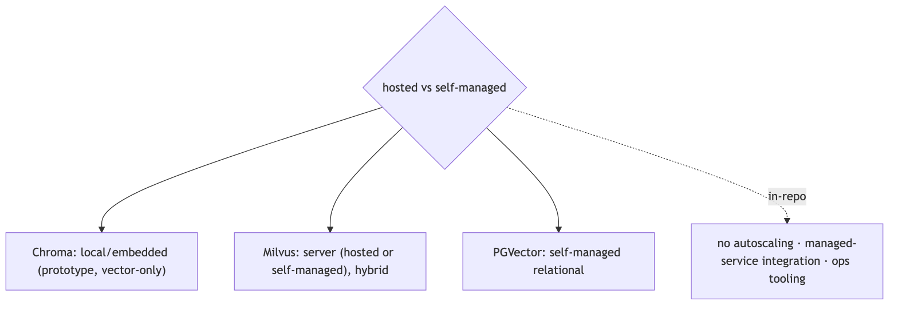

**In Jiuwen.** The factory can create Chroma (local), Milvus (server, which fits hosted or self-managed), and PostgreSQL plus pgvector (self-managed relational). The choice is pure config; the repo provides no autoscaling, managed-service integration, or ops tooling, so the operational side is entirely on you.

<b>Under the hood</b>

**Implementation**

`create_vector_store` dispatches Chroma (local/embedded), Milvus (server, fits hosted or self-managed), and PostgreSQL+pgvector (self-managed relational). The choice is pure config; there is no autoscaling, managed-service integration, or ops tooling in-repo. Chroma local cannot do hybrid, so production hybrid means Milvus or PG.

**Code anchors**

| Code anchor | What it points to |
|---|---|
| `agent-core/openjiuwen/core/retrieval/vector_store/store.py:16` | factory |
| `agent-core/openjiuwen/core/retrieval/vector_store/chroma_store.py:129` | local; agent-core/openjiuwen/core/retrieval/vector_store/milvus_store.py:108 — server; agent-core/openjiuwen/core/retrieval/vector_store/pg_store.py:108 — relational |
| `agent-core/openjiuwen/core/retrieval/knowledge_base.py:59` | Chroma rejects hybrid |
| `agent-core/openjiuwen/core/retrieval/common/config.py:67` | StoreType |

---

## 9. What happens to the user experience if the vector database is down, what's your fallback

Mechanism intermediate

**TL;DR.** Decide the degradation: fail fast with a clear message, serve cached results, fall back to a secondary index (sparse/replica), or disable retrieval and answer with a caveat — plus a circuit breaker and health checks.

**Key points.**

- Fail fast with a clear error, or
- Fall back to sparse/cached/replica, or
- Disable retrieval and answer with a caveat.
- Add circuit breaker + health checks.

**Concept.** Decide the degradation: fail fast with a clear message, serve cached results, fall back to a secondary index (sparse/BM25 or a replica), or disable retrieval and answer from parametric knowledge with a caveat. Add a circuit breaker, health checks, and timeouts so one dependency cannot hang the request. Replicate the index so a single node is not a SPOF.

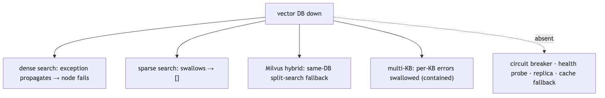

**In Jiuwen.** There is no availability fallback for a down vector database: dense search does not catch exceptions, so a store failure propagates and fails the workflow node. Sparse searches silently return empty on error, hybrid has a same-database split-search fallback, and multi-KB retrieval swallows per-KB errors. There is no circuit breaker, health probe, or result cache.

<b>Under the hood</b>

**Implementation**

There is **no availability fallback** for a down vector DB. Dense `search()` does not catch exceptions — a store failure propagates through the retriever and fails the workflow node. Sparse searches silently return `[]` on error, Milvus hybrid has a same-DB split-search fallback, and `retrieve_multi_kb` swallows per-KB errors (empty list), which contains blast radius across KBs. There is no circuit breaker, health probe, or result cache.

**Code anchors**

| Code anchor | What it points to |
|---|---|
| `agent-core/openjiuwen/core/retrieval/vector_store/milvus_store.py:357` | hybrid_search → _hybrid_search_fallback; :284 sparse_search returns []; :519 _ensure_loaded timeouts |
| `agent-core/openjiuwen/core/retrieval/vector_store/chroma_store.py:326` | sparse/text returns [] on error |
| `agent-core/openjiuwen/core/retrieval/simple_knowledge_base.py:300` | retrieve_multi_kb swallows per-KB errors |
| `agent-core/openjiuwen/core/workflow/components/resource/knowledge_retrieval_comp.py:123` | re-raises build_error |

---

## 10. Handling a document updated or deleted after it's already indexed

Mechanism intermediate

**TL;DR.** Use a stable document id and a delete-by-id path; updates are delete-then-insert (or upsert). Chunk ids derive from the doc id so all chunks can be removed; the hard parts are atomicity and consistency.

**Key points.**

- Stable doc id + delete-by-id.
- Update = delete + re-insert (or upsert).
- Chunk ids tied to the doc id.
- Atomicity and consistency are the hard parts.

**Concept.** You need a stable document id and a delete-by-id path; updates are delete-then-insert (or upsert). Chunk ids must be derived from the document id so all chunks of a document can be found and removed atomically. The hard parts are atomicity (a crash between delete and reinsert loses the doc) and eventual consistency in the vector store.

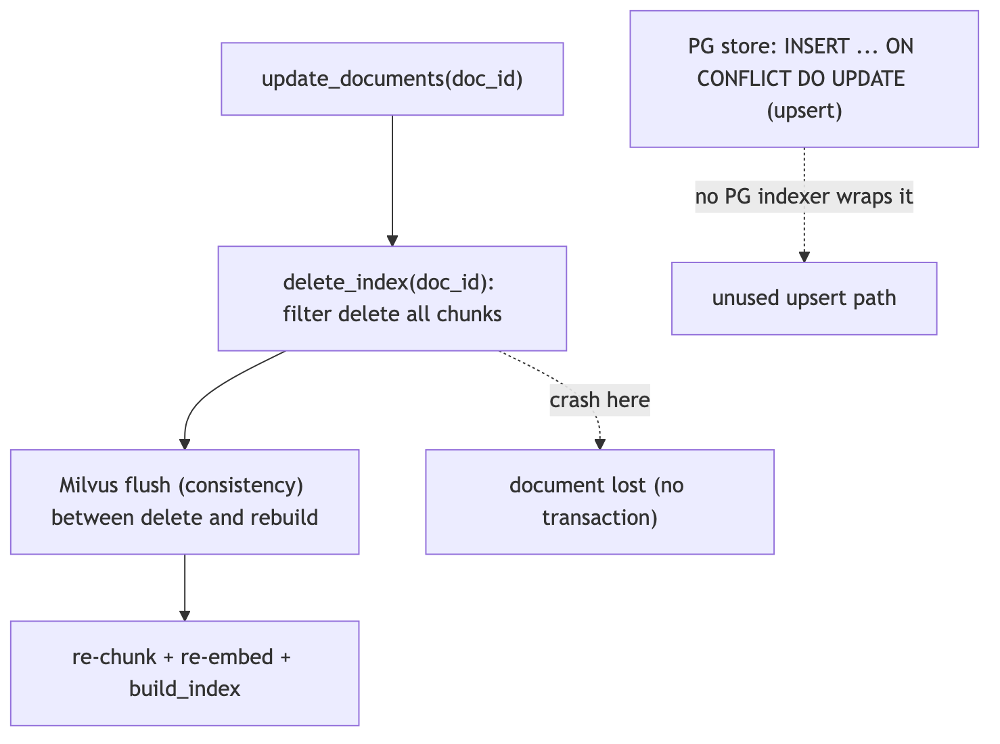

**In Jiuwen.** The contract is delete-by-document-id plus rebuild: the Chroma and Milvus indexers do not upsert — they find a document's chunk ids, delete them, then re-chunk, re-embed, and write, flushing Milvus in between. The document id is a first-class scalar-indexed field enabling filter deletes. Postgres is the only store with native upsert, but no indexer wraps it, and a crash between delete and rebuild loses the document.

<b>Under the hood</b>

**Implementation**

The contract is delete-by-`doc_id` + rebuild. Chroma/Milvus indexers do **not** upsert: they scan a doc's chunk IDs, delete them, then re-chunk/re-embed/write (Milvus flushes between to defeat eventual consistency). `doc_id` is a first-class field (`document_id`, scalar-inverted in Milvus) enabling filter deletes. PG is the only store with native upsert-by-primary-key (`INSERT ... ON CONFLICT (id) DO UPDATE`), but no PG indexer wraps it. There is no atomic/transactional replace — a crash between delete and rebuild loses the document, and chunk IDs are regenerated UUIDs each run so "same document" relies solely on `doc_id`.

**Code anchors**

| Code anchor | What it points to |
|---|---|
| `agent-core/openjiuwen/core/retrieval/knowledge_base.py:176/184` | abstract delete_documents / update_documents |
| `agent-core/openjiuwen/core/retrieval/simple_knowledge_base.py:192` | delete_documents; :219 update_documents |
| `agent-core/openjiuwen/core/retrieval/indexing/indexer/chroma_indexer.py:198` | update_index = delete + build; :217 delete by doc_id; :142 duplicate guard |
| `agent-core/openjiuwen/core/retrieval/indexing/indexer/milvus_indexer.py:209` | delete + flush + rebuild; :231 filter delete document_id == doc_id |
| `agent-core/openjiuwen/core/retrieval/vector_store/pg_store.py:300` | INSERT ... ON CONFLICT DO UPDATE |
| `agent-core/openjiuwen/core/retrieval/graph_knowledge_base.py:253` | delete chunk + triple index; :294 update = delete + re-add |

---

## 11. How would you design the system so users never get an answer based on stale, outdated information

Design advanced

**TL;DR.** Attach timestamps/versions, prefer recency in ranking (or hard-filter to a freshness window), tombstone superseded versions, surface recency to the generator, and propagate deletes promptly.

**Key points.**

- Timestamps/versions on documents.
- Recency preference or a freshness filter.
- Tombstone superseded versions; propagate deletes.
- Surface recency to the generator.

**Concept.** Attach timestamps/versions to documents, prefer recency in ranking (or hard-filter to a freshness window), tombstone superseded versions, and surface recency to the generator. Propagate deletes promptly from the source (event-driven) so the index matches source-of-truth, and reconcile periodically.

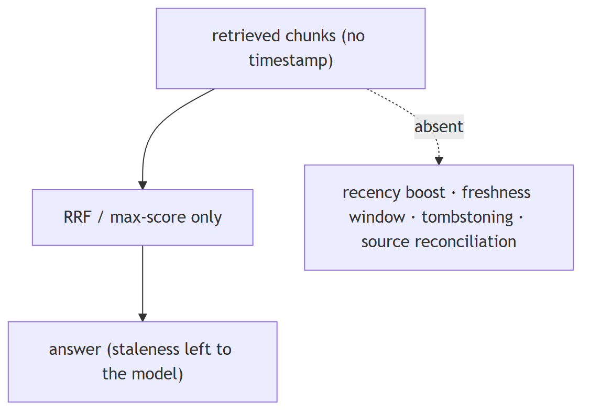

**In Jiuwen.** The retrieval layer has no notion of document time: results carry only text, score, and metadata, parsers set no timestamp, and ranking is score/rank only — no recency boost or outdated filter. Conflict handling is memory-write-only with newest-wins; there is no freshness mechanism in RAG, so staleness handling would have to be added.

<b>Under the hood</b>

**Implementation**

The retrieval layer has **no notion of document time**: `RetrievalResult`/`TextChunk` carry only text/score/metadata, parsers populate no timestamp, and ranking is score/rank only (RRF, max-score) — no recency boost or outdated filter. Conflict handling is memory-write-only (`MemUpdateChecker`, newest wins); a freshness/time-decay notion exists only for experience records.

**Code anchors**

| Code anchor | What it points to |
|---|---|
| `agent-core/openjiuwen/core/retrieval/common/retrieval_result.py:23` | no timestamp field; agent-core/openjiuwen/core/retrieval/common/document.py:30 — TextChunk |
| `agent-core/openjiuwen/core/retrieval/utils/fusion.py:39` | RRF by text/rank; agent-core/openjiuwen/core/retrieval/simple_knowledge_base.py:313 — max-score merge |
| `agent-core/openjiuwen/core/memory/manage/update/mem_update_checker.py:22/252` | memory-only conflict (newest wins) |
| `agent-core/openjiuwen/agent_evolving/experience/scorer.py:219` | calc_freshness (experiences only) |

---

## 12. How do you design for the case where retrieval returns zero relevant documents

Mechanism advanced

**TL;DR.** Detect it (score threshold or answerability) and abstain: return 'not enough information' or ask a clarifying question, rather than answering from noise; optionally fall back to sparse or a graph hop.

**Key points.**

- Detect: score threshold / answerability.
- Abstain or ask a clarifying question.
- Optional fallbacks: sparse, graph hop.

**Concept.** Detect it (score threshold or answerability) and abstain: return "I don't have enough information" or ask a clarifying question, rather than answering from noise. Optionally fall back to a broader retrieval (sparse), a knowledge-graph hop, or parametric knowledge with a caveat. Log zero-result queries — they signal coverage gaps.

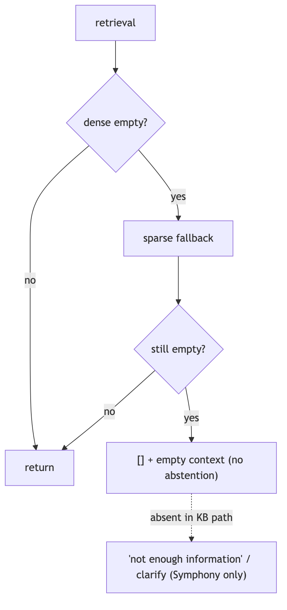

**In Jiuwen.** The knowledge-base path implements a dense-empty-to-sparse fallback but has no abstention: when both are empty it returns an empty list and the workflow component concatenates an empty context with no 'no answer' signal. Explicit abstention exists only in a separate retrieval subsystem, not in the KB RAG path.

<b>Under the hood</b>

**Implementation**

The KB path implements **dense-empty → sparse** fallback, but has **no abstention**: when both are empty it returns `[]` and the workflow component concatenates an empty context with no "no answer" signal. Explicit abstention (`is_abstain`, `abstain_no_backfill`) exists only in the separate Symphony progressive-retrieval engine, not in `core/retrieval` KB retrieval. `score_threshold` defaults to `None`.

**Code anchors**

| Code anchor | What it points to |
|---|---|
| `agent-core/openjiuwen/core/retrieval/retriever/vector_retriever.py:83` | dense-empty → sparse; agent-core/openjiuwen/core/retrieval/retriever/hybrid_retriever.py:97 — same |
| `agent-core/openjiuwen/core/workflow/components/resource/knowledge_retrieval_comp.py:241` | empty results → empty context |
| `agent-core/openjiuwen/core/retrieval/common/config.py:47` | score_threshold defaults None |
| `agent-core/openjiuwen/symphony/retrieval/search/runtime/selector.py:305` | is_abstain; agent-core/openjiuwen/symphony/retrieval/search/runtime/engine.py:94; agent-core/openjiuwen/symphony/retrieval/search/runtime/progressive.py:1060 — abstain_no_backfill |

---

## 13. Your system needs sub-500ms responses, walk me through where you'd spend that budget across retrieval, reranking, and generation

Mechanism advanced

**TL;DR.** Budget: embedding+vector search tens of ms, rerank tens–low-hundreds, generation the rest; stream tokens so TTFT is what the user feels. Cache and parallelize, and skip rerank when latency-bound.

**Key points.**

- Retrieval tens of ms; rerank tens–low-hundreds.
- Generation dominates — stream for TTFT.
- Cache embeddings/results; parallelize tools.
- Skip rerank when latency-bound.

**Concept.** Budget roughly: embedding + vector search tens of ms, rerank tens–low-hundreds of ms, generation the rest (and generation dominates when you stream, because TTFT is what the user perceives). To hit 500ms: stream tokens, cache embeddings/results, keep top-k small, rerank only when it pays, route to a fast model, and parallelize independent steps. Measure TTFT, not total.

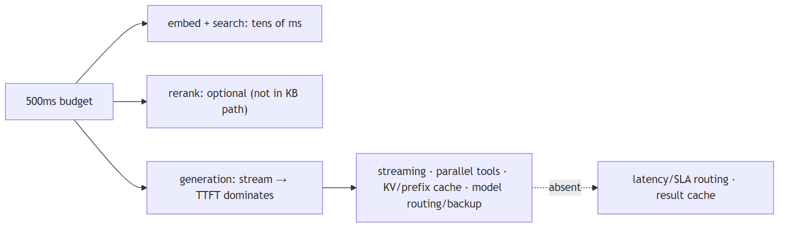

**In Jiuwen.** Jiuwen provides streaming with per-call TTFT, parallel tool execution with resource lanes, KV/prefix cache affinity, a model failover rail, and an endpoint router. Reranking is optional and absent from the default knowledge-base path, so the rerank budget line is effectively zero unless you enable it; query-result caching is not provided.

<b>Under the hood</b>

**Implementation**

Provides streaming (ReAct → session → WebSocket frames) with per-call `ttft_ms`, parallel tool execution with resource lanes, KV/prefix cache affinity, a model backup/failover rail, and IntelliRouter for deployment selection. Reranking is **optional and absent from the default KB path** (graph store only), so the rerank budget is not spent unless wired. There is no latency/SLA-based routing or result cache.

**Code anchors**

| Code anchor | What it points to |
|---|---|
| `agent-core/openjiuwen/core/single_agent/agents/react_agent.py:336` | parallel_tool_calls; :1758 ttft_ms; :2938 stream |
| `agent-core/openjiuwen/core/single_agent/ability_manager.py:431/467` | parallel batches + parallel_safe lanes |
| `agent-core/openjiuwen/core/single_agent/rail/model_backup.py:9` | ModelBackupRail.on_model_exception failover |
| `jiuwenswarm/jiuwenswarm/server/runtime/session/kv_cache/kv_cache_model_provider.py:80` | KV/prefix affinity |
| `agent-core/openjiuwen/core/retrieval/simple_knowledge_base.py:182` | KB path calls no reranker |

---
